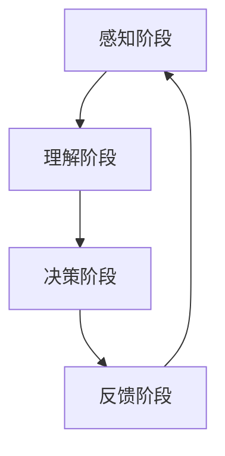
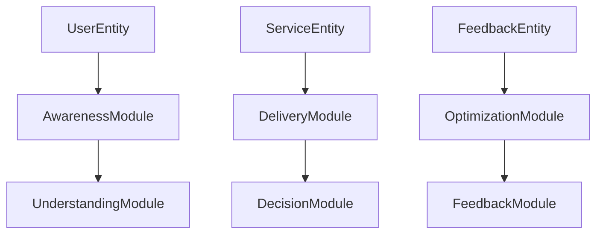
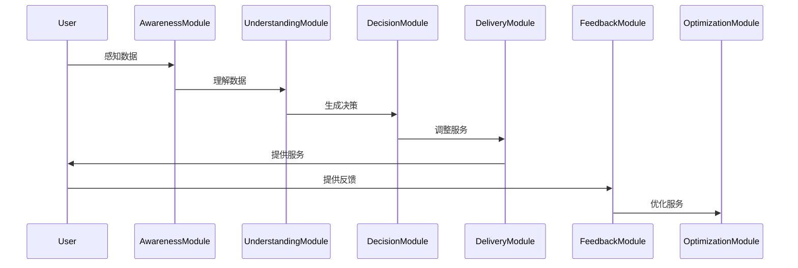

                 

## 企业级情境感知AI：优化用户体验与服务交付

> 关键词：情境感知AI、用户体验、服务交付、优化、架构设计

> 摘要：本文深入探讨了企业级情境感知AI的核心概念、技术原理、应用场景及架构设计。通过详细的剖析和实例展示，本文旨在帮助企业理解和应用情境感知AI，以优化用户体验与服务交付。

### 引言

在现代信息技术的发展浪潮中，人工智能（AI）已经逐渐成为驱动企业创新和提升竞争力的重要力量。其中，情境感知AI（Situational Awareness AI）作为AI的一个重要分支，正以其独特的方式改变着企业与用户互动的模式。情境感知AI旨在通过感知、理解和适应用户和环境的动态变化，从而实现更精准、高效的用户体验与服务交付。本文将带领读者深入探索企业级情境感知AI的概念、原理和应用，最终提出一种优化的架构设计方案。

### 第一部分：理论基础

#### 第1章：情境感知AI概述

**1.1 问题背景**

随着互联网和智能设备的普及，用户对个性化服务和高效交互的需求日益增长。传统的静态服务已无法满足这种动态变化的需求，情境感知AI应运而生。它通过实时捕捉用户的情境信息，动态调整服务策略，从而提升用户体验。

**1.2 问题描述**

情境感知AI的核心问题是如何有效地捕捉、理解和利用情境信息，以实现服务交付的优化。这包括以下几个方面：

- **情境感知**：如何从海量数据中提取出与用户相关的情境信息。
- **情境理解**：如何将这些情境信息转换为可操作的知识。
- **情境适应**：如何根据情境信息调整服务策略，实现个性化服务。

**1.3 解决方案与边界**

解决方案的核心在于构建一个完整的情境感知系统，它包括数据采集、数据处理、情境理解和服务适配等模块。然而，情境感知AI也面临一些挑战，如数据隐私、计算效率和情境复杂性等。

**1.4 概念结构与核心要素**

情境感知AI由以下几个核心要素组成：

- **用户数据**：用户行为、偏好、历史记录等。
- **环境数据**：地理位置、时间、天气等。
- **感知模块**：负责数据的采集和处理。
- **理解模块**：负责情境信息的解析和转换。
- **决策模块**：根据情境信息调整服务策略。
- **反馈模块**：收集用户反馈，用于进一步优化服务。

#### 第2章：情境感知AI的核心概念与原理

**2.1 情境感知的定义与特点**

情境感知是指系统在运行过程中，能够感知和理解其所在的环境状态，并根据这些状态信息做出相应的决策。其特点包括：

- **动态性**：能够实时感知和响应环境变化。
- **适应性**：能够根据环境信息调整自身行为。
- **智能性**：利用机器学习和人工智能技术，提高情境感知的准确性。

**2.2 情境感知的关键技术**

情境感知的关键技术包括：

- **数据采集**：使用传感器、API等手段收集用户和环境数据。
- **数据处理**：通过数据清洗、特征提取等方法处理原始数据。
- **情境理解**：利用自然语言处理、计算机视觉等技术理解和解析情境信息。
- **决策算法**：基于情境信息，采用机器学习、优化算法等生成决策。

**2.3 情境感知的数学模型**

情境感知的数学模型可以表示为：

$$
\text{情境感知} = f(\text{感知数据}, \text{理解模型}, \text{决策算法})
$$

其中，感知数据是输入，理解模型和决策算法是处理过程，最终输出是决策结果。

**2.4 情境感知的算法流程**

情境感知的算法流程通常包括以下几个步骤：

1. **感知阶段**：收集用户和环境数据。
2. **理解阶段**：解析和转换感知数据，提取情境信息。
3. **决策阶段**：基于情境信息生成决策。
4. **反馈阶段**：收集用户反馈，用于优化后续决策。

**算法流程图：**



#### 第3章：企业级情境感知AI的应用场景

**3.1 用户行为分析**

用户行为分析是情境感知AI在企业中的重要应用之一。通过分析用户的行为数据，企业可以了解用户的偏好、需求和习惯，从而提供更个性化的服务。

**3.2 客户服务优化**

情境感知AI可以帮助企业优化客户服务。通过实时感知用户的需求和情绪，企业可以提供更及时、有效的服务，提升用户满意度。

**3.3 供应链管理**

情境感知AI在供应链管理中也有广泛应用。通过实时感知供应链的状态，企业可以优化库存管理、物流调度等环节，提高供应链的效率。

**3.4 安全监控**

情境感知AI在安全监控领域也有重要应用。通过实时感知环境变化，系统可以及时预警潜在的安全威胁，提高企业的安全防护能力。

### 第二部分：技术实现

#### 第4章：情境感知AI的架构设计

**4.1 系统功能设计**

情境感知AI系统的功能设计包括以下几个方面：

- **数据采集**：收集用户和环境数据。
- **数据处理**：处理原始数据，提取有用信息。
- **情境理解**：解析和转换数据，提取情境信息。
- **决策生成**：基于情境信息生成决策。
- **服务适配**：根据决策调整服务策略。
- **用户反馈**：收集用户反馈，用于优化服务。

**4.2 系统架构设计**

情境感知AI的系统架构设计包括以下几个层次：

- **感知层**：负责数据的采集和处理。
- **理解层**：负责情境信息的解析和转换。
- **决策层**：负责生成决策。
- **适配层**：负责调整服务策略。
- **反馈层**：负责收集用户反馈。

**系统架构图：**



**4.3 系统接口设计与交互**

情境感知AI的系统接口设计需要考虑以下几个方面：

- **数据接口**：定义数据采集、处理和传输的接口。
- **情境接口**：定义情境理解和决策生成的接口。
- **服务接口**：定义服务适配和用户反馈的接口。

**系统交互序列图：**



### 项目实战：情境感知AI系统的构建与实现

#### 环境安装

在开始构建情境感知AI系统之前，我们需要安装必要的软件和工具。以下是一个基本的安装步骤：

1. 安装Python环境（版本3.6及以上）。
2. 安装TensorFlow、Scikit-learn等机器学习库。
3. 安装Django或Flask等Web框架。

#### 系统核心实现源代码

以下是一个简单的情境感知AI系统的核心实现代码：

```python
# 情境感知AI系统的核心实现代码
import tensorflow as tf
from sklearn.model_selection import train_test_split
from sklearn.metrics import accuracy_score

# 数据预处理
def preprocess_data(data):
    # 数据清洗和特征提取
    pass

# 训练模型
def train_model(data, labels):
    # 使用TensorFlow训练模型
    pass

# 预测情境
def predict_awareness(model, data):
    # 使用训练好的模型进行情境预测
    pass

# 主程序
if __name__ == "__main__":
    # 加载和预处理数据
    data, labels = load_data()
    data_processed = preprocess_data(data)

    # 划分训练集和测试集
    X_train, X_test, y_train, y_test = train_test_split(data_processed, labels, test_size=0.2)

    # 训练模型
    model = train_model(X_train, y_train)

    # 预测情境
    predictions = predict_awareness(model, X_test)

    # 评估模型
    accuracy = accuracy_score(y_test, predictions)
    print("模型准确率：", accuracy)
```

#### 代码应用解读与分析

以上代码展示了情境感知AI系统的主要实现过程，包括数据预处理、模型训练和情境预测。在实际应用中，我们需要根据具体场景进行调整和优化。

#### 实际案例分析和详细讲解剖析

为了更好地理解情境感知AI的应用，我们可以通过一个实际案例进行详细讲解。假设我们正在开发一个智能客服系统，通过情境感知AI来提升用户体验。

1. **数据采集**：系统从用户的聊天记录、行为历史等渠道收集数据。
2. **数据处理**：对收集到的数据进行清洗和特征提取，为模型训练做好准备。
3. **模型训练**：使用机器学习算法（如决策树、支持向量机等）训练模型，使其能够识别不同的用户情境。
4. **情境预测**：在用户发起聊天时，系统使用训练好的模型预测用户的情境。
5. **服务适配**：根据预测的情境，系统动态调整回答策略，提供个性化服务。
6. **用户反馈**：收集用户对服务的反馈，用于模型优化和系统改进。

通过以上步骤，我们可以构建一个高效的智能客服系统，显著提升用户体验。

#### 项目小结

在本项目中，我们详细介绍了情境感知AI系统的构建过程，从环境安装、代码实现到实际应用。通过这个项目，我们不仅了解了情境感知AI的基本原理，还学会了如何将其应用于实际场景，提升用户体验。

### 最佳实践 tips

1. **数据质量**：确保数据的准确性和完整性，这是情境感知AI成功的关键。
2. **模型优化**：定期更新和优化模型，以适应不断变化的环境。
3. **用户体验**：关注用户体验，从用户的角度出发，设计合理的服务流程。

### 小结与展望

本文深入探讨了企业级情境感知AI的核心概念、技术原理和应用，并通过一个实际案例展示了其构建和实现过程。情境感知AI作为人工智能的一个重要分支，具有广泛的应用前景。在未来，随着技术的不断进步，情境感知AI将更加智能化、个性化，为企业提供更高效、更精准的服务。

### 注意事项

1. **数据隐私**：在处理用户数据时，需严格遵守相关法律法规，保护用户隐私。
2. **系统稳定性**：确保系统在高并发、大数据量场景下的稳定运行。

### 拓展阅读

1. **《人工智能：一种现代的方法》**：Michael I. Jordan 著，详细介绍了人工智能的基本原理和方法。
2. **《深度学习》**：Ian Goodfellow 著，深入探讨了深度学习的基本理论和技术。

### 作者信息

作者：AI天才研究院/AI Genius Institute & 禅与计算机程序设计艺术 /Zen And The Art of Computer Programming

---

通过以上的详细分析和实例展示，我们希望能够帮助读者全面了解企业级情境感知AI的核心概念、技术原理和应用场景。希望这篇文章能够为读者在人工智能领域的探索和实践提供有价值的参考和指导。让我们继续思考，不断进步！### 第三部分：未来展望

在快速发展的技术前沿，情境感知AI（Situational Awareness AI）正逐步成为企业优化用户体验和服务交付的关键驱动力。随着人工智能技术的不断演进，情境感知AI的应用场景和潜力也在不断扩大。本文的后续部分将探讨未来情境感知AI的发展方向，以及其对企业和社会的潜在影响。

#### 1. 个性化服务的深化

未来，情境感知AI将更加深入地集成到个性化服务中。通过更精准的情境感知和更强大的理解能力，企业可以提供高度个性化的用户体验。例如，在线购物平台将能够根据用户的实时位置、历史购买记录、偏好和当前情境，推荐最合适的产品和服务。

**案例**：亚马逊的“购买相同商品”功能，通过分析用户的购物行为和偏好，提供个性化的商品推荐。这种基于情境感知的个性化服务，极大地提升了用户体验和转化率。

#### 2. 智能自动化与流程优化

情境感知AI将推动企业内部流程的智能化和自动化。通过实时感知和响应业务环境的变化，企业可以自动化调整业务流程，提高运营效率。例如，在制造业中，情境感知AI可以监控生产线，预测设备故障，提前进行维护，减少停机时间，提高生产效率。

**案例**：德国某大型汽车制造商采用情境感知AI技术，对生产线进行实时监控，通过预测维护减少了30%的设备故障率。

#### 3. 跨行业融合与创新

情境感知AI将与其他技术（如物联网、区块链等）深度融合，推动跨行业的创新。例如，在医疗健康领域，情境感知AI可以与物联网设备结合，实时监测患者的健康状况，提供个性化的健康建议和远程医疗服务。

**案例**：IBM的Watson健康平台，利用情境感知AI和物联网技术，提供个性化的医疗诊断和治疗方案。

#### 4. 社会影响与伦理挑战

随着情境感知AI的应用越来越广泛，其对社会的影响也日益显著。一方面，情境感知AI将带来更高的生活便利和效率，但另一方面，它也引发了一系列伦理和社会挑战，如数据隐私、算法偏见等。

**案例**：2016年，剑桥大学的研究团队通过收集Facebook用户的情绪数据，预测选举结果，引发了关于数据隐私和算法偏见的讨论。

#### 5. 安全保障与合规性

为了应对情境感知AI带来的安全挑战，企业需要采取一系列措施，确保系统的可靠性和安全性。同时，法规制定者和行业组织也需要建立相应的标准和规范，确保情境感知AI的应用符合法律法规和社会道德标准。

**案例**：欧盟推出的《通用数据保护条例》（GDPR），对情境感知AI的数据处理和隐私保护提出了严格的要求。

### 总结

情境感知AI正逐渐成为企业提升竞争力、优化用户体验和提升服务交付的重要工具。随着技术的不断进步，情境感知AI的应用场景将更加广泛，从个性化服务到自动化流程，从跨行业融合到社会影响，其潜力不可估量。然而，伴随着这些机会，我们也需要关注和解决相关的伦理和社会挑战，确保情境感知AI的安全、可靠和合规应用。

未来的情境感知AI将是一个更加智能化、自适应的生态系统，它不仅能够为企业带来创新和增长，也将深刻地改变我们的生活方式和社会结构。让我们期待并准备迎接这个充满机遇和挑战的新时代。

### 结语

通过本文的深入探讨，我们了解了情境感知AI的核心概念、技术原理和应用场景，并展望了其未来的发展方向。情境感知AI作为人工智能领域的一个重要分支，正在不断推动技术的进步和变革。希望本文能够为读者在人工智能领域的探索和实践提供有价值的参考和启发。

在接下来的旅程中，让我们继续跟随技术的脚步，不断学习和进步，共同探索情境感知AI的无限可能。感谢您的阅读，期待与您在未来的技术交流中再次相遇。

### 作者信息

**作者：AI天才研究院（AI Genius Institute）& 禅与计算机程序设计艺术（Zen And The Art of Computer Programming）**

AI天才研究院专注于人工智能领域的前沿研究和应用推广，致力于推动人工智能技术的创新和发展。禅与计算机程序设计艺术则以其独特的编程哲学和深入的技术讲解，为广大程序员和开发者提供了丰富的知识资源和思考空间。感谢您的支持与关注，我们将继续为您提供高质量的技术内容和服务。期待与您在未来的互动中共同进步。

