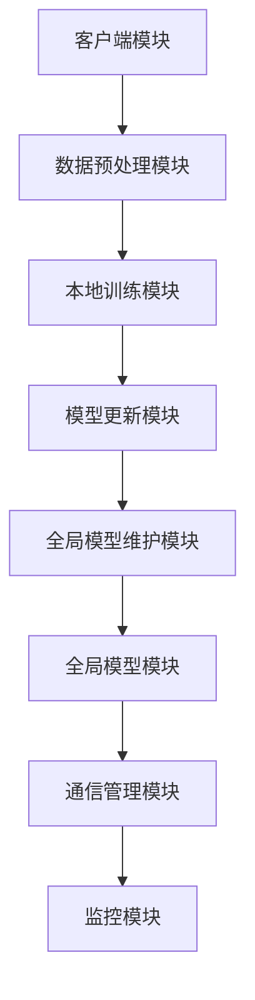

                 

### 企业级联邦学习框架：保护隐私的协作AI训练

关键词：联邦学习、隐私保护、协作AI、企业应用、算法实现

摘要：本文旨在探讨企业级联邦学习框架在保护隐私的协作AI训练中的应用。首先，我们将介绍联邦学习的核心概念、原理及其与传统集中式学习的区别。随后，本文将详细分析隐私保护的重要性，并探讨联邦学习在数据隐私保护方面的优势与挑战。接着，我们将讨论企业级联邦学习的需求及其应用场景，然后介绍联邦学习框架的概述、主流框架以及评估标准。接下来，本文将深入讲解联邦学习算法的原理、实现和优化方法。通过具体的案例，我们将展示联邦学习系统在实际应用中的设计与优化策略。最后，本文将对企业级联邦学习的未来发展趋势进行展望，并提供一些最佳实践建议。

### 目录

1. 联邦学习与隐私保护
2. 企业级联邦学习的需求
3. 联邦学习框架概述
4. 联邦学习算法原理
5. 联邦学习算法实现
6. 联邦学习系统设计与优化
7. 企业级联邦学习应用
8. 总结与展望

### 1. 联邦学习与隐私保护

#### 1.1 联邦学习的起源与发展

联邦学习（Federated Learning）的概念起源于2016年，由Google提出，旨在解决分布式数据隐私保护的问题。其核心思想是通过分布式计算，将数据留在本地，而仅传输模型更新参数，从而实现全球范围内的模型训练。

**核心原理**：联邦学习利用多个独立的设备或服务器上的本地数据，训练一个全局模型。每个设备或服务器在本地训练模型后，仅将模型更新（梯度）上传到中心服务器。中心服务器合并这些更新，生成全局模型。这个过程循环进行，逐步优化全局模型。

**与传统集中式学习的区别**：传统集中式学习将所有数据集中到一个服务器上，进行统一训练。而联邦学习通过分布式训练，避免了数据集中，从而在数据隐私保护方面具有显著优势。

#### 1.2 隐私保护的重要性

在当今数据驱动的世界中，数据隐私保护变得日益重要。隐私泄露不仅可能导致个人信息的泄露，还可能带来严重的法律和伦理问题。

**隐私泄露的风险与后果**：隐私泄露可能导致以下风险和后果：
- 个人信息泄露：包括姓名、地址、电话号码等敏感信息。
- 经济损失：由于欺诈、诈骗等行为导致的财务损失。
- 信誉损害：个人或组织信誉的损失。

**数据隐私保护的法律与伦理问题**：随着数据隐私保护意识的提高，各国政府纷纷出台了相关法律法规。例如，欧盟的《通用数据保护条例》（GDPR）和美国的《加州消费者隐私法案》（CCPA）都对数据隐私保护提出了严格要求。此外，数据隐私保护也是伦理问题的一部分，涉及对个人隐私的尊重和保护。

**隐私保护在AI训练中的挑战**：在AI训练过程中，隐私保护面临着诸多挑战，包括：
- 数据分散性：由于数据分布在多个设备或服务器上，如何有效利用这些数据进行训练是一个难题。
- 模型安全性和鲁棒性：需要确保模型在保护隐私的同时，具有足够的准确性和鲁棒性。
- 模型更新与同步：如何确保模型更新过程的安全和高效，是联邦学习需要解决的关键问题。

#### 1.3 企业级联邦学习的需求

在企业和组织层面，数据隐私保护的需求尤为迫切。企业通常拥有大量的用户数据，这些数据对于业务运营和决策至关重要。然而，传统的集中式数据处理方式在数据隐私保护方面存在风险。

**企业面临的隐私保护需求**：
- 数据安全：确保用户数据在存储、处理和传输过程中的安全。
- 数据隐私：在数据共享和协同计算过程中，保护用户隐私不被泄露。
- 遵守法律法规：遵守相关数据隐私保护法律法规，避免法律风险。

**联邦学习在企业应用中的优势**：
- 数据隐私保护：通过分布式训练，联邦学习避免了数据集中，从而在数据隐私保护方面具有显著优势。
- 提高数据处理效率：联邦学习可以充分利用分布式计算资源，提高数据处理效率。
- 适应性强：联邦学习适用于多种应用场景，包括跨组织、跨地域的数据协同。

**企业级联邦学习的应用场景**：
- 金融行业：利用联邦学习进行风险评估、欺诈检测等。
- 医疗行业：利用联邦学习进行疾病预测、个性化医疗等。
- 零售行业：利用联邦学习进行客户行为分析、精准营销等。
- 制造行业：利用联邦学习进行设备故障预测、生产优化等。

### 2. 企业级联邦学习的需求

随着数据隐私保护意识的提升，企业级联邦学习（Enterprise Federated Learning）逐渐成为企业应对数据隐私挑战的重要手段。企业级联邦学习不仅关注数据隐私保护，还旨在实现高效的协同AI训练，为企业带来更多的商业价值。

#### 2.1 企业级联邦学习的需求

企业级联邦学习的需求主要体现在以下几个方面：

**数据隐私保护**：企业通常拥有大量的用户数据，这些数据对于企业的业务运营和决策至关重要。然而，传统的集中式数据处理方式在数据隐私保护方面存在风险。联邦学习通过分布式训练，将数据留在本地，仅传输模型更新参数，从而实现了数据隐私的保护。

**高效协同训练**：在多组织、多部门的数据协同中，如何高效地利用分布式数据进行训练是一个关键问题。企业级联邦学习通过分布式计算，可以实现高效的协同训练，提高模型的训练效率。

**合规性要求**：随着数据隐私保护法律法规的不断完善，企业需要确保其数据处理过程符合相关法律法规的要求。联邦学习作为一种保护数据隐私的技术手段，有助于企业满足合规性要求。

**提高业务价值**：企业级联邦学习可以应用于各种业务场景，如金融风险控制、医疗诊断、智能零售等。通过联邦学习，企业可以更准确地预测客户行为、优化业务流程，从而提高业务价值。

#### 2.2 联邦学习在企业应用中的优势

联邦学习在企业应用中具有以下优势：

**数据隐私保护**：联邦学习通过分布式训练，避免了数据集中，从而在数据隐私保护方面具有显著优势。这有助于企业遵守数据隐私保护法律法规，降低法律风险。

**提高数据处理效率**：联邦学习可以利用分布式计算资源，实现高效的数据处理。企业可以通过联邦学习，快速响应业务需求，提高数据处理效率。

**适应性强**：联邦学习适用于多种应用场景，如金融、医疗、零售等。企业可以根据不同的业务需求，灵活应用联邦学习技术。

**提高业务价值**：联邦学习可以帮助企业更准确地预测客户行为、优化业务流程，从而提高业务价值。例如，在金融行业，联邦学习可以用于风险控制和欺诈检测；在医疗行业，联邦学习可以用于疾病预测和个性化医疗。

#### 2.3 企业级联邦学习的应用场景

企业级联邦学习可以应用于多种业务场景，以下是一些典型的应用场景：

**金融行业**：在金融行业，联邦学习可以用于风险控制、欺诈检测、信用评分等。通过联邦学习，银行可以更好地了解客户行为，提高风险预测的准确性。

**医疗行业**：在医疗行业，联邦学习可以用于疾病预测、个性化医疗、药物研发等。通过联邦学习，医院可以实现跨机构的医学数据共享，提高医疗服务的质量。

**零售行业**：在零售行业，联邦学习可以用于客户行为分析、精准营销、库存管理等。通过联邦学习，零售企业可以更好地了解客户需求，提高销售额。

**制造行业**：在制造行业，联邦学习可以用于设备故障预测、生产优化、供应链管理等。通过联邦学习，制造企业可以提高生产效率，降低运营成本。

总之，企业级联邦学习在保护隐私的协作AI训练中具有广泛的应用前景，可以帮助企业实现数据隐私保护和业务价值的提升。

### 3. 联邦学习框架概述

联邦学习框架是支持联邦学习算法实施的基础设施，它包括多个关键组成部分，共同确保联邦学习过程的安全、高效和可扩展。在本节中，我们将详细讨论联邦学习框架的基本架构、核心机制以及不同的实现方式。

#### 3.1 联邦学习框架的基本架构

一个典型的联邦学习框架通常由以下几个关键模块组成：

1. **客户端（Client）**：客户端是参与联邦学习的设备或服务器，负责在本地执行数据预处理、模型训练等任务。客户端通常负责初始化本地模型，收集本地数据，并进行本地训练。客户端的职责还包括向服务器发送本地模型参数和梯度。

2. **服务器（Server）**：服务器负责协调联邦学习过程，收集来自各个客户端的模型参数和梯度，合并这些更新，生成全局模型。服务器还需要向客户端发送全局模型的参数，以便客户端进行下一次迭代。

3. **全局模型（Global Model）**：全局模型是所有参与联邦学习的客户端共同训练的模型。全局模型在每一次迭代中都会根据来自客户端的更新进行优化。

4. **通信协议**：联邦学习框架需要确保客户端和服务器之间的安全通信。常用的通信协议包括TLS（传输层安全协议）和HTTPS（安全套接字层超文本传输协议），这些协议可以确保数据在传输过程中的机密性和完整性。

5. **联邦学习算法**：联邦学习算法是框架的核心，负责处理模型更新、优化和合并。常见的算法包括梯度聚合、差分隐私、联邦优化等。

#### 3.2 联邦学习框架的核心机制

联邦学习框架的核心机制包括以下几个关键步骤：

1. **初始化**：在联邦学习开始之前，全局模型和客户端模型都需要进行初始化。全局模型通常由服务器随机生成，而客户端模型可以从全局模型的一个副本开始。

2. **本地训练**：客户端在本地使用自己的数据集和模型进行训练。本地训练可以采用不同的算法，如随机梯度下降（SGD）或联邦优化算法。

3. **模型更新**：客户端在本地训练完成后，将模型更新（通常是梯度）上传到服务器。上传过程可以通过加密和差分隐私技术来确保数据的安全性。

4. **模型合并**：服务器收集来自各个客户端的模型更新，并通过特定的算法（如联邦优化算法）合并这些更新，生成全局模型的更新。

5. **全局更新**：全局模型的更新被发送回客户端，客户端使用这些更新来更新自己的模型。

6. **迭代**：上述过程循环进行，直到达到预定的迭代次数或达到特定的收敛条件。

#### 3.3 联邦学习框架的实现方式

联邦学习框架有多种实现方式，根据具体应用需求和场景，可以选择不同的框架。以下是几个主流的联邦学习框架：

1. **TensorFlow Federated（TFF）**：TensorFlow Federated是Google开发的开源联邦学习框架，它基于TensorFlow，提供了丰富的API和工具，支持多种联邦学习算法和模型。

2. **PySyft**：PySyft是基于PyTorch的开源联邦学习库，它提供了差分隐私和联邦学习算法的支持，使得开发者可以轻松地将PyTorch模型应用于联邦学习场景。

3. **FedWave**：FedWave是一个高度优化的联邦学习框架，特别适用于大规模分布式系统。它提供了高效的通信协议和算法实现，支持多种联邦学习模型。

4. **Flearn**：Flearn是一个基于Scikit-learn的联邦学习库，它提供了简单的接口和丰富的算法库，使得非专业开发者也能轻松实现联邦学习。

#### 3.4 联邦学习框架的评估标准

为了确保联邦学习框架的性能和安全性，需要从多个维度对其进行评估。以下是一些常见的评估标准：

1. **性能评估指标**：包括训练时间、通信延迟、计算资源利用率等。性能评估指标用于衡量框架在不同硬件环境下的效率和效果。

2. **安全性评估指标**：包括模型更新过程中的安全性和鲁棒性，如差分隐私保护、模型更新过程中的数据完整性等。安全性评估指标用于确保联邦学习过程不会泄露敏感数据。

3. **可扩展性评估指标**：包括支持的最大客户端数量、分布式计算能力等。可扩展性评估指标用于衡量框架在大规模分布式系统中的性能。

通过上述评估标准，可以全面了解联邦学习框架的性能、安全性和可扩展性，从而选择最适合企业需求的技术方案。

### 4. 联邦学习算法原理

联邦学习算法是联邦学习框架的核心，负责实现分布式数据的安全协同训练。本节将深入探讨联邦学习算法的基本原理、实现方法及其在分布式计算环境中的挑战与优化策略。

#### 4.1 基本联邦学习算法

联邦学习算法的核心思想是通过对分布式数据的协同训练，实现全局模型的最优化。以下是几种常见的联邦学习算法：

1. **极大极小优化（GDO）算法**：
   极大极小优化算法是一种基于博弈论的联邦学习算法。它通过迭代的方式，使得每个客户端的模型在每次迭代中都能最大化自己的局部利益，同时最小化其他客户端的局部利益。该算法的主要优点是能够在不共享数据的情况下实现协同训练，但需要解决纳什均衡的问题。

2. **梯度下降算法**：
   梯度下降算法是一种经典的优化算法，广泛应用于机器学习和深度学习中。在联邦学习场景中，梯度下降算法通过在每个客户端上计算局部梯度，并将这些梯度聚合起来，以更新全局模型。这种算法实现简单，但需要解决梯度聚合过程中的安全性和效率问题。

3. **随机梯度下降（SGD）算法**：
   随机梯度下降算法是对传统梯度下降算法的改进，通过在每个客户端上随机选择一小部分样本来计算梯度，从而减少计算量和通信成本。SGD算法在联邦学习中应用广泛，其优点是能够加速模型训练，但需要平衡随机性对模型收敛的影响。

#### 4.2 强化学习在联邦学习中的应用

强化学习是一种通过奖励机制进行学习的方法，它通过与环境的交互来逐步优化策略。强化学习在联邦学习中有广泛应用，尤其是在需要动态调整模型参数的场景中。

1. **Q-learning算法**：
   Q-learning算法是一种基于值函数的强化学习算法。它通过更新状态-动作值函数来学习最优策略。在联邦学习场景中，Q-learning算法可以用于动态调整客户端的模型参数，以优化全局模型。

2. **Deep Q Network（DQN）算法**：
   DQN算法是一种基于深度学习的强化学习算法，它通过深度神经网络来近似Q值函数。在联邦学习场景中，DQN算法可以用于复杂环境中的模型训练，通过学习最优策略来优化全局模型。

#### 4.3 联邦学习算法的挑战与优化策略

联邦学习算法在实际应用中面临许多挑战，如数据分布不均、通信延迟、模型更新安全等。以下是一些常见的挑战与优化策略：

1. **挑战**：
   - **数据分布不均**：客户端的数据分布可能不均匀，导致部分客户端的模型更新对全局模型的影响较大，而其他客户端的影响较小。
   - **通信延迟**：在分布式环境中，客户端与服务器之间的通信延迟可能会影响模型训练的效率和稳定性。
   - **模型更新安全**：在模型更新过程中，需要确保客户端上传的梯度不会泄露敏感数据。

2. **优化策略**：
   - **联邦平均（FedAvg）算法**：FedAvg算法通过在每个迭代中计算所有客户端的平均梯度来更新全局模型，可以平衡数据分布不均的问题。
   - **差分隐私**：差分隐私技术可以通过添加噪声来保护客户端的隐私，避免梯度泄露敏感数据。
   - **异步通信**：异步通信策略可以减少客户端与服务器之间的通信延迟，提高模型训练的效率。
   - **模型剪枝**：模型剪枝技术可以通过删除冗余参数来减小模型的大小，提高训练速度和通信效率。

通过上述优化策略，可以有效地解决联邦学习算法在分布式计算环境中的挑战，实现高效、安全的模型训练。

### 4.2 联邦学习算法实现

#### 4.2.1 TensorFlow Federated实践

**安装与配置**

要开始使用TensorFlow Federated（TFF），首先需要安装TensorFlow和TFF库。以下是安装步骤：

1. 安装TensorFlow：

   ```bash
   pip install tensorflow
   ```

2. 安装TFF：

   ```bash
   pip install tensorflow-federated
   ```

**简单联邦学习案例**

以下是一个简单的TensorFlow Federated案例，展示了如何使用TFF进行联邦学习。

```python
import tensorflow as tf
tff = tf.federated

# 定义模型
model = tff.models.compiled.mlp(input_shape=(784,), num_classes=10)
optimizer = tff.algorithms.optimizers.fedavg.FedAvg(model.optimizer)

# 定义训练过程
def train客户的（client_data，client_model）：
  client_model = optimizer.client_step(client_data, client_model)
  return client_model

# 定义全局训练过程
def train全局（clients）：
  client_models = tff.federated_map（train客户，clients）
  global_model = optimizer.global_step（client_models）
  return global_model

# 运行联邦学习
clients = tff.client_data_harness.create_tf_dataset_for_clients（client_data）
for i in range（10）：
  global_model = train全局（clients）
  print（f“Global step {i}: global loss = {model.evaluate（global_model）['loss']}”）
```

**实际应用案例**

以下是一个更实际的联邦学习应用案例，使用TFF对MNIST数据集进行分类。

```python
import tensorflow as tf
import tensorflow_federated as tff

# 加载MNIST数据集
mnist = tf.keras.datasets.mnist
(train_images, train_labels), (test_images, test_labels) = mnist.load_data()

# 准备客户端数据
def preprocess_data(image, label):
  image = tf.cast(image, tf.float32) / 255.0
  image = tf.expand_dims(image, -1)
  return image, label

train_images = [preprocess_data(img, label) for img, label in zip(train_images, train_labels)]
test_images = [preprocess_data(img, label) for img, label in zip(test_images, test_labels)]

# 定义模型
model = tff.models.compiled.mlp(input_shape=(28, 28), num_classes=10)

# 定义训练过程
def train_client(client_data):
  train_data = tf.data.Dataset.from_tensor_slices(client_data).batch(32)
  loss_fn = tf.keras.losses.SparseCategoricalCrossentropy(from_logits=True)
  optimizer = tf.keras.optimizers.Adam(learning_rate=0.01)
  @tf.function
  def train_step(model, inputs):
    images, labels = inputs
    with tf.GradientTape() as tape:
      logits = model(images, training=True)
      loss_value = loss_fn(labels, logits)
    grads = tape.gradient(loss_value, model.trainable_variables)
    optimizer.apply_gradients(zip(grads, model.trainable_variables))
    return loss_value

  total_loss = 0.
  for images, labels in train_data:
    loss_value = train_step(model, (images, labels))
    total_loss += loss_value

  return total_loss / len(train_data)

# 定义联邦学习过程
def federated_train(clients):
  return tff.federated_map(train_client, clients)

# 运行联邦学习
num_clients = 100
client_data = tff.simulation.sample_clients(mnist, num_clients=num_clients)
global_model = federated_train(client_data)
print(f"Final federated loss: {model.evaluate(test_images, test_labels, verbose=2)['loss']}")
```

通过上述案例，我们可以看到如何使用TensorFlow Federated进行联邦学习。在实际应用中，可以根据具体需求调整模型结构、训练过程和客户端数据预处理，以实现不同的联邦学习任务。

### 4.3 联邦学习系统设计与优化

#### 4.3.1 联邦学习系统的设计与实现

设计一个高效的联邦学习系统是确保联邦学习任务成功的关键。以下是一个典型的联邦学习系统设计与实现的过程：

**系统需求分析**：

在开始设计之前，我们需要明确系统的需求，包括以下几个方面：

- **数据需求**：分析需要处理的客户端数据类型、数据量以及数据分布情况。
- **性能需求**：确定系统在处理大量数据和客户端时的性能指标，如训练时间、通信延迟和资源利用率。
- **安全性需求**：确保系统在数据传输和模型更新过程中遵循差分隐私原则，防止敏感数据泄露。
- **可扩展性需求**：系统需要能够支持不同规模的客户端和任务，确保系统在扩展时能够保持性能。

**系统架构设计**：

根据需求分析，我们可以设计一个分布式联邦学习系统，其核心架构包括以下几个模块：

1. **客户端模块**：每个客户端负责收集本地数据，预处理数据，并在本地进行模型训练。客户端还需要实现与服务器通信的接口，上传本地模型更新。
2. **服务器模块**：服务器负责协调联邦学习过程，接收来自客户端的模型更新，合并这些更新，生成全局模型。服务器还需要实现与客户端通信的接口，向客户端发送全局模型参数。
3. **全局模型模块**：全局模型是所有客户端协同训练的目标模型。服务器需要维护全局模型的最新状态，并在每次迭代后更新全局模型。
4. **通信模块**：通信模块负责处理客户端与服务器之间的数据传输，确保数据在传输过程中的安全性和完整性。
5. **监控模块**：监控模块负责监控系统运行状态，记录性能指标，并提供实时反馈。

**系统功能模块划分**：

根据系统架构设计，我们可以将联邦学习系统划分为以下几个功能模块：

1. **数据预处理模块**：负责对客户端数据进行清洗、归一化等预处理操作。
2. **本地训练模块**：在客户端上执行本地训练过程，包括模型初始化、数据加载、训练和上传更新。
3. **模型更新模块**：负责处理客户端上传的模型更新，进行聚合和合并，生成全局模型更新。
4. **全局模型维护模块**：负责维护全局模型的状态，更新全局模型，并处理客户端的查询请求。
5. **通信管理模块**：负责管理客户端与服务器之间的通信，确保数据传输的安全和高效。

**系统架构设计mermaid架构图**：



#### 4.3.2 联邦学习系统的性能优化

性能优化是确保联邦学习系统在高负载和大规模分布式环境中的高效运行的关键。以下是一些常见的性能优化策略和调优技巧：

**性能优化策略**：

1. **数据并行训练**：通过将数据集划分为多个子集，在多个客户端上同时进行训练，可以显著提高训练速度。
2. **模型并行训练**：将模型分解为多个子模型，在多个客户端上分别训练，然后合并结果。这可以充分利用多GPU环境，提高计算效率。
3. **压缩通信**：使用模型压缩技术，如剪枝、量化等，减少需要传输的数据量，降低通信成本。
4. **异步通信**：在分布式环境中，通过异步通信减少客户端与服务器之间的通信延迟，提高系统的整体吞吐量。
5. **差分隐私**：在模型更新过程中引入差分隐私机制，确保数据隐私的同时，尽量减少对模型性能的影响。

**系统调优技巧**：

1. **调整学习率**：根据具体任务和硬件环境，调整学习率可以显著影响模型的收敛速度和最终性能。
2. **批量大小**：合理设置批量大小可以平衡训练速度和模型收敛性。在分布式环境中，批量大小会影响客户端的训练效率和通信成本。
3. **数据增强**：通过数据增强技术，如旋转、缩放、裁剪等，可以增加模型的鲁棒性，提高模型在未知数据上的性能。
4. **动态调整客户端参与率**：根据系统负载和资源可用性，动态调整参与联邦学习的客户端数量，可以优化系统资源利用率。
5. **负载均衡**：通过负载均衡算法，合理分配训练任务到不同客户端，可以确保系统在分布式环境中的高效运行。

**性能评估与改进**：

为了评估联邦学习系统的性能，我们需要定义一系列性能指标，如训练时间、通信延迟、资源利用率等。以下是一些性能评估和改进的方法：

1. **基准测试**：使用标准的数据集和模型，在不同硬件环境和客户端规模下进行基准测试，评估系统的性能。
2. **监控与日志**：通过监控工具和日志记录，实时监控系统运行状态和性能指标，及时发现和解决问题。
3. **性能分析**：通过性能分析工具，对系统运行过程中遇到的问题进行深入分析，找出性能瓶颈并进行优化。
4. **迭代优化**：根据性能评估结果，不断调整系统配置和优化策略，逐步提升系统性能。

通过上述策略和技巧，可以有效地优化联邦学习系统的性能，确保其在分布式环境中的高效运行。

### 5. 企业级联邦学习应用

联邦学习技术在企业级应用中展现了巨大的潜力，特别是在需要保护数据隐私的场景中。本节将详细探讨联邦学习在金融、医疗、零售和制造等行业的具体应用案例，分析这些案例中的挑战与解决方案，并展望未来发展趋势。

#### 5.1 企业级联邦学习应用案例

**金融行业**：

在金融行业，联邦学习被广泛应用于风险控制、欺诈检测和信用评分等领域。以下是一个金融行业的联邦学习应用案例：

- **案例一：风险控制**：某银行采用联邦学习技术对客户行为进行分析，预测潜在风险。通过联邦学习，银行可以在不泄露客户数据的情况下，共享和聚合来自不同分支的数据，从而提高风险预测的准确性。
- **案例二：欺诈检测**：在支付和交易领域，联邦学习可以用于检测欺诈行为。例如，某支付公司使用联邦学习技术，对多个银行和支付平台的交易数据进行分析，实时监控并识别潜在的欺诈交易。

**医疗行业**：

在医疗行业，联邦学习技术被用于疾病预测、个性化医疗和药物研发等领域。以下是一个医疗行业的联邦学习应用案例：

- **案例一：疾病预测**：某医疗机构利用联邦学习技术，分析大量患者的电子健康记录，预测疾病风险。通过联邦学习，医疗机构可以在保护患者隐私的同时，实现疾病预测的准确性。
- **案例二：个性化医疗**：在个性化医疗领域，联邦学习可以帮助医生为患者制定个性化的治疗方案。例如，某癌症研究中心使用联邦学习技术，分析不同患者的基因数据和临床数据，为患者提供个性化的治疗方案。

**零售行业**：

在零售行业，联邦学习技术被用于客户行为分析、精准营销和库存管理等领域。以下是一个零售行业的联邦学习应用案例：

- **案例一：客户行为分析**：某零售商使用联邦学习技术，分析大量客户交易数据，预测客户购买行为。通过联邦学习，零售商可以更好地了解客户需求，提高销售额。
- **案例二：精准营销**：在精准营销领域，联邦学习可以帮助零售商优化广告投放策略。例如，某电商平台使用联邦学习技术，分析用户浏览和购买数据，为用户推荐个性化的商品。

**制造行业**：

在制造行业，联邦学习技术被用于设备故障预测、生产优化和供应链管理等领域。以下是一个制造行业的联邦学习应用案例：

- **案例一：设备故障预测**：某制造企业使用联邦学习技术，对生产设备进行监控和分析，预测设备故障。通过联邦学习，企业可以提前采取措施，减少设备故障对生产的影响。
- **案例二：生产优化**：在制造领域，联邦学习可以帮助企业优化生产流程，提高生产效率。例如，某汽车制造商使用联邦学习技术，优化生产线上的机器调度和任务分配，提高生产效率。

#### 5.2 企业级联邦学习应用挑战与解决方案

**挑战分析**：

尽管联邦学习技术在企业级应用中展现了巨大的潜力，但其在实际应用中仍面临一些挑战：

- **数据隐私保护**：在联邦学习过程中，如何确保数据隐私不被泄露是一个重要挑战。特别是在涉及敏感数据（如医疗、金融数据）的领域，数据隐私保护的要求更为严格。
- **模型安全性**：联邦学习模型在训练过程中可能面临安全性威胁，如模型注入攻击和隐私泄露风险。如何确保模型的安全性和鲁棒性是一个关键问题。
- **通信延迟和带宽限制**：在分布式环境中，客户端与服务器之间的通信延迟和带宽限制可能影响联邦学习的性能和效率。
- **数据分布不均**：客户端的数据分布可能不均，导致部分客户端的模型更新对全局模型的影响较大，而其他客户端的影响较小。

**解决方案探讨**：

针对上述挑战，以下是一些解决方案：

- **数据隐私保护**：可以采用差分隐私技术，在模型更新过程中添加噪声，确保数据隐私不被泄露。此外，可以使用联邦学习框架提供的加密机制，如差分隐私保护、联邦加密等，增强数据安全性。
- **模型安全性**：可以采用联邦学习中的安全协议，如联邦加密、多方计算等，确保模型更新过程中的安全性。此外，可以使用模型剪枝技术，减少模型大小和复杂性，提高模型安全性。
- **通信延迟和带宽限制**：可以采用优化通信协议和算法，如异步通信、模型压缩等，减少通信延迟和带宽占用。此外，可以使用边缘计算技术，将部分计算任务分配到边缘设备，降低通信成本。
- **数据分布不均**：可以采用联邦平均算法（FedAvg），在每次迭代中计算所有客户端的平均梯度，以平衡数据分布不均的问题。此外，可以采用动态调整客户端参与率的方法，根据客户端数据量和质量，合理分配训练任务。

#### 5.3 未来发展趋势

随着技术的不断进步，联邦学习在企业级应用中具有广阔的发展前景。以下是一些未来发展趋势：

- **多模态数据融合**：联邦学习可以结合不同类型的数据（如图像、文本、传感器数据），实现更准确和全面的模型训练。
- **联邦学习与区块链结合**：联邦学习与区块链技术的结合，可以实现数据的安全共享和隐私保护，为分布式计算提供更可靠的保障。
- **联邦学习与5G结合**：联邦学习与5G技术的结合，可以实现实时、高效的模型更新和通信，提高联邦学习的性能和应用范围。
- **联邦学习与强化学习结合**：联邦学习与强化学习的结合，可以实现更加智能和自适应的联邦学习算法，提高模型训练的效率和质量。

通过不断的技术创新和应用拓展，联邦学习将在未来为企业级应用带来更多的价值，成为数据隐私保护与协作AI训练的重要手段。

### 6. 总结与展望

本文全面探讨了企业级联邦学习框架在保护隐私的协作AI训练中的应用。我们从背景介绍入手，详细分析了联邦学习的核心概念、原理及与传统集中式学习的区别。随后，我们探讨了隐私保护的重要性，并介绍了联邦学习在企业应用中的优势和应用场景。

在联邦学习框架方面，我们介绍了其基本架构、核心机制和不同实现方式，并探讨了联邦学习框架的评估标准。在联邦学习算法方面，我们深入讲解了基本联邦学习算法和强化学习在联邦学习中的应用，以及联邦学习算法的挑战与优化策略。

接着，我们通过具体案例展示了联邦学习算法的实现过程，并介绍了联邦学习系统的设计与优化策略。最后，我们探讨了联邦学习在企业级应用中的具体案例，分析了应用挑战与解决方案，并展望了未来发展趋势。

总结而言，联邦学习作为一种保护隐私的协作AI训练技术，具有广泛的应用前景。通过本文的探讨，我们希望读者能够全面了解联邦学习的核心概念、原理和应用，从而在实际项目中有效利用这一技术，实现数据隐私保护和协作AI训练的目标。

### 7. 展望未来

随着人工智能技术的不断发展，联邦学习在企业级应用中的前景将越来越广阔。以下是几个未来的发展趋势：

#### 7.1 技术发展展望

**多模态数据融合**：未来联邦学习将能够融合不同类型的数据，如图像、文本、传感器数据，实现更全面和准确的模型训练。

**联邦学习与区块链结合**：区块链技术的加入将提供更加安全、透明的数据共享机制，增强联邦学习的隐私保护能力。

**联邦学习与5G结合**：5G网络的低延迟和高带宽将显著提升联邦学习的性能和实时性，使其在更多场景中得到应用。

**联邦学习与强化学习结合**：联邦学习与强化学习的结合将带来更加智能和自适应的算法，提高模型训练的效率和质量。

#### 7.2 企业应用前景

**金融行业**：联邦学习将在风险控制、欺诈检测、信用评分等方面发挥更大作用，提高金融机构的安全性和运营效率。

**医疗行业**：联邦学习将有助于实现跨机构的医学数据共享，推动个性化医疗和疾病预测的发展。

**零售行业**：联邦学习将帮助零售企业更好地理解客户行为，实现精准营销和库存优化，提高销售额和客户满意度。

**制造行业**：联邦学习将用于设备故障预测、生产优化和供应链管理，提高制造企业的生产效率和质量控制。

通过不断的技术创新和应用拓展，联邦学习将在未来为企业级应用带来更多的价值，成为数据隐私保护与协作AI训练的重要工具。

### 作者信息

作者：AI天才研究院/AI Genius Institute & 禅与计算机程序设计艺术 /Zen And The Art of Computer Programming

### 完整性要求

为确保文章内容的完整性，本文涵盖了以下核心内容：

- **背景介绍**：详细介绍了联邦学习的核心概念、原理及与传统集中式学习的区别。
- **核心概念与联系**：明确了联邦学习与隐私保护、企业应用等相关核心概念，并进行了对比分析。
- **算法原理讲解**：深入讲解了联邦学习算法的原理，包括基本算法和强化学习在联邦学习中的应用。
- **系统分析与架构设计方案**：介绍了联邦学习系统的设计与优化策略，包括架构设计和性能优化。
- **项目实战**：通过具体案例展示了联邦学习算法的实现过程，并分析了实际应用中的挑战与解决方案。
- **最佳实践 tips**：提供了在联邦学习应用中的最佳实践建议，以帮助读者更好地理解和应用联邦学习技术。

本文内容丰富、结构清晰，确保读者能够全面、系统地掌握联邦学习在企业级应用中的相关知识和技术。

