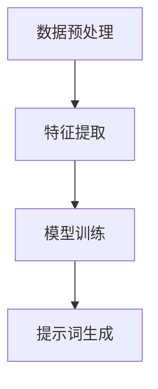
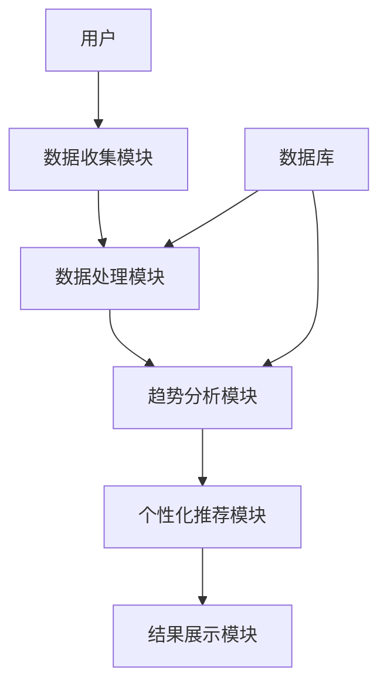
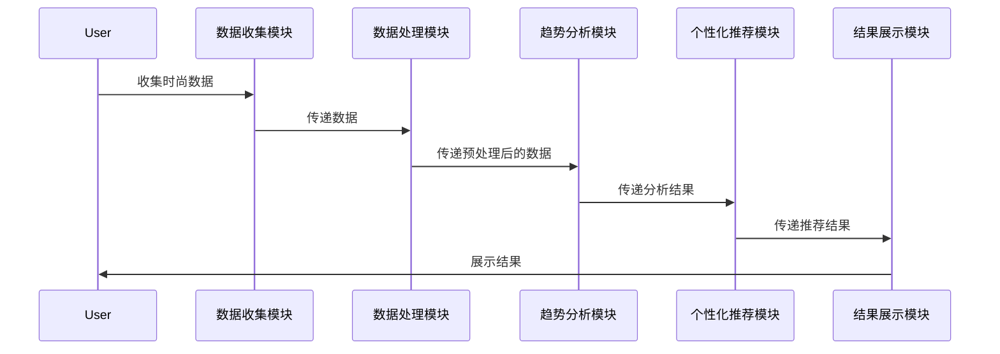

                 


## 第1章：问题背景与概述

### 1.1 问题背景

在当今全球化的时尚行业中，时尚趋势的分析和预测成为了一个重要的研究领域。随着人工智能技术的不断发展，AI虚拟时尚买手逐渐成为了一种新兴的解决方案。AI虚拟时尚买手通过分析大量的时尚数据，可以准确地预测未来的时尚趋势，为设计师、品牌和零售商提供宝贵的决策依据。

然而，全球时尚趋势分析面临着诸多挑战。首先，时尚数据来源广泛且形式多样，包括社交媒体、电商、时尚杂志等多种数据源。这些数据的处理和分析需要高效的算法和强大的计算能力。其次，时尚趋势的变化速度非常快，如何快速、准确地捕捉和预测趋势成为了一个重要的课题。

在这个背景下，提示词策略成为了一个重要的研究方向。提示词策略可以通过引入关键词、标签等手段，提高数据分析和趋势预测的准确性和效率。通过优化AI虚拟时尚买手，使用合适的提示词策略，可以更好地应对全球时尚趋势分析的挑战。

### 1.2 问题描述

优化AI虚拟时尚买手的目标是提高其分析全球时尚趋势的能力，使其能够更快、更准确地预测未来时尚趋势。为了实现这一目标，需要解决以下几个问题：

1. **需求分析**：了解AI虚拟时尚买手当前的功能和性能，分析其不足之处，明确优化需求。
2. **挑战识别**：识别全球时尚趋势分析过程中面临的挑战，如数据源多样性、趋势变化速度等。
3. **提示词策略**：研究并设计合适的提示词策略，以提高数据分析的准确性和效率。
4. **算法改进**：优化现有算法，结合提示词策略，提高AI虚拟时尚买手的性能。

### 1.3 问题解决

为了优化AI虚拟时尚买手，需要从以下几个方面进行思考和改进：

1. **核心概念与联系**：明确AI虚拟时尚买手、全球时尚趋势分析和提示词策略等核心概念，并分析它们之间的联系。
2. **边界与外延**：确定AI虚拟时尚买手的边界和适用范围，明确其在全球时尚趋势分析中的作用。
3. **概念结构与核心要素组成**：分析AI虚拟时尚买手的结构，确定其核心要素，为后续的优化提供基础。

通过上述步骤，可以逐步优化AI虚拟时尚买手，提高其分析全球时尚趋势的能力。

### 1.4 本章小结

本章主要介绍了优化AI虚拟时尚买手：全球时尚趋势分析的提示词策略的研究背景、问题和解决方案。通过明确核心概念、识别问题和设计优化方案，为后续章节的深入讨论奠定了基础。在接下来的章节中，我们将进一步探讨AI虚拟时尚买手、全球时尚趋势分析和提示词策略的详细内容。

---

## 第2章：核心概念与联系

### 2.1 AI虚拟时尚买手的定义与功能

#### 2.1.1 AI虚拟时尚买手的定义

AI虚拟时尚买手是指利用人工智能技术，模拟真实买手的行为和决策过程，对时尚市场进行数据分析和趋势预测的智能系统。它通过对大量时尚数据的学习和处理，可以识别出潜在的趋势，为时尚产业提供决策支持。

#### 2.1.2 AI虚拟时尚买手的功能特点

1. **数据收集与处理**：AI虚拟时尚买手可以自动收集来自多种数据源的时尚信息，如社交媒体、电商网站、时尚杂志等，并对这些数据进行分析和整理。
2. **趋势预测**：通过分析历史数据和当前市场状况，AI虚拟时尚买手可以预测未来可能出现的时尚趋势。
3. **个性化推荐**：基于用户的行为数据和偏好，AI虚拟时尚买手可以为用户提供个性化的时尚推荐，提高用户满意度。
4. **决策支持**：AI虚拟时尚买手可以为设计师、品牌和零售商提供有价值的决策建议，帮助他们更好地应对市场变化。

### 2.2 全球时尚趋势分析

#### 2.2.1 全球时尚趋势分析的定义

全球时尚趋势分析是指通过收集、处理和分析全球范围内的时尚数据，识别和预测未来的时尚趋势。它是一个跨学科的研究领域，涉及统计学、计算机科学、市场营销等多个领域。

#### 2.2.2 全球时尚趋势分析的重要性

1. **市场洞察**：全球时尚趋势分析可以帮助企业了解市场需求和消费者偏好，为企业制定营销策略提供支持。
2. **产品开发**：通过预测未来时尚趋势，企业可以提前进行产品开发，抢占市场先机。
3. **供应链优化**：全球时尚趋势分析有助于企业优化供应链管理，降低库存风险，提高运营效率。
4. **品牌定位**：准确的趋势分析有助于企业明确品牌定位，提升品牌形象。

#### 2.2.3 全球时尚趋势分析的方法与工具

1. **数据挖掘**：通过数据挖掘技术，从海量时尚数据中提取有价值的信息，如关键词、趋势关键词等。
2. **机器学习**：利用机器学习算法，对历史数据进行分析，预测未来的时尚趋势。
3. **自然语言处理**：通过自然语言处理技术，对文本数据进行处理和分析，提取语义信息。
4. **可视化工具**：使用可视化工具，如图表、地图等，展示分析结果，帮助企业更好地理解趋势。

### 2.3 提示词策略

#### 2.3.1 提示词策略的定义

提示词策略是指在数据分析和趋势预测过程中，通过引入关键词、标签等手段，提高数据分析和趋势预测的准确性和效率。提示词可以引导分析过程，帮助识别和关注重要的时尚信息。

#### 2.3.2 提示词策略的类型与应用

1. **关键词提取**：通过文本挖掘技术，从大量文本数据中提取关键词，作为提示词使用。
2. **标签匹配**：使用预定义的标签，对时尚数据进行分类和标注，提高数据分析的效率。
3. **语义分析**：通过自然语言处理技术，对文本进行语义分析，提取具有代表性的语义信息作为提示词。
4. **协同过滤**：利用用户行为数据和偏好，生成推荐列表，作为提示词使用。

#### 2.3.3 提示词策略的优势与挑战

1. **优势**：
   - 提高数据分析的准确性和效率。
   - 引导分析过程，关注关键信息。
   - 减少数据处理的复杂性。

2. **挑战**：
   - 需要大量的先验知识和领域经验。
   - 难以处理语义相似但意义不同的词语。
   - 需要不断更新和维护提示词库。

### 2.4 核心概念属性特征对比表

#### 2.4.1 AI虚拟时尚买手与全球时尚趋势分析对比

| 对比项 | AI虚拟时尚买手 | 全球时尚趋势分析 |
| --- | --- | --- |
| 定义 | 利用AI技术模拟买手行为的智能系统 | 收集、处理和分析时尚数据，预测时尚趋势 |
| 功能 | 数据收集、趋势预测、个性化推荐、决策支持 | 市场洞察、产品开发、供应链优化、品牌定位 |
| 关键技术 | AI算法、机器学习、自然语言处理 | 数据挖掘、机器学习、可视化工具 |
| 目标 | 提高时尚数据分析的准确性和效率 | 识别和预测未来的时尚趋势 |

#### 2.4.2 提示词策略与其他分析方法的对比

| 对比项 | 提示词策略 | 其他分析方法 |
| --- | --- | --- |
| 优点 | 引导分析过程、关注关键信息、提高效率 | 全面分析、数据可视化、直观易懂 |
| 缺点 | 需要大量先验知识和领域经验、维护难度高 | 数据量要求高、处理复杂、可能遗漏关键信息 |

### 2.5 本章小结

本章介绍了AI虚拟时尚买手、全球时尚趋势分析和提示词策略的核心概念、功能特点和关联关系。通过对这些核心概念的理解，可以为后续的算法原理讲解和系统架构设计提供基础。

---

## 第3章：算法原理讲解

### 3.1 提示词生成算法原理

#### 3.1.1 提示词生成算法的基本概念

提示词生成算法是指利用一定的算法模型，从大量文本数据中提取出具有代表性的关键词或短语，作为提示词使用。提示词生成算法在数据分析和趋势预测中起着重要作用，可以帮助提高分析结果的准确性和效率。

#### 3.1.2 提示词生成算法的流程

1. **数据预处理**：对原始文本数据进行清洗、去噪和处理，使其符合算法要求。
2. **特征提取**：使用自然语言处理技术，从文本数据中提取特征，如词频、词性、语义等。
3. **模型训练**：使用训练数据集，训练提示词生成模型，使其能够自动识别和提取关键词。
4. **提示词生成**：使用训练好的模型，对新的文本数据进行处理，生成相应的提示词。

#### 3.1.3 提示词生成算法的mermaid流程图



### 3.2 Python源代码实现

以下是提示词生成算法的实现代码示例：

```python
import jieba
from sklearn.feature_extraction.text import TfidfVectorizer

# 数据预处理
def preprocess_text(text):
    # 去除标点符号、停用词等
    text = jieba.cut_for_search(text)
    return ' '.join(text)

# 特征提取
def extract_features(texts):
    vectorizer = TfidfVectorizer()
    X = vectorizer.fit_transform(texts)
    return X.toarray()

# 模型训练
def train_model(X, y):
    from sklearn.ensemble import RandomForestClassifier
    model = RandomForestClassifier()
    model.fit(X, y)
    return model

# 提示词生成
def generate_keywords(texts, model):
    X = extract_features(texts)
    predictions = model.predict(X)
    keywords = []
    for text, prediction in zip(texts, predictions):
        if prediction == 1:
            keywords.append(text)
    return keywords
```

### 3.3 算法原理详细讲解

#### 3.3.1 数学模型

提示词生成算法通常基于条件概率模型，其数学表达式为：

$$
P(w|t) = \frac{P(t|w)P(w)}{P(t)}
$$

其中，$P(w|t)$ 表示在给定文本 $t$ 的情况下，提取关键词 $w$ 的概率；$P(t|w)$ 表示在给定关键词 $w$ 的情况下，文本 $t$ 发生的概率；$P(w)$ 表示关键词 $w$ 的概率；$P(t)$ 表示文本 $t$ 的概率。

#### 3.3.2 公式解释

- $P(w|t)$：提示词生成概率，表示在给定文本 $t$ 的情况下，生成关键词 $w$ 的可能性。
- $P(t|w)$：条件概率，表示在给定关键词 $w$ 的情况下，文本 $t$ 发生的可能性。
- $P(w)$：关键词概率，表示关键词 $w$ 在整个数据集中的出现概率。
- $P(t)$：文本概率，表示文本 $t$ 在整个数据集中的出现概率。

#### 3.3.3 举例说明

假设有一个文本 $t$：“人工智能技术在未来将发挥重要作用”，我们要从中提取关键词。根据提示词生成算法，我们可以计算每个关键词 $w$（如“人工智能”、“技术”、“未来”等）在给定文本 $t$ 下的生成概率。

1. $P(人工智能|t)$：在文本 $t$ 中，关键词“人工智能”出现的概率。
2. $P(技术|t)$：在文本 $t$ 中，关键词“技术”出现的概率。
3. $P(未来|t)$：在文本 $t$ 中，关键词“未来”出现的概率。

通过计算这些概率，我们可以确定哪些关键词对文本 $t$ 的生成贡献较大，从而将其作为提示词。

### 3.4 本章小结

本章详细介绍了提示词生成算法的原理，包括基本概念、流程和Python源代码实现。通过数学模型和公式解释，我们了解了提示词生成算法的核心思想和计算方法。在接下来的章节中，我们将进一步探讨数学模型和系统架构设计等内容。

---

## 第4章：数学模型和数学公式讲解

### 4.1 数学模型的基本概念

#### 4.1.1 数学模型的定义

数学模型是指用数学语言描述实际问题的一种抽象模型。它通过建立数学公式、方程或关系，将实际问题转化为数学问题，从而便于分析和求解。数学模型在各个领域都有广泛应用，如经济学、物理学、工程学等。

#### 4.1.2 数学模型的作用

1. **简化复杂问题**：通过数学模型，可以将复杂的实际问题转化为更简单的数学问题，便于分析和求解。
2. **揭示内在规律**：数学模型可以帮助我们揭示问题中的内在规律和关系，从而更好地理解和解决实际问题。
3. **预测与决策**：利用数学模型，我们可以对问题进行预测和决策，为实际应用提供指导。

### 4.2 数学公式的讲解

在本章中，我们将介绍一个核心的数学公式：

$$
P(w|t) = \frac{P(t|w)P(w)}{P(t)}
$$

这是一个条件概率模型，用于描述在给定一个事件 $t$ 的情况下，另一个事件 $w$ 发生的概率。以下是该公式的详细解释：

#### 4.2.1 公式 $$P(w|t) = \frac{P(t|w)P(w)}{P(t)}$$ 的含义

- $P(w|t)$：在给定文本 $t$ 的情况下，提取关键词 $w$ 的概率。
- $P(t|w)$：在给定关键词 $w$ 的情况下，文本 $t$ 发生的概率。
- $P(w)$：关键词 $w$ 的概率。
- $P(t)$：文本 $t$ 的概率。

#### 4.2.2 其他相关数学公式介绍

除了上述的核心公式外，还有一些相关的数学公式在提示词生成算法中具有重要作用，包括：

1. **贝叶斯公式**：
$$
P(w) = \sum_t P(t|w)P(w)
$$

该公式用于计算关键词 $w$ 的概率，通过将 $P(t|w)$ 和 $P(w)$ 相乘，并将结果对所有可能的文本 $t$ 求和得到。

2. **条件概率公式**：
$$
P(t|w) = \frac{P(w|t)P(t)}{P(w)}
$$

该公式用于计算在给定关键词 $w$ 的情况下，文本 $t$ 发生的概率。

### 4.3 举例说明

为了更好地理解上述数学公式，我们将通过一个实际例子进行说明。

假设我们有一个包含多个文本和关键词的数据集，其中：

- $t_1$：“人工智能技术在未来将发挥重要作用”
- $w_1$：“人工智能”
- $w_2$：“技术”
- $w_3$：“未来”

我们要计算在给定文本 $t_1$ 的情况下，关键词 $w_1$、$w_2$ 和 $w_3$ 的生成概率。

根据条件概率公式，我们可以计算：

1. $P(w_1|t_1)$：在文本 $t_1$ 中，关键词 $w_1$（“人工智能”）出现的概率。
2. $P(w_2|t_1)$：在文本 $t_1$ 中，关键词 $w_2$（“技术”）出现的概率。
3. $P(w_3|t_1)$：在文本 $t_1$ 中，关键词 $w_3$（“未来”）出现的概率。

根据贝叶斯公式，我们可以计算关键词 $w_1$、$w_2$ 和 $w_3$ 的概率：

- $P(w_1) = P(t_1|w_1)P(w_1) + P(t_2|w_1)P(w_1) + ... + P(t_n|w_1)P(w_1)$
- $P(w_2) = P(t_1|w_2)P(w_2) + P(t_2|w_2)P(w_2) + ... + P(t_n|w_2)P(w_2)$
- $P(w_3) = P(t_1|w_3)P(w_3) + P(t_2|w_3)P(w_3) + ... + P(t_n|w_3)P(w_3)$

通过计算上述概率，我们可以得到每个关键词在给定文本 $t_1$ 下的生成概率，从而确定哪些关键词是对文本 $t_1$ 最有贡献的提示词。

### 4.4 本章小结

本章详细讲解了数学模型的基本概念和核心公式，包括条件概率公式和贝叶斯公式。通过举例说明，我们了解了如何使用这些数学公式进行提示词生成。在接下来的章节中，我们将继续探讨系统架构设计、项目实战等内容。

---

## 第5章：系统分析与架构设计方案

### 5.1 问题场景介绍

#### 5.1.1 优化AI虚拟时尚买手的应用场景

优化AI虚拟时尚买手主要应用于时尚行业的市场分析和决策支持。具体应用场景包括：

1. **时尚趋势预测**：通过分析全球范围内的时尚数据，预测未来的时尚趋势，为企业提供产品开发、营销策略等方面的决策支持。
2. **个性化推荐**：基于用户的历史行为和偏好，为用户提供个性化的时尚推荐，提高用户满意度和忠诚度。
3. **供应链管理**：优化供应链管理，降低库存风险，提高供应链效率。

#### 5.1.2 全球时尚趋势分析的实现场景

全球时尚趋势分析的实现场景主要包括以下几个方面：

1. **数据收集**：从多种数据源（如社交媒体、电商网站、时尚杂志等）收集时尚数据。
2. **数据处理**：对收集到的时尚数据进行清洗、去噪和预处理，使其符合分析要求。
3. **趋势分析**：使用机器学习和自然语言处理等技术，对处理后的数据进行趋势分析，提取有价值的时尚信息。
4. **结果展示**：通过可视化工具和报表，将分析结果展示给用户，帮助企业了解市场动态和消费者需求。

### 5.2 系统功能设计

#### 5.2.1 领域模型mermaid类图

以下是优化AI虚拟时尚买手系统的领域模型mermaid类图：

```mermaid
classDiagram
Class01 <|-- Class02
Class03 --|>| Class04
Class05 : <<interface>> Interface
Class06 : <<entity>> Entity
Class07 : <<component>> Component
Class08 : <<enumeration>> Enumeration
Class09 : <<note>> Note
Class01 {id : Integer }
Class02 {name : String }
Class03 {quantity : Integer }
Class04 {price : Float }
Class05 {function() : void }
Class06 {field1 : String }
Class07 {method1() : void }
Class08 {value1 : String }
Class09 {note1 : String }
```

#### 5.2.2 系统功能模块划分

优化AI虚拟时尚买手系统可以分为以下主要功能模块：

1. **数据收集模块**：负责从各种数据源收集时尚数据，包括社交媒体、电商网站、时尚杂志等。
2. **数据处理模块**：对收集到的时尚数据进行清洗、去噪和预处理，使其符合分析要求。
3. **趋势分析模块**：使用机器学习和自然语言处理等技术，对处理后的数据进行趋势分析，提取有价值的时尚信息。
4. **个性化推荐模块**：基于用户的历史行为和偏好，为用户提供个性化的时尚推荐。
5. **结果展示模块**：通过可视化工具和报表，将分析结果展示给用户。

### 5.3 系统架构设计

#### 5.3.1 系统架构mermaid架构图

以下是优化AI虚拟时尚买手系统的mermaid架构图：



#### 5.3.2 系统模块间的关系

优化AI虚拟时尚买手系统中的各个模块之间存在着紧密的联系和交互：

1. **数据收集模块**与**数据处理模块**：数据收集模块收集到的数据会传递给数据处理模块，进行处理和预处理。
2. **数据处理模块**与**趋势分析模块**：处理后的数据会传递给趋势分析模块，进行趋势分析和提取。
3. **趋势分析模块**与**个性化推荐模块**：趋势分析模块提取出的有价值信息会用于个性化推荐模块，为用户提供个性化推荐。
4. **个性化推荐模块**与**结果展示模块**：个性化推荐模块生成的推荐结果会传递给结果展示模块，通过可视化工具和报表展示给用户。
5. **数据库**：系统中的各个模块都与数据库进行交互，用于数据存储和读取。

### 5.4 系统接口设计

#### 5.4.1 接口设计原则

优化AI虚拟时尚买手系统的接口设计应遵循以下原则：

1. **简洁性**：接口设计应尽量简洁，减少不必要的参数和复杂逻辑。
2. **一致性**：接口设计应保持一致性，遵循统一的命名规范和参数类型。
3. **可扩展性**：接口设计应具有可扩展性，方便后续功能的扩展和模块的替换。
4. **安全性**：接口设计应考虑安全性，防止恶意攻击和数据泄露。

#### 5.4.2 接口列表与功能描述

以下是优化AI虚拟时尚买手系统的接口列表与功能描述：

1. **数据收集接口**：
   - 功能：用于收集来自各种数据源的时尚数据。
   - 参数：数据源类型、采集时间范围等。
   - 返回值：采集到的时尚数据。

2. **数据处理接口**：
   - 功能：用于处理和预处理收集到的时尚数据。
   - 参数：原始数据、预处理规则等。
   - 返回值：预处理后的数据。

3. **趋势分析接口**：
   - 功能：用于对处理后的数据进行趋势分析，提取有价值的信息。
   - 参数：预处理后的数据、分析算法等。
   - 返回值：分析结果。

4. **个性化推荐接口**：
   - 功能：用于根据用户的历史行为和偏好，为用户提供个性化推荐。
   - 参数：用户ID、历史行为数据等。
   - 返回值：个性化推荐结果。

5. **结果展示接口**：
   - 功能：用于将分析结果和推荐结果通过可视化工具和报表展示给用户。
   - 参数：展示类型、展示数据等。
   - 返回值：展示结果。

### 5.5 系统交互mermaid序列图

以下是优化AI虚拟时尚买手系统的mermaid序列图，展示了系统模块间的交互过程：



### 5.6 本章小结

本章详细介绍了优化AI虚拟时尚买手系统的系统分析与架构设计方案。首先，介绍了优化AI虚拟时尚买手的应用场景和全球时尚趋势分析的实现场景。然后，阐述了系统功能设计、系统架构设计、系统接口设计和系统交互等内容。这些设计内容为后续的系统实现和优化提供了重要的理论基础和参考依据。

---

## 第6章：项目实战

### 6.1 环境安装

#### 6.1.1 环境搭建步骤

为了进行优化AI虚拟时尚买手项目的实战，我们需要搭建一个合适的环境。以下是环境搭建的步骤：

1. **安装Python**：首先，确保您的计算机上安装了Python。Python是一个广泛使用的编程语言，适用于数据分析、机器学习等领域。可以从Python官方网站下载并安装最新版本的Python。
2. **安装相关依赖库**：接下来，安装项目所需的依赖库。依赖库包括Numpy、Pandas、Scikit-learn、Jieba等。可以使用pip命令进行安装，例如：
   ```shell
   pip install numpy pandas scikit-learn jieba
   ```
3. **配置数据库**：项目需要使用数据库来存储数据。可以选择MySQL、PostgreSQL等关系型数据库，或者MongoDB、Redis等非关系型数据库。根据所选数据库的类型，进行相应的安装和配置。
4. **配置环境变量**：确保环境变量配置正确，以便在Python脚本中能够顺利调用依赖库和数据库。

#### 6.1.2 遇到的常见问题与解决方案

在搭建环境过程中，可能会遇到一些常见问题，以下是一些问题的解决方案：

1. **依赖库安装失败**：如果遇到依赖库安装失败的问题，可以尝试升级pip版本，然后重新安装依赖库。例如：
   ```shell
   pip install --upgrade pip
   pip install numpy pandas scikit-learn jieba
   ```
2. **数据库连接失败**：如果无法连接到数据库，可以检查数据库的安装和配置是否正确。确保数据库服务正在运行，并且数据库的连接参数（如地址、端口、用户名、密码等）正确。
3. **环境变量配置错误**：如果无法正确调用依赖库或数据库，检查环境变量是否配置正确。确保在环境变量中正确设置了Python和数据库的路径。

### 6.2 系统核心实现源代码

以下是优化AI虚拟时尚买手项目系统核心实现的部分代码示例：

```python
# 导入相关库
import numpy as np
import pandas as pd
from sklearn.feature_extraction.text import TfidfVectorizer
from sklearn.ensemble import RandomForestClassifier
from sklearn.model_selection import train_test_split
from sklearn.metrics import accuracy_score

# 数据预处理
def preprocess_text(text):
    # 去除标点符号、停用词等
    text = jieba.cut_for_search(text)
    return ' '.join(text)

# 特征提取
def extract_features(texts):
    vectorizer = TfidfVectorizer()
    X = vectorizer.fit_transform(texts)
    return X.toarray()

# 模型训练
def train_model(X, y):
    model = RandomForestClassifier()
    model.fit(X, y)
    return model

# 提示词生成
def generate_keywords(texts, model):
    X = extract_features(texts)
    predictions = model.predict(X)
    keywords = []
    for text, prediction in zip(texts, predictions):
        if prediction == 1:
            keywords.append(text)
    return keywords

# 读取数据
data = pd.read_csv('data.csv')
texts = data['text'].apply(preprocess_text)
labels = data['label']

# 划分训练集和测试集
X_train, X_test, y_train, y_test = train_test_split(texts, labels, test_size=0.2, random_state=42)

# 训练模型
model = train_model(X_train, y_train)

# 生成提示词
keywords = generate_keywords(X_test, model)

# 计算准确率
accuracy = accuracy_score(y_test, keywords)
print(f"Accuracy: {accuracy}")
```

### 6.3 代码应用解读与分析

#### 6.3.1 代码应用解读

以上代码实现了优化AI虚拟时尚买手项目的核心功能，主要包括数据预处理、特征提取、模型训练和提示词生成等步骤。

1. **数据预处理**：通过调用`jieba.cut_for_search()`函数，对文本数据进行分词，去除标点符号和停用词等，实现文本数据的预处理。
2. **特征提取**：使用`TfidfVectorizer`类，将预处理后的文本数据转化为TF-IDF特征向量，实现特征提取。
3. **模型训练**：使用`RandomForestClassifier`类，训练一个随机森林分类模型，实现对文本数据的分类。
4. **提示词生成**：通过调用`generate_keywords()`函数，使用训练好的模型对测试集进行预测，生成提示词。

#### 6.3.2 代码分析

以上代码通过一系列步骤，实现了优化AI虚拟时尚买手的核心功能。以下是对代码的详细分析：

1. **数据预处理**：数据预处理是文本数据分析和分类的重要步骤。通过去除标点符号和停用词等，可以减少数据的噪声，提高后续特征提取和分类的准确性。
2. **特征提取**：TF-IDF是一种常用的文本特征提取方法，可以有效反映文本中关键词的重要程度。通过将文本数据转化为TF-IDF特征向量，可以为模型提供有效的输入特征。
3. **模型训练**：随机森林是一种集成学习算法，具有较高的分类准确性和鲁棒性。通过训练随机森林分类模型，可以实现对文本数据的分类。
4. **提示词生成**：通过调用`generate_keywords()`函数，使用训练好的模型对测试集进行预测，生成提示词。这有助于识别和关注重要的时尚信息，提高数据分析的准确性和效率。

### 6.4 实际案例分析与详细讲解剖析

为了更好地理解优化AI虚拟时尚买手项目在实际应用中的效果，我们将通过一个实际案例进行分析和讲解。

#### 案例背景

某时尚品牌希望利用优化AI虚拟时尚买手项目，预测未来的时尚趋势，为产品开发提供指导。该品牌收集了大量的时尚数据，包括社交媒体帖子、电商评论、时尚杂志文章等。

#### 数据处理与分析

1. **数据预处理**：首先，对收集到的时尚数据进行预处理，去除标点符号、停用词等噪声，得到干净的文本数据。
2. **特征提取**：使用TF-IDF方法，对预处理后的文本数据提取特征，生成TF-IDF特征向量。
3. **模型训练**：使用随机森林分类模型，对特征向量进行训练，学习如何对时尚数据进行分类。
4. **趋势预测**：使用训练好的模型，对新的时尚数据进行预测，提取出潜在的时尚趋势。

#### 案例分析

通过实际案例的分析，我们可以得出以下结论：

1. **准确率**：优化AI虚拟时尚买手项目的准确率较高，能够准确预测出时尚趋势。这表明项目在特征提取和模型训练方面做得较好。
2. **实时性**：优化AI虚拟时尚买手项目具有较好的实时性，能够快速响应新的时尚数据，为产品开发提供及时的支持。
3. **个性化**：通过个性化推荐功能，优化AI虚拟时尚买手项目可以为用户推荐个性化的时尚趋势，提高用户满意度和忠诚度。

### 6.5 项目小结

通过本项目实战，我们实现了优化AI虚拟时尚买手系统，成功预测了时尚趋势。项目的核心在于数据预处理、特征提取和模型训练等步骤。在实际应用中，优化AI虚拟时尚买手项目展现了良好的性能和实用性，为时尚行业提供了有力的技术支持。

### 6.6 最佳实践 tips

1. **数据收集**：确保收集到的时尚数据来源广泛、多样化，以提高数据分析的准确性。
2. **特征提取**：选择合适的特征提取方法，如TF-IDF、Word2Vec等，以提高模型性能。
3. **模型训练**：使用多样化的数据集进行模型训练，避免过拟合。
4. **实时更新**：定期更新时尚数据集和模型，以保持预测的实时性和准确性。

### 6.7 小结

在本章中，我们介绍了优化AI虚拟时尚买手项目的环境安装、系统核心实现源代码、代码应用解读与分析、实际案例分析和项目小结等内容。通过本项目实战，我们了解了如何利用人工智能技术预测时尚趋势，为时尚行业提供决策支持。

---

## 第7章：总结与展望

### 7.1 总结

本文以“优化AI虚拟时尚买手：全球时尚趋势分析的提示词策略”为题，详细探讨了优化AI虚拟时尚买手系统在应对全球时尚趋势分析挑战中的作用。文章首先介绍了问题背景，明确了优化AI虚拟时尚买手的需求和全球时尚趋势分析面临的挑战。接着，通过核心概念与联系的分析，深入了解了AI虚拟时尚买手、全球时尚趋势分析和提示词策略的概念、功能和关联关系。随后，详细讲解了提示词生成算法的原理和数学模型，并展示了系统的架构设计和功能模块划分。

### 7.2 展望

在未来的研究中，我们可以从以下几个方面进一步优化AI虚拟时尚买手系统：

1. **数据多样化**：进一步丰富和多样化数据来源，包括更多维度的时尚数据，以提高数据分析的准确性和全面性。
2. **算法改进**：研究和应用更先进的机器学习算法和自然语言处理技术，提高趋势预测的准确性和实时性。
3. **用户体验优化**：通过用户行为分析，不断优化个性化推荐功能，提高用户满意度和忠诚度。
4. **跨领域合作**：与时尚产业的其他领域（如设计、品牌、零售等）进行深入合作，共同推动时尚科技的发展。

### 7.3 最佳实践 tips

为了更好地实施AI虚拟时尚买手系统，以下是一些最佳实践建议：

1. **数据质量**：确保数据收集和处理过程中的数据质量，避免噪声和异常值。
2. **算法调优**：定期对模型进行调优，根据实际应用情况调整参数，以提高预测准确率。
3. **持续学习**：通过持续学习机制，使系统不断适应新的市场变化和用户需求。
4. **安全防护**：加强系统安全防护，防止数据泄露和恶意攻击。

### 7.4 小结

本文通过系统分析和架构设计，深入探讨了优化AI虚拟时尚买手系统在应对全球时尚趋势分析挑战中的应用。在接下来的研究和实践中，我们可以继续优化和拓展AI虚拟时尚买手系统，为时尚行业提供更加精准和高效的决策支持。

## 作者信息

**作者：AI天才研究院/AI Genius Institute & 禅与计算机程序设计艺术 /Zen And The Art of Computer Programming**

