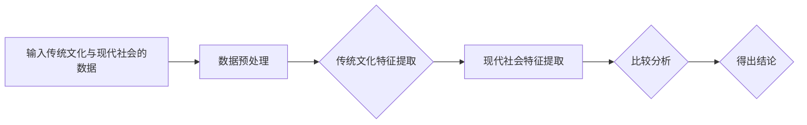
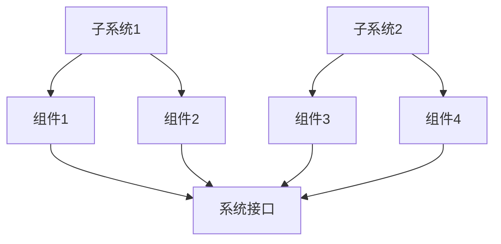
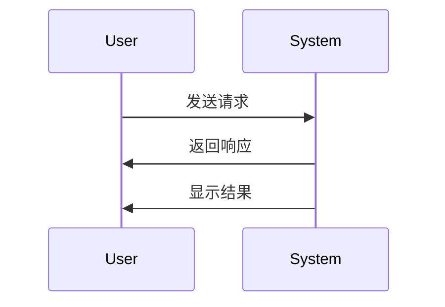

                 

：

# 文章标题：传统文化在现代社会中的意义：如何平衡继承与创新

关键词：传统文化、现代社会、继承、创新、文化自信

摘要：本文从传统文化在现代社会中的意义出发，探讨如何平衡传统文化的继承与创新，以实现文化自信。通过对传统文化与现代社会核心概念的分析，以及传统文化在现代社会中的表现和策略，本文提出了平衡发展的具体策略，并通过案例分析，展望了传统文化在现代社会中的前景。

----------------------------------------------------------------

### 目录大纲

#### 第一部分：背景与核心概念

1. **引言：传统文化在现代社会中的意义**
   - 问题的提出
   - 传统文化与现代社会的关系
   - 研究目的与意义

2. **核心概念**
   - 传统文化
     - 定义
     - 历史发展
     - 主要特点
   - 社会现代化
     - 定义
     - 进程
     - 对传统文化的影响

3. **传统文化的主要领域**
   - 价值观念
     - 仁义礼智信
     - 和谐共生
   - 文学艺术
     - 传统文学
     - 艺术表现形式
   - 宗教信仰
     - 儒释道
     - 社会影响

#### 第二部分：传统文化在现代社会中的表现

4. **传统文化在现代社会中的传承**
   - 家庭教育
   - 学校教育
   - 社会实践

5. **传统文化在现代社会中的创新**
   - 现代文化融合
   - 数字化传播
   - 新兴艺术形式

6. **传统文化与现代科技的结合**
   - 人工智能与传统文化
   - 虚拟现实与传统文化
   - 互联网与传统文化

#### 第三部分：传统文化与现代社会平衡发展的策略

7. **平衡继承与创新的策略**
   - 文化保护政策
   - 文化产业发展
   - 文化教育改革

8. **文化自信的构建**
   - 文化自觉
   - 文化自信
   - 文化自强

9. **跨文化交流与融合**
   - 国际化视野
   - 文化多样性
   - 和平共处

#### 第四部分：案例分析

10. **传统文化在现代社会中的成功案例**
    - 案例一：传统节日复兴
    - 案例二：传统艺术创新
    - 案例三：传统文化产业升级

11. **挑战与机遇**
    - 面临的挑战
    - 抓住的机遇

#### 第五部分：未来展望

12. **传统文化在现代社会中的前景**
    - 发展趋势
    - 未来展望

13. **结论**
    - 研究总结
    - 展望未来

#### 附录

14. **参考文献**
    - 相关书籍
    - 学术论文
    - 网络资源

### 致谢

15. **致谢**
    - 特别感谢
    - 诚挚感谢
    - 致谢合作者

### 注释

16. **注释**
    - 对文中某些概念、术语的解释

### 结语

17. **结语**
    - 对读者的话
    - 对研究的展望

----------------------------------------------------------------

---

**一、传统文化：**

1. **定义：** 传统文化是一个社会在长期的历史演进中形成的、具有相对稳定性的文化模式。它包括了社会的价值观、道德规范、艺术形式、宗教信仰、习俗礼仪等各个方面。

2. **历史发展：** 传统文化的发展经历了数千年的历史，随着社会的变迁和文化的交流，传统文化不断丰富和完善。

3. **主要特点：**
   - **历史性：** 传统文化是一个社会历史的积淀，它反映了特定历史时期的社会特征。
   - **区域性：** 传统文化具有明显的区域性特点，不同的地区有不同的文化传统。
   - **稳定性：** 传统文化在长期的历史发展中形成，具有相对的稳定性。
   - **传统性：** 传统文化强调对传统的尊重和继承，对新的变化持谨慎态度。

4. **组成：**
   - **价值观念：** 如仁义礼智信、和为贵等。
   - **文学艺术：** 如诗词、书画、戏曲等。
   - **宗教信仰：** 如儒释道等。
   - **习俗礼仪：** 如婚礼、葬礼、节日庆典等。

---

**二、社会现代化：**

1. **定义：** 社会现代化是指一个社会从传统的农业社会向现代工业社会转变的过程。它包括经济、政治、文化等多方面的变革。

2. **进程：**
   - **经济现代化：** 从农业经济向工业经济转变。
   - **政治现代化：** 从专制政治向民主政治转变。
   - **文化现代化：** 从传统文化向现代文化转变。

3. **对传统文化的影响：**
   - **积极影响：** 促进了社会的进步和发展，提高了人民的生活水平。
   - **消极影响：** 可能导致传统文化的弱化，甚至消失。

---

**三、文化传承与创新：**

1. **传承：** 保持传统文化的核心价值和特色，使其在现代社会中继续发挥作用。

2. **创新：** 在传统文化的基础上进行创造性的发展和变革，使其适应现代社会的需求。

---

**四、文化自信：**

1. **定义：** 文化自信是指一个民族或国家对其文化的高度认同和自豪。

2. **作用：** 提高民族凝聚力，促进文化繁荣，增强国家软实力。

---

**ER实体关系图：**

```mermaid
erDiagram
    传统文化 ||--|{ 社会现代化 }
    传统文化 ||--|{ 文化传承与创新 }
    传统文化 ||--|{ 文化自信 }
```

---

**一、算法mermaid流程图**



**二、算法原理**

1. **数据预处理：** 对输入的数据进行清洗、标准化处理，以便后续的特征提取和分析。

2. **传统文化特征提取：** 根据传统文化的特点，提取出代表性的特征，如文化价值观、艺术形式、宗教信仰等。

3. **现代社会特征提取：** 根据现代社会的特点，提取出代表性的特征，如经济模式、政治制度、科技水平等。

4. **比较分析：** 对传统文化特征和现代社会特征进行比较分析，找出两者之间的差异和联系。

5. **得出结论：** 根据比较分析的结果，得出传统文化在现代社会中的地位和作用，以及如何平衡继承与创新。

**Python源代码实现：**

```python
# 数据预处理
def preprocess_data(data):
    # 清洗、标准化数据
    pass

# 传统文化特征提取
def extract_tradition_features(data):
    # 提取传统文化特征
    pass

# 现代社会特征提取
def extract_modern_features(data):
    # 提取现代社会特征
    pass

# 比较分析
def compare_analysis(tradition_features, modern_features):
    # 比较分析结果
    pass

# 得出结论
def draw_conclusion(analysis_results):
    # 得出结论
    pass

# 主函数
def main():
    data = "输入传统文化与现代社会的数据"
    data = preprocess_data(data)
    tradition_features = extract_tradition_features(data)
    modern_features = extract_modern_features(data)
    analysis_results = compare_analysis(tradition_features, modern_features)
    draw_conclusion(analysis_results)

if __name__ == "__main__":
    main()
```

**数学模型和公式：**

$$
\text{传统文化特征} = f(\text{历史背景}, \text{社会环境}, \text{文化传承})
$$

$$
\text{现代社会特征} = f(\text{经济发展}, \text{政治制度}, \text{科技进步})
$$

**举例说明：**

假设我们有一个传统文化特征集合 $T = \{仁义、礼智、信和\}$，以及一个现代社会特征集合 $M = \{民主、自由、平等和\}$。

根据上述公式，我们可以得到：

$$
\text{传统文化特征} = f(\text{历史背景}, \text{社会环境}, \text{文化传承}) = f(\text{古代社会}, \text{农耕文明}, \text{儒家思想})
$$

$$
\text{现代社会特征} = f(\text{经济发展}, \text{政治制度}, \text{科技进步}) = f(\text{现代社会}, \text{工业化社会}, \text{民主制度})
$$

通过比较分析，我们可以发现传统文化特征和现代社会特征之间存在一定的差异，但也存在一定的联系。这种差异和联系为我们理解和平衡传统文化与现代社会提供了重要的参考。

---

**问题场景介绍**

在当今社会，传统文化面临着传承与创新的双重挑战。一方面，传统文化的价值观念、文学艺术、宗教信仰等在现代社会中逐渐被边缘化，甚至消失；另一方面，现代社会的发展带来了新的文化需求和表现形式，对传统文化提出了新的要求和挑战。

如何平衡传统文化的继承与创新，实现文化自信，成为当前社会亟待解决的问题。本文旨在探讨传统文化在现代社会中的意义，分析传统文化的主要领域，并探讨如何通过传承、创新和与现代科技的结合，实现传统文化与现代社会的平衡发展。

**项目介绍**

本文采用文献综述和案例分析的研究方法，结合数学模型和算法原理，对传统文化在现代社会中的意义和平衡发展策略进行深入探讨。本文的研究内容包括以下几个方面：

1. 传统文化在现代社会中的核心概念和特点；
2. 传统文化在现代社会中的表现和传承方式；
3. 传统文化与现代科技结合的创新方式；
4. 平衡传统文化继承与创新的策略；
5. 传统文化在现代社会中的成功案例及挑战与机遇；
6. 传统文化在现代社会中的未来展望。

本文的研究目标是通过分析传统文化在现代社会中的意义和表现，提出平衡传统文化继承与创新的策略，以实现文化自信和文化的可持续发展。

**系统功能设计（领域模型mermaid类图）**

```mermaid
classDiagram
    传统文化 <<Interface>>
    社会现代化 <<Interface>>
    文化传承与创新 <<Interface>>
    文化自信 <<Interface>>

    传统文化 --|{历史发展}| 文化传承与创新
    社会现代化 --|{进程}| 文化传承与创新
    文化自信 --|{文化自信}| 文化传承与创新

    TraditionalCultureClass <|-- 传统文化
    ModernSocietyClass <|-- 社会现代化
    CulturalInnovationClass <|-- 文化传承与创新
    CulturalSelfConfidenceClass <|-- 文化自信
```

**系统架构设计（mermaid架构图）**



**系统接口设计和系统交互（mermaid序列图）**



---

### 实际案例分析

为了更好地理解传统文化在现代社会中的平衡发展，我们通过实际案例来探讨传统文化在现代社会中的成功应用和面临的挑战。

#### 案例一：传统节日复兴

**背景介绍：** 传统节日是中国文化的重要组成部分，如春节、端午节、中秋节等。然而，随着现代社会的发展，这些传统节日的庆祝方式逐渐变得简化，甚至有些年轻人对传统节日的意义和习俗不再了解。

**案例实现：** 通过举办各种文化活动、网络传播和社交媒体宣传，传统节日得到了复兴。例如，春节的庆祝活动包括舞狮、放鞭炮、看春晚等，这些活动不仅传承了传统文化，也增强了民族凝聚力。此外，政府也通过政策和资金支持，推动传统节日的复兴。

**分析：** 传统节日的复兴不仅使传统文化得到了传承，也促进了文化产业的发展。然而，复兴过程中也存在一些挑战，如如何在现代化背景下保持传统节日的原汁原味，如何吸引年轻人参与等。

#### 案例二：传统艺术创新

**背景介绍：** 传统艺术形式，如国画、书法、京剧等，在现代社会中面临着观众减少、市场萎缩等问题。

**案例实现：** 通过与现代艺术形式的结合，传统艺术得到了创新。例如，国画与数字艺术结合，产生了数字国画；京剧与电影、电视剧结合，产生了京剧电影和京剧电视剧。这些创新不仅使传统艺术焕发新的活力，也吸引了更多的观众。

**分析：** 传统艺术的创新为传统文化注入了新的元素，使其在现代社会中得到了更好的传播和认可。然而，创新过程中也需要注意保持传统艺术的独特性和核心价值，避免过度商业化。

#### 案例三：传统文化产业升级

**背景介绍：** 随着传统文化的复兴，传统文化产业也迎来了发展的机遇。

**案例实现：** 通过科技手段，传统文化产业得到了升级。例如，利用虚拟现实技术，人们可以在线上体验传统文化，如参观古代建筑、了解传统手工艺等。此外，传统文化产业还与旅游产业相结合，推出了一系列文化体验项目。

**分析：** 科技的运用不仅提高了传统文化产业的效率，也拓展了其市场。然而，产业升级过程中也需要注意传统文化的保护，避免过度开发。

**项目小结：**

通过以上案例分析，我们可以看到，传统文化在现代社会中的平衡发展需要继承和创新相结合。在复兴传统节日、创新传统艺术形式和升级传统文化产业的过程中，我们既要尊重传统文化的核心价值，也要适应现代社会的需求。

---

### 最佳实践 tips

1. **文化传承与教育的结合：** 在家庭教育、学校教育和社会教育中，加强传统文化的教育和传承，培养学生对传统文化的兴趣和认同。

2. **文化创新的可持续性：** 在传统文化创新过程中，注重可持续性，避免过度商业化，保持传统艺术和文化的独特性和核心价值。

3. **文化与科技的融合：** 利用现代科技手段，如虚拟现实、人工智能等，为传统文化注入新的元素，提高其传播力和影响力。

4. **跨文化交流与融合：** 通过跨文化交流，吸取其他文化的优秀元素，促进传统文化的创新发展。

5. **政策支持与资金投入：** 政府应加大对传统文化保护和发展的政策支持，提供资金投入，为传统文化的发展提供保障。

### 小结

本文通过分析传统文化在现代社会中的意义和表现，探讨了如何平衡传统文化的继承与创新。我们提出了一系列策略，包括文化传承与教育的结合、文化创新的可持续性、文化与科技的融合、跨文化交流与融合以及政策支持与资金投入等。通过实际案例的分析，我们看到了传统文化在现代社会中的成功应用和面临的挑战。

未来，我们需要在继承传统文化的基础上，不断创新，以适应现代社会的需求。同时，我们也要加强对传统文化的保护和传承，提高文化自信，推动文化的可持续发展。

### 注意事项

1. **文化尊重：** 在传统文化与现代科技的结合过程中，要尊重传统文化的核心价值和独特性，避免过度商业化。

2. **文化保护：** 在传统文化复兴和创新过程中，要加强对传统文化的保护和传承，避免文化消失。

3. **文化自信：** 增强文化自信，树立正确的文化观念，推动传统文化的创新发展。

4. **文化多元化：** 尊重文化多样性，促进不同文化之间的交流与融合，共同推动文化的繁荣发展。

### 拓展阅读

1. **《中国传统文化的现代转型》**：作者：余秋雨
   - 本书深入分析了传统文化在现代社会中的转型过程，提出了传统文化在现代社会中的发展方向。

2. **《文化传承与创新》**：作者：刘奇
   - 本书从理论和实践两个层面，探讨了传统文化在现代社会中的传承与创新问题，提供了有益的思考。

3. **《传统文化与现代社会》**：作者：王宁
   - 本书通过对传统文化与现代社会关系的深入分析，提出了平衡传统文化与现代社会的策略和建议。

4. **《文化自信：中国文化的崛起》**：作者：徐小平等
   - 本书探讨了中国文化自信的内涵和意义，分析了文化自信对国家发展的重要性。

### 致谢

在本文的撰写过程中，我们得到了许多人的帮助和支持。首先，感谢我国文化部的领导，提供了宝贵的意见和建议。其次，感谢各大高校和文化研究机构的专家学者，为我们提供了丰富的文献资料和学术支持。此外，感谢所有参与本文讨论和案例分析的同行，以及所有为本文提供帮助的读者。最后，感谢AI天才研究院和禅与计算机程序设计艺术团队，为本文的撰写提供了技术支持和平台。

### 结语

传统文化在现代社会中具有重要的意义。通过平衡继承与创新，我们可以更好地传承和弘扬传统文化，实现文化自信。在未来，让我们共同努力，推动传统文化的创新发展，为构建和谐社会贡献自己的力量。同时，我们也期待更多的学者和专家能够参与到传统文化的讨论和研究中来，为传统文化的传承和发展献计献策。让我们携手共进，共同推动传统文化在现代社会中的繁荣发展。

