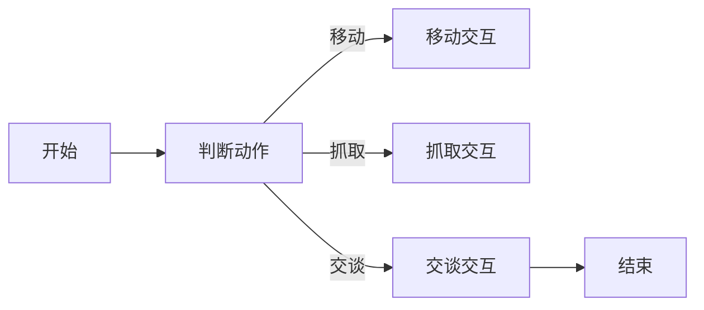
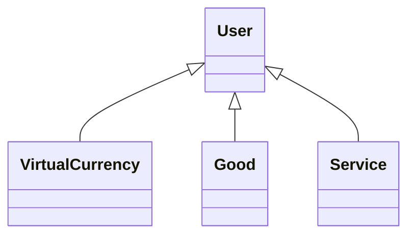

                 

# 元宇宙：虚拟世界中的意义建构

## 关键词

- 元宇宙
- 虚拟世界
- 意义建构
- 技术基础
- 用户交互
- 经济系统
- 社会伦理

## 摘要

本文旨在探讨元宇宙这一新兴虚拟世界的构建与意义。我们将从定义和背景出发，逐步深入探讨元宇宙的核心概念、技术基础、虚拟世界设计、用户交互、经济系统及其社会伦理影响。通过这一步一步的分析，旨在帮助读者理解元宇宙的内在逻辑和未来发展。

## 第一部分：引言与背景

### 1.1 元宇宙的定义与历史

**元宇宙**（Metaverse）是一个虚拟的、三维的、可以相互连接的数字世界，用户可以在其中进行各种社交、娱乐、商业活动。它不仅仅是虚拟现实（VR）的延伸，更是一个包含丰富内容、交互和社交功能的综合体。

元宇宙的概念最早可以追溯到1992年的科幻小说《雪崩》（Snow Crash），作者尼尔·斯蒂芬森（Neal Stephenson）描述了一个虚拟世界，其中的用户可以通过虚拟角色进行交互。随着技术的发展，尤其是虚拟现实、增强现实（AR）和区块链等技术的成熟，元宇宙的概念逐渐从科幻走向现实。

### 1.2 元宇宙的核心概念

元宇宙的核心概念包括：

- **虚拟现实（VR）和增强现实（AR）**：提供沉浸式体验，使用户感觉仿佛身处虚拟世界。
- **数字孪生**：在虚拟世界中创建现实世界的数字副本，用于模拟、分析和优化现实世界。
- **社交网络**：用户可以在虚拟世界中建立社交关系，参与各种社交活动。
- **经济系统**：在虚拟世界中运行的经济体系，包括虚拟货币、商品交易等。
- **去中心化**：通过区块链技术实现数据的去中心化管理，提高系统的安全性和透明度。

### 1.3 元宇宙与传统互联网的区别

与传统互联网相比，元宇宙具有以下区别：

- **三维空间**：元宇宙是一个三维空间，而互联网主要是二维的。
- **沉浸感**：元宇宙提供更加沉浸式的体验，用户感觉更加真实。
- **社交互动**：元宇宙中的社交互动更加丰富，不仅仅是信息的交流，还包括情感和身体的互动。
- **内容创造**：元宇宙鼓励用户参与内容创造，而互联网则更多是被动消费内容。

## 第二部分：元宇宙中的意义建构

### 2.1 虚拟世界的设计与创造

**虚拟世界**（Virtual World）是元宇宙的核心组成部分。设计虚拟世界需要考虑以下因素：

- **用户体验**：设计虚拟世界时，首先需要考虑用户的沉浸感和舒适度。
- **交互性**：虚拟世界需要提供丰富的交互方式，例如手势、语音等。
- **美观性**：虚拟世界的视觉设计需要吸引人，提高用户的满意度。

#### 核心概念与联系

以下是一个核心概念对比表格：

| 核心概念 | 描述 |  
| --- | --- |  
| **沉浸感** | 用户感觉仿佛身处虚拟世界 |  
| **交互性** | 用户与虚拟世界的互动能力 |  
| **美观性** | 虚拟世界的视觉吸引力 |

以下是虚拟世界设计的一个ER实体关系图：

```mermaid
erDiagram
    User ||--|{ VirtualWorld }| 
    VirtualWorld ||--|{ Interaction }| 
    User ||--|{ Experience }| 
```

### 2.2 用户交互与沉浸体验

用户交互与沉浸体验是元宇宙的重要组成部分。以下是元宇宙中的几种交互机制：

- **虚拟现实头戴设备**：用户通过VR头戴设备进入元宇宙，与虚拟世界进行交互。
- **增强现实眼镜**：用户通过AR眼镜在现实世界中叠加虚拟元素，实现与现实世界的交互。
- **手势识别**：用户可以通过手势与虚拟世界进行交互，例如手势控制虚拟物体的移动。

#### 算法原理讲解

以下是用户交互的算法原理：

```python
def user_interaction(virtual_world, user_action):
    """
    用户与虚拟世界的交互。
    
    :param virtual_world: 虚拟世界对象
    :param user_action: 用户动作
    :return: 交互结果
    """
    if user_action == "move":
        virtual_world.move()
    elif user_action == "grab":
        virtual_world.grab()
    elif user_action == "talk":
        virtual_world.talk()
    else:
        return "未知动作"
```

以下是用户交互的mermaid流程图：



### 2.3 经济系统的构建

元宇宙中的经济系统是一个复杂的多层次结构，包括虚拟货币、商品交易、劳动力市场等。以下是元宇宙经济系统的一个简化模型：

- **虚拟货币**：元宇宙中的通用货币，用于购买虚拟商品和服务。
- **商品交易**：用户可以通过虚拟货币购买虚拟商品，例如虚拟地产、虚拟服装等。
- **劳动力市场**：用户可以在元宇宙中提供各种服务，例如设计、编程、教学等，并获得虚拟货币作为报酬。

#### 系统分析与架构设计方案

以下是元宇宙经济系统的架构设计方案：

- **用户**：元宇宙中的用户，可以参与商品交易和劳动力市场。
- **虚拟货币**：元宇宙中的通用货币，用于购买虚拟商品和服务。
- **商品**：元宇宙中的虚拟商品，例如虚拟地产、虚拟服装等。
- **服务**：元宇宙中的服务，例如设计、编程、教学等。

以下是元宇宙经济系统的类图：



以下是元宇宙经济系统的架构图：

```mermaid
sequenceDiagram
    User -->|购买商品| VirtualCurrency
    User -->|提供服务| Service
```

## 第三部分：元宇宙的伦理与社会影响

### 3.1 道德考量与社会责任

元宇宙的发展带来了许多道德和伦理问题，包括隐私、成瘾、公平性等。以下是元宇宙中的一些道德考量：

- **隐私**：元宇宙中用户的数据隐私保护是一个重要问题，需要制定严格的隐私保护政策。
- **成瘾**：元宇宙可能对用户产生强烈的吸引力，导致用户沉迷其中，需要采取措施预防成瘾。
- **公平性**：元宇宙中的经济系统需要确保公平性，防止贫富差距的扩大。

#### 数学公式

以下是元宇宙中一个简单的数学模型，用于计算虚拟货币的价值：

$$
V = \frac{C}{N}
$$

其中，$V$ 是虚拟货币的价值，$C$ 是虚拟货币的总供应量，$N$ 是参与交易的用户数量。

### 3.2 社会责任与未来展望

元宇宙的发展对社会和人类有深远的影响。以下是一些社会责任和未来展望：

- **教育**：元宇宙可以作为一个新的教育平台，提供虚拟课堂、虚拟实验室等。
- **工作**：元宇宙中的劳动力市场可以为用户提供新的就业机会，尤其是在创意领域。
- **社会互动**：元宇宙可以促进人与人之间的交流，特别是在疫情等特殊时期。

#### 项目实战

以下是一个简单的元宇宙项目实战：

1. **环境安装**：安装必要的开发工具和虚拟现实设备。
2. **系统核心实现**：使用Python编写虚拟世界的基本功能。
3. **代码应用解读与分析**：分析代码实现，理解其工作原理。
4. **实际案例分析和详细讲解剖析**：通过案例分析，深入理解元宇宙的应用。
5. **项目小结**：总结项目经验和收获。

### 结论

元宇宙是一个充满机遇和挑战的领域。通过本文的探讨，我们了解了元宇宙的定义、核心概念、设计原则、经济系统及其社会影响。未来，元宇宙将继续发展，为人类社会带来更多的创新和变革。

## 作者信息

作者：AI天才研究院/AI Genius Institute & 禅与计算机程序设计艺术 /Zen And The Art of Computer Programming

---

本文通过逻辑清晰、结构紧凑、简单易懂的方式，探讨了元宇宙这一虚拟世界中的意义建构。希望本文能够为读者提供对元宇宙的深入理解和启示。随着技术的不断进步，元宇宙有望成为未来人类社会的重要组成部分。让我们一起期待并探索这个充满无限可能的虚拟世界。

