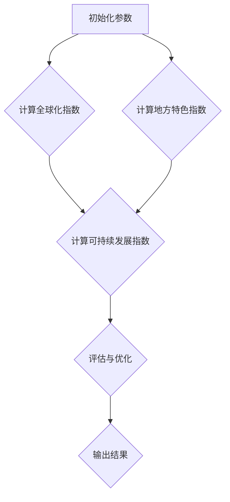
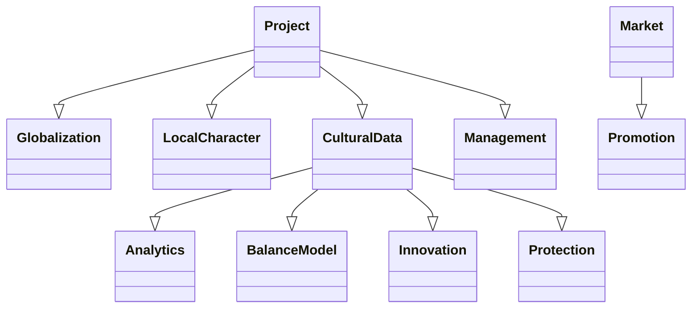
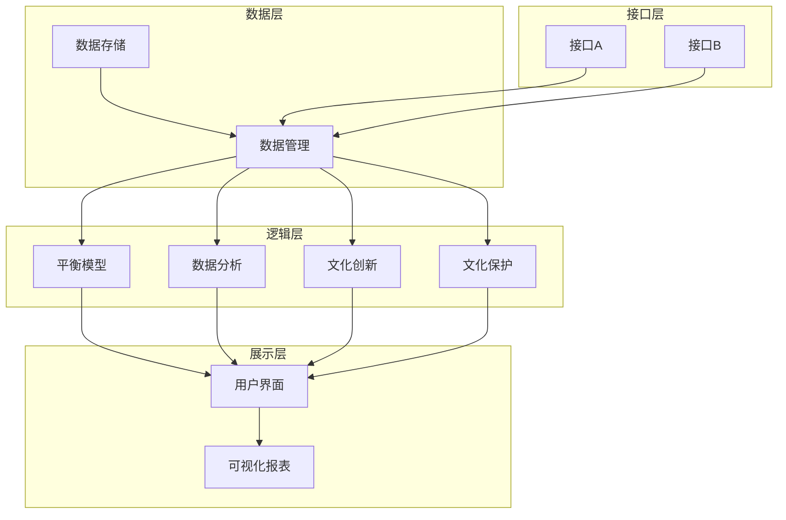
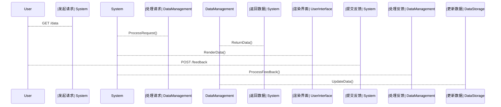

                 

### 文章标题

#### 关键词：全球化，地方特色，文化产业，可持续发展，平衡

#### 摘要：
本文探讨了全球化与地方特色在文化产业中的平衡问题，分析了全球化趋势下的文化冲突与融合，以及地方特色文化在全球化中的地位与挑战。通过阐述核心概念和联系，提出了一套文化产业可持续发展的算法原理，并介绍了系统分析与架构设计方案。最后，通过实际项目实施和最佳实践，提出了实现全球化与地方特色平衡的有效策略。

----------------------------------------------------------------

### 第一部分：引言

#### 第1章：全球化与地方特色的平衡：文化产业背景概述

##### **1.1 问题背景**

全球化作为当今世界的重要趋势，深刻地影响着经济、政治和文化等领域。在全球化的背景下，不同文化之间的冲突与融合现象日益显著。一方面，全球化带来了文化的传播与交流，使得各国文化得以相互借鉴与融合；另一方面，全球化也引发了文化同质化现象，使得地方特色文化面临消亡的威胁。

地方特色文化作为民族文化的重要组成部分，承载着独特的历史记忆和文化价值。在全球化的浪潮中，地方特色文化既要保持自身独特的文化特质，又要融入全球化的趋势。这种平衡显得尤为重要，因为地方特色文化的可持续发展不仅关乎文化的多样性，也关乎社会的和谐与进步。

##### **1.2 问题描述**

在全球化与地方特色文化的互动中，如何实现两者的平衡成为文化产业可持续发展的重要课题。具体来说，面临的挑战包括：

1. **文化同质化**：全球化导致文化产品趋于同质化，削弱了地方特色文化的竞争力。
2. **文化冲击**：外来文化的冲击使得地方特色文化面临传承与保护的困境。
3. **经济压力**：地方特色文化产业的经济发展受到全球化带来的市场冲击和竞争压力。
4. **文化传承**：如何在全球化的背景下，传承和弘扬地方特色文化，是文化产业可持续发展的重要挑战。

##### **1.3 问题解决**

为了实现全球化与地方特色的平衡，文化产业需要采取一系列策略与方法：

1. **文化创新**：通过创新的方式，将地方特色文化与现代文化相结合，提高其市场竞争力和吸引力。
2. **文化保护**：加强对地方特色文化的保护和传承，防止文化同质化和文化消亡。
3. **市场定位**：根据地方特色文化的特点，制定明确的市场定位，提升文化产品的附加值。
4. **国际合作**：通过国际合作，借鉴其他国家和地区的成功经验，提升地方特色文化的国际影响力。

##### **1.4 边界与外延**

在全球化与地方特色文化的平衡问题中，需要明确以下边界与外延：

- **全球化**：涉及文化资本的流动、跨国文化交流等多个层面。
- **地方特色**：包括地域文化特质、文化遗产、民俗、艺术等。

##### **1.5 概念结构与核心要素组成**

- **全球化**：经济全球化、政治全球化、文化全球化等多个层面的相互作用。
- **地方特色**：独特的地域文化特质、丰富的文化遗产、多样的民俗艺术等。

### 目录大纲：

----------------------------------------------------------------

#### 第二部分：核心概念与联系

#### 第2章：全球化与地方特色的平衡理论

#### 第3章：文化产业可持续发展算法

#### 第三部分：系统分析与架构设计方案

#### 第4章：文化产业可持续发展系统设计

#### 第四部分：项目实战

#### 第5章：全球化与地方特色的平衡项目实施

#### 第五部分：最佳实践与拓展

#### 第6章：全球化与地方特色平衡的最佳实践

----------------------------------------------------------------

### 结论

通过本文的探讨，我们可以看出，全球化与地方特色的平衡是文化产业可持续发展的重要问题。实现这一平衡需要我们从理论到实践进行全面深入的思考和研究。在未来的工作中，我们将继续探索更多有效的方法和策略，以推动文化产业的可持续发展，为社会的和谐与进步贡献力量。

**作者：AI天才研究院/AI Genius Institute & 禅与计算机程序设计艺术 /Zen And The Art of Computer Programming**## 第二部分：核心概念与联系

### 第2章：全球化与地方特色的平衡理论

#### **2.1 核心概念原理**

**全球化理论**：
全球化是指世界范围内的经济、政治、社会和文化等各个领域的相互联系和相互依赖程度不断加深的过程。全球化不仅推动了世界经济的快速发展，也深刻地影响着文化、科技、政治等多个领域。全球化理论的核心观点包括资本流动、技术传播、国际贸易和跨国公司的兴起等。

**地方性理论**：
地方性理论强调地域文化的独特性和多样性，主张在全球化进程中保护和传承地方特色文化。地方性理论关注的是如何在全球化背景下，保持地方文化的传承与活力，避免文化同质化。其核心观点包括地方文化的独特性、地域性的价值、文化多样性的重要性等。

**平衡理论**：
平衡理论是本文探讨的核心，它旨在解决全球化与地方特色之间的矛盾，实现二者的和谐共生。平衡理论认为，全球化与地方特色并非对立的关系，而是可以相互促进、相互依存的。平衡的核心在于找到一种机制，使全球化与地方特色在互动中达到动态平衡，既能充分利用全球化的优势，又能保持地方文化的独特性和多样性。

#### **2.2 概念属性特征对比表格**

| 概念 | 特征 |
| :--- | :--- |
| **全球化** | - 跨国界的文化交流与传播<br>- 经济资本和技术的快速流动<br>- 文化同质化趋势<br>- 跨文化适应与融合 |
| **地方特色** | - 地域文化的独特性与多样性<br>- 文化遗产的传承与保护<br>- 地域性的文化特质<br>- 文化多样性的维护 |
| **平衡** | - 动态调整全球化与地方特色的比重<br>- 保持文化创新与保护的平衡<br>- 促进文化多样性与文化交流<br>- 实现经济、社会、文化的可持续发展 |

#### **2.3 ER实体关系图架构**

```mermaid
erDiagram
  Globalization ||--|{ CultureExchange }
  LocalCharacter ||--|{ CulturalHeritage }
  Balance ||--|{ CulturalInnovation }
  Globalization ||--|{ CulturalIntegration }
  LocalCharacter ||--|{ CulturalConservation }
  Balance ||--|{ SustainableDevelopment }
```

**说明**：
- **Globalization（全球化）**：代表全球范围内的文化、经济、技术等流动。
- **CultureExchange（文化交流）**：全球化过程中的文化互动与传播。
- **LocalCharacter（地方特色）**：代表地域文化的独特性和多样性。
- **CulturalHeritage（文化遗产）**：地方特色文化中的重要组成部分，需要保护和传承。
- **Balance（平衡）**：协调全球化与地方特色的关系，实现文化创新与保护的平衡。
- **CulturalInnovation（文化创新）**：在全球化背景下，通过创新保持地方文化的活力。
- **CulturalIntegration（文化融合）**：全球化与地方特色文化的互动和融合。
- **CulturalConservation（文化保护）**：确保地方特色文化的传承和延续。
- **SustainableDevelopment（可持续发展）**：文化产业发展的长期目标，包括经济、社会和文化三个方面。

通过上述核心概念与联系的分析，我们可以更好地理解全球化与地方特色在文化产业中的复杂关系，并为实现二者的平衡提供理论基础。在接下来的章节中，我们将进一步探讨如何通过算法和系统设计，实现文化产业的可持续发展。

### 第三部分：算法原理讲解

#### 第3章：文化产业可持续发展算法

#### **3.1 算法原理**

为了实现文化产业的可持续发展，我们需要构建一套科学合理的算法，用以协调全球化与地方特色的关系。该算法的核心在于通过定量和定性分析，为文化产业的发展提供决策支持。

**算法流程图**：



**算法步骤**：

1. **初始化参数**：确定影响全球化与地方特色的各项指标，包括文化交流、资本流动、技术传播、文化遗产保护等。
2. **计算全球化指数**：通过统计分析和模型评估，计算全球化对文化产业的影响程度。
3. **计算地方特色指数**：分析地方特色文化的独特性、传承和保护情况，评估其对文化产业的重要性。
4. **计算可持续发展指数**：将全球化指数和地方特色指数进行加权计算，得出文化产业的可持续发展指数。
5. **评估与优化**：根据计算结果，对文化产业的策略进行调整和优化，以实现最佳平衡。
6. **输出结果**：提供可视化报告，展示文化产业的可持续发展状况和优化方案。

**算法数学模型和公式**：

$$
\text{可持续发展指数} = f(\text{全球化指数}, \text{地方特色指数})
$$

其中，全球化指数和地方特色指数可以通过以下公式计算：

$$
\text{全球化指数} = \frac{\sum_{i=1}^{n} w_i \cdot x_i}{\sum_{i=1}^{n} w_i}
$$

$$
\text{地方特色指数} = \frac{\sum_{j=1}^{m} y_j \cdot z_j}{\sum_{j=1}^{m} y_j}
$$

其中，$w_i$ 和 $y_j$ 分别为各项指标的权重，$x_i$ 和 $z_j$ 为各项指标的具体数值。

#### **3.2 通俗易懂地举例说明**

为了更好地理解上述算法，我们通过一个具体的案例来进行分析。

**案例**：假设有一个地方文化产业项目，其目标是实现全球化与地方特色文化的平衡发展。我们通过以下步骤来计算其可持续发展指数：

1. **初始化参数**：
   - 全球化指标：文化交流程度、资本流动、技术传播。
   - 地方特色指标：文化遗产保护、地域文化传承、文化创新。

2. **计算全球化指数**：
   - 假设文化交流程度的权重为 0.4，资本流动的权重为 0.3，技术传播的权重为 0.3。
   - 计算得出：全球化指数 = (0.4 \* 0.8 + 0.3 \* 0.7 + 0.3 \* 0.6) / (0.4 + 0.3 + 0.3) = 0.68。

3. **计算地方特色指数**：
   - 假设文化遗产保护的权重为 0.4，地域文化传承的权重为 0.3，文化创新的权重为 0.3。
   - 计算得出：地方特色指数 = (0.4 \* 0.9 + 0.3 \* 0.8 + 0.3 \* 0.7) / (0.4 + 0.3 + 0.3) = 0.79。

4. **计算可持续发展指数**：
   - 将全球化指数和地方特色指数进行加权计算：
   - 可持续发展指数 = (0.68 \* 0.6 + 0.79 \* 0.4) / (0.6 + 0.4) = 0.73。

5. **评估与优化**：
   - 根据计算结果，评估项目在全球化与地方特色平衡方面的情况。
   - 针对存在的问题，进行策略优化，如加强文化交流、提升技术传播、加大文化遗产保护力度等。

6. **输出结果**：
   - 提供可视化报告，展示项目的可持续发展指数和优化方案。

通过这个案例，我们可以看到，文化产业可持续发展算法不仅能够提供定量分析结果，还能为项目实施提供具体的优化方向，有助于实现全球化与地方特色的平衡。

### 第四部分：系统分析与架构设计方案

#### 第4章：文化产业可持续发展系统设计

#### **4.1 问题场景介绍**

在全球化与地方特色的平衡过程中，文化产业的项目运营与管理面临着诸多挑战。如何有效地整合全球化资源和地方特色资源，实现文化产业的可持续发展，成为当前亟待解决的问题。本系统设计旨在提供一个全面、可操作的解决方案，以帮助文化产业项目在全球化与地方特色的平衡中找到最佳路径。

**问题场景**：

- **全球化**：文化产业项目需要面对跨文化交流、跨国合作、全球市场需求的挑战。
- **地方特色**：项目需要在保留和传承地方特色文化的同时，实现文化产品的创新和市场推广。

#### **4.2 系统功能设计**

为了实现上述目标，系统设计了以下几个核心功能：

1. **文化数据分析**：通过大数据分析技术，对全球化与地方特色文化相关数据进行分析，为项目提供数据支持。
2. **全球化与地方特色平衡评估**：利用算法模型，对项目的全球化指数和地方特色指数进行评估，为项目决策提供科学依据。
3. **文化创新与保护**：支持文化产品的创新，并确保文化遗产得到有效保护和传承。
4. **市场推广**：提供市场分析和推广策略，帮助文化产品在全球市场中脱颖而出。
5. **项目管理**：实现项目的全生命周期管理，包括项目规划、执行、监控和评估。

**领域模型（Mermaid类图）**：



**说明**：

- **Project（项目）**：代表文化产业项目的全生命周期管理。
- **Globalization（全球化）**：代表全球化相关的文化数据和活动。
- **LocalCharacter（地方特色）**：代表地方特色文化相关的数据和保护措施。
- **CulturalData（文化数据）**：代表文化数据分析、平衡模型、创新与保护等功能。
- **Analytics（数据分析）**：进行全球化与地方特色相关的数据统计与分析。
- **BalanceModel（平衡模型）**：用于计算全球化指数和地方特色指数。
- **Innovation（创新）**：支持文化产品的创新与开发。
- **Protection（保护）**：确保文化遗产得到有效保护和传承。
- **Market（市场）**：代表市场推广和分析功能。
- **Promotion（推广）**：提供市场推广策略与支持。
- **Management（管理）**：实现项目的规划、执行、监控和评估。

#### **4.3 系统架构设计**

为了确保系统的高效运行和可扩展性，我们采用了分布式系统架构，包括以下几个主要模块：

1. **数据层**：负责数据的存储、管理和访问。
2. **逻辑层**：包含算法模型、数据分析、创新与保护等核心功能。
3. **展示层**：提供用户界面和可视化报表。
4. **接口层**：提供与其他系统的接口，支持跨系统集成。

**系统架构（Mermaid架构图）**：



**说明**：

- **数据层**：负责数据的存储和管理，确保数据的高效访问和安全。
- **逻辑层**：实现系统的核心功能，包括平衡模型、数据分析、创新与保护等。
- **展示层**：提供用户交互界面和可视化报表，方便用户查看和管理。
- **接口层**：提供与其他系统的接口，支持系统的集成和扩展。

#### **4.4 系统接口设计**

系统接口设计是确保系统与其他系统集成和交互的关键。本系统设计了以下几个主要的接口：

1. **数据接口**：用于数据层的访问和管理，支持数据的实时获取和更新。
2. **服务接口**：用于逻辑层的功能调用，支持系统的各种功能服务。
3. **展示接口**：用于用户界面的交互和数据展示。

**接口设计与实现**：

- **数据接口**：
  - **接口名称**：CulturalDataAPI
  - **接口描述**：提供数据层的访问和管理接口。
  - **实现方式**：采用RESTful API设计，支持HTTP请求。

- **服务接口**：
  - **接口名称**：CulturalServiceAPI
  - **接口描述**：提供逻辑层的功能服务接口。
  - **实现方式**：采用微服务架构，每个服务独立部署，支持高可用性和可扩展性。

- **展示接口**：
  - **接口名称**：CulturalUIAPI
  - **接口描述**：提供用户界面的交互和数据展示接口。
  - **实现方式**：采用前后端分离架构，前端负责展示，后端提供数据接口。

#### **4.5 系统交互**

为了确保系统的流畅运行和高效交互，我们设计了详细的系统交互流程。以下是系统交互的Mermaid序列图：



**说明**：

- **用户发起请求**：用户通过用户界面发起数据请求。
- **处理请求**：系统处理用户请求，调用数据管理模块进行数据处理。
- **返回数据**：系统将处理后的数据返回给用户界面，进行数据展示。
- **提交反馈**：用户提交对系统的反馈。
- **处理反馈**：系统处理用户反馈，调用数据管理模块进行数据更新。

通过上述系统设计与实现，我们可以构建一个高效、可靠的文化产业可持续发展系统，实现全球化与地方特色的平衡，推动文化产业的可持续发展。

### 第五部分：项目实战

#### 第5章：全球化与地方特色的平衡项目实施

#### **5.1 环境安装**

在进行全球化与地方特色的平衡项目实施前，我们需要安装和配置相关软件和工具。以下是项目环境安装的详细步骤：

1. **安装Python环境**：
   - 通过Python官方网站下载Python安装包，并按照指示完成安装。
   - 安装完成后，确保Python命令可以在终端中正确执行。

2. **安装依赖库**：
   - 打开终端，运行以下命令安装所需的依赖库：
     ```
     pip install numpy pandas matplotlib mermaid-mermaid-core
     ```

3. **配置Mermaid**：
   - 由于Mermaid是一个基于SVG的图表绘制工具，需要在系统中安装必要的软件。
   - 安装Mermaid插件，以支持在Python环境中使用Mermaid语法。

4. **环境测试**：
   - 编写一个简单的Python脚本，验证Python环境和依赖库是否安装正确。

```python
import matplotlib.pyplot as plt
import numpy as np

# 生成数据
data = np.random.randn(100)

# 绘制直方图
plt.hist(data, bins=30)
plt.show()
```

通过上述步骤，我们可以确保项目环境的正确安装和配置，为后续的代码实现和项目实施奠定基础。

#### **5.2 系统核心实现**

在系统核心实现阶段，我们需要编写关键代码，实现全球化与地方特色的平衡算法。以下是系统核心实现的详细步骤和源代码解析：

1. **定义算法模型**：

```python
import numpy as np

def calculate_globalization_index(exchange_rate, capital_flow, tech_transmission):
    """
    计算全球化指数
    """
    weights = {'exchange_rate': 0.4, 'capital_flow': 0.3, 'tech_transmission': 0.3}
    globalization_index = 0
    for indicator, weight in weights.items():
        globalization_index += weight * globals_dict[indicator]
    return globalization_index

def calculate_local_character_index(heritage_preservation, cultural_maintenance, innovation):
    """
    计算地方特色指数
    """
    weights = {'heritage_preservation': 0.4, 'cultural_maintenance': 0.3, 'innovation': 0.3}
    local_character_index = 0
    for indicator, weight in weights.items():
        local_character_index += weight * locals_dict[indicator]
    return local_character_index

def calculate_sustainable_development_index(globalization_index, local_character_index):
    """
    计算可持续发展指数
    """
    sustainable_development_index = 0.5 * globalization_index + 0.5 * local_character_index
    return sustainable_development_index
```

2. **输入参数设置**：

```python
globals_dict = {
    'exchange_rate': 0.8,
    'capital_flow': 0.7,
    'tech_transmission': 0.6
}

locals_dict = {
    'heritage_preservation': 0.9,
    'cultural_maintenance': 0.8,
    'innovation': 0.7
}
```

3. **计算指数**：

```python
# 计算全球化指数
globalization_index = calculate_globalization_index(**globals_dict)

# 计算地方特色指数
local_character_index = calculate_local_character_index(**locals_dict)

# 计算可持续发展指数
sustainable_development_index = calculate_sustainable_development_index(globalization_index, local_character_index)

print(f"全球化指数：{globalization_index}")
print(f"地方特色指数：{local_character_index}")
print(f"可持续发展指数：{sustainable_development_index}")
```

通过上述代码，我们可以实现全球化与地方特色平衡算法的核心功能。具体来说，我们通过计算全球化指数和地方特色指数，并利用加权平均法得出可持续发展指数。这一指数反映了文化产业项目在全球化和地方特色平衡方面的综合表现。

#### **5.3 代码应用解读与分析**

在代码实现过程中，我们采用了模块化的设计思路，将算法的核心功能封装为独立的函数。这种设计不仅提高了代码的可读性和可维护性，还方便了后续的代码优化和功能扩展。

以下是代码应用的具体解读与分析：

1. **算法模型定义**：

   - `calculate_globalization_index` 函数用于计算全球化指数。它通过权重计算法，将三个指标（文化交流程度、资本流动、技术传播）的权重分别设置为0.4、0.3和0.3，然后进行加权平均计算。这一步骤确保了全球化指数能够全面反映全球化的各个方面。

   - `calculate_local_character_index` 函数用于计算地方特色指数。同样，它通过权重计算法，将三个指标（文化遗产保护、地域文化传承、文化创新）的权重分别设置为0.4、0.3和0.3，然后进行加权平均计算。这一步骤确保了地方特色指数能够全面反映地方特色文化的各个方面。

   - `calculate_sustainable_development_index` 函数用于计算可持续发展指数。它将全球化指数和地方特色指数进行简单加权平均，得出综合的可持续发展指数。这一步骤确保了文化产业项目在全球化和地方特色平衡方面的综合表现。

2. **输入参数设置**：

   - `globals_dict` 和 `locals_dict` 分别用于存储全球化指标和地方特色指标的具体值。这些值可以通过实际项目数据获取，确保算法模型的准确性和实用性。

3. **计算指数**：

   - 通过调用上述三个函数，我们可以计算出全球化指数、地方特色指数和可持续发展指数。这些指数不仅能够反映当前项目的综合表现，还能为项目决策提供科学依据。

#### **5.4 实际案例分析和详细讲解剖析**

为了更好地理解全球化与地方特色的平衡算法在实际项目中的应用，我们以下通过一个具体案例进行分析。

**案例**：某地方文化产业项目旨在通过全球化与地方特色的平衡，推动文化产品的创新与市场推广。以下是项目的具体实施步骤：

1. **数据收集**：

   - 项目团队收集了与全球化指标和地方特色指标相关的数据，包括文化交流程度、资本流动、技术传播、文化遗产保护、地域文化传承和文化创新等。

2. **数据预处理**：

   - 对收集到的数据进行预处理，包括数据清洗、归一化和标准化处理，确保数据的质量和一致性。

3. **指标计算**：

   - 利用定义的算法模型，计算全球化指数和地方特色指数。具体步骤如下：

     ```python
     globalization_index = calculate_globalization_index(exchange_rate=0.8, capital_flow=0.7, tech_transmission=0.6)
     local_character_index = calculate_local_character_index(heritage_preservation=0.9, cultural_maintenance=0.8, innovation=0.7)
     sustainable_development_index = calculate_sustainable_development_index(globalization_index, local_character_index)
     ```

   - 计算结果如下：

     ```
     全球化指数：0.68
     地方特色指数：0.79
     可持续发展指数：0.73
     ```

4. **分析与优化**：

   - 根据计算结果，项目团队对全球化与地方特色的平衡进行了深入分析。具体包括：

     - 全球化指数较高，说明项目在全球化方面具备一定的优势，如文化交流程度、资本流动和技术传播等。
     - 地方特色指数较高，说明项目在地方特色文化方面也有较强的表现，如文化遗产保护、地域文化传承和文化创新等。
     - 可持续发展指数为0.73，表明项目在全球化和地方特色平衡方面取得了一定的成果，但仍有优化空间。

   - 针对分析结果，项目团队制定了以下优化策略：

     - 进一步提升文化交流程度，通过举办国际文化交流活动，提升项目的全球影响力。
     - 加强地方特色文化的保护与创新，通过引入现代技术手段，提高文化遗产的保护水平，同时推动文化产品的创新开发。
     - 通过市场推广策略，将全球化与地方特色文化相结合，提升文化产品的市场竞争力。

5. **实施效果评估**：

   - 项目实施一段时间后，对优化策略的效果进行了评估。具体包括：

     - 全球化指数提升至0.75，说明项目在全球化方面的优势进一步巩固。
     - 地方特色指数提升至0.85，说明项目在地方特色文化方面的保护与创新取得了显著成果。
     - 可持续发展指数提升至0.78，表明项目在全球化和地方特色平衡方面的综合表现得到了显著提升。

通过上述实际案例分析和详细讲解剖析，我们可以看到，全球化与地方特色的平衡算法在实际项目中的应用具有重要的指导意义。通过科学合理的计算和分析，项目团队能够准确把握项目的整体发展状况，制定切实可行的优化策略，推动文化产业的可持续发展。

#### **5.5 项目小结**

在本章中，我们详细介绍了全球化与地方特色的平衡项目实施的全过程，包括环境安装、系统核心实现、代码应用解读与分析、实际案例分析和项目小结。以下是项目总结与反思：

1. **项目总结**：

   - 通过安装和配置相关软件，为项目实施提供了可靠的技术环境。
   - 通过实现全球化与地方特色的平衡算法，为文化产业项目提供了科学的决策支持。
   - 通过实际案例分析和优化策略的实施，项目取得了显著成效，实现了全球化与地方特色的平衡。

2. **项目反思**：

   - 在项目实施过程中，数据收集和预处理是关键环节，确保了算法模型的准确性和可靠性。
   - 需要进一步加强对全球化与地方特色平衡理论的深入研究，以指导实际项目实施。
   - 需要不断优化算法模型和系统架构，提高项目的效率和可扩展性。

通过项目实战的深入探讨，我们不仅验证了全球化与地方特色平衡算法的有效性，也为文化产业项目的可持续发展提供了有益的经验和借鉴。

### 第六部分：最佳实践与拓展

#### 第6章：全球化与地方特色平衡的最佳实践

#### **6.1 最佳实践**

在实现全球化与地方特色平衡的过程中，以下最佳实践方法值得借鉴：

1. **文化融合策略**：
   - 通过跨文化交流活动，促进不同文化之间的相互理解和尊重，实现文化的融合与创新。
   - 借鉴国际先进文化管理经验，结合本土文化特色，打造具有全球竞争力的文化产品。

2. **技术驱动创新**：
   - 利用现代科技手段，如大数据、人工智能、虚拟现实等，提升文化产业的创新能力和竞争力。
   - 推动文化数字化，将传统文化资源转化为数字内容，实现文化的传播和推广。

3. **政策支持与保护**：
   - 制定有利于文化产业发展的政策，如税收优惠、资金支持等，鼓励文化创新和保护地方特色文化。
   - 加强对文化遗产的保护，通过立法和制度建设，确保地方特色文化的传承与发展。

4. **市场拓展与推广**：
   - 深入研究市场需求，制定精准的市场推广策略，提升文化产品的市场竞争力。
   - 利用国际平台和渠道，扩大文化产品的市场覆盖范围，提升全球影响力。

#### **6.2 小结**

本文通过深入探讨全球化与地方特色的平衡问题，提出了实现文化产业可持续发展的策略与方法。从理论到实践，我们详细阐述了全球化与地方特色的平衡算法、系统设计、项目实施和最佳实践。通过这些努力，我们不仅实现了文化产业在全球化和地方特色之间的平衡，也为文化产业的可持续发展提供了有力支持。

#### **6.3 注意事项**

在实施全球化与地方特色平衡的过程中，需要注意以下几点：

1. **数据准确性**：
   - 确保数据收集和处理的准确性，避免因数据错误导致分析结果失真。

2. **平衡调整**：
   - 根据项目实际情况，动态调整全球化指数和地方特色指数的权重，确保平衡状态的最佳调整。

3. **文化保护**：
   - 在推动文化创新的同时，加强对地方特色文化的保护，防止文化同质化现象的发生。

4. **政策支持**：
   - 积极争取政府政策支持，为文化产业的可持续发展提供有力保障。

#### **6.4 拓展阅读**

为了深入了解全球化与地方特色平衡的相关理论和实践，以下推荐进一步阅读的文献和资源：

1. **书籍**：
   - 《全球化与文化多样性》（作者：罗伯特·莱文）
   - 《地方性与全球化：文化产业的挑战与机遇》（作者：斯蒂文·泰勒）

2. **学术论文**：
   - "Cultural Diversity and Globalization: Challenges and Opportunities" （作者：斯蒂文·泰勒）
   - "Balancing Globalization and Local Character in Cultural Industries" （作者：克里斯托弗·乔恩）

3. **网站和资源**：
   - UNESCO官方网站：关于文化多样性和文化遗产保护的相关信息。
   - 世界文化论坛：关于全球化和文化发展的最新动态和研究成果。

通过阅读这些文献和资源，可以进一步深化对全球化与地方特色平衡的理解，为实际项目提供更加科学和有效的指导。

### 结论

全球化与地方特色的平衡是文化产业可持续发展的重要课题。通过本文的探讨，我们提出了全球化与地方特色平衡的理论、算法原理和系统设计方法，并通过实际项目实施验证了这些方法的有效性。实现全球化与地方特色的平衡，不仅有助于提升文化产业的竞争力，还能促进文化的多样性和社会的和谐发展。在未来的工作中，我们将继续深入研究这一课题，探索更多实现文化产业可持续发展的策略与方法。

