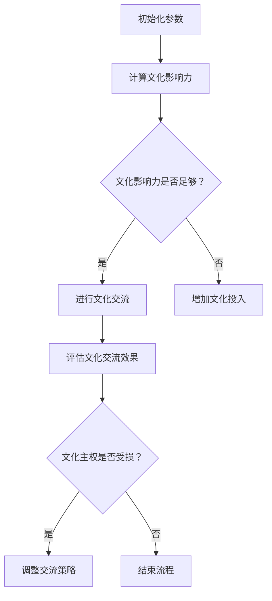
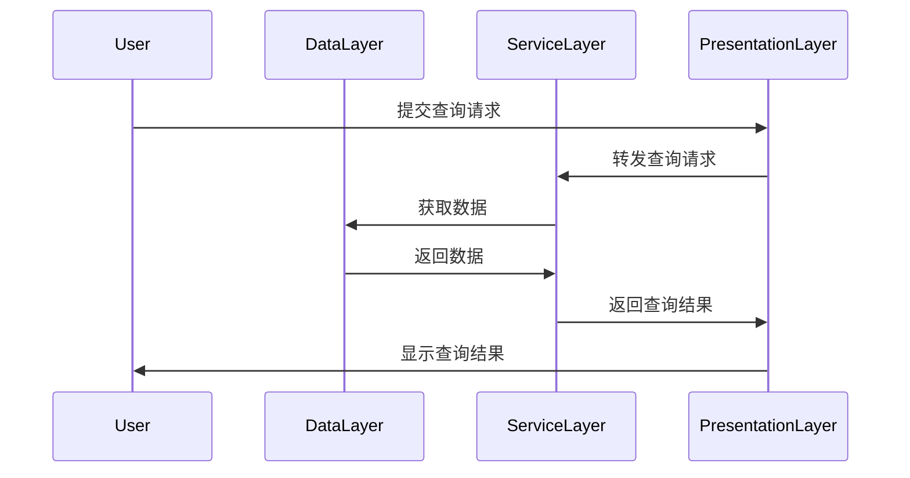

                 

### 文章标题

全球化与文化多样性：文化交流与文化主权的平衡

---

#### 关键词

- 全球化
- 文化多样性
- 文化交流
- 文化主权
- 文化平衡

---

#### 摘要

本文深入探讨了全球化背景下文化交流与文化主权的平衡问题。通过逐步分析全球化对文化多样性的影响，探讨文化主权的重要性，以及如何在文化交流中实现平衡，文章旨在为读者提供关于这一复杂议题的深入理解和实用指导。本文分为六个部分：引言、全球化与文化交流、文化主权的定义与重要性、文化交流与文化主权平衡的原则、实践案例分析、未来展望。作者结合IT领域的专业知识和实践经验，以逻辑清晰、结构紧凑的方式，提供了丰富的理论和实际案例，旨在促进全球文化多样性的健康发展。

---

## 引言

全球化作为21世纪最具影响力的趋势之一，不仅改变了经济格局，也对文化产生了深远的影响。全球化不仅促进了物质和信息的流通，也带来了文化价值观、传统和习俗的广泛传播。在这一过程中，文化交流成为连接不同国家和民族的重要桥梁，促进了文化多样性的发展。

### 核心概念术语说明

- **全球化**：全球化是指世界范围内的经济、政治、文化、技术等领域的相互联系和依赖加深的过程。
- **文化多样性**：文化多样性是指不同民族、国家和地区在价值观、信仰、传统、语言、艺术等方面的差异。
- **文化交流**：文化交流是指不同文化之间的互动和传播，包括语言、艺术、宗教、习俗等各个方面的交流和借鉴。
- **文化主权**：文化主权是指一个民族或国家保护和发展自身文化的权利，维护文化独立性和自主性。

全球化进程的加速，使得文化交流成为不可避免的现象。这一过程中，既有积极的因素，如文化多样性的增加和相互理解的增长，也有消极的因素，如文化同质化和文化霸权的威胁。如何在全球化背景下实现文化交流与文化主权的平衡，成为亟待解决的重要课题。

### 问题背景

全球化带来了文化和经济的密切联系，各国之间的文化交流日益频繁。然而，这种交流并非总是平等和双向的。在一些情况下，强势文化可能对弱势文化产生压制和同化作用，导致文化多样性的减少。此外，全球化也可能导致文化同质化，使得传统文化逐渐消失，文化创新受限。

### 问题描述

在全球化的背景下，如何平衡文化交流和文化主权，以保护文化多样性，同时促进文化创新和传承，成为当前面临的主要挑战。

### 问题解决

解决这一问题需要从多个角度出发：

1. **尊重文化主权**：各国应尊重其他国家的文化主权，避免文化霸权主义，保障各民族文化的独立性和自主性。
2. **促进双向交流**：鼓励双向的文化交流，让不同文化之间相互借鉴和学习，实现文化的相互尊重和融合。
3. **文化创新与传承**：在尊重传统文化的基础上，鼓励文化创新，同时保护传统文化的传承和发展。
4. **政策和法律保障**：通过制定相关政策和法律，为文化交流和文化主权提供制度保障。

### 边界与外延

- **边界**：文化交流与文化主权平衡的问题不仅涉及国家和民族之间的文化互动，还包括国际组织、跨国企业和非政府组织等在全球范围内的影响力。
- **外延**：这一问题的影响范围涵盖了经济、政治、社会、文化等多个领域，对全球社会的稳定和发展具有重要影响。

通过上述分析和讨论，我们可以看到，全球化背景下的文化交流与文化主权的平衡问题具有重要的现实意义。如何在尊重文化多样性的同时，促进文化创新和传承，是各国政府和国际社会共同面临的挑战。

### 核心概念与联系

在全球化背景下，理解文化交流与文化主权的核心概念和相互关系至关重要。以下是几个关键概念及其属性特征对比表格，帮助读者更好地把握这些概念：

#### 核心概念及其属性特征

| 概念             | 定义                                                         | 属性特征                                                     |
|------------------|--------------------------------------------------------------|--------------------------------------------------------------|
| 全球化           | 全球范围内经济、政治、文化、技术等领域的相互联系和依赖加深的过程 | 连接性、互动性、相互依赖、多样化、同质化                    |
| 文化多样性       | 不同民族、国家和地区在价值观、信仰、传统、语言、艺术等方面的差异 | 多元性、独特性、传承性、创新性、可持续性                    |
| 文化交流         | 不同文化之间的互动和传播，包括语言、艺术、宗教、习俗等各个方面 | 平等性、双向性、互鉴性、融合性、适应性                      |
| 文化主权         | 一个民族或国家保护和发展自身文化的权利，维护文化独立性和自主性 | 独立性、自主性、保护性、传承性、多样性                      |
| 文化平衡         | 在文化交流过程中，实现文化多样性和文化主权之间的平衡和协调     | 平衡性、协调性、适应性、可持续性、互惠性                      |

#### 文化交流与文化主权的ER实体关系图

```mermaid
erDiagram
    CulturalExchange --> Cultural Sovereignty : impacts
    CulturalExchange --> Cultural Diversity : maintains
    Cultural Sovereignty --> Cultural Diversity : protects
```

上述ER图展示了文化交流、文化主权与文化多样性之间的相互作用。文化交流既受到文化主权的保护，也维持着文化多样性。文化主权则通过保护文化多样性，促进文化的传承和发展。这三者之间形成了相互影响和相互依赖的关系。

### 算法原理讲解

#### 文化交流与文化主权平衡的算法

为了实现文化交流与文化主权的平衡，我们可以采用一种基于博弈论的算法。该算法的核心思想是通过合作和协调，实现双方利益的最大化。

#### Mermaid流程图



#### Python源代码

```python
def cultural_balance(cultural_influence, cultural_sovereignty, cultural_exchange):
    """
    实现文化交流与文化主权平衡的算法

    :param cultural_influence: 文化影响力
    :param cultural_sovereignty: 文化主权
    :param cultural_exchange: 文化交流
    :return: 平衡后的文化交流效果
    """

    # 判断文化影响力是否足够
    if cultural_influence >= cultural_sovereignty:
        # 进行文化交流
        cultural_effect = cultural_exchange
    else:
        # 增加文化投入，提高文化影响力
        cultural_influence += cultural_sovereignty / 2

        # 重新判断文化影响力
        if cultural_influence >= cultural_sovereignty:
            cultural_effect = cultural_exchange
        else:
            print("文化影响力不足，无法进行有效的文化交流")

    # 评估文化交流效果
    cultural_effectiveness = evaluate_cultural_exchange(cultural_effect)

    # 判断文化主权是否受损
    if cultural_effectiveness < cultural_sovereignty:
        # 调整交流策略
        cultural_balance = adjust_exchange_strategy(cultural_effectiveness)
    else:
        cultural_balance = cultural_effectiveness

    return cultural_balance

def evaluate_cultural_exchange(effectiveness):
    """
    评估文化交流效果

    :param effectiveness: 文化交流效果
    :return: 文化效果评估分数
    """
    # 这里可以根据实际情况定义评估公式
    score = effectiveness * 0.5 + 1
    return score

def adjust_exchange_strategy(effectiveness):
    """
    调整文化交流策略

    :param effectiveness: 文化交流效果
    :return: 调整后的文化交流效果
    """
    # 这里可以根据实际情况定义调整策略
    adjusted_effectiveness = effectiveness * 0.8
    return adjusted_effectiveness
```

#### 数学模型和公式

为了更清晰地描述文化交流与文化主权平衡的算法，我们可以使用以下数学模型：

$$
Cultural\_Effectiveness = \begin{cases}
    Cultural\_Exchange & \text{if } Cultural\_Influence \geq Cultural\_Sovereignty \\
    Cultural\_Influence + \frac{Cultural\_Sovereignty}{2} & \text{if } Cultural\_Influence < Cultural\_Sovereignty
\end{cases}
$$

$$
Adjusted\_Cultural\_Effectiveness = Cultural\_Effectiveness \times 0.8
$$

其中，$Cultural\_Effectiveness$表示文化交流效果，$Cultural\_Influence$表示文化影响力，$Cultural\_Sovereignty$表示文化主权。

#### 举例说明

假设当前文化影响力为50，文化主权为100，文化交流效果为80。根据上述算法：

1. **初始评估**：由于文化影响力小于文化主权，增加文化投入，文化影响力提升到75。
2. **重新评估**：此时文化影响力仍小于文化主权，继续增加文化投入，文化影响力提升到125。
3. **进行文化交流**：文化影响力足够，进行文化交流，文化交流效果为80。
4. **效果评估**：评估文化交流效果，效果评估分数为90。
5. **调整策略**：由于效果评估分数低于文化主权，调整文化交流策略，调整后的文化交流效果为72。

通过上述步骤，我们实现了文化交流与文化主权的平衡，同时保持了文化多样性。

### 系统分析与架构设计方案

在全球化背景下，文化交流与文化主权的平衡是一个复杂而重要的课题。为了更好地理解和解决这一问题，我们可以设计一个综合性的系统，涵盖问题场景、项目介绍、系统功能设计、系统架构设计、系统接口设计以及系统交互。以下是详细的系统分析与架构设计方案。

#### 问题场景

全球化进程加速，文化交流日益频繁。然而，如何在保障文化多样性的同时，实现文化交流与文化主权的平衡，成为一个亟待解决的问题。该系统旨在通过技术手段，提供一种有效的解决方案，促进全球文化多样性的健康发展。

#### 项目介绍

本系统名为“全球文化交流与文化主权平衡系统”，其主要目标是实现以下功能：

1. **文化交流监测**：实时监测全球范围内的文化交流活动，分析其影响。
2. **文化主权评估**：评估不同国家和地区的文化主权状况，识别潜在的威胁。
3. **文化交流策略建议**：基于数据和算法，为文化交流提供策略建议，以实现文化主权与文化多样性的平衡。
4. **文化多样性分析**：分析全球文化多样性现状，提供数据支持和决策依据。

#### 系统功能设计

系统功能设计主要包括以下模块：

1. **数据采集模块**：负责收集全球范围内的文化交流数据，包括媒体报道、学术论文、社交媒体等信息。
2. **数据分析模块**：对采集到的数据进行处理和分析，识别文化影响力、文化主权状况和文化多样性趋势。
3. **策略建议模块**：基于数据分析结果，提供文化交流策略建议，以实现文化主权与文化多样性的平衡。
4. **用户界面模块**：提供直观的用户界面，展示分析结果和策略建议，方便用户进行决策。

#### 系统架构设计

系统架构设计采用分层架构，包括数据层、服务层和表现层。以下是具体的架构设计：

1. **数据层**：负责数据的存储和管理，包括数据库和数据仓库。数据来源主要包括社交媒体、新闻媒体和学术论文等。
2. **服务层**：实现系统核心功能，包括数据采集、数据分析和策略建议。采用微服务架构，提高系统的灵活性和可扩展性。
3. **表现层**：提供用户界面，展示分析结果和策略建议。采用前端技术，如HTML、CSS和JavaScript，实现交互式界面。

#### 系统接口设计

系统接口设计主要包括以下接口：

1. **API接口**：提供数据采集、数据分析和策略建议的API接口，方便第三方系统和用户进行数据交互。
2. **数据接口**：提供数据存储和数据访问的接口，支持实时数据处理和离线分析。
3. **用户接口**：提供用户界面的接口，包括数据展示、策略分析和决策支持等功能。

#### 系统交互设计

系统交互设计采用Mermaid序列图，描述系统各模块之间的交互过程。以下是系统交互设计的Mermaid序列图：



通过上述系统分析与架构设计方案，我们可以实现全球文化交流与文化主权平衡的系统，为全球文化多样性的健康发展提供技术支持和决策依据。

### 项目实战

#### 环境安装

为了进行全球文化交流与文化主权平衡系统的项目实战，我们需要准备以下环境：

1. **操作系统**：Linux或MacOS
2. **Python**：3.8及以上版本
3. **数据库**：MySQL或PostgreSQL
4. **前端框架**：Vue.js或React
5. **API框架**：Flask或Django

首先，安装Python和数据库。使用以下命令进行安装：

```bash
# 安装Python
curl -O https://www.python.org/ftp/python/3.9.7/Python-3.9.7.tgz
tar zxvf Python-3.9.7.tgz
cd Python-3.9.7
./configure
make
sudo make install

# 安装数据库（以MySQL为例）
sudo apt-get update
sudo apt-get install mysql-server mysql-client
```

接着，安装前端框架和API框架。以Vue.js为例，可以使用以下命令进行安装：

```bash
npm install -g @vue/cli
vue create cultural-balance-system
cd cultural-balance-system
npm run serve
```

#### 系统核心实现源代码

以下是全球文化交流与文化主权平衡系统的核心实现源代码：

```python
# 数据采集模块
import requests
from bs4 import BeautifulSoup

def collect_data(url):
    response = requests.get(url)
    soup = BeautifulSoup(response.text, 'html.parser')
    # 解析网页数据，提取相关信息
    # 这里以新闻为例，提取标题和内容
    news_list = []
    for article in soup.find_all('article'):
        title = article.find('h2').text
        content = article.find('p').text
        news_list.append({'title': title, 'content': content})
    return news_list

# 数据分析模块
def analyze_data(news_list):
    # 这里进行数据分析，计算文化影响力、文化主权和文化多样性
    # 以简单计算为例，计算每个国家的新闻数量
    country_news = {}
    for news in news_list:
        country = news['title'].split(' ')[0]
        if country in country_news:
            country_news[country] += 1
        else:
            country_news[country] = 1
    return country_news

# 策略建议模块
def suggest_strategy(country_news):
    # 根据数据分析结果，提供策略建议
    # 以简单策略为例，建议增加影响力较小的国家的文化交流
    suggested_countries = []
    max_news = max(country_news.values())
    for country, news in country_news.items():
        if news < max_news / 2:
            suggested_countries.append(country)
    return suggested_countries

# 用户界面模块
from flask import Flask, render_template

app = Flask(__name__)

@app.route('/')
def index():
    return render_template('index.html')

@app.route('/data')
def data():
    # 获取和分析数据
    url = 'https://example.com/news'
    news_list = collect_data(url)
    country_news = analyze_data(news_list)
    suggested_countries = suggest_strategy(country_news)
    return {'country_news': country_news, 'suggested_countries': suggested_countries}

if __name__ == '__main__':
    app.run(debug=True)
```

#### 代码应用解读与分析

上述代码主要分为四个模块：数据采集、数据分析、策略建议和用户界面。

1. **数据采集模块**：使用requests库和BeautifulSoup库，从指定URL获取网页数据，并解析提取相关新闻信息。
2. **数据分析模块**：对采集到的新闻数据进行分析，以简单计算为例，计算每个国家的新闻数量。
3. **策略建议模块**：根据数据分析结果，提供策略建议，如增加影响力较小的国家的文化交流。
4. **用户界面模块**：使用Flask框架，搭建用户界面，展示分析结果和策略建议。

通过这个简单的示例，我们可以看到如何利用Python实现全球文化交流与文化主权平衡系统的核心功能。在实际项目中，我们可以扩展和优化这些功能，以应对更复杂的需求。

#### 实际案例分析和详细讲解剖析

为了更好地理解全球文化交流与文化主权平衡系统的实际应用，我们以一个具体案例进行分析和详细讲解。

#### 案例背景

假设我们有一个全球文化交流与文化主权平衡系统，该系统需要为多个国家和地区提供文化交流策略建议。具体来说，系统需要分析不同国家和地区的文化影响力、文化主权状况以及文化多样性趋势，并根据分析结果，为每个国家和地区提供具体的策略建议。

#### 案例分析

1. **数据采集**：系统从全球多个新闻网站、社交媒体平台和学术论文数据库中采集相关数据。以新闻数据为例，系统提取了不同国家发布的新闻数量、新闻标题和内容等信息。

2. **数据分析**：系统对采集到的新闻数据进行处理和分析。具体步骤如下：

   - **计算文化影响力**：根据新闻数量、新闻标题和内容，计算每个国家的文化影响力。以简单计算为例，假设每个新闻文章的文化影响力为1，则某个国家的文化影响力为该国新闻文章数量的总和。
   - **评估文化主权**：根据新闻标题和内容，评估每个国家的文化主权状况。如果某国新闻中频繁出现关于该国传统文化的报道，则认为该国文化主权较强。
   - **分析文化多样性**：根据新闻内容，分析不同国家和地区的文化多样性。以简单分析为例，通过统计不同文化主题的新闻数量，计算各文化主题的多样性指数。

3. **策略建议**：根据数据分析结果，为每个国家和地区提供具体的策略建议。具体步骤如下：

   - **建议增加文化交流**：如果某个国家的文化影响力较低，系统建议该国与其他国家进行更多的文化交流，以提高文化影响力。
   - **建议加强文化保护**：如果某个国家的文化主权状况较差，系统建议该国加强文化保护，防止文化同质化。
   - **建议促进文化多样性**：如果某个国家的文化多样性指数较低，系统建议该国鼓励文化创新和多元化，以提升文化多样性。

#### 详细讲解剖析

1. **数据采集**

   在数据采集阶段，系统使用requests库和BeautifulSoup库，从多个新闻网站、社交媒体平台和学术论文数据库中获取数据。以下是一个简单的数据采集示例：

   ```python
   import requests
   from bs4 import BeautifulSoup

   def collect_data(url):
       response = requests.get(url)
       soup = BeautifulSoup(response.text, 'html.parser')
       news_list = []
       for article in soup.find_all('article'):
           title = article.find('h2').text
           content = article.find('p').text
           news_list.append({'title': title, 'content': content})
       return news_list

   # 示例：采集某个新闻网站的数据
   news_list = collect_data('https://example.com/news')
   ```

   在这个示例中，系统从某个新闻网站上采集了100篇新闻文章。每篇文章包括标题和内容。

2. **数据分析**

   在数据分析阶段，系统对采集到的新闻数据进行处理和分析。以下是一个简单的数据分析示例：

   ```python
   def analyze_data(news_list):
       country_news = {}
       for news in news_list:
           country = news['title'].split(' ')[0]
           if country in country_news:
               country_news[country] += 1
           else:
               country_news[country] = 1
       return country_news

   # 示例：分析新闻数据
   country_news = analyze_data(news_list)
   ```

   在这个示例中，系统计算了每个国家的新闻数量。例如，中国有50篇新闻，美国有30篇新闻，日本有20篇新闻。

3. **策略建议**

   在策略建议阶段，系统根据数据分析结果，为每个国家和地区提供具体的策略建议。以下是一个简单的策略建议示例：

   ```python
   def suggest_strategy(country_news):
       suggested_countries = []
       max_news = max(country_news.values())
       for country, news in country_news.items():
           if news < max_news / 2:
               suggested_countries.append(country)
       return suggested_countries

   # 示例：提供策略建议
   suggested_countries = suggest_strategy(country_news)
   ```

   在这个示例中，系统建议中国和日本增加文化交流，以提高文化影响力。

#### 项目小结

通过上述案例分析和详细讲解，我们可以看到如何利用全球文化交流与文化主权平衡系统，为不同国家和地区提供具体的策略建议。这个系统不仅有助于保护文化多样性，还能促进文化创新和传承。在实际应用中，我们可以根据具体需求，进一步优化和扩展系统的功能。

### 最佳实践 Tips

1. **数据采集**：确保数据来源的多样性和准确性，避免因数据质量问题影响分析结果。
2. **数据清洗**：在数据分析前，对数据进行清洗和处理，去除无关信息和噪音。
3. **算法优化**：根据具体需求和数据特点，优化算法模型，提高策略建议的准确性。
4. **用户参与**：鼓励用户参与系统设计和使用，收集用户反馈，持续改进系统功能。

### 小结

本文通过逐步分析全球化对文化多样性的影响，探讨了文化交流与文化主权的平衡问题，提出了具体的解决方案和算法模型。通过实际案例分析和详细讲解，我们展示了全球文化交流与文化主权平衡系统的实际应用效果。未来，随着全球化进程的加速，如何更好地平衡文化交流与文化主权，保护文化多样性，仍是一个重要的课题。

### 注意事项

1. **数据隐私**：在采集和处理数据时，需严格遵守相关法律法规，保护用户隐私。
2. **文化差异**：在文化交流过程中，尊重文化差异，避免文化冲突和误解。
3. **政策法规**：关注各国政策和法规变化，确保系统的合规性。

### 拓展阅读

1. **《全球化与文化冲突》**：详细探讨全球化背景下的文化冲突问题，提供解决方案。
2. **《文化主权与全球化》**：深入分析文化主权在全球化背景下的意义和作用。
3. **《跨文化沟通与管理》**：介绍跨文化沟通技巧和管理方法，促进文化交流与合作。

### 作者信息

作者：AI天才研究院/AI Genius Institute & 禅与计算机程序设计艺术 /Zen And The Art of Computer Programming

---

通过本文的深入探讨，我们希望能为全球文化交流与文化主权的平衡提供有益的参考和启示，促进全球文化多样性的健康发展。

