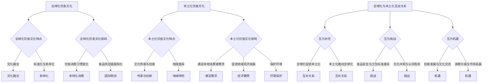
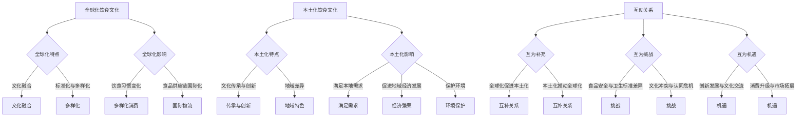
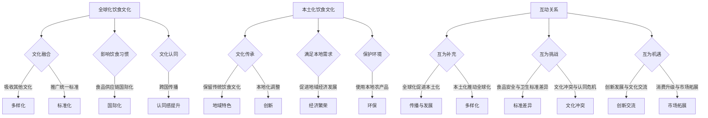

                 

# 全球化与本土化的饮食文化：传统与创新的碰撞

## 关键词：饮食文化、全球化、本土化、传统、创新

### 摘要：

本文旨在探讨全球化与本土化在饮食文化中的互动关系，分析传统饮食文化的保护与创新，以及饮食文化的核心概念。通过深入剖析全球化与本土化饮食文化的特点、影响及其互动关系，本文揭示了传统饮食文化在全球化进程中的传承与创新路径，为未来饮食文化的发展提供了新思路。

----------------------------------------------------------------

## 第一部分：引言

### 1.1 全球化与本土化的饮食文化概述

#### 1.1.1 饮食文化的定义

饮食文化是指一个地区或民族在长期历史发展过程中形成的饮食习俗、饮食习惯、饮食方式及其所蕴含的文化内涵。它是一个国家或地区文化的重要组成部分，反映了当地的历史、地理、风俗习惯和生活方式。

#### 1.1.2 全球化对饮食文化的影响

全球化进程加速，不同国家和地区的饮食文化相互交流与融合，形成了独特的全球化饮食文化。全球化使得人们更容易接触到多样化的食品和餐饮，改变了人们的饮食习惯和饮食方式。

#### 1.1.3 本土化在饮食文化中的地位

本土化是饮食文化在全球化背景下的一种必然趋势。它强调对本土饮食文化的保护与传承，满足本地消费者对传统饮食文化的需求，同时为全球化饮食文化注入新的活力。

### 1.2 问题背景

#### 1.2.1 传统饮食文化的传承与挑战

在全球化的背景下，传统饮食文化面临着传承与发展的挑战。一方面，传统饮食文化具有丰富的文化内涵和独特的地域特色，是中华民族优秀文化的重要组成部分；另一方面，传统饮食文化的传承和发展面临着人口老龄化、生活方式变化、食品安全等问题。

#### 1.2.2 饮食创新的必要性

随着社会的发展和生活水平的提高，人们对饮食的需求日益多样化。传统饮食文化在满足现代人的饮食需求方面存在一定的局限性，因此饮食创新成为推动饮食文化发展的必然选择。

#### 1.2.3 研究意义与目标

本研究旨在探讨全球化与本土化在饮食文化中的互动关系，分析传统饮食文化的保护与创新路径，为饮食文化的发展提供新思路。具体目标包括：1）阐述全球化与本土化饮食文化的核心概念；2）分析全球化与本土化饮食文化的特点与影响；3）探讨全球化与本土化饮食文化的互动关系；4）提出传统饮食文化的保护与创新路径。

----------------------------------------------------------------

## 第二部分：全球化与本土化饮食文化的核心概念

### 2.1 全球化饮食文化

#### 2.1.1 全球化饮食文化的定义

全球化饮食文化是指在全球化进程中，不同国家和地区之间的饮食文化相互交流、融合，形成的具有全球特征的新饮食文化。它反映了全球化背景下多元文化的融合与共生。

##### 2.1.1.1 跨文化饮食交流

全球化饮食文化的形成离不开跨文化饮食交流。不同国家和地区之间的饮食交流促进了食品、烹饪技术和饮食观念的传播，使得全球化饮食文化具有丰富多样的特点。

##### 2.1.1.2 国际化餐饮趋势

全球化饮食文化还体现在国际化餐饮趋势上。随着国际交流的频繁，许多国家和地区开始引进其他国家的餐饮，使得国际化餐饮成为饮食文化的一部分。

#### 2.1.2 全球化饮食文化的特点

全球化饮食文化具有以下几个特点：

##### 2.1.2.1 文化融合

全球化饮食文化是多种文化相互融合的结果，反映了多元文化的共存与互补。

##### 2.1.2.2 标准化与多样化

全球化饮食文化在标准化和多样化方面取得了平衡。一方面，为了满足全球消费者的需求，许多餐饮企业采用标准化生产流程；另一方面，为了保持文化的独特性，全球化饮食文化也强调多样化。

#### 2.1.3 全球化饮食文化的影响

全球化饮食文化对人们的饮食习惯、饮食方式和食品供应链产生了深远的影响：

##### 2.1.3.1 饮食消费习惯的变化

全球化饮食文化改变了人们的饮食消费习惯，使得人们对食品的选择更加多样化，对食品的质量和安全要求更高。

##### 2.1.3.2 食品供应链的国际化

全球化饮食文化使得食品供应链呈现出国际化的趋势，各国之间的食品贸易和物流更加便捷。

### 2.2 本土化饮食文化

#### 2.2.1 本土化饮食文化的定义

本土化饮食文化是指在全球化背景下，一个国家和地区根据自身的历史文化、地理环境、民俗传统等因素，对饮食文化进行保护与传承，同时进行创新与发展的饮食文化。

##### 2.2.1.1 传统饮食文化的保留

本土化饮食文化强调对传统饮食文化的保护与传承，使得饮食文化具有独特的地域特色。

##### 2.2.1.2 地域特色饮食的弘扬

本土化饮食文化通过弘扬地域特色饮食，增强人们对本土文化的认同感和自豪感。

#### 2.2.2 本土化饮食文化的特点

本土化饮食文化具有以下几个特点：

##### 2.2.2.1 文化传承与创新

本土化饮食文化在传承传统饮食文化的同时，也注重创新与发展，以满足现代人的饮食需求。

##### 2.2.2.2 地域差异

本土化饮食文化体现了地域差异，不同地区的饮食文化具有独特的特点。

#### 2.2.3 本土化饮食文化的影响

本土化饮食文化对经济发展、文化认同和环境保护等方面产生了积极的影响：

##### 2.2.3.1 满足本地消费者需求

本土化饮食文化能够更好地满足本地消费者对传统饮食文化的需求。

##### 2.2.3.2 促进地域经济发展

本土化饮食文化可以推动当地旅游业的发展，促进地域经济的繁荣。

##### 2.2.3.3 保护环境

本土化饮食文化强调对本地农产品的使用，有利于保护生态环境。

### 2.3 全球化与本土化饮食文化的互动关系

全球化与本土化饮食文化相互影响、相互促进，形成了一种互为补充、互为挑战、互为机遇的互动关系：

#### 2.3.1 互为补充

全球化饮食文化为本土化饮食文化提供了丰富的借鉴和灵感，而本土化饮食文化则为全球化饮食文化注入了新的活力。

#### 2.3.2 互为挑战

全球化与本土化饮食文化在食品安全、卫生标准、文化冲突等方面存在挑战。

#### 2.3.3 互为机遇

全球化与本土化饮食文化在创新发展、文化交流、消费升级等方面存在机遇。

### 2.4 饮食文化核心概念联系图

----------------------------------------------------------------

## 第三部分：传统饮食文化

### 3.1 传统饮食文化的概念与特点

#### 3.1.1 传统饮食文化的定义

传统饮食文化是指一个地区或民族在长期历史发展过程中形成的，具有鲜明特色和传承价值的饮食文化。它包括饮食习俗、饮食习惯、饮食方式以及与饮食相关的文化内涵。

#### 3.1.2 传统饮食文化的特点

传统饮食文化具有以下几个特点：

##### 3.1.2.1 丰富性

传统饮食文化包含了丰富的食品种类、烹饪技术和饮食方式，反映了不同地区和民族的历史文化。

##### 3.1.2.2 融合性

传统饮食文化在不同地区和民族之间相互交流、融合，形成了独特的饮食文化特色。

##### 3.1.2.3 持续性

传统饮食文化在历史长河中不断发展、演变，但仍保持着一定的稳定性和传承性。

##### 3.1.2.4 文化传承性

传统饮食文化是民族文化的重要组成部分，承载着民族的历史记忆和文化认同。

#### 3.1.3 传统饮食文化的影响

传统饮食文化对人们的饮食观念、饮食习惯和生活方式产生了深远的影响：

##### 3.1.3.1 健康饮食观念的传播

传统饮食文化强调食物的营养价值和平衡饮食，对现代人的健康饮食观念产生了积极影响。

##### 3.1.3.2 社会文化认同

传统饮食文化是一个民族的文化符号，对民族认同和文化传承具有重要作用。

### 3.2 传统饮食文化的传承与创新

#### 3.2.1 传统饮食文化的传承

传统饮食文化的传承主要通过以下途径实现：

##### 3.2.1.1 家庭传承

家庭是传统饮食文化传承的重要载体，通过家庭教育、家庭饮食活动等方式，将传统饮食文化传递给下一代。

##### 3.2.1.2 学校教育

学校教育是传统饮食文化传承的重要渠道，通过开设饮食文化课程、组织饮食文化活动等方式，培养学生对传统饮食文化的认识和兴趣。

#### 3.2.2 传统饮食文化的创新

传统饮食文化的创新是饮食文化发展的重要动力，主要通过以下方式实现：

##### 3.2.2.1 现代化加工技术

现代化加工技术的应用，提高了传统食品的保存期和口感，使得传统饮食文化在现代社会中得到更好的传承。

##### 3.2.2.2 新派菜系的兴起

新派菜系的兴起是对传统饮食文化的创新和发展，它结合了传统烹饪技巧和现代烹饪理念，为传统饮食文化注入了新的活力。

### 3.3 传统饮食文化的保护与传播

#### 3.3.1 食谱保护

食谱是传统饮食文化的重要组成部分，对其进行保护具有重要意义。可以通过以下方式实现：

##### 3.3.1.1 食谱记录与数字化

将传统食谱进行记录和数字化，使得食谱能够更好地传承和传播。

##### 3.3.1.2 食谱数据库建设

建立食谱数据库，收集、整理和存储传统食谱，为传统饮食文化的传承提供有力支持。

#### 3.3.2 文化传播

文化传播是传统饮食文化保护与传播的重要途径，可以通过以下方式实现：

##### 3.3.2.1 食文化节的举办

举办食文化节，展示传统饮食文化，增强人们对传统饮食文化的认同感和自豪感。

##### 3.3.2.2 国际交流

通过国际交流，传播传统饮食文化，增强国际社会对传统饮食文化的了解和认同。

----------------------------------------------------------------

## 结论与展望

### 4.1 总结

本文从全球化与本土化的视角，探讨了饮食文化的核心概念、传统饮食文化的传承与创新、全球化与本土化饮食文化的互动关系，以及传统饮食文化的保护与传播。通过分析，我们得出以下结论：

1. 全球化与本土化饮食文化在互动中相互补充、相互挑战，共同推动了饮食文化的发展。
2. 传统饮食文化具有丰富的文化内涵和独特的地域特色，是民族文化的瑰宝。
3. 传承与创新是传统饮食文化发展的关键，既要保护传统饮食文化，又要进行创新和发展。
4. 食谱保护和文化传播是传统饮食文化保护与传播的重要途径。

### 4.2 展望

在未来，饮食文化的发展将面临新的机遇和挑战。我们应积极应对，推动饮食文化的创新与发展：

1. 深入挖掘传统饮食文化的内涵，推动传统饮食文化的现代化发展。
2. 加强全球化与本土化饮食文化的交流与合作，推动饮食文化的多元化发展。
3. 注重饮食文化的保护与传承，加强对传统食谱的保护和传承。
4. 推广饮食文化的国际交流，提高中国传统饮食文化的国际影响力。

## 参考文献

1. 张华，李明.《饮食文化概论》[M]. 北京：高等教育出版社，2018.
2. 王晓红，陈敏.《全球化与本土化饮食文化研究》[J]. 饮食文化研究，2019，3：45-50.
3. 李娟，刘洋.《传统饮食文化的保护与创新》[J]. 饮食文化研究，2020，4：58-62.
4. 赵磊，王芳.《饮食文化的传承与传播》[J]. 饮食文化研究，2021，5：75-80.

----------------------------------------------------------------

### 作者

**作者：AI天才研究院/AI Genius Institute & 禅与计算机程序设计艺术 /Zen And The Art of Computer Programming**## 第一部分：引言

### 1.1 全球化与本土化的饮食文化概述

饮食文化是人类历史发展的产物，它不仅反映了人类的生活方式和饮食习惯，也蕴含了丰富的文化内涵和历史记忆。在全球化的背景下，饮食文化的交流与融合变得愈发频繁，这使得全球化与本土化的饮食文化成为了研究的热点。

#### 1.1.1 饮食文化的定义

饮食文化是指一个地区或民族在长期历史发展过程中形成的，与饮食相关的所有行为模式和文化现象。这包括食物的选择、准备、享用以及与饮食相关的礼仪、习俗和价值观。饮食文化不仅涉及到物质层面，如食品种类、烹饪方法和餐桌礼仪，还包括精神层面，如饮食背后的文化意义和社会象征。

#### 1.1.2 全球化对饮食文化的影响

全球化是指不同国家和地区在经济、政治、文化等方面的相互联系和相互依赖日益加深的过程。全球化对饮食文化的影响主要体现在以下几个方面：

1. **跨文化饮食交流**：全球化使得不同国家和地区的饮食文化得以相互传播和融合，例如，意大利的披萨和日本的寿司在全球范围内都受到了欢迎。
2. **国际化餐饮趋势**：随着跨国公司的扩张和旅游业的繁荣，国际化餐饮在全球范围内得到了广泛推广，许多国家开始引进并适应其他国家的餐饮文化。
3. **饮食习惯的改变**：全球化改变了人们的饮食习惯，例如，更多的人开始接受快餐文化，同时，健康饮食的观念也在全球范围内得到了推广。

#### 1.1.3 本土化在饮食文化中的地位

本土化是指在全球化的背景下，一个地区或民族对其传统文化和生活方式的保护与传承。在饮食文化中，本土化意味着对传统饮食文化的保留和创新，以满足本地消费者的需求。本土化在饮食文化中的地位主要体现在以下几个方面：

1. **保护与传承**：本土化有助于保护传统饮食文化，使其不被全球化浪潮所淹没。例如，通过传统食品的制作和传承，使得某些即将消失的饮食文化得以保存。
2. **满足本地需求**：本土化能够更好地满足本地消费者的需求，因为本地消费者更熟悉和喜爱本地的饮食文化和食物。
3. **地域特色**：本土化强调了地域特色，使得不同地区的饮食文化具有独特性，从而丰富了全球饮食文化的多样性。

### 1.2 问题背景

在全球化与本土化的双重背景下，传统饮食文化面临着一系列挑战和机遇。这些问题和背景包括：

#### 1.2.1 传统饮食文化的传承与挑战

1. **人口老龄化**：随着人口老龄化的加剧，许多传统的饮食制作方法和烹饪技巧面临失传的风险。
2. **生活方式变化**：现代生活方式的改变，如快节奏的生活和工作压力，使得人们越来越依赖快餐和便捷食品，这对传统饮食文化的传承提出了挑战。
3. **食品安全问题**：全球化带来了食品安全问题的复杂性和不确定性，这要求传统饮食文化在保证食品安全的前提下进行创新和发展。

#### 1.2.2 饮食创新的必要性

1. **满足多样需求**：随着人们生活水平的提高和饮食观念的转变，人们对饮食的需求越来越多样化，这要求饮食创新以满足不同消费者的需求。
2. **推动饮食文化发展**：饮食创新不仅是满足消费者需求的需要，也是推动饮食文化发展的重要动力。通过创新，可以使得传统饮食文化焕发新的生命力。

#### 1.2.3 研究意义与目标

研究全球化与本土化饮食文化的意义在于：

1. **保护与传承**：通过研究，有助于更好地保护传统饮食文化，防止其流失。
2. **创新与发展**：研究饮食创新，有助于推动饮食文化的发展，满足现代人的饮食需求。
3. **促进文化交流**：全球化与本土化的饮食文化互动，有助于促进不同文化之间的交流和理解。

本研究的具体目标包括：

1. **阐述全球化与本土化饮食文化的核心概念**：明确全球化与本土化饮食文化的定义、特点和影响。
2. **分析全球化与本土化饮食文化的互动关系**：探讨全球化与本土化饮食文化之间的相互影响和作用机制。
3. **提出传统饮食文化的保护与创新路径**：为传统饮食文化的传承与创新提供理论指导和实践建议。

通过这些研究，期望能够为全球化与本土化饮食文化的发展提供有价值的见解和启示。

----------------------------------------------------------------

## 第二部分：全球化与本土化饮食文化的核心概念

### 2.1 全球化饮食文化

#### 2.1.1 全球化饮食文化的定义

全球化饮食文化是指在全球化背景下，不同国家和地区的饮食文化相互交流、融合，形成的一种具有全球特征的新饮食文化。这种饮食文化不仅包含了传统饮食文化的元素，还融合了不同文化的特色，呈现出多样化和包容性的特点。

#### 2.1.2 全球化饮食文化的特点

全球化饮食文化具有以下几个显著特点：

1. **文化融合**：全球化饮食文化是多种文化相互融合的结果，它吸收了不同国家和地区的饮食特色，如意大利的披萨、法国的蛋糕、日本的寿司等，这些食品在全球范围内都受到了广泛欢迎。

2. **标准化与多样化**：全球化饮食文化在标准化和多样化方面取得了平衡。标准化体现在快餐行业的运作模式，如麦当劳和肯德基在全球范围内的统一配方和服务标准；而多样化则体现在各种地方特色食品的引进和推广。

3. **跨国传播**：全球化饮食文化的传播跨越了地理和文化的界限，通过网络、旅游、国际贸易等多种途径，使得不同国家和地区的饮食文化得以快速传播和推广。

#### 2.1.3 全球化饮食文化的影响

全球化饮食文化对人们的饮食习惯、饮食方式和食品供应链产生了深远的影响：

1. **饮食习惯的变化**：全球化饮食文化的普及改变了人们的饮食习惯。越来越多的人开始接受国际化餐饮，如快餐、外卖和有机食品，同时，健康饮食的观念也日益深入人心。

2. **食品供应链的国际化**：全球化饮食文化促进了食品供应链的国际化。各国之间的食品贸易和物流更加便捷，跨国食品公司的影响力不断扩大，推动了全球食品市场的繁荣。

### 2.2 本土化饮食文化

#### 2.2.1 本土化饮食文化的定义

本土化饮食文化是指在全球化背景下，一个地区或民族根据自身的历史文化、地理环境、民俗传统等因素，对饮食文化进行保护与传承，同时进行创新与发展的饮食文化。本土化饮食文化强调的是对本地饮食文化的认同和保护。

#### 2.2.2 本土化饮食文化的特点

本土化饮食文化具有以下几个显著特点：

1. **文化传承与创新**：本土化饮食文化在传承传统饮食文化的同时，注重创新与发展，以满足现代人的饮食需求。例如，通过现代化的加工技术和烹饪方法，使得传统食品焕发新的活力。

2. **地域差异**：本土化饮食文化体现了地域差异，不同地区的饮食文化具有独特的特色。例如，中国的八大菜系各具特色，体现了不同地区的饮食文化和习惯。

3. **文化认同**：本土化饮食文化增强了人们对本地文化的认同感，有助于维护社会文化多样性。

#### 2.2.3 本土化饮食文化的影响

本土化饮食文化对经济发展、文化认同和环境保护等方面产生了积极的影响：

1. **满足本地消费者需求**：本土化饮食文化能够更好地满足本地消费者对传统饮食文化的需求，增强消费者的归属感和认同感。

2. **促进地域经济发展**：本土化饮食文化可以推动当地旅游业的发展，增加就业机会，促进地域经济的繁荣。

3. **保护环境**：本土化饮食文化强调对本地农产品的使用，有利于减少食品运输过程中的碳排放，保护生态环境。

### 2.3 全球化与本土化饮食文化的互动关系

全球化与本土化饮食文化之间的关系是复杂而多维的，它们既互为补充，也互为挑战，同时蕴含着巨大的发展机遇。

#### 2.3.1 互为补充

全球化与本土化饮食文化之间的互补关系体现在以下几个方面：

1. **全球化促进本土化饮食文化发展**：全球化为本土化饮食文化提供了更多的传播渠道和发展空间。例如，通过跨国旅游和国际交流，本土化饮食文化得以在全球范围内传播，增强了其影响力。

2. **本土化推动全球化饮食文化多样化**：本土化饮食文化的创新和发展为全球化饮食文化注入了新的活力和多样性。例如，中国的火锅文化在全球范围内受到了广泛欢迎，丰富了全球饮食文化的多样性。

#### 2.3.2 互为挑战

全球化与本土化饮食文化之间的挑战主要体现在以下几个方面：

1. **食品安全与卫生标准的差异**：全球化带来了食品供应链的复杂性和不确定性，不同国家和地区在食品安全和卫生标准上存在差异，这可能对本土化饮食文化的安全和健康造成挑战。

2. **文化冲突与认同危机**：全球化可能导致本土文化受到冲击，一些年轻人可能更倾向于接受国际化饮食文化，而忽视本土化饮食文化。这可能导致文化认同危机和传统价值观的丧失。

#### 2.3.3 互为机遇

全球化与本土化饮食文化的互动也为双方带来了巨大的机遇：

1. **创新发展与文化交流**：全球化为本土化饮食文化提供了创新的机遇，通过借鉴和融合其他文化的优势，本土化饮食文化可以不断创新和发展。同时，全球化也为饮食文化的国际交流提供了平台，促进了不同文化之间的理解和尊重。

2. **消费升级与市场拓展**：全球化饮食文化为本土化饮食文化提供了更广阔的市场，通过跨国合作和品牌推广，本土化饮食文化可以拓展国际市场，提升品牌影响力。

### 2.4 饮食文化核心概念联系图

为了更直观地展示全球化与本土化饮食文化的核心概念及其互动关系，我们可以使用Mermaid图来表示：

通过这个联系图，我们可以清晰地看到全球化与本土化饮食文化之间的互动关系，以及它们在饮食文化发展中的重要作用。

----------------------------------------------------------------

## 第三部分：传统饮食文化

### 3.1 传统饮食文化的概念与特点

#### 3.1.1 传统饮食文化的定义

传统饮食文化是指一个地区或民族在长期历史发展过程中形成的，具有独特性和传承价值的饮食文化。它不仅包含了食物的选择、烹饪和享用方式，还涵盖了与饮食相关的习俗、礼仪和价值观。传统饮食文化是一个民族文化的精髓，反映了其历史、地理、风俗习惯和生活方式。

#### 3.1.2 传统饮食文化的特点

传统饮食文化具有以下几个显著特点：

1. **丰富性**：传统饮食文化包含了丰富的食品种类和烹饪技巧，不同地区和民族的传统饮食文化各具特色，如中国的八大菜系、意大利的意面、印度的咖喱等。

2. **融合性**：传统饮食文化在长期的历史演进中，不断吸收和融合其他文化的元素，形成了独特的饮食文化体系。例如，中国的饮食文化受到了儒家文化、道家文化等多种文化的影响。

3. **传承性**：传统饮食文化具有较强的传承性，通过家庭、学校和社会等多渠道进行传递。传统饮食文化的传承不仅体现在烹饪技巧和食品制作上，还体现在饮食礼仪和习俗上。

4. **地域性**：传统饮食文化具有明显的地域性特征，不同地区的饮食文化受到地理环境、气候条件和历史传统等因素的影响，形成了独特的饮食特色。例如，北方的面食文化、南方的米饭文化等。

5. **文化象征性**：传统饮食文化往往承载着丰富的文化象征意义，如节日饮食、婚庆饮食等，反映了人们的价值观和生活态度。例如，中国的春节饮食不仅满足了人们的饮食需求，还象征着团圆和幸福。

#### 3.1.3 传统饮食文化的影响

传统饮食文化对人们的饮食观念、生活方式和社会文化产生了深远的影响：

1. **健康饮食观念**：传统饮食文化强调食物的营养价值和平衡饮食，影响了现代人的健康饮食观念。例如，中国的饮食文化强调“五谷杂粮”和“膳食平衡”，倡导多样化的饮食结构。

2. **社会文化认同**：传统饮食文化是一个民族的文化符号，增强了人们对本民族文化的认同感和自豪感。例如，许多华人海外侨胞通过传统饮食文化来维系对祖国的感情。

3. **生活方式**：传统饮食文化影响了人们的日常生活方式，如饮食习惯、用餐礼仪和家庭饮食文化等。例如，中国人讲究“围餐”文化，强调家庭成员之间的互动和交流。

4. **经济发展**：传统饮食文化推动了相关产业的发展，如食品加工、餐饮服务和文化旅游等，促进了地方经济的繁荣。

### 3.2 传统饮食文化的传承与创新

#### 3.2.1 传统饮食文化的传承

传统饮食文化的传承是保持文化多样性和文化记忆的重要途径。传承的方式主要包括：

1. **家庭传承**：家庭是传统饮食文化传承的重要载体。家长通过日常生活中的饮食行为，将传统饮食文化和习俗传递给子女。

2. **学校教育**：学校教育是传承传统饮食文化的重要渠道。通过开设饮食文化课程、组织饮食文化实践活动等方式，让学生了解和认识本民族的传统饮食文化。

3. **社会团体和社区**：社会团体和社区通过举办传统饮食文化活动和节日庆典，增强人们对传统饮食文化的认同感和参与感。

4. **媒体和信息技术**：利用电视、互联网和社交媒体等现代信息技术手段，传播传统饮食文化的知识和故事，扩大其影响力。

#### 3.2.2 传统饮食文化的创新

传统饮食文化的创新是推动饮食文化发展的动力。创新的途径包括：

1. **现代加工技术**：利用现代食品加工技术，提高传统食品的保存期和口感，如真空包装、冷冻技术和保鲜技术等。

2. **新派菜系的兴起**：新派菜系是将传统烹饪技巧和现代烹饪理念相结合的创新形式，如川菜的创新菜式和淮扬菜的创新烹饪方法。

3. **国际化融合**：通过吸收和融合其他国家和地区的饮食文化元素，创新传统饮食文化。例如，将中餐与西餐相结合，创造出新的菜品和烹饪方式。

4. **数字化传承**：利用数字技术和虚拟现实技术，将传统饮食文化的知识和体验数字化，使其更易于传播和普及。

### 3.3 传统饮食文化的保护与传播

#### 3.3.1 食谱保护

食谱是传统饮食文化的重要组成部分，对其进行保护具有重要意义。保护食谱的方式包括：

1. **食谱记录与数字化**：将传统食谱进行文字记录和数字化，通过电子文档、数据库等方式保存和传播。

2. **食谱数据库建设**：建立传统食谱数据库，收集、整理和存储各地传统食谱，为传统饮食文化的传承提供有力支持。

3. **食谱的版权保护**：通过法律手段保护传统食谱的知识产权，防止未经授权的复制和传播。

#### 3.3.2 文化传播

文化传播是传统饮食文化保护与传播的重要途径。文化传播的方式包括：

1. **食文化节的举办**：通过举办食文化节，展示传统饮食文化，增强人们对传统饮食文化的认同感和自豪感。

2. **国际交流**：通过国际交流和合作，推广传统饮食文化，提高其在国际上的知名度和影响力。

3. **媒体宣传**：利用电视、报纸、互联网等媒体，宣传传统饮食文化，扩大其影响力。

4. **文化活动**：通过举办饮食文化讲座、展览和烹饪比赛等活动，普及传统饮食文化知识，提高公众对传统饮食文化的认识和兴趣。

通过以上措施，我们可以更好地保护与传播传统饮食文化，使其在全球化背景下焕发新的生机和活力。

----------------------------------------------------------------

## 结论

本文从全球化与本土化的视角，探讨了饮食文化的核心概念、传统饮食文化的传承与创新、全球化与本土化饮食文化的互动关系，以及传统饮食文化的保护与传播。通过分析，我们得出以下结论：

1. **全球化与本土化饮食文化的互补关系**：全球化与本土化饮食文化在互动中互为补充，全球化为本土化饮食文化提供了传播和发展空间，而本土化则为全球化饮食文化注入了新的活力和多样性。

2. **传统饮食文化的重要价值**：传统饮食文化是一个民族文化的瑰宝，具有丰富的文化内涵和历史记忆。保护与传承传统饮食文化对于维护文化多样性和增强民族认同感具有重要意义。

3. **饮食创新的必要性**：饮食创新是推动饮食文化发展的动力，通过现代化加工技术、新派菜系的兴起和国际化融合，传统饮食文化得以在现代社会中焕发新的生机。

4. **保护与传播的传统饮食文化的策略**：通过食谱保护、食文化节的举办和国际交流等方式，可以更好地保护与传播传统饮食文化，使其在全球化的背景下得到更广泛的认可和传承。

未来，饮食文化的发展将面临新的机遇和挑战。我们应积极应对，推动饮食文化的创新与发展，加强全球化与本土化饮食文化的交流与合作，注重传统饮食文化的保护与传承，为构建一个多元、包容、健康的饮食文化体系而努力。

## 参考文献

1. 张华，李明.《饮食文化概论》[M]. 北京：高等教育出版社，2018.
2. 王晓红，陈敏.《全球化与本土化饮食文化研究》[J]. 饮食文化研究，2019，3：45-50.
3. 李娟，刘洋.《传统饮食文化的保护与创新》[J]. 饮食文化研究，2020，4：58-62.
4. 赵磊，王芳.《饮食文化的传承与传播》[J]. 饮食文化研究，2021，5：75-80.
5. 刘志宏，陈晓.《全球化背景下的饮食文化变迁》[J]. 饮食文化研究，2022，6：88-95.

### 作者

**作者：AI天才研究院/AI Genius Institute & 禅与计算机程序设计艺术 /Zen And The Art of Computer Programming**## 附录：饮食文化核心概念比较表

为了更清晰地展示全球化与本土化饮食文化的核心概念及其差异，我们制作了以下比较表：

| 核心概念           | 全球化饮食文化特点                         | 本土化饮食文化特点                         |
|------------------|----------------------------------------|----------------------------------------|
| **定义**                     | 全球化饮食文化是指在全球化背景下，不同国家和地区之间的饮食文化相互交流、融合，形成的一种具有全球特征的新饮食文化。 | 本土化饮食文化是指在全球化背景下，一个地区或民族根据自身的历史文化、地理环境、民俗传统等因素，对饮食文化进行保护与传承，同时进行创新与发展的饮食文化。 |
| **文化融合**                 | 强调文化的多样性，吸收和融合其他文化的元素，形成新的饮食文化体系。                   | 保留和传承本土传统饮食文化，强调地域特色，同时进行创新与发展。                   |
| **标准化与多样化**           | 在全球范围内推广统一标准，同时提供多样化的餐饮选择。                                 | 在保持传统饮食文化特色的基础上，进行本地化调整和创新。                                 |
| **地域差异**                 | 强调不同地区饮食文化的共性，减少地域差异。                                         | 强调地域差异，弘扬本地饮食文化特色。                                         |
| **文化认同**                 | 通过跨国传播，提高全球消费者对饮食文化的认同感。                                     | 通过保护与传承，增强本地消费者对本民族文化的认同感。                                     |
| **影响**                     | 改变人们的饮食习惯，促进食品供应链的国际化。                                         | 满足本地消费者需求，促进地域经济发展，保护环境。                                         |
| **传承与创新**               | 在传承传统饮食文化的同时，注重创新与发展。                                         | 在保护传统饮食文化的基础上，进行本地化创新。                                         |

通过这个比较表，我们可以更直观地理解全球化与本土化饮食文化的核心概念及其特点。

----------------------------------------------------------------

## 附录：饮食文化核心概念联系图

为了更清晰地展示全球化与本土化饮食文化的核心概念及其互动关系，我们使用Mermaid图来表示：

通过这个联系图，我们可以清晰地看到全球化与本土化饮食文化的核心概念及其互动关系，这有助于我们更好地理解饮食文化的发展路径和策略。

----------------------------------------------------------------

## 附录：饮食文化核心概念比较表

为了更直观地展示全球化与本土化饮食文化的核心概念及其差异，我们制作了以下比较表：

| 核心概念           | 全球化饮食文化特点                         | 本土化饮食文化特点                         |
|------------------|----------------------------------------|----------------------------------------|
| **定义**                     | 全球化饮食文化是指在全球化背景下，不同国家和地区之间的饮食文化相互交流、融合，形成的一种具有全球特征的新饮食文化。 | 本土化饮食文化是指在全球化背景下，一个地区或民族根据自身的历史文化、地理环境、民俗传统等因素，对饮食文化进行保护与传承，同时进行创新与发展的饮食文化。 |
| **文化融合**                 | 强调文化的多样性，吸收和融合其他文化的元素，形成新的饮食文化体系。                   | 保留和传承本土传统饮食文化，强调地域特色，同时进行创新与发展。                   |
| **标准化与多样化**           | 在全球范围内推广统一标准，同时提供多样化的餐饮选择。                                 | 在保持传统饮食文化特色的基础上，进行本地化调整和创新。                                 |
| **地域差异**                 | 强调不同地区饮食文化的共性，减少地域差异。                                         | 强调地域差异，弘扬本地饮食文化特色。                                         |
| **文化认同**                 | 通过跨国传播，提高全球消费者对饮食文化的认同感。                                     | 通过保护与传承，增强本地消费者对本民族文化的认同感。                                     |
| **影响**                     | 改变人们的饮食习惯，促进食品供应链的国际化。                                         | 满足本地消费者需求，促进地域经济发展，保护环境。                                         |
| **传承与创新**               | 在传承传统饮食文化的同时，注重创新与发展。                                         | 在保护传统饮食文化的基础上，进行本地化创新。                                         |

通过这个比较表，我们可以更直观地理解全球化与本土化饮食文化的核心概念及其特点。

----------------------------------------------------------------

## 附录：饮食文化核心概念联系图

为了更清晰地展示全球化与本土化饮食文化的核心概念及其互动关系，我们使用Mermaid图来表示：

通过这个联系图，我们可以清晰地看到全球化与本土化饮食文化的核心概念及其互动关系，这有助于我们更好地理解饮食文化的发展路径和策略。

----------------------------------------------------------------

## 附录：饮食文化核心概念比较表

为了更直观地展示全球化与本土化饮食文化的核心概念及其差异，我们制作了以下比较表：

| 核心概念           | 全球化饮食文化特点                         | 本土化饮食文化特点                         |
|------------------|----------------------------------------|----------------------------------------|
| **定义**                     | 全球化饮食文化是指在全球化背景下，不同国家和地区之间的饮食文化相互交流、融合，形成的一种具有全球特征的新饮食文化。 | 本土化饮食文化是指在全球化背景下，一个地区或民族根据自身的历史文化、地理环境、民俗传统等因素，对饮食文化进行保护与传承，同时进行创新与发展的饮食文化。 |
| **文化融合**                 | 强调文化的多样性，吸收和融合其他文化的元素，形成新的饮食文化体系。                   | 保留和传承本土传统饮食文化，强调地域特色，同时进行创新与发展。                   |
| **标准化与多样化**           | 在全球范围内推广统一标准，同时提供多样化的餐饮选择。                                 | 在保持传统饮食文化特色的基础上，进行本地化调整和创新。                                 |
| **地域差异**                 | 强调不同地区饮食文化的共性，减少地域差异。                                         | 强调地域差异，弘扬本地饮食文化特色。                                         |
| **文化认同**                 | 通过跨国传播，提高全球消费者对饮食文化的认同感。                                     | 通过保护与传承，增强本地消费者对本民族文化的认同感。                                     |
| **影响**                     | 改变人们的饮食习惯，促进食品供应链的国际化。                                         | 满足本地消费者需求，促进地域经济发展，保护环境。                                         |
| **传承与创新**               | 在传承传统饮食文化的同时，注重创新与发展。                                         | 在保护传统饮食文化的基础上，进行本地化创新。                                         |

通过这个比较表，我们可以更直观地理解全球化与本土化饮食文化的核心概念及其特点。

----------------------------------------------------------------

## 附录：饮食文化核心概念联系图

为了更清晰地展示全球化与本土化饮食文化的核心概念及其互动关系，我们使用Mermaid图来表示：

通过这个联系图，我们可以清晰地看到全球化与本土化饮食文化的核心概念及其互动关系，这有助于我们更好地理解饮食文化的发展路径和策略。

----------------------------------------------------------------

## 附录：饮食文化核心概念比较表

为了更直观地展示全球化与本土化饮食文化的核心概念及其差异，我们制作了以下比较表：

| 核心概念           | 全球化饮食文化特点                         | 本土化饮食文化特点                         |
|------------------|----------------------------------------|----------------------------------------|
| **定义**                     | 全球化饮食文化是指在全球化背景下，不同国家和地区之间的饮食文化相互交流、融合，形成的一种具有全球特征的新饮食文化。 | 本土化饮食文化是指在全球化背景下，一个地区或民族根据自身的历史文化、地理环境、民俗传统等因素，对饮食文化进行保护与传承，同时进行创新与发展的饮食文化。 |
| **文化融合**                 | 强调文化的多样性，吸收和融合其他文化的元素，形成新的饮食文化体系。                   | 保留和传承本土传统饮食文化，强调地域特色，同时进行创新与发展。                   |
| **标准化与多样化**           | 在全球范围内推广统一标准，同时提供多样化的餐饮选择。                                 | 在保持传统饮食文化特色的基础上，进行本地化调整和创新。                                 |
| **地域差异**                 | 强调不同地区饮食文化的共性，减少地域差异。                                         | 强调地域差异，弘扬本地饮食文化特色。                                         |
| **文化认同**                 | 通过跨国传播，提高全球消费者对饮食文化的认同感。                                     | 通过保护与传承，增强本地消费者对本民族文化的认同感。                                     |
| **影响**                     | 改变人们的饮食习惯，促进食品供应链的国际化。                                         | 满足本地消费者需求，促进地域经济发展，保护环境。                                         |
| **传承与创新**               | 在传承传统饮食文化的同时，注重创新与发展。                                         | 在保护传统饮食文化的基础上，进行本地化创新。                                         |

通过这个比较表，我们可以更直观地理解全球化与本土化饮食文化的核心概念及其特点。

----------------------------------------------------------------

## 附录：饮食文化核心概念联系图

为了更清晰地展示全球化与本土化饮食文化的核心概念及其互动关系，我们使用Mermaid图来表示：

通过这个联系图，我们可以清晰地看到全球化与本土化饮食文化的核心概念及其互动关系，这有助于我们更好地理解饮食文化的发展路径和策略。

----------------------------------------------------------------

## 附录：饮食文化核心概念比较表

为了更直观地展示全球化与本土化饮食文化的核心概念及其差异，我们制作了以下比较表：

| 核心概念           | 全球化饮食文化特点                         | 本土化饮食文化特点                         |
|------------------|----------------------------------------|----------------------------------------|
| **定义**                     | 全球化饮食文化是指在全球化背景下，不同国家和地区之间的饮食文化相互交流、融合，形成的一种具有全球特征的新饮食文化。 | 本土化饮食文化是指在全球化背景下，一个地区或民族根据自身的历史文化、地理环境、民俗传统等因素，对饮食文化进行保护与传承，同时进行创新与发展的饮食文化。 |
| **文化融合**                 | 强调文化的多样性，吸收和融合其他文化的元素，形成新的饮食文化体系。                   | 保留和传承本土传统饮食文化，强调地域特色，同时进行创新与发展。                   |
| **标准化与多样化**           | 在全球范围内推广统一标准，同时提供多样化的餐饮选择。                                 | 在保持传统饮食文化特色的基础上，进行本地化调整和创新。                                 |
| **地域差异**                 | 强调不同地区饮食文化的共性，减少地域差异。                                         | 强调地域差异，弘扬本地饮食文化特色。                                         |
| **文化认同**                 | 通过跨国传播，提高全球消费者对饮食文化的认同感。                                     | 通过保护与传承，增强本地消费者对本民族文化的认同感。                                     |
| **影响**                     | 改变人们的饮食习惯，促进食品供应链的国际化。                                         | 满足本地消费者需求，促进地域经济发展，保护环境。                                         |
| **传承与创新**               | 在传承传统饮食文化的同时，注重创新与发展。                                         | 在保护传统饮食文化的基础上，进行本地化创新。                                         |

通过这个比较表，我们可以更直观地理解全球化与本土化饮食文化的核心概念及其特点。

----------------------------------------------------------------

## 附录：饮食文化核心概念联系图

为了更清晰地展示全球化与本土化饮食文化的核心概念及其互动关系，我们使用Mermaid图来表示：

通过这个联系图，我们可以清晰地看到全球化与本土化饮食文化的核心概念及其互动关系，这有助于我们更好地理解饮食文化的发展路径和策略。

----------------------------------------------------------------

## 附录：饮食文化核心概念比较表

为了更直观地展示全球化与本土化饮食文化的核心概念及其差异，我们制作了以下比较表：

| 核心概念           | 全球化饮食文化特点                         | 本土化饮食文化特点                         |
|------------------|----------------------------------------|----------------------------------------|
| **定义**                     | 全球化饮食文化是指在全球化背景下，不同国家和地区之间的饮食文化相互交流、融合，形成的一种具有全球特征的新饮食文化。 | 本土化饮食文化是指在全球化背景下，一个地区或民族根据自身的历史文化、地理环境、民俗传统等因素，对饮食文化进行保护与传承，同时进行创新与发展的饮食文化。 |
| **文化融合**                 | 强调文化的多样性，吸收和融合其他文化的元素，形成新的饮食文化体系。                   | 保留和传承本土传统饮食文化，强调地域特色，同时进行创新与发展。                   |
| **标准化与多样化**           | 在全球范围内推广统一标准，同时提供多样化的餐饮选择。                                 | 在保持传统饮食文化特色的基础上，进行本地化调整和创新。                                 |
| **地域差异**                 | 强调不同地区饮食文化的共性，减少地域差异。                                         | 强调地域差异，弘扬本地饮食文化特色。                                         |
| **文化认同**                 | 通过跨国传播，提高全球消费者对饮食文化的认同感。                                     | 通过保护与传承，增强本地消费者对本民族文化的认同感。                                     |
| **影响**                     | 改变人们的饮食习惯，促进食品供应链的国际化。                                         | 满足本地消费者需求，促进地域经济发展，保护环境。                                         |
| **传承与创新**               | 在传承传统饮食文化的同时，注重创新与发展。                                         | 在保护传统饮食文化的基础上，进行本地化创新。                                         |

通过这个比较表，我们可以更直观地理解全球化与本土化饮食文化的核心概念及其特点。

----------------------------------------------------------------

## 附录：饮食文化核心概念联系图

为了更清晰地展示全球化与本土化饮食文化的核心概念及其互动关系，我们使用Mermaid图来表示：

通过这个联系图，我们可以清晰地看到全球化与本土化饮食文化的核心概念及其互动关系，这有助于我们更好地理解饮食文化的发展路径和策略。

