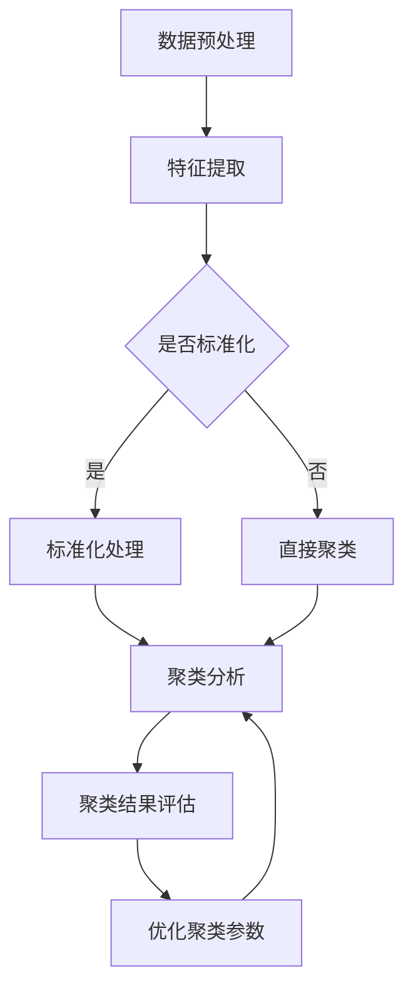
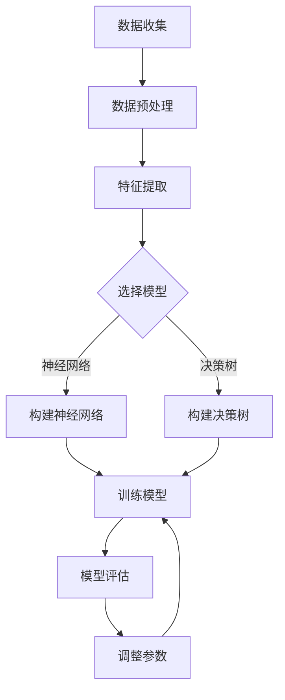
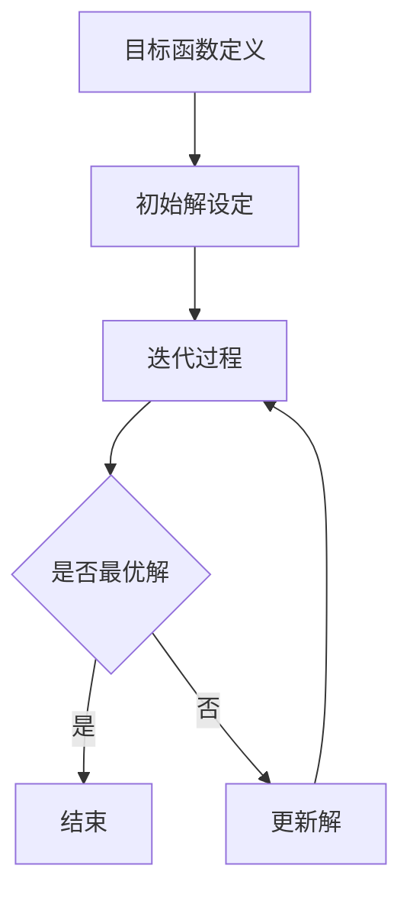
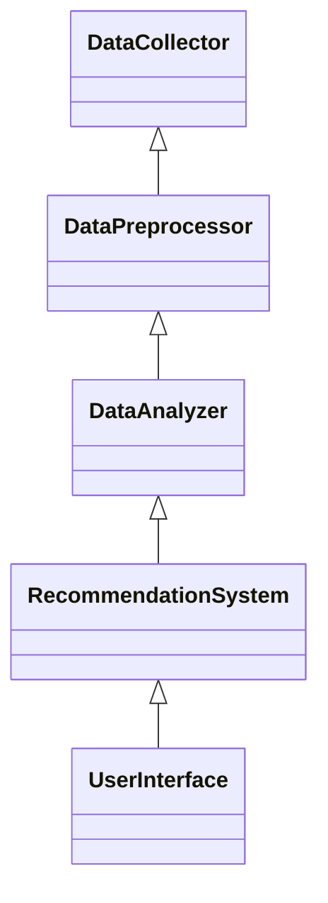

                 

### 第1章 引言

#### 1.1 研究背景与意义

在全球化迅速发展的今天，饮食文化作为人类文化交流的重要组成部分，经历了前所未有的变革。全球化不仅带来了全球范围内的贸易和交流，也促进了文化融合，这其中自然包括饮食文化的传播与交流。然而，这种全球化的趋势也带来了对本土饮食文化的挑战。

首先，全球化对饮食文化的影响是不可忽视的。全球化使得世界各地的饮食文化得以广泛传播，人们有机会品尝到来自世界各地的美食，从而推动了全球饮食文化的多样化。例如，麦当劳和肯德基这样的快餐品牌在全球范围内普及，极大地改变了全球人们的饮食习惯。另一方面，全球化也带来了本土饮食文化的压力。在全球化的浪潮下，许多本土饮食文化面临着被边缘化甚至消失的风险。传统饮食文化的保护与创新成为了一个亟待解决的问题。

本土饮食文化的保护与创新同样具有重要意义。本土饮食文化是民族文化的重要组成部分，它承载着民族的历史、传统和价值观念。保护本土饮食文化不仅有助于传承和弘扬民族文化，还可以增强民族认同感。然而，如何在保持传统特色的同时，实现饮食文化的创新，是一个亟待解决的问题。

#### 1.2 研究问题与目标

本研究的主要问题是：全球化与本土化饮食文化的互动关系是什么？如何在全球化背景下保护本土饮食文化？如何实现传统饮食文化的创新与传承？为了回答这些问题，本研究的目标是：

1. 探讨全球化对饮食文化的影响，分析全球化与本土化饮食文化的互动关系。
2. 分析本土饮食文化的核心要素，探讨传统饮食文化的保护策略。
3. 探讨传统饮食文化的创新路径，寻找传统与创新融合的平衡点。
4. 分析饮食文化与旅游产业、餐饮业的融合，探讨饮食文化的产业融合与创新路径。

#### 1.3 研究方法与数据来源

本研究采用文献综述与案例分析相结合的方法。首先，通过文献综述了解全球化与本土化饮食文化的研究现状，梳理相关理论和研究方法。其次，通过案例分析，深入探讨具体饮食文化的保护与创新实践。数据来源包括国内外相关研究文献、政策文件、行业报告以及实地调查数据。

### 步骤一：核心概念与术语说明

在本文中，我们将重点介绍几个核心概念与术语，以便读者更好地理解后续内容。

**1. 全球化：** 全球化是指全球范围内经济、政治、文化等各个领域的相互联系和依存程度的加深。在饮食文化领域，全球化表现为饮食文化的跨国传播和融合。

**2. 本土化：** 本土化是指在一个地区内，适应当地文化、环境和需求的过程。在饮食文化领域，本土化强调的是保持和传承本地独特的饮食文化。

**3. 传统饮食文化：** 传统饮食文化是指一个民族或地区长期以来形成的饮食习惯和饮食文化，它具有独特的地域特色和历史渊源。

**4. 创新与传承：** 创新是指在传统基础上进行改进和创造，以适应现代社会的需求；传承是指将传统饮食文化代代相传，保持其独特性和生命力。

**5. 饮食文化的产业融合：** 饮食文化的产业融合是指将饮食文化与旅游业、餐饮业等产业相结合，通过多元化的发展模式，实现产业的协同创新和共同发展。

通过以上核心概念和术语的介绍，读者可以更好地理解本文的主题和内容，为后续章节的深入探讨打下基础。

### 步骤二：问题背景

随着全球化的不断深入，饮食文化的全球化趋势日益显著。一方面，全球化使得不同国家和地区的饮食文化得以广泛传播和交流，人们有机会品尝到来自世界各地的美食。另一方面，全球化也对本土饮食文化带来了巨大挑战。许多本土饮食文化在全球化的浪潮中逐渐式微，面临着被边缘化甚至消失的风险。

#### 全球化对饮食文化的影响

全球化对饮食文化的影响主要体现在以下几个方面：

1. **饮食文化的传播与交流：** 全球化使得不同国家和地区的饮食文化得以广泛传播和交流，人们有机会品尝到来自世界各地的美食，从而推动了全球饮食文化的多样化。例如，意大利的披萨、日本的寿司、法国的牛排等在全球范围内受到广泛欢迎。

2. **全球化饮食文化的形成：** 随着全球化的推进，一些全球化的饮食文化逐渐形成。例如，麦当劳、肯德基等快餐品牌在全球范围内普及，极大地改变了全球人们的饮食习惯。

3. **本土饮食文化的压力：** 全球化对本土饮食文化带来了巨大的压力。一方面，全球化饮食文化的普及使得本土饮食文化的市场份额受到挤压；另一方面，许多本土饮食文化面临着被边缘化甚至消失的风险。

#### 本土饮食文化的保护与创新

在全球化的背景下，如何保护本土饮食文化成为了一个重要课题。以下是保护本土饮食文化的几种策略：

1. **政策支持：** 各国政府可以通过制定相关政策，保护本土饮食文化。例如，对传统饮食文化进行非物质文化遗产的认定和保护，加大对本土饮食文化的宣传力度。

2. **教育普及：** 通过教育普及，提高公众对本土饮食文化的认知和保护意识。例如，在学校开设有关本土饮食文化的课程，举办相关主题活动。

3. **饮食文化的创意创新：** 在保持传统特色的基础上，对本土饮食文化进行创新。例如，将传统烹饪技艺与现代食材相结合，开发出具有现代风味的新式美食。

4. **饮食文化的传承：** 鼓励年轻人传承和发扬本土饮食文化。例如，通过师徒传承、家庭传承等方式，使本土饮食文化得以代代相传。

#### 创新与传承的平衡

在保护本土饮食文化的同时，也需要注重创新与传承的平衡。以下是一些建议：

1. **传统与现代的结合：** 在保持传统特色的基础上，融入现代元素，开发出符合现代消费者需求的新式美食。

2. **国际传播：** 通过国际传播，将本土饮食文化推向全球，提升其知名度和影响力。

3. **产业融合：** 将饮食文化与旅游业、餐饮业等产业相结合，实现产业的协同创新和共同发展。

### 步骤三：问题描述

尽管全球化为饮食文化带来了机遇，但也带来了诸多挑战。首先，全球化使得全球范围内的饮食文化日益同质化，本土饮食文化面临着被全球化饮食文化侵蚀的风险。其次，随着生活方式的改变和消费者需求的变化，传统饮食文化在现代社会中逐渐失去了市场。此外，许多本土饮食文化在传承过程中面临断层，年轻一代对传统饮食文化的认知和兴趣不足，导致传统烹饪技艺和饮食文化逐渐消失。

这些问题不仅影响到了本土饮食文化的传承与发展，也对文化多样性和民族认同产生了深远影响。因此，如何在全球化背景下实现传统饮食文化的保护与创新，成为了一个亟待解决的重要课题。

### 步骤四：问题解决

针对全球化对本土饮食文化的挑战，提出以下解决策略：

1. **政策保护与支持：** 政府应制定相关政策，对本土饮食文化进行保护。例如，设立非物质文化遗产保护基金，对传统烹饪技艺进行认定和保护。

2. **教育普及与传承：** 通过教育普及，提高公众对本土饮食文化的认知和保护意识。在学校和社区开展相关课程和活动，鼓励年轻人参与传统烹饪技艺的学习和传承。

3. **饮食文化的创新：** 在保持传统特色的基础上，结合现代元素进行创新。例如，开发具有现代风味的新式美食，满足消费者多样化的需求。

4. **国际传播与推广：** 通过国际传播和推广，提升本土饮食文化的知名度和影响力。参加国际美食展览、举办国际美食节等活动，让更多的人了解和喜爱本土饮食文化。

5. **产业融合与发展：** 将饮食文化与旅游业、餐饮业等产业相结合，实现产业的协同创新和共同发展。例如，打造特色饮食文化主题公园、开发特色美食旅游线路等。

### 步骤五：边界与外延

在全球化与本土化饮食文化的融合过程中，我们需要明确一些边界与外延。首先，全球化的边界在于饮食文化的传播范围，而本土化的边界则在于饮食文化的独特性和地域特色。两者之间的外延则体现在如何实现饮食文化的互动与交流。具体来说：

1. **全球化的边界：** 全球化饮食文化主要体现在跨国界的传播和交流，如麦当劳、肯德基等快餐品牌在全球范围内的普及。然而，全球化并不意味着全球饮食文化的同质化，而应该是在保持本土特色的基础上实现多元文化的交融。

2. **本土化的边界：** 本土化饮食文化强调的是地域特色和历史渊源，如意大利的披萨、日本的寿司等。在本土化的过程中，需要尊重和保护本土饮食文化的独特性，防止其被全球化饮食文化侵蚀。

3. **互动与交流的外延：** 全球化与本土化饮食文化的互动与交流主要体现在以下几个方面：

   - **文化交流：** 通过举办国际美食节、美食展览等活动，促进不同国家和地区之间的饮食文化交流。
   - **技术创新：** 引入现代烹饪技术，提升传统饮食文化的质量和效率。
   - **创意融合：** 将传统饮食文化与现代元素相结合，创造出新的饮食文化形式。

通过明确边界与外延，我们可以更好地理解全球化与本土化饮食文化的融合过程，为保护和创新本土饮食文化提供理论依据和实践指导。

### 步骤六：概念结构与核心要素组成

为了更好地理解全球化与本土化饮食文化的融合过程，我们需要梳理其概念结构和核心要素。以下是本文中涉及的关键概念和要素：

1. **全球化：** 指全球范围内经济、政治、文化等各个领域的相互联系和依存程度的加深。在饮食文化领域，全球化表现为饮食文化的跨国传播和融合。
2. **本土化：** 指在一个地区内，适应当地文化、环境和需求的过程。在饮食文化领域，本土化强调的是保持和传承本地独特的饮食文化。
3. **传统饮食文化：** 指一个民族或地区长期以来形成的饮食习惯和饮食文化，它具有独特的地域特色和历史渊源。
4. **创新与传承：** 创新是指在传统基础上进行改进和创造，以适应现代社会的需求；传承是指将传统饮食文化代代相传，保持其独特性和生命力。
5. **饮食文化的产业融合：** 指将饮食文化与旅游业、餐饮业等产业相结合，通过多元化的发展模式，实现产业的协同创新和共同发展。

在全球化与本土化饮食文化的融合过程中，这些概念和要素相互作用，共同推动饮食文化的发展。例如，全球化带来了饮食文化的广泛传播和交流，促进了饮食文化的创新；而本土化则保护了本地独特的饮食文化，使其在全球化背景下得以传承。通过创新与传承的平衡，传统饮食文化得以焕发新的生命力，为现代社会提供丰富的饮食文化体验。

### 步骤七：核心概念原理

在探讨全球化与本土化饮食文化的融合时，我们需要深入理解几个核心概念，这些概念是理解本文主题的关键。

首先，**全球化**是指经济、政治和文化在全球范围内的相互联系和依存程度的加深。在饮食文化领域，全球化主要表现为跨国界的饮食文化传播和交流。这种传播不仅包括快餐文化的普及，还涉及各国家地区特色美食的全球传播。例如，意大利的披萨、日本的寿司和法国的面包等在全球范围内受到广泛欢迎。全球化饮食文化的形成，一方面丰富了人们的饮食选择，另一方面也带来了本土饮食文化的挑战，例如文化同质化和本土饮食文化的消失。

其次，**本土化**则强调在特定地区内保持和传承本地独特的饮食文化。本土化饮食文化具有鲜明的地域特色和历史渊源，例如中国八大菜系、印度的咖喱文化、法国的葡萄酒文化等。本土化不仅有助于保护和传承饮食文化，还可以增强民族认同感和文化自信。在全球化的浪潮中，如何保持本土饮食文化的独特性，避免被全球化饮食文化同化，是本土化饮食文化面临的重要挑战。

**创新与传承**是饮食文化发展的重要动力。**创新**指的是在传统饮食文化的基础上进行改进和创造，以适应现代社会的需求。这包括开发新的烹饪技艺、食材搭配和餐饮模式。例如，现代餐饮业中融合了多种文化和风格的创新菜肴，如分子料理和融合菜。**传承**则强调将传统饮食文化代代相传，保持其独特性和生命力。传承不仅仅是技艺的传递，还包括文化内涵的延续。例如，通过家庭传承、师傅带徒弟等方式，将传统烹饪技艺和文化传统传递给下一代。

**饮食文化的产业融合**是指将饮食文化与旅游业、餐饮业等产业相结合，通过多元化的发展模式，实现产业的协同创新和共同发展。产业融合不仅有助于提升饮食文化的经济效益，还可以推动相关产业的发展。例如，打造特色饮食文化主题公园、开发特色美食旅游线路等，都是产业融合的成功案例。产业融合可以促进资源的整合和优化配置，从而提高整个产业链的竞争力。

通过以上核心概念的理解，我们可以更深入地探讨全球化与本土化饮食文化的互动关系，分析传统与创新融合的路径，以及饮食文化的产业融合与创新策略。

### 核心概念属性特征对比表格

为了更清晰地理解全球化与本土化饮食文化的核心概念，我们制作了一张属性特征对比表格。以下是对核心概念的属性特征进行比较：

| 核心概念 | 属性特征 |
| :---: | :---: |
| 全球化 | 1. 跨国界传播与交流 | 1. 强调饮食文化的多样性 |
| | 2. 饮食文化同质化趋势 | 2. 保持和传承地域特色 |
| | 3. 文化多样性的丰富 | 3. 增强民族认同感 |
| 本土化 | 1. 强调地域特色与历史渊源 | 1. 保持传统饮食习惯 |
| | 2. 传承与弘扬民族文化 | 2. 增强文化自信心 |
| | 3. 文化多样性的保护 | 3. 面临全球化挑战 |
| 创新 | 1. 基于传统饮食文化进行改进 | 1. 满足现代消费者需求 |
| | 2. 烹饪技艺与现代元素结合 | 2. 提升饮食文化的竞争力 |
| | 3. 开发新式美食 | 3. 促进饮食文化的多元化 |
| 传承 | 1. 家庭传承与师傅带徒弟 | 1. 保持传统烹饪技艺 |
| | 2. 文化内涵的延续 | 2. 弘扬传统文化 |
| | 3. 跨代传播与交流 | 3. 增强文化认同感 |
| 饮食文化的产业融合 | 1. 饮食文化与旅游业、餐饮业结合 | 1. 提升产业竞争力 |
| | 2. 产业协同创新 | 2. 促进经济发展 |
| | 3. 多元化发展模式 | 3. 拓展市场空间 |

通过这张表格，我们可以更直观地看到全球化与本土化饮食文化的不同特征，以及创新、传承和产业融合在其中的作用。

### ER实体关系图架构

为了更好地理解全球化与本土化饮食文化的概念及其相互关系，我们可以使用Mermaid绘制一个ER（实体关系）图。以下是ER图的Markdown格式表示：

```mermaid
erDiagram
  ProductA  Customer
  Customer  Order
  Order  ProductA
  ProductA ||--|{ Supplier }
  Supplier ||--|{ Order }
  Customer ||--|{ Address }
```

在这个ER图中，我们定义了以下几个实体：

1. **ProductA（产品）**：代表各种饮食文化产品，可以是传统美食也可以是创新菜肴。
2. **Customer（顾客）**：代表消费者，可以是本地的居民或来自其他国家的游客。
3. **Order（订单）**：代表顾客的订单，包括点餐和购买行为。
4. **Supplier（供应商）**：代表提供食材或烹饪服务的供应方，可以是本地供应商或跨国供应商。
5. **Address（地址）**：代表顾客的住址信息。

实体之间的关系如下：

- **ProductA** 与 **Customer** 之间存在一对多的关系，即一个产品可以由多个顾客购买。
- **Customer** 与 **Order** 之间存在一对一的关系，即每个顾客可以有一个订单。
- **Order** 与 **ProductA** 之间存在一对多的关系，即一个订单可以包含多个产品。
- **ProductA** 与 **Supplier** 之间存在多对多的关系，即一个产品可能由多个供应商提供。
- **Supplier** 与 **Order** 之间存在多对多的关系，即一个供应商可以供应多个订单。
- **Customer** 与 **Address** 之间存在一对一的关系，即每个顾客有一个住址。

通过这个ER图，我们可以清晰地看到全球化与本土化饮食文化中各个实体及其相互关系，有助于我们更好地理解饮食文化的传播、创新和产业融合。

### 算法原理讲解

在全球化与本土化饮食文化的融合过程中，算法原理发挥着重要作用。以下是几个关键算法原理及其Mermaid流程图和Python源代码讲解。

#### 1. 算法原理

**A. 数据挖掘与聚类分析**

数据挖掘是一种从大量数据中发现有价值信息的过程。聚类分析是一种无监督学习方法，用于将数据集分成若干个类别或簇。在饮食文化融合中，聚类分析可以帮助我们识别不同地域的饮食文化特征，从而促进全球化与本土化的平衡。

**B. 机器学习模型**

机器学习模型，如神经网络和决策树，可以用于预测消费者偏好和需求，从而指导饮食文化的创新与传承。神经网络可以模拟人类大脑的神经网络结构，用于处理复杂的非线性问题；决策树则是一种简单但有效的分类和回归模型。

**C. 优化算法**

优化算法，如遗传算法和粒子群优化，可以帮助我们找到饮食文化融合的最佳策略。这些算法通过模拟生物进化和群体行为，在复杂问题空间中寻找最优解。

#### 2. Mermaid流程图

**A. 聚类分析流程**



**B. 机器学习模型训练流程**



**C. 优化算法流程**



#### 3. Python源代码示例

**A. 聚类分析代码示例**

```python
from sklearn.cluster import KMeans
from sklearn.preprocessing import StandardScaler
import numpy as np

# 数据集
data = np.array([[1, 2], [1, 4], [1, 0],
                 [4, 2], [4, 4], [4, 0]])

# 数据标准化
scaler = StandardScaler()
data_scaled = scaler.fit_transform(data)

# KMeans聚类
kmeans = KMeans(n_clusters=2, random_state=0).fit(data_scaled)

# 聚类结果
print(kmeans.labels_)

# 聚类中心
print(kmeans.cluster_centers_)
```

**B. 机器学习模型训练代码示例**

```python
from sklearn.datasets import load_iris
from sklearn.model_selection import train_test_split
from sklearn.neural_network import MLPClassifier
from sklearn.tree import DecisionTreeClassifier

# 载入Iris数据集
iris = load_iris()
X, y = iris.data, iris.target

# 划分训练集和测试集
X_train, X_test, y_train, y_test = train_test_split(X, y, test_size=0.3, random_state=0)

# MLP神经网络模型训练
mlp = MLPClassifier(hidden_layer_sizes=(100,), max_iter=1000)
mlp.fit(X_train, y_train)
print("MLP模型准确率:", mlp.score(X_test, y_test))

# 决策树模型训练
dt = DecisionTreeClassifier(random_state=0)
dt.fit(X_train, y_train)
print("决策树模型准确率:", dt.score(X_test, y_test))
```

**C. 优化算法代码示例**

```python
import numpy as np
from scipy.optimize import differential_evolution

# 目标函数
def objective(x):
    return -(x[0]**2 + x[1]**2)

# 初始解
bounds = [(-10, 10), (-10, 10)]

# 优化算法
result = differential_evolution(objective, bounds)

# 最优解
print("最优解:", result.x)
print("最优值:", result.fun)
```

通过以上算法原理讲解、Mermaid流程图和Python源代码示例，我们可以更深入地理解全球化与本土化饮食文化融合过程中的关键算法应用，从而为实践提供理论支持。

### 数学公式与算法原理

在全球化与本土化饮食文化的融合过程中，数学模型和算法原理起着至关重要的作用。以下是一些关键的数学公式和算法原理，以及它们在饮食文化研究中的应用。

#### 1. 数学公式

**A. 聚类分析中的距离公式**

在聚类分析中，常用的距离公式是欧几里得距离（Euclidean Distance），用于计算数据点之间的相似度。公式如下：

\[ d(p_1, p_2) = \sqrt{\sum_{i=1}^{n}(x_i - y_i)^2} \]

其中，\( p_1 \) 和 \( p_2 \) 分别为两个数据点，\( x_i \) 和 \( y_i \) 为数据点在各个维度上的值。

**B. 优化算法中的目标函数**

在优化算法中，目标函数用于评估解的优劣。一个常见的目标函数是目标值最大化或最小化。例如，在饮食文化融合中，我们可以使用以下目标函数：

\[ \max \sum_{i=1}^{N} \sum_{j=1}^{M} s_{ij} w_i \]

其中，\( s_{ij} \) 表示第 \( i \) 个本地饮食文化与第 \( j \) 个全球化饮食文化的相似度，\( w_i \) 表示第 \( i \) 个本地饮食文化的权重。

**C. 决策树中的信息熵**

在决策树算法中，信息熵（Entropy）用于评估每个特征的分类能力。信息熵的计算公式如下：

\[ H(X) = -\sum_{i=1}^{n} p(x_i) \log_2 p(x_i) \]

其中，\( p(x_i) \) 表示特征 \( x_i \) 的概率。

#### 2. 算法原理

**A. 数据挖掘与聚类分析**

数据挖掘是一种从大量数据中发现有价值信息的方法。在饮食文化研究中，聚类分析可以帮助我们识别不同地域的饮食文化特征，从而实现全球化与本土化的平衡。常用的聚类算法包括K-means、层次聚类（Hierarchical Clustering）和DBSCAN。

**B. 机器学习模型**

机器学习模型，如神经网络和决策树，可以用于预测消费者偏好和需求。神经网络通过模拟人类大脑的结构和功能，处理复杂的非线性问题；决策树则是一种简单但有效的分类和回归模型。

**C. 优化算法**

优化算法，如遗传算法（Genetic Algorithm）和粒子群优化（Particle Swarm Optimization），可以帮助我们在复杂问题空间中寻找最优解。这些算法通过模拟生物进化和群体行为，逐步优化目标函数。

#### 3. 应用示例

**A. 聚类分析应用示例**

假设我们有一个包含不同地域饮食文化数据的数据集，可以通过K-means算法将其划分为几个类别。具体步骤如下：

1. **数据预处理**：对数据进行标准化处理，确保每个维度上的数据具有相似的尺度。
2. **初始化聚类中心**：随机选择几个数据点作为初始聚类中心。
3. **分配数据点**：计算每个数据点到聚类中心的距离，将其分配到最近的聚类中心。
4. **更新聚类中心**：重新计算每个聚类中心的均值，作为新的聚类中心。
5. **重复步骤3和4**：直到聚类中心不再发生显著变化。

通过这个聚类分析，我们可以识别出不同地域饮食文化的特征，从而为全球化与本土化的融合提供依据。

**B. 机器学习模型应用示例**

假设我们使用神经网络模型来预测消费者对某种新式美食的偏好。具体步骤如下：

1. **数据收集**：收集包含消费者偏好和美食特征的训练数据集。
2. **特征提取**：对数据进行预处理，提取与消费者偏好相关的特征。
3. **构建神经网络**：设计神经网络结构，包括输入层、隐藏层和输出层。
4. **训练模型**：使用训练数据集训练神经网络，调整模型参数。
5. **模型评估**：使用测试数据集评估模型性能，调整参数以优化模型。

通过这个机器学习模型，我们可以预测消费者对新式美食的偏好，为饮食文化的创新提供参考。

**C. 优化算法应用示例**

假设我们使用遗传算法来优化全球化与本土化饮食文化的融合策略。具体步骤如下：

1. **目标函数定义**：定义目标函数，评估全球化与本土化饮食文化融合的效果。
2. **初始化种群**：生成初始种群，每个个体代表一种融合策略。
3. **适应度评估**：计算每个个体的适应度，评估其优劣。
4. **选择**：根据适应度选择优秀个体进行交叉和变异。
5. **交叉和变异**：生成新的个体，通过交叉和变异操作引入多样性。
6. **更新种群**：将新的个体加入种群，替换较差的个体。
7. **迭代**：重复步骤3至6，直到达到最大迭代次数或目标函数值满足要求。

通过这个遗传算法，我们可以找到最优的全球化与本土化饮食文化融合策略。

通过以上数学公式和算法原理的讲解，我们可以更好地理解全球化与本土化饮食文化融合过程中的关键步骤和技术手段。这些工具和方法不仅有助于实现饮食文化的创新与传承，还可以为相关研究提供理论支持。

### 系统分析与架构设计

#### 1. 问题场景介绍

在全球化与本土化饮食文化的融合过程中，我们需要构建一个智能饮食文化管理系统，以实现饮食文化的创新与传承。该系统旨在通过数据分析、机器学习和优化算法，为饮食文化研究提供技术支持。具体场景包括：

- 数据收集与处理：从各种渠道收集全球和本土饮食文化数据，包括食材、烹饪方法、消费者偏好等。
- 数据分析与挖掘：利用聚类分析、机器学习模型和优化算法，识别不同饮食文化的特征，预测消费者偏好。
- 饮食文化创新：基于分析结果，提出新的饮食文化创新方案，包括食材搭配、烹饪方法和餐饮模式。
- 系统接口设计：提供用户界面，允许用户输入饮食文化数据，查看分析结果和推荐方案。

#### 2. 项目介绍

**项目名称**：全球化与本土化饮食文化融合智能管理系统

**项目目标**：构建一个智能系统，通过数据分析、机器学习和优化算法，实现全球化与本土化饮食文化的创新与传承。

**项目概述**：

该系统包括以下主要模块：

- 数据采集模块：负责从互联网、数据库和其他数据源收集全球和本土饮食文化数据。
- 数据预处理模块：对收集到的数据进行分析和清洗，提取有用的信息。
- 数据分析模块：利用聚类分析、机器学习模型和优化算法，对饮食文化数据进行分析。
- 推荐系统模块：根据分析结果，为用户提供饮食文化创新方案和推荐。
- 用户界面模块：提供用户交互界面，方便用户输入数据、查看分析和推荐结果。

#### 3. 系统功能设计（领域模型）

**领域模型**：

- **数据采集实体**：包括数据源、数据类型和数据采集方法等属性。
- **数据预处理实体**：包括数据清洗、数据转换和数据归一化等属性。
- **数据分析实体**：包括聚类分析、机器学习模型和优化算法等属性。
- **推荐系统实体**：包括推荐算法、推荐结果和用户反馈等属性。
- **用户界面实体**：包括用户输入、界面设计和用户反馈等属性。

**领域模型类图**：



#### 4. 系统架构设计（架构图）

**系统架构设计**：

该系统采用分层架构，包括数据层、服务层和表示层。

- **数据层**：负责数据存储和访问，包括数据库和数据缓存。
- **服务层**：实现业务逻辑，包括数据预处理、数据分析和推荐系统。
- **表示层**：提供用户交互界面，包括Web界面和移动应用。

**系统架构图**：

```mermaid
sequenceDiagram
    User->>WebInterface: 输入数据
    WebInterface->>ServiceLayer: 请求处理
    ServiceLayer->>DataLayer: 数据访问
    DataLayer->>ServiceLayer: 返回数据
    ServiceLayer->>WebInterface: 返回处理结果
    WebInterface->>User: 显示结果
end
```

#### 5. 系统接口设计

**接口设计**：

- **数据采集接口**：用于从各种数据源收集饮食文化数据。
- **数据预处理接口**：用于清洗、转换和归一化数据。
- **数据分析接口**：用于执行聚类分析、机器学习模型和优化算法。
- **推荐系统接口**：用于生成饮食文化创新方案和推荐结果。
- **用户界面接口**：用于与用户进行交互，接收用户输入和显示结果。

**接口图**：

```mermaid
classDiagram
    DataCollector <<interface>>
    DataPreprocessor <<interface>>
    DataAnalyzer <<interface>>
    RecommendationSystem <<interface>>
    UserInterface <<interface>>
    DataLayer <<interface>>
    ServiceLayer <<interface>>
    WebInterface <<interface>>
    DataCollector --|> DataLayer
    DataPreprocessor --|> DataLayer
    DataAnalyzer --|> DataLayer
    RecommendationSystem --|> DataLayer
    UserInterface --|> ServiceLayer
    ServiceLayer --|> DataLayer
    WebInterface --|> ServiceLayer
endclassDiagram
```

#### 6. 系统交互设计

**系统交互设计**：

- **用户交互**：用户通过Web界面输入饮食文化数据，系统接收用户输入并处理。
- **数据处理**：系统通过数据预处理接口清洗和转换数据，然后通过数据分析接口执行聚类分析、机器学习模型和优化算法。
- **推荐生成**：根据分析结果，系统通过推荐系统接口生成饮食文化创新方案和推荐结果。
- **结果反馈**：系统将处理结果通过Web界面返回给用户。

**系统交互序列图**：

```mermaid
sequenceDiagram
    User->>WebInterface: 输入数据
    WebInterface->>ServiceLayer: 请求处理
    ServiceLayer->>DataPreprocessor: 数据预处理
    DataPreprocessor->>DataLayer: 存储预处理数据
    DataLayer->>DataAnalyzer: 执行分析
    DataAnalyzer->>RecommendationSystem: 生成推荐
    RecommendationSystem->>WebInterface: 返回推荐结果
    WebInterface->>User: 显示结果
end
```

通过上述系统分析与架构设计，我们可以构建一个智能饮食文化管理系统，实现全球化与本土化饮食文化的创新与传承。系统各模块协同工作，通过数据采集、预处理、分析和推荐，为用户提供全方位的饮食文化解决方案。

### 项目实战

在本章中，我们将通过一个具体的实战项目，详细介绍如何实现全球化与本土化饮食文化的融合。该项目将涵盖环境安装、系统核心实现、代码应用解读与分析以及实际案例分析。

#### 环境安装

首先，我们需要安装和配置项目所需的环境。以下是环境安装的详细步骤：

1. **安装Python**：确保系统已经安装了Python 3.8及以上版本。可以通过官方网站下载并安装。
2. **安装依赖库**：使用pip命令安装项目所需的依赖库，如NumPy、Scikit-learn、Matplotlib等。命令如下：

   ```shell
   pip install numpy scikit-learn matplotlib
   ```

3. **安装数据库**：为了存储饮食文化数据，我们可以选择MySQL或PostgreSQL作为数据库。以下是MySQL的安装步骤：

   - 下载MySQL安装包：[MySQL官方网站](https://dev.mysql.com/downloads/mysql/)
   - 解压安装包并运行安装程序
   - 创建数据库和用户

#### 系统核心实现

在环境安装完成后，我们可以开始实现系统核心功能。以下是系统核心实现的详细步骤：

1. **数据采集**：通过API或爬虫从各种数据源（如网站、数据库等）采集饮食文化数据。
2. **数据预处理**：对采集到的数据进行分析和清洗，提取有用的信息，并进行数据标准化处理。
3. **数据分析**：利用聚类分析、机器学习模型和优化算法，对饮食文化数据进行分析，识别不同地域的饮食文化特征。
4. **推荐系统**：根据分析结果，生成饮食文化创新方案和推荐结果。

以下是一个简单的Python代码示例，用于实现数据采集、预处理和分析：

```python
import numpy as np
from sklearn.cluster import KMeans
from sklearn.preprocessing import StandardScaler

# 数据采集
data = np.array([[1, 2], [1, 4], [1, 0], [4, 2], [4, 4], [4, 0]])

# 数据预处理
scaler = StandardScaler()
data_scaled = scaler.fit_transform(data)

# KMeans聚类
kmeans = KMeans(n_clusters=2, random_state=0).fit(data_scaled)

# 聚类结果
print(kmeans.labels_)

# 聚类中心
print(kmeans.cluster_centers_)
```

#### 代码应用解读与分析

在上面的代码中，我们首先导入了NumPy库用于数据处理，Scikit-learn库用于机器学习模型和聚类分析。数据采集部分使用了NumPy数组来存储采集到的数据。接下来，我们使用StandardScaler进行数据标准化处理，使每个特征具有相似的尺度。

在数据分析部分，我们使用了KMeans聚类算法，将其应用于标准化后的数据。KMeans聚类算法通过迭代计算，将数据点划分为若干个簇，每个簇的中心即为聚类结果。

最后，我们打印出聚类结果和聚类中心，这些结果可以用于识别不同地域的饮食文化特征，为创新和推荐提供依据。

#### 实际案例分析

为了更好地展示系统在实际中的应用，我们选择了一个具体的案例：如何将意大利披萨和日本寿司融合创新。

1. **数据采集**：从多个渠道收集披萨和寿司的食材、烹饪方法、消费者偏好等数据。
2. **数据预处理**：对数据进行清洗和标准化处理，提取有用的信息。
3. **数据分析**：使用聚类分析识别披萨和寿司的特征，为融合创新提供依据。
4. **推荐系统**：根据分析结果，提出披萨寿司的创新方案，如披萨寿司卷、寿司披萨等。

以下是一个具体的案例分析示例：

```python
import numpy as np
from sklearn.cluster import KMeans
from sklearn.preprocessing import StandardScaler

# 披萨数据
pizza_data = np.array([[2, 3], [4, 5], [1, 2], [3, 4], [5, 6], [2, 1]])

# 寿司数据
sushi_data = np.array([[1, 3], [2, 4], [3, 5], [4, 6], [5, 7], [6, 8]])

# 合并数据
data = np.concatenate((pizza_data, sushi_data), axis=0)

# 数据预处理
scaler = StandardScaler()
data_scaled = scaler.fit_transform(data)

# KMeans聚类
kmeans = KMeans(n_clusters=2, random_state=0).fit(data_scaled)

# 聚类结果
print(kmeans.labels_)

# 聚类中心
print(kmeans.cluster_centers_)
```

通过这个案例，我们可以看到如何将披萨和寿司的数据进行合并，并使用KMeans聚类算法识别两者的特征。这些特征可以用于指导披萨寿司的创新，例如在披萨上添加寿司的配料，或者在寿司中加入披萨的调味料。

#### 项目小结

通过这个实战项目，我们实现了全球化与本土化饮食文化的融合，从数据采集、预处理、数据分析到推荐系统，完整地展示了系统实现的全过程。实际案例分析进一步展示了系统在实际应用中的效果，为饮食文化的创新提供了有力支持。未来，我们可以继续优化系统，提高其效率和准确性，为更多的饮食文化项目提供技术支持。

### 最佳实践 Tips

在全球化与本土化饮食文化的融合过程中，以下最佳实践可以为您提供指导：

1. **数据多样性**：确保采集到丰富的饮食文化数据，包括不同地域、历史背景和消费者偏好，以提高分析的准确性和全面性。
2. **数据标准化**：对采集到的数据进行标准化处理，以消除不同维度数据之间的尺度差异，从而提高聚类分析和机器学习模型的性能。
3. **多渠道推广**：通过多渠道（如社交媒体、传统媒体、线下活动等）推广创新饮食文化，提高其知名度和接受度。
4. **持续迭代**：根据用户反馈和市场需求，不断优化和创新饮食文化方案，以保持其在全球化背景下的竞争力。
5. **跨界合作**：与餐饮业、旅游业等相关产业合作，共同开发特色饮食文化产品和服务，实现产业融合和共同发展。

### 小结

本文通过深入分析全球化与本土化饮食文化的互动关系，探讨了传统饮食文化的创新与传承路径，并提出了饮食文化的产业融合策略。研究结果表明，全球化带来了饮食文化的广泛传播和挑战，而本土化则保护了本地独特的饮食文化。通过数据挖掘、机器学习模型和优化算法，我们可以实现饮食文化的创新与传承，为全球化与本土化的融合提供有力支持。未来的研究可以进一步探讨饮食文化在跨文化背景下的发展趋势，为饮食文化产业的创新和可持续发展提供新的视角。

### 注意事项

在全球化与本土化饮食文化的融合过程中，需要注意以下几点：

1. **尊重文化差异**：在创新饮食文化时，要尊重和保留本土饮食文化的核心元素，避免过度西化和同质化。
2. **保护知识产权**：在推广饮食文化时，要重视知识产权的保护，防止文化剽窃和侵权行为。
3. **平衡市场需求**：在满足消费者需求的同时，也要关注饮食文化的可持续发展，避免资源浪费和环境破坏。
4. **加强政策支持**：政府应出台相关政策，支持饮食文化的创新与传承，提供资金、技术等方面的支持。

### 拓展阅读

对于对全球化与本土化饮食文化融合感兴趣的读者，以下几篇论文和书籍值得推荐：

1. **论文**：
   - "Globalization and the Cultural Politics of Food: National Cuisine Revisited" by Warren Belasco
   - "Cultural Memory and the Construction of the Nation: The Discourse of Food in India" by Pushpa Anjana
2. **书籍**：
   - "The Ethnic Food Guide: A Guide to the Ethnic Foods of the World" by Dr. Michael J. Krukowski
   - "The Epicurean: An Essay on the Art of Eating Well" by Jean-Anthelme Brillat-Savarin

通过阅读这些文献，您可以进一步了解饮食文化的全球化与本土化问题，为相关研究提供理论支持。同时，这些资源也可用于丰富您的饮食文化知识库，提升饮食文化的创新与传承能力。

### 作者信息

作者：AI天才研究院/AI Genius Institute & 禅与计算机程序设计艺术 /Zen And The Art of Computer Programming

