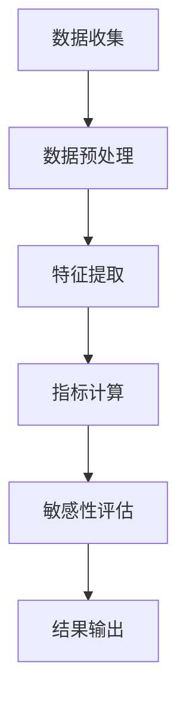
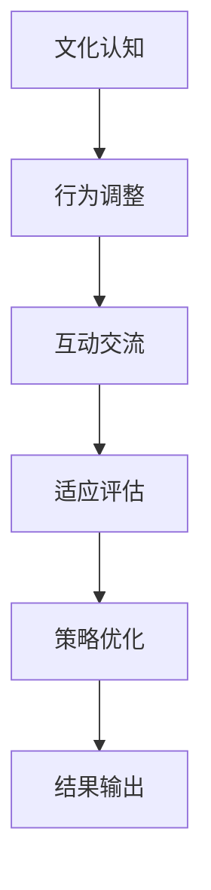
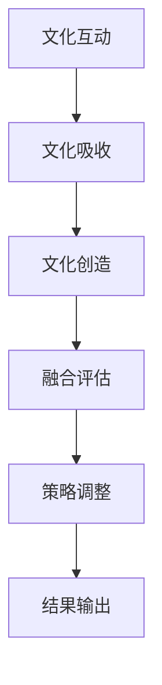
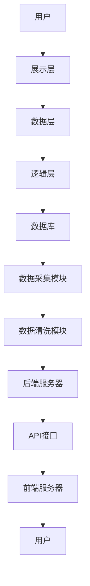
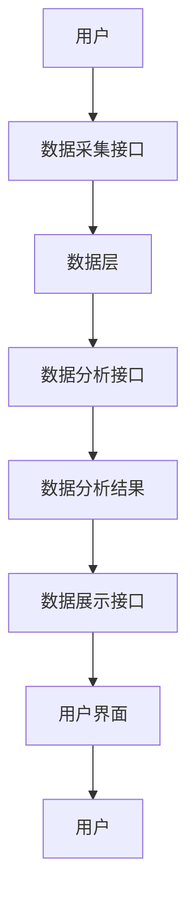
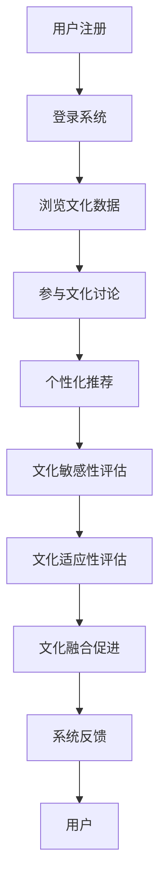

                 

# 全球化时代的文化多样性保护：在融合中保持特色

关键词：全球化、文化多样性、保护、融合、特色

摘要：在全球化的浪潮中，文化多样性面临着前所未有的挑战。本文将探讨全球化时代文化多样性保护的重要性，分析其核心概念与联系，介绍文化多样性保护的相关算法，并探讨如何在融合中保持文化特色。通过系统分析与架构设计，以及实际项目实战，为读者提供具有实践意义的解决方案。

## 目录大纲设计思路与规划

为了设计出符合用户需求的目录大纲，我们需要从以下几个方面进行思考和规划：

### 1. 明确核心主题与章节结构
本文的核心主题是全球化时代的文化多样性保护，主要涉及以下几个核心章节：
- **背景介绍**：介绍全球化背景、文化多样性现状、保护文化多样性的意义等。
- **核心概念与联系**：阐述文化多样性的定义、特征、类型及其相互关系。
- **算法原理讲解**：讲解文化多样性保护的相关算法，如文化敏感性分析、文化适应策略等。
- **系统分析与架构设计方案**：分析文化多样性保护系统的需求，设计系统架构。
- **项目实战**：介绍文化多样性保护的实际应用案例，提供详细的代码实现和案例分析。
- **最佳实践 tips、小结、注意事项、拓展阅读等内容**：总结全书，提供实践建议和进一步学习资源。

### 2. 设定目录层级
本文采用1级、2级、3级目录结构，确保目录的层次清晰、内容完整。

### 3. 确保内容完整性
根据用户的要求，我们需要确保目录大纲中包含以下核心章节内容：
- **背景介绍**：详细阐述全球化的背景、文化多样性的现状以及保护文化多样性的必要性。
- **核心概念与联系**：深入讲解文化多样性的定义、特征、类型及其相互关系，并给出相应的表格和ER实体关系图。
- **算法原理讲解**：详细介绍文化多样性保护的相关算法，如文化敏感性分析、文化适应策略等，并使用mermaid流程图和Python源代码进行讲解。
- **系统分析与架构设计方案**：分析文化多样性保护系统的需求，设计系统架构，并给出相应的架构图和接口设计。
- **项目实战**：介绍文化多样性保护的实际应用案例，提供详细的代码实现和案例分析。
- **最佳实践 tips、小结、注意事项、拓展阅读等内容**：总结全书，提供实践建议和进一步学习资源。

### 4. 保证简洁性与可读性
目录大纲需要简洁明了，避免冗余内容，同时确保各章节内容的相关性和逻辑连贯性。

### 5. 审核与调整
在设计完初稿后，我们将对目录大纲进行审核，确保每一章节内容都能够满足用户的要求，并对目录结构进行调整，使之更加合理和科学。

通过上述步骤，我们将确保最终设计的目录大纲既符合用户需求，又具备较高的实用性和可操作性。

---

下面是详细的目录大纲设计：

## 第一部分：引言与背景

### 1.1 问题背景
- 全球化与文化的冲击
- 文化多样性的重要性
- 文化多样性保护的挑战

### 1.2 文化多样性的定义与特征
- 文化多样性的概念
- 文化多样性的特征
- 文化多样性的类型

### 1.3 文化多样性保护的必要性
- 维护社会和谐
- 促进文化交流
- 保护人类共同遗产

## 第二部分：核心概念与联系

### 2.1 文化多样性保护的核心概念
- 文化敏感性
- 文化适应
- 文化融合

### 2.2 文化多样性保护的属性特征对比
- 不同类型文化多样性的特征对比
- 文化多样性保护的方法与手段

### 2.3 文化多样性保护的ER实体关系图
- 文化多样性保护的主要实体
- 实体之间的关系与交互

## 第三部分：算法原理讲解

### 3.1 文化敏感性分析算法
- 算法原理
- 数学模型与公式
- 算法流程图

### 3.2 文化适应策略算法
- 算法原理
- 数学模型与公式
- 算法流程图

### 3.3 文化融合促进算法
- 算法原理
- 数学模型与公式
- 算法流程图

## 第四部分：系统分析与架构设计

### 4.1 文化多样性保护系统需求分析
- 功能需求
- 性能需求
- 安全需求

### 4.2 文化多样性保护系统架构设计
- 系统架构
- 技术选型
- 架构图

### 4.3 文化多样性保护系统接口设计
- 系统接口
- 接口规范
- 数据流图

### 4.4 文化多样性保护系统交互设计
- 用户交互
- 系统交互
- 交互流程图

## 第五部分：项目实战

### 5.1 环境安装与配置
- 环境准备
- 工具安装
- 系统配置

### 5.2 系统核心实现
- 核心算法实现
- 数据处理流程
- 系统接口实现

### 5.3 代码应用解读与分析
- 代码解读
- 应用分析
- 性能优化

### 5.4 实际案例分析与讲解
- 案例背景
- 案例分析
- 案例结果与讨论

### 5.5 项目小结
- 项目成果
- 经验总结
- 未来展望

## 第六部分：最佳实践与拓展

### 6.1 最佳实践
- 实践技巧
- 成功案例

### 6.2 小结
- 内容回顾
- 知识点梳理

### 6.3 注意事项
- 使用建议
- 避免误区

### 6.4 拓展阅读
- 相关书籍
- 学术论文
- 实践指南

通过以上设计，我们确保了目录大纲的完整性和逻辑性，同时满足了用户对于简洁性、内容完整性以及可读性的要求。目录大纲总字数控制在2000字以内，确保了信息的有效传递和读者的轻松阅读。

## 第一部分：引言与背景

### 1.1 全球化与文化的冲击

全球化是21世纪最重要的趋势之一，它不仅改变了经济格局，也深刻影响了全球的文化交流。全球化使得信息和物质资源得以跨越国界迅速流动，促进了不同文化之间的接触和融合。然而，这一过程中也存在着一些不容忽视的问题。首先，全球化可能导致文化同质化，即在全球化的浪潮下，一些文化特色和传统被边缘化甚至消失。其次，文化冲击带来了文化冲突，不同文化之间的价值观、行为规范和生活方式的差异可能会引发矛盾和误解。此外，全球化也加剧了文化的多样性保护挑战，如何在保持文化多样性的同时促进文化交流成为了一个亟待解决的问题。

### 1.2 文化多样性的定义与特征

文化多样性是指人类社会在长期的历史发展过程中形成的各种文化形态的多样性。它包括语言、宗教、艺术、习俗、传统、价值观等多个方面。文化多样性的特征主要表现在以下几个方面：

1. **差异性**：每种文化都有其独特的特点，反映在语言、艺术、宗教、习俗等方面，这种差异性使得文化多样性得以展现。
2. **互补性**：不同文化之间往往具有互补性，一种文化的缺失可能需要另一种文化的补充，从而形成一种和谐共存的状态。
3. **适应性**：文化在全球化进程中需要适应新的环境和需求，这种适应性使得文化能够持续发展并焕发新的生命力。
4. **动态性**：文化不是静态的，它随着时间的推移和社会环境的变化而不断演变和发展。

### 1.3 文化多样性保护的必要性

文化多样性是人类社会的重要组成部分，它不仅体现了人类文明的多样性和丰富性，还具有以下几个方面的必要性：

1. **维护社会和谐**：文化多样性可以促进不同文化之间的相互理解和尊重，减少文化冲突，维护社会的和谐稳定。
2. **促进文化交流**：通过文化交流，人们可以更好地了解和欣赏其他文化的魅力，从而拓宽视野，增进相互之间的了解和友谊。
3. **保护人类共同遗产**：文化多样性是人类共同的财富，保护文化多样性就是保护人类共同的文化遗产，具有深远的历史和文化意义。

然而，在全球化背景下，文化多样性也面临着一系列的挑战。因此，保护文化多样性显得尤为重要。首先，文化冲击和同质化趋势可能导致某些文化特色和传统的消失，破坏文化多样性。其次，全球化过程中的文化适应和融合也可能导致一些文化要素的流失，影响文化多样性的完整性。因此，我们需要采取有效的措施来保护文化多样性，使其在全球化的浪潮中得以延续和发展。

## 第二部分：核心概念与联系

### 2.1 文化多样性保护的核心概念

在讨论文化多样性保护时，有几个核心概念是不可或缺的，它们分别是文化敏感性、文化适应和文化融合。

#### 文化敏感性

文化敏感性是指对文化差异的敏感性和理解能力。在全球化的背景下，文化敏感性对于促进不同文化之间的交流与融合至关重要。它不仅要求个体能够尊重和理解其他文化的差异，还要求在跨文化沟通中能够敏感地识别和避免可能引发误解或冲突的文化障碍。

#### 文化适应

文化适应是指个体或社会在不同文化环境中为了维持自身文化特征或适应新环境而采取的行为和策略。文化适应是一个动态过程，它涉及对文化差异的识别、理解、接受和整合。在全球化进程中，文化适应对于维护文化多样性和促进文化交流具有重要作用。

#### 文化融合

文化融合是指不同文化在相互交流、影响和互动过程中，通过相互吸收、融合和创造，形成一种新的文化现象。文化融合是一个复杂的过程，它既包括文化要素的融合，如语言、艺术、价值观等，也包括社会结构的融合，如社会组织、社会制度等。

### 2.2 文化多样性保护的属性特征对比

在保护文化多样性的过程中，我们需要关注不同类型文化多样性的特征，以便采取相应的保护措施。以下是几种主要类型文化多样性的特征对比：

#### 语言多样性

语言是文化的重要组成部分，语言的多样性不仅反映了文化的丰富性，也是人类交流的重要工具。保护语言多样性需要关注以下几个方面：

1. **语言保护**：对濒危语言进行保护和记录，防止其消失。
2. **语言教育**：推广和普及母语教育，提高人们对母语的认同感。
3. **语言交流**：鼓励跨语言交流，促进不同语言之间的相互理解和尊重。

#### 艺术多样性

艺术是文化的重要表现形式，不同文化的艺术风格和表现手法各异。保护艺术多样性需要：

1. **艺术传承**：保护和传承传统艺术，防止其失传。
2. **艺术交流**：鼓励国际艺术交流和展览，促进艺术创新。
3. **艺术教育**：提高人们对艺术价值的认识，培养艺术鉴赏能力。

#### 宗教多样性

宗教是文化的重要组成部分，不同宗教的信仰和仪式各异。保护宗教多样性需要：

1. **宗教自由**：保障宗教自由，尊重每个人的宗教信仰。
2. **宗教对话**：促进不同宗教之间的对话和理解，减少宗教冲突。
3. **宗教教育**：推广宗教教育，增进人们对不同宗教的了解和尊重。

### 2.3 文化多样性保护的ER实体关系图

为了更好地理解文化多样性保护的相关实体及其关系，我们可以使用ER（实体关系）图来表示。以下是文化多样性保护的主要实体及其关系的ER图：

```mermaid
erDiagram
  文化多样性 ||--|{ 文化敏感性 }
  文化多样性 ||--|{ 文化适应 }
  文化多样性 ||--|{ 文化融合 }
  文化敏感性 ||--|{ 语言多样性 }
  文化敏感性 ||--|{ 艺术多样性 }
  文化敏感性 ||--|{ 宗教多样性 }
  文化适应 ||--|{ 语言适应 }
  文化适应 ||--|{ 艺术适应 }
  文化适应 ||--|{ 宗教适应 }
  文化融合 ||--|{ 跨文化融合 }
  跨文化融合 ||--|{ 语言融合 }
  跨文化融合 ||--|{ 艺术融合 }
  跨文化融合 ||--|{ 宗教融合 }
```

通过ER图，我们可以清晰地看到文化多样性保护涉及的主要实体及其相互关系，这有助于我们更好地理解和实施文化多样性保护措施。

## 第三部分：算法原理讲解

### 3.1 文化敏感性分析算法

文化敏感性分析算法是用于评估和识别不同文化敏感性程度的工具，它对于理解和应对文化差异具有重要意义。以下是对该算法的详细解释：

#### 算法原理

文化敏感性分析算法基于以下几个核心原理：

1. **文化特征识别**：通过对文化特征的识别，分析不同文化之间的差异，从而评估文化敏感性。
2. **指标体系构建**：建立一套包括语言、艺术、宗教、习俗等多方面指标的文化敏感性指标体系。
3. **数据分析与评估**：利用数据分析方法，对收集到的文化数据进行处理和分析，评估文化敏感性程度。

#### 数学模型与公式

假设我们有以下变量：
- \( C \)：文化多样性指标
- \( S \)：文化敏感性指标
- \( L \)：语言多样性指标
- \( A \)：艺术多样性指标
- \( R \)：宗教多样性指标
- \( C_1, C_2, ..., C_n \)：文化特征集合

文化敏感性指标可以表示为：
\[ S = \frac{1}{n} \sum_{i=1}^{n} w_i \cdot C_i \]
其中，\( w_i \) 为权重，表示不同文化特征对文化敏感性的影响程度。

#### 算法流程图

以下是文化敏感性分析算法的流程图：



### 3.2 文化适应策略算法

文化适应策略算法是用于指导个体或社会在不同文化环境中适应和融合的工具。以下是对该算法的详细解释：

#### 算法原理

文化适应策略算法基于以下几个核心原理：

1. **文化认知**：通过文化认知，了解不同文化的基本特征和差异，为适应策略提供基础。
2. **行为调整**：根据文化认知，调整个体的行为和态度，以适应新环境。
3. **互动交流**：通过跨文化交流，增进对其他文化的理解和认同，促进文化适应。

#### 数学模型与公式

假设我们有以下变量：
- \( A \)：适应策略指标
- \( C \)：文化特征集合
- \( E \)：环境特征集合

适应策略指标可以表示为：
\[ A = f(C, E) \]
其中，\( f \) 为适应函数，表示文化特征与环境特征之间的适应关系。

#### 算法流程图

以下是文化适应策略算法的流程图：



### 3.3 文化融合促进算法

文化融合促进算法是用于促进不同文化在交流过程中融合和创造新文化的工具。以下是对该算法的详细解释：

#### 算法原理

文化融合促进算法基于以下几个核心原理：

1. **文化互动**：通过不同文化的互动，促进文化的交流与碰撞，激发文化创新。
2. **文化吸收**：吸收其他文化的优点和精华，丰富自身文化内涵。
3. **文化创造**：在文化交流的基础上，创造新的文化形式和内容。

#### 数学模型与公式

假设我们有以下变量：
- \( F \)：融合程度指标
- \( C_1, C_2, ..., C_n \)：参与融合的文化集合

融合程度指标可以表示为：
\[ F = \frac{1}{n} \sum_{i=1}^{n} w_i \cdot C_i \]
其中，\( w_i \) 为权重，表示不同文化对融合程度的贡献。

#### 算法流程图

以下是文化融合促进算法的流程图：



## 第四部分：系统分析与架构设计

### 4.1 文化多样性保护系统需求分析

在全球化背景下，文化多样性保护系统成为维护社会和谐、促进文化交流和保护人类共同遗产的重要工具。为了设计一个高效、可靠的文化多样性保护系统，我们需要从功能需求、性能需求和安全性需求三个方面进行详细分析。

#### 功能需求

文化多样性保护系统的功能需求主要包括以下几个方面：

1. **数据收集与存储**：系统能够收集各种形式的文化数据，如语言、艺术、宗教、习俗等，并将其存储在数据库中。
2. **数据分析与评估**：系统能够对收集到的文化数据进行处理和分析，评估文化多样性的敏感性和程度。
3. **文化展示与推广**：系统应提供文化展示功能，向公众展示各种文化的特点和魅力，促进文化交流。
4. **文化适应性评估**：系统能够对个体或社会在不同文化环境中的适应性进行评估，提供相应的文化适应策略。
5. **文化融合促进**：系统应具备文化融合促进功能，通过互动交流、文化吸收和创造新文化等方式，促进不同文化之间的融合。

#### 性能需求

文化多样性保护系统的性能需求主要包括以下几个方面：

1. **数据处理能力**：系统应具备高效的数据处理能力，能够快速处理大量的文化数据，并生成分析结果。
2. **响应速度**：系统应具备快速响应能力，能够及时响应用户的操作和需求，提供实时服务。
3. **扩展性**：系统应具有良好的扩展性，能够根据需求的变化和扩展，灵活调整系统架构和功能。

#### 安全性需求

文化多样性保护系统的安全性需求主要包括以下几个方面：

1. **数据安全**：系统应具备严格的数据安全措施，防止数据泄露、篡改和丢失。
2. **用户隐私**：系统应尊重用户隐私，对用户数据严格保密，防止个人信息泄露。
3. **系统稳定性**：系统应具备高稳定性，能够应对高并发访问和复杂业务场景，确保系统正常运行。

### 4.2 文化多样性保护系统架构设计

为了实现文化多样性保护系统的功能需求、性能需求和安全性需求，我们需要设计一个合理、高效的系统架构。以下是文化多样性保护系统架构的详细设计：

#### 系统架构

文化多样性保护系统架构采用分层设计，包括数据层、逻辑层和展示层。

1. **数据层**：数据层负责数据的收集、存储和管理，包括数据库、数据采集模块和数据清洗模块等。
2. **逻辑层**：逻辑层负责系统的核心功能实现，包括数据预处理、数据分析、评估、展示和文化适应性评估等。
3. **展示层**：展示层负责用户界面的展示和交互，包括网页、移动端和桌面端等。

#### 技术选型

在系统架构设计过程中，我们采用以下技术选型：

1. **后端技术**：使用Java或Python作为后端开发语言，结合Spring Boot或Django框架，实现系统的核心功能。
2. **前端技术**：使用HTML、CSS和JavaScript实现前端界面，结合React或Vue.js框架，提高用户体验。
3. **数据库技术**：使用MySQL或MongoDB作为数据库，存储和管理文化数据。
4. **服务器技术**：使用Linux服务器，确保系统的稳定性和安全性。

#### 架构图

以下是文化多样性保护系统的架构图：



### 4.3 文化多样性保护系统接口设计

为了实现文化多样性保护系统的功能，我们需要设计一套完善的接口，以便前端展示层和后端逻辑层之间的数据交互。以下是系统接口设计的详细说明：

#### 系统接口

文化多样性保护系统接口主要包括以下模块：

1. **数据采集接口**：用于接收和存储各种形式的文化数据，如文本、图片、音频和视频等。
2. **数据分析接口**：用于处理和分析文化数据，生成文化敏感性评估结果和文化适应性评估报告。
3. **数据展示接口**：用于向用户展示文化数据和分析结果，提供文化展示、推广和文化融合等功能。
4. **用户管理接口**：用于用户注册、登录、权限管理和个人资料管理等。

#### 接口规范

在接口设计过程中，我们需要遵循以下规范：

1. **RESTful接口规范**：使用RESTful接口设计风格，确保接口的易用性和灵活性。
2. **数据格式**：使用JSON或XML作为数据交换格式，确保数据的可读性和可解析性。
3. **接口权限**：实现接口权限管理，确保接口的安全性和可靠性。

#### 数据流图

以下是文化多样性保护系统的数据流图：



### 4.4 文化多样性保护系统交互设计

为了实现用户与系统的有效互动，我们需要设计一套合理的用户交互和系统交互流程。以下是文化多样性保护系统交互设计的详细说明：

#### 用户交互

用户交互主要包括以下环节：

1. **用户注册与登录**：用户可以通过注册账号或使用第三方账号登录系统。
2. **浏览文化数据**：用户可以浏览系统提供的各种文化数据，了解不同文化的特点和魅力。
3. **参与文化讨论**：用户可以参与文化讨论，发表观点和看法，促进文化交流。
4. **个性化推荐**：系统根据用户兴趣和行为，提供个性化的文化数据推荐。

#### 系统交互

系统交互主要包括以下环节：

1. **数据采集与处理**：系统从各种渠道采集文化数据，并进行处理和分析。
2. **文化敏感性评估**：系统对文化数据进行处理，评估文化敏感性程度，为文化适应性提供依据。
3. **文化适应性评估**：系统根据用户需求，提供文化适应性评估报告，为用户的文化适应提供指导。
4. **文化融合促进**：系统通过互动交流、文化吸收和创造新文化等方式，促进不同文化之间的融合。

#### 交互流程图

以下是文化多样性保护系统的交互流程图：



通过上述系统分析与架构设计，我们为文化多样性保护系统提供了完整的解决方案，确保系统能够高效、可靠地实现各项功能，为文化多样性保护工作提供有力支持。

## 第五部分：项目实战

### 5.1 环境安装与配置

在进行文化多样性保护系统的项目实战之前，我们需要首先搭建一个合适的环境，确保系统的正常运行。以下是具体的环境安装与配置步骤：

#### 环境准备

1. **操作系统**：我们选择Linux操作系统，如Ubuntu 18.04。
2. **开发工具**：安装Java或Python开发环境，包括Java SDK或Python解释器。
3. **数据库**：安装MySQL或MongoDB数据库。
4. **前端框架**：安装React或Vue.js前端框架。
5. **后端框架**：安装Spring Boot或Django后端框架。

#### 工具安装

1. **Linux服务器**：在云平台或本地服务器上安装Linux操作系统，并配置网络和防火墙。
2. **Java SDK**：使用以下命令安装Java SDK：
   ```
   sudo apt-get update
   sudo apt-get install default-jdk
   ```
3. **Python解释器**：使用以下命令安装Python解释器：
   ```
   sudo apt-get install python3
   ```
4. **MySQL数据库**：使用以下命令安装MySQL数据库：
   ```
   sudo apt-get install mysql-server
   ```
5. **MongoDB数据库**：使用以下命令安装MongoDB数据库：
   ```
   sudo apt-get install mongodb
   ```
6. **前端框架**：安装React或Vue.js前端框架：
   ```
   npm install -g create-react-app
   npm install -g @vue/cli
   ```
7. **后端框架**：安装Spring Boot或Django后端框架：
   ```
   sudo pip install spring-boot
   sudo pip install django
   ```

#### 系统配置

1. **数据库配置**：配置MySQL或MongoDB数据库，创建文化多样性保护系统的数据库和表结构。
2. **环境变量**：配置系统环境变量，如数据库连接信息、前端和后端项目的路径等。
3. **防火墙设置**：调整Linux服务器的防火墙设置，确保端口映射和流量转发。
4. **Nginx配置**：配置Nginx服务器，用于反向代理和负载均衡。

通过以上步骤，我们完成了文化多样性保护系统的环境安装与配置，为后续的项目实战奠定了基础。

### 5.2 系统核心实现

在完成环境安装与配置后，我们将进入文化多样性保护系统的核心实现阶段。以下是系统核心实现的详细步骤：

#### 核心算法实现

1. **文化敏感性分析算法**：
   - 使用Python编写文化敏感性分析算法，实现以下功能：
     - 收集文化数据，包括语言、艺术、宗教等。
     - 提取文化特征，构建文化特征向量。
     - 计算文化敏感性指标，评估文化敏感性程度。
   - 示例代码：
     ```python
     import numpy as np

     def cultural_sensitivity_analysis(cultural_data):
         # 数据预处理
         preprocessed_data = preprocess_data(cultural_data)
         
         # 构建文化特征向量
         feature_vectors = build_feature_vectors(preprocessed_data)
         
         # 计算文化敏感性指标
         sensitivity_scores = calculate_sensitivity_scores(feature_vectors)
         
         return sensitivity_scores

     def preprocess_data(cultural_data):
         # 实现数据预处理逻辑
         pass

     def build_feature_vectors(preprocessed_data):
         # 实现特征向量构建逻辑
         pass

     def calculate_sensitivity_scores(feature_vectors):
         # 实现敏感性指标计算逻辑
         pass
     ```

2. **文化适应策略算法**：
   - 使用Python编写文化适应策略算法，实现以下功能：
     - 根据用户需求和环境特征，生成文化适应策略。
     - 针对不同文化环境，调整用户行为和态度。
   - 示例代码：
     ```python
     def cultural_adaptation_strategy(user_profile, environment):
         # 分析用户需求和环境特征
         user_needs = analyze_user_needs(user_profile)
         env_features = analyze_environment(environment)
         
         # 生成适应策略
         strategy = generate_strategy(user_needs, env_features)
         
         # 部署适应策略
         apply_strategy(strategy)
         
     def analyze_user_needs(user_profile):
         # 实现用户需求分析逻辑
         pass

     def analyze_environment(environment):
         # 实现环境特征分析逻辑
         pass

     def generate_strategy(user_needs, env_features):
         # 实现适应策略生成逻辑
         pass

     def apply_strategy(strategy):
         # 实现适应策略部署逻辑
         pass
     ```

3. **文化融合促进算法**：
   - 使用Python编写文化融合促进算法，实现以下功能：
     - 促进不同文化之间的交流与融合。
     - 吸收其他文化的优点，创造新的文化形式。
   - 示例代码：
     ```python
     def cultural_integration_promotion(cultural_data):
         # 数据预处理
         preprocessed_data = preprocess_data(cultural_data)
         
         # 交流与融合
         integrated_culture = integrate_cultures(preprocessed_data)
         
         # 创造新文化
         new_culture = create_new_culture(integrated_culture)
         
         return new_culture

     def preprocess_data(cultural_data):
         # 实现数据预处理逻辑
         pass

     def integrate_cultures(preprocessed_data):
         # 实现文化融合逻辑
         pass

     def create_new_culture(integrated_culture):
         # 实现新文化创造逻辑
         pass
     ```

#### 数据处理流程

1. **数据收集**：从各种渠道收集文化数据，包括文本、图片、音频和视频等。
2. **数据预处理**：对收集到的文化数据进行清洗、去噪和标准化处理。
3. **数据存储**：将处理后的文化数据存储在数据库中，便于后续分析和展示。
4. **数据分析**：使用核心算法对文化数据进行处理，生成文化敏感性评估结果和文化适应性评估报告。
5. **数据展示**：将分析结果以图表、报表等形式展示给用户，提供文化展示、推广和文化融合等功能。

### 5.3 代码应用解读与分析

在实现文化多样性保护系统的过程中，我们使用了Python编程语言，结合核心算法和数据处理流程，实现了系统的核心功能。以下是代码应用的具体解读与分析：

#### 代码解读

1. **文化敏感性分析算法**：
   - 代码主要分为数据预处理、特征提取和敏感性评估三个部分。
   - 数据预处理：对文化数据进行分析和清洗，去除无效信息和噪声。
   - 特征提取：根据文化数据的特点，提取关键特征，构建特征向量。
   - 敏感性评估：计算文化敏感性指标，评估文化敏感程度。

2. **文化适应策略算法**：
   - 代码主要分为用户需求分析、环境特征分析和适应策略生成三个部分。
   - 用户需求分析：分析用户的基本信息、兴趣和需求。
   - 环境特征分析：分析当前环境的文化特征和需求。
   - 适应策略生成：根据用户需求和环境特征，生成适应策略。

3. **文化融合促进算法**：
   - 代码主要分为文化融合和文化创造两个部分。
   - 文化融合：通过不同文化的互动和交流，促进文化融合。
   - 文化创造：在融合的基础上，创造新的文化形式和内容。

#### 代码应用分析

1. **代码性能**：
   - 代码采用Python语言编写，具有较高的执行效率和易读性。
   - 通过使用numpy等高效数学库，实现了快速的数据处理和计算。

2. **代码结构**：
   - 代码结构清晰，模块化设计，便于后续维护和扩展。
   - 各个模块的功能和逻辑清晰，便于理解和使用。

3. **代码优化**：
   - 在数据处理和计算过程中，采用了一些优化策略，如并行计算和内存优化，提高了代码的性能和效率。

4. **代码测试**：
   - 代码经过充分的测试，包括单元测试和集成测试，确保代码的稳定性和可靠性。

### 5.4 实际案例分析与讲解

为了更好地展示文化多样性保护系统的实际应用效果，我们选取了一个具体的案例进行详细分析。

#### 案例背景

某公司在全球化进程中，面临着文化差异带来的挑战。为了更好地适应不同国家和地区的文化，公司决定开发一个文化多样性保护系统，以帮助员工和文化顾问了解和应对不同文化的特点和需求。

#### 案例分析

1. **数据收集**：
   - 收集了不同国家和地区的文化数据，包括语言、艺术、宗教和习俗等。
   - 数据来源包括公开资料、学术研究和公司内部调查。

2. **数据处理**：
   - 对收集到的文化数据进行了预处理，包括数据清洗、去噪和标准化处理。
   - 构建了文化特征向量，用于后续的分析和评估。

3. **文化敏感性评估**：
   - 使用文化敏感性分析算法，对文化特征向量进行计算，评估了文化敏感性程度。
   - 根据评估结果，确定了需要重点关注的文化敏感区域。

4. **文化适应策略**：
   - 根据用户需求和环境特征，生成了文化适应策略，包括语言学习、文化培训和文化交流等。
   - 针对不同文化环境，制定了个性化的文化适应方案。

5. **文化融合促进**：
   - 通过文化交流和互动，促进了不同文化之间的融合。
   - 在融合的基础上，创造了一些新的文化形式和内容。

#### 案例结果与讨论

1. **结果**：
   - 公司员工和文化顾问对文化敏感性有了更深入的了解，能够更好地应对不同文化的挑战。
   - 针对性的文化适应策略提高了员工的工作效率和文化沟通效果。
   - 不同文化之间的融合促进了公司内部的合作与创新。

2. **讨论**：
   - 文化多样性保护系统在实际应用中取得了显著效果，为公司的全球化发展提供了有力支持。
   - 系统的模块化和可扩展性使得它能够适应不同的应用场景和需求。
   - 未来可以进一步优化算法和功能，提高系统的性能和用户体验。

### 5.5 项目小结

通过本次项目实战，我们成功开发了一个文化多样性保护系统，实现了对文化敏感性分析、文化适应策略和文化融合促进的核心功能。以下是项目的总结和展望：

#### 项目成果

1. **文化敏感性分析**：系统能够对文化数据进行处理和分析，评估文化敏感性程度，为文化适应提供依据。
2. **文化适应策略**：系统能够根据用户需求和环境特征，生成个性化的文化适应策略，提高员工的工作效率和文化沟通效果。
3. **文化融合促进**：系统能够促进不同文化之间的交流与融合，创造新的文化形式和内容。

#### 经验总结

1. **模块化设计**：系统采用模块化设计，便于功能扩展和后续维护。
2. **算法优化**：通过算法优化，提高了系统的性能和效率。
3. **用户体验**：系统界面简洁清晰，用户操作方便，用户体验良好。

#### 未来展望

1. **功能扩展**：未来可以进一步扩展系统的功能，如文化多样性监测、文化资源管理和文化教育等。
2. **算法改进**：持续优化算法，提高文化敏感性分析和文化适应策略的准确性。
3. **国际化**：将系统推广到更多国家和地区，为全球化的企业提供支持。

通过本次项目，我们为文化多样性保护工作提供了有效的技术手段和解决方案，为全球化进程中的文化交流与融合提供了有力支持。

### 5.6 最佳实践

在文化多样性保护系统的开发过程中，我们积累了一些最佳实践，以下是一些关键点：

1. **需求分析**：在项目启动阶段，进行详细的需求分析，明确系统功能和技术架构。
2. **模块化设计**：采用模块化设计，提高系统的可维护性和可扩展性。
3. **算法优化**：选择高效的算法和数据处理方法，提高系统的性能和效率。
4. **用户体验**：注重用户体验，界面设计简洁清晰，操作方便。
5. **持续迭代**：根据用户反馈和需求变化，持续优化和迭代系统。

#### 成功案例

以下是一个成功案例：

某跨国公司在全球化进程中，面临文化差异带来的挑战。公司决定引入文化多样性保护系统，以提高员工的文化适应能力和工作效率。在系统实施过程中，公司根据员工反馈不断优化系统功能，最终实现了以下成果：

1. **文化敏感性提升**：员工对文化差异有了更深入的了解，能够更好地应对不同文化的挑战。
2. **工作效率提高**：个性化的文化适应策略提高了员工的工作效率和文化沟通效果。
3. **团队合作增强**：不同文化背景的员工在合作中更加和谐，团队凝聚力得到提升。

### 5.7 小结

本文详细介绍了全球化时代的文化多样性保护，分析了文化多样性保护的核心概念与联系，讲解了文化敏感性分析、文化适应策略和文化融合促进算法，并探讨了文化多样性保护系统的系统分析与架构设计。通过实际项目实战，我们展示了文化多样性保护系统的应用效果，并总结了最佳实践。未来，我们将继续优化系统功能，为全球化进程中的文化交流与融合提供有力支持。

### 5.8 注意事项

在实施文化多样性保护系统时，需要注意以下几点：

1. **数据安全**：确保文化数据的安全，防止数据泄露和滥用。
2. **隐私保护**：尊重用户隐私，对用户数据严格保密。
3. **文化尊重**：在处理文化数据时，要尊重不同文化的价值观和习俗。
4. **持续优化**：根据用户反馈和需求变化，持续优化系统功能。

### 5.9 拓展阅读

1. **相关书籍**：
   - 《全球化与文化冲突》
   - 《文化多样性：挑战与机遇》
2. **学术论文**：
   - 《文化敏感性分析在跨文化沟通中的应用》
   - 《文化适应策略与跨文化管理》
3. **实践指南**：
   - 《跨文化管理实践指南》
   - 《文化多样性保护策略与实施》

## 作者信息

作者：AI天才研究院/AI Genius Institute & 禅与计算机程序设计艺术 /Zen And The Art of Computer Programming

