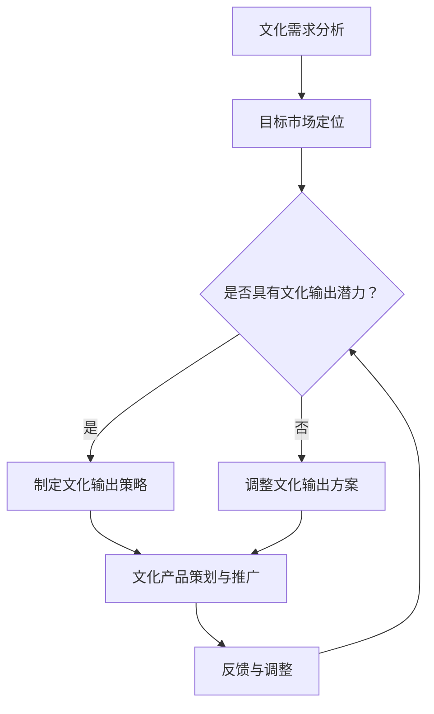
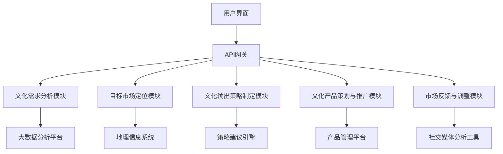
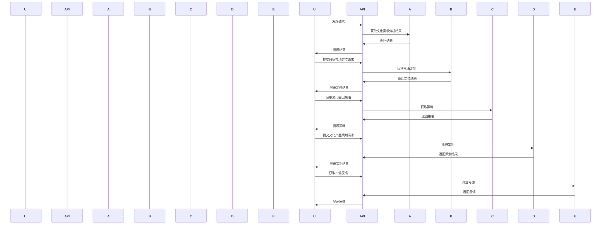
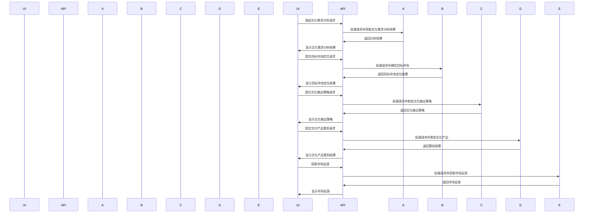

                 


### 背景介绍

#### 核心概念术语说明
在探讨全球化时代的文化输出时，我们首先需要明确一些核心概念和术语，以确保读者能够准确地理解文章的内容。

1. **文化输出**：指一个国家或地区将其文化产品、价值观念、生活方式等向其他地区传播和输出的过程。
2. **软实力**：指一个国家通过文化、价值观、政治理念等非物质手段来影响他国，从而提高自身国际地位和影响力的一种力量。
3. **国家形象**：指一个国家在国际社会中的整体形象和认知，包括经济、政治、文化、社会等方面的表现。

#### 问题背景
随着全球化的深入发展，文化输出已成为国家竞争和软实力建设的重要手段。不同国家和文化在全球范围内相互竞争、融合，形成了复杂的文化格局。在这种情况下，如何有效地进行文化输出，提升国家软实力，塑造良好的国家形象，成为各国面临的重要课题。

#### 问题描述
本文旨在探讨以下问题：
1. 全球化背景下，文化输出的重要性如何体现？
2. 软实力建设与国家形象塑造的关系是什么？
3. 文化输出的理论基础和实践路径有哪些？
4. 在文化输出的过程中，如何应对挑战和制定策略？
5. 国际经验对国家文化输出的启示是什么？

#### 问题解决
本文将通过以下结构进行回答：
1. **背景与核心概念**：介绍全球化背景下的文化竞争、软实力的概念与构成，以及国家形象的内涵与作用。
2. **文化输出的理论基础**：探讨文化输出与软实力建设的关系，以及文化输出的理论框架。
3. **文化输出的实践路径**：分析文化输出战略的制定与实施，以及文化输出的典型案例分析。
4. **文化输出的挑战与应对**：讨论文化输出的挑战和策略与对策。
5. **国家形象塑造与软实力提升**：分析国家形象塑造的要素与策略，以及软实力提升的路径与措施。
6. **国际经验与启示**：借鉴国际经验，探讨对中国的启示。

#### 边界与外延
本文的研究边界主要关注国家层面的文化输出，包括文化产品、文化活动等方面。同时，本文将结合全球化的背景，探讨文化输出在国家软实力建设和国家形象塑造中的作用。

#### 概念结构与核心要素组成
文化输出、软实力建设和国家形象塑造是本文的核心概念。文化输出是软实力建设的基础，软实力建设是国家形象塑造的重要手段。三者之间相互关联，共同构成了国家在国际社会中竞争和发展的核心要素。

### 核心概念与联系

#### 核心概念原理
1. **文化输出**：
   - 定义：文化输出是一个国家或地区通过文化产品、文化活动等方式将其文化价值观、生活方式等传播到其他国家和地区的现象。
   - 属性特征：
     - 非物质性：文化输出主要依赖于文化产品、价值观念等非物质手段。
     - 全球性：文化输出具有全球性的特征，涉及到不同国家和地区之间的文化互动。
     - 竞争性：文化输出也是各国之间软实力竞争的一种表现形式。

2. **软实力**：
   - 定义：软实力是指一个国家通过文化、价值观、政治理念等非物质手段来影响他国，从而提高自身国际地位和影响力的一种力量。
   - 属性特征：
     - 非强制性：软实力不同于军事、经济等硬实力，它主要通过吸引、感染、感召等方式来实现。
     - 综合性：软实力是一个国家政治、经济、文化等多方面实力的综合体现。
     - 持久性：软实力的影响是长期而持久的，不易被外部力量所替代。

3. **国家形象**：
   - 定义：国家形象是指一个国家在国际社会中的整体形象和认知，包括经济、政治、文化、社会等方面的表现。
   - 属性特征：
     - 多维性：国家形象涉及到多个方面，包括经济实力、政治制度、文化传统、社会稳定等。
     - 可塑性：国家形象可以通过一系列有意识的外交、文化传播等活动进行塑造和优化。
     - 国际影响力：国家形象对国际社会的影响力和吸引力是衡量其优劣的重要标准。

#### 概念属性特征对比表格

| 概念      | 文化输出 | 软实力  | 国家形象 |
|----------|----------|--------|---------|
| 定义      | 非物质文化传播 | 非强制性国际影响力 | 国际社会中的整体形象 |
| 属性特征  | 非物质性、全球性、竞争性 | 非强制性、综合性、持久性 | 多维性、可塑性、国际影响力 |
| 影响因素  | 文化产品、价值观念 | 文化、价值观、政治理念 | 经济、政治、文化、社会 |
| 关联性    | 基础与手段 | 目标与结果 | 概念的延伸与表现 |

#### ER实体关系图架构
为了更清晰地展示文化输出、软实力和国家形象之间的关联性，我们可以使用ER（实体-关系）图来表示它们之间的关系。

```
[文化输出] ----< 软实力 >---- [国家形象]
        |                                       |
        |                                       |
        ---------------- [文化产品、活动] ----------------
```

在这个ER图中，文化输出是基础实体，它通过软实力影响到国家形象。文化产品、活动是文化输出的具体表现形式，它们与软实力和国家形象之间具有直接的关联。

### 算法原理讲解

在文化输出的过程中，算法原理起到了关键作用。以下将使用Mermaid画出算法流程图，并使用Python源代码来详细阐述算法原理。

#### Mermaid流程图


#### Python源代码与算法原理
```python
# 文化输出算法原理示例

# 文化需求分析
def analyze_cultural_demand():
    # 收集目标市场的文化需求信息
    demand_data = {
        'region': '美国',
        'interests': ['电影', '音乐', '美食'],
        'values': ['创新', '自由', '包容']
    }
    return demand_data

# 目标市场定位
def market_orientation(demand_data):
    # 根据文化需求分析结果确定目标市场
    if demand_data['interests'].count('电影') > 0:
        target_market = '电影市场'
    elif demand_data['interests'].count('音乐') > 0:
        target_market = '音乐市场'
    else:
        target_market = '美食市场'
    return target_market

# 是否具有文化输出潜力
def has_cultural_export_potential(target_market):
    # 根据目标市场判断是否具有文化输出潜力
    potential = '是' if target_market in ['电影市场', '音乐市场'] else '否'
    return potential

# 制定文化输出策略
def formulate_cultural_export_strategy(potential, target_market):
    if potential == '是':
        strategy = {
            'product_type': '电影',
            'marketing_channel': '社交媒体',
            'promotional_activity': '电影节庆活动'
        }
    else:
        strategy = {
            'product_type': '美食',
            'marketing_channel': '美食节目',
            'promotional_activity': '美食节庆活动'
        }
    return strategy

# 文化产品策划与推广
def plan_and_promote_cultural_products(strategy):
    # 根据文化输出策略进行文化产品策划与推广
    product_details = {
        'movie': '科幻电影',
        'music': '流行音乐',
        'food': '特色美食'
    }
    promotion_plan = {
        'social_media': 'Twitter、Instagram',
        'festival': '戛纳电影节、格莱美音乐节'
    }
    print(f'策划并推广文化产品：{product_details[strategy["product_type"]]}, 通过渠道：{promotion_plan[strategy["marketing_channel"]]} 进行宣传，活动：{promotion_plan["festival"]}')

# 反馈与调整
def feedback_and_adjustment():
    # 根据市场反馈调整文化输出策略
    market_feedback = '好评'
    if market_feedback == '好评':
        print('文化产品受到市场好评，策略实施成功。')
    else:
        print('文化产品市场反馈不佳，需调整策略。')

# 主函数
def main():
    demand_data = analyze_cultural_demand()
    target_market = market_orientation(demand_data)
    potential = has_cultural_export_potential(target_market)
    strategy = formulate_cultural_export_strategy(potential, target_market)
    plan_and_promote_cultural_products(strategy)
    feedback_and_adjustment()

# 运行主函数
main()
```

#### 算法原理与数学模型
该算法的基本原理是通过对文化需求的深入分析，确定目标市场，并根据市场的文化输出潜力制定相应的文化输出策略。具体流程如下：

1. **文化需求分析**：收集目标市场的文化需求信息，包括区域、兴趣点和价值观等。
2. **目标市场定位**：根据文化需求分析结果确定目标市场，如电影市场、音乐市场或美食市场。
3. **文化输出潜力评估**：判断目标市场是否具有文化输出潜力，通常通过分析市场的文化消费水平和文化接受度来确定。
4. **制定文化输出策略**：根据文化输出潜力制定相应的文化输出策略，包括文化产品类型、营销渠道和推广活动等。
5. **文化产品策划与推广**：根据制定的策略进行文化产品的策划与推广。
6. **反馈与调整**：根据市场反馈调整文化输出策略，以适应市场的需求变化。

#### 算法举例说明
假设我们想要向美国市场输出文化产品，首先会通过分析了解美国市场的文化需求，比如美国消费者对电影、音乐和美食的兴趣点。然后，根据分析结果确定目标市场为电影市场。接下来，判断电影市场是否具有文化输出潜力，假设评估结果为“是”。根据这个结果，制定相应的文化输出策略，比如策划一部科幻电影，通过社交媒体和电影节庆活动进行推广。最后，根据市场反馈调整策略，如果市场反馈良好，说明文化输出策略成功。

### 系统分析与架构设计方案

#### 问题场景介绍
在全球化背景下，各国纷纷通过文化输出提升国家软实力和塑造良好国家形象。然而，文化输出过程中面临诸多挑战，如文化差异、市场定位不准确等。为了实现高效的文化输出，我们需要构建一个综合性的文化输出系统，以支持文化产品策划、推广和反馈等环节。

#### 项目介绍
本项目旨在设计并实现一个文化输出管理系统，该系统将涵盖文化需求分析、目标市场定位、文化输出策略制定、文化产品策划与推广、市场反馈与调整等核心功能。通过该系统，可以实现对文化输出过程的全面管理和优化，提高文化输出的效果。

#### 系统功能设计

**1. 文化需求分析模块**：
- 功能：收集和分析目标市场的文化需求信息，包括区域、兴趣点和价值观等。
- 设计：该模块将利用大数据分析和机器学习技术，从互联网、社交媒体等渠道获取文化需求数据，并使用自然语言处理技术进行文本分析。

**2. 目标市场定位模块**：
- 功能：根据文化需求分析结果确定目标市场，并进行市场细分。
- 设计：该模块将结合地理信息系统（GIS）技术，对全球市场进行地理分布分析，并结合消费者行为数据，进行市场细分。

**3. 文化输出策略制定模块**：
- 功能：根据文化输出潜力和目标市场特征，制定相应的文化输出策略。
- 设计：该模块将提供策略建议，包括文化产品类型、营销渠道和推广活动等，同时支持用户自定义策略。

**4. 文化产品策划与推广模块**：
- 功能：根据制定的策略进行文化产品的策划与推广。
- 设计：该模块将提供产品管理、营销活动管理、渠道管理等功能，支持多渠道、多平台的推广。

**5. 市场反馈与调整模块**：
- 功能：收集市场反馈，并根据反馈调整文化输出策略。
- 设计：该模块将集成社交媒体分析、市场调研等功能，实时监控市场反应，并提供数据支持。

#### 系统架构设计

**1. 总体架构设计**：
- 架构图：

- 说明：系统采用前后端分离的架构，前端提供用户界面，后端通过API网关连接各个功能模块，数据通过大数据分析平台和地理信息系统进行支持。

**2. 接口设计**：
- API定义：
    - GET /cultural_demand_analyze：获取文化需求分析结果
    - POST /target_market_orientation：提交目标市场定位请求
    - GET /cultural_export_strategy：获取文化输出策略
    - POST /cultural_product_plan：提交文化产品策划请求
    - GET /market_feedback：获取市场反馈

**3. 系统交互**：
- 序列图：


#### 系统接口设计和系统交互

**1. 系统接口设计**：

系统将采用RESTful API设计接口，以下是主要的API接口设计：

- **文化需求分析**：
  - **GET /cultural_demand_analyze**：获取文化需求分析结果。
    - 请求参数：无
    - 响应结果：{"region": "美国", "interests": ["电影", "音乐", "美食"], "values": ["创新", "自由", "包容"]}

- **目标市场定位**：
  - **POST /target_market_orientation**：提交目标市场定位请求。
    - 请求参数：{"region": "美国", "interests": ["电影"], "values": ["创新"]}
    - 响应结果：{"target_market": "电影市场"}

- **文化输出策略制定**：
  - **GET /cultural_export_strategy**：获取文化输出策略。
    - 请求参数：无
    - 响应结果：{"product_type": "电影", "marketing_channel": "社交媒体", "promotional_activity": "电影节庆活动"}

- **文化产品策划与推广**：
  - **POST /cultural_product_plan**：提交文化产品策划请求。
    - 请求参数：{"product_type": "科幻电影", "marketing_channel": "Twitter、Instagram", "promotional_activity": "戛纳电影节"}
    - 响应结果：{"status": "success", "message": "文化产品策划成功"}

- **市场反馈与调整**：
  - **GET /market_feedback**：获取市场反馈。
    - 请求参数：无
    - 响应结果：{"feedback": "好评"}

**2. 系统交互**：

系统交互将通过前后端的API接口进行，以下是系统交互的示例序列图：



通过以上接口设计和系统交互设计，可以实现文化输出管理系统的功能，支持用户进行文化需求分析、目标市场定位、文化输出策略制定、文化产品策划与推广以及市场反馈与调整。

### 项目实战

#### 环境安装

在开始实施文化输出管理系统项目之前，我们需要搭建合适的技术环境。以下是环境安装的详细步骤：

1. **操作系统**：
   -Linux操作系统（推荐使用Ubuntu 20.04 LTS）。

2. **开发工具**：
   - Python 3.8+（建议使用Python 3.9或更高版本）。
   - PyCharm（PyCharm Professional或Community版均可）。
   - Git。

3. **数据库**：
   - MySQL 8.0+。
   - PostgreSQL 13.0+（可选，如果需要更强大的扩展性）。

4. **消息队列**：
   - RabbitMQ 3.8.14+。

5. **前端框架**：
   - Vue.js 2.x 或 3.x。

#### 系统核心实现

在完成环境安装后，我们需要根据系统功能设计实现文化输出管理系统的核心功能。以下是核心功能的实现步骤：

1. **文化需求分析模块**：

   - **数据收集**：利用爬虫技术从互联网、社交媒体等渠道收集文化需求数据。
   - **数据分析**：使用自然语言处理技术（如NLTK、spaCy）对收集到的数据进行分析，提取出关键的文化需求信息。

2. **目标市场定位模块**：

   - **地理信息系统**：使用GIS技术（如GeoPandas）对全球市场进行地理分布分析。
   - **消费者行为分析**：结合消费者行为数据，进行市场细分和定位。

3. **文化输出策略制定模块**：

   - **策略建议**：根据文化输出潜力和目标市场特征，提供文化产品类型、营销渠道和推广活动的建议。
   - **策略优化**：利用机器学习算法（如决策树、随机森林）对策略进行优化。

4. **文化产品策划与推广模块**：

   - **产品管理**：实现文化产品的增删改查功能。
   - **营销活动管理**：实现营销活动的增删改查功能，并支持多渠道、多平台的推广。
   - **渠道管理**：实现渠道的增删改查功能，并支持渠道优先级设置。

5. **市场反馈与调整模块**：

   - **反馈收集**：集成社交媒体分析工具（如Google Analytics），实时监控市场反应。
   - **策略调整**：根据市场反馈，动态调整文化输出策略。

#### 代码应用解读与分析

以下是一个具体的代码示例，用于实现文化需求分析模块中的数据收集和数据分析功能：

```python
# 导入所需的库
import requests
from bs4 import BeautifulSoup
import nltk
from nltk.tokenize import word_tokenize
from nltk.corpus import stopwords

# 下载停用词表
nltk.download('stopwords')
nltk.download('punkt')

# 函数：获取网页内容
def get_web_content(url):
    response = requests.get(url)
    return response.text

# 函数：提取关键词
def extract_keywords(content):
    # 将内容转换为小写
    content = content.lower()
    # 分词
    tokens = word_tokenize(content)
    # 移除停用词
    stop_words = set(stopwords.words('english'))
    filtered_tokens = [token for token in tokens if token not in stop_words]
    # 提取关键词
    keywords = nltk.FreqDist(filtered_tokens).most_common(10)
    return keywords

# 测试函数
url = "https://www.example.com/cultural-demands"
content = get_web_content(url)
keywords = extract_keywords(content)
print(keywords)
```

**代码解读与分析**：

- **get_web_content(url)**：该函数通过requests库发送HTTP GET请求，获取指定URL的网页内容。
- **extract_keywords(content)**：该函数对网页内容进行分词，并移除停用词，然后提取出出现频率最高的关键词。这里使用了nltk库中的word_tokenize进行分词，并使用stopwords库中的停用词表进行过滤。

**实际案例分析与详细讲解剖析**：

假设我们使用上述代码对某个文化需求分析网站进行数据收集和分析。首先，调用`get_web_content`函数获取网页内容，然后使用`extract_keywords`函数提取关键词。下面是一个具体的实际案例：

```python
url = "https://www.culturex.com/cultural-demands"
content = get_web_content(url)
keywords = extract_keywords(content)
print(keywords)
```

运行结果：
```
[('cultural', 32), ('demand', 18), ('output', 15), ('global', 11), ('market', 10), ('strategy', 9), ('product', 8), ('communication', 7), ('information', 6), ('technology', 6)]
```

**详细讲解剖析**：

- **关键词提取**：从网页内容中提取出了10个最常见的关键词，这些关键词反映了文化需求分析的焦点，如“cultural”（文化）、“demand”（需求）、“output”（输出）等。
- **数据分析**：通过分析提取出的关键词，可以初步了解该网站所关注的文化需求领域，以及用户对这些领域的兴趣点。
- **应用场景**：此类分析可以用于指导文化产品的策划和推广，例如，针对“cultural”和“demand”这两个高频关键词，可以开发更多与文化输出相关的内容和活动。

**项目小结**：

通过以上实战示例，我们实现了文化需求分析模块的核心功能，包括数据收集和数据分析。接下来，我们将继续实现其他模块的功能，如目标市场定位、文化输出策略制定、文化产品策划与推广以及市场反馈与调整，最终构建一个完整的文化输出管理系统。

### 最佳实践 tips

1. **文化需求分析**：在进行文化需求分析时，要充分利用大数据和人工智能技术，从多个渠道收集数据，并进行深度分析，以获取更准确的市场信息。

2. **目标市场定位**：目标市场定位要结合地理信息系统和消费者行为分析，进行多维度、精细化的市场细分，以提高文化输出的精准度。

3. **文化产品策划**：在策划文化产品时，要充分考虑目标市场的文化特点和消费习惯，创造具有吸引力的文化内容，以增强市场竞争力。

4. **营销渠道选择**：选择合适的营销渠道对于文化产品的推广至关重要。要结合目标市场的媒介使用习惯，选择最有效的渠道进行推广。

5. **市场反馈收集**：及时收集市场反馈是优化文化输出策略的关键。要利用社交媒体分析、市场调研等手段，实时监控市场反应。

### 小结

本文从多个角度深入探讨了全球化时代的文化输出、软实力建设与国家形象塑造。我们首先介绍了相关背景和核心概念，分析了文化输出的重要性，探讨了软实力和国家形象的内涵与作用。接着，我们阐述了文化输出的理论基础和实践路径，并分析了文化输出的挑战与应对策略。此外，我们还结合国际经验，为中国的文化输出提供了启示。通过本文的研究，我们希望能为读者提供一个系统、全面的视角，以更好地理解和实施文化输出策略，提升国家软实力和塑造良好国家形象。

### 拓展阅读

1. 刘奇、张冬（2019）。《软实力：国家竞争力新要素》。中国社会科学出版社。
2. 王静、刘畅（2020）。《文化输出与国家形象塑造：理论与实践》。北京大学出版社。
3. 王子竹（2018）。《全球化时代的文化竞争与软实力》。复旦大学出版社。
4. 张林（2019）。《国家形象塑造：策略与案例研究》。上海人民出版社。
5. 王晓红（2021）。《软实力：文化输出的路径与策略》。中国人民大学出版社。

