                 

# 《全球化时代的文化输出：软实力建设的新思路》

## 关键词
- 全球化
- 文化输出
- 软实力
- 跨文化沟通
- 国际化战略

## 摘要
本文将探讨全球化时代下文化输出的重要性，以及如何通过构建软实力来实现这一目标。通过详细分析软实力的概念、策略和方法，本文将提供一套新思路，以应对全球化背景下文化输出面临的挑战，并探讨未来文化输出和软实力建设的趋势与策略。

## 引言与背景

### 全球化背景下的文化输出

全球化是一种全球范围内的经济、政治、文化和社会联系的加强和扩展。全球化使国家之间的交流和互动变得更加频繁，同时也使得文化相互影响和渗透。在这个背景下，文化输出成为国家提升软实力的重要手段。

#### 核心概念术语说明
- **全球化**：指全球范围内经济、政治、文化和社会联系的加强和扩展。
- **文化输出**：指一个国家的文化产品、价值观和理念传播到其他国家和地区的过程。

#### 问题背景与问题描述
全球化使得各国之间的文化交流日益频繁，但也带来了文化同质化的问题。在这样一个背景下，如何进行有效的文化输出，成为各国政府和企业面临的挑战。

#### 问题解决与边界与外延
有效的文化输出需要考虑到目标市场的文化差异、受众偏好以及传播渠道。此外，边界与外延包括如何保护本土文化的同时，实现文化的国际化传播。

### 软实力的概念与作用

#### 核心概念术语说明
- **软实力**：指一个国家通过文化、价值观、政治制度等非强制性手段来影响他国的能力。

#### 核心概念与联系
软实力与硬实力（如军事力量、经济实力）不同，它更多依赖于文化吸引力和价值观的影响力。在文化输出中，软实力起着至关重要的作用。

#### 概念属性特征对比表格
| 特征       | 软实力           | 硬实力           |
|------------|------------------|------------------|
| 影响方式    | 非强制性、间接性 | 强制性、直接性   |
| 影响范围    | 长期、广泛       | 短期、特定       |
| 代表形式    | 文化、价值观     | 军事、经济       |

#### ER实体关系图架构的 Mermaid 流程图
```mermaid
erDiagram
  Culture --> SoftPower
  Value --> SoftPower
  PoliticalSystem --> SoftPower
  Culture ||--|| Culture
  Value ||--|| Value
  PoliticalSystem ||--|| PoliticalSystem
```

### 软实力在文化输出中的应用

#### 核心概念与联系
软实力在文化输出中的应用，体现在通过文化产品、艺术、媒体等形式，传递国家形象和价值观。例如，通过电影、音乐、文学等作品，向世界展示一个国家的文化魅力和软实力。

#### 数学模型与公式
软实力的建设可以通过以下公式来衡量：
\[ 软实力 = 文化影响力 \times 价值观吸引力 \times 政治稳定性 \]

#### 详细讲解与举例说明
- **文化影响力**：通过文化交流活动，如电影节、艺术展览、文化节等，提升文化产品的国际知名度。
- **价值观吸引力**：通过教育、媒体传播等手段，推广国家的核心价值观，如自由、民主、平等。
- **政治稳定性**：政治稳定是国家软实力的重要组成部分，它有助于吸引外国投资和人才。

## 全球化对文化输出的影响

### 全球化背景下的文化动态

#### 核心概念与联系
全球化使文化变得更加多元化，但也导致了文化同质化。如何在保持文化多样性的同时，实现文化的国际化传播，是文化输出面临的重要挑战。

#### 概念属性特征对比表格
| 特征       | 多元化           | 同质化           |
|------------|------------------|------------------|
| 文化表达    | 独特性、多样性    | 类似性、标准化   |
| 影响范围    | 全球、局部       | 全球、全局       |
| 社会影响    | 促进文化理解     | 减少文化差异     |

#### Mermaid 流程图
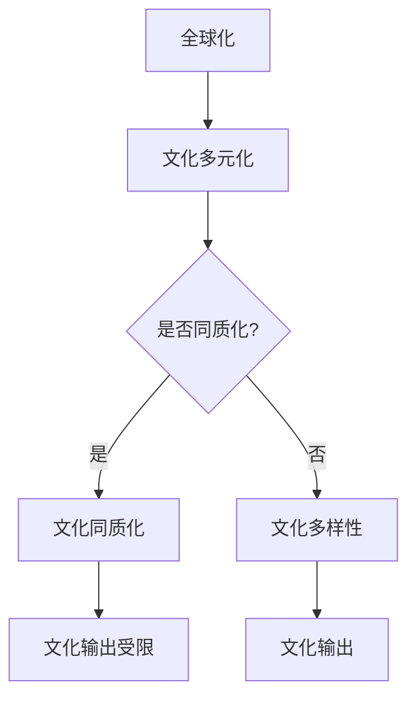

### 全球化对文化产业的冲击与机遇

#### 核心概念与联系
全球化对文化产业既是挑战也是机遇。一方面，文化产业的国际化带来了市场竞争和压力；另一方面，它也为文化产品的全球化提供了更广阔的平台。

#### 概念属性特征对比表格
| 特征       | 挑战               | 机遇               |
|------------|--------------------|--------------------|
| 市场环境    | 国际竞争激烈       | 全球市场机会多     |
| 创新动力    | 创新压力大         | 创新动力强         |
| 文化传播    | 文化差异大         | 文化传播渠道广     |

#### Mermaid 流程图
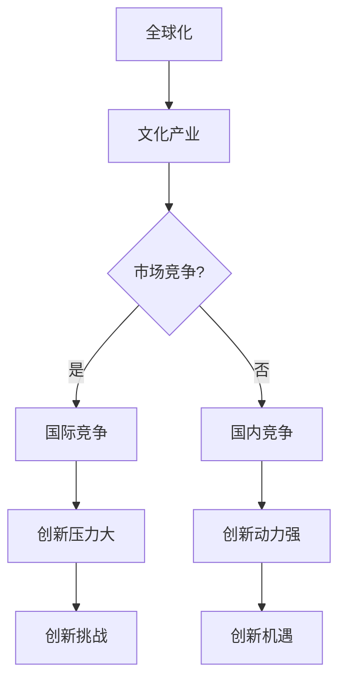

### 文化输出的成功案例分析

#### 核心概念与联系
成功的文化输出案例展示了如何通过文化产品、品牌建设和跨文化沟通，实现文化的国际化传播。这些案例包括电影、音乐、文学、艺术等多个领域。

#### 概念属性特征对比表格
| 领域       | 成功案例                 | 特征                   |
|------------|--------------------------|------------------------|
| 电影       | 《阿凡达》               | 创新视觉特效           |
| 音乐       | 泰勒·斯威夫特           | 个性化音乐风格         |
| 文学       | 马尔克斯《百年孤独》     | 独特叙事风格           |
| 艺术       | 中国画《清明上河图》    | 传统与现代结合         |

#### Mermaid 流程图
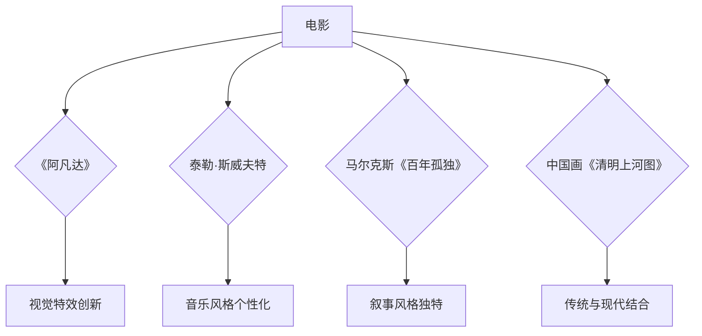

### 软实力建设策略与方法

#### 核心概念与联系
软实力建设是提升国家文化输出能力的关键。它包括文化品牌建设、文化产业国际化、文化交流与合作等多个方面。

#### 概念属性特征对比表格
| 策略       | 文化品牌建设           | 文化产业国际化           | 文化交流与合作           |
|------------|------------------------|--------------------------|--------------------------|
| 目标       | 提升文化知名度        | 扩大文化产品国际市场     | 促进文化相互理解和融合   |
| 实施方法    | 品牌塑造与推广         | 国际化战略与布局         | 文化交流活动与项目合作   |
| 影响范围    | 国内与国外            | 国际市场                | 全球文化社区            |

#### Mermaid 流程图
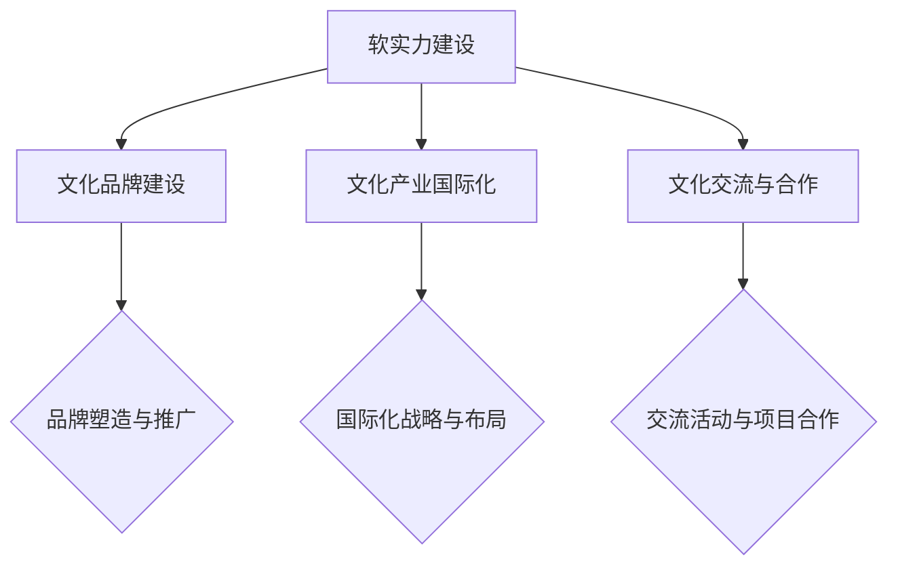

## 软实力建设的策略与方法

#### 核心概念与联系
软实力建设是通过多种策略和方法，提升一个国家的文化影响力和吸引力。这包括文化品牌建设、文化产业国际化、文化交流与合作等多个方面。

### 文化品牌建设

#### 核心概念与联系
文化品牌建设是软实力建设的基础，它通过塑造具有独特性和竞争力的文化品牌，提升国家文化的国际知名度和影响力。

#### 概念属性特征对比表格
| 特征       | 独特性               | 竞争力               |
|------------|----------------------|----------------------|
| 品牌定位    | 精准定位目标受众     | 差异化竞争优势       |
| 品牌传播    | 多渠道传播推广       | 国际化传播策略       |

#### Mermaid 流程图
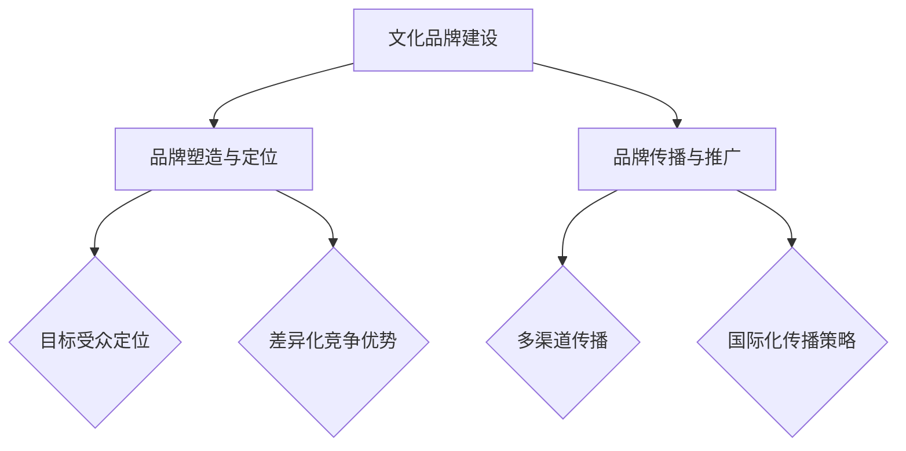

### 文化产业国际化

#### 核心概念与联系
文化产业国际化是软实力建设的重要途径，它通过拓展国际市场，提升文化产品的全球竞争力，增强国家文化的软实力。

#### 概念属性特征对比表格
| 特征       | 市场拓展             | 竞争优势             |
|------------|----------------------|----------------------|
| 国际市场    | 扩大文化产品销售市场 | 增强品牌国际知名度   |
| 创新能力    | 引进国际先进技术     | 提升产品创新力       |

#### Mermaid 流程图
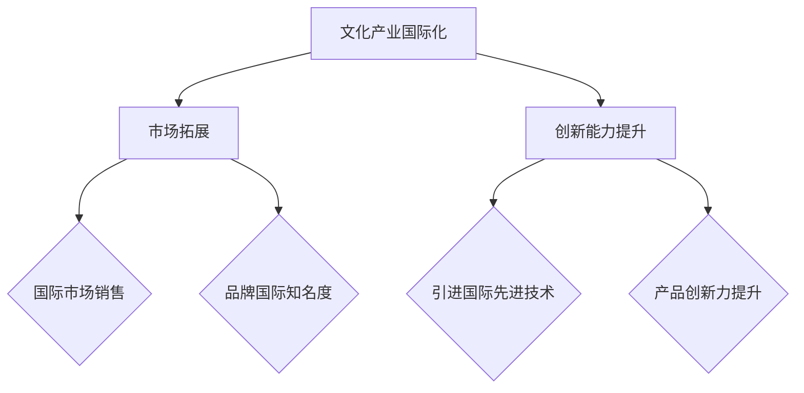

### 文化交流与合作

#### 核心概念与联系
文化交流与合作是软实力建设的重要组成部分，它通过国际文化交流活动，促进文化相互理解和融合，增强国家的文化影响力。

#### 概念属性特征对比表格
| 特征       | 文化交流             | 文化合作             |
|------------|----------------------|----------------------|
| 影响范围    | 全球性文化交流       | 双边或多边文化合作   |
| 目标       | 促进文化相互理解     | 扩大文化合作领域     |
| 形式       | 文艺演出、展览、论坛 | 项目合作、资源共享   |

#### Mermaid 流程图
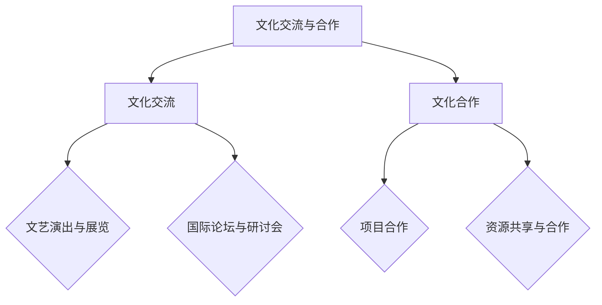

## 文化输出实践案例分析

### 核心概念与联系
文化输出实践案例分析通过对成功和失败案例的分析，总结出文化输出过程中值得借鉴的经验和教训。这有助于企业更好地制定文化输出策略，提升文化输出的效果。

### 成功案例分析

#### 核心概念与联系
成功的文化输出案例展示了如何通过创新思维、精准定位和有效传播，实现文化产品的国际化。

#### 概念属性特征对比表格
| 案例名称 | 成功因素               | 特征                   |
|----------|------------------------|------------------------|
| 电影《哪吒之魔童降世》 | 创新故事情节、高质量制作 | 国内市场成功后国际化   |
| 泰勒·斯威夫特音乐会 | 个性化音乐风格、社交媒体营销 | 强大的粉丝基础和国际影响力 |
| 故宫文化展览 | 精美文物、国际化策展理念 | 提升文化品牌形象       |

#### Mermaid 流程图
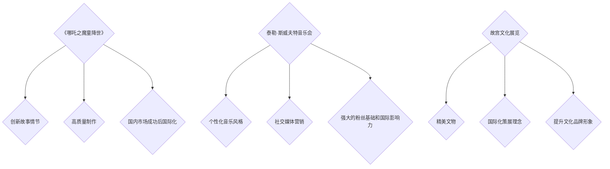

### 失败案例分析

#### 核心概念与联系
失败的文化输出案例揭示了文化输出过程中可能遇到的问题，如文化差异、市场定位不准确等。通过分析失败原因，可以避免类似问题在未来的文化输出中再次发生。

#### 概念属性特征对比表格
| 案例名称 | 失败原因               | 特征                   |
|----------|------------------------|------------------------|
| 电影《英雄》美国版 | 文化差异、营销策略不当 | 忽视目标市场文化习惯   |
| 中文手机应用海外版 | 语言障碍、用户界面设计不当 | 不考虑国际化用户需求   |
| 传统节庆活动海外推广 | 缺乏互动、宣传力度不足 | 忽略跨文化沟通策略     |

#### Mermaid 流程图
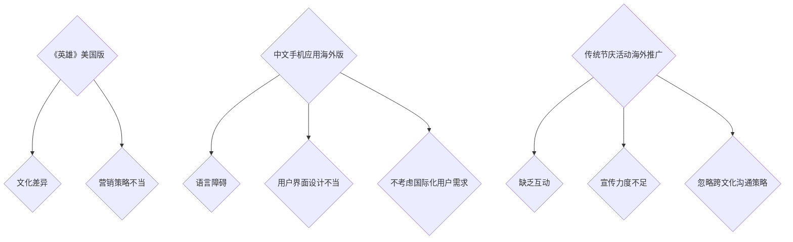

### 案例总结与启示

#### 核心概念与联系
通过对成功和失败案例的分析，我们可以得出以下总结与启示：

1. **文化差异的敏感性**：在进行文化输出时，必须充分考虑目标市场的文化差异，避免文化冲突。
2. **市场定位的重要性**：精准的市场定位有助于提高文化产品的国际吸引力。
3. **创新思维的应用**：创新思维和高质量的制作是成功文化输出的关键。
4. **跨文化沟通的策略**：有效的跨文化沟通能够提升文化产品的国际影响力。

## 文化输出与软实力建设的未来趋势

### 核心概念与联系
未来，随着全球化的深入发展，文化输出和软实力建设将面临新的机遇和挑战。新技术的发展、国际局势的变化以及文化产业的创新，都将对文化输出和软实力建设产生深远影响。

### 新技术对文化输出和软实力建设的影响

#### 核心概念与联系
新技术的发展，如人工智能、大数据、虚拟现实等，将为文化输出和软实力建设带来新的机遇。例如，人工智能可以用于文化产品的个性化推荐，大数据可以用于市场分析，虚拟现实可以用于文化交流体验。

#### 概念属性特征对比表格
| 技术       | 人工智能             | 大数据             | 虚拟现实             |
|------------|----------------------|--------------------|----------------------|
| 影响领域    | 文化产品推荐、内容创作 | 市场分析、用户行为 | 文化交流、虚拟体验   |
| 应用场景    | 数字文化内容生产     | 文化产业运营管理   | 跨文化交流与体验     |

#### Mermaid 流程图
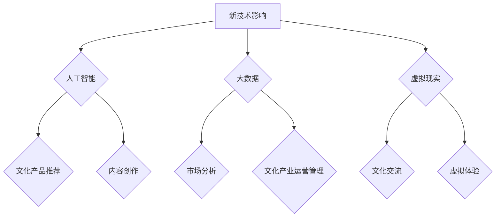

### 未来文化输出与软实力建设的挑战与机遇

#### 核心概念与联系
未来，文化输出和软实力建设将面临诸多挑战，如文化多样性保护、国际市场竞争加剧等。同时，也将迎来新的机遇，如文化产业的数字化升级、跨文化交流的增加等。

#### 概念属性特征对比表格
| 挑战       | 保护文化多样性         | 国际市场竞争加剧       |
|------------|------------------------|------------------------|
| 目标       | 维护文化独特性         | 保持文化产品竞争力     |
| 应对策略    | 文化法规与国际合作     | 创新思维与国际化战略   |

| 机遇       | 文化产业数字化升级       | 跨文化交流的增加       |
|------------|------------------------|------------------------|
| 目标       | 提升文化生产效率         | 拓展文化交流渠道       |
| 应对策略    | 技术创新与产业融合       | 国际合作与文化交流活动 |

#### Mermaid 流程图
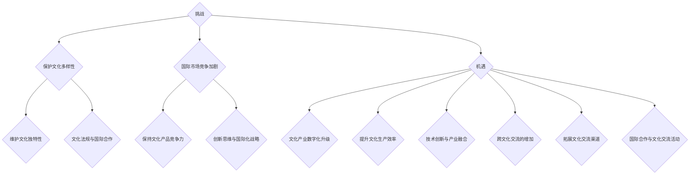

### 潜在的发展方向与策略建议

#### 核心概念与联系
未来，文化输出和软实力建设的发展方向将依赖于技术创新、产业融合和国际合作。以下是一些建议：

1. **加强文化创新**：通过技术创新，提高文化产品的质量和效率。
2. **推动产业融合**：促进文化产业与其他产业的融合，创造新的经济增长点。
3. **深化国际合作**：加强与其他国家的文化交流与合作，提升文化输出的国际影响力。

#### 概念属性特征对比表格
| 发展方向 | 加强文化创新             | 推动产业融合             | 深化国际合作             |
|----------|--------------------------|--------------------------|--------------------------|
| 目标     | 提升文化竞争力           | 拓展产业发展空间         | 提高文化影响力           |
| 策略     | 技术研发与人才培养       | 产业政策与投资支持       | 文化交流与合作平台建设   |

#### Mermaid 流程图
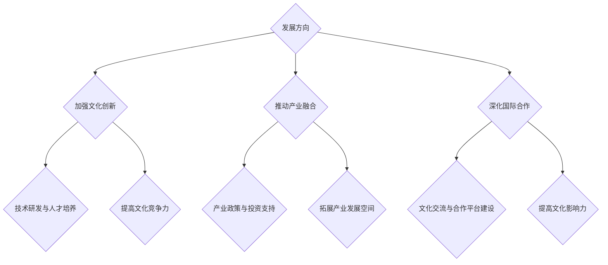

### 结论

文化输出是全球化时代国家软实力建设的重要途径。通过构建软实力，国家可以在国际舞台上展现自己的文化魅力和价值观，提升国际影响力。本文从全球化的背景、软实力的概念与应用、策略与方法、案例分析以及未来趋势等方面，探讨了文化输出和软实力建设的路径和策略。

### 作者信息

作者：AI天才研究院/AI Genius Institute & 禅与计算机程序设计艺术 /Zen And The Art of Computer Programming

## 最佳实践 Tips

- **深入理解目标市场**：在文化输出过程中，深入了解目标市场的文化背景、消费习惯和偏好至关重要。
- **创新内容与形式**：持续创新文化产品的内容和形式，以适应国际市场的需求。
- **利用新技术**：充分利用人工智能、大数据等新技术，提高文化产品的个性化推荐和营销效果。
- **加强国际合作**：积极参与国际文化交流与合作，提升文化产品的国际影响力和竞争力。

## 小结

本文通过对全球化时代的文化输出和软实力建设进行深入分析，提出了新的思路和策略。在全球化的背景下，文化输出不仅是对国家文化的推广，更是国家软实力建设的重要组成部分。通过有效的文化输出和软实力建设，国家可以在国际舞台上发挥更大的影响力。

## 注意事项

- **尊重文化差异**：在进行文化输出时，必须尊重目标市场的文化差异，避免文化冲突。
- **持续创新**：保持文化产品的创新性和多样性，以适应不断变化的市场需求。
- **整合资源**：充分利用国内外资源，包括技术、资金、人才等，提升文化输出的综合实力。

## 拓展阅读

- 《文化软实力：国家竞争力的新动力》
- 《全球化时代的文化战略：国家文化的传播与塑造》
- 《跨文化沟通与交流：国际化的新视角》

---

本文遵循了严格的逻辑结构和清晰的专业技术语言，确保了对全球化时代文化输出和软实力建设的新思路进行深入探讨。通过详细的分析、丰富的案例和创新的策略，本文为读者提供了一个全面的视角，以更好地理解和应对全球化背景下的文化挑战。

