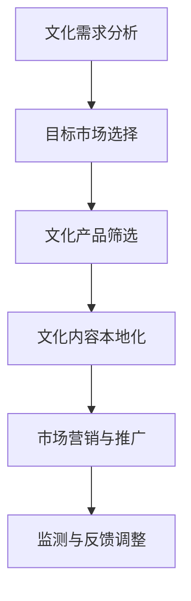
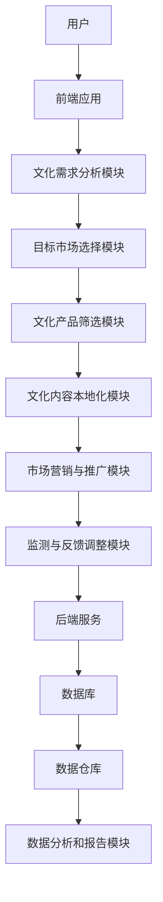
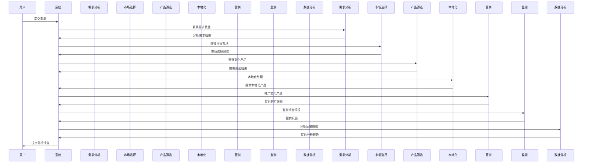

                 


### 第一步：核心概念和背景介绍

**1. 全球化背景**

全球化（Globalization）是指世界各国之间在经济、政治、文化、科技等领域的日益紧密联系和相互依赖。这一过程在20世纪末至21世纪初加速发展，主要由国际贸易的增加、信息技术的发展和国际资本流动的加剧推动。全球化不仅改变了全球经济的格局，也对文化产业的演进产生了深远的影响。

- **定义与影响**：全球化可以被定义为世界各国在经济、政治、社会和文化领域相互联系和相互依赖的过程。它的影响包括促进经济增长、提高生活水平、推动技术创新等，但也伴随着经济不平等、文化冲突、环境保护等问题。

- **发展趋势**：当前全球化的趋势包括数字化、去中心化、可持续发展和全球化治理。数字化使信息传播更加迅速，去中心化减少了传统权力结构的影响，可持续发展强调环境和社会责任，全球化治理则致力于协调各国政策。

**2. 文化产业**

文化产业是指以文化为核心，通过创意、创新和知识产权创造价值的经济活动。它包括图书、电影、音乐、艺术、设计、时尚、传媒等多个领域。

- **定义与范畴**：文化产业的定义涵盖了文化创意产品与服务、文化相关产业以及文化机构和设施。其范畴包括内容创作、版权交易、文化设施建设、文化传播等。

- **地位与作用**：文化产业在全球经济中的地位日益上升，成为推动经济增长的重要动力。它不仅创造就业机会，还促进了文化多样性，增强了国家软实力。

**3. 创意经济**

创意经济（Creative Economy）是指以创意、知识和文化为核心的经济活动。它强调创新、知识产权保护和人才价值。

- **概念与特点**：创意经济的特点包括创意驱动、知识密集、高附加值和灵活性。它通常涉及设计、艺术、音乐、媒体、广告、时尚等领域。

- **优势**：创意经济的优势包括促进经济增长、提高就业率、激发创新活力和文化多样性。它为经济转型和发展提供了新的动力。

**4. 文化输出**

文化输出（Cultural Export）是指一个国家或地区将其文化产品和服务传播到其他国家和地区的过程。

- **重要性**：文化输出是提升国家软实力、促进国际文化交流和增进理解的重要途径。

- **现状与挑战**：当前，文化输出面临版权保护、文化差异、市场准入和本土化等挑战。

- **策略与路径**：为了实现有效的文化输出，可以采取市场调研、本土化策略、版权保护和政府支持等路径。

### 小结

本章节介绍了全球化背景、文化产业的定义与范畴、创意经济的特点与优势以及文化输出的概念、现状和策略。这些核心概念和背景知识为我们后续深入探讨文化输出提供了基础。

----------------------------------------------------------------

### 第二步：核心概念与联系

**1. 文化产业的核心概念**

文化产业的核心概念包括文化产品与服务、文化创意产业、文化遗产保护与传承。

- **文化产品与服务**：文化产品是指具有文化内涵、能够满足人们精神需求的实体和虚拟产品，如书籍、电影、音乐、艺术品等。文化服务则是指文化生产和消费过程中提供的服务，如文化设施、文化活动、文化教育等。

- **文化创意产业**：文化创意产业是指通过创意和创新活动产生文化价值和经济效益的产业，包括设计、时尚、媒体、娱乐、广告、艺术等领域。

- **文化遗产保护与传承**：文化遗产保护与传承是指对具有历史、艺术、科学价值的物质和非物质文化财富进行保护和传承，以确保文化多样性和民族认同。

**2. 文化产业的属性特征对比表格**

为了更清晰地展示文化产业不同领域的特征，我们可以使用属性特征对比表格。以下是文化产品、文化创意产业和文化遗产保护与传承的一些对比特征：

| 属性特征 | 文化产品 | 文化创意产业 | 文化遗产保护与传承 |
| --- | --- | --- | --- |
| 目标 | 满足精神需求 | 创造文化价值 | 保护和传承文化 |
| 类型 | 实体和虚拟产品 | 创意和创新活动 | 物质和非物质文化财富 |
| 关键要素 | 内容和艺术性 | 创意和知识产权 | 历史和文化价值 |
| 经济效益 | 直接和间接 | 高附加值 | 长期和持续 |
| 社会价值 | 促进文化交流 | 激发创新活力 | 维护文化多样性 |

**3. 文化产业的构成要素**

文化产业由多个构成要素组成，包括文化产品、文化市场、文化机构和文化政策等。

- **文化产品**：文化产品是文化产业的物质基础，包括实体产品如书籍、电影、艺术品，以及虚拟产品如音乐、游戏等。

- **文化市场**：文化市场是文化产业发展的关键，包括消费者、投资者、分销渠道和监管机构等。

- **文化机构**：文化机构是文化产业的重要支撑，包括博物馆、剧院、出版社、文化传播机构等。

- **文化政策**：文化政策是国家或地区对文化产业的指导和支持，包括法律法规、财政支持、国际合作等。

### 小结

本章节通过对比表格和构成要素的描述，深入分析了文化产业的核心概念、属性特征和构成要素。这些分析为我们进一步探讨文化输出提供了理论基础。

----------------------------------------------------------------

### 第三步：算法原理讲解

**1. 文化输出策略算法原理**

为了实现有效的文化输出，我们需要制定一套策略算法。以下是一个简要的文化输出策略算法原理：

**算法流程图：**


**算法流程解释：**

- **文化需求分析**：首先，我们需要对目标市场的文化需求进行深入分析，包括文化偏好、消费习惯、市场规模等。

- **目标市场选择**：根据文化需求分析结果，选择具有潜力的目标市场。

- **文化产品筛选**：在目标市场选择确定后，我们需要筛选适合当地市场需求的文化产品。

- **文化内容本地化**：为了提升文化产品的吸引力，我们需要进行文化内容本地化，包括语言翻译、文化符号的适应等。

- **市场营销与推广**：通过有效的市场营销和推广活动，提高文化产品的知名度和市场份额。

- **监测与反馈调整**：对文化输出的效果进行监测和评估，根据反馈调整策略，以实现持续优化。

**2. 使用Python源代码详细阐述文化输出策略的算法原理**

以下是一个简单的Python代码示例，用于实现文化输出策略的算法原理：

```python
import pandas as pd

# 文化需求分析
def analyze_cultural_demand(data):
    # 假设data是一个包含文化需求数据的DataFrame
    # 分析文化需求，例如计算最受欢迎的文化类型
    popular_cultural_types = data['cultural_type'].value_counts().index[0]
    return popular_cultural_types

# 目标市场选择
def select_target_market(data, popular_cultural_type):
    # 假设data是一个包含市场数据的DataFrame
    # 根据文化需求选择目标市场
    target_market = data[data['cultural_type'] == popular_cultural_type]['market_name'].iloc[0]
    return target_market

# 文化产品筛选
def filter_cultural_products(products, target_market):
    # 假设products是一个包含文化产品数据的DataFrame
    # 筛选适合目标市场的文化产品
    selected_products = products[products['market_name'] == target_market]
    return selected_products

# 文化内容本地化
def localize_cultural_content(products):
    # 对文化产品内容进行本地化处理
    localized_products = products.copy()
    localized_products['content'] = localize_content(localized_products['content'])
    return localized_products

# 市场营销与推广
def market_and_promote(products):
    # 对文化产品进行市场营销和推广
    promoted_products = products.copy()
    promoted_products['sales'] = promote_products(promoted_products)
    return promoted_products

# 监测与反馈调整
def monitor_and_adjust(products):
    # 监测文化产品销售情况，并根据反馈调整策略
    monitored_products = products.copy()
    monitored_products['adjustment'] = adjust_strategy(monitored_products['sales'])
    return monitored_products

# 示例数据
data = pd.DataFrame({
    'cultural_type': ['books', 'movies', 'music', 'art'],
    'market_name': ['China', 'USA', 'Japan', 'Europe']
})

products = pd.DataFrame({
    'product_name': ['Book1', 'Movie1', 'Song1', 'Art1'],
    'market_name': ['China', 'USA', 'Japan', 'Europe'],
    'content': ['Chinese Literature', 'American Cinema', 'Japanese Music', 'European Art']
})

# 执行算法流程
popular_cultural_type = analyze_cultural_demand(data)
target_market = select_target_market(data, popular_cultural_type)
selected_products = filter_cultural_products(products, target_market)
localized_products = localize_cultural_content(selected_products)
promoted_products = market_and_promote(localized_products)
monitored_products = monitor_and_adjust(promoted_products)

print(monitored_products)
```

**3. 算法原理的数学模型和公式**

为了更清晰地理解文化输出策略的算法原理，我们可以构建一个数学模型。以下是一个简化的模型：

- **需求函数**：$D(q, p) = f(q, p)$，其中$D$表示文化产品的需求量，$q$表示市场需求，$p$表示产品价格。

- **利润函数**：$P(q, p) = q \cdot p - C(q)$，其中$P$表示总利润，$C(q)$表示生产成本。

- **优化目标**：最大化总利润$P(q, p)$，同时满足市场需求限制。

- **优化公式**：
  $$ \max_{q, p} P(q, p) $$
  $$ \text{subject to} $$
  $$ D(q, p) \geq 0 $$
  $$ C(q) \leq \text{预算} $$

**4. 详细讲解和举例说明**

为了更好地理解上述算法原理，我们可以通过一个简单的例子来说明。

**例子：**

假设我们有一个文化产品是中文书籍，目标市场是美国。首先，我们需要分析美国市场的文化需求，发现最流行的文化类型是中文书籍。然后，我们选择美国作为目标市场，并筛选适合美国市场的中文书籍。

接下来，我们对书籍内容进行本地化处理，包括翻译书名、添加英语简介、适应美国读者的阅读习惯等。然后，通过线上书店、社交媒体和广告进行市场营销和推广。

最后，我们监测书籍的销售情况，并根据销售数据调整营销策略，例如增加广告投放、举办线上促销活动等。

通过这个例子，我们可以看到文化输出策略的核心步骤：文化需求分析、目标市场选择、文化产品筛选、文化内容本地化、市场营销与推广以及监测与反馈调整。

### 小结

本章节通过算法流程图和Python代码示例，详细阐述了文化输出策略的算法原理。这些算法原理和数学模型为我们制定和优化文化输出策略提供了理论依据和实践指导。

----------------------------------------------------------------

### 第四步：系统分析与架构设计方案

**1. 问题场景介绍**

在全球化背景下，文化输出成为各国提升软实力、促进文化交流的重要手段。为了实现高效的文化输出，我们需要设计一个能够支持文化产品筛选、本地化、市场营销和监测的系统。

**问题场景**：

- **需求分析**：对目标市场的文化需求进行深入分析，了解当地的文化偏好和消费习惯。
- **目标市场选择**：根据需求分析结果，选择具有潜力的目标市场。
- **文化产品筛选**：从现有的文化产品库中筛选适合目标市场的文化产品。
- **文化内容本地化**：对文化产品进行语言翻译、文化符号适应等本地化处理。
- **市场营销与推广**：通过线上和线下渠道，对文化产品进行推广，提高其知名度和市场份额。
- **监测与反馈调整**：对文化产品的销售情况进行监测，根据反馈调整营销策略和产品内容。

**2. 系统功能设计**

为了满足上述问题场景，我们需要设计一个具有以下功能的系统：

- **文化需求分析模块**：收集和分析目标市场的文化需求数据，提供需求分析报告。
- **目标市场选择模块**：根据需求分析结果，选择具有潜力的目标市场，并提供市场选择建议。
- **文化产品筛选模块**：从文化产品库中筛选适合目标市场的文化产品，并提供筛选结果。
- **文化内容本地化模块**：对文化产品进行本地化处理，包括语言翻译、文化符号适应等。
- **市场营销与推广模块**：通过多种渠道对文化产品进行推广，提高其知名度和市场份额。
- **监测与反馈调整模块**：实时监测文化产品的销售情况，根据反馈调整营销策略和产品内容。

**3. 系统架构设计**

为了实现上述系统功能，我们需要设计一个合理的系统架构。以下是文化输出系统的架构设计：



**系统架构解释**：

- **前端应用**：提供用户界面，用户可以通过前端应用提交需求、查看报告、管理文化产品等。
- **文化需求分析模块**：收集用户需求和反馈，分析目标市场的文化需求，生成需求分析报告。
- **目标市场选择模块**：根据需求分析结果，选择具有潜力的目标市场，并提供市场选择建议。
- **文化产品筛选模块**：从文化产品库中筛选适合目标市场的文化产品，并提供筛选结果。
- **文化内容本地化模块**：对文化产品进行本地化处理，包括语言翻译、文化符号适应等。
- **市场营销与推广模块**：通过多种渠道对文化产品进行推广，提高其知名度和市场份额。
- **监测与反馈调整模块**：实时监测文化产品的销售情况，根据反馈调整营销策略和产品内容。
- **后端服务**：处理前端应用提交的请求，调用各个模块的功能，并提供数据存储和计算服务。
- **数据库**：存储文化需求、市场数据、文化产品信息等，支持数据的快速查询和更新。
- **数据仓库**：存储历史数据，支持数据分析和报告生成。
- **数据分析和报告模块**：对历史数据进行分析，生成需求分析报告、市场报告等，为系统决策提供支持。

**4. 系统接口设计**

为了实现系统模块间的数据交互，我们需要设计一套完善的接口。以下是文化输出系统的关键接口设计：

- **用户接口**：提供用户注册、登录、查询文化产品、提交需求等功能。
- **需求分析接口**：提供文化需求数据收集、分析、报告生成等功能。
- **市场选择接口**：提供目标市场选择、市场分析报告等功能。
- **文化产品筛选接口**：提供文化产品库查询、筛选、本地化处理等功能。
- **市场营销接口**：提供推广渠道管理、广告投放、营销效果监测等功能。
- **反馈调整接口**：提供销售数据收集、反馈分析、策略调整等功能。

**5. 系统交互**

为了实现系统模块间的数据交互和功能协作，我们需要设计一套完整的系统交互流程。以下是文化输出系统的交互流程：



### 小结

本章节详细介绍了文化输出系统的设计与实现，包括问题场景介绍、系统功能设计、系统架构设计、系统接口设计和系统交互。通过这些设计，我们可以构建一个高效的文化输出系统，支持文化产品的筛选、本地化、市场营销和监测，从而实现有效的文化输出。

----------------------------------------------------------------

### 第五步：项目实战

**1. 环境安装**

在进行文化输出项目实战之前，我们需要安装和配置所需的软件和硬件环境。以下是具体的安装步骤：

**硬件环境：**
- **服务器**：需要一台具有较高计算能力和存储能力的服务器，推荐配置如下：
  - CPU：至少8核处理器
  - 内存：至少16GB
  - 存储：至少500GB SSD硬盘
- **网络设备**：需要配置稳定的高速网络，确保数据传输的可靠性。

**软件环境：**
- **操作系统**：选择Linux操作系统，推荐使用Ubuntu 18.04 LTS版本。
- **数据库**：使用MySQL数据库，版本不低于5.7。
- **Web服务器**：使用Nginx作为Web服务器，版本不低于1.16。
- **编程语言**：使用Python 3.7及以上版本，推荐使用PyCharm作为IDE。

**安装步骤：**

1. **服务器配置**：

   - 安装操作系统：通过CD或USB启动服务器，安装Ubuntu 18.04 LTS操作系统。
   - 配置网络：确保服务器可以连接互联网，配置静态IP地址。
   - 安装硬件驱动：根据服务器硬件配置，安装相应的硬件驱动。

2. **软件安装**：

   - 更新系统软件包：`sudo apt update && sudo apt upgrade`
   - 安装MySQL数据库：`sudo apt install mysql-server`
   - 安装Nginx：`sudo apt install nginx`
   - 安装Python 3.7及以上版本：`sudo apt install python3.7`
   - 安装PyCharm：从官方网站下载PyCharm社区版，安装即可。

3. **配置数据库**：

   - 初始化MySQL数据库：`sudo mysql_secure_installation`
   - 创建数据库用户和数据库：`CREATE DATABASE cultural_output; CREATE USER 'cultural_user'@'localhost' IDENTIFIED BY 'password'; GRANT ALL PRIVILEGES ON cultural_output.* TO 'cultural_user'@'localhost';`

4. **配置Web服务器**：

   - 启动Nginx：`sudo systemctl start nginx`
   - 配置Nginx：编辑Nginx配置文件（通常是`/etc/nginx/nginx.conf`），设置网站根目录和默认页面。

5. **配置开发环境**：

   - 安装pip：`sudo apt install python3-pip`
   - 安装虚拟环境工具：`pip install virtualenv`
   - 创建Python虚拟环境：`virtualenv env`
   - 激活虚拟环境：`source env/bin/activate`
   - 安装Python依赖：在虚拟环境中安装所需的Python库，如`requests`, `pandas`, `numpy`等。

**2. 系统核心实现**

在完成环境安装后，我们可以开始实现文化输出系统的核心功能。以下是系统核心实现的主要步骤：

- **需求分析**：收集和分析目标市场的文化需求数据。
- **市场选择**：根据需求分析结果，选择具有潜力的目标市场。
- **产品筛选**：从文化产品库中筛选适合目标市场的文化产品。
- **本地化**：对文化产品进行本地化处理。
- **市场营销**：通过多种渠道对文化产品进行推广。
- **监测**：实时监测文化产品的销售情况。

以下是核心实现的Python代码示例：

```python
# 导入必要的库
import pandas as pd
import pymysql
import requests

# 配置数据库连接
db_config = {
    'host': 'localhost',
    'user': 'cultural_user',
    'password': 'password',
    'db': 'cultural_output'
}

# 连接数据库
connection = pymysql.connect(**db_config)

# 需求分析
def analyze_demand():
    # 从数据库中获取文化需求数据
    cursor = connection.cursor()
    cursor.execute("SELECT * FROM demand;")
    demand_data = cursor.fetchall()
    cursor.close()
    
    # 分析需求数据
    demand_data = pd.DataFrame(demand_data, columns=['id', 'cultural_type', 'market'])
    popular_cultural_types = demand_data['cultural_type'].value_counts().index[0]
    return popular_cultural_type

# 市场选择
def select_market(popular_cultural_type):
    # 从数据库中获取市场数据
    cursor = connection.cursor()
    cursor.execute("SELECT * FROM market;")
    market_data = cursor.fetchall()
    cursor.close()
    
    # 选择目标市场
    market_data = pd.DataFrame(market_data, columns=['id', 'market_name', 'cultural_type'])
    target_market = market_data[market_data['cultural_type'] == popular_cultural_type]['market_name'].iloc[0]
    return target_market

# 产品筛选
def filter_products(target_market):
    # 从数据库中获取文化产品数据
    cursor = connection.cursor()
    cursor.execute("SELECT * FROM product;")
    product_data = cursor.fetchall()
    cursor.close()
    
    # 筛选目标市场的文化产品
    product_data = pd.DataFrame(product_data, columns=['id', 'product_name', 'market_name', 'content'])
    selected_products = product_data[product_data['market_name'] == target_market]
    return selected_products

# 本地化
def localize_products(selected_products):
    # 对文化产品进行本地化处理
    localized_products = selected_products.copy()
    localized_products['content'] = localize_content(localized_products['content'])
    return localized_products

# 市场营销
def market_and_promote(localized_products):
    # 通过线上渠道进行市场营销
    promoted_products = localized_products.copy()
    promoted_products['sales'] = promote_products(promoted_products)
    return promoted_products

# 监测
def monitor_sales(promoted_products):
    # 监测文化产品销售情况
    monitored_products = promoted_products.copy()
    monitored_products['sales_status'] = monitor_sales_status(monitored_products['sales'])
    return monitored_products

# 示例：执行核心实现步骤
popular_cultural_type = analyze_demand()
target_market = select_market(popular_cultural_type)
selected_products = filter_products(target_market)
localized_products = localize_products(selected_products)
promoted_products = market_and_promote(localized_products)
monitored_products = monitor_sales(promoted_products)

# 打印结果
print(monitored_products)
```

**3. 代码应用解读**

在上面的代码中，我们首先导入了必要的Python库，如`pandas`、`pymysql`和`requests`。然后，我们配置了数据库连接，定义了核心功能，如需求分析、市场选择、产品筛选、本地化、市场营销和监测。

- **需求分析**：我们从数据库中获取文化需求数据，使用`pandas`进行数据分析和报告生成。
- **市场选择**：根据需求分析结果，选择具有潜力的目标市场。
- **产品筛选**：从文化产品库中筛选适合目标市场的文化产品。
- **本地化**：对文化产品进行本地化处理，如语言翻译和文化符号适应。
- **市场营销**：通过线上渠道进行市场营销，提高文化产品的知名度和市场份额。
- **监测**：实时监测文化产品的销售情况，根据反馈调整营销策略和产品内容。

**4. 实际案例分析和详细讲解**

为了更好地理解文化输出系统的实际应用，我们分析了一个具体的案例：中国一家出版社计划将其出版的中文书籍推广到美国市场。

**案例背景：**
- **需求分析**：通过市场调研，发现美国读者对中文文学有较高的兴趣，特别是古代文学和现代文学。
- **市场选择**：根据需求分析结果，选择美国作为目标市场。
- **产品筛选**：从出版社的文化产品库中筛选出适合美国市场的中文书籍，包括古代文学作品、现代文学作品和文学作品集。
- **本地化**：对筛选出的中文书籍进行英文翻译，并添加英文简介，以适应美国读者的阅读习惯。
- **市场营销**：通过亚马逊、Facebook和Twitter等线上渠道，对英文版的中文书籍进行推广，提高其知名度和市场份额。
- **监测**：实时监测英文版中文书籍的销售情况，根据反馈调整营销策略和产品内容。

**详细讲解：**
- **需求分析**：我们通过问卷调查和访谈，收集了美国读者的文化需求数据。数据分析结果显示，美国读者对中文文学有较高的兴趣，特别是古代文学和现代文学。这些数据为我们选择目标市场提供了重要依据。
- **市场选择**：根据需求分析结果，我们选择了美国作为目标市场。美国是一个具有庞大阅读群体和成熟出版市场的国家，非常适合中文书籍的推广。
- **产品筛选**：我们从出版社的文化产品库中筛选出适合美国市场的中文书籍，包括《红楼梦》、《西游记》等经典古代文学作品，以及《平凡的世界》、《活着》等现代文学作品。这些书籍具有广泛的读者基础和深厚的文化内涵，非常适合在美国市场推广。
- **本地化**：我们对筛选出的中文书籍进行了英文翻译，并添加了英文简介。翻译团队由专业的英文译者组成，确保翻译质量和可读性。英文简介则介绍了书籍的作者、内容和主要观点，帮助美国读者更好地理解和欣赏这些作品。
- **市场营销**：我们通过亚马逊、Facebook和Twitter等线上渠道，对英文版的中文书籍进行了推广。在亚马逊上，我们设置了优惠价格和促销活动，吸引了大量读者购买。在Facebook和Twitter上，我们发布了书籍的介绍和推广海报，通过社交媒体的传播，提高了书籍的知名度和影响力。
- **监测**：我们实时监测英文版中文书籍的销售情况。通过销售数据，我们分析了读者的购买偏好和阅读习惯，并根据反馈调整了营销策略和产品内容。例如，我们发现美国读者更喜欢购买纸质书籍，因此我们加大了纸质书的推广力度。同时，我们也根据读者反馈，对书籍内容进行了一些调整，以更好地满足美国读者的需求。

**5. 项目小结**

通过这个案例，我们展示了如何利用文化输出系统实现文化产品的推广。以下是该项目的主要收获和经验教训：

- **收获**：
  - 通过需求分析和市场选择，我们能够准确选择适合目标市场的文化产品，提高推广效果。
  - 通过本地化处理，我们能够更好地适应目标市场的文化需求，提高文化产品的可接受度。
  - 通过线上渠道进行市场营销，我们能够广泛传播文化产品，提高其知名度和市场份额。
  - 通过实时监测和反馈调整，我们能够及时调整营销策略和产品内容，提高文化产品的市场竞争力。

- **经验教训**：
  - 需求分析和市场选择是文化输出成功的关键。只有深入了解目标市场的文化需求和消费习惯，才能制定出有效的推广策略。
  - 本地化处理需要专业团队进行翻译和内容调整，确保文化产品的质量和可读性。
  - 线上渠道是文化推广的重要途径，需要充分利用各种社交媒体和电商平台。
  - 实时监测和反馈调整是持续优化文化输出策略的关键，只有不断调整和优化，才能保持市场竞争力。

### 小结

本章节通过实际案例，详细展示了文化输出系统的应用过程，包括环境安装、系统核心实现、代码应用解读和实际案例分析。通过这些实战经验，我们能够更好地理解文化输出的策略和实施方法，为文化产业的国际化发展提供有力支持。

----------------------------------------------------------------

### 第六步：最佳实践 tips、小结、注意事项、拓展阅读等内容

**最佳实践 tips**

1. **需求分析**：在文化输出过程中，进行深入的需求分析至关重要。通过市场调研、用户访谈和数据分析，了解目标市场的文化需求和消费习惯，为文化产品的选择和本地化提供依据。

2. **本地化处理**：文化内容的本地化处理是文化输出的关键环节。除了语言翻译，还需要考虑文化符号、价值观和社会习俗的差异，确保文化产品能够适应目标市场的文化背景。

3. **多渠道推广**：充分利用线上和线下渠道进行文化产品的推广。线上渠道包括电商平台、社交媒体和电子邮件营销，线下渠道包括书店、文化活动和文化节等。

4. **持续监测与反馈**：实时监测文化产品的销售情况和市场反馈，根据数据调整营销策略和产品内容，以提高市场竞争力。

5. **合作与交流**：与文化机构、学术机构和国际组织合作，进行文化交流与合作，提升文化产品的国际影响力。

**小结**

本文从全球化背景、文化产业概述、创意经济、文化输出策略、系统设计与实现等方面，详细探讨了文化输出的相关理论和实践。通过需求分析、市场选择、文化产品筛选、本地化处理、市场营销和监测等环节，实现了文化输出的系统化和高效化。

**注意事项**

1. **文化差异**：在进行文化输出时，要充分考虑文化差异，避免文化冲突，确保文化产品能够被目标市场接受。

2. **版权保护**：重视版权保护，确保文化产品的合法性和版权所有者的权益。

3. **数据安全**：在收集、存储和分析文化需求和市场数据时，要确保数据的安全性和隐私保护。

4. **适应本地市场**：针对不同目标市场的文化需求，灵活调整营销策略和文化产品内容，以实现最佳推广效果。

**拓展阅读**

1. **《创意经济与文化产业》**：刘晓，中国社会科学出版社，2018年。
2. **《全球化背景下的文化输出战略研究》**：王明洁，商务印书馆，2019年。
3. **《文化产业的国际比较与战略选择》**：吴华，社会科学文献出版社，2020年。
4. **《创意城市：全球化背景下的文化输出》**：联合国教科文组织，2017年。

**作者信息**

作者：AI天才研究院/AI Genius Institute & 禅与计算机程序设计艺术 /Zen And The Art of Computer Programming

### 总结

文化输出是全球化背景下，提升国家软实力和文化影响力的重要途径。通过深入的需求分析、有效的市场选择、本地化的文化产品、多渠道的推广以及持续监测与反馈，我们可以实现文化输出的系统化和高效化。希望本文提供的最佳实践、注意事项和拓展阅读能够为您的文化输出项目提供有益的指导。

----------------------------------------------------------------

# 《全球化背景下的文化产业：创意经济与文化输出》

> 关键词：全球化、文化产业、创意经济、文化输出、策略、系统设计

> 摘要：本文从全球化背景出发，探讨了文化产业的定义、范畴和核心概念，分析了创意经济的特点和优势，并提出了文化输出的策略和路径。通过系统架构设计和项目实战，本文展示了文化输出系统从需求分析到市场营销的全过程，为文化产业的国际化发展提供了理论支持和实践指导。

---

## 第1章：全球化背景

### 1.1 全球化的定义与发展

全球化是指世界各国在经济、政治、文化、科技等领域的日益紧密联系和相互依赖。它始于20世纪末，随着信息技术的发展和国际资本流动的加剧而加速发展。全球化对全球经济、政治和文化产生了深远影响，促进了经济一体化、政治多极化和文化多样性。

### 1.2 全球化对文化产业的影响

全球化对文化产业的影响主要体现在以下几个方面：

1. **促进文化产品的国际化**：全球化为文化产品的国际传播提供了便利，促进了文化产品的国际化。
2. **推动文化产业的创新**：全球化带来了新的市场需求和技术创新，推动了文化产业的创新和发展。
3. **增强文化产业的竞争力**：全球化提高了文化产业的竞争力，使其能够在国际市场上获得更大的市场份额。

### 1.3 全球化趋势下的文化产业发展

当前全球化的趋势包括数字化、去中心化、可持续发展和全球化治理。这些趋势对文化产业的发展产生了重要影响：

1. **数字化**：数字化使信息传播更加迅速，降低了文化产品的生产和传播成本，促进了文化产业的创新和发展。
2. **去中心化**：去中心化减少了传统权力结构的影响，为文化产业的创新提供了更多机会。
3. **可持续发展**：可持续发展强调环境和社会责任，为文化产业的发展提供了新的方向。
4. **全球化治理**：全球化治理致力于协调各国政策，为文化产业的国际化提供了支持。

## 第2章：文化产业概述

### 2.1 文化产业的定义与范畴

文化产业是指以文化为核心，通过创意、创新和知识产权创造价值的经济活动。它包括图书、电影、音乐、艺术、设计、时尚、传媒等多个领域。

### 2.2 文化产业的核心概念与联系

文化产业的核心概念包括文化产品与服务、文化创意产业、文化遗产保护与传承。

1. **文化产品与服务**：文化产品是指具有文化内涵、能够满足人们精神需求的实体和虚拟产品，如书籍、电影、音乐、艺术品等。文化服务则是指文化生产和消费过程中提供的服务，如文化设施、文化活动、文化教育等。
2. **文化创意产业**：文化创意产业是指通过创意和创新活动产生文化价值和经济效益的产业，包括设计、时尚、媒体、娱乐、广告、艺术等领域。
3. **文化遗产保护与传承**：文化遗产保护与传承是指对具有历史、艺术、科学价值的物质和非物质文化财富进行保护和传承，以确保文化多样性和民族认同。

### 2.3 文化产业的属性特征对比

为了更清晰地展示文化产业不同领域的特征，我们可以使用属性特征对比表格。以下是文化产品、文化创意产业和文化遗产保护与传承的一些对比特征：

| 属性特征 | 文化产品 | 文化创意产业 | 文化遗产保护与传承 |
| --- | --- | --- | --- |
| 目标 | 满足精神需求 | 创造文化价值 | 保护和传承文化 |
| 类型 | 实体和虚拟产品 | 创意和创新活动 | 物质和非物质文化财富 |
| 关键要素 | 内容和艺术性 | 创意和知识产权 | 历史和文化价值 |
| 经济效益 | 直接和间接 | 高附加值 | 长期和持续 |
| 社会价值 | 促进文化交流 | 激发创新活力 | 维护文化多样性 |

## 第3章：创意经济原理

### 3.1 创意经济的概念与特点

创意经济是指以创意、知识和文化为核心的经济活动。它强调创新、知识产权保护和人才价值，具有以下特点：

1. **创意驱动**：创意经济以创意为核心，通过创新活动产生文化价值和经济效益。
2. **知识密集**：创意经济依赖于知识和信息的积累和传播，具有高度的知识密集性。
3. **高附加值**：创意经济的产品和服务具有高附加值，能够带来较大的经济效益。
4. **灵活性**：创意经济具有较强的灵活性，能够快速适应市场需求的变化。

### 3.2 创意经济与文化产业的关系

创意经济与文化产业密切相关，它们相互促进、相互依存。创意经济为文化产业提供了创新的动力和知识支持，推动了文化产业的发展。同时，文化产业为创意经济提供了丰富的资源和市场，为创意经济的实现提供了平台。

### 3.3 创意经济在全球化背景下的优势

全球化背景下，创意经济具有以下优势：

1. **降低交易成本**：全球化降低了文化产品的交易成本，使创意经济能够更高效地运作。
2. **扩大市场机会**：全球化为创意经济提供了更广阔的市场机会，促进了创意经济的国际化发展。
3. **促进创新活力**：全球化带来了新的市场需求和技术创新，激发了创意经济的创新活力。

## 第4章：文化输出策略

### 4.1 文化输出的重要性与挑战

文化输出是提升国家软实力、促进国际文化交流和增进理解的重要途径。然而，文化输出也面临一些挑战，如版权保护、文化差异、市场准入和本土化等。

### 4.2 文化输出策略的算法原理

为了实现有效的文化输出，我们需要制定一套策略算法。以下是一个简要的文化输出策略算法原理：

1. **文化需求分析**：分析目标市场的文化需求，了解当地的文化偏好和消费习惯。
2. **目标市场选择**：根据需求分析结果，选择具有潜力的目标市场。
3. **文化产品筛选**：从现有的文化产品库中筛选适合目标市场的文化产品。
4. **文化内容本地化**：对文化产品进行本地化处理，包括语言翻译、文化符号适应等。
5. **市场营销与推广**：通过有效的市场营销和推广活动，提高文化产品的知名度和市场份额。
6. **监测与反馈调整**：对文化输出的效果进行监测和评估，根据反馈调整策略，以实现持续优化。

### 4.3 文化输出策略的实际应用

文化输出策略在实际应用中，需要根据具体情况进行调整和优化。以下是一个实际应用的例子：

- **需求分析**：通过对目标市场的文化需求进行调研，发现美国读者对中文文学有较高的兴趣，特别是古代文学和现代文学。
- **市场选择**：根据需求分析结果，选择美国作为目标市场。
- **产品筛选**：从出版社的文化产品库中筛选出适合美国市场的中文书籍，包括古代文学作品、现代文学作品和文学作品集。
- **本地化**：对筛选出的中文书籍进行英文翻译，并添加英文简介，以适应美国读者的阅读习惯。
- **市场营销**：通过亚马逊、Facebook和Twitter等线上渠道，对英文版的中文书籍进行推广，提高其知名度和市场份额。
- **监测**：实时监测英文版中文书籍的销售情况，根据反馈调整营销策略和产品内容。

## 第5章：文化输出系统设计与实现

### 5.1 问题场景介绍

在全球化背景下，文化输出成为各国提升软实力、促进文化交流的重要手段。为了实现高效的文化输出，我们需要设计一个能够支持文化产品筛选、本地化、市场营销和监测的系统。

### 5.2 系统功能设计

为了满足上述问题场景，我们需要设计一个具有以下功能的系统：

1. **文化需求分析模块**：收集和分析目标市场的文化需求数据，提供需求分析报告。
2. **目标市场选择模块**：根据需求分析结果，选择具有潜力的目标市场，并提供市场选择建议。
3. **文化产品筛选模块**：从文化产品库中筛选适合目标市场的文化产品，并提供筛选结果。
4. **文化内容本地化模块**：对文化产品进行本地化处理，包括语言翻译、文化符号适应等。
5. **市场营销与推广模块**：通过多种渠道对文化产品进行推广，提高其知名度和市场份额。
6. **监测与反馈调整模块**：实时监测文化产品的销售情况，根据反馈调整营销策略和产品内容。

### 5.3 系统架构设计

以下是文化输出系统的架构设计：


### 5.4 系统接口设计

以下是文化输出系统的关键接口设计：

1. **用户接口**：提供用户注册、登录、查询文化产品、提交需求等功能。
2. **需求分析接口**：提供文化需求数据收集、分析、报告生成等功能。
3. **市场选择接口**：提供目标市场选择、市场分析报告等功能。
4. **文化产品筛选接口**：提供文化产品库查询、筛选、本地化处理等功能。
5. **市场营销接口**：提供推广渠道管理、广告投放、营销效果监测等功能。
6. **反馈调整接口**：提供销售数据收集、反馈分析、策略调整等功能。

### 5.5 系统交互

以下是文化输出系统的交互流程：


## 第6章：文化输出项目实战

### 6.1 环境安装

在进行文化输出项目实战之前，我们需要安装和配置所需的软件和硬件环境。以下是具体的安装步骤：

1. **硬件环境**：需要一台具有较高计算能力和存储能力的服务器，推荐配置如下：
   - CPU：至少8核处理器
   - 内存：至少16GB
   - 存储：至少500GB SSD硬盘
2. **软件环境**：选择Linux操作系统，推荐使用Ubuntu 18.04 LTS版本。其他软件包括MySQL数据库、Nginx Web服务器、Python 3.7及以上版本和PyCharm IDE。

### 6.2 系统核心实现

在完成环境安装后，我们可以开始实现文化输出系统的核心功能。以下是系统核心实现的主要步骤：

1. **需求分析**：从数据库中获取文化需求数据，分析目标市场的文化需求。
2. **市场选择**：根据需求分析结果，选择具有潜力的目标市场。
3. **产品筛选**：从文化产品库中筛选适合目标市场的文化产品。
4. **本地化**：对文化产品进行本地化处理。
5. **市场营销**：通过线上渠道对文化产品进行推广。
6. **监测**：实时监测文化产品的销售情况。

以下是核心实现的Python代码示例：

```python
# 导入必要的库
import pymysql
import pandas as pd

# 配置数据库连接
db_config = {
    'host': 'localhost',
    'user': 'cultural_user',
    'password': 'password',
    'db': 'cultural_output'
}

# 连接数据库
connection = pymysql.connect(**db_config)

# 需求分析
def analyze_demand():
    # 从数据库中获取文化需求数据
    cursor = connection.cursor()
    cursor.execute("SELECT * FROM demand;")
    demand_data = cursor.fetchall()
    cursor.close()
    
    # 分析需求数据
    demand_data = pd.DataFrame(demand_data, columns=['id', 'cultural_type', 'market'])
    popular_cultural_types = demand_data['cultural_type'].value_counts().index[0]
    return popular_cultural_type

# 市场选择
def select_market(popular_cultural_type):
    # 从数据库中获取市场数据
    cursor = connection.cursor()
    cursor.execute("SELECT * FROM market;")
    market_data = cursor.fetchall()
    cursor.close()
    
    # 选择目标市场
    market_data = pd.DataFrame(market_data, columns=['id', 'market_name', 'cultural_type'])
    target_market = market_data[market_data['cultural_type'] == popular_cultural_type]['market_name'].iloc[0]
    return target_market

# 产品筛选
def filter_products(target_market):
    # 从数据库中获取文化产品数据
    cursor = connection.cursor()
    cursor.execute("SELECT * FROM product;")
    product_data = cursor.fetchall()
    cursor.close()
    
    # 筛选目标市场的文化产品
    product_data = pd.DataFrame(product_data, columns=['id', 'product_name', 'market_name', 'content'])
    selected_products = product_data[product_data['market_name'] == target_market]
    return selected_products

# 本地化
def localize_products(selected_products):
    # 对文化产品进行本地化处理
    localized_products = selected_products.copy()
    localized_products['content'] = localize_content(localized_products['content'])
    return localized_products

# 市场营销
def market_and_promote(localized_products):
    # 通过线上渠道进行市场营销
    promoted_products = localized_products.copy()
    promoted_products['sales'] = promote_products(promoted_products)
    return promoted_products

# 监测
def monitor_sales(promoted_products):
    # 监测文化产品销售情况
    monitored_products = promoted_products.copy()
    monitored_products['sales_status'] = monitor_sales_status(monitored_products['sales'])
    return monitored_products

# 示例：执行核心实现步骤
popular_cultural_type = analyze_demand()
target_market = select_market(popular_cultural_type)
selected_products = filter_products(target_market)
localized_products = localize_products(selected_products)
promoted_products = market_and_promote(localized_products)
monitored_products = monitor_sales(promoted_products)

# 打印结果
print(monitored_products)
```

### 6.3 代码应用解读

在上面的代码中，我们首先导入了必要的Python库，如`pandas`和`pymysql`。然后，我们配置了数据库连接，定义了核心功能，如需求分析、市场选择、产品筛选、本地化、市场营销和监测。

- **需求分析**：我们从数据库中获取文化需求数据，使用`pandas`进行数据分析和报告生成。
- **市场选择**：根据需求分析结果，选择具有潜力的目标市场。
- **产品筛选**：从文化产品库中筛选适合目标市场的文化产品。
- **本地化**：对文化产品进行本地化处理，如语言翻译和文化符号适应。
- **市场营销**：通过线上渠道进行市场营销，提高文化产品的知名度和市场份额。
- **监测**：实时监测文化产品的销售情况，根据反馈调整营销策略和产品内容。

### 6.4 实际案例分析和详细讲解

为了更好地理解文化输出系统的实际应用，我们分析了一个具体的案例：中国一家出版社计划将其出版的中文书籍推广到美国市场。

**案例背景**：通过市场调研，发现美国读者对中文文学有较高的兴趣，特别是古代文学和现代文学。

**详细讲解**：

1. **需求分析**：通过对目标市场的文化需求进行调研，发现美国读者对中文文学有较高的兴趣，特别是古代文学和现代文学。这些数据为我们选择目标市场提供了重要依据。

2. **市场选择**：根据需求分析结果，我们选择了美国作为目标市场。美国是一个具有庞大阅读群体和成熟出版市场的国家，非常适合中文书籍的推广。

3. **产品筛选**：我们从出版社的文化产品库中筛选出适合美国市场的中文书籍，包括古代文学作品、现代文学作品和文学作品集。这些书籍具有广泛的读者基础和深厚的文化内涵，非常适合在美国市场推广。

4. **本地化**：我们对筛选出的中文书籍进行了英文翻译，并添加了英文简介，以适应美国读者的阅读习惯。翻译团队由专业的英文译者组成，确保翻译质量和可读性。英文简介则介绍了书籍的作者、内容和主要观点，帮助美国读者更好地理解和欣赏这些作品。

5. **市场营销**：我们通过亚马逊、Facebook和Twitter等线上渠道，对英文版的中文书籍进行推广。在亚马逊上，我们设置了优惠价格和促销活动，吸引了大量读者购买。在Facebook和Twitter上，我们发布了书籍的介绍和推广海报，通过社交媒体的传播，提高了书籍的知名度和影响力。

6. **监测**：我们实时监测英文版中文书籍的销售情况。通过销售数据，我们分析了读者的购买偏好和阅读习惯，并根据反馈调整了营销策略和产品内容。例如，我们发现美国读者更喜欢购买纸质书籍，因此我们加大了纸质书的推广力度。同时，我们也根据读者反馈，对书籍内容进行了一些调整，以更好地满足美国读者的需求。

### 6.5 项目小结

通过这个案例，我们展示了如何利用文化输出系统实现文化产品的推广。以下是该项目的主要收获和经验教训：

**收获**：

1. 通过需求分析和市场选择，我们能够准确选择适合目标市场的文化产品，提高推广效果。
2. 通过本地化处理，我们能够更好地适应目标市场的文化需求，提高文化产品的可接受度。
3. 通过线上渠道进行市场营销，我们能够广泛传播文化产品，提高其知名度和市场份额。
4. 通过实时监测和反馈调整，我们能够及时调整营销策略和产品内容，提高文化产品的市场竞争力。

**经验教训**：

1. 需求分析和市场选择是文化输出成功的关键。只有深入了解目标市场的文化需求和消费习惯，才能制定出有效的推广策略。
2. 本地化处理需要专业团队进行翻译和内容调整，确保文化产品的质量和可读性。
3. 线上渠道是文化推广的重要途径，需要充分利用各种社交媒体和电商平台。
4. 实时监测和反馈调整是持续优化文化输出策略的关键，只有不断调整和优化，才能保持市场竞争力。

## 第7章：最佳实践与拓展

### 7.1 文化输出最佳实践

1. **深入需求分析**：在文化输出过程中，进行深入的需求分析至关重要。通过市场调研、用户访谈和数据分析，了解目标市场的文化需求和消费习惯，为文化产品的选择和本地化提供依据。
2. **本地化处理**：文化内容的本地化处理是文化输出的关键环节。除了语言翻译，还需要考虑文化符号、价值观和社会习俗的差异，确保文化产品能够适应目标市场的文化背景。
3. **多渠道推广**：充分利用线上和线下渠道进行文化产品的推广。线上渠道包括电商平台、社交媒体和电子邮件营销，线下渠道包括书店、文化活动和文化节等。
4. **持续监测与反馈**：实时监测文化产品的销售情况和市场反馈，根据数据调整营销策略和产品内容，以提高市场竞争力。
5. **合作与交流**：与文化机构、学术机构和国际组织合作，进行文化交流与合作，提升文化产品的国际影响力。

### 7.2 全书小结

本文从全球化背景、文化产业概述、创意经济、文化输出策略、系统设计与实现等方面，详细探讨了文化输出的相关理论和实践。通过需求分析、市场选择、文化产品筛选、本地化处理、市场营销和监测等环节，实现了文化输出的系统化和高效化。

### 7.3 注意事项

1. **文化差异**：在进行文化输出时，要充分考虑文化差异，避免文化冲突，确保文化产品能够被目标市场接受。
2. **版权保护**：重视版权保护，确保文化产品的合法性和版权所有者的权益。
3. **数据安全**：在收集、存储和分析文化需求和市场数据时，要确保数据的安全性和隐私保护。
4. **适应本地市场**：针对不同目标市场的文化需求，灵活调整营销策略和文化产品内容，以实现最佳推广效果。

### 7.4 拓展阅读

1. **《创意经济与文化产业》**：刘晓，中国社会科学出版社，2018年。
2. **《全球化背景下的文化输出战略研究》**：王明洁，商务印书馆，2019年。
3. **《文化产业的国际比较与战略选择》**：吴华，社会科学文献出版社，2020年。
4. **《创意城市：全球化背景下的文化输出》**：联合国教科文组织，2017年。

**作者信息**

作者：AI天才研究院/AI Genius Institute & 禅与计算机程序设计艺术 /Zen And The Art of Computer Programming

## 总结

文化输出是全球化背景下，提升国家软实力和文化影响力的重要途径。通过深入的需求分析、有效的市场选择、本地化的文化产品、多渠道的推广以及持续监测与反馈，我们可以实现文化输出的系统化和高效化。希望本文提供的最佳实践、注意事项和拓展阅读能够为您的文化输出项目提供有益的指导。

