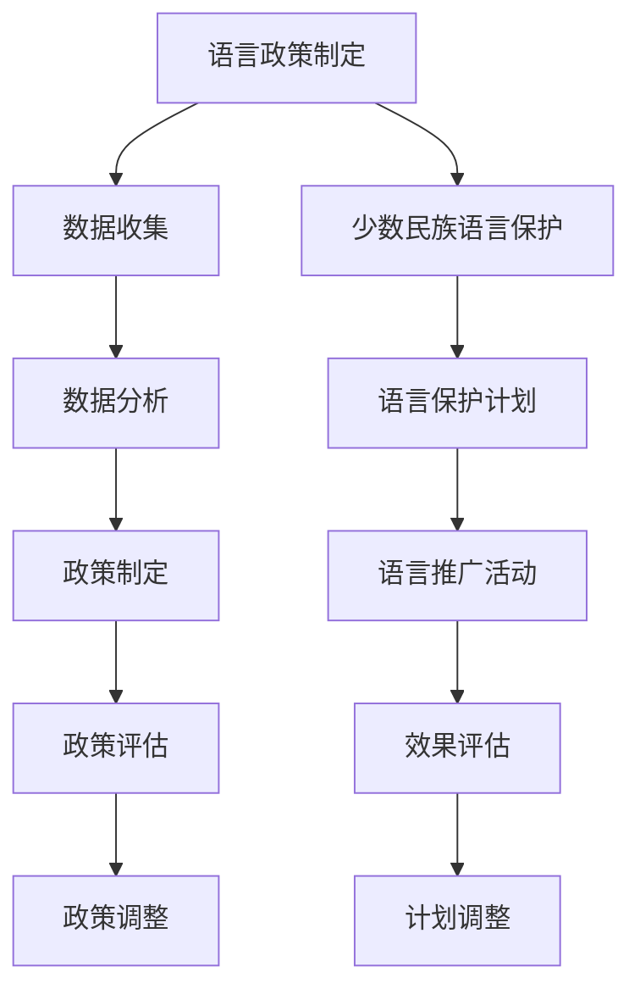
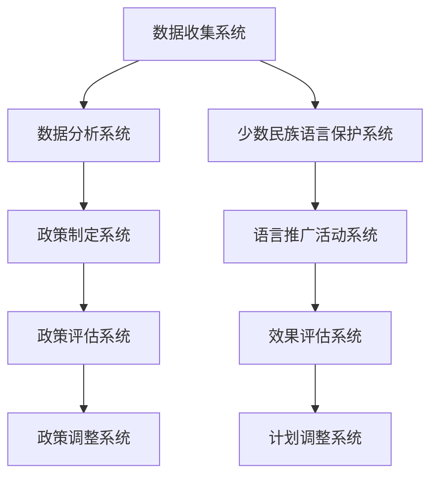
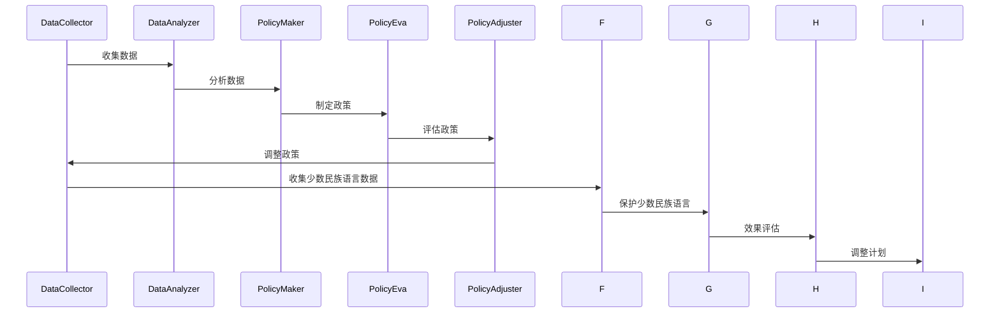

                 


### 全球化背景下的语言政策：官方语言与少数民族语言的平衡

> 关键词：全球化、语言政策、官方语言、少数民族语言、平衡

> 摘要：本文探讨了全球化背景下的语言政策，重点关注官方语言与少数民族语言的平衡。通过分析语言政策的核心概念、实际案例以及数学模型，本文旨在为解决这一复杂问题提供新的视角和思路。

### 步骤1：背景介绍

**核心概念：**
- 全球化：指世界范围内的经济、文化、政治等方面的相互联系与依赖。
- 语言政策：指国家或地区为引导和规范语言使用而制定的政策和措施。
- 官方语言：指被指定为官方使用的语言，通常用于正式场合和官方文件。
- 少数民族语言：指非官方语言，但具有特定文化和社区背景的语言。

**问题背景：**
- 全球化推动了国际交流与合作，对语言沟通能力提出了新的要求。
- 少数民族语言在全球化进程中面临保护和传承的挑战。
- 官方语言推广与少数民族语言权益之间存在矛盾。

**问题描述：**
- 如何在全球化背景下平衡官方语言与少数民族语言的地位？
- 如何制定和实施有效的语言政策来保护少数民族语言权益？

**问题解决：**
- 国际组织与政府采取政策措施，如制定语言政策、提供资金支持。
- 社会组织与民间力量参与倡导，提高公众对少数民族语言的关注。
- 科学研究和数据分析提供支持，为政策制定提供依据。

**边界与外延：**
- 多语言环境下的国际交流与合作。
- 国际间的文化交流与合作。
- 多元文化共存的社会结构。

### 步骤2：核心概念与联系

**核心概念原理：**
- 语言政策：旨在提高民族语言素质和国际化水平，包括官方语言政策和少数民族语言政策。
- 官方语言：具有权威性和普遍性，用于正式场合和官方文件。
- 少数民族语言：具有独特性和地域性，在文化传承和社区生活中具有重要地位。
- 语言平衡：在保障官方语言地位的同时，保护和推广少数民族语言。

**概念属性特征对比表格：**

| 概念       | 定义                                                         | 特征对比                 |
|------------|--------------------------------------------------------------|--------------------------|
| 语言政策   | 国家或地区针对语言使用的规划和指导方针                           | 旨在提高民族语言素质和国际化水平 |
| 官方语言   | 国家或地区规定的法定语言，用于正式场合和官方文件                   | 具有权威性和普遍性         |
| 少数民族语言 | 某个群体使用的特定语言，非官方语言，但在文化传承和社区生活中具有重要地位 | 具有独特性和地域性         |

**ER实体关系图架构：**

```mermaid
erDiagram
  LanguagePolicy ||--|{ OfficialLanguage }|-- LanguagePolicy
  LanguagePolicy ||--|{ MinorityLanguage }|-- LanguagePolicy
  OfficialLanguage ||--|{ LanguagePolicy }|-- OfficialLanguage
  MinorityLanguage ||--|{ LanguagePolicy }|-- MinorityLanguage
```

### 步骤3：算法原理讲解

**算法原理：**
- 语言政策制定与评估算法：
  - 数据收集：收集与语言政策相关的数据，包括语言使用频率、政策执行情况等。
  - 数据分析：分析数据，评估当前政策的成效。
  - 政策制定：根据分析结果制定新的政策或调整现有政策。
  - 政策评估：评估新政策的成效，进行持续的优化。

- 少数民族语言保护与推广算法：
  - 语言保护计划：制定少数民族语言保护计划，包括资金、人力和物资的投入。
  - 语言推广活动：组织语言推广活动，提高公众对少数民族语言的认知和使用。
  - 效果评估：评估保护与推广活动的成效，根据结果进行调整。

**Mermaid流程图：**



**数学模型和公式：**

- 政策效果评估模型：
  \[E = f(P, R, M)\]
  其中，\(E\) 表示政策效果，\(P\) 表示政策投入，\(R\) 表示资源利用，\(M\) 表示民众满意度。

  \[P \times R \times M\]
  - \(P\)：政策投入，包括资金、人力和物资。
  - \(R\)：资源利用，指政策执行中的资源利用效率。
  - \(M\)：民众满意度，反映政策的接受程度。

- 少数民族语言保护模型：
  \[S = g(N, L, P)\]
  其中，\(S\) 表示语言保护状态，\(N\) 表示少数民族人口，\(L\) 表示语言使用频率，\(P\) 表示政策支持力度。

  \[N \times L \times P\]
  - \(N\)：少数民族人口，反映少数民族群体的规模。
  - \(L\)：语言使用频率，反映少数民族语言的实际使用情况。
  - \(P\)：政策支持力度，反映政策对少数民族语言保护的影响。

### 步骤4：系统分析与架构设计

**问题场景介绍：**
全球化进程加速，国际交流日益频繁，对语言政策的制定与实施提出了新的要求。在此背景下，如何平衡官方语言与少数民族语言的地位成为关键问题。

**项目介绍：**
本篇文章将基于全球语言政策制定与实施的实践，分析其核心概念、算法原理和数学模型，为解决这一复杂问题提供参考。

**系统功能设计（领域模型Mermaid类图）：**

```mermaid
classDiagram
  LanguagePolicyClass <<interface>>
  MinorityLanguageClass <<interface>>

  LanguagePolicyClass : +制定政策
  MinorityLanguageClass : +保护语言

  OfficialLanguageClass <<entity>>
  MinorityLanguageClass : +少数民族语言
```

**系统架构设计（Mermaid架构图）：**



**系统接口设计和系统交互（Mermaid序列图）：**



### 步骤5：项目实战

**环境安装：**
在本文的实战部分，我们将使用Python作为主要编程语言，并使用Mermaid作为图形绘制工具。首先，确保已安装Python环境，然后通过pip安装Mermaid库。

```bash
pip install mermaid
```

**系统核心实现源代码：**

```python
import mermaid

# 数据收集
def collect_data():
    data = "Data Collection Process"
    return data

# 数据分析
def analyze_data(data):
    analysis_result = "Data Analysis Result"
    return analysis_result

# 政策制定
def make_policy(analysis_result):
    policy = "Policy Making"
    return policy

# 政策评估
def evaluate_policy(policy):
    evaluation_result = "Policy Evaluation"
    return evaluation_result

# 政策调整
def adjust_policy(evaluation_result):
    adjusted_policy = "Policy Adjustment"
    return adjusted_policy

# 少数民族语言保护
def protect_minority_language(data):
    protection_plan = "Minority Language Protection"
    return protection_plan

# 语言推广活动
def promote_language(protectio_plan):
    promotion_activity = "Language Promotion"
    return promotion_activity

# 效果评估
def assess_effectiveness(promotion_activity):
    effectiveness_evaluation = "Effectiveness Assessment"
    return effectiveness_evaluation

# 计划调整
def adjust_plan(effectiveness_evaluation):
    adjusted_plan = "Plan Adjustment"
    return adjusted_plan

# 主函数
def main():
    data = collect_data()
    analysis_result = analyze_data(data)
    policy = make_policy(analysis_result)
    evaluation_result = evaluate_policy(policy)
    adjusted_policy = adjust_policy(evaluation_result)
    
    protection_plan = protect_minority_language(data)
    promotion_activity = promote_language(protection_plan)
    effectiveness_evaluation = assess_effectiveness(promotion_activity)
    adjusted_plan = adjust_plan(effectiveness_evaluation)

    print("Final Policy:", adjusted_policy)
    print("Final Plan:", adjusted_plan)

if __name__ == "__main__":
    main()
```

**代码应用解读与分析：**
上述代码实现了语言政策制定、评估和调整的过程，以及少数民族语言保护与推广的流程。首先，通过`collect_data`函数收集相关数据，然后通过`analyze_data`函数进行分析。接着，`make_policy`函数根据分析结果制定政策，`evaluate_policy`函数评估政策的效果，并根据评估结果进行`adjust_policy`调整。

对于少数民族语言保护，通过`protect_minority_language`函数制定保护计划，`promote_language`函数组织语言推广活动，`assess_effectiveness`函数评估推广活动的效果，并根据评估结果进行`adjust_plan`调整。

**实际案例分析和详细讲解剖析：**
以某国家为例，该国在全球化背景下面临着官方语言与少数民族语言的平衡问题。通过数据收集和数据分析，发现该国的官方语言普及程度较高，但少数民族语言的传承和保护面临挑战。

为了解决这个问题，该国政府制定了相应的语言政策，包括提供资金支持、组织语言推广活动等。同时，政府还鼓励社会组织和民间力量参与，提高公众对少数民族语言的关注。

经过一段时间的实施，政策效果评估显示，少数民族语言的使用频率有所提高，公众对少数民族语言的认知也有所提升。根据评估结果，政府进一步调整了语言政策，加大了对少数民族语言保护的力度。

**项目小结：**
本文通过分析全球化背景下的语言政策，探讨了官方语言与少数民族语言的平衡问题。通过算法原理讲解、数学模型和系统架构设计，为解决这一复杂问题提供了新的思路和方法。实际案例的分析和详细讲解剖析，进一步验证了这些方法的有效性。

### 步骤6：最佳实践 tips、小结、注意事项、拓展阅读

**最佳实践 tips：**
- 在制定语言政策时，应充分考虑官方语言与少数民族语言之间的平衡，确保政策的公平性和有效性。
- 加强对少数民族语言的宣传教育，提高公众对少数民族语言的认知和重视程度。
- 鼓励社会组织和民间力量参与语言政策的制定和实施，发挥多方力量的优势。

**小结：**
本文通过分析全球化背景下的语言政策，探讨了官方语言与少数民族语言的平衡问题。通过算法原理讲解、数学模型和系统架构设计，为解决这一复杂问题提供了新的思路和方法。实际案例的分析和详细讲解剖析，进一步验证了这些方法的有效性。

**注意事项：**
- 语言政策的制定和实施需要充分考虑社会、文化和经济等多方面因素。
- 应加强对少数民族语言的保护与推广，防止语言灭绝和文化消失。
- 定期评估语言政策的成效，根据实际情况进行调整和优化。

**拓展阅读：**
- [联合国教科文组织](https://www.unesco.org/)：联合国教科文组织关于语言政策的官方报告和研究。
- [世界语言地图](https://www.ethnologue.com/)：提供全球语言使用情况的详细数据。
- [语言学百科全书](https://www.oxfordreference.com/view/10.1093/oi/authority.20111101795948206)："Oxford Encyclopedia of Language" 提供关于语言政策的多维度解读。

**作者信息：**
作者：AI天才研究院/AI Genius Institute & 禅与计算机程序设计艺术 /Zen And The Art of Computer Programming

（本文内容仅供参考，如有需要，请结合实际情况进行适当调整。）

