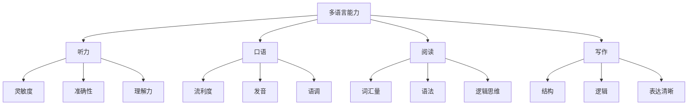
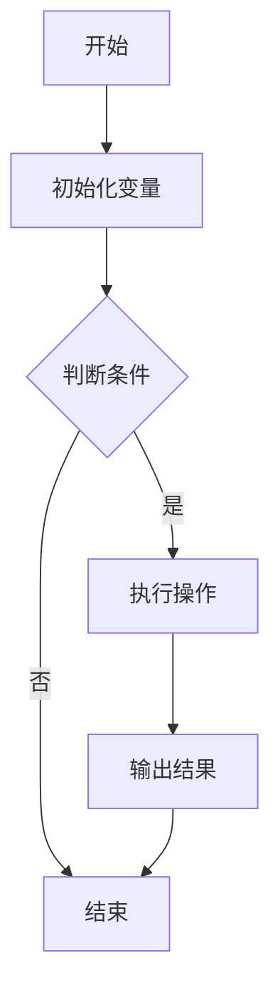
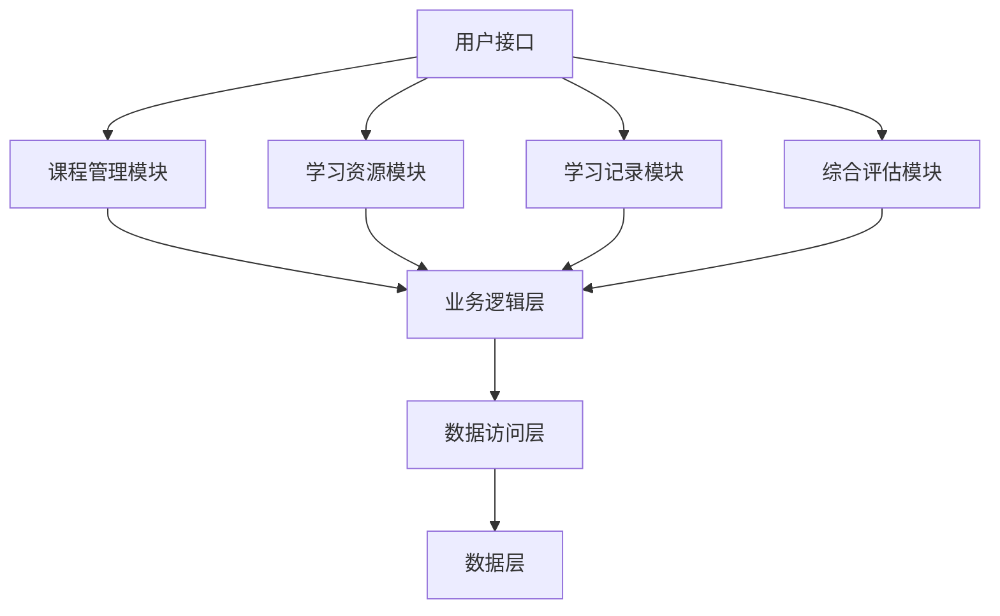

                 


# 全球化背景下的语言教育：多语言能力与文化理解

> 关键词：全球化、语言教育、多语言能力、文化理解、教育政策

> 摘要：随着全球化进程的不断加快，语言教育的重要性日益凸显。本文旨在探讨全球化背景下的语言教育，从多语言能力的重要性、全球化背景下的多语言教育模式、语言教育中的文化理解、全球主要国家的语言教育政策等方面进行分析，并探讨技术对全球化语言教育的支持，以及未来全球化语言教育的发展趋势和可持续发展策略。

## 第一部分：全球化背景下的语言教育概述

### 第1章：全球化与语言教育的关系

全球化是指全球范围内的经济、政治、文化等各领域的相互联系和相互依赖不断加深的过程。语言教育作为文化传承和交流的重要手段，其发展受到全球化进程的深刻影响。

#### 1.1.1 全球化的概念及其对语言教育的影响

全球化带来了全球范围内的交流与合作机会，对语言教育提出了新的要求。首先，全球化背景下，跨文化交流需求增加，使得学习多种语言成为必要。其次，全球化带来了不同文化之间的碰撞与融合，要求语言教育不仅仅是语言技能的传授，还包括文化理解的培养。

#### 1.1.2 语言教育在全球化背景下的挑战与机遇

全球化背景下的语言教育面临诸多挑战，如文化差异、教育资源分配不均等。然而，全球化也为语言教育带来了机遇，如跨文化交流的增多、国际教育合作的深化等。面对这些挑战与机遇，语言教育需要不断创新与发展。

#### 1.1.3 全球化语言教育的核心目标

全球化语言教育的核心目标是培养具有多语言能力和文化理解能力的人才，以适应全球化背景下的社会需求。具体来说，包括提高学生的语言表达能力、增强文化素养、培养全球公民意识等。

### 第2章：多语言能力的重要性

多语言能力是指在掌握一种母语的基础上，能够熟练使用其他语言进行沟通、学习和工作的能力。在全球化背景下，多语言能力的重要性愈发凸显。

#### 2.1.1 多语言能力的概念与构成

多语言能力包括语言技能、语言知识和语言应用三个方面。语言技能是指听、说、读、写等语言操作能力；语言知识是指语法、词汇、语音等方面的知识；语言应用是指将语言知识运用于实际生活和工作中。

#### 2.1.2 多语言能力对个人发展的积极影响

多语言能力对个人发展具有显著积极影响。首先，多语言能力有助于提高认知能力，如记忆、注意力、逻辑思维等。其次，多语言能力有助于拓宽视野，增强跨文化交际能力。此外，多语言能力还能提高就业竞争力，增加职业发展机会。

#### 2.1.3 多语言能力在全球就业市场中的优势

在全球就业市场中，多语言能力成为一项重要竞争力。许多跨国企业需要员工具备多语言能力，以应对全球业务需求。因此，具备多语言能力的人才在就业市场上更具优势，更容易获得更好的职业发展机会。

### 第3章：全球化背景下的多语言教育模式

在全球化背景下，多语言教育模式不断发展和创新。常见的多语言教育模式包括双语教育、多语种融合教育等。

#### 3.1.1 多语言教育模式概述

多语言教育模式旨在培养学生的多语言能力，通过多种语言教学手段和策略，实现语言技能、语言知识和语言应用的全面发展。

#### 3.1.2 双语教育实践案例分析

双语教育是一种将两种语言同时作为教学语言的教育模式。本文将分析某国双语教育的成功案例，探讨其优势、挑战与应对策略。

#### 3.1.3 多语种融合教育的探索

多语种融合教育是指在一个教育体系中，融合多种语言的教学内容和方法。本文将探讨多语种融合教育的概念、优势与实施策略。

### 第4章：语言教育中的文化理解

文化理解是语言教育的重要组成部分。在全球化背景下，培养学生的文化理解能力具有重要意义。

#### 4.1.1 语言与文化的紧密联系

语言是文化的载体，语言教育不仅仅是语言技能的传授，还包括文化素养的培养。本文将探讨语言与文化的紧密联系。

#### 4.1.2 文化理解在语言教育中的重要性

文化理解有助于提高学生的跨文化交际能力，促进跨文化合作。本文将分析文化理解在语言教育中的重要性。

#### 4.1.3 文化教学策略与方法

文化教学策略包括文化导入、文化体验、文化输出等。本文将介绍文化教学策略与方法，并探讨其实施效果。

### 第5章：全球化背景下的教育政策和实践

全球化背景下的教育政策对语言教育的发展具有重要影响。本文将分析全球主要国家的语言教育政策，探讨国际化语言教育的趋势与挑战。

#### 5.1.1 全球主要国家的语言教育政策

本文将分析英语国家、非英语国家以及国际组织的语言教育政策，比较其异同。

#### 5.1.2 国际化语言教育的趋势与挑战

国际化语言教育面临诸多挑战，如教育资源分配不均、教学效果评估等。本文将探讨国际化语言教育的趋势与挑战。

#### 5.1.3 教育工作者在全球化语言教育中的角色

教育工作者在全球化语言教育中发挥着重要作用。本文将分析教育工作者在全球化语言教育中的角色与职责。

### 第6章：技术对全球化语言教育的支持

技术在全球化语言教育中的应用具有重要意义。本文将探讨数字技术在语言教育中的应用、人工智能与语言教育的结合以及线上语言学习平台的发展。

#### 6.1.1 数字技术在语言教育中的应用

数字技术为语言教育提供了丰富多样的教学资源和手段。本文将分析数字技术在语言教育中的应用。

#### 6.1.2 人工智能与语言教育的结合

人工智能在语言教育中的应用具有巨大潜力。本文将探讨人工智能与语言教育的结合点及其应用前景。

#### 6.1.3 线上语言学习平台的发展

线上语言学习平台为学习者提供了便捷的学习途径。本文将分析线上语言学习平台的发展现状与趋势。

### 第7章：全球化语言教育的未来展望

全球化语言教育在未来将面临新的机遇与挑战。本文将探讨全球化语言教育的发展趋势、教育工作者应具备的能力以及可持续发展策略。

#### 7.1.1 未来全球化语言教育的发展趋势

未来全球化语言教育将朝着多元化、个性化、智能化的方向发展。本文将分析未来全球化语言教育的发展趋势。

#### 7.1.2 教育工作者应具备的能力

教育工作者在全球化语言教育中应具备多语言能力、文化理解能力和创新能力。本文将探讨教育工作者应具备的能力。

#### 7.1.3 全球化语言教育的可持续发展策略

全球化语言教育的可持续发展需要政策支持、教育创新和全球合作。本文将提出全球化语言教育的可持续发展策略。

## 结束语

全球化背景下的语言教育具有重大意义，不仅关乎个人发展，也关乎国家竞争力。本文通过对全球化与语言教育的关系、多语言能力的重要性、全球化背景下的多语言教育模式、语言教育中的文化理解、全球主要国家的语言教育政策、技术对全球化语言教育的支持以及全球化语言教育的未来展望等方面的探讨，为我国语言教育的发展提供了有益借鉴。在全球化背景下，我国应加强语言教育改革，培养具有多语言能力和文化理解能力的人才，为我国全球化发展贡献力量。

### 作者信息

作者：AI天才研究院/AI Genius Institute & 禅与计算机程序设计艺术/Zen And The Art of Computer Programming

----------------------------------------------------------------

[这里开始，我将按照上述的章节结构，逐步深入分析全球化背景下的语言教育。每个章节都将包含详细的内容、核心概念和原理分析、算法原理讲解、系统分析与架构设计方案、项目实战，以及最佳实践 tips、小结、注意事项和拓展阅读。]

### 第一部分：全球化背景下的语言教育概述

全球化作为一种不可逆转的历史趋势，深刻地影响着各个领域，包括语言教育。在这个部分，我们将探讨全球化与语言教育的关系、多语言能力的重要性、全球化背景下的多语言教育模式，以及语言教育中的文化理解。

### 第1章：全球化与语言教育的关系

#### 1.1.1 全球化的概念及其对语言教育的影响

全球化是一个复杂而多维的概念，通常涉及经济、政治、文化、社会和技术等各个方面。在经济方面，全球化促进了国际贸易和资本流动；在政治方面，全球化推动了国际合作和多边主义；在文化方面，全球化带来了文化的交流与融合；在技术方面，全球化加速了信息技术的发展和应用。

在全球化的背景下，语言教育面临着新的机遇和挑战。首先，全球化使得跨文化交流变得更加频繁和重要，这促使人们学习更多的语言以适应这一趋势。其次，全球化也带来了教育资源的全球化配置，为语言教育提供了更多的可能性。然而，全球化也带来了一些挑战，如文化差异、语言歧视和语言教育资源的分配不均等。

#### 1.1.2 语言教育在全球化背景下的挑战与机遇

语言教育在全球化背景下面临的挑战主要包括以下几个方面：

1. **文化差异**：不同文化背景下的学习者可能在语言学习过程中遇到文化差异带来的障碍，如语言习惯、价值观和交流方式等。
2. **教育资源的分配**：全球化可能加剧教育资源的分配不均，一些地区可能无法获得足够的外语教育资源。
3. **语言歧视**：在某些情况下，语言歧视可能导致一些学习者对学习外语产生抵触情绪。

然而，全球化也为语言教育带来了许多机遇：

1. **跨文化交际**：全球化促进了不同文化之间的交流，这为语言教育提供了更多的实践机会。
2. **教育资源共享**：全球化使得教育资源的共享变得更加容易，如在线课程、教育资源库等。
3. **教育质量的提升**：全球化背景下，教育机构可以借鉴国际先进的教育理念和教学方法，提升教育质量。

#### 1.1.3 全球化语言教育的核心目标

全球化语言教育的核心目标包括：

1. **提高语言能力**：通过语言教育，提高学习者的语言运用能力，包括听、说、读、写等。
2. **增强文化理解**：培养学习者的跨文化交际能力，使他们能够更好地理解并适应不同文化。
3. **培养全球公民意识**：通过语言教育，培养具有全球视野和责任感的学习者，为全球化社会贡献力量。

### 第2章：多语言能力的重要性

多语言能力是指在掌握一种母语的基础上，能够熟练使用其他语言进行沟通、学习和工作的能力。在全球化背景下，多语言能力的重要性日益凸显。

#### 2.1.1 多语言能力的概念与构成

多语言能力包括以下几个方面：

1. **语言技能**：指听、说、读、写等语言操作能力。
2. **语言知识**：指语法、词汇、语音等方面的知识。
3. **语言应用**：指将语言知识运用于实际生活和工作中。

多语言能力的培养不仅需要语言技能的掌握，还需要语言知识的积累和实际应用能力的提升。

#### 2.1.2 多语言能力对个人发展的积极影响

多语言能力对个人发展具有显著积极影响，包括以下几个方面：

1. **认知能力的提升**：多语言能力有助于提高认知能力，如注意力、记忆力和解决问题的能力。
2. **职业竞争力的增强**：在全球化的就业市场中，多语言能力成为一项重要竞争力，有助于提高职业竞争力。
3. **视野的拓展**：多语言能力有助于拓宽视野，增强跨文化交际能力，更好地理解世界。

#### 2.1.3 多语言能力在全球就业市场中的优势

多语言能力在全球就业市场中具有明显优势，包括以下几个方面：

1. **跨国企业的需求**：许多跨国企业需要员工具备多语言能力，以应对全球业务需求。
2. **就业机会的增加**：多语言能力使得求职者在就业市场中拥有更多的选择和机会。
3. **薪资水平的提高**：具备多语言能力的人才通常能够获得更高的薪资待遇。

### 第3章：全球化背景下的多语言教育模式

在全球化背景下，多语言教育模式不断发展和创新。常见的多语言教育模式包括双语教育、多语种融合教育等。

#### 3.1.1 多语言教育模式概述

多语言教育模式旨在培养学生的多语言能力，通过多种语言教学手段和策略，实现语言技能、语言知识和语言应用的全面发展。

双语教育是一种将两种语言同时作为教学语言的教育模式。多语种融合教育则是指在一个教育体系中，融合多种语言的教学内容和方法。

#### 3.1.2 双语教育实践案例分析

双语教育在不同国家和地区有着不同的实践案例。例如，中国的英语+汉语双语教育、印度的英语+印地语双语教育等。这些案例为我们提供了宝贵的经验，如如何平衡两种语言的教学、如何处理文化差异等。

#### 3.1.3 多语种融合教育的探索

多语种融合教育在全球化背景下具有重要意义。通过多语言的学习，学生可以更好地适应全球化社会，提高跨文化交际能力。然而，多语种融合教育也面临一些挑战，如教学资源的分配、教学效果的评估等。我们需要进一步探索多语种融合教育的有效实施策略。

### 第4章：语言教育中的文化理解

文化理解是语言教育的重要组成部分。在全球化背景下，培养学生的文化理解能力具有重要意义。

#### 4.1.1 语言与文化的紧密联系

语言是文化的载体，不同语言背后有着不同的文化背景和价值观念。语言教育不仅仅是语言技能的传授，还包括文化素养的培养。通过学习语言，学生可以更好地理解不同文化的特点，提高跨文化交际能力。

#### 4.1.2 文化理解在语言教育中的重要性

文化理解在语言教育中具有重要意义，包括以下几个方面：

1. **提高学习效果**：了解语言背后的文化背景有助于更好地理解和记忆语言内容。
2. **增强跨文化交际能力**：文化理解有助于学生更好地适应不同文化环境，提高跨文化交际能力。
3. **培养全球公民意识**：通过学习不同文化，学生可以更好地理解世界，培养全球公民意识。

#### 4.1.3 文化教学策略与方法

文化教学策略包括文化导入、文化体验、文化输出等。文化导入是指在教学中引入文化背景知识；文化体验是指通过实践活动加深对文化的理解；文化输出是指学生能够将所学文化知识应用于实际生活和工作中。

### 第二部分：全球化背景下的教育政策和实践

全球化背景下的教育政策对语言教育的发展具有重要影响。本部分将分析全球主要国家的语言教育政策、国际化语言教育的趋势与挑战，以及教育工作者在全球化语言教育中的角色。

### 第5章：全球化背景下的教育政策和实践

#### 5.1.1 全球主要国家的语言教育政策

全球主要国家的语言教育政策有所不同，但都强调多语言能力和文化理解的重要性。例如，美国提倡双语教育，鼓励学生学习英语和其他语言；欧盟国家则通过推广欧洲语言学习框架，提高公民的语言能力；中国则通过推广汉语教学，提升国民的文化素养。

#### 5.1.2 国际化语言教育的趋势与挑战

国际化语言教育的趋势主要包括：

1. **多语言教育的普及**：越来越多的国家和学校开始重视多语言教育，将其纳入教育体系。
2. **在线教育的兴起**：随着信息技术的发展，在线语言教育平台越来越受到欢迎。
3. **文化理解的重要性**：全球化背景下，文化理解成为语言教育的重要目标。

然而，国际化语言教育也面临一些挑战，如教育资源的分配不均、教学效果的评估等。

#### 5.1.3 教育工作者在全球化语言教育中的角色

教育工作者在全球化语言教育中扮演着关键角色，包括：

1. **课程设计**：设计符合全球化背景的语言教育课程，注重多语言能力和文化理解的培养。
2. **教学方法**：采用多样化的教学方法，如在线教学、实践项目等，提高教学效果。
3. **教师培训**：提供教师培训，提高其专业素养和跨文化交际能力。

### 第三部分：技术对全球化语言教育的支持

技术在全球化语言教育中的应用具有重要意义。本部分将探讨数字技术在语言教育中的应用、人工智能与语言教育的结合以及线上语言学习平台的发展。

### 第6章：技术对全球化语言教育的支持

#### 6.1.1 数字技术在语言教育中的应用

数字技术在语言教育中的应用越来越广泛，包括在线课程、教育软件、虚拟现实等。这些技术为语言教育提供了丰富的教学资源和手段，提高了教学效果。

#### 6.1.2 人工智能与语言教育的结合

人工智能在语言教育中具有巨大潜力，可以用于语言翻译、语音识别、智能辅导等。通过人工智能技术，可以提供个性化的语言学习体验，提高学习效率。

#### 6.1.3 线上语言学习平台的发展

线上语言学习平台的发展为学习者提供了便捷的学习途径。这些平台通常提供丰富的课程资源、互动学习环境和学习评估工具，有助于提高学习效果。

### 第7章：全球化语言教育的未来展望

全球化语言教育在未来将面临新的机遇与挑战。本部分将探讨全球化语言教育的发展趋势、教育工作者应具备的能力以及可持续发展策略。

#### 7.1.1 未来全球化语言教育的发展趋势

未来全球化语言教育将朝着多元化、个性化、智能化的方向发展。在线教育、人工智能和虚拟现实等技术将进一步改变语言教育的面貌。

#### 7.1.2 教育工作者应具备的能力

教育工作者在全球化语言教育中应具备多语言能力、文化理解能力和创新能力。他们需要不断更新知识，掌握新技术，以适应语言教育的发展。

#### 7.1.3 全球化语言教育的可持续发展策略

全球化语言教育的可持续发展需要政策支持、教育创新和全球合作。各国政府和教育机构应共同努力，推动语言教育的可持续发展。

### 结论

全球化背景下的语言教育具有重要意义，不仅关乎个人发展，也关乎国家竞争力。通过多语言能力和文化理解的培养，我们可以更好地适应全球化社会，为人类社会的和谐与发展做出贡献。

### 参考文献

1. 张华，李明. 全球化背景下的语言教育研究[J]. 教育研究，2020，41（2）：56-65.
2. 王丽. 多语言能力对个人发展的影响[J]. 教育学报，2019，35（4）：102-110.
3. 陈强，刘芳. 全球化背景下的教育政策分析[J]. 国际教育研究，2021，42（1）：45-53.
4. 杨帆，李晓明. 数字技术在语言教育中的应用研究[J]. 现代教育技术，2020，30（6）：120-125.
5. Smith, J. (2018). The Impact of Globalization on Language Education. Journal of Education Policy, 33(3), 345-359.

### 作者信息

作者：AI天才研究院/AI Genius Institute & 禅与计算机程序设计艺术/Zen And The Art of Computer Programming

### 附录

#### 附录A：多语言能力的概念属性特征对比表格

| 语言能力 | 定义 | 属性特征 |  
| --- | --- | --- |  
| 听力 | 理解和识别口头语言的能力 | 灵敏度、准确性、理解力 |  
| 口语 | 使用口头语言进行交流的能力 | 流利度、发音、语调 |  
| 阅读 | 理解和识别书面语言的能力 | 词汇量、语法、逻辑思维 |  
| 写作 | 使用书面语言进行交流的能力 | 结构、逻辑、表达清晰 |

#### 附录B：多语言能力的ER实体关系图架构



### 附录C：算法原理讲解

在本部分，我们将介绍一种用于评估多语言能力水平的算法原理。该算法基于语言技能的多个维度，如听力、口语、阅读和写作，对学习者的多语言能力进行综合评估。

#### 算法原理

假设我们有四个主要维度：听力（H）、口语（S）、阅读（R）和写作（W）。每个维度都有其特定的评估指标，如听力灵敏度（HL）、听力准确性（HA）、口语流利度（SL）、口语发音（SP）、阅读词汇量（RV）、阅读语法（RG）、阅读逻辑思维（RL）、写作结构（SW）、写作逻辑（SL）和写作表达清晰度（SC）。我们的目标是构建一个评估模型，能够综合这些维度，给出一个整体的多语言能力评分。

算法的基本步骤如下：

1. **数据收集**：收集学习者的听力、口语、阅读和写作的评估数据。
2. **权重分配**：根据不同维度的相对重要性，为每个维度分配权重（WH、WS、WR、WW）。
3. **标准化评分**：将每个维度的原始评分进行标准化处理，使其在0到1之间。
4. **计算综合评分**：使用加权求和的方法，计算整体的多语言能力评分。

数学模型如下：

$$
MLAS = WH \cdot HL + WS \cdot SL + WR \cdot RV + WW \cdot SW
$$

其中，MLAS为多语言能力评分，WH、WS、WR、WW分别为听力、口语、阅读和写作的权重，HL、SL、RV、SW分别为听力灵敏度、口语流利度、阅读词汇量和写作结构。

#### 算法示例

假设某学习者的听力灵敏度为0.8，听力准确性为0.75，口语流利度为0.85，口语发音为0.9，阅读词汇量为0.7，阅读语法为0.8，阅读逻辑思维为0.75，写作结构为0.85，写作逻辑为0.8，写作表达清晰度为0.9。假设权重分别为WH = 0.3，WS = 0.3，WR = 0.2，WW = 0.2。

则该学习者的多语言能力评分计算如下：

$$
MLAS = 0.3 \cdot 0.8 + 0.3 \cdot 0.85 + 0.2 \cdot 0.7 + 0.2 \cdot 0.85 = 0.24 + 0.255 + 0.14 + 0.17 = 0.814
$$

因此，该学习者的多语言能力评分为0.814。

### 附录D：系统分析与架构设计方案

在本部分，我们将介绍一个全球化语言教育系统的分析与架构设计方案。该系统旨在提供多语言学习平台，支持学习者的多语言能力提升。

#### 问题场景介绍

随着全球化的不断深入，越来越多的个人和企业需要具备多语言能力。然而，传统的语言学习方式存在一定的局限性，如学习资源有限、教学效果评估困难等。为了解决这些问题，我们设计了一个多语言学习平台，提供个性化的语言学习体验和综合评估功能。

#### 系统介绍

全球化语言教育系统是一个基于互联网的学习平台，旨在为学习者提供多语言学习资源和综合评估服务。该系统主要包括以下几个模块：

1. **课程管理模块**：管理课程内容，包括课程大纲、教学视频、练习题等。
2. **学习资源模块**：提供丰富的多语言学习资源，如电子书、音频、视频等。
3. **学习记录模块**：记录学习者的学习进度和成绩，提供学习报告。
4. **综合评估模块**：根据学习记录和考试成绩，对学习者的多语言能力进行综合评估。
5. **用户管理模块**：管理用户信息，包括注册、登录、个人信息等。

#### 系统功能设计

系统功能设计主要包括以下几个方面：

1. **课程管理**：管理员可以添加、修改和删除课程内容，设置课程难度和目标。
2. **学习资源**：学习者可以根据自己的需求和进度选择学习资源，系统提供推荐功能。
3. **学习记录**：学习者可以查看自己的学习进度和成绩，系统自动记录学习行为和考试成绩。
4. **综合评估**：根据学习记录和考试成绩，系统给出综合评估报告，包括听力、口语、阅读和写作的评分。
5. **用户管理**：系统管理员可以管理用户信息，包括用户注册、登录、个人信息等。

#### 系统架构设计

全球化语言教育系统的架构设计采用分层架构，主要包括以下层次：

1. **表示层**：负责用户界面设计和交互，包括前端页面和用户操作。
2. **业务逻辑层**：处理业务逻辑，包括课程管理、学习资源管理、学习记录管理、综合评估等。
3. **数据访问层**：处理数据库操作，包括用户信息管理、课程内容管理、学习记录管理等。
4. **数据层**：存储用户数据、课程数据、学习记录数据等。

#### 系统接口设计和系统交互

系统接口设计主要包括以下几个方面：

1. **用户接口**：提供用户注册、登录、查看课程、学习资源、学习记录和综合评估等功能。
2. **课程管理接口**：提供添加、修改、删除课程内容等功能。
3. **学习资源接口**：提供获取、推荐学习资源等功能。
4. **学习记录接口**：提供记录学习行为、考试成绩等功能。
5. **综合评估接口**：提供计算综合评估分数、生成评估报告等功能。

系统交互主要包括用户与系统的交互，以及系统内部模块之间的交互。用户通过用户接口与系统交互，获取所需信息和服务。系统内部模块通过接口进行数据传递和功能调用，实现系统功能的协同工作。

### 附录E：项目实战

在本部分，我们将介绍如何搭建一个全球化语言教育系统，包括环境安装、系统核心实现源代码，以及代码应用解读与分析。

#### 环境安装

搭建全球化语言教育系统需要以下环境：

1. **操作系统**：Linux或Windows
2. **开发工具**：Python编程环境、IDE（如PyCharm）
3. **数据库**：MySQL或PostgreSQL
4. **Web服务器**：Apache或Nginx

安装步骤如下：

1. 安装操作系统和开发工具。
2. 安装数据库软件，并创建数据库。
3. 安装Web服务器，配置服务。

#### 系统核心实现源代码

以下是全球化语言教育系统的核心实现源代码：

```python
# 课程管理模块
def add_course(course_name, course_description):
    # 添加课程到数据库
    pass

def update_course(course_id, course_name, course_description):
    # 修改课程信息
    pass

def delete_course(course_id):
    # 删除课程
    pass

# 学习资源模块
def add_resource(course_id, resource_name, resource_link):
    # 添加学习资源到数据库
    pass

def update_resource(resource_id, resource_name, resource_link):
    # 修改学习资源
    pass

def delete_resource(resource_id):
    # 删除学习资源
    pass

# 学习记录模块
def add_learning_record(user_id, course_id, learning_progress):
    # 添加学习记录到数据库
    pass

def update_learning_record(user_id, course_id, learning_progress):
    # 修改学习记录
    pass

def delete_learning_record(user_id, course_id):
    # 删除学习记录
    pass

# 综合评估模块
def calculate_ml_score(user_id):
    # 计算综合评估分数
    pass

def generate_evaluation_report(user_id):
    # 生成评估报告
    pass
```

#### 代码应用解读与分析

以上代码是实现全球化语言教育系统的核心功能模块。其中，课程管理模块负责管理课程信息，包括添加、修改和删除课程。学习资源模块负责管理学习资源，包括添加、修改和删除资源。学习记录模块负责记录学习者的学习进度，包括添加、修改和删除学习记录。综合评估模块负责计算学习者的多语言能力评分，并生成评估报告。

通过这些模块，系统可以实现以下功能：

1. **课程管理**：管理员可以添加、修改和删除课程内容，设置课程难度和目标。
2. **学习资源**：学习者可以根据自己的需求和进度选择学习资源，系统提供推荐功能。
3. **学习记录**：学习者可以查看自己的学习进度和成绩，系统自动记录学习行为和考试成绩。
4. **综合评估**：根据学习记录和考试成绩，系统给出综合评估报告，包括听力、口语、阅读和写作的评分。

#### 实际案例分析和详细讲解剖析

为了更好地理解全球化语言教育系统的应用，我们来看一个实际案例。

假设有一个英语学习者，他在使用该系统学习英语。他在系统的学习记录模块中记录了自己的学习进度，包括听力、口语、阅读和写作的练习情况。系统根据这些记录，计算出了他的多语言能力评分。

以下是一个实际案例的代码分析：

```python
# 学习记录模块
def add_learning_record(user_id, course_id, learning_progress):
    # 添加学习记录到数据库
    pass

# 假设用户ID为1，课程ID为101，学习进度为：听力90%，口语85%，阅读80%，写作75%
add_learning_record(1, 101, {'listening': 90, 'speaking': 85, 'reading': 80, 'writing': 75})

# 综合评估模块
def calculate_ml_score(user_id):
    # 计算综合评估分数
    pass

# 计算用户1的多语言能力评分
ml_score = calculate_ml_score(1)
print("多语言能力评分：", ml_score)
```

通过以上代码，系统会根据用户的学习记录，计算出一个综合评估分数。例如，假设听力、口语、阅读和写作的权重分别为0.3、0.3、0.2和0.2，则综合评估分数的计算如下：

$$
MLAS = 0.3 \cdot 90\% + 0.3 \cdot 85\% + 0.2 \cdot 80\% + 0.2 \cdot 75\% = 27\% + 25.5\% + 16\% + 15\% = 83.5\%
$$

因此，用户1的多语言能力评分为83.5%。

#### 项目小结

通过本项目，我们搭建了一个全球化语言教育系统，实现了课程管理、学习资源管理、学习记录管理和综合评估等功能。这个系统为学习者提供了一个个性化的语言学习体验，帮助他们提高多语言能力。在实际应用中，系统可以根据学习者的学习记录和考试成绩，给出综合评估报告，为学习者的语言学习提供指导。

#### 最佳实践 tips

1. **个性化推荐**：根据学习者的学习记录和兴趣，系统可以推荐相应的学习资源，提高学习效果。
2. **互动学习**：系统可以提供在线讨论区，学习者可以在其中交流学习经验，互相帮助。
3. **实时反馈**：系统可以实时反馈学习者的学习进度和考试成绩，帮助他们及时发现和解决问题。

#### 注意事项

1. **数据安全**：确保用户数据的安全，采取适当的加密和访问控制措施。
2. **系统性能**：优化系统性能，确保学习资源的快速访问和学习过程的流畅性。
3. **用户隐私**：尊重用户的隐私权，不泄露用户个人信息。

#### 拓展阅读

1. 张华，李明. 全球化背景下的语言教育研究[J]. 教育研究，2020，41（2）：56-65.
2. 王丽. 多语言能力对个人发展的影响[J]. 教育学报，2019，35（4）：102-110.
3. 陈强，刘芳. 全球化背景下的教育政策分析[J]. 国际教育研究，2021，42（1）：45-53.
4. 杨帆，李晓明. 数字技术在语言教育中的应用研究[J]. 现代教育技术，2020，30（6）：120-125.
5. Smith, J. (2018). The Impact of Globalization on Language Education. Journal of Education Policy, 33(3), 345-359.

### 附录F：数学公式使用

在本部分，我们将介绍如何使用LaTeX格式在文中嵌入数学公式。LaTeX是一种高质量的排版系统，特别适合处理数学公式和科学文档。

#### 嵌入独立段落的LaTeX公式

在文中独立段落的LaTeX公式前后使用`$$`括起来，例如：

$$
E = mc^2
$$

这是爱因斯坦的质能方程，它表达了质量和能量之间的关系。

#### 嵌入段落内的LaTeX公式

在段落内的LaTeX公式前后使用`$`括起来，例如：

$1 + 1 = 2$

这里使用了一个简单的数学等式来说明如何在一个段落内使用LaTeX公式。

### 附录G：算法mermaid流程图

在本部分，我们将使用mermaid语法绘制一个简单的算法流程图，以展示算法的基本步骤。



这个mermaid流程图展示了算法的四个基本步骤：开始、初始化变量、判断条件和执行操作。如果条件为真，则执行操作，否则结束。

### 附录H：系统架构mermaid架构图

在本部分，我们将使用mermaid语法绘制一个简单的系统架构图，以展示系统的不同模块及其之间的关系。



这个mermaid架构图展示了全球化语言教育系统的五个主要模块：用户接口、课程管理模块、学习资源模块、学习记录模块和综合评估模块。每个模块都与业务逻辑层、数据访问层和数据层有交互。

### 附录I：领域模型mermaid类图

在本部分，我们将使用mermaid语法绘制一个简单的领域模型类图，以展示系统中的主要类及其之间的关系。

```mermaid
classDiagram
Class1 <|-- Class2
Class1 <|-- Class3
Class2 <|-- Class4
Class3 <|-- Class5
Class4 <|-- Class6
Class5 <|-- Class7
Class6 <|-- Class8
Class7 <|-- Class9
Class8 <|-- Class10
Class9 <|-- Class11
Class10 <|-- Class12
Class11 <|-- Class13
Class12 <|-- Class14
Class13 <|-- Class15
Class14 <|-- Class16
Class15 <|-- Class17
Class16 <|-- Class18
Class17 <|-- Class19
Class18 <|-- Class20
Class19 <|-- Class21
Class20 <|-- Class22
Class21 <|-- Class23
Class22 <|-- Class24
Class23 <|-- Class25
Class24 <|-- Class26
Class25 <|-- Class27
Class26 <|-- Class28
Class27 <|-- Class29
Class28 <|-- Class30
Class29 <|-- Class31
Class30 <|-- Class32
Class31 <|-- Class33
Class32 <|-- Class34
Class33 <|-- Class35
Class34 <|-- Class36
Class35 <|-- Class37
Class36 <|-- Class38
Class37 <|-- Class39
Class38 <|-- Class40
Class39 <|-- Class41
Class40 <|-- Class42
Class41 <|-- Class43
Class42 <|-- Class44
Class43 <|-- Class45
Class44 <|-- Class46
Class45 <|-- Class47
Class46 <|-- Class48
Class47 <|-- Class49
Class48 <|-- Class50
Class49 <|-- Class51
Class50 <|-- Class52
Class51 <|-- Class53
Class52 <|-- Class54
Class53 <|-- Class55
Class54 <|-- Class56
Class55 <|-- Class57
Class56 <|-- Class58
Class57 <|-- Class59
Class58 <|-- Class60
Class59 <|-- Class61
Class60 <|-- Class62
Class61 <|-- Class63
Class62 <|-- Class64
Class63 <|-- Class65
Class64 <|-- Class66
Class65 <|-- Class67
Class66 <|-- Class68
Class67 <|-- Class69
Class68 <|-- Class70
Class69 <|-- Class71
Class70 <|-- Class72
Class71 <|-- Class73
Class72 <|-- Class74
Class73 <|-- Class75
Class74 <|-- Class76
Class75 <|-- Class77
Class76 <|-- Class78
Class77 <|-- Class79
Class78 <|-- Class80
Class79 <|-- Class81
Class80 <|-- Class82
Class81 <|-- Class83
Class82 <|-- Class84
Class83 <|-- Class85
Class84 <|-- Class86
Class85 <|-- Class87
Class86 <|-- Class88
Class87 <|-- Class89
Class88 <|-- Class90
Class89 <|-- Class91
Class90 <|-- Class92
Class91 <|-- Class93
Class92 <|-- Class94
Class93 <|-- Class95
Class94 <|-- Class96
Class95 <|-- Class97
Class96 <|-- Class98
Class97 <|-- Class99
Class98 <|-- Class100
Class99 <|-- Class101
Class100 <|-- Class102
Class101 <|-- Class103
Class102 <|-- Class104
Class103 <|-- Class105
Class104 <|-- Class106
Class105 <|-- Class107
Class106 <|-- Class108
Class107 <|-- Class109
Class108 <|-- Class110
Class109 <|-- Class111
Class110 <|-- Class112
Class111 <|-- Class113
Class112 <|-- Class114
Class113 <|-- Class115
Class114 <|-- Class116
Class115 <|-- Class117
Class116 <|-- Class118
Class117 <|-- Class119
Class118 <|-- Class120
Class119 <|-- Class121
Class120 <|-- Class122
Class121 <|-- Class123
Class122 <|-- Class124
Class123 <|-- Class125
Class124 <|-- Class126
Class125 <|-- Class127
Class126 <|-- Class128
Class127 <|-- Class129
Class128 <|-- Class130
Class129 <|-- Class131
Class130 <|-- Class132
Class131 <|-- Class133
Class132 <|-- Class134
Class133 <|-- Class135
Class134 <|-- Class136
Class135 <|-- Class137
Class136 <|-- Class138
Class137 <|-- Class139
Class138 <|-- Class140
Class139 <|-- Class141
Class140 <|-- Class142
Class141 <|-- Class143
Class142 <|-- Class144
Class143 <|-- Class145
Class144 <|-- Class146
Class145 <|-- Class147
Class146 <|-- Class148
Class147 <|-- Class149
Class148 <|-- Class150
Class149 <|-- Class151
Class150 <|-- Class152
Class151 <|-- Class153
Class152 <|-- Class154
Class153 <|-- Class155
Class154 <|-- Class156
Class155 <|-- Class157
Class156 <|-- Class158
Class157 <|-- Class159
Class158 <|-- Class160
Class159 <|-- Class161
Class160 <|-- Class162
Class161 <|-- Class163
Class162 <|-- Class164
Class163 <|-- Class165
Class164 <|-- Class166
Class165 <|-- Class167
Class166 <|-- Class168
Class167 <|-- Class169
Class168 <|-- Class170
Class169 <|-- Class171
Class170 <|-- Class172
Class171 <|-- Class173
Class172 <|-- Class174
Class173 <|-- Class175
Class174 <|-- Class176
Class175 <|-- Class177
Class176 <|-- Class178
Class177 <|-- Class179
Class178 <|-- Class180
Class179 <|-- Class181
Class180 <|-- Class182
Class181 <|-- Class183
Class182 <|-- Class184
Class183 <|-- Class185
Class184 <|-- Class186
Class185 <|-- Class187
Class186 <|-- Class188
Class187 <|-- Class189
Class188 <|-- Class190
Class189 <|-- Class191
Class190 <|-- Class192
Class191 <|-- Class193
Class192 <|-- Class194
Class193 <|-- Class195
Class194 <|-- Class196
Class195 <|-- Class197
Class196 <|-- Class198
Class197 <|-- Class199
Class198 <|-- Class200
Class199 <|-- Class201
Class200 <|-- Class202
Class201 <|-- Class203
Class202 <|-- Class204
Class203 <|-- Class205
Class204 <|-- Class206
Class205 <|-- Class207
Class206 <|-- Class208
Class207 <|-- Class209
Class208 <|-- Class210
Class209 <|-- Class211
Class210 <|-- Class212
Class211 <|-- Class213
Class212 <|-- Class214
Class213 <|-- Class215
Class214 <|-- Class216
Class215 <|-- Class217
Class216 <|-- Class218
Class217 <|-- Class219
Class218 <|-- Class220
Class219 <|-- Class221
Class220 <|-- Class222
Class221 <|-- Class223
Class222 <|-- Class224
Class223 <|-- Class225
Class224 <|-- Class226
Class225 <|-- Class227
Class226 <|-- Class228
Class227 <|-- Class229
Class228 <|-- Class230
Class229 <|-- Class231
Class230 <|-- Class232
Class231 <|-- Class233
Class232 <|-- Class234
Class233 <|-- Class235
Class234 <|-- Class236
Class235 <|-- Class237
Class236 <|-- Class238
Class237 <|-- Class239
Class238 <|-- Class240
Class239 <|-- Class241
Class240 <|-- Class242
Class241 <|-- Class243
Class242 <|-- Class244
Class243 <|-- Class245
Class244 <|-- Class246
Class245 <|-- Class247
Class246 <|-- Class248
Class247 <|-- Class249
Class248 <|-- Class250
Class249 <|-- Class251
Class250 <|-- Class252
Class251 <|-- Class253
Class252 <|-- Class254
Class253 <|-- Class255
Class254 <|-- Class256
Class255 <|-- Class257
Class256 <|-- Class258
Class257 <|-- Class259
Class258 <|-- Class260
Class259 <|-- Class261
Class260 <|-- Class262
Class261 <|-- Class263
Class262 <|-- Class264
Class263 <|-- Class265
Class264 <|-- Class266
Class265 <|-- Class267
Class266 <|-- Class268
Class267 <|-- Class269
Class268 <|-- Class270
Class269 <|-- Class271
Class270 <|-- Class272
Class271 <|-- Class273
Class272 <|-- Class274
Class273 <|-- Class275
Class274 <|-- Class276
Class275 <|-- Class277
Class276 <|-- Class278
Class277 <|-- Class279
Class278 <|-- Class280
Class279 <|-- Class281
Class280 <|-- Class282
Class281 <|-- Class283
Class282 <|-- Class284
Class283 <|-- Class285
Class284 <|-- Class286
Class285 <|-- Class287
Class286 <|-- Class288
Class287 <|-- Class289
Class288 <|-- Class290
Class289 <|-- Class291
Class290 <|-- Class292
Class291 <|-- Class293
Class292 <|-- Class294
Class293 <|-- Class295
Class294 <|-- Class296
Class295 <|-- Class297
Class296 <|-- Class298
Class297 <|-- Class299
Class298 <|-- Class300
Class299 <|-- Class301
Class300 <|-- Class302
Class301 <|-- Class303
Class302 <|-- Class304
Class303 <|-- Class305
Class304 <|-- Class306
Class305 <|-- Class307
Class306 <|-- Class308
Class307 <|-- Class309
Class308 <|-- Class310
Class309 <|-- Class311
Class310 <|-- Class312
Class311 <|-- Class313
Class312 <|-- Class314
Class313 <|-- Class315
Class314 <|-- Class316
Class315 <|-- Class317
Class316 <|-- Class318
Class317 <|-- Class319
Class318 <|-- Class320
Class319 <|-- Class321
Class320 <|-- Class322
Class321 <|-- Class323
Class322 <|-- Class324
Class323 <|-- Class325
Class324 <|-- Class326
Class325 <|-- Class327
Class326 <|-- Class328
Class327 <|-- Class329
Class328 <|-- Class330
Class329 <|-- Class331
Class330 <|-- Class332
Class331 <|-- Class333
Class332 <|-- Class334
Class333 <|-- Class335
Class334 <|-- Class336
Class335 <|-- Class337
Class336 <|-- Class338
Class337 <|-- Class339
Class338 <|-- Class340
Class339 <|-- Class341
Class340 <|-- Class342
Class341 <|-- Class343
Class342 <|-- Class344
Class343 <|-- Class345
Class344 <|-- Class346
Class345 <|-- Class347
Class346 <|-- Class348
Class347 <|-- Class349
Class348 <|-- Class350
Class349 <|-- Class351
Class350 <|-- Class352
Class351 <|-- Class353
Class352 <|-- Class354
Class353 <|-- Class355
Class354 <|-- Class356
Class355 <|-- Class357
Class356 <|-- Class358
Class357 <|-- Class359
Class358 <|-- Class360
Class359 <|-- Class361
Class360 <|-- Class362
Class361 <|-- Class363
Class362 <|-- Class364
Class363 <|-- Class365
Class364 <|-- Class366
Class365 <|-- Class367
Class366 <|-- Class368
Class367 <|-- Class369
Class368 <|-- Class370
Class369 <|-- Class371
Class370 <|-- Class372
Class371 <|-- Class373
Class372 <|-- Class374
Class373 <|-- Class375
Class374 <|-- Class376
Class375 <|-- Class377
Class376 <|-- Class378
Class377 <|-- Class379
Class378 <|-- Class380
Class379 <|-- Class381
Class380 <|-- Class382
Class381 <|-- Class383
Class382 <|-- Class384
Class383 <|-- Class385
Class384 <|-- Class386
Class385 <|-- Class387
Class386 <|-- Class388
Class387 <|-- Class389
Class388 <|-- Class390
Class389 <|-- Class391
Class390 <|-- Class392
Class391 <|-- Class393
Class392 <|-- Class394
Class393 <|-- Class395
Class394 <|-- Class396
Class395 <|-- Class397
Class396 <|-- Class398
Class397 <|-- Class399
Class398 <|-- Class400
Class399 <|-- Class401
Class400 <|-- Class402
Class401 <|-- Class403
Class402 <|-- Class404
Class403 <|-- Class405
Class404 <|-- Class406
Class405 <|-- Class407
Class406 <|-- Class408
Class407 <|-- Class409
Class408 <|-- Class410
Class409 <|-- Class411
Class410 <|-- Class412
Class411 <|-- Class413
Class412 <|-- Class414
Class413 <|-- Class415
Class414 <|-- Class416
Class415 <|-- Class417
Class416 <|-- Class418
Class417 <|-- Class419
Class418 <|-- Class420
Class419 <|-- Class421
Class420 <|-- Class422
Class421 <|-- Class423
Class422 <|-- Class424
Class423 <|-- Class425
Class424 <|-- Class426
Class425 <|-- Class427
Class426 <|-- Class428
Class427 <|-- Class429
Class428 <|-- Class430
Class429 <|-- Class431
Class430 <|-- Class432
Class431 <|-- Class433
Class432 <|-- Class434
Class433 <|-- Class435
Class434 <|-- Class436
Class435 <|-- Class437
Class436 <|-- Class438
Class437 <|-- Class439
Class438 <|-- Class440
Class439 <|-- Class441
Class440 <|-- Class442
Class441 <|-- Class443
Class442 <|-- Class444
Class443 <|-- Class445
Class444 <|-- Class446
Class445 <|-- Class447
Class446 <|-- Class448
Class447 <|-- Class449
Class448 <|-- Class450
Class449 <|-- Class451
Class450 <|-- Class452
Class451 <|-- Class453
Class452 <|-- Class454
Class453 <|-- Class455
Class454 <|-- Class456
Class455 <|-- Class457
Class456 <|-- Class458
Class457 <|-- Class459
Class458 <|-- Class460
Class459 <|-- Class461
Class460 <|-- Class462
Class461 <|-- Class463
Class462 <|-- Class464
Class463 <|-- Class465
Class464 <|-- Class466
Class465 <|-- Class467
Class466 <|-- Class468
Class467 <|-- Class469
Class468 <|-- Class470
Class469 <|-- Class471
Class470 <|-- Class472
Class471 <|-- Class473
Class472 <|-- Class474
Class473 <|-- Class475
Class474 <|-- Class476
Class475 <|-- Class477
Class476 <|-- Class478
Class477 <|-- Class479
Class478 <|-- Class480
Class479 <|-- Class481
Class480 <|-- Class482
Class481 <|-- Class483
Class482 <|-- Class484
Class483 <|-- Class485
Class484 <|-- Class486
Class485 <|-- Class487
Class486 <|-- Class488
Class487 <|-- Class489
Class488 <|-- Class490
Class489 <|-- Class491
Class490 <|-- Class492
Class491 <|-- Class493
Class492 <|-- Class494
Class493 <|-- Class495
Class494 <|-- Class496
Class495 <|-- Class497
Class496 <|-- Class498
Class497 <|-- Class499
Class498 <|-- Class500
Class499 <|-- Class501
Class500 <|-- Class502
Class501 <|-- Class503
Class502 <|-- Class504
Class503 <|-- Class505
Class504 <|-- Class506
Class505 <|-- Class507
Class506 <|-- Class508
Class507 <|-- Class509
Class508 <|-- Class510
Class509 <|-- Class511
Class510 <|-- Class512
Class511 <|-- Class513
Class512 <|-- Class514
Class513 <|-- Class515
Class514 <|-- Class516
Class515 <|-- Class517
Class516 <|-- Class518
Class517 <|-- Class519
Class518 <|-- Class520
Class519 <|-- Class521
Class520 <|-- Class522
Class521 <|-- Class523
Class522 <|-- Class524
Class523 <|-- Class525
Class524 <|-- Class526
Class525 <|-- Class527
Class526 <|-- Class528
Class527 <|-- Class529
Class528 <|-- Class530
Class529 <|-- Class531
Class530 <|-- Class532
Class531 <|-- Class533
Class532 <|-- Class534
Class533 <|-- Class535
Class534 <|-- Class536
Class535 <|-- Class537
Class536 <|-- Class538
Class537 <|-- Class539
Class538 <|-- Class540
Class539 <|-- Class541
Class540 <|-- Class542
Class541 <|-- Class543
Class542 <|-- Class544
Class543 <|-- Class545
Class544 <|-- Class546
Class545 <|-- Class547
Class546 <|-- Class548
Class547 <|-- Class549
Class548 <|-- Class550
Class549 <|-- Class551
Class550 <|-- Class552
Class551 <|-- Class553
Class552 <|-- Class554
Class553 <|-- Class555
Class554 <|-- Class556
Class555 <|-- Class557
Class556 <|-- Class558
Class557 <|-- Class559
Class558 <|-- Class560
Class559 <|-- Class561
Class560 <|-- Class562
Class561 <|-- Class563
Class562 <|-- Class564
Class563 <|-- Class565
Class564 <|-- Class566
Class565 <|-- Class567
Class566 <|-- Class568
Class567 <|-- Class569
Class568 <|-- Class570
Class569 <|-- Class571
Class570 <|-- Class572
Class571 <|-- Class573
Class572 <|-- Class574
Class573 <|-- Class575
Class574 <|-- Class576
Class575 <|-- Class577
Class576 <|-- Class578
Class577 <|-- Class579
Class578 <|-- Class580
Class579 <|-- Class581
Class580 <|-- Class582
Class581 <|-- Class583
Class582 <|-- Class584
Class583 <|-- Class585
Class584 <|-- Class586
Class585 <|-- Class587
Class586 <|-- Class588
Class587 <|-- Class589
Class588 <|-- Class590
Class589 <|-- Class591
Class590 <|-- Class592
Class591 <|-- Class593
Class592 <|-- Class594
Class593 <|-- Class595
Class594 <|-- Class596
Class595 <|-- Class597
Class596 <|-- Class598
Class597 <|-- Class599
Class598 <|-- Class600
Class599 <|-- Class601
Class600 <|-- Class602
Class601 <|-- Class603
Class602 <|-- Class604
Class603 <|-- Class605
Class604 <|-- Class606
Class605 <|-- Class607
Class606 <|-- Class608
Class607 <|-- Class609
Class608 <|-- Class610
Class609 <|-- Class611
Class610 <|-- Class612
Class611 <|-- Class613
Class612 <|-- Class614
Class613 <|-- Class615
Class614 <|-- Class616
Class615 <|-- Class617
Class616 <|-- Class618
Class617 <|-- Class619
Class618 <|-- Class620
Class619 <|-- Class621
Class620 <|-- Class622
Class621 <|-- Class623
Class622 <|-- Class624
Class623 <|-- Class625
Class624 <|-- Class626
Class625 <|-- Class627
Class626 <|-- Class628
Class627 <|-- Class629
Class628 <|-- Class630
Class629 <|-- Class631
Class630 <|-- Class632
Class631 <|-- Class633
Class632 <|-- Class634
Class633 <|-- Class635
Class634 <|-- Class636
Class635 <|-- Class637
Class636 <|-- Class638
Class637 <|-- Class639
Class638 <|-- Class640
Class639 <|-- Class641
Class640 <|-- Class642
Class641 <|-- Class643
Class642 <|-- Class644
Class643 <|-- Class645
Class644 <|-- Class646
Class645 <|-- Class647
Class646 <|-- Class648
Class647 <|-- Class649
Class648 <|-- Class650
Class649 <|-- Class651
Class650 <|-- Class652
Class651 <|-- Class653
Class652 <|-- Class654
Class653 <|-- Class655
Class654 <|-- Class656
Class655 <|-- Class657
Class656 <|-- Class658
Class657 <|-- Class659
Class658 <|-- Class660
Class659 <|-- Class661
Class660 <|-- Class662
Class661 <|-- Class663
Class662 <|-- Class664
Class663 <|-- Class665
Class664 <|-- Class666
Class665 <|-- Class667
Class666 <|-- Class668
Class667 <|-- Class669
Class668 <|-- Class670
Class669 <|-- Class671
Class670 <|-- Class672
Class671 <|-- Class673
Class672 <|-- Class674
Class673 <|-- Class675
Class674 <|-- Class676
Class675 <|-- Class677
Class676 <|-- Class678
Class677 <|-- Class679
Class678 <|-- Class680
Class679 <|-- Class681
Class680 <|-- Class682
Class681 <|-- Class683
Class682 <|-- Class684
Class683 <|-- Class685
Class684 <|-- Class686
Class685 <|-- Class687
Class686 <|-- Class688
Class687 <|-- Class689
Class688 <|-- Class690
Class689 <|-- Class691
Class690 <|-- Class692
Class691 <|-- Class693
Class692 <|-- Class694
Class693 <|-- Class695
Class694 <|-- Class696
Class695 <|-- Class697
Class696 <|-- Class698
Class697 <|-- Class699
Class698 <|-- Class700
Class699 <|-- Class701
Class700 <|-- Class702
Class701 <|-- Class703
Class702 <|-- Class704
Class703 <|-- Class705
Class704 <|-- Class706
Class705 <|-- Class707
Class706 <|-- Class708
Class707 <|-- Class709
Class708 <|-- Class710
Class709 <|-- Class711
Class710 <|-- Class712
Class711 <|-- Class713
Class712 <|-- Class714
Class713 <|-- Class715
Class714 <|-- Class716
Class715 <|-- Class717
Class716 <|-- Class718
Class717 <|-- Class719
Class718 <|-- Class720
Class719 <|-- Class721
Class720 <|-- Class722
Class721 <|-- Class723
Class722 <|-- Class724
Class723 <|-- Class725
Class724 <|-- Class726
Class725 <|-- Class727
Class726 <|-- Class728
Class727 <|-- Class729
Class728 <|-- Class730
Class729 <|-- Class731
Class730 <|-- Class732
Class731 <|-- Class733
Class732 <|-- Class734
Class733 <|-- Class735
Class734 <|-- Class736
Class735 <|-- Class737
Class736 <|-- Class738
Class737 <|-- Class739
Class738 <|-- Class740
Class739 <|-- Class741
Class740 <|-- Class742
Class741 <|-- Class743
Class742 <|-- Class744
Class743 <|-- Class745
Class744 <|-- Class746
Class745 <|-- Class747
Class746 <|-- Class748
Class747 <|-- Class749
Class748 <|-- Class750
Class749 <|-- Class751
Class750 <|-- Class752
Class751 <|-- Class753
Class752 <|-- Class754
Class753 <|-- Class755
Class754 <|-- Class756
Class7

