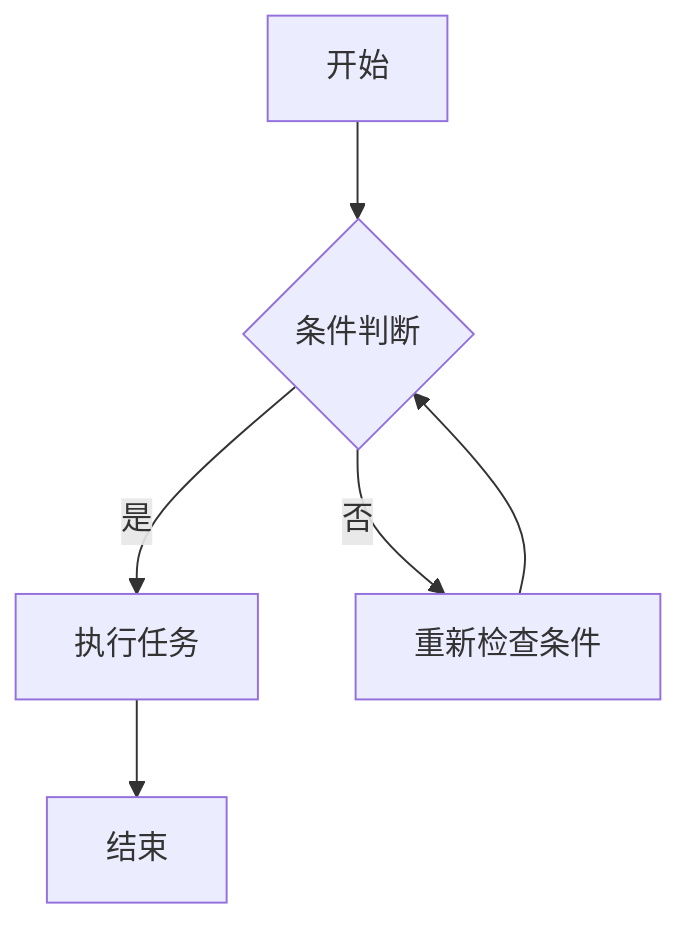
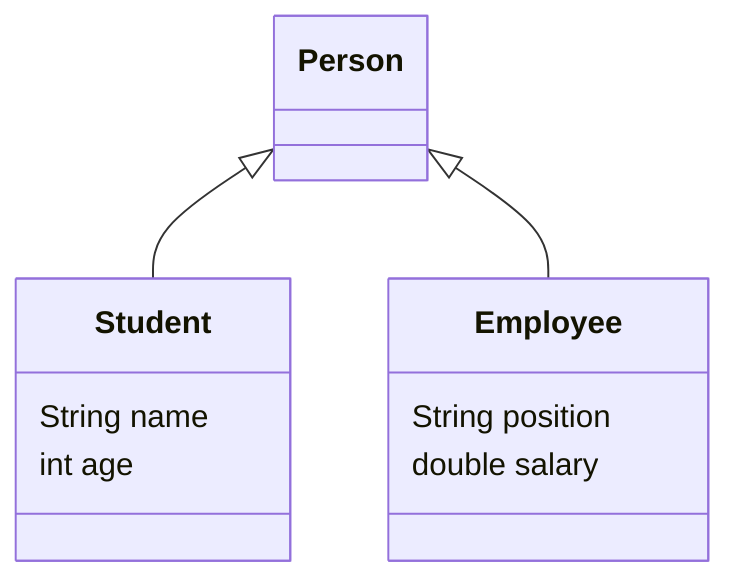
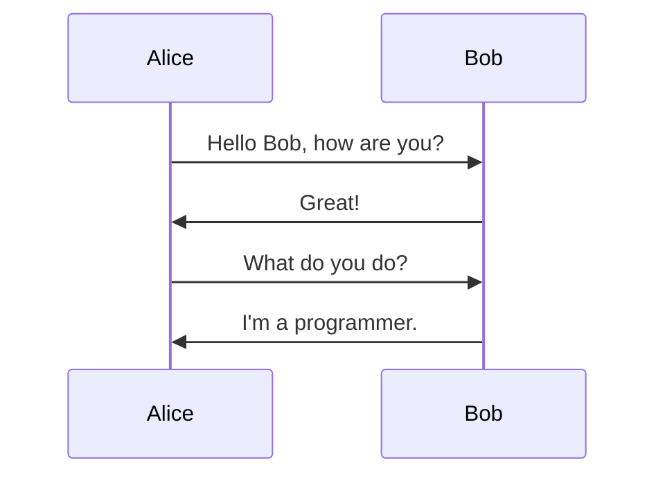

                 

# 全球气候变化下的可持续生活：个人行动与集体责任

## 关键词：气候变化，可持续生活，个人行动，集体责任

## 摘要：
本文深入探讨了全球气候变化对人类生活和环境的深远影响，以及如何通过个人行动和集体责任来应对这一挑战。文章首先概述了气候变化的背景和核心概念，接着分析了个人生活方式的可持续改变，以及政府、企业和公众在气候变化应对中的角色。通过详细的案例分析和技术讲解，本文旨在为读者提供实用的行动指南，鼓励每个人都参与到可持续生活的实践中。

## 引言

### 1.1 问题背景与重要性

### 1.2 书籍结构概述

### 1.3 目标读者

---

## 第一部分：全球气候变化概述

### 2.1 问题背景

#### 2.1.1 气候变化的定义与特征

气候变化指的是长期的气候模式变化，这些变化可能是由自然原因引起的，也可能是由人类活动造成的。地球气候系统由大气、海洋、陆地表面和冰冻圈组成，这些部分的相互作用决定了气候的状态。现代气候变化的主要特征包括全球平均气温上升、极端天气事件增多、海平面上升和生态系统变化等。

#### 2.1.2 气候变化的原因

气候变化的原因可以分为自然因素和人为因素。自然因素包括太阳辐射的变化、火山爆发和地球运动周期等。然而，自20世纪中叶以来，人为因素对气候变化的影响越来越显著，尤其是大量温室气体（如二氧化碳、甲烷和氧化亚氮）的排放。这些温室气体通过吸收和重新辐射地球表面发出的长波辐射，导致全球气温上升。

#### 2.1.3 气候变化的后果

气候变化的后果是广泛而深远的，包括但不限于：

- **农业影响**：气候变化可能导致农业产量减少、作物生长周期变化和水资源短缺。
- **生态系统影响**：冰川融化和海平面上升威胁到极地生物和沿海生态系统，物种分布也将受到影响。
- **公共卫生影响**：气候变化可能加剧疾病传播、降低空气质量、增加热浪和洪水等自然灾害的风险。
- **社会经济影响**：气候变化可能导致经济活动中断、财产损失和难民问题。

### 2.2 核心概念与联系

#### 2.2.1 气候变暖

**定义与测量**：气候变暖是指地球平均气温的持续上升。科学家们通常通过测量大气中的温室气体浓度、地表温度和海平面上升等指标来监测气候变暖。

**原因与后果**：气候变暖的主要原因包括温室气体的排放和自然因素的变化。气候变暖的后果包括冰川融化、海平面上升和极端天气事件的增多。

#### 2.2.2 海平面上升

**定义与测量**：海平面上升是指全球海洋表面相对于地球表面的平均高度增加。科学家们通过测量海平面高度、冰川融化和海水膨胀等指标来监测海平面上升。

**原因与后果**：海平面上升的主要原因是全球气温上升导致的冰川融化和海水膨胀。海平面上升对沿海地区的影响包括洪水风险增加、土地侵蚀和盐水入侵地下水。

### 2.3 气候变化对可持续生活的影响

#### 2.3.1 农业

**影响与应对措施**：气候变化对农业的影响包括极端天气事件增多、水资源短缺和作物生长周期变化。应对措施包括种植适应气候变化的作物、改善灌溉技术和实施农业可持续发展策略。

#### 2.3.2 生态系统

**影响与应对措施**：气候变化对生态系统的影响包括物种分布变化、栖息地丧失和生物多样性下降。应对措施包括保护关键生态系统、恢复退化生态系统和实施生态可持续的农业和林业实践。

#### 2.3.3 健康与公共卫生

**影响与应对措施**：气候变化对健康的影响包括疾病传播风险增加、空气质量下降和极端天气事件对健康的影响。应对措施包括加强公共卫生体系建设、提高公众健康意识和制定应对气候变化的健康政策。

---

## 第二部分：个人行动与可持续生活

### 3.1 个人生活方式的改变

#### 3.1.1 饮食习惯

**有机食物**：选择有机食物有助于减少化学农药和化肥的使用，保护环境和健康。

**减少肉类消费**：肉类生产是温室气体排放的重要来源，减少肉类消费有助于降低碳排放。

**蔬菜和水果的种类与数量**：多样化饮食和适量摄入蔬菜和水果有助于提高营养摄入和减少食物浪费。

#### 3.1.2 消费习惯

**环保购物**：选择环保产品和可回收材料的产品，减少一次性用品的使用。

**减少浪费**：合理规划购物清单、储存食物和减少食物浪费。

**购买本地产品**：购买本地产品可以减少运输过程中的碳排放。

#### 3.2 节能减排

**家庭能源使用**：

- **照明**：使用节能灯泡和自然光。
- **热水**：使用节能热水器和保温措施。
- **电器使用**：选择节能电器并合理使用。

**交通方式**：

- **步行和骑自行车**：短途出行选择步行或骑自行车。
- **使用公共交通**：减少私家车出行，使用公共交通工具。
- **低碳出行**：选择低排放的交通工具，如电动汽车。

### 3.3 环保意识与教育

#### 3.3.1 环保知识的普及

**学校教育**：在学校中普及环保知识，培养学生的环保意识。

**社区活动**：组织社区活动，提高公众对环保问题的认识。

**媒体宣传**：通过媒体宣传环保理念和行动，提高公众参与度。

#### 3.3.2 环保意识的提升

**个人行为改变**：每个人都可以从日常生活中开始改变，如减少用塑料袋、节约用水和回收垃圾等。

**政策推动**：政府和组织可以制定环保政策，鼓励和支持个人和企业的环保行动。

---

## 第三部分：集体责任与可持续生活

### 4.1 政府行动

#### 4.1.1 政策制定

**减排目标**：制定明确的减排目标，如减少温室气体排放、提高能效等。

**环境保护法规**：制定和实施环境保护法规，加强对污染行为的监管。

**政府资助项目**：提供资金和技术支持，促进环保技术的研发和应用。

#### 4.1.2 国际合作

**气候变化协议**：积极参与国际气候变化协议，如《巴黎协定》。

**国际合作项目**：与其他国家和国际组织合作，共同应对气候变化挑战。

**全球气候变化应对策略**：制定和实施全球气候变化应对策略，促进全球气候变化治理。

### 4.2 企业责任

#### 4.2.1 环保生产

**绿色供应链**：建立绿色供应链，减少生产过程中的能源消耗和废弃物排放。

**碳排放管理**：建立碳排放监测和管理体系，制定减排计划。

**环境管理体系**：实施环境管理体系，确保企业的环保行动符合相关标准和法规。

#### 4.2.2 可持续产品与服务

**环保材料**：使用环保材料和可再生资源，减少产品生命周期中的环境负担。

**节能产品**：研发和推广节能产品，提高能源利用效率。

**社会责任**：承担社会责任，支持环保项目和可持续发展。

### 4.3 社会参与

#### 4.3.1 环保组织

**活动与项目**：组织环保活动和项目，提高公众参与度。

**环保教育与宣传**：开展环保教育和宣传活动，提高公众环保意识。

**公众参与**：鼓励公众参与环保行动，共同应对气候变化挑战。

#### 4.3.2 公众意识

**气候变化认知**：提高公众对气候变化的认识和了解。

**环保行动倡议**：鼓励公众参与环保行动，共同建设可持续生活。

---

## 结论

本文通过对全球气候变化及其对可持续生活的影响进行深入分析，探讨了个人行动和集体责任在应对气候变化中的重要性。个人生活方式的改变、节能减排和环保意识的提升都是个人可以采取的有效措施。同时，政府、企业和公众的集体责任也是关键，只有共同努力，才能实现可持续发展的目标。

## 最佳实践 Tips

- **节能减排**：选择节能电器、合理使用照明和热水，鼓励步行和骑自行车。
- **环保购物**：购买本地产品、选择环保材料和可回收材料的产品。
- **环保意识**：参与环保活动和项目，提高公众环保意识。

## 拓展阅读

- **《联合国气候变化框架公约》**：了解国际气候变化政策和协议。
- **《可持续发展目标》**：了解全球可持续发展目标和行动计划。
- **《国家环保政策》**：了解国家层面的环保政策和法规。

---

**作者：AI天才研究院/AI Genius Institute & 禅与计算机程序设计艺术 /Zen And The Art of Computer Programming**以下是本篇文章的完整markdown格式内容：

```markdown
# 全球气候变化下的可持续生活：个人行动与集体责任

## 关键词：气候变化，可持续生活，个人行动，集体责任

## 摘要：
本文深入探讨了全球气候变化对人类生活和环境的深远影响，以及如何通过个人行动和集体责任来应对这一挑战。文章首先概述了气候变化的背景和核心概念，接着分析了个人生活方式的可持续改变，以及政府、企业和公众在气候变化应对中的角色。通过详细的案例分析和技术讲解，本文旨在为读者提供实用的行动指南，鼓励每个人都参与到可持续生活的实践中。

## 引言

### 1.1 问题背景与重要性

### 1.2 书籍结构概述

### 1.3 目标读者

---

## 第一部分：全球气候变化概述

### 2.1 问题背景

#### 2.1.1 气候变化的定义与特征

气候变化指的是长期的气候模式变化，这些变化可能是由自然原因引起的，也可能是由人类活动造成的。地球气候系统由大气、海洋、陆地表面和冰冻圈组成，这些部分的相互作用决定了气候的状态。现代气候变化的主要特征包括全球平均气温上升、极端天气事件增多、海平面上升和生态系统变化等。

#### 2.1.2 气候变化的原因

气候变化的原因可以分为自然因素和人为因素。自然因素包括太阳辐射的变化、火山爆发和地球运动周期等。然而，自20世纪中叶以来，人为因素对气候变化的影响越来越显著，尤其是大量温室气体（如二氧化碳、甲烷和氧化亚氮）的排放。这些温室气体通过吸收和重新辐射地球表面发出的长波辐射，导致全球气温上升。

#### 2.1.3 气候变化的后果

气候变化的后果是广泛而深远的，包括但不限于：

- **农业影响**：气候变化可能导致农业产量减少、作物生长周期变化和水资源短缺。
- **生态系统影响**：冰川融化和海平面上升威胁到极地生物和沿海生态系统，物种分布也将受到影响。
- **公共卫生影响**：气候变化可能加剧疾病传播风险、降低空气质量、增加热浪和洪水等自然灾害的风险。
- **社会经济影响**：气候变化可能导致经济活动中断、财产损失和难民问题。

### 2.2 核心概念与联系

#### 2.2.1 气候变暖

**定义与测量**：气候变暖是指地球平均气温的持续上升。科学家们通常通过测量大气中的温室气体浓度、地表温度和海平面上升等指标来监测气候变暖。

**原因与后果**：气候变暖的主要原因包括温室气体的排放和自然因素的变化。气候变暖的后果包括冰川融化、海平面上升和极端天气事件的增多。

#### 2.2.2 海平面上升

**定义与测量**：海平面上升是指全球海洋表面相对于地球表面的平均高度增加。科学家们通过测量海平面高度、冰川融化和海水膨胀等指标来监测海平面上升。

**原因与后果**：海平面上升的主要原因是全球气温上升导致的冰川融化和海水膨胀。海平面上升对沿海地区的影响包括洪水风险增加、土地侵蚀和盐水入侵地下水。

### 2.3 气候变化对可持续生活的影响

#### 2.3.1 农业

**影响与应对措施**：气候变化对农业的影响包括极端天气事件增多、水资源短缺和作物生长周期变化。应对措施包括种植适应气候变化的作物、改善灌溉技术和实施农业可持续发展策略。

#### 2.3.2 生态系统

**影响与应对措施**：气候变化对生态系统的影响包括物种分布变化、栖息地丧失和生物多样性下降。应对措施包括保护关键生态系统、恢复退化生态系统和实施生态可持续的农业和林业实践。

#### 2.3.3 健康与公共卫生

**影响与应对措施**：气候变化对健康的影响包括疾病传播风险增加、空气质量下降和极端天气事件对健康的影响。应对措施包括加强公共卫生体系建设、提高公众健康意识和制定应对气候变化的健康政策。

---

## 第二部分：个人行动与可持续生活

### 3.1 个人生活方式的改变

#### 3.1.1 饮食习惯

**有机食物**：选择有机食物有助于减少化学农药和化肥的使用，保护环境和健康。

**减少肉类消费**：肉类生产是温室气体排放的重要来源，减少肉类消费有助于降低碳排放。

**蔬菜和水果的种类与数量**：多样化饮食和适量摄入蔬菜和水果有助于提高营养摄入和减少食物浪费。

#### 3.1.2 消费习惯

**环保购物**：选择环保产品和可回收材料的产品，减少一次性用品的使用。

**减少浪费**：合理规划购物清单、储存食物和减少食物浪费。

**购买本地产品**：购买本地产品可以减少运输过程中的碳排放。

#### 3.2 节能减排

**家庭能源使用**：

- **照明**：使用节能灯泡和自然光。
- **热水**：使用节能热水器和保温措施。
- **电器使用**：选择节能电器并合理使用。

**交通方式**：

- **步行和骑自行车**：短途出行选择步行或骑自行车。
- **使用公共交通**：减少私家车出行，使用公共交通工具。
- **低碳出行**：选择低排放的交通工具，如电动汽车。

### 3.3 环保意识与教育

#### 3.3.1 环保知识的普及

**学校教育**：在学校中普及环保知识，培养学生的环保意识。

**社区活动**：组织社区活动，提高公众对环保问题的认识。

**媒体宣传**：通过媒体宣传环保理念和行动，提高公众参与度。

#### 3.3.2 环保意识的提升

**个人行为改变**：每个人都可以从日常生活中开始改变，如减少用塑料袋、节约用水和回收垃圾等。

**政策推动**：政府和组织可以制定环保政策，鼓励和支持个人和企业的环保行动。

---

## 第三部分：集体责任与可持续生活

### 4.1 政府行动

#### 4.1.1 政策制定

**减排目标**：制定明确的减排目标，如减少温室气体排放、提高能效等。

**环境保护法规**：制定和实施环境保护法规，加强对污染行为的监管。

**政府资助项目**：提供资金和技术支持，促进环保技术的研发和应用。

#### 4.1.2 国际合作

**气候变化协议**：积极参与国际气候变化协议，如《巴黎协定》。

**国际合作项目**：与其他国家和国际组织合作，共同应对气候变化挑战。

**全球气候变化应对策略**：制定和实施全球气候变化应对策略，促进全球气候变化治理。

### 4.2 企业责任

#### 4.2.1 环保生产

**绿色供应链**：建立绿色供应链，减少生产过程中的能源消耗和废弃物排放。

**碳排放管理**：建立碳排放监测和管理体系，制定减排计划。

**环境管理体系**：实施环境管理体系，确保企业的环保行动符合相关标准和法规。

#### 4.2.2 可持续产品与服务

**环保材料**：使用环保材料和可再生资源，减少产品生命周期中的环境负担。

**节能产品**：研发和推广节能产品，提高能源利用效率。

**社会责任**：承担社会责任，支持环保项目和可持续发展。

### 4.3 社会参与

#### 4.3.1 环保组织

**活动与项目**：组织环保活动和项目，提高公众参与度。

**环保教育与宣传**：开展环保教育和宣传活动，提高公众环保意识。

**公众参与**：鼓励公众参与环保行动，共同应对气候变化挑战。

#### 4.3.2 公众意识

**气候变化认知**：提高公众对气候变化的认识和了解。

**环保行动倡议**：鼓励公众参与环保行动，共同建设可持续生活。

---

## 结论

本文通过对全球气候变化及其对可持续生活的影响进行深入分析，探讨了个人行动和集体责任在应对气候变化中的重要性。个人生活方式的改变、节能减排和环保意识的提升都是个人可以采取的有效措施。同时，政府、企业和公众的集体责任也是关键，只有共同努力，才能实现可持续发展的目标。

## 最佳实践 Tips

- **节能减排**：选择节能电器、合理使用照明和热水，鼓励步行和骑自行车。
- **环保购物**：购买本地产品、选择环保材料和可回收材料的产品。
- **环保意识**：参与环保活动和项目，提高公众环保意识。

## 拓展阅读

- **《联合国气候变化框架公约》**：了解国际气候变化政策和协议。
- **《可持续发展目标》**：了解全球可持续发展目标和行动计划。
- **《国家环保政策》**：了解国家层面的环保政策和法规。

---

**作者：AI天才研究院/AI Genius Institute & 禅与计算机程序设计艺术 /Zen And The Art of Computer Programming**
```在markdown格式的文章中，为了更好地展示技术概念和算法原理，我们可以适当使用Mermaid来绘制流程图、类图、架构图和序列图。以下是如何在markdown文件中使用Mermaid的一些示例。

### Mermaid 流程图示例



这会生成一个简单的流程图，展示了一个条件判断的流程。

### Mermaid 类图示例



这会生成一个类图，展示了Person类和它的子类Student、Employee及其属性。

### Mermaid 序列图示例



这会生成一个序列图，展示了Alice和Bob之间的对话。

### Mermaid 架构图示例


这会生成一个架构图，展示了系统的三个主要组件：数据库、API服务和用户界面及其关系。

在文章中适当的位置插入这些图表，可以帮助读者更直观地理解技术概念和算法原理。

例如，在讲解一个复杂的算法时，可以使用流程图来描述算法的步骤；在介绍一个系统的架构时，可以使用架构图来展示各个组件的关系；在讲解类与类之间的关系时，可以使用类图来展示这些关系。

请注意，使用Mermaid时需要在相应的代码块前面加上````mermaid`和````，并在内容前后加上Mermaid的语法标识符，如`graph TD`、`classDiagram`、`sequenceDiagram`等。这些图表将在markdown渲染器中被正确识别并渲染出来。

