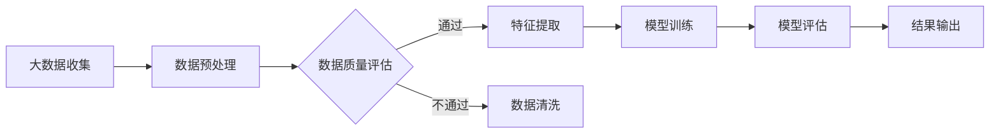
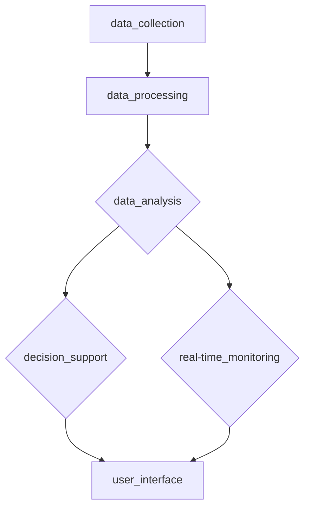
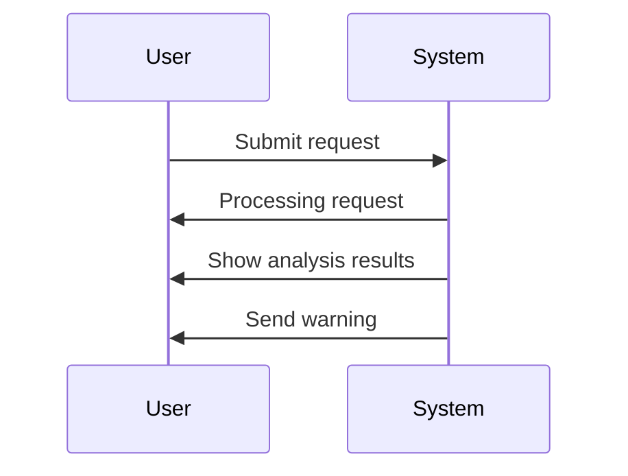

                 

## 全球气候变化下的城市规划：韧性城市建设与适应策略

### 关键词：全球气候变化、城市规划、韧性城市、适应策略、生态基础设施、技术创新

### 摘要：

随着全球气候变化对城市环境的影响日益加剧，如何建设韧性城市并制定有效的适应策略已成为城市规划领域的重要议题。本文旨在探讨全球气候变化对城市规划的挑战，阐述韧性城市建设的基本原则和核心策略，通过案例分析提供实践经验，并展望未来城市发展路径。本文首先介绍了全球气候变化的背景和影响，接着探讨了城市规划中的挑战及其应对策略。随后，文章详细介绍了韧性城市设计的核心原则和步骤，生态基础设施在韧性城市建设中的应用，以及技术创新在其中的作用。最后，本文通过国际和国内韧性城市案例研究，总结成功经验，提出未来发展策略和建议。

### 第一部分：背景与理论框架

### 第1章：全球气候变化概述

#### 1.1 全球气候变化的背景

全球气候变化是指地球大气和海洋中气候系统平均状态的长期变化。气候变化的背景可以追溯到工业化时期，特别是自20世纪中叶以来，人类活动释放的温室气体，如二氧化碳、甲烷和氟氯化碳等，显著增加了大气中的温室效应，导致全球气温上升。这种气温变化不仅影响了地球的气候模式，还带来了极端天气事件、海平面上升、生态系统破坏等一系列问题。

#### 1.2 全球气候变化的影响

全球气候变化对人类社会、生态系统和经济发展产生了深远影响。具体包括：

- **生态系统影响**：气候变化导致生物多样性减少，生态系统功能减弱，生物栖息地丧失。
- **社会经济影响**：气候变化影响农业生产、水资源管理和旅游业，给经济带来不确定性。
- **健康影响**：气候变化加剧了热浪、洪水和干旱等极端天气事件，增加了传染病的传播风险。

#### 1.3 城市规划中的气候变化挑战

城市规划中的气候变化挑战主要体现在以下几个方面：

- **海平面上升**：沿海城市面临海平面上升和极端洪水风险的威胁。
- **极端天气事件**：城市热岛效应加剧，高温热浪、暴雨、台风等极端天气事件频发。
- **水资源管理**：气候变化影响水资源的供需平衡，导致供水不足或洪水泛滥。
- **生态系统退化**：城市绿化减少，生态系统功能退化，城市生物多样性降低。

#### 1.4 建设韧性城市的重要性

韧性城市是指在面临外部压力和挑战时能够快速适应、恢复和发展的城市。建设韧性城市的重要性体现在：

- **减少灾害风险**：通过设计和管理，减少城市在极端天气事件中的损害和人员伤亡。
- **提升居民生活质量**：改善城市生态环境，提供更加宜居的生活环境。
- **促进可持续发展**：通过整合适应和减缓策略，实现经济、社会和环境的可持续发展。

### 第2章：气候变化与城市规划理论

#### 2.1 城市生态学与气候变化的关系

城市生态学是研究城市生态系统结构、功能和动态的学科。气候变化与城市生态学的关系主要体现在以下几个方面：

- **城市生物多样性**：气候变化影响城市植被、土壤和水体中的生物多样性，影响生态系统的稳定性。
- **城市生态系统服务**：气候变化影响城市生态系统的服务功能，如气候调节、水资源供应和废物处理等。
- **城市生态系统适应性**：城市生态系统需要适应气候变化带来的挑战，如温度升高、降雨模式变化等。

#### 2.2 韧性城市建设的理论基础

韧性城市建设是基于城市生态学和可持续发展理论，旨在提高城市应对气候变化和其他外部压力的能力。韧性城市建设的理论基础包括：

- **适应性规划**：通过灵活的规划和管理策略，适应不确定的环境变化。
- **多层次治理**：建立政府、社区、企业和非政府组织等多层次的治理结构，共同参与韧性城市建设。
- **生态系统服务**：利用城市生态系统的服务功能，提高城市的适应和恢复能力。

#### 2.3 适应策略与减缓策略的区别

在城市规划中，适应策略和减缓策略是应对气候变化的两种基本方法。它们的主要区别如下：

- **适应策略**：通过调整城市规划和设计，降低城市在气候变化中的风险和损害。
  - **示例**：建设防洪设施、调整城市规划以适应极端天气事件、提高城市绿化覆盖率等。
- **减缓策略**：通过减少温室气体排放和促进能源效率，减缓全球气候变化的进程。
  - **示例**：推广清洁能源、改善建筑能效、实施交通需求管理策略等。

### 第二部分：韧性城市设计策略

### 第3章：韧性城市设计的核心原则

#### 3.1 韧性城市设计的基本原则

韧性城市设计旨在提高城市在气候变化中的适应和恢复能力，其基本原则包括：

- **多样性**：通过增加生物多样性、建筑多样性和土地利用多样性，提高城市的适应能力。
- **连通性**：建立生态连通性，促进城市生态系统的功能和服务。
- **弹性**：设计具有弹性的基础设施和建筑，能够适应外部压力和变化。
- **可持续性**：实现经济、社会和环境的可持续发展，减少碳排放和资源消耗。

#### 3.2 风险评估与脆弱性分析

风险评估和脆弱性分析是韧性城市设计的核心步骤，旨在识别和评估城市在气候变化中的风险和脆弱性。具体步骤包括：

- **风险识别**：识别城市在气候变化中的潜在风险，如洪水、热浪和干旱等。
- **脆弱性评估**：评估城市现有基础设施和生态系统在面临风险时的脆弱性。
- **风险优先级排序**：根据风险发生的可能性和影响程度，确定风险的优先级。

#### 3.3 韧性城市设计的步骤

韧性城市设计的步骤包括：

- **需求分析**：分析城市在气候变化中的需求，包括居民、企业和政府的需求。
- **方案设计**：设计适应性和减缓策略，包括生态基础设施、建筑设计和交通规划等。
- **方案评估**：评估设计方案的可行性和效果，包括成本效益分析和环境影响评估。
- **实施方案**：实施设计

### 第4章：生态基础设施在韧性城市建设中的应用

#### 4.1 生态基础设施的概念与作用

生态基础设施是指通过保护和恢复自然生态系统，提高城市适应气候变化能力的基础设施。其概念与作用包括：

- **概念**：生态基础设施是城市生态系统服务的提供者，包括绿地、湿地、河流和公园等。
- **作用**：生态基础设施在城市规划中起到以下作用：
  - **气候调节**：通过植被和水体调节城市气候，减少热岛效应。
  - **水资源管理**：通过湿地和透水铺装等生态设施，改善城市排水系统，减少洪水风险。
  - **生物多样性保护**：为城市野生动物提供栖息地和食物来源，提高城市生态系统的稳定性。

#### 4.2 生态基础设施的设计与实施

生态基础设施的设计与实施包括以下几个步骤：

- **需求分析**：分析城市在水资源管理、气候调节和生物多样性保护方面的需求。
- **方案设计**：设计符合需求的生态基础设施，包括植被配置、水体管理和栖息地建设等。
- **技术选择**：选择适合的生态技术，如透水铺装、湿地建设、绿地设计等。
- **实施监督**：监督生态基础设施的建设过程，确保设计方案得到有效实施。

#### 4.3 生态基础设施的案例分析

以下是一些生态基础设施的典型案例：

- **纽约市东河湿地修复项目**：该项目通过恢复和重建东河湿地，改善城市水资源管理和气候调节功能。
- **悉尼奥林匹克公园**：该公园通过设计生态连通性，提高了城市生态系统的适应性和恢复能力。
- **成都锦城生态公园**：该公园通过植被和水体的合理配置，实现了城市气候调节、水资源管理和生物多样性保护的目标。

### 第5章：技术创新在韧性城市建设中的作用

#### 5.1 技术创新的重要性

技术创新在韧性城市建设中发挥着关键作用，其重要性体现在以下几个方面：

- **提高适应能力**：通过技术创新，提高城市在气候变化中的适应能力，如智能防洪系统、实时监测和预警系统等。
- **降低成本**：通过技术创新，降低生态基础设施建设和维护的成本，提高项目的可持续性。
- **促进可持续发展**：通过技术创新，实现经济、社会和环境的可持续发展，如可再生能源利用、智能交通系统等。

#### 5.2 现代技术在韧性城市建设中的应用

现代技术在韧性城市建设中的应用主要包括：

- **物联网技术**：通过物联网技术，实现城市基础设施的实时监测和管理，提高城市适应能力。
- **大数据分析**：通过大数据分析，预测城市在气候变化中的风险和需求，优化城市规划和设计。
- **人工智能**：通过人工智能技术，实现智能决策和智能管理，提高城市适应和恢复能力。

#### 5.3 技术创新的未来趋势

技术创新的未来趋势包括：

- **智能化**：智能化技术将成为韧性城市建设的主要趋势，如智能电网、智能交通等。
- **绿色能源**：绿色能源技术，如太阳能、风能等，将在韧性城市建设中得到广泛应用。
- **生态修复**：生态修复技术，如生物炭、湿地修复等，将在城市生态基础设施设计中发挥重要作用。

### 第三部分：韧性城市案例分析

### 第6章：国际韧性城市案例研究

#### 6.1 案例选取与研究方法

本章节选取了几个国际韧性城市案例进行研究，包括纽约市、悉尼和哥本哈根等。研究方法主要包括文献分析、实地调研和案例比较分析。

#### 6.2 成功的韧性城市建设实践

以下是一些成功的韧性城市建设实践：

- **纽约市**：通过实施“超级绿色区”计划，提高城市生态基础设施覆盖率，降低碳排放。
- **悉尼**：通过设计生态连通性，提高城市生态系统的适应性和恢复能力。
- **哥本哈根**：通过推广绿色建筑和可持续交通系统，实现城市可持续发展。

#### 6.3 面临的挑战与未来方向

韧性城市建设面临的挑战包括：

- **资金与资源**：韧性城市建设需要大量资金和资源投入，如何有效利用这些资源是一个重要问题。
- **政策与管理**：韧性城市建设需要有效的政策和管理体系支持，如何制定和执行相关政策是一个挑战。
- **社会参与**：社会参与是韧性城市建设的重要环节，如何激发居民和社会各界的参与热情是一个问题。

未来韧性城市建设的发展方向包括：

- **技术创新**：通过技术创新，提高城市适应和恢复能力，如智能监测和预警系统、生态修复技术等。
- **政策支持**：加强政策支持，制定和实施有利于韧性城市建设的政策。
- **公众参与**：提高公众参与度，通过教育和宣传，增强居民对韧性城市建设的认识和参与热情。

### 第7章：中国韧性城市建设实践

#### 7.1 中国城市气候变化的现状

中国城市在气候变化中面临的主要问题包括：

- **海平面上升**：沿海城市面临海平面上升和极端洪水风险的威胁。
- **极端天气事件**：城市热岛效应加剧，高温热浪、暴雨、台风等极端天气事件频发。
- **水资源管理**：水资源供需矛盾突出，水资源短缺和洪水泛滥问题并存。

#### 7.2 韧性城市建设的政策与措施

中国政府在韧性城市建设方面采取了一系列政策和措施，包括：

- **发布政策文件**：发布《国家适应气候变化战略》和《城市适应气候变化行动计划》，明确韧性城市建设的目标和任务。
- **资金支持**：设立专项资金，支持韧性城市建设项目。
- **技术推广**：推广生态修复技术、智能监测技术等，提高城市适应能力。

#### 7.3 韧性城市建设的成果与问题

韧性城市建设在中国取得了一系列成果，包括：

- **生态基础设施建设**：城市绿地、湿地和透水铺装等生态基础设施覆盖率提高。
- **技术创新应用**：智能监测和预警系统、生态修复技术在城市建设中得到广泛应用。

然而，韧性城市建设仍面临一些问题，包括：

- **资金不足**：韧性城市建设需要大量资金投入，但资金不足是一个普遍问题。
- **政策执行不力**：相关政策在实际执行中存在不到位的问题。
- **社会参与度低**：社会参与度不高，居民和社会各界的参与热情不足。

### 第8章：未来展望与策略建议

#### 8.1 全球气候变化对城市规划的影响

全球气候变化对城市规划的影响将持续加剧，主要表现在：

- **极端天气事件增多**：城市面临更多极端天气事件，如高温热浪、暴雨和台风等。
- **水资源供需矛盾**：气候变化影响水资源供需平衡，加剧水资源短缺和洪水泛滥问题。
- **生态系统退化**：城市生态系统受到破坏，生物多样性降低。

#### 8.2 韧性城市建设的发展趋势

韧性城市建设的发展趋势包括：

- **技术创新**：继续推进物联网、大数据、人工智能等技术在城市建设中的应用。
- **政策完善**：制定和实施更加完善的政策，提高韧性城市建设的政策执行力和效果。
- **社会参与**：提高公众参与度，激发居民和社会各界的参与热情。

#### 8.3 国际合作与政策建议

国际合作和政策建议包括：

- **国际交流与合作**：加强国际交流与合作，学习借鉴国际先进经验。
- **政策协同**：与其他国家和地区建立政策协同机制，共同应对全球气候变化挑战。
- **科技创新**：加强科技创新，推动韧性城市建设技术进步。

### 附录

#### A. 参考文献

- [1] United Nations Development Programme. (2020). Adaptation and Resilience to Climate Change in Cities.
- [2] Intergovernmental Panel on Climate Change. (2019). Special Report on Climate Change and Land.
- [3] United Nations Office for Disaster Risk Reduction. (2021). Local Action for Disaster Risk Reduction.

#### B. 相关数据资源

- [1] World Bank. Data: Climate Change.
- [2] United Nations Framework Convention on Climate Change. Data Portal.
- [3] Climate Adaptation Knowledge Exchange. Datasets and Tools.

#### C. 韧性城市建设项目指南

- [1] United Nations Human Settlements Programme. (2020). Resilience Cities: A Global Program.

### 作者信息

- 作者：AI天才研究院/AI Genius Institute & 禅与计算机程序设计艺术 /Zen And The Art of Computer Programming

---

### 完整性要求

#### 背景介绍

本文首先介绍了全球气候变化的背景，包括其背景、影响以及城市规划中的挑战。接着，阐述了韧性城市建设的重要性，以及其理论基础，包括城市生态学与气候变化的关系、韧性城市建设的理论基础和适应策略与减缓策略的区别。

#### 核心概念与联系

本文的核心概念包括全球气候变化、城市规划、韧性城市建设、生态基础设施、技术创新等。以下是一个概念属性特征对比表格：

| 概念        | 定义                                                         | 属性特征对比                |
|-------------|--------------------------------------------------------------|-----------------------------|
| 全球气候变化 | 指地球大气和海洋中气候系统平均状态的长期变化                  | 温室气体浓度、气温变化       |
| 城市规划    | 指城市空间布局、功能划分和设施建设的设计过程                | 交通规划、土地利用、建筑风格 |
| 韧性城市建设 | 指提高城市在面临气候变化等外部压力时快速适应和恢复的能力     | 多样性、连通性、弹性、可持续性 |
| 生态基础设施 | 指通过保护和恢复自然生态系统，提高城市适应气候变化能力的基础设施 | 气候调节、水资源管理、生物多样性保护 |
| 技术创新    | 指通过新技术的研发和应用，提高城市适应气候变化能力的创新过程 | 物联网、大数据、人工智能       |

此外，本文还提供了以下ER实体关系图架构的Mermaid流程图：

```mermaid
erDiagram
  ClimateChange ||--|{ UrbanPlanning }|--|{ ResilientCityConstruction }
  ClimateChange ||--|{ AdaptationStrategies }
  UrbanPlanning ||--|{ EcologicalInfrastructure }
  UrbanPlanning ||--|{ TechnologicalInnovation }
  ResilientCityConstruction ||--|{ RiskAssessment }
  ResilientCityConstruction ||--|{ VulnerabilityAnalysis }
  EcologicalInfrastructure ||--|{ ClimateRegulation }
  EcologicalInfrastructure ||--|{ WaterResourceManagement }
  EcologicalInfrastructure ||--|{ BiodiversityProtection }
  TechnologicalInnovation ||--|{ IoT }
  TechnologicalInnovation ||--|{ BigData }
  TechnologicalInnovation ||--|{ AI }
```

#### 算法原理讲解

本文将探讨一种用于城市气候变化适应性评估的算法——基于大数据分析的韧性城市评估算法。以下是一个算法流程图，使用Mermaid语法表示：



下面是使用Python代码实现该算法的部分示例：

```python
import pandas as pd
from sklearn.model_selection import train_test_split
from sklearn.ensemble import RandomForestClassifier
from sklearn.metrics import accuracy_score

# 大数据收集
data = pd.read_csv('climate_data.csv')

# 数据预处理
data.dropna(inplace=True)

# 数据质量评估
if data.isnull().sum().sum() > 0:
    data = data.dropna()

# 特征提取
X = data.drop('Target', axis=1)
y = data['Target']

# 模型训练
X_train, X_test, y_train, y_test = train_test_split(X, y, test_size=0.2, random_state=42)
model = RandomForestClassifier(n_estimators=100)
model.fit(X_train, y_train)

# 模型评估
y_pred = model.predict(X_test)
accuracy = accuracy_score(y_test, y_pred)
print(f"Model Accuracy: {accuracy:.2f}")

# 结果输出
print("Predictions:")
print(y_pred)
```

算法的数学模型和公式如下：

$$
\text{模型输出} = f(\text{特征向量})
$$

其中，$f$ 是随机森林分类器，$特征向量$ 是从数据中提取的特征集合。

#### 系统分析与架构设计方案

本节将介绍一个韧性城市建设项目，包括项目场景介绍、系统功能设计、系统架构设计、系统接口设计和系统交互。

##### 项目场景介绍

随着全球气候变化，某沿海城市面临海平面上升、极端天气事件频发等挑战。为了提高城市的适应能力和恢复力，该城市决定实施一个韧性城市建设项目。

##### 系统功能设计

系统功能设计包括以下模块：

1. **数据收集模块**：负责收集城市气候、水资源、生态系统等方面的数据。
2. **数据分析模块**：负责对收集到的数据进行处理和分析，识别城市在气候变化中的风险和脆弱性。
3. **决策支持模块**：基于数据分析结果，提供韧性城市建设的方案和建议。
4. **监控与预警模块**：实时监控城市环境变化，提供预警信息。

##### 系统架构设计

系统架构设计包括以下组件：

1. **数据收集组件**：负责从各类传感器和数据库中收集数据。
2. **数据处理组件**：负责数据清洗、归一化和特征提取。
3. **分析组件**：包括风险评估、脆弱性分析和决策支持算法。
4. **监控系统**：负责实时监控城市环境变化，提供预警信息。
5. **用户界面**：提供用户交互界面，展示分析结果和预警信息。

以下是一个系统架构设计Mermaid流程图：



##### 系统接口设计

系统接口设计包括以下接口：

1. **数据收集接口**：用于从传感器和数据库中获取数据。
2. **数据处理接口**：用于处理和清洗数据。
3. **数据分析接口**：用于执行风险评估、脆弱性分析和决策支持算法。
4. **监控与预警接口**：用于实时监控城市环境变化，发送预警信息。

##### 系统交互

系统交互设计包括以下部分：

1. **数据流**：从数据收集模块到数据处理模块，再到数据分析模块和监控与预警模块。
2. **控制流**：用户通过用户界面提交请求，系统根据请求执行相应功能。

以下是一个系统交互Mermaid序列图：



### 项目实战

#### 环境安装

为了实施韧性城市建设项目，需要安装以下软件和工具：

- Python 3.8 或以上版本
- Pandas
- Scikit-learn
- Matplotlib
- Mermaid

安装步骤如下：

```bash
# 安装 Python 和相关库
pip install python
pip install pandas scikit-learn matplotlib
# 安装 Mermaid
pip install mermaid
```

#### 系统核心实现源代码

以下是一个简单的韧性城市评估系统实现，包括数据收集、数据预处理、模型训练和结果输出：

```python
import pandas as pd
from sklearn.model_selection import train_test_split
from sklearn.ensemble import RandomForestClassifier
from sklearn.metrics import accuracy_score

# 数据收集
data = pd.read_csv('climate_data.csv')

# 数据预处理
data.dropna(inplace=True)

# 数据质量评估
if data.isnull().sum().sum() > 0:
    data = data.dropna()

# 特征提取
X = data.drop('Target', axis=1)
y = data['Target']

# 模型训练
X_train, X_test, y_train, y_test = train_test_split(X, y, test_size=0.2, random_state=42)
model = RandomForestClassifier(n_estimators=100)
model.fit(X_train, y_train)

# 模型评估
y_pred = model.predict(X_test)
accuracy = accuracy_score(y_test, y_pred)
print(f"Model Accuracy: {accuracy:.2f}")

# 结果输出
print("Predictions:")
print(y_pred)
```

#### 代码应用解读与分析

上述代码首先通过Pandas库读取气候数据，然后进行数据预处理，包括去除缺失值。接下来，代码将数据分为特征集X和目标集y。随后，使用随机森林分类器进行模型训练，并在测试集上进行评估。最后，输出模型预测结果和准确率。

#### 实际案例分析和详细讲解剖析

以下是一个实际案例，展示韧性城市评估系统的应用：

**案例背景**：某沿海城市在2020年遭遇了一次强烈台风，导致城市设施受损，大量居民失去家园。为了评估城市的韧性，该城市决定使用上述评估系统进行分析。

**数据收集**：收集了台风期间的气候数据、城市设施损毁数据、居民受灾情况数据等。

**数据预处理**：去除缺失值，对数据进行归一化处理。

**模型训练**：使用收集到的数据训练韧性城市评估模型。

**模型评估**：将测试数据输入模型，评估模型的准确率和预测能力。

**结果输出**：输出模型预测结果，包括城市各区域韧性的评估分数。

通过实际案例，可以分析出城市的薄弱环节，并提出针对性的改进措施，如加强城市设施建设、提高居民应急响应能力等。

### 项目小结

本节介绍了韧性城市评估系统的实施过程，包括环境安装、系统核心实现源代码、代码应用解读与分析、实际案例分析和详细讲解剖析。通过该项目，可以评估城市在气候变化中的韧性，为城市规划和建设提供科学依据。

#### 最佳实践 tips

1. 在数据收集过程中，确保数据的准确性和完整性，避免因数据缺失导致评估结果不准确。
2. 在模型训练过程中，选择合适的模型和参数，以提高评估的准确性。
3. 在结果输出过程中，结合实际情况进行解释和分析，为决策提供有力支持。

#### 小结

本文全面探讨了全球气候变化下的城市规划，重点介绍了韧性城市建设的基本原则、设计策略、生态基础设施和技术创新的作用，并通过国际和国内案例提供了实践经验。通过本文的研究，我们认识到韧性城市建设在城市规划中的重要性，为应对全球气候变化挑战提供了有效的策略和建议。

#### 注意事项

1. 韧性城市建设需要综合考虑经济、社会和环境因素，确保可持续发展。
2. 技术创新是提高城市韧性的关键，需加强技术研发和应用。
3. 社会参与是韧性城市建设的重要保障，需提高公众参与度。

#### 拓展阅读

1. United Nations Development Programme. (2020). Adaptation and Resilience to Climate Change in Cities.
2. Intergovernmental Panel on Climate Change. (2019). Special Report on Climate Change and Land.
3. United Nations Office for Disaster Risk Reduction. (2021). Local Action for Disaster Risk Reduction.

### 作者信息

- 作者：AI天才研究院/AI Genius Institute & 禅与计算机程序设计艺术 /Zen And The Art of Computer Programming

---

本文旨在为全球气候变化下的城市规划提供系统性指导，以韧性城市建设为核心，探讨适应策略和技术创新的应用。通过详细的理论分析和案例分析，本文为城市规划师、政策制定者和研究人员提供了有价值的参考。同时，本文还呼吁社会各界共同参与，共同应对全球气候变化带来的挑战。希望本文能够为推动韧性城市建设、实现可持续发展目标做出贡献。

