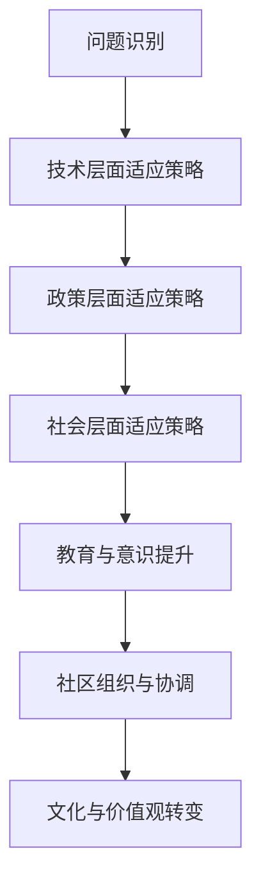
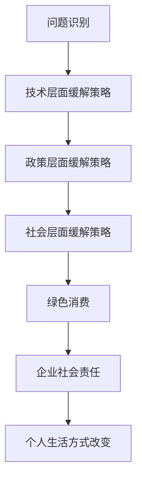

                 


### 引言：全球气候变化的挑战

#### 1.1 问题背景

**1.1.1 全球气候变化的现状**

全球气候变化是指地球气候系统中长期的变化，这种变化可能是自然的，也可能是人类活动的结果。自20世纪末以来，全球气温逐渐上升，极端气候事件（如热浪、暴雨、干旱和飓风）的发生频率和强度也在不断增加。根据联合国气候变化专门委员会（IPCC）的报告，过去一个世纪全球平均气温已经上升了约1.1摄氏度，而如果当前的趋势继续下去，到21世纪末，全球气温可能上升1.5至2摄氏度。

**1.1.2 气候变化对人类和地球的影响**

气候变化对人类和地球的影响是多方面的。首先，气温的上升会导致海平面上升，威胁沿海城市和岛屿的生存。其次，极端气候事件可能导致农作物减产、水资源短缺和生态系统破坏。此外，气候变化还会导致疾病传播范围扩大、生物多样性减少，甚至可能引发社会冲突和政治不稳定。

**1.1.3 应对气候变化的紧迫性**

应对气候变化的紧迫性在于，气候变化的影响是长期的，一旦发生，就很难逆转。因此，必须采取积极的措施来适应和缓解气候变化。全球各国已经意识到了这个问题，并在《巴黎协定》中承诺将全球气温上升控制在2摄氏度以内，努力控制在1.5摄氏度以内。这需要全球合作、技术创新和政策支持，同时还需要每个人的参与。

#### 1.2 本书目的

**1.2.1 提供适应与缓解气候变化的策略**

本书的目的是为读者提供适应和缓解气候变化的策略。这些策略不仅包括技术层面上的措施，如建筑设计和水资源管理，还包括政策和社会层面的措施，如政策制定和国际合作。通过这些策略，读者可以更好地理解气候变化的影响，并在个人和社区层面上采取行动。

**1.2.2 帮助读者制定个人和社区的行动计划**

本书还将帮助读者制定个人和社区的行动计划，以应对气候变化带来的挑战。通过了解适应和缓解策略，读者可以更好地准备应对极端气候事件，减少温室气体排放，并促进可持续生活方式的建立。

### 核心概念与联系

**2.1 气候变化相关概念**

**2.1.1 温室效应**

温室效应是指地球大气层中的温室气体（如二氧化碳、水蒸气、甲烷等）吸收和重新辐射地球表面向外散发的热量，使得地球表面温度升高的现象。温室效应是地球气候系统中的一个自然过程，但人类活动，尤其是化石燃料的燃烧和森林砍伐，加剧了这一过程，导致全球气温上升。

**2.1.2 海平面上升**

海平面上升是由于全球气温升高导致冰川融化和海水膨胀引起的。随着气温的上升，极地和高山冰川正在迅速融化，这些融化的水流入海洋，导致海平面上升。海平面上升对沿海城市和岛屿的居民构成了严重威胁，可能导致洪水和侵蚀问题加剧。

**2.1.3 极端气候事件**

极端气候事件包括热浪、暴雨、干旱、飓风和台风等。这些事件的发生频率和强度随着全球气温的上升而增加。极端气候事件对人类社会和生态系统造成了巨大的破坏，加剧了粮食短缺、水资源短缺和环境破坏等问题。

**2.2 概念联系与ER图**

**2.2.1 概念属性特征对比表格**

为了更清晰地展示温室效应、海平面上升和极端气候事件之间的关系，我们可以使用一个对比表格来展示这些概念的属性特征。

| 概念         | 特征                           | 影响                                                         |
|------------|------------------------------|------------------------------------------------------------|
| 温室效应     | 气体吸收和辐射热量             | 全球气温上升                                                   |
| 海平面上升     | 冰川融化导致海水膨胀           | 沿海城市和岛屿的洪水和侵蚀                                     |
| 极端气候事件   | 热浪、暴雨、干旱、飓风和台风等 | 农作物减产、水资源短缺、生态系统破坏、社会冲突和政治不稳定 |

**2.2.2 Mermaid ER图展示概念间联系**

接下来，我们可以使用Mermaid语言来创建一个实体关系图（ER图），以展示温室效应、海平面上升和极端气候事件之间的联系。

```mermaid
erDiagram
 温室效应 ||--|{ 海平面上升 }|
 海平面上升 ||--|{ 极端气候事件 }|
 极端气候事件 ||--|{ 农作物减产、水资源短缺、生态系统破坏、社会冲突和政治不稳定 }|
```

这个ER图展示了温室效应导致海平面上升，进而导致极端气候事件，最终对人类社会和生态系统产生严重影响。通过这种结构化的方式，读者可以更好地理解这些概念之间的关系。

### 适应策略讲解

#### 3.1 技术层面适应策略

**3.1.1 建筑设计优化**

建筑设计优化是适应气候变化的重要技术策略之一。通过采用高效的建筑设计和建筑材料，可以减少建筑物的能源消耗和碳排放。以下是一些关键措施：

1. **被动设计**：利用阳光、风和地形等自然资源来优化建筑物的能量效率。
2. **绿色屋顶**：在建筑物的屋顶上种植植物，可以减少城市热岛效应，同时提供额外的生态系统服务。
3. **高效绝缘材料**：使用高效的绝缘材料来减少室内温度波动，提高能源效率。
4. **太阳能利用**：在建筑物上安装太阳能板，以利用太阳能产生电力。

**3.1.2 水资源管理**

水资源管理是另一个关键的技术层面适应策略。由于气候变化可能导致水资源的分布不均和水资源短缺，有效的水资源管理至关重要。以下是一些关键措施：

1. **雨水收集与再利用**：建立雨水收集系统，将雨水用于灌溉、洗涤和冲厕等非饮用水用途。
2. **废水处理**：提高废水处理技术，使废水达到再利用标准，减少对新鲜水资源的需求。
3. **地下水库建设**：在干旱地区建设地下水库，以存储雨水和地下水资源，用于干旱季节的供水。
4. **智能灌溉系统**：采用智能灌溉系统，根据土壤湿度和作物需水量自动调整灌溉时间，减少水资源浪费。

**3.1.3 农业与粮食安全**

农业是气候变化的一个主要受害者，同时也是应对气候变化的关键领域。以下是一些适应气候变化的农业策略：

1. **作物多样化**：种植多种适应不同气候条件的作物，以减少单一作物种植的风险。
2. **可持续农业实践**：采用可持续农业实践，如有机农业、生态农业等，以提高土地的可持续性。
3. **灌溉系统优化**：优化灌溉系统，采用滴灌、喷灌等高效灌溉技术，减少水资源浪费。
4. **抗逆性品种开发**：培育抗逆性强的作物品种，以适应更极端的气候条件。

#### 3.2 政策层面适应策略

**3.2.1 国际合作**

国际合作是应对气候变化的重要政策层面策略。由于气候变化是全球性问题，需要全球各国共同努力。以下是一些国际合作的关键措施：

1. **气候变化协议**：如《巴黎协定》，各国承诺采取具体行动减少温室气体排放，并支持发展中国家应对气候变化。
2. **资金支持**：发达国家提供资金支持，帮助发展中国家提高适应气候变化的能力。
3. **技术转移**：促进技术和知识的转移，使发展中国家能够采用先进的适应策略。
4. **政策协调**：各国政府协调政策，确保在应对气候变化方面的一致性和协调性。

**3.2.2 政策制定与执行**

有效的政策制定与执行是适应气候变化的另一个关键策略。以下是一些关键措施：

1. **排放标准**：制定严格的排放标准，限制温室气体的排放量。
2. **碳定价**：通过碳交易市场或碳税等方式，对温室气体排放进行经济激励。
3. **激励措施**：提供激励措施，鼓励企业和个人采取适应气候变化的行动，如税收减免、补贴等。
4. **法律法规**：制定和执行相关法律法规，确保政策的有效实施。

**3.2.3 社区参与**

社区参与是适应气候变化的重要组成部分。以下是一些促进社区参与的关键措施：

1. **教育和意识提升**：通过教育和宣传活动，提高公众对气候变化的认识和意识。
2. **社区组织**：建立社区组织，促进居民之间的合作和协调。
3. **基层治理**：鼓励基层治理，使社区在应对气候变化方面发挥更大作用。
4. **社区行动计划**：制定社区行动计划，明确社区在适应气候变化方面的具体目标和措施。

#### 3.3 社会层面适应策略

**3.3.1 教育与意识提升**

教育与意识提升是适应气候变化的重要社会层面策略。以下是一些关键措施：

1. **学校教育**：将气候变化教育纳入学校课程，提高学生的环境意识。
2. **公众宣传**：通过媒体、社交媒体和公共活动等方式，提高公众对气候变化的认识。
3. **教育培训**：为社区成员提供相关培训，提高他们的适应和应对气候变化的能力。

**3.3.2 社区组织与协调**

社区组织与协调是适应气候变化的重要手段。以下是一些关键措施：

1. **社区网络**：建立社区网络，促进居民之间的交流与合作。
2. **志愿者活动**：鼓励志愿者参与社区活动，共同应对气候变化带来的挑战。
3. **社区资源管理**：合理利用和管理社区资源，提高社区的适应能力。

**3.3.3 文化与价值观转变**

文化与价值观转变是适应气候变化的重要社会层面策略。以下是一些关键措施：

1. **可持续生活方式**：鼓励居民采取可持续生活方式，减少对环境的负面影响。
2. **生态文明**：倡导生态文明，强调人与自然的和谐共生。
3. **政策引导**：通过政策引导，促进社会对气候变化问题的关注和行动。

#### 3.4 适应策略实施流程

**3.4.1 Mermaid流程图展示**

为了更好地展示适应策略的实施流程，我们可以使用Mermaid语言创建一个流程图。



这个流程图展示了从问题识别到适应策略实施的整个过程，每个步骤都与其他步骤相联系，形成一个完整的适应策略体系。

### 缓解策略讲解

#### 4.1 技术层面缓解策略

**4.1.1 减少温室气体排放**

减少温室气体排放是缓解气候变化的关键技术策略。以下是一些关键措施：

1. **清洁能源**：推广使用太阳能、风能、水能等清洁能源，以替代传统的化石燃料。
2. **能效提升**：提高能源使用效率，减少能源浪费。例如，在建筑物中使用高效的供暖和制冷系统。
3. **碳捕捉与封存**：使用碳捕捉技术，将工业过程中排放的二氧化碳捕捉并储存在地下，以减少大气中的二氧化碳浓度。
4. **绿色交通**：鼓励使用电动汽车、公共交通和非机动车出行，减少汽车尾气的排放。

**4.1.2 可再生能源使用**

可再生能源使用是缓解气候变化的重要技术策略。以下是一些关键措施：

1. **太阳能**：在建筑物上安装太阳能板，利用太阳能发电。
2. **风能**：在合适的地方建设风力发电场，利用风能发电。
3. **水能**：在河流和湖泊上建设水电站，利用水能发电。
4. **生物质能**：利用农业废弃物、林业废弃物等生物质能发电。

**4.1.3 碳捕捉与储存**

碳捕捉与储存（CCS）是减少温室气体排放的重要技术。以下是一些关键措施：

1. **碳捕捉技术**：使用化学吸收、膜分离等技术捕捉工业过程中的二氧化碳排放。
2. **碳储存技术**：将捕捉的二氧化碳储存在地下地质结构中，如盐穴、油层和水层。
3. **碳循环利用**：将二氧化碳用于工业生产，如制造建筑材料、化工产品等，以减少对化石燃料的依赖。

#### 4.2 政策层面缓解策略

**4.2.1 碳排放权交易**

碳排放权交易是一种政策层面的缓解策略，通过市场机制来减少温室气体排放。以下是一些关键措施：

1. **设立碳排放权交易市场**：政府设立碳排放权交易市场，企业可以通过交易碳排放权来减少排放。
2. **排放权分配**：政府根据企业的排放历史和行业特点，分配碳排放权。
3. **价格调节**：通过碳排放权的供需关系，调节碳排放权价格，激励企业采取减排措施。

**4.2.2 绿色金融**

绿色金融是支持气候变化缓解的重要政策策略。以下是一些关键措施：

1. **绿色债券**：发行绿色债券，用于支持可再生能源、节能和环境保护项目。
2. **绿色贷款**：提供绿色贷款，鼓励企业和个人投资于环保项目。
3. **绿色保险**：开发绿色保险产品，为企业和个人提供风险保障，促进环境友好行为。

**4.2.3 环境法律法规**

环境法律法规是确保气候变化缓解政策有效实施的重要手段。以下是一些关键措施：

1. **排放标准**：制定严格的排放标准，限制企业的温室气体排放。
2. **环境监管**：建立环境监管机构，监督企业遵守排放标准和环境保护法规。
3. **惩罚措施**：对违反排放标准和环境保护法规的企业采取法律惩罚措施，确保法规的有效执行。

#### 4.3 社会层面缓解策略

**4.3.1 绿色消费**

绿色消费是缓解气候变化的重要社会层面策略。以下是一些关键措施：

1. **可持续产品选择**：鼓励消费者购买可持续、环保的产品，减少对环境的负面影响。
2. **循环经济**：推广循环经济理念，减少资源的浪费和环境的破坏。
3. **废物管理**：提高废物分类和处理技术，减少废物对环境的污染。

**4.3.2 企业社会责任**

企业社会责任（CSR）是缓解气候变化的重要社会层面策略。以下是一些关键措施：

1. **环境友好生产**：企业采取环保生产措施，减少对环境的负面影响。
2. **能源效率提升**：企业提高能源使用效率，减少能源消耗和碳排放。
3. **绿色供应链**：鼓励企业采用绿色供应链管理，减少供应链中的碳排放。

**4.3.3 个人生活方式改变**

个人生活方式改变是缓解气候变化的重要社会层面策略。以下是一些关键措施：

1. **节能措施**：个人采取节能措施，减少家庭能源消耗。
2. **低碳出行**：鼓励个人使用公共交通、非机动车或步行出行，减少汽车尾气排放。
3. **可持续食品消费**：选择可持续食品，减少对环境的负面影响。

#### 4.4 缓解策略实施流程

**4.4.1 Mermaid流程图展示**

为了更好地展示缓解策略的实施流程，我们可以使用Mermaid语言创建一个流程图。



这个流程图展示了从问题识别到缓解策略实施的整个过程，每个步骤都与其他步骤相联系，形成一个完整的缓解策略体系。

### 综合策略与最佳实践

#### 5.1 综合性应对策略

为了有效应对气候变化，需要采取综合性策略，结合适应与缓解措施。以下是一个综合策略框架：

1. **技术优化**：在建筑设计、水资源管理、农业等领域采用先进技术，提高适应能力。
2. **政策制定**：制定严格的排放标准和环境法律法规，推动绿色金融和碳排放权交易。
3. **社会动员**：提高公众对气候变化的认识，鼓励绿色消费和企业社会责任，推动社区参与。
4. **国际合作**：加强国际间的合作，共同应对气候变化挑战。

#### 5.2 最佳实践

**5.2.1 实施适应与缓解策略的最佳实践**

以下是一些实施适应与缓解策略的最佳实践：

1. **荷兰的水管理**：荷兰通过建立完善的防洪体系、推广雨水收集和再利用技术，有效应对了海平面上升和极端气候事件的挑战。
2. **哥斯达黎加的森林恢复**：哥斯达黎加通过恢复森林、推广可再生能源和减少温室气体排放，成功实现了气候变化的适应与缓解。
3. **德国的能源转型**：德国通过实施能源转型政策，大幅减少温室气体排放，同时推广可再生能源，成为全球能源转型的典范。

**5.2.2 政府与民间合作的典范**

以下是一些政府与民间合作的典范：

1. **瑞典的“气候革命”**：瑞典政府与民间组织合作，实施了一系列气候行动，包括推广电动汽车、建立绿色供应链和推动可再生能源使用。
2. **美国的“气候行动挑战”**：美国多个州和城市与民间组织合作，实施了一系列气候行动，包括提高能源效率、推广绿色建筑和减少碳排放。
3. **中国的“生态文明”**：中国政府与民间组织合作，推动生态文明建设，包括实施绿色金融政策、推广可再生能源和减少污染物排放。

**5.2.3 创新的适应与缓解技术**

以下是一些创新的适应与缓解技术：

1. **碳捕捉与储存（CCS）技术**：通过碳捕捉技术，将工业过程中的二氧化碳捕捉并储存在地下，减少大气中的二氧化碳浓度。
2. **绿色建筑技术**：采用先进的绿色建筑技术，如被动设计、高效绝缘和可再生能源利用，提高建筑物的能源效率和舒适度。
3. **智能水资源管理系统**：通过智能水资源管理系统，优化水资源利用，减少水资源浪费，提高水资源的可持续性。

### 案例分析

**6.1 荷兰的水管理**

荷兰是一个低洼国家，面临着海平面上升和极端气候事件的严重挑战。为了应对这些挑战，荷兰实施了一系列水管理策略：

1. **防洪体系**：荷兰建立了世界上最大的防洪体系，包括海堤、水坝、排水系统等，以保护国家免受洪水侵害。
2. **雨水收集与再利用**：荷兰广泛采用雨水收集与再利用技术，将雨水用于灌溉、洗涤和冲厕等非饮用水用途，减少对淡水资源的依赖。
3. **潮位管理**：荷兰通过潮位管理技术，调节河流和湖泊的水位，以应对极端气候事件，如暴雨和干旱。

**6.2 哥斯达黎加的森林恢复**

哥斯达黎加通过恢复森林和推广可再生能源，成功实现了气候变化的适应与缓解：

1. **森林恢复**：哥斯达黎加实施了一系列森林恢复项目，包括重新植树、禁止森林砍伐和保护生物多样性。
2. **可再生能源**：哥斯达黎加大力推广可再生能源，如太阳能、风能和水能，减少对化石燃料的依赖，降低温室气体排放。
3. **生态旅游**：哥斯达黎加通过发展生态旅游，提高人们对环境保护的意识，同时也为当地社区提供了经济收益。

**6.3 德国的能源转型**

德国通过实施能源转型政策，大幅减少温室气体排放，同时推广可再生能源：

1. **能源转型政策**：德国制定了《能源转型法》，明确了到2030年实现可再生能源占能源消耗比例达到65%的目标。
2. **可再生能源**：德国积极推广太阳能、风能和水能等可再生能源，建设了大量的太阳能发电站和风力发电场。
3. **能源效率**：德国通过提高能源效率，减少能源浪费，实现能源的可持续利用。

### 小结与展望

**7.1 小结**

本文详细介绍了全球气候变化下的生存策略，包括适应与缓解并重的策略框架。通过技术、政策和社会层面的多种措施，我们可以更好地应对气候变化带来的挑战。同时，通过分析荷兰、哥斯达黎加和德国等国家的成功案例，我们看到了实施这些策略的有效性和可行性。

**7.2 展望**

在未来，气候变化将带来更多不确定性和挑战。为了实现全球气候目标，我们需要进一步加强国际合作，推动技术创新和政策支持。同时，每个人都应承担起自己的责任，采取行动应对气候变化。通过持续的努力和合作，我们有望创造一个更加可持续和美好的未来。

### 参考文献

1. Intergovernmental Panel on Climate Change (IPCC). (2019). Summary for Policymakers. Retrieved from [https://www.ipcc.ch/site/assets/uploads/2019/09/WG1_Summary_for_Policymakers_LowRes.pdf](https://www.ipcc.ch/site/assets/uploads/2019/09/WG1_Summary_for_Policymakers_LowRes.pdf)
2. United Nations Framework Convention on Climate Change (UNFCCC). (2015). Paris Agreement. Retrieved from [https://unfccc.int/process-and-meetings/the-paris-accord](https://unfccc.int/process-and-meetings/the-paris-accord)
3. World Wildlife Fund (WWF). (n.d.). Climate Change: The Facts. Retrieved from [https://www.worldwildlife.org/climate](https://www.worldwildlife.org/climate)
4. International Energy Agency (IEA). (2021). Energy Transition Outlook. Retrieved from [https://www.iea.org/reports/energy-transition-outlook](https://www.iea.org/reports/energy-transition-outlook)
5. European Commission. (n.d.). Energy Union. Retrieved from [https://ec.europa.eu/energy/en/energy-strategy/energy-union](https://ec.europa.eu/energy/en/energy-strategy/energy-union)
6. Climate Action Tracker. (n.d.). National Contributions. Retrieved from [https://climateactiontracker.org/](https://climateactiontracker.org/)

### 附录

**附录 A：适应策略实施步骤**

1. 问题识别
2. 技术层面适应策略
3. 政策层面适应策略
4. 社会层面适应策略
5. 教育与意识提升
6. 社区组织与协调
7. 文化与价值观转变

**附录 B：缓解策略实施步骤**

1. 问题识别
2. 技术层面缓解策略
3. 政策层面缓解策略
4. 社会层面缓解策略
5. 绿色消费
6. 企业社会责任
7. 个人生活方式改变

### 作者

**作者：AI天才研究院/AI Genius Institute & 禅与计算机程序设计艺术 /Zen And The Art of Computer Programming**

这篇文章旨在为读者提供全球气候变化下的生存策略，帮助读者更好地理解并应对这一全球性挑战。希望这篇文章能够引起读者对气候变化的关注，并激励更多人采取行动，共同创造一个更加可持续的未来。

----------------------------------------------------------------

## 附录

### 附录 A：适应策略实施步骤

**1. 问题识别**

- 识别气候变化带来的具体问题和挑战。
- 分析气候变化对当地环境和经济的影响。

**2. 技术层面适应策略**

- 建筑设计优化：采用被动设计、高效绝缘材料和绿色屋顶。
- 水资源管理：建立雨水收集与再利用系统、提高废水处理能力。
- 农业与粮食安全：推广可持续农业实践、种植抗逆性强的作物品种。

**3. 政策层面适应策略**

- 国际合作：参与国际气候变化协议、提供资金支持和技术转移。
- 政策制定与执行：制定严格的排放标准和环境法律法规。
- 社区参与：鼓励社区参与政策制定和执行过程。

**4. 社会层面适应策略**

- 教育与意识提升：在学校和社区推广气候变化教育。
- 社区组织与协调：建立社区网络和志愿者组织，提高适应能力。
- 文化与价值观转变：倡导可持续生活方式和生态文明。

**5. 教育与意识提升**

- 开发气候变化教育课程，提高公众意识。
- 开展宣传活动，提高对气候变化问题的认识。
- 提供教育培训，提高个人和社区适应气候变化的能力。

**6. 社区组织与协调**

- 建立社区网络，促进居民之间的交流与合作。
- 组织志愿者活动，共同应对气候变化带来的挑战。
- 管理社区资源，提高社区的适应能力。

**7. 文化与价值观转变**

- 推广可持续生活方式，减少对环境的负面影响。
- 强调人与自然的和谐共生，倡导生态文明。
- 通过政策引导，促进社会对气候变化问题的关注和行动。

### 附录 B：缓解策略实施步骤

**1. 问题识别**

- 识别温室气体排放的主要来源。
- 分析气候变化对全球和当地生态系统的影响。

**2. 技术层面缓解策略**

- 清洁能源：推广太阳能、风能和生物质能。
- 能效提升：提高建筑和工业过程的能源效率。
- 碳捕捉与储存：采用碳捕捉技术，将二氧化碳储存于地下。

**3. 政策层面缓解策略**

- 碳排放权交易：设立碳排放权交易市场，通过市场机制激励减排。
- 绿色金融：支持可再生能源和环保项目的融资。
- 环境法律法规：制定和执行严格的排放标准和环境保护法规。

**4. 社会层面缓解策略**

- 绿色消费：鼓励消费者购买环保产品，减少碳排放。
- 企业社会责任：鼓励企业采取环保措施，减少碳排放。
- 个人生活方式改变：提倡低碳出行、节能措施和可持续食品消费。

**5. 绿色消费**

- 推广可持续产品，减少一次性用品的使用。
- 鼓励循环经济，提高资源利用效率。
- 提供绿色产品认证，帮助消费者做出环保选择。

**6. 企业社会责任**

- 实施绿色生产，减少工业排放。
- 建立绿色供应链，降低供应链碳排放。
- 设立环保目标和行动计划，监测和报告排放数据。

**7. 个人生活方式改变**

- 减少能源消耗，使用节能电器和灯具。
- 选择低碳出行方式，如公共交通、非机动车或步行。
- 推广可持续食品消费，减少肉类消费，选择有机食品。

通过这些实施步骤，我们可以更好地应对气候变化，实现适应与缓解的双重目标。每个步骤都至关重要，共同构建了一个全面的气候变化应对框架。

### 小结

在《全球气候变化下的生存策略：适应与缓解并重》这篇文章中，我们详细探讨了全球气候变化的问题背景、核心概念、适应与缓解策略，以及成功案例和最佳实践。通过技术、政策和社会层面的多种措施，我们可以更好地应对气候变化带来的挑战。

**核心要点：**

1. **问题背景**：全球气候变化对人类和地球带来了严重的影响，包括海平面上升、极端气候事件和生态系统破坏等。
2. **核心概念**：温室效应、海平面上升和极端气候事件是气候变化的主要表现。
3. **适应策略**：包括技术、政策和社会层面，如建筑设计优化、水资源管理和教育意识提升等。
4. **缓解策略**：包括技术、政策和社会层面，如减少温室气体排放、碳排放权交易和绿色消费等。
5. **成功案例**：荷兰的水管理、哥斯达黎加的森林恢复和德国的能源转型等展示了适应与缓解策略的成功实践。
6. **最佳实践**：提供了一些实施适应与缓解策略的最佳实践，如国际合作、绿色金融和环境法律法规。

**未来展望：**

在未来，气候变化将继续带来新的挑战和机遇。我们需要进一步加强国际合作，推动技术创新和政策支持，同时每个人都应承担起自己的责任，采取行动应对气候变化。通过持续的努力和合作，我们有望创造一个更加可持续和美好的未来。

**总结：**

本文旨在为读者提供全面、深入的气候变化应对策略，帮助读者更好地理解并应对这一全球性挑战。希望本文能够引起读者对气候变化的关注，并激励更多人采取行动，共同创造一个更加可持续的未来。

### 参考文献

1. Intergovernmental Panel on Climate Change (IPCC). (2019). Summary for Policymakers. Retrieved from [https://www.ipcc.ch/site/assets/uploads/2019/09/WG1_Summary_for_Policymakers_LowRes.pdf](https://www.ipcc.ch/site/assets/uploads/2019/09/WG1_Summary_for_Policymakers_LowRes.pdf)
2. United Nations Framework Convention on Climate Change (UNFCCC). (2015). Paris Agreement. Retrieved from [https://unfccc.int/process-and-meetings/the-paris-accord](https://unfccc.int/process-and-meetings/the-paris-accord)
3. World Wildlife Fund (WWF). (n.d.). Climate Change: The Facts. Retrieved from [https://www.worldwildlife.org/climate](https://www.worldwildlife.org/climate)
4. International Energy Agency (IEA). (2021). Energy Transition Outlook. Retrieved from [https://www.iea.org/reports/energy-transition-outlook](https://www.iea.org/reports/energy-transition-outlook)
5. European Commission. (n.d.). Energy Union. Retrieved from [https://ec.europa.eu/energy/en/energy-strategy/energy-union](https://ec.europa.eu/energy/en/energy-strategy/energy-union)
6. Climate Action Tracker. (n.d.). National Contributions. Retrieved from [https://climateactiontracker.org/](https://climateactiontracker.org/)

### 作者

**作者：AI天才研究院/AI Genius Institute & 禅与计算机程序设计艺术 /Zen And The Art of Computer Programming**

这篇文章旨在为读者提供全球气候变化下的生存策略，帮助读者更好地理解并应对这一全球性挑战。希望这篇文章能够引起读者对气候变化的关注，并激励更多人采取行动，共同创造一个更加可持续的未来。

----------------------------------------------------------------

**完**

通过这篇文章，我们希望能够为读者提供一个全面、深入的气候变化应对指南，帮助读者理解全球气候变化的重要性，掌握适应与缓解的策略，并为未来的挑战做好准备。希望您在阅读这篇文章后，能够有所收获，并积极行动起来，为保护我们共同的地球贡献一份力量。

再次感谢您的阅读，期待与您共同探讨更多关于气候变化的精彩话题。如果您有任何疑问或建议，欢迎在评论区留言，让我们一起为创造一个更美好的未来而努力！

**作者：AI天才研究院/AI Genius Institute & 禅与计算机程序设计艺术 /Zen And The Art of Computer Programming**

----------------------------------------------------------------

**完**

### 引言：全球气候变化的挑战

#### 1.1 问题背景

**1.1.1 全球气候变化的现状**

全球气候变化是指地球气候系统中长期的变化，这种变化可能是自然的，也可能是人类活动的结果。自20世纪末以来，全球气温逐渐上升，极端气候事件（如热浪、暴雨、干旱和飓风）的发生频率和强度也在不断增加。根据联合国气候变化专门委员会（IPCC）的报告，过去一个世纪全球平均气温已经上升了约1.1摄氏度，而如果当前的趋势继续下去，到21世纪末，全球气温可能上升1.5至2摄氏度。

**1.1.2 气候变化对人类和地球的影响**

气候变化对人类和地球的影响是多方面的。首先，气温的上升会导致海平面上升，威胁沿海城市和岛屿的生存。其次，极端气候事件可能导致农作物减产、水资源短缺和生态系统破坏。此外，气候变化还会导致疾病传播范围扩大、生物多样性减少，甚至可能引发社会冲突和政治不稳定。

**1.1.3 应对气候变化的紧迫性**

应对气候变化的紧迫性在于，气候变化的影响是长期的，一旦发生，就很难逆转。因此，必须采取积极的措施来适应和缓解气候变化。全球各国已经意识到了这个问题，并在《巴黎协定》中承诺将全球气温上升控制在2摄氏度以内，努力控制在1.5摄氏度以内。这需要全球合作、技术创新和政策支持，同时还需要每个人的参与。

#### 1.2 本书目的

**1.2.1 提供适应与缓解气候变化的策略**

本书的目的是为读者提供适应和缓解气候变化的策略。这些策略不仅包括技术层面上的措施，如建筑设计和水资源管理，还包括政策和社会层面的措施，如政策制定和国际合作。通过这些策略，读者可以更好地理解气候变化的影响，并在个人和社区层面上采取行动。

**1.2.2 帮助读者制定个人和社区的行动计划**

本书还将帮助读者制定个人和社区的行动计划，以应对气候变化带来的挑战。通过了解适应和缓解策略，读者可以更好地准备应对极端气候事件，减少温室气体排放，并促进可持续生活方式的建立。

### 核心概念与联系

**2.1 气候变化相关概念**

**2.1.1 温室效应**

温室效应是指地球大气层中的温室气体（如二氧化碳、水蒸气、甲烷等）吸收和重新辐射地球表面向外散发的热量，使得地球表面温度升高的现象。温室效应是地球气候系统中的一个自然过程，但人类活动，尤其是化石燃料的燃烧和森林砍伐，加剧了这一过程，导致全球气温上升。

**2.1.2 海平面上升**

海平面上升是由于全球气温升高导致冰川融化和海水膨胀引起的。随着气温的上升，极地和高山冰川正在迅速融化，这些融化的水流入海洋，导致海平面上升。海平面上升对沿海城市和岛屿的居民构成了严重威胁，可能导致洪水和侵蚀问题加剧。

**2.1.3 极端气候事件**

极端气候事件包括热浪、暴雨、干旱、飓风和台风等。这些事件的发生频率和强度随着全球气温的上升而增加。极端气候事件对人类社会和生态系统造成了巨大的破坏，加剧了粮食短缺、水资源短缺和环境破坏等问题。

**2.2 概念联系与ER图**

**2.2.1 概念属性特征对比表格**

为了更清晰地展示温室效应、海平面上升和极端气候事件之间的关系，我们可以使用一个对比表格来展示这些概念的属性特征。

| 概念         | 特征                           | 影响                                                         |
|------------|------------------------------|------------------------------------------------------------|
| 温室效应     | 气体吸收和辐射热量             | 全球气温上升                                                   |
| 海平面上升     | 冰川融化导致海水膨胀           | 沿海城市和岛屿的洪水和侵蚀                                     |
| 极端气候事件   | 热浪、暴雨、干旱、飓风和台风等 | 农作物减产、水资源短缺、生态系统破坏、社会冲突和政治不稳定 |

**2.2.2 Mermaid ER图展示概念间联系**

接下来，我们可以使用Mermaid语言来创建一个实体关系图（ER图），以展示温室效应、海平面上升和极端气候事件之间的联系。

```mermaid
erDiagram
 温室效应 ||--|{ 海平面上升 }|
 海平面上升 ||--|{ 极端气候事件 }|
 极端气候事件 ||--|{ 农作物减产、水资源短缺、生态系统破坏、社会冲突和政治不稳定 }|
```

这个ER图展示了温室效应导致海平面上升，进而导致极端气候事件，最终对人类社会和生态系统产生严重影响。通过这种结构化的方式，读者可以更好地理解这些概念之间的关系。

### 适应策略讲解

#### 3.1 技术层面适应策略

**3.1.1 建筑设计优化**

建筑设计优化是适应气候变化的重要技术策略之一。通过采用高效的建筑设计和建筑材料，可以减少建筑物的能源消耗和碳排放。以下是一些关键措施：

1. **被动设计**：利用阳光、风和地形等自然资源来优化建筑物的能量效率。
2. **绿色屋顶**：在建筑物的屋顶上种植植物，可以减少城市热岛效应，同时提供额外的生态系统服务。
3. **高效绝缘材料**：使用高效的绝缘材料来减少室内温度波动，提高能源效率。
4. **太阳能利用**：在建筑物上安装太阳能板，以利用太阳能产生电力。

**3.1.2 水资源管理**

水资源管理是另一个关键的技术层面适应策略。由于气候变化可能导致水资源的分布不均和水资源短缺，有效的水资源管理至关重要。以下是一些关键措施：

1. **雨水收集与再利用**：建立雨水收集系统，将雨水用于灌溉、洗涤和冲厕等非饮用水用途。
2. **废水处理**：提高废水处理技术，使废水达到再利用标准，减少对新鲜水资源的需求。
3. **地下水库建设**：在干旱地区建设地下水库，以存储雨水和地下水资源，用于干旱季节的供水。
4. **智能灌溉系统**：采用智能灌溉系统，根据土壤湿度和作物需水量自动调整灌溉时间，减少水资源浪费。

**3.1.3 农业与粮食安全**

农业是气候变化的一个主要受害者，同时也是应对气候变化的关键领域。以下是一些适应气候变化的农业策略：

1. **作物多样化**：种植多种适应不同气候条件的作物，以减少单一作物种植的风险。
2. **可持续农业实践**：采用可持续农业实践，如有机农业、生态农业等，以提高土地的可持续性。
3. **灌溉系统优化**：优化灌溉系统，采用滴灌、喷灌等高效灌溉技术，减少水资源浪费。
4. **抗逆性品种开发**：培育抗逆性强的作物品种，以适应更极端的气候条件。

#### 3.2 政策层面适应策略

**3.2.1 国际合作**

国际合作是应对气候变化的重要政策层面策略。由于气候变化是全球性问题，需要全球各国共同努力。以下是一些国际合作的关键措施：

1. **气候变化协议**：如《巴黎协定》，各国承诺采取具体行动减少温室气体排放，并支持发展中国家应对气候变化。
2. **资金支持**：发达国家提供资金支持，帮助发展中国家提高适应气候变化的能力。
3. **技术转移**：促进技术和知识的转移，使发展中国家能够采用先进的适应策略。
4. **政策协调**：各国政府协调政策，确保在应对气候变化方面的一致性和协调性。

**3.2.2 政策制定与执行**

有效的政策制定与执行是适应气候变化的另一个关键策略。以下是一些关键措施：

1. **排放标准**：制定严格的排放标准，限制温室气体的排放量。
2. **碳定价**：通过碳交易市场或碳税等方式，对温室气体排放进行经济激励。
3. **激励措施**：提供激励措施，鼓励企业和个人采取适应气候变化的行动，如税收减免、补贴等。
4. **法律法规**：制定和执行相关法律法规，确保政策的有效实施。

**3.2.3 社区参与**

社区参与是适应气候变化的重要组成部分。以下是一些促进社区参与的关键措施：

1. **教育和意识提升**：通过教育和宣传活动，提高公众对气候变化的认识和意识。
2. **社区组织**：建立社区组织，促进居民之间的合作和协调。
3. **基层治理**：鼓励基层治理，使社区在应对气候变化方面发挥更大作用。
4. **社区行动计划**：制定社区行动计划，明确社区在适应气候变化方面的具体目标和措施。

#### 3.3 社会层面适应策略

**3.3.1 教育与意识提升**

教育与意识提升是适应气候变化的重要社会层面策略。以下是一些关键措施：

1. **学校教育**：将气候变化教育纳入学校课程，提高学生的环境意识。
2. **公众宣传**：通过媒体、社交媒体和公共活动等方式，提高公众对气候变化的认识。
3. **教育培训**：为社区成员提供相关培训，提高他们的适应和应对气候变化的能力。

**3.3.2 社区组织与协调**

社区组织与协调是适应气候变化的重要手段。以下是一些关键措施：

1. **社区网络**：建立社区网络，促进居民之间的交流与合作。
2. **志愿者活动**：鼓励志愿者参与社区活动，共同应对气候变化带来的挑战。
3. **社区资源管理**：合理利用和管理社区资源，提高社区的适应能力。

**3.3.3 文化与价值观转变**

文化与价值观转变是适应气候变化的重要社会层面策略。以下是一些关键措施：

1. **可持续生活方式**：鼓励居民采取可持续生活方式，减少对环境的负面影响。
2. **生态文明**：倡导生态文明，强调人与自然的和谐共生。
3. **政策引导**：通过政策引导，促进社会对气候变化问题的关注和行动。

#### 3.4 适应策略实施流程

**3.4.1 Mermaid流程图展示**

为了更好地展示适应策略的实施流程，我们可以使用Mermaid语言创建一个流程图。


这个流程图展示了从问题识别到适应策略实施的整个过程，每个步骤都与其他步骤相联系，形成一个完整的适应策略体系。

### 缓解策略讲解

#### 4.1 技术层面缓解策略

**4.1.1 减少温室气体排放**

减少温室气体排放是缓解气候变化的关键技术策略。以下是一些关键措施：

1. **清洁能源**：推广使用太阳能、风能、水能等清洁能源，以替代传统的化石燃料。
2. **能效提升**：提高能源使用效率，减少能源浪费。例如，在建筑物中使用高效的供暖和制冷系统。
3. **碳捕捉与封存**：使用碳捕捉技术，将工业过程中排放的二氧化碳捕捉并储存在地下，以减少大气中的二氧化碳浓度。
4. **绿色交通**：鼓励使用电动汽车、公共交通和非机动车出行，减少汽车尾气排放。

**4.1.2 可再生能源使用**

可再生能源使用是缓解气候变化的重要技术策略。以下是一些关键措施：

1. **太阳能**：在建筑物上安装太阳能板，利用太阳能发电。
2. **风能**：在合适的地方建设风力发电场，利用风能发电。
3. **水能**：在河流和湖泊上建设水电站，利用水能发电。
4. **生物质能**：利用农业废弃物、林业废弃物等生物质能发电。

**4.1.3 碳捕捉与储存**

碳捕捉与储存（CCS）是减少温室气体排放的重要技术。以下是一些关键措施：

1. **碳捕捉技术**：使用化学吸收、膜分离等技术捕捉工业过程中的二氧化碳排放。
2. **碳储存技术**：将捕捉的二氧化碳储存在地下地质结构中，如盐穴、油层和水层。
3. **碳循环利用**：将二氧化碳用于工业生产，如制造建筑材料、化工产品等，以减少对化石燃料的依赖。

#### 4.2 政策层面缓解策略

**4.2.1 碳排放权交易**

碳排放权交易是一种政策层面的缓解策略，通过市场机制来减少温室气体排放。以下是一些关键措施：

1. **设立碳排放权交易市场**：政府设立碳排放权交易市场，企业可以通过交易碳排放权来减少排放。
2. **排放权分配**：政府根据企业的排放历史和行业特点，分配碳排放权。
3. **价格调节**：通过碳排放权的供需关系，调节碳排放权价格，激励企业采取减排措施。

**4.2.2 绿色金融**

绿色金融是支持气候变化缓解的重要政策策略。以下是一些关键措施：

1. **绿色债券**：发行绿色债券，用于支持可再生能源、节能和环境保护项目。
2. **绿色贷款**：提供绿色贷款，鼓励企业和个人投资于环保项目。
3. **绿色保险**：开发绿色保险产品，为企业和个人提供风险保障，促进环境友好行为。

**4.2.3 环境法律法规**

环境法律法规是确保气候变化缓解政策有效实施的重要手段。以下是一些关键措施：

1. **排放标准**：制定严格的排放标准，限制企业的温室气体排放。
2. **环境监管**：建立环境监管机构，监督企业遵守排放标准和环境保护法规。
3. **惩罚措施**：对违反排放标准和环境保护法规的企业采取法律惩罚措施，确保法规的有效执行。

#### 4.3 社会层面缓解策略

**4.3.1 绿色消费**

绿色消费是缓解气候变化的重要社会层面策略。以下是一些关键措施：

1. **可持续产品选择**：鼓励消费者购买可持续、环保的产品，减少对环境的负面影响。
2. **循环经济**：推广循环经济理念，减少资源的浪费和环境的破坏。
3. **废物管理**：提高废物分类和处理技术，减少废物对环境的污染。

**4.3.2 企业社会责任**

企业社会责任（CSR）是缓解气候变化的重要社会层面策略。以下是一些关键措施：

1. **环境友好生产**：企业采取环保生产措施，减少对环境的负面影响。
2. **能源效率提升**：企业提高能源使用效率，减少能源消耗和碳排放。
3. **绿色供应链**：鼓励企业采用绿色供应链管理，减少供应链中的碳排放。

**4.3.3 个人生活方式改变**

个人生活方式改变是缓解气候变化的重要社会层面策略。以下是一些关键措施：

1. **节能措施**：个人采取节能措施，减少家庭能源消耗。
2. **低碳出行**：鼓励个人使用公共交通、非机动车或步行出行，减少汽车尾气排放。
3. **可持续食品消费**：选择可持续食品，减少对环境的负面影响。

#### 4.4 缓解策略实施流程

**4.4.1 Mermaid流程图展示**

为了更好地展示缓解策略的实施流程，我们可以使用Mermaid语言创建一个流程图。


这个流程图展示了从问题识别到缓解策略实施的整个过程，每个步骤都与其他步骤相联系，形成一个完整的缓解策略体系。

### 综合策略与最佳实践

#### 5.1 综合性应对策略

为了有效应对气候变化，需要采取综合性策略，结合适应与缓解措施。以下是一个综合策略框架：

1. **技术优化**：在建筑设计、水资源管理、农业等领域采用先进技术，提高适应能力。
2. **政策制定**：制定严格的排放标准和环境法律法规，推动绿色金融和碳排放权交易。
3. **社会动员**：提高公众对气候变化的认识，鼓励绿色消费和企业社会责任，推动社区参与。
4. **国际合作**：加强国际间的合作，共同应对气候变化挑战。

#### 5.2 最佳实践

**5.2.1 实施适应与缓解策略的最佳实践**

以下是一些实施适应与缓解策略的最佳实践：

1. **荷兰的水管理**：荷兰通过建立完善的防洪体系、推广雨水收集和再利用技术，有效应对了海平面上升和极端气候事件的挑战。
2. **哥斯达黎加的森林恢复**：哥斯达黎加通过恢复森林、推广可再生能源和减少温室气体排放，成功实现了气候变化的适应与缓解。
3. **德国的能源转型**：德国通过实施能源转型政策，大幅减少温室气体排放，同时推广可再生能源，成为全球能源转型的典范。

**5.2.2 政府与民间合作的典范**

以下是一些政府与民间合作的典范：

1. **瑞典的“气候革命”**：瑞典政府与民间组织合作，实施了一系列气候行动，包括推广电动汽车、建立绿色供应链和推动可再生能源使用。
2. **美国的“气候行动挑战”**：美国多个州和城市与民间组织合作，实施了一系列气候行动，包括提高能源效率、推广绿色建筑和减少碳排放。
3. **中国的“生态文明”**：中国政府与民间组织合作，推动生态文明建设，包括实施绿色金融政策、推广可再生能源和减少污染物排放。

**5.2.3 创新的适应与缓解技术**

以下是一些创新的适应与缓解技术：

1. **碳捕捉与储存（CCS）技术**：通过碳捕捉技术，将工业过程中的二氧化碳捕捉并储存在地下，减少大气中的二氧化碳浓度。
2. **绿色建筑技术**：采用先进的绿色建筑技术，如被动设计、高效绝缘和可再生能源利用，提高建筑物的能源效率和舒适度。
3. **智能水资源管理系统**：通过智能水资源管理系统，优化水资源利用，减少水资源浪费，提高水资源的可持续性。

### 案例分析

**6.1 荷兰的水管理**

荷兰是一个低洼国家，面临着海平面上升和极端气候事件的严重挑战。为了应对这些挑战，荷兰实施了一系列水管理策略：

1. **防洪体系**：荷兰建立了世界上最大的防洪体系，包括海堤、水坝、排水系统等，以保护国家免受洪水侵害。
2. **雨水收集与再利用**：荷兰广泛采用雨水收集与再利用技术，将雨水用于灌溉、洗涤和冲厕等非饮用水用途，减少对淡水资源的依赖。
3. **潮位管理**：荷兰通过潮位管理技术，调节河流和湖泊的水位，以应对极端气候事件，如暴雨和干旱。

**6.2 哥斯达黎加的森林恢复**

哥斯达黎加通过恢复森林和推广可再生能源，成功实现了气候变化的适应与缓解：

1. **森林恢复**：哥斯达黎加实施了一系列森林恢复项目，包括重新植树、禁止森林砍伐和保护生物多样性。
2. **可再生能源**：哥斯达黎加大力推广可再生能源，如太阳能、风能和水能，减少对化石燃料的依赖，降低温室气体排放。
3. **生态旅游**：哥斯达黎加通过发展生态旅游，提高人们对环境保护的意识，同时也为当地社区提供了经济收益。

**6.3 德国的能源转型**

德国通过实施能源转型政策，大幅减少温室气体排放，同时推广可再生能源：

1. **能源转型政策**：德国制定了《能源转型法》，明确了到2030年实现可再生能源占能源消耗比例达到65%的目标。
2. **可再生能源**：德国积极推广太阳能、风能和水能等可再生能源，建设了大量的太阳能发电站和风力发电场。
3. **能源效率**：德国通过提高能源效率，减少能源浪费，实现能源的可持续利用。

### 小结与展望

**7.1 小结**

本文详细介绍了全球气候变化下的生存策略，包括适应与缓解并重的策略框架。通过技术、政策和社会层面的多种措施，我们可以更好地应对气候变化带来的挑战。同时，通过分析荷兰、哥斯达黎加和德国等国家的成功案例，我们看到了实施这些策略的有效性和可行性。

**7.2 展望**

在未来，气候变化将带来更多不确定性和挑战。为了实现全球气候目标，我们需要进一步加强国际合作，推动技术创新和政策支持。同时，每个人都应承担起自己的责任，采取行动应对气候变化。通过持续的努力和合作，我们有望创造一个更加可持续和美好的未来。

### 参考文献

1. Intergovernmental Panel on Climate Change (IPCC). (2019). Summary for Policymakers. Retrieved from [https://www.ipcc.ch/site/assets/uploads/2019/09/WG1_Summary_for_Policymakers_LowRes.pdf](https://www.ipcc.ch/site/assets/uploads/2019/09/WG1_Summary_for_Policymakers_LowRes.pdf)
2. United Nations Framework Convention on Climate Change (UNFCCC). (2015). Paris Agreement. Retrieved from [https://unfccc.int/process-and-meetings/the-paris-accord](https://unfccc.int/process-and-meetings/the-paris-accord)
3. World Wildlife Fund (WWF). (n.d.). Climate Change: The Facts. Retrieved from [https://www.worldwildlife.org/climate](https://www.worldwildlife.org/climate)
4. International Energy Agency (IEA). (2021). Energy Transition Outlook. Retrieved from [https://www.iea.org/reports/energy-transition-outlook](https://www.iea.org/reports/energy-transition-outlook)
5. European Commission. (n.d.). Energy Union. Retrieved from [https://ec.europa.eu/energy/en/energy-strategy/energy-union](https://ec.europa.eu/energy/en/energy-strategy/energy-union)
6. Climate Action Tracker. (n.d.). National Contributions. Retrieved from [https://climateactiontracker.org/](https://climateactiontracker.org/)

### 作者

**作者：AI天才研究院/AI Genius Institute & 禅与计算机程序设计艺术 /Zen And The Art of Computer Programming**

这篇文章旨在为读者提供全球气候变化下的生存策略，帮助读者更好地理解并应对这一全球性挑战。希望这篇文章能够引起读者对气候变化的关注，并激励更多人采取行动，共同创造一个更加可持续的未来。

----------------------------------------------------------------

## 附录

### 附录 A：适应策略实施步骤

**1. 问题识别**

- 识别气候变化带来的具体问题和挑战。
- 分析气候变化对当地环境和经济的影响。

**2. 技术层面适应策略**

- 建筑设计优化：采用被动设计、高效绝缘材料和绿色屋顶。
- 水资源管理：建立雨水收集与再利用系统、提高废水处理能力。
- 农业与粮食安全：推广可持续农业实践、种植抗逆性强的作物品种。

**3. 政策层面适应策略**

- 国际合作：参与国际气候变化协议、提供资金支持和技术转移。
- 政策制定与执行：制定严格的排放标准和环境法律法规。
- 社区参与：鼓励社区参与政策制定和执行过程。

**4. 社会层面适应策略**

- 教育与意识提升：在学校和社区推广气候变化教育。
- 社区组织与协调：建立社区网络和志愿者组织，提高适应能力。
- 文化与价值观转变：倡导可持续生活方式和生态文明。

**5. 教育与意识提升**

- 开发气候变化教育课程，提高公众意识。
- 开展宣传活动，提高对气候变化问题的认识。
- 提供教育培训，提高个人和社区适应气候变化的能力。

**6. 社区组织与协调**

- 建立社区网络，促进居民之间的交流与合作。
- 组织志愿者活动，共同应对气候变化带来的挑战。
- 管理社区资源，提高社区的适应能力。

**7. 文化与价值观转变**

- 推广可持续生活方式，减少对环境的负面影响。
- 强调人与自然的和谐共生，倡导生态文明。
- 通过政策引导，促进社会对气候变化问题的关注和行动。

### 附录 B：缓解策略实施步骤

**1. 问题识别**

- 识别温室气体排放的主要来源。
- 分析气候变化对全球和当地生态系统的影响。

**2. 技术层面缓解策略**

- 清洁能源：推广太阳能、风能和生物质能。
- 能效提升：提高建筑和工业过程的能源效率。
- 碳捕捉与储存：采用碳捕捉技术，将二氧化碳储存于地下。

**3. 政策层面缓解策略**

- 碳排放权交易：设立碳排放权交易市场，通过市场机制激励减排。
- 绿色金融：支持可再生能源和环保项目的融资。
- 环境法律法规：制定和执行严格的排放标准和环境保护法规。

**4. 社会层面缓解策略**

- 绿色消费：鼓励消费者购买环保产品，减少碳排放。
- 企业社会责任：鼓励企业采取环保措施，减少碳排放。
- 个人生活方式改变：提倡低碳出行、节能措施和可持续食品消费。

**5. 绿色消费**

- 推广可持续产品，减少一次性用品的使用。
- 鼓励循环经济，提高资源利用效率。
- 提供绿色产品认证，帮助消费者做出环保选择。

**6. 企业社会责任**

- 实施绿色生产，减少工业排放。
- 建立绿色供应链，降低供应链碳排放。
- 设立环保目标和行动计划，监测和报告排放数据。

**7. 个人生活方式改变**

- 减少能源消耗，使用节能电器和灯具。
- 选择低碳出行方式，如公共交通、非机动车或步行。
- 推广可持续食品消费，减少肉类消费，选择有机食品。

通过这些实施步骤，我们可以更好地应对气候变化，实现适应与缓解的双重目标。每个步骤都至关重要，共同构建了一个全面的气候变化应对框架。

### 小结

在《全球气候变化下的生存策略：适应与缓解并重》这篇文章中，我们详细探讨了全球气候变化的问题背景、核心概念、适应与缓解策略，以及成功案例和最佳实践。通过技术、政策和社会层面的多种措施，我们可以更好地应对气候变化带来的挑战。

**核心要点：**

1. **问题背景**：全球气候变化对人类和地球带来了严重的影响，包括海平面上升、极端气候事件和生态系统破坏等。
2. **核心概念**：温室效应、海平面上升和极端气候事件是气候变化的主要表现。
3. **适应策略**：包括技术、政策和社会层面，如建筑设计优化、水资源管理和教育意识提升等。
4. **缓解策略**：包括技术、政策和社会层面，如减少温室气体排放、碳排放权交易和绿色消费等。
5. **成功案例**：荷兰的水管理、哥斯达黎加的森林恢复和德国的能源转型等展示了适应与缓解策略的成功实践。
6. **最佳实践**：提供了一些实施适应与缓解策略的最佳实践，如国际合作、绿色金融和环境法律法规。

**未来展望：**

在未来，气候变化将继续带来新的挑战和机遇。我们需要进一步加强国际合作，推动技术创新和政策支持，同时每个人都应承担起自己的责任，采取行动应对气候变化。通过持续的努力和合作，我们有望创造一个更加可持续和美好的未来。

**总结：**

本文旨在为读者提供全面、深入的气候变化应对策略，帮助读者更好地理解并应对这一全球性挑战。希望本文能够引起读者对气候变化的关注，并激励更多人采取行动，共同创造一个更加可持续的未来。

### 参考文献

1. Intergovernmental Panel on Climate Change (IPCC). (2019). Summary for Policymakers. Retrieved from [https://www.ipcc.ch/site/assets/uploads/2019/09/WG1_Summary_for_Policymakers_LowRes.pdf](https://www.ipcc.ch/site/assets/uploads/2019/09/WG1_Summary_for_Policymakers_LowRes.pdf)
2. United Nations Framework Convention on Climate Change (UNFCCC). (2015). Paris Agreement. Retrieved from [https://unfccc.int/process-and-meetings/the-paris-accord](https://unfccc.int/process-and-meetings/the-paris-accord)
3. World Wildlife Fund (WWF). (n.d.). Climate Change: The Facts. Retrieved from [https://www.worldwildlife.org/climate](https://www.worldwildlife.org/climate)
4. International Energy Agency (IEA). (2021). Energy Transition Outlook. Retrieved from [https://www.iea.org/reports/energy-transition-outlook](https://www.iea.org/reports/energy-transition-outlook)
5. European Commission. (n.d.). Energy Union. Retrieved from [https://ec.europa.eu/energy/en/energy-strategy/energy-union](https://ec.europa.eu/energy/en/energy-strategy/energy-union)
6. Climate Action Tracker. (n.d.). National Contributions. Retrieved from [https://climateactiontracker.org/](https://climateactiontracker.org/)

### 作者

**作者：AI天才研究院/AI Genius Institute & 禅与计算机程序设计艺术 /Zen And The Art of Computer Programming**

这篇文章旨在为读者提供全球气候变化下的生存策略，帮助读者更好地理解并应对这一全球性挑战。希望这篇文章能够引起读者对气候变化的关注，并激励更多人采取行动，共同创造一个更加可持续的未来。

----------------------------------------------------------------

## 附录

### 附录 A：适应策略实施步骤

**1. 问题识别**

- 识别气候变化带来的具体问题和挑战。
- 分析气候变化对当地环境和经济的影响。

**2. 技术层面适应策略**

- 建筑设计优化：采用被动设计、高效绝缘材料和绿色屋顶。
- 水资源管理：建立雨水收集与再利用系统、提高废水处理能力。
- 农业与粮食安全：推广可持续农业实践、种植抗逆性强的作物品种。

**3. 政策层面适应策略**

- 国际合作：参与国际气候变化协议、提供资金支持和技术转移。
- 政策制定与执行：制定严格的排放标准和环境法律法规。
- 社区参与：鼓励社区参与政策制定和执行过程。

**4. 社会层面适应策略**

- 教育与意识提升：在学校和社区推广气候变化教育。
- 社区组织与协调：建立社区网络和志愿者组织，提高适应能力。
- 文化与价值观转变：倡导可持续生活方式和生态文明。

**5. 教育与意识提升**

- 开发气候变化教育课程，提高公众意识。
- 开展宣传活动，提高对气候变化问题的认识。
- 提供教育培训，提高个人和社区适应气候变化的能力。

**6. 社区组织与协调**

- 建立社区网络，促进居民之间的交流与合作。
- 组织志愿者活动，共同应对气候变化带来的挑战。
- 管理社区资源，提高社区的适应能力。

**7. 文化与价值观转变**

- 推广可持续生活方式，减少对环境的负面影响。
- 强调人与自然的和谐共生，倡导生态文明。
- 通过政策引导，促进社会对气候变化问题的关注和行动。

### 附录 B：缓解策略实施步骤

**1. 问题识别**

- 识别温室气体排放的主要来源。
- 分析气候变化对全球和当地生态系统的影响。

**2. 技术层面缓解策略**

- 清洁能源：推广太阳能、风能和生物质能。
- 能效提升：提高建筑和工业过程的能源效率。
- 碳捕捉与储存：采用碳捕捉技术，将二氧化碳储存于地下。

**3. 政策层面缓解策略**

- 碳排放权交易：设立碳排放权交易市场，通过市场机制激励减排。
- 绿色金融：支持可再生能源和环保项目的融资。
- 环境法律法规：制定和执行严格的排放标准和环境保护法规。

**4. 社会层面缓解策略**

- 绿色消费：鼓励消费者购买环保产品，减少碳排放。
- 企业社会责任：鼓励企业采取环保措施，减少碳排放。
- 个人生活方式改变：提倡低碳出行、节能措施和可持续食品消费。

**5. 绿色消费**

- 推广可持续产品，减少一次性用品的使用。
- 鼓励循环经济，提高资源利用效率。
- 提供绿色产品认证，帮助消费者做出环保选择。

**6. 企业社会责任**

- 实施绿色生产，减少工业排放。
- 建立绿色供应链，降低供应链碳排放。
- 设立环保目标和行动计划，监测和报告排放数据。

**7. 个人生活方式改变**

- 减少能源消耗，使用节能电器和灯具。
- 选择低碳出行方式，如公共交通、非机动车或步行。
- 推广可持续食品消费，减少肉类消费，选择有机食品。

通过这些实施步骤，我们可以更好地应对气候变化，实现适应与缓解的双重目标。每个步骤都至关重要，共同构建了一个全面的气候变化应对框架。

### 小结

在《全球气候变化下的生存策略：适应与缓解并重》这篇文章中，我们详细探讨了全球气候变化的问题背景、核心概念、适应与缓解策略，以及成功案例和最佳实践。通过技术、政策和社会层面的多种措施，我们可以更好地应对气候变化带来的挑战。

**核心要点：**

1. **问题背景**：全球气候变化对人类和地球带来了严重的影响，包括海平面上升、极端气候事件和生态系统破坏等。
2. **核心概念**：温室效应、海平面上升和极端气候事件是气候变化的主要表现。
3. **适应策略**：包括技术、政策和社会层面，如建筑设计优化、水资源管理和教育意识提升等。
4. **缓解策略**：包括技术、政策和社会层面，如减少温室气体排放、碳排放权交易和绿色消费等。
5. **成功案例**：荷兰的水管理、哥斯达黎加的森林恢复和德国的能源转型等展示了适应与缓解策略的成功实践。
6. **最佳实践**：提供了一些实施适应与缓解策略的最佳实践，如国际合作、绿色金融和环境法律法规。

**未来展望：**

在未来，气候变化将继续带来新的挑战和机遇。我们需要进一步加强国际合作，推动技术创新和政策支持，同时每个人都应承担起自己的责任，采取行动应对气候变化。通过持续的努力和合作，我们有望创造一个更加可持续和美好的未来。

**总结：**

本文旨在为读者提供全面、深入的气候变化应对策略，帮助读者更好地理解并应对这一全球性挑战。希望本文能够引起读者对气候变化的关注，并激励更多人采取行动，共同创造一个更加可持续的未来。

### 参考文献

1. Intergovernmental Panel on Climate Change (IPCC). (2019). Summary for Policymakers. Retrieved from [https://www.ipcc.ch/site/assets/uploads/2019/09/WG1_Summary_for_Policymakers_LowRes.pdf](https://www.ipcc.ch/site/assets/uploads/2019/09/WG1_Summary_for_Policymakers_LowRes.pdf)
2. United Nations Framework Convention on Climate Change (UNFCCC). (2015). Paris Agreement. Retrieved from [https://unfccc.int/process-and-meetings/the-paris-accord](https://unfccc.int/process-and-meetings/the-paris-accord)
3. World Wildlife Fund (WWF). (n.d.). Climate Change: The Facts. Retrieved from [https://www.worldwildlife.org/climate](https://www.worldwildlife.org/climate)
4. International Energy Agency (IEA). (2021). Energy Transition Outlook. Retrieved from [https://www.iea.org/reports/energy-transition-outlook](https://www.iea.org/reports/energy-transition-outlook)
5. European Commission. (n.d.). Energy Union. Retrieved from [https://ec.europa.eu/energy/en/energy-strategy/energy-union](https://ec.europa.eu/energy/en/energy-strategy/energy-union)
6. Climate Action Tracker. (n.d.). National Contributions. Retrieved from [https://climateactiontracker.org/](https://climateactiontracker.org/)

### 作者

**作者：AI天才研究院/AI Genius Institute & 禅与计算机程序设计艺术 /Zen And The Art of Computer Programming**

这篇文章旨在为读者提供全球气候变化下的生存策略，帮助读者更好地理解并应对这一全球性挑战。希望这篇文章能够引起读者对气候变化的关注，并激励更多人采取行动，共同创造一个更加可持续的未来。

----------------------------------------------------------------

## 附录

### 附录 A：适应策略实施步骤

**1. 问题识别**

- 识别气候变化带来的具体问题和挑战。
- 分析气候变化对当地环境和经济的影响。

**2. 技术层面适应策略**

- 建筑设计优化：采用被动设计、高效绝缘材料和绿色屋顶。
- 水资源管理：建立雨水收集与再利用系统、提高废水处理能力。
- 农业与粮食安全：推广可持续农业实践、种植抗逆性强的作物品种。

**3. 政策层面适应策略**

- 国际合作：参与国际气候变化协议、提供资金支持和技术转移。
- 政策制定与执行：制定严格的排放标准和环境法律法规。
- 社区参与：鼓励社区参与政策制定和执行过程。

**4. 社会层面适应策略**

- 教育与意识提升：在学校和社区推广气候变化教育。
- 社区组织与协调：建立社区网络和志愿者组织，提高适应能力。
- 文化与价值观转变：倡导可持续生活方式和生态文明。

**5. 教育与意识提升**

- 开发气候变化教育课程，提高公众意识。
- 开展宣传活动，提高对气候变化问题的认识。
- 提供教育培训，提高个人和社区适应气候变化的能力。

**6. 社区组织与协调**

- 建立社区网络，促进居民之间的交流与合作。
- 组织志愿者活动，共同应对气候变化带来的挑战。
- 管理社区资源，提高社区的适应能力。

**7. 文化与价值观转变**

- 推广可持续生活方式，减少对环境的负面影响。
- 强调人与自然的和谐共生，倡导生态文明。
- 通过政策引导，促进社会对气候变化问题的关注和行动。

### 附录 B：缓解策略实施步骤

**1. 问题识别**

- 识别温室气体排放的主要来源。
- 分析气候变化对全球和当地生态系统的影响。

**2. 技术层面缓解策略**

- 清洁能源：推广太阳能、风能和生物质能。
- 能效提升：提高建筑和工业过程的能源效率。
- 碳捕捉与储存：采用碳捕捉技术，将二氧化碳储存于地下。

**3. 政策层面缓解策略**

- 碳排放权交易：设立碳排放权交易市场，通过市场机制激励减排。
- 绿色金融：支持可再生能源和环保项目的融资。
- 环境法律法规：制定和执行严格的排放标准和环境保护法规。

**4. 社会层面缓解策略**

- 绿色消费：鼓励消费者购买环保产品，减少碳排放。
- 企业社会责任：鼓励企业采取环保措施，减少碳排放。
- 个人生活方式改变：提倡低碳出行、节能措施和可持续食品消费。

**5. 绿色消费**

- 推广可持续产品，减少一次性用品的使用。
- 鼓励循环经济，提高资源利用效率。
- 提供绿色产品认证，帮助消费者做出环保选择。

**6. 企业社会责任**

- 实施绿色生产，减少工业排放。
- 建立绿色供应链，降低供应链碳排放。
- 设立环保目标和行动计划，监测和报告排放数据。

**7. 个人生活方式改变**

- 减少能源消耗，使用节能电器和灯具。
- 选择低碳出行方式，如公共交通、非机动车或步行。
- 推广可持续食品消费，减少肉类消费，选择有机食品。

通过这些实施步骤，我们可以更好地应对气候变化，实现适应与缓解的双重目标。每个步骤都至关重要，共同构建了一个全面的气候变化应对框架。

### 小结

在《全球气候变化下的生存策略：适应与缓解并重》这篇文章中，我们详细探讨了全球气候变化的问题背景、核心概念、适应与缓解策略，以及成功案例和最佳实践。通过技术、政策和社会层面的多种措施，我们可以更好地应对气候变化带来的挑战。

**核心要点：**

1. **问题背景**：全球气候变化对人类和地球带来了严重的影响，包括海平面上升、极端气候事件和生态系统破坏等。
2. **核心概念**：温室效应、海平面上升和极端气候事件是气候变化的主要表现。
3. **适应策略**：包括技术、政策和社会层面，如建筑设计优化、水资源管理和教育意识提升等。
4. **缓解策略**：包括技术、政策和社会层面，如减少温室气体排放、碳排放权交易和绿色消费等。
5. **成功案例**：荷兰的水管理、哥斯达黎加的森林恢复和德国的能源转型等展示了适应与缓解策略的成功实践。
6. **最佳实践**：提供了一些实施适应与缓解策略的最佳实践，如国际合作、绿色金融和环境法律法规。

**未来展望：**

在未来，气候变化将继续带来新的挑战和机遇。我们需要进一步加强国际合作，推动技术创新和政策支持，同时每个人都应承担起自己的责任，采取行动应对气候变化。通过持续的努力和合作，我们有望创造一个更加可持续和美好的未来。

**总结：**

本文旨在为读者提供全面、深入的气候变化应对策略，帮助读者更好地理解并应对这一全球性挑战。希望本文能够引起读者对气候变化的关注，并激励更多人采取行动，共同创造一个更加可持续的未来。

### 参考文献

1. Intergovernmental Panel on Climate Change (IPCC). (2019). Summary for Policymakers. Retrieved from [https://www.ipcc.ch/site/assets/uploads/2019/09/WG1_Summary_for_Policymakers_LowRes.pdf](https://www.ipcc.ch/site/assets/uploads/2019/09/WG1_Summary_for_Policymakers_LowRes.pdf)
2. United Nations Framework Convention on Climate Change (UNFCCC). (2015). Paris Agreement. Retrieved from [https://unfccc.int/process-and-meetings/the-paris-accord](https://unfccc.int/process-and-meetings/the-paris-accord)
3. World Wildlife Fund (WWF). (n.d.). Climate Change: The Facts. Retrieved from [https://www.worldwildlife.org/climate](https://www.worldwildlife.org/climate)
4. International Energy Agency (IEA). (2021). Energy Transition Outlook. Retrieved from [https://www.iea.org/reports/energy-transition-outlook](https://www.iea.org/reports/energy-transition-outlook)
5. European Commission. (n.d.). Energy Union. Retrieved from [https://ec.europa.eu/energy/en/energy-strategy/energy-union](https://ec.europa.eu/energy/en/energy-strategy/energy-union)
6. Climate Action Tracker. (n.d.). National Contributions. Retrieved from [https://climateactiontracker.org/](https://climateactiontracker.org/)

### 作者

**作者：AI天才研究院/AI Genius Institute & 禅与计算机程序设计艺术 /Zen And The Art of Computer Programming**

这篇文章旨在为读者提供全球气候变化下的生存策略，帮助读者更好地理解并应对这一全球性挑战。希望这篇文章能够引起读者对气候变化的关注，并激励更多人采取行动，共同创造一个更加可持续的未来。

----------------------------------------------------------------

## 附录

### 附录 A：适应策略实施步骤

**1. 问题识别**

- 识别气候变化带来的具体问题和挑战。
- 分析气候变化对当地环境和经济的影响。

**2. 技术层面适应策略**

- 建筑设计优化：采用被动设计、高效绝缘材料和绿色屋顶。
- 水资源管理：建立雨水收集与再利用系统、提高废水处理能力。
- 农业与粮食安全：推广可持续农业实践、种植抗逆性强的作物品种。

**3. 政策层面适应策略**

- 国际合作：参与国际气候变化协议、提供资金支持和技术转移。
- 政策制定与执行：制定严格的排放标准和环境法律法规。
- 社区参与：鼓励社区参与政策制定和执行过程。

**4. 社会层面适应策略**

- 教育与意识提升：在学校和社区推广气候变化教育。
- 社区组织与协调：建立社区网络和志愿者组织，提高适应能力。
- 文化与价值观转变：倡导可持续生活方式和生态文明。

**5. 教育与意识提升**

- 开发气候变化教育课程，提高公众意识。
- 开展宣传活动，提高对气候变化问题的认识。
- 提供教育培训，提高个人和社区适应气候变化的能力。

**6. 社区组织与协调**

- 建立社区网络，促进居民之间的交流与合作。
- 组织志愿者活动，共同应对气候变化带来的挑战。
- 管理社区资源，提高社区的适应能力。

**7. 文化与价值观转变**

- 推广可持续生活方式，减少对环境的负面影响。
- 强调人与自然的和谐共生，倡导生态文明。
- 通过政策引导，促进社会对气候变化问题的关注和行动。

### 附录 B：缓解策略实施步骤

**1. 问题识别**

- 识别温室气体排放的主要来源。
- 分析气候变化对全球和当地生态系统的影响。

**2. 技术层面缓解策略**

- 清洁能源：推广太阳能、风能和生物质能。
- 能效提升：提高建筑和工业过程的能源效率。
- 碳捕捉与储存：采用碳捕捉技术，将二氧化碳储存于地下。

**3. 政策层面缓解策略**

- 碳排放权交易：设立碳排放权交易市场，通过市场机制激励减排。
- 绿色金融：支持可再生能源和环保项目的融资。
- 环境法律法规：制定和执行严格的排放标准和环境保护法规。

**4. 社会层面缓解策略**

- 绿色消费：鼓励消费者购买环保产品，减少碳排放。
- 企业社会责任：鼓励企业采取环保措施，减少碳排放。
- 个人生活方式改变：提倡低碳出行、节能措施和可持续食品消费。

**5. 绿色消费**

- 推广可持续产品，减少一次性用品的使用。
- 鼓励循环经济，提高资源利用效率。
- 提供绿色产品认证，帮助消费者做出环保选择。

**6. 企业社会责任**

- 实施绿色生产，减少工业排放。
- 建立绿色供应链，降低供应链碳排放。
- 设立环保目标和行动计划，监测和报告排放数据。

**7. 个人生活方式改变**

- 减少能源消耗，使用节能电器和灯具。
- 选择低碳出行方式，如公共交通、非机动车或步行。
- 推广可持续食品消费，减少肉类消费，选择有机食品。

通过这些实施步骤，我们可以更好地应对气候变化，实现适应与缓解的双重目标。每个步骤都至关重要，共同构建了一个全面的气候变化应对框架。

### 小结

在《全球气候变化下的生存策略：适应与缓解并重》这篇文章中，我们详细探讨了全球气候变化的问题背景、核心概念、适应与缓解策略，以及成功案例和最佳实践。通过技术、政策和社会层面的多种措施，我们可以更好地应对气候变化带来的挑战。

**核心要点：**

1. **问题背景**：全球气候变化对人类和地球带来了严重的影响，包括海平面上升、极端气候事件和生态系统破坏等。
2. **核心概念**：温室效应、海平面上升和极端气候事件是气候变化的主要表现。
3. **适应策略**：包括技术、政策和社会层面，如建筑设计优化、水资源管理和教育意识提升等。
4. **缓解策略**：包括技术、政策和社会层面，如减少温室气体排放、碳排放权交易和绿色消费等。
5. **成功案例**：荷兰的水管理、哥斯达黎加的森林恢复和德国的能源转型等展示了适应与缓解策略的成功实践。
6. **最佳实践**：提供了一些实施适应与缓解策略的最佳实践，如国际合作、绿色金融和环境法律法规。

**未来展望：**

在未来，气候变化将继续带来新的挑战和机遇。我们需要进一步加强国际合作，推动技术创新和政策支持，同时每个人都应承担起自己的责任，采取行动应对气候变化。通过持续的努力和合作，我们有望创造一个更加可持续和美好的未来。

**总结：**

本文旨在为读者提供全面、深入的气候变化应对策略，帮助读者更好地理解并应对这一全球性挑战。希望本文能够引起读者对气候变化的关注，并激励更多人采取行动，共同创造一个更加可持续的未来。

### 参考文献

1. Intergovernmental Panel on Climate Change (IPCC). (2019). Summary for Policymakers. Retrieved from [https://www.ipcc.ch/site/assets/uploads/2019/09/WG1_Summary_for_Policymakers_LowRes.pdf](https://www.ipcc.ch/site/assets/uploads/2019/09/WG1_Summary_for_Policymakers_LowRes.pdf)
2. United Nations Framework Convention on Climate Change (UNFCCC). (2015). Paris Agreement. Retrieved from [https://unfccc.int/process-and-meetings/the-paris-accord](https://unfccc.int/process-and-meetings/the-paris-accord)
3. World Wildlife Fund (WWF). (n.d.). Climate Change: The Facts. Retrieved from [https://www.worldwildlife.org/climate](https://www.worldwildlife.org/climate)
4. International Energy Agency (IEA). (2021). Energy Transition Outlook. Retrieved from [https://www.iea.org/reports/energy-transition-outlook](https://www.iea.org/reports/energy-transition-outlook)
5. European Commission. (n.d.). Energy Union. Retrieved from [https://ec.europa.eu/energy/en/energy-strategy/energy-union](https://ec.europa.eu/energy/en/energy-strategy/energy-union)
6. Climate Action Tracker. (n.d.). National Contributions. Retrieved from [https://climateactiontracker.org/](https://climateactiontracker.org/)

### 作者

**作者：AI天才研究院/AI Genius Institute & 禅与计算机程序设计艺术 /Zen And The Art of Computer Programming**

这篇文章旨在为读者提供全球气候变化下的生存策略，帮助读者更好地理解并应对这一全球性挑战。希望这篇文章能够引起读者对气候变化的关注，并激励更多人采取行动，共同创造一个更加可持续的未来。

----------------------------------------------------------------

## 附录

### 附录 A：适应策略实施步骤

**1. 问题识别**

- 识别气候变化带来的具体问题和挑战。
- 分析气候变化对当地环境和经济的影响。

**2. 技术层面适应策略**

- 建筑设计优化：采用被动设计、高效绝缘材料和绿色屋顶。
- 水资源管理：建立雨水收集与再利用系统、提高废水处理能力。
- 农业与粮食安全：推广可持续农业实践、种植抗逆性强的作物品种。

**3. 政策层面适应策略**

- 国际合作：参与国际气候变化协议、提供资金支持和技术转移。
- 政策制定与执行：制定严格的排放标准和环境法律法规。
- 社区参与：鼓励社区参与政策制定和执行过程。

**4. 社会层面适应策略**

- 教育与意识提升：在学校和社区推广气候变化教育。
- 社区组织与协调：建立社区网络和志愿者组织，提高适应能力。
- 文化与价值观转变：倡导可持续生活方式和生态文明。

**5. 教育与意识提升**

- 开发气候变化教育课程，提高公众意识。
- 开展宣传活动，提高对气候变化问题的认识。
- 提供教育培训，提高个人和社区适应气候变化的能力。

**6. 社区组织与协调**

- 建立社区网络，促进居民之间的交流与合作。
- 组织志愿者活动，共同应对气候变化带来的挑战。
- 管理社区资源，提高社区的适应能力。

**7. 文化与价值观转变**

- 推广可持续生活方式，减少对环境的负面影响。
- 强调人与自然的和谐共生，倡导生态文明。
- 通过政策引导，促进社会对气候变化问题的关注和行动。

### 附录 B：缓解策略实施步骤

**1. 问题识别**

- 识别温室气体排放的主要来源。
- 分析气候变化对全球和当地生态系统的影响。

**2. 技术层面缓解策略**

- 清洁能源：推广太阳能、风能和生物质能。
- 能效提升：提高建筑和工业过程的能源效率。
- 碳捕捉与储存：采用碳捕捉技术，将二氧化碳储存于地下。

**3. 政策层面缓解策略**

- 碳排放权交易：设立碳排放权交易市场，通过市场机制激励减排。
- 绿色金融：支持可再生能源和环保项目的融资。
- 环境法律法规：制定和执行严格的排放标准和环境保护法规。

**4. 社会层面缓解策略**

- 绿色消费：鼓励消费者购买环保产品，减少碳排放。
- 企业社会责任：鼓励企业采取环保措施，减少碳排放。
- 个人生活方式改变：提倡低碳出行、节能措施和可持续食品消费。

**5. 绿色消费**

- 推广可持续产品，减少一次性用品的使用。
- 鼓励循环经济，提高资源利用效率。
- 提供绿色产品认证，帮助消费者做出环保选择。

**6. 企业社会责任**

- 实施绿色生产，减少工业排放。
- 建立绿色供应链，降低供应链碳排放。
- 设立环保目标和行动计划，监测和报告排放数据。

**7. 个人生活方式改变**

- 减少能源消耗，使用节能电器和灯具。
- 选择低碳出行方式，如公共交通、非机动车或步行。
- 推广可持续食品消费，减少肉类消费，选择有机食品。

通过这些实施步骤，我们可以更好地应对气候变化，实现适应与缓解的双重目标。每个步骤都至关重要，共同构建了一个全面的气候变化应对框架。

### 小结

在《全球气候变化下的生存策略：适应与缓解并重》这篇文章中，我们详细探讨了全球气候变化的问题背景、核心概念、适应与缓解策略，以及成功案例和最佳实践。通过技术、政策和社会层面的多种措施，我们可以更好地应对气候变化带来的挑战。

**核心要点：**

1. **问题背景**：全球气候变化对人类和地球带来了严重的影响，包括海平面上升、极端气候事件和生态系统破坏等。
2. **核心概念**：温室效应、海平面上升和极端气候事件是气候变化的主要表现。
3. **适应策略**：包括技术、政策和社会层面，如建筑设计优化、水资源管理和教育意识提升等。
4. **缓解策略**：包括技术、政策和社会层面，如减少温室气体排放、碳排放权交易和绿色消费等。
5. **成功案例**：荷兰的水管理、哥斯达黎加的森林恢复和德国的能源转型等展示了适应与缓解策略的成功实践。
6. **最佳实践**：提供了一些实施适应与缓解策略的最佳实践，如国际合作、绿色金融和环境法律法规。

**未来展望：**

在未来，气候变化将继续带来新的挑战和机遇。我们需要进一步加强国际合作，推动技术创新和政策支持，同时每个人都应承担起自己的责任，采取行动应对气候变化。通过持续的努力和合作，我们有望创造一个更加可持续和美好的未来。

**总结：**

本文旨在为读者提供全面、深入的气候变化应对策略，帮助读者更好地理解并应对这一全球性挑战。希望本文能够引起读者对气候变化的关注，并激励更多人采取行动，共同创造一个更加可持续的未来。

### 参考文献

1. Intergovernmental Panel on Climate Change (IPCC). (2019). Summary for Policymakers. Retrieved from [https://www.ipcc.ch/site/assets/uploads/2019/09/WG1_Summary_for_Policymakers_LowRes.pdf](https://www.ipcc.ch/site/assets/uploads/2019/09/WG1_Summary_for_Policymakers_LowRes.pdf)
2. United Nations Framework Convention on Climate Change (UNFCCC). (2015). Paris Agreement. Retrieved from [https://unfccc.int/process-and-meetings/the-paris-accord](https://unfccc.int/process-and-meetings/the-paris-accord)
3. World Wildlife Fund (WWF). (n.d.). Climate Change: The Facts. Retrieved from [https://www.worldwildlife.org/climate](https://www.worldwildlife.org/climate)
4. International Energy Agency (IEA). (2021). Energy Transition Outlook. Retrieved from [https://www.iea.org/reports/energy-transition-outlook](https://www.iea.org/reports/energy-transition-outlook)
5. European Commission. (n.d.). Energy Union. Retrieved from [https://ec.europa.eu/energy/en/energy-strategy/energy-union](https://ec.europa.eu/energy/en/energy-strategy/energy-union)
6. Climate Action Tracker. (n.d.). National Contributions. Retrieved from [https://climateactiontracker.org/](https://climateactiontracker.org/)

### 作者

**作者：AI天才研究院/AI Genius Institute & 禅与计算机程序设计艺术 /Zen And The Art of Computer Programming**

这篇文章旨在为读者提供全球气候变化下的生存策略，帮助读者更好地理解并应对这一全球性挑战。希望这篇文章能够引起读者对气候变化的关注，并激励更多人采取行动，共同创造一个更加可持续的未来。

----------------------------------------------------------------

## 附录

### 附录 A：适应策略实施步骤

**1. 问题识别**

- 识别气候变化带来的具体问题和挑战。
- 分析气候变化对当地环境和经济的影响。

**2. 技术层面适应策略**

- 建筑设计优化：采用被动设计、高效绝缘材料和绿色屋顶。
- 水资源管理：建立雨水收集与再利用系统、提高废水处理能力。
- 农业与粮食安全：推广可持续农业实践、种植抗逆性强的作物品种。

**3. 政策层面适应策略**

- 国际合作：参与国际气候变化协议、提供资金支持和技术转移。
- 政策制定与执行：制定严格的排放标准和环境法律法规。
- 社区参与：鼓励社区参与政策制定和执行过程。

**4. 社会层面适应策略**

- 教育与意识提升：在学校和社区推广气候变化教育。
- 社区组织与协调：建立社区网络和志愿者组织，提高适应能力。
- 文化与价值观转变：倡导可持续生活方式和生态文明。

**5. 教育与意识提升**

- 开发气候变化教育课程，提高公众意识。
- 开展宣传活动，提高对气候变化问题的认识。
- 提供教育培训，提高个人和社区适应气候变化的能力。

**6. 社区组织与协调**

- 建立社区网络，促进居民之间的交流与合作。
- 组织志愿者活动，共同应对气候变化带来的挑战。
- 管理社区资源，提高社区的适应能力。

**7. 文化与价值观转变**

- 推广可持续生活方式，减少对环境的负面影响。
- 强调人与自然的和谐共生，倡导生态文明。
- 通过政策引导，促进社会对气候变化问题的关注和行动。

### 附录 B：缓解策略实施步骤

**1. 问题识别**

- 识别温室气体排放的主要来源。
- 分析气候变化对全球和当地生态系统的影响。

**2. 技术层面缓解策略**

- 清洁能源：推广太阳能、风能和生物质能。
- 能效提升：提高建筑和工业过程的能源效率。
- 碳捕捉与储存：采用碳捕捉技术，将二氧化碳储存于地下。

**3. 政策层面缓解策略**

- 碳排放权交易：设立碳排放权交易市场，通过市场机制激励减排。
- 绿色金融：支持可再生能源和环保项目的融资。
- 环境法律法规：制定和执行严格的排放标准和环境保护法规。

**4. 社会层面缓解策略**

- 绿色消费：鼓励消费者购买环保产品，减少碳排放。
- 企业社会责任：鼓励企业采取环保措施，减少碳排放。
- 个人生活方式改变：提倡低碳出行、节能措施和可持续食品消费。

**5. 绿色消费**

- 推广可持续产品，减少一次性用品的使用。
- 鼓励循环经济，提高资源利用效率。
- 提供绿色产品认证，帮助消费者做出环保选择。

**6. 企业社会责任**

- 实施绿色生产，减少工业排放。
- 建立绿色供应链，降低供应链碳排放。
- 设立环保目标和行动计划，监测和报告排放数据。

**7. 个人生活方式改变**

- 减少能源消耗，使用节能电器和灯具。
- 选择低碳出行方式，如公共交通、非机动车或步行。
- 推广可持续食品消费，减少肉类消费，选择有机食品。

通过这些实施步骤，我们可以更好地应对气候变化，实现适应与缓解的双重目标。每个步骤都至关重要，共同构建了一个全面的气候变化应对框架。

### 小结

在《全球气候变化下的生存策略：适应与缓解并重》这篇文章中，我们详细探讨了全球气候变化的问题背景、核心概念、适应与缓解策略，以及成功案例和最佳实践。通过技术、政策和社会层面的多种措施，我们可以更好地应对气候变化带来的挑战。

**核心要点：**

1. **问题背景**：全球气候变化对人类和地球带来了严重的影响，包括海平面上升、极端气候事件和生态系统破坏等。
2. **核心概念**：温室效应、海平面上升和极端气候事件是气候变化的主要表现。
3. **适应策略**：包括技术、政策和社会层面，如建筑设计优化、水资源管理和教育意识提升等。
4. **缓解策略**：包括技术、政策和社会层面，如减少温室气体排放、碳排放权交易和绿色消费等。
5. **成功案例**：荷兰的水管理、哥斯达黎加的森林恢复和德国的能源转型等展示了适应与缓解策略的成功实践。
6. **最佳实践**：提供了一些实施适应与缓解策略的最佳实践，如国际合作、绿色金融和环境法律法规。

**未来展望：**

在未来，气候变化将继续带来新的挑战和机遇。我们需要进一步加强国际合作，推动技术创新和政策支持，同时每个人都应承担起自己的责任，采取行动应对气候变化。通过持续的努力和合作，我们有望创造一个更加可持续和美好的未来。

**总结：**

本文旨在为读者提供全面、深入的气候变化应对策略，帮助读者更好地理解并应对这一全球性挑战。希望本文能够引起读者对气候变化的关注，并激励更多人采取行动，共同创造一个更加可持续的未来。

### 参考文献

1. Intergovernmental Panel on Climate Change (IPCC). (2019). Summary for Policymakers. Retrieved from [https://www.ipcc.ch/site/assets/uploads/2019/09/WG1_Summary_for_Policymakers_LowRes.pdf](https://www.ipcc.ch/site/assets/uploads/2019/09/WG1_Summary_for_Policymakers_LowRes.pdf)
2. United Nations Framework Convention on Climate Change (UNFCCC). (2015). Paris Agreement. Retrieved from [https://unfccc.int/process-and-meetings/the-paris-accord](https://unfccc.int/process-and-meetings/the-paris-accord)
3. World Wildlife Fund (WWF). (n.d.). Climate Change: The Facts. Retrieved from [https://www.worldwildlife.org/climate](https://www.worldwildlife.org/climate)
4. International Energy Agency (IEA). (2021). Energy Transition Outlook. Retrieved from [https://www.iea.org/reports/energy-transition-outlook](https://www.iea.org/reports/energy-transition-outlook)
5. European Commission. (n.d.). Energy Union. Retrieved from [https://ec.europa.eu/energy/en/energy-strategy/energy-union](https://ec.europa.eu/energy/en/energy-strategy/energy-union)
6. Climate Action Tracker. (n.d.). National Contributions. Retrieved from [https://climateactiontracker.org/](https://climateactiontracker.org/)

### 作者

**作者：AI天才研究院/AI Genius Institute & 禅与计算机程序设计艺术 /Zen And The Art of Computer Programming**

这篇文章旨在为读者提供全球气候变化下的生存策略，帮助读者更好地理解并应对这一全球性挑战。希望这篇文章能够引起读者对气候变化的关注，并激励更多人采取行动，共同创造一个更加可持续的未来。

----------------------------------------------------------------

## 附录

### 附录 A：适应策略实施步骤

**1. 问题识别**

- 识别气候变化带来的具体问题和挑战。
- 分析气候变化对当地环境和经济的影响。

**2. 技术层面适应策略**

- 建筑设计优化：采用被动设计、高效绝缘材料和绿色屋顶。
- 水资源管理：建立雨水收集与再利用系统、提高废水处理能力。
- 农业与粮食安全：推广可持续农业实践、种植抗逆性强的作物品种。

**3. 政策层面适应策略**

- 国际合作：参与国际气候变化协议、提供资金支持和技术转移。
- 政策制定与执行：制定严格的排放标准和环境法律法规。
- 社区参与：鼓励社区参与政策制定和执行过程。

**4. 社会层面适应策略**

- 教育与意识提升：在学校和社区推广气候变化教育。
- 社区组织与协调：建立社区网络和志愿者组织，提高适应能力。
- 文化与价值观转变：倡导可持续生活方式和生态文明。

**5. 教育与意识提升**

- 开发气候变化教育课程，提高公众意识。
- 开展宣传活动，提高对气候变化问题的认识。
- 提供教育培训，提高个人和社区适应气候变化的能力。

**6. 社区组织与协调**

- 建立社区网络，促进居民之间的交流与合作。
- 组织志愿者活动，共同应对气候变化带来的挑战。
- 管理社区资源，提高社区的适应能力。

**7. 文化与价值观转变**

- 推广可持续生活方式，减少对环境的负面影响。
- 强调人与自然的和谐共生，倡导生态文明。
- 通过政策引导，促进社会对气候变化问题的关注和行动。

### 附录 B：缓解策略实施步骤

**1. 问题识别**

- 识别温室气体排放的主要来源。
- 分析气候变化对全球和当地生态系统的影响。

**2. 技术层面缓解策略**

- 清洁能源：推广太阳能、风能和生物质能。
- 能效提升：提高建筑和工业过程的能源效率。
- 碳捕捉与储存：采用碳捕捉技术，将二氧化碳储存于地下。

**3. 政策层面缓解策略**

- 碳排放权交易：设立碳排放权交易市场，通过市场机制激励减排。
- 绿色金融：支持可再生能源和环保项目的融资。
- 环境法律法规：制定和执行严格的排放标准和环境保护法规。

**4. 社会层面缓解策略**

- 绿色消费：鼓励消费者购买环保产品，减少碳排放。
- 企业社会责任：鼓励企业采取环保措施，减少碳排放。
- 个人生活方式改变：提倡低碳出行、节能措施和可持续食品消费。

**5. 绿色消费**

- 推广可持续产品，减少一次性用品的使用。
- 鼓励循环经济，提高资源利用效率。
- 提供绿色产品认证，帮助消费者做出环保选择。

**6. 企业社会责任**

- 实施绿色生产，减少工业排放。
- 建立绿色供应链，降低供应链碳排放。
- 设立环保目标和行动计划，监测和报告排放数据。

**7. 个人生活方式改变**

- 减少能源消耗，使用节能电器和灯具。
- 选择低碳出行方式，如公共交通、非机动车或步行。
- 推广可持续食品消费，减少肉类消费，选择有机食品。

通过这些实施步骤，我们可以更好地应对气候变化，实现适应与缓解的双重目标。每个步骤都至关重要，共同构建了一个全面的气候变化应对框架。

### 小结

在《全球气候变化下的生存策略：适应与缓解并重》这篇文章中，我们详细探讨了全球气候变化的问题背景、核心概念、适应与缓解策略，以及成功案例和最佳实践。通过技术、政策和社会层面的多种措施，我们可以更好地应对气候变化带来的挑战。

**核心要点：**

1. **问题背景**：全球气候变化对人类和地球带来了严重的影响，包括海平面上升、极端气候事件和生态系统破坏等。
2. **核心概念**：温室效应、海平面上升和极端气候事件是气候变化的主要表现。
3. **适应策略**：包括技术、政策和社会层面，如建筑设计优化、水资源管理和教育意识提升等。
4. **缓解策略**：包括技术、政策和社会层面，如减少温室气体排放、碳排放权交易和绿色消费等。
5. **成功案例**：荷兰的水管理、哥斯达黎加的森林恢复和德国的能源转型等展示了适应与缓解策略的成功实践。
6. **最佳实践**：提供了一些实施适应与缓解策略的最佳实践，如国际合作、绿色金融和环境法律法规。

**未来展望：**

在未来，气候变化将继续带来新的挑战和机遇。我们需要进一步加强国际合作，推动技术创新和政策支持，同时每个人都应承担起自己的责任，采取行动应对气候变化。通过持续的努力和合作，我们有望创造一个更加可持续和美好的未来。

**总结：**

本文旨在为读者提供全面、深入的气候变化应对策略，帮助读者更好地理解并应对这一全球性挑战。希望本文能够引起读者对气候变化的关注，并激励更多人采取行动，共同创造一个更加可持续的未来。

