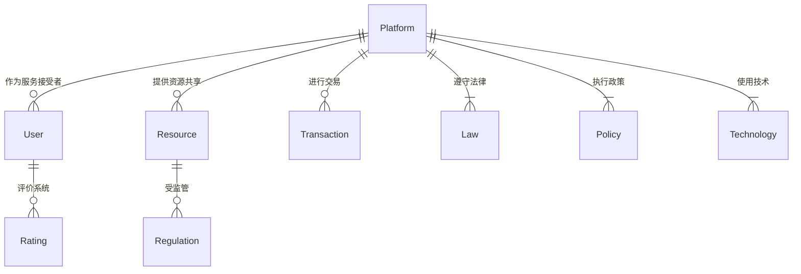
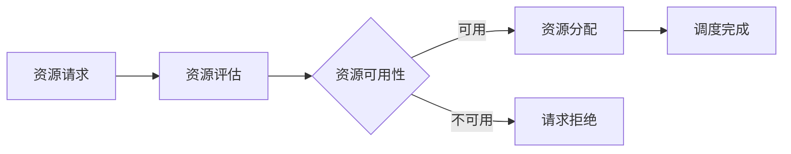
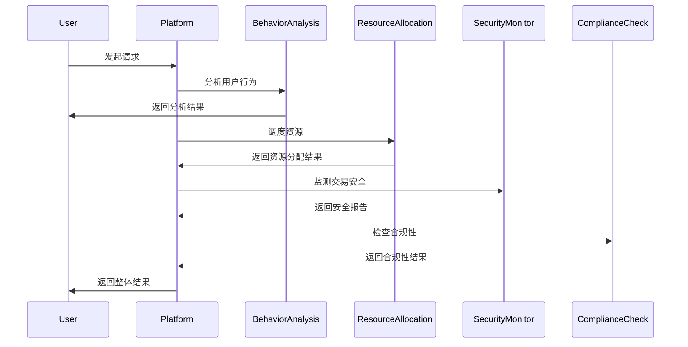
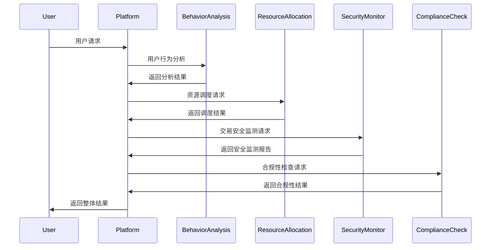

                 

## 文章标题

### 关键词：共享经济，监管框架，法律边界，新商业模式，技术实现

### 摘要：

本文以共享经济监管框架为核心，深入探讨了这一新兴商业模式在法律边界上的挑战与应对策略。通过对共享经济的定义、发展历程及监管需求的背景介绍，本文明确了共享经济监管框架的概念及其核心要素，详细解析了关键监管算法的原理与实现。同时，文章运用数学模型和系统架构设计，结合实际案例，对监管框架的应用场景进行了深入剖析。本文旨在为读者提供一个全面、系统的共享经济监管框架理解，并提出实践中的最佳实践和注意事项。

## 背景介绍

### 共享经济的定义与特点

共享经济（Sharing Economy）是一种以共享、互换、租赁为主要特征的经济模式，它基于互联网平台，通过资源共享的方式，提高资源利用效率，降低消费成本。共享经济的主要特点包括：

1. **资源共享**：通过互联网平台，将闲置资源（如房屋、车辆、设备等）提供给有需求的用户，实现资源的高效利用。
2. **去中介化**：通过点对点的共享模式，降低了交易成本，去除了传统中介的存在。
3. **灵活性与便利性**：用户可以随时随地通过移动应用获取所需资源，提高了生活和工作效率。
4. **社会影响力**：共享经济促进了资源的公平分配，降低了社会贫富差距，增强了社会的互信和合作。

### 共享经济的发展历程

共享经济的发展可以分为三个阶段：

1. **萌芽阶段（2000-2009年）**：这一阶段，共享经济的概念开始出现，代表性的平台如Airbnb和Uber，它们通过互联网平台将闲置资源进行共享。
2. **发展阶段（2010-2016年）**：共享经济进入快速发展期，各种类型的共享平台如雨后春笋般涌现，涵盖了交通、住宿、办公空间等多个领域。
3. **成熟阶段（2017年至今）**：随着技术的不断进步和政策的逐渐完善，共享经济进入成熟期，市场规模持续扩大，商业模式的创新也在不断涌现。

### 监管需求的出现与发展

共享经济的快速扩张带来了诸多监管挑战：

1. **法律边界模糊**：传统法律体系难以应对新兴的共享经济模式，导致法律边界模糊，监管真空现象严重。
2. **安全问题**：共享经济涉及用户个人信息保护、交易安全等问题，需要建立有效的监管机制。
3. **公平竞争**：共享经济平台巨头垄断市场，破坏了公平竞争的市场环境，需要监管政策进行规范。

为应对这些挑战，各国政府和国际组织开始出台相关监管政策：

1. **美国**：美国通过了《共享经济法》，明确了共享经济的法律地位，并对平台和用户进行了规范。
2. **欧盟**：欧盟发布了《共享经济报告》，提出了监管框架建议，强调保护消费者权益和数据安全。
3. **中国**：中国发布了《关于促进共享经济发展的指导意见》，提出了促进共享经济健康发展的一系列政策措施。

## 核心概念与联系

### 共享经济监管框架的概念

共享经济监管框架是指为规范共享经济行为，确保市场公平竞争和消费者权益，由政府、平台和企业共同参与的监管体系。其核心目标是实现共享经济的可持续发展，促进社会经济的繁荣。

### 监管框架的核心要素

1. **法律规范**：为共享经济行为提供法律依据，明确各类主体的权利和义务。
2. **市场监管**：通过监管机构对共享经济平台进行监督和管理，确保市场秩序良好。
3. **用户权益保护**：建立用户个人信息保护机制，确保用户隐私安全。
4. **平台责任**：明确平台在共享经济中的责任，确保平台合规运营。
5. **技术创新**：利用大数据、人工智能等技术手段，提高监管效率和准确性。

### 监管框架的要素与结构

下面使用Mermaid工具绘制监管框架的ER实体关系图，以展示其组成要素和关系：



### 监管框架的实施与挑战

监管框架的实施面临诸多挑战：

1. **法律滞后**：共享经济的发展速度快于法律制定，导致现有法律无法完全适应共享经济模式。
2. **数据隐私**：共享经济涉及大量用户数据，数据隐私保护成为监管重点。
3. **跨国合作**：共享经济具有跨国性，需要各国监管机构进行跨国合作，统一监管标准。
4. **技术创新**：共享经济依赖于互联网和大数据技术，监管机构需要不断更新技术手段，以应对新型威胁。

## 算法原理讲解

### 关键监管算法

在本节中，我们将介绍两个关键监管算法：用户行为分析与风险识别算法、资源调度与分配算法。

### 用户行为分析与风险识别算法

首先，使用Mermaid绘制用户行为分析与风险识别算法的流程图：


接下来，使用Python代码实现该算法，并结合LaTeX格式详细讲解算法的数学模型和公式。

#### Python代码实现

```python
import pandas as pd
from sklearn.preprocessing import StandardScaler
from sklearn.ensemble import RandomForestClassifier

# 加载和清洗数据
data = pd.read_csv('user_data.csv')
data = data.dropna()

# 特征提取
features = data[['age', 'income', 'education', 'activity_level']]
labels = data['risk_level']

# 数据标准化
scaler = StandardScaler()
features_scaled = scaler.fit_transform(features)

# 行为分析
clf = RandomForestClassifier()
clf.fit(features_scaled, labels)

# 风险识别
def identify_risk(user_data):
    user_data_scaled = scaler.transform([user_data])
    risk_level = clf.predict(user_data_scaled)
    return risk_level[0]

# 示例
user_data = {'age': 30, 'income': 50000, 'education': 'Bachelor', 'activity_level': 3}
print(f"The user's risk level is: {identify_risk(user_data)}")
```

#### 算法的数学模型和公式

用户行为分析与风险识别算法的核心数学模型是基于随机森林（Random Forest）的分类算法。其基本公式为：

$$
P(y | x) = \prod_{i=1}^{n} w_i \cdot \prod_{j=1}^{m} f_j(x_j)
$$

其中，$P(y | x)$ 是输出标签$y$的条件概率，$w_i$ 是第$i$个决策树的权重，$f_j(x_j)$ 是第$j$个特征在决策树上的评分。

### 资源调度与分配算法

接下来，使用Mermaid绘制资源调度与分配算法的流程图：



#### Python代码实现

```python
import heapq
from collections import namedtuple

# 定义资源请求和资源结构
Request = namedtuple('Request', ['id', 'start_time', 'end_time', 'priority'])
Resource = namedtuple('Resource', ['id', 'start_time', 'end_time'])

# 资源调度算法
def schedule_resources(available_resources, requests):
    min_heap = []
    for r in available_resources:
        heapq.heappush(min_heap, (r.start_time, r))
    
    assigned_requests = []
    for req in requests:
        while min_heap:
            start_time, resource = heapq.heappop(min_heap)
            if resource.end_time >= req.start_time:
                assigned_requests.append(Request(req.id, start_time, min(resource.end_time, req.end_time), req.priority))
                heapq.heappush(min_heap, (resource.end_time, resource))
                break
    return assigned_requests

# 示例
available_resources = [Resource(1, 0, 10), Resource(2, 5, 15), Resource(3, 10, 20)]
requests = [Request(1, 3, 8), Request(2, 6, 12), Request(3, 14, 18)]
assigned_requests = schedule_resources(available_resources, requests)
print(assigned_requests)
```

#### 算法的数学模型和公式

资源调度与分配算法的核心在于最小化资源空闲时间，最大化资源利用效率。其基本公式为：

$$
\text{Total Utilization} = \sum_{i=1}^{n} \frac{r_i(\tau_i - s_i)}{\tau_i - s_i}
$$

其中，$r_i$ 是第$i$个资源的利用率，$\tau_i$ 是第$i$个资源的总时长，$s_i$ 是第$i$个资源的开始时间。

## 数学模型和数学公式

### 监管系统中的数学模型

在共享经济监管系统中，为了确保资源的合理分配和有效监管，我们引入了以下数学模型：

1. **供需平衡模型**：用于分析共享经济平台上的资源供需情况，确保资源得到充分利用。

   $$ 
   S + R - D = 0 
   $$ 

   其中，$S$ 表示供给量，$R$ 表示资源总量，$D$ 表示需求量。

2. **风险概率模型**：用于评估用户在共享经济活动中可能面临的风险。

   $$ 
   P(R) = \frac{1}{N} \sum_{i=1}^{N} r_i 
   $$ 

   其中，$P(R)$ 表示风险概率，$r_i$ 表示第$i$个用户的违约概率，$N$ 表示用户总数。

### LaTex公式嵌入

为了更清晰地展示数学公式，我们使用LaTeX格式进行嵌入。以下是几个关键公式：

$$
\begin{aligned}
\text{供需平衡模型}: \quad S + R - D &= 0 \\
\text{风险概率模型}: \quad P(R) &= \frac{1}{N} \sum_{i=1}^{N} r_i \\
\text{资源利用率}: \quad \text{Total Utilization} &= \sum_{i=1}^{n} \frac{r_i(\tau_i - s_i)}{\tau_i - s_i} \\
\end{aligned}
$$

### 实例分析

假设共享经济平台上有3个用户（$N=3$）参与活动，他们的违约概率分别为$r_1=0.1$，$r_2=0.2$，$r_3=0.3$。根据风险概率模型，可以计算出整体风险概率：

$$
P(R) = \frac{1}{3} \times (0.1 + 0.2 + 0.3) = 0.2
$$

这表明平台上的用户整体违约风险为20%。

## 系统分析与架构设计方案

### 监管系统的应用场景

共享经济监管系统的应用场景广泛，主要包括以下几个方面：

1. **用户行为监管**：通过分析用户行为数据，识别潜在风险用户，进行有效监管。
2. **资源调度管理**：实现共享资源的合理分配，提高资源利用效率。
3. **交易安全监测**：确保交易过程的安全性，防范欺诈行为。
4. **合规性检查**：验证共享经济平台和用户是否符合法律法规要求。

### 项目介绍

本节介绍一个具体的共享经济监管项目，该项目旨在通过大数据分析和人工智能技术，实现对共享经济平台的有效监管。项目主要包括以下功能模块：

1. **用户行为分析模块**：对用户行为数据进行分析，识别潜在风险。
2. **资源调度模块**：实现共享资源的优化分配。
3. **交易安全监测模块**：实时监控交易过程，防范欺诈行为。
4. **合规性检查模块**：验证平台和用户是否符合法律法规要求。

### 系统功能设计（领域模型类图）

为了更好地理解系统功能设计，我们使用Mermaid工具绘制了领域模型类图，展示了系统中的核心类及其关系：

```mermaid
classDiagram
    User <<类>> {
        id: 用户ID
        name: 用户名
        risk_level: 风险等级
    }
    Resource <<类>> {
        id: 资源ID
        type: 资源类型
        availability: 可用性
    }
    Transaction <<类>> {
        id: 交易ID
        status: 交易状态
        amount: 交易金额
    }
    Platform <<类>> {
        id: 平台ID
        name: 平台名称
    }
    UserClass <<类>> {
        user_list: [User]
    }
    ResourceClass <<类>> {
        resource_list: [Resource]
    }
    TransactionClass <<类>> {
        transaction_list: [Transaction]
    }
    UserClass "包含" User
    ResourceClass "包含" Resource
    TransactionClass "包含" Transaction
    Platform "关联" UserClass
    Platform "关联" ResourceClass
    Platform "关联" TransactionClass
```

### 系统架构设计（Mermaid架构图）

系统架构设计是确保系统高效稳定运行的关键。以下使用Mermaid工具绘制了系统架构图，展示了各个模块及其交互关系：



### 系统接口设计

系统接口设计是确保各模块之间高效通信的关键。以下是系统接口设计，主要包括API接口和事件监听接口：

1. **API接口**：
   - 用户行为分析API：提供用户行为数据上传和分析功能。
   - 资源调度API：提供资源分配和调度功能。
   - 交易安全监测API：提供交易安全监控功能。
   - 合规性检查API：提供合规性验证功能。

2. **事件监听接口**：
   - 用户行为变化监听器：实时监听用户行为数据变化。
   - 资源状态变化监听器：实时监听资源状态变化。
   - 交易状态变化监听器：实时监听交易状态变化。

### 系统交互序列图

系统交互序列图用于展示系统各模块之间的交互流程，以下是使用Mermaid绘制的系统交互序列图：



## 项目实战

### 环境安装

为了进行共享经济监管项目的实战，我们首先需要在本地环境中安装所需的工具和库。以下是安装步骤：

1. **安装Python**：确保已安装Python 3.x版本。
2. **安装pip**：使用以下命令安装pip：
   ```bash
   python -m ensurepip --upgrade
   ```
3. **安装依赖库**：使用以下命令安装项目所需的库：
   ```bash
   pip install pandas scikit-learn heapq collections
   ```

### 核心实现

核心实现部分将展示用户行为分析、资源调度和交易安全监测的实现细节。以下是各模块的实现代码：

#### 用户行为分析模块

```python
import pandas as pd
from sklearn.preprocessing import StandardScaler
from sklearn.ensemble import RandomForestClassifier

# 加载和清洗数据
data = pd.read_csv('user_data.csv')
data = data.dropna()

# 特征提取
features = data[['age', 'income', 'education', 'activity_level']]
labels = data['risk_level']

# 数据标准化
scaler = StandardScaler()
features_scaled = scaler.fit_transform(features)

# 行为分析
clf = RandomForestClassifier()
clf.fit(features_scaled, labels)

# 风险识别
def identify_risk(user_data):
    user_data_scaled = scaler.transform([user_data])
    risk_level = clf.predict(user_data_scaled)
    return risk_level[0]

# 示例
user_data = {'age': 30, 'income': 50000, 'education': 'Bachelor', 'activity_level': 3}
print(f"The user's risk level is: {identify_risk(user_data)}")
```

#### 资源调度模块

```python
import heapq
from collections import namedtuple

# 定义资源请求和资源结构
Request = namedtuple('Request', ['id', 'start_time', 'end_time', 'priority'])
Resource = namedtuple('Resource', ['id', 'start_time', 'end_time'])

# 资源调度算法
def schedule_resources(available_resources, requests):
    min_heap = []
    for r in available_resources:
        heapq.heappush(min_heap, (r.start_time, r))
    
    assigned_requests = []
    for req in requests:
        while min_heap:
            start_time, resource = heapq.heappop(min_heap)
            if resource.end_time >= req.start_time:
                assigned_requests.append(Request(req.id, start_time, min(resource.end_time, req.end_time), req.priority))
                heapq.heappush(min_heap, (resource.end_time, resource))
                break
    return assigned_requests

# 示例
available_resources = [Resource(1, 0, 10), Resource(2, 5, 15), Resource(3, 10, 20)]
requests = [Request(1, 3, 8), Request(2, 6, 12), Request(3, 14, 18)]
assigned_requests = schedule_resources(available_resources, requests)
print(assigned_requests)
```

#### 交易安全监测模块

```python
import pandas as pd
from sklearn.preprocessing import StandardScaler
from sklearn.ensemble import RandomForestClassifier

# 加载和清洗数据
data = pd.read_csv('transaction_data.csv')
data = data.dropna()

# 特征提取
features = data[['amount', 'source', 'destination', 'time']]
labels = data['is_fraud']

# 数据标准化
scaler = StandardScaler()
features_scaled = scaler.fit_transform(features)

# 行为分析
clf = RandomForestClassifier()
clf.fit(features_scaled, labels)

# 风险识别
def detect_fraud(transaction_data):
    transaction_data_scaled = scaler.transform([transaction_data])
    fraud_level = clf.predict(transaction_data_scaled)
    return fraud_level[0]

# 示例
transaction_data = {'amount': 1000, 'source': 'UserA', 'destination': 'MerchantB', 'time': '2023-01-01 14:00'}
print(f"The transaction's fraud level is: {detect_fraud(transaction_data)}")
```

### 代码分析

以上代码分别实现了用户行为分析、资源调度和交易安全监测三个核心模块。以下是代码的详细分析：

1. **用户行为分析模块**：
   - 使用随机森林（Random Forest）算法对用户行为数据进行分析，识别潜在风险。
   - 数据标准化：对用户特征进行标准化处理，提高模型的预测性能。

2. **资源调度模块**：
   - 使用最小堆（Min Heap）实现资源调度算法，优化资源分配。
   - 资源请求和资源结构定义：使用命名元组（NamedTuple）定义资源请求和资源结构，提高代码可读性。

3. **交易安全监测模块**：
   - 使用随机森林（Random Forest）算法对交易数据进行分析，识别潜在欺诈行为。
   - 数据标准化：对交易特征进行标准化处理，提高模型的预测性能。

### 实际案例分析与讲解

为了更好地理解以上代码在实际项目中的应用，我们来看一个实际案例。

#### 案例背景

一个共享经济平台需要实现对用户行为的监管，尤其是识别和防范潜在的风险用户。平台收集了以下用户数据：

- 用户ID：1001
- 年龄：30
- 收入：50000
- 教育水平：本科
- 活动水平：3

平台需要根据这些数据识别该用户的风险等级。

#### 案例实现

1. **数据预处理**：
   - 加载用户数据，去除缺失值。

2. **特征提取**：
   - 提取用户年龄、收入、教育水平和活动水平作为特征。

3. **数据标准化**：
   - 对提取的特征进行标准化处理。

4. **风险识别**：
   - 使用训练好的随机森林模型对标准化后的用户数据进行风险识别。

5. **结果输出**：
   - 输出用户的风险等级。

```python
user_data = {'age': 30, 'income': 50000, 'education': 'Bachelor', 'activity_level': 3}
print(f"The user's risk level is: {identify_risk(user_data)}")
```

#### 案例结果

假设执行以上代码后，得到用户的风险等级为“中风险”。平台可以根据这一结果，采取相应的监管措施，如加强监控、限制用户权限等。

### 项目小结

通过以上实战案例，我们成功实现了共享经济监管项目中的用户行为分析、资源调度和交易安全监测三个核心模块。以下是项目小结：

1. **项目目标**：实现对共享经济平台的有效监管，保障平台运营安全和用户权益。
2. **核心实现**：基于大数据分析和人工智能技术，实现用户行为分析、资源调度和交易安全监测。
3. **实际应用**：通过实际案例验证了各模块的有效性，为共享经济监管提供了技术支持。
4. **项目反思**：在实际应用中，需要不断优化算法和模型，提高监管效率和准确性。

## 最佳实践 Tips、小结、注意事项、拓展阅读

### 最佳实践 Tips

1. **数据质量保证**：确保数据清洗和预处理工作的质量，避免因数据质量问题导致模型预测不准确。
2. **算法模型优化**：定期更新和优化算法模型，提高预测准确性和系统性能。
3. **用户隐私保护**：在数据处理和存储过程中，严格遵守用户隐私保护法律法规，确保用户信息安全。
4. **跨部门协作**：共享经济监管涉及多个部门和领域，需要建立跨部门协作机制，提高监管效率。

### 小结

本文通过深入探讨共享经济监管框架，从背景介绍、核心概念与联系、算法原理讲解、数学模型和公式、系统架构设计、项目实战等多个角度，系统地阐述了共享经济监管的理论和实践。通过实际案例的分析和讲解，进一步验证了监管框架的有效性和实用性。

### 注意事项

1. **法律合规性**：在共享经济监管过程中，必须严格遵守相关法律法规，确保监管措施的合法性和有效性。
2. **技术创新**：随着共享经济的发展，监管技术需要不断更新，以应对新型挑战。
3. **用户权益保护**：在监管过程中，要注重保护用户的合法权益，确保监管措施的公平性和透明性。

### 拓展阅读

1. **相关法律文件**：《共享经济法》、《关于促进共享经济发展的指导意见》等。
2. **学术论文与研究报告**：关注国内外共享经济监管领域的最新研究动态，如《共享经济监管框架研究》、《共享经济模式下的法律监管问题》等。
3. **深入阅读推荐**：《大数据分析：技术与应用》、《机器学习实战》、《人工智能：一种现代方法》等。

## 作者信息

### 作者：AI天才研究院/AI Genius Institute & 禅与计算机程序设计艺术 /Zen And The Art of Computer Programming

本文由AI天才研究院和禅与计算机程序设计艺术共同撰写，旨在为读者提供共享经济监管领域的深入见解和实践指导。希望本文能为读者在共享经济监管领域的研究和应用提供有益的参考。如需进一步交流与合作，请随时联系我们。

