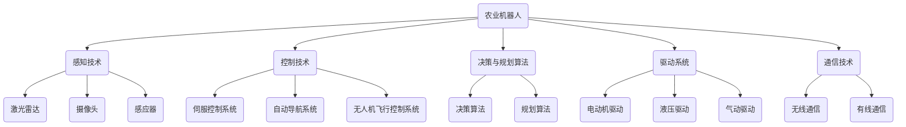
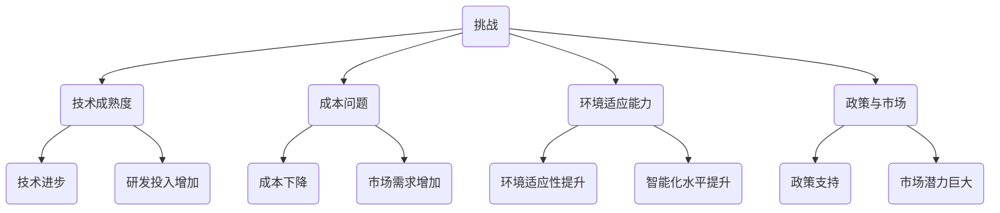
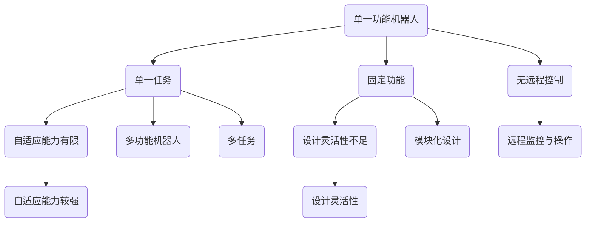

                 

### 文章标题：农业机器人：多功能机器人在可持续农业中的应用

**关键词：农业机器人、多功能机器人、可持续农业、技术原理、应用前景**

**摘要：**
本文从农业机器人概述出发，深入探讨其在可持续农业中的重要性、面临的挑战与机遇。通过分析农业机器人的核心技术与原理，详细介绍多功能机器人的定义、特点、优势及应用前景。随后，本文针对不同应用场景，逐一介绍土地平整机器人、播种机器人、收割机器人、施肥机器人、病虫害监测与防治机器人以及水资源管理机器人的功能、技术实现和农业应用案例。最后，本文探讨农业机器人与可持续农业的融合，分析其对可持续农业的促进作用以及面临的挑战与机遇。

### 目录大纲

1. **农业机器人概述**
    1.1 引言
    1.2 农业机器人在可持续农业中的重要性
    1.3 农业机器人面临的挑战与机遇
    1.4 多功能机器人的概念与特点
    1.5 本书结构与内容安排
    1.6 本章小结

2. **农业机器人核心技术与原理**
    2.1 农业机器人感知技术
    2.2 农业机器人控制技术
    2.3 农业机器人决策与规划算法
    2.4 农业机器人驱动系统
    2.5 农业机器人通信技术
    2.6 本章小结

3. **多功能农业机器人在不同应用场景中的实现**
    3.1 土地平整机器人
    3.2 播种机器人
    3.3 收割机器人
    3.4 施肥机器人
    3.5 病虫害监测与防治机器人
    3.6 水资源管理机器人
    3.7 本章小结

4. **可持续农业与农业机器人**
    4.1 可持续农业的概念与目标
    4.2 农业机器人与可持续农业的融合
    4.3 本章小结

### 1.1 引言

**背景介绍**

农业是国民经济的基础产业，然而，传统的农业模式面临着资源紧张、环境污染、劳动力不足等问题。随着科技的不断发展，农业机器人作为一种新兴技术，逐渐成为解决农业难题的重要手段。农业机器人是指应用于农业生产、加工、储运等环节的自动化设备，其通过感知、控制、决策和驱动等技术实现农业生产的自动化和智能化。

**问题背景**

随着全球人口的持续增长和可耕地的减少，如何提高农业生产的效率、降低生产成本、保护环境成为当前农业发展的重要问题。传统的农业方法已经无法满足现代农业的需求，因此，研发和应用农业机器人成为农业发展的必然趋势。

**问题描述**

农业机器人作为农业现代化的关键推动力，其在可持续农业中的应用具有重要意义。然而，农业机器人目前还面临着技术不成熟、成本高昂、应用场景单一等问题。如何解决这些问题，充分发挥农业机器人在可持续农业中的作用，成为当前研究的热点。

**问题解决**

为了解决上述问题，本文将从以下几个方面展开讨论：

1. 对农业机器人进行概述，介绍其在可持续农业中的重要性。
2. 分析农业机器人的核心技术与原理，包括感知技术、控制技术、决策与规划算法、驱动系统和通信技术。
3. 详细探讨多功能农业机器人在不同应用场景中的实现，包括土地平整机器人、播种机器人、收割机器人、施肥机器人、病虫害监测与防治机器人和水资源管理机器人。
4. 探讨农业机器人与可持续农业的融合，分析其对可持续农业的促进作用以及面临的挑战与机遇。

**边界与外延**

本文主要讨论农业机器人在可持续农业中的应用，涉及的技术包括感知、控制、决策、驱动和通信等。同时，本文还将探讨农业机器人与可持续农业的融合，以及其在农业生产中的应用案例。

**概念结构与核心要素组成**

农业机器人的概念结构主要包括以下几个方面：

1. **农业机器人**：指应用于农业生产、加工、储运等环节的自动化设备。
2. **感知技术**：农业机器人通过感知技术获取环境信息，包括激光雷达、摄像头和感应器等。
3. **控制技术**：农业机器人通过控制技术实现自主运行，包括伺服控制系统、自动导航系统和无人机飞行控制系统等。
4. **决策与规划算法**：农业机器人通过决策与规划算法实现智能决策，包括决策算法和规划算法。
5. **驱动系统**：农业机器人通过驱动系统实现运动和操作，包括电动机驱动、液压驱动和气动驱动等。
6. **通信技术**：农业机器人通过通信技术实现信息传输和远程控制，包括无线通信和有线通信等。

### 1.2 农业机器人在可持续农业中的重要性

**核心概念原理**

可持续农业是指一种兼顾经济、社会和环境效益的农业生产模式，其目标是实现农业的长期可持续发展。农业机器人作为一种高科技设备，在可持续农业中发挥着重要作用。首先，农业机器人可以提高农业生产的效率，减少人力成本。其次，农业机器人可以实现农业生产的自动化和智能化，降低资源消耗和环境污染。此外，农业机器人还可以为农民提供技术支持和培训，提高农民的农业生产技能。

**概念属性特征对比表格**

| 概念属性       | 传统农业       | 可持续农业       | 农业机器人           |
| -------------- | -------------- | -------------- | ------------------- |
| 生产方式       | 人力为主       | 机械化和信息化为主 | 自动化和智能化为主   |
| 资源消耗       | 高资源消耗     | 低资源消耗       | 高资源利用率         |
| 环境影响       | 高污染、高能耗  | 低污染、低能耗    | 减少对环境的影响     |
| 劳动力需求     | 高劳动力需求    | 低劳动力需求      | 减少人力依赖         |

**ER实体关系图架构**

### 1.3 农业机器人面临的挑战与机遇

**核心概念原理**

尽管农业机器人在可持续农业中具有巨大的潜力，但其在实际应用过程中仍面临着一系列挑战。首先，农业机器人技术尚不成熟，许多核心技术的稳定性和可靠性有待提高。其次，农业机器人的成本较高，限制了其大规模推广和应用。此外，农业机器人在复杂环境下的适应性和智能水平还有待提升。然而，随着科技的不断进步和农业需求的增加，农业机器人也面临着广阔的发展机遇。政府政策的支持、资本投入的增加以及市场需求的变化，都将为农业机器人的发展提供有力保障。

**概念属性特征对比表格**

| 挑战属性       | 障碍               | 机遇                 |
| -------------- | ------------------ | -------------------- |
| 技术成熟度     | 技术不成熟，可靠性低 | 技术进步，研发投入增加 |
| 成本问题       | 成本高昂，推广受限 | 成本下降，市场需求增加 |
| 环境适应能力   | 环境适应性差       | 环境适应性提高，智能化水平提升 |
| 政策与市场     | 缺乏政策支持，市场接受度低 | 政策支持，市场潜力巨大 |

**ER实体关系图架构**

### 1.4 多功能机器人的概念与特点

**核心概念原理**

多功能机器人是指具备多种功能和任务的机器人系统，能够在不同的应用场景中灵活切换和执行任务。相比于单一功能的机器人，多功能机器人具有更高的灵活性和适应性，能够满足多样化的农业生产需求。多功能机器人通常具备以下特点：

1. **多任务能力**：能够同时执行多种任务，如耕种、播种、收割、施肥等。
2. **模块化设计**：各个模块可以独立工作，也可以协同工作，实现任务的自动化和智能化。
3. **自适应能力**：能够根据环境变化和任务需求，自动调整自身的工作方式和策略。
4. **远程控制**：可以通过无线通信实现远程监控和操作，提高生产效率和安全性。

**概念属性特征对比表格**

| 特点             | 单一功能机器人   | 多功能机器人   |
| ---------------- | ---------------- | -------------- |
| 功能多样性       | 单一任务        | 多任务        |
| 设计灵活性       | 固定功能        | 模块化设计    |
| 自适应能力       | 适应能力有限     | 自适应能力较强 |
| 远程控制能力     | 无远程控制      | 远程监控与操作 |

**ER实体关系图架构**

### 1.5 本书结构与内容安排

**书籍结构概述**

本书共分为四个部分，首先对农业机器人进行概述，介绍其在可持续农业中的重要性；接着深入分析农业机器人的核心技术与原理，包括感知、控制、决策与规划算法、驱动系统和通信技术；然后详细探讨多功能农业机器人在不同应用场景中的实现，如土地平整机器人、播种机器人、收割机器人、施肥机器人、病虫害监测与防治机器人和水资源管理机器人；最后探讨农业机器人与可持续农业的融合，分析其对可持续农业的促进作用以及面临的挑战与机遇。

**每章节内容概述**

- **第一部分：农业机器人概述**  
  1.1 引言  
  1.2 农业机器人在可持续农业中的重要性  
  1.3 农业机器人面临的挑战与机遇

- **第二部分：农业机器人核心技术与原理**  
  2.1 农业机器人感知技术  
  2.2 农业机器人控制技术  
  2.3 农业机器人决策与规划算法  
  2.4 农业机器人驱动系统  
  2.5 农业机器人通信技术

- **第三部分：多功能农业机器人在不同应用场景中的实现**  
  3.1 土地平整机器人  
  3.2 播种机器人  
  3.3 收割机器人  
  3.4 施肥机器人  
  3.5 病虫害监测与防治机器人  
  3.6 水资源管理机器人

- **第四部分：可持续农业与农业机器人**  
  4.1 可持续农业的概念与目标  
  4.2 农业机器人与可持续农业的融合  
  4.3 本章小结

### 1.6 本章小结

本章对农业机器人进行了概述，介绍了其在可持续农业中的重要性、面临的挑战与机遇，以及多功能机器人的概念与特点。通过本章的介绍，读者可以对农业机器人有一个全面的了解，为后续章节的学习打下基础。在接下来的章节中，我们将深入探讨农业机器人的核心技术与原理，以及在不同应用场景中的实现。希望通过本文的阐述，能够激发读者对农业机器人与可持续农业结合的思考，为未来农业的发展提供新思路。

### 2.1 农业机器人感知技术

**感知技术的重要性**

农业机器人要实现自主作业，首先需要对其作业环境进行准确的感知。感知技术是农业机器人实现自动化和智能化的关键环节，它通过获取环境信息，为机器人提供决策依据。感知技术主要包括激光雷达、摄像头和感应器等，这些设备可以实时获取土壤、植物、地形等信息，帮助农业机器人识别和判断环境状态。

**感知技术种类**

1. **激光雷达（LiDAR）**：
   激光雷达是一种利用激光束测量距离的设备，它可以通过发射激光脉冲并测量其反射时间来获取目标物体的距离和形状信息。激光雷达具有高精度、高分辨率和快速响应等特点，广泛应用于地形测绘、植物高度测量和土壤湿度检测等领域。

2. **摄像头**：
   摄像头是农业机器人中最常用的感知设备之一，它可以捕捉图像和视频，通过图像处理技术提取出物体和场景信息。摄像头可以用于作物长势监测、病虫害识别和作物分类等任务。

3. **感应器**：
   感应器包括温度传感器、湿度传感器、压力传感器和化学传感器等，它们可以测量和感知环境中的各种物理和化学参数。感应器在土壤监测、气象数据和作物生长参数监测中发挥着重要作用。

**感知技术在农业机器人中的应用**

1. **地形测绘与土地平整**：
   激光雷达可用于地形测绘，获取土地的三维数据，为土地平整机器人的作业提供精确的地图信息。通过分析地形数据，机器人可以自动调整工作模式，确保土地平整度。

2. **作物监测与病虫害识别**：
   摄像头和感应器可以帮助农业机器人实时监测作物生长状态，识别病虫害。通过对图像和传感数据的分析，机器人可以及时采取防治措施，提高农作物的产量和质量。

3. **自动导航**：
   激光雷达和摄像头可以用于农业机器人的自动导航，通过实时感知环境，机器人可以避开障碍物，规划最优路径，实现自主作业。

**案例：无人机土壤监测**

无人机土壤监测是一种新兴的农业技术应用，它利用搭载多种传感器的无人机对农田进行全方位、多层次的土壤监测。以下是一个具体案例：

- **无人机配置**：无人机搭载高精度GPS系统、激光雷达、多光谱相机和土壤传感器。
- **工作流程**：无人机在农田上方飞行，实时采集土壤数据，并通过GPS定位系统确定数据采集位置。
- **数据处理**：无人机采集的数据传输到地面站进行处理，通过激光雷达获取土壤高度和湿度信息，多光谱相机分析土壤营养成分，土壤传感器测量土壤温度和酸碱度。
- **应用效果**：通过综合分析土壤数据，农业机器人可以制定科学的灌溉和施肥计划，提高水资源和肥料的利用效率，减少生产成本和环境污染。

**感知技术在农业机器人中的应用前景**

随着传感器技术、图像处理技术和人工智能算法的不断进步，感知技术在农业机器人中的应用前景十分广阔。未来，农业机器人将具备更高的感知能力和智能化水平，能够更加精准地监测和响应农田环境变化，实现农业生产的自动化和智能化。同时，随着感知技术的成本降低，农业机器人将逐渐普及，为农业现代化提供强有力的技术支撑。

### 2.2 农业机器人控制技术

**控制技术的基本原理**

控制技术是农业机器人实现自主作业的核心技术之一，它通过控制机器人各个部件的运动和操作，确保机器人按照预定的路径和程序执行任务。控制技术的基本原理主要包括以下几个方面：

1. **闭环控制系统**：闭环控制系统是一种通过实时反馈和调整实现精确控制的系统。它通过传感器获取环境信息，将实际状态与预期状态进行比较，通过控制器调整机器人的动作，使机器人始终保持在预期路径上。

2. **PID控制算法**：PID控制算法是一种常用的闭环控制算法，它通过比例（P）、积分（I）和微分（D）三个部分调整控制器的输出，实现对系统误差的快速响应和精确控制。

3. **智能控制算法**：智能控制算法是利用人工智能技术，如机器学习、神经网络等，实现机器人自主学习和自适应控制的方法。智能控制算法能够根据环境变化和任务需求，自动调整控制策略，提高控制效果。

**控制技术在农业机器人中的应用**

1. **伺服控制系统**：
   伺服控制系统用于控制机器人的执行机构，如电动机、液压缸和气动缸等。通过伺服控制系统，机器人可以精确定位和运动，实现各种复杂的作业任务。例如，在播种机器人中，伺服控制系统可以精确控制播种机的开合和位置，确保播种均匀。

2. **自动导航系统**：
   自动导航系统用于农业机器人的路径规划与导航，使机器人能够自主行驶和避障。自动导航系统通常结合GPS、激光雷达、摄像头等多源感知设备，实现机器人在复杂环境下的自主导航。例如，在收割机器人中，自动导航系统可以确保机器人沿着预定路径行驶，避开障碍物，提高收割效率。

3. **无人机飞行控制系统**：
   无人机飞行控制系统用于控制农业无人机的飞行，实现无人机在农田上方的自主飞行和任务执行。无人机飞行控制系统通常包括姿态控制、速度控制和路径规划等模块。通过飞行控制系统，无人机可以自动调整飞行姿态，保持稳定飞行，并根据任务需求进行路径规划。

**案例：自动导航收割机器人**

一个典型的案例是自动导航收割机器人。以下是其控制技术应用的详细说明：

- **系统组成**：自动导航收割机器人由多个模块组成，包括伺服控制系统、GPS导航系统、激光雷达、摄像头、驱动系统和电池系统。
- **控制流程**：
  1. 机器人启动后，通过GPS系统获取当前位置信息。
  2. 激光雷达和摄像头实时感知周围环境，将环境信息传输给导航控制器。
  3. 导航控制器结合GPS数据和感知数据，生成最优路径规划，并调整机器人的姿态和速度，确保机器人沿着预定路径行驶。
  4. 伺服控制系统根据导航控制器的指令，精确控制机器人的执行机构，实现收割作业。
- **应用效果**：通过自动导航控制系统，收割机器人可以高效、准确地完成收割任务，提高收割效率和产量，降低劳动成本。

**控制技术在农业机器人中的应用前景**

随着控制技术的发展，农业机器人将具备更高的自主性和智能化水平。未来，控制技术将更多地融合人工智能和机器学习算法，使机器人能够更加智能地应对复杂环境变化，实现更高效、更精确的作业。同时，随着硬件设备的性能提升和成本的降低，控制技术将在农业机器人中得到更广泛的应用，为农业现代化提供强有力的技术支持。

### 2.3 农业机器人决策与规划算法

**决策算法的基本原理**

决策算法是农业机器人实现智能决策的核心技术，它通过分析环境数据和历史信息，为机器人选择最佳行动方案。决策算法的基本原理主要包括以下几个方面：

1. **规则基决策**：规则基决策通过预设的规则库，根据当前环境数据和规则进行匹配，选择合适的行动方案。这种方法简单直观，但依赖于规则库的完整性和准确性。

2. **模型预测决策**：模型预测决策通过建立环境模型，对未来的环境变化进行预测，并根据预测结果选择最优行动方案。这种方法需要对环境有较深的理解，适用于动态变化的环境。

3. **机器学习决策**：机器学习决策利用机器学习算法，通过历史数据训练模型，实现机器人的自主学习和决策。这种方法具有较高的灵活性和适应性，适用于复杂和动态的环境。

**规划算法的基本原理**

规划算法是农业机器人实现路径规划和任务分配的核心技术，它通过分析当前状态和目标状态，生成从当前状态到目标状态的行动序列。规划算法的基本原理主要包括以下几个方面：

1. **启发式搜索**：启发式搜索通过评估函数评估当前状态和候选状态，选择最优的候选状态进行扩展。这种方法适用于问题规模较小、评估函数准确的情况。

2. **最优化算法**：最优化算法通过建立目标函数，搜索最优解。常用的最优化算法包括线性规划、整数规划和动态规划等。这种方法适用于问题规模较大、目标函数明确的情况。

3. **混合算法**：混合算法结合启发式搜索和最优化算法，通过多个步骤逐步优化解的可行性。这种方法适用于问题规模较大、评估函数复杂的情况。

**决策与规划算法在农业机器人中的应用**

1. **路径规划**：
   决策与规划算法在农业机器人的路径规划中起着关键作用。农业机器人需要根据农田的地形、障碍物和作业要求，规划出最优的行驶路径。常用的路径规划算法包括A*算法、Dijkstra算法和RRT（快速随机树）算法等。例如，A*算法通过评估函数引导机器人避开障碍物，选择最短的路径。

2. **任务分配**：
   决策与规划算法可以帮助农业机器人实现任务的自动分配。在多机器人系统中，决策算法可以根据各机器人的状态、能力和任务需求，合理分配作业任务，提高整体作业效率。例如，在收割作业中，决策算法可以根据农田的地块分布和作物成熟度，分配给每个机器人最优的收割区域。

3. **环境感知与响应**：
   决策与规划算法结合感知技术，使农业机器人能够实时感知环境变化，并做出相应的决策。例如，在病虫害监测中，决策算法可以根据实时感知的数据，判断病虫害的严重程度，并制定相应的防治策略。

**案例：智能灌溉机器人**

智能灌溉机器人是决策与规划算法在农业机器人中应用的典型例子。以下是其决策与规划算法的详细说明：

- **系统组成**：智能灌溉机器人由感知模块、决策模块和执行模块组成。感知模块包括土壤湿度传感器、气象传感器等；决策模块包括计算机处理单元和决策算法；执行模块包括灌溉系统和水泵。
- **工作流程**：
  1. 感知模块实时采集土壤湿度、气象等环境数据。
  2. 计算机处理单元利用机器学习算法分析历史数据和实时数据，预测土壤湿度变化趋势。
  3. 决策算法根据预测结果和作物生长需求，确定灌溉方案。
  4. 执行模块根据决策结果，自动开启或关闭灌溉系统，进行精准灌溉。
- **应用效果**：通过智能灌溉机器人，可以实时监测农田土壤湿度，精准控制灌溉量，提高水资源利用效率，减少水资源浪费。

**决策与规划算法在农业机器人中的应用前景**

随着人工智能技术的不断发展，决策与规划算法在农业机器人中的应用前景十分广阔。未来，决策与规划算法将更加智能化和自适应，能够更好地应对复杂和多变的农业环境。同时，随着硬件设备的性能提升和数据处理能力的增强，决策与规划算法将能够在更大规模和更复杂的环境中发挥重要作用，推动农业机器人的广泛应用和农业生产的智能化升级。

### 2.4 农业机器人驱动系统

**驱动系统的组成**

驱动系统是农业机器人实现运动和操作的核心部分，它由多个组件组成，包括电动机、液压缸、气动缸和减速器等。这些组件协同工作，为农业机器人提供所需的动力和操作能力。

1. **电动机**：电动机是驱动系统的核心组件，用于将电能转换为机械能。根据用途的不同，农业机器人可以配备直流电动机、交流电动机和伺服电动机等。电动机具有体积小、重量轻、效率高和调速范围广等优点。

2. **液压缸**：液压缸通过液体压力实现机械运动，广泛应用于农业机器人的起重、推举和挤压等操作。液压缸具有高输出力、快速响应和能够实现大范围运动等优点。

3. **气动缸**：气动缸通过压缩空气实现机械运动，常用于农业机器人的轻量级操作。气动缸具有成本低、响应速度快和易于维护等优点。

4. **减速器**：减速器用于降低电动机的转速，同时增加输出扭矩，以满足农业机器人对大扭矩、低速运动的需求。减速器类型包括齿轮减速器、蜗杆减速器和丝杆减速器等。

**驱动技术在农业机器人中的应用**

1. **电动机驱动**：
   电动机驱动广泛应用于农业机器人的轮式移动、执行机构控制和播种、施肥等精细操作。例如，播种机器人通过电动机驱动开合机构和播种盘，实现播种作业。电动机驱动具有控制精度高、响应速度快和能耗低等优点。

2. **液压驱动**：
   液压驱动主要用于农业机器人的大扭矩操作，如深施肥、挖掘和秸秆还田等。例如，深施肥机器人通过液压驱动实现深施肥作业，确保肥料均匀施入土壤。液压驱动具有输出力大、响应速度快和运动平稳等优点。

3. **气动驱动**：
   气动驱动主要用于农业机器人的轻量级操作，如病虫害防治机器人的喷洒和采摘机器人的抓取等。例如，病虫害防治机器人通过气动驱动实现农药喷洒，确保农药均匀覆盖作物表面。气动驱动具有成本低、响应速度快和易于维护等优点。

**案例：自动播种机器人**

自动播种机器人是驱动技术在农业机器人中应用的典型例子。以下是其驱动系统的详细说明：

- **系统组成**：自动播种机器人由电动机驱动系统、液压驱动系统和控制系统组成。电动机驱动系统负责轮式移动和开合机构控制；液压驱动系统负责深施肥作业；控制系统负责整体协调和控制。
- **工作流程**：
  1. 机器人启动后，电动机驱动系统使其移动到播种位置。
  2. 控制系统根据土壤检测结果，确定播种深度和肥料用量。
  3. 液压驱动系统根据控制指令，调整深施肥机构和播种盘，实现精确播种。
  4. 电动机驱动系统继续移动机器人，进行下一处播种作业。
- **应用效果**：通过自动播种机器人，可以大幅提高播种效率和均匀性，降低劳动成本，提高作物产量和质量。

**驱动技术在农业机器人中的应用前景**

随着驱动技术的不断发展，农业机器人将具备更高的动力性能和控制精度。未来，电动机驱动、液压驱动和气动驱动技术将更加成熟和高效，应用于农业机器人的各种操作任务。同时，随着新材料和新工艺的应用，驱动系统的体积、重量和能耗将进一步降低，推动农业机器人向更广泛和更复杂的领域发展。驱动技术的进步将有力推动农业现代化的进程，为农民提供更加便捷和高效的农业生产工具。

### 2.5 农业机器人通信技术

**通信技术的基本原理**

通信技术是农业机器人实现信息传输和远程控制的基础，它通过无线或有线方式，将机器人内部和外部的信息进行传递。通信技术的基本原理主要包括以下几个方面：

1. **无线通信**：无线通信通过无线电波实现信息的传输，具有灵活性高、覆盖范围广等优点。常见的无线通信技术包括Wi-Fi、蓝牙、ZigBee和5G等。

2. **有线通信**：有线通信通过电缆或光纤实现信息的传输，具有传输速率高、稳定性好等优点。常见的有线通信技术包括以太网、光纤通信和USB等。

3. **数据编码与调制**：数据编码与调制是将数字信号转换为适合通信信道传输的形式。常见的编码方式有曼彻斯特编码、差分曼彻斯特编码和4B/5B编码等；调制方式有幅度调制、频率调制和相位调制等。

**通信技术在农业机器人中的应用**

1. **远程监控**：
   通信技术使农业机器人可以实现远程监控，管理人员可以通过无线通信模块实时查看机器人的运行状态和环境数据。例如，通过Wi-Fi或5G网络，管理人员可以远程监控收割机器人的作业进度、位置信息和故障报警。

2. **远程控制**：
   通信技术使农业机器人可以实现远程控制，管理人员可以通过无线通信模块远程发送控制指令，调整机器人的工作模式和参数。例如，通过蓝牙或ZigBee网络，管理人员可以远程启动或停止施肥机器人，调整其喷洒速率和施肥量。

3. **数据传输**：
   通信技术使农业机器人可以实现数据的远程传输，将采集到的环境数据、作业数据和生产数据上传至数据中心进行分析和处理。例如，通过以太网或光纤通信，农业机器人可以将土壤湿度、气象数据和产量数据实时传输至数据中心，用于农田管理和决策支持。

**案例：智能农场管理系统**

智能农场管理系统是通信技术在农业机器人中应用的典型例子。以下是其通信技术的详细说明：

- **系统组成**：智能农场管理系统由多个组件组成，包括传感器、农业机器人、无线通信模块和数据中心。传感器用于采集土壤湿度、气象数据和作物生长数据；农业机器人用于执行农田作业；无线通信模块负责传感器和机器人与数据中心之间的信息传输；数据中心用于数据分析和处理。
- **工作流程**：
  1. 传感器实时采集土壤湿度、气象数据和作物生长数据，并通过无线通信模块传输至数据中心。
  2. 农业机器人执行农田作业，通过无线通信模块实时传输作业数据至数据中心。
  3. 数据中心对采集到的数据进行实时分析，生成农田管理报告，并通过无线通信模块发送给管理人员。
  4. 管理人员通过无线通信模块远程查看农田管理报告，并根据报告内容调整农田管理策略。
- **应用效果**：通过智能农场管理系统，可以实现农田的智能管理和精准控制，提高农田生产效率，降低管理成本。

**通信技术在农业机器人中的应用前景**

随着通信技术的不断发展，农业机器人将具备更高的通信能力。未来，无线通信技术将更加普及，5G网络和物联网技术的应用将进一步提升农业机器人的通信速度和稳定性。同时，有线通信技术将更加高效，以太网和光纤通信技术的应用将实现更高速、更稳定的数据传输。通信技术的进步将有力推动农业机器人的智能化和自动化，为农业现代化提供强有力的技术支撑。

### 2.6 本章小结

本章详细介绍了农业机器人的感知、控制、决策与规划算法、驱动系统和通信技术。感知技术为农业机器人提供环境信息，控制技术确保机器人的精确运动和操作，决策与规划算法实现机器人的智能决策和路径规划，驱动系统为机器人提供动力和操作能力，通信技术实现机器人内部和外部信息的传输。这些核心技术的相互协作，使农业机器人能够高效、精准地执行各种农业任务，为农业现代化提供强有力的技术支持。未来，随着技术的不断进步，农业机器人将在感知、控制、决策和通信等方面实现更高层次的智能化，为农业生产带来更多的创新和变革。

### 3.1 土地平整机器人

**土地平整机器人的功能与原理**

土地平整机器人是一种专门用于土地平整作业的农业机器人。其主要功能包括：

1. **土地平整**：通过铲土、填土和刮平操作，使土地达到预定的平整度，为后续的播种、施肥和灌溉等作业提供基础。
2. **地形测绘**：利用搭载的激光雷达和高精度GPS系统，实时测量土地地形，为机器人的作业提供精确的地图信息。
3. **障碍物识别与避让**：通过摄像头和感应器，识别地面障碍物，如石头、树根等，并自动调整作业路径，避免损坏机器人和作物。

**技术实现**

1. **激光雷达**：激光雷达用于地形测绘，获取土地的三维数据。通过激光雷达，机器人可以实时了解当前地形，调整作业模式，确保土地平整度。

2. **GPS系统**：GPS系统用于定位和导航，确保机器人按照预定的路径进行作业。同时，GPS系统还可以实时更新地形数据，辅助激光雷达进行精确测量。

3. **控制算法**：控制算法是实现机器人自动作业的核心。通过分析激光雷达和GPS系统提供的数据，控制算法可以生成最优的作业路径，并实时调整机器人的运动和操作。

**案例：某农田土地平整机器人**

某农田土地平整机器人是一种集成了激光雷达、GPS系统和控制算法的先进设备。以下是该机器人的工作案例：

- **工作流程**：
  1. 机器人启动后，GPS系统定位到农田的初始位置。
  2. 激光雷达扫描周围地形，获取三维数据，并通过GPS系统修正测量结果。
  3. 控制算法根据地形数据和作业要求，生成最优作业路径。
  4. 机器人根据作业路径，开始进行铲土、填土和刮平操作，确保土地达到预定平整度。
  5. 作业完成后，机器人返回初始位置，等待下一次作业指令。
- **应用效果**：通过土地平整机器人，农田可以达到高度的平整度，为后续的农业作业提供良好的基础。同时，机器人的自动化作业减少了人力投入，提高了工作效率。

**应用前景**

土地平整机器人是农业机器人中的一个重要分支，其应用前景十分广阔。随着激光雷达、GPS系统和控制算法技术的不断发展，土地平整机器人的性能将进一步提高，应用范围也将逐步扩大。未来，土地平整机器人有望在各类农田、果园、茶园等场景中得到广泛应用，为农业生产提供智能化、高效化的解决方案。

### 3.2 播种机器人

**播种机器人的功能与原理**

播种机器人是一种用于自动化播种的农业机器人，其主要功能包括：

1. **精准播种**：通过自动化设备，将种子精确播种到土壤中，确保种子间距和深度符合作物生长需求。
2. **变量播种**：根据土壤条件和作物需求，实现变量播种，如播种深度、种子量和肥料量等，提高作物产量和质量。
3. **环境监测**：搭载传感器，实时监测土壤湿度、温度和pH值等环境参数，为播种提供数据支持。

**技术实现**

1. **播种设备**：播种设备是播种机器人的核心部件，包括播种盘、播种量调节机构、深浅调节机构和开合机构等。通过这些设备，机器人可以实现精准播种和变量播种。

2. **传感器**：传感器用于监测土壤环境参数，如土壤湿度传感器、温度传感器和pH值传感器等。这些传感器可以将实时数据传输至机器人控制系统，为播种提供决策依据。

3. **控制系统**：控制系统是播种机器人的大脑，通过接收传感器数据和播种设备的状态信息，实时调整播种参数和作业流程，确保播种质量。

**案例：某农业园区播种机器人**

某农业园区引进了一款先进的播种机器人，以下是该机器人的工作案例：

- **工作流程**：
  1. 机器人启动后，通过GPS系统定位到播种区域。
  2. 土壤湿度传感器、温度传感器和pH值传感器采集土壤环境参数，并传输至控制系统。
  3. 控制系统根据土壤数据，调整播种深度和肥料量。
  4. 播种盘启动，种子通过开合机构进入播种槽，实现精准播种。
  5. 机器人按照预设路径，完成整个播种区域的播种作业。
  6. 作业完成后，机器人返回充电站，等待下一次作业指令。
- **应用效果**：通过播种机器人，农业园区实现了精准播种和变量播种，提高了作物产量和品质。同时，机器人的自动化作业减少了人力投入，降低了生产成本。

**应用前景**

播种机器人是农业机器人中应用广泛的一种，随着传感器技术和控制系统的不断发展，播种机器人的性能将进一步提升。未来，播种机器人有望在各类农田、果园、茶园等场景中得到广泛应用，实现农业生产的自动化和智能化。同时，播种机器人还可以结合大数据分析和人工智能技术，实现更加精准和高效的播种管理，为农业生产提供更加全面的解决方案。

### 3.3 收割机器人

**收割机器人的功能与原理**

收割机器人是一种用于自动化收割的农业机器人，其主要功能包括：

1. **自动化收割**：通过传感器和控制系统，实现对作物的自动识别和收割，提高收割效率。
2. **精准收割**：根据作物的高度、密度和成熟度等参数，实现精准收割，减少浪费。
3. **数据监测**：通过传感器实时监测收割过程中的各项参数，如收割速度、产量和质量等，为生产管理提供数据支持。

**技术实现**

1. **传感器**：收割机器人搭载多种传感器，如激光雷达、摄像头、湿度传感器和压力传感器等。这些传感器可以实时获取作物状态和环境参数，为机器人的作业提供决策依据。

2. **控制系统**：控制系统是收割机器人的核心部件，通过分析传感器数据，控制系统可以实时调整收割动作，确保收割质量和效率。

3. **驱动系统**：驱动系统包括电动机、液压缸和伺服系统等，用于控制机器人的运动和操作。

**案例：某农场收割机器人**

某农场引进了一款先进的收割机器人，以下是该机器人的工作案例：

- **工作流程**：
  1. 机器人启动后，通过GPS系统定位到收割区域。
  2. 激光雷达和摄像头扫描作物，识别作物的高度、密度和成熟度。
  3. 控制系统根据传感器数据，生成最优的收割路径和参数。
  4. 机器人按照预设路径，自动进行收割作业。
  5. 收割过程中，传感器实时监测收割速度、产量和质量，并将数据传输至控制系统。
  6. 作业完成后，机器人自动返回充电站，等待下一次作业指令。
- **应用效果**：通过收割机器人，农场实现了自动化、精准化和高效化的收割作业，减少了人力成本和浪费。同时，收割机器人提供了详细的生产数据，为农场的管理和决策提供了有力支持。

**应用前景**

收割机器人是农业机器人中应用前景广阔的一种，随着传感器技术、控制技术和驱动系统的发展，收割机器人的性能将不断提高。未来，收割机器人有望在各类农田、果园、茶园等场景中得到广泛应用，实现农业生产的自动化和智能化。同时，收割机器人还可以结合大数据分析和人工智能技术，实现更加精准和高效的收割管理，为农业生产提供更加全面的解决方案。

### 3.4 施肥机器人

**施肥机器人的功能与原理**

施肥机器人是一种用于自动化施肥的农业机器人，其主要功能包括：

1. **精准施肥**：通过传感器和控制系统，实现对土壤和作物生长状态的实时监测，根据土壤养分含量和作物需求，实现精准施肥。
2. **自动化操作**：通过自动控制技术，实现施肥机器人的自动化操作，减少人力投入。
3. **数据监测**：通过传感器实时监测施肥过程，如肥料用量、土壤水分和温度等，为农业管理提供数据支持。

**技术实现**

1. **传感器**：施肥机器人搭载多种传感器，如土壤湿度传感器、温度传感器、pH值传感器和养分传感器等。这些传感器可以实时获取土壤和作物生长状态的数据，为施肥提供决策依据。

2. **控制系统**：控制系统是施肥机器人的核心部件，通过分析传感器数据，控制系统可以实时调整肥料的用量和施用方式，确保施肥效果。

3. **驱动系统**：驱动系统包括电动机、液压缸和伺服系统等，用于控制机器人的运动和操作。

**案例：某果园施肥机器人**

某果园引进了一款先进的施肥机器人，以下是该机器人的工作案例：

- **工作流程**：
  1. 机器人启动后，GPS系统定位到施肥区域。
  2. 土壤湿度传感器、温度传感器和pH值传感器采集土壤数据，养分传感器检测土壤养分含量。
  3. 控制系统根据传感器数据，生成施肥方案，包括肥料种类、用量和施用时间。
  4. 机器人按照预设路径，自动进行施肥作业。
  5. 施肥过程中，传感器实时监测肥料用量和土壤状态，并将数据传输至控制系统。
  6. 作业完成后，机器人自动返回充电站，等待下一次作业指令。
- **应用效果**：通过施肥机器人，果园实现了自动化、精准化和高效化的施肥作业，减少了人力成本和浪费。同时，施肥机器人提供了详细的生产数据，为果园的管理和决策提供了有力支持。

**应用前景**

施肥机器人是农业机器人中应用前景广阔的一种，随着传感器技术、控制技术和驱动系统的发展，施肥机器人的性能将不断提高。未来，施肥机器人有望在各类农田、果园、茶园等场景中得到广泛应用，实现农业生产的自动化和智能化。同时，施肥机器人还可以结合大数据分析和人工智能技术，实现更加精准和高效的施肥管理，为农业生产提供更加全面的解决方案。

### 3.5 病虫害监测与防治机器人

**病虫害监测与防治机器人的功能与原理**

病虫害监测与防治机器人是一种用于自动化监测和防治病虫害的农业机器人，其主要功能包括：

1. **病虫害监测**：通过传感器和摄像头，实时监测农田中的病虫害情况，如害虫、病菌和病害等。
2. **精准防治**：根据监测到的病虫害情况，自动调整防治策略，实现精准防治，减少农药使用。
3. **数据分析**：通过数据分析和处理，提供病虫害发生趋势、防治效果和防治方案等数据，为农业生产提供决策支持。

**技术实现**

1. **传感器与摄像头**：病虫害监测与防治机器人搭载多种传感器和摄像头，如红外传感器、紫外线传感器、多光谱摄像头和热像仪等。这些设备可以实时监测农田中的病虫害情况。

2. **数据分析系统**：数据分析系统是病虫害监测与防治机器人的核心，通过分析传感器和摄像头收集到的数据，识别病虫害类型、程度和发生区域，生成防治方案。

3. **防治设备**：防治设备包括喷雾器、喷洒系统和释放装置等，根据分析结果，自动实施防治措施，如喷洒农药、释放害虫天敌等。

**案例：某农场病虫害监测与防治机器人**

某农场引进了一款先进的病虫害监测与防治机器人，以下是该机器人的工作案例：

- **工作流程**：
  1. 机器人启动后，通过GPS系统定位到农田区域。
  2. 红外传感器和紫外线传感器实时监测农田中的病虫害情况，并将数据传输至数据分析系统。
  3. 数据分析系统对传感器数据进行分析，识别病虫害类型、程度和发生区域，生成防治方案。
  4. 机器人根据防治方案，自动启动喷雾器或释放装置，实施防治措施。
  5. 防治过程中，传感器实时监测防治效果，并将数据反馈至数据分析系统。
  6. 作业完成后，机器人自动返回充电站，等待下一次作业指令。
- **应用效果**：通过病虫害监测与防治机器人，农场实现了病虫害的自动化监测和精准防治，减少了农药使用，降低了环境污染。同时，机器人提供了详细的数据分析报告，为农场的病虫害管理提供了有力支持。

**应用前景**

病虫害监测与防治机器人是农业机器人中应用前景广阔的一种，随着传感器技术、数据分析系统和防治设备的发展，病虫害监测与防治机器人的性能将不断提高。未来，病虫害监测与防治机器人有望在各类农田、果园、茶园等场景中得到广泛应用，实现农业生产的自动化和智能化。同时，病虫害监测与防治机器人还可以结合大数据分析和人工智能技术，实现更加精准和高效的病虫害管理，为农业生产提供更加全面的解决方案。

### 3.6 水资源管理机器人

**水资源管理机器人的功能与原理**

水资源管理机器人是一种用于自动化水资源管理和监测的农业机器人，其主要功能包括：

1. **水资源监测**：通过传感器，实时监测土壤水分、地下水位和气象等数据，为水资源管理提供数据支持。
2. **自动灌溉**：根据土壤水分和气象数据，自动控制灌溉系统，实现精准灌溉，提高水资源利用效率。
3. **数据分析**：通过数据分析系统，分析水资源使用情况，提供节水方案和建议，为农业生产提供决策支持。

**技术实现**

1. **传感器**：水资源管理机器人搭载多种传感器，如土壤水分传感器、气象传感器、地下水位传感器和无线通信模块等。这些传感器可以实时监测农田中的水资源状态。

2. **数据分析系统**：数据分析系统是水资源管理机器人的核心，通过分析传感器数据，生成水资源使用报告和节水方案。

3. **灌溉控制系统**：灌溉控制系统根据数据分析结果，自动控制灌溉设备，实现精准灌溉。灌溉控制系统包括阀门、水泵和灌溉程序等。

**案例：某果园水资源管理机器人**

某果园引进了一款水资源管理机器人，以下是该机器人的工作案例：

- **工作流程**：
  1. 机器人启动后，土壤水分传感器、气象传感器和地下水位传感器开始工作，实时监测果园的水资源状态。
  2. 传感器数据传输至数据分析系统，数据分析系统根据数据生成水资源使用报告和节水建议。
  3. 根据节水建议，数据分析系统自动调整灌溉计划，优化灌溉时间。
  4. 灌溉控制系统根据灌溉计划，自动控制灌溉设备，进行精准灌溉。
  5. 灌溉过程中，气象传感器和地下水位传感器实时监测灌溉效果，并将数据反馈至数据分析系统。
  6. 作业完成后，机器人自动返回充电站，等待下一次作业指令。
- **应用效果**：通过水资源管理机器人，果园实现了水资源的高效利用和精准管理，减少了水资源浪费。同时，机器人提供了详细的水资源使用报告，为果园的水资源管理和决策提供了有力支持。

**应用前景**

水资源管理机器人是农业机器人中应用前景广阔的一种，随着传感器技术、数据分析系统和灌溉控制技术的发展，水资源管理机器人的性能将不断提高。未来，水资源管理机器人有望在各类农田、果园、茶园等场景中得到广泛应用，实现农业生产的自动化和智能化。同时，水资源管理机器人还可以结合大数据分析和人工智能技术，实现更加精准和高效的水资源管理，为农业生产提供更加全面的解决方案。

### 4.1 可持续农业的概念与目标

**定义**

可持续农业是指一种在满足当前农业生产需求的同时，不会损害未来世代农业生产能力的发展模式。它强调农业生产的可持续性，包括经济效益、社会效益和环境效益的协调发展。

**目标**

可持续农业的目标主要包括：

1. **经济效益**：提高农业生产的效率和产量，增加农民收入，促进农业现代化。
2. **社会效益**：保障农民权益，促进农村社会稳定和发展，提高农村居民的生活质量。
3. **环境效益**：保护农业生态环境，减少农业污染，促进土地资源的可持续利用。

**重要性**

可持续农业的重要性体现在以下几个方面：

1. **保障粮食安全**：随着全球人口的增长，保障粮食安全成为可持续农业的首要任务。可持续农业通过提高生产效率和优化资源配置，确保粮食产量的稳定增长。
2. **保护生态环境**：传统的农业模式往往导致土地退化、水资源污染和生物多样性减少。可持续农业通过生态友好的生产方式，降低农业生产对环境的影响，保护农业生态环境。
3. **促进农村发展**：可持续农业通过提高农业生产的效益，增加农民收入，促进农村经济发展。同时，可持续农业还推动农村基础设施建设和公共服务提升，改善农村居民的生活条件。

### 4.2 农业机器人与可持续农业的融合

**融合方式**

农业机器人与可持续农业的融合主要表现在以下几个方面：

1. **自动化生产**：农业机器人通过自动化技术，实现农业生产的全程自动化，提高生产效率，减少劳动力投入。
2. **精准管理**：农业机器人通过感知技术，实时监测农田环境和作物生长状态，实现精准管理，降低资源消耗。
3. **智能决策**：农业机器人通过决策算法，根据环境数据和作物需求，制定科学的种植和施肥方案，提高农业生产效益。
4. **生态保护**：农业机器人通过减少化学农药和化肥的使用，降低农业生产对环境的污染，保护农业生态环境。

**促进作用**

农业机器人对可持续农业的促进作用体现在以下几个方面：

1. **提高生产效率**：农业机器人可以自动化完成各种农业作业，提高生产效率，降低生产成本。
2. **优化资源配置**：农业机器人通过实时监测和精准管理，优化农业资源的配置，提高资源利用效率。
3. **保护生态环境**：农业机器人通过减少化学农药和化肥的使用，降低农业生产对环境的污染，保护农业生态环境。
4. **提升农民收益**：农业机器人可以降低农业生产的劳动力需求，提高农民的收入水平，促进农村经济发展。

**挑战与机遇**

尽管农业机器人对可持续农业具有巨大的促进作用，但其发展仍面临一系列挑战和机遇：

1. **技术挑战**：农业机器人技术尚不成熟，许多核心技术的稳定性和可靠性有待提高。
2. **成本挑战**：农业机器人成本较高，限制了其大规模推广和应用。
3. **应用场景挑战**：农业机器人需要适应不同的农田环境和作物类型，其应用场景较为复杂。
4. **政策支持**：政府政策对农业机器人发展的支持程度将直接影响其推广和应用。
5. **市场机遇**：随着全球农业现代化的推进，农业机器人市场潜力巨大，为技术发展和商业应用提供了广阔空间。

### 4.3 本章小结

本章首先介绍了可持续农业的概念与目标，阐述了其重要性。接着，分析了农业机器人与可持续农业的融合方式，探讨了其对可持续农业的促进作用以及面临的挑战与机遇。通过本章的介绍，读者可以全面了解农业机器人在可持续农业中的作用，以及其在实际应用中的潜力和挑战。未来，随着技术的不断进步和政策的支持，农业机器人有望在可持续农业中发挥更大的作用，推动农业现代化和可持续发展。

