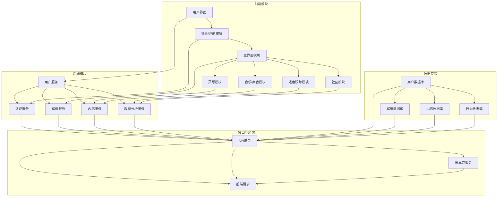

                 

### 冥想app的兴起背景

#### 1.1.1 问题背景

随着现代社会的快速发展，人们的生活节奏越来越快，工作压力、生活压力以及社会竞争压力不断加剧。在这种大环境下，心理健康问题日益突出。根据世界卫生组织（WHO）的数据显示，全球约有3亿多人患有抑郁症，超过2600万人患有焦虑症。而在中国，心理障碍的患病率也呈现逐年上升的趋势。面对如此严峻的形势，传统的心理健康干预方式往往效果有限，亟需一种更便捷、更有效的解决方案。

#### 1.1.2 问题描述

冥想作为一种古老的修身养性的方法，源远流长。它通过调整呼吸、放松身体、集中注意力等方式，帮助人们缓解压力、焦虑和抑郁，提升心理素质和专注力。然而，传统的冥想方式通常需要较长的时间和复杂的操作，比如前往冥想中心、参加冥想课程等。这些限制使得冥想在大众中的普及受到了很大的影响。同时，现代社会的人们普遍面临着忙碌的生活节奏，很难抽出时间去进行传统的冥想练习。

#### 1.1.3 问题解决

随着智能手机和移动互联网的普及，人们越来越依赖移动设备来完成各种日常任务。这种趋势为冥想app的兴起提供了契机。冥想app利用智能手机和移动互联网的优势，为用户提供了一种全新的冥想体验。这些app通过声音、视觉、互动等多种方式，帮助用户随时随地地进行冥想练习。例如，用户可以通过app听到专业的冥想导师进行语音指导，或者通过app提供的冥想音乐和声音来放松身心。同时，一些冥想app还提供了定期的冥想课程和社区交流功能，让用户能够更好地坚持冥想，并从中受益。

#### 1.1.4 边界与外延

冥想app的兴起不仅局限于心理健康领域，它还涉及到科技与生活方式的融合、移动应用的创新等方面。首先，在心理健康领域，冥想app提供了一种全新的心理健康干预方式，可以帮助用户更好地管理自己的情绪和压力。其次，在科技与生活方式的融合方面，冥想app的兴起推动了科技与生活的深度融合，使得科技不再是冰冷的工具，而是成为人们生活中的贴心伙伴。最后，在移动应用的创新方面，冥想app的兴起为移动应用开发提供了新的思路和方向，激发了更多创新的可能性。

#### 1.1.5 概念结构与核心要素组成

- **冥想app**: 一种基于智能手机和移动互联网的冥想工具，通过声音、视觉、互动等方式辅助用户进行冥想。
- **科技辅助**: 利用现代科技手段，如人工智能、虚拟现实、物联网等，提高冥想app的体验和效果。
- **心灵修行**: 通过冥想等精神修炼方法，提高个体的心理素质和心理健康水平。

通过上述分析，我们可以看到，冥想app的兴起不仅为现代人提供了一种有效的心理健康干预方式，还推动了科技与生活的融合，为移动应用开发带来了新的机遇。因此，本文将从冥想app的定义、核心原理、功能与特点、发展历程与趋势、社会影响与伦理问题等多个角度，全面探讨冥想app在科技辅助下的心灵修行。

### 第2章：冥想app的核心概念与原理

#### 2.1.1 冥想app的定义

冥想app是一种集成了冥想指导、音乐、声音、视觉等元素的应用程序，旨在帮助用户通过冥想来改善心理健康和生活方式。随着科技的不断发展，冥想app的功能和特性也在不断丰富和提升。从最初的简单语音引导和音乐播放，到如今的智能数据分析、个性化指导、互动社区等，冥想app已经成为了现代心理健康领域的重要组成部分。

#### 2.1.2 冥想app的核心原理

冥想app的核心原理主要涉及以下几个方面：

1. **声音引导**：
   声音引导是冥想app最基本的元素之一。通过专业的冥想导师进行语音指导，用户可以更轻松地进入冥想状态。导师的声音可以引导用户调整呼吸、放松身体、集中注意力等，帮助用户更好地进行冥想。声音引导的另一个重要作用是帮助用户克服冥想过程中的干扰和不适，例如外界噪音、思绪纷飞等。

2. **音乐与声音**：
   音乐与声音在冥想中起着至关重要的作用。合适的音乐和声音可以帮助用户放松身心，提高冥想效果。冥想app通常会提供多种冥想音乐和声音选项，用户可以根据自己的喜好和需求进行选择。例如，一些冥想app会提供自然声音（如雨声、海浪声）、古典音乐、轻音乐等，这些声音有助于用户更好地进入冥想状态。

3. **互动与反馈**：
   互动与反馈是冥想app的重要组成部分。通过用户的反馈，冥想app可以不断优化冥想过程，提高用户体验。例如，一些冥想app会记录用户的冥想时间、频率和效果，并根据这些数据为用户提供个性化的冥想建议。此外，一些冥想app还提供了互动社区功能，用户可以在社区中分享自己的冥想心得，互相鼓励和支持。

#### 2.1.3 科技辅助在冥想app中的应用

科技辅助在冥想app中的应用使得冥想体验更加丰富和个性化。以下是一些典型的科技应用：

1. **人工智能**：
   人工智能技术在冥想app中的应用主要体现在数据分析、个性化指导等方面。通过收集和分析用户的行为数据，人工智能可以为用户提供个性化的冥想方案。例如，一些冥想app会根据用户的作息时间、心理状态、兴趣爱好等数据，为用户推荐最适合的冥想时间和方式。

2. **虚拟现实**：
   虚拟现实技术为冥想app带来了全新的体验。通过虚拟现实头盔或手机，用户可以进入一个完全沉浸式的冥想环境，仿佛置身于自然的景观中。这种沉浸式的体验可以极大地提升冥想的效果，让用户在冥想过程中感受到身心的放松。

3. **物联网**：
   物联网技术可以帮助冥想app与智能家居设备进行联动，为用户提供更加便捷的冥想体验。例如，用户可以通过智能音箱播放冥想音乐，通过智能灯调整光线，甚至可以通过智能床垫监测自己的睡眠质量，从而为冥想提供更好的环境支持。

#### 2.1.4 冥想app与心理健康的联系

冥想app与心理健康有着密切的联系。首先，冥想本身是一种有效的心理健康干预方法。通过冥想，用户可以缓解压力、焦虑和抑郁，提高专注力和心理素质。其次，科技辅助使得冥想app可以更加精准地满足用户的需求，提高冥想的效果。例如，人工智能可以帮助用户找到最适合的冥想时间和方式，虚拟现实可以为用户提供沉浸式的冥想体验，物联网可以为用户提供更加舒适和便捷的冥想环境。

#### 2.1.5 冥想app的适用人群

冥想app适合各种人群，特别是以下几类人群：

1. **职场人士**：职场压力是现代人的主要压力源之一。通过冥想app，职场人士可以在繁忙的工作间隙进行冥想，缓解压力，提高工作效率。
2. **学生**：学生群体面临的学习压力也不容小觑。通过冥想app，学生可以更好地管理自己的情绪，提高学习效率。
3. **老年人**：随着年龄的增长，老年人的心理和生理健康问题日益突出。冥想app可以帮助老年人保持身心健康，延缓衰老。
4. **所有人**：冥想app不仅适合特定人群，也适合所有人。无论您是新手还是资深冥想者，都可以通过冥想app找到适合自己的冥想方式，提高生活质量。

通过以上分析，我们可以看到，冥想app不仅是一种新型的心理健康干预工具，更是一种科技与生活方式的融合。它通过声音、视觉、互动等多种方式，帮助用户随时随地地进行冥想练习，从而提高心理健康水平。同时，随着科技的不断发展，冥想app的功能和特性也在不断丰富和提升，为用户提供更加便捷和高效的冥想体验。

### 第3章：主流冥想app的功能与特点

#### 3.1.1 主要功能

主流冥想app为了满足用户多样化的需求，提供了丰富而实用的功能。以下是冥想app的一些主要功能：

1. **冥想指导**：
   冥想指导是冥想app的核心功能之一。专业的冥想导师通过语音指导用户进行冥想，帮助用户进入冥想状态。这些指导通常包括呼吸练习、身体扫描、正念练习等，用户可以根据自己的需求选择不同的冥想方式。

2. **音乐选择**：
   冥想音乐在冥想过程中起着重要作用。主流冥想app通常会提供多种类型的冥想音乐，如自然声音（雨声、海浪声）、古典音乐、轻音乐等。用户可以根据自己的喜好和冥想环境选择合适的音乐，以提高冥想效果。

3. **进度跟踪**：
   冥想app可以帮助用户记录冥想时间和效果，从而了解自己的进步。用户可以查看历史冥想记录，了解自己的冥想习惯和效果，以便进行调整和优化。

4. **互动社区**：
   一些冥想app还提供了互动社区功能，用户可以在社区中分享自己的冥想心得，与其他用户交流。这种互动不仅能够提供心理支持，还能够帮助用户更好地坚持冥想。

#### 3.1.2 主要特点

主流冥想app的特点主要体现在以下几个方面：

1. **个性化**：
   为了满足不同用户的需求，冥想app通常会提供个性化的冥想方案。通过收集用户的行为数据（如冥想时间、频率、效果等），人工智能技术可以为用户推荐最适合的冥想时间和方式，从而提高冥想效果。

2. **便捷性**：
   冥想app的一大优势在于其便携性和便捷性。用户无需前往特定的地点，只需打开手机或平板电脑，就可以随时随地开始冥想。这种便捷性使得冥想app成为现代人日常生活中不可或缺的一部分。

3. **科学性**：
   科学性是冥想app的重要特点之一。主流冥想app通常会结合科学研究，确保冥想方法和指导的科学性。例如，一些冥想app会提供基于正念疗法、认知行为疗法等科学的冥想方法，帮助用户更好地进行心理调节。

4. **多样性**：
   冥想app提供了丰富的冥想方式和主题，如减压冥想、睡眠冥想、专注力冥想等，满足用户不同的需求。此外，一些冥想app还提供了多样化的课程，用户可以根据自己的兴趣和需求选择学习。

#### 3.1.3 用户评价与反馈

用户评价和反馈是衡量冥想app质量的重要指标。以下是一些用户对主流冥想app的评价和反馈：

1. **好评**：
   多数用户对冥想app给予了高度评价，认为这些app帮助他们更好地管理压力、改善睡眠质量、提高专注力等。一些用户还提到，冥想app的个性化指导和互动社区功能让他们感受到了科技带来的便利和支持。

2. **改进建议**：
   尽管用户对冥想app给予了好评，但也有用户提出了一些改进建议。例如，一些用户希望冥想app提供更多的个性化设置，以便更好地适应不同的冥想环境和需求。还有一些用户希望冥想app能够提供更多的冥想主题和课程，以满足他们的多样化需求。

3. **挑战与限制**：
   冥想app在普及过程中也面临一些挑战和限制。例如，一些用户认为冥想app的依赖性较强，可能会影响他们自主冥想的能力。此外，一些用户担心冥想app的数据隐私问题，担心自己的个人信息被泄露。

综上所述，主流冥想app通过丰富的功能、个性化的指导、科学的方法和便捷的使用体验，受到了广大用户的喜爱。然而，为了进一步提升用户体验，冥想app的开发者需要不断收集用户反馈，改进产品功能，以应对未来发展的挑战。

#### 3.2.1 冥想app的技术架构

冥想app的技术架构设计是确保其功能强大、用户体验优秀的关键。以下是冥想app的技术架构及其关键组件的详细解释：

1. **前端架构**：
   冥想app的前端架构设计需要考虑到用户的便捷性和体验。常用的前端技术包括：

   - **HTML/CSS/JavaScript**：这些基础技术用于构建网页界面和实现基本的交互功能。
   - **框架与库**：如React、Vue.js、Angular等，这些框架和库可以提高前端开发的效率和代码的可维护性。
   - **移动端适配**：通过响应式设计，确保冥想app在不同设备和屏幕尺寸上都能良好运行。

2. **后端架构**：
   冥想app的后端架构需要处理用户数据、提供API服务、管理内容等。以下是一些关键组件：

   - **服务器**：如Node.js、Django、Flask等，用于处理用户请求、存储数据和提供后端服务。
   - **数据库**：如MySQL、PostgreSQL、MongoDB等，用于存储用户信息、冥想数据等。
   - **API服务**：通过RESTful API或GraphQL等接口技术，为前端提供数据访问和操作服务。
   - **云服务**：如AWS、Azure、Google Cloud等，提供计算、存储、数据库等基础设施支持。

3. **数据存储与管理**：
   数据存储与管理是冥想app的重要一环，包括：

   - **用户数据**：存储用户信息、设置、历史记录等，需要确保数据的安全性和隐私性。
   - **冥想内容**：存储冥想指导、音乐、视频等资源，需要高效的内容管理和检索机制。
   - **行为数据**：收集和分析用户行为数据，用于个性化推荐和优化用户体验。

4. **技术选型与优化**：
   冥想app的技术选型与优化策略包括：

   - **性能优化**：通过缓存、代码优化、数据库查询优化等手段，提高系统性能。
   - **安全性**：采用加密、认证、授权等安全措施，确保用户数据的安全。
   - **扩展性**：设计可扩展的系统架构，支持未来的功能扩展和用户增长。

#### 3.2.2 架构图与功能模块划分

以下是冥想app的技术架构图，以及各个功能模块的简要说明：

**架构图说明**：

- **前端模块**：包括用户界面、登录/注册模块、主界面模块、冥想模块、音乐/声音模块、进度跟踪模块和社区模块。
- **后端模块**：包括用户服务、认证服务、冥想服务、内容服务和数据分析服务。
- **数据存储**：包括用户数据库、冥想数据库、内容数据库和行为数据库。
- **接口与通信**：包括API接口、前端请求和第三方服务。

通过上述架构图和功能模块的划分，我们可以清晰地看到冥想app的技术架构，以及各个模块之间的交互关系。这种设计不仅提高了系统的可扩展性和可维护性，还为未来的功能扩展和优化提供了坚实的基础。

### 第4章：冥想app的发展历程与趋势

#### 4.1.1 发展历程

冥想app的发展历程可以分为几个阶段，每个阶段都标志着技术的进步和应用范围的扩大。

1. **初阶**：
   冥想app的初阶阶段主要集中在2010年前后。这个时期的冥想app功能较为简单，主要提供基础的声音引导和音乐播放功能。用户可以通过这些简单的app进行初步的冥想练习。这个阶段的特点是冥想app刚刚起步，用户基础相对较小，但已经开始引起了关注。

2. **进阶**：
   随着智能手机和移动互联网的普及，冥想app在2015年左右进入了进阶阶段。这个阶段的冥想app开始引入人工智能、虚拟现实等新技术，提供了更加丰富的冥想体验。例如，一些冥想app开始利用人工智能技术分析用户数据，为用户提供个性化的冥想建议。同时，虚拟现实技术的引入使得冥想体验更加沉浸式和多样化。

3. **成熟**：
   目前，冥想app已经进入成熟阶段。这个阶段的冥想app不仅功能更加丰富，而且应用范围也在不断扩大。例如，一些冥想app已经拓展到心理健康咨询、正念训练等领域，为用户提供全方位的心理健康解决方案。此外，物联网技术的应用也使得冥想app能够与智能家居设备联动，为用户提供更加便捷和舒适的冥想环境。

#### 4.1.2 发展趋势

冥想app的发展趋势可以从以下几个方面进行展望：

1. **智能化**：
   未来，冥想app将进一步智能化。人工智能技术的应用将更加广泛，不仅可以分析用户行为数据，还能预测用户的心理状态，提供更加个性化的冥想方案。例如，通过人工智能算法，冥想app可以自动调整冥想的时间、频率和内容，以最大化冥想效果。

2. **个性化**：
   随着用户需求的多样化，冥想app将提供更加个性化的冥想方案。通过大数据分析和机器学习，冥想app可以根据用户的作息时间、心理状态、兴趣爱好等数据，为用户量身定制冥想计划。这种个性化服务将大大提高用户的使用体验和满意度。

3. **多元化**：
   冥想app的应用范围将不断拓展，从心理健康领域延伸到更多领域，如教育、娱乐等。例如，一些冥想app已经开始与教育机构合作，提供冥想课程和学习资源，帮助学生在学习过程中保持专注和放松。此外，冥想app还可以与游戏、音乐等娱乐形式结合，为用户提供多元化的冥想体验。

4. **全球化**：
   随着互联网的普及，冥想app的市场将逐渐全球化。不同国家和地区的用户都可以通过冥想app进行冥想练习，享受科技带来的便利。同时，冥想app的国际化也将促进不同文化背景下的冥想交流和融合，推动冥想文化的全球化发展。

5. **商业化**：
   冥想app的商业化进程也将不断加速。随着用户基数的扩大和市场需求的增加，冥想app的商业模式将更加多样，包括付费订阅、广告收入、合作伙伴关系等。商业化的同时，冥想app也需要注意保持用户体验和内容的质量，以赢得用户的信任和支持。

#### 4.1.3 技术进步对冥想app的影响

技术进步对冥想app的发展起到了重要的推动作用。以下是技术进步对冥想app的几个主要影响：

1. **用户体验**：
   技术进步显著提升了冥想app的用户体验。通过虚拟现实、增强现实等技术的应用，用户可以享受到更加沉浸式和互动性的冥想体验。同时，人工智能技术的应用使得冥想app能够根据用户的行为数据提供个性化的指导，从而提高冥想的效果。

2. **内容创新**：
   技术进步促进了冥想app内容的创新。例如，虚拟现实技术的应用使得冥想场景更加丰富多样，用户可以在不同的虚拟场景中进行冥想。此外，人工智能技术的引入使得冥想内容更加智能化和个性化，能够更好地满足用户的需求。

3. **数据分析**：
   技术进步使得冥想app能够更好地收集和分析用户数据。通过大数据分析和机器学习，冥想app可以深入了解用户的心理状态和行为习惯，从而提供更加精准和有效的冥想方案。这种数据驱动的模式有助于提升冥想app的运营效率和用户体验。

4. **商业模式**：
   技术进步也为冥想app的商业模式创新提供了新的机会。例如，通过云计算和大数据技术，冥想app可以提供更加灵活和高效的付费订阅服务，同时通过广告和合作伙伴关系实现多元化的收入来源。

综上所述，冥想app的发展历程和趋势反映了科技对人类心理健康和生活方式的深刻影响。随着技术的不断进步，冥想app将在未来发挥更加重要的作用，为更多人带来身心健康和幸福生活。

### 第5章：冥想app的社会影响与伦理问题

#### 5.1.1 社会影响

冥想app的兴起对社会产生了深远的影响，尤其是在心理健康领域，它带来了一系列积极的变化。

1. **心理健康提升**：
   冥想app通过提供方便、快捷的冥想体验，帮助用户缓解压力、焦虑和抑郁，从而提升整体心理健康水平。根据一项研究表明，定期使用冥想app的用户，其心理压力水平显著降低，情绪调节能力也有所提高。

2. **生活方式改变**：
   冥想app引导用户养成更加健康的生活方式。通过定期的冥想练习，用户能够更好地管理时间，提高工作效率，从而改善生活质量。同时，冥想app还鼓励用户养成早睡早起、健康饮食等良好的生活习惯。

3. **社会风尚**：
   冥想app的普及推动了冥想文化的传播，使得更多人了解和接受冥想这一古老的修身养性方法。这种趋势不仅有助于提升公众的心理健康意识，还促进了心理健康产业的繁荣发展。

#### 5.1.2 伦理问题

尽管冥想app带来了诸多积极影响，但其发展过程中也伴随着一些伦理问题，需要引起重视。

1. **数据隐私**：
   冥想app在提供个性化服务的过程中，需要收集和分析用户的行为数据。这些数据包括用户的生理数据、心理状态、生活习惯等。如何保护用户数据隐私，防止数据泄露，是冥想app需要面对的重要挑战。一些冥想app已经采取了加密传输、匿名化处理等措施来保障用户数据的安全。

2. **依赖性**：
   随着冥想app功能的丰富和用户体验的提升，用户可能会对其产生依赖。过度的依赖可能会导致用户失去自主冥想的能力，甚至影响心理健康。为此，冥想app的开发者需要在设计时充分考虑用户的自我提升和独立性，避免过度依赖。

3. **商业化**：
   冥想app的商业化发展在带来经济利益的同时，也引发了一些伦理问题。例如，一些冥想app可能会通过过度营销、夸大产品效果等方式吸引用户购买服务或产品。这种行为不仅损害了用户利益，还可能误导用户对冥想效果的认识。

4. **价值观引导**：
   冥想app在推广过程中，需要传递正确的价值观和心理健康知识。然而，一些冥想app可能会忽视这一点，导致用户在冥想过程中产生误解或不良后果。例如，一些冥想app可能强调冥想对心理健康的神奇效果，而忽视了个体差异和科学依据。

#### 5.1.3 伦理问题的应对策略

针对冥想app的伦理问题，可以采取以下应对策略：

1. **加强数据保护**：
   冥想app应严格遵守数据保护法规，采取先进的数据加密和匿名化处理技术，确保用户数据的安全和隐私。同时，应向用户明确告知数据收集和使用的目的，获取用户的明确同意。

2. **培养用户独立性**：
   冥想app应鼓励用户进行自主冥想，提供丰富的冥想知识和指导，帮助用户建立自我冥想的能力。此外，可以设置冥想时间提醒、冥想挑战等功能，引导用户养成自主冥想的习惯。

3. **规范商业化行为**：
   冥想app的开发者应遵循公平、透明的商业化原则，避免过度营销和夸大宣传。同时，可以引入第三方评估和监管机制，确保商业化行为符合伦理标准。

4. **传播正确价值观**：
   冥想app应在内容设计上注重传递正确的价值观和心理健康知识，避免误导用户。可以通过提供科学文献、专家访谈、用户反馈等形式，增强内容的可信度和权威性。

综上所述，冥想app的兴起对社会产生了积极影响，但同时也带来了一些伦理问题。通过采取有效的应对策略，可以最大程度地发挥冥想app的积极作用，促进心理健康和社会和谐发展。

### 第6章：科技辅助下的心灵修行

#### 6.1.1 冥想app对心理健康的影响

冥想app通过科技手段，极大地推动了心灵修行的普及和深化。首先，冥想app提供的个性化冥想指导，使不同心理状态的个体能够找到适合自己的冥想方式。例如，对于焦虑症患者，冥想app可能会提供专门的呼吸控制和正念冥想课程，帮助他们放松身心、减轻焦虑。而对于长期处于高压环境中的职场人士，冥想app则可能提供针对专注力和压力管理的冥想练习，帮助他们在忙碌的工作中保持冷静和高效。

其次，冥想app通过记录和分析用户的行为数据，为用户提供反馈和改进建议。例如，一些冥想app会记录用户的冥想时长、频率和效果，通过数据分析，帮助用户发现自己在冥想过程中的盲点和不足，从而不断优化冥想实践。这种数据驱动的模式，不仅提高了冥想的科学性和有效性，还增强了用户的自信心和自律性。

此外，冥想app的互动社区功能，为用户提供了交流分享的平台。用户可以在社区中分享自己的冥想心得，互相鼓励和支持，从而在冥想修行的过程中感受到群体的力量。这种社交支持有助于用户克服孤独感和挫折感，坚持冥想练习，最终实现心理健康的提升。

#### 6.1.2 冥想app与其他心理干预手段的比较

与传统的心理干预手段相比，冥想app具有显著的优势。首先，传统的心理干预手段如心理咨询和治疗，通常需要面对面的沟通和专业人员的参与，时间和经济成本较高。而冥想app则通过数字化和网络化的方式，为用户提供便捷的心理健康服务，用户可以随时随地通过手机或平板电脑进行冥想练习，无需受时间和地点的限制。

其次，传统的心理干预手段在个性化和针对性方面存在一定的局限性。心理咨询师需要根据每个个体的具体情况制定干预方案，这个过程既费时又费力。而冥想app则利用人工智能和大数据技术，通过对用户行为数据的分析，为用户推荐最适合的冥想内容和指导，实现了个性化的心理干预。

最后，冥想app的普及性和可及性远高于传统的心理干预手段。随着智能手机和移动互联网的普及，越来越多的人可以方便地接触到冥想app，享受到科技带来的心理健康服务。这不仅有助于降低心理健康服务的门槛，还能提高公众对心理健康的认识和重视。

#### 6.1.3 冥想app对生活方式的改变

冥想app不仅对心理健康产生了深远影响，还改变了用户的生活方式。首先，冥想app帮助用户建立了良好的生活习惯。通过定期进行冥想练习，用户能够更好地管理自己的情绪和行为，从而改善生活质量。例如，一些用户在开始使用冥想app后，发现自己在面对压力和挑战时更加冷静和从容，生活和工作效率显著提高。

其次，冥想app促进了用户之间的社交互动。通过互动社区功能，用户可以分享自己的冥想心得，互相鼓励和支持，形成一种积极向上的社交氛围。这种社交支持不仅有助于用户坚持冥想练习，还能增强用户的社交联系和归属感。

此外，冥想app还为用户提供了丰富的学习资源。用户可以通过冥想课程、专家讲座、心理学文献等多种形式，不断学习和提升自己的心理健康知识和技能。这种持续的学习和提升，有助于用户更好地掌握冥想技巧，从而在日常生活中实现自我提升。

#### 6.1.4 科技在心灵修行中的应用前景

未来，随着科技的不断发展，冥想app在心灵修行中的应用前景将更加广阔。首先，人工智能技术的进一步应用，将使冥想app能够更加精准地满足用户需求。例如，通过深度学习和大数据分析，冥想app可以更好地理解用户的情绪和心理状态，为用户提供更加个性化的冥想指导。

其次，虚拟现实（VR）和增强现实（AR）技术的引入，将为用户带来更加沉浸式的冥想体验。用户可以在虚拟的冥想场景中，体验到与现实世界完全不同的冥想环境，从而提高冥想的效果和乐趣。

此外，物联网（IoT）技术的发展，将使冥想app能够更好地与智能家居设备联动，为用户提供更加便捷和舒适的冥想环境。例如，用户可以通过智能音箱播放冥想音乐，通过智能灯调整光线，通过智能床垫监测睡眠质量，从而为冥想提供全方位的支持。

总之，科技在心灵修行中的应用，为冥想app的发展提供了强大的动力。随着科技的不断进步，冥想app将为用户带来更加丰富、高效和个性化的心灵修行体验，助力更多人实现身心健康和幸福生活。

### 结论与展望

通过对冥想app的兴起背景、核心概念与原理、功能与特点、发展历程与趋势、社会影响与伦理问题，以及科技辅助下的心灵修行的详细探讨，我们可以得出以下结论：

冥想app作为一种新型的心理健康干预工具，通过结合现代科技手段，如人工智能、虚拟现实、物联网等，为用户提供了便捷、个性化、科学化的冥想体验。这不仅有助于提升用户的心理健康水平，还改变了他们的生活方式，促进了心理健康产业的繁荣发展。

然而，冥想app在发展过程中也面临一些伦理问题，如数据隐私、依赖性、商业化等。因此，未来的研究需要重点关注这些问题，并采取有效的应对策略，以确保冥想app能够持续发挥积极作用。

展望未来，冥想app将继续在心理健康领域发挥重要作用。随着科技的不断进步，冥想app的功能将更加丰富，用户体验将更加个性化，应用范围将不断扩大。同时，冥想app的发展也将推动心理健康产业的创新和变革，为更多人带来身心健康和幸福生活。

为此，我们呼吁相关研究人员和开发者，持续关注冥想app的发展动态，不断探索新技术在心理健康领域的应用，共同推动心理健康产业的进步和发展。同时，我们也希望广大用户能够积极使用冥想app，通过冥想这一古老的修身养性方法，实现身心健康和幸福生活。

### 最佳实践 tips、小结、注意事项、拓展阅读

#### 最佳实践 tips

1. **选择合适的冥想app**：根据自己的需求和兴趣，选择功能丰富、用户体验好的冥想app。
2. **坚持每日冥想**：养成每天进行冥想的习惯，即使在忙碌的工作和学习中也要尽量保持。
3. **个性化设置**：充分利用冥想app提供的个性化设置，找到最适合自己的冥想方式和时间。

#### 小结

冥想app通过科技手段，为用户提供了一种便捷、科学化的冥想体验，有助于提升心理健康水平，改变生活方式。未来，冥想app将在心理健康领域发挥更大作用，推动产业创新和变革。

#### 注意事项

1. **保护隐私**：在使用冥想app时，注意保护个人隐私，避免泄露敏感信息。
2. **合理使用**：避免过度依赖冥想app，学会自主冥想，保持独立性和自律性。
3. **安全使用**：选择正规渠道下载和使用冥想app，避免下载恶意软件。

#### 拓展阅读

1. **《冥想：一种全新的心理治疗方法》** - 探讨冥想在心理健康领域的应用和效果。
2. **《人工智能与心理健康：未来的可能性》** - 分析人工智能技术在心理健康领域的应用前景。
3. **《虚拟现实与心理健康：沉浸式体验的革命》** - 探索虚拟现实技术在心理健康领域的应用。

### 作者信息

作者：AI天才研究院/AI Genius Institute & 禅与计算机程序设计艺术 /Zen And The Art of Computer Programming

