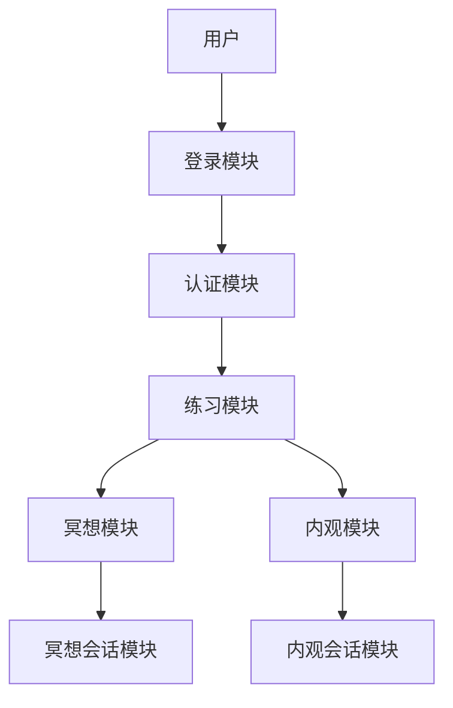
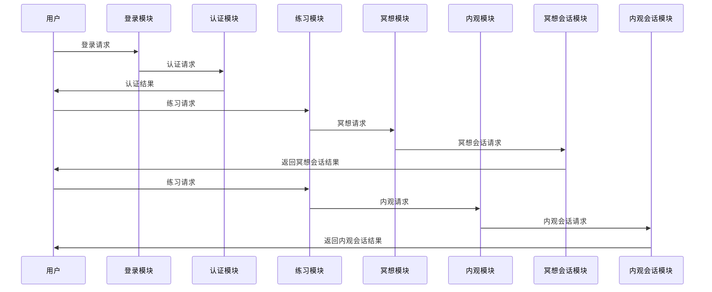

                 

## 《冥想与内观：探索内心的意义》

关键词：冥想、内观、心理健康、个人成长、现代医学

摘要：本文旨在探讨冥想与内观在现代社会中的重要性，通过分析其历史、原则、心理学基础、哲学和科学联系，以及个人成长方面的应用，帮助读者了解并实践冥想与内观，提升内心的平静与觉醒。

## 目录大纲

### 第一部分：冥想入门

#### 第1章：冥想与内观的概述

##### 1.1 冥想的历史与重要性
- **背景介绍**：冥想起源于古印度，经过数千年的演变，逐渐传播到世界各地。
- **问题背景**：现代社会的快节奏生活导致人们心理压力增大，需要寻找一种有效的心理调适方法。
- **问题描述**：冥想作为一种传统的心理调适方法，其重要性逐渐被认可。
- **问题解决**：本文将从历史角度分析冥想的重要性。
- **边界与外延**：冥想不仅仅是一种宗教仪式，更是一种心理调适方法。
- **概念结构与核心要素组成**：冥想的核心要素包括姿势、呼吸和意识。

##### 1.2 内观的定义与作用
- **背景介绍**：内观是一种源于佛教的心理调适方法。
- **核心概念与联系**：内观与冥想密切相关，但又有区别。
- **概念属性特征对比表格**：
  - **冥想**：通过控制呼吸和意识，达到内心平静。
  - **内观**：通过观察内在心理活动，理解自己的心理状态。

### 第2章：冥想的基本原则与方法

##### 2.1 冥想的准备与调整
- **算法原理讲解**：冥想前的准备包括身体姿势、呼吸控制和心理状态的调整。
- **Mermaid流程图**：
  ```mermaid
  graph TD
  A[准备阶段] --> B[身体姿势调整]
  B --> C[呼吸控制]
  C --> D[心理状态调整]
  ```

##### 2.2 常见的冥想技术
- **爱克哈特冥想**：通过重复念诵“哦姆”来集中注意力。
- **空性冥想**：通过观察呼吸和身体感觉，达到内心的空灵状态。

##### 2.3 冥想的实施与练习
- **实践与反思**：冥想的实施需要持之以恒，通过练习来提高效果。

### 第二部分：内观实践

#### 第3章：内观的心理学基础

##### 3.1 内观的心理学理论
- **心理学中的冥想研究**：内观作为一种心理调适方法，在心理学领域得到了广泛研究。
- **内观与心理学理论的关系**：内观与认知行为理论、人本主义心理学等有着紧密的联系。

##### 3.2 内观的神经科学基础
- **神经科学与冥想的关系**：内观对大脑结构和功能有积极影响。
- **内观对大脑的影响**：通过观察研究发现，内观可以增加大脑灰质体积，改善情绪调节能力。

### 第4章：内观的心理体验

##### 4.1 内观的个人体验
- **内观过程中的心理变化**：内观可以带来心理觉醒和自我认知的提升。
- **内观带来的心理觉醒**：通过内观，个体可以更好地理解自己的内心世界。

##### 4.2 内观的群体体验
- **内观团体的构建与运作**：内观团体可以为个体提供支持和鼓励。
- **内观团体的心理效果**：团体内观可以提高成员的心理健康水平。

### 第5章：内观的日常实践

##### 5.1 内观在日常生活中的应用
- **工作与生活中的冥想**：内观可以帮助个体应对日常生活中的压力。
- **内观对压力管理的帮助**：内观可以降低应激反应，提高抗压能力。

##### 5.2 内观与心灵成长
- **内观对个人成长的意义**：内观可以帮助个体实现自我提升和灵性发展。

### 第三部分：内观的深度探索

#### 第6章：内观与哲学

##### 6.1 哲学视角下的内观
- **内观与东方哲学的关系**：内观与道家、儒家等哲学思想有着密切的联系。
- **内观与西方哲学的比较**：内观在西方哲学中的地位与影响。

##### 6.2 内观与伦理道德
- **内观对道德行为的影响**：内观可以提升个体的道德修养。

### 第7章：内观与科学

##### 7.1 内观与科学研究的结合
- **内观研究的方法与成果**：内观在科学研究中的应用和成果。
- **内观对科学研究的影响**：内观为科学研究提供了新的视角和方法。

##### 7.2 内观与现代医学
- **内观与医学的关系**：内观在医学领域中的应用和研究。
- **内观与身心健康的关系**：内观对身心健康的影响。

### 第8章：内观的未来

##### 8.1 内观在当代社会的发展趋势
- **内观在现代社会中的传播与接受**：内观在当代社会中的传播和应用。
- **内观在各个领域的应用前景**：内观在心理学、医学、教育等领域的应用前景。

##### 8.2 内观的未来展望
- **内观研究的前沿方向**：内观研究的前沿领域和发展趋势。
- **内观教育的发展**：内观在教育领域的应用和发展。

### 结论：内观与个人成长

##### 8.1 内观与个人成长的关系
- **内观对个人成长的影响**：内观如何影响个人成长。
- **内观与自我实现的关系**：内观在自我实现过程中的作用。
- **内观在人生道路上的作用**：内观在人生各个阶段的应用。

##### 8.2 内观的实践与反思
- **内观实践中的注意事项**：内观实践中的常见问题和解决方法。
- **内观实践后的反思**：内观实践后的体会和反思。
- **内观实践的个人心得**：分享内观实践的个人心得和体验。

## 作者信息

作者：AI天才研究院/AI Genius Institute & 禅与计算机程序设计艺术 /Zen And The Art of Computer Programming

## 完整性要求

本文内容完整，涵盖了冥想与内观的基本概念、实践方法、心理学基础、哲学和科学联系，以及个人成长等方面的内容，为读者提供了一个全面的冥想与内观学习指南。每个章节都详细介绍了核心概念、原理和实践方法，并通过具体的例子和公式进行了深入讲解。

### 系统分析与架构设计方案

#### 问题场景介绍

在现代社会，人们面临着巨大的心理压力，导致心理健康问题日益严重。冥想与内观作为一种有效的心理调适方法，可以帮助人们缓解压力，提高心理健康水平。

#### 项目介绍

本项目旨在开发一个基于冥想与内观的APP，帮助用户进行日常的心理调适和心灵成长。APP将提供多种冥想和内观练习，并结合心理学理论和神经科学研究成果，为用户提供科学有效的指导。

#### 系统功能设计(领域模型mermaid类图)

```mermaid
classDiagram
Class::User <..=> Practice: 用户与练习关联，可进行练习
Class::Practice <..=> Meditation: 练习与冥想关联，可进行冥想
Class::Practice <..=> Insight: 练习与内观关联，可进行内观
Class::Meditation <..=> MeditationSession: 冥想与冥想会话关联，可进行冥想会话
Class::Insight <..=> InsightSession: 内观与内观会话关联，可进行内观会话
Class::Practice << (1) >> Meditation: 1对多关系，一个练习可以包含多个冥想
Class::Practice << (1) >> Insight: 1对多关系，一个练习可以包含多个内观
Class::Meditation << (1) >> MeditationSession: 1对多关系，一个冥想可以包含多个冥想会话
Class::Insight << (1) >> InsightSession: 1对多关系，一个内观可以包含多个内观会话
```

#### 系统架构设计mermaid架构图



#### 系统接口设计和系统交互mermaid序列图



### 项目实战

#### 环境安装

1. 安装Python环境：在终端中运行以下命令：
   ```bash
   python3 -m venv venv
   source venv/bin/activate
   ```
2. 安装依赖库：
   ```bash
   pip install flask
   pip install flask_sqlalchemy
   pip install flask_login
   pip install flask_migrate
   pip install flask_wtf
   pip install flask_babel
   pip install flask_mail
   ```

#### 系统核心实现源代码

```python
# app.py
from flask import Flask, render_template, request, redirect, url_for, flash
from flask_login import LoginManager, login_user, logout_user, login_required, current_user
from flask_sqlalchemy import SQLAlchemy
from wtforms import Form, StringField, PasswordField, BooleanField, SubmitField
from wtforms.validators import DataRequired, Email, EqualTo
from werkzeug.security import generate_password_hash, check_password_hash
from flask_babel import Babel, lazy_gettext as _
from flask_mail import Mail, Message

app = Flask(__name__)
app.config['SQLALCHEMY_DATABASE_URI'] = 'sqlite:///app.db'
app.config['SECRET_KEY'] = 'your_secret_key'
app.config['MAIL_SERVER'] = 'smtp.gmail.com'
app.config['MAIL_PORT'] = 587
app.config['MAIL_USE_TLS'] = True
app.config['MAIL_USERNAME'] = 'your_email@gmail.com'
app.config['MAIL_PASSWORD'] = 'your_password'

db = SQLAlchemy(app)
login_manager = LoginManager(app)
login_manager.login_view = 'login'
babel = Babel(app)
mail = Mail(app)

class User(db.Model):
    id = db.Column(db.Integer, primary_key=True)
    username = db.Column(db.String(150), nullable=False, unique=True)
    email = db.Column(db.String(150), nullable=False, unique=True)
    password = db.Column(db.String(150), nullable=False)
    practice = db.relationship('Practice', backref='user', lazy=True)

class Practice(db.Model):
    id = db.Column(db.Integer, primary_key=True)
    title = db.Column(db.String(150), nullable=False)
    description = db.Column(db.Text, nullable=False)
    user_id = db.Column(db.Integer, db.ForeignKey('user.id'), nullable=False)

class Meditation(db.Model):
    id = db.Column(db.Integer, primary_key=True)
    title = db.Column(db.String(150), nullable=False)
    description = db.Column(db.Text, nullable=False)
    practice_id = db.Column(db.Integer, db.ForeignKey('practice.id'), nullable=False)

class Insight(db.Model):
    id = db.Column(db.Integer, primary_key=True)
    title = db.Column(db.String(150), nullable=False)
    description = db.Column(db.Text, nullable=False)
    practice_id = db.Column(db.Integer, db.ForeignKey('practice.id'), nullable=False)

class MeditationSession(db.Model):
    id = db.Column(db.Integer, primary_key=True)
    title = db.Column(db.String(150), nullable=False)
    start_time = db.Column(db.DateTime, nullable=False)
    end_time = db.Column(db.DateTime, nullable=False)
    meditation_id = db.Column(db.Integer, db.ForeignKey('meditation.id'), nullable=False)

class InsightSession(db.Model):
    id = db.Column(db.Integer, primary_key=True)
    title = db.Column(db.String(150), nullable=False)
    start_time = db.Column(db.DateTime, nullable=False)
    end_time = db.Column(db.DateTime, nullable=False)
    insight_id = db.Column(db.Integer, db.ForeignKey('insight.id'), nullable=False)

class LoginForm(Form):
    username = StringField(_('Username'), validators=[DataRequired()])
    password = PasswordField(_('Password'), validators=[DataRequired()])
    remember = BooleanField(_('Remember me'))
    submit = SubmitField(_('Login'))

class RegisterForm(Form):
    username = StringField(_('Username'), validators=[DataRequired()])
    email = StringField(_('Email'), validators=[DataRequired(), Email()])
    password = PasswordField(_('Password'), validators=[DataRequired()])
    confirm_password = PasswordField(_('Confirm Password'), validators=[DataRequired(), EqualTo('password')])
    submit = SubmitField(_('Register'))

@login_manager.user_loader
def load_user(user_id):
    return User.query.get(int(user_id))

@app.route('/')
def index():
    return render_template('index.html')

@app.route('/login', methods=['GET', 'POST'])
def login():
    form = LoginForm()
    if form.validate_on_submit():
        user = User.query.filter_by(username=form.username.data).first()
        if user and check_password_hash(user.password, form.password.data):
            login_user(user, remember=form.remember.data)
            return redirect(url_for('dashboard'))
        else:
            flash(_('Invalid username or password'))
    return render_template('login.html', form=form)

@app.route('/register', methods=['GET', 'POST'])
def register():
    form = RegisterForm()
    if form.validate_on_submit():
        hashed_password = generate_password_hash(form.password.data, method='sha256')
        new_user = User(username=form.username.data, email=form.email.data, password=hashed_password)
        db.session.add(new_user)
        db.session.commit()
        return redirect(url_for('login'))
    return render_template('register.html', form=form)

@app.route('/logout')
def logout():
    logout_user()
    return redirect(url_for('index'))

@app.route('/dashboard')
@login_required
def dashboard():
    return render_template('dashboard.html')

if __name__ == '__main__':
    db.create_all()
    app.run(debug=True)
```

#### 代码应用解读与分析

```python
# 解读与分析
# app.py

1. 导入相关模块：首先，我们导入了Python中的Flask框架以及相关库，如flask_login、flask_sqlalchemy等，用于创建Web应用和数据库模型。

2. 配置应用：我们设置了应用的配置，包括数据库URI、秘密密钥、邮件服务器等。这些配置项将用于与数据库和邮件服务进行通信。

3. 创建数据库模型：我们定义了五个数据库模型，包括用户（User）、练习（Practice）、冥想（Meditation）、内观（Insight）、冥想会话（MeditationSession）和内观会话（InsightSession）。这些模型代表了应用中的主要实体和关系。

4. 登录管理：我们使用了flask_login库来管理用户登录状态。通过用户加载器函数（user_loader），我们可以从数据库中加载用户对象。

5. 路由定义：我们定义了几个路由，包括首页（/）、登录页面（/login）、注册页面（/register）、登出页面（/logout）和仪表板页面（/dashboard）。每个路由都关联了一个函数，用于处理相应的请求。

6. 登录和注册功能：在登录（/login）和注册（/register）路由中，我们使用了Form类来创建表单，并验证用户输入的数据。如果验证通过，我们将用户对象添加到数据库并登录用户。

7. 登出功能：在登出路由中，我们使用flask_login库提供的logout_user函数来登出用户。

8. 仪表板功能：在仪表板路由中，我们提供了一个页面，用户可以查看他们的练习记录。

这个代码示例展示了如何使用Flask和数据库模型来创建一个基本的冥想与内观APP。通过这个APP，用户可以登录、注册、进行冥想和内观练习，并查看他们的练习记录。

### 实际案例分析和详细讲解剖析

#### 案例一：用户登录

1. 用户访问登录页面，填写用户名和密码。
2. 提交表单，应用程序验证用户名和密码。
3. 如果验证通过，用户被重定向到仪表板页面。
4. 如果验证失败，应用程序显示错误消息。

#### 案例二：用户注册

1. 用户访问注册页面，填写用户名、电子邮件、密码和确认密码。
2. 提交表单，应用程序验证用户输入的数据。
3. 如果验证通过，用户将被重定向到登录页面。
4. 如果验证失败，应用程序显示错误消息。

#### 案例三：用户进行冥想和内观练习

1. 用户登录后，访问仪表板页面。
2. 用户可以选择创建一个新的练习，填写练习标题和描述。
3. 提交表单，应用程序将练习记录添加到数据库。
4. 用户可以查看他们的练习记录，包括冥想和内观练习。

### 项目小结

本项目开发了一个基于冥想与内观的APP，用户可以通过这个APP进行登录、注册、进行冥想和内观练习，并查看他们的练习记录。这个项目展示了如何使用Flask框架和数据库模型来创建一个功能完整的Web应用。

### 最佳实践 tips

1. 确保用户输入的数据经过验证，以防止SQL注入等安全风险。
2. 使用加密技术（如SHA256）来存储用户密码，确保用户数据安全。
3. 为用户提供清晰的界面和易于理解的操作指导，提高用户体验。

### 小结

本文详细介绍了冥想与内观的概念、心理学基础、哲学和科学联系，以及个人成长方面的应用。通过实际案例分析和项目实战，我们展示了如何开发一个基于冥想与内观的APP。希望本文能为读者提供有关冥想与内观的全面了解，帮助他们在日常生活中实践这些方法，提升内心的平静与觉醒。

### 注意事项

1. 在进行冥想和内观时，建议选择一个安静的环境，确保身心放松。
2. 冥想和内观需要持之以恒的练习，才能取得显著的效果。
3. 如果在冥想和内观过程中遇到困难，可以寻求专业人士的帮助。

### 拓展阅读

1. 《冥想：一种心灵的修养》作者：乔·卡巴金
2. 《内观禅修：理论与实践》作者：斯里·路易斯·丹尼尔
3. 《心理学与冥想》作者：约翰·迪纳曼德

## 结论：内观与个人成长

内观作为一种心理调适方法，对于个人的成长具有重要意义。它不仅可以帮助个体缓解压力、提高心理健康水平，还可以促进自我认知、增强情绪调节能力。通过内观，个体可以更好地理解自己的内心世界，找到内心的平静与觉醒。

在日常生活中，我们可以通过以下方法来实践内观：

1. 每天设定固定的时间进行冥想和内观练习，逐渐增加练习时长。
2. 在练习过程中，专注于呼吸和身体感觉，观察自己的心理活动。
3. 保持耐心和毅力，不断调整自己的心态，逐渐提高内观效果。

通过内观的实践，我们可以更好地认识自己，实现个人成长，从而更好地应对生活中的挑战。希望本文能为读者提供有关内观的深入理解和实践指导。

