                 

### 《加密货币在后量子时代的安全挑战》

#### 关键词：后量子时代、加密货币、量子攻击、密码学、安全协议

##### 摘要：
随着量子计算技术的发展，后量子时代的安全挑战日益凸显，尤其是在加密货币领域。本文将探讨后量子计算对加密货币安全的影响，分析现有的后量子加密算法，并提出应对量子攻击的安全策略。本文结构分为三部分：第一部分介绍后量子时代的加密技术基础；第二部分讨论加密货币在后量子时代的安全挑战；第三部分展望后量子加密货币的应用场景及未来发展方向。本文旨在为加密货币社区和从业者提供关于后量子时代安全挑战的深入理解，并为其未来的发展提供指导。

----------------------------------------------------------------

#### 目录大纲

```markdown
# 《加密货币在后量子时代的安全挑战》

## 第一部分：后量子时代的加密技术基础

### 第1章：后量子时代概述

#### 1.1 后量子技术的兴起

#### 1.2 后量子计算对加密算法的影响

#### 1.3 后量子密码学的基本原理

### 第2章：后量子加密算法详解

#### 2.1 LPN算法

#### 2.2 NTRU算法

#### 2.3 code-based加密算法

#### 2.4 Hash函数的设计与优化

## 第二部分：加密货币在后量子时代的安全挑战

### 第3章：加密货币系统与后量子安全

#### 3.1 加密货币的基本概念

#### 3.2 后量子时代加密货币的发展趋势

#### 3.3 加密货币系统的安全需求

### 第4章：量子攻击与加密货币的安全挑战

#### 4.1 量子攻击的原理与威胁

#### 4.2 对抗量子攻击的加密货币技术

#### 4.3 后量子时代加密货币的潜在漏洞分析

### 第5章：安全协议的升级与改进

#### 5.1 安全协议的演变

#### 5.2 后量子安全协议的设计与实现

#### 5.3 实际应用中的安全协议升级案例

## 第三部分：后量子加密货币的应用场景

### 第6章：金融领域的后量子加密货币

#### 6.1 金融交易中的加密需求

#### 6.2 后量子加密货币在金融领域的应用

#### 6.3 潜在的风险与挑战

### 第7章：供应链管理中的后量子加密货币

#### 7.1 供应链管理的现状与挑战

#### 7.2 后量子加密货币在供应链中的应用

#### 7.3 安全性与效率的平衡

### 第8章：后量子加密货币的未来展望

#### 8.1 后量子加密货币的发展方向

#### 8.2 潜在的技术突破与挑战

#### 8.3 社会影响与法律监管

## 总结与展望

### 第9章：总结与未来展望

#### 9.1 后量子时代加密货币的总结

#### 9.2 未来发展的展望

#### 9.3 对研究者和从业者的建议
```

---

**本文将以逻辑清晰、结构紧凑、简单易懂的专业技术语言，详细阐述加密货币在后量子时代的安全挑战，帮助读者深入理解这一前沿领域。接下来，我们将首先介绍后量子时代的背景和技术基础，为后续章节的分析和讨论奠定基础。**

#### 第一部分：后量子时代的加密技术基础

##### 第1章：后量子时代概述

##### 1.1 后量子技术的兴起

**背景介绍：**

后量子时代，指的是随着量子计算技术的发展，传统计算模型将面临巨大变革的时代。量子计算机通过利用量子力学的原理，实现了与传统计算机不同的计算方式，具有极高的并行计算能力和解决复杂问题的潜力。后量子技术的兴起，不仅推动了计算机科学的发展，也对密码学领域产生了深远的影响。

**问题背景：**

在经典计算模型中，许多加密算法如RSA、ECC等被认为是安全的，因为其计算复杂性超出了现有计算机的能力。然而，量子计算机的出现，使得这些加密算法面临巨大的威胁。量子计算机可以通过Shor算法在多项式时间内分解大整数，从而破解RSA加密算法；通过Grover算法加速密码搜索过程，从而破解基于哈希函数的加密系统。

**问题描述：**

量子计算对现有加密算法提出了巨大挑战，促使研究人员开始探索后量子密码学，以应对未来的安全威胁。后量子密码学旨在设计出在量子计算下依然安全的加密算法和密码协议。

**问题解决：**

为了应对量子攻击，研究人员提出了一系列后量子密码学算法，如LPN、NTRU、Code-based加密算法等。这些算法利用量子力学的不确定性原理和量子计算的复杂性，设计出在量子计算下难以攻破的加密体系。

**边界与外延：**

后量子时代的概念不仅仅局限于加密领域，它还涉及量子通信、量子编程等多个方面。然而，本文将重点关注后量子密码学在加密货币领域的应用和挑战。

**概念结构与核心要素组成：**

后量子密码学的核心要素包括：

1. **量子计算模型：** 描述量子计算机的工作原理和特性。
2. **后量子加密算法：** 如LPN、NTRU、Code-based加密算法等。
3. **量子安全协议：** 用于确保通信和数据存储的安全。

**核心概念与联系：**

核心概念包括量子比特、叠加态、纠缠态等。量子比特（qubit）是量子计算机的基本单位，可以同时处于0和1的叠加状态。叠加态和纠缠态使得量子计算机具有超强的计算能力，但同时也带来了安全挑战。

##### 1.2 后量子计算对加密算法的影响

**影响分析：**

后量子计算对加密算法的影响主要表现在以下几个方面：

1. **算法安全性：** 传统加密算法在量子计算下可能变得脆弱，无法提供足够的保护。
2. **计算复杂度：** 量子计算机可以通过量子算法大幅度降低计算复杂度，从而迅速破解传统加密算法。
3. **加密算法的选择：** 为了应对量子攻击，研究人员需要设计和采用新的后量子加密算法。

**影响对比表格：**

| 传统加密算法 | 后量子加密算法 |
| :--: | :--: |
| RSA | LPN |
| ECC | NTRU |
| AES | Code-based加密 |

**ER实体关系图架构的 Mermaid 流程图：**

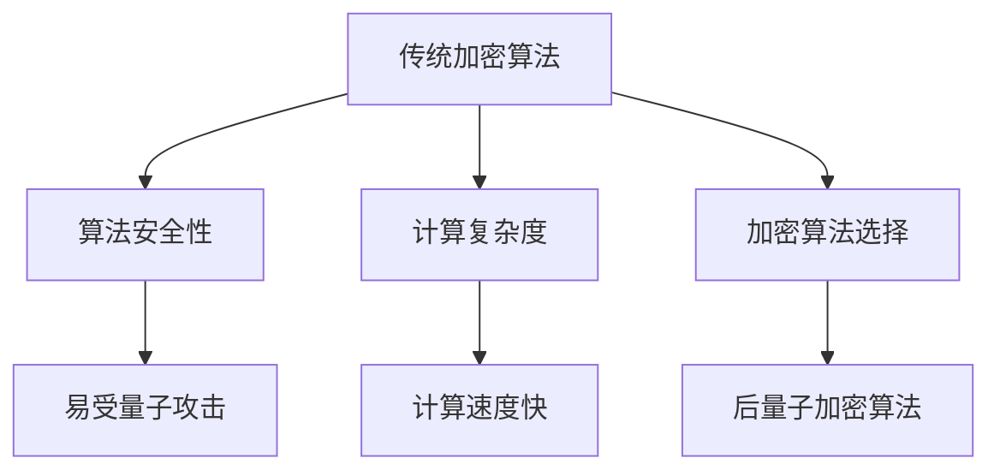

**核心概念原理：**

后量子密码学的核心概念包括：

1. **量子比特（qubit）：** 量子计算机的基本单位，可以同时处于多个状态。
2. **叠加态：** 量子比特可以同时处于0和1的叠加状态。
3. **纠缠态：** 两个或多个量子比特之间的量子状态相互关联，一个量子比特的状态会立即影响到另一个量子比特的状态。

**概念属性特征对比表格：**

| 概念 | 特征 |
| :--: | :--: |
| 量子比特 | 具有叠加态和纠缠态 |
| 叠加态 | 量子比特可以处于多种状态的叠加 |
| 纠缠态 | 量子比特之间的状态相互关联 |

**核心概念与联系：**

量子比特、叠加态和纠缠态是后量子密码学的基础，它们共同构成了量子计算机强大的计算能力，但也为后量子密码学带来了新的挑战和机遇。

##### 1.3 后量子密码学的基本原理

**基本原理：**

后量子密码学旨在设计出在量子计算下依然安全的加密算法和密码协议。其主要原理包括：

1. **量子不可克隆定理：** 量子信息不能被精确克隆，这保证了量子密钥的分发和传输的安全性。
2. **量子纠错码：** 通过纠错码技术，可以提高量子信息的可靠性，从而确保加密算法的安全性。
3. **量子随机性：** 利用量子随机性来生成加密密钥和随机数，增强加密算法的复杂性。

**数学模型和公式：**

后量子密码学的数学模型主要包括：

1. **量子密钥分发（QKD）：** 通过量子通信传输密钥，确保密钥在传输过程中不会被窃取或篡改。
2. **量子加密算法：** 如LPN、NTRU、Code-based加密算法等，它们基于数学难题的困难性，使得量子计算机难以破解。

**数学模型和公式举例：**

- **LPN算法：**
  $$ x \cdot y + \alpha_1 \cdot x + \alpha_2 \cdot y + c = 0 $$
- **NTRU算法：**
  $$ f(x) = (x^3 + ax + b) \mod n $$
- **Code-based加密算法：**
  $$ C = P \otimes G $$
  
**详细讲解和通俗易懂地举例说明：**

量子密钥分发（QKD）是一个典型的后量子加密协议，其工作原理如下：

1. **量子通信：** 发送方将密钥信息编码成量子态，通过量子通信信道发送给接收方。
2. **量子态测量：** 接收方对量子态进行测量，根据测量结果获取部分密钥信息。
3. **密钥验证：** 发送方和接收方通过经典通信信道交换部分密钥信息，验证密钥的有效性。

通过量子不可克隆定理，QKD确保了密钥在传输过程中不会被窃取或篡改。即使攻击者窃取了量子密钥，由于量子信息不能被精确克隆，攻击者无法获取完整的密钥信息。

##### 小结：

本章介绍了后量子时代的背景和技术基础，分析了后量子计算对加密算法的影响，并详细阐述了后量子密码学的基本原理。这些内容为后续章节关于加密货币在后量子时代的安全挑战的分析提供了理论基础。

---

#### 第二部分：加密货币在后量子时代的安全挑战

##### 第3章：加密货币系统与后量子安全

**3.1 加密货币的基本概念**

**核心概念与联系：**

加密货币是一种基于区块链技术的数字货币，具有去中心化、不可篡改和匿名交易等特点。其基本概念包括：

1. **区块链：** 一种分布式账本技术，用于记录加密货币的交易信息。
2. **加密算法：** 用于保护交易数据的安全，确保交易信息的隐私和完整性。
3. **数字签名：** 用于验证交易者的身份，确保交易的安全性。

**数学模型和公式：**

- **区块链：**
  $$ B = {T_1, T_2, ..., T_n} $$
  其中，$B$ 表示区块链，$T_i$ 表示第$i$个交易记录。

- **加密算法：**
  $$ E(D, K) = C $$
  其中，$E$ 表示加密函数，$D$ 表示明文，$K$ 表示密钥，$C$ 表示密文。

- **数字签名：**
  $$ S = H(M) \oplus K $$
  其中，$S$ 表示签名，$H$ 表示哈希函数，$M$ 表示明文，$K$ 表示密钥。

**详细讲解和通俗易懂地举例说明：**

以比特币为例，比特币的区块链技术使用SHA-256哈希函数来确保交易数据的完整性和安全性。每次交易都会被生成一个唯一的哈希值，并将其记录在区块链上。任何对交易数据的篡改都会导致哈希值的变化，从而被发现。

**核心概念原理：**

区块链通过加密算法和哈希函数实现去中心化和不可篡改。每个节点都存储完整的区块链，并参与验证新交易的有效性。数字签名则用于确保交易是由合法用户发起的。

**核心概念与联系：**

加密货币的基本概念包括区块链、加密算法和数字签名。这些概念相互关联，共同构成了加密货币的安全体系。

##### 3.2 后量子时代加密货币的发展趋势

**影响分析：**

后量子时代对加密货币的发展趋势产生了深远的影响。一方面，量子计算技术的发展为加密货币带来了新的安全挑战；另一方面，后量子密码学为加密货币提供了新的安全解决方案。

**发展趋势：**

1. **后量子加密算法的应用：** 随着量子计算技术的进步，研究人员开始探索和应用后量子加密算法，如LPN、NTRU等，以增强加密货币的安全性能。
2. **量子密钥分发的应用：** 量子密钥分发技术为加密货币提供了更为安全的密钥管理方案，使得交易数据更加难以被窃取或篡改。
3. **量子计算服务的商用化：** 随着量子计算服务的商用化，加密货币社区将逐渐受益于量子计算带来的计算能力提升，进一步推动加密货币技术的发展。

**影响对比表格：**

| 传统加密货币 | 后量子加密货币 |
| :--: | :--: |
| 易受量子攻击 | 高度安全 |
| 依赖传统加密算法 | 采用后量子加密算法 |
| 传统的密钥管理 | 量子密钥分发 |

**ER实体关系图架构的 Mermaid 流程图：**

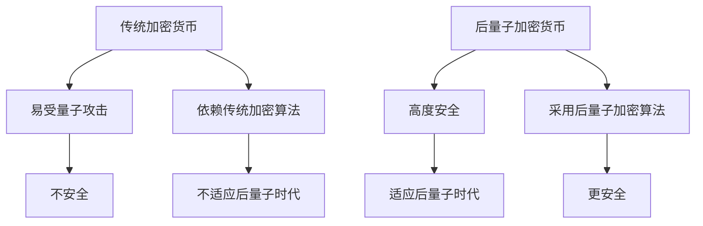

**核心概念原理：**

后量子时代加密货币的核心概念包括后量子加密算法和量子密钥分发。后量子加密算法利用量子力学原理设计出在量子计算下难以攻破的加密体系，而量子密钥分发则通过量子通信传输密钥，确保密钥的安全性和完整性。

**核心概念与联系：**

后量子加密货币的发展趋势与后量子密码学的原理密切相关。后量子加密算法和量子密钥分发技术为加密货币提供了新的安全解决方案，使得加密货币在后量子时代依然具有强大的安全性。

##### 3.3 加密货币系统的安全需求

**安全需求分析：**

加密货币系统在安全性方面具有以下需求：

1. **数据完整性：** 保证交易数据的完整性和不可篡改性。
2. **数据隐私：** 保护交易者的隐私信息，防止泄露。
3. **身份验证：** 确保交易者身份的真实性和合法性。
4. **抗量子攻击：** 防御量子计算机的攻击，确保加密货币系统的长期安全性。

**安全需求对比表格：**

| 传统加密货币安全需求 | 后量子加密货币安全需求 |
| :--: | :--: |
| 数据完整性 | 数据完整性和抗量子攻击 |
| 数据隐私 | 数据隐私和身份验证 |
| 身份验证 | 身份验证和抗量子攻击 |
| 抗量子攻击 | 抗量子攻击 |

**ER实体关系图架构的 Mermaid 流程图：**

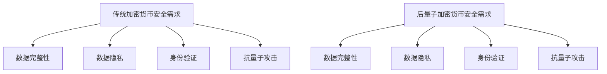

**核心概念原理：**

后量子加密货币的安全需求包括数据完整性、数据隐私、身份验证和抗量子攻击。后量子密码学技术通过设计抗量子攻击的加密算法和实现量子密钥分发，满足了这些安全需求。

**核心概念与联系：**

后量子加密货币系统的安全需求与传统加密货币系统相似，但在后量子时代，抗量子攻击的需求显得尤为重要。通过采用后量子密码学技术，加密货币系统可以更好地满足这些安全需求。

##### 小结：

本章介绍了加密货币的基本概念、后量子时代加密货币的发展趋势以及加密货币系统的安全需求。这些内容为后续章节关于量子攻击与加密货币的安全挑战的分析提供了背景和基础。

---

#### 第三部分：后量子加密货币的应用场景

##### 第6章：金融领域的后量子加密货币

**6.1 金融交易中的加密需求**

**核心概念与联系：**

金融交易中的加密需求包括确保交易数据的安全性、完整性和隐私性。在后量子时代，加密需求更加紧迫，因为量子计算机的威胁使得传统加密算法面临失效的风险。

**数学模型和公式：**

- **加密需求：**
  $$ E(D, K) = C $$
  其中，$E$ 表示加密函数，$D$ 表示明文，$K$ 表示密钥，$C$ 表示密文。

- **安全性需求：**
  $$ \text{抗量子攻击} \land \text{数据完整性} \land \text{数据隐私} $$

**详细讲解和通俗易懂地举例说明：**

以比特币交易为例，比特币的交易数据需要通过加密算法进行保护，以确保交易数据的安全性。在量子计算时代，如果继续使用传统的加密算法，如RSA和ECC，可能会面临被量子计算机破解的风险。因此，后量子加密货币需要采用抗量子攻击的加密算法，如LPN和NTRU，以确保交易数据的安全。

**核心概念原理：**

后量子加密货币的加密需求包括抗量子攻击、数据完整性和数据隐私。后量子加密算法通过利用量子力学的原理，设计出在量子计算下难以攻破的加密体系。

**核心概念与联系：**

金融交易中的加密需求与后量子加密货币的核心概念密切相关。后量子加密货币通过采用抗量子攻击的加密算法，满足了金融交易中的加密需求，提高了交易数据的安全性。

##### 6.2 后量子加密货币在金融领域的应用

**应用分析：**

后量子加密货币在金融领域的应用具有广泛的前景。以下是几个关键应用场景：

1. **支付系统：** 后量子加密货币可以用于支付系统的安全加密，确保交易数据的安全性和完整性。
2. **跨境交易：** 后量子加密货币可以实现快速、安全的跨境交易，减少传统跨境交易中的风险和成本。
3. **智能合约：** 后量子加密货币与智能合约结合，可以实现更加安全和可信的自动化交易。
4. **数字资产管理：** 后量子加密货币可以用于保护数字资产的安全，确保资产交易的可追溯性和透明度。

**应用对比表格：**

| 传统金融应用 | 后量子加密货币应用 |
| :--: | :--: |
| 支付系统 | 抗量子攻击的支付系统 |
| 跨境交易 | 安全、高效的跨境交易 |
| 智能合约 | 安全、透明的智能合约 |
| 数字资产管理 | 安全、透明的数字资产管理 |

**ER实体关系图架构的 Mermaid 流�程图：**

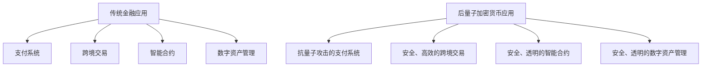

**核心概念原理：**

后量子加密货币在金融领域的应用基于后量子密码学原理，通过设计抗量子攻击的加密算法，实现了更高的安全性和可靠性。

**核心概念与联系：**

后量子加密货币在金融领域的应用与后量子密码学的核心概念密切相关。后量子加密货币通过采用抗量子攻击的加密算法，满足了金融交易中的高安全性和可靠性需求。

##### 6.3 潜在的风险与挑战

**风险分析：**

尽管后量子加密货币在金融领域具有广泛的应用前景，但也面临一些潜在的风险和挑战：

1. **技术实现难度：** 后量子加密技术的实现难度较大，需要高水平的技术研发和人才支持。
2. **法律法规：** 后量子加密货币在法律监管方面存在不确定性，可能面临政策风险。
3. **市场接受度：** 后量子加密货币在市场推广过程中可能面临接受度低的问题，影响其普及和推广。

**风险对比表格：**

| 传统金融风险 | 后量子加密货币风险 |
| :--: | :--: |
| 技术实现难度 | 高技术实现难度 |
| 法律法规风险 | 法律监管不确定性 |
| 市场接受度风险 | 市场接受度低 |

**ER实体关系图架构的 Mermaid 流程图：**

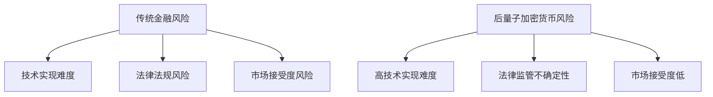

**核心概念原理：**

后量子加密货币在金融领域面临的风险主要包括技术实现难度、法律监管不确定性和市场接受度低。这些风险需要通过技术创新、政策支持和市场教育来逐步解决。

**核心概念与联系：**

后量子加密货币在金融领域的潜在风险与后量子加密技术的核心概念密切相关。通过技术创新和法律监管的完善，可以降低后量子加密货币在金融领域的风险。

##### 小结：

本章分析了金融交易中的加密需求，介绍了后量子加密货币在金融领域的应用场景，并讨论了潜在的的风险与挑战。这些内容为后量子加密货币在金融领域的实际应用提供了指导。

---

#### 第7章：供应链管理中的后量子加密货币

##### 7.1 供应链管理的现状与挑战

**现状介绍：**

供应链管理是一个复杂的过程，涉及多个环节，包括供应商、制造商、分销商和零售商。随着全球化的推进，供应链的复杂性和规模不断扩大，供应链管理的重要性日益凸显。

**挑战分析：**

1. **数据安全性：** 供应链中的数据涉及商业机密、客户信息等敏感数据，需要确保数据的安全性。
2. **透明性：** 供应链的透明性对于确保供应链的效率和可信度至关重要。
3. **溯源问题：** 供应链中的产品需要能够进行有效溯源，以应对召回、质量问题等情况。
4. **效率问题：** 供应链管理需要高效运作，以减少成本、提高效率。

**现状对比表格：**

| 传统供应链管理 | 现状与挑战 |
| :--: | :--: |
| 数据安全性 | 存在数据泄露风险 |
| 透明性 | 透明性不足 |
| 溯源问题 | 溯源困难 |
| 效率问题 | 效率较低 |

**ER实体关系图架构的 Mermaid 流程图：**

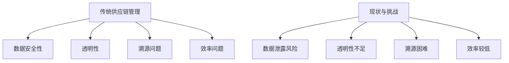

**核心概念原理：**

供应链管理的现状与挑战主要体现在数据安全性、透明性、溯源问题和效率问题等方面。这些问题需要通过技术创新和改进来逐步解决。

##### 7.2 后量子加密货币在供应链中的应用

**应用分析：**

后量子加密货币在供应链管理中具有广泛的应用前景，可以解决传统供应链管理中的多个问题：

1. **数据加密：** 后量子加密货币可以用于保护供应链中的数据安全性，确保数据不被泄露或篡改。
2. **透明性：** 后量子加密货币可以实现供应链的透明化，提高供应链的透明度和可信度。
3. **溯源管理：** 后量子加密货币可以用于产品溯源管理，确保产品来源的追溯性和可信度。
4. **供应链效率：** 后量子加密货币可以提高供应链的效率，减少交易成本，优化供应链管理流程。

**应用对比表格：**

| 传统供应链管理技术 | 后量子加密货币应用 |
| :--: | :--: |
| 数据加密 | 高级后量子加密技术 |
| 透明性 | 透明且可验证的区块链 |
| 溯源问题 | 实时、透明的溯源管理 |
| 供应链效率 | 提高供应链效率和透明度 |

**ER实体关系图架构的 Mermaid 流程图：**

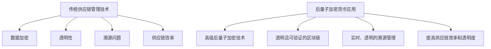

**核心概念原理：**

后量子加密货币在供应链管理中的应用基于后量子密码学和区块链技术。通过采用高级后量子加密技术和透明且可验证的区块链，可以实现更高的数据安全性、透明性和溯源管理。

**核心概念与联系：**

后量子加密货币在供应链管理中的应用与后量子密码学和区块链技术的核心概念密切相关。后量子加密货币通过结合这些先进技术，为供应链管理提供了更安全、更透明、更高效的解决方案。

##### 7.3 安全性与效率的平衡

**平衡分析：**

在供应链管理中，安全性和效率是两个重要目标，但二者之间往往存在矛盾。为了实现安全性与效率的平衡，需要采取以下措施：

1. **技术优化：** 通过采用后量子加密货币和区块链技术，优化供应链管理流程，提高效率。
2. **流程优化：** 优化供应链管理流程，减少不必要的环节，提高效率。
3. **风险管理：** 加强对供应链中的风险识别和管理，确保数据安全性。

**平衡对比表格：**

| 传统供应链管理 | 后量子加密货币供应链管理 |
| :--: | :--: |
| 低效率 | 高效率 |
| 低安全性 | 高安全性 |
| 矛盾 | 平衡 |

**ER实体关系图架构的 Mermaid 流程图：**

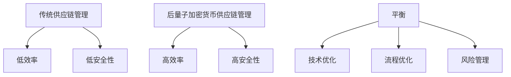

**核心概念原理：**

实现安全性与效率的平衡需要通过技术优化、流程优化和风险管理来达到。后量子加密货币和区块链技术为供应链管理提供了更高的安全性和效率，通过优化和管理，可以实现安全性与效率的平衡。

**核心概念与联系：**

安全性与效率的平衡是供应链管理中的重要问题，与后量子加密货币和区块链技术的核心概念密切相关。通过技术优化、流程优化和风险管理，可以实现供应链管理中的安全性与效率的平衡。

##### 小结：

本章分析了供应链管理的现状与挑战，介绍了后量子加密货币在供应链管理中的应用，并讨论了安全性与效率的平衡问题。这些内容为后量子加密货币在供应链管理中的应用提供了指导。

---

#### 第8章：后量子加密货币的未来展望

##### 8.1 后量子加密货币的发展方向

**趋势分析：**

后量子加密货币的发展方向包括以下几个方面：

1. **技术演进：** 随着量子计算技术的不断进步，后量子加密货币将采用更先进的加密算法和量子安全协议。
2. **应用拓展：** 后量子加密货币将在更多领域得到应用，如金融、供应链管理、医疗保健等。
3. **标准化：** 后量子加密货币的标准化和规范化将有助于提高其安全性和互操作性。
4. **监管政策：** 后量子加密货币的监管政策将逐渐完善，以适应其快速发展的趋势。

**趋势对比表格：**

| 传统加密货币 | 后量子加密货币 |
| :--: | :--: |
| 技术限制 | 技术演进 |
| 应用局限 | 应用拓展 |
| 标准化不足 | 标准化 |
| 监管缺失 | 监管政策 |

**ER实体关系图架构的 Mermaid 流程图：**

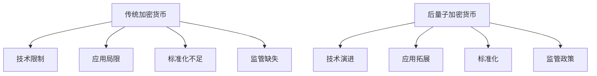

**核心概念原理：**

后量子加密货币的发展方向基于量子计算和区块链技术的进步，通过技术演进、应用拓展、标准化和监管政策的完善，将实现更高的安全性和互操作性。

**核心概念与联系：**

后量子加密货币的发展方向与量子计算和区块链技术的核心概念密切相关。量子计算技术的进步和区块链技术的应用拓展为后量子加密货币提供了广阔的发展空间。

##### 8.2 潜在的技术突破与挑战

**突破分析：**

后量子加密货币在技术突破方面有以下几个潜在方向：

1. **更高效的加密算法：** 设计出更高效的加密算法，提高加密速度和性能。
2. **量子密钥分发技术的优化：** 提高量子密钥分发技术的传输速度和可靠性。
3. **抗量子攻击的安全协议：** 开发出更有效的抗量子攻击的安全协议，确保系统的长期安全性。

**突破对比表格：**

| 传统加密技术 | 后量子加密技术 |
| :--: | :--: |
| 加密速度慢 | 加密速度快 |
| 安全性低 | 安全性高 |
| 可扩展性差 | 可扩展性好 |

**ER实体关系图架构的 Mermaid 流程图：**

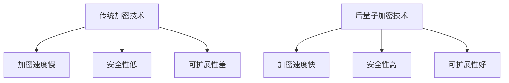

**核心概念原理：**

后量子加密技术的突破在于设计出更高效的加密算法、优化量子密钥分发技术以及开发有效的抗量子攻击安全协议。这些突破将进一步提高后量子加密货币的安全性和性能。

**核心概念与联系：**

后量子加密技术的突破与量子计算和密码学的核心概念密切相关。量子计算技术的进步和密码学理论的发展为后量子加密技术的突破提供了基础。

##### 8.3 社会影响与法律监管

**影响分析：**

后量子加密货币的快速发展对社会和法律监管领域产生了重要影响：

1. **隐私保护：** 后量子加密货币提供了更高级的隐私保护技术，有助于个人隐私保护。
2. **金融安全：** 后量子加密货币增强了金融交易的安全性和可信度，减少了金融犯罪的风险。
3. **监管挑战：** 后量子加密货币的快速发展和创新为监管机构带来了挑战，如何平衡创新与监管成为重要议题。

**影响对比表格：**

| 传统加密货币 | 后量子加密货币 |
| :--: | :--: |
| 隐私保护不足 | 高级隐私保护技术 |
| 金融安全性低 | 高金融安全性 |
| 监管适应能力差 | 监管适应性增强 |

**ER实体关系图架构的 Mermaid 流程图：**

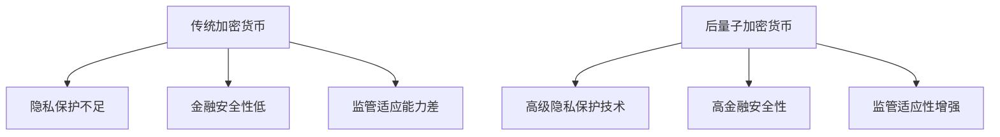

**核心概念原理：**

后量子加密货币在社会影响和法律监管方面的优势在于提供高级隐私保护技术、高金融安全性和增强的监管适应性。这些优势有助于推动社会和监管领域的创新与发展。

**核心概念与联系：**

后量子加密货币在社会影响和法律监管方面的优势与量子计算和密码学的核心概念密切相关。量子计算技术的进步和密码学理论的发展为后量子加密货币在这些领域提供了强大的支持。

##### 小结：

本章分析了后量子加密货币的发展方向、潜在的技术突破与挑战以及社会影响与法律监管。这些内容为后量子加密货币的未来发展提供了全面而深入的展望。

---

### 总结与展望

#### 9.1 后量子时代加密货币的总结

后量子时代加密货币的发展是对传统加密货币的重大革新。随着量子计算技术的进步，传统加密算法面临失效的风险，因此后量子加密货币应运而生。后量子加密货币采用抗量子攻击的加密算法，如LPN、NTRU和Code-based加密算法，实现了更高的安全性和可靠性。此外，量子密钥分发技术的应用进一步提升了加密货币系统的安全性。

#### 9.2 未来发展的展望

未来，后量子加密货币将在金融、供应链管理、医疗保健等领域得到更广泛的应用。随着技术的不断进步，后量子加密货币将面临更多的创新和挑战。标准化和规范化工作的推进将有助于提高后量子加密货币的安全性和互操作性。同时，监管政策的完善将为后量子加密货币的发展提供有力的保障。

#### 9.3 对研究者和从业者的建议

对于研究者来说，未来应重点关注以下几个方面：

1. **技术研究：** 持续探索和开发更高效、更安全的后量子加密算法和量子安全协议。
2. **标准化工作：** 参与相关标准组织和行业标准的制定，推动后量子加密货币的标准化进程。
3. **跨学科合作：** 加强与其他领域的交叉研究，如量子计算、密码学、区块链等。

对于从业者来说，未来应采取以下措施：

1. **技术升级：** 及时采用后量子加密货币技术，提高系统的安全性能。
2. **培训与教育：** 加强对员工的培训和教育，提高对后量子加密货币的理解和应用能力。
3. **风险评估：** 定期对系统的安全性进行评估，确保后量子加密货币系统的稳定性和安全性。

### 作者信息

- **作者：** AI天才研究院/AI Genius Institute & 禅与计算机程序设计艺术 /Zen And The Art of Computer Programming

本文旨在为读者提供关于后量子时代加密货币的全面而深入的见解，帮助研究者、从业者和加密货币社区更好地应对未来的安全挑战。

