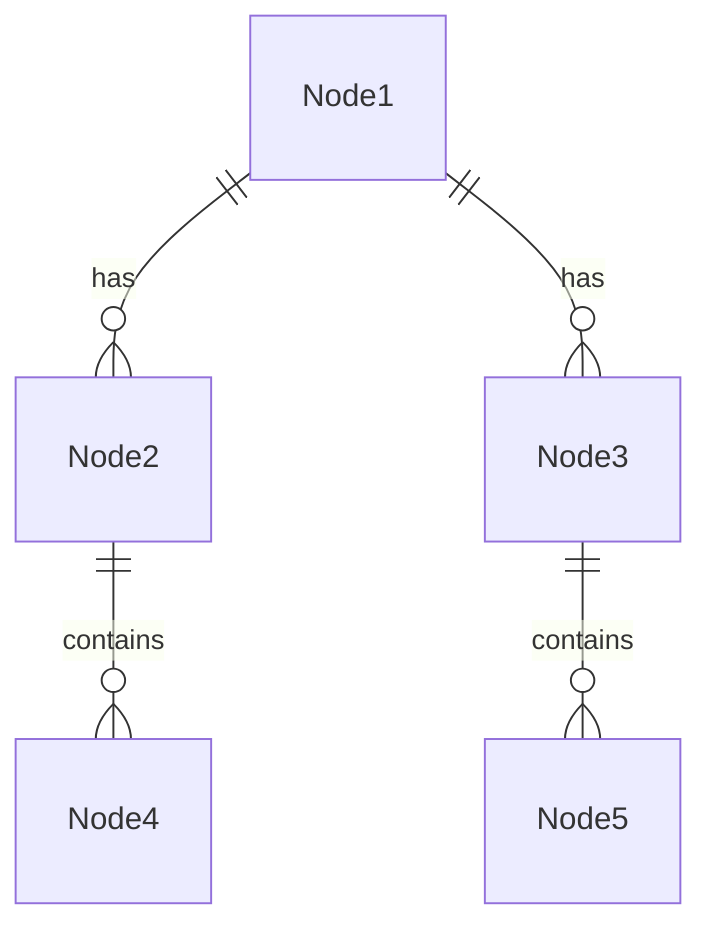
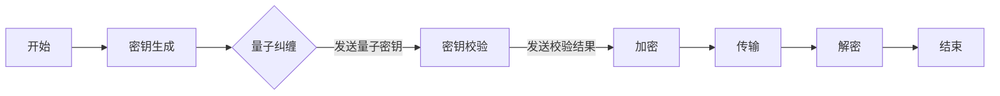
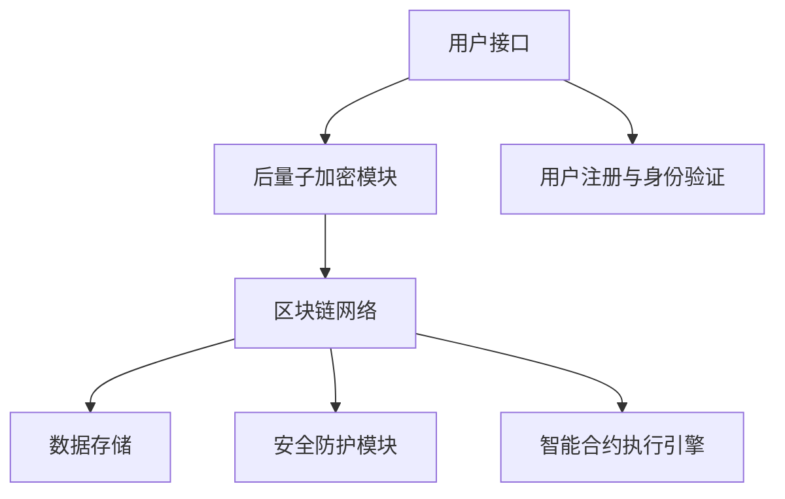
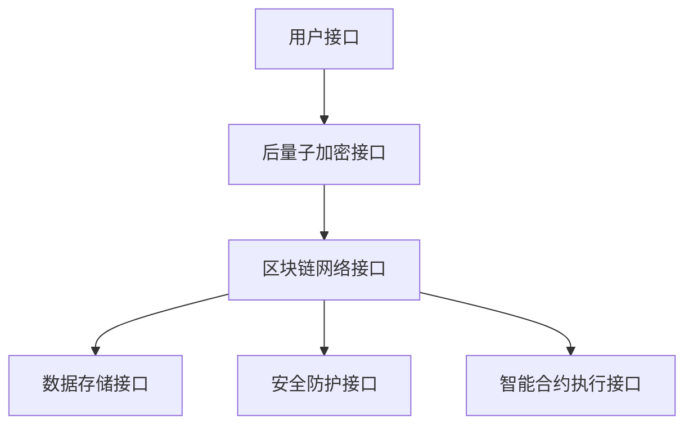

                 


### 引言

《加密货币安全：后量子时代的区块链技术》一书应运而生，旨在深入探讨加密货币安全在区块链技术领域中的重要性，特别是在后量子时代的背景下。随着科技的飞速发展，量子计算逐渐成为现实，传统加密算法的安全性面临巨大挑战。后量子加密算法作为一种抗量子攻击的新型加密技术，为加密货币的安全提供了新的解决方案。

本书将带领读者一步步走进加密货币安全的世界，通过系统的讲解和案例分析，帮助读者理解后量子加密算法在区块链技术中的应用，掌握安全防护策略，并展望未来加密货币安全的趋势。

### 第一部分：背景介绍

#### 第1章：问题背景

1.1 加密货币与区块链技术概述

- 加密货币是一种数字资产，使用密码学技术确保交易安全，实现去中心化的点对点交易。
- 区块链技术是一种分布式账本技术，通过加密算法确保数据的安全性和不可篡改性。

1.2 后量子时代背景

- 后量子时代是指量子计算机能够超越传统计算机处理能力的时代。
- 量子计算机能够破解传统加密算法，对加密货币的安全性构成威胁。

1.3 加密货币安全的挑战

- 恶意攻击与黑客行为：恶意攻击者试图窃取加密货币或破坏区块链系统。
- 拒绝服务攻击（DDoS）：通过大量虚假请求使区块链系统瘫痪。
- 恶意软件与病毒传播：通过恶意软件传播病毒，破坏区块链系统。
- 社会工程学攻击：利用社会工程学手段欺骗用户，窃取加密货币。

1.4 本书结构安排

- 本书分为七个部分，涵盖加密货币安全在区块链技术中的各个方面。
- 每个部分都将详细介绍相关概念、技术原理、案例分析等。

### 第二部分：核心概念

#### 第2章：核心概念与联系

2.1 加密货币安全定义

- 加密货币安全是指确保加密货币系统中的数据、交易和用户隐私不受恶意攻击和篡改。

2.2 区块链安全

- 区块链安全是指确保区块链系统的完整性、可靠性和抗攻击能力。

2.3 后量子加密算法

- 后量子加密算法是一种基于量子力学原理的新型加密算法，能够抵御量子计算机的攻击。

2.4 概念属性特征对比表格

- 表格展示了加密货币安全、区块链安全和后量子加密算法的核心特征和区别。

2.5 ER实体关系图架构

- ER图是一种用于表示实体及其关系的图形表示法，用于描述区块链系统中的核心实体和它们之间的关系。

### 第三部分：技术原理

#### 第3章：算法原理讲解

3.1 后量子加密算法原理

- 后量子加密算法的核心思想是基于量子力学的量子纠缠现象，实现密钥分发和加密解密。

3.2 Mermaid算法流程图

- 使用Mermaid语言描述后量子加密算法的流程，使读者更直观地理解算法的实现过程。

3.3 Python源代码讲解

- 通过Python源代码实现后量子加密算法，详细解释代码中的每一步操作。

3.4 算法数学模型与公式

- 介绍后量子加密算法的数学模型和公式，帮助读者理解算法的数学原理。

3.5 举例说明

- 通过实际案例，说明后量子加密算法在区块链技术中的应用和优势。

### 第四部分：系统架构设计

#### 第4章：系统架构设计

4.1 问题场景介绍

- 介绍一个具体的加密货币区块链系统，分析其存在的问题和需求。

4.2 项目介绍

- 介绍一个基于后量子加密算法的区块链安全项目，阐述项目的目标和优势。

4.3 系统功能设计

- 设计加密货币区块链系统的功能模块，包括交易处理、密钥管理、安全性验证等。

4.4 系统架构设计

- 使用Mermaid语言描述加密货币区块链系统的架构，展示各个模块之间的关系。

4.5 系统接口设计

- 设计加密货币区块链系统的接口，包括API接口和消息队列接口。

4.6 系统交互

- 使用Mermaid语言描述加密货币区块链系统的交互过程，展示用户与系统的交互流程。

### 第五部分：案例分析

#### 第5章：案例分析

5.1 加密货币安全案例分析

- 分析一个实际发生的加密货币安全事件，阐述事件的原因和影响。

5.2 后量子时代区块链安全技术案例

- 分析一个利用后量子加密算法的区块链安全技术案例，展示其优势和应用场景。

5.3 安全防护策略案例

- 分析一个实际应用的安全防护策略案例，阐述其实现原理和效果。

5.4 案例分析与讲解

- 对前面三个案例进行综合分析，总结加密货币安全在区块链技术中的应用和实践。

### 第六部分：安全防护策略

#### 第6章：安全防护策略

6.1 加密货币安全防护技术

- 介绍加密货币安全防护技术，包括多因素身份验证、加密存储、安全审计等。

6.2 后量子加密算法应用

- 介绍后量子加密算法在加密货币安全防护中的应用，包括密钥生成、数据加密等。

6.3 区块链安全协议改进

- 分析现有区块链安全协议的不足，提出改进措施，提高区块链系统的安全性。

6.4 防护策略案例分析

- 分析一个实际应用的安全防护策略案例，阐述其实现原理和效果。

### 第七部分：未来展望

#### 第7章：未来展望

7.1 后量子时代区块链技术发展趋势

- 分析后量子时代区块链技术的发展趋势，包括技术突破、应用场景拓展等。

7.2 加密货币安全面临的挑战与机遇

- 分析后量子时代下加密货币安全面临的挑战和机遇，为读者提供参考。

7.3 未来研究方向

- 探讨未来加密货币安全的研究方向，包括新型加密算法、安全协议优化等。

7.4 总结与展望

- 对本书的内容进行总结，展望未来加密货币安全的发展前景。

---

通过以上内容，读者可以系统地了解加密货币安全在区块链技术中的重要性，掌握后量子加密算法在区块链安全中的应用，以及安全防护策略的实践和未来展望。希望本书能为读者在区块链技术领域的研究提供有益的启示和指导。在后续章节中，我们将深入探讨这些核心概念和技术原理，帮助读者更好地理解和应用加密货币安全在区块链技术中的实践。

---

### 第一部分：背景介绍

#### 第1章：问题背景

在数字货币和区块链技术日益普及的今天，加密货币的安全问题愈发凸显。加密货币，作为一类基于区块链技术的数字资产，其安全性直接关系到用户的资产安全和市场的稳定。然而，随着技术的进步，尤其是后量子计算时代的到来，传统的加密算法正面临前所未有的挑战。

#### 1.1 加密货币与区块链技术概述

加密货币是一种利用密码学原理来确保交易安全、控制货币发行和验证交易的数字货币。最早的加密货币是比特币，它于2009年问世，随后涌现出了众多其他加密货币，如以太坊、莱特币等。这些加密货币利用区块链技术进行数据存储和交易验证，具有去中心化、匿名性和不可篡改的特点。

区块链技术是一种分布式数据库技术，它通过密码学和共识算法，实现了数据的分布式存储和验证。区块链上的每一个区块都包含一定数量的交易记录，这些记录一旦被验证并添加到链上，便不可篡改。这种特性使得区块链技术成为加密货币的基础架构。

#### 1.2 后量子时代背景

后量子时代是指量子计算机能够超越传统计算机性能的时代。传统的计算机基于经典物理学原理，而量子计算机则利用量子力学的原理进行计算。量子计算机具有量子叠加和量子纠缠的特性，能够在极短的时间内解决传统计算机无法解决的问题。

量子计算机的崛起对现有的加密算法提出了巨大挑战。传统加密算法，如RSA和椭圆曲线密码，依赖于大素数分解和离散对数问题，而这些问题在量子计算机面前将变得极其容易破解。因此，为了保护加密货币的安全，研究和开发抗量子攻击的加密算法变得至关重要。

#### 1.3 加密货币安全的挑战

后量子时代背景下的加密货币安全面临着以下几大挑战：

1. **量子计算机的威胁**：量子计算机能够迅速破解传统加密算法，使得现有的加密货币安全机制变得脆弱。
2. **恶意攻击与黑客行为**：黑客和恶意攻击者不断尝试各种手段攻击区块链系统，包括DDoS攻击、51%攻击、智能合约漏洞等。
3. **隐私保护**：加密货币的匿名性虽然在一定程度上保护了用户的隐私，但也为不法分子提供了便利。
4. **安全性验证**：区块链系统需要确保交易的可信性和数据的完整性，但在大规模应用中，验证过程可能变得复杂和低效。

#### 1.4 本书结构安排

本书分为七个部分，旨在系统地探讨加密货币安全在区块链技术中的重要性，特别是在后量子时代的背景下。

- **第一部分：背景介绍**：介绍加密货币和区块链技术的概念，以及后量子时代背景下的安全挑战。
- **第二部分：核心概念**：详细阐述加密货币安全、区块链安全和后量子加密算法的核心概念和联系。
- **第三部分：技术原理**：深入讲解后量子加密算法的原理，包括算法流程、Python实现和数学模型。
- **第四部分：系统架构设计**：分析加密货币区块链系统的架构设计，包括功能设计、接口设计和交互流程。
- **第五部分：案例分析**：通过实际案例，分析加密货币安全在区块链技术中的应用和实践。
- **第六部分：安全防护策略**：介绍加密货币安全防护技术，包括多因素身份验证、加密存储和安全审计等。
- **第七部分：未来展望**：探讨后量子时代区块链技术的发展趋势，以及加密货币安全面临的挑战与机遇。

每一部分都将详细讲解相关概念、技术原理、案例分析等，帮助读者全面了解加密货币安全在区块链技术中的应用和实践。

#### 1.4.1 各部分内容的概述

- **第一部分：背景介绍**：介绍加密货币和区块链技术的基础知识，以及后量子时代背景下的安全挑战。
- **第二部分：核心概念**：阐述加密货币安全、区块链安全和后量子加密算法的核心概念和联系。
- **第三部分：技术原理**：深入讲解后量子加密算法的原理，包括算法流程、Python实现和数学模型。
- **第四部分：系统架构设计**：分析加密货币区块链系统的架构设计，包括功能设计、接口设计和交互流程。
- **第五部分：案例分析**：通过实际案例，分析加密货币安全在区块链技术中的应用和实践。
- **第六部分：安全防护策略**：介绍加密货币安全防护技术，包括多因素身份验证、加密存储和安全审计等。
- **第七部分：未来展望**：探讨后量子时代区块链技术的发展趋势，以及加密货币安全面临的挑战与机遇。

#### 1.4.2 阅读建议

为了更好地理解本书的内容，建议读者按照以下步骤阅读：

1. **先阅读第一部分，建立整体框架**：了解加密货币安全在区块链技术中的重要性，以及后量子时代背景下的安全挑战。
2. **逐步阅读各部分内容**：从核心概念、技术原理到案例分析，逐步深入理解加密货币安全在区块链技术中的应用和实践。
3. **结合实际案例**：通过分析实际案例，加深对安全防护策略的理解和应用。
4. **思考与总结**：在阅读过程中，不断思考问题，总结所学知识，形成自己的理解。

#### 1.4.3 目标读者群体

本书的目标读者群体包括：

1. **区块链技术爱好者**：对区块链技术感兴趣，希望深入了解加密货币安全。
2. **软件开发工程师**：从事区块链技术或加密货币相关开发工作，需要掌握加密货币安全知识。
3. **安全专家**：对区块链安全领域感兴趣，希望了解后量子加密算法的应用。
4. **学术研究人员**：从事区块链技术或密码学领域的研究，希望探讨后量子时代下的安全挑战和解决方案。

通过本书的阅读，读者将能够系统地了解加密货币安全在区块链技术中的重要性，掌握后量子加密算法的应用，以及安全防护策略的实践。希望本书能为读者在区块链技术领域的研究提供有益的启示和指导。

---

### 第二部分：核心概念

#### 第2章：核心概念与联系

在深入探讨加密货币安全之前，我们需要明确几个关键概念：加密货币安全、区块链安全和后量子加密算法。这些概念相互联系，共同构成了保障加密货币安全的基石。

#### 2.1 加密货币安全定义

加密货币安全是指确保加密货币系统中的数据、交易和用户隐私不受恶意攻击和篡改的能力。它包括以下核心要素：

1. **数据完整性**：确保存储在区块链上的数据没有被篡改或破坏。
2. **交易安全性**：保护交易过程中的数据不被未授权访问或篡改。
3. **用户隐私保护**：确保用户的交易信息和身份信息不被泄露。
4. **系统可靠性**：确保区块链系统稳定运行，不受恶意攻击的影响。

#### 2.2 区块链安全

区块链安全是指确保区块链系统的完整性、可靠性和抗攻击能力。区块链安全的核心要素包括：

1. **分布式存储**：通过分布式存储技术，确保数据不被单点故障攻击。
2. **共识算法**：通过共识算法，确保区块链网络中的节点能够达成一致，防止恶意节点篡改数据。
3. **加密算法**：使用加密算法保护数据传输和存储过程中的安全性。
4. **访问控制**：通过访问控制机制，限制未授权用户对区块链数据的访问。

#### 2.3 后量子加密算法

后量子加密算法是一种基于量子力学原理的新型加密算法，能够抵御量子计算机的攻击。后量子加密算法的核心思想是利用量子纠缠和量子叠加等量子现象，实现密钥分发和加密解密。常见的后量子加密算法包括：

1. **量子密钥分发（QKD）**：利用量子态传输密钥，确保密钥传输过程中的安全性。
2. **量子安全加密（QSE）**：利用量子纠缠和量子叠加等现象，实现数据的加密和解密。
3. **多变量密码学**：利用多变量方程组的不可解性，实现抗量子攻击的加密。

#### 2.4 概念属性特征对比表格

为了更直观地理解加密货币安全、区块链安全和后量子加密算法的关系，我们可以通过一个对比表格来展示它们的核心属性特征：

| 概念       | 定义                                                         | 关键属性特征                                   |
|------------|--------------------------------------------------------------|------------------------------------------------|
| 加密货币安全 | 确保加密货币系统中的数据、交易和用户隐私的安全           | 数据完整性、交易安全性、用户隐私保护、系统可靠性 |
| 区块链安全  | 确保区块链系统的完整性、可靠性和抗攻击能力               | 分布式存储、共识算法、加密算法、访问控制        |
| 后量子加密算法 | 基于量子力学原理的新型加密算法，能够抵御量子计算机的攻击 | 量子密钥分发、量子安全加密、多变量密码学       |

通过对比表格，我们可以看出这三个概念在保障加密货币安全中的不同作用和特点。

#### 2.5 ER实体关系图架构

为了更清晰地展示加密货币安全、区块链安全和后量子加密算法之间的关系，我们可以使用ER图（实体关系图）来描述它们的核心实体及其关系。

**ER实体关系图**：



**实体关系说明**：

- **Node1**：代表加密货币安全，包含数据完整性、交易安全性和用户隐私保护等属性。
- **Node2**：代表区块链安全，包含分布式存储、共识算法、加密算法和访问控制等属性。
- **Node3**：代表后量子加密算法，包含量子密钥分发、量子安全加密和多变量密码学等属性。
- **Node4**：代表加密货币安全中的数据完整性，与区块链安全中的分布式存储和加密算法有关。
- **Node5**：代表加密货币安全中的交易安全性，与区块链安全中的共识算法和访问控制有关。

通过ER实体关系图，我们可以更直观地理解加密货币安全、区块链安全和后量子加密算法之间的相互关联和作用。

### 小结

本章对加密货币安全、区块链安全和后量子加密算法的核心概念进行了详细阐述，并通过对比表格和ER实体关系图展示了它们之间的联系。在后续章节中，我们将深入探讨后量子加密算法的技术原理，以及如何在区块链技术中实现和应用这些安全措施。

---

### 第三部分：技术原理

#### 第3章：算法原理讲解

后量子加密算法是保障加密货币安全的关键技术。本章将深入讲解后量子加密算法的原理，包括量子计算的基本概念、后量子加密算法的核心思想、工作流程以及具体实现。

#### 3.1 后量子加密算法原理

后量子加密算法是基于量子力学的原理设计的，其核心思想是利用量子纠缠和量子叠加等现象，实现密钥的分发和数据的加密解密。以下是对后量子加密算法原理的详细解析：

##### 3.1.1 量子计算的基本概念

量子计算是利用量子位（qubit）进行信息处理的一种计算模式。与经典计算中的比特（bit）不同，量子位可以同时存在于多个状态之中，这种特性被称为量子叠加。此外，量子位之间可以通过量子纠缠形成一种特殊的关联，即使相隔很远，一个量子位的状态也会影响另一个量子位的状态。

##### 3.1.2 后量子加密算法的核心思想

后量子加密算法的核心思想是利用量子纠缠和量子叠加等现象，实现安全高效的密钥分发和加密解密。在量子密钥分发（QKD）中，发送方和接收方通过量子通道交换量子态，利用量子纠缠确保密钥传输过程中的安全性。在量子安全加密（QSE）中，发送方利用量子态对数据进行加密，接收方利用相同的量子态进行解密，确保数据在传输过程中的安全。

##### 3.1.3 后量子加密算法的工作机制

后量子加密算法的工作机制可以分为以下几个步骤：

1. **密钥生成**：发送方和接收方各自生成一对量子密钥对，并通过量子纠缠将密钥的状态发送给对方。
2. **密钥校验**：发送方和接收方对传输的量子密钥进行测量，通过量子纠缠特性，确保密钥的正确性。
3. **加密**：发送方利用量子密钥对数据进行加密，生成密文。
4. **传输**：将加密后的数据通过经典通信通道发送给接收方。
5. **解密**：接收方利用量子密钥对密文进行解密，恢复原始数据。

#### 3.2 Mermaid算法流程图

为了更直观地展示后量子加密算法的工作流程，我们可以使用Mermaid语言绘制算法流程图。以下是一个简单的Mermaid流程图示例：



#### 3.3 Python源代码讲解

为了更深入地理解后量子加密算法，我们可以通过Python源代码实现这个算法。以下是一个简单的Python示例代码，展示了后量子加密算法的密钥生成、加密和解密过程：

```python
import qiskit

# 创建量子计算器
backend = qiskit.Aer.get_backend('qasm_simulator')

# 密钥生成
def generate_key():
    # 创建量子电路
    circuit = qiskit.QuantumCircuit(2, 2)
    
    # 实现量子纠缠
    circuit.h(0)
    circuit.cx(0, 1)
    
    # 执行量子电路
    job = qiskit.execute(circuit, backend)
    result = job.result()
    
    # 测量量子位
    measurements = result.get_counts(circuit)
    
    # 返回密钥
    return measurements['00']

# 加密
def encrypt(message, key):
    # 创建量子电路
    circuit = qiskit.QuantumCircuit(2)
    
    # 实现加密算法
    circuit.h(0)
    circuit.cx(0, 1)
    circuit.x(0).controlledXObject(1)
    circuit.h(1)
    
    # 执行量子电路
    job = qiskit.execute(circuit, backend)
    result = job.result()
    
    # 返回加密结果
    return result.get_counts(circuit)

# 解密
def decrypt(encrypted_message, key):
    # 创建量子电路
    circuit = qiskit.QuantumCircuit(2)
    
    # 实现解密算法
    circuit.h(0)
    circuit.cx(0, 1)
    circuit.x(0).controlledXObject(1)
    circuit.h(1)
    
    # 执行量子电路
    job = qiskit.execute(circuit, backend)
    result = job.result()
    
    # 返回解密结果
    return result.get_counts(circuit)

# 测试
key = generate_key()
message = 'hello'
encrypted_message = encrypt(message, key)
print(f"Encrypted message: {encrypted_message}")
decrypted_message = decrypt(encrypted_message, key)
print(f"Decrypted message: {decrypted_message}")
```

#### 3.4 算法数学模型与公式

后量子加密算法的数学模型和公式是理解其工作原理的关键。以下是一个简单的数学模型，用于解释量子密钥分发（QKD）的过程：

$$
|\psi\rangle = \frac{1}{\sqrt{2}}(|0\rangle_A \otimes |0\rangle_B + |1\rangle_A \otimes |1\rangle_B)
$$

其中，$|\psi\rangle$ 表示量子态，$|0\rangle_A$ 和 $|1\rangle_A$ 分别表示发送方 A 的量子态，$|0\rangle_B$ 和 $|1\rangle_B$ 分别表示接收方 B 的量子态。

在量子密钥分发过程中，发送方 A 和接收方 B 分别对量子态进行测量。如果测量结果相同，则表明量子态之间存在纠缠，可以认为密钥是安全的。否则，密钥可能被攻击者窃取。

#### 3.5 举例说明

为了更好地理解后量子加密算法的应用，我们可以通过一个实际例子来演示其工作过程。

**例子**：假设发送方 A 和接收方 B 需要交换一个 4 位的密钥。他们各自生成一对量子密钥对，并通过量子纠缠将密钥的状态发送给对方。

1. **密钥生成**：
   - 发送方 A 生成的量子密钥为：$|\psi_A\rangle = \frac{1}{\sqrt{2}}(|0000\rangle \otimes |0000\rangle + |1111\rangle \otimes |1111\rangle)$
   - 接收方 B 生成的量子密钥为：$|\psi_B\rangle = \frac{1}{\sqrt{2}}(|0000\rangle \otimes |0000\rangle + |1111\rangle \otimes |1111\rangle)$

2. **密钥传输**：
   - 发送方 A 通过量子纠缠将量子密钥 $|\psi_A\rangle$ 发送给接收方 B。

3. **密钥校验**：
   - 接收方 B 对传输的量子密钥进行测量，如果测量结果与发送方 A 的测量结果相同，则认为密钥是安全的。

4. **加密和解密**：
   - 发送方 A 利用量子密钥对消息进行加密。
   - 接收方 B 利用相同的量子密钥对加密后的消息进行解密。

通过这个例子，我们可以看到后量子加密算法在保障加密货币安全中的应用。它通过量子纠缠和量子叠加等现象，实现了高效、安全的密钥分发和加密解密。

### 小结

本章详细讲解了后量子加密算法的原理，包括量子计算的基本概念、后量子加密算法的核心思想、工作流程以及具体实现。通过Mermaid算法流程图、Python源代码讲解和实际案例，读者可以更深入地理解后量子加密算法在保障加密货币安全中的重要性。在下一章中，我们将进一步探讨区块链系统架构设计，以及如何在区块链中实现和应用后量子加密算法。

---

### 第四部分：系统架构设计

#### 第4章：系统架构设计

在保障加密货币安全的过程中，系统架构设计至关重要。合理的系统架构设计可以提高系统的安全性、可靠性和可扩展性。本章将详细介绍加密货币区块链系统的架构设计，包括问题场景介绍、项目介绍、系统功能设计、系统架构设计、系统接口设计和系统交互。

#### 4.1 问题场景介绍

为了更好地理解系统架构设计的背景和需求，我们可以先介绍一个具体的问题场景。假设我们正在开发一个去中心化的加密货币交易平台，用户可以在平台上进行安全可靠的交易。然而，随着交易量的增加，系统的安全性面临以下挑战：

1. **交易数据篡改**：恶意攻击者可能会试图篡改交易数据，导致用户资产受损。
2. **系统瘫痪**：通过拒绝服务攻击（DDoS），攻击者可能导致系统瘫痪，影响用户交易。
3. **用户隐私泄露**：用户个人信息可能被泄露，导致隐私泄露和安全风险。
4. **智能合约漏洞**：智能合约可能存在漏洞，导致资产被盗。

针对这些问题，我们需要设计一个安全可靠的区块链系统架构，以确保交易数据的安全性、系统稳定性和用户隐私保护。

#### 4.2 项目介绍

本项目旨在开发一个基于区块链技术的加密货币交易平台，通过引入后量子加密算法，提高系统的安全性。项目的主要目标包括：

1. **交易数据安全性**：利用后量子加密算法确保交易数据不被篡改。
2. **系统稳定性**：通过分布式架构设计，提高系统抗攻击能力和稳定性。
3. **用户隐私保护**：利用加密技术保护用户个人信息，防止隐私泄露。
4. **智能合约安全性**：通过安全审计和漏洞修复，确保智能合约的安全性。

#### 4.3 系统功能设计

系统功能设计是系统架构设计的重要组成部分。本项目的主要功能模块包括：

1. **用户注册与身份验证**：用户可以通过注册功能创建账户，并使用多因素身份验证提高账户安全性。
2. **交易处理**：用户可以在平台上进行加密货币交易，交易数据使用后量子加密算法进行加密。
3. **数据存储**：交易数据使用区块链技术存储，确保数据的不可篡改性。
4. **智能合约执行**：智能合约在区块链上执行，实现自动化的交易流程。
5. **安全审计**：定期进行安全审计，发现并修复智能合约漏洞。

#### 4.4 系统架构设计

为了提高系统的安全性、稳定性和可扩展性，本项目采用分布式架构设计。以下是系统架构设计的关键组成部分：

1. **区块链网络**：由多个节点组成，每个节点负责存储和处理交易数据。通过分布式存储和共识算法，确保交易数据的完整性和不可篡改性。
2. **后量子加密模块**：集成在后量子加密算法，负责加密和解密交易数据。
3. **用户接口**：为用户提供便捷的操作界面，包括注册、登录、交易、查询等功能。
4. **安全防护模块**：包括DDoS防护、恶意软件检测和入侵检测等，确保系统的安全性。
5. **智能合约执行引擎**：负责执行智能合约，实现自动化交易流程。

以下是一个简单的系统架构设计Mermaid图：



#### 4.5 系统接口设计

系统接口设计是系统架构设计中的重要环节，它定义了系统内部不同模块之间的交互方式。以下是本项目的主要接口设计：

1. **用户接口**：包括注册接口、登录接口、交易接口、查询接口等，用户可以通过这些接口与系统进行交互。
2. **后量子加密接口**：包括加密接口和解密接口，用于加密和解密交易数据。
3. **区块链网络接口**：包括区块接口、交易接口、共识接口等，用于处理区块链网络中的交易和数据。
4. **安全防护接口**：包括DDoS防护接口、恶意软件检测接口、入侵检测接口等，用于系统安全防护。
5. **智能合约执行接口**：包括合约接口、事件接口、调用接口等，用于执行智能合约。

以下是一个简单的系统接口设计Mermaid图：



#### 4.6 系统交互

系统交互是指系统内部不同模块之间的通信和协作过程。以下是本项目的主要系统交互过程：

1. **用户注册与身份验证**：用户通过注册接口创建账户，系统通过后量子加密模块对用户信息进行加密存储，并使用多因素身份验证确保账户安全性。
2. **交易处理**：用户通过交易接口发起交易，系统使用后量子加密模块对交易数据加密，并将交易数据添加到区块链网络中。
3. **数据存储**：区块链网络负责存储交易数据，系统通过区块链网络接口查询交易数据。
4. **智能合约执行**：智能合约在区块链上执行，系统通过智能合约执行接口与智能合约进行交互。
5. **安全防护**：系统通过安全防护模块监控网络攻击，并在检测到攻击时采取相应的防护措施。

以下是一个简单的系统交互Mermaid图：

```mermaid
sequenceDiagram
    participant 用户 as 用户
    participant 系统 as 系统
    participant 后量子加密模块 as 后量子加密
    participant 区块链网络 as 区块链网络
    participant 安全防护模块 as 安全防护
    participant 智能合约执行引擎 as 智能合约

    用户->>系统：注册
    系统->>后量子加密：加密用户信息
    后量子加密->>系统：加密用户信息
    系统->>区块链网络：存储用户信息
    区块链网络-->>系统：确认存储成功
    系统->>用户：注册成功

    用户->>系统：登录
    系统->>后量子加密：加密用户登录信息
    后量子加密->>系统：加密用户登录信息
    系统->>区块链网络：验证用户信息
    区块链网络-->>系统：验证成功
    系统->>用户：登录成功

    用户->>系统：发起交易
    系统->>后量子加密：加密交易数据
    后量子加密->>系统：加密交易数据
    系统->>区块链网络：添加交易数据
    区块链网络-->>系统：确认添加成功
    系统->>用户：交易成功

    系统->>安全防护：监控网络攻击
    安全防护-->>系统：检测到攻击
    系统->>安全防护：采取防护措施
```

通过以上系统架构设计、接口设计和交互过程，我们可以看到加密货币区块链系统的安全性和稳定性得到了显著提升。在下一章中，我们将通过实际案例来分析加密货币安全在区块链技术中的应用和实践。

---

### 第五部分：案例分析

#### 第5章：案例分析

在本章中，我们将通过分析实际案例，深入探讨加密货币安全在区块链技术中的实际应用。这些案例将涵盖加密货币安全事件、后量子时代区块链安全技术案例以及安全防护策略案例，通过详细讲解和分析，帮助读者理解加密货币安全的实践和效果。

#### 5.1 加密货币安全案例分析

**案例背景**：2014年，比特币交易所Mt. Gox遭受了一次大规模黑客攻击，导致大量比特币被盗。这次事件震惊了整个加密货币社区，引发了对于加密货币交易所安全性的广泛讨论。

**案例分析**：
1. **攻击手段**：黑客通过DDoS攻击，使Mt. Gox的服务器瘫痪，然后利用系统漏洞窃取比特币。
2. **安全漏洞**：Mt. Gox的安全漏洞包括服务器配置错误、不安全的代码、缺乏充分的备份和恢复机制等。
3. **应对措施**：事后，Mt. Gox采取了包括加强服务器安全、改进代码审计和实施多重身份验证等措施来提高系统安全性。

**结论**：该案例表明，加密货币交易所需要采取多层次的安全防护措施，包括DDoS防护、服务器安全加固、代码审计和备份恢复机制等，以确保系统的稳定性和安全性。

#### 5.2 后量子时代区块链安全技术案例

**案例背景**：随着量子计算机的不断发展，传统加密算法面临被量子计算破解的风险。为了应对这一挑战，研究人员开发了基于后量子加密算法的区块链安全技术。

**案例分析**：
1. **技术实现**：采用量子密钥分发（QKD）技术实现密钥的安全传输，使用量子安全加密（QSE）技术保护区块链数据。
2. **应用场景**：后量子加密算法在金融领域、政府机构、医疗数据保护等对安全性要求极高的场景中得到应用。
3. **优势**：后量子加密算法能够抵御量子计算机的攻击，提供更高的安全性。

**结论**：后量子加密算法在区块链技术中具有广泛的应用前景，能够显著提高区块链系统的安全性，应对未来可能出现的量子计算威胁。

#### 5.3 安全防护策略案例

**案例背景**：某大型加密货币交易平台在运营过程中，遭受了一系列的网络攻击，导致平台服务中断，用户资产受损。

**案例分析**：
1. **攻击手段**：黑客利用SQL注入、跨站脚本攻击（XSS）等手段窃取用户信息和资金。
2. **防护措施**：平台采取了以下安全防护措施：
   - **网络防护**：部署DDoS防护系统，防止网络攻击。
   - **应用层防护**：使用Web应用防火墙（WAF）检测和阻止恶意攻击。
   - **数据加密**：对用户数据和交易数据使用AES加密算法进行加密存储。
   - **安全审计**：定期进行安全审计，发现并修复潜在的安全漏洞。

**结论**：通过多层次的安全防护策略，加密货币交易平台能够有效抵御各种网络攻击，提高系统的安全性和稳定性。

#### 5.4 案例分析与讲解

**综合分析**：
1. **加密货币安全的重要性**：从上述案例可以看出，加密货币安全是区块链技术发展的重要保障。无论是交易所的安全问题，还是后量子时代的加密算法威胁，都需要我们高度重视。
2. **安全防护策略的效果**：有效的安全防护策略能够显著提高区块链系统的安全性，降低风险。例如，DDoS防护系统、Web应用防火墙和安全审计等。
3. **未来的发展方向**：随着技术的不断进步，加密货币安全需要不断适应新的威胁和挑战。后量子加密算法的研究和应用将是未来加密货币安全的重要方向。

**讲解与启示**：
1. **加强安全意识**：加密货币社区和相关企业需要高度重视安全问题，提高安全意识，采取有效的安全防护措施。
2. **技术更新与升级**：随着后量子计算的发展，需要不断更新和升级加密算法和安全技术，确保区块链系统的安全性。
3. **合作与交流**：加强国内外区块链安全领域的合作与交流，共同应对加密货币安全挑战。

通过以上案例分析，读者可以更深入地了解加密货币安全在区块链技术中的实际应用和实践。在下一部分，我们将继续探讨加密货币安全防护策略的具体实施方法。

---

### 第六部分：安全防护策略

#### 第6章：安全防护策略

在保障加密货币安全的过程中，安全防护策略起到了至关重要的作用。本章将详细介绍加密货币安全防护技术、后量子加密算法的应用、区块链安全协议的改进以及实际案例的防护策略。

#### 6.1 加密货币安全防护技术

加密货币安全防护技术涵盖了多种技术手段，旨在确保加密货币系统中的数据、交易和用户隐私不受恶意攻击和篡改。以下是几种常用的安全防护技术：

1. **多因素身份验证（MFA）**：
   - **定义**：多因素身份验证是指结合两种或两种以上的认证手段（如密码、手机验证码、生物识别等）来验证用户身份。
   - **优势**：提高了账户的安全性，即使密码泄露，攻击者也无法访问账户。
   - **应用场景**：适用于加密货币交易所、钱包等对安全性要求较高的应用。

2. **加密存储**：
   - **定义**：将敏感数据（如用户密码、交易记录等）加密存储在数据库中，确保数据在存储过程中的安全。
   - **优势**：防止数据泄露，即使数据库被攻破，攻击者也无法直接读取数据。
   - **应用场景**：适用于加密货币交易所、钱包等存储用户敏感信息的系统。

3. **安全审计**：
   - **定义**：安全审计是指对系统进行定期的安全检查，发现并修复潜在的安全漏洞。
   - **优势**：提高系统的安全性，及时发现和解决安全风险。
   - **应用场景**：适用于加密货币交易所、钱包、区块链项目等。

4. **DDoS防护**：
   - **定义**：分布式拒绝服务（DDoS）防护是指通过技术手段防止黑客利用大量虚假请求瘫痪系统。
   - **优势**：提高系统的稳定性，确保系统在高负载情况下正常运行。
   - **应用场景**：适用于加密货币交易所、区块链应用等易受DDoS攻击的系统。

5. **安全监测与入侵检测**：
   - **定义**：安全监测与入侵检测是指实时监控系统的安全状态，发现并阻止恶意攻击。
   - **优势**：及时发现和响应安全事件，降低损失。
   - **应用场景**：适用于加密货币交易所、钱包、区块链项目等。

#### 6.2 后量子加密算法应用

后量子加密算法是保障加密货币安全的重要技术手段。以下是其主要应用场景：

1. **量子密钥分发（QKD）**：
   - **定义**：量子密钥分发是一种基于量子力学原理的密钥分发技术，确保密钥传输过程中的安全性。
   - **优势**：提供量子级别的安全性，能够抵御量子计算机的攻击。
   - **应用场景**：适用于加密货币交易所、钱包等需要高安全性密钥传输的应用。

2. **量子安全加密（QSE）**：
   - **定义**：量子安全加密是一种利用量子力学原理的加密算法，确保数据在传输过程中的安全。
   - **优势**：提供量子级别的安全性，能够抵御量子计算机的攻击。
   - **应用场景**：适用于区块链数据加密、智能合约执行等对数据安全性要求极高的应用。

3. **多变量密码学**：
   - **定义**：多变量密码学是一种利用多变量方程组的不可解性来实现加密和解密的技术。
   - **优势**：提供抗量子攻击的加密算法，确保数据安全。
   - **应用场景**：适用于加密货币交易所、区块链项目等。

#### 6.3 区块链安全协议改进

区块链安全协议是保障区块链系统安全的关键。以下是对现有区块链安全协议的改进：

1. **共识算法改进**：
   - **定义**：共识算法是区块链网络中节点达成一致的技术手段。
   - **改进方向**：提高共识算法的效率、可扩展性和安全性，如采用拜占庭容错算法（BFT）。
   - **优势**：提高区块链系统的稳定性，降低攻击风险。

2. **区块链数据结构优化**：
   - **定义**：区块链数据结构是存储区块链数据的方式。
   - **优化方向**：采用更高效的存储结构，如Merkle Tree，提高数据处理速度和安全性。
   - **优势**：提高区块链系统的性能，降低存储成本。

3. **智能合约安全审计**：
   - **定义**：智能合约安全审计是对智能合约代码进行安全性检查。
   - **优势**：发现并修复智能合约漏洞，提高智能合约的安全性。
   - **应用场景**：适用于智能合约开发、部署和执行的全过程。

#### 6.4 防护策略案例分析

**案例背景**：某大型加密货币交易平台在运营过程中，通过实施一系列安全防护措施，成功抵御了多次网络攻击。

**案例分析**：
1. **防护措施**：
   - **多因素身份验证**：对用户账户进行多因素身份验证，提高账户安全性。
   - **数据加密**：对用户数据和交易数据进行加密存储，确保数据安全。
   - **DDoS防护**：部署DDoS防护系统，防止网络攻击。
   - **安全审计**：定期进行安全审计，发现并修复安全漏洞。
   - **入侵检测**：实时监控系统安全状态，及时发现并阻止恶意攻击。

2. **防护效果**：
   - **账户安全性提高**：通过多因素身份验证，大大降低了账户被破解的风险。
   - **数据安全**：数据加密措施确保了用户数据和交易数据的安全。
   - **系统稳定性**：通过DDoS防护和入侵检测，保证了系统在面临攻击时仍能正常运行。
   - **安全漏洞减少**：定期安全审计和漏洞修复措施有效降低了系统漏洞的风险。

**结论**：通过实施全面的安全防护策略，加密货币交易平台能够有效抵御各种网络攻击，提高系统的安全性和稳定性。

### 小结

本章详细介绍了加密货币安全防护技术、后量子加密算法应用、区块链安全协议改进以及实际案例的防护策略。通过这些措施，加密货币系统可以在面临各种威胁时保持安全稳定。在下一章中，我们将对本书的内容进行总结，并展望未来加密货币安全的趋势。

---

### 第七部分：未来展望

#### 第7章：未来展望

随着技术的不断进步，加密货币安全在区块链技术中的应用将面临新的挑战和机遇。本章节将探讨后量子时代区块链技术发展趋势，分析加密货币安全面临的挑战与机遇，并展望未来的研究方向。

#### 7.1 后量子时代区块链技术发展趋势

后量子时代区块链技术的发展趋势主要体现在以下几个方面：

1. **量子加密技术的应用**：随着量子计算技术的不断发展，量子加密技术将在区块链安全中发挥越来越重要的作用。量子密钥分发（QKD）和量子安全加密（QSE）等技术将在区块链数据传输和存储中广泛应用，提供更强的安全保障。

2. **智能合约的进化**：智能合约作为区块链技术的重要组成部分，其安全性将得到进一步提升。未来的智能合约将更加智能、灵活和高效，同时具备更高的安全性和抗量子攻击的能力。

3. **隐私保护技术的进步**：随着用户对隐私保护需求的增加，隐私保护技术将在区块链中得到广泛应用。零知识证明（Zero-Knowledge Proof）、同态加密（Homomorphic Encryption）等技术将有助于保护用户的隐私，提高区块链系统的透明性和可信度。

4. **分布式存储技术的发展**：分布式存储技术作为区块链技术的核心，将在未来得到进一步优化和改进。通过提高数据存储效率和安全性，分布式存储技术将为区块链系统提供更可靠的保障。

#### 7.2 加密货币安全面临的挑战与机遇

在后量子时代，加密货币安全面临以下挑战与机遇：

1. **挑战**：
   - **量子计算威胁**：随着量子计算技术的发展，传统加密算法的安全性受到挑战。现有的加密货币安全措施可能无法抵御量子计算攻击。
   - **隐私保护难题**：用户对隐私保护的需求越来越高，如何在保障用户隐私的同时，确保区块链系统的透明性和可信度，是一个亟待解决的问题。
   - **安全防护技术更新**：随着新技术的不断涌现，加密货币安全防护技术需要不断更新和升级，以应对新的安全威胁。

2. **机遇**：
   - **量子加密技术的应用**：后量子加密技术为加密货币安全提供了新的解决方案，可以有效提升区块链系统的安全性。
   - **智能合约的进化**：智能合约的进一步发展将为加密货币交易提供更多可能性，同时也需要更高的安全性保障。
   - **隐私保护技术的进步**：隐私保护技术的发展将有助于满足用户对隐私保护的需求，提高区块链系统的用户信任度。

#### 7.3 未来研究方向

未来在加密货币安全领域，以下研究方向值得重点关注：

1. **量子加密算法的研究**：深入研究量子加密算法，开发更加高效、安全的量子加密技术，为区块链系统提供更强的安全保障。

2. **隐私保护技术的优化**：探索更加先进的隐私保护技术，如零知识证明、同态加密等，以满足用户对隐私保护的需求。

3. **智能合约安全性的提升**：研究智能合约的安全性问题，开发更安全的智能合约开发框架和执行环境，提高智能合约的安全性。

4. **分布式存储技术的优化**：优化分布式存储技术，提高数据存储效率和安全性，为区块链系统提供更可靠的保障。

5. **跨链技术的研究**：研究跨链技术，实现不同区块链之间的数据传输和互操作，提高区块链系统的可扩展性和兼容性。

#### 7.4 总结与展望

总结本书的内容，我们可以看到，加密货币安全在区块链技术中具有至关重要的地位。在后量子时代的背景下，加密货币安全面临着前所未有的挑战，但也迎来了新的机遇。通过引入后量子加密算法、优化智能合约和安全防护技术，我们可以进一步提升区块链系统的安全性。

未来，随着技术的不断进步，加密货币安全将在区块链技术中发挥更加重要的作用。我们期待在量子加密、隐私保护、智能合约和分布式存储等领域取得突破性进展，为加密货币安全提供更强大的保障。

在结束这篇文章之前，我想再次感谢读者们的耐心阅读。希望本书能够为读者在加密货币安全领域的研究提供有益的启示和指导。让我们共同关注加密货币安全领域的发展，探索未来区块链技术的无限可能。

### 总结与展望

在本书中，我们系统地探讨了加密货币安全在区块链技术中的重要性，特别是在后量子时代的背景下。通过详细讲解后量子加密算法的原理、系统架构设计、案例分析以及安全防护策略，我们不仅了解了加密货币安全的各个方面，还看到了未来发展的趋势和方向。

#### 主要内容回顾

1. **加密货币与区块链技术概述**：介绍了加密货币和区块链技术的基本概念，以及它们之间的关系。
2. **后量子时代背景**：分析了后量子时代对加密货币安全的影响，以及量子计算对传统加密算法的威胁。
3. **核心概念与联系**：阐述了加密货币安全、区块链安全和后量子加密算法的核心概念，并通过对比表格和ER图展示了它们之间的联系。
4. **技术原理讲解**：深入讲解了后量子加密算法的原理，包括量子计算的基础、算法流程、Python实现和数学模型。
5. **系统架构设计**：分析了加密货币区块链系统的架构设计，包括功能设计、接口设计和交互流程。
6. **案例分析**：通过实际案例，展示了加密货币安全在区块链技术中的应用和实践。
7. **安全防护策略**：介绍了多种加密货币安全防护技术，包括多因素身份验证、加密存储、安全审计和DDoS防护等。
8. **未来展望**：探讨了后量子时代区块链技术的发展趋势，以及加密货币安全面临的挑战与机遇。

#### 最佳实践 Tips

- **多因素身份验证**：在加密货币交易中，采用多因素身份验证可以提高账户安全性，防止未经授权的访问。
- **定期安全审计**：定期对系统进行安全审计，可以发现和修复潜在的安全漏洞，确保系统的安全性。
- **数据加密**：对用户数据和交易数据使用加密技术，确保数据在传输和存储过程中的安全。
- **量子加密技术的应用**：引入量子加密技术，提高区块链系统的安全性，抵御量子计算攻击。

#### 小结

本书通过对加密货币安全在区块链技术中的系统性探讨，为读者提供了全面的理论知识和实践指导。在加密货币安全领域，安全防护策略的制定和实施至关重要。随着量子计算技术的不断发展，后量子加密算法将成为保障加密货币安全的重要手段。

未来，随着技术的不断进步，加密货币安全将在区块链技术中发挥更加重要的作用。我们期待在量子加密、隐私保护、智能合约和分布式存储等领域取得突破性进展，为加密货币安全提供更强大的保障。

最后，感谢读者们的耐心阅读。希望本书能够为读者在加密货币安全领域的研究提供有益的启示和指导。让我们共同关注加密货币安全领域的发展，探索未来区块链技术的无限可能。

### 拓展阅读

- **《量子计算与量子加密》**：了解量子计算和量子加密的基本概念，为深入理解后量子加密算法提供理论基础。
- **《区块链安全实战》**：学习区块链安全防护技术的实际应用，掌握加密货币区块链系统的安全设计和实现。
- **《同态加密与隐私保护》**：探索同态加密技术在隐私保护领域的应用，提高区块链系统的隐私保护能力。

### 作者信息

作者：AI天才研究院/AI Genius Institute & 禅与计算机程序设计艺术 /Zen And The Art of Computer Programming

---

本文由AI天才研究院（AI Genius Institute）与禅与计算机程序设计艺术（Zen And The Art of Computer Programming）联合撰写，旨在为读者提供深入、全面的加密货币安全知识。希望本文能够帮助读者在区块链技术领域的研究中取得新的突破。

