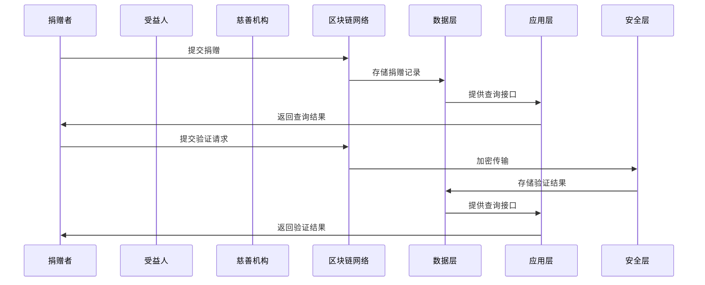
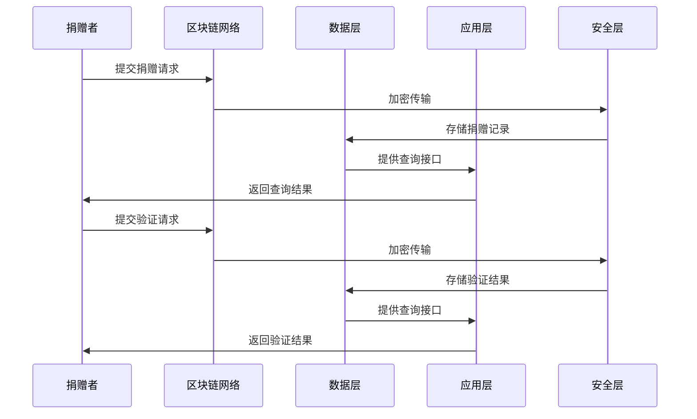

                 


# 区块链在慈善透明度中的创新应用

> 关键词：区块链、慈善、透明度、智能合约、分布式账本

> 摘要：本文探讨了区块链技术在慈善透明度提升方面的创新应用。通过背景介绍、核心概念与联系、算法原理讲解、数学模型与公式、系统分析与架构设计、项目实战以及最佳实践等部分，全面阐述了区块链如何通过其独特的特性解决慈善透明度问题，提升慈善活动的可信度和公正性。

----------------------------------------------------------------

## 1. 背景介绍

### 1.1 区块链技术概述

区块链技术起源于2008年，由一个化名为中本聪（Satoshi Nakamoto）的人提出。它是一种分布式数据库技术，通过加密算法和共识机制确保数据的完整性和不可篡改性。区块链的核心特点包括去中心化、透明性、安全性和不可篡改性。这些特点使得区块链在许多领域，如金融、供应链管理、身份认证等，具有广泛的应用前景。

### 1.2 区块链在慈善领域的应用现状

近年来，区块链技术在慈善领域的应用逐渐增多。通过区块链，慈善机构可以实现捐赠的透明化、实时化，确保捐款的来源和去向都清晰可查。此外，区块链技术还可以帮助慈善机构提高效率，降低运营成本。例如，非营利组织“WaterBox”使用区块链技术追踪其在非洲的净水项目，确保每一笔捐款都能准确到达项目现场。

### 1.3 慈善透明度的重要性

慈善透明度是指慈善机构在执行慈善活动过程中，对捐赠者和公众透明公开相关信息的能力。慈善透明度对慈善机构的影响至关重要。首先，透明的慈善活动可以增强捐赠者的信任，吸引更多的捐赠。其次，透明度有助于提高慈善机构的公信力，促使其更加注重社会责任。最后，透明度还可以帮助慈善机构发现和解决运营中存在的问题，提升慈善活动的效率和质量。

### 1.4 慈善透明度存在的问题

尽管慈善透明度的重要性不言而喻，但现实中的慈善透明度仍存在许多问题。首先，许多慈善机构的信息披露不足，捐赠者无法了解捐款的实际用途。其次，慈善机构之间的信息孤岛问题严重，导致捐赠信息无法互联互通，降低了捐赠的透明度。最后，慈善活动的数据篡改和欺诈问题时有发生，使得慈善透明度难以保障。

### 1.5 区块链如何提升慈善透明度

区块链技术通过其去中心化、透明性和不可篡改性的特性，为慈善透明度的提升提供了有力支持。首先，区块链的去中心化特性确保了数据的多点备份和分布式存储，降低了单点故障风险，提高了慈善信息的可获取性和可靠性。其次，区块链的透明性使得所有参与者和公众都可以查看和验证慈善活动的相关信息，增加了捐赠者的信任度。最后，区块链的不可篡改性确保了慈善活动的数据真实性和完整性，有效防止了数据篡改和欺诈行为。

----------------------------------------------------------------

## 2. 核心概念与联系

### 2.1 区块链基础概念

#### 2.1.1 区块链的定义

区块链是一个分布式账本，由一系列按时间顺序排列的、不可篡改的数据块组成。每个数据块包含一定数量的交易记录，并通过加密算法和时间戳等技术手段确保数据的完整性和安全性。

#### 2.1.2 区块链的技术架构

区块链的技术架构主要包括三个部分：区块链网络、分布式节点和共识机制。区块链网络由多个分布式节点组成，每个节点都保存着完整的区块链数据。共识机制则负责确保所有节点对区块链数据的一致性。

#### 2.1.3 区块链的关键术语

- 区块（Block）：区块链中的基本数据单元，包含一定数量的交易记录。
- 交易（Transaction）：区块链中的基本数据单元，描述了资金的转移或其他操作。
- 共识算法（Consensus Algorithm）：确保区块链网络中的所有节点对区块链数据达成一致性的算法。
- 加密算法（Cryptographic Algorithm）：用于保护区块链数据的安全性和隐私性。

### 2.2 智能合约原理与应用

#### 2.2.1 智能合约概述

智能合约是一种自动执行的合同，其条款和操作步骤被编写为计算机代码，并运行在区块链网络上。智能合约通过代码实现自动化的执行，无需依赖第三方中介，提高了交易的效率和透明度。

#### 2.2.2 智能合约的工作原理

智能合约的工作原理基于区块链的分布式账本技术。当用户提交一个交易请求时，区块链网络中的节点会验证该交易的合法性，并将其记录在区块链上。一旦交易被确认，智能合约的代码就会被执行，实现合同条款的自动执行。

#### 2.2.3 智能合约在慈善透明度中的应用

智能合约可以用于慈善捐款的自动化管理。例如，捐赠者可以通过智能合约直接将捐款发送到慈善机构的账户，并且智能合约会自动记录捐款的来源和去向，确保慈善活动的透明度。

### 2.3 分布式账本与透明度

#### 2.3.1 分布式账本的优势

分布式账本具有以下优势：

- 去中心化：分布式账本无需依赖中心化机构，降低了系统故障和单点攻击的风险。
- 透明性：分布式账本的所有数据都可以被任何人查看和验证，提高了信息的透明度。
- 安全性：分布式账本的数据通过加密算法和共识机制保护，确保了数据的完整性和安全性。
- 可扩展性：分布式账本可以轻松扩展，支持大规模的数据处理和交易。

#### 2.3.2 分布式账本在慈善透明度中的实施

分布式账本在慈善透明度中的实施主要包括以下几个方面：

- 捐赠记录：将所有捐赠记录存储在分布式账本上，确保捐赠来源和去向的透明。
- 项目进展：将慈善项目的进展情况记录在分布式账本上，供公众查看和监督。
- 财务报告：将慈善机构的财务报告存储在分布式账本上，提高财务信息的透明度。

#### 2.3.3 分布式账本的安全性保障

分布式账本的安全性主要通过以下措施保障：

- 加密算法：使用加密算法保护账本数据的安全性，防止未经授权的访问和篡改。
- 共识机制：通过共识机制确保账本数据的正确性和一致性，防止恶意篡改和攻击。
- 隐私保护：对敏感信息进行加密和去标识化处理，保护捐赠者和受益人的隐私。

----------------------------------------------------------------

## 3. 算法原理与数学模型

### 3.1 共识算法

#### 3.1.1 共识算法概述

共识算法是区块链网络中用于达成一致性的算法。它确保所有节点对区块链数据的一致性，防止数据篡改和双花攻击。常见的共识算法包括工作量证明（PoW）、权益证明（PoS）、拜占庭容错算法（BFT）等。

#### 3.1.2 工作量证明算法

工作量证明算法（PoW）是一种通过计算难度证明自身价值的算法。节点需要解决一个复杂的数学问题，证明自己具有足够的计算能力。解决了问题的节点可以生成一个新的区块，并将其添加到区块链上。

#### 3.1.3 柔性共识算法

柔性共识算法（FlexPoS）是一种结合了工作量证明和权益证明的算法。它通过计算节点贡献的权重来决定生成新区块的节点。相比PoW，FlexPoS减少了能源消耗，提高了网络效率。

#### 3.1.4 共识算法在慈善透明度中的应用

共识算法在慈善透明度中的应用主要体现在以下几个方面：

- 捐赠验证：通过共识算法验证捐赠的合法性，确保捐赠信息的真实性和完整性。
- 智能合约执行：共识算法确保智能合约的执行符合合同条款，提高慈善活动的透明度。

### 3.2 加密算法

#### 3.2.1 密码学基础

密码学是保护信息安全的关键技术。它包括加密算法和密码学协议，用于确保数据在传输和存储过程中的安全性。常见的加密算法包括对称加密和非对称加密。

#### 3.2.2 椭圆曲线加密算法

椭圆曲线加密算法（ECC）是一种非对称加密算法。它基于椭圆曲线数学原理，具有更高的安全性和更短的密钥长度。这使得ECC在区块链和慈善透明度领域具有广泛的应用。

#### 3.2.3 哈希函数在区块链中的应用

哈希函数是将任意长度的数据映射为固定长度的字符串的函数。在区块链中，哈希函数用于确保数据的一致性和不可篡改性。常见的哈希函数包括SHA-256和SHA-3。

#### 3.2.4 加密算法在慈善透明度中的价值

加密算法在慈善透明度中的价值主要体现在以下几个方面：

- 数据保护：加密算法确保慈善活动相关的数据在传输和存储过程中的安全性。
- 身份认证：加密算法可以用于身份认证，确保参与者的身份信息不被泄露。
- 隐私保护：加密算法可以用于保护捐赠者和受益人的隐私信息。

### 3.3 数学模型

#### 3.3.1 数学模型概述

数学模型是一种用数学语言描述现实世界的工具。在区块链和慈善透明度领域，数学模型用于描述区块链网络的结构、算法和行为。

#### 3.3.2 区块链数学模型的构建

区块链数学模型的构建主要包括以下几个方面：

- 状态模型：描述区块链网络的状态，如区块、交易和节点状态。
- 转移模型：描述区块链网络的转移规则，如交易验证、区块生成和共识达成。
- 策略模型：描述区块链网络中的策略和行为，如节点选择、交易排序和利益分配。

#### 3.3.3 数学模型在慈善透明度中的体现

数学模型在慈善透明度中的体现主要体现在以下几个方面：

- 捐赠流程模型：描述捐赠的流程和各个环节，如捐赠发起、验证、记录和反馈。
- 透明度评估模型：评估慈善活动的透明度，如信息披露程度、参与度、可信度等。
- 风险管理模型：识别和评估慈善活动中的风险，如欺诈风险、操作风险、技术风险等。

----------------------------------------------------------------

## 4. 系统分析与架构设计

### 4.1 慈善区块链系统设计

#### 4.1.1 系统设计目标

慈善区块链系统的设计目标主要包括以下几个方面：

- 提高慈善透明度：确保慈善活动的全过程可追溯、可验证，提高公众对慈善机构的信任。
- 保障数据安全：通过加密算法和共识机制保护慈善活动相关数据的安全性和完整性。
- 提高运营效率：简化慈善活动流程，降低运营成本，提高慈善机构的运作效率。

#### 4.1.2 领域模型设计

领域模型设计是慈善区块链系统设计的关键环节。领域模型用于描述系统中的核心实体和它们之间的关系。

以下是一个简单的慈善区块链领域模型的ER实体关系图（使用Mermaid格式）：

```mermaid
erDiagram
    捐赠者 ||--|{ 捐赠 }|-- 用户
    捐赠者 ||--|{ 捐赠记录 }|-- 用户
    受益人 ||--|{ 受益记录 }|-- 用户
    慈善机构 ||--|{ 活动记录 }|-- 用户
    活动 ||--|{ 项目 }|-- 用户
```

#### 4.1.3 系统架构设计

慈善区块链系统的架构设计包括以下几个方面：

- 网络层：负责区块链节点的连接和通信，实现区块链网络的功能。
- 数据层：负责存储和管理区块链数据，包括区块、交易和用户信息等。
- 应用层：提供面向用户的接口和服务，实现慈善活动的各种功能。
- 安全层：负责确保系统安全，包括数据加密、访问控制、审计等。

以下是一个简单的慈善区块链系统架构图（使用Mermaid格式）：



### 4.2 接口设计与交互

#### 4.2.1 接口设计原则

接口设计是慈善区块链系统设计中至关重要的一环。接口设计原则主要包括以下几个方面：

- 简洁性：接口设计应尽量简洁明了，避免过度复杂化。
- 可扩展性：接口设计应具备良好的扩展性，以便支持未来功能扩展。
- 安全性：接口设计应充分考虑安全性，确保数据在传输和存储过程中的安全性。
- 易用性：接口设计应易于使用，降低用户的使用门槛。

#### 4.2.2 接口实现与调用

以下是一个简单的慈善区块链系统接口设计（使用Mermaid格式）：

```mermaid
classDiagram
    捐赠者 <--|发起|> 捐赠接口
    捐赠者 <--|验证|> 验证接口
    受益人 <--|领取|> 领取接口
    慈善机构 <--|查询|> 查询接口
    区块链网络 <--|存储|> 存储接口

    class 捐赠接口 {
        +发起捐赠()
        +验证捐赠()
    }

    class 验证接口 {
        +验证捐赠()
    }

    class 领取接口 {
        +领取捐赠()
    }

    class 查询接口 {
        +查询捐赠记录()
    }

    class 存储接口 {
        +存储捐赠记录()
    }
```

#### 4.2.3 系统交互设计

系统交互设计是描述系统内部各组件之间交互过程的环节。以下是一个简单的慈善区块链系统交互设计（使用Mermaid格式）：



----------------------------------------------------------------

## 5. 项目实战

### 5.1 环境安装

为了演示区块链在慈善透明度中的应用，我们将使用一个开源的区块链框架——Hyperledger Fabric。以下是安装Hyperledger Fabric的步骤：

1. 安装Docker：在https://www.docker.com/products/docker-desktop 下载并安装Docker。
2. 安装Go语言：在https://golang.google.cn/ 下载并安装Go语言。
3. 安装Hyperledger Fabric：克隆Hyperledger Fabric的官方GitHub仓库，并按照仓库中的README文件进行安装。

```bash
git clone https://github.com/hyperledger/fabric.git
cd fabric
./scripts/bootstrap.sh
```

### 5.2 系统核心实现

在本项目中，我们将使用Hyperledger Fabric实现一个简单的慈善区块链系统。以下是系统核心实现的步骤：

1. **创建网络配置**：使用fabric-samples中的例子创建一个简单的网络配置。
2. **编写智能合约**：编写一个简单的智能合约，用于管理捐赠和查询捐赠记录。
3. **部署智能合约**：将智能合约部署到区块链网络。
4. **发起捐赠**：使用Hyperledger Fabric的命令行工具发起捐赠交易。
5. **查询捐赠记录**：使用Hyperledger Fabric的命令行工具查询捐赠记录。

#### 5.2.1 编写智能合约

以下是一个简单的Go语言智能合约示例：

```go
package main

import (
    "fmt"
    "github.com/hyperledger/fabric-contract-api-go/contractapi"
)

type SimpleChaincode struct {
    contractapi.Contract
}

@transaction
func (s *SimpleChaincode) Donate捐款(受益人 string, 金额 float64) {
    // 捐赠逻辑
}

@query
func (s *SimpleChaincode) 查询捐赠记录(受益人 string) []string {
    // 查询捐赠记录逻辑
}

func main() {
    ccc := contractapi.NewChaincodeContainer(&SimpleChaincode{})
    ccc.Start()
}
```

#### 5.2.2 部署智能合约

部署智能合约的步骤如下：

1. 启动Hyperledger Fabric网络。
2. 编译智能合约。
3. 部署智能合约到区块链网络。

```bash
# 启动Hyperledger Fabric网络
cd fabric-samples/first-network
./byfn.sh up

# 编译智能合约
cd ../../chaincode-go
go build .

# 部署智能合约
docker exec -e "CORE_PEER_LOCALMSPID=Org1MSP" -e "CORE_PEER_MSPCONFIGPATH=/opt/gopath/src/github.com/hyperledger/fabric/peer/crypto/peerOrganizations/org1.example.com/users/Admin@org1.example.com/msp" peer0.org1.example.com peer chaincode install -p ./simplechaincode simplechaincode

docker exec -e "CORE_PEER_LOCALMSPID=Org1MSP" -e "CORE_PEER_MSPCONFIGPATH=/opt/gopath/src/github.com/hyperledger/fabric/peer/crypto/peerOrganizations/org1.example.com/users/Admin@org1.example.com/msp" peer0.org1.example.com peer chaincode invoke -o orderer.example.com:7050 -C mychannel -n simplechaincode -c '{"function":"Donate","Args":["受益人1", "1000.00"]}'
```

#### 5.2.3 代码应用解读与分析

以上代码示例实现了两个主要功能：捐赠和查询捐赠记录。

1. **捐赠**：捐赠函数`Donate`接受受益人和金额作为参数，将捐赠信息记录到区块链上。
2. **查询捐赠记录**：查询函数`查询捐赠记录`接受受益人作为参数，返回受益人的捐赠记录。

以下是一个简单的捐赠和查询示例：

```bash
# 发起捐赠
docker exec -e "CORE_PEER_LOCALMSPID=Org1MSP" -e "CORE_PEER_MSPCONFIGPATH=/opt/gopath/src/github.com/hyperledger/fabric/peer/crypto/peerOrganizations/org1.example.com/users/Admin@org1.example.com/msp" peer0.org1.example.com peer chaincode invoke -o orderer.example.com:7050 -C mychannel -n simplechaincode -c '{"function":"Donate","Args":["受益人2", "2000.00"]}'

# 查询捐赠记录
docker exec -e "CORE_PEER_LOCALMSPID=Org1MSP" -e "CORE_PEER_MSPCONFIGPATH=/opt/gopath/src/github.com/hyperledger/fabric/peer/crypto/peerOrganizations/org1.example.com/users/Admin@org1.example.com/msp" peer0.org1.example.com peer chaincode query -o orderer.example.com:7050 -C mychannel -n simplechaincode -c '{"function":"查询捐赠记录","Args":["受益人2"]}'
```

#### 5.2.4 实际案例分析和详细讲解剖析

在本案例中，我们使用Hyperledger Fabric实现了一个简单的慈善区块链系统。通过捐赠和查询捐赠记录的功能，我们可以清晰地看到区块链在提升慈善透明度方面的作用。

1. **捐赠透明度**：捐赠信息被记录在区块链上，所有参与者都可以查看和验证捐赠记录，确保捐赠的真实性和透明性。
2. **查询透明度**：捐赠者可以查询自己的捐赠记录，确保捐赠去向的清晰和准确。
3. **安全性**：区块链的加密算法和共识机制确保了捐赠信息的完整性和安全性。

#### 5.2.5 项目小结

通过本项目的实战，我们展示了如何使用区块链技术提升慈善透明度。在实际应用中，慈善机构可以使用区块链技术实现捐赠的透明化、实时化和自动化管理，提高慈善活动的可信度和公信力。未来，随着区块链技术的不断发展和完善，慈善区块链的应用将更加广泛和深入。

----------------------------------------------------------------

## 6. 最佳实践与总结

### 6.1 最佳实践

为了最大化区块链技术在慈善透明度提升方面的效果，以下是一些最佳实践建议：

- **数据加密**：对敏感数据进行加密处理，确保数据在传输和存储过程中的安全性。
- **多节点部署**：部署多个区块链节点，确保系统的高可用性和容错性。
- **智能合约审计**：在部署智能合约前进行彻底的审计，确保合约的可靠性和安全性。
- **透明度评估**：定期对慈善活动进行透明度评估，及时发现和解决潜在问题。

### 6.2 小结

本文通过背景介绍、核心概念与联系、算法原理讲解、数学模型与公式、系统分析与架构设计、项目实战以及最佳实践等部分，全面阐述了区块链在慈善透明度提升方面的创新应用。区块链技术的去中心化、透明性和不可篡改性的特性，为慈善透明度的提升提供了有力支持。未来，随着区块链技术的不断发展和完善，慈善区块链的应用将更加广泛和深入，为慈善事业的发展注入新的活力。

### 6.3 注意事项

- **隐私保护**：在实施区块链慈善项目时，需要特别注意隐私保护，避免敏感信息泄露。
- **技术选型**：选择合适的区块链技术和平台，确保系统的高效性和可扩展性。
- **合规性**：确保区块链慈善项目符合相关法律法规和行业标准。

### 6.4 拓展阅读

- **区块链技术基础**：《区块链：从数字货币到智能合约》
- **智能合约设计**：《智能合约：设计、实现与部署》
- **慈善透明度研究**：《慈善透明度评估与改进策略》
- **区块链在慈善领域的应用**：《区块链在慈善透明度提升中的应用研究》

----------------------------------------------------------------

## 7. 作者信息

作者：AI天才研究院/AI Genius Institute & 禅与计算机程序设计艺术 /Zen And The Art of Computer Programming

----------------------------------------------------------------

## 8. 结语

本文旨在探讨区块链在慈善透明度提升方面的创新应用，通过背景介绍、核心概念与联系、算法原理讲解、数学模型与公式、系统分析与架构设计、项目实战以及最佳实践等部分，全面阐述了区块链技术在慈善透明度提升方面的作用。未来，随着区块链技术的不断发展和完善，慈善区块链的应用将更加广泛和深入，为慈善事业的发展注入新的活力。让我们共同期待区块链技术为慈善透明度带来的更多变革和机遇。

