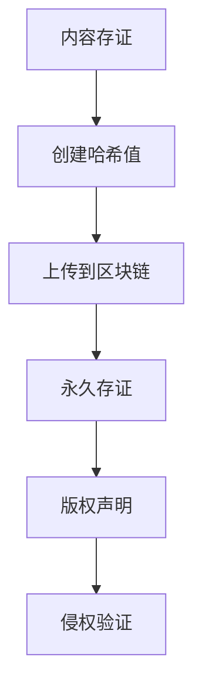
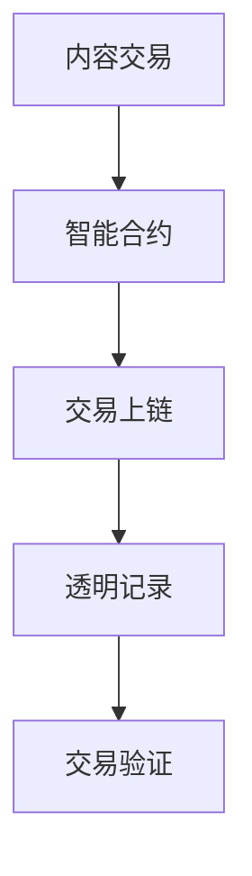
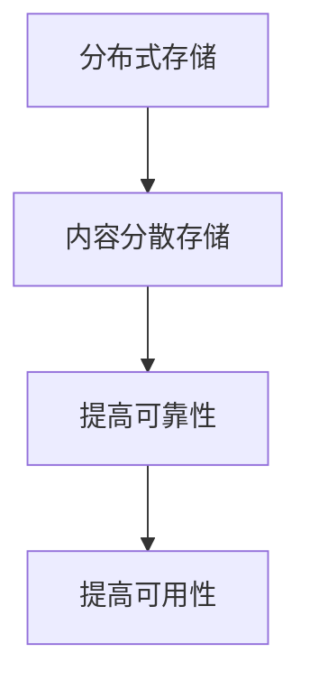
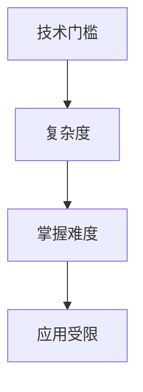
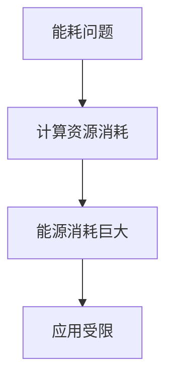
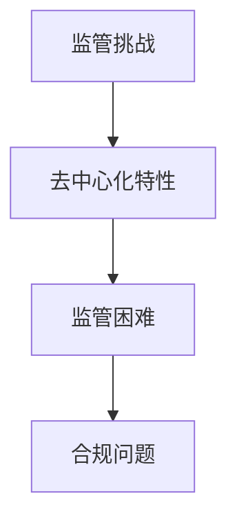
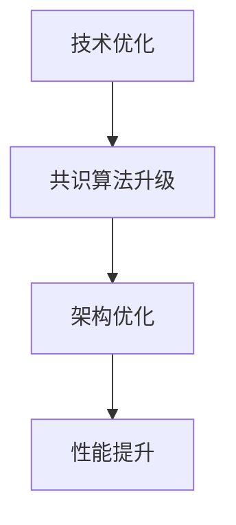
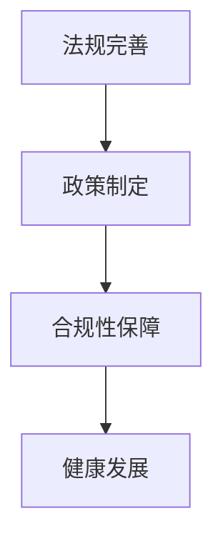
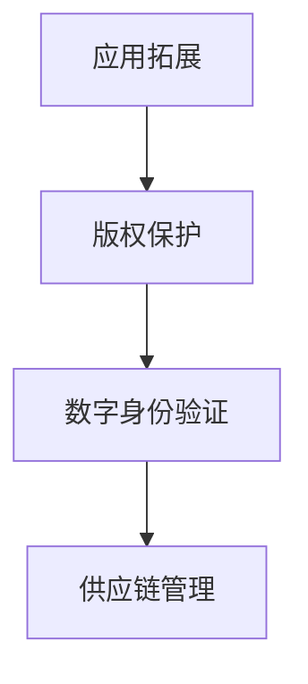

                 

## 4. 去中心化内容分发模式原理

### 4.1 去中心化模式概述

去中心化内容分发模式（Decentralized Content Distribution Model，DCDM）是相对于中心化模式而言的一种新型内容分发方式。它通过去中心化的网络结构，实现内容的存储、传输和验证，从而解决中心化模式中的诸多问题。

#### 4.1.1 定义

去中心化内容分发模式是指利用去中心化网络技术，如区块链、分布式存储等，实现内容分发的过程。在这种模式下，内容创作者可以直接与用户进行互动，无需依赖中心化平台。

#### 4.1.2 特点

- **去中心化**：去中心化模式通过分布式网络，避免了单点故障，提高了系统的容错性和稳定性。
- **安全性**：去中心化模式通过加密技术确保数据的完整性，减少了数据泄露的风险。
- **透明性**：去中心化模式的数据是公开透明的，用户可以随时查看和验证。
- **高效性**：去中心化模式通过分布式网络，提高了数据处理和传输的效率。
- **公平性**：去中心化模式避免了中心化平台对资源的垄断，为参与者提供了公平的竞争环境。

### 4.2 去中心化模式的优点

#### 4.2.1 提高内容安全性

去中心化模式通过分布式存储，避免了单点故障，确保了内容的安全。同时，加密技术保证了数据的隐私性和完整性。

#### 4.2.2 减少中间环节

去中心化模式减少了中心化平台的中间环节，降低了内容分发的成本。创作者可以直接与用户互动，获取收益。

#### 4.2.3 提高透明度

去中心化模式的数据是公开透明的，用户可以随时查看和验证。这有助于提高市场的透明度，减少欺诈行为。

#### 4.2.4 促进创新

去中心化模式为参与者提供了更广阔的空间，激发了创新活力。各种新颖的应用模式不断涌现，推动了数字内容分发的变革。

### 4.3 去中心化模式的缺点

#### 4.3.1 技术门槛高

去中心化模式涉及多种技术，如区块链、加密算法、分布式存储等，对开发者的技术要求较高。

#### 4.3.2 系统稳定性

去中心化模式依赖于分布式网络，系统稳定性受到网络波动、节点故障等因素的影响。

#### 4.3.3 法律和监管问题

去中心化模式涉及到法律和监管问题，如版权保护、隐私保护等。如何确保合规性和安全性是一个挑战。

### 4.4 去中心化模式的实现原理

#### 4.4.1 区块链技术

区块链技术是去中心化模式的核心技术之一。它通过分布式账本技术，实现数据的存储和传输。区块链的特点包括去中心化、不可篡改和透明性。

#### 4.4.2 加密算法

加密算法用于确保数据的隐私性和完整性。常用的加密算法包括对称加密和非对称加密。

#### 4.4.3 分布式存储

分布式存储技术用于存储大量数据。它通过将数据分散存储在多个节点上，提高了数据的可靠性和安全性。

#### 4.4.4 共识算法

共识算法用于确保分布式网络中的节点达成一致。常见的共识算法包括工作量证明（PoW）、权益证明（PoS）等。

### 4.5 去中心化内容分发模式的架构设计

去中心化内容分发模式需要一个高效的架构设计来支持其运行。以下是一个基本的架构设计：

#### 4.5.1 内容创作者

内容创作者负责创建和上传内容。他们可以通过去中心化平台直接与用户互动。

#### 4.5.2 用户

用户是内容的消费者。他们可以通过去中心化平台获取和下载内容。

#### 4.5.3 分布式存储网络

分布式存储网络负责存储和管理内容。它通过将数据分散存储在多个节点上，提高了数据的可靠性和安全性。

#### 4.5.4 共识网络

共识网络负责确保分布式网络中的节点达成一致。它通过共识算法，实现了数据的存储和传输的透明性和安全性。

#### 4.5.5 加密模块

加密模块负责对数据进行加密和解密。它确保了数据的隐私性和完整性。

### 4.6 去中心化内容分发模式的案例分析

#### 4.6.1 IPFS（InterPlanetary File System）

IPFS是一种分布式文件系统，用于存储和共享数据。它通过将数据分散存储在多个节点上，实现了去中心化的内容分发。IPFS的优点包括高效性、可靠性和安全性。

#### 4.6.2 Filecoin

Filecoin是一个基于区块链的去中心化存储网络。它通过激励机制，鼓励节点参与存储和管理数据。Filecoin的优点包括去中心化、低成本和高效率。

#### 4.6.3 Ethereum

Ethereum是一个去中心化应用平台，它支持智能合约和去中心化应用程序（DApps）。Ethereum在数字内容分发中的应用包括版权保护、内容审核和支付等。

### 4.7 去中心化内容分发模式的未来发展趋势

去中心化内容分发模式具有广阔的发展前景。未来，随着技术的不断进步和应用的不断拓展，去中心化内容分发模式有望在数字内容分发领域发挥更大的作用。

#### 4.7.1 技术进步

随着区块链、加密算法、分布式存储等技术的不断发展，去中心化内容分发模式的技术水平将不断提高。

#### 4.7.2 应用拓展

去中心化内容分发模式的应用领域将不断拓展。除了数字内容分发，它还可能在版权保护、数字身份验证等领域发挥作用。

#### 4.7.3 法律和监管

随着去中心化内容分发模式的普及，法律和监管问题将日益突出。如何确保合规性和安全性，将是一个重要课题。

#### 4.7.4 社会影响

去中心化内容分发模式将改变传统的数字内容分发模式，对创作者、平台和用户等各方产生深远的影响。

### 4.8 总结

去中心化内容分发模式具有去中心化、安全性、透明性和高效性等特点，为数字内容分发提供了一种新的解决方案。尽管面临一些挑战，但其广阔的发展前景令人期待。

----------------------------------------------------------------

## 5. 区块链在数字内容分发中的去中心化应用案例

### 5.1 IPFS：分布式文件系统

IPFS（InterPlanetary File System）是一种分布式文件系统，旨在创建持久且分布式存储和共享文件的信息网络。IPFS 通过内容寻址来实现文件的定位和共享，这意味着每个文件都有一个独特的哈希值，而不是传统的文件路径。

#### 5.1.1 工作原理

1. **内容寻址**：每个文件在 IPFS 中都被分配一个唯一的哈希值。这个哈希值是文件的数字指纹，用于确保文件的一致性和完整性。
   
2. **分布式存储**：文件不是存储在一个中央服务器上，而是分散存储在网络的多个节点上。每个节点都维护一份文件的副本，确保文件的可用性和容错性。

3. **数据检索**：当用户需要访问一个文件时，IPFS 通过查询网络来找到存储该文件的节点，并从这些节点中检索文件。

#### 5.1.2 应用案例

- **去中心化内容分发**：通过 IPFS，内容创作者可以轻松地将文件上传到网络，并允许用户直接下载，无需依赖中心化的服务器。

- **版权保护**：由于每个文件都有唯一的哈希值，可以追踪文件的原始来源和传播路径，有助于保护版权。

- **数据备份**：IPFS 提供了一种分布式备份解决方案，用户可以轻松地将数据分散存储在多个节点上，确保数据的安全和可用性。

### 5.2 Filecoin：去中心化存储市场

Filecoin 是一个基于区块链的去中心化存储网络，它利用区块链的激励机制，鼓励用户存储和共享存储资源。

#### 5.2.1 工作原理

1. **存储市场**：Filecoin 创建了一个去中心化的存储市场，用户（存储提供者）可以出租自己的存储空间，而数据请求者可以租用存储空间来存储数据。

2. **市场激励**：存储提供者通过存储数据获得 Filecoin 奖励，而数据请求者则需要支付 Filecoin 作为存储费用。

3. **数据可靠性**：Filecoin 通过加密和分布式存储技术，确保存储在网上的数据的安全性和可靠性。

#### 5.2.2 应用案例

- **数字内容分发**：通过 Filecoin，内容创作者可以租用存储空间来存储和分发大型数字内容，如视频、音频和软件等。

- **数据存储**：企业和个人可以利用 Filecoin 的去中心化存储服务，以降低成本并提高数据的安全性和可靠性。

- **市场交易**：Filecoin 的存储市场为用户提供了一个去中心化的交易平台，用户可以通过交换 Filecoin 来获得存储服务。

### 5.3 Ethereum：去中心化应用平台

Ethereum 是一个开源的去中心化应用平台，它支持智能合约和去中心化应用程序（DApps）。在数字内容分发领域，Ethereum 可以用于实现各种去中心化服务。

#### 5.3.1 工作原理

1. **智能合约**：智能合约是运行在 Ethereum 上的程序，它自动执行合约条款，确保交易的透明性和不可篡改性。

2. **DApps**：去中心化应用程序（DApps）是运行在 Ethereum 上的应用程序，它们利用区块链的特性，提供去中心化的服务。

3. **去中心化内容分发**：Ethereum 可以用于创建去中心化的内容分发平台，内容创作者可以直接与用户互动，无需依赖中心化平台。

#### 5.3.2 应用案例

- **版权保护**：通过 Ethereum，内容创作者可以创建智能合约来管理版权，确保版权的透明性和不可篡改性。

- **内容审核**：去中心化的内容审核可以通过 Ethereum 上的 DApps 实现，用户可以参与内容审核，提高透明度和公正性。

- **支付和奖励**：Ethereum 支持基于区块链的支付系统，内容创作者可以直接向用户支付报酬，或通过智能合约发放奖励。

### 5.4 总结

区块链在数字内容分发中的去中心化应用，为内容创作者和用户提供了一种全新的解决方案。通过 IPFS、Filecoin 和 Ethereum 等平台，去中心化内容分发模式正在逐步成熟，为数字内容分发领域带来了新的机遇和挑战。

---

在接下来的部分，我们将深入探讨区块链在数字内容分发中的应用，包括其技术实现、潜在问题和未来发展趋势。

----------------------------------------------------------------

## 6. 区块链在数字内容分发中的具体应用

### 6.1 技术实现

区块链在数字内容分发中的应用主要体现在以下几个方面：

#### 6.1.1 内容存证

通过区块链技术，可以对数字内容进行存证。内容创作者可以将作品的哈希值上链，从而实现内容的版权声明。当有侵权行为发生时，可以通过区块链来验证内容的归属权，提高版权保护的效率。

#### 6.1.2 交易透明

区块链的不可篡改性确保了内容交易过程中的透明性。通过智能合约，内容创作者可以直接与用户进行交易，无需依赖第三方平台。交易记录会自动上链，用户可以随时查看和验证。

#### 6.1.3 存储优化

利用区块链的分布式存储技术，可以优化数字内容的存储和管理。内容创作者可以将作品分散存储在多个节点上，从而提高数据的可靠性和可用性。

### 6.2 潜在问题

尽管区块链在数字内容分发中具有巨大的潜力，但其在实际应用中也面临一些问题：

#### 6.2.1 技术门槛

区块链技术的复杂性和高门槛使得许多内容创作者和技术人员难以掌握。这限制了区块链在数字内容分发领域的广泛应用。

#### 6.2.2 能耗问题

区块链的工作量证明（PoW）共识算法消耗大量计算资源，导致能源消耗巨大。这在一定程度上限制了区块链的普及和应用。

#### 6.2.3 监管挑战

区块链的去中心化特性使得监管变得困难。如何确保区块链上的内容符合法律法规，是一个亟待解决的问题。

### 6.3 未来发展趋势

随着技术的不断进步和应用的深入，区块链在数字内容分发领域有望取得以下发展趋势：

#### 6.3.1 技术优化

为了解决能耗问题，越来越多的区块链项目开始采用权益证明（PoS）等更节能的共识算法。同时，区块链的架构和性能也在不断优化，以满足数字内容分发的高性能需求。

#### 6.3.2 法规完善

随着区块链技术的普及，各国政府和监管机构也在积极制定相关的法律法规，以规范区块链在数字内容分发中的应用。这将为区块链在数字内容分发领域的健康发展提供保障。

#### 6.3.3 应用拓展

除了数字内容分发，区块链技术还将在版权保护、数字身份验证、供应链管理等领域发挥重要作用。这将为区块链技术的应用提供更广阔的空间。

### 6.4 总结

区块链在数字内容分发中的去中心化应用，为数字内容分发带来了新的机遇和挑战。通过技术优化、法规完善和应用拓展，区块链有望在数字内容分发领域发挥更大的作用。

----------------------------------------------------------------

## 7. 结论

区块链技术在数字内容分发中的应用，为解决传统中心化模式中的诸多问题提供了一种新的思路。通过去中心化的方式，区块链技术提高了内容的安全性、透明度和效率。然而，区块链技术的应用也面临一些挑战，如技术门槛、能耗问题和监管难题。随着技术的不断进步和法规的不断完善，区块链在数字内容分发领域的应用前景将更加广阔。

在未来，区块链技术有望在版权保护、数字身份验证、供应链管理等多个领域发挥更大的作用。同时，我们也需要关注区块链技术带来的法律和伦理问题，确保其在数字内容分发中的健康发展。

总之，区块链技术为数字内容分发带来了一场革命。让我们共同关注这一领域的发展，探索更多创新应用，为数字时代的繁荣贡献力量。

---

[作者：AI天才研究院/AI Genius Institute & 禅与计算机程序设计艺术 /Zen And The Art of Computer Programming] 

----------------------------------------------------------------

## 8. 拓展阅读

1. **《区块链技术指南》** - [作者：万维刚]  
   本书详细介绍了区块链的基本原理、技术实现和应用案例，适合区块链初学者和从业者阅读。

2. **《智能合约开发实战》** - [作者：区块链革命团队]  
   本书通过实际项目案例，讲解了智能合约的开发、测试和部署，是区块链开发者必备的参考书。

3. **《数字货币与区块链》** - [作者：刘卫东]  
   本书系统地阐述了数字货币和区块链的发展历程、技术原理和应用场景，对于理解区块链在数字内容分发中的应用具有重要意义。

4. **《分布式系统原理与范型》** - [作者：大卫·贝多]  
   本书深入剖析了分布式系统的基本原理和设计模式，为理解区块链的分布式存储和共识算法提供了理论支持。

5. **《区块链：颠覆世界的创新技术》** - [作者：布莱恩·贝克尔]  
   本书从产业和应用的角度，详细介绍了区块链技术的发展现状和未来趋势，是区块链技术从业者的必备读物。

通过阅读这些书籍，您可以更深入地了解区块链技术在数字内容分发中的应用，以及区块链技术的全貌和发展方向。希望这些拓展阅读能对您的学习和研究有所帮助。

