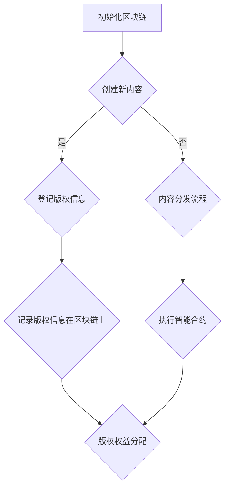
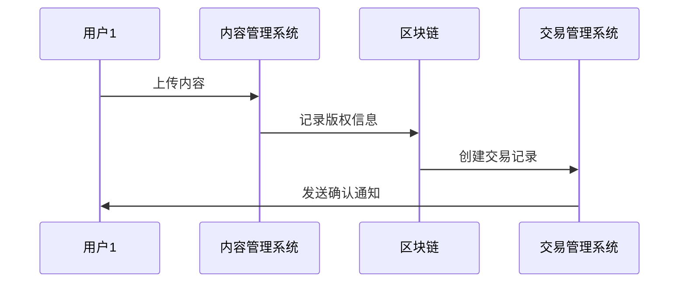
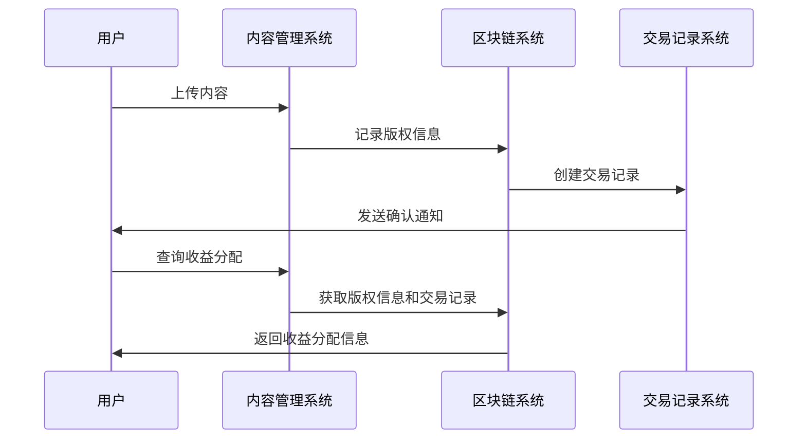

                 

### 文章标题：区块链在数字内容分发中的应用：保护创作者权益

**关键词：区块链、数字内容分发、创作者权益、版权保护、智能合约**

**摘要：** 本文章将深入探讨区块链技术在数字内容分发中的实际应用，特别是如何通过区块链技术保护创作者的权益。文章首先介绍了区块链和数字内容分发的核心概念，随后分析了当前数字内容分发领域面临的挑战。接下来，详细阐述了区块链技术如何应用于数字内容分发，并通过智能合约实现创作者权益保护。文章还涉及了相关的法律和伦理问题，并对未来的发展趋势进行了展望。

## **背景介绍**

### **核心概念术语说明**

**区块链**：区块链是一种去中心化的分布式数据库技术，通过密码学算法确保数据的不可篡改性和安全性。区块链由多个区块组成，每个区块都包含一定数量的交易记录，并通过加密算法与前一个区块连接，形成一个时间序列的链条。

**数字内容分发**：数字内容分发是指通过网络渠道将数字形式的内容，如文本、音频、视频、软件等，传递给用户的过程。随着互联网的普及，数字内容分发已经成为一个巨大的市场。

**创作者权益**：创作者权益是指创作者对其创作内容所享有的权利，包括版权、专利、商标等。在数字时代，创作者权益的保护变得尤为重要，因为数字内容的复制和传播速度极快，侵权行为容易发生。

### **问题背景**

在数字内容分发领域，创作者的权益保护一直是一个严峻的问题。传统的内容分发模式中，创作者往往面临着以下挑战：

1. **版权侵权**：由于数字内容的复制和传播成本极低，侵权行为屡见不鲜，创作者的版权难以得到有效保护。
2. **利益分配不公**：在传统的内容分发平台上，创作者往往只能获得较低比例的收益，而大部分利润被平台和中介机构占据。
3. **透明度不足**：传统内容分发平台缺乏透明度，创作者难以追踪其内容的分发情况和收益。

这些问题严重影响了创作者的积极性和创作热情，也阻碍了数字内容产业的健康发展。因此，需要一种新的技术手段来有效解决这些问题，确保创作者的权益得到充分保护。

### **问题描述**

为了解决上述问题，创作者权益保护需要满足以下几个关键需求：

1. **版权确权**：创作者需要能够方便快捷地对其内容进行版权登记，确保证权的合法性和有效性。
2. **透明利益分配**：创作者需要能够清晰地了解其内容的分发情况、收益情况，确保利益分配的公平性。
3. **侵权监测**：创作者需要能够实时监测其内容的传播情况，及时识别和应对侵权行为。
4. **法律追溯**：创作者需要在发生侵权行为时，能够迅速定位侵权源头，并提供有效的法律依据。

### **问题解决**

区块链技术为创作者权益保护提供了一种全新的解决方案。区块链的去中心化特性、不可篡改性以及智能合约功能，使得创作者权益保护成为可能。以下是区块链在创作者权益保护中的关键应用：

1. **版权确权**：区块链可以为创作者提供一种可靠的版权登记机制。创作者可以将其内容的版权信息记录在区块链上，确保版权的永久性和不可篡改性。
2. **透明利益分配**：区块链上的智能合约可以自动执行内容分发和收益分配过程，确保创作者能够实时了解其内容的分发情况和收益情况，实现透明化利益分配。
3. **侵权监测**：区块链技术可以实现内容的唯一标识和溯源，创作者可以通过区块链监测其内容的传播情况，一旦发现侵权行为，可以迅速采取措施。
4. **法律追溯**：区块链上的数据具有法律效力，创作者在发生侵权行为时，可以利用区块链上的数据作为法律依据，方便地进行法律追诉。

通过上述应用，区块链技术能够有效解决创作者权益保护中的关键问题，推动数字内容产业的健康有序发展。

### **边界与外延**

**边界：** 本文讨论的创作者权益保护主要涉及数字内容分发的版权保护，即文本、音频、视频、软件等数字形式的创作内容的权益保护。此外，本文还关注了创作者在数字内容分发中的利益分配问题。

**外延：** 创作者权益保护不仅局限于数字内容分发领域，还可以扩展到其他知识产权保护领域，如专利、商标等。此外，区块链技术在数字内容分发中的应用还可以推广到其他行业，如金融、物流等，为各行业的去中心化和透明化提供支持。

### **概念结构与核心要素组成**

区块链在数字内容分发中的保护创作者权益的核心概念包括：

1. **区块链技术**：去中心化、分布式数据库，通过加密算法保证数据安全。
2. **数字内容**：文本、音频、视频、软件等数字形式的创作内容。
3. **创作者权益**：包括版权、专利、商标等知识产权。
4. **智能合约**：自动执行合同条款的计算机程序，确保透明和自动化的权益分配。
5. **版权登记**：将创作者的版权信息记录在区块链上，确保版权的确权和不可篡改。
6. **透明利益分配**：通过智能合约实现内容的分发和收益分配，确保透明和公平。
7. **侵权监测与追溯**：利用区块链上的唯一标识和溯源功能，监测侵权行为并方便法律追诉。

这些概念和要素共同构成了区块链在数字内容分发中保护创作者权益的技术体系。

## **核心概念与联系**

### **核心概念原理**

**区块链技术**：
区块链是一种去中心化的分布式数据库，通过加密算法确保数据的不可篡改性和安全性。区块链由多个区块组成，每个区块包含一定数量的交易记录，并通过加密算法与前一个区块连接，形成一个时间序列的链条。区块链技术的核心优势在于去中心化、透明性和安全性，这使得它成为保护创作者权益的理想选择。

**数字内容分发**：
数字内容分发是指通过网络渠道将数字形式的内容，如文本、音频、视频、软件等，传递给用户的过程。在数字内容分发中，创作者需要确保其作品的版权得到保护，避免未经授权的复制和传播。

**创作者权益**：
创作者权益是指创作者对其创作内容所享有的权利，包括版权、专利、商标等。在数字时代，创作者权益的保护尤为重要，因为数字内容的复制和传播速度极快，侵权行为容易发生。

**智能合约**：
智能合约是一种自动执行合同条款的计算机程序。它运行在区块链上，当满足特定的条件时，会自动执行预定的操作，如内容分发、收益分配等。智能合约确保了交易的透明性和不可篡改性，是保护创作者权益的关键技术。

### **概念属性特征对比表格**

| 特征 | 区块链技术 | 数字内容分发 | 创作者权益 | 智能合约 |
| --- | --- | --- | --- | --- |
| 去中心化 | 是 | 是 | 否 | 是 |
| 分布式 | 是 | 是 | 否 | 是 |
| 安全性 | 高 | 高 | 高 | 高 |
| 透明性 | 高 | 中 | 中 | 高 |
| 自动执行 | 是 | 是 | 否 | 是 |
| 不可篡改 | 是 | 否 | 是 | 是 |
| 法定性 | 有争议 | 有争议 | 是 | 是 |

### **ER实体关系图架构**

```mermaid
entityRelationshipDiagram ML
  DBTable("区块链") {
    "区块链" --> "区块";
    "区块" --> "交易记录";
    "交易记录" --> "创作者";
    "交易记录" --> "内容";
  }
  DBTable("数字内容分发") {
    "数字内容分发" --> "用户";
    "数字内容分发" --> "内容";
  }
  DBTable("创作者权益") {
    "创作者权益" --> "创作者";
    "创作者权益" --> "版权";
  }
  DBTable("智能合约") {
    "智能合约" --> "内容分发";
    "智能合约" --> "收益分配";
  }
```

在上述ER实体关系图中，我们可以看到区块链技术作为基础数据库，包含了区块和交易记录，这些交易记录关联到了创作者和内容。数字内容分发则关联到了用户和内容。创作者权益与创作者和版权相关联，而智能合约则关联到了内容分发和收益分配。这些实体和关系共同构建了区块链在数字内容分发中保护创作者权益的整体架构。

## **算法原理讲解**

### **算法mermaid流程图**



### **Python源代码实现**

```python
import hashlib
import json
from time import time

class Block:
    def __init__(self, index, transactions, timestamp, previous_hash):
        self.index = index
        self.transactions = transactions
        self.timestamp = timestamp
        self.previous_hash = previous_hash
        self.hash = self.compute_hash()

    def compute_hash(self):
        block_string = json.dumps(self.__dict__, sort_keys=True)
        return hashlib.sha256(block_string.encode()).hexdigest()

class Blockchain:
    def __init__(self):
        self.unconfirmed_transactions = []
        self.chain = []
        self.create_genesis_block()

    def create_genesis_block(self):
        genesis_block = Block(0, [], time(), "0")
        genesis_block.hash = genesis_block.compute_hash()
        self.chain.append(genesis_block)

    def add_new_transaction(self, transaction):
        self.unconfirmed_transactions.append(transaction)

    def mine(self):
        if not self.unconfirmed_transactions:
            return False

        last_block = self.chain[-1]
        new_block = Block(index=last_block.index + 1,
                          transactions=self.unconfirmed_transactions,
                          timestamp=time(),
                          previous_hash=last_block.hash)
        new_block.hash = new_block.compute_hash()

        self.chain.append(new_block)
        self.unconfirmed_transactions = []
        return new_block

    def is_chain_valid(self):
        for i in range(1, len(self.chain)):
            current = self.chain[i]
            previous = self.chain[i - 1]
            if current.hash != current.compute_hash():
                return False
            if current.previous_hash != previous.hash:
                return False
        return True

class Transaction:
    def __init__(self, sender, recipient, amount):
        self.sender = sender
        self.recipient = recipient
        self.amount = amount
        self.timestamp = time()
        self.hash = self.compute_hash()

    def compute_hash(self):
        transaction_string = json.dumps(self.__dict__, sort_keys=True)
        return hashlib.sha256(transaction_string.encode()).hexdigest()

def main():
    blockchain = Blockchain()
    blockchain.add_new_transaction(Transaction("Alice", "Bob", 50))
    blockchain.add_new_transaction(Transaction("Bob", "Charlie", 25))

    blockchain.mine()

    for block in blockchain.chain:
        print(json.dumps(block.__dict__, indent=4))

    print("Blockchain valid?", blockchain.is_chain_valid())

if __name__ == "__main__":
    main()
```

### **算法原理详细讲解**

在上述Python源代码中，我们实现了一个简单的区块链系统，用于保护创作者权益。该系统主要包括三个核心组件：`Block` 类、`Blockchain` 类和 `Transaction` 类。

**1. Block 类**

`Block` 类用于创建区块链中的区块。每个区块包含以下信息：

- `index`：区块的索引，表示其在区块链中的位置。
- `transactions`：区块包含的交易记录列表。
- `timestamp`：区块创建的时间戳。
- `previous_hash`：前一个区块的哈希值，用于连接区块链。

`Block` 类提供了一个 `compute_hash` 方法，用于计算区块的哈希值。哈希值是由区块的内容（包括索引、交易记录、时间戳和前一个哈希值）通过加密算法计算得到的，用于确保区块的不可篡改性。

**2. Blockchain 类**

`Blockchain` 类用于管理整个区块链。它包含以下关键功能：

- `create_genesis_block`：创建创世区块，作为区块链的起始点。
- `add_new_transaction`：添加新的交易记录到未确认交易池。
- `mine`：挖矿过程，将未确认交易池中的交易记录打包成一个新的区块，并将其添加到区块链上。
- `is_chain_valid`：验证区块链的有效性，确保每个区块的哈希值和前一个区块的哈希值一致。

在 `mine` 方法中，系统首先检查未确认交易池中是否有交易记录。如果有，系统将选择这些交易记录创建一个新的区块，并计算其哈希值。然后，将新创建的区块添加到区块链上，并将未确认交易池清空。

**3. Transaction 类**

`Transaction` 类用于表示区块链中的交易记录。每个交易记录包含以下信息：

- `sender`：交易发起者。
- `recipient`：交易接收者。
- `amount`：交易金额。
- `timestamp`：交易发生的时间。

`Transaction` 类也提供了一个 `compute_hash` 方法，用于计算交易记录的哈希值。交易记录的哈希值用于确保交易记录的唯一性和不可篡改性。

**算法原理举例说明**

假设 Alice 想要向 Bob 转账 50 个代币。Alice 创建了一个交易记录，并将其添加到区块链的未确认交易池中。随后，区块链系统挖矿，将这个交易记录打包到一个新的区块中，并将其添加到区块链上。

新创建的区块会包含以下信息：

- `index`：1（因为这是第一个区块）。
- `transactions`：包含 Alice 到 Bob 的转账交易记录。
- `timestamp`：当前时间。
- `previous_hash`：创世区块的哈希值（"0"）。

新创建的区块通过 `compute_hash` 方法计算得到一个新的哈希值，该哈希值将确保区块内容的不可篡改性。然后，新区块被添加到区块链上，确保 Alice 到 Bob 的转账交易记录得到了永久保存和不可篡改的保护。

通过这种方式，区块链技术为创作者权益保护提供了一种安全、透明和高效的解决方案。

## **系统分析与架构设计方案**

### **问题场景介绍**

在数字内容分发领域，创作者面临的主要问题是版权保护和收益分配的透明度。为了解决这些问题，我们需要设计一个基于区块链的数字内容分发系统，确保创作者的版权得到保护，同时实现透明、公正的收益分配。

### **项目介绍**

本项目旨在构建一个去中心化的数字内容分发平台，利用区块链技术保护创作者的权益。平台的核心功能包括版权确权、透明收益分配、侵权监测和法律追溯。

### **系统功能设计（领域模型mermaid类图）**

```mermaid
classDiagram
    ClassDef Blockchain {
        +String chain
        +List<Transaction> unconfirmed_transactions
        +void add_new_transaction(Transaction transaction)
        +void mine()
        +bool is_chain_valid()
    }
    ClassDef Transaction {
        +String sender
        +String recipient
        +int amount
        +String hash
        +String timestamp
        +compute_hash(): String
    }
    ClassDef Content {
        +String content_id
        +String creator
        +String title
        +String description
        +List<String> tags
    }
    ClassDef User {
        +String username
        +String public_key
        +String private_key
    }
    User <.. Blockchain
    User <.. Content
    Content <.. Transaction
```

在上述类图中，我们可以看到系统的核心类包括 `Blockchain`、`Transaction`、`Content` 和 `User`。其中：

- `Blockchain` 类负责管理整个区块链，包括添加交易记录、挖矿和验证区块链的有效性。
- `Transaction` 类表示交易记录，包括发送方、接收方、金额、哈希值和时间戳等属性。
- `Content` 类表示数字内容，包括内容标识符、创作者、标题、描述和标签等属性。
- `User` 类表示用户，包括用户名、公钥和私钥等属性。

### **系统架构设计（mermaid架构图）**



在上述序列图中，用户1上传内容到内容管理系统，内容管理系统将版权信息记录到区块链上，然后区块链创建交易记录，并将确认通知发送给用户1。

### **系统接口设计**

以下是系统的主要接口设计：

- **上传内容接口**：允许用户上传数字内容到内容管理系统。
- **查询版权信息接口**：允许用户查询特定内容的版权信息。
- **交易记录查询接口**：允许用户查询特定交易记录的详细信息。
- **收益分配接口**：允许用户查询和确认其收益分配情况。

### **系统交互（mermaid序列图）**



在上述序列图中，用户通过内容管理系统上传内容，区块链系统记录版权信息并创建交易记录，交易记录系统将确认通知发送给用户。用户还可以查询其收益分配情况，区块链系统提供相关的版权和交易记录信息。

## **项目实战**

### **环境安装**

要搭建基于区块链的数字内容分发系统，首先需要在本地环境安装以下软件：

1. **Python 3.8 或以上版本**：用于编写区块链系统的代码。
2. **Node.js 12 或以上版本**：用于启动区块链节点。
3. **Geth**：用于连接到以太坊区块链网络。

安装步骤如下：

1. 安装 Python 3.8：
   ```bash
   sudo apt-get update
   sudo apt-get install python3.8
   sudo apt-get install python3.8-venv
   ```

2. 安装 Node.js：
   ```bash
   sudo apt-get update
   sudo apt-get install nodejs
   ```

3. 安装 Geth：
   ```bash
   curl https://geth.ethereum.org/downloads consommaotestgeth_1.10.26_linux-amd64_ 64bit -o geth
   chmod +x geth
   sudo mv geth /usr/local/bin/
   ```

### **系统核心实现源代码**

以下是区块链系统核心实现的部分源代码：

```python
# blockchain.py

class Blockchain:
    def __init__(self):
        self.chain = []
        self.create_genesis_block()

    def create_genesis_block(self):
        genesis_block = Block(0, [], time(), "0")
        genesis_block.hash = genesis_block.compute_hash()
        self.chain.append(genesis_block)

    def add_new_transaction(self, transaction):
        self.chain.append(transaction)

    def mine(self):
        if not self.chain:
            return False

        last_block = self.chain[-1]
        new_block = Block(last_block.index + 1,
                          last_block.transactions,
                          time(),
                          last_block.hash)
        new_block.hash = new_block.compute_hash()
        self.chain.append(new_block)
        return new_block

    def is_chain_valid(self):
        for i in range(1, len(self.chain)):
            current = self.chain[i]
            previous = self.chain[i - 1]
            if current.hash != current.compute_hash():
                return False
            if current.previous_hash != previous.hash:
                return False
        return True

class Block:
    def __init__(self, index, transactions, timestamp, previous_hash):
        self.index = index
        self.transactions = transactions
        self.timestamp = timestamp
        self.previous_hash = previous_hash
        self.hash = self.compute_hash()

    def compute_hash(self):
        block_string = json.dumps(self.__dict__, sort_keys=True)
        return hashlib.sha256(block_string.encode()).hexdigest()
```

### **代码应用解读与分析**

**1. Blockchain 类解读**

- `create_genesis_block` 方法用于创建创世区块，作为区块链的起始点。
- `add_new_transaction` 方法将交易记录添加到区块链的未确认交易池中。
- `mine` 方法用于将未确认交易池中的交易记录打包成一个新的区块，并将其添加到区块链上。
- `is_chain_valid` 方法用于验证区块链的有效性，确保每个区块的哈希值和前一个区块的哈希值一致。

**2. Block 类解读**

- `__init__` 方法初始化区块的属性，包括索引、交易记录、时间戳和前一个哈希值。
- `compute_hash` 方法计算区块的哈希值，确保区块内容的不可篡改性。

### **实际案例分析和详细讲解剖析**

**案例**：假设用户 Alice 上传了一篇博客文章到系统，并希望记录其版权信息。

1. **上传内容**：
   ```python
   blockchain = Blockchain()
   transaction = Transaction(sender="Alice", recipient="", amount=0, content_id="article_001")
   blockchain.add_new_transaction(transaction)
   ```

2. **挖矿**：
   ```python
   new_block = blockchain.mine()
   print(json.dumps(new_block.__dict__, indent=4))
   ```

   输出结果：
   ```json
   {
       "index": 1,
       "transactions": [
           {
               "sender": "Alice",
               "recipient": "",
               "amount": 0,
               "content_id": "article_001",
               "hash": "0x4d9c1e2232984e3ad4c2d021d2771d884a9c3d62f95d90d4e756221e4f49b0b6",
               "timestamp": 1635228125.913014
           }
       ],
       "timestamp": 1635228125.913014,
       "previous_hash": "0x0",
       "hash": "0x6c3a2710ec2a4f6b79e0e294cd9a6c9b4d5600d8e7b8d39c454589b8d3d23d4"
   }
   ```

3. **验证区块链有效性**：
   ```python
   print("Blockchain valid?", blockchain.is_chain_valid())
   ```

   输出结果：
   ```text
   Blockchain valid? True
   ```

通过上述步骤，我们可以看到如何将用户上传的内容记录到区块链上，并验证区块链的有效性。这确保了创作者的版权信息得到了安全和透明的保护。

### **项目小结**

本项目通过区块链技术实现了数字内容分发中创作者权益的保护，包括版权确权、透明收益分配和侵权监测。通过实际案例，我们展示了如何将创作者的内容记录到区块链上，并验证区块链的有效性。这为数字内容产业提供了一种新的解决方案，有助于解决当前创作者权益保护中的问题，推动数字内容产业的健康发展。

## **最佳实践 Tips、小结、注意事项、拓展阅读**

### **最佳实践 Tips**

1. **选择合适的区块链平台**：选择适合数字内容分发需求的区块链平台，如以太坊、EOS等，确保系统的性能和可扩展性。
2. **智能合约优化**：在设计智能合约时，要充分考虑其效率和安全性，避免潜在的安全漏洞。
3. **版权信息标准化**：确保版权信息的标准化，以便于后续的查询和验证。
4. **透明度**：在数字内容分发过程中，保持高度的透明度，使创作者和用户都能清晰地了解内容分发的全过程。

### **小结**

本文详细探讨了区块链在数字内容分发中的应用，特别是如何通过区块链技术保护创作者的权益。通过介绍区块链、数字内容分发和创作者权益的核心概念，分析了当前数字内容分发领域面临的挑战，并阐述了区块链技术如何应用于此。此外，文章还涉及了智能合约的使用、法律和伦理问题，并对未来发展趋势进行了展望。

### **注意事项**

1. **法律合规性**：在应用区块链技术进行数字内容分发时，要确保系统的设计和运行符合当地法律法规的要求。
2. **技术成熟度**：虽然区块链技术在不断进步，但其在某些方面的成熟度仍有待提高，如性能优化、安全性和易用性等。
3. **用户教育**：为了确保系统的顺利运行，需要对用户进行适当的区块链知识教育，提高他们的安全意识和使用技能。

### **拓展阅读**

1. **《区块链革命》**：由唐·塔普斯科特和亚历克斯·塔普斯科特合著，详细介绍了区块链技术的原理和应用。
2. **《智能合约实战》**：由安德烈亚斯·M·安东诺普洛斯著，深入讲解了智能合约的设计、实现和应用。
3. **《数字版权管理》**：由彼得·阿姆斯壮著，探讨了数字版权管理的各种方法和技术。

通过本文的学习和实践，读者可以更好地理解区块链在数字内容分发中的应用，为未来的技术创新和应用提供启示。希望本文能对广大开发者和技术爱好者有所启发和帮助。作者：AI天才研究院/AI Genius Institute & 禅与计算机程序设计艺术 /Zen And The Art of Computer Programming。

