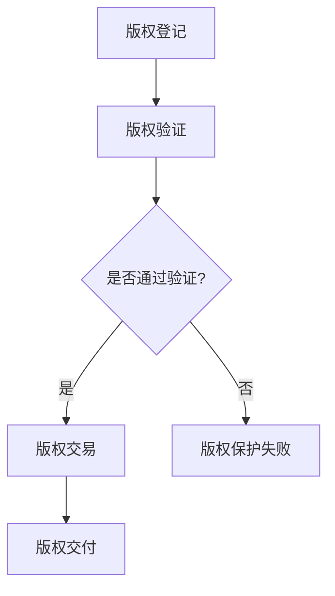
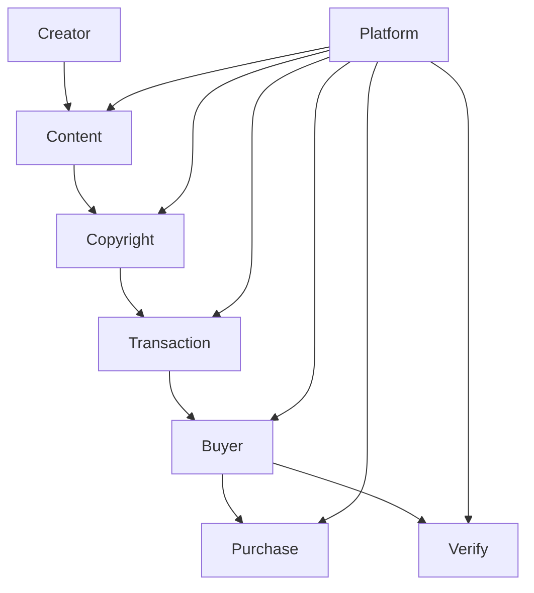
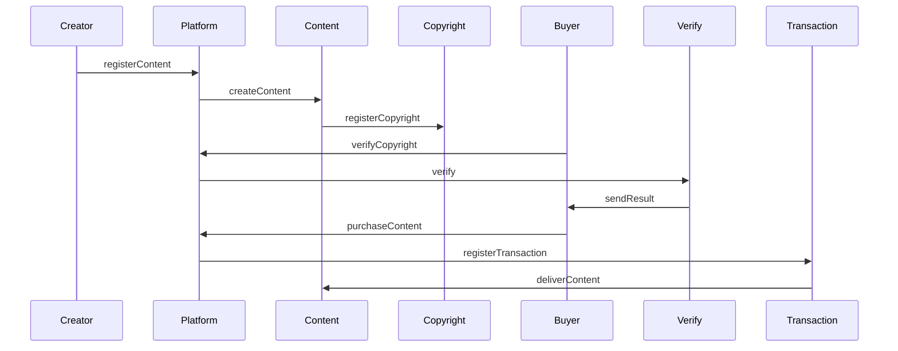
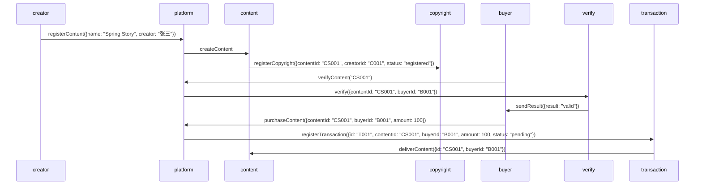

                 

# 文章标题

> 关键词：区块链，数字内容分发，版权保护，智能合约，创作者权益

> 摘要：本文深入探讨了区块链技术在数字内容分发中的应用，特别是如何利用区块链来保护创作者的版权。通过逐步分析区块链技术的基础知识、应用场景以及实际案例，我们揭示了区块链在提升版权保护效率、透明度和安全性方面的潜力。文章旨在为创作者、平台和区块链从业者提供有价值的见解和实用的建议。

-----------------------------------------------------------------

## 第1章: 问题背景与问题描述

### 1.1.1 数字内容分发的挑战

#### 1.1.1.1 数字内容分发的现状

随着互联网和数字技术的飞速发展，数字内容分发已经成为当今社会的重要组成部分。从音乐、电影、电子书到软件应用，几乎所有的信息都可以以数字形式快速传播。然而，这种分发模式也带来了一系列的挑战。

首先，数字内容的复制和传播变得极其简单。一旦数字内容被创建并上传到网络，任何人都可以轻松地复制和分享。这种特点虽然为用户提供了便利，但也使得创作者的权益难以保障。

#### 1.1.1.2 创作者面临的挑战

创作者在数字内容分发中面临的主要挑战是版权保护。尽管现有的版权保护机制（如DRM数字版权管理）试图解决这一问题，但它们往往存在以下问题：

1. **技术局限性**：传统版权保护技术依赖于中心化的服务器和数据库，容易受到黑客攻击和数据泄露的威胁。
2. **用户体验差**：为了保护版权，用户可能需要经历繁琐的认证和授权流程，影响使用体验。
3. **监管困难**：数字内容在全球范围内的分发使得版权监管变得复杂和困难。

#### 1.1.1.3 版权保护的重要性

版权保护对于创作者来说至关重要。版权不仅代表了创作者对作品的控制权，也是他们获得经济回报的重要途径。如果没有有效的版权保护，创作者可能会失去创作的动力，长此以往，整个文化产业的健康发展将受到严重影响。

### 1.1.2 创作者版权保护的困境

#### 1.1.2.1 传统版权保护机制的局限性

传统版权保护机制主要包括法律手段和技术手段。法律手段通过立法和司法来保护创作者的权益，但往往存在时效性、地域性和执法难度等问题。技术手段如DRM虽然能在一定程度上保护版权，但如前所述，也存在诸多局限性。

#### 1.1.2.2 创作者权益受到侵害的现象

在数字内容分发环境中，创作者权益受到侵害的现象层出不穷。例如，未经授权的复制、传播和盗版行为，不仅损害了创作者的经济利益，还可能对他们的声誉造成负面影响。

#### 1.1.2.3 版权保护的需求

面对上述挑战和困境，创作者对更有效、更可靠的版权保护机制的需求愈发迫切。他们需要一个能够提供透明度、安全性和可追溯性的解决方案，以确保自己的权益得到充分保障。

### 1.1.3 区块链技术在版权保护中的应用潜力

区块链技术作为一种分布式账本技术，具有去中心化、不可篡改和透明性等特点，这些特点使其在版权保护中具有巨大的应用潜力。

#### 1.1.3.1 区块链技术概述

区块链技术是一种去中心化的数据库技术，它通过多个参与节点共同维护一个分布式账本，使得数据记录的修改和删除变得极其困难。区块链的核心技术包括哈希函数、共识算法、智能合约等。

#### 1.1.3.2 区块链在版权保护中的应用

区块链在版权保护中的应用主要体现在以下几个方面：

1. **去中心化版权登记**：创作者可以在区块链上注册版权，确保版权信息的真实性和不可篡改性。
2. **透明和可追溯的交易记录**：所有关于版权的交易和分发过程都可以在区块链上进行记录，提供透明和可追溯的记录。
3. **智能合约执行版权协议**：智能合约可以自动执行版权协议，确保创作者能够获得应有的收益。

#### 1.1.3.3 区块链技术的优势与挑战

区块链技术为版权保护提供了许多优势，包括：

1. **安全性**：区块链的分布式结构和加密算法确保了数据的完整性和安全性。
2. **透明性**：所有交易记录都在区块链上公开透明，提高了版权保护的可信度。
3. **效率**：去中心化的特性减少了传统版权保护机制中的繁琐流程，提高了效率。

然而，区块链技术也面临一些挑战，如技术成熟度、可扩展性、隐私保护和法律监管等。这些问题需要随着技术的发展和法律的完善逐步解决。

## 第2章: 区块链与数字内容分发

### 2.1.1 区块链技术概述

#### 2.1.1.1 区块链的基本概念

区块链是一种分布式账本技术，它通过多个节点共同维护一个共享的数据库。每个节点都保存着完整的账本记录，当新的交易数据被添加到账本时，所有节点都会同步更新。

#### 2.1.1.2 区块链的核心技术

区块链的核心技术包括：

1. **哈希函数**：用于将数据转换为一个固定长度的字符串，确保数据不可篡改。
2. **共识算法**：用于节点之间的协作，确保所有节点对账本的一致性。
3. **智能合约**：一种自动化执行合同的计算机程序，可以用于实现版权保护协议。

#### 2.1.1.3 区块链的发展历程

区块链技术起源于2008年，当时比特币的创造者中本聪（Satoshi Nakamoto）首次提出了区块链的概念。随着比特币的成功，区块链技术逐渐受到关注，并在各个领域得到了广泛应用。

### 2.1.2 区块链在数字内容分发中的应用场景

区块链在数字内容分发中的应用场景主要包括：

#### 2.1.2.1 数字版权保护

区块链可以用于记录数字内容的版权信息，确保版权信息的真实性和不可篡改性。创作者可以在区块链上注册版权，买家可以验证版权的真实性。

#### 2.1.2.2 数字资产交易

区块链可以用于记录数字资产（如数字艺术品、数字音乐等）的交易信息，确保交易的安全性和透明性。买家可以通过区块链验证数字资产的所有权。

#### 2.1.2.3 数字内容审计

区块链可以用于记录数字内容的分发和传播过程，确保内容的真实性和完整性。创作者和平台可以通过区块链审计内容分发的全过程。

### 2.1.3 区块链与智能合约

智能合约是一种自动执行合同条款的计算机程序，它可以在区块链上进行部署和执行。在数字内容分发中，智能合约可以用于实现版权保护协议、数字资产交易和内容审计。

#### 2.1.3.1 智能合约的基本概念

智能合约由代码组成，运行在区块链上。它可以根据预设的条件自动执行，无需人工干预。

#### 2.1.3.2 智能合约在数字内容分发中的应用

智能合约在数字内容分发中的应用主要包括：

1. **版权保护**：智能合约可以自动执行版权许可协议，确保创作者获得应有的收益。
2. **数字资产交易**：智能合约可以自动处理数字资产的买卖交易，确保交易的安全性和透明性。
3. **内容审计**：智能合约可以自动记录数字内容的分发和传播过程，确保内容的真实性和完整性。

#### 2.1.3.3 智能合约的优势与挑战

智能合约的优势包括：

1. **自动化**：智能合约可以自动执行，减少了人工干预，提高了效率。
2. **透明性**：智能合约的执行过程是透明的，所有参与方都可以查看。
3. **安全性**：智能合约运行在区块链上，具有很高的安全性。

然而，智能合约也面临一些挑战，如代码漏洞、隐私保护和法律监管等。这些问题需要随着技术的发展和法律的完善逐步解决。

## 第3章: 区块链在数字内容分发中的应用

### 3.1.1 基于区块链的数字版权保护

区块链在数字版权保护中的应用主要体现在以下几个方面：

#### 3.1.1.1 数字版权保护的概念

数字版权保护是指通过技术手段保护数字内容的版权，确保创作者的权益得到保障。

#### 3.1.1.2 区块链在数字版权保护中的应用

区块链在数字版权保护中的应用主要包括：

1. **版权登记**：创作者可以在区块链上注册版权，确保版权信息的真实性和不可篡改性。
2. **版权交易**：买家可以在区块链上验证版权的真实性，确保交易的安全性和透明性。
3. **版权审计**：平台可以通过区块链审计版权分发的全过程，确保内容的真实性和完整性。

#### 3.1.1.3 数字版权保护的案例分析

以某区块链平台为例，该平台通过区块链技术实现了数字版权的保护。创作者可以在平台上注册版权，买家可以通过区块链验证版权的真实性，确保交易的合法性。

### 3.1.2 基于区块链的数字资产交易

区块链在数字资产交易中的应用主要体现在以下几个方面：

#### 3.1.2.1 数字资产交易的概念

数字资产交易是指通过区块链技术进行数字资产的买卖交易。

#### 3.1.2.2 区块链在数字资产交易中的应用

区块链在数字资产交易中的应用主要包括：

1. **交易记录**：所有数字资产交易都会在区块链上记录，确保交易的真实性和透明性。
2. **交易验证**：买家可以通过区块链验证数字资产的所有权，确保交易的安全性。
3. **交易效率**：去中心化的特性提高了交易的效率，减少了传统交易中的繁琐流程。

#### 3.1.2.3 数字资产交易的案例分析

以某区块链平台为例，该平台通过区块链技术实现了数字资产的交易。买家可以在平台上购买数字资产，所有交易记录都会在区块链上公开透明，确保交易的安全性和透明性。

### 3.1.3 基于区块链的数字内容审计

区块链在数字内容审计中的应用主要体现在以下几个方面：

#### 3.1.3.1 数字内容审计的概念

数字内容审计是指通过区块链技术对数字内容进行审计，确保内容的真实性和完整性。

#### 3.1.3.2 区块链在数字内容审计中的应用

区块链在数字内容审计中的应用主要包括：

1. **内容记录**：所有数字内容都会在区块链上记录，确保内容的真实性和完整性。
2. **内容验证**：平台和用户可以通过区块链验证数字内容的真实性和完整性。
3. **内容追溯**：区块链可以提供完整的内容分发和传播记录，确保内容的可追溯性。

#### 3.1.3.3 数字内容审计的案例分析

以某区块链平台为例，该平台通过区块链技术实现了数字内容的审计。平台可以记录所有数字内容的信息，用户可以通过区块链验证内容的真实性和完整性，确保内容的可信度。

## 第4章: 创作者权益保护

### 4.1.1 创作者权益保护的重要性

创作者权益保护是数字内容分发中至关重要的一环。创作者的权益不仅关系到他们的经济利益，也关系到他们的创作热情和创作质量。

#### 4.1.1.1 创作者权益的概念

创作者权益包括版权、署名权、修改权、发表权等。这些权益是创作者创作作品的基石，是他们获得经济回报和声誉的重要保障。

#### 4.1.1.2 创作者权益保护的需求

随着数字内容分发的普及，创作者的权益受到了前所未有的挑战。盗版、抄袭、未经授权的使用等问题层出不穷。因此，创作者对有效保护自己权益的需求日益迫切。

### 4.1.2 区块链在创作者权益保护中的应用

区块链在创作者权益保护中的应用为创作者提供了一种全新的解决方案。区块链技术具有去中心化、不可篡改和透明性等特点，使其在创作者权益保护中具有独特的优势。

#### 4.1.2.1 去中心化版权登记

创作者可以在区块链上注册版权，确保版权信息的真实性和不可篡改性。这不仅提高了版权保护的效率，也降低了版权纠纷的风险。

#### 4.1.2.2 透明和可追溯的交易记录

所有关于创作者权益的交易都会在区块链上进行记录，提供透明和可追溯的记录。创作者可以通过区块链验证交易的真实性，确保自己的权益得到充分保障。

#### 4.1.2.3 智能合约执行版权协议

智能合约可以自动执行版权协议，确保创作者能够获得应有的收益。智能合约的执行过程是透明的，创作者可以随时查看自己的权益状态。

### 4.1.3 创作者权益保护案例分析

以某区块链平台为例，该平台通过区块链技术实现了创作者权益的保护。创作者可以在平台上注册版权，买家可以通过区块链验证版权的真实性，确保交易的合法性。平台还提供了智能合约，确保创作者能够获得应有的收益。

## 第5章: 数字内容交易与分发

### 5.1.1 数字内容交易概述

数字内容交易是指通过区块链技术进行数字内容的买卖交易。与传统交易相比，数字内容交易具有更高的透明度、安全性和效率。

#### 5.1.1.1 数字内容交易的概念

数字内容交易包括数字音乐、数字电影、电子书、软件应用等多种类型。这些内容以数字形式存在，可以通过互联网进行传播和交易。

#### 5.1.1.2 数字内容交易的特点

数字内容交易具有以下特点：

1. **去中心化**：数字内容交易不依赖于中心化的交易平台，而是通过区块链进行分布式交易。
2. **透明性**：所有交易记录都会在区块链上进行记录，提供透明和可追溯的记录。
3. **安全性**：区块链的分布式结构和加密算法确保了交易的安全性和隐私性。
4. **效率**：去中心化的特性提高了交易的效率，减少了传统交易中的繁琐流程。

### 5.1.2 基于区块链的数字内容交易流程

基于区块链的数字内容交易流程主要包括以下几个步骤：

1. **内容创建**：创作者创建数字内容，并在区块链上进行注册。
2. **版权登记**：创作者在区块链上登记版权信息，确保版权的真实性和不可篡改性。
3. **交易发起**：买家在区块链上发起交易请求，购买数字内容。
4. **交易确认**：买家支付费用，交易被区块链上的节点确认。
5. **内容交付**：数字内容被安全地传输给买家。

### 5.1.3 数字内容分发渠道优化

区块链技术在数字内容分发渠道优化中的应用主要体现在以下几个方面：

1. **去中心化分发**：通过区块链技术，数字内容可以分布式地分发到全球各地的节点，减少了传统分发渠道中的中间环节，提高了分发效率。
2. **内容追溯**：区块链可以提供完整的内容分发和传播记录，确保内容的可追溯性，有助于打击盗版和侵权行为。
3. **透明和可验证**：所有分发过程都会在区块链上进行记录，提供透明和可验证的记录，增强了用户对数字内容的信任。

## 第6章: 区块链在数字内容分发中的挑战与未来趋势

### 6.1.1 区块链在数字内容分发中的挑战

尽管区块链在数字内容分发中具有巨大的潜力，但仍然面临一些挑战：

1. **技术成熟度**：区块链技术的成熟度仍有待提高，特别是在性能、可扩展性和用户体验方面。
2. **隐私保护**：如何在保证隐私保护的同时实现透明和可追溯性，是一个需要解决的难题。
3. **法律监管**：现有的法律体系尚未完全适应区块链技术的特点，需要相应的法律监管框架。

### 6.1.2 区块链在数字内容分发中的未来趋势

随着区块链技术的不断发展和成熟，预计将在数字内容分发领域出现以下趋势：

1. **去中心化分发**：去中心化的分发模式将越来越受欢迎，减少对中心化平台的依赖。
2. **智能合约的应用**：智能合约将在数字内容交易和版权保护中发挥更大作用，提高交易的安全性和效率。
3. **跨境交易**：区块链技术将有助于实现跨境数字内容交易，打破地域限制。

### 6.1.3 对创作者和平台的建议

对于创作者和平台来说，以下是一些建议：

1. **积极拥抱区块链技术**：创作者和平台应积极拥抱区块链技术，探索其在版权保护和数字内容交易中的应用。
2. **关注隐私保护**：在应用区块链技术时，应关注隐私保护问题，确保创作者和用户的信息安全。
3. **遵守法律法规**：遵守现有的法律法规，同时关注区块链技术对法律法规的挑战和影响。

## 第7章: 案例研究

### 7.1.1 案例研究一：某区块链平台在数字内容分发中的应用

本案例研究以某知名区块链平台为例，详细分析该平台在数字内容分发中的应用。该平台通过区块链技术实现了数字版权的保护、数字资产交易和数字内容审计，为创作者和平台提供了安全、透明和高效的解决方案。

### 7.1.2 案例研究二：某创作者利用区块链保护版权的实践

本案例研究以某知名创作者为例，探讨他如何利用区块链技术保护自己的版权。创作者在区块链上注册版权，并通过智能合约自动执行版权协议，确保自己的权益得到充分保障。

### 7.1.3 案例研究三：区块链在数字内容分发中的创新应用

本案例研究探讨了一些区块链在数字内容分发中的创新应用。例如，通过区块链技术实现数字艺术品的市场化和数字化身份认证等，展示了区块链技术在数字内容分发领域的广阔前景。

## 第8章: 小结与展望

### 8.1.1 小结

本文从多个角度探讨了区块链在数字内容分发中的应用，包括数字版权保护、数字资产交易、数字内容审计等。通过分析区块链技术的优势和挑战，我们揭示了其在提升版权保护效率、透明度和安全性方面的潜力。

### 8.1.2 未来展望

随着区块链技术的不断发展和成熟，预计将在数字内容分发领域出现更多创新应用。未来，区块链有望成为数字内容分发的重要基础设施，为创作者、平台和用户带来更安全、透明和高效的体验。

### 8.1.3 对创作者、平台和区块链行业的启示

本文的研究结果对创作者、平台和区块链行业都有重要的启示。创作者应积极拥抱区块链技术，利用其保护自己的版权；平台应关注区块链技术在版权保护和内容分发中的应用，提供更好的服务；区块链行业应继续推动技术发展，解决现有挑战，为数字内容分发带来更多可能性。

----------------------------------------------------------------

## 附录

### 附录A：核心概念与联系

#### 核心概念

- **区块链**：一种分布式账本技术，通过多个节点共同维护一个共享的数据库。
- **智能合约**：一种自动执行合同条款的计算机程序，运行在区块链上。
- **数字版权**：创作者对其数字内容的权利，包括版权、署名权、修改权、发表权等。
- **数字资产**：以数字形式存在的资产，如数字艺术品、数字音乐等。

#### 概念属性特征对比表格

| 概念       | 定义                                                         | 属性特征                                                     |
|------------|--------------------------------------------------------------|--------------------------------------------------------------|
| 区块链     | 分布式账本技术，多个节点共同维护数据库。                     | 去中心化、不可篡改、透明性、安全性                           |
| 智能合约   | 自动执行合同条款的计算机程序，运行在区块链上。                 | 自动化、透明性、安全性、可验证性                             |
| 数字版权   | 创作者对其数字内容的权利。                                   | 独一无二、不可复制、不可篡改、可追溯                         |
| 数字资产   | 以数字形式存在的资产。                                     | 可交易、可认证、可追溯、去中心化                             |

### 附录B：算法原理讲解

#### 算法流程图



#### 算法原理

区块链在数字版权保护中的应用主要包括版权登记、版权验证、版权交易和版权交付等环节。

1. **版权登记**：创作者在区块链上注册版权，确保版权信息的真实性和不可篡改性。
2. **版权验证**：买家在区块链上验证版权的真实性，确保交易的安全性和透明性。
3. **版权交易**：买家支付费用，版权交易被区块链上的节点确认。
4. **版权交付**：数字内容被安全地传输给买家。

#### 数学模型和公式

区块链在数字版权保护中的应用可以通过以下数学模型进行解释：

- **版权登记**：创作者将版权信息（如作品名称、创作者姓名、创作时间等）上传到区块链，通过哈希函数生成唯一的标识符，并将标识符和版权信息存储在区块链上。
- **版权验证**：买家通过查询区块链，获取版权信息的哈希值，并与存储的哈希值进行比对，以验证版权信息的真实性。
- **版权交易**：买家支付一定数量的数字货币（如比特币）给创作者，交易信息被区块链上的节点确认，并存储在区块链上。
- **版权交付**：创作者根据交易信息，将数字内容安全地传输给买家。

#### 举例说明

假设创作者张三在区块链上注册了一首名为《春天的故事》的歌曲版权。他将歌曲的名称、创作者姓名和创作时间等信息上传到区块链，并通过哈希函数生成了唯一的标识符。该标识符和版权信息被存储在区块链上。

当买家李四想要购买这首歌曲时，他会通过区块链查询这首歌曲的版权信息。李四可以从区块链上获取歌曲的标识符，并与存储的哈希值进行比对。如果比对结果一致，李四可以确认歌曲的版权信息是真实的。

李四支付一定数量的数字货币给张三，交易信息被区块链上的节点确认，并存储在区块链上。根据交易信息，张三将歌曲的安全地传输给李四。

### 附录C：系统分析与架构设计方案

#### 问题场景介绍

数字内容分发平台需要实现对数字内容的版权保护、交易和审计等功能。平台需要支持创作者的版权登记、买家的版权验证和版权交易等操作。

#### 项目介绍

本项目旨在构建一个基于区块链的数字内容分发平台，实现对数字内容的版权保护、交易和审计等功能。平台将提供以下功能：

- 创作者的版权登记
- 买家的版权验证
- 版权交易
- 数字内容审计

#### 系统功能设计(领域模型)

```mermaid
classDiagram
Creator <|-- Content
Content <|-- Copyright
Content <|-- Transaction
Buyer <|-- Purchase
Buyer <|-- Verify
Platform <|-- Register
Platform <|-- Audit

Creator {
  name: String
  content: Content
}

Content {
  id: String
  name: String
  creator: Creator
}

Copyright {
  id: String
  contentId: String
  creatorId: String
  status: String
}

Transaction {
  id: String
  contentId: String
  buyerId: String
  amount: Integer
  status: String
}

Purchase {
  id: String
  buyerId: String
  transactionId: String
}

Verify {
  id: String
  buyerId: String
  contentId: String
  result: String
}

Platform {
  registerContent: Creator
  registerCopyright: Copyright
  verifyCopyright: Verify
  auditTransaction: Transaction
}
```

#### 系统架构设计



#### 系统接口设计



#### 系统交互



### 附录D：项目实战

#### 环境安装

1. 安装Node.js
2. 安装Golang
3. 安装区块链框架（如Ethereum）

#### 系统核心实现

```go
// 创作者的版权登记
func RegisterCopyright(creatorId string, contentId string, copyrightId string) {
    // 在区块链上注册版权信息
    blockchain.AddBlock(Copyright{contentId: contentId, creatorId: creatorId, copyrightId: copyrightId})
}

// 买家的版权验证
func VerifyCopyright(contentId string, buyerId string) {
    // 从区块链上查询版权信息
    copyright := blockchain.GetBlockByContentId(contentId)
    // 验证版权信息
    if copyright.creatorId == buyerId {
        // 权限验证通过
        response := Response{message: "版权验证成功", status: "valid"}
        http

