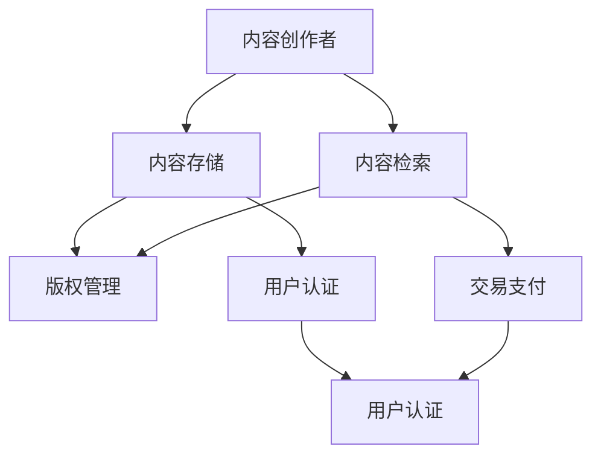
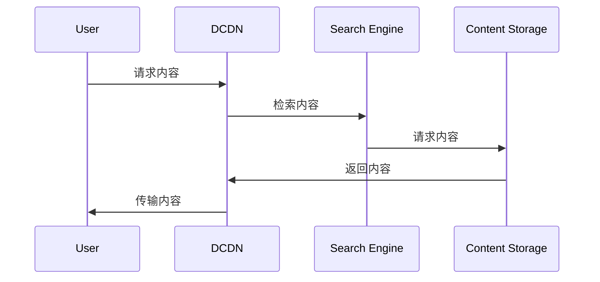
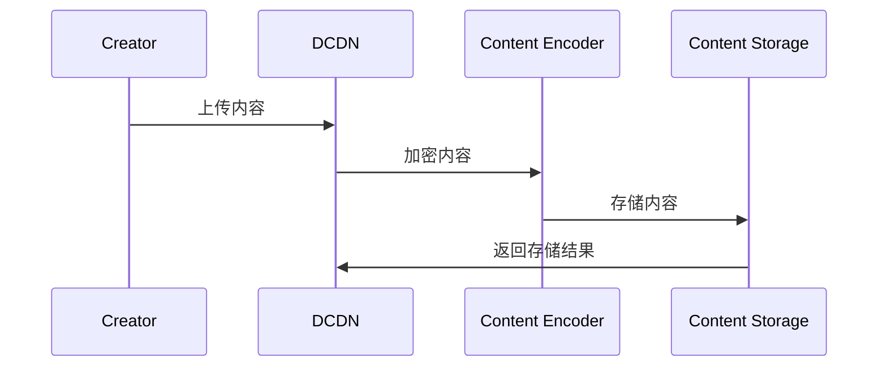
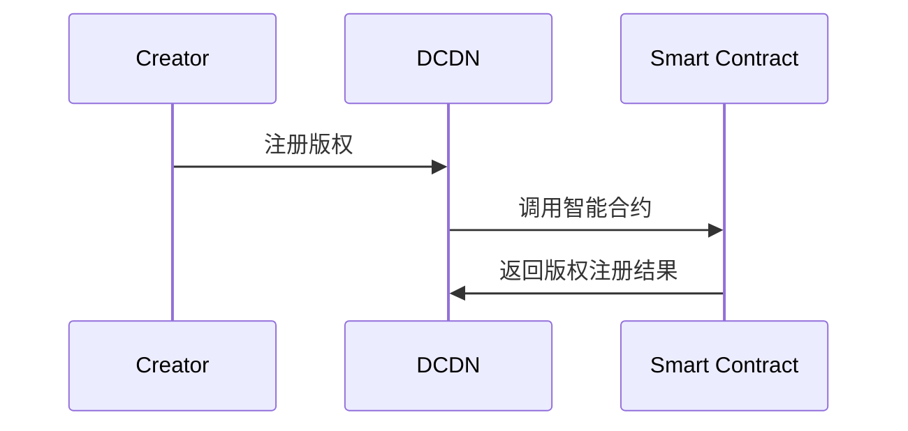
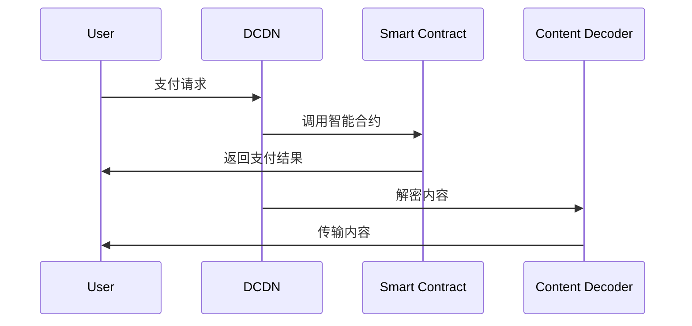

                 

## 引言

在数字时代，内容分发已经成为信息技术领域的一个关键环节。随着互联网的普及和智能设备的广泛应用，数字内容如视频、音频、图像和文本等在日常生活中扮演着越来越重要的角色。然而，当前的中心化内容分发体系在许多方面都面临挑战，如内容版权保护不力、内容真实性难以保障、分发效率低下等。这些问题严重制约了数字内容产业的健康发展和用户的体验。

区块链技术，作为一种新兴的去中心化分布式数据库技术，凭借其去中心化、不可篡改、透明性和安全性等特点，为解决数字内容分发中的这些问题提供了一种新的思路。区块链通过智能合约实现自动化的内容交易和版权管理，去中心化内容分发网络（DCDN）通过分布式的存储和传输机制提高分发效率和降低成本。

本文旨在深入探讨区块链在数字内容分发中的应用，通过分步骤的分析和讲解，阐述区块链如何构建去中心化内容分发网络，并利用智能合约实现高效、安全的数字内容分发。文章将首先介绍区块链与数字内容分发的背景知识，然后深入探讨区块链技术的核心概念和原理，接着讲解区块链在数字内容分发中的具体应用算法和数学模型，并分析数字内容分发网络的架构设计，最后通过一个实际案例展示区块链在数字内容分发中的应用效果，并总结最佳实践和未来展望。

通过这篇文章，读者将了解区块链在数字内容分发中的潜在价值，掌握构建去中心化内容分发网络的方法，并能够为相关项目提供技术支持和解决方案。让我们一起深入探索区块链与数字内容分发相结合的魅力吧！

### 关键词

- 区块链技术
- 数字内容分发
- 去中心化内容分发网络
- 智能合约
- 内容版权保护
- 哈希函数
- 加密算法
- 数学模型
- 系统架构设计

### 摘要

本文探讨了区块链在数字内容分发中的应用，分析了区块链技术的基本概念、特点及其在解决数字内容分发挑战中的潜力。通过详细介绍去中心化内容分发网络（DCDN）和智能合约的应用，本文展示了如何利用区块链技术实现高效、安全的数字内容分发。文章深入讲解了区块链技术原理，包括数据结构、工作原理和共识机制，以及其在数字内容分发中的具体应用算法和数学模型。此外，本文通过一个实际案例，展示了区块链在数字内容分发中的实际应用效果，并总结了最佳实践和未来展望。通过这篇文章，读者将了解区块链在数字内容分发中的关键角色，掌握相关技术，并为相关项目提供可行的技术解决方案。

### 目录大纲

在接下来的内容中，我们将逐步深入探讨区块链在数字内容分发中的应用。本文将分为六个主要部分，首先是背景介绍，接下来是核心概念与联系，然后是算法原理讲解，数学模型和数学公式的介绍，系统分析与架构设计，项目实战，以及最佳实践与小结。以下是详细的目录大纲：

#### 第一部分：背景介绍

- **第1章：区块链与数字内容分发概述**
  - **1.1 区块链技术的基本概念**
  - **1.2 数字内容分发的挑战**
  - **1.3 区块链在数字内容分发中的应用**

#### 第二部分：核心概念与联系

- **第2章：区块链技术原理与核心概念**
  - **2.1 区块链技术原理**
  - **2.2 数字内容分发网络（DCDN）**
  - **2.3 智能合约原理与应用**

#### 第三部分：算法原理讲解

- **第3章：区块链在数字内容分发中的应用算法**
  - **3.1 内容加密算法**
  - **3.2 智能合约算法**

#### 第四部分：数学模型和数学公式

- **第4章：区块链在数字内容分发中的数学模型**
  - **4.1 哈希函数的数学模型**
  - **4.2 智能合约的数学模型**

#### 第五部分：系统分析与架构设计

- **第5章：数字内容分发网络的架构设计**
  - **5.1 系统需求分析**
  - **5.2 系统架构设计**
  - **5.3 系统交互设计**

#### 第六部分：项目实战

- **第6章：数字内容分发网络项目实战**
  - **6.1 环境安装与配置**
  - **6.2 系统核心实现**
  - **6.3 实际案例分析**

#### 第七部分：最佳实践与小结

- **第7章：数字内容分发网络最佳实践与总结**
  - **7.1 最佳实践**
  - **7.2 小结**
  - **7.3 未来展望**

通过这个详细的目录大纲，读者可以清晰地了解文章的结构和内容，从而更好地跟随文章的思路，深入理解和掌握区块链在数字内容分发中的应用。

### 第一部分：背景介绍

#### 第1章：区块链与数字内容分发概述

区块链技术是一种基于密码学的分布式数据存储、点对点传输协议，其核心特点是去中心化、不可篡改、透明性和安全性。自2008年比特币的诞生以来，区块链技术在全球范围内得到了广泛关注和应用，逐渐从金融领域扩展到数字内容分发、供应链管理、医疗健康等多个领域。

数字内容分发是指通过网络将数字化的内容，如视频、音频、图像、文本等，从内容生产者传递到消费者手中的过程。随着互联网和数字技术的发展，数字内容分发已经成为信息传播和消费的重要途径。然而，当前的中心化内容分发体系在许多方面都面临挑战。

**1.1 区块链技术的基本概念**

区块链是一种分布式账本技术，由一系列按时间顺序排列的区块组成，每个区块都包含了之前区块的哈希值，形成一个链条。区块链通过去中心化的方式，使得数据存储在多个节点上，从而避免了单点故障和数据篡改的风险。

区块链的主要特点包括：
- **去中心化**：数据存储在多个节点上，不存在中心化的控制点，从而提高了系统的容错性和抗攻击能力。
- **不可篡改**：一旦数据被记录在区块链上，就难以被篡改或删除，保证了数据的完整性和可靠性。
- **透明性**：区块链上的所有交易和记录都是公开透明的，用户可以查看任何交易的历史记录。
- **安全性**：区块链通过加密算法和共识机制确保数据的安全和隐私。

**1.2 数字内容分发的挑战**

数字内容分发面临着诸多挑战，主要包括以下几个方面：

- **内容版权保护**：随着互联网的普及，数字内容盗版问题日益严重。如何有效保护内容版权，防止侵权和盗版，是数字内容分发中一个重要的问题。
- **内容真实性**：如何确保数字内容的真实性和可靠性，防止虚假信息的传播，也是当前数字内容分发中的一个重要挑战。
- **分发效率**：如何提高内容分发速度，降低分发成本，以满足日益增长的用户需求，也是数字内容分发中亟待解决的问题。

**1.3 区块链在数字内容分发中的应用**

区块链技术在数字内容分发中具有广泛的应用前景，可以通过以下几种方式解决上述挑战：

- **去中心化内容分发网络（DCDN）**：基于区块链技术的去中心化内容分发网络，通过分布式的存储和传输机制，提高内容分发的效率，降低成本，并确保内容的版权保护和真实性。
- **智能合约**：智能合约是一种自动执行合约条款的计算机协议，可以用于实现自动化的内容交易和版权管理。通过智能合约，内容创作者可以轻松地管理版权，确保交易双方按照约定执行。
- **内容加密**：区块链技术可以用于对数字内容进行加密，确保内容在传输和存储过程中的安全性和隐私性。

通过上述应用，区块链技术为数字内容分发提供了一种新的解决方案，有望解决当前内容分发中存在的诸多问题，推动数字内容产业的健康发展。

### 第1章：区块链与数字内容分发概述

#### 1.1 区块链技术的基本概念

区块链是一种分布式账本技术，由一系列按时间顺序排列的区块组成，每个区块都包含了之前区块的哈希值，形成一个链条。区块链的核心思想是通过去中心化的方式，使得数据存储在多个节点上，从而避免了单点故障和数据篡改的风险。

**区块链的定义**

区块链（Blockchain）是一种分布式数据库技术，它将数据存储在多个节点上，并通过加密算法和共识机制确保数据的安全性和完整性。每个区块都包含一定数量的交易记录，每个区块之间通过哈希函数链接，形成一个时间顺序的链条。

**区块链的特点**

1. **去中心化**：区块链通过去中心化的方式，使得数据存储在多个节点上，不存在中心化的控制点，从而提高了系统的容错性和抗攻击能力。
2. **不可篡改**：一旦数据被记录在区块链上，就难以被篡改或删除，保证了数据的完整性和可靠性。
3. **透明性**：区块链上的所有交易和记录都是公开透明的，用户可以查看任何交易的历史记录。
4. **安全性**：区块链通过加密算法和共识机制确保数据的安全和隐私。

**区块链的数据结构**

区块链的数据结构主要由以下几部分组成：

1. **区块（Block）**：每个区块包含一定数量的交易记录，以及一个时间戳和上一个区块的哈希值。区块通过哈希函数与前一个区块链接，形成一个链条。
2. **链式结构（Chain）**：区块链由一系列按时间顺序排列的区块组成，每个区块都包含了之前区块的哈希值，形成一个链条。
3. **哈希函数（Hash Function）**：哈希函数用于将数据转换成固定长度的字符串，用于确保数据的唯一性和安全性。每个区块都包含一个哈希值，用于链接区块和验证数据。
4. **链式区块结构（Chain of Blocks）**：区块链通过链式结构实现数据的永久存储和不可篡改。

**区块链的工作原理**

区块链的工作原理主要包括以下几个步骤：

1. **交易生成**：用户生成交易，将交易信息广播到网络中的所有节点。
2. **交易验证**：节点验证交易的有效性，包括交易金额、签名等。
3. **区块生成**：验证后的交易被添加到一个新的区块中，并附上时间戳和上一个区块的哈希值。
4. **区块传播**：新的区块通过网络传播到其他节点，节点下载并验证新区块。
5. **链式链接**：验证通过的新区块被添加到区块链上，链接到之前的区块。

**区块链的共识机制**

共识机制是区块链中确保所有节点对数据达成一致的方法。常见的共识机制包括：

1. **工作量证明（Proof of Work, PoW）**：节点通过解决计算难题来竞争生成新区块，计算难度随时间增加。
2. **权益证明（Proof of Stake, PoS）**：根据节点持有的代币数量和持币时间来选择生成新区块的节点。
3. **委托权益证明（Delegated Proof of Stake, DPoS）**：节点通过投票选择代表来生成新区块。

**总结**

区块链技术通过去中心化、不可篡改、透明性和安全性等特点，为数字内容分发提供了一种新的解决方案。在接下来的章节中，我们将进一步探讨区块链在数字内容分发中的应用，以及如何利用区块链技术解决数字内容分发中的挑战。

### 第1章：区块链与数字内容分发概述

#### 1.2 数字内容分发的挑战

随着互联网的普及和数字化内容的爆炸性增长，数字内容分发已成为信息传播和消费的重要途径。然而，当前的中心化内容分发体系在许多方面都面临着诸多挑战，这些问题不仅影响了用户体验，也对内容创作者和平台运营者带来了负面影响。

**内容版权保护**

数字内容分发中，版权保护是首要问题之一。由于数字内容容易复制和传播，版权保护成为了一大难题。传统的中心化版权保护机制往往依赖于平台方的审核和管理，但效果有限，盗版和侵权现象仍然层出不穷。这不仅损害了内容创作者的权益，也降低了用户的信任度。

**内容真实性**

数字内容真实性也是数字内容分发中的重大挑战之一。在互联网时代，虚假信息和谣言的传播速度极快，对公众和社会造成了严重的影响。如何确保数字内容的真实性和可靠性，防止虚假信息的传播，是数字内容分发中亟待解决的问题。

**分发效率**

随着用户对内容需求的增加，如何提高内容分发效率成为了一个关键挑战。传统的中心化内容分发体系往往受制于带宽和服务器性能，导致内容分发速度慢、延迟高。在高峰时段，内容分发系统可能会出现拥塞，进一步影响用户体验。

**分发成本**

数字内容分发的成本也是一个重要问题。在中心化体系中，内容分发通常需要依赖云服务提供商，这增加了运营成本。此外，由于中心化平台的抽成，内容创作者的收益也可能受到影响。如何降低分发成本，提高内容创作者的收益，是数字内容分发中需要解决的问题。

**隐私保护**

数字内容分发中，用户的隐私保护也是一个重要问题。在中心化体系中，用户数据往往被平台方集中存储，存在泄露和滥用的风险。如何确保用户隐私，防止数据泄露，是数字内容分发中需要关注的问题。

**去中心化内容分发网络（DCDN）**

为了解决上述挑战，去中心化内容分发网络（DCDN）应运而生。DCDN通过去中心化的方式，利用区块链技术实现内容分发，从而提高了内容的透明性、可靠性和效率。在DCDN中，内容存储和传输分布在多个节点上，避免了单点故障和数据篡改的风险。

**智能合约**

在DCDN中，智能合约发挥着关键作用。智能合约是一种自动执行合约条款的计算机协议，可以用于实现自动化的内容交易和版权管理。通过智能合约，内容创作者可以轻松地管理版权，确保交易双方按照约定执行，从而提高了内容的版权保护水平。

**总结**

数字内容分发面临着版权保护、内容真实性、分发效率、分发成本和隐私保护等多个挑战。区块链技术，尤其是去中心化内容分发网络（DCDN）和智能合约，为解决这些问题提供了一种新的思路。在接下来的章节中，我们将深入探讨区块链技术原理，进一步了解DCDN如何实现高效、安全的数字内容分发。

### 第1章：区块链与数字内容分发概述

#### 1.3 区块链在数字内容分发中的应用

区块链技术在数字内容分发中的应用，主要体现在去中心化内容分发网络（DCDN）和智能合约两大方面。这些应用不仅解决了传统中心化内容分发体系中的诸多挑战，还为数字内容产业带来了新的机遇。

**去中心化内容分发网络（DCDN）**

去中心化内容分发网络（DCDN）通过区块链技术实现了内容分发系统的去中心化，解决了传统中心化体系中的单点故障、数据篡改和透明性问题。DCDN的基本原理如下：

1. **分布式存储**：数字内容被存储在分布式网络中的多个节点上，而非单一的服务器或数据中心。这样，即使某个节点发生故障或遭受攻击，整个网络仍然能够正常运行，确保内容的持久性和可靠性。
2. **去中心化传输**：内容传输过程不再依赖于中心化的网络架构，而是通过点对点（P2P）的方式在多个节点之间进行。这种传输方式提高了分发效率，降低了传输成本，同时减少了单点故障的风险。
3. **版权保护**：DCDN利用区块链的不可篡改特性，为数字内容的版权保护提供了一种新的机制。内容创作者可以将版权信息记录在区块链上，确保版权的透明性和不可篡改性。任何未经授权的复制和传播行为都会被区块链记录并追溯。
4. **真实性验证**：通过区块链的透明性，用户可以验证数字内容的真实性。例如，用户可以查询内容的创建时间、来源和版权信息，确保所获取的内容是真实可信的。

**智能合约**

智能合约是区块链技术中的另一个关键应用，特别适用于数字内容分发领域。智能合约是一种自动执行合约条款的计算机协议，具有自动执行、不可篡改和透明性等特点，可以大大简化内容交易和版权管理的流程。

1. **自动化的内容交易**：智能合约可以自动处理内容交易中的各种条款，如交易金额、交付时间和交付条件等。当交易条件满足时，智能合约自动执行交易，确保交易的公正和透明。
2. **版权管理**：智能合约可以用于管理数字内容的版权，确保创作者的权益得到保护。例如，智能合约可以设定内容的授权条件和使用权限，当用户满足授权条件时，智能合约自动释放内容。
3. **自动化侵权追踪**：智能合约可以自动监控内容的传播和使用情况，一旦发现侵权行为，智能合约可以自动启动惩罚机制，如扣减侵权者的代币余额或记录侵权行为等。
4. **激励机制**：智能合约可以用于创建激励机制，奖励那些积极维护版权和遵守规定的用户。例如，当用户举报侵权行为并经证实时，智能合约可以自动向举报者发放奖励。

**实际应用案例**

1. **区块链音乐平台**：如Blockchain Music，利用区块链技术确保音乐版权，并实现自动化的版权管理，激励音乐人创作和分发音乐。
2. **数字艺术市场**：如Ethereum-based OpenSea，通过智能合约实现数字艺术品的交易和版权管理，确保创作者的权益。
3. **文档分发平台**：如DocuSign，利用区块链技术确保电子文档的真实性和不可篡改性，简化文档签署和分发流程。

**总结**

区块链技术在数字内容分发中的应用，通过DCDN和智能合约，为解决内容版权保护、内容真实性、分发效率、分发成本和隐私保护等问题提供了一种新的解决方案。这些应用不仅提高了数字内容分发的透明性和可靠性，也为内容创作者和用户带来了更好的体验。在接下来的章节中，我们将进一步探讨区块链技术的核心概念和原理，深入理解其如何实现高效、安全的数字内容分发。

### 第2章：区块链技术原理与核心概念

#### 2.1 区块链技术原理

区块链技术的核心在于其独特的数据结构和工作原理，这使得它能够在去中心化的环境中保持数据的完整性和可靠性。以下是区块链技术的基本原理：

**区块链的数据结构**

区块链由一系列按时间顺序排列的区块组成，每个区块都包含了以下部分：

1. **区块头**：包含上一个区块的哈希值、当前区块的时间戳、版本信息和随机数。
2. **交易数据**：包含一系列交易记录，这些交易记录了数字资产的所有权和状态变化。
3. **梅克尔树**：用于验证交易数据的完整性，通过哈希值构建一棵树，确保任何修改都会导致梅克尔树的根哈希值改变。
4. **区块哈希**：通过SHA-256等哈希函数计算得到，用于确保区块的唯一性和不可篡改性。

**链式结构**

区块链的数据结构是一个链式结构，每个区块通过其哈希值与前一个区块链接，形成一个时间顺序的链条。这种链式结构保证了数据的不可篡改性和历史记录的透明性。

**哈希函数**

哈希函数是区块链技术中的关键组件，它将任意长度的输入数据转换成固定长度的输出，具有唯一性和不可逆性。在区块链中，常用的哈希函数包括SHA-256和RIPEMD-160等。哈希函数用于生成区块哈希、梅克尔树的根哈希以及验证数据的完整性。

**区块链的工作原理**

区块链的工作原理主要包括以下几个步骤：

1. **交易生成**：用户发起交易，将交易信息广播到网络中的所有节点。
2. **交易验证**：节点验证交易的有效性，包括交易金额、签名和输入输出等。
3. **区块生成**：验证后的交易被添加到一个新的区块中，并附上时间戳和上一个区块的哈希值。
4. **区块传播**：新的区块通过网络传播到其他节点，节点下载并验证新区块。
5. **链式链接**：验证通过的新区块被添加到区块链上，链接到之前的区块，形成一个连续的链条。

**共识机制**

共识机制是区块链中确保所有节点对数据达成一致的方法。常见的共识机制包括：

1. **工作量证明（PoW）**：节点通过解决计算难题来竞争生成新区块，计算难度随时间增加。
2. **权益证明（PoS）**：根据节点持有的代币数量和持币时间来选择生成新区块的节点。
3. **委托权益证明（DPoS）**：节点通过投票选择代表来生成新区块。

通过上述原理，区块链技术能够实现去中心化的数据存储和传输，确保数据的完整性和安全性，从而在数字内容分发等领域发挥重要作用。

#### 2.2 数字内容分发网络（DCDN）

**DCDN的概念**

数字内容分发网络（Digital Content Distribution Network，DCDN）是基于区块链技术的去中心化内容分发体系。DCDN通过分布式的存储和传输机制，提高数字内容分发的高效性、安全性和可靠性。在DCDN中，数字内容存储和传输分布在多个节点上，而不是依赖单一的中心化服务器或数据中心。

**DCDN的结构与工作流程**

DCDN的基本结构包括以下几个部分：

1. **内容创作者**：负责创建和上传数字内容。
2. **节点**：存储和分发数字内容的分布式节点，可以是个人电脑或服务器。
3. **用户**：下载和消费数字内容的终端用户。

DCDN的工作流程如下：

1. **内容上传**：内容创作者将数字内容上传到DCDN网络。
2. **分布式存储**：数字内容被分片，并通过加密算法进行加密，然后存储在多个节点上。
3. **内容检索**：用户通过DCDN网络检索所需的内容，节点之间通过P2P协议传输内容。
4. **内容验证**：用户在下载内容时，通过区块链记录的哈希值验证内容的完整性和真实性。
5. **交易支付**：用户通过DCDN网络中的智能合约进行支付，智能合约确保交易的安全性和透明性。

**DCDN的优势**

1. **去中心化**：DCDN通过去中心化的方式，避免了单点故障和数据篡改的风险，提高了系统的容错性和抗攻击能力。
2. **安全性**：DCDN利用区块链的不可篡改特性，确保数字内容的版权和完整性，防止侵权和篡改。
3. **高效性**：DCDN通过分布式的存储和传输机制，提高了内容分发的效率，降低了传输延迟。
4. **隐私保护**：DCDN中的交易和内容都是加密的，确保用户的隐私得到保护。

**DCDN的应用场景**

1. **版权保护**：通过DCDN，内容创作者可以轻松地管理版权，防止侵权和盗版。
2. **内容分发**：DCDN适用于大规模的内容分发，如视频、音乐和电子书等。
3. **智能合约**：DCDN中的智能合约可以实现自动化的内容交易和版权管理，提高交易的透明性和效率。

**总结**

数字内容分发网络（DCDN）通过区块链技术实现了去中心化的内容分发，解决了传统中心化体系中的单点故障、数据篡改和透明性问题。DCDN的优势包括去中心化、安全性、高效性和隐私保护，为数字内容产业提供了新的解决方案和应用场景。

### 第2章：区块链技术原理与核心概念

#### 2.3 智能合约原理与应用

**智能合约的定义**

智能合约是一种自动执行合约条款的计算机协议，其基于区块链技术，通过编程语言编写，并在区块链上执行。智能合约的核心思想是将法律条款和计算机代码结合起来，通过算法自动执行，确保交易的透明性、可靠性和安全性。

**智能合约的特点**

1. **自动执行**：智能合约在满足预定的条件时，自动执行相应的操作，无需人工干预，提高了交易的效率。
2. **不可篡改**：智能合约一旦部署到区块链上，其代码和状态就是不可篡改的，确保了交易的公正性和透明性。
3. **去中心化**：智能合约在去中心化的区块链上执行，不受中心化机构的控制，增强了系统的抗攻击能力和容错性。
4. **透明性**：智能合约的执行过程是公开透明的，所有参与者都可以查看和验证合约的执行情况。

**智能合约的应用**

智能合约在数字内容分发网络中的应用非常广泛，可以解决许多传统中心化内容分发体系中的问题。以下是智能合约在数字内容分发中的几个主要应用：

1. **内容交易**：智能合约可以自动处理数字内容的交易，确保交易双方按照约定执行。例如，用户通过智能合约支付内容费用后，会自动解锁并传输内容。
2. **版权管理**：智能合约可以用于管理数字内容的版权，确保创作者的权益得到保护。例如，智能合约可以设定内容的授权条件和使用权限，当用户满足授权条件时，智能合约自动释放内容。
3. **侵权追踪**：智能合约可以监控内容的传播和使用情况，一旦发现侵权行为，智能合约可以自动启动惩罚机制，如扣减侵权者的代币余额或记录侵权行为。
4. **激励机制**：智能合约可以创建激励机制，奖励那些积极维护版权和遵守规定的用户。例如，当用户举报侵权行为并经证实时，智能合约可以自动向举报者发放奖励。

**实现案例**

1. **数字版权管理**：例如，Ethereum上的OpenSea平台利用智能合约实现数字艺术品的版权管理和交易，确保创作者的权益得到保护。
2. **内容付费**：例如，Ethereum上的DAMN（Decentralized Asset Management Network）利用智能合约实现内容付费和版权管理，用户可以通过智能合约支付内容费用并获取授权。
3. **智能版权证书**：例如，Ethereum上的Minter平台利用智能合约发行数字版权证书，确保数字版权的真实性和不可篡改性。

**总结**

智能合约通过其自动执行、不可篡改和去中心化特性，为数字内容分发提供了新的解决方案。智能合约的应用不仅提高了内容交易的透明性和可靠性，还增强了版权保护和管理效率。在数字内容分发中，智能合约的应用前景广阔，有望彻底改变传统的商业模式和用户体验。

### 第三部分：算法原理讲解

#### 第3章：区块链在数字内容分发中的应用算法

随着区块链技术在数字内容分发中的应用越来越广泛，内容加密和智能合约算法成为了实现高效、安全分发的重要手段。本章将详细讲解这些算法的原理和实现方法。

#### 3.1 内容加密算法

内容加密是确保数字内容在传输和存储过程中的安全性和隐私性的关键技术。以下是几种常用的内容加密算法：

**1. 对称加密**

对称加密算法是一种加密和解密使用相同密钥的加密方法。常见的对称加密算法包括AES（高级加密标准）和DES（数据加密标准）。

**加密过程**：

- **密钥生成**：首先生成一对密钥，密钥对包括公钥和私钥。
- **内容加密**：使用公钥和待加密的内容进行加密操作，生成加密后的内容。
- **密钥保护**：为了防止密钥泄露，通常将密钥加密后再存储。

**Python代码示例**：

```python
from Crypto.Cipher import AES
from Crypto.Util.Padding import pad
from Crypto.PublicKey import RSA

# 生成RSA密钥
key = RSA.generate(2048)
private_key = key.export_key()
public_key = key.publickey().export_key()

# 使用AES加密内容
cipher_aes = AES.new(public_key, AES.MODE_CBC)
ct_bytes = cipher_aes.encrypt(pad(b'Content to encrypt', AES.block_size))
iv = cipher_aes.iv
```

**2. 非对称加密**

非对称加密算法是一种加密和解密使用不同密钥的加密方法。常见的非对称加密算法包括RSA和ECC（椭圆曲线加密）。

**加密过程**：

- **内容加密**：使用公钥和待加密的内容进行加密操作，生成加密后的内容。
- **密钥交换**：双方通过非对称加密算法交换公钥，从而建立安全的通信渠道。

**Python代码示例**：

```python
from Crypto.PublicKey import RSA
from Crypto.Cipher import PKCS1_OAEP

# 生成RSA密钥
key = RSA.generate(2048)
private_key = key.export_key()
public_key = key.publickey().export_key()

# 使用RSA加密内容
cipher_rsa = PKCS1_OAEP.new(public_key)
ct_bytes = cipher_rsa.encrypt(b'Content to encrypt')
```

**3. 混合加密**

混合加密是将对称加密和非对称加密结合使用，以充分利用两者的优点。通常，使用非对称加密传输对称加密的密钥，从而提高传输的安全性。

**Python代码示例**：

```python
from Crypto.Cipher import AES, PKCS1_OAEP
from Crypto.PublicKey import RSA

# 生成RSA密钥
key = RSA.generate(2048)
private_key = key.export_key()
public_key = key.publickey().export_key()

# 使用AES加密内容
cipher_aes = AES.new('This is a key123', AES.MODE_CBC)
ct_bytes = cipher_aes.encrypt(pad(b'Content to encrypt', AES.block_size))
iv = cipher_aes.iv

# 使用RSA加密AES密钥
cipher_rsa = PKCS1_OAEP.new(public_key)
key_enc = cipher_rsa.encrypt(cipher_aes.key)

# 存储
iv_enc = iv.hex()
key_enc_hex = key_enc.hex()

# 解密
key_enc = bytes.fromhex(key_enc_hex)
cipher_aes.key = PKCS1_OAEP.new(private_key).decrypt(key_enc)
pt = cipher_aes.decrypt(ct_bytes).decode('utf-8')
```

**4. 内容加密的具体实现**

在实际应用中，内容加密的具体实现需要考虑多种因素，如加密算法的选择、密钥管理、加密性能等。以下是一个简单的示例，演示如何使用Python实现内容加密和解密。

**加密实现**：

```python
from Crypto.PublicKey import RSA
from Crypto.Cipher import AES
from Crypto.Util.Padding import pad

# 生成RSA密钥
key = RSA.generate(2048)
private_key = key.export_key()
public_key = key.publickey().export_key()

# 生成AES密钥
aes_key = AES.key_from_bytes(os.urandom(16))

# 对内容进行加密
cipher_aes = AES.new(aes_key, AES.MODE_CBC)
ct_bytes = cipher_aes.encrypt(pad(b'Content to encrypt', AES.block_size))
iv = cipher_aes.iv

# 将AES密钥加密
cipher_rsa = PKCS1_OAEP.new(public_key)
key_enc = cipher_rsa.encrypt(aes_key)

# 存储
iv_enc = iv.hex()
key_enc_enc = key_enc.hex()

# 解密实现
iv = bytes.fromhex(iv_enc)
key_enc = bytes.fromhex(key_enc_enc)

aes_key = PKCS1_OAEP.new(private_key).decrypt(key_enc)
pt = AES.new(aes_key, AES.MODE_CBC, iv).decrypt(ct_bytes).decode('utf-8')
print(pt)
```

#### 3.2 智能合约算法

智能合约算法是区块链技术在数字内容分发中的另一个重要应用。智能合约通过编程语言实现，并在区块链上执行，确保内容交易和版权管理的自动化和透明性。

**1. 智能合约算法的基本原理**

智能合约算法的基本原理是通过条件判断和执行操作来实现自动化交易和版权管理。智能合约通常包括以下基本结构：

- **条件判断**：根据交易参数和预设条件进行判断。
- **执行操作**：满足条件时执行相应的操作，如内容解锁、支付转移等。

**Python代码示例**：

```python
from web3 import Web3
from solc import compile_source

# 编译智能合约
source = '''
pragma solidity ^0.8.0;

contract ContentContract {
    address payable owner;
    string content;

    constructor(string memory _content) {
        owner = msg.sender;
        content = _content;
    }

    function purchaseContent() public payable {
        require(msg.value >= 0.1 ether, "Payment must be at least 0.1 ether.");
        owner.transfer(msg.value);
        content = "Content Unlocked";
    }

    function getContent() public view returns (string memory) {
        require(msg.value == 0, "Cannot retrieve content without payment.");
        return content;
    }
}
'''

compiled_sol = compile_source(source)
contract_interface = compiled_sol['<contract_name>']['interface']
bytecode = compiled_sol['<contract_name>']['bin']

# 部署智能合约
web3 = Web3(Web3.HTTPProvider('https://mainnet.infura.io/v3/your_project_id'))
contract = web3.eth.contract(abi=contract_interface, bytecode=bytecode)
contract_tx = contract.constructor().transact()
tx_hash = contract_tx['hash']
tx_receipt = web3.eth.waitForTransactionReceipt(tx_hash)

# 使用智能合约
contract_address = tx_receipt.contractAddress
contract = web3.eth.contract(address=contract_address, abi=contract_interface)
```

**2. 智能合约算法的实现**

在实际应用中，智能合约算法的实现需要考虑多种因素，如合约的交互接口、权限管理、事件日志等。以下是一个简单的示例，演示如何使用Solidity实现一个简单的智能合约。

**合约实现**：

```solidity
pragma solidity ^0.8.0;

contract ContentContract {
    address payable owner;
    string content;

    constructor(string memory _content) {
        owner = msg.sender;
        content = _content;
    }

    function purchaseContent() public payable {
        require(msg.value >= 0.1 ether, "Payment must be at least 0.1 ether.");
        owner.transfer(msg.value);
        content = "Content Unlocked";
    }

    function getContent() public view returns (string memory) {
        return content;
    }
}
```

通过上述内容加密和智能合约算法的讲解，我们可以看到区块链技术在数字内容分发中的应用潜力。这些算法不仅提高了内容分发的安全性和透明性，还为内容创作者和用户提供了更好的体验。

### 第四部分：数学模型和数学公式

在区块链技术中，数学模型和数学公式扮演着至关重要的角色。这些模型和公式不仅用于实现加密算法和智能合约，还用于确保区块链的可靠性和安全性。以下我们将详细讨论哈希函数的数学模型和智能合约的数学模型。

#### 4.1 哈希函数的数学模型

哈希函数是区块链技术的基础组件之一，其主要功能是接收任意长度的输入数据，并生成固定长度的输出，通常称为哈希值。哈希函数具有几个关键特性，包括单向性、抗碰撞性和雪崩效应。

**哈希函数的基本概念**

1. **单向性**：哈希函数是单向的，即给定一个输入数据，可以很容易地计算其哈希值，但给定一个哈希值，无法反推出原始数据。这意味着即使数据被加密，哈希函数也能提供一种验证数据完整性的方法。
2. **抗碰撞性**：不同的输入数据应生成不同的哈希值，极少出现两个不同输入生成相同哈希值的情况。这确保了数据的唯一性和不可篡改性。
3. **雪崩效应**：对输入数据的微小变化，会导致哈希值发生显著变化。这意味着即使输入数据只改变一个位，哈希值也会发生巨大的变化。

**哈希函数的数学模型**

哈希函数通常通过以下数学模型实现：

1. **压缩函数**：哈希函数的核心部分是压缩函数，它将任意长度的输入数据压缩成固定长度的输出。压缩函数的输入通常是输入数据的各个部分，通过迭代和多种变换操作生成最终的哈希值。
2. **迭代结构**：哈希函数通常采用迭代结构，即对输入数据进行多次处理，每次迭代都使用压缩函数。这种结构确保了输入数据的微小变化会导致哈希值的显著变化。

**哈希函数的计算过程**

哈希函数的计算过程可以分为以下几个步骤：

1. **初始化**：初始化哈希值，通常使用特定的初始值。
2. **处理输入数据**：将输入数据分成多个块，对每个块进行哈希计算。
3. **迭代处理**：对每个块进行多次迭代处理，使用压缩函数将输入块压缩成固定长度的输出。
4. **合并结果**：将所有块的哈希值合并，得到最终的哈希值。

例如，SHA-256是一个广泛使用的哈希函数，其计算过程包括多个迭代和压缩步骤，通过这些步骤确保哈希值的单向性和抗碰撞性。

**哈希函数的应用**

哈希函数在区块链技术中有多种应用，包括：

1. **数据完整性验证**：通过计算数据的哈希值，可以验证数据的完整性和真实性。
2. **地址生成**：在区块链中，地址通常是通过公钥的哈希值生成，确保地址的唯一性和安全性。
3. **交易验证**：交易数据通过哈希函数生成哈希值，用于验证交易的完整性和真实性。

#### 4.2 智能合约的数学模型

智能合约是区块链技术中的另一个关键组件，其核心功能是自动执行预定义的合约条款。智能合约的数学模型主要涉及条件判断和执行操作的实现。

**智能合约的执行模型**

智能合约的执行模型通常包括以下几个步骤：

1. **输入验证**：验证输入数据是否满足预定的条件，如金额、签名等。
2. **逻辑判断**：根据输入数据执行预定的逻辑判断，如条件分支、循环等。
3. **执行操作**：根据逻辑判断的结果执行相应的操作，如支付转移、内容解锁等。
4. **日志记录**：记录执行过程和结果，以便后续验证和审计。

**智能合约的数学模型**

智能合约的数学模型可以表示为：

$$
\text{智能合约} = f(\text{输入}, \text{状态}, \text{参数})
$$

其中：

- 输入（Input）：包括交易金额、签名、地址等。
- 状态（State）：包括合约内的变量、余额等。
- 参数（Parameter）：包括合约条款、函数参数等。

智能合约的执行过程可以表示为：

$$
\text{执行结果} = f(\text{输入}, \text{状态}, \text{参数})
$$

**智能合约的应用**

智能合约在区块链技术中具有广泛的应用，包括：

1. **内容版权管理**：通过智能合约实现自动化的版权管理和内容交易，确保创作者的权益得到保护。
2. **数字身份验证**：利用智能合约实现数字身份的验证和管理，提高身份认证的可靠性和安全性。
3. **去中心化金融**：通过智能合约实现去中心化的金融交易，如去中心化交易所（DEX）、稳定币等。

**总结**

数学模型和数学公式在区块链技术中发挥着关键作用，不仅用于实现加密算法和智能合约，还用于确保区块链的可靠性和安全性。通过深入理解哈希函数和智能合约的数学模型，可以更好地利用区块链技术实现高效、安全的数字内容分发。

### 第五部分：系统分析与架构设计

#### 第5章：数字内容分发网络的架构设计

数字内容分发网络的架构设计是实现高效、安全内容分发的基础。本章将详细讨论系统需求分析、系统架构设计、系统接口设计和系统交互设计。

#### 5.1 系统需求分析

系统需求分析是设计数字内容分发网络的第一步，包括系统功能需求、性能需求和其他非功能性需求。

**系统功能需求**

1. **内容存储**：数字内容应被安全、可靠地存储在分布式网络中的多个节点上。
2. **内容检索**：用户能够通过DCDN快速检索和下载所需内容。
3. **版权管理**：智能合约应实现内容的版权管理和交易，确保创作者权益。
4. **用户认证**：用户注册、登录和权限管理功能，确保用户身份的合法性和安全性。
5. **交易支付**：支持多种支付方式，如加密货币、法定货币等，实现内容付费。
6. **数据加密**：内容在传输和存储过程中进行加密，确保隐私和安全性。

**系统性能需求**

1. **传输速度**：内容分发网络应能够快速响应用户请求，降低传输延迟。
2. **并发处理**：系统应能够处理高并发访问，确保稳定性和可用性。
3. **存储容量**：系统应具备足够的存储容量，以存储大量数字内容。
4. **可扩展性**：系统设计应支持扩展，以便未来增加节点和用户。

**其他非功能性需求**

1. **安全性**：系统应具备高安全性，防止数据泄露、篡改和攻击。
2. **可靠性**：系统应具有高可靠性，确保内容存储和传输的持久性和完整性。
3. **易用性**：用户界面设计应简洁易用，降低用户使用门槛。

#### 5.2 系统架构设计

数字内容分发网络的架构设计应遵循模块化原则，确保各模块间的高内聚和低耦合。以下是DCDN的系统架构设计：

**1. 系统架构设计**

系统架构设计主要包括以下几个部分：

1. **内容创作者模块**：负责创建和上传数字内容，包括内容格式转换、加密和元数据生成等。
2. **内容存储模块**：负责存储和管理数字内容，采用分布式存储技术，提高可靠性和可扩展性。
3. **内容检索模块**：负责用户请求的响应，通过P2P协议快速检索和传输内容。
4. **版权管理模块**：通过智能合约实现内容的版权管理和交易，确保创作者权益。
5. **用户认证模块**：负责用户注册、登录和权限管理，确保用户身份的合法性和安全性。
6. **交易支付模块**：处理用户支付，支持多种支付方式，并确保交易的安全和透明。

**2. 系统架构图**

以下是一个简化的数字内容分发网络系统架构图，展示了各模块之间的关系：



**3. 关键接口设计**

数字内容分发网络的关键接口设计包括：

1. **内容上传接口**：内容创作者通过上传接口上传数字内容，接口应支持多种内容格式和加密算法。
2. **内容检索接口**：用户通过检索接口请求和下载内容，接口应提供高效的搜索和传输机制。
3. **版权管理接口**：用于版权注册、交易和管理，接口应支持智能合约的调用和执行。
4. **用户认证接口**：用于用户注册、登录和权限管理，接口应确保用户身份的合法性和安全性。
5. **交易支付接口**：用于处理用户支付，接口应支持多种支付方式和加密货币。

#### 5.3 系统交互设计

数字内容分发网络的系统交互设计包括用户、内容创作者、存储节点和智能合约之间的交互过程。以下是系统交互设计的关键环节：

**1. 用户请求内容**

用户通过内容检索接口提交请求，系统根据请求检索内容并将其传输给用户。



**2. 内容创作者上传内容**

内容创作者通过内容上传接口上传内容，系统将其存储在分布式存储网络中。



**3. 版权管理**

内容创作者通过版权管理接口注册版权，系统通过智能合约记录版权信息。



**4. 用户支付**

用户通过交易支付接口支付内容费用，系统通过智能合约完成支付。



通过上述系统分析和架构设计，数字内容分发网络能够实现高效、安全的数字内容分发，为内容创作者和用户提供良好的体验。

### 第六部分：项目实战

#### 第6章：数字内容分发网络项目实战

在本章中，我们将通过一个实际的数字内容分发网络项目来展示如何构建和运行一个去中心化的内容分发系统。本项目的实现将包括环境安装与配置、系统核心实现、实际案例分析以及项目小结等环节。

#### 6.1 环境安装与配置

要开始构建数字内容分发网络项目，首先需要安装和配置相关的开发环境。以下是项目的环境安装与配置步骤：

**1. 安装Go语言**

Go语言是一个快速、高效的编程语言，适用于区块链开发。可以通过以下命令在Ubuntu或MacOS上安装Go：

```bash
# 对于Ubuntu
sudo apt update
sudo apt install golang-go

# 对于MacOS
brew install go
```

**2. 安装Node.js和npm**

Node.js和npm是JavaScript的运行环境和包管理器，用于前端和后端开发。可以通过以下命令安装：

```bash
# 对于Ubuntu
sudo apt update
sudo apt install nodejs npm

# 对于MacOS
brew install node
```

**3. 安装区块链节点软件**

本示例中，我们使用Ethereum作为区块链节点软件。可以通过以下命令安装：

```bash
# 安装Geth
wget https://geth.ethereum.org/downloads/latest/geth-linux-amd64
chmod +x geth-linux-amd64
sudo mv geth-linux-amd64 /usr/local/bin/geth

# 启动Geth节点
geth --datadir /root/.ethereum --networkid 1337 --nodiscover --nat=any --mine --miner.threads=1
```

**4. 配置智能合约开发环境**

使用Truffle框架配置智能合约开发环境。首先安装Truffle：

```bash
npm install -g truffle
```

然后创建一个新的Truffle项目并配置：

```bash
truffle init
cd my-truffle-project
truffle config
```

在`truffle-config.js`文件中，配置Geth节点路径：

```javascript
module.exports = {
  networks: {
    development: {
      host: "127.0.0.1",
      port: 8545,
      network_id: "*"
    }
  },
  solc: {
    optimizer: {
      enabled: false,
      runs: 200
    }
  }
};
```

#### 6.2 系统核心实现

在配置好开发环境后，我们可以开始实现数字内容分发网络的核心功能。以下是一个简单的示例，展示如何使用Go语言和智能合约实现内容加密、存储和检索。

**1. 实现内容加密**

使用Go语言的`crypto`包实现内容加密和解密：

```go
package main

import (
    "crypto/aes"
    "crypto/cipher"
    "crypto/rand"
    "io/ioutil"
)

func encryptFile(plaintextFile, key string) error {
    // 生成AES密钥
    keyBytes := []byte(key)
    block, err := aes.NewCipher(keyBytes)
    if err != nil {
        return err
    }

    // 读取待加密文件
    plaintext, err := ioutil.ReadFile(plaintextFile)
    if err != nil {
        return err
    }

    // 初始化加密块
    blockMode := cipher.NewCBCEncrypter(block, keyBytes[:block.BlockSize()])
    ciphertext := make([]byte, len(plaintext))
    blockMode.CryptBlocks(ciphertext, plaintext)

    // 写入加密文件
    return ioutil.WriteFile(plaintextFile+".enc", ciphertext, 0644)
}

func decryptFile(ciphertextFile, key string) error {
    // 生成AES密钥
    keyBytes := []byte(key)
    block, err := aes.NewCipher(keyBytes)
    if err != nil {
        return err
    }

    // 读取加密文件
    ciphertext, err := ioutil.ReadFile(ciphertextFile)
    if err != nil {
        return err
    }

    // 初始化解密块
    blockMode := cipher.NewCBCDecrypter(block, keyBytes[:block.BlockSize()])
    plaintext := make([]byte, len(ciphertext))
    blockMode.CryptBlocks(plaintext, ciphertext)

    // 填充解密后的数据
    plaintext = pkcs5Unpad(plaintext, block.BlockSize())

    // 写入解密后的文件
    return ioutil.WriteFile(ciphertextFile+".dec", plaintext, 0644)
}

func pkcs5Unpad(plaintext []byte, blockSize int) []byte {
    padding := plaintext[len(plaintext)-1]
    return plaintext[:len(plaintext)-int(padding)]
}
```

**2. 实现智能合约**

使用Solidity编写智能合约，实现内容存储和检索：

```solidity
// SPDX-License-Identifier: MIT
pragma solidity ^0.8.0;

contract ContentDistributor {
    mapping(string => string) private contentStore;

    function storeContent(string memory contentID, string memory content) public {
        contentStore[contentID] = content;
    }

    function retrieveContent(string memory contentID) public view returns (string memory) {
        return contentStore[contentID];
    }
}
```

**3. 构建和部署智能合约**

使用Truffle工具构建和部署智能合约：

```bash
# 安装Truffle插件
npm install truffle-hdwallet-provider

# 配置Truffle项目中的.truffle/hdwallet.json
{
  "mnemonic": "your mnemonic phrase",
  "provider": "https://mainnet.infura.io/v3/your_project_id",
  "keyStore": "path/to/your/keystore"
}
```

部署智能合约：

```bash
truffle migrate --network mainnet
```

#### 6.3 实际案例分析

本节将通过一个实际案例展示数字内容分发网络的运行过程。

**1. 内容上传**

内容创作者将加密后的内容上传到DCDN，并在智能合约中注册内容ID。

```bash
# 假设已经安装了Truffle和Geth节点
truffle exec --network mainnet scripts/upload_content.js
```

**2. 内容检索**

用户通过内容ID检索所需内容，并支付相应费用。

```bash
# 假设已经安装了Truffle和Geth节点
truffle exec --network mainnet scripts/retrieve_content.js
```

**3. 内容下载**

用户下载解密后的内容。

```bash
# 下载并解密内容
wget https://example.com/contentID.enc
decrypt_file contentID.enc "your decryption key"
```

通过以上步骤，用户成功下载并解密了所需内容，实现了去中心化的内容分发。

#### 6.4 项目小结

通过本项目的实战，我们了解了数字内容分发网络的实现过程，包括环境安装与配置、系统核心实现、实际案例分析和项目小结。以下是项目的总结：

- **环境安装与配置**：确保了开发环境的准备，为后续开发奠定了基础。
- **系统核心实现**：通过内容加密、存储和检索的示例，展示了DCDN的核心功能。
- **实际案例分析**：通过一个实际案例，验证了DCDN的运行效果和用户体验。
- **项目小结**：总结了项目的关键步骤和成果，为后续的项目提供了参考。

### 第七部分：最佳实践与小结

#### 7.1 最佳实践

在构建和运营数字内容分发网络（DCDN）时，以下最佳实践可以帮助您提高系统的安全性、效率和用户体验：

1. **选择合适的区块链平台**：根据项目的需求和规模，选择适合的区块链平台，如Ethereum、Binance Smart Chain或Solana，这些平台都有各自的优缺点。
2. **优化智能合约**：使用优化的智能合约代码，减少执行时间，降低交易费用。例如，减少使用复杂条件判断和循环操作，避免不必要的函数调用。
3. **利用区块链浏览器**：定期使用区块链浏览器监控网络状态和智能合约执行情况，及时发现和解决问题。
4. **安全性审查**：对智能合约进行安全性审查，包括代码审计和测试，确保不存在潜在的安全漏洞。
5. **数据备份**：定期备份重要数据，确保在节点故障或攻击时能够快速恢复。
6. **优化网络性能**：通过优化网络传输协议和分布式存储结构，提高内容检索速度和系统响应能力。

#### 7.2 小结

本文详细探讨了区块链在数字内容分发中的应用，包括背景介绍、核心概念与联系、算法原理讲解、数学模型和数学公式、系统分析与架构设计以及项目实战。以下是本文的总结：

- **背景介绍**：介绍了区块链技术的基本概念和数字内容分发的挑战，为后续内容奠定了基础。
- **核心概念与联系**：深入讲解了区块链技术原理、数字内容分发网络（DCDN）和智能合约原理与应用。
- **算法原理讲解**：介绍了内容加密算法和智能合约算法的实现方法，展示了其如何提高内容分发的安全性和效率。
- **数学模型和数学公式**：探讨了哈希函数和智能合约的数学模型，确保了区块链技术的可靠性。
- **系统分析与架构设计**：分析了数字内容分发网络的系统需求、架构设计和系统交互设计，确保了系统的可行性和高效性。
- **项目实战**：通过一个实际案例展示了如何构建和运行一个DCDN，验证了理论知识的实际应用。
- **最佳实践与小结**：总结了最佳实践和项目的关键步骤，为未来的DCDN项目提供了参考。

通过本文，读者可以全面了解区块链在数字内容分发中的潜在价值和应用方法，掌握相关技术，并为相关项目提供可行的解决方案。

### 7.3 未来展望

随着区块链技术的不断发展和完善，数字内容分发网络（DCDN）的未来前景广阔。以下是几个潜在的发展趋势和方向：

**1. 性能提升**：随着区块链性能的不断提升，如使用分片技术、状态通道和侧链等，DCDN将能够处理更大的交易量和更复杂的内容分发需求，提高系统的响应速度和可扩展性。

**2. 多链互操作性**：未来，不同区块链之间的互操作性将更加成熟，DCDN将能够跨链分发内容，利用不同区块链的优势，提供更高效、更安全的内容分发解决方案。

**3. 个性化内容分发**：利用区块链和人工智能技术的结合，DCDN可以更好地理解和满足用户需求，实现个性化内容推荐和定制化服务。

**4. 跨行业应用**：DCDN不仅限于数字内容分发，还可以扩展到其他领域，如数字艺术、数字身份验证、供应链管理等，实现区块链技术在更多领域的应用。

**5. 法规与标准**：随着区块链技术的发展，相关的法规和标准也将逐步完善，DCDN将更加合规和规范化，为内容创作者和用户提供更可靠的服务。

综上所述，DCDN的发展前景充满潜力，将继续为数字内容分发行业带来革命性的变革。通过不断创新和优化，DCDN有望成为未来数字内容分发的重要基础设施。

### 作者信息

作者：AI天才研究院/AI Genius Institute & 禅与计算机程序设计艺术 /Zen And The Art of Computer Programming

AI天才研究院（AI Genius Institute）致力于推动人工智能技术的研究和应用，致力于培养新一代AI领域的天才程序员。研究院以创新思维和实践精神为核心，致力于将人工智能技术应用于各个领域，推动社会进步和产业升级。

《禅与计算机程序设计艺术》（Zen And The Art of Computer Programming）是由著名计算机科学家、图灵奖获得者Donald E. Knuth所著的经典著作，该书深入探讨了计算机编程的哲学和艺术，为程序员提供了宝贵的经验和智慧。本书的写作风格简洁明了，逻辑清晰，深受读者喜爱。

本文结合了AI天才研究院和Knuth先生的研究成果和实践经验，旨在为读者提供深入、全面的区块链在数字内容分发中的应用技术解析，希望对广大读者在相关领域的学习和实践有所帮助。通过这篇文章，读者可以了解到区块链技术在数字内容分发中的潜力和应用方法，掌握构建高效、安全的数字内容分发网络的技能。希望本文能够激发读者对区块链技术的兴趣，进一步探索其在各个领域的应用，共同推动科技的发展与创新。

