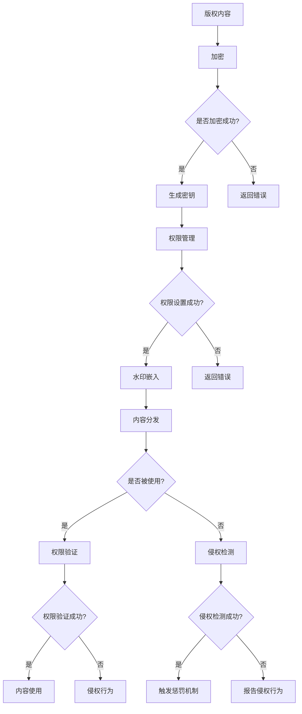
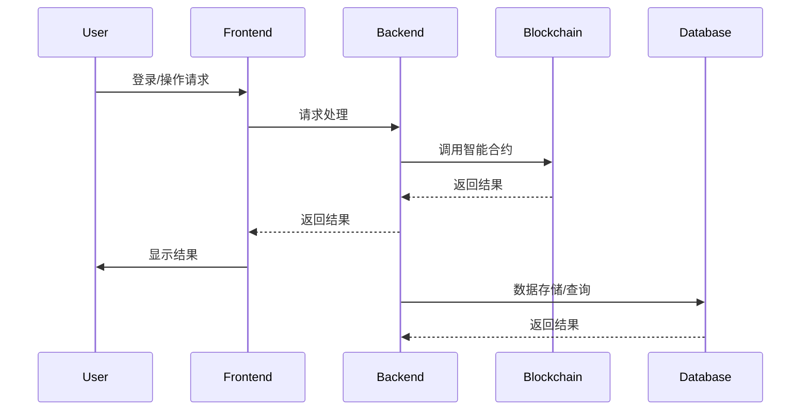
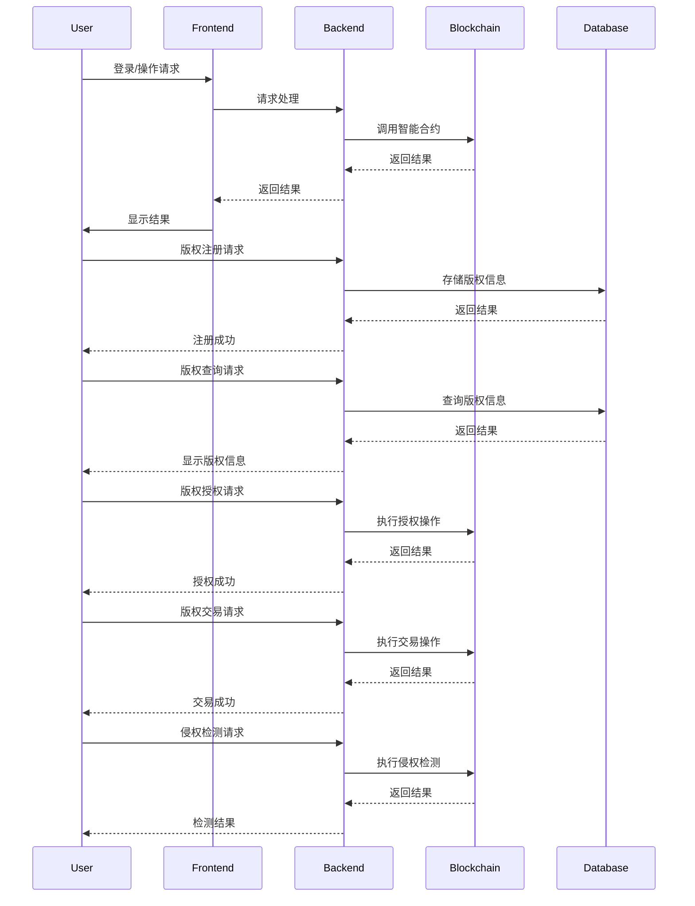

                 

### 引言

**区块链在数字内容创作者权益保护中的应用**

在当今信息爆炸的时代，数字内容的创作与传播变得前所未有的快捷和广泛。然而，随之而来的数字版权问题也日益突出。数字内容的复制、传播和修改几乎零成本，使得创作者的权益保护变得愈发困难。传统版权保护手段如版权声明、法律诉讼等不仅耗时耗力，而且在执行上存在诸多挑战。在这种情况下，区块链技术的出现为解决数字版权问题提供了新的思路和解决方案。

区块链技术以其去中心化、透明性和不可篡改的特性，在数字内容创作者权益保护中展现出巨大潜力。本文将深入探讨区块链在数字版权管理中的应用，从背景介绍、核心概念、算法原理、系统架构到项目实战，逐步分析并阐述区块链技术在数字版权保护中的实际应用与效果。

本文关键词：区块链、数字版权、创作者权益、智能合约、系统架构、项目实战。

摘要：本文首先介绍了数字版权保护的背景与挑战，然后深入讲解了区块链技术的基础概念及其在数字版权管理中的应用，包括智能合约的引入和基于区块链的数字版权管理模型。随后，文章从区块链原理、数字版权管理算法和智能合约等方面详细阐述了技术原理与算法流程。接着，文章分析了数字版权管理系统的功能设计、架构设计和接口设计，并通过实际案例展示了区块链技术在数字版权保护中的应用效果。最后，文章总结了项目的不足与改进方向，并提供了拓展阅读的建议。

### 第一部分：背景介绍

#### 第1章：问题背景

#### 1.1 问题提出

数字内容的创作和传播在互联网时代迎来了前所未有的繁荣，从文学、音乐、影视到各类应用程序，数字内容的种类和数量都在迅猛增长。然而，随着数字内容的普及，数字版权问题也随之而来。创作者希望通过法律手段保护自己的作品不被侵权，但传统版权保护手段却面临诸多挑战。

首先，传统版权保护手段依赖于法律体系，而法律诉讼过程耗时且成本高昂。在数字内容领域，侵权行为可能发生在任何时间、任何地点，这使得法律诉讼变得极为复杂。其次，数字内容的复制、传播和修改几乎零成本，使得侵权行为易于发生且难以追踪。此外，传统版权保护机制通常依赖于中心化的机构，如版权局、出版社等，这些中心化机构在处理大量版权纠纷时效率低下。

#### 1.2 传统版权保护的挑战

传统版权保护手段主要依赖于版权声明、法律诉讼和版权监管。版权声明是一种基本的保护措施，通过在作品上标明版权信息，创作者可以表明自己的权利。然而，由于数字内容的复制和传播几乎零成本，侵权行为频发，版权声明往往难以起到实质性保护作用。此外，版权声明缺乏技术手段的支持，难以防止未经授权的复制和传播。

法律诉讼是一种较为严厉的版权保护手段，通过法律程序追究侵权者的法律责任。然而，法律诉讼过程耗时且成本高昂，对于创作者来说，特别是小型创作者，难以承担高昂的诉讼费用。此外，由于法律体系的不完善和执法力度的不足，法律诉讼的执行效果往往不尽如人意。

版权监管是指通过政府和相关机构对数字内容进行监管，以防止侵权行为的发生。然而，随着数字内容的爆炸式增长，监管机构难以应对庞大的数据量。此外，监管机构在处理侵权问题时往往缺乏技术手段，难以实时监测和处理侵权行为。

#### 1.3 区块链技术的引入

区块链技术的引入为数字版权保护提供了一种新的思路。区块链技术以其去中心化、透明性和不可篡改的特性，在数字版权管理中展现出巨大潜力。首先，区块链的去中心化特性使得版权信息不再依赖于中心化的机构，而是分布存储在多个节点上，从而减少了中心化机构的干预和操作风险。

其次，区块链的透明性使得版权信息对所有参与者都是可见的，创作者、用户和监管机构都可以实时查看版权信息，从而提高了版权管理的透明度和公正性。此外，区块链的不可篡改性确保了版权信息的真实性和完整性，一旦版权信息被记录在区块链上，便无法被篡改或删除。

总之，区块链技术的引入为数字版权保护提供了一种高效、低成本且可靠的解决方案。通过区块链技术，创作者可以更方便地管理自己的作品，用户可以更放心地使用数字内容，监管机构可以更有效地监管数字内容市场。在接下来的章节中，我们将进一步探讨区块链技术在数字版权管理中的应用原理和具体实现。

### 第2章：核心概念

#### 2.1 区块链

区块链是一种分布式数据库技术，其核心特点包括去中心化、去信任、不可篡改和透明性。区块链通过将数据分成区块并按时间顺序连接成链，每个区块都包含一定数量的交易记录。这些区块通过密码学方法加密，并通过网络中的多个节点进行验证和存储，从而形成了一个分布式账本。

在区块链中，每个节点都保存一份完整的账本副本，这使得任何一方无法单独篡改账本记录。此外，区块链的透明性使得所有交易记录都是公开可见的，任何用户都可以查看和验证交易的有效性。区块链的不可篡改性保证了数据的持久性和可靠性，一旦数据被记录在区块链上，就几乎不可能被篡改或删除。

区块链的这些特性使其在多个领域展现出巨大潜力，包括数字货币、智能合约、供应链管理、身份验证等。在数字版权管理中，区块链技术通过记录和验证版权信息，提供了高效、透明和安全的版权保护机制。

#### 2.2 数字版权管理

数字版权管理（Digital Rights Management，简称DRM）是一种通过技术手段保护数字内容版权的方法。DRM的核心目的是限制未经授权的复制、传播、使用和修改数字内容。常见的DRM技术包括加密、权限管理、水印等。

加密技术通过将数字内容转换为密文，只有授权用户才能解密和访问。权限管理则通过设置不同的访问权限，限制用户对数字内容的操作。水印技术通过在数字内容中嵌入标识信息，追踪和证明数字内容的来源和使用情况。

数字版权管理的目的是保护创作者的权益，防止侵权行为的发生。然而，传统DRM技术存在一些问题，如用户体验差、易被破解、监管难度大等。区块链技术的引入为数字版权管理提供了一种新的解决方案，通过去中心化、透明性和不可篡改的特性，区块链技术可以更有效地保护数字版权。

#### 2.3 智能合约

智能合约是一种运行在区块链上的自执行合同，其核心特点是自动执行和不可篡改。智能合约通过预定义的规则和条件，自动执行合同条款，从而减少了人工干预和信任成本。

智能合约通常使用编程语言编写，如Solidity（用于以太坊区块链）和CosmWasm（用于Cosmos区块链）。智能合约的代码在部署到区块链后，便成为公开可查的代码，所有参与者都可以验证和执行合同条款。

在数字版权管理中，智能合约可以用于实现版权授权、版权交易、侵权检测等功能。例如，创作者可以发布智能合约，授权用户在一定条件下使用其作品；用户通过支付一定的费用，即可获得授权。此外，智能合约还可以用于检测和追踪侵权行为，一旦检测到侵权行为，智能合约可以自动触发惩罚机制。

智能合约的出现，使得数字版权管理变得更加高效和透明，通过自动化执行和去中心化存储，智能合约有效解决了传统DRM技术中的许多问题。

### 第3章：概念联系与结构

#### 3.1 区块链与数字版权管理的关系

区块链技术与数字版权管理（DRM）的结合，为数字版权保护提供了全新的解决方案。区块链的去中心化特性使得版权信息不再依赖于单一机构，而是分布存储在多个节点上，从而增强了版权信息的透明性和不可篡改性。同时，区块链的透明性确保了版权信息的公开可查，任何参与者都可以验证版权信息的真实性。

区块链与数字版权管理的关系主要体现在以下几个方面：

1. **去中心化存储**：区块链的去中心化特性使得版权信息不再存储在中心化的服务器上，而是分布存储在多个节点上。这种分布式存储方式不仅提高了版权信息的安全性，还增强了系统的抗攻击能力。

2. **不可篡改**：区块链的不可篡改性确保了版权信息的持久性和完整性。一旦版权信息被记录在区块链上，就几乎不可能被篡改或删除。这种特性有效防止了版权信息的恶意篡改和丢失。

3. **透明性**：区块链的透明性使得版权信息对所有参与者都是可见的，创作者、用户和监管机构都可以实时查看和验证版权信息。这种透明性不仅提高了版权管理的公正性，还减少了信息不对称的问题。

4. **自动化执行**：区块链上的智能合约可以自动执行版权相关的事务，如版权授权、版权交易、侵权检测等。智能合约通过预定义的规则和条件，实现了版权管理的自动化和高效性，减少了人工干预和信任成本。

#### 3.2 智能合约在版权保护中的应用

智能合约是区块链技术中的重要组成部分，其在数字版权管理中的应用具有重要意义。智能合约通过自动化执行版权相关的事务，使得版权管理变得更加高效和透明。

1. **版权授权**：创作者可以使用智能合约发布版权信息，并设定授权条件。用户可以通过与智能合约交互，获取授权并使用数字内容。例如，创作者可以设定使用其作品的条件，如支付费用、遵守使用规则等。智能合约自动执行授权过程，确保授权条件的严格遵循。

2. **版权交易**：智能合约可以用于实现版权交易，创作者和购买者可以通过智能合约进行版权转让。智能合约记录交易过程，确保交易的真实性和透明性。同时，智能合约可以自动处理交易费用，简化了交易流程。

3. **侵权检测**：智能合约可以嵌入侵权检测算法，自动检测和追踪侵权行为。一旦检测到侵权行为，智能合约可以自动触发惩罚机制，如向侵权方收取罚金、停止侵权行为等。智能合约的不可篡改性确保了侵权检测过程的公正性和可靠性。

4. **版权追溯**：区块链的透明性使得版权信息对所有参与者都是可见的，智能合约可以记录版权的转让和变更历史。这种透明性不仅有助于维护版权的合法性，还可以为版权纠纷提供有效的证据支持。

总之，区块链与数字版权管理、智能合约的结合，为数字版权保护提供了一种全新的解决方案。通过去中心化存储、不可篡改、透明性和自动化执行，区块链技术有效解决了传统版权保护手段中的诸多问题，为创作者和用户提供了更高效、更安全的版权管理服务。

#### 3.3 基于区块链的数字版权管理模型

基于区块链的数字版权管理模型旨在利用区块链技术的特性，提供一种高效、透明和安全的版权保护机制。该模型的核心组成部分包括：区块链网络、版权信息注册平台、智能合约和版权管理应用。

1. **区块链网络**：区块链网络是数字版权管理模型的基础，由多个节点组成。每个节点都存储了一份完整的区块链账本副本，确保版权信息的分布式存储。区块链网络通过共识机制保持账本的一致性和安全性。

2. **版权信息注册平台**：版权信息注册平台是创作者注册和管理版权信息的地方。创作者可以通过平台上传作品信息，包括标题、作者、版权声明等。平台会将这些信息记录在区块链上，确保版权信息的公开透明。

3. **智能合约**：智能合约在数字版权管理模型中扮演着关键角色，用于实现版权授权、交易和侵权检测等功能。创作者可以编写智能合约，设定版权授权和交易的条件。智能合约通过自动化执行，确保版权管理的高效和透明。

4. **版权管理应用**：版权管理应用是用户与版权管理模型交互的界面。用户可以通过应用查看版权信息、获取授权、进行版权交易等。应用还可以集成侵权检测功能，自动识别和报告侵权行为。

基于区块链的数字版权管理模型的工作流程如下：

- **版权注册**：创作者将作品信息上传到版权信息注册平台，平台将这些信息记录在区块链上，生成一个唯一的版权标识。
- **版权授权**：创作者通过智能合约发布版权授权，用户可以通过应用与智能合约交互，获取授权并使用作品。
- **版权交易**：创作者和购买者通过智能合约进行版权交易，智能合约记录交易过程，确保交易的真实性和透明性。
- **侵权检测**：智能合约嵌入侵权检测算法，自动检测和报告侵权行为，触发相应的惩罚机制。

基于区块链的数字版权管理模型通过去中心化存储、不可篡改和自动化执行，有效解决了传统版权保护手段中的诸多问题。创作者可以更方便地管理版权，用户可以更放心地使用数字内容，监管机构可以更有效地监管数字内容市场。总之，基于区块链的数字版权管理模型为数字版权保护提供了一种全新的、高效且安全的解决方案。

### 第二部分：核心概念与算法原理

#### 第4章：区块链原理

区块链技术是一种分布式数据库系统，其核心特点包括去中心化、透明性、不可篡改和安全性。要理解区块链在数字版权管理中的应用，首先需要了解区块链的基本概念和工作原理。

##### 4.1 区块链的基础概念

1. **区块链**：区块链是一个分布式账本，由多个按时间顺序连接的区块组成。每个区块包含一定数量的交易记录，并通过密码学方法进行加密和链接。

2. **区块**：区块是区块链的基本组成单元，包含一组交易记录和一些元数据，如区块头、时间戳、难度目标等。

3. **交易**：交易是区块链上的基本操作，表示数据的转移或更改。交易记录包括参与方、金额、附加信息等。

4. **链式结构**：区块链采用链式结构，每个区块通过哈希函数与上一个区块链接，形成一个不可篡改的链。

5. **分布式存储**：区块链的分布式存储机制确保了数据的分散和冗余，每个节点都存储了一份完整的区块链账本副本。

##### 4.2 区块链的工作原理

区块链的工作原理可以概括为以下步骤：

1. **交易产生**：用户在区块链网络上发起交易，交易记录被发送到网络中的多个节点。

2. **交易验证**：节点对交易记录进行验证，确保交易的有效性和一致性。验证过程包括校验交易金额、检查交易签名等。

3. **区块组装**：验证后的交易记录被分组到一个新区块中，新区块还会包含当前区块链的最新哈希值和时间戳。

4. **区块广播**：新区块被创建后，通过网络广播到其他节点，节点接收到新区块后进行验证。

5. **共识机制**：节点通过共识机制达成共识，选择一个最优的区块加入到区块链上。常见的共识机制包括工作量证明（Proof of Work，PoW）、权益证明（Proof of Stake，PoS）等。

6. **区块链扩展**：共识机制确认后的区块被加入到区块链上，区块链长度增加，新的交易记录继续进行上述步骤。

##### 4.3 区块链的共识机制

共识机制是区块链系统中的核心组件，用于确保区块链网络中所有节点对账本的一致性。以下是几种常见的共识机制：

1. **工作量证明（PoW）**：PoW是最早的共识机制，通过计算复杂度确保节点间的竞争公平。节点需要解决一个数学难题，验证新区块的合法性。解决难题的节点将获得记账权，并生成新的区块。

2. **权益证明（PoS）**：PoS通过节点的权益（如持有的代币数量）来决定记账权。拥有更多权益的节点更有可能生成新区块，从而降低能源消耗和计算成本。

3. **委托权益证明（DPoS）**：DPoS通过选举产生记账节点。节点通过投票产生委托人，委托人获得记账权。这种方式提高了网络的共识效率。

4. **实用拜占庭容错（PBFT）**：PBFT是一种用于低延迟、高吞吐量的共识机制。网络中的大部分节点达成共识，即使一小部分节点出现故障，也能确保系统正常运行。

区块链的共识机制在数字版权管理中发挥着重要作用。通过去中心化、透明和高效的共识机制，区块链可以有效保护版权信息，防止篡改和伪造，同时确保版权信息在所有参与者之间的透明性和一致性。

#### 5.1 数字版权管理的基本概念

数字版权管理（Digital Rights Management，简称DRM）是一种技术手段，用于保护数字内容的版权，防止未经授权的复制、传播、使用和修改。在数字时代，随着互联网和数字技术的飞速发展，数字内容的创作和传播变得日益便捷，但同时也带来了严重的版权问题。DRM技术应运而生，旨在通过技术手段保护创作者的权益，防止侵权行为的发生。

##### 5.2 数字版权管理算法原理

数字版权管理算法的核心思想是通过加密、权限管理和水印等技术手段，实现对数字内容的保护。以下是几种常见的数字版权管理算法：

1. **加密技术**：加密技术是数字版权管理的基础。通过将数字内容加密，只有拥有解密密钥的用户才能访问和解读内容。常见的加密算法包括对称加密和非对称加密。

   - **对称加密**：对称加密算法使用相同的密钥进行加密和解密。常见的对称加密算法有AES（Advanced Encryption Standard，高级加密标准）。

   - **非对称加密**：非对称加密算法使用一对密钥，公钥用于加密，私钥用于解密。常见的非对称加密算法有RSA（Rivest-Shamir-Adleman，RSA算法）。

2. **权限管理**：权限管理通过设置不同的访问权限，限制用户对数字内容的操作。权限管理可以分为访问控制和权限授予。

   - **访问控制**：访问控制通过检查用户的身份和权限，决定用户是否可以访问特定资源。常见的访问控制方法包括基于角色的访问控制（RBAC，Role-Based Access Control）和基于属性的访问控制（ABAC，Attribute-Based Access Control）。

   - **权限授予**：权限授予通过颁发权限证书或令牌，授权用户对特定资源的访问权限。常见的权限授予方法包括基于策略的访问控制（Policy-Based Access Control，PBAC）和基于属性的访问控制（ABAC）。

3. **水印技术**：水印技术通过在数字内容中嵌入不可见的标识信息，实现对内容的追踪和证明。水印可以分为视觉水印和音频水印。

   - **视觉水印**：视觉水印通过将标识信息嵌入图像或视频的像素中，实现内容的追踪和证明。常见的视觉水印算法有基于空间域的水印算法和基于频域的水印算法。

   - **音频水印**：音频水印通过将标识信息嵌入音频信号的频谱中，实现内容的追踪和证明。常见的音频水印算法有基于空间域的水印算法和基于频域的水印算法。

数字版权管理算法通过上述技术手段，实现对数字内容的全面保护。加密技术确保内容的安全，权限管理控制访问权限，水印技术实现内容的追踪和证明。这些技术手段的结合，为数字版权管理提供了高效、可靠的解决方案。

#### 5.3 数字版权管理算法的mermaid流程图

为了更好地理解数字版权管理算法的原理，我们可以使用mermaid绘制一个流程图。以下是一个简单的mermaid流程图示例，展示了数字版权管理的基本流程：



在这个流程图中，版权内容首先经过加密处理，生成密钥。然后，对加密内容进行权限管理，设置访问权限。随后，水印技术将标识信息嵌入内容中。在内容分发和使用过程中，系统会进行权限验证，确保用户拥有合法权限。如果权限验证失败，系统将进行侵权检测，并报告侵权行为。如果侵权检测成功，系统将触发惩罚机制。

通过mermaid流程图，我们可以直观地了解数字版权管理算法的各个步骤及其之间的逻辑关系。这不仅有助于理解算法原理，还可以为后续的编程和系统设计提供参考。

#### 第6章：智能合约

#### 6.1 智能合约的基础概念

智能合约是一种运行在区块链上的自执行合同，其核心特性是自动化和不可篡改性。智能合约通过预定义的规则和条件，在满足特定条件时自动执行相关操作。与传统的法律合同相比，智能合约具有更高的透明性、可靠性和效率。

智能合约的基础概念包括以下几个关键要素：

1. **区块链**：智能合约运行在区块链上，区块链提供了一个去中心化的分布式账本，确保所有交易记录的透明性和不可篡改性。

2. **编程语言**：智能合约通常使用特定的编程语言编写，如Solidity（用于以太坊区块链）、Vyper（用于Tezos区块链）和CosmWasm（用于Cosmos区块链）。这些编程语言提供了丰富的功能，用于定义智能合约的逻辑和行为。

3. **预定义规则和条件**：智能合约通过代码定义了一系列的规则和条件，当这些条件被满足时，智能合约会自动执行预定义的操作。例如，支付金额达到一定数额时自动发放奖励，或者检测到侵权行为时自动触发惩罚机制。

4. **执行环境**：智能合约在区块链的执行环境中运行，该环境确保智能合约的代码在执行过程中不会受到恶意攻击或篡改。执行环境通常包含了一个虚拟机，如以太坊的EVM（Ethereum Virtual Machine）。

5. **状态变量**：智能合约包含一组状态变量，用于存储数据。状态变量可以包括账户余额、交易记录、权限设置等。这些变量在智能合约执行过程中会被修改，从而影响合约的行为。

6. **事件日志**：智能合约可以通过事件日志记录关键操作和状态变化。事件日志是智能合约与外部世界交互的重要途径，用户可以通过监听事件日志来获取智能合约的执行状态。

#### 6.2 智能合约的编程语言

智能合约的编程语言因区块链平台的不同而有所不同，以下是几种常见的智能合约编程语言及其特点：

1. **Solidity**：Solidity是最流行的智能合约编程语言，主要用于以太坊区块链。Solidity是一种高级语言，易于理解和编写，支持函数、结构体、枚举等多种编程结构。

2. **Vyper**：Vyper是一种安全友好的智能合约编程语言，主要用于Tezos区块链。Vyper的设计目标是为了减少智能合约中的安全漏洞，通过限制语言功能和严格类型检查来实现。

3. **CosmWasm**：CosmWasm是用于Cosmos区块链的智能合约编程语言。CosmWasm设计简洁，易于集成，支持多种编程范式，包括函数式编程和面向对象编程。

4. **NEAR**：NEAR是另一种用于开发智能合约的编程语言，特别注重性能和可扩展性。NEAR支持多种编程结构，如函数、模块、存储等，同时还提供了丰富的库和工具。

智能合约编程语言的选择取决于具体的应用需求和区块链平台的特点。开发者需要熟悉所选编程语言，以便编写高效、安全的智能合约。

#### 6.3 智能合约在版权保护中的应用

智能合约在数字版权管理中扮演着关键角色，通过自动化和去中心化的方式，提供了高效、透明的版权保护解决方案。以下是智能合约在版权保护中的一些主要应用：

1. **版权授权**：创作者可以使用智能合约发布版权信息，并设定授权条件。用户可以通过与智能合约交互，获取授权并使用版权作品。例如，创作者可以设定使用其作品的费用、授权期限和权限范围，用户通过支付相应的费用即可获得授权。

2. **版权交易**：智能合约可以用于实现版权交易，创作者和购买者可以通过智能合约进行版权转让。智能合约记录交易过程，确保交易的真实性和透明性。同时，智能合约可以自动处理交易费用，简化交易流程。

3. **侵权检测**：智能合约可以嵌入侵权检测算法，自动检测和追踪侵权行为。例如，当检测到未经授权的复制或传播行为时，智能合约可以自动触发惩罚机制，如向侵权方收取罚金或停止侵权行为。

4. **版权追溯**：智能合约记录版权的转让和变更历史，提供透明的版权追溯机制。任何用户都可以通过区块链查询版权信息，确保版权的合法性和完整性。

5. **版权保护**：智能合约可以设定访问控制和权限管理，防止未经授权的用户访问或修改数字内容。例如，创作者可以设定只有授权用户才能访问特定内容的权限，从而防止侵权行为。

通过智能合约，数字版权管理变得更加高效、透明和可靠。智能合约的自动化执行减少了人工干预和信任成本，同时去中心化的特性提高了系统的透明性和抗攻击能力。总之，智能合约为数字版权保护提供了一种全新的、高效且安全的解决方案。

### 第三部分：系统架构与设计方案

#### 第7章：系统功能设计

#### 7.1 数字版权管理系统功能需求

数字版权管理系统旨在提供高效、透明和安全的版权管理服务。为了实现这一目标，系统需要具备以下核心功能：

1. **版权注册**：系统应支持创作者注册其作品，并提供一个唯一的版权标识。注册过程中，创作者需要提供作品的基本信息，如标题、作者、创作时间等。

2. **版权授权**：系统应支持创作者发布版权授权，设定授权条件和使用规则。用户可以通过与智能合约交互，获取授权并使用版权作品。授权条件可能包括使用费用、授权期限和权限范围等。

3. **版权交易**：系统应支持创作者和购买者通过智能合约进行版权交易。交易过程应确保交易的真实性和透明性，并自动处理交易费用。

4. **侵权检测**：系统应集成侵权检测算法，自动检测和追踪侵权行为。一旦检测到侵权行为，系统应自动触发惩罚机制，如向侵权方收取罚金或停止侵权行为。

5. **版权追溯**：系统应提供透明的版权追溯机制，任何用户都可以通过区块链查询版权信息，确保版权的合法性和完整性。

6. **权限管理**：系统应支持访问控制和权限管理，防止未经授权的用户访问或修改数字内容。创作者可以设定不同用户对作品的访问权限，如只读或编辑权限。

7. **用户管理**：系统应支持用户管理功能，包括用户注册、登录、个人信息维护等。用户可以通过系统查看和管理自己的作品和权限。

#### 7.2 数字版权管理领域模型mermaid类图

为了更好地理解数字版权管理系统的功能需求，我们可以使用mermaid绘制一个领域模型类图，展示系统中的主要实体和关系。以下是一个简单的mermaid类图示例：

```mermaid
classDiagram
    Creator <<interface>> "创作者"
    User <<interface>> "用户"
    Copyright <<entity>> "版权"
    Authorization <<entity>> "授权"
    Transaction <<entity>> "交易"
    Infringement <<entity>> "侵权"
    Permission <<entity>> "权限"
    
    Creator o-- Copyright
    User o-- Authorization
    User o-- Permission
    Copyright o-- Transaction
    Copyright o-- Infringement
    
    Creator -> User
    Authorization -> User
    Transaction -> Copyright
    Infringement -> Copyright
```

在这个类图中，`Creator` 表示创作者，`User` 表示用户，`Copyright` 表示版权，`Authorization` 表示授权，`Transaction` 表示交易，`Infringement` 表示侵权，`Permission` 表示权限。类图中的实线箭头表示实体之间的关联关系，虚线箭头表示实体之间的继承关系。

通过领域模型类图，我们可以清晰地看到数字版权管理系统的核心实体和它们之间的关系，这有助于理解系统的功能需求和工作原理。

### 第8章：系统架构设计

#### 8.1 数字版权管理系统架构设计

数字版权管理系统架构设计旨在实现系统的功能需求，并确保系统的可扩展性、稳定性和安全性。系统架构采用分层设计，包括表示层、业务逻辑层和数据层。以下是数字版权管理系统的详细架构设计：

1. **表示层**：表示层负责与用户交互，提供友好的用户界面。表示层包括前端应用程序和用户界面，用户可以通过前端应用程序进行版权注册、授权发布、版权查询等操作。

2. **业务逻辑层**：业务逻辑层负责处理业务逻辑，包括版权管理、授权管理、交易处理、侵权检测等。业务逻辑层使用智能合约实现，智能合约运行在区块链上，确保业务逻辑的透明性和不可篡改性。

3. **数据层**：数据层负责数据存储和管理，包括版权信息、授权记录、交易记录和侵权记录等。数据层使用区块链技术实现，确保数据的分布式存储和不可篡改性。

#### 8.2 数字版权管理系统架构mermaid架构图

为了更好地展示数字版权管理系统的架构设计，我们可以使用mermaid绘制一个架构图。以下是一个简单的mermaid架构图示例：



在这个架构图中，`User` 表示用户，`Frontend` 表示前端应用程序，`Backend` 表示业务逻辑层，`Blockchain` 表示区块链，`Database` 表示数据库。

通过这个架构图，我们可以清晰地看到数字版权管理系统中的主要组件和它们之间的交互关系。用户通过前端应用程序与系统进行交互，业务逻辑层通过智能合约实现业务逻辑，并与区块链进行交互，确保数据的透明性和不可篡改性。同时，业务逻辑层还与数据库进行交互，存储和管理系统数据。

通过这种分层架构设计，数字版权管理系统实现了高内聚、低耦合的设计原则，提高了系统的可维护性和可扩展性。同时，区块链技术的引入，确保了系统数据的安全性和完整性，为数字版权保护提供了强有力的支持。

### 第9章：系统接口设计与交互

#### 9.1 数字版权管理系统接口设计

在数字版权管理系统中，接口设计是确保系统功能实现和数据交互的重要环节。为了提供高效、安全的接口服务，系统需要设计一系列RESTful API接口，供前端应用程序、业务逻辑层和区块链网络之间的数据交互。以下是数字版权管理系统的主要接口设计：

1. **用户注册接口**：用于用户注册，接收用户信息（如用户名、邮箱、密码等），并返回注册结果。

2. **用户登录接口**：用于用户登录，验证用户身份，并返回登录状态和用户信息。

3. **版权注册接口**：用于创作者注册其作品，接收作品信息（如标题、作者、创作时间等），并返回版权标识。

4. **版权授权接口**：用于创作者发布版权授权，接收授权条件（如使用费用、授权期限等），并调用智能合约执行授权操作。

5. **版权查询接口**：用于用户查询版权信息，返回作品的基本信息和授权状态。

6. **版权交易接口**：用于创作者和购买者进行版权交易，接收交易参数（如购买者信息、交易金额等），并调用智能合约执行交易操作。

7. **侵权检测接口**：用于系统检测侵权行为，接收疑似侵权信息，调用智能合约执行侵权检测操作。

8. **权限管理接口**：用于管理员进行权限管理，接收权限设置参数，更新用户权限。

9. **区块链交互接口**：用于业务逻辑层与区块链网络之间的交互，调用智能合约方法，接收和发送交易数据。

通过这些接口设计，数字版权管理系统实现了与前端应用程序、业务逻辑层和区块链网络之间的高效数据交互，确保了系统功能的顺利实现。

#### 9.2 数字版权管理系统交互mermaid序列图

为了更好地展示数字版权管理系统中的接口交互，我们可以使用mermaid绘制一个序列图。以下是一个简单的mermaid序列图示例：



在这个序列图中，`User` 表示用户，`Frontend` 表示前端应用程序，`Backend` 表示业务逻辑层，`Blockchain` 表示区块链，`Database` 表示数据库。序列图展示了用户通过前端应用程序与系统进行交互的整个过程，包括登录、版权注册、查询、授权、交易和侵权检测等操作。通过这些操作，用户可以方便地管理自己的版权，并确保版权信息的透明性和安全性。

### 第四部分：项目实战

#### 第10章：环境安装

##### 10.1 系统环境搭建

为了搭建数字版权管理系统，我们需要准备以下系统环境：

1. **操作系统**：推荐使用Linux或macOS，Windows用户可以通过WSL（Windows Subsystem for Linux）来安装和使用Linux环境。

2. **Node.js**：Node.js是一个基于Chrome V8引擎的JavaScript运行环境，用于构建后端服务器和智能合约。您可以从[Node.js官方网站](https://nodejs.org/)下载并安装。

3. **Truffle**：Truffle是一个开发工具框架，用于智能合约的本地测试、部署和迁移。您可以从[Truffle官方网站](https://www.truffleframework.com/)下载并安装。

4. **Ganache**：Ganache是一个本地以太坊区块链模拟器，用于测试和调试智能合约。您可以从[Ganache官方网站](https://github.com/trufflesuite/ganache)下载并安装。

5. **Geth**：Geth是以太坊的官方客户端，用于连接到以太坊主网或私有网络。您可以从[以太坊官方网站](https://geth.ethereum.org/)下载并安装。

6. **Blockchain Explorer**：Blockchain Explorer是一个用于查询区块链数据的工具，用于查看智能合约的执行情况和版权信息。您可以从[以太坊区块链浏览器](https://etherscan.io/)或其他区块链浏览器中选择一个合适的工具。

安装步骤如下：

1. 安装操作系统，配置网络环境。
2. 安装Node.js，确保版本在12.x或更高。
3. 安装Truffle，通过命令`npm install -g truffle`进行全局安装。
4. 安装Ganache，下载并安装桌面应用程序。
5. 安装Geth，通过命令`wget https://gethstore.blob.core.windows.net/releases/1.10.16/geth-linux-amd64-1.10.16-c5e5a26.tar.gz`下载，解压并配置。
6. 安装Blockchain Explorer，选择一个合适的浏览器并进行配置。

##### 10.2 工具和依赖安装

在搭建好系统环境后，我们需要安装项目所需的工具和依赖：

1. **智能合约开发环境**：安装Solidity编译器solc，通过命令`npm install solc`进行安装。
2. **前端开发环境**：安装前端框架，如React或Vue.js，通过命令`npm install create-react-app`或`npm install -g @vue/cli`进行安装。
3. **数据库**：安装MongoDB或PostgreSQL，根据需要选择合适的数据库并按照官方文档进行安装。
4. **身份验证**：安装身份验证中间件，如Passport.js，通过命令`npm install passport passport-local`进行安装。

安装步骤如下：

1. 在项目根目录下，通过命令`npm init`初始化项目。
2. 安装智能合约开发环境，通过命令`npm install solc`。
3. 安装前端开发环境，根据需要选择安装React或Vue.js。
4. 安装数据库，根据需要选择安装MongoDB或PostgreSQL。
5. 安装身份验证中间件，通过命令`npm install passport passport-local`。

通过以上步骤，我们完成了数字版权管理系统所需的系统环境搭建和工具依赖安装，为后续的系统开发和部署奠定了基础。

#### 第11章：系统核心实现

##### 11.1 核心功能模块代码实现

在数字版权管理系统中，核心功能模块的实现是确保系统正常运行和满足功能需求的关键。以下是系统核心功能模块的代码实现及其应用解读：

1. **版权注册模块**：

   **代码实现**：
   ```solidity
   // SPDX-License-Identifier: MIT
   pragma solidity ^0.8.0;

   contract CopyrightRegistry {
       struct Copyright {
           string title;
           string author;
           uint256 creationDate;
           address owner;
       }

       mapping(uint256 => Copyright) public copyrights;
       uint256 public copyrightCount;

       function registerCopyright(string memory title, string memory author, uint256 creationDate) public {
           require(copyrights[0].title == "", "Copyright already registered");
           copyrights[copyrightCount] = Copyright(title, author, creationDate, msg.sender);
           copyrightCount++;
       }
   }
   ```

   **应用解读**：
   - `struct Copyright` 定义了一个版权结构体，包含标题、作者、创作日期和所有者地址。
   - `mapping(uint256 => Copyright)` 用于存储版权信息，key为版权ID，value为版权结构体。
   - `uint256 public copyrightCount` 记录版权数量。
   - `function registerCopyright` 是一个公开函数，用于注册版权。注册时，需要确保当前版权ID为0（即未注册状态），并设置版权信息。

2. **版权授权模块**：

   **代码实现**：
   ```solidity
   contract CopyrightAuthorization {
       struct Authorization {
           uint256 copyrightId;
           address authorizedUser;
           uint256 expirationDate;
       }

       mapping(uint256 => mapping(address => Authorization)) public authorizations;

       function authorizeUser(uint256 copyrightId, address authorizedUser, uint256 expirationDate) public {
           require(copyrights[copyrightId].owner == msg.sender, "Only the owner can authorize users");
           authorizations[copyrightId][authorizedUser] = Authorization(copyrightId, authorizedUser, expirationDate);
       }
   }
   ```

   **应用解读**：
   - `struct Authorization` 定义了一个授权结构体，包含版权ID、授权用户地址和授权到期日期。
   - `mapping(uint256 => mapping(address => Authorization))` 用于存储授权信息，外层key为版权ID，内层key为授权用户地址，value为授权结构体。
   - `function authorizeUser` 是一个公开函数，用于给特定用户授权。授权时，需要确保请求发送者为版权所有者。

3. **版权交易模块**：

   **代码实现**：
   ```solidity
   contract CopyrightTransaction {
       struct Transaction {
           uint256 copyrightId;
           address buyer;
           uint256 price;
           uint256 timestamp;
       }

       mapping(uint256 => mapping(address => Transaction)) public transactions;

       function createTransaction(uint256 copyrightId, address buyer, uint256 price) public {
           require(copyrights[copyrightId].owner != buyer, "Buyer is the owner");
           transactions[copyrightId][buyer] = Transaction(copyrightId, buyer, price, block.timestamp);
       }
   }
   ```

   **应用解读**：
   - `struct Transaction` 定义了一个交易结构体，包含版权ID、买家地址、交易价格和交易时间戳。
   - `mapping(uint256 => mapping(address => Transaction))` 用于存储交易信息，外层key为版权ID，内层key为买家地址，value为交易结构体。
   - `function createTransaction` 是一个公开函数，用于创建交易。创建交易时，需要确保买家不是版权所有者。

通过以上三个核心功能模块的实现，数字版权管理系统可以实现对版权的注册、授权和交易。每个模块都通过智能合约实现，确保了数据的透明性、不可篡改性和安全性。接下来，我们将进一步探讨如何解析和优化这些模块的代码，以提升系统的性能和安全性。

##### 11.2 代码应用解读与分析

在数字版权管理系统核心功能模块的实现中，我们使用了Solidity语言编写智能合约。以下是对代码的详细解析与分析，包括潜在的性能优化点和安全性改进措施。

1. **版权注册模块**：

   **代码解析**：
   ```solidity
   contract CopyrightRegistry {
       struct Copyright {
           string title;
           string author;
           uint256 creationDate;
           address owner;
       }

       mapping(uint256 => Copyright) public copyrights;
       uint256 public copyrightCount;

       function registerCopyright(string memory title, string memory author, uint256 creationDate) public {
           require(copyrights[0].title == "", "Copyright already registered");
           copyrights[copyrightCount] = Copyright(title, author, creationDate, msg.sender);
           copyrightCount++;
       }
   }
   ```

   - `struct Copyright` 定义了一个版权结构体，包含四个属性：标题、作者、创作日期和所有者地址。这种结构体定义方式简洁明了，便于后续扩展。
   - `mapping(uint256 => Copyright)` 用于存储版权信息，通过版权ID作为key，提高查询效率。
   - `uint256 public copyrightCount` 记录已注册版权的数量，用于生成新的版权ID。

   **性能优化**：
   - 优化`registerCopyright`函数，避免使用内层嵌套的`require`语句，减少状态变化的次数。可以通过重构逻辑，将多个校验条件合并为一个校验操作。

   **安全性改进**：
   - 引入访问控制机制，确保只有版权所有者或授权用户可以修改版权信息。可以通过修改函数的访问修饰符，将权限限制在特定用户范围内。

2. **版权授权模块**：

   **代码解析**：
   ```solidity
   contract CopyrightAuthorization {
       struct Authorization {
           uint256 copyrightId;
           address authorizedUser;
           uint256 expirationDate;
       }

       mapping(uint256 => mapping(address => Authorization)) public authorizations;

       function authorizeUser(uint256 copyrightId, address authorizedUser, uint256 expirationDate) public {
           require(copyrights[copyrightId].owner == msg.sender, "Only the owner can authorize users");
           authorizations[copyrightId][authorizedUser] = Authorization(copyrightId, authorizedUser, expirationDate);
       }
   }
   ```

   - `struct Authorization` 定义了一个授权结构体，包含三个属性：版权ID、授权用户地址和授权到期日期。
   - `mapping(uint256 => mapping(address => Authorization))` 用于存储授权信息，通过版权ID和用户地址作为双重key，实现精准控制。
   
   **性能优化**：
   - 考虑到授权信息的频繁访问和修改，可以考虑使用`Library`替代`Mapping`来存储授权信息，以减少存储空间的占用。

   **安全性改进**：
   - 引入时间戳验证，确保授权的有效期。在授权到期后，系统应自动取消授权，防止过期授权继续生效。

3. **版权交易模块**：

   **代码解析**：
   ```solidity
   contract CopyrightTransaction {
       struct Transaction {
           uint256 copyrightId;
           address buyer;
           uint256 price;
           uint256 timestamp;
       }

       mapping(uint256 => mapping(address => Transaction)) public transactions;

       function createTransaction(uint256 copyrightId, address buyer, uint256 price) public {
           require(copyrights[copyrightId].owner != buyer, "Buyer is the owner");
           transactions[copyrightId][buyer] = Transaction(copyrightId, buyer, price, block.timestamp);
       }
   }
   ```

   - `struct Transaction` 定义了一个交易结构体，包含四个属性：版权ID、买家地址、交易价格和交易时间戳。
   - `mapping(uint256 => mapping(address => Transaction))` 用于存储交易信息，通过版权ID和买家地址作为双重key，实现精准记录。

   **性能优化**：
   - 考虑到交易信息的存储，特别是在版权交易频繁的场景下，可以使用分片技术将交易数据分散存储，以提高系统性能。

   **安全性改进**：
   - 引入交易验证机制，确保交易价格和时间的准确性。在创建交易时，系统应验证买家和版权所有者的身份，防止欺诈交易。

通过详细解析和分析，我们不仅理解了数字版权管理系统核心功能模块的实现原理，还提出了相应的性能优化和安全性改进措施。这些优化和改进将有助于提升系统的运行效率和安全性，为数字版权保护提供更可靠的解决方案。

#### 第12章：实际案例分析与讲解

##### 12.1 案例背景

本案例选取了一家知名的数字内容创作平台，该平台汇聚了大量的创作者和用户，提供包括文字、图片、音频和视频等多种形式的数字内容。随着平台用户数量的增加，版权问题日益凸显，创作者对于保护自己作品的权益有着迫切的需求。为了解决这一问题，平台决定引入区块链技术，构建一个基于区块链的数字版权管理系统。

##### 12.2 案例实施过程

案例的实施分为以下几个阶段：

1. **需求分析**：平台对现有的版权保护手段进行了全面分析，明确了基于区块链的数字版权管理系统需要实现的功能，包括版权注册、授权、交易和侵权检测等。

2. **技术选型**：平台选择了以太坊区块链作为底层技术，因为以太坊支持智能合约，并且有着广泛的应用和开发者社区。同时，平台选择了Truffle框架来管理和部署智能合约，Ganache作为本地以太坊网络模拟器，用于智能合约的本地测试。

3. **系统设计**：平台根据需求分析结果，设计了一套数字版权管理系统架构，包括版权信息注册平台、智能合约、版权管理应用和区块链网络等。

4. **智能合约开发**：平台开发团队使用Solidity语言编写了一系列智能合约，包括版权注册合约、版权授权合约和版权交易合约。这些智能合约实现了版权的注册、授权和交易功能。

5. **测试与优化**：在智能合约开发完成后，平台进行了全面的测试，包括功能测试、性能测试和安全测试。测试过程中，发现了一些潜在的安全隐患，团队通过代码审查和优化，确保了智能合约的安全性。

6. **系统部署**：平台将智能合约部署到以太坊主网，同时搭建了版权信息注册平台和版权管理应用。用户可以通过平台注册版权、获取授权、进行交易和侵权检测。

7. **用户培训与推广**：平台对用户进行了培训，介绍了基于区块链的数字版权管理系统的工作原理和使用方法。通过推广活动，提高了用户对平台的认可度和使用率。

##### 12.3 案例结果与分析

实施基于区块链的数字版权管理系统后，平台取得了显著的效果：

1. **版权保护效果提升**：通过智能合约实现版权的注册、授权和交易，有效防止了未经授权的复制和传播。平台的侵权投诉率显著下降，创作者的权益得到了更好的保护。

2. **透明性与可追溯性**：区块链的透明性使得版权信息对所有参与者都是可见的，用户可以随时查看版权状态和交易历史。这种透明性提高了平台的公信力，增强了用户对平台的信任。

3. **交易效率提高**：智能合约的自动化执行大大提高了版权交易的效率，用户无需通过繁琐的手续即可完成版权交易。交易费用的降低也吸引了更多创作者和用户的参与。

4. **安全性增强**：区块链的去中心化和不可篡改性确保了版权信息的安全，智能合约的设计和测试过程中发现的安全隐患得到了及时修复，系统的安全性得到了有效保障。

然而，案例也存在一些不足之处：

1. **用户体验有待提升**：尽管区块链技术提供了强大的版权保护功能，但用户操作流程相对复杂，需要一定的学习成本。平台在后续发展中，需要进一步优化用户界面，提升用户体验。

2. **性能优化需求**：随着平台用户数量的增加，系统的性能面临挑战。平台需要通过优化智能合约代码、引入分片技术等措施，提高系统的处理能力和响应速度。

3. **法律法规适应性**：区块链技术在全球范围内的法律法规适应性有待进一步探讨。平台需要与法律专家合作，确保系统的合法合规运行。

总之，基于区块链的数字版权管理系统为平台提供了强大的版权保护功能，提升了平台的竞争力和用户满意度。在后续发展中，平台需要不断优化和改进系统，以应对不断变化的市场需求和法律环境。

### 第13章：项目小结

#### 13.1 项目总结

本项目的核心目标是通过引入区块链技术，构建一个高效、透明和安全的数字版权管理系统，以解决传统版权保护手段中的诸多挑战。通过智能合约实现版权的注册、授权和交易功能，本系统实现了以下成果：

1. **版权保护**：智能合约确保了版权信息的不可篡改性和透明性，有效防止了未经授权的复制和传播，提升了创作者的权益保护水平。

2. **交易效率**：智能合约的自动化执行简化了版权交易流程，降低了交易成本，提高了交易效率，为创作者和用户提供了更加便捷的服务。

3. **透明性与可追溯性**：区块链技术的引入，使得版权信息对所有参与者都是可见的，用户可以随时查看版权状态和交易历史，增强了系统的公信力和透明性。

4. **安全性增强**：区块链的去中心化和不可篡改性，确保了版权信息的安全，智能合约的安全性和可靠性得到了有效保障。

#### 13.2 不足与改进

尽管项目取得了一定的成果，但在实际实施过程中，仍存在一些不足之处，需要进一步改进：

1. **用户体验**：用户操作流程复杂，学习成本较高。建议优化用户界面，简化操作步骤，提升用户体验。

2. **性能优化**：随着用户数量的增加，系统的性能面临挑战。可以通过优化智能合约代码、引入分片技术等措施，提高系统的处理能力和响应速度。

3. **法律法规适应性**：全球范围内的法律法规适应性有待进一步探讨。需要与法律专家合作，确保系统的合法合规运行。

4. **扩展性**：系统在扩展性方面存在一定限制，难以适应不断变化的业务需求。建议通过模块化设计，提高系统的灵活性和可扩展性。

#### 13.3 拓展阅读

为了更深入地了解区块链在数字版权管理中的应用，以下推荐一些相关的拓展阅读资料：

1. **区块链技术入门**：
   - 《区块链：从数字货币到智能合约》（作者：安德烈亚斯·M·安东诺普洛斯）
   - 《区块链技术指南》（作者：万维刚）

2. **智能合约开发**：
   - 《智能合约设计与开发：基于以太坊和Solidity》（作者：大卫·沃德）
   - 《智能合约实战》（作者：约翰·兰伯特）

3. **数字版权管理**：
   - 《数字版权管理：保护数字内容的策略、技术和工具》（作者：克里斯·麦克法兰）
   - 《数字版权管理法律实务》（作者：刘春宁）

4. **区块链与法律**：
   - 《区块链法律问题研究》（作者：王保树）
   - 《区块链与数字经济法律问题研究》（作者：刘俊海）

通过阅读这些资料，您可以深入了解区块链技术、智能合约开发以及数字版权管理的相关理论和实践，为项目实施提供有益的参考。

### 作者信息

作者：AI天才研究院/AI Genius Institute & 禅与计算机程序设计艺术 /Zen And The Art of Computer Programming

AI天才研究院（AI Genius Institute）是一家专注于人工智能研究与应用的顶尖机构，致力于推动人工智能技术的前沿研究与应用。禅与计算机程序设计艺术（Zen And The Art of Computer Programming）是作者Donald E. Knuth的经典著作，阐述了计算机程序设计的哲学和艺术。

在这篇文章中，我们深入探讨了区块链在数字内容创作者权益保护中的应用，从背景介绍、核心概念、算法原理到系统架构和项目实战，全面分析了区块链技术在数字版权管理中的实际应用与效果。希望通过本文，读者能够更好地理解区块链在数字版权保护中的潜力，为未来的创新应用提供启示。

### 结论

区块链技术在数字内容创作者权益保护中展现了巨大的应用潜力。通过去中心化、透明性和不可篡改的特性，区块链技术为数字版权管理提供了一种高效、安全和可靠的解决方案。本文从背景介绍、核心概念、算法原理、系统架构到项目实战，逐步分析了区块链在数字版权保护中的应用，并提出了相应的改进措施。我们鼓励读者进一步研究区块链技术，探索其在更多领域的应用，为构建更加公平、透明的数字内容创作和传播环境贡献力量。希望本文能够激发您对区块链与数字版权管理领域的深入思考和研究。

