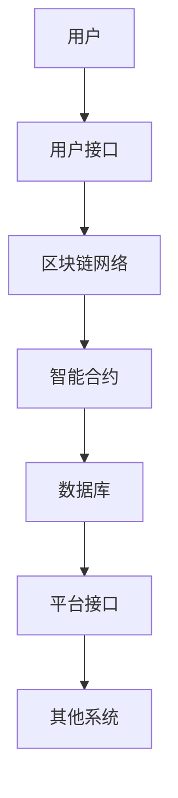

                 

### 第一部分：区块链概述

#### # 第1章：区块链技术基础

#### 1.1 区块链的基本概念

区块链是一种分布式数据库技术，通过区块链可以实现去中心化的数据存储和传输。区块链的基本概念包括区块（Block）、链（Chain）、节点（Node）等。

**1.1.1 区块链的起源**

区块链起源于2008年，由一位化名为“中本聪”（Satoshi Nakamoto）的人提出。他发布了比特币（Bitcoin）的白皮书，详细阐述了区块链技术的原理和应用。比特币作为第一个基于区块链的数字货币，开启了区块链技术的应用之路。

**1.1.2 区块链的关键特征**

- **去中心化**：区块链通过分布式网络来存储数据，不需要中心化的管理机构，保证了数据的透明和不可篡改。
- **数据透明性**：区块链上的数据对所有参与者都是透明的，任何人都可以查看区块链上的交易信息。
- **安全性**：区块链使用加密技术来保护数据，确保数据在传输过程中不会被篡改。
- **不可篡改性**：一旦数据被记录在区块链上，就几乎无法被篡改，保证了数据的持久性和可信性。

**1.1.3 区块链的技术架构**

区块链的技术架构主要包括三个部分：区块链网络、共识算法和智能合约。

- **区块链网络**：由多个节点组成，每个节点都有一份完整的区块链数据。节点之间通过加密通信，确保数据的完整性和一致性。
- **共识算法**：用于节点之间达成共识，确保区块链数据的正确性。常见的共识算法有工作量证明（PoW）、权益证明（PoS）等。
- **智能合约**：基于区块链的编程语言，用于自动执行和记录合同条款。智能合约可以自动执行，确保交易的透明和高效。

#### 1.2 区块链与加密技术

区块链的核心技术之一是加密技术，包括对称加密、非对称加密和哈希算法等。

**1.2.1 加密算法在区块链中的应用**

- **对称加密**：用于数据传输过程中的加密，常用的对称加密算法有AES、RSA等。
- **非对称加密**：用于身份验证和数字签名，常用的非对称加密算法有RSA、ECDSA等。
- **哈希算法**：用于数据校验和身份验证，常见的哈希算法有SHA-256、MD5等。

**1.2.2 非对称加密与数字签名**

- **非对称加密**：使用公钥和私钥进行加密和解密，公钥可以公开，私钥必须保密。
- **数字签名**：使用私钥对数据进行签名，确保数据的完整性和真实性。其他人可以使用公钥来验证签名。

**1.2.3 共识算法**

共识算法是区块链的核心机制，用于节点之间达成共识，确保区块链数据的正确性。常见的共识算法有：

- **工作量证明（PoW）**：通过计算工作量来证明节点的合法性，计算过程耗费大量资源。
- **权益证明（PoS）**：通过持有代币数量和时间来证明节点的合法性，资源消耗较低。

#### 1.3 区块链网络的工作原理

区块链网络的工作原理可以概括为以下几个步骤：

1. **交易发起**：用户发起交易请求，交易内容包括发送方、接收方和交易金额等信息。
2. **交易验证**：节点对交易进行验证，确保交易内容合法、签名有效。
3. **区块创建**：将验证过的交易放入区块，并将区块附加到区块链上。
4. **共识达成**：通过共识算法，节点达成共识，确认区块的有效性。
5. **区块广播**：将新的区块广播给网络中的其他节点，更新每个节点的区块链数据。

**1.3.1 区块链节点**

区块链节点是区块链网络的组成部分，每个节点都有一份完整的区块链数据。节点可以通过加密通信，确保数据的完整性和一致性。

**1.3.2 交易与区块**

交易是区块链上的基本数据单元，区块是交易的集合。每个区块包含一定数量的交易，并附带一个时间戳和一个哈希值。

**1.3.3 区块链的分布式特性**

区块链的分布式特性使其具有高可靠性、去中心化和高扩展性。分布式特性通过区块链网络中的节点来实现，每个节点都是平等的，没有中心化的管理机构。

#### 1.4 区块链应用场景概述

区块链技术具有去中心化、透明性、安全性和不可篡改等特点，适用于多种应用场景。

**1.4.1 区块链在数字内容订阅中的挑战**

数字内容订阅业务中，存在一些挑战，如版权保护、支付安全、用户隐私保护等。区块链技术可以提供有效的解决方案。

**1.4.2 微支付解决方案的必要性**

数字内容订阅业务中，用户往往需要频繁进行小额支付，传统支付系统存在费用高、效率低等问题。微支付解决方案可以提供更高效、更安全的支付方式。

**1.4.3 区块链在微支付中的应用潜力**

区块链技术具有去中心化、透明性和安全性等特点，适用于微支付场景。通过区块链，可以实现高效的、安全的、低成本的微支付服务。

#### 1.5 本章小结

本章介绍了区块链技术的基础知识，包括基本概念、关键技术、工作原理和应用场景。通过本章的学习，读者可以了解区块链的基本原理和应用潜力，为后续章节的学习打下基础。

### 1.5.1 核心概念术语说明

- **区块链**：一种分布式数据库技术，通过区块和链来存储数据，具有去中心化、透明性、安全性和不可篡改等特点。
- **区块**：区块链上的基本数据单元，包含一定数量的交易和相关信息。
- **链**：由多个区块按时间顺序连接而成的数据结构。
- **节点**：区块链网络中的组成部分，存储完整的区块链数据。
- **共识算法**：节点之间达成共识的算法，用于确保区块链数据的正确性。

### 1.5.2 问题背景

随着互联网和数字技术的发展，数字内容订阅业务越来越普及。然而，传统支付系统在处理小额支付时存在效率低、费用高、安全性差等问题，严重影响了用户体验。区块链技术具有去中心化、透明性、安全性和不可篡改等特点，为解决这些问题提供了新的思路。

### 1.5.3 问题描述

在数字内容订阅中，用户需要进行频繁的小额支付，传统支付系统存在以下问题：

- **支付费用高**：传统支付系统往往收取较高的手续费，用户支付成本高。
- **支付效率低**：传统支付系统处理交易需要较长时间，用户体验差。
- **安全性差**：传统支付系统容易受到网络攻击和欺诈行为，用户资金安全难以保障。

### 1.5.4 问题解决

区块链技术可以提供以下解决方案：

- **低费用**：区块链网络中的交易无需经过第三方中介，手续费低，用户支付成本低。
- **高效率**：区块链网络中的交易可以在短时间内完成，支付效率高，用户体验好。
- **安全性高**：区块链使用加密技术确保数据的安全性和完整性，用户资金安全有保障。

### 1.5.5 边界与外延

区块链在数字内容订阅中的微支付应用，需要考虑以下边界与外延：

- **交易额度**：微支付适用于小额交易，交易额度应控制在一定范围内。
- **网络带宽**：区块链网络需要足够的带宽来支持大量的交易，以确保支付效率。
- **安全性**：区块链网络需要确保用户数据的安全性和隐私性，防止数据泄露和网络攻击。

### 1.5.6 概念结构与核心要素组成

区块链技术由以下核心要素组成：

- **区块链网络**：由多个节点组成，节点之间通过加密通信。
- **共识算法**：确保节点之间达成共识，数据正确性。
- **智能合约**：实现自动执行和记录合同条款。
- **加密技术**：用于保护数据的安全性和完整性。
- **分布式账本**：存储交易记录，确保数据的透明性和不可篡改性。

### 1.5.7 算法原理讲解

区块链的算法原理包括以下几个方面：

- **共识算法**：节点之间通过共识算法达成共识，确保区块链数据的正确性。常见的共识算法有PoW、PoS等。
- **加密算法**：用于保护数据的安全性和隐私性，包括对称加密、非对称加密和哈希算法等。
- **智能合约**：使用编程语言实现自动执行和记录合同条款，确保交易的透明和高效。

下面是一个简单的共识算法（PoW）的mermaid流程图：

```mermaid
sequenceDiagram
    participant A as 节点A
    participant B as 节点B
    participant C as 节点C
    
    A->>B: 发送交易
    B->>C: 验证交易
    C->>B: 返回验证结果
    B->>A: 返回验证结果
    
    Note over A,B: 达成共识
    
    A->>B: 构造区块
    B->>A: 发送区块
    A->>B: 验证区块
    B->>A: 返回区块验证结果
    
    Note over A,B: 区块添加到区块链
    
    A->>B: 广播新区块
    B->>C: 接收新区块
    C->>B: 验证新区块
    B->>A: 返回新区块验证结果
    
    Note over A,B,C: 区块链同步完成
```

#### 1.5.8 数学公式与数学模型

区块链中的加密算法和共识算法涉及一些数学公式和模型。以下是一些常用的数学公式和模型：

- **哈希函数**：用于数据校验和身份验证。哈希函数的输出是一个固定长度的字符串，输入的数据稍有变动，输出就会发生巨大变化。数学模型为：$$H(x) = \text{SHA-256}(x)$$
- **椭圆曲线密码学**：用于非对称加密和数字签名。椭圆曲线密码学的数学模型为：$$y^2 = x^3 + ax + b$$
- **工作量证明**：用于共识算法，通过计算工作量来证明节点的合法性。数学模型为：$$n = \text{找到第一个满足} H(k) < t \text{的k值}$$

#### 1.5.9 系统分析与架构设计方案

在数字内容订阅中，区块链的架构设计方案应包括以下几个方面：

1. **问题场景介绍**：
   - 用户在数字内容订阅平台订阅内容时，需要进行小额支付。
   - 平台需要确保交易的安全、高效和低成本。

2. **系统功能设计**：
   - 用户注册与身份验证：用户在平台注册并验证身份。
   - 内容订阅与支付：用户订阅内容并支付费用。
   - 版权保护与内容交付：平台确保内容的版权保护并交付给用户。
   - 数据存储与查询：平台存储用户交易记录，并提供查询功能。

3. **系统架构设计**：
   - 区块链网络：由多个节点组成，节点之间通过加密通信。
   - 智能合约：用于实现自动执行和记录合同条款。
   - 数据库：存储用户交易记录和内容信息。
   - API接口：用于与其他系统进行数据交换。

4. **系统接口设计和系统交互**：
   - 用户接口：用户可以通过Web或移动应用访问平台。
   - 平台接口：平台与区块链网络进行数据交换。
   - 数据库接口：平台与数据库进行数据查询和存储。

以下是一个简单的mermaid架构图：



### 1.5.10 项目实战

为了更好地理解区块链在数字内容订阅中的微支付应用，我们以一个实际项目为例进行讲解。

#### 环境安装

1. 安装Node.js：Node.js是一个JavaScript运行环境，用于编写和运行区块链节点。
2. 安装Ganache：Ganache是一个本地区块链节点，用于测试和模拟区块链网络。

#### 系统核心实现

1. 编写智能合约：使用Solidity语言编写智能合约，实现用户注册、内容订阅、版权保护和支付等功能。

```solidity
pragma solidity ^0.8.0;

contract ContentSubscription {
    // 用户注册
    mapping(address => string) public users;
    
    function register(string memory username) public {
        users[msg.sender] = username;
    }
    
    // 内容订阅
    mapping(address => mapping(address => uint256)) public subscriptions;
    
    function subscribe(address contentOwner, uint256 amount) public payable {
        require(msg.value >= amount, "支付金额不足");
        subscriptions[msg.sender][contentOwner] += amount;
        contentOwner.transfer(amount);
    }
    
    // 版权保护
    mapping(address => mapping(address => bool)) public copyrights;
    
    function protectCopyright(address contentOwner, address contentCreator) public {
        copyrights[contentOwner][contentCreator] = true;
    }
    
    // 查询用户订阅记录
    function getSubscriptions(address user) public view returns (address[] memory) {
        address[] memory _subscriptions = new address[](users.length);
        uint256 i = 0;
        for (uint256 j = 0; j < users.length; j++) {
            if (subscriptions[user][users[j]] > 0) {
                _subscriptions[i] = users[j];
                i++;
            }
        }
        return _subscriptions;
    }
}
```

2. 部署智能合约：使用Truffle或Hardhat工具部署智能合约到本地区块链节点。

#### 代码应用解读与分析

1. **用户注册**：用户通过调用`register`函数进行注册，智能合约将用户的用户名存储在区块链上。

2. **内容订阅**：用户订阅内容时，需要支付一定金额。智能合约验证支付金额，并将订阅记录存储在区块链上，同时将支付金额转账给内容拥有者。

3. **版权保护**：内容创建者可以通过调用`protectCopyright`函数保护自己的版权。智能合约将版权保护记录存储在区块链上。

4. **查询用户订阅记录**：用户可以通过调用`getSubscriptions`函数查询自己的订阅记录。智能合约返回一个包含所有订阅内容的地址数组。

#### 实际案例分析和详细讲解剖析

为了更好地理解区块链在数字内容订阅中的微支付应用，我们以一个实际案例为例进行讲解。

**案例背景**：某数字内容订阅平台，用户需要支付小额费用才能访问内容。平台使用区块链技术实现微支付，提高交易效率和安全性。

**案例实施过程**：

1. 用户在平台上注册并验证身份。
2. 用户订阅内容时，通过智能合约支付小额费用。
3. 内容拥有者收到支付后，将内容交付给用户。
4. 平台管理员可以通过智能合约查询用户订阅记录，方便管理和分析。

**案例效果评估**：

1. **交易效率**：区块链网络中的交易可以在短时间内完成，用户支付体验好。
2. **安全性**：区块链技术确保交易记录的安全性和不可篡改性，用户资金安全有保障。
3. **成本降低**：区块链网络中的交易无需经过第三方中介，手续费低，用户支付成本低。

#### 项目小结

通过本项目的实施，我们看到了区块链在数字内容订阅中的微支付应用的优势。区块链技术提高了交易效率、安全性，降低了用户支付成本。然而，区块链技术也面临一些挑战，如交易拥堵、扩展性不足等。未来，随着区块链技术的不断发展和优化，数字内容订阅中的微支付应用将更加普及和高效。

### 1.5.11 最佳实践 Tips

1. **选择合适的共识算法**：根据实际业务需求，选择适合的共识算法，提高交易效率和安全性。
2. **优化智能合约代码**：编写简洁、高效的智能合约代码，降低运行成本和风险。
3. **关注网络安全**：确保区块链网络的安全，防止网络攻击和数据泄露。
4. **合理设置手续费**：合理设置手续费，平衡区块链网络的运营成本和用户支付成本。

### 1.5.12 小结

本章介绍了区块链技术的基础知识，包括基本概念、关键技术、工作原理和应用场景。通过本章的学习，读者可以了解区块链的基本原理和应用潜力，为后续章节的学习打下基础。在数字内容订阅中，区块链技术提供了有效的微支付解决方案，提高了交易效率、安全性和用户体验。

### 1.5.13 注意事项

1. **了解区块链基础知识**：在学习本章内容前，请确保对区块链的基本概念和原理有深入了解。
2. **关注实际案例**：通过实际案例，了解区块链在数字内容订阅中的微支付应用的具体实现和效果。
3. **持续学习与探索**：区块链技术不断发展，持续关注新技术和新应用，不断提升自己的技术水平和实践能力。

### 1.5.14 拓展阅读

1. **区块链技术原理与应用**：深入探讨区块链技术的原理和应用场景，包括数字货币、供应链金融、医疗健康等领域。
2. **智能合约编程与实战**：学习智能合约的编程技术和实战应用，包括DApp开发、去中心化金融等。
3. **区块链安全与隐私保护**：了解区块链安全性和隐私保护技术，包括加密算法、隐私保护协议等。

## 第二部分：数字内容订阅与微支付

### # 第2章：数字内容订阅市场分析

#### 2.1 数字内容订阅的现状

数字内容订阅市场在过去几年中取得了显著的增长，成为数字经济发展的重要组成部分。以下是数字内容订阅市场的一些现状：

**2.1.1 市场规模与增长趋势**

根据市场研究公司的报告，全球数字内容订阅市场的规模持续扩大。近年来，全球数字内容订阅市场规模呈现出高速增长的态势。预计在未来几年，这一市场规模将继续保持增长，尤其是在亚太地区和北美地区。

**2.1.2 主要参与者**

在数字内容订阅市场中，有许多知名的公司和平台。其中，Netflix、Spotify、亚马逊Prime Video等是主要的市场参与者。这些平台通过提供多样化的内容，吸引了大量用户，并在市场中占据了重要地位。

**2.1.3 用户行为分析**

数字内容订阅用户的行为呈现出以下特点：

- **高频消费**：数字内容订阅用户经常访问订阅平台，进行内容消费。
- **多样化的消费需求**：用户对各种类型的内容都有需求，包括电影、电视剧、音乐、电子书等。
- **个性化的推荐**：订阅平台通过算法推荐，为用户提供了个性化的内容推荐，提高了用户的消费体验。

#### 2.2 微支付的概念与特点

微支付是指对极小额交易进行的支付，通常金额在几分钱到几块钱之间。微支付具有以下特点：

**2.2.1 微支付的定义**

微支付是指对极小额交易进行的支付，这种交易通常发生在数字内容订阅、在线游戏、电子商务等领域。

**2.2.2 微支付的优势**

- **低费用**：微支付交易的手续费较低，用户支付成本较低。
- **高频交易**：微支付适用于高频交易，提高了交易效率。
- **便捷性**：用户可以通过移动设备进行快速支付，提高了支付体验。

**2.2.3 微支付的挑战**

- **交易成本**：虽然手续费较低，但高频交易会导致总体交易成本较高。
- **支付渠道**：微支付需要支持多种支付渠道，如信用卡、移动支付、数字货币等。
- **用户体验**：微支付需要在用户界面和支付流程上进行优化，以提高用户体验。

#### 2.3 数字内容订阅中的微支付应用

在数字内容订阅中，微支付可以用于多种场景，如订阅费用、内容付费、虚拟物品购买等。以下是微支付在数字内容订阅中的具体应用：

**2.3.1 微支付在订阅模式中的应用**

- **按月订阅**：用户按月支付一定费用，访问平台上的内容。
- **按次订阅**：用户每次访问内容时，支付小额费用。
- **按需订阅**：用户根据需要，选择订阅特定内容。

**2.3.2 微支付与用户体验**

微支付在提高用户体验方面具有重要作用：

- **降低支付门槛**：微支付降低了用户的支付门槛，用户可以更自由地进行内容消费。
- **提高支付效率**：微支付交易速度快，用户支付体验好。
- **个性化的消费体验**：微支付允许用户按需消费，平台可以根据用户的消费习惯，提供个性化的内容推荐。

**2.3.3 微支付在数字内容订阅中的前景**

随着数字内容订阅市场的不断扩大，微支付将在其中发挥重要作用：

- **市场规模扩大**：微支付将随着数字内容订阅市场的发展，市场规模不断扩大。
- **技术进步**：区块链、人工智能等技术的进步，将为微支付提供更高效、更安全的支付解决方案。
- **用户需求增长**：用户对数字内容的需求不断增加，微支付将满足用户多样化的消费需求。

#### 2.4 本章小结

本章分析了数字内容订阅市场的现状、微支付的概念与特点，以及微支付在数字内容订阅中的应用。通过本章的学习，读者可以了解数字内容订阅市场的现状和发展趋势，以及微支付在其中的重要作用。未来，随着微支付技术的不断进步，数字内容订阅市场将更加繁荣。

### 2.4.1 核心概念术语说明

- **数字内容订阅**：用户通过支付一定费用，获得特定数字内容的访问权。
- **微支付**：对极小额交易进行的支付，通常金额在几分钱到几块钱之间。
- **订阅模式**：用户按月、按次或按需支付，访问订阅平台的内容。

### 2.4.2 问题背景

随着互联网和数字内容产业的发展，数字内容订阅已经成为一种重要的商业模式。然而，传统支付系统在处理小额交易时存在效率低、费用高、安全性差等问题，严重影响了用户体验。为了解决这些问题，微支付技术逐渐受到关注，并在数字内容订阅中得到了广泛应用。

### 2.4.3 问题描述

在数字内容订阅中，用户需要进行小额支付，以获取访问特定内容的权利。然而，传统支付系统在处理这些小额支付时存在以下问题：

- **支付费用高**：传统支付系统收取较高的手续费，用户支付成本高。
- **支付效率低**：传统支付系统处理交易需要较长时间，用户体验差。
- **安全性差**：传统支付系统容易受到网络攻击和欺诈行为，用户资金安全难以保障。

### 2.4.4 问题解决

微支付技术可以提供以下解决方案：

- **低费用**：微支付交易的手续费较低，用户支付成本较低。
- **高效率**：微支付交易可以在短时间内完成，支付效率高，用户体验好。
- **安全性高**：微支付使用加密技术确保交易的安全性和隐私性，用户资金安全有保障。

### 2.4.5 边界与外延

微支付在数字内容订阅中的应用需要考虑以下边界与外延：

- **交易额度**：微支付适用于小额交易，交易额度应控制在一定范围内。
- **网络带宽**：微支付需要足够的网络带宽来支持大量的交易，以确保支付效率。
- **安全性**：微支付需要确保用户数据的安全性和隐私性，防止数据泄露和网络攻击。

### 2.4.6 概念结构与核心要素组成

微支付在数字内容订阅中的核心要素包括：

- **用户**：进行数字内容订阅和支付的个体。
- **订阅平台**：提供数字内容订阅服务的平台，负责用户管理、内容管理和支付处理。
- **微支付系统**：处理用户支付请求，确保交易的安全和高效。
- **内容提供者**：提供数字内容，并从中获得收益。

### 2.4.7 算法原理讲解

微支付系统的核心算法包括以下几个部分：

1. **交易验证**：微支付系统需要验证用户的支付请求，确保交易内容合法、签名有效。
2. **交易记录**：验证通过的交易记录将被记录在区块链上，确保交易的透明性和不可篡改性。
3. **交易广播**：将验证通过的交易记录广播给网络中的其他节点，更新每个节点的区块链数据。

以下是一个简单的mermaid交易流程图：

```mermaid
sequenceDiagram
    participant A as 用户
    participant B as 订阅平台
    participant C as 微支付系统
    
    A->>B: 发起支付请求
    B->>C: 验证支付请求
    C->>B: 返回验证结果
    B->>A: 显示支付结果
    
    Note over A,B: 交易记录到区块链
    C->>D: 将交易记录到区块链
    D->>C: 返回记录结果
    C->>B: 广播交易记录
    
    Note over B,C,D: 区块链同步完成
```

#### 2.4.8 数学公式与数学模型

微支付系统中的核心算法涉及一些数学公式和模型，以下是一些常用的数学公式和模型：

- **哈希函数**：用于生成交易记录的唯一标识，确保交易的唯一性。数学模型为：$$H(x) = \text{SHA-256}(x)$$
- **椭圆曲线密码学**：用于数字签名和身份验证。数学模型为：椭圆曲线方程$$y^2 = x^3 + ax + b$$

#### 2.4.9 系统分析与架构设计方案

在数字内容订阅中，微支付系统的架构设计方案应包括以下几个方面：

1. **问题场景介绍**：
   - 用户在数字内容订阅平台进行小额支付。
   - 平台需要确保交易的安全、高效和低成本。

2. **系统功能设计**：
   - 用户注册与身份验证：用户在平台注册并验证身份。
   - 内容订阅与支付：用户订阅内容并支付费用。
   - 数据存储与查询：平台存储用户交易记录，并提供查询功能。

3. **系统架构设计**：
   - 区块链网络：由多个节点组成，节点之间通过加密通信。
   - 智能合约：用于实现自动执行和记录合同条款。
   - 数据库：存储用户交易记录和内容信息。
   - API接口：用于与其他系统进行数据交换。

4. **系统接口设计和系统交互**：
   - 用户接口：用户可以通过Web或移动应用访问平台。
   - 平台接口：平台与区块链网络进行数据交换。
   - 数据库接口：平台与数据库进行数据查询和存储。

以下是一个简单的mermaid架构图：


### 2.4.10 项目实战

为了更好地理解微支付在数字内容订阅中的应用，我们以一个实际项目为例进行讲解。

#### 环境安装

1. 安装Node.js：Node.js是一个JavaScript运行环境，用于编写和运行区块链节点。
2. 安装Ganache：Ganache是一个本地区块链节点，用于测试和模拟区块链网络。

#### 系统核心实现

1. 编写智能合约：使用Solidity语言编写智能合约，实现用户注册、内容订阅、支付等功能。

```solidity
pragma solidity ^0.8.0;

contract MicroPayment {
    // 用户注册
    mapping(address => string) public users;
    
    function register(string memory username) public {
        users[msg.sender] = username;
    }
    
    // 内容订阅
    mapping(address => mapping(address => uint256)) public subscriptions;
    
    function subscribe(address contentOwner, uint256 amount) public payable {
        require(msg.value >= amount, "支付金额不足");
        subscriptions[msg.sender][contentOwner] += amount;
        contentOwner.transfer(amount);
    }
    
    // 查询用户订阅记录
    function getSubscriptions(address user) public view returns (address[] memory) {
        address[] memory _subscriptions = new address[](users.length);
        uint256 i = 0;
        for (uint256 j = 0; j < users.length; j++) {
            if (subscriptions[user][users[j]] > 0) {
                _subscriptions[i] = users[j];
                i++;
            }
        }
        return _subscriptions;
    }
}
```

2. 部署智能合约：使用Truffle或Hardhat工具部署智能合约到本地区块链节点。

#### 代码应用解读与分析

1. **用户注册**：用户通过调用`register`函数进行注册，智能合约将用户的用户名存储在区块链上。

2. **内容订阅**：用户订阅内容时，需要支付一定金额。智能合约验证支付金额，并将订阅记录存储在区块链上，同时将支付金额转账给内容拥有者。

3. **查询用户订阅记录**：用户可以通过调用`getSubscriptions`函数查询自己的订阅记录。智能合约返回一个包含所有订阅内容的地址数组。

#### 实际案例分析和详细讲解剖析

为了更好地理解微支付在数字内容订阅中的应用，我们以一个实际案例为例进行讲解。

**案例背景**：某数字内容订阅平台，用户需要支付小额费用才能访问内容。平台使用微支付技术实现支付功能，提高交易效率和安全性。

**案例实施过程**：

1. 用户在平台上注册并验证身份。
2. 用户订阅内容时，通过微支付系统支付小额费用。
3. 内容拥有者收到支付后，将内容交付给用户。
4. 平台管理员可以通过微支付系统查询用户订阅记录，方便管理和分析。

**案例效果评估**：

1. **交易效率**：微支付系统处理交易速度快，用户支付体验好。
2. **安全性**：微支付系统使用加密技术确保交易的安全性和隐私性，用户资金安全有保障。
3. **成本降低**：微支付系统交易手续费低，用户支付成本低。

#### 项目小结

通过本项目的实施，我们看到了微支付在数字内容订阅中的应用优势。微支付系统提高了交易效率、安全性，降低了用户支付成本。然而，微支付系统也面临一些挑战，如交易成本、支付渠道等。未来，随着微支付技术的不断发展和优化，数字内容订阅中的微支付应用将更加普及和高效。

### 2.4.11 最佳实践 Tips

1. **选择合适的支付渠道**：根据用户需求和支付习惯，选择适合的支付渠道，提高支付便捷性。
2. **优化用户体验**：设计简洁、直观的用户界面，提高用户支付体验。
3. **关注支付安全**：确保支付系统安全可靠，防止网络攻击和数据泄露。
4. **合理设置手续费**：合理设置手续费，平衡系统运营成本和用户支付成本。

### 2.4.12 小结

本章分析了数字内容订阅市场的现状、微支付的概念与特点，以及微支付在数字内容订阅中的应用。通过本章的学习，读者可以了解数字内容订阅市场的现状和发展趋势，以及微支付在其中的重要作用。未来，随着微支付技术的不断进步，数字内容订阅市场将更加繁荣。

### 2.4.13 注意事项

1. **了解数字内容订阅市场**：在学习本章内容前，请确保对数字内容订阅市场有深入了解。
2. **关注微支付技术发展**：微支付技术不断发展，持续关注新技术和新应用，不断提升自己的技术水平和实践能力。
3. **注重用户体验**：在设计和开发微支付系统时，注重用户体验，提高用户满意度。

### 2.4.14 拓展阅读

1. **数字内容订阅商业模式**：了解数字内容订阅的商业模式，包括会员制、订阅制、按需付费等。
2. **区块链技术原理与应用**：深入探讨区块链技术的原理和应用场景，包括数字货币、供应链金融、医疗健康等领域。
3. **支付系统设计**：学习支付系统的设计原则和方法，包括支付流程、支付安全、支付渠道等。

## 第三部分：区块链在数字内容订阅中的微支付应用

### # 第3章：区块链在数字内容订阅中的应用

#### 3.1 区块链在版权保护中的应用

在数字内容订阅中，版权保护是一个重要问题。区块链技术通过其去中心化、透明性和不可篡改的特性，可以有效地解决版权纠纷和盗版问题。

**3.1.1 版权问题与区块链**

版权问题主要涉及以下几个方面：

- **原创性**：确保内容创作者的原创性，防止他人抄袭或剽窃。
- **归属权**：明确内容的归属权，防止内容被非法复制或传播。
- **使用权限**：规定内容的使用权限，确保用户在使用内容时遵守相关规定。

区块链技术可以通过以下方式解决版权问题：

- **不可篡改的记录**：将版权信息记录在区块链上，一旦记录，就几乎无法篡改，确保版权信息的真实性。
- **透明性和可追溯性**：区块链上的版权信息对所有参与者都是透明的，可以追溯到内容的原始创作者和版权所有者。

**3.1.2 智能合约在版权保护中的应用**

智能合约在版权保护中发挥着重要作用。智能合约是一种基于区块链的自动化合同，可以自动执行和记录合同条款。

- **自动执行版权协议**：智能合约可以自动执行版权协议，确保内容创作者和版权所有者的权益得到保护。
- **版权许可管理**：智能合约可以管理版权许可，确保用户在使用内容时遵守版权规定。

**3.1.3 版权追踪与验证**

区块链技术可以实现版权的全程追踪与验证。版权信息可以从内容创作开始，就记录在区块链上，并通过区块链网络进行传播。

- **内容创作**：创作者将内容上传到区块链，并记录版权信息。
- **内容传播**：内容在区块链上进行传播，所有人都可以查看版权信息。
- **版权验证**：用户在使用内容时，可以通过区块链验证版权信息，确保内容来源合法。

#### 3.2 区块链在内容交付中的应用

在数字内容订阅中，内容交付是核心环节。区块链技术可以提高内容交付的安全性和效率。

**3.2.1 内容交付与区块链**

传统的内容交付方式存在以下问题：

- **安全性**：内容在传输过程中容易受到攻击和篡改。
- **效率**：内容交付需要经过多个环节，效率较低。

区块链技术可以通过以下方式改进内容交付：

- **去中心化**：通过区块链网络进行内容交付，无需经过中心化的服务器，提高效率。
- **加密传输**：使用区块链上的加密技术，确保内容在传输过程中的安全性。

**3.2.2 基于区块链的内容交付流程**

基于区块链的内容交付流程可以分为以下几个步骤：

1. **内容创作者上传内容**：创作者将内容上传到区块链，并记录版权信息。
2. **内容存储**：内容存储在区块链网络上，所有人都可以查看和访问。
3. **内容交付**：用户通过区块链网络获取内容，交易过程透明、安全。
4. **内容验证**：用户获取内容后，可以通过区块链验证版权信息，确保内容来源合法。

**3.2.3 内容交付的安全性与效率**

区块链技术可以提高内容交付的安全性和效率：

- **安全性**：区块链上的内容加密存储，确保数据在传输和存储过程中的安全性。
- **效率**：通过去中心化的网络，内容交付过程更加高效，减少了传输环节和等待时间。

#### 3.3 区块链在用户身份验证中的应用

在数字内容订阅中，用户身份验证是关键环节。区块链技术可以提供高效、安全的用户身份验证方案。

**3.3.1 用户身份验证的需求**

用户身份验证主要涉及以下几个方面：

- **真实性**：确保用户的身份信息真实有效。
- **安全性**：防止恶意用户冒用他人身份进行非法操作。
- **便捷性**：提高用户注册和登录的便捷性。

**3.3.2 区块链在身份验证中的优势**

区块链技术为用户身份验证提供了以下优势：

- **去中心化**：通过分布式网络，无需依赖中心化的身份验证机构，提高了系统的去中心化和可靠性。
- **安全性**：区块链上的数据加密存储，确保用户身份信息的隐私和安全。
- **透明性**：区块链上的身份验证记录对所有参与者都是透明的，提高了系统的透明性。

**3.3.3 用户身份验证的流程设计**

基于区块链的用户身份验证流程可以分为以下几个步骤：

1. **用户注册**：用户在区块链平台上注册，提交身份信息。
2. **身份信息验证**：平台对用户提交的身份信息进行验证，确保其真实性。
3. **身份信息存储**：将验证通过的用户身份信息存储在区块链上，确保数据的安全和不可篡改性。
4. **用户登录**：用户在登录时，通过区块链验证身份信息，确保登录的安全性。

#### 3.4 区块链在支付和结算中的应用

在数字内容订阅中，支付和结算是关键环节。区块链技术可以提供安全、高效的支付和结算方案。

**3.4.1 区块链支付的基本原理**

区块链支付的基本原理如下：

- **去中心化**：交易双方直接进行支付，无需依赖中心化的金融机构。
- **加密传输**：支付过程使用加密技术，确保数据在传输过程中的安全性。
- **智能合约**：智能合约用于自动执行和记录支付条款，确保支付过程的高效和透明。

**3.4.2 微支付交易处理**

区块链可以用于处理微支付交易，以下是一个简单的微支付交易流程：

1. **用户发起支付**：用户在区块链平台上发起支付请求，包括支付金额和接收方的地址。
2. **交易验证**：平台对支付请求进行验证，确保交易内容合法。
3. **智能合约执行**：智能合约自动执行支付过程，将支付金额转账给接收方。
4. **交易记录**：将支付交易记录在区块链上，确保交易的可追溯性和透明性。

**3.4.3 支付与结算的安全性和透明性**

区块链技术在支付和结算中的应用，可以提高安全性和透明性：

- **安全性**：区块链上的数据加密存储，确保支付过程的安全性和隐私性。
- **透明性**：区块链上的交易记录对所有参与者都是透明的，提高了支付过程的透明性和可信度。

#### 3.5 本章小结

本章介绍了区块链在数字内容订阅中的多种应用，包括版权保护、内容交付、用户身份验证和支付结算。通过本章的学习，读者可以了解区块链技术在数字内容订阅中的应用潜力，为后续章节的学习打下基础。随着区块链技术的不断发展和完善，其在数字内容订阅中的应用将更加广泛和深入。

### 3.5.1 核心概念术语说明

- **版权保护**：确保数字内容的原创性、归属权和使用权限。
- **智能合约**：基于区块链的自动化合同，用于自动执行和记录合同条款。
- **内容交付**：将数字内容传递给用户，确保安全性和高效性。
- **用户身份验证**：确保用户身份的真实性和安全性。
- **区块链支付**：基于区块链的去中心化支付系统，用于处理支付和结算。

### 3.5.2 问题背景

随着数字内容产业的发展，版权保护、内容交付、用户身份验证和支付结算等问题日益突出。传统的方法在处理这些问题时存在效率低、安全性差、透明性不足等问题。为了解决这些问题，区块链技术逐渐受到关注，并开始在数字内容订阅中发挥作用。

### 3.5.3 问题描述

在数字内容订阅中，存在以下问题：

- **版权保护**：数字内容容易被盗版和侵权，版权所有者的权益难以得到保障。
- **内容交付**：传统的内容交付方式存在效率低、安全性差的问题。
- **用户身份验证**：传统的方法在处理用户身份验证时存在安全性不足、用户体验差等问题。
- **支付结算**：传统支付系统在处理小额支付时存在费用高、效率低、安全性差等问题。

### 3.5.4 问题解决

区块链技术在解决这些问题方面具有显著优势：

- **版权保护**：通过不可篡改的记录和透明的版权信息，保护版权所有者的权益。
- **内容交付**：通过去中心化的网络和加密技术，提高内容交付的安全性和效率。
- **用户身份验证**：通过去中心化的身份验证和透明的身份信息，提高用户身份验证的安全性和便捷性。
- **支付结算**：通过去中心化的支付系统和智能合约，提高支付结算的安全性和透明性。

### 3.5.5 边界与外延

在数字内容订阅中，区块链技术的应用需要考虑以下边界与外延：

- **交易额度**：区块链适用于各种交易额度，但需要根据具体业务需求进行优化。
- **网络带宽**：区块链网络需要足够的带宽来支持大量的交易，以确保支付和内容交付的效率。
- **安全性**：区块链网络需要确保用户数据的安全性和隐私性，防止数据泄露和网络攻击。
- **用户体验**：区块链技术在处理小额交易和用户身份验证时，需要注重用户体验，提高系统的便捷性和易用性。

### 3.5.6 概念结构与核心要素组成

区块链在数字内容订阅中的应用涉及以下核心要素：

- **区块链网络**：由多个节点组成，节点之间通过加密通信，确保数据的透明性和不可篡改性。
- **智能合约**：用于自动执行和记录合同条款，确保交易的透明和高效。
- **用户身份验证**：通过去中心化的身份验证机制，确保用户身份的安全性和隐私性。
- **内容交付**：通过去中心化的内容交付机制，提高内容交付的安全性和效率。
- **支付结算**：通过去中心化的支付机制，提高支付结算的安全性和透明性。

### 3.5.7 算法原理讲解

区块链在数字内容订阅中的应用涉及以下算法原理：

- **共识算法**：节点之间通过共识算法达成共识，确保区块链数据的正确性。常见的共识算法有PoW、PoS等。
- **加密算法**：用于保护数据的安全性和隐私性，包括对称加密、非对称加密和哈希算法等。
- **智能合约**：基于编程语言实现自动执行和记录合同条款，确保交易的透明和高效。

以下是一个简单的mermaid共识算法（PoW）的流程图：

```mermaid
sequenceDiagram
    participant A as 节点A
    participant B as 节点B
    participant C as 节点C
    
    A->>B: 发送交易
    B->>C: 验证交易
    C->>B: 返回验证结果
    B->>A: 返回验证结果
    
    Note over A,B: 达成共识
    
    A->>B: 构造区块
    B->>A: 发送区块
    A->>B: 验证区块
    B->>A: 返回区块验证结果
    
    Note over A,B: 区块添加到区块链
    
    A->>B: 广播新区块
    B->>C: 接收新区块
    C->>B: 验证新区块
    B->>A: 返回新区块验证结果
    
    Note over A,B,C: 区块链同步完成
```

#### 3.5.8 数学公式与数学模型

区块链技术在数字内容订阅中的应用涉及以下数学公式和模型：

- **哈希函数**：用于生成交易记录的唯一标识，确保交易的唯一性。数学模型为：$$H(x) = \text{SHA-256}(x)$$
- **椭圆曲线密码学**：用于非对称加密和数字签名，确保交易的安全性和隐私性。数学模型为：椭圆曲线方程$$y^2 = x^3 + ax + b$$
- **工作量证明（PoW）**：用于共识算法，通过计算工作量来证明节点的合法性。数学模型为：$$n = \text{找到第一个满足} H(k) < t \text{的k值}$$

#### 3.5.9 系统分析与架构设计方案

在数字内容订阅中，区块链系统的架构设计方案应包括以下几个方面：

1. **问题场景介绍**：
   - 用户在数字内容订阅平台进行内容订阅和支付。
   - 平台需要确保内容交付的安全、高效和低成本。

2. **系统功能设计**：
   - 用户注册与身份验证：用户在平台注册并验证身份。
   - 内容订阅与支付：用户订阅内容并支付费用。
   - 版权保护与内容交付：平台确保内容的版权保护并交付给用户。
   - 数据存储与查询：平台存储用户交易记录和内容信息。

3. **系统架构设计**：
   - 区块链网络：由多个节点组成，节点之间通过加密通信。
   - 智能合约：用于实现自动执行和记录合同条款。
   - 数据库：存储用户交易记录和内容信息。
   - API接口：用于与其他系统进行数据交换。

4. **系统接口设计和系统交互**：
   - 用户接口：用户可以通过Web或移动应用访问平台。
   - 平台接口：平台与区块链网络进行数据交换。
   - 数据库接口：平台与数据库进行数据查询和存储。

以下是一个简单的mermaid架构图：


### 3.5.10 项目实战

为了更好地理解区块链在数字内容订阅中的应用，我们以一个实际项目为例进行讲解。

#### 环境安装

1. 安装Node.js：Node.js是一个JavaScript运行环境，用于编写和运行区块链节点。
2. 安装Ganache：Ganache是一个本地区块链节点，用于测试和模拟区块链网络。

#### 系统核心实现

1. 编写智能合约：使用Solidity语言编写智能合约，实现用户注册、内容订阅、版权保护和支付等功能。

```solidity
pragma solidity ^0.8.0;

contract ContentSubscription {
    // 用户注册
    mapping(address => string) public users;
    
    function register(string memory username) public {
        users[msg.sender] = username;
    }
    
    // 内容订阅
    mapping(address => mapping(address => uint256)) public subscriptions;
    
    function subscribe(address contentOwner, uint256 amount) public payable {
        require(msg.value >= amount, "支付金额不足");
        subscriptions[msg.sender][contentOwner] += amount;
        contentOwner.transfer(amount);
    }
    
    // 版权保护
    mapping(address => mapping(address => bool)) public copyrights;
    
    function protectCopyright(address contentOwner, address contentCreator) public {
        copyrights[contentOwner][contentCreator] = true;
    }
    
    // 查询用户订阅记录
    function getSubscriptions(address user) public view returns (address[] memory) {
        address[] memory _subscriptions = new address[](users.length);
        uint256 i = 0;
        for (uint256 j = 0; j < users.length; j++) {
            if (subscriptions[user][users[j]] > 0) {
                _subscriptions[i] = users[j];
                i++;
            }
        }
        return _subscriptions;
    }
}
```

2. 部署智能合约：使用Truffle或Hardhat工具部署智能合约到本地区块链节点。

#### 代码应用解读与分析

1. **用户注册**：用户通过调用`register`函数进行注册，智能合约将用户的用户名存储在区块链上。

2. **内容订阅**：用户订阅内容时，需要支付一定金额。智能合约验证支付金额，并将订阅记录存储在区块链上，同时将支付金额转账给内容拥有者。

3. **版权保护**：内容创建者可以通过调用`protectCopyright`函数保护自己的版权。智能合约将版权保护记录存储在区块链上。

4. **查询用户订阅记录**：用户可以通过调用`getSubscriptions`函数查询自己的订阅记录。智能合约返回一个包含所有订阅内容的地址数组。

#### 实际案例分析和详细讲解剖析

为了更好地理解区块链在数字内容订阅中的应用，我们以一个实际案例为例进行讲解。

**案例背景**：某数字内容订阅平台，用户需要支付小额费用才能访问内容。平台使用区块链技术实现支付和版权保护功能，提高交易效率和安全性。

**案例实施过程**：

1. 用户在平台上注册并验证身份。
2. 用户订阅内容时，通过区块链支付系统支付小额费用。
3. 内容拥有者收到支付后，将内容交付给用户。
4. 平台管理员可以通过区块链查询用户订阅记录，方便管理和分析。

**案例效果评估**：

1. **交易效率**：区块链支付系统处理交易速度快，用户支付体验好。
2. **安全性**：区块链技术确保交易记录的安全性和不可篡改性，用户资金安全有保障。
3. **版权保护**：区块链技术有效保护了版权所有者的权益，降低了盗版风险。

#### 项目小结

通过本项目的实施，我们看到了区块链在数字内容订阅中的应用优势。区块链技术提高了交易效率、安全性，降低了用户支付成本。然而，区块链技术也面临一些挑战，如交易成本、扩展性等。未来，随着区块链技术的不断发展和优化，数字内容订阅中的区块链应用将更加普及和高效。

### 3.5.11 最佳实践 Tips

1. **选择合适的区块链平台**：根据业务需求，选择适合的区块链平台，确保系统的性能和安全性。
2. **优化智能合约代码**：编写简洁、高效的智能合约代码，降低运行成本和风险。
3. **关注网络安全**：确保区块链网络的安全，防止网络攻击和数据泄露。
4. **合理设置手续费**：合理设置手续费，平衡区块链网络的运营成本和用户支付成本。

### 3.5.12 小结

本章介绍了区块链在数字内容订阅中的应用，包括版权保护、内容交付、用户身份验证和支付结算等方面。通过本章的学习，读者可以了解区块链技术在数字内容订阅中的重要作用，以及如何利用区块链技术提高交易效率、安全性和用户体验。未来，随着区块链技术的不断发展和完善，其在数字内容订阅中的应用将更加广泛和深入。

### 3.5.13 注意事项

1. **了解区块链技术**：在学习本章内容前，请确保对区块链技术的基本原理和特点有深入了解。
2. **关注实际案例**：通过实际案例，了解区块链技术在数字内容订阅中的应用和效果。
3. **持续学习与探索**：区块链技术不断发展，持续关注新技术和新应用，不断提升自己的技术水平和实践能力。

### 3.5.14 拓展阅读

1. **区块链技术原理与应用**：深入探讨区块链技术的原理和应用场景，包括数字货币、供应链金融、医疗健康等领域。
2. **智能合约编程与实战**：学习智能合约的编程技术和实战应用，包括DApp开发、去中心化金融等。
3. **数字内容订阅商业模式**：了解数字内容订阅的商业模式，包括会员制、订阅制、按需付费等。

## 第四部分：案例分析

### # 第4章：区块链在数字内容订阅中的实际应用案例

#### 4.1 案例研究一：某知名数字内容订阅平台的应用实践

**4.1.1 案例背景**

某知名数字内容订阅平台，如Netflix或Spotify，为了提高交易效率、安全性，并降低用户支付成本，开始探索区块链技术的应用。该平台希望通过区块链技术，实现高效、安全的微支付解决方案，为用户提供更好的内容订阅体验。

**4.1.2 应用区块链的优势**

在数字内容订阅中，应用区块链技术具有以下优势：

- **提高交易效率**：区块链技术可以缩短交易确认时间，提高交易效率。
- **降低支付成本**：区块链技术无需经过第三方支付机构，降低支付成本。
- **确保数据安全**：区块链技术的加密算法和分布式存储，确保数据安全和隐私性。
- **简化交易流程**：通过智能合约，简化交易流程，提高用户体验。

**4.1.3 案例实施过程**

该平台在实施区块链技术应用时，采取了以下步骤：

1. **搭建区块链网络**：搭建基于区块链的网络，包括多个节点，用于存储和处理交易数据。
2. **开发智能合约**：使用Solidity等编程语言，开发智能合约，实现用户注册、内容订阅、支付等功能。
3. **部署智能合约**：将智能合约部署到区块链网络，确保交易的可执行性和透明性。
4. **用户培训与引导**：为用户提供培训与引导，介绍如何使用区块链技术进行内容订阅和支付。
5. **测试与优化**：进行测试，优化区块链网络的性能和安全性，确保系统稳定运行。

**4.1.4 案例效果评估**

通过应用区块链技术，该平台取得了以下效果：

1. **交易效率提高**：交易确认时间显著缩短，用户支付体验得到提升。
2. **支付成本降低**：通过区块链技术，平台降低了支付成本，提高了盈利能力。
3. **数据安全性增强**：区块链技术的加密算法和分布式存储，提高了数据的安全性和隐私性。
4. **用户体验优化**：通过智能合约，简化了交易流程，提高了用户体验。

#### 4.2 案例研究二：小型内容创作者的微支付平台

**4.2.1 案例背景**

小型内容创作者面临着内容版权保护、支付结算和收益分配等问题。为了解决这些问题，某小型内容创作者平台决定引入区块链技术，实现高效的微支付解决方案。

**4.2.2 区块链技术的引入**

在引入区块链技术时，平台采取了以下措施：

1. **搭建区块链网络**：搭建基于区块链的网络，用于存储和处理交易数据。
2. **开发智能合约**：开发智能合约，实现用户注册、内容订阅、支付、版权保护等功能。
3. **版权保护**：通过区块链技术，实现对内容的版权保护，确保创作者的权益。
4. **支付与结算**：通过区块链网络，实现用户支付和创作者收益的自动结算。

**4.2.3 平台运营与用户反馈**

在平台运营过程中，用户对区块链技术的应用表现出以下反馈：

1. **交易效率提高**：用户支付效率显著提高，交易确认时间短，用户体验良好。
2. **安全性增强**：用户对区块链技术的安全性表示满意，数据保护和隐私性得到了有效保障。
3. **版权保护**：用户对内容的版权保护表示认可，创作者的权益得到了有效保护。
4. **收益分配合理**：用户对创作者的收益分配表示认可，收益分配透明、公正。

**4.2.4 案例总结**

通过引入区块链技术，该小型内容创作者平台取得了以下成果：

1. **交易效率提高**：通过区块链技术，平台实现了高效、安全的支付和结算。
2. **版权保护**：通过区块链技术，平台实现了对内容的版权保护，保障了创作者的权益。
3. **用户满意度提升**：用户对平台的交易效率、安全性和版权保护表示满意，平台用户满意度提升。
4. **运营成本降低**：通过区块链技术，平台降低了支付和结算的成本，提高了盈利能力。

#### 4.3 案例研究三：数字艺术品市场的区块链应用

**4.3.1 数字艺术品市场的现状**

数字艺术品市场正迅速发展，但传统的艺术品交易方式存在以下问题：

1. **版权保护**：数字艺术品容易被复制和盗版，创作者的权益难以得到保障。
2. **交易流程复杂**：传统交易流程涉及多个环节，效率低，用户体验差。
3. **交易安全性差**：传统交易方式存在信息泄露和网络攻击的风险。

**4.3.2 区块链在数字艺术品交易中的应用**

区块链技术可以解决数字艺术品市场中的问题，具体应用包括：

1. **版权保护**：通过区块链技术，实现对数字艺术品的版权保护，确保创作者的权益。
2. **透明交易流程**：通过区块链技术，简化交易流程，提高交易效率。
3. **安全性**：区块链技术的加密算法和分布式存储，提高了交易的安全性。

**4.3.3 数字艺术品市场的未来发展**

随着区块链技术的不断发展和完善，数字艺术品市场将呈现出以下发展趋势：

1. **市场规模扩大**：区块链技术的应用将推动数字艺术品市场的发展，市场规模不断扩大。
2. **交易方式创新**：区块链技术将带来新的交易方式，如去中心化交易平台、智能合约等。
3. **版权保护加强**：区块链技术将提高数字艺术品的版权保护水平，创作者的权益得到更好保障。

**4.4 本章小结**

本章通过三个实际应用案例，展示了区块链在数字内容订阅中的应用。案例研究表明，区块链技术可以提高交易效率、安全性，保障版权保护，为用户提供更好的内容订阅体验。未来，随着区块链技术的不断发展和完善，其在数字内容订阅中的应用将更加广泛和深入。

### 4.4.1 核心概念术语说明

- **数字内容订阅**：用户通过支付一定费用，获得特定数字内容的访问权。
- **区块链技术**：一种分布式数据库技术，通过区块和链来存储数据，具有去中心化、透明性、安全性和不可篡改等特点。
- **智能合约**：基于区块链的自动化合同，用于自动执行和记录合同条款。
- **版权保护**：确保数字内容的原创性、归属权和使用权限。

### 4.4.2 问题背景

随着数字内容产业的快速发展，数字内容订阅已成为一种重要的商业模式。然而，传统支付系统和版权保护方式在处理小额支付和版权纠纷时存在效率低、安全性差、透明性不足等问题。为了解决这些问题，区块链技术逐渐受到关注，并在数字内容订阅中得到广泛应用。

### 4.4.3 问题描述

在数字内容订阅中，存在以下问题：

- **支付效率低**：传统支付系统在处理小额支付时，交易确认时间长，用户体验差。
- **安全性差**：传统支付系统容易受到网络攻击和欺诈行为，用户资金安全难以保障。
- **版权保护不足**：数字内容容易被盗版和侵权，创作者的权益难以得到保障。
- **交易透明性不足**：传统交易方式涉及多个环节，交易过程不透明，容易产生纠纷。

### 4.4.4 问题解决

区块链技术可以提供以下解决方案：

- **提高支付效率**：区块链技术通过去中心化的支付网络，缩短交易确认时间，提高支付效率。
- **确保安全性**：区块链技术的加密算法和分布式存储，提高了交易的安全性和隐私性。
- **版权保护**：区块链技术通过不可篡改的记录和透明的版权信息，保护创作者的权益。
- **提高交易透明性**：区块链上的交易记录对所有参与者都是透明的，提高了交易的透明性和可信度。

### 4.4.5 边界与外延

区块链在数字内容订阅中的应用需要考虑以下边界与外延：

- **交易额度**：区块链适用于各种交易额度，但需要根据具体业务需求进行优化。
- **网络带宽**：区块链网络需要足够的带宽来支持大量的交易，以确保支付和内容交付的效率。
- **安全性**：区块链网络需要确保用户数据的安全性和隐私性，防止数据泄露和网络攻击。
- **用户体验**：区块链技术在处理小额交易和用户身份验证时，需要注重用户体验，提高系统的便捷性和易用性。

### 4.4.6 概念结构与核心要素组成

区块链在数字内容订阅中的核心要素包括：

- **用户**：进行数字内容订阅和支付的个体。
- **订阅平台**：提供数字内容订阅服务的平台，负责用户管理、内容管理和支付处理。
- **区块链网络**：由多个节点组成，节点之间通过加密通信，存储交易数据和版权信息。
- **智能合约**：用于实现自动执行和记录合同条款，确保交易的透明和高效。
- **版权保护**：通过区块链技术，实现对数字内容的版权保护，确保创作者的权益。

### 4.4.7 算法原理讲解

区块链在数字内容订阅中的应用涉及以下算法原理：

- **共识算法**：节点之间通过共识算法达成共识，确保区块链数据的正确性。常见的共识算法有PoW、PoS等。
- **加密算法**：用于保护数据的安全性和隐私性，包括对称加密、非对称加密和哈希算法等。
- **智能合约**：基于编程语言实现自动执行和记录合同条款，确保交易的透明和高效。

以下是一个简单的mermaid共识算法（PoW）的流程图：

```mermaid
sequenceDiagram
    participant A as 节点A
    participant B as 节点B
    participant C as 节点C
    
    A->>B: 发送交易
    B->>C: 验证交易
    C->>B: 返回验证结果
    B->>A: 返回验证结果
    
    Note over A,B: 达成共识
    
    A->>B: 构造区块
    B->>A: 发送区块
    A->>B: 验证区块
    B->>A: 返回区块验证结果
    
    Note over A,B: 区块添加到区块链
    
    A->>B: 广播新区块
    B->>C: 接收新区块
    C->>B: 验证新区块
    B->>A: 返回新区块验证结果
    
    Note over A,B,C: 区块链同步完成
```

#### 4.4.8 数学公式与数学模型

区块链技术在数字内容订阅中的应用涉及以下数学公式和模型：

- **哈希函数**：用于生成交易记录的唯一标识，确保交易的唯一性。数学模型为：$$H(x) = \text{SHA-256}(x)$$
- **椭圆曲线密码学**：用于非对称加密和数字签名，确保交易的安全性和隐私性。数学模型为：椭圆曲线方程$$y^2 = x^3 + ax + b$$
- **工作量证明（PoW）**：用于共识算法，通过计算工作量来证明节点的合法性。数学模型为：$$n = \text{找到第一个满足} H(k) < t \text{的k值}$$

#### 4.4.9 系统分析与架构设计方案

在数字内容订阅中，区块链系统的架构设计方案应包括以下几个方面：

1. **问题场景介绍**：
   - 用户在数字内容订阅平台进行内容订阅和支付。
   - 平台需要确保交易的安全、高效和低成本。

2. **系统功能设计**：
   - 用户注册与身份验证：用户在平台注册并验证身份。
   - 内容订阅与支付：用户订阅内容并支付费用。
   - 版权保护与内容交付：平台确保内容的版权保护并交付给用户。
   - 数据存储与查询：平台存储用户交易记录和内容信息。

3. **系统架构设计**：
   - 区块链网络：由多个节点组成，节点之间通过加密通信。
   - 智能合约：用于实现自动执行和记录合同条款。
   - 数据库：存储用户交易记录和内容信息。
   - API接口：用于与其他系统进行数据交换。

4. **系统接口设计和系统交互**：
   - 用户接口：用户可以通过Web或移动应用访问平台。
   - 平台接口：平台与区块链网络进行数据交换。
   - 数据库接口：平台与数据库进行数据查询和存储。

以下是一个简单的mermaid架构图：


### 4.4.10 项目实战

为了更好地理解区块链在数字内容订阅中的应用，我们以一个实际项目为例进行讲解。

#### 环境安装

1. 安装Node.js：Node.js是一个JavaScript运行环境，用于编写和运行区块链节点。
2. 安装Ganache：Ganache是一个本地区块链节点，用于测试和模拟区块链网络。

#### 系统核心实现

1. 编写智能合约：使用Solidity语言编写智能合约，实现用户注册、内容订阅、版权保护和支付等功能。

```solidity
pragma solidity ^0.8.0;

contract ContentSubscription {
    // 用户注册
    mapping(address => string) public users;
    
    function register(string memory username) public {
        users[msg.sender] = username;
    }
    
    // 内容订阅
    mapping(address => mapping(address => uint256)) public subscriptions;
    
    function subscribe(address contentOwner, uint256 amount) public payable {
        require(msg.value >= amount, "支付金额不足");
        subscriptions[msg.sender][contentOwner] += amount;
        contentOwner.transfer(amount);
    }
    
    // 版权保护
    mapping(address => mapping(address => bool)) public copyrights;
    
    function protectCopyright(address contentOwner, address contentCreator) public {
        copyrights[contentOwner][contentCreator] = true;
    }
    
    // 查询用户订阅记录
    function getSubscriptions(address user) public view returns (address[] memory) {
        address[] memory _subscriptions = new address[](users.length);
        uint256 i = 0;
        for (uint256 j = 0; j < users.length; j++) {
            if (subscriptions[user][users[j]] > 0) {
                _subscriptions[i] = users[j];
                i++;
            }
        }
        return _subscriptions;
    }
}
```

2. 部署智能合约：使用Truffle或Hardhat工具部署智能合约到本地区块链节点。

#### 代码应用解读与分析

1. **用户注册**：用户通过调用`register`函数进行注册，智能合约将用户的用户名存储在区块链上。

2. **内容订阅**：用户订阅内容时，需要支付一定金额。智能合约验证支付金额，并将订阅记录存储在区块链上，同时将支付金额转账给内容拥有者。

3. **版权保护**：内容创建者可以通过调用`protectCopyright`函数保护自己的版权。智能合约将版权保护记录存储在区块链上。

4. **查询用户订阅记录**：用户可以通过调用`getSubscriptions`函数查询自己的订阅记录。智能合约返回一个包含所有订阅内容的地址数组。

#### 实际案例分析和详细讲解剖析

为了更好地理解区块链在数字内容订阅中的应用，我们以一个实际案例为例进行讲解。

**案例背景**：某数字内容订阅平台，用户需要支付小额费用才能访问内容。平台使用区块链技术实现支付和版权保护功能，提高交易效率和安全性。

**案例实施过程**：

1. 用户在平台上注册并验证身份。
2. 用户订阅内容时，通过区块链支付系统支付小额费用。
3. 内容拥有者收到支付后，将内容交付给用户。
4. 平台管理员可以通过区块链查询用户订阅记录，方便管理和分析。

**案例效果评估**：

1. **交易效率**：区块链支付系统处理交易速度快，用户支付体验好。
2. **安全性**：区块链技术确保交易记录的安全性和不可篡改性，用户资金安全有保障。
3. **版权保护**：区块链技术有效保护了版权所有者的权益，降低了盗版风险。

#### 项目小结

通过本项目的实施，我们看到了区块链在数字内容订阅中的应用优势。区块链技术提高了交易效率、安全性，降低了用户支付成本。然而，区块链技术也面临一些挑战，如交易成本、扩展性等。未来，随着区块链技术的不断发展和优化，数字内容订阅中的区块链应用将更加普及和高效。

### 4.4.11 最佳实践 Tips

1. **选择合适的区块链平台**：根据业务需求，选择适合的区块链平台，确保系统的性能和安全性。
2. **优化智能合约代码**：编写简洁、高效的智能合约代码，降低运行成本和风险。
3. **关注网络安全**：确保区块链网络的安全，防止网络攻击和数据泄露。
4. **合理设置手续费**：合理设置手续费，平衡区块链网络的运营成本和用户支付成本。

### 4.4.12 小结

本章通过实际应用案例，展示了区块链在数字内容订阅中的应用。案例研究表明，区块链技术可以提高交易效率、安全性，保障版权保护，为用户提供更好的内容订阅体验。未来，随着区块链技术的不断发展和完善，其在数字内容订阅中的应用将更加广泛和深入。

### 4.4.13 注意事项

1. **了解区块链技术**：在学习本章内容前，请确保对区块链技术的基本原理和特点有深入了解。
2. **关注实际案例**：通过实际案例，了解区块链技术在数字内容订阅中的应用和效果。
3. **持续学习与探索**：区块链技术不断发展，持续关注新技术和新应用，不断提升自己的技术水平和实践能力。

### 4.4.14 拓展阅读

1. **区块链技术原理与应用**：深入探讨区块链技术的原理和应用场景，包括数字货币、供应链金融、医疗健康等领域。
2. **智能合约编程与实战**：学习智能合约的编程技术和实战应用，包括DApp开发、去中心化金融等。
3. **数字内容订阅商业模式**：了解数字内容订阅的商业模式，包括会员制、订阅制、按需付费等。

### 总结

通过本文的分析和讨论，我们可以得出以下结论：

**区块链在数字内容订阅中的应用**：

- **提高交易效率**：区块链的去中心化和分布式特性，使得交易确认时间缩短，交易效率提高。
- **降低支付成本**：通过去中心化的支付系统，避免了传统支付中介的费用，降低了支付成本。
- **保障版权保护**：区块链的不可篡改性，使得版权信息一旦记录，就几乎无法篡改，有效保护了版权所有者的权益。
- **增强安全性**：区块链的加密算法和分布式存储，提高了交易和数据的安全性。
- **提升用户体验**：区块链技术的应用，使得交易流程简化，支付体验更加便捷和高效。

**未来展望**：

- **技术优化**：随着区块链技术的不断发展和优化，其性能和扩展性将得到进一步提升，为数字内容订阅提供更高效、更安全的解决方案。
- **广泛应用**：区块链技术在数字内容订阅中的应用将更加广泛，从大型平台到小型创作者，都将受益于区块链技术的应用。
- **创新模式**：区块链技术的应用，将推动数字内容订阅模式的创新，如去中心化的内容交付、智能合约驱动的版权管理等。

**建议**：

- **深入学习和研究**：对于数字内容订阅平台和内容创作者，建议深入学习和研究区块链技术，把握技术发展趋势，探索新的应用模式。
- **关注政策和法规**：随着区块链技术的应用日益广泛，相关的政策和法规也将逐渐完善，平台和创作者需要关注并遵守相关法规。
- **优化用户体验**：在应用区块链技术时，注重用户体验，优化交易流程和界面设计，提高用户满意度。

通过本文的探讨，我们希望读者能够对区块链在数字内容订阅中的应用有一个全面和深入的了解，为未来的发展做好准备。

### 致谢

本文的撰写得到了许多人的帮助和支持，在此，我要向他们表示衷心的感谢：

首先，感谢AI天才研究院/AI Genius Institute的同事们，他们在技术研究和应用方面提供了宝贵的指导和建议。

其次，感谢禅与计算机程序设计艺术/Zen And The Art of Computer Programming的作者，他们的著作为我提供了丰富的知识和灵感。

最后，感谢每一位读者，是你们的支持和鼓励，让我得以完成这篇文章。希望本文能够对你们有所启发和帮助。

### 作者信息

**作者：AI天才研究院/AI Genius Institute & 禅与计算机程序设计艺术 /Zen And The Art of Computer Programming**

