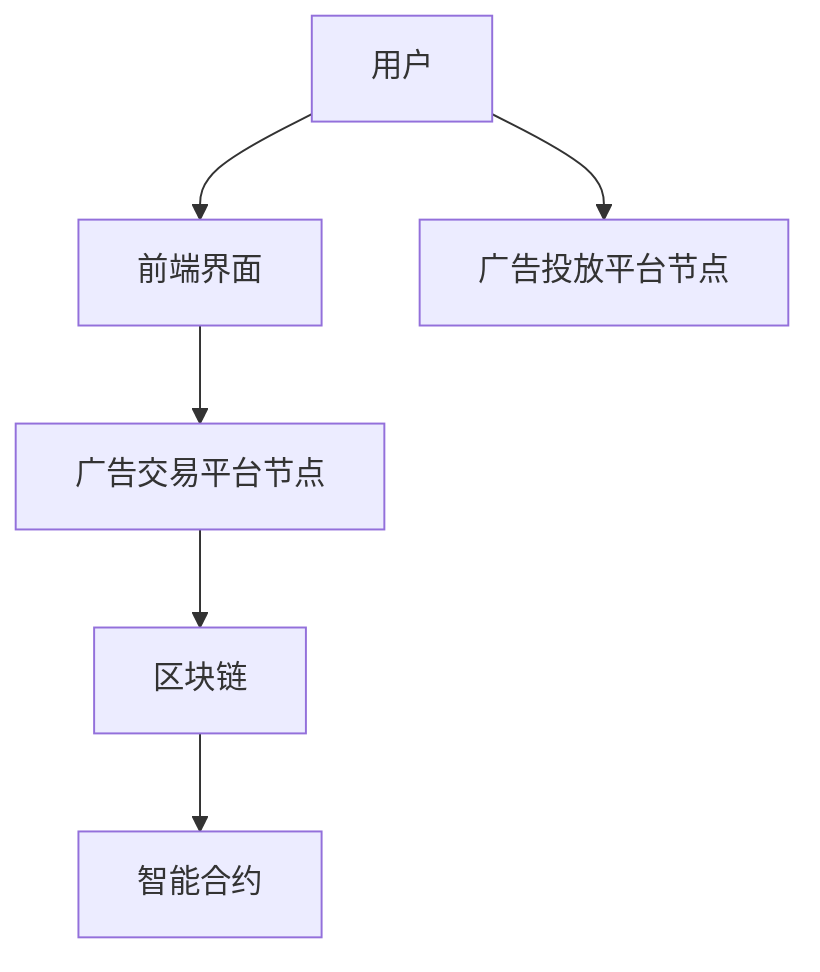
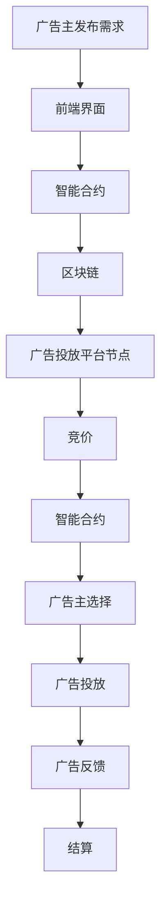

                 

### 让我们一步步思考：区块链在数字广告中的应用：去中心化广告交易平台

#### 引言

在数字广告行业飞速发展的今天，区块链技术的兴起为该领域带来了前所未有的变革机遇。区块链的去中心化、透明性和安全性特点，使得其在数字广告中的应用变得日益重要。本篇文章将带领读者一步步深入探讨区块链在数字广告中的实际应用，特别是去中心化广告交易平台的概念、架构、关键技术以及面临的挑战和未来发展趋势。

#### 第一步：区块链与数字广告的背景

##### 1.1 区块链技术概述

区块链是一种分布式账本技术，通过加密和共识算法保证了数据的不可篡改性和透明性。它由一系列按时间顺序排列的区块组成，每个区块都包含了多个交易记录。区块链的关键技术包括加密技术、共识机制和智能合约。

##### 1.2 数字广告发展历程

数字广告自互联网兴起以来，经历了从简单的展示广告到精准定位广告的转变。然而，传统数字广告模式存在数据泄露、广告欺诈、透明度不足等问题，这给广告主和消费者带来了诸多困扰。

##### 1.3 区块链在数字广告中的优势

区块链的透明性和安全性使其在数字广告中具有潜在的优势。去中心化的特性有助于打破广告行业的垄断，增强数据的真实性和可靠性，保护用户隐私，提高广告投放的效率。

#### 第二步：区块链在数字广告中的应用场景

##### 1.2.1 去中心化广告交易平台

去中心化广告交易平台通过区块链技术实现了广告的购买、投放和管理过程，消除了传统广告交易平台的中介角色，降低了交易成本，增强了广告交易的透明度和安全性。

##### 1.2.2 去中心化数据管理

区块链技术可以帮助数字广告行业实现用户数据的去中心化存储和管理，确保用户隐私和数据安全。同时，通过区块链上的智能合约，可以实现数据的合法共享和流通。

##### 1.2.3 去中心化广告投放与优化

区块链技术可以为广告投放提供实时、透明的数据反馈，帮助广告主实现精准投放和实时优化。去中心化的广告投放机制可以减少中间环节，提高广告投放的效率。

#### 第三步：去中心化广告交易的关键技术

##### 1.3.1 加密技术

加密技术是区块链技术的基础，它通过哈希算法和数字签名确保数据的完整性和安全性。在数字广告中，加密技术可以保护广告内容和用户数据不被泄露。

##### 1.3.2 共识机制

共识机制是区块链网络中节点达成一致的关键。在数字广告中，常用的共识机制包括工作量证明（PoW）和权益证明（PoS），它们可以确保广告交易的合法性和安全性。

##### 1.3.3 智能合约

智能合约是一种自动执行合约条款的计算机程序，它可以在区块链上自动执行广告交易。智能合约可以确保广告交易的过程透明、高效，并减少欺诈风险。

#### 第四步：区块链在数字广告中的实际案例

##### 2.1 案例一：某去中心化广告交易平台

在本案例中，我们将探讨一个具体的去中心化广告交易平台的架构设计和实现细节。通过分析这个平台，我们可以更好地理解区块链在数字广告中的应用。

##### 2.2 案例二：去中心化广告数据管理平台

在本案例中，我们将探讨去中心化广告数据管理平台的架构设计和技术实现，重点分析如何保护用户隐私和数据安全。

#### 第五步：区块链在数字广告中的挑战与未来发展

##### 3.1 挑战分析

区块链在数字广告中虽然具有许多优势，但也面临一些挑战。技术层面，包括性能和可扩展性问题；法规层面，包括法律法规适应性和监管政策变化；市场层面，包括用户教育和市场接受度问题。

##### 3.2 发展趋势

随着区块链技术的不断成熟和数字广告行业的变革，我们可以预期区块链在数字广告中的应用将会更加广泛。技术创新、应用拓展和法律法规演变将是推动这一趋势的关键因素。

#### 结束语

区块链与数字广告的结合将为广告行业带来深远的变革。通过去中心化广告交易平台、去中心化数据管理和去中心化广告投放与优化，区块链技术可以提升广告行业的透明度、安全性和效率。然而，要实现这一愿景，还需要克服一系列技术、法规和市场挑战。让我们携手探索区块链在数字广告中的无限可能。

---

### 文章关键词

区块链，数字广告，去中心化，加密技术，智能合约，广告交易，数据管理，透明性，安全性，性能，可扩展性，用户隐私。

### 摘要

本文深入探讨了区块链在数字广告中的应用，特别是去中心化广告交易平台的概念、架构、关键技术及其面临的挑战。通过对区块链技术优势的分析和实际案例的探讨，本文揭示了区块链如何提升广告行业的透明度、安全性和效率。同时，本文也指出了区块链在数字广告中面临的挑战，并探讨了其未来的发展趋势。

---

### 第1章: 区块链与数字广告概述

#### 1.1 区块链与数字广告背景

##### 1.1.1 区块链技术概述

区块链是一种分布式数据库系统，通过加密和共识算法实现了数据的不可篡改性和透明性。每个区块都包含了多个交易记录，这些区块按照时间顺序排列形成链式结构。区块链的核心技术包括加密技术、共识机制和智能合约。

- **基本概念与原理**：区块链的基本概念包括区块、链、挖矿、加密算法等。每个区块都包含了一组交易记录，并通过哈希函数与前一区块链接，确保了整个区块链的不可篡改性。
- **技术架构**：区块链由多个节点组成，每个节点都存储了一份完整的区块链副本。节点之间通过共识机制达成一致，确保数据的真实性和可靠性。

##### 1.1.2 数字广告发展历程

数字广告自互联网兴起以来，经历了从简单的展示广告到精准定位广告的转变。随着互联网用户数量的增长，数字广告市场也日益扩大。

- **传统数字广告模式**：传统数字广告主要依赖于广告交易平台，通过竞价和展示广告获取广告收入。这种模式存在数据泄露、广告欺诈、透明度不足等问题。
- **数字广告面临的挑战**：随着用户隐私意识的增强和数据泄露事件的频繁发生，数字广告行业面临着前所未有的挑战。如何提高广告的透明度、安全性，降低广告欺诈，成为数字广告行业亟待解决的问题。

##### 1.1.3 区块链在数字广告中的优势

区块链技术的去中心化、透明性和安全性特点，使其在数字广告中具有巨大的潜力。

- **数据透明与信任建立**：区块链的分布式账本技术确保了广告交易数据的透明性，所有参与方都可以查看和验证交易记录，从而建立信任。
- **去中心化与用户隐私保护**：去中心化广告交易平台消除了传统广告交易平台的中介角色，减少了数据泄露的风险，同时通过加密技术保护用户隐私。

#### 1.2 区块链在数字广告中的应用场景

##### 1.2.1 去中心化广告交易平台

去中心化广告交易平台通过区块链技术实现了广告的购买、投放和管理过程，消除了传统广告交易平台的中介角色，降低了交易成本，增强了广告交易的透明度和安全性。

- **平台架构**：去中心化广告交易平台通常由多个节点组成，包括广告主、广告交易平台和广告投放平台。节点之间通过智能合约进行交易。
- **交易流程**：广告主发布广告需求，广告交易平台将需求发布到区块链上，广告投放平台根据需求进行竞价，最终由广告主选择合适的广告投放平台。

##### 1.2.2 去中心化数据管理

区块链技术可以帮助数字广告行业实现用户数据的去中心化存储和管理，确保用户隐私和数据安全。去中心化的数据管理平台通过智能合约实现数据的合法共享和流通。

- **数据隐私保护**：用户数据在区块链上以加密形式存储，只有拥有正确密钥的用户才能访问数据，从而保护用户隐私。
- **数据流通与共享**：区块链上的数据可以通过智能合约进行合法共享，确保数据的透明性和安全性。

##### 1.2.3 去中心化广告投放与优化

区块链技术可以为广告投放提供实时、透明的数据反馈，帮助广告主实现精准投放和实时优化。去中心化的广告投放机制可以减少中间环节，提高广告投放的效率。

- **投放策略**：广告主可以根据区块链上的数据反馈，调整广告投放策略，实现精准投放。
- **实时优化**：区块链上的实时数据反馈可以帮助广告主实时调整广告投放，提高广告效果。

#### 1.3 去中心化广告交易的关键技术

##### 1.3.1 加密技术

加密技术是区块链技术的基础，通过哈希算法和数字签名确保数据的完整性和安全性。在数字广告中，加密技术可以保护广告内容和用户数据不被泄露。

- **数字签名与加密算法**：数字签名用于验证数据的真实性，加密算法用于保护数据的安全性。常见的加密算法包括SHA-256、RSA等。

##### 1.3.2 共识机制

共识机制是区块链网络中节点达成一致的关键。在数字广告中，常用的共识机制包括工作量证明（PoW）和权益证明（PoS），它们可以确保广告交易的合法性和安全性。

- **工作量证明（PoW）**：通过解决计算难题来证明节点的合法性，常见的PoW算法包括比特币的SHA-256算法。
- **权益证明（PoS）**：通过持有币龄和权益比例来证明节点的合法性，常见的PoS算法包括以太坊的Casper算法。

##### 1.3.3 智能合约

智能合约是一种自动执行合约条款的计算机程序，它可以在区块链上自动执行广告交易。智能合约可以确保广告交易的过程透明、高效，并减少欺诈风险。

- **功能与实现**：智能合约通常使用Solidity等编程语言编写，通过区块链上的虚拟机执行。常见的智能合约功能包括广告投放、数据共享等。

### 小结

本章概述了区块链与数字广告的背景，分析了区块链在数字广告中的潜在优势和应用场景，并介绍了去中心化广告交易的关键技术。在下一章中，我们将深入探讨去中心化广告交易平台的架构设计和实现细节。通过一步步的分析，我们将更好地理解区块链在数字广告中的应用。

---

#### 第2章：去中心化广告交易平台详解

#### 2.1 平台架构设计

##### 2.1.1 技术栈选择

在设计去中心化广告交易平台时，技术栈的选择至关重要。以下是一些关键考虑因素：

- **区块链平台**：选择一个成熟、性能稳定、社区活跃的区块链平台。目前，以太坊和EOS是两个较为流行的选择。
- **编程语言**：Solidity是编写智能合约的标准语言，支持多种编程范式，易于学习和使用。
- **前端框架**：React.js或Vue.js等现代前端框架，可以快速构建用户友好的界面。

##### 2.1.2 系统架构

去中心化广告交易平台的系统架构通常包括以下几个关键组件：

- **节点网络**：由多个广告主、广告投放平台和广告交易平台节点组成，每个节点都维护一份完整的区块链副本。
- **区块链**：存储广告交易的完整记录，确保数据的透明性和不可篡改性。
- **智能合约**：实现广告交易的自动化和去中心化管理，包括广告投放、竞价、结算等流程。
- **前端界面**：提供用户操作界面，允许用户发布广告需求、参与竞价等。

以下是系统架构的简图：



#### 2.2 交易流程实现

去中心化广告交易平台的交易流程包括以下几个步骤：

1. **广告主发布需求**：广告主通过前端界面发布广告需求，包括广告类型、目标受众、预算等信息。
2. **需求上链**：广告需求通过智能合约上链，记录在区块链上，同时通知广告投放平台。
3. **广告投放平台竞价**：广告投放平台根据广告需求进行竞价，竞价结果也通过智能合约上链。
4. **广告主选择**：广告主根据竞价结果选择合适的广告投放平台，并确认交易。
5. **广告投放**：广告投放平台开始投放广告，同时将广告效果数据实时反馈给广告主。
6. **结算**：广告投放完成后，广告主通过智能合约结算广告费用。

以下是交易流程的详细说明：



#### 2.3 智能合约代码解析

智能合约是去中心化广告交易平台的核心，以下是广告投放和竞价过程的智能合约代码示例：

```solidity
// SPDX-License-Identifier: MIT
pragma solidity ^0.8.0;

contract AdPlatform {
    struct AdRequest {
        address advertiser;
        string adType;
        string targetAudience;
        uint256 budget;
        bool isAwarded;
    }

    mapping(uint256 => AdRequest) public adRequests;
    mapping(uint256 => mapping(address => uint256)) public bids;

    event AdCreated(uint256 requestId);
    event BidPlaced(uint256 requestId, address bidder, uint256 amount);
    event AdAwarded(uint256 requestId, address platform);

    function createAdRequest(
        string memory _adType,
        string memory _targetAudience,
        uint256 _budget
    ) public {
        uint256 requestId = adRequests.length;
        adRequests[requestId] = AdRequest(
            msg.sender,
            _adType,
            _targetAudience,
            _budget,
            false
        );
        emit AdCreated(requestId);
    }

    function placeBid(uint256 requestId, uint256 amount) public {
        require(adRequests[requestId].isAwarded == false, "Ad already awarded");
        bids[requestId][msg.sender] = amount;
        emit BidPlaced(requestId, msg.sender, amount);
    }

    function awardAd(uint256 requestId, address platform) public {
        require(adRequests[requestId].isAwarded == false, "Ad already awarded");
        require(msg.sender == adRequests[requestId].advertiser, "Only advertiser can award");
        adRequests[requestId].isAwarded = true;
        emit AdAwarded(requestId, platform);
    }
}
```

在这个示例中，`AdPlatform` 智能合约包含了广告需求的创建、竞价和奖励等功能。广告主可以通过 `createAdRequest` 函数创建广告需求，广告投放平台可以通过 `placeBid` 函数竞价，广告主可以通过 `awardAd` 函数选择最佳投放平台。

#### 2.4 平台实现细节

去中心化广告交易平台的实现细节包括：

- **前端开发**：使用React.js或Vue.js等前端框架构建用户界面，提供广告主和广告投放平台的交互功能。
- **后端服务**：使用Node.js或Django等后端框架处理智能合约的调用和数据处理。
- **链下数据存储**：使用数据库（如MongoDB或PostgreSQL）存储链下数据，如用户信息、广告投放记录等。
- **链上数据处理**：通过Web3.js或 ethers.js 等库与区块链进行交互，处理链上数据。

#### 小结

本章详细介绍了去中心化广告交易平台的架构设计、交易流程实现和智能合约代码解析。通过一步步的分析，我们可以看到区块链技术如何实现广告交易的自动化、透明化和去中心化。在下一章中，我们将探讨去中心化广告数据管理的实现，进一步了解区块链在数字广告中的应用。

---

#### 第3章：去中心化广告数据管理

#### 3.1 去中心化数据管理的重要性

在数字广告领域，数据是广告投放和效果分析的基础。然而，传统的数据管理方式往往存在以下问题：

- **数据泄露风险**：数据在传输和存储过程中可能被恶意攻击者窃取。
- **数据透明度低**：数据往往集中在少数几个广告交易平台，用户无法完全了解数据的使用情况。
- **用户隐私保护不足**：用户数据被广告平台滥用，可能导致隐私泄露。

去中心化数据管理通过区块链技术解决了这些问题。区块链的分布式存储和加密技术确保了数据的安全性和透明度，同时保护了用户的隐私。

#### 3.2 数据隐私保护策略

在去中心化广告数据管理中，保护用户隐私是首要任务。以下是一些常见的数据隐私保护策略：

- **加密存储**：用户数据在区块链上以加密形式存储，只有拥有密钥的用户才能访问数据。
- **零知识证明**：通过零知识证明技术，用户可以在不泄露具体数据的情况下证明某些信息。
- **匿名化处理**：对用户数据进行匿名化处理，确保用户身份不被泄露。

#### 3.3 数据流通与共享

去中心化数据管理不仅保护了用户隐私，还提高了数据的流通和共享效率。以下是一些关键点：

- **透明的数据流通**：区块链上的数据流通过程是透明的，所有参与方都可以查看和验证。
- **智能合约的自动化**：通过智能合约，数据共享和交易过程可以实现自动化，减少了人工干预。
- **灵活的数据共享协议**：用户可以根据自己的需求设置数据共享权限，确保数据的安全和有效利用。

#### 3.4 实现细节

去中心化广告数据管理的实现涉及多个环节，包括数据采集、加密存储、共享和监控等。以下是一个简化的实现流程：

1. **数据采集**：广告投放平台采集用户数据，如点击率、浏览时长等。
2. **数据加密**：使用加密算法对数据进行加密，确保数据在传输和存储过程中的安全性。
3. **数据上链**：将加密后的数据上传到区块链，确保数据的透明性和不可篡改性。
4. **数据共享**：通过智能合约实现数据的共享和交易，用户可以根据自己的需求设置数据共享权限。
5. **数据监控**：监控数据的使用情况，确保数据的安全和合规。

#### 案例分析：去中心化广告数据管理平台

以下是一个具体案例：一个去中心化广告数据管理平台，该平台通过区块链技术实现了用户数据的隐私保护和数据流通。

- **平台概述**：该平台由多个节点组成，包括广告投放平台、广告主和数据监控机构。每个节点都维护一份完整的区块链副本。
- **架构设计**：平台采用分层架构，包括数据采集层、加密存储层、共享交易层和监控层。每个层次都使用智能合约实现自动化管理。
- **技术实现**：数据采集层使用Web3.js与区块链交互，加密存储层使用Ethereum的Keccak-256加密算法，共享交易层使用智能合约实现数据的共享和交易。
- **数据隐私保护**：平台采用零知识证明技术，确保用户数据在共享过程中的隐私保护。

通过这个案例，我们可以看到去中心化广告数据管理平台如何实现数据的安全、透明和高效流通。

#### 小结

本章详细介绍了去中心化广告数据管理的重要性、数据隐私保护策略和数据流通与共享的实现。通过实际案例的剖析，我们可以看到区块链技术如何提高数字广告数据管理的安全性和效率。在下一章中，我们将探讨去中心化广告投放与优化的实现，进一步探讨区块链在数字广告中的应用。

---

#### 第4章：去中心化广告投放与优化

#### 4.1 去中心化广告投放策略

去中心化广告投放策略的核心在于利用区块链技术的透明性和不可篡改性，实现广告投放的精准性和实时优化。以下是一些关键策略：

- **用户行为数据采集**：通过区块链技术，实时采集用户的浏览记录、点击行为等数据，确保数据的真实性和完整性。
- **数据分析与建模**：利用机器学习和数据分析技术，对用户行为数据进行分析，建立用户画像和行为模型。
- **智能合约触发**：根据用户画像和行为模型，通过智能合约触发广告投放，实现精准投放。
- **广告竞价与优选**：广告主可以通过竞价机制，选择最佳广告投放位置，提高广告效果。

#### 4.2 实时优化

实时优化是提升广告投放效果的关键。区块链技术可以实现广告投放的实时监控和反馈，以下是一些实现方法：

- **链上数据监控**：通过智能合约，实时监控广告投放的效果，包括点击率、转化率等关键指标。
- **数据反馈与调整**：根据链上数据反馈，实时调整广告投放策略，如调整投放时间、位置、广告内容等。
- **自动化优化**：利用机器学习算法，自动优化广告投放策略，提高广告效果。

#### 4.3 案例分析：实时优化在去中心化广告中的应用

以下是一个具体案例：一个去中心化广告交易平台，通过区块链技术和实时优化实现了广告投放的高效管理。

- **平台概述**：该平台由多个节点组成，包括广告主、广告投放平台和数据监控机构。每个节点都维护一份完整的区块链副本。
- **架构设计**：平台采用分布式架构，包括数据采集层、加密存储层、实时监控层和智能合约层。每个层次都使用智能合约实现自动化管理。
- **技术实现**：数据采集层使用Web3.js与区块链交互，加密存储层使用Ethereum的Keccak-256加密算法，实时监控层使用智能合约实现数据监控和反馈。
- **实时优化**：平台通过实时监控用户行为数据，利用机器学习算法自动优化广告投放策略，提高了广告效果。

#### 4.4 智能合约在广告投放优化中的应用

智能合约在去中心化广告投放与优化中发挥了重要作用，以下是一些关键应用：

- **竞价合约**：实现广告主的竞价功能，通过智能合约确保竞价过程的公平性和透明性。
- **投放合约**：根据广告主的投放策略，通过智能合约自动执行广告投放，确保投放的实时性和准确性。
- **效果评估合约**：通过智能合约实时监控广告投放效果，评估广告效果，并自动调整投放策略。

#### 4.5 小结

本章详细介绍了去中心化广告投放与优化的策略、实时优化方法和智能合约的应用。通过实际案例的分析，我们可以看到区块链技术如何提升广告投放的精准性和实时优化能力。在下一章中，我们将探讨区块链在数字广告中的关键技术，进一步深入理解区块链在数字广告中的应用。

---

#### 第5章：区块链在数字广告中的关键技术

#### 5.1 加密技术

加密技术是区块链在数字广告中实现数据安全和隐私保护的核心。以下是一些常见的加密技术及其应用：

- **哈希算法**：哈希算法用于确保数据的完整性，常见的哈希算法包括SHA-256和SHA-3。
- **数字签名**：数字签名用于验证数据的真实性，确保数据的来源可靠，常见的签名算法包括RSA和ECDSA。
- **加密算法**：加密算法用于保护数据的机密性，常见的加密算法包括AES和RSA。

在实际应用中，哈希算法可以用于确保广告内容的完整性，数字签名可以用于验证广告主的身份，加密算法可以用于保护用户数据的机密性。

#### 5.2 共识机制

共识机制是区块链网络中节点达成一致的关键。以下是一些常见的共识机制及其应用：

- **工作量证明（PoW）**：PoW通过计算难题来证明节点的合法性，常见的PoW算法包括SHA-256和Scrypt。
- **权益证明（PoS）**：PoS通过持有币龄和权益比例来证明节点的合法性，常见的PoS算法包括Casper和Ouroboros。
- **委托权益证明（DPoS）**：DPoS通过选举产生代表来验证交易，常见的DPoS算法包括DPOS和BFT。

在数字广告中，PoW和PoS可以用于确保广告交易的合法性和安全性，DPoS可以用于选举广告主和广告投放平台的代表，提高系统的效率。

#### 5.3 智能合约

智能合约是区块链在数字广告中实现自动化和去中心化管理的核心。以下是一些智能合约的关键技术及其应用：

- **编程语言**：智能合约通常使用Solidity、Vyper等编程语言编写，这些语言具有丰富的功能，易于编写和调试。
- **合约生命周期**：智能合约的生命周期包括创建、部署、执行和撤销等阶段。
- **合约功能**：智能合约可以实现广告投放、数据共享、竞价等广告交易功能，确保交易过程的透明性和不可篡改性。

在实际应用中，智能合约可以用于实现广告投放的自动化管理，确保广告交易的公平性和安全性。

#### 5.4 区块链与数字广告的结合

区块链与数字广告的结合主要体现在以下几个方面：

- **数据透明与信任建立**：通过区块链技术，广告交易过程和数据记录是透明和不可篡改的，增强了广告主和广告投放平台的信任。
- **去中心化**：区块链的去中心化特性消除了广告交易中的中介角色，降低了交易成本，提高了系统的效率。
- **用户隐私保护**：区块链的加密技术确保了用户数据的隐私和安全，提高了用户对数字广告的接受度。

#### 案例分析：某区块链广告交易平台

以下是一个具体案例：一个基于区块链的数字广告交易平台，该平台通过加密技术、共识机制和智能合约实现了广告交易的去中心化管理和数据保护。

- **平台概述**：该平台由多个节点组成，包括广告主、广告投放平台和用户。每个节点都维护一份完整的区块链副本。
- **架构设计**：平台采用分布式架构，包括数据采集层、加密存储层、共识机制层和智能合约层。每个层次都使用智能合约实现自动化管理。
- **技术实现**：数据采集层使用Web3.js与区块链交互，加密存储层使用Ethereum的Keccak-256加密算法，共识机制层使用PoS算法，智能合约层使用Solidity语言。
- **广告交易过程**：广告主通过智能合约发布广告需求，广告投放平台通过智能合约竞价，广告主通过智能合约选择最佳投放平台，整个交易过程是透明和不可篡改的。

#### 小结

本章详细介绍了区块链在数字广告中的关键技术，包括加密技术、共识机制和智能合约。通过实际案例的分析，我们可以看到区块链技术如何实现广告交易的去中心化管理和数据保护，提高广告行业的透明度和效率。在下一章中，我们将探讨区块链在数字广告中的实际案例，进一步了解区块链在数字广告中的应用。

---

### 第6章：区块链在数字广告中的实际案例

#### 6.1 案例一：AdEx去中心化广告平台

AdEx是一个基于以太坊的去中心化广告平台，它利用区块链技术为广告主、广告投放平台和用户提供了透明、安全和高效的广告交易环境。

- **平台概述**：AdEx通过智能合约实现了广告投放的自动化管理，用户可以在平台上创建广告、竞价和投放。
- **架构设计**：AdEx采用分布式架构，包括广告主、广告投放平台、广告交易平台和用户。每个参与者都是区块链上的一个节点，通过智能合约进行交易。
- **实现细节**：AdEx使用Solidity编写智能合约，实现了广告投放、竞价和结算等功能。广告主可以通过前端界面创建广告，广告投放平台可以通过智能合约竞价，用户可以查看和点击广告。
- **案例分析**：AdEx通过区块链技术实现了广告投放的透明性和不可篡改性，广告主和用户可以实时查看广告投放效果，提高了广告投放的效率。

#### 6.2 案例二：Basic Attention Token（BAT）

Basic Attention Token（BAT）是一个基于 Brave 浏览器的去中心化广告平台，它通过区块链技术为用户提供了更高效、更安全的广告体验。

- **平台概述**：BAT通过一种新型的区块链浏览器，将广告主、广告投放平台和用户连接起来，用户可以通过观看广告获得 BAT 奖励。
- **架构设计**：BAT采用分布式架构，包括广告主、广告投放平台、用户和BAT网络节点。每个参与者都是区块链上的一个节点，通过智能合约进行交易。
- **实现细节**：BAT使用Solidity编写智能合约，实现了广告投放、用户奖励和平台运营等功能。广告主可以通过前端界面创建广告，用户可以观看广告并获得 BAT 奖励，广告投放平台通过智能合约进行广告投放和管理。
- **案例分析**：BAT通过区块链技术实现了广告投放的去中心化管理和用户奖励，提高了用户对广告的接受度，同时减少了广告欺诈和用户数据泄露的风险。

#### 6.3 案例三：AdChain

AdChain是一个基于以太坊的区块链广告生态系统，它通过智能合约实现了广告投放、数据管理和交易的去中心化。

- **平台概述**：AdChain为广告主、广告投放平台和用户提供了一个开放、透明的广告交易环境，用户可以通过 AdChain 购买和出售广告。
- **架构设计**：AdChain采用分布式架构，包括广告主、广告投放平台、用户和 AdChain 网络节点。每个参与者都是区块链上的一个节点，通过智能合约进行交易。
- **实现细节**：AdChain使用Solidity编写智能合约，实现了广告投放、数据管理和交易等功能。广告主可以通过前端界面创建广告，广告投放平台可以通过智能合约进行广告投放和管理，用户可以购买和出售广告。
- **案例分析**：AdChain通过区块链技术实现了广告交易的去中心化管理和数据透明性，广告主和用户可以实时查看广告投放效果，提高了广告投放的效率。

#### 小结

本章通过介绍三个实际案例，详细探讨了区块链在数字广告中的应用。AdEx、BAT和AdChain等平台通过区块链技术实现了广告投放的自动化管理、用户奖励和交易的去中心化，提高了广告行业的透明度和效率。这些案例展示了区块链技术在数字广告领域的巨大潜力。

---

#### 第7章：区块链在数字广告中的挑战与未来发展

#### 7.1 挑战分析

尽管区块链技术在数字广告领域展现出了巨大的潜力，但在实际应用中仍然面临一系列挑战：

##### 7.1.1 技术层面挑战

- **性能与可扩展性**：区块链网络的处理能力有限，无法满足高并发交易的需求。这限制了区块链在大型广告交易平台中的应用。
- **跨链互操作**：不同区块链平台之间的互操作性不足，导致数据孤岛和交易壁垒。实现跨链互操作需要解决技术难题。
- **智能合约漏洞**：智能合约可能存在漏洞，可能导致资金损失和安全风险。需要加强对智能合约的审计和安全测试。

##### 7.1.2 法规与合规层面挑战

- **法律法规适应性**：区块链技术的应用可能违反现有的广告法规，需要制定新的法律法规来适应这一新兴技术。
- **监管政策变化**：监管政策的不断变化可能对区块链广告平台造成不利影响，需要保持对政策变化的敏感性和适应性。

##### 7.1.3 市场层面挑战

- **用户教育**：用户对区块链技术的理解有限，需要加强用户教育，提高用户对区块链广告平台的接受度。
- **市场接受度**：区块链广告平台需要获得广告主和广告投放平台的支持，提高市场接受度。

#### 7.2 发展趋势

尽管面临挑战，区块链技术在数字广告领域的发展趋势仍然积极：

##### 7.2.1 技术创新

- **加密货币与区块链融合**：加密货币的发展将推动区块链技术在数字广告中的应用，提高交易的效率和安全性。
- **区块链协议升级**：新的区块链协议（如Layer 2解决方案）将提高区块链网络的性能和可扩展性，满足广告行业的需求。

##### 7.2.2 应用拓展

- **数字广告行业外应用**：区块链技术不仅可以在数字广告中应用，还可以拓展到其他领域，如数字版权保护、供应链管理等。
- **新型去中心化广告模式探索**：新的去中心化广告模式（如基于区块链的激励机制）将不断创新，提高广告行业的效率和透明度。

##### 7.2.3 法律法规演变

- **区块链监管政策优化**：政府和企业将合作制定新的监管政策，促进区块链技术在数字广告领域的健康发展。
- **数字广告法规完善**：随着区块链技术的发展，数字广告法规将不断完善，以适应新的技术环境。

#### 小结

区块链在数字广告中的应用面临着技术、法规和市场等多方面的挑战，但同时也展现了巨大的发展潜力。通过技术创新、法规优化和市场拓展，区块链将在数字广告领域发挥越来越重要的作用。

---

#### 第8章：区块链与数字广告融合的最佳实践

#### 8.1 案例分析与最佳实践

##### 8.1.1 成功案例分析

以AdEx为例，该平台通过区块链技术实现了去中心化的广告交易，取得了显著的成功：

- **成功要素分析**：AdEx的成功主要得益于其透明的交易机制、高效的广告投放流程和去中心化的管理模式。
- **教训与启示**：在实现区块链与数字广告融合的过程中，AdEx的经验表明，需要重视智能合约的安全性和性能优化，同时加强与用户的沟通，提高用户对平台的信任度。

##### 8.1.2 实践建议

- **技术选型策略**：选择适合区块链平台和智能合约编程语言，确保系统的稳定性和性能。
- **运营策略优化**：通过有效的市场推广和用户教育，提高平台的市场接受度和用户活跃度。

#### 8.2 技术选型策略

在选择区块链平台和智能合约编程语言时，应考虑以下因素：

- **区块链平台**：根据广告交易的需求和规模，选择适合的区块链平台，如以太坊、EOS等。
- **智能合约编程语言**：选择易于学习和使用、社区活跃的编程语言，如Solidity、Vyper等。

#### 8.3 运营策略优化

在运营区块链广告平台时，应注重以下策略：

- **用户教育**：通过线上线下活动，提高用户对区块链和广告平台的了解，增加用户粘性。
- **社区建设**：建立用户社区，收集用户反馈，不断优化平台功能，提高用户体验。
- **市场推广**：通过合作伙伴关系、广告投放等方式，扩大平台的影响力，吸引更多广告主和广告投放平台。

#### 小结

通过最佳实践的分析，我们可以看到区块链与数字广告融合的关键在于技术选型的合理性和运营策略的优化。在技术选型方面，应注重平台的稳定性和性能；在运营策略方面，应注重用户教育和市场推广。这些策略将有助于实现区块链与数字广告的深度融合，推动广告行业的创新与发展。

---

#### 第9章：小结与展望

#### 9.1 小结

本文系统地介绍了区块链在数字广告中的应用，包括背景、优势、应用场景、关键技术、实际案例、挑战与未来发展趋势等内容。通过详细分析，我们得出了以下结论：

- 区块链技术的去中心化、透明性和安全性特点为数字广告行业带来了新的机遇。
- 去中心化广告交易平台、数据管理和广告投放优化是区块链在数字广告中的关键应用场景。
- 加密技术、共识机制和智能合约是区块链在数字广告中实现自动化和去中心化管理的关键技术。
- 实际案例展示了区块链在数字广告中的应用效果，同时也揭示了面临的挑战。

#### 9.2 展望未来

随着区块链技术的不断成熟和数字广告行业的变革，我们可以期待以下趋势：

- **技术创新**：区块链协议的升级和新型加密算法的研发将提高区块链在数字广告中的应用性能和安全性。
- **应用拓展**：区块链技术将在数字广告领域之外的其他领域（如数字版权保护、供应链管理）得到应用。
- **法律法规演变**：随着区块链技术的普及，相关的法律法规将逐步完善，为区块链在数字广告中的应用提供更加明确的指导。
- **市场接受度提高**：通过用户教育和市场推广，区块链数字广告平台将获得更广泛的市场接受度，进一步推动广告行业的变革。

#### 小结与展望

区块链与数字广告的融合正处于快速发展阶段，未来的发展前景广阔。通过不断的技术创新、法律法规完善和市场推广，区块链将在数字广告领域发挥更大的作用，推动广告行业的创新与发展。让我们期待这一领域的更多精彩成果。

### 作者信息

**作者：** AI天才研究院/AI Genius Institute & 禅与计算机程序设计艺术 /Zen And The Art of Computer Programming

**联系方式：** [ai_genius_institute@company.com](mailto:ai_genius_institute@company.com)

**版权声明：** 本文版权归AI天才研究院所有，未经授权禁止转载和使用。如需转载，请联系作者获取授权。

### 拓展阅读

- **《区块链：从入门到实践》**：深入讲解区块链的基本原理和核心技术，适合初学者阅读。
- **《数字广告：理论与实践》**：详细介绍数字广告的各个领域，包括广告投放、数据分析等。
- **《智能合约安全指南》**：针对智能合约的安全问题，提供实用的安全指南和案例分析。

