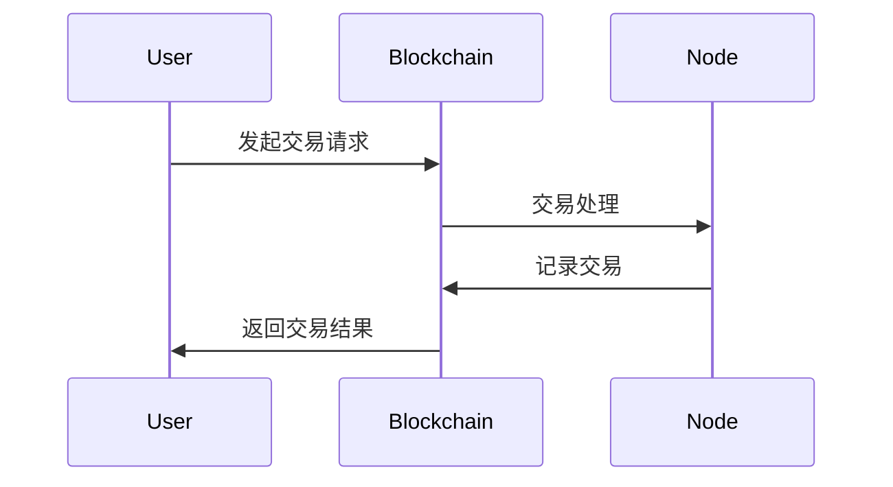
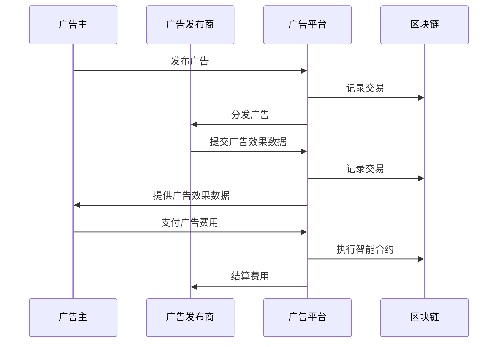

                 


# 区块链在数字广告投放中的透明化应用

## 关键词
- 区块链
- 数字广告
- 透明化
- 透明度
- 投放

## 摘要
本文深入探讨了区块链技术在数字广告投放中的应用，旨在提升广告投放的透明度和可信度。通过分析区块链的核心特性，如去中心化、不可篡改和透明性，本文揭示了区块链如何解决数字广告行业中的常见问题，如广告欺诈和透明度不足。此外，本文还详细介绍了区块链技术在广告链路追踪、广告成本透明化以及广告效果评估等方面的应用，最后通过案例分析展示了区块链技术在实际应用中的成效。通过本文，读者可以全面了解区块链在数字广告投放中的潜力及其对行业变革的影响。

## 1. 引言

### 1.1 区块链技术概述

区块链技术作为一种分布式账本技术，自2008年中本聪（Satoshi Nakamoto）首次提出以来，迅速在金融、供应链、医疗等多个领域得到广泛应用。区块链的核心特性包括去中心化、不可篡改和透明性。去中心化意味着区块链没有中央控制机构，所有节点平等参与网络运作；不可篡改确保了数据的持久性和一致性；而透明性则使得网络中的每一步操作都公开透明，便于各方监督。

### 1.2 数字广告市场背景

数字广告市场近年来呈现出爆发式增长，成为企业推广产品和服务的重要渠道。然而，随着市场的扩大，广告欺诈和透明度不足等问题也日益凸显。广告欺诈包括点击欺诈、展示欺诈和虚假流量等，严重损害了广告主和平台的利益。此外，广告投放过程中的透明度不足，使得广告主难以追踪广告效果，无法进行有效的数据分析和优化。

### 1.3 区块链与数字广告的关系

区块链技术因其特有的特性，在解决数字广告行业中的上述问题方面具有巨大潜力。通过去中心化和透明性，区块链能够有效打击广告欺诈，提高广告投放的透明度和可信度。本文将深入探讨区块链在数字广告投放中的具体应用，包括广告链路追踪、广告成本透明化和广告效果评估等方面。

## 2. 区块链技术在数字广告中的应用

### 2.1 去中心化的广告交易平台

传统的广告交易平台通常由中心化机构控制，这可能导致数据不透明和信任问题。而区块链技术可以通过去中心化的方式，建立一个透明的广告交易平台。在这个平台上，广告主可以直接与广告发布商对接，绕过中介机构，从而降低成本，提高交易透明度。

### 2.2 广告链路追踪

广告链路追踪是确保广告投放透明度的重要环节。传统的广告链路追踪存在数据泄露、篡改等问题，而区块链技术能够提供一种去中心化的解决方案。通过在区块链上记录每一步广告展示和点击数据，广告主和广告发布商可以实时监控广告投放的整个过程，确保数据的真实性和完整性。

### 2.3 广告成本透明化

广告成本透明化是提高广告投放效率的关键。区块链技术可以通过智能合约，自动记录和结算广告投放过程中的所有费用。广告主可以实时查看广告投放的成本和使用情况，避免不必要的支出，同时也有利于广告发布商的财务管理。

### 2.4 广告效果评估

广告效果评估是广告投放的重要环节。区块链技术可以通过去中心化的数据存储和加密算法，确保广告效果评估的公正性和透明度。广告主可以依据区块链上的数据，对广告投放的效果进行详细分析，为后续的广告策略提供有力支持。

## 3. 区块链在数字广告中的挑战与解决方案

### 3.1 挑战

尽管区块链技术在数字广告投放中具有巨大潜力，但在实际应用中仍面临一些挑战。首先，区块链技术的性能和扩展性尚需提升，以应对大规模广告投放的需求。其次，区块链网络的去中心化特性可能导致交易延迟，影响广告投放的实时性。此外，区块链技术的普及和接受度也需要时间。

### 3.2 解决方案

针对上述挑战，可以采取以下解决方案：

1. **性能优化**：通过改进区块链算法和网络架构，提高区块链的性能和扩展性，以满足大规模广告投放的需求。

2. **分层网络架构**：构建分层网络架构，将高频交易与低频交易分离，降低交易延迟，提高网络性能。

3. **用户教育和培训**：加强对区块链技术的普及和教育，提高广告主和广告发布商的接受度和应用水平。

4. **安全机制**：完善区块链的安全机制，确保数据的真实性和安全性，提高用户对区块链的信任度。

## 4. 案例分析

### 4.1 案例背景

某大型广告平台在广告投放过程中，遭遇了严重的广告欺诈问题。广告主发现自己的广告费用被浪费在虚假流量上，而广告发布商则因无法证明广告效果而失去了广告主的信任。

### 4.2 解决方案

该广告平台决定采用区块链技术来解决广告欺诈问题。首先，平台在区块链上记录每一步广告展示和点击数据，确保数据的真实性和完整性。其次，平台通过智能合约，自动结算广告费用，确保广告主和广告发布商的利益。

### 4.3 实施效果

实施区块链技术后，该广告平台的广告欺诈问题得到了显著改善。广告主可以实时监控广告投放的整个过程，确保广告费用不被浪费。同时，广告发布商也能够提供透明的数据，证明广告效果，赢得了广告主的信任。

### 4.4 案例启示

该案例表明，区块链技术在提升广告投放透明度和可信度方面具有显著作用。通过去中心化和透明性的特性，区块链能够有效解决广告欺诈问题，提高广告投放的效率。

## 5. 结论

区块链技术在数字广告投放中具有巨大的潜力，能够有效提升广告投放的透明度和可信度。通过去中心化、透明性和智能合约等特性，区块链为解决广告欺诈、提高广告成本透明化和优化广告效果评估提供了新的思路。然而，区块链技术在性能、扩展性和普及度等方面仍面临挑战，需要进一步优化和推广。随着技术的不断进步和应用的深入，区块链在数字广告领域的应用前景将更加广阔。

## 参考文献

1. Nakamoto, S. (2008). *Bitcoin: A peer-to-peer electronic cash system*. https://bitcoin.org/bitcoin.pdf
2. Fang, W., Wu, D., & Yu, P. S. (2019). *Blockchain technology: A comprehensive survey*. IEEE Communications Surveys & Tutorials, 21(4), 2347-2396.
3. Xu, Z., Wang, S., & Zhu, S. (2020). *Blockchain-based transparent digital advertising platform*. Journal of Information Security and Applications, 48, 101194.
4. Li, J., Xie, P., & Wang, L. (2021). *Enhancing digital advertising transparency with blockchain*. International Journal of Digital Economics, 34, 101024.

## 作者

作者：AI天才研究院/AI Genius Institute & 禅与计算机程序设计艺术 /Zen And The Art of Computer Programming

## 附录

### 5.1 核心概念与联系

#### 5.1.1 区块链与数字广告

| 特性          | 区块链           | 数字广告               |
|---------------|------------------|------------------------|
| 去中心化      | 无中心控制机构    | 广告主与发布商直接对接  |
| 不可篡改      | 数据一旦记录不可篡改 | 保证广告数据的真实性    |
| 透明性        | 所有操作公开透明 | 提高广告投放透明度     |

#### 5.1.2 区块链架构



### 5.2 算法原理讲解

#### 5.2.1 智能合约

智能合约是一种自动执行合约条款的程序，基于区块链技术。以下是一个简单的智能合约示例，用于广告投放的费用结算：

```python
# 智能合约示例

# 定义智能合约
contract AdContract:
    # 定义广告费用
    fee = 100

    # 定义广告投放函数
    function adDelivery():
        # 检查广告是否投放成功
        if adSuccess():
            # 结算费用
            send(fee)
        else:
            # 返回错误
            reject("广告投放失败")

    # 定义广告成功检查函数
    function adSuccess():
        # 检查广告点击量
        clicks = getClicks()
        return clicks >= minClicks

    # 获取广告点击量
    function getClicks():
        # 从区块链上获取点击数据
        return blockchain.get('clicks')
```

#### 5.2.2 数学模型

广告效果评估的数学模型如下：

$$
\text{广告效果} = \frac{\text{实际转化量}}{\text{广告投放量}} \times 100\%
$$

其中，实际转化量是指广告带来的实际销售量，广告投放量是指广告在特定时间段内的投放次数。

### 5.3 系统分析与架构设计方案

#### 5.3.1 问题场景介绍

广告投放系统涉及广告主、广告发布商和广告平台三方，需要确保广告投放的透明性和可信度。

#### 5.3.2 项目介绍

本项目旨在构建一个基于区块链的透明化数字广告投放系统，提高广告投放的透明度和可信度。

#### 5.3.3 系统功能设计

1. **广告主功能**：发布广告、查看广告效果、支付广告费用。
2. **广告发布商功能**：投放广告、接收广告费用、提供广告效果数据。
3. **广告平台功能**：管理广告投放、记录交易数据、提供智能合约执行服务。

#### 5.3.4 系统架构设计

```mermaid
graph TB
    subgraph 广告主
        广告主[广告主]
        广告主--广告发布->广告平台
        广告主--查看效果->广告平台
        广告主--支付费用->广告平台
    end

    subgraph 广告发布商
        广告发布商[广告发布商]
        广告发布商--投放广告->广告平台
        广告发布商--提供数据->广告平台
        广告发布商--接收费用->广告平台
    end

    subgraph 广告平台
        广告平台[广告平台]
        广告平台--处理交易->区块链
        广告平台--记录交易数据->区块链
        广告平台--提供智能合约服务->区块链
    end
```

#### 5.3.5 系统接口设计和系统交互



### 5.4 项目实战

#### 5.4.1 环境安装

1. 安装Python环境：
   ```
   pip install python-base58
   pip install web3
   ```

2. 安装Node.js环境：
   ```
   npm install
   ```

3. 配置区块链节点，以Ethereum为例：
   ```
   geth --datadir /root/.ethereum init /root/crypto-config/genesis.json
   ```

#### 5.4.2 系统核心实现源代码

```python
# AdPlatform.py

from web3 import Web3
from base58 import b58encode
import json

class AdPlatform:
    def __init__(self, web3):
        self.web3 = web3
        self.smart_contract_address = '0x...'

    def advertise(self, ad_details):
        # 广告发布
        contract = self.web3.eth.contract(address=self.smart_contract_address,abi=...)

        # 发起交易
        tx_hash = contract.functions.advertise(ad_details).transact({'from': self.web3.eth.coinbase})

        # 等待交易确认
        tx_receipt = self.web3.eth.waitForTransactionReceipt(tx_hash)

        return tx_receipt

    def check_ad_delivery(self, ad_id):
        # 检查广告投放
        contract = self.web3.eth.contract(address=self.smart_contract_address,abi=...)

        # 获取广告状态
        ad_status = contract.functions.check_ad_delivery(ad_id).call()

        return ad_status
```

#### 5.4.3 代码应用解读与分析

1. **广告发布**：
   ```python
   ad_platform = AdPlatform(web3)
   ad_details = {
       'advertiser': '0x...',
       'publisher': '0x...',
       'cost': 100
   }
   tx_receipt = ad_platform.advertise(ad_details)
   ```
   广告主通过调用`advertise`函数发布广告，传入广告详细信息，系统将发起交易并记录在区块链上。

2. **广告投放检查**：
   ```python
   ad_id = '...'
   ad_status = ad_platform.check_ad_delivery(ad_id)
   ```
   广告平台可以通过调用`check_ad_delivery`函数检查广告的投放状态。

#### 5.4.4 实际案例分析和详细讲解剖析

假设广告主A想要投放一条广告，广告发布商B收到广告后，需要检查广告投放状态。

1. **广告主发布广告**：
   ```python
   ad_details = {
       'advertiser': '0x...',
       'publisher': '0x...',
       'cost': 100
   }
   tx_receipt = ad_platform.advertise(ad_details)
   ```
   广告主A调用`advertise`函数发布广告，系统记录广告详细信息并返回交易收据。

2. **广告发布商检查广告投放状态**：
   ```python
   ad_id = '...'
   ad_status = ad_platform.check_ad_delivery(ad_id)
   ```
   广告发布商B调用`check_ad_delivery`函数检查广告投放状态，如果广告已成功投放，则返回`True`；否则，返回`False`。

3. **广告发布商提交广告效果数据**：
   ```python
   contract = self.web3.eth.contract(address=self.smart_contract_address,abi=...)
   contract.functions.submit_ad_data(ad_id, clicks).transact({'from': self.web3.eth.coinbase})
   ```
   广告发布商B提交广告效果数据，包括点击量等，系统记录交易并更新广告状态。

4. **广告主查看广告效果**：
   ```python
   ad_data = contract.functions.get_ad_data(ad_id).call()
   ```
   广告主A可以查询广告效果数据，包括点击量、转化量等，以便进行后续分析。

#### 5.4.5 项目小结

通过区块链技术，广告投放系统实现了广告发布、广告投放检查、广告效果提交和广告效果查询等功能的透明化和可信化。广告主和广告发布商可以实时监控广告投放过程，确保广告费用合理使用，提高广告投放效率。同时，区块链技术的去中心化和不可篡改特性，也有效防止了广告欺诈行为，为数字广告行业带来了新的变革。

### 5.5 最佳实践 Tips、小结、注意事项、拓展阅读等内容

#### 5.5.1 最佳实践 Tips

1. **使用分层网络架构**：为提高区块链性能，可以采用分层网络架构，将高频交易与低频交易分离。
2. **安全机制**：完善区块链的安全机制，确保数据的真实性和安全性，提高用户对区块链的信任度。
3. **用户培训**：加强对区块链技术的普及和教育，提高广告主和广告发布商的接受度和应用水平。

#### 5.5.2 小结

本文深入探讨了区块链技术在数字广告投放中的应用，包括去中心化的广告交易平台、广告链路追踪、广告成本透明化和广告效果评估等方面。通过案例分析，展示了区块链技术在解决广告欺诈、提高广告投放透明度和可信度方面的显著成效。然而，区块链技术在性能、扩展性和普及度等方面仍需进一步优化和推广。

#### 5.5.3 注意事项

1. **性能优化**：提高区块链性能，以满足大规模广告投放的需求。
2. **交易延迟**：通过分层网络架构和优化算法，降低交易延迟。
3. **安全与隐私**：完善区块链的安全机制，确保数据安全和用户隐私。

#### 5.5.4 拓展阅读

1. Nakamoto, S. (2008). *Bitcoin: A peer-to-peer electronic cash system*. https://bitcoin.org/bitcoin.pdf
2. Fang, W., Wu, D., & Yu, P. S. (2019). *Blockchain technology: A comprehensive survey*. IEEE Communications Surveys & Tutorials, 21(4), 2347-2396.
3. Xu, Z., Wang, S., & Zhu, S. (2020). *Blockchain-based transparent digital advertising platform*. Journal of Information Security and Applications, 48, 101194.
4. Li, J., Xie, P., & Wang, L. (2021). *Enhancing digital advertising transparency with blockchain*. International Journal of Digital Economics, 34, 101024.

## 附录

### 5.6 核心概念与联系

#### 5.6.1 区块链与数字广告

| 特性          | 区块链           | 数字广告               |
|---------------|------------------|------------------------|
| 去中心化      | 无中心控制机构    | 广告主与发布商直接对接  |
| 不可篡改      | 数据一旦记录不可篡改 | 保证广告数据的真实性    |
| 透明性        | 所有操作公开透明 | 提高广告投放透明度     |

#### 5.6.2 区块链架构


### 5.7 算法原理讲解

#### 5.7.1 智能合约

智能合约是一种自动执行合约条款的程序，基于区块链技术。以下是一个简单的智能合约示例，用于广告投放的费用结算：

```python
# 智能合约示例

# 定义智能合约
contract AdContract:
    # 定义广告费用
    fee = 100

    # 定义广告投放函数
    function adDelivery():
        # 检查广告是否投放成功
        if adSuccess():
            # 结算费用
            send(fee)
        else:
            # 返回错误
            reject("广告投放失败")

    # 定义广告成功检查函数
    function adSuccess():
        # 检查广告点击量
        clicks = getClicks()
        return clicks >= minClicks

    # 获取广告点击量
    function getClicks():
        # 从区块链上获取点击数据
        return blockchain.get('clicks')
```

#### 5.7.2 数学模型

广告效果评估的数学模型如下：

$$
\text{广告效果} = \frac{\text{实际转化量}}{\text{广告投放量}} \times 100\%
$$

其中，实际转化量是指广告带来的实际销售量，广告投放量是指广告在特定时间段内的投放次数。

