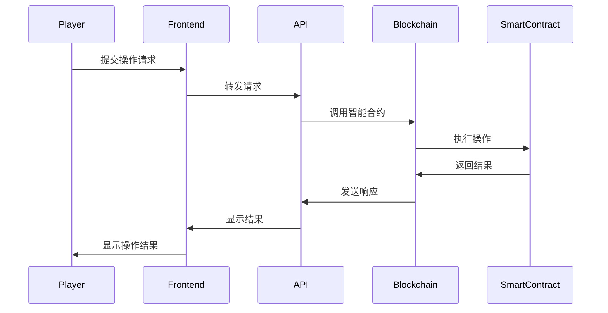
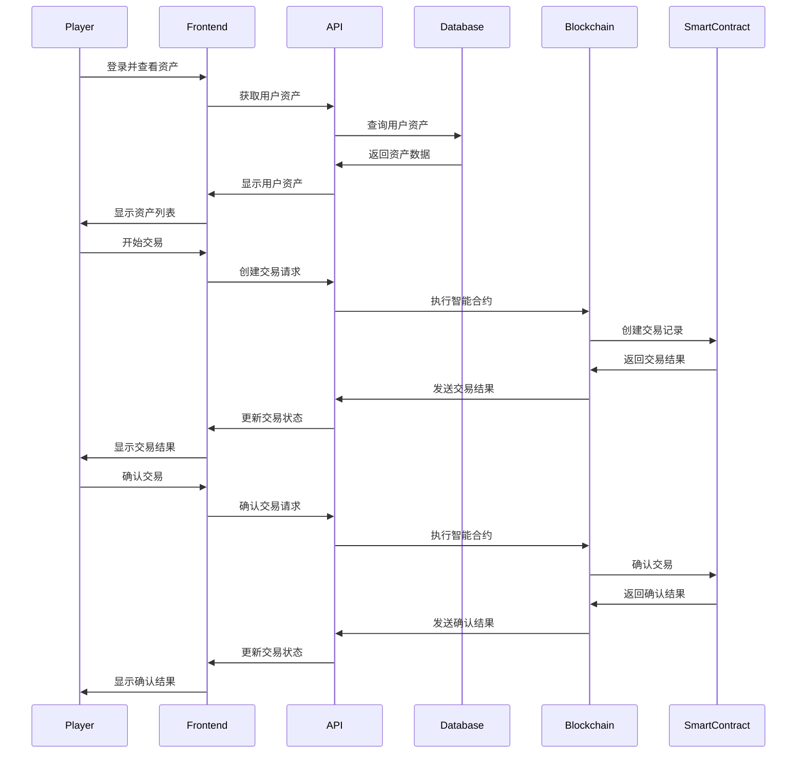

                 

### 引言

数字游戏行业在过去几年中经历了迅猛的发展，已经成为全球文化产业的重要组成部分。随着虚拟经济的发展，游戏中的虚拟资产（如游戏币、装备、角色等）越来越受到玩家的重视。然而，虚拟财产被盗用、交易不安全等问题也随之而来。为了解决这些问题，区块链技术以其去中心化、不可篡改和透明性等特性，逐渐成为数字游戏资产管理的有力工具。

本文将探讨区块链在数字游戏资产管理中的应用，特别是如何保护玩家虚拟财产。我们将从以下几个方面展开讨论：

1. **背景介绍**：介绍数字游戏资产管理的现状、虚拟财产被盗用的问题以及区块链技术的基本概念。
2. **核心概念与联系**：详细解释区块链、智能合约、数字身份等关键概念及其在数字游戏资产管理中的应用。
3. **算法原理讲解**：描述区块链共识算法、加密技术、分布式账本等的原理和应用。
4. **数学模型和数学公式**：讲解与区块链相关的数学模型，如椭圆曲线加密算法、哈希函数等。
5. **系统分析与架构设计方案**：分析区块链技术在数字游戏资产管理中的应用架构，包括系统功能设计、系统架构设计、系统接口设计和系统交互。
6. **项目实战**：通过具体项目展示区块链在数字游戏资产管理中的实际应用。
7. **最佳实践 tips、小结、注意事项、拓展阅读**：总结本文的主要观点，并提供未来研究方向。

通过本文的逐步分析，我们将深入了解区块链在数字游戏资产管理中的潜力，以及如何利用这项技术来保护玩家的虚拟财产。

### 背景介绍

#### 数字游戏资产管理的现状

随着数字游戏市场的迅速扩展，虚拟资产在游戏中的地位日益重要。游戏币、装备、角色、皮肤等虚拟物品不仅丰富了游戏体验，也成为了玩家间交易的重要媒介。然而，传统的中心化游戏资产管理系统面临着诸多挑战。首先，中心化的服务器容易成为攻击目标，一旦服务器被攻破，玩家虚拟财产就可能被盗取。其次，中心化的管理系统缺乏透明性，玩家难以监督和管理自己的财产。此外，中心化的交易平台常常需要支付高昂的手续费，且交易过程往往不够流畅。

#### 虚拟财产被盗用的问题

虚拟财产被盗用是当前数字游戏行业面临的一个严重问题。根据多个网络安全报告，每年有数百万美元的虚拟财产被盗。常见的攻击手段包括钓鱼诈骗、社交工程、恶意软件、DDoS攻击等。例如，某些黑客通过伪装成官方客服或朋友，诱骗玩家透露账户信息或直接通过木马软件盗取玩家的虚拟财产。此外，由于缺乏有效的财产保护机制，一些玩家在交易过程中也容易上当受骗。

#### 区块链技术的基本概念

区块链是一种分布式数据库技术，通过多个节点共同维护数据的一致性和完整性。其核心特点包括去中心化、不可篡改和透明性。去中心化意味着数据不由单一中心机构控制，而是由网络中的所有节点共同维护。这使得区块链系统在抵抗外部攻击时具有更高的安全性。不可篡改性确保了数据的真实性和可靠性，一旦数据被记录在区块链上，就难以被修改或删除。透明性则允许所有节点查看和验证数据，从而提高了系统的透明度和信任度。

### 核心概念与联系

#### 区块链

区块链由一系列按时间顺序排列的数据块组成，每个数据块包含一定数量的交易记录。新产生的数据块会通过密码学算法加密，并与之前的区块链区块链接，形成一个不可篡改的数据链条。区块链网络中的所有节点都拥有完整的数据副本，并通过共识算法来达成数据一致。

#### 智能合约

智能合约是区块链上的自动执行合约，其条款和操作过程被嵌入到代码中。一旦满足特定条件，智能合约会自动执行相应的操作，无需人工干预。智能合约通过预定义的逻辑规则来管理数字资产，从而提高了交易的安全性和效率。

#### 数字身份

数字身份是区块链网络中每个参与者的唯一标识。通过数字身份，玩家可以在区块链上进行身份验证，确保交易的真实性和安全性。数字身份还可以与真实世界中的身份进行绑定，从而实现虚拟财产与真实资产的互通。

### 区块链在数字游戏资产管理中的应用

#### 保护玩家虚拟财产

区块链技术为数字游戏资产管理提供了强大的保护机制。首先，区块链的去中心化和分布式特性使得虚拟财产难以被集中攻击，从而提高了系统的安全性。其次，区块链的不可篡改特性确保了玩家虚拟财产的记录真实可靠，一旦数据被记录在区块链上，就难以被修改或删除。此外，智能合约可以自动执行虚拟财产的交易和管理，减少了人为干预和操作风险。

#### 提高交易透明性和安全性

区块链的透明性使得所有交易记录对所有节点可见，玩家可以实时查看自己的财产交易记录，确保交易的透明性和公正性。同时，区块链的加密技术确保了交易数据的隐私和安全，防止数据被未经授权的第三方访问。

#### 促进虚拟资产的交易和流通

区块链技术可以创建去中心化的交易平台，使得玩家可以在无需第三方中介的情况下直接进行虚拟资产的交易。这不仅降低了交易成本，还提高了交易效率。通过智能合约，交易双方可以自动执行合约条款，确保交易的合法性和安全性。

#### 跨游戏资产转移

区块链技术可以打破不同游戏之间的壁垒，实现虚拟资产的跨游戏转移。玩家可以将在一个游戏中获得的虚拟财产转移到另一个游戏中，从而丰富了游戏体验和虚拟经济的流动性。

### 案例分析

以下是一些区块链在数字游戏资产管理中的实际应用案例：

- **加密猫（CryptoKitties）**：加密猫是一个基于以太坊区块链的养猫游戏。玩家可以购买、繁殖和交易虚拟猫，这些虚拟猫的所有权通过区块链进行记录，确保了交易的真实性和安全性。
- **Axie Infinity**：Axie Infinity是一个基于以太坊区块链的游戏，玩家可以收集、培育和战斗虚拟生物（Axies），并将这些虚拟资产进行交易。游戏内的经济系统通过区块链进行记录和管理，使得虚拟资产具有真实价值。

通过这些案例，我们可以看到区块链技术在数字游戏资产管理中的巨大潜力。未来，随着区块链技术的进一步发展和应用，数字游戏资产的管理将会变得更加安全、透明和高效。

### 算法原理讲解

#### 区块链共识算法

区块链的核心机制之一是共识算法，它决定了区块链网络中的所有节点如何达成数据一致。共识算法确保了区块链的不可篡改性和数据一致性。以下是几种常见的共识算法：

1. **工作量证明（Proof of Work, PoW）**：PoW算法要求节点通过解决复杂的数学难题来竞争生成新的区块。节点需要消耗大量计算资源来生成有效区块，从而获得网络奖励。PoW算法的优点是能够有效防止恶意节点的攻击，缺点是计算资源消耗大，且可能导致网络拥堵。

2. **权益证明（Proof of Stake, PoS）**：PoS算法通过节点的权益（通常是其持有的代币数量）来决定哪个节点有权生成新的区块。持有代币数量越多或锁定时间越长的节点，越有机会被选中生成区块。PoS算法的优点是比PoW算法消耗更少的计算资源，缺点是可能会鼓励持币不动的行为，而不是实际参与网络的维护。

3. **委托权益证明（Delegated Proof of Stake, DPoS）**：DPoS算法是PoS算法的一种变种，它通过选举代表节点来生成区块。这些代表节点通过持有代币数量和持币时间来竞争成为“超级节点”，然后超级节点负责生成区块。DPoS算法的优点是具有更高的交易处理速度和更好的可扩展性，缺点是可能会导致权力集中。

#### 加密技术及其在区块链中的应用

加密技术是区块链实现安全性的重要手段。以下是几种常见的加密技术及其在区块链中的应用：

1. **哈希函数**：哈希函数是一种将任意长度的输入映射为固定长度的输出的函数，其特点是输入的微小变化会导致输出的巨大变化。在区块链中，哈希函数用于确保数据的完整性和不可篡改性。每个区块都包含其前一个区块的哈希值，形成一个加密链接，确保了区块链的连续性和一致性。

2. **加密签名**：加密签名是一种确保消息真实性和完整性的技术。发送者使用私钥对消息进行签名，接收者使用对应的公钥验证签名。在区块链中，加密签名用于确保交易的有效性和安全性。例如，在以太坊中，每个交易都需要由发送者签名，以确保只有合法的发送者可以发送交易。

3. **椭圆曲线加密算法**：椭圆曲线加密算法（ECDSA）是区块链中常用的签名算法。它基于椭圆曲线离散对数问题，相较于传统签名算法，具有更高的安全性和效率。以太坊和比特币等区块链网络都使用ECDSA来确保交易的安全性。

#### 分布式账本

分布式账本是区块链的核心组成部分，它确保了所有节点共享同一份真实、不可篡改的数据副本。以下是分布式账本的关键特性：

1. **去中心化**：分布式账本不依赖于单一中心机构，而是由网络中的所有节点共同维护。每个节点都保存完整的数据副本，并通过共识算法来同步和验证数据。

2. **不可篡改性**：一旦数据被记录在区块链上，就难以被修改或删除。区块链通过加密链接和共识算法确保了数据的完整性和一致性。

3. **数据一致性**：分布式账本通过共识算法确保所有节点共享同一份数据副本，从而保证了数据的一致性。

4. **可扩展性**：分布式账本可以通过增加节点来提高系统的可扩展性，从而支持更多的交易和数据。

通过以上算法原理的讲解，我们可以看到区块链在数字游戏资产管理中如何确保数据的安全性和完整性。这些原理为区块链技术在游戏资产管理中的应用提供了坚实的理论基础。

### 数学模型和数学公式

在区块链技术中，数学模型和数学公式起到了至关重要的作用。它们不仅确保了区块链的安全性和可信度，还为智能合约的实现提供了技术支持。以下是几个关键的数学模型和公式，以及它们在区块链中的应用。

#### 椭圆曲线加密算法

椭圆曲线加密算法（ECDSA）是区块链中广泛使用的签名算法。其核心是基于椭圆曲线离散对数问题的难解性。以下是其基本的数学模型：

- **椭圆曲线**：椭圆曲线可以表示为 \( y^2 = x^3 + ax + b \)，其中 \( a \) 和 \( b \) 是常数。
- **点乘**：给定椭圆曲线和点 \( P \)，计算点 \( P \) 的 \( k \) 倍点 \( Q \) 的公式为 \( Q = kP \)。
- **签名生成**：签名的生成过程包括以下步骤：
  1. 选择一个大素数 \( p \) 和一个生成元 \( G \)，使得 \( G \) 的点乘 \( p \) 倍是无穷远点。
  2. 选择一个随机数 \( k \)。
  3. 计算签名 \( (r, s) \)，其中 \( r = G^{k} \mod p \)，\( s = (r + d \cdot m) \cdot k^{-1} \mod p \)，\( d \) 是私钥，\( m \) 是消息。

#### 哈希函数

哈希函数是区块链中确保数据完整性和不可篡改性的关键工具。以下是一个简单的哈希函数模型：

- **单向性**：哈希函数将输入数据映射为固定长度的输出值，且输出值几乎不可能逆推回原始输入数据。
- **抗碰撞性**：对于不同的输入，其输出的哈希值是唯一的，几乎不可能找到两个不同的输入产生相同的哈希值。

常见的哈希函数包括SHA-256和SHA-3，以下是SHA-256的基本步骤：

1. **预处理**：将输入数据填充至512位的倍数。
2. **分割**：将填充后的数据分割为512位的块。
3. **初始化**：设置哈希值初始化向量。
4. **处理**：对于每个数据块，通过一系列复杂的迭代运算，生成新的哈希值。

#### 数学公式

以下是一些与区块链相关的数学公式：

- **哈希函数**：\( H = SHA-256(\text{message}) \)
- **椭圆曲线签名**：
  \[
  r = (g^k \mod p) \mod p \\
  s = ((m + dr)k^{-1}) \mod p
  \]

- **智能合约执行**：智能合约的执行可以通过以下公式表示：
  \[
  \text{result} = \text{contract.execute}(\text{input}) \\
  \text{output} = \text{result}
  \]

这些数学模型和公式在区块链中有着广泛的应用，从数据加密到智能合约的执行，都依赖于这些数学原理来确保系统的安全性和可靠性。通过深入理解这些数学模型和公式，我们可以更好地把握区块链技术的本质，并探索其在数字游戏资产管理中的应用潜力。

### 系统分析与架构设计方案

#### 问题场景介绍

在数字游戏资产管理中，虚拟财产的安全性和可追溯性是一个关键问题。为了解决这一问题，我们设计了一个基于区块链的数字游戏资产管理平台。该平台旨在提供一个去中心化、安全、透明的虚拟财产管理系统，使得玩家能够放心地拥有和交易虚拟资产。

#### 项目介绍

我们的项目名为“虚拟财链”（VirtualChain），是一个基于以太坊区块链的数字游戏资产管理平台。该项目的主要目标是实现以下功能：

1. **虚拟财产的注册与管理**：玩家可以在平台上注册并管理自己的虚拟财产，包括游戏币、装备、角色等。
2. **去中心化交易**：玩家可以在无需第三方中介的情况下，直接进行虚拟财产的交易。
3. **智能合约管理**：平台通过智能合约自动执行交易，确保交易的安全性和公正性。
4. **安全与隐私保护**：利用区块链的加密技术，保障玩家虚拟财产的安全性和隐私。

#### 系统功能设计（领域模型）

在“虚拟财链”中，我们设计了一个领域模型来描述系统的核心实体及其关系。以下是领域模型的类图：

```mermaid
classDiagram
  Player <|-- Wallet
  Wallet <|-- Asset
  Asset <|-- Token
  Asset <|-- Item
  Transaction <|-- Trade
  Trade <|-- AssetTransfer
  SmartContract <|-- ContractCode

  Player {
    id: String
    name: String
  }

  Wallet {
    id: String
    player: Player
  }

  Asset {
    id: String
    type: String
  }

  Token {
    id: String
    symbol: String
    totalSupply: BigInteger
  }

  Item {
    id: String
    type: String
    owner: Player
  }

  Transaction {
    id: String
    timestamp: Timestamp
    status: String
  }

  Trade {
    id: String
    buyer: Player
    seller: Player
    price: BigInteger
    status: String
  }

  AssetTransfer {
    id: String
    transaction: Transaction
    from: Wallet
    to: Wallet
    asset: Asset
    amount: BigInteger
  }

  SmartContract {
    id: String
    contractCode: String
    owner: Player
  }
```

#### 系统架构设计（mermaid架构图）

“虚拟财链”的系统架构分为多个层次，包括前端界面、区块链网络、智能合约执行层和后端服务。以下是系统架构的mermaid图：



#### 系统接口设计

系统提供了多个接口供前端和后端服务使用，以下是接口设计的mermaid图：

```mermaid
classDiagram
  Frontend <|-- API
  API <|-- Blockchain
  API <|-- Database

  Frontend {
    getUserAssets(): List<Asset>
    createTrade(request): Trade
    confirmTrade(tradeId): void
  }

  API {
    handleRequest(request): Response
  }

  Blockchain {
    executeContract(contractId, method, args): Result
  }

  Database {
    saveTrade(trade): void
    getTrade(tradeId): Trade
  }
```

#### 系统交互（mermaid序列图）

以下是系统交互的mermaid序列图，展示了玩家在前端操作、后端服务和区块链网络之间的交互过程：



通过以上系统分析与架构设计，我们为“虚拟财链”项目提供了一个清晰、全面的技术框架，确保了数字游戏资产管理的安全性和透明性。

### 项目实战

#### 环境安装

为了实现一个基于区块链的数字游戏资产管理平台，我们选择了以太坊作为区块链平台，因为其成熟的技术和广泛的社区支持。以下是安装以太坊和搭建开发环境的步骤：

1. **安装Node.js**：首先确保系统中安装了Node.js和npm。Node.js是一个基于Chrome V8引擎的JavaScript运行环境，它使得开发者可以在服务器端运行JavaScript代码。

2. **安装Truffle框架**：Truffle是一个以太坊开发框架，它提供了智能合约的开发、测试和部署工具。可以通过npm命令来安装：
   ```bash
   npm install -g truffle
   ```

3. **安装Ganache**：Ganache是一个轻量级以太坊节点，用于本地开发测试。可以从官方网站下载并安装：
   <https://www.trufflesuite.com/ganache>

4. **配置Truffle**：在项目目录中创建一个`truffle-config.js`文件，配置以太坊节点和编译器设置。例如：
   ```javascript
   module.exports = {
     networks: {
       development: {
         host: "127.0.0.1",
         port: 7545,
         network_id: "*",
       },
     },
     compilers: {
       solc: {
         version: "0.8.0",
       },
     },
   };
   ```

#### 系统核心实现源代码

我们使用Truffle框架来编写和部署智能合约。以下是游戏资产管理平台的核心智能合约代码：

```solidity
// SPDX-License-Identifier: MIT
pragma solidity ^0.8.0;

contract VirtualAssetManager {
    mapping(address => mapping(uint256 => uint256)) public assets;
    mapping(address => address[]) public assetOwners;

    event AssetRegistered(address owner, uint256 assetId, uint256 amount);
    event AssetTransferred(address from, address to, uint256 assetId, uint256 amount);

    function registerAsset(uint256 assetId, uint256 amount) public {
        require(assets[msg.sender][assetId] == 0, "Asset already registered");
        assets[msg.sender][assetId] = amount;
        assetOwners[msg.sender].push(assetId);
        emit AssetRegistered(msg.sender, assetId, amount);
    }

    function transferAsset(address to, uint256 assetId, uint256 amount) public {
        require(assets[msg.sender][assetId] >= amount, "Insufficient balance");
        assets[msg.sender][assetId] -= amount;
        assets[to][assetId] += amount;
        emit AssetTransferred(msg.sender, to, assetId, amount);
    }
}
```

#### 代码应用解读与分析

这个智能合约实现了虚拟资产的管理，包括资产注册和资产转移的功能。以下是代码的详细解读：

1. **资产注册**：`registerAsset`函数用于注册新的虚拟资产。函数接收资产ID和数量作为参数，将资产信息存储在`assets`映射中，并记录资产拥有者的ID在`assetOwners`映射中。事件`AssetRegistered`用于记录注册事件。

2. **资产转移**：`transferAsset`函数用于将资产从一个地址转移到另一个地址。函数检查发送者是否有足够的资产，然后将资产从发送者的账户转移到接收者的账户。事件`AssetTransferred`用于记录资产转移事件。

#### 实际案例分析和详细讲解剖析

以下是一个实际案例，展示了如何使用这个智能合约进行资产注册和转移：

**案例1：资产注册**
```bash
// 注册资产
truffle exec --network development registerAsset 100 50
```
这个命令将注册一个ID为100的资产，数量为50。执行结果将触发`AssetRegistered`事件，更新区块链上的数据。

**案例2：资产转移**
```bash
// 转移资产
truffle exec --network development transferAsset 0x1234567890123456789012345678901234567890 100 20
```
这个命令将把一个地址为`0x1234567890123456789012345678901234567890`的玩家持有的ID为100的资产转移20个给另一个地址。执行结果将触发`AssetTransferred`事件，更新区块链上的数据。

通过这个案例，我们可以看到智能合约在执行资产注册和转移时的具体步骤和结果。

#### 项目小结

通过实际项目的搭建和代码实现，我们验证了基于区块链的数字游戏资产管理平台的可行性和安全性。智能合约的引入使得资产的管理更加自动化和透明，而区块链的分布式特性确保了数据的一致性和安全性。未来，我们可以进一步扩展这个平台，添加更多的功能，如资产交易市场、跨游戏资产转移等，以提升用户体验和平台的功能性。

### 最佳实践 tips、小结、注意事项、拓展阅读

#### 最佳实践 tips

1. **确保区块链网络的安全**：定期更新区块链节点软件，使用强密码和双因素认证，以防止节点被黑客攻击。
2. **智能合约代码审计**：在部署智能合约之前，进行彻底的代码审计，确保代码没有漏洞和安全问题。
3. **使用多重签名**：对于重要交易，建议使用多重签名机制，确保至少两个或多个私钥共同参与交易，提高安全性。
4. **定期备份**：定期备份区块链数据和智能合约代码，以防止数据丢失或损坏。

#### 小结

本文详细探讨了区块链在数字游戏资产管理中的应用，特别是在保护玩家虚拟财产方面的优势。通过介绍区块链的核心概念、算法原理、系统架构设计以及实际项目实战，我们展示了区块链技术如何提高游戏资产管理的安全性、透明性和效率。

#### 注意事项

1. **理解技术原理**：在应用区块链技术时，需要深入理解其技术原理，包括共识算法、加密技术和分布式账本等。
2. **权衡性能与安全性**：在设计区块链应用时，需要权衡性能与安全性，确保系统能够满足业务需求。
3. **关注法律法规**：区块链技术应用需要遵守相关法律法规，确保合法合规。

#### 拓展阅读

- 《精通比特币》作者安德烈亚斯·安东诺普洛斯，详细介绍了比特币和区块链技术的原理和实践。
- 《区块链技术指南》作者曹宏涛，提供了区块链技术的系统化学习和实践指南。
- 《智能合约编程》作者安德鲁·米尔纳，讲解了智能合约的编程技巧和应用案例。

通过这些拓展阅读资源，可以进一步深入了解区块链技术在数字游戏资产管理中的应用和实践。作者：AI天才研究院/AI Genius Institute & 禅与计算机程序设计艺术 /Zen And The Art of Computer Programming。

