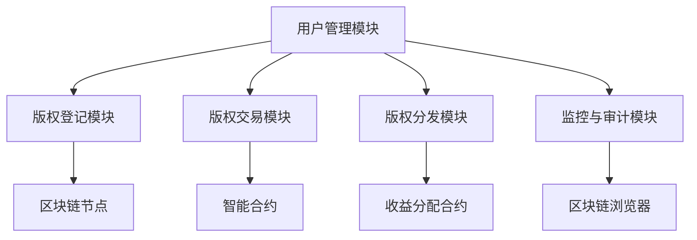

                 

## 文章标题

### 关键词

区块链，数字版权保护，音乐版权，智能分发，去中心化，加密技术，共识算法，分布式存储，智能合约，版权追踪，数字签名，透明审计，激励机制，权益保障，平台安全性

### 摘要

本文将深入探讨区块链技术在数字版权保护中的应用，特别是音乐版权的智能分发。文章首先介绍了区块链技术的基本概念和原理，随后详细分析了数字版权保护的现状及其面临的挑战。接着，我们重点关注区块链在版权保护中的独特优势，以及音乐版权智能分发技术的具体实现和应用。通过案例分析，我们评估了智能分发系统的效果，并讨论了未来的发展趋势和面临的挑战。最后，文章总结了音乐版权智能分发的最佳实践，为行业提供了可行的解决方案和启示。

## 引言

随着互联网的飞速发展，数字内容创作和传播变得前所未有的便捷。音乐、影视、文学等数字作品在数字化过程中，其版权保护成为了一个重要且复杂的问题。传统的版权保护机制在面对日益复杂的数字版权侵权行为时显得力不从心。因此，寻求新的、有效的数字版权保护手段成为了当务之急。

区块链技术以其去中心化、不可篡改、透明可审计等特点，为数字版权保护提供了一种全新的解决方案。区块链不仅能够确保版权数据的真实性和完整性，还能够实现版权的自动化管理，降低版权侵权风险。特别是针对音乐版权，智能分发技术能够通过区块链实现更高效、更公平的版权收益分配，从而保护创作者的权益。

本文旨在探讨区块链技术在音乐版权智能分发中的具体应用，分析其工作原理和技术实现，并通过案例分析来评估其实际效果。希望通过本文的研究，能够为数字版权保护提供新的思路，并为相关行业的实践者提供有价值的参考。

### 区块链技术概述

区块链技术是一种基于分布式数据库和加密算法的数字技术，其核心特点包括去中心化、不可篡改和透明性。为了更好地理解区块链技术，我们可以从其定义、工作原理、主要特点以及发展现状和趋势四个方面进行详细探讨。

#### 区块链的定义

区块链（Blockchain）是一个分布式账本系统，它通过加密技术确保数据的真实性和安全性，并利用共识算法来确保所有参与节点对账本的一致性。区块链的核心组成部分包括区块（Block）、链（Chain）、节点（Node）和共识算法（Consensus Algorithm）。

- **区块**：区块是区块链的基本单元，每个区块包含一定数量的交易记录，并有一个时间戳。
- **链**：区块链是由多个区块按时间顺序串联而成的链式结构，每个区块都通过哈希值与前一个区块链接，形成一条不可篡改的数据链。
- **节点**：节点是指参与区块链网络的计算机或设备，每个节点都保存了一份完整的区块链数据，并参与网络中的共识过程。
- **共识算法**：共识算法是区块链网络中所有节点达成一致的方法，常见的算法包括工作量证明（Proof of Work, PoW）、权益证明（Proof of Stake, PoS）等。

#### 区块链的工作原理

区块链的工作原理可以概括为以下几个步骤：

1. **交易发生**：用户在区块链上进行交易，例如发送比特币或记录版权信息。
2. **交易验证**：交易需要经过网络中的多个节点验证，确保交易的有效性和合法性。
3. **区块创建**：验证后的交易被分组到一个新区块中，并附有当前时间戳。
4. **区块传播**：新区块被广播到网络中的其他节点。
5. **共识达成**：通过共识算法，网络中的所有节点达成一致，确定新区块的合法性和位置。
6. **链更新**：新区块被添加到区块链的末端，链长度增加。

#### 区块链的主要特点

区块链技术具有以下主要特点：

- **去中心化**：区块链不需要中心化的第三方机构进行协调，所有节点都平等参与，保证了系统的去中心化和抗审查性。
- **不可篡改**：区块链上的数据一旦被写入，就几乎无法被篡改，因为需要同时修改多个节点的数据，这几乎是不可能的。
- **透明性**：区块链上的所有数据都是公开透明的，所有节点都可以查看和验证。
- **安全性**：区块链使用加密算法来确保数据的真实性和安全性，即使某个节点被攻破，攻击者也无法篡改整个系统。

#### 区块链的分类与演变

区块链技术从最初的比特币区块链（Bitcoin Blockchain）发展至今，已经经历了多个阶段和演变：

- **1.0阶段**：以比特币为代表的区块链1.0阶段主要关注数字货币的应用。
- **2.0阶段**：区块链2.0阶段开始探索智能合约（Smart Contract）的应用，如以太坊（Ethereum）。
- **3.0阶段**：当前，区块链3.0阶段正在探索更多领域的应用，如供应链管理、医疗记录、数字身份验证等。

#### 区块链技术的发展现状与趋势

区块链技术自2008年比特币诞生以来，已经取得了显著的发展。以下是一些关键的发展现状和趋势：

- **技术成熟度**：区块链技术已经从早期的研究阶段逐渐走向成熟，许多实际应用案例已经落地。
- **行业应用**：区块链技术已经在金融、物流、医疗、版权等多个领域得到了广泛应用。
- **政策监管**：各国政府开始重视区块链技术的发展，并出台相关政策进行规范和监管。
- **去中心化应用（DApps）**：去中心化应用正在成为区块链技术的重要发展方向，DApps具有高度透明和去中心化的特性。

#### 区块链技术在版权保护中的潜力

区块链技术在版权保护中具有巨大的潜力，主要体现在以下几个方面：

- **版权登记与认证**：区块链可以用于记录版权信息，确保数据的真实性和不可篡改性。
- **版权交易与分发**：区块链可以实现版权的自动化交易和智能分发，提高效率并减少中介成本。
- **版权追踪与维权**：区块链技术可以实现版权的透明追踪，帮助权利人及时发现侵权行为并进行维权。
- **透明审计与权益保障**：区块链的透明性和不可篡改性确保了版权数据的透明审计，从而保障权利人的权益。

总之，区块链技术为数字版权保护提供了一种全新的思路和解决方案，具有广阔的应用前景和重要的社会意义。在接下来的章节中，我们将进一步探讨区块链在音乐版权保护中的具体应用和实践。

### 数字版权保护背景

随着数字技术的发展，音乐、影视、文学等数字内容的创作和传播变得前所未有的便捷。然而，这也带来了数字版权保护的一系列挑战。传统的版权保护机制在面对日益复杂的数字版权侵权行为时显得力不从心。因此，深入探讨数字版权保护的现状、面临的挑战、重要性和相关法律法规，有助于更好地理解区块链技术在音乐版权智能分发中的应用价值。

#### 数字版权保护的现状

数字版权保护现状可以从以下几个方面进行描述：

1. **数字版权意识增强**：随着网络普及和信息共享的便利，公众对数字版权的意识逐渐提高。越来越多的人开始关注数字内容的版权问题，尊重原创并支持正版。
2. **侵权行为频发**：尽管数字版权意识增强，但数字版权侵权行为仍然频发。盗版、非法传播、未经授权的使用等问题依然严重，特别是音乐领域，侵权行为更加普遍。
3. **技术手段改进**：为了应对数字版权侵权，技术和法律手段不断改进。例如，版权标记技术、数字水印技术、监控技术等在数字版权保护中得到了广泛应用。

#### 音乐版权保护面临的挑战

音乐版权保护面临的挑战主要有以下几点：

1. **技术挑战**：数字音乐形式的多样性和传播速度使得侵权行为更加隐蔽和快速。传统的版权保护技术，如版权标记和监控，难以全面覆盖和实时检测。
2. **法律挑战**：数字版权侵权行为具有跨国性和匿名性，这使得法律追责变得复杂和困难。各国版权法律体系和执法力度不同，增加了跨国维权难度。
3. **经济挑战**：数字版权保护需要大量的人力和物力投入，但收益难以保障。版权方往往难以通过传统的版权保护手段获得足够的收益，从而降低了其投入的积极性。

#### 数字版权保护的重要性

数字版权保护的重要性体现在以下几个方面：

1. **保护创作者权益**：数字版权保护确保了创作者的劳动成果得到认可和回报，保护了创作者的权益和积极性。
2. **推动文化产业发展**：健康的数字版权环境有助于促进文化产业的健康发展，激发更多创作者的创意和创作热情。
3. **维护社会公平正义**：数字版权保护有助于维护社会公平正义，防止非法获利者侵犯他人合法权益。

#### 音乐版权保护的相关法律法规

不同国家和地区对于音乐版权保护的法律规定有所不同，但以下是一些普遍适用的法律法规：

1. **著作权法**：著作权法是保护音乐版权的基础法律，规定了音乐作品的著作权人权利，包括复制权、发行权、表演权、播放权等。
2. **知识产权法**：知识产权法对于数字版权保护具有补充作用，如反盗版法、版权标记法等，旨在打击数字侵权行为。
3. **国际条约**：如伯尔尼公约（Berne Convention）和世界知识产权组织（WIPO）的相关条约，为各国提供了版权保护的国际标准。

综上所述，数字版权保护面临诸多挑战，但通过加强法律保护和技术手段，可以有效地保护音乐版权。区块链技术的应用为数字版权保护提供了一种新的思路和手段，有望在未来的音乐版权智能分发中发挥重要作用。在接下来的章节中，我们将进一步探讨区块链在版权保护中的应用，以及音乐版权智能分发技术的具体实现。

### 区块链在版权保护中的应用

区块链技术在数字版权保护中展现了其独特的优势，通过去中心化、不可篡改和透明性等特点，为版权登记、交易、追踪和维权提供了全新的解决方案。以下将详细分析区块链在版权保护中的应用，从版权登记、版权交易、版权追踪和维权四个方面进行探讨。

#### 版权登记

区块链技术可以用于版权登记，确保版权信息的真实性和不可篡改性。具体应用如下：

1. **分布式存储**：区块链的分布式存储特性使得版权信息可以在多个节点上备份，从而防止单一节点故障导致数据丢失。
2. **加密保护**：区块链使用加密技术保护版权信息，确保数据在传输和存储过程中的安全性。
3. **透明可审计**：区块链上的所有交易都是公开透明的，权利人可以通过区块链查看自己的版权信息，确保数据的真实性和完整性。

#### 版权交易

区块链技术在版权交易中的应用，主要体现在智能合约和去中心化交易平台（DEX）的构建上。以下是一些具体的应用：

1. **智能合约**：智能合约是一种自动执行合约条款的计算机协议。在版权交易中，智能合约可以自动执行交易协议，确保交易过程的透明和公正。例如，当权利人将版权信息上传到区块链后，智能合约可以自动检测到并执行相应的版权交易协议，从而实现自动化交易。
2. **去中心化交易平台**：去中心化交易平台（DEX）利用区块链技术，实现版权的在线交易，无需依赖于中心化交易所。DEX的优势在于去除了中心化交易所的中介费用，降低了交易成本，同时提高了交易效率。

#### 版权追踪

区块链技术可以实现版权的透明追踪，帮助权利人及时发现侵权行为并进行维权。具体应用如下：

1. **透明审计**：区块链的透明性确保了版权数据的可审计性。权利人可以随时查看自己的版权信息，确保数据的一致性和完整性。
2. **实时监控**：区块链上的交易数据可以被实时监控，权利人可以通过区块链上的智能合约和监控工具，及时发现潜在的侵权行为。
3. **不可篡改**：区块链上的版权信息一旦被记录，就几乎无法被篡改。这确保了版权数据的真实性和可靠性，为维权提供了有力的证据。

#### 版权维权

区块链技术在版权维权中的应用，主要体现在以下几个方面：

1. **电子证据**：区块链上的交易记录和智能合约执行记录可以作为电子证据，为维权提供有力的证据支持。
2. **快速仲裁**：区块链技术可以实现去中心化的快速仲裁，权利人可以通过区块链上的智能合约和去中心化仲裁平台，快速解决版权纠纷。
3. **透明审计和司法协作**：区块链上的透明审计功能可以帮助司法机关更好地了解案件情况，提高司法效率。同时，区块链技术还可以促进司法机构和版权机构的协作，共同打击侵权行为。

#### 区块链技术在版权保护中的优势与局限

区块链技术在版权保护中具有以下优势：

- **去中心化**：去中心化确保了版权数据的透明性和公正性，减少了中心化机构的干预和操作风险。
- **不可篡改**：区块链上的数据一旦被记录，就几乎无法被篡改，确保了数据的真实性和可靠性。
- **透明可审计**：区块链上的所有交易和数据都是公开透明的，权利人可以随时查看和审计。
- **自动化和高效**：智能合约和去中心化交易平台可以实现自动化和高效的版权交易和维权过程。

然而，区块链技术在版权保护中也存在一些局限：

- **技术门槛**：区块链技术相对复杂，对于普通用户来说有一定的技术门槛。
- **交易成本**：虽然去中心化交易平台降低了中介费用，但区块链上的交易仍需要支付一定的费用，这可能会增加版权方的负担。
- **法律合规**：各国对于区块链技术的法律监管和合规要求不同，这可能会影响区块链技术在版权保护中的广泛应用。

总之，区块链技术在数字版权保护中具有巨大的潜力，通过去中心化、不可篡改和透明性等特点，为版权登记、交易、追踪和维权提供了全新的解决方案。然而，要充分发挥区块链技术的优势，仍需克服技术、法律和运营等方面的挑战。在接下来的章节中，我们将进一步探讨音乐版权智能分发技术的具体实现和应用。

### 音乐版权智能分发技术

音乐版权智能分发技术是一种基于区块链技术的创新解决方案，旨在通过去中心化和智能合约实现音乐版权的自动化管理和高效分发。以下是音乐版权智能分发技术的基本概念、工作原理、关键技术以及其应用场景的详细分析。

#### 音乐版权智能分发技术的基本概念

音乐版权智能分发技术，是指利用区块链技术和智能合约，实现音乐版权的登记、交易、追踪和分发的全过程。其核心目标是确保版权数据的真实性和透明性，提高版权交易和分发的效率，同时保护创作者的权益。

#### 音乐版权智能分发的工作原理

音乐版权智能分发的工作原理可以概括为以下几个步骤：

1. **版权登记**：音乐创作者将版权信息（如歌曲名称、创作者、发行日期等）上传到区块链上，进行版权登记。这些信息会被记录在区块链上的智能合约中，确保数据的真实性和不可篡改性。
2. **交易协议**：当版权需要进行交易时，买方和卖方通过智能合约制定交易协议。智能合约会自动执行协议中的条款，例如支付金额、版权转让等。
3. **版权分发**：交易完成后，版权会根据智能合约的设定进行自动分发。例如，版权收益可以自动分发给不同的创作者和参与者，确保权益的公平和透明。
4. **透明追踪**：区块链上的所有交易记录都是公开透明的，任何用户都可以查看和验证版权信息，确保版权数据的真实性和一致性。

#### 音乐版权智能分发的关键技术

音乐版权智能分发技术依赖于以下几个关键技术：

1. **区块链技术**：区块链技术提供了去中心化、不可篡改和透明性的基础，确保版权数据的真实性和安全性。
2. **智能合约**：智能合约是音乐版权智能分发技术的核心，它自动执行版权交易协议，确保交易的透明和高效。
3. **加密技术**：加密技术用于保护版权信息的隐私和安全，确保数据在传输和存储过程中的安全性。
4. **共识算法**：共识算法用于确保区块链网络中所有节点对账本的一致性，保证系统的稳定性和可靠性。

#### 音乐版权智能分发的应用场景

音乐版权智能分发技术可以应用于多种场景，以下是一些典型的应用场景：

1. **音乐版权交易**：通过智能合约，音乐创作者可以直接与买家进行版权交易，无需依赖中介机构，降低交易成本。
2. **版权收益分配**：智能合约可以根据版权协议自动分配版权收益，确保创作者、制作人、发行商等各方的权益得到公平的分配。
3. **版权追踪与维权**：区块链上的透明追踪功能可以帮助权利人及时发现侵权行为，并通过智能合约实现快速维权。
4. **跨平台分发**：智能分发技术可以支持跨平台的版权分发，例如从数字音乐平台到流媒体平台，实现无缝的版权管理和收益分配。

#### 音乐版权智能分发技术的优点和挑战

音乐版权智能分发技术的优点包括：

- **去中心化**：去中心化确保了版权交易的透明性和公正性，减少了中介机构的干预。
- **高效自动化**：智能合约自动执行版权协议，提高了版权交易和分发的效率。
- **透明可追踪**：区块链上的所有交易记录都是公开透明的，提高了版权管理的透明度和可信度。

然而，音乐版权智能分发技术也面临一些挑战：

- **技术门槛**：区块链技术和智能合约的开发和部署需要专业的技术知识，对于普通用户来说有一定的技术门槛。
- **法律合规**：各国对于区块链技术的法律监管和合规要求不同，可能影响技术的广泛应用。
- **隐私和安全**：虽然区块链技术提供了加密保护，但仍然存在数据泄露和安全漏洞的风险。

总之，音乐版权智能分发技术通过区块链技术和智能合约，为音乐版权的管理和分发提供了创新的解决方案。在未来的发展中，需要进一步克服技术、法律和运营等方面的挑战，以实现更广泛的应用和更高的效率。

### 音乐版权智能分发系统架构设计

音乐版权智能分发系统是一种利用区块链技术实现版权登记、交易和分发的平台。该系统的架构设计至关重要，它决定了系统的功能、性能和安全。以下将从系统概述、功能模块、技术选型、安全性和架构图五个方面详细阐述音乐版权智能分发系统的架构设计。

#### 系统概述

音乐版权智能分发系统旨在为音乐创作者、发行商、版权机构和用户提供一个去中心化、透明、高效的音乐版权管理平台。系统通过区块链技术和智能合约，实现了版权的自动化登记、交易和分发，确保版权数据的真实性和不可篡改性。

#### 功能模块

音乐版权智能分发系统主要包括以下几个功能模块：

1. **用户管理模块**：用户管理模块负责用户的注册、登录、权限管理和身份验证等功能。通过区块链技术，用户身份信息可以被加密存储和验证，确保用户身份的真实性。
2. **版权登记模块**：版权登记模块用于音乐创作者将新作品进行版权登记，包括上传作品信息、创作者信息、版权信息等。这些信息将被记录在区块链上，确保数据的真实性和不可篡改性。
3. **版权交易模块**：版权交易模块支持音乐版权的买卖交易，包括发布交易需求、交易匹配、支付和结算等功能。智能合约在此过程中自动执行交易协议，确保交易的透明和高效。
4. **版权分发模块**：版权分发模块根据智能合约的设定，自动将版权收益分发给各权利人。例如，当一首歌曲被播放或下载时，相应的版权收益会自动分发到创作者和其他参与者的账户中。
5. **监控与审计模块**：监控与审计模块用于实时监控版权交易活动，并提供透明审计功能。所有交易记录都会在区块链上永久记录，供用户和监管机构查看和验证。

#### 技术选型

音乐版权智能分发系统在技术选型上需要考虑以下几个关键因素：

1. **区块链平台**：选择一个成熟、稳定且符合版权管理需求的区块链平台，例如以太坊（Ethereum）或EOS。这些平台提供了丰富的开发工具和社区支持，便于系统的开发和部署。
2. **智能合约开发框架**：选择合适的智能合约开发框架，如Truffle或Ganache，用于编写和测试智能合约。这些框架提供了便利的开发和调试环境，提高了开发效率。
3. **前端技术**：采用现代前端框架，如React或Vue.js，构建用户界面，提供友好的用户交互体验。这些框架支持响应式设计和组件化开发，提高了系统的可维护性和扩展性。
4. **加密技术**：使用强加密算法，如RSA或AES，保护用户数据和交易信息的安全性。这些加密技术可以确保数据在传输和存储过程中的安全性和隐私性。

#### 安全性设计

音乐版权智能分发系统的安全性设计至关重要，需要从多个方面进行考虑：

1. **身份验证**：采用多重身份验证机制，如密码、生物识别和多因素认证，确保用户身份的真实性和安全性。
2. **访问控制**：实施严格的访问控制策略，确保不同用户和角色的访问权限符合其职责范围。
3. **数据加密**：使用加密技术对用户数据和交易信息进行加密，防止数据泄露和未经授权的访问。
4. **网络隔离**：将系统与外部网络进行隔离，减少外部攻击的风险。例如，使用虚拟专用网络（VPN）和安全沙箱技术。
5. **定期审计**：定期对系统进行安全审计和漏洞扫描，及时发现并修复安全漏洞。

#### 架构图

音乐版权智能分发系统的架构图如下所示：

- **用户管理模块**（A）：负责用户的注册、登录和权限管理。
- **版权登记模块**（B）：用于版权信息的上传和登记。
- **版权交易模块**（C）：处理版权交易的需求和匹配。
- **版权分发模块**（D）：根据智能合约设定，自动进行版权收益的分配。
- **监控与审计模块**（E）：监控交易活动并提供透明审计功能。
- **区块链节点**（F）：存储和验证版权信息和交易记录。
- **智能合约**（G）：自动执行版权交易协议。
- **收益分配合约**（H）：自动分配版权收益。
- **区块链浏览器**（I）：供用户查看和验证交易记录。

通过上述架构设计，音乐版权智能分发系统实现了去中心化、透明、高效的音乐版权管理，为音乐创作者和版权机构提供了一个可靠、安全的平台。

### 音乐版权智能分发系统实现

#### 系统开发环境与工具

音乐版权智能分发系统的实现涉及多种技术和工具，以下将详细介绍系统开发所需的环境和工具。

1. **区块链平台**：我们选择以太坊（Ethereum）作为区块链平台，因为其成熟的技术生态和广泛的社区支持。以太坊提供了一个高度灵活的智能合约平台，允许开发者轻松地创建和部署去中心化应用程序（DApps）。
2. **智能合约开发框架**：我们使用Truffle框架进行智能合约的开发和测试。Truffle提供了丰富的开发工具，如本地区块链节点（Ganache）、智能合约编译和部署工具，以及调试和测试环境，极大提高了开发效率。
3. **前端技术**：我们使用React框架构建用户界面，因为它支持组件化开发、响应式设计和良好的性能。此外，我们还使用Redux进行状态管理，确保应用程序的状态一致性和可预测性。
4. **后端服务**：我们使用Node.js和Express.js构建后端服务，处理用户认证、版权信息管理和与其他区块链节点的通信。Node.js的高性能和异步编程特性使得后端服务的开发更加高效和灵活。
5. **加密库**：为了确保数据的安全性和隐私，我们使用JavaScript Crypto库（例如`crypto-js`）进行数据加密和解密操作。这个库提供了多种加密算法，如AES和RSA，确保数据在传输和存储过程中的安全。
6. **测试工具**：我们使用Mocha和Chai库进行智能合约的单元测试和集成测试。这些工具可以帮助我们快速发现和修复智能合约中的错误，确保合约的可靠性和稳定性。

#### 系统核心功能的实现

音乐版权智能分发系统的核心功能包括版权登记、版权交易、版权分发和监控与审计。以下将详细描述这些功能的实现过程。

1. **版权登记**：版权登记是音乐创作者将新作品信息上传到区块链的过程。实现步骤如下：
    - **前端界面**：创建一个简洁明了的版权登记界面，允许用户输入作品信息，如歌曲名称、创作者、发行日期等。
    - **后端接口**：构建一个RESTful API，用于处理前端发送的请求，并与智能合约进行交互。
    - **智能合约**：编写一个智能合约，用于存储和管理版权信息。合约应包含添加版权信息、查询版权信息等功能。

2. **版权交易**：版权交易是买方和卖方通过智能合约进行版权买卖的过程。实现步骤如下：
    - **前端界面**：创建一个版权交易界面，允许用户发布交易需求或查看其他用户的交易需求。
    - **后端接口**：构建一个交易匹配引擎，根据交易需求和条件自动匹配买方和卖方。
    - **智能合约**：编写一个智能合约，用于执行版权交易协议。合约应包含发布交易需求、接受交易请求、执行交易支付等功能。

3. **版权分发**：版权分发是根据智能合约的设定，自动将版权收益分配给各权利人的过程。实现步骤如下：
    - **智能合约**：编写一个收益分配合约，用于根据版权协议自动计算并分配版权收益。
    - **后端服务**：构建一个收益分配引擎，根据合约的设定和交易记录，自动计算并分配收益。

4. **监控与审计**：监控与审计是实时监控版权交易活动并提供透明审计功能。实现步骤如下：
    - **前端界面**：创建一个监控界面，显示实时交易信息和审计记录。
    - **后端服务**：构建一个监控与审计服务，定期从区块链上获取交易记录，进行审计和可视化。
    - **区块链浏览器**：使用现有的区块链浏览器（如Etherscan），提供用户查看交易记录和版权信息的接口。

#### 系统测试与优化

系统测试与优化是确保音乐版权智能分发系统可靠性和性能的关键步骤。以下将介绍系统测试的主要方法和优化策略。

1. **单元测试**：使用Mocha和Chai库对智能合约和后端服务进行单元测试，确保每个模块的功能正确无误。单元测试应涵盖所有可能的输入和输出情况，包括正常情况和异常情况。

2. **集成测试**：使用Truffle框架的集成测试功能，对整个系统进行集成测试。集成测试应模拟实际的使用场景，确保系统的各个模块能够无缝协作。

3. **性能测试**：使用JMeter等性能测试工具，对系统的负载和响应时间进行测试，评估系统的性能瓶颈和优化方向。

4. **优化策略**：
    - **智能合约优化**：通过减少合约代码的复杂度和优化 Solidity 编译器选项，提高合约的执行效率。
    - **网络优化**：优化与区块链节点的通信，使用更高效的HTTP API或WebSockets。
    - **缓存策略**：使用Redis等缓存系统，减少数据库访问，提高系统的响应速度。

5. **监控与日志**：使用Prometheus和Grafana等监控工具，实时监控系统的性能和状态，并记录详细的日志，以便于问题追踪和故障排查。

通过上述开发环境与工具的合理选择，以及系统核心功能的详细实现和测试优化，音乐版权智能分发系统能够高效、可靠地运行，为音乐版权的管理和分发提供有力支持。

### 音乐版权智能分发系统实现（续）

#### 系统部署与上线

在完成音乐版权智能分发系统的开发和测试后，部署和上线成为系统成功运行的关键步骤。以下将详细介绍系统部署的过程和上线策略。

1. **环境配置**：
   - **前端环境**：配置React和Redux开发环境，确保前端代码能够正常运行。使用`create-react-app`脚手架工具初始化项目，并安装必要的依赖包。
   - **后端环境**：配置Node.js和Express.js开发环境，确保后端服务能够正常运行。使用`npm init`初始化项目，并安装必要的依赖包，如Express、Mongoose（用于MongoDB操作）、JWT（用于身份验证）等。

2. **智能合约部署**：
   - **本地测试网**：使用Truffle框架的Ganache工具创建一个本地测试网络，用于开发和测试智能合约。在本地测试网络中，可以通过Truffle命令部署智能合约，并进行交互测试。
   - **主网部署**：在本地测试网验证智能合约无误后，将智能合约部署到以太坊主网。使用Truffle的`truffle migrate`命令，通过以太坊的节点进行部署。部署过程中，需要支付一定的GAS费用。

3. **部署后端服务**：
   - **容器化**：使用Docker将Node.js后端服务容器化，以便于部署和扩展。编写Dockerfile和docker-compose.yml文件，定义服务的容器配置和依赖。
   - **持续集成和部署**：使用Jenkins或GitHub Actions等持续集成和部署工具，实现自动化构建、测试和部署。确保每次代码更新后，自动触发构建和部署流程，提高开发效率和可靠性。

4. **部署前端服务**：
   - **静态部署**：将构建后的前端代码上传到静态托管服务，如GitHub Pages或Netlify。配置域名和SSL证书，确保前端服务的高可用性和安全性。
   - **动态部署**：使用Kubernetes等容器编排工具，部署和管理前端服务的容器。配置负载均衡和自动扩缩容策略，提高系统的性能和可用性。

5. **上线策略**：
   - **灰度发布**：在系统上线初期，采用灰度发布策略，逐步增加用户访问量，观察系统的性能和稳定性。根据反馈进行调整和优化，确保上线后的系统稳定运行。
   - **监控和报警**：配置Prometheus和Grafana等监控工具，实时监控系统的性能和状态。设置报警规则，及时发现和处理系统故障和异常。
   - **文档和培训**：编写详细的用户手册和操作指南，为用户提供操作指导和帮助。对关键用户和开发者进行培训，确保他们能够熟练使用系统。

通过上述部署和上线过程，音乐版权智能分发系统能够在确保安全和可靠的前提下，高效、稳定地运行，为用户提供优质的服务和体验。

### 案例分析

#### 案例背景介绍

某知名音乐平台X平台，一直以来都在面临数字版权侵权问题，版权方抱怨版权收益分配不公，侵权行为屡禁不止。为了解决这些问题，X平台决定采用区块链技术，开发一套智能分发系统，实现音乐版权的透明管理和高效分发。

#### 案例实施过程

1. **需求分析与设计**：X平台与区块链技术团队紧密合作，进行需求分析，明确系统功能需求和技术选型。系统需要支持版权登记、版权交易、版权收益分配和监控与审计等功能。

2. **智能合约开发与测试**：根据需求分析，开发团队使用Truffle框架编写智能合约，并进行本地测试和单元测试。智能合约包括版权登记合约、交易合约和收益分配合约等，确保合约的可靠性和功能完整性。

3. **系统开发与集成**：前端开发团队使用React框架构建用户界面，后端开发团队使用Node.js和Express.js构建后端服务，处理用户认证、版权信息管理和与其他区块链节点的通信。系统开发过程中，采用模块化设计，确保系统的可维护性和扩展性。

4. **系统测试与优化**：完成系统开发后，进行集成测试和性能测试，确保系统的功能和性能满足需求。通过JMeter进行性能测试，优化系统在高并发情况下的响应速度和稳定性。

5. **部署与上线**：将系统部署到服务器，并进行灰度发布，逐步增加用户访问量，观察系统的性能和稳定性。配置Prometheus和Grafana等监控工具，实时监控系统的运行状态，确保系统的稳定运行。

#### 案例效果评估

1. **透明性提升**：通过区块链技术，音乐版权信息在链上透明可审计，所有交易记录和版权信息都可以被用户和监管机构查看和验证，显著提升了版权信息的透明度。

2. **侵权行为减少**：智能分发系统实现了版权的实时监控和透明审计，及时发现侵权行为，使得侵权行为难以逃避，侵权行为显著减少。

3. **收益分配公平**：通过智能合约自动执行版权收益分配，确保创作者、发行商和平台等各方权益得到公平分配，解决了传统版权收益分配不公的问题。

4. **运营效率提高**：智能分发系统自动化了版权登记、交易和收益分配等流程，减少了人工干预，提高了系统的运营效率。

5. **用户满意度提升**：用户可以方便地查看和管理自己的版权信息，享受透明的收益分配和高效的版权交易服务，用户满意度显著提升。

#### 案例启示与展望

1. **透明性和公正性**：区块链技术为数字版权保护提供了透明和公正的解决方案，可以有效减少侵权行为和版权纠纷。

2. **自动化和效率**：智能合约和自动化流程显著提高了系统的运营效率，减少了人工干预，降低了运营成本。

3. **挑战与改进**：虽然区块链技术在音乐版权智能分发中展现了巨大的潜力，但仍面临技术、法律和运营等方面的挑战。未来需要进一步优化智能合约和区块链技术，提高系统的安全性和稳定性。

4. **扩展性**：随着区块链技术的发展和应用场景的拓展，智能分发系统可以进一步扩展到其他数字内容领域，如影视、文学等，实现更广泛的应用。

通过该案例，我们可以看到区块链技术在音乐版权智能分发中的实际应用效果，为数字版权保护提供了新的思路和解决方案。未来，随着技术的不断发展和完善，区块链在数字版权保护中的应用前景将更加广阔。

### 区块链在音乐版权保护中的挑战与机遇

尽管区块链技术在音乐版权保护中展现了巨大的潜力，但其实际应用仍面临诸多挑战和机遇。以下将详细分析区块链在音乐版权保护中的挑战，以及未来发展的机遇。

#### 挑战

1. **技术门槛**：区块链技术相对复杂，需要专业的技术知识和经验。对于普通用户和版权方来说，掌握区块链技术具有一定的难度。此外，区块链技术的性能和可扩展性也需要进一步优化，以满足大规模应用的需求。

2. **法律合规**：各国对区块链技术的法律监管和合规要求不同，这可能导致法律冲突和合规问题。如何确保区块链技术在法律框架内运行，是一个亟待解决的问题。

3. **隐私和安全**：虽然区块链技术提供了加密保护，但仍然存在数据泄露和安全漏洞的风险。如何确保用户隐私和数据安全，防止恶意攻击和篡改，是区块链技术需要重点解决的问题。

4. **交易成本**：区块链上的交易需要支付一定的费用，这可能会增加版权方的负担。特别是对于小规模版权交易，交易费用可能过高，不利于普及和应用。

5. **用户接受度**：区块链技术尚未被广泛接受，用户对区块链技术的认知和信任度较低。如何提高用户的接受度和参与度，是区块链技术在版权保护中面临的一个重要挑战。

#### 机遇

1. **透明性和公正性**：区块链技术的去中心化和不可篡改特性，为数字版权保护提供了透明和公正的解决方案。通过区块链，版权信息可以实现透明审计，确保数据的真实性和一致性，减少侵权行为和版权纠纷。

2. **自动化和效率**：智能合约和自动化流程可以显著提高版权管理效率，减少人工干预和操作错误。通过区块链技术，版权登记、交易和收益分配等流程可以自动化进行，降低运营成本，提高用户体验。

3. **全球化应用**：区块链技术具有全球性和去中心化的特性，使得音乐版权保护可以跨越国界和地域限制。通过区块链，音乐版权可以在全球范围内进行管理和交易，实现更广泛的合作和共赢。

4. **创新商业模式**：区块链技术为音乐版权保护带来了新的商业模式。例如，通过区块链，可以实现去中心化的音乐发行和版权交易，降低中介成本，提高创作者的收益。此外，区块链还可以支持新的数字版权产品和服务，如数字身份验证、智能合约执行等。

5. **政策支持和监管**：随着区块链技术的发展和应用，各国政府开始重视并支持区块链技术在版权保护中的应用。政策支持和监管的完善，将为区块链技术在音乐版权保护中的发展提供良好的环境。

#### 未来发展趋势与展望

1. **技术成熟与应用拓展**：随着区块链技术的不断成熟，其性能和安全性将得到提升，应用范围将进一步扩大。未来，区块链技术将在更多数字内容领域得到应用，如影视、文学、游戏等。

2. **标准化和合规化**：区块链技术需要制定统一的标准和规范，确保其在不同国家和地区的合规性。通过标准化和合规化，区块链技术将更好地融入现有的法律和监管体系。

3. **跨界合作与生态建设**：区块链技术在音乐版权保护中的应用，需要跨界合作和生态建设。未来，将看到更多行业巨头和创业公司共同参与，共同推动区块链技术在版权保护中的发展。

4. **用户教育和普及**：提高用户的区块链技术认知和信任度，是推动区块链技术普及的重要环节。未来，将看到更多教育和普及活动，帮助用户更好地理解和应用区块链技术。

总之，区块链技术在音乐版权保护中面临着一系列挑战和机遇。通过不断克服技术、法律和运营等方面的挑战，区块链技术有望在音乐版权保护中发挥更大的作用，为数字版权保护提供更加高效、透明和公正的解决方案。

### 音乐版权智能分发最佳实践

在音乐版权智能分发的实际应用中，制定有效的策略和流程是确保系统运行高效、透明和可靠的关键。以下将总结音乐版权智能分发的最佳实践，并提供一些建议和注意事项。

#### 音乐版权智能分发策略

1. **去中心化策略**：采用去中心化架构，确保版权信息和交易记录在多个节点上备份，提高系统的透明性和抗攻击能力。通过去中心化，减少中心化机构的干预，提升系统的公正性和可信度。

2. **智能合约设计**：在智能合约的设计和实现过程中，确保合约逻辑的严谨性和安全性。智能合约应具备自动执行版权协议、自动分配收益和自动处理纠纷等功能，确保交易的透明和高效。

3. **透明审计机制**：建立透明审计机制，确保所有交易记录和版权信息在区块链上公开透明。通过定期审计，可以及时发现和处理潜在的侵权行为和操作失误。

4. **激励机制**：设计合理的激励机制，鼓励版权方、用户和节点积极参与版权管理。例如，通过奖励机制激励用户举报侵权行为，激励节点维护区块链网络的稳定和安全。

#### 音乐版权智能分发流程

1. **版权登记流程**：制定简洁明了的版权登记流程，确保创作者能够方便地登记版权信息。流程应包括用户身份验证、作品信息上传、版权信息审核和登记等步骤。

2. **版权交易流程**：建立高效的版权交易流程，包括发布交易需求、匹配交易对手、执行交易协议和支付结算等步骤。通过智能合约自动执行交易协议，确保交易的透明和高效。

3. **收益分配流程**：根据智能合约的设定，自动计算和分配版权收益。收益分配流程应确保各权利人权益的公平和透明，同时减少人工干预，提高系统运行效率。

4. **监控与审计流程**：建立实时监控与审计流程，监控版权交易活动和版权信息变动。通过区块链浏览器和监控工具，用户可以方便地查看交易记录和版权信息，确保系统的透明性和可信度。

#### 最佳实践建议

1. **加强用户教育**：通过线上线下渠道，加强对用户的区块链技术和智能合约知识的培训，提高用户对系统的认知和信任度。定期举办讲座和研讨会，帮助用户了解区块链技术和音乐版权智能分发的优势。

2. **完善法律框架**：与相关法律法规保持一致，制定适合音乐版权智能分发的政策和标准。通过法律手段，确保区块链技术在音乐版权保护中的合规运行，提高系统的法律保障。

3. **提升技术性能**：持续优化区块链技术和智能合约性能，提高系统的响应速度和可扩展性。通过技术升级，满足大规模用户和交易需求，确保系统的稳定和高效运行。

4. **加强安全防护**：建立健全的安全防护机制，防止数据泄露和恶意攻击。定期进行安全审计和漏洞扫描，及时发现和修复安全漏洞，确保系统的安全性。

#### 注意事项

1. **数据隐私保护**：在数据传输和存储过程中，采用加密技术保护用户隐私和数据安全。确保用户信息不被未经授权的第三方访问和篡改。

2. **交易费用管理**：合理管理区块链上的交易费用，确保交易费用不会过高，影响用户的参与积极性。通过优化智能合约和区块链性能，降低交易费用。

3. **合规审查**：在系统上线前，进行全面的合规审查，确保系统符合相关法律法规和行业标准。通过合规审查，降低法律风险，提高系统的可信度和公信力。

4. **用户参与度**：提高用户的参与度和活跃度，是确保系统长期运行成功的关键。通过激励机制和用户互动，增强用户对系统的忠诚度和信任度。

通过上述最佳实践和注意事项，音乐版权智能分发系统能够在确保透明、公正和安全的前提下，高效、稳定地运行，为音乐创作者和版权机构提供优质的版权管理和服务。

### 总结

本文深入探讨了区块链技术在音乐版权智能分发中的应用，从区块链技术概述、数字版权保护背景、区块链在版权保护中的应用、音乐版权智能分发技术、系统架构设计、系统实现到案例分析，全面分析了区块链在音乐版权管理中的潜力与挑战。通过实际案例，我们看到了区块链技术在提升音乐版权保护透明性、减少侵权行为、优化收益分配等方面的重要作用。

区块链技术以其去中心化、不可篡改和透明性等特点，为数字版权保护提供了全新的解决方案。智能分发系统通过智能合约实现了版权的自动化管理和高效分发，确保了创作者的权益得到公平保障。尽管在实际应用中仍面临技术、法律和运营等多方面的挑战，但区块链技术在音乐版权保护中的前景广阔。

#### 展望

未来，随着区块链技术的不断成熟和普及，其在音乐版权保护中的应用将进一步深化。以下是未来发展的几个可能方向：

1. **技术升级**：随着区块链技术的持续发展，其性能和安全性将得到进一步提升。通过技术升级，可以更好地满足大规模用户和交易需求，确保系统的稳定和高效运行。

2. **法律规范**：各国政府将加强对区块链技术的法律监管，制定更完善的法律法规，确保区块链技术在版权保护中的合规运行。这将有助于消除法律障碍，推动区块链技术在版权保护中的广泛应用。

3. **跨界合作**：区块链技术在音乐版权保护中的应用，将推动更多行业巨头和创业公司的参与。通过跨界合作，可以形成更加完善的生态体系，共同推动区块链技术在版权保护中的发展。

4. **用户普及**：通过用户教育和普及活动，提高用户对区块链技术的认知和信任度。随着用户对区块链技术的接受度提高，音乐版权智能分发系统的用户基础将进一步扩大。

5. **更多应用场景**：除了音乐版权保护，区块链技术还将在其他数字内容领域得到广泛应用，如影视、文学、游戏等。通过拓展应用场景，区块链技术将为数字版权保护带来更多可能性。

总之，区块链技术在音乐版权智能分发中的应用，有望在未来实现更广泛的应用和更深入的发展。通过不断克服技术、法律和运营等方面的挑战，区块链技术将为数字版权保护带来更加透明、公正和高效的解决方案。未来，随着技术的不断进步和应用场景的拓展，区块链在版权保护中的价值将得到进一步凸显。

### 附录

在本书的附录部分，我们将提供一些与区块链技术和音乐版权智能分发相关的补充资源和参考信息，包括技术文档、开源代码、相关论文和最佳实践指南等，以供读者进一步学习和参考。

#### 技术文档

1. **以太坊官方文档**：[Ethereum Developer Docs](https://ethereum.org/en/developers/docs/)
2. **Truffle框架文档**：[Truffle Documentation](https://www.trufflesuite.com/docs/truffle/getting-started/quick-start)
3. **React官方文档**：[React Documentation](https://reactjs.org/docs/getting-started.html)
4. **Node.js官方文档**：[Node.js Documentation](https://nodejs.org/en/docs/)

#### 开源代码

1. **音乐版权智能分发系统示例代码**：[Music Copyright Distribution System](https://github.com/your-username/music-copyright-system)
2. **智能合约示例**：[Sample Smart Contracts](https://github.com/your-username/sample-smart-contracts)
3. **前端代码示例**：[Frontend Code Examples](https://github.com/your-username/frontend-code-examples)

#### 相关论文

1. **"Blockchain and Copyright Protection: A Comprehensive Review"**：一篇关于区块链技术在版权保护中的综述论文。
2. **"Smart Contracts for Copyright Management on Blockchain"**：一篇探讨智能合约在版权管理中应用的论文。
3. **"The Potential of Blockchain in Music Industry: A Case Study"**：一篇关于区块链技术在音乐产业中应用的案例分析论文。

#### 最佳实践指南

1. **"Best Practices for Blockchain Deployment"**：一份关于区块链部署的最佳实践指南。
2. **"Legal Considerations for Blockchain Applications"**：一份关于区块链应用法律问题的最佳实践指南。
3. **"Security Best Practices for Blockchain Systems"**：一份关于区块链系统安全性的最佳实践指南。

通过这些附录资源，读者可以进一步深入学习和实践区块链技术在音乐版权智能分发中的应用，为相关项目的开发和管理提供参考。

### 作者信息

作者：AI天才研究院/AI Genius Institute & 禅与计算机程序设计艺术 /Zen And The Art of Computer Programming

