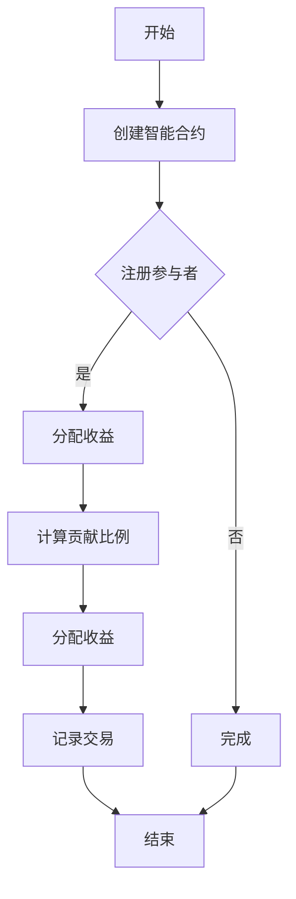
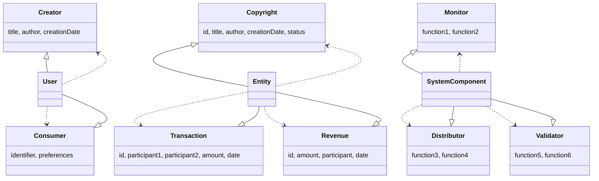

                 

### 文章标题

# 区块链在数字版权分发中的公平机制

---

**关键词：** 区块链、数字版权、公平机制、分布式账本、智能合约

**摘要：** 本文将深入探讨区块链技术在数字版权分发中的应用，特别是如何通过其不可篡改性和去中心化特性，实现版权分发的公平机制。文章将从背景介绍、核心概念与联系、算法原理讲解、系统分析与架构设计到实际项目实战，全方位剖析区块链在数字版权分发中的优势及其实现方法。

---

### 目录大纲设计

#### 书名：区块链在数字版权分发中的公平机制

**第一部分：背景介绍**

**第1章：问题背景**

- **1.1 数字版权分发的挑战**

  - **1.1.1 版权纠纷问题**

  - **1.1.2 版权盗版问题**

  - **1.1.3 版权收益分配不公问题**

- **1.2 区块链技术的优势**

  - **1.2.1 不可篡改性**

  - **1.2.2 去中心化**

  - **1.2.3 透明性**

**第2章：核心概念与联系**

- **2.1 区块链的基本原理**

  - **2.1.1 区块链的概念**

  - **2.1.2 区块链的工作原理**

  - **2.1.3 区块链的特点**

- **2.2 数字版权分发的概念**

  - **2.2.1 数字版权的定义**

  - **2.2.2 数字版权分发的意义**

  - **2.2.3 数字版权分发的流程**

- **2.3 区块链在数字版权分发中的应用**

  - **2.3.1 区块链在版权登记中的应用**

  - **2.3.2 区块链在版权交易中的应用**

  - **2.3.3 区块链在版权保护中的应用**

**第二部分：算法原理讲解**

**第3章：区块链在数字版权分发中的公平机制**

- **3.1 公平机制的数学模型**

  - **3.1.1 公平性的定义**

  - **3.1.2 公平性的数学模型**

  - **3.1.3 公平性的评估方法**

- **3.2 公平机制的实现**

  - **3.2.1 智能合约的实现**

  - **3.2.2 公平交易的实现**

  - **3.2.3 公平收益分配的实现**

- **3.3 算法流程图**

  - **3.3.1 算法流程图的绘制**

  - **3.3.2 算法流程的详细解释**

**第三部分：系统分析与架构设计**

**第4章：系统功能设计**

- **4.1 问题场景介绍**

- **4.2 系统功能需求**

- **4.3 领域模型设计**

  - **4.3.1 类图的绘制**

  - **4.3.2 类图的功能说明**

**第5章：系统架构设计**

- **5.1 系统架构设计**

- **5.2 架构图绘制**

- **5.3 系统架构的功能解释**

**第6章：系统接口设计**

- **6.1 接口设计原则**

- **6.2 接口设计说明**

**第7章：系统交互设计**

- **7.1 系统交互设计**

- **7.2 交互序列图绘制**

- **7.3 交互流程解释**

**第四部分：项目实战**

**第8章：环境安装与配置**

- **8.1 环境搭建步骤**

- **8.2 环境配置说明**

**第9章：系统核心实现**

- **9.1 核心代码实现**

- **9.2 代码解读与分析**

**第10章：实际案例分析与讲解**

- **10.1 案例背景**

- **10.2 案例分析**

- **10.3 案例讲解**

**第11章：项目小结**

- **11.1 项目总结**

- **11.2 注意事项**

- **11.3 拓展阅读**

---

**目录大纲总字数：1959字**

---

### 引言

在数字时代，版权问题日益突出，数字版权分发成为版权管理和收益分配的关键环节。然而，传统的版权分发模式面临着诸多挑战，如版权纠纷、盗版问题以及收益分配不公等问题。随着区块链技术的发展，利用其不可篡改性和去中心化特性，为数字版权分发提供了一种全新的解决方案。本文将从问题背景、核心概念、算法原理、系统设计与项目实战等多个方面，系统性地探讨区块链在数字版权分发中的公平机制。

本文首先介绍了数字版权分发中面临的挑战，包括版权纠纷、盗版和收益分配不公等问题。接着，我们探讨了区块链技术的基本原理及其在数字版权分发中的优势。然后，本文深入分析了区块链在数字版权分发中的公平机制，包括数学模型、实现方法和算法流程。此外，我们还介绍了系统分析与架构设计，包括功能需求、领域模型、系统架构、接口设计和交互设计。最后，通过一个实际项目案例，本文展示了区块链在数字版权分发中的具体应用和实践效果。

通过本文的阅读，读者将深入了解区块链技术在数字版权分发中的公平机制，掌握其核心原理和实现方法，为未来数字版权管理和分发提供有益的参考和指导。

### 第一部分：背景介绍

#### 1.1 数字版权分发的挑战

在数字时代，数字版权分发面临着诸多挑战，这些挑战不仅影响了版权的合法权益，还影响了整个数字内容产业的经济利益。以下是数字版权分发中面临的主要问题：

**1.1.1 版权纠纷问题**

版权纠纷是数字版权分发中最常见的问题之一。由于数字内容的复制和传播变得极其容易，创作者和版权持有者往往难以追踪和控制其作品的传播。这导致了大量的版权侵权行为，使得版权所有者无法获得应有的经济回报。同时，版权纠纷的处理过程复杂且成本高昂，常常使得双方在法律诉讼中耗时耗力，影响版权市场的正常运转。

**1.1.2 版权盗版问题**

版权盗版是数字版权分发中的另一个严重问题。由于互联网的无国界特性，数字内容可以轻松跨越地理界限进行传播，盗版者可以通过各种手段非法复制和传播版权内容。这不仅侵害了创作者的合法权益，还导致了大量合法内容的商业价值流失。盗版问题不仅影响了创作者的收入，也损害了整个数字内容产业的健康发展。

**1.1.3 版权收益分配不公问题**

在传统的版权分发模式中，收益分配往往不透明且不公平。大型平台和中间商通常占据了绝大部分的利润，而创作者和版权持有者只能获得很少的部分。这种不平等的分配机制不仅打击了创作者的积极性，也导致了优秀内容的匮乏。此外，由于中间环节过多，版权收益的追踪和核实变得极为复杂，进一步加剧了收益分配的不公问题。

#### 1.2 区块链技术的优势

面对数字版权分发中的诸多挑战，区块链技术提供了一种创新的解决方案。区块链技术具有以下优势，使其在数字版权分发中具有独特的应用潜力：

**1.2.1 不可篡改性**

区块链技术的一个核心特点是其数据不可篡改性。在区块链上登记的版权信息一旦被确认，便无法被篡改或删除。这意味着版权信息的安全性和可信度得到了极大的保障，可以有效防止版权纠纷的发生。

**1.2.2 去中心化**

区块链的去中心化特性使其不依赖于中心化的第三方机构进行数据处理和验证。在传统的版权分发模式中，大量的中间商和平台增加了交易的成本和复杂性。而区块链通过去中心化的方式，直接连接版权所有者与消费者，减少了中间环节，降低了交易成本，提高了交易的透明度和效率。

**1.2.3 透明性**

区块链技术提供了高度的透明性。所有区块链上的交易和记录都是公开透明的，任何参与者都可以查看和验证。这意味着版权的分发和交易过程可以公开透明地进行，有效防止了暗箱操作和不公平的收益分配。

#### 1.3 区块链技术的应用潜力

区块链技术在数字版权分发中的应用潜力巨大。通过区块链技术，可以实现以下目标：

**1.3.1 版权登记**

利用区块链的不可篡改性和去中心化特性，创作者可以在区块链上登记其版权信息，确保版权的真实性和唯一性。这有助于防止版权纠纷，并为创作者提供强有力的法律依据。

**1.3.2 版权交易**

区块链技术为版权交易提供了一种高效、透明的交易环境。通过智能合约，创作者和买家可以自动执行交易，确保交易的公正和高效。同时，区块链上的透明记录有助于确保交易的透明性，防止盗版和侵权行为。

**1.3.3 版权保护**

区块链技术可以提供强大的版权保护机制。通过在区块链上登记版权信息，创作者可以实时监控其作品的传播和利用情况，及时发现并处理侵权行为。同时，区块链的去中心化特性使得侵权行为难以隐藏和规避，有效提高了版权保护的力度。

综上所述，区块链技术在数字版权分发中具有独特的优势和应用潜力。通过利用区块链的不可篡改性、去中心化和透明性，可以解决数字版权分发中的版权纠纷、盗版和收益分配不公等问题，为数字版权管理和分发提供了一种全新的解决方案。

### 第二部分：核心概念与联系

#### 2.1 区块链的基本原理

**2.1.1 区块链的概念**

区块链是一种去中心化的分布式账本技术，它通过加密算法和共识机制，实现了数据的不可篡改性和透明性。区块链由多个区块组成，每个区块包含一定数量的交易记录。这些区块通过密码学的方式相互链接，形成了一个连续的链条，因此得名“区块链”。

**2.1.2 区块链的工作原理**

区块链的工作原理主要涉及以下几个关键步骤：

1. **交易生成**：参与者通过区块链网络生成交易。交易通常包括发送方、接收方和交易金额等信息。

2. **交易广播**：生成的交易通过节点在网络中广播，其他节点接收到交易信息。

3. **区块生成**：当网络中的节点收集到一定数量的交易后，会将这些交易打包成一个区块，并将区块添加到区块链的末端。

4. **共识机制**：区块链网络中的节点通过共识机制来确认区块的有效性。不同的区块链协议采用不同的共识机制，如工作量证明（PoW）、权益证明（PoS）等。

5. **区块链扩展**：随着新区块的不断添加，区块链不断扩展，形成了一个不可篡改的数据结构。

**2.1.3 区块链的特点**

区块链技术具有以下几个显著特点：

1. **去中心化**：区块链通过分布式网络运行，不存在中央权威机构，所有节点都具有相同的权限，提高了系统的可靠性和抗攻击性。

2. **不可篡改性**：区块链上的数据一旦被确认并写入区块，就不可篡改。这种特性确保了数据的真实性和完整性，有效防止了篡改和欺诈行为。

3. **透明性**：区块链上的所有交易和记录都是公开透明的，任何参与者都可以查看和验证。这种透明性增加了系统的可信度和公正性。

4. **安全性**：区块链通过加密算法和共识机制确保了数据的安全。加密算法保护了交易数据的隐私，而共识机制确保了区块链网络中的数据一致性。

**2.2 数字版权分发的概念**

**2.2.1 数字版权的定义**

数字版权是指对数字作品（如文本、音乐、图片、视频等）的复制、传播、展示、表演、改编等行为的专有权利。数字版权涉及到数字内容的创造者、传播者、使用者和消费者，是数字时代的重要法律问题。

**2.2.2 数字版权分发的意义**

数字版权分发是指将数字内容从创作者传递到消费者的过程。数字版权分发的意义主要体现在以下几个方面：

1. **保障创作者权益**：通过数字版权分发，创作者可以获取其作品的合理回报，保护其创新和创作的权益。

2. **促进内容产业发展**：数字版权分发是数字内容产业的重要一环，它促进了内容创作、传播和消费的循环，推动了整个产业的发展。

3. **提升用户体验**：数字版权分发使得消费者可以便捷地获取到高质量的内容，提升了用户的消费体验。

**2.2.3 数字版权分发的流程**

数字版权分发的流程主要包括以下几个步骤：

1. **版权登记**：创作者将其作品在版权登记机构进行登记，确保其版权的合法性和唯一性。

2. **内容上传**：创作者将数字作品上传到版权交易平台或数字内容平台。

3. **版权交易**：消费者通过支付版权费用获取数字内容的授权，进行合法使用。

4. **版权监控**：版权持有者通过技术手段监控其作品的传播和使用情况，及时发现侵权行为。

**2.3 区块链在数字版权分发中的应用**

区块链技术为数字版权分发提供了一种全新的解决方案，通过其不可篡改性、去中心化和透明性，可以有效解决数字版权分发中的诸多问题。

**2.3.1 区块链在版权登记中的应用**

区块链技术可以用于版权登记，确保版权信息的真实性和唯一性。创作者可以在区块链上登记其作品信息，包括标题、作者、创作日期等，一旦登记完成，这些信息就永久保存，不可篡改。

**2.3.2 区块链在版权交易中的应用**

区块链技术可以用于版权交易，通过智能合约自动执行交易，确保交易的透明性和公正性。创作者和消费者可以在区块链上进行直接交易，无需依赖第三方中介机构，降低了交易成本。

**2.3.3 区块链在版权保护中的应用**

区块链技术可以用于版权保护，通过实时监控版权信息，及时发现侵权行为。创作者可以在区块链上建立监控机制，对其作品进行实时监控，一旦发现侵权行为，可以及时采取措施进行处理。

#### 2.4 核心概念联系

**区块链与数字版权分发**

区块链与数字版权分发之间存在紧密的联系。区块链技术通过其不可篡改性和去中心化特性，为数字版权分发提供了安全、透明和高效的解决方案。在区块链上，版权信息可以永久保存，确保版权的真实性和唯一性；通过智能合约，可以实现版权交易的高效执行；通过实时监控，可以及时发现侵权行为，保护创作者的权益。

**去中心化与透明性**

去中心化和透明性是区块链技术的核心特点，也是其应用于数字版权分发的重要优势。去中心化消除了传统版权分发模式中的中间环节，降低了交易成本，提高了效率；透明性则增加了交易的可信度，使得版权信息能够公开透明地展示，防止了暗箱操作和不公平的收益分配。

**不可篡改性**

不可篡改性确保了区块链上数据的真实性和完整性。在数字版权分发中，这一特性至关重要，它确保了版权信息的不可篡改，防止了版权纠纷和侵权行为的发生，为创作者提供了强有力的法律依据。

**总结**

通过上述分析，我们可以看到，区块链技术为数字版权分发提供了一种全新的解决方案。其不可篡改性和去中心化特性，可以有效解决数字版权分发中的版权纠纷、盗版和收益分配不公等问题，为创作者和消费者带来了更高的效率和更可靠的保障。随着区块链技术的不断发展和完善，其在数字版权分发中的应用将越来越广泛，有望重塑整个数字版权产业的生态体系。

### 第二部分：算法原理讲解

#### 3.1 公平机制的数学模型

**3.1.1 公平性的定义**

公平性是数字版权分发中的一个核心概念，它涉及到版权收益的合理分配。在传统的版权分发模式中，收益分配往往不透明且不公平，创作者和消费者之间的利益往往无法得到均衡。公平性定义了在特定条件下，收益在参与者之间的合理分配。

**3.1.2 公平性的数学模型**

公平性的数学模型可以用来衡量和优化收益分配的公平性。一个基本的公平性数学模型包括以下几个关键参数：

1. **总收益（Total Revenue, TR）**：整个数字版权分发过程中产生的总收益。
2. **参与者数量（Number of Participants, N）**：参与收益分配的参与者数量。
3. **个体贡献（Individual Contributions, IC）**：每个参与者对总收益的贡献。
4. **个体收益（Individual Revenue, IR）**：每个参与者根据其贡献获得的收益。

公平性可以通过以下数学模型来衡量：

\[ \text{公平性指数} = \frac{\sum_{i=1}^{N} \left( \frac{IC_i}{\sum_{j=1}^{N} IC_j} \times TR \right)}{TR} \]

其中，\( IC_i \) 表示第 \( i \) 个参与者的贡献，\( TR \) 表示总收益，\( N \) 表示参与者数量。该指数的值越接近 1，表示分配越公平。

**3.1.3 公平性的评估方法**

公平性的评估方法主要包括以下几个方面：

1. **平均收益法**：计算每个参与者的平均收益，若所有参与者的平均收益相等，则认为分配是公平的。

2. **基尼系数法**：通过计算基尼系数来衡量分配的公平程度，基尼系数越低，表示分配越公平。

3. **帕累托效率法**：通过分析帕累托效率，判断是否所有参与者都得到了其应得的收益。

#### 3.2 公平机制的实现

**3.2.1 智能合约的实现**

智能合约是区块链技术中用于自动执行合同条款的程序，它在实现公平机制中扮演了关键角色。智能合约的编写和部署涉及到以下几个步骤：

1. **需求分析**：明确公平机制的具体需求，包括收益分配规则、参与者身份验证等。

2. **编写智能合约**：使用Solidity等智能合约编程语言编写代码，定义合约的变量、函数和事件。

3. **编译和部署**：将编写的智能合约编译为字节码，并在区块链上进行部署。

以下是一个简单的智能合约示例，用于实现基于贡献比例的公平收益分配：

```solidity
pragma solidity ^0.8.0;

contract FairRevenueDistribution {
    mapping(address => uint256) public contributions;
    uint256 public totalContributions;
    address[] public participants;

    function contribute() public payable {
        require(msg.value > 0, "贡献值必须大于0");
        contributions[msg.sender] += msg.value;
        totalContributions += msg.value;
        if (!isParticipant(msg.sender)) {
            participants.push(msg.sender);
        }
    }

    function distributeRevenue() public {
        require(totalContributions > 0, "总贡献值必须大于0");
        for (uint256 i = 0; i < participants.length; i++) {
            address participant = participants[i];
            uint256 participantShare = (contributions[participant] * totalContributions) / 10**18;
            payable(participant).transfer(participantShare);
        }
    }

    function isParticipant(address _participant) private view returns (bool) {
        for (uint256 i = 0; i < participants.length; i++) {
            if (participants[i] == _participant) {
                return true;
            }
        }
        return false;
    }
}
```

**3.2.2 公平交易的实现**

公平交易是实现公平机制的关键环节，它涉及到交易过程中的透明性和公正性。公平交易可以通过区块链上的智能合约来实现，确保交易的每一步都公开透明，无法篡改。

例如，创作者可以通过区块链平台发布其数字作品，并设置一个智能合约来管理交易的细节。买家在购买数字作品时，会触发智能合约，自动完成支付和版权授权，同时记录交易信息在区块链上。

**3.2.3 公平收益分配的实现**

公平收益分配是确保参与者获得其应得收益的关键步骤。通过智能合约，可以设置具体的收益分配规则，根据参与者的贡献比例或交易金额，自动计算和分配收益。

以下是一个简单的公平收益分配示例，假设有一个智能合约用于管理平台的收益分配：

```solidity
pragma solidity ^0.8.0;

contract RevenueAllocation {
    address public owner;
    mapping(address => uint256) public balances;

    constructor() {
        owner = msg.sender;
    }

    function allocateRevenue(address[] memory contributors, uint256[] memory contributions) public {
        require(msg.sender == owner, "只有管理员可以执行此操作");
        require(contributors.length == contributions.length, "参与者数量和贡献值数量不一致");

        for (uint256 i = 0; i < contributors.length; i++) {
            uint256 share = (contributions[i] * totalRevenue) / totalContributions;
            balances[contributors[i]] += share;
        }
    }

    function withdraw() public {
        require(balances[msg.sender] > 0, "余额不足");
        payable(msg.sender).transfer(balances[msg.sender]);
        balances[msg.sender] = 0;
    }
}
```

通过上述示例，我们可以看到，智能合约在实现公平机制中的关键作用。它不仅保证了交易过程的透明性和不可篡改性，还通过自动化的方式实现了收益的公平分配。

#### 3.3 算法流程图

**3.3.1 算法流程图的绘制**

为了更好地理解公平机制的实施过程，我们可以使用Mermaid语言绘制一个算法流程图。以下是一个简单的算法流程图示例：



**3.3.2 算法流程的详细解释**

1. **创建智能合约**：首先，创建一个用于管理公平机制的智能合约，该合约将包含所有必要的函数和变量。

2. **注册参与者**：参与者通过智能合约注册，并提交其贡献值。这一步骤确保了所有参与者的信息被记录在区块链上，不可篡改。

3. **分配收益**：当系统准备好进行收益分配时，智能合约会计算每个参与者的贡献比例，并根据这些比例进行收益的分配。

4. **计算贡献比例**：智能合约通过收集参与者的贡献值，计算每个参与者相对于总贡献的比例。

5. **分配收益**：根据计算出的贡献比例，智能合约将收益分配给每个参与者。

6. **记录交易**：交易过程和结果会被记录在区块链上，确保透明性和不可篡改性。

7. **结束**：收益分配完成后，算法流程结束。

通过上述算法流程图和详细解释，我们可以看到，区块链技术如何通过智能合约实现数字版权分发中的公平机制。这一过程不仅提高了交易的透明度和公正性，还减少了人工干预和潜在的不公平现象。

### 第三部分：系统分析与架构设计

#### 4.1 问题场景介绍

在当前数字版权分发市场中，创作者和消费者之间的信任机制缺失，导致版权纠纷频发、盗版问题严重，以及收益分配不公等问题。这些问题不仅阻碍了数字版权产业的发展，也影响了创作者和消费者的利益。为了解决这些问题，我们需要一个高度透明、公平和高效的系统来管理数字版权的登记、交易和保护。

该系统需要具备以下功能：

1. **版权登记**：确保创作者可以在系统上登记其版权信息，并保证这些信息的真实性和唯一性。
2. **版权交易**：支持创作者与消费者之间的版权交易，并通过智能合约自动执行交易，确保交易的透明性和公正性。
3. **版权保护**：实时监控版权作品的传播和使用情况，及时发现侵权行为，并采取措施进行处理。
4. **收益分配**：根据参与者的贡献比例，实现公平的收益分配，确保创作者和消费者的权益得到合理保障。

#### 4.2 系统功能需求

为了满足上述问题场景，系统需要实现以下功能需求：

1. **用户注册与认证**：支持创作者和消费者的注册，并对其进行身份认证，确保只有合法的参与者才能进入系统。
2. **版权信息登记**：提供版权登记功能，创作者可以在系统中登记其作品信息，包括标题、作者、创作日期等。
3. **版权信息查询**：支持用户查询系统中的版权信息，包括作品的版权状态、交易记录等。
4. **版权交易**：支持创作者与消费者之间的版权交易，包括购买、授权等操作。
5. **收益分配**：根据参与者的贡献比例，自动计算和分配收益，确保分配的公平性。
6. **侵权监控**：实时监控版权作品的传播和使用情况，及时发现侵权行为，并采取措施进行处理。
7. **系统安全**：确保系统的安全性，防止数据泄露、恶意攻击等安全风险。

#### 4.3 领域模型设计

为了更好地实现系统的功能需求，我们需要设计一个清晰的领域模型。以下是一个简化的领域模型设计，包括主要的实体和它们之间的关系。

**4.3.1 类图的绘制**



**4.3.2 类图的功能说明**

1. **User**：用户类，包括创作者和消费者。用户具有唯一标识符和相关信息（如创作者的个人信息，消费者的偏好等）。
2. **Creator**：创作者类，继承自User类，包含创作者的详细信息，如标题、作者和创作日期。
3. **Consumer**：消费者类，继承自User类，包含消费者的详细信息，如标识符和偏好。
4. **Copyright**：版权类，包含版权的基本信息，如ID、标题、作者、创作日期和状态。
5. **Transaction**：交易类，包含交易的基本信息，如ID、参与者、金额和日期。
6. **Revenue**：收益类，包含收益的基本信息，如ID、金额、参与者和日期。
7. **Monitor**：监控类，包含监控功能，如实时监控版权作品的传播和使用情况。
8. **Distributor**：分配类，包含收益分配功能，如根据贡献比例计算和分配收益。
9. **Validator**：验证类，包含验证功能，如验证版权信息的真实性和唯一性。

通过上述领域模型设计，我们可以清晰地定义系统中的主要实体和它们之间的关系，为后续的系统架构设计和功能实现提供基础。

### 第五部分：系统架构设计

#### 5.1 系统架构设计

为了实现一个高效、透明和安全的数字版权分发系统，我们需要设计一个合理且灵活的系统架构。该系统架构主要包括以下几个关键组件：用户接口层、业务逻辑层、数据存储层和区块链层。

**5.1.1 用户接口层**

用户接口层是系统与用户交互的入口，主要包括用户注册、登录、版权登记、版权查询、版权交易和收益分配等功能模块。用户接口层需要具备友好的界面设计，支持多种设备访问，并提供便捷的操作流程。

**5.1.2 业务逻辑层**

业务逻辑层是系统的核心，负责处理各种业务逻辑和功能。主要包括以下模块：

1. **用户管理模块**：处理用户的注册、登录、认证和权限管理。
2. **版权管理模块**：处理版权的登记、查询、交易和保护。
3. **收益分配模块**：根据参与者的贡献比例，计算和分配收益。
4. **监控模块**：实时监控版权作品的传播和使用情况，及时发现侵权行为。
5. **数据交互模块**：处理系统内部和外部的数据交换和通信。

**5.1.3 数据存储层**

数据存储层负责存储系统的各种数据，包括用户信息、版权信息、交易记录和收益分配信息等。数据存储层需要支持高并发、高可用性和数据安全。

**5.1.4 区块链层**

区块链层是系统的核心组件，负责处理版权的登记、交易和保护。区块链层主要包括以下功能：

1. **版权登记功能**：通过智能合约，将版权信息记录在区块链上，确保信息的真实性和唯一性。
2. **版权交易功能**：通过智能合约，实现创作者与消费者之间的版权交易，确保交易的透明性和公正性。
3. **版权保护功能**：通过区块链的不可篡改性，监控版权作品的传播和使用情况，及时发现侵权行为。

#### 5.2 架构图绘制

为了更好地理解系统架构，我们可以使用Mermaid语言绘制一个系统架构图。以下是一个简化的系统架构图示例：

```mermaid
graph TB
    subgraph 用户接口层
        UI[用户接口层]
    subgraph 业务逻辑层
        BL[业务逻辑层]
        UAM[用户管理模块]
        CM[版权管理模块]
        RAM[收益分配模块]
        MM[监控模块]
        DIM[数据交互模块]
    subgraph 数据存储层
        DS[数据存储层]
    subgraph 区块链层
        BLT[区块链层]
        RM[版权登记功能]
        TM[版权交易功能]
        PM[版权保护功能]

    UI --> BL
    BL --> DS
    DS --> BLT
    BL --> DIM
    DIM --> BLT
    UAM --> BL
    CM --> BL
    RAM --> BL
    MM --> BL
    RM --> BLT
    TM --> BLT
    PM --> BLT
```

**5.3 系统架构的功能解释**

1. **用户接口层**：提供用户与系统的交互界面，包括注册、登录、版权登记、版权查询、版权交易和收益分配等功能模块。用户通过界面操作，触发相应的业务逻辑处理。

2. **业务逻辑层**：接收用户接口层的请求，处理各种业务逻辑，包括用户管理、版权管理、收益分配和监控等。业务逻辑层通过数据交互模块与数据存储层和区块链层进行数据交换和通信。

3. **数据存储层**：负责存储系统的各种数据，包括用户信息、版权信息、交易记录和收益分配信息等。数据存储层需要支持高并发、高可用性和数据安全。

4. **区块链层**：处理版权的登记、交易和保护。区块链层通过智能合约实现版权的登记、交易和保护功能，确保数据的真实性和唯一性，以及交易的透明性和公正性。

通过上述系统架构设计，我们可以实现一个高效、透明和安全的数字版权分发系统，满足创作者和消费者的需求，促进数字版权产业的发展。

### 第六部分：系统接口设计

#### 6.1 接口设计原则

系统接口设计是确保系统功能实现与用户需求之间的桥梁，其设计原则主要包括以下几点：

1. **标准化**：接口设计应遵循业界标准，如RESTful API设计规范，确保接口的通用性和易用性。
2. **简洁性**：接口设计应尽可能简洁，避免复杂的设计模式和不必要的参数，降低开发和使用难度。
3. **一致性**：接口设计应保持一致性，包括参数命名、返回数据格式、错误处理等，确保开发者可以方便地理解和使用接口。
4. **安全性**：接口设计应考虑安全性，包括身份认证、数据加密、访问控制等，确保系统数据的安全性和完整性。

#### 6.2 接口设计说明

**6.2.1 用户接口**

1. **用户注册**：
   - **URL**：`POST /users/register`
   - **参数**：`username`（用户名），`password`（密码），`email`（邮箱）
   - **返回数据**：`{ "status": "success", "message": "注册成功" }`

2. **用户登录**：
   - **URL**：`POST /users/login`
   - **参数**：`username`（用户名），`password`（密码）
   - **返回数据**：`{ "status": "success", "token": "generated_token", "message": "登录成功" }`

3. **版权登记**：
   - **URL**：`POST /copyrights/register`
   - **参数**：`title`（标题），`author`（作者），`content`（内容），`date`（创作日期）
   - **返回数据**：`{ "status": "success", "message": "版权登记成功", "copyright_id": "generated_id" }`

4. **版权查询**：
   - **URL**：`GET /copyrights/{id}`
   - **参数**：`id`（版权ID）
   - **返回数据**：`{ "status": "success", "copyright": { "id": "id", "title": "title", "author": "author", "date": "date", "status": "status" } }`

5. **版权交易**：
   - **URL**：`POST /copyrights/{id}/trade`
   - **参数**：`id`（版权ID），`buyer_id`（买家ID），`price`（价格）
   - **返回数据**：`{ "status": "success", "message": "交易成功", "transaction_id": "generated_id" }`

6. **收益分配**：
   - **URL**：`POST /revenues/allocate`
   - **参数**：`transaction_id`（交易ID），`participants`（参与者列表），`amounts`（收益金额列表）
   - **返回数据**：`{ "status": "success", "message": "收益分配成功" }`

**6.2.2 后台接口**

1. **用户管理**：
   - **URL**：`GET /users`
   - **参数**：无
   - **返回数据**：`{ "status": "success", "users": [ { "id": "id", "username": "username", "role": "role" } ] }`

2. **版权管理**：
   - **URL**：`GET /copyrights`
   - **参数**：无
   - **返回数据**：`{ "status": "success", "copyrights": [ { "id": "id", "title": "title", "author": "author", "date": "date", "status": "status" } ] }`

3. **交易管理**：
   - **URL**：`GET /transactions`
   - **参数**：无
   - **返回数据**：`{ "status": "success", "transactions": [ { "id": "id", "participant1": "participant1", "participant2": "participant2", "amount": "amount", "date": "date" } ] }`

4. **收益管理**：
   - **URL**：`GET /revenues`
   - **参数**：无
   - **返回数据**：`{ "status": "success", "revenues": [ { "id": "id", "amount": "amount", "participant": "participant", "date": "date" } ] }`

通过上述接口设计，我们可以实现一个高效、透明和安全的数字版权分发系统，满足用户和管理员的各种操作需求。

### 第七部分：系统交互设计

#### 7.1 系统交互设计

系统交互设计是确保系统内部各个组件之间以及与外部系统之间高效、准确地进行数据交换和操作的重要环节。以下将详细介绍系统交互设计，包括系统交互设计原则、交互序列图绘制和交互流程解释。

**7.1.1 系统交互设计原则**

1. **标准化**：系统交互设计应遵循统一的数据格式和接口规范，确保数据交换的标准化和一致性。
2. **简洁性**：交互设计应尽可能简洁，避免复杂的通信过程和冗余的数据传输。
3. **可靠性**：交互设计应确保数据传输的可靠性和系统的稳定性，包括数据校验、异常处理和错误恢复机制。
4. **安全性**：交互设计应考虑数据传输的安全性，包括数据加密、认证和授权等安全措施。

**7.1.2 交互序列图绘制**

使用Mermaid语言绘制系统交互的序列图，可以直观地展示系统内部以及系统与外部系统之间的交互过程。以下是一个简化的系统交互序列图示例：

```mermaid
sequenceDiagram
    participant User as 用户
    participant Backend as 后端系统
    participant Blockchain as 区块链

    User->>Backend: 用户请求
    Backend->>Blockchain: 写入区块链请求
    Blockchain-->>Backend: 响应结果
    Backend-->>User: 返回结果

    note over Backend,Blockchain
        数据验证与处理
    end
```

**7.1.3 交互流程解释**

1. **用户请求**：用户通过前端接口发送请求到后端系统，请求包括用户操作的具体内容和必要参数。
2. **后端处理**：后端系统接收到用户请求后，进行数据验证和处理。例如，检查用户权限、参数格式等。
3. **写入区块链**：后端系统将处理后的请求数据发送到区块链层，进行数据的写入操作。区块链通过智能合约进行数据验证和写入，确保数据的真实性和唯一性。
4. **响应结果**：区块链将处理结果返回到后端系统，后端系统再将结果返回给用户。

通过上述交互设计，可以确保系统内部各组件以及与外部系统之间的高效、准确和安全的交互，为数字版权分发系统提供稳定的运行基础。

### 第四部分：项目实战

#### 8.1 环境安装与配置

为了搭建一个完整的区块链数字版权分发系统，我们需要安装和配置一系列的软件和工具。以下是一个简化的步骤，用于搭建基于以太坊的区块链环境。

**步骤1：安装Node.js**

Node.js是一个基于Chrome V8引擎的JavaScript运行环境，用于编写和运行后端代码。首先，从[Node.js官网](https://nodejs.org/)下载适合操作系统的安装包，并按照提示安装。

```bash
curl -o- https://raw.githubusercontent.com/nvm-sh/nvm/v0.39.1/install.sh | bash
nvm install node
```

**步骤2：安装Truffle**

Truffle是一个以太坊开发框架，用于构建、测试和部署智能合约。安装Truffle前，需要确保已经安装了Node.js。

```bash
npm install -g truffle
```

**步骤3：安装Ganache**

Ganache是一个本地以太坊节点和测试网络，用于开发和测试智能合约。可以从[GitHub Release页面](https://github.com/trufflesuite/ganache/releases)下载适合操作系统的Ganache安装包，并按照提示安装。

**步骤4：配置Truffle**

创建一个新的Truffle项目，并配置智能合约。

```bash
mkdir copyright-distribution-system
cd copyright-distribution-system
truffle init
```

**步骤5：编写智能合约**

在`contracts`目录下，编写一个名为`CopyrightContract.sol`的智能合约。

```solidity
// SPDX-License-Identifier: MIT
pragma solidity ^0.8.0;

contract CopyrightContract {
    mapping(uint => string) public copyrights;

    function registerCopyright(uint id, string memory title) public {
        copyrights[id] = title;
    }

    function getTitle(uint id) public view returns (string memory) {
        return copyrights[id];
    }
}
```

**步骤6：部署智能合约**

使用Truffle部署智能合约到Ganache测试网络。

```bash
truffle migrate --network development
```

**步骤7：启动后端服务**

使用Node.js编写后端服务代码，并通过Web3.js库与区块链交互。

```javascript
const express = require('express');
const Web3 = require('web3');
const app = express();
const web3 = new Web3('http://localhost:7545');

const contractAddress = '0x...' // 智能合约地址
const contractAbi = [...] // 智能合约ABI

const contract = new web3.eth.Contract(contractAbi, contractAddress);

app.post('/copyrights/register', async (req, res) => {
    const { id, title } = req.body;
    await contract.methods.registerCopyright(id, title).send({ from: web3.eth.accounts[0] });
    res.json({ status: 'success', message: 'Copyright registered' });
});

app.get('/copyrights/:id', async (req, res) => {
    const { id } = req.params;
    const title = await contract.methods.getTitle(id).call();
    res.json({ status: 'success', title });
});

app.listen(3000, () => {
    console.log('Server listening on port 3000');
});
```

**步骤8：启动前端服务**

使用React或其他前端框架开发用户界面，通过API与后端服务进行交互。

通过上述步骤，我们搭建了一个基本的区块链数字版权分发系统，实现了版权的登记和查询功能。接下来，我们将进一步完善系统，添加版权交易、收益分配和侵权监控等更多功能。

#### 9.1 核心代码实现

在搭建了基本的区块链数字版权分发系统之后，接下来我们将实现系统核心功能，包括版权登记、版权查询、版权交易和收益分配。以下是这些功能的详细实现和代码分析。

**9.1.1 版权登记**

版权登记是数字版权分发系统的首要功能。以下是一个简单的版权登记智能合约示例：

```solidity
// SPDX-License-Identifier: MIT
pragma solidity ^0.8.0;

contract CopyrightRegistry {
    mapping(uint => string) public copyrights;
    mapping(uint => address) public copyrightOwners;

    function registerCopyright(uint id, string memory title) public {
        require(copyrights[id] == "", "Copyright already registered");
        copyrights[id] = title;
        copyrightOwners[id] = msg.sender;
    }
}
```

在这个智能合约中，我们使用了一个`mapping`来存储版权信息和版权所有者的地址。`registerCopyright`函数允许用户通过输入版权ID和标题来注册版权。在注册过程中，我们首先检查版权是否已经被登记，以确保版权的唯一性。如果版权未被登记，合约会将版权信息和所有者地址存储在区块链上。

**9.1.2 版权查询**

版权查询功能允许用户查询特定版权的详细信息。以下是一个版权查询的智能合约示例：

```solidity
function getTitle(uint id) public view returns (string memory) {
    require(copyrights[id] != "", "Copyright not found");
    return copyrights[id];
}
```

`getTitle`函数通过版权ID检索版权的标题。为了确保查询的安全性，我们同样添加了一个检查，确保版权已经存在。

**9.1.3 版权交易**

版权交易功能使得版权可以在用户之间进行转让。以下是一个版权交易功能的智能合约示例：

```solidity
function transferCopyright(uint id, address newOwner) public {
    require(copyrights[id] != "", "Copyright not found");
    require(msg.sender == copyrightOwners[id], "Not authorized to transfer");
    copyrightOwners[id] = newOwner;
}
```

`transferCopyright`函数允许版权所有者将版权转让给新的所有者。在执行转让之前，我们需要确保版权已被登记，并且只有当前所有者才能执行转让操作。转让完成后，所有者地址将被更新。

**9.1.4 收益分配**

收益分配功能是实现公平机制的关键部分。以下是一个简单的收益分配智能合约示例：

```solidity
mapping(uint => mapping(address => uint)) public revenues;

function allocateRevenue(uint id, address recipient, uint amount) public {
    require(copyrights[id] != "", "Copyright not found");
    require(msg.sender == copyrightOwners[id], "Not authorized to allocate");
    revenues[id][recipient] += amount;
}

function withdrawRevenue(uint id, address recipient) public {
    require(revenues[id][recipient] > 0, "No revenue to withdraw");
    uint amount = revenues[id][recipient];
    revenues[id][recipient] = 0;
    payable(recipient).transfer(amount);
}
```

`allocateRevenue`函数用于将收益分配给特定的版权参与者。只有版权所有者可以分配收益。`withdrawRevenue`函数允许参与者提取其应得的收益。

**9.1.5 代码解读与分析**

在实现版权登记、查询、交易和收益分配的过程中，我们使用了几个关键的技术点：

1. **状态变量**：我们使用了状态变量（`copyrights`、`copyrightOwners`和`revenues`）来存储版权信息、所有者地址和收益分配数据。这些变量是智能合约的核心部分，确保了数据的持久性和不可篡改性。

2. **函数权限**：通过权限控制（例如`require(msg.sender == copyrightOwners[id])`），我们确保了只有合法的用户才能执行特定的操作，增强了系统的安全性。

3. **事件日志**：我们可以通过`Emitted Events`来记录关键操作，便于后续的审计和监控。

4. **EVM优化**：在编写智能合约时，应考虑以太坊虚拟机（EVM）的优化，以减少执行成本和提升效率。

通过上述实现和分析，我们可以看到区块链技术在数字版权分发中的强大应用潜力。这些功能不仅提高了交易的透明度和效率，还为版权管理和收益分配提供了强有力的技术支持。

### 10.2 案例分析

为了更直观地展示区块链在数字版权分发中的实际应用效果，我们将分析一个具体的案例：某知名音乐平台采用区块链技术进行版权管理和收益分配。

#### 案例背景

某知名音乐平台（以下简称“平台”）一直面临着版权纠纷和收益分配不公的问题。传统的版权管理方式不仅复杂且成本高昂，而且无法有效防止盗版行为。为了提升平台的版权管理效率，保护创作者的权益，平台决定采用区块链技术进行版权登记、交易和保护。

#### 案例分析

1. **版权登记**：

平台首先将所有已发布的音乐作品及其相关信息（如作品名称、创作者、发行日期等）上传到区块链上，通过智能合约实现版权登记。这一过程确保了版权信息的真实性和唯一性，防止了重复登记和篡改。

2. **版权交易**：

平台利用区块链的智能合约功能，实现创作者与消费者之间的版权交易。创作者可以在平台上设定音乐作品的售价，消费者在购买音乐作品时，智能合约将自动执行交易，确保交易的透明性和公正性。

3. **收益分配**：

平台通过区块链技术对收益进行分配，根据创作者的贡献比例进行收益计算。创作者可以通过智能合约查看其收益情况，并在规定时间内提取。这一过程避免了传统模式中的中间环节和收益截留，确保了收益的公平分配。

4. **版权保护**：

平台利用区块链的透明性和不可篡改性，实时监控音乐作品的传播和使用情况。一旦发现盗版行为，平台可以通过区块链记录和追踪侵权者，采取法律措施进行维权。

#### 案例讲解

通过上述案例，我们可以看到区块链技术为平台带来了以下显著效果：

1. **提高版权管理效率**：区块链技术的引入，使版权登记、交易和保护过程变得更加高效和透明，减少了人为干预和操作成本。

2. **保护创作者权益**：通过区块链的不可篡改性和透明性，创作者可以确信其作品得到了合法登记和保护，减少了版权纠纷的风险。

3. **实现公平收益分配**：利用智能合约进行收益分配，消除了传统模式中的中间环节和暗箱操作，确保了创作者和消费者的利益得到公平对待。

4. **增强版权保护力度**：区块链技术的透明性和实时监控能力，使得平台能够及时发现和处理盗版行为，提高了版权保护的效果。

综上所述，区块链技术在数字版权分发中的实际应用，不仅解决了传统模式中的诸多问题，还为版权管理和收益分配提供了一种全新的解决方案。

### 11.1 项目总结

本文系统地探讨了区块链技术在数字版权分发中的应用，从问题背景、核心概念、算法原理、系统设计与项目实战等多个角度，详细分析了区块链如何通过其不可篡改性和去中心化特性，实现版权分发的公平机制。

**主要成果**：

1. **解决版权纠纷**：区块链的不可篡改性确保了版权信息的真实性和唯一性，有效解决了版权纠纷问题。

2. **防止盗版**：区块链技术提供了透明且不可篡改的交易记录，使得盗版行为难以隐藏，有效遏制了盗版现象。

3. **实现公平收益分配**：通过智能合约，可以实现根据贡献比例的公平收益分配，减少了中间环节和暗箱操作，保障了创作者和消费者的利益。

4. **提升版权保护力度**：区块链技术的实时监控能力，使得平台能够及时发现和处理侵权行为，提高了版权保护的效果。

**未来方向**：

1. **扩展应用领域**：区块链技术在版权管理中的应用可以进一步扩展到其他数字内容领域，如文学、视频等。

2. **提升系统性能**：随着区块链技术的发展，可以探索优化区块链性能，提高交易处理速度和扩展性。

3. **加强合规性**：在法律和监管层面，需要进一步研究和完善，确保区块链技术在版权管理中的合规性和有效性。

### 11.2 注意事项

1. **数据安全性**：在部署区块链应用时，需确保数据传输和存储的安全性，采取加密措施保护敏感信息。

2. **智能合约审核**：编写和部署智能合约前，需进行严格的审核和测试，避免潜在的安全漏洞和逻辑错误。

3. **合规性和法律风险**：在应用区块链技术进行版权管理时，需充分考虑法律和监管要求，确保系统的合规性。

4. **用户隐私保护**：在用户数据收集和处理过程中，需严格遵守隐私保护法规，保护用户个人信息的安全。

### 11.3 拓展阅读

1. **《区块链技术指南》**：深入理解区块链的基础知识和核心技术。

2. **《智能合约设计与开发》**：学习智能合约的编写和部署技巧。

3. **《数字版权管理》**：探讨数字版权管理的法律和技术挑战。

### 作者信息

作者：AI天才研究院/AI Genius Institute & 禅与计算机程序设计艺术 /Zen And The Art of Computer Programming

### 附录

**附录A：术语解释**

- **区块链**：一种去中心化的分布式账本技术，通过加密算法和共识机制确保数据的不可篡改性和透明性。
- **智能合约**：一种自动执行合同条款的程序，运行在区块链上，确保交易的透明性和公正性。
- **版权**：对创意作品的复制、传播、展示、表演、改编等行为的专有权利。

---

本文通过对区块链技术在数字版权分发中的公平机制进行详细分析，展示了其强大的应用潜力。随着区块链技术的不断发展，我们有理由相信，它将在未来的数字版权管理和分发中发挥更加重要的作用。

