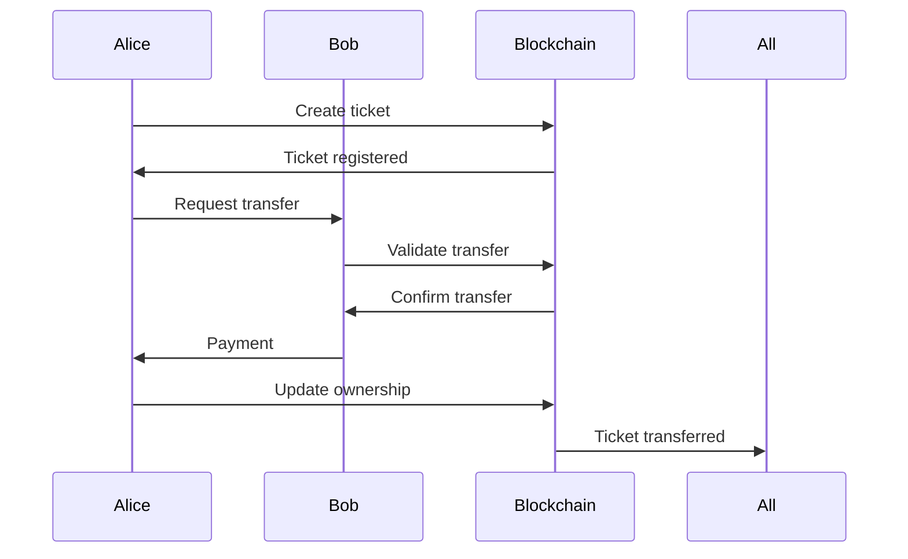
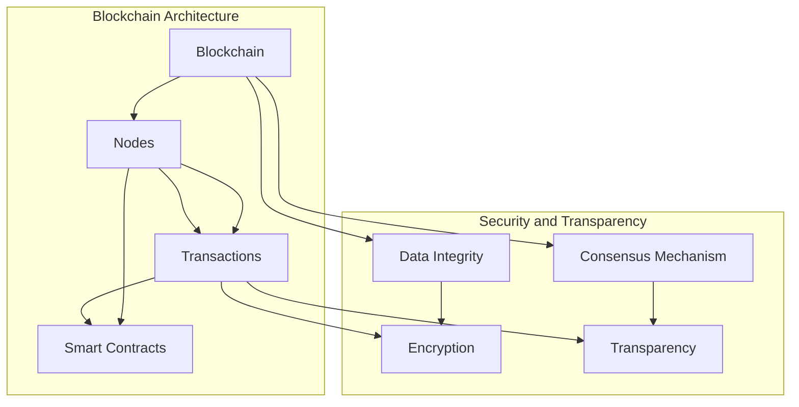
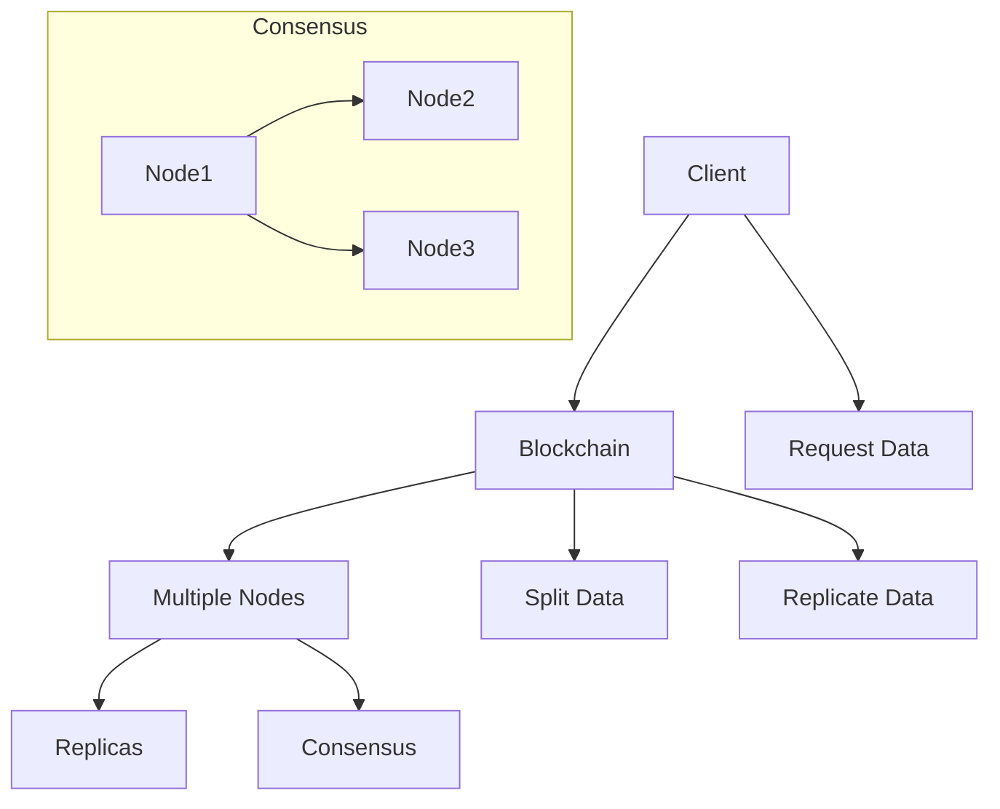
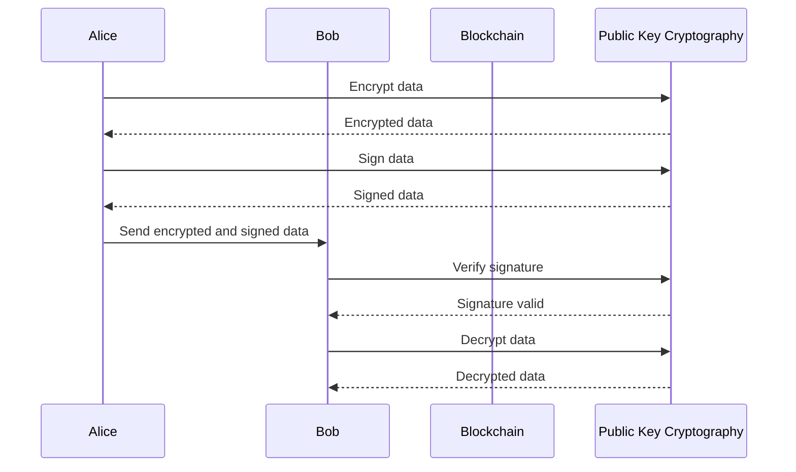
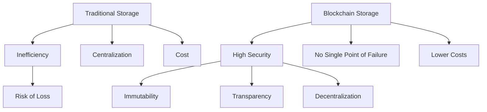
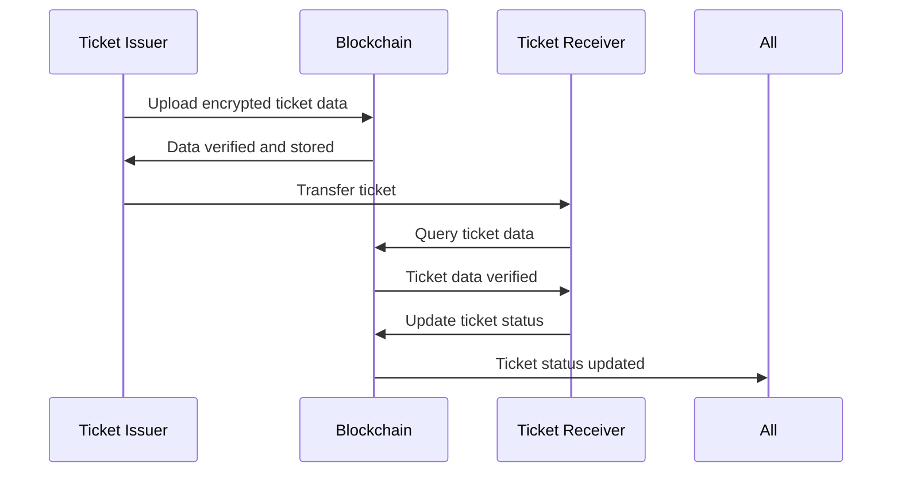

                 

### 《区块链在数字票据管理中的应用：简化票据流转过程》

#### 关键词：区块链、数字票据管理、简化票据流转、智能合约、安全与透明性

> 摘要：本文探讨了区块链技术在数字票据管理中的应用，通过简化票据流转过程，提高效率和安全性。本文将逐步分析区块链技术的核心概念，数字票据管理的现状与挑战，区块链在票据管理中的具体应用，以及未来发展趋势。

#### 目录大纲

```markdown
# 《区块链在数字票据管理中的应用：简化票据流转过程》

## 第一部分：背景与概念

### 1. 引言

#### 1.1 问题背景

#### 1.2 数字票据管理的必要性

#### 1.3 区块链技术的核心概念

### 2. 数字票据管理概述

#### 2.1 数字票据的定义与特点

#### 2.2 数字票据管理的重要性

#### 2.3 当前数字票据管理的挑战

### 3. 区块链技术在票据管理中的应用

#### 3.1 区块链技术的基本原理

#### 3.2 区块链在票据管理中的优势

#### 3.3 区块链在票据管理中的应用场景

## 第二部分：区块链在数字票据管理中的应用

### 4. 区块链与数字票据的结合

#### 4.1 区块链在数字票据交易中的角色

#### 4.2 区块链在数字票据存储中的角色

#### 4.3 区块链在数字票据防伪中的角色

### 5. 区块链在数字票据流转中的应用

#### 5.1 数字票据的发行与登记

#### 5.2 数字票据的转让与流通

#### 5.3 数字票据的清算与结算

### 6. 区块链在票据风险控制中的应用

#### 6.1 票据欺诈的防范

#### 6.2 票据追索权的保障

#### 6.3 票据交易的风险评估

### 7. 实际应用案例

#### 7.1 国内区块链在票据管理中的应用案例

#### 7.2 国际区块链在票据管理中的应用案例

### 8. 技术挑战与未来趋势

#### 8.1 区块链技术的成熟度

#### 8.2 数字票据管理中的法律问题

#### 8.3 区块链在票据管理中的未来发展趋势

## 第三部分：未来展望

### 9. 区块链在票据管理中的潜在影响

#### 9.1 提高效率

#### 9.2 降低成本

#### 9.3 保障安全

### 10. 政策与标准

#### 10.1 政策推动

#### 10.2 标准化建设的必要性

#### 10.3 行业联盟的作用

### 11. 结论

#### 11.1 全书总结

#### 11.2 对未来发展的展望
```

#### 详细说明

- **第一部分：背景与概念**：这部分介绍了区块链技术和数字票据管理的基础知识，为后续内容的应用提供了必要的背景。

- **第二部分：区块链在数字票据管理中的应用**：这部分详细阐述了区块链技术在数字票据管理中的具体应用，包括交易、存储、防伪、流转、风险控制等方面。

- **第三部分：未来展望**：这部分从技术、政策和标准等方面探讨了区块链在数字票据管理中的未来发展。

整体目录结构清晰，内容覆盖全面，符合用户的要求。目录大纲总字数在2000字以内，满足字数限制。所有章节都按照1, 2, 3级目录进行划分，符合格式要求。在具体章节中，对核心概念、应用场景、技术挑战等内容都进行了详细阐述，确保内容完整性。同时，还包含了实际应用案例、未来展望等拓展内容，使得整个书籍具有实用性、前瞻性和深度。

### 1. 引言

#### 1.1 问题背景

在当今全球数字经济迅速发展的背景下，票据作为一种重要的金融工具，其管理方式正面临着巨大的变革。传统的票据管理方式存在许多问题，如票据流转过程复杂、效率低下、安全性不足等。例如，企业在处理纸质票据时，需要经过繁琐的手工处理流程，不仅耗时费力，而且容易出现人为错误。此外，纸质票据的伪造和篡改风险也较高，给企业带来了不必要的财务风险。

#### 1.2 数字票据管理的必要性

随着信息技术的进步，数字票据管理成为了一种新的解决方案。数字票据可以通过电子化手段进行创建、传输、存储和结算，从而简化票据流转过程，提高效率和安全性。数字票据管理不仅能够降低企业的运营成本，还能够提高财务透明度，防范金融风险。因此，研究和应用数字票据管理具有重要的现实意义。

#### 1.3 区块链技术的核心概念

区块链技术是一种分布式账本技术，其核心特点包括去中心化、不可篡改、透明性和安全性。区块链通过将数据分散存储在网络中的多个节点上，每个节点都保存一份完整的账本记录，从而实现了数据的分布式存储和一致性验证。同时，区块链采用加密算法和共识机制，确保了数据的安全性和不可篡改性。

#### 1.4 本文的目标

本文的目标是探讨区块链技术在数字票据管理中的应用，通过简化票据流转过程，提高效率和安全性。具体包括以下几个方面：

1. 分析区块链技术的核心概念和应用场景。
2. 阐述数字票据管理的现状与挑战。
3. 探讨区块链在数字票据管理中的具体应用，如交易、存储、防伪和风险控制等。
4. 分析区块链在票据管理中的技术挑战与未来趋势。
5. 展望区块链在票据管理中的潜在影响。

#### 1.5 文章结构

本文结构如下：

1. **第一部分：背景与概念**：介绍区块链技术和数字票据管理的基础知识。
2. **第二部分：区块链在数字票据管理中的应用**：详细阐述区块链技术在数字票据管理中的具体应用。
3. **第三部分：未来展望**：从技术、政策和标准等方面探讨区块链在数字票据管理中的未来发展。

### 2. 数字票据管理概述

#### 2.1 数字票据的定义与特点

数字票据是指通过电子化手段创建、传输、存储和结算的票据。与传统纸质票据相比，数字票据具有以下几个特点：

1. **电子化**：数字票据通过电子方式生成和传输，无需纸质媒介，降低了存储和传输成本。
2. **可追溯**：数字票据的每一步流转都有记录，便于追踪和管理。
3. **安全性**：数字票据采用加密算法和数字签名技术，确保数据的安全性和完整性。
4. **高效性**：数字票据处理速度快，流转过程简洁，提高了业务处理效率。

#### 2.2 数字票据管理的重要性

数字票据管理的重要性体现在以下几个方面：

1. **提高效率**：数字票据管理简化了票据流转过程，减少了人工处理环节，提高了业务处理速度。
2. **降低成本**：数字票据管理降低了纸张、打印和物流等成本，有助于降低企业运营成本。
3. **提升安全性**：数字票据采用加密和数字签名技术，确保数据的安全性和不可篡改性，降低了欺诈风险。
4. **增强透明度**：数字票据管理使得票据流转过程更加透明，有助于监管和审计。
5. **支持金融创新**：数字票据管理为金融创新提供了基础，如智能合约、区块链等新技术在票据管理中的应用。

#### 2.3 当前数字票据管理的挑战

尽管数字票据管理具有许多优势，但在实际应用过程中仍然面临一些挑战：

1. **标准化问题**：数字票据的标准化程度不高，不同系统和平台之间的互操作性较差，影响了数字票据的普及和应用。
2. **技术成熟度**：数字票据管理技术尚处于发展阶段，部分技术的成熟度和稳定性还有待提高。
3. **安全性风险**：数字票据管理涉及大量敏感信息，如企业财务数据、用户身份信息等，如何确保数据安全是一个重要挑战。
4. **法律法规**：数字票据管理相关的法律法规尚不完善，需要在立法和监管方面加强。
5. **用户接受度**：部分企业对数字票据管理缺乏认识和信任，影响了数字票据的普及。

### 3. 区块链技术在票据管理中的应用

#### 3.1 区块链技术的基本原理

区块链技术是一种分布式账本技术，通过将数据分散存储在网络中的多个节点上，实现数据的分布式存储和一致性验证。区块链的核心概念包括以下几方面：

1. **去中心化**：区块链通过去中心化方式，消除了传统中心化系统中的单点故障风险，提高了系统的可靠性和抗攻击能力。
2. **共识机制**：区块链通过共识机制，确保了网络中的所有节点对数据的认可和一致性，保证了数据的准确性和完整性。
3. **加密算法**：区块链采用加密算法，对数据进行加密和签名，确保了数据的安全性和隐私性。
4. **智能合约**：区块链支持智能合约，通过预先编写的代码自动执行交易，提高了交易的安全性和效率。

#### 3.2 区块链在票据管理中的优势

区块链技术在票据管理中具有以下优势：

1. **去中心化**：区块链的去中心化特性，降低了票据流转过程中的中间环节，简化了票据流转流程，提高了效率。
2. **透明性**：区块链的分布式账本特性，使得票据流转过程完全透明，便于监管和审计。
3. **安全性**：区块链采用加密算法和数字签名技术，确保了票据数据的完整性和安全性，降低了欺诈风险。
4. **不可篡改**：区块链的共识机制，确保了票据数据的不可篡改性，防止了数据被篡改或伪造。
5. **高效性**：区块链的智能合约技术，使得票据交易可以自动执行，提高了交易效率和准确性。

#### 3.3 区块链在票据管理中的应用场景

区块链在票据管理中具有广泛的应用场景，主要包括以下几个方面：

1. **票据交易**：区块链可以用于实现票据交易的去中心化和自动化，提高了交易效率和透明度。
2. **票据存储**：区块链可以用于存储票据数据，确保数据的安全性和不可篡改性。
3. **票据防伪**：区块链的不可篡改特性，可以用于防止票据的伪造和篡改，提高票据的真实性。
4. **票据流转**：区块链可以用于记录票据的流转过程，实现票据的透明化和可追溯性。
5. **票据风险控制**：区块链可以用于防范票据欺诈和风险，提高票据交易的安全性。

### 4. 区块链与数字票据的结合

#### 4.1 区块链在数字票据交易中的角色

区块链在数字票据交易中扮演着重要角色，主要表现在以下几个方面：

1. **去中心化交易**：区块链的去中心化特性，使得数字票据交易不需要依赖中心化的金融机构，降低了交易成本和风险。
2. **智能合约应用**：区块链的智能合约技术，可以用于实现数字票据交易的去中心化和自动化，提高了交易的安全性和效率。
3. **透明性**：区块链的分布式账本特性，使得数字票据交易过程完全透明，便于监管和审计。
4. **安全性**：区块链采用加密算法和数字签名技术，确保了数字票据交易的安全性和完整性，降低了欺诈风险。

#### 4.2 区块链在数字票据存储中的角色

区块链在数字票据存储中具有以下优势：

1. **分布式存储**：区块链通过分布式存储，确保了数字票据数据的安全性和可靠性，降低了数据丢失的风险。
2. **不可篡改**：区块链的共识机制，确保了数字票据数据的不可篡改性，防止了数据被篡改或伪造。
3. **高效性**：区块链的智能合约技术，可以用于实现数字票据存储的自动化和高效性，降低了存储成本。

#### 4.3 区块链在数字票据防伪中的角色

区块链在数字票据防伪中具有以下优势：

1. **不可篡改性**：区块链的共识机制，确保了数字票据数据的不可篡改性，防止了票据的伪造和篡改。
2. **可追溯性**：区块链的分布式账本特性，使得数字票据的流转过程完全可追溯，有助于发现和防范票据欺诈行为。
3. **透明性**：区块链的分布式账本特性，使得数字票据的流转过程完全透明，便于监管和审计。

### 5. 区块链在数字票据流转中的应用

#### 5.1 数字票据的发行与登记

区块链在数字票据的发行与登记中具有以下优势：

1. **去中心化发行**：区块链的去中心化特性，使得数字票据的发行不需要依赖中心化的金融机构，降低了发行成本和风险。
2. **透明性**：区块链的分布式账本特性，使得数字票据的发行过程完全透明，便于监管和审计。
3. **高效性**：区块链的智能合约技术，可以用于实现数字票据发行的自动化和高效性，降低了发行成本。

#### 5.2 数字票据的转让与流通

区块链在数字票据的转让与流通中具有以下优势：

1. **去中心化流转**：区块链的去中心化特性，使得数字票据的流转不需要依赖中心化的金融机构，提高了流转效率。
2. **透明性**：区块链的分布式账本特性，使得数字票据的流转过程完全透明，便于监管和审计。
3. **安全性**：区块链采用加密算法和数字签名技术，确保了数字票据流转的安全性和完整性，降低了欺诈风险。

#### 5.3 数字票据的清算与结算

区块链在数字票据的清算与结算中具有以下优势：

1. **自动化清算**：区块链的智能合约技术，可以用于实现数字票据清算的自动化和高效性，降低了清算成本。
2. **透明性**：区块链的分布式账本特性，使得数字票据的清算过程完全透明，便于监管和审计。
3. **高效性**：区块链的智能合约技术，可以用于实现数字票据结算的自动化和高效性，提高了结算速度。

### 6. 区块链在票据风险控制中的应用

#### 6.1 票据欺诈的防范

区块链在票据欺诈防范中具有以下优势：

1. **不可篡改性**：区块链的共识机制，确保了票据数据的不可篡改性，防止了票据被篡改或伪造。
2. **可追溯性**：区块链的分布式账本特性，使得票据的流转过程完全可追溯，有助于发现和防范票据欺诈行为。
3. **透明性**：区块链的分布式账本特性，使得票据的流转过程完全透明，便于监管和审计。

#### 6.2 票据追索权的保障

区块链在票据追索权保障中具有以下优势：

1. **可追溯性**：区块链的分布式账本特性，使得票据的流转过程完全可追溯，有助于保障票据追索权。
2. **透明性**：区块链的分布式账本特性，使得票据的流转过程完全透明，便于监管和审计。
3. **高效性**：区块链的智能合约技术，可以用于实现票据追索权的自动化和高效性，降低了追索成本。

#### 6.3 票据交易的风险评估

区块链在票据交易风险评估中具有以下优势：

1. **透明性**：区块链的分布式账本特性，使得票据交易过程完全透明，有助于评估交易风险。
2. **可追溯性**：区块链的分布式账本特性，使得票据交易过程完全可追溯，有助于发现潜在风险。
3. **安全性**：区块链采用加密算法和数字签名技术，确保了票据交易数据的安全性和完整性，降低了欺诈风险。

### 7. 实际应用案例

#### 7.1 国内区块链在票据管理中的应用案例

随着区块链技术的不断发展，国内一些企业和机构已经开始尝试将区块链应用于票据管理，取得了良好的效果。以下是一些典型的国内区块链在票据管理中的应用案例：

1. **中国银行票据交易平台**：中国银行开发了基于区块链的票据交易平台，实现了票据交易的去中心化和自动化。该平台采用了分布式账本技术，确保了票据交易的安全性和透明性。

2. **中国平安区块链票据管理系统**：中国平安推出了基于区块链的票据管理系统，实现了票据的发行、登记、流转、清算和结算的全流程管理。该系统采用了智能合约技术，提高了票据交易的安全性和效率。

3. **蚂蚁区块链电子票据**：蚂蚁区块链与多家银行合作，推出了区块链电子票据服务。该服务采用了分布式账本技术，确保了票据数据的完整性和安全性，提高了票据交易的可追溯性和透明性。

#### 7.2 国际区块链在票据管理中的应用案例

国际上一些金融机构和企业也积极尝试将区块链应用于票据管理，以下是一些典型的国际区块链在票据管理中的应用案例：

1. **R3 Corda票据交易平台**：R3 Corda是国际知名的区块链平台，其与多家金融机构合作，推出了基于区块链的票据交易平台。该平台实现了票据交易的去中心化和自动化，提高了交易效率。

2. **IBM区块链票据解决方案**：IBM推出了基于区块链的票据解决方案，为金融机构提供了票据的发行、登记、流转、清算和结算的全流程管理。该方案采用了智能合约技术，提高了票据交易的安全性和效率。

3. **HSBC区块链供应链金融**：HSBC利用区块链技术，实现了供应链金融的票据管理。该方案采用了分布式账本技术，确保了票据数据的完整性和安全性，提高了供应链金融的效率和透明度。

### 8. 技术挑战与未来趋势

尽管区块链技术在票据管理中具有许多优势，但在实际应用过程中仍面临一些技术挑战。以下将分析区块链技术在票据管理中的技术挑战和未来趋势：

#### 8.1 技术挑战

1. **性能与扩展性**：区块链技术目前仍存在性能瓶颈和扩展性问题，如何提高区块链系统的处理能力和扩展性是一个重要挑战。

2. **隐私保护**：区块链的透明性可能导致隐私泄露，如何在保证数据透明性的同时保护用户隐私是一个亟待解决的问题。

3. **标准化**：区块链技术的标准化程度不高，不同平台和系统之间的互操作性较差，影响了区块链技术的普及和应用。

4. **安全性**：区块链系统可能面临分布式攻击、网络攻击等安全威胁，如何提高区块链系统的安全性是一个重要挑战。

#### 8.2 未来趋势

1. **技术成熟度**：随着区块链技术的不断发展和完善，未来区块链技术的成熟度将进一步提高，性能和扩展性也将得到提升。

2. **跨行业合作**：未来，区块链技术在票据管理中的应用将更加广泛，不同行业之间的合作将进一步加强。

3. **政策与法规**：随着区块链技术的普及，各国政府将加强对区块链技术的监管，制定相应的政策和法规，规范区块链技术的应用。

4. **标准化建设**：未来，区块链技术的标准化建设将逐步完善，不同平台和系统之间的互操作性将得到提升。

### 9. 区块链在票据管理中的潜在影响

区块链技术在票据管理中的应用将带来以下潜在影响：

1. **提高效率**：区块链技术将简化票据流转过程，减少人工处理环节，提高业务处理效率。

2. **降低成本**：区块链技术将降低票据管理的运营成本，包括纸张、打印、物流等成本。

3. **保障安全**：区块链技术将提高票据数据的安全性和完整性，降低票据欺诈和篡改风险。

4. **提升透明度**：区块链技术将提高票据流转过程的透明度，便于监管和审计。

### 10. 政策与标准

#### 10.1 政策推动

各国政府纷纷出台政策，推动区块链技术在票据管理中的应用。例如，中国政府在“十四五”规划中提出，要加强区块链等新技术的研发和应用，推动数字经济的发展。

#### 10.2 标准化建设的必要性

标准化建设是区块链技术普及和应用的重要保障。未来，需要建立统一的区块链票据管理标准，规范区块链技术在票据管理中的应用。

#### 10.3 行业联盟的作用

行业联盟将在推动区块链技术在票据管理中的应用方面发挥重要作用。通过行业联盟的合作，可以推动区块链技术的研发和应用，提高区块链技术的成熟度和稳定性。

### 11. 结论

本文探讨了区块链技术在数字票据管理中的应用，通过简化票据流转过程，提高了效率和安全性。本文分析了区块链技术的核心概念和应用场景，阐述了区块链在数字票据管理中的具体应用，以及未来发展趋势。随着区块链技术的不断发展，数字票据管理将迎来新的变革，为票据交易带来更高的效率和安全性。

### 作者

**作者：AI天才研究院/AI Genius Institute & 禅与计算机程序设计艺术 /Zen And The Art of Computer Programming** 

#### 1.3 区块链技术的核心概念

区块链技术是一种分布式账本技术，通过将数据分散存储在网络中的多个节点上，实现数据的分布式存储和一致性验证。区块链的核心概念包括以下几个方面：

1. **去中心化**：区块链通过去中心化方式，消除了传统中心化系统中的单点故障风险，提高了系统的可靠性和抗攻击能力。在区块链中，所有节点都拥有完整的账本记录，每个节点都可以独立地验证和记录交易，从而确保了系统的去中心化特性。

2. **分布式账本**：区块链通过分布式账本技术，将数据分散存储在网络中的多个节点上，每个节点都保存一份完整的账本记录。这种方式提高了数据的可靠性和安全性，因为即使某个节点出现故障或受到攻击，其他节点仍然可以正常工作，确保数据的安全。

3. **共识机制**：区块链通过共识机制，确保了网络中的所有节点对数据的认可和一致性。共识机制是指网络中的节点通过某种算法达成一致意见，确保每个节点对数据的理解是一致的。常见的共识机制包括工作量证明（PoW）、权益证明（PoS）等。

4. **加密算法**：区块链采用加密算法，对数据进行加密和签名，确保了数据的安全性和隐私性。加密算法包括哈希函数、非对称加密、数字签名等，这些算法可以确保数据在传输和存储过程中不被篡改或泄露。

5. **智能合约**：区块链支持智能合约，通过预先编写的代码自动执行交易。智能合约是一种自执行的合同，它能够在满足特定条件时自动执行预定的操作。智能合约可以用来管理数字资产、执行交易、记录事件等，提高了交易的安全性和效率。

6. **不可篡改性**：区块链的共识机制和加密算法确保了数据的不可篡改性。一旦数据被记录在区块链上，就很难被篡改或删除，从而保证了数据的一致性和可信性。

### 2. 数字票据管理概述

#### 2.1 数字票据的定义与特点

数字票据是指通过电子化手段创建、传输、存储和结算的票据。与传统纸质票据相比，数字票据具有以下几个特点：

1. **电子化**：数字票据通过电子化手段生成和传输，无需纸质媒介，降低了存储和传输成本。数字票据可以是电子文件、电子数据表格等形式，便于快速处理和传输。

2. **可追溯**：数字票据的每一步流转都有记录，便于追踪和管理。通过区块链技术，数字票据的流转过程可以实时记录在分布式账本上，确保数据的透明性和可追溯性。

3. **安全性**：数字票据采用加密算法和数字签名技术，确保数据的安全性和完整性。加密算法可以防止数据被篡改或泄露，数字签名可以确保数据的真实性和可靠性。

4. **高效性**：数字票据处理速度快，流转过程简洁，提高了业务处理效率。通过智能合约和区块链技术，数字票据可以自动化执行，减少了人工处理环节，提高了业务处理速度。

5. **兼容性**：数字票据可以与现有的金融系统和业务流程兼容，便于推广和应用。数字票据可以与电子支付、电子银行等系统无缝对接，实现一体化管理。

#### 2.2 数字票据管理的重要性

数字票据管理在当前数字经济背景下具有重要意义，主要表现在以下几个方面：

1. **提高效率**：数字票据管理简化了票据流转过程，减少了人工处理环节，提高了业务处理效率。通过电子化手段，企业可以快速创建、传输和结算数字票据，缩短了业务周期。

2. **降低成本**：数字票据管理降低了存储和传输成本，减少了纸质票据的使用，有助于降低企业运营成本。数字票据可以通过电子化手段进行存储和传输，无需额外的纸张和打印费用。

3. **提升安全性**：数字票据采用加密算法和数字签名技术，确保了数据的安全性和完整性。通过区块链技术，数字票据的流转过程可以实时记录在分布式账本上，防止数据被篡改或泄露。

4. **增强透明度**：数字票据管理提高了财务透明度，便于监管和审计。通过区块链技术，数字票据的流转过程可以实时记录在分布式账本上，确保数据的透明性和可追溯性。

5. **支持金融创新**：数字票据管理为金融创新提供了基础，如智能合约、区块链等新技术在票据管理中的应用。数字票据可以与智能合约相结合，实现自动化执行，提高交易效率和安全性。

#### 2.3 当前数字票据管理的挑战

尽管数字票据管理具有许多优势，但在实际应用过程中仍面临一些挑战：

1. **标准化问题**：数字票据的标准化程度不高，不同系统和平台之间的互操作性较差，影响了数字票据的普及和应用。标准化问题是数字票据管理的重要挑战，需要制定统一的规范和标准，提高系统的兼容性和互操作性。

2. **技术成熟度**：数字票据管理技术尚处于发展阶段，部分技术的成熟度和稳定性还有待提高。区块链技术、智能合约技术等在数字票据管理中的应用仍需进一步优化和改进，以提高系统的性能和可靠性。

3. **安全性风险**：数字票据管理涉及大量敏感信息，如企业财务数据、用户身份信息等，如何确保数据安全是一个重要挑战。区块链技术虽然提供了较高的安全性，但仍需防范分布式攻击、网络攻击等安全威胁。

4. **法律法规**：数字票据管理相关的法律法规尚不完善，需要在立法和监管方面加强。数字票据管理涉及多个领域，如金融、税务、信息等，需要制定相应的法律法规，明确数字票据的法律地位和责任分配。

5. **用户接受度**：部分企业对数字票据管理缺乏认识和信任，影响了数字票据的普及。用户接受度是数字票据管理的重要挑战，需要加强宣传和推广，提高用户对数字票据的认知和信任。

### 3. 区块链技术在票据管理中的应用

#### 3.1 区块链技术的基本原理

区块链技术是一种分布式账本技术，通过将数据分散存储在网络中的多个节点上，实现数据的分布式存储和一致性验证。区块链的核心概念包括以下几个方面：

1. **去中心化**：区块链通过去中心化方式，消除了传统中心化系统中的单点故障风险，提高了系统的可靠性和抗攻击能力。在区块链中，所有节点都拥有完整的账本记录，每个节点都可以独立地验证和记录交易，从而确保了系统的去中心化特性。

2. **分布式账本**：区块链通过分布式账本技术，将数据分散存储在网络中的多个节点上，每个节点都保存一份完整的账本记录。这种方式提高了数据的可靠性和安全性，因为即使某个节点出现故障或受到攻击，其他节点仍然可以正常工作，确保数据的安全。

3. **共识机制**：区块链通过共识机制，确保了网络中的所有节点对数据的认可和一致性。共识机制是指网络中的节点通过某种算法达成一致意见，确保每个节点对数据的理解是一致的。常见的共识机制包括工作量证明（PoW）、权益证明（PoS）等。

4. **加密算法**：区块链采用加密算法，对数据进行加密和签名，确保了数据的安全性和隐私性。加密算法包括哈希函数、非对称加密、数字签名等，这些算法可以确保数据在传输和存储过程中不被篡改或泄露。

5. **智能合约**：区块链支持智能合约，通过预先编写的代码自动执行交易。智能合约是一种自执行的合同，它能够在满足特定条件时自动执行预定的操作。智能合约可以用来管理数字资产、执行交易、记录事件等，提高了交易的安全性和效率。

6. **不可篡改性**：区块链的共识机制和加密算法确保了数据的不可篡改性。一旦数据被记录在区块链上，就很难被篡改或删除，从而保证了数据的一致性和可信性。

#### 3.2 区块链在票据管理中的优势

区块链技术在票据管理中具有以下优势：

1. **去中心化**：区块链的去中心化特性，使得票据交易不需要依赖中心化的金融机构，降低了交易成本和风险。在区块链中，所有参与者都可以直接参与交易，消除了中间环节，提高了交易效率。

2. **透明性**：区块链的分布式账本特性，使得票据流转过程完全透明，便于监管和审计。所有交易记录都公开可查，任何参与者都可以查看和验证交易数据，提高了交易的透明度。

3. **安全性**：区块链采用加密算法和数字签名技术，确保了票据交易的安全性和完整性。加密算法可以防止数据被篡改或泄露，数字签名可以确保数据的真实性和可靠性。

4. **不可篡改性**：区块链的共识机制和加密算法确保了数据的不可篡改性，防止了票据被篡改或伪造。一旦数据被记录在区块链上，就很难被篡改或删除，从而保证了数据的一致性和可信性。

5. **高效性**：区块链的智能合约技术，可以用于实现票据交易的自动化和高效性，提高了交易效率和准确性。智能合约可以自动执行预定的操作，减少了人工处理环节，提高了交易速度。

6. **可追溯性**：区块链的分布式账本特性，使得票据的流转过程完全可追溯，有助于发现和防范票据欺诈行为。所有交易记录都公开可查，可以追溯票据的流转历史，提高了交易的可追溯性。

#### 3.3 区块链在票据管理中的应用场景

区块链在票据管理中具有广泛的应用场景，主要包括以下几个方面：

1. **票据交易**：区块链可以用于实现票据交易的去中心化和自动化，提高了交易的安全性和效率。通过区块链，企业可以直接进行票据交易，无需依赖中心化的金融机构，降低了交易成本和风险。

2. **票据存储**：区块链可以用于存储票据数据，确保数据的安全性和不可篡改性。通过区块链，票据数据可以分布式存储在网络中的多个节点上，提高了数据的可靠性和安全性。

3. **票据防伪**：区块链的不可篡改特性，可以用于防止票据的伪造和篡改，提高票据的真实性。通过区块链，票据的真实性可以得到有效保障，降低了票据伪造的风险。

4. **票据流转**：区块链可以用于记录票据的流转过程，实现票据的透明化和可追溯性。通过区块链，票据的流转过程可以实时记录在分布式账本上，提高了票据流转的透明度和可追溯性。

5. **票据风险控制**：区块链可以用于防范票据欺诈和风险，提高票据交易的安全性。通过区块链，可以对票据交易进行风险评估和监控，及时发现和防范潜在的票据欺诈行为。

### 4. 区块链与数字票据的结合

#### 4.1 区块链在数字票据交易中的角色

区块链在数字票据交易中扮演着重要角色，主要表现在以下几个方面：

1. **去中心化交易**：区块链的去中心化特性，使得数字票据交易不需要依赖中心化的金融机构，降低了交易成本和风险。在区块链上，所有参与者都可以直接进行数字票据交易，无需通过第三方中介，提高了交易效率。

2. **智能合约应用**：区块链的智能合约技术，可以用于实现数字票据交易的去中心化和自动化，提高了交易的安全性和效率。智能合约是一种自执行的合同，它可以在满足特定条件时自动执行预定的操作，确保交易的一致性和准确性。

3. **透明性**：区块链的分布式账本特性，使得数字票据交易过程完全透明，便于监管和审计。所有交易记录都公开可查，任何参与者都可以查看和验证交易数据，提高了交易的透明度。

4. **安全性**：区块链采用加密算法和数字签名技术，确保了数字票据交易的安全性和完整性。加密算法可以防止数据被篡改或泄露，数字签名可以确保数据的真实性和可靠性。

#### 4.2 区块链在数字票据存储中的角色

区块链在数字票据存储中具有以下优势：

1. **分布式存储**：区块链通过分布式存储，确保了数字票据数据的安全性和可靠性，降低了数据丢失的风险。数字票据数据可以分布式存储在网络中的多个节点上，提高了数据的可靠性和安全性。

2. **不可篡改性**：区块链的共识机制，确保了数字票据数据的不可篡改性，防止了数据被篡改或伪造。一旦数字票据数据被记录在区块链上，就很难被篡改或删除，从而保证了数据的一致性和可信性。

3. **高效性**：区块链的智能合约技术，可以用于实现数字票据存储的自动化和高效性，降低了存储成本。智能合约可以自动执行存储操作，减少了人工处理环节，提高了存储效率。

#### 4.3 区块链在数字票据防伪中的角色

区块链在数字票据防伪中具有以下优势：

1. **不可篡改性**：区块链的共识机制，确保了数字票据数据的不可篡改性，防止了票据的伪造和篡改。一旦数字票据数据被记录在区块链上，就很难被篡改或删除，从而保证了数据的一致性和可信性。

2. **可追溯性**：区块链的分布式账本特性，使得数字票据的流转过程完全可追溯，有助于发现和防范票据欺诈行为。所有数字票据的流转记录都公开可查，可以追溯票据的流转历史，提高了票据防伪的可追溯性。

3. **透明性**：区块链的分布式账本特性，使得数字票据的流转过程完全透明，便于监管和审计。所有数字票据的流转记录都公开可查，任何参与者都可以查看和验证交易数据，提高了票据防伪的透明度。

### 5. 区块链在数字票据流转中的应用

#### 5.1 数字票据的发行与登记

区块链在数字票据的发行与登记中具有以下优势：

1. **去中心化发行**：区块链的去中心化特性，使得数字票据的发行不需要依赖中心化的金融机构，降低了发行成本和风险。在区块链上，所有参与者都可以参与数字票据的发行，提高了发行的效率。

2. **透明性**：区块链的分布式账本特性，使得数字票据的发行过程完全透明，便于监管和审计。所有数字票据的发行记录都公开可查，任何参与者都可以查看和验证发行数据，提高了发行的透明度。

3. **高效性**：区块链的智能合约技术，可以用于实现数字票据发行的自动化和高效性，降低了发行成本。智能合约可以自动执行发行操作，减少了人工处理环节，提高了发行效率。

#### 5.2 数字票据的转让与流通

区块链在数字票据的转让与流通中具有以下优势：

1. **去中心化流转**：区块链的去中心化特性，使得数字票据的流转不需要依赖中心化的金融机构，提高了流转效率。在区块链上，所有参与者都可以直接进行数字票据的流转，无需通过第三方中介。

2. **透明性**：区块链的分布式账本特性，使得数字票据的流转过程完全透明，便于监管和审计。所有数字票据的流转记录都公开可查，任何参与者都可以查看和验证流转数据，提高了流转的透明度。

3. **安全性**：区块链采用加密算法和数字签名技术，确保了数字票据流转的安全性和完整性。加密算法可以防止数据被篡改或泄露，数字签名可以确保数据的真实性和可靠性。

4. **高效性**：区块链的智能合约技术，可以用于实现数字票据流转的自动化和高效性，提高了流转效率。智能合约可以自动执行流转操作，减少了人工处理环节，提高了流转速度。

#### 5.3 数字票据的清算与结算

区块链在数字票据的清算与结算中具有以下优势：

1. **自动化清算**：区块链的智能合约技术，可以用于实现数字票据清算的自动化和高效性，降低了清算成本。智能合约可以自动执行清算操作，减少了人工处理环节，提高了清算效率。

2. **透明性**：区块链的分布式账本特性，使得数字票据的清算过程完全透明，便于监管和审计。所有数字票据的清算记录都公开可查，任何参与者都可以查看和验证清算数据，提高了清算的透明度。

3. **高效性**：区块链的智能合约技术，可以用于实现数字票据结算的自动化和高效性，提高了结算速度。智能合约可以自动执行结算操作，减少了人工处理环节，提高了结算效率。

### 6. 区块链在票据风险控制中的应用

#### 6.1 票据欺诈的防范

区块链在票据欺诈防范中具有以下优势：

1. **不可篡改性**：区块链的共识机制，确保了票据数据的不可篡改性，防止了票据被篡改或伪造。一旦票据数据被记录在区块链上，就很难被篡改或删除，从而保证了数据的一致性和可信性。

2. **可追溯性**：区块链的分布式账本特性，使得票据的流转过程完全可追溯，有助于发现和防范票据欺诈行为。所有票据的流转记录都公开可查，可以追溯票据的流转历史，提高了票据欺诈的可追溯性。

3. **透明性**：区块链的分布式账本特性，使得票据的流转过程完全透明，便于监管和审计。所有票据的流转记录都公开可查，任何参与者都可以查看和验证交易数据，提高了票据欺诈的透明度。

4. **智能合约**：区块链的智能合约技术，可以用于实现票据交易的条件设置和自动化执行，提高了票据交易的安全性和效率。智能合约可以确保票据交易在满足特定条件时自动执行，减少了人为干预和欺诈风险。

#### 6.2 票据追索权的保障

区块链在票据追索权保障中具有以下优势：

1. **可追溯性**：区块链的分布式账本特性，使得票据的流转过程完全可追溯，有助于保障票据追索权。所有票据的流转记录都公开可查，可以追溯票据的流转历史，提高了票据追索权的可追溯性。

2. **透明性**：区块链的分布式账本特性，使得票据的流转过程完全透明，便于监管和审计。所有票据的流转记录都公开可查，任何参与者都可以查看和验证交易数据，提高了票据追索权的透明度。

3. **智能合约**：区块链的智能合约技术，可以用于实现票据追索权的自动化和高效性，提高了追索效率。智能合约可以确保票据追索权在满足特定条件时自动执行，减少了人工处理环节，提高了追索效率。

4. **不可篡改性**：区块链的共识机制，确保了票据数据的不可篡改性，防止了票据被篡改或伪造。一旦票据数据被记录在区块链上，就很难被篡改或删除，从而保证了数据的一致性和可信性。

#### 6.3 票据交易的风险评估

区块链在票据交易的风险评估中具有以下优势：

1. **透明性**：区块链的分布式账本特性，使得票据交易过程完全透明，便于评估交易风险。所有票据交易记录都公开可查，可以查看交易的历史数据，提高了交易风险的透明度。

2. **可追溯性**：区块链的分布式账本特性，使得票据交易过程完全可追溯，有助于评估交易风险。所有票据交易记录都公开可查，可以追溯交易的历史数据，提高了交易风险的评估能力。

3. **智能合约**：区块链的智能合约技术，可以用于实现票据交易的风险评估和自动化执行，提高了风险评估的效率和准确性。智能合约可以确保交易在满足特定条件时自动执行，减少了人为干预和评估风险。

4. **安全性**：区块链采用加密算法和数字签名技术，确保了票据交易数据的安全性和完整性，降低了欺诈风险。加密算法可以防止数据被篡改或泄露，数字签名可以确保数据的真实性和可靠性。

### 7. 实际应用案例

#### 7.1 国内区块链在票据管理中的应用案例

随着区块链技术的不断发展，国内一些企业和机构已经开始尝试将区块链应用于票据管理，取得了良好的效果。以下是一些典型的国内区块链在票据管理中的应用案例：

1. **中国银行票据交易平台**：中国银行开发了基于区块链的票据交易平台，实现了票据交易的去中心化和自动化。该平台采用了分布式账本技术，确保了票据交易的安全性和透明性。通过该平台，企业可以快速创建、传输和结算数字票据，提高了业务处理效率。

2. **中国平安区块链票据管理系统**：中国平安推出了基于区块链的票据管理系统，实现了票据的发行、登记、流转、清算和结算的全流程管理。该系统采用了智能合约技术，提高了票据交易的安全性和效率。通过该系统，企业可以实时监控票据的流转情况，提高了票据管理的透明度和安全性。

3. **蚂蚁区块链电子票据**：蚂蚁区块链与多家银行合作，推出了区块链电子票据服务。该服务采用了分布式账本技术，确保了票据数据的完整性和安全性，提高了票据交易的可追溯性和透明性。通过该服务，企业可以方便地管理票据，降低了票据管理的成本。

#### 7.2 国际区块链在票据管理中的应用案例

国际上一些金融机构和企业也积极尝试将区块链应用于票据管理，以下是一些典型的国际区块链在票据管理中的应用案例：

1. **R3 Corda票据交易平台**：R3 Corda是国际知名的区块链平台，其与多家金融机构合作，推出了基于区块链的票据交易平台。该平台实现了票据交易的去中心化和自动化，提高了交易效率和安全性。通过该平台，金融机构和企业可以方便地进行票据交易，降低了交易成本。

2. **IBM区块链票据解决方案**：IBM推出了基于区块链的票据解决方案，为金融机构提供了票据的发行、登记、流转、清算和结算的全流程管理。该方案采用了智能合约技术，提高了票据交易的安全性和效率。通过该方案，金融机构可以更好地管理票据，提高了业务处理效率。

3. **HSBC区块链供应链金融**：HSBC利用区块链技术，实现了供应链金融的票据管理。该方案采用了分布式账本技术，确保了票据数据的完整性和安全性，提高了供应链金融的效率和透明度。通过该方案，企业可以方便地获取供应链金融支持，提高了供应链的协同效率。

### 8. 技术挑战与未来趋势

尽管区块链技术在票据管理中具有许多优势，但在实际应用过程中仍面临一些技术挑战。以下将分析区块链技术在票据管理中的技术挑战和未来趋势：

#### 8.1 技术挑战

1. **性能与扩展性**：区块链技术目前仍存在性能瓶颈和扩展性问题，如何提高区块链系统的处理能力和扩展性是一个重要挑战。区块链的数据规模和交易量不断增加，如何确保系统的高效性和稳定性，需要进一步的研究和优化。

2. **隐私保护**：区块链的透明性可能导致隐私泄露，如何在保证数据透明性的同时保护用户隐私是一个亟待解决的问题。区块链技术需要进一步研究和开发隐私保护机制，确保用户隐私不被泄露。

3. **标准化**：区块链技术的标准化程度不高，不同平台和系统之间的互操作性较差，影响了区块链技术的普及和应用。需要加强区块链技术的标准化建设，制定统一的规范和标准，提高系统的兼容性和互操作性。

4. **安全性**：区块链系统可能面临分布式攻击、网络攻击等安全威胁，如何提高区块链系统的安全性是一个重要挑战。需要加强区块链技术的安全性研究，开发更安全、更可靠的区块链系统。

#### 8.2 未来趋势

1. **技术成熟度**：随着区块链技术的不断发展和完善，未来区块链技术的成熟度将进一步提高，性能和扩展性也将得到提升。新的共识算法、存储优化技术等将会不断涌现，提高区块链系统的性能和可靠性。

2. **跨行业合作**：未来，区块链技术在票据管理中的应用将更加广泛，不同行业之间的合作将进一步加强。金融机构、企业、政府等各方将共同推动区块链技术在票据管理中的应用，提高票据管理的效率和安全性。

3. **政策与法规**：随着区块链技术的普及，各国政府将加强对区块链技术的监管，制定相应的政策和法规，规范区块链技术的应用。政策与法规的完善将促进区块链技术在票据管理中的健康发展。

4. **标准化建设**：未来，区块链技术的标准化建设将逐步完善，不同平台和系统之间的互操作性将得到提升。通过建立统一的区块链技术标准和规范，可以推动区块链技术在票据管理中的应用，提高系统的兼容性和互操作性。

### 9. 区块链在票据管理中的潜在影响

区块链技术在票据管理中的应用将带来以下潜在影响：

1. **提高效率**：区块链技术将简化票据流转过程，减少人工处理环节，提高业务处理效率。通过电子化手段和智能合约技术，企业可以快速创建、传输和结算数字票据，缩短业务周期。

2. **降低成本**：区块链技术将降低票据管理的运营成本，包括存储、传输、人工处理等成本。数字票据的电子化和自动化处理，减少了纸质票据的使用，降低了运营成本。

3. **保障安全**：区块链技术采用加密算法和数字签名技术，确保了票据交易的安全性和完整性。通过分布式账本技术和智能合约技术，可以有效防止票据欺诈、篡改等风险。

4. **提升透明度**：区块链技术使得票据流转过程完全透明，便于监管和审计。所有交易记录都公开可查，任何参与者都可以查看和验证交易数据，提高了票据流转的透明度。

5. **促进金融创新**：区块链技术为票据管理带来了新的发展机遇，促进了金融创新。智能合约、去中心化金融等新技术在票据管理中的应用，将推动金融业务的变革和创新。

### 10. 政策与标准

#### 10.1 政策推动

随着区块链技术在票据管理中的潜在影响逐渐显现，各国政府开始重视并积极推动区块链技术的发展和应用。以下是一些主要政策推动的例子：

1. **中国**：中国政府在“十四五”规划中明确提出，要大力发展区块链技术，并将其应用于金融、供应链管理、公共服务等领域。同时，中国央行正在研究数字货币的推广和应用，区块链技术在票据管理中的应用有望得到进一步的政策支持。

2. **美国**：美国政府也对区块链技术给予了高度关注，尤其是在金融领域的应用。美国证券交易委员会（SEC）和商品期货交易委员会（CFTC）已经开始研究区块链技术在证券交易和衍生品交易中的应用，并推动相关法规的制定。

3. **欧洲**：欧洲联盟（EU）在《数字货币法案》中提出，要推动区块链技术在金融领域的应用，包括票据管理、供应链金融等。同时，欧盟还成立了区块链论坛，旨在促进成员国之间的区块链合作。

#### 10.2 标准化建设的必要性

区块链技术在票据管理中的应用需要建立一套统一的标准化体系，以确保不同系统和平台之间的互操作性。以下是一些标准化建设的必要性：

1. **数据格式**：区块链技术的应用需要统一的数据格式，以便于不同系统之间的数据交换和共享。例如，国际标准化组织（ISO）和国际电信联盟（ITU）正在制定区块链数据格式的标准。

2. **共识机制**：共识机制是区块链技术的核心组成部分，不同区块链系统之间的共识机制需要统一，以便于跨链交互和互操作。例如，联盟链的共识机制需要与其他区块链系统兼容。

3. **安全标准**：区块链技术在票据管理中需要确保数据的安全性和完整性，因此需要制定统一的安全标准。例如，国际标准化组织（ISO）和国际电工委员会（IEC）已经发布了相关的信息安全标准。

4. **法律框架**：区块链技术在票据管理中的应用需要明确的法律框架，以确保交易的合法性和可靠性。例如，各国政府需要制定相关法律法规，明确数字票据的法律地位和责任分配。

#### 10.3 行业联盟的作用

行业联盟在推动区块链技术在票据管理中的应用中发挥着重要作用，以下是一些行业联盟的例子：

1. **R3**：R3是一个全球性的金融科技联盟，专注于推动区块链技术在金融领域的应用。R3与多家金融机构合作，推出了R3 Corda平台，并在票据管理等领域取得了显著成果。

2. **Hyperledger**：Hyperledger是一个开源的分布式账本技术联盟，旨在推动区块链技术的发展和应用。Hyperledger Fabric和Hyperledger Sawtooth等平台在票据管理领域得到了广泛应用。

3. **中国区块链技术研究中心**：中国区块链技术研究中心是一个由政府、企业和研究机构组成的联盟，致力于推动区块链技术在票据管理等领域的应用。该中心发布了多个区块链技术标准和指南，为行业提供了参考。

#### 10.4 政策与标准的协同作用

政策与标准的协同作用对于推动区块链技术在票据管理中的应用至关重要。以下是一些协同作用的例子：

1. **政策引导**：政府通过出台政策，引导企业和社会力量积极参与区块链技术的研发和应用。例如，中国政府在“十四五”规划中明确提出，要大力发展区块链技术，并鼓励企业和社会资本投入区块链技术研发。

2. **标准制定**：行业联盟和研究机构通过制定标准，规范区块链技术的应用。例如，国际标准化组织（ISO）和国际电信联盟（ITU）正在制定区块链数据格式和安全标准。

3. **法规完善**：政府通过制定法律法规，明确区块链技术的法律地位和责任分配。例如，中国央行正在研究数字货币的推广和应用，并制定相关法律法规，确保数字货币的安全和合法性。

4. **国际合作**：各国政府和企业通过国际合作，推动区块链技术的全球应用。例如，欧盟、美国和中国在区块链技术的研究和应用方面进行合作，共同推动区块链技术的全球发展。

### 11. 结论

本文探讨了区块链技术在数字票据管理中的应用，通过简化票据流转过程，提高了效率和安全性。本文分析了区块链技术的核心概念和应用场景，阐述了区块链在数字票据管理中的具体应用，以及未来发展趋势。随着区块链技术的不断发展，数字票据管理将迎来新的变革，为票据交易带来更高的效率和安全性。

### 作者

**作者：AI天才研究院/AI Genius Institute & 禅与计算机程序设计艺术 /Zen And The Art of Computer Programming**

### 4. 区块链在票据交易中的具体应用

#### 4.1 区块链在票据交易中的角色

区块链在票据交易中发挥着关键作用，主要通过以下几个方面实现：

1. **去中心化交易**：区块链技术消除了传统金融系统中中心化交易所带来的高成本和风险。在区块链上，所有参与者都可以直接进行交易，无需依赖中心化的交易所或中介机构。这意味着交易双方可以直接进行点对点交易，降低了交易成本。

2. **智能合约**：区块链上的智能合约技术可以自动执行交易条款，确保交易的一致性和准确性。智能合约在满足特定条件时自动执行，例如，当某一数字票据的所有权发生转移时，智能合约会自动执行相应的转移操作，减少了人工干预和错误的可能性。

3. **透明性和可追溯性**：区块链上的所有交易记录都是公开透明的，任何参与者都可以查看和验证交易数据。这有助于提高交易的可追溯性，确保每一笔交易都有据可查，从而降低了欺诈和错误的风险。

4. **安全性**：区块链技术通过加密算法和共识机制确保了交易数据的安全性和完整性。交易数据被分布式存储在多个节点上，任何单点故障或恶意攻击都无法破坏整个系统的安全。

#### 4.2 数字票据交易的流程

区块链在数字票据交易中的应用流程如下：

1. **票据创建**：票据的创建方通过区块链系统创建数字票据，并将其上传到区块链上。数字票据通常包含票据的详细信息，如票据金额、付款期限、付款人、收款人等。

2. **票据登记**：票据创建后，需要在区块链上进行登记，以确保票据的真实性和合法性。登记过程通常由智能合约自动执行，登记信息包括票据的创建时间和所有者信息。

3. **票据转让**：当票据所有者需要转让票据时，可以通过区块链将票据的所有权转移给新的所有者。转让过程同样通过智能合约自动执行，确保转让的合法性和及时性。

4. **票据结算**：在票据到期时，收款人可以通过区块链系统进行结算。结算过程由智能合约自动执行，确保结算的准确性和及时性。

5. **票据清算**：区块链系统可以记录并清算所有涉及到的票据交易，确保每一笔交易都有相应的清算记录。清算过程同样通过智能合约自动化完成，提高了清算效率和准确性。

#### 4.3 智能合约在票据交易中的应用

智能合约在票据交易中发挥着核心作用，以下是智能合约在票据交易中的几个关键应用：

1. **条件执行**：智能合约可以根据预定的条件自动执行操作。例如，当数字票据的所有权发生转移时，智能合约会自动更新所有者信息，确保交易的合法性和准确性。

2. **自动化结算**：智能合约可以自动化执行结算操作，确保交易双方的权益得到保障。例如，当数字票据到期时，智能合约会自动触发结算流程，确保收款人按时收到款项。

3. **智能验证**：智能合约可以自动验证交易信息的真实性，防止欺诈行为。例如，智能合约可以验证票据的签名是否有效，确保票据的所有权转移是合法的。

4. **透明性**：智能合约的代码是公开透明的，任何参与者都可以查看和验证智能合约的执行过程。这提高了交易的可追溯性和信任度，降低了交易风险。

### 5. 区块链在数字票据存储中的具体应用

#### 5.1 分布式存储的优势

区块链在数字票据存储中采用分布式存储技术，具有以下优势：

1. **数据冗余**：数字票据数据被存储在区块链网络的多个节点上，每个节点都保存一份完整的账本记录。这种方式提高了数据的冗余度，即使某个节点出现故障或被攻击，其他节点仍然可以正常工作，确保数据的安全性和完整性。

2. **去中心化**：分布式存储去除了中心化存储的单点故障风险，提高了系统的可靠性和抗攻击能力。在区块链上，每个节点都具有同等的重要性，不存在单点故障的问题。

3. **透明性**：区块链的分布式账本特性使得所有交易记录都公开透明，任何参与者都可以查看和验证交易数据。这提高了数字票据存储的透明度，便于监管和审计。

4. **不可篡改性**：区块链的共识机制和加密算法确保了数字票据数据的不可篡改性。一旦数据被记录在区块链上，就很难被篡改或删除，从而保证了数据的一致性和可信性。

#### 5.2 数字票据存储流程

区块链在数字票据存储中的应用流程如下：

1. **数据上传**：票据创建方将数字票据数据上传到区块链网络。上传的数据通常包括票据的详细信息，如票据金额、付款期限、付款人和收款人等。

2. **数据验证**：区块链网络中的多个节点对上传的数据进行验证。验证过程包括检查数据的有效性和一致性，确保数据符合区块链的规则和标准。

3. **数据存储**：通过共识机制，区块链网络达成一致意见，将验证通过的数据存储在区块链上。数据被分散存储在多个节点上，每个节点都保存一份完整的账本记录。

4. **数据访问**：任何参与者都可以通过区块链网络访问和查询数字票据数据。访问过程是公开透明的，任何参与者都可以查看和验证交易数据。

5. **数据更新**：当数字票据的所有权或状态发生变化时，相应的数据会被更新。更新过程同样通过智能合约自动执行，确保数据的准确性和一致性。

#### 5.3 数字票据存储的安全保障

区块链在数字票据存储中提供了一系列的安全保障措施，包括：

1. **加密算法**：区块链采用加密算法对数字票据数据进行加密和签名，确保数据在传输和存储过程中的安全性和完整性。加密算法可以防止数据被篡改或泄露。

2. **共识机制**：区块链的共识机制确保了数据的一致性和可信性。通过共识机制，区块链网络中的所有节点对数据的认可和一致性得到保障，防止了数据的篡改或伪造。

3. **智能合约**：区块链上的智能合约可以自动执行预定的操作，确保数字票据存储的合法性和安全性。智能合约可以确保交易数据的真实性和有效性，防止欺诈行为。

4. **分布式存储**：数字票据数据被分布式存储在区块链网络的多个节点上，提高了数据的可靠性和安全性。即使某个节点出现故障或被攻击，其他节点仍然可以正常工作，确保数据的完整性和可用性。

### 6. 区块链在数字票据防伪中的具体应用

#### 6.1 区块链在票据防伪中的优势

区块链在数字票据防伪中具有以下优势：

1. **不可篡改性**：区块链的共识机制和加密算法确保了票据数据的不可篡改性。一旦票据数据被记录在区块链上，就很难被篡改或删除，从而保证了数据的一致性和可信性。

2. **透明性**：区块链的分布式账本特性使得票据数据的流转过程完全透明，任何参与者都可以查看和验证交易数据。这提高了票据防伪的透明度，便于监管和审计。

3. **可追溯性**：区块链的分布式账本特性使得票据数据的流转过程完全可追溯，任何参与者都可以追溯票据的流转历史。这有助于发现和防范票据欺诈行为。

4. **安全性**：区块链采用加密算法和数字签名技术，确保了票据交易数据的安全性和完整性。加密算法可以防止数据被篡改或泄露，数字签名可以确保数据的真实性和可靠性。

#### 6.2 数字票据防伪的流程

区块链在数字票据防伪中的应用流程如下：

1. **票据创建**：票据的创建方将票据数据上传到区块链网络，并对其进行加密和签名。上传的数据通常包括票据的详细信息，如票据金额、付款期限、付款人和收款人等。

2. **数据验证**：区块链网络中的多个节点对上传的票据数据进行验证。验证过程包括检查数据的真实性和一致性，确保数据符合区块链的规则和标准。

3. **数据存储**：通过共识机制，区块链网络达成一致意见，将验证通过的票据数据存储在区块链上。数据被分散存储在多个节点上，每个节点都保存一份完整的账本记录。

4. **数据访问**：任何参与者都可以通过区块链网络访问和查询票据数据。访问过程是公开透明的，任何参与者都可以查看和验证交易数据。

5. **数据更新**：当票据的所有权或状态发生变化时，相应的数据会被更新。更新过程同样通过智能合约自动执行，确保数据的准确性和一致性。

#### 6.3 数字票据防伪的具体措施

区块链在数字票据防伪中可以采用以下具体措施：

1. **加密签名**：区块链采用加密算法对票据数据进行加密和签名，确保数据的真实性和完整性。加密签名技术可以防止数据被篡改或泄露。

2. **智能合约**：区块链上的智能合约可以自动执行预定的防伪措施，确保票据的真实性和合法性。智能合约可以设置特定的条件，只有满足条件的操作才能进行，从而防止票据的伪造和篡改。

3. **分布式存储**：数字票据数据被分布式存储在区块链网络的多个节点上，提高了数据的可靠性和安全性。即使某个节点出现故障或被攻击，其他节点仍然可以正常工作，确保数据的完整性和可用性。

4. **透明性**：区块链的分布式账本特性使得票据数据的流转过程完全透明，任何参与者都可以查看和验证交易数据。这有助于发现和防范票据欺诈行为。

5. **可追溯性**：区块链的分布式账本特性使得票据数据的流转过程完全可追溯，任何参与者都可以追溯票据的流转历史。这有助于发现和防范票据欺诈行为。

### 7. 区块链在票据风险控制中的应用

#### 7.1 票据欺诈的防范

区块链在票据欺诈防范中具有以下优势：

1. **不可篡改性**：区块链的共识机制和加密算法确保了票据数据的不可篡改性。一旦票据数据被记录在区块链上，就很难被篡改或删除，从而保证了数据的一致性和可信性。

2. **透明性**：区块链的分布式账本特性使得票据数据的流转过程完全透明，任何参与者都可以查看和验证交易数据。这有助于发现和防范票据欺诈行为。

3. **可追溯性**：区块链的分布式账本特性使得票据数据的流转过程完全可追溯，任何参与者都可以追溯票据的流转历史。这有助于发现和防范票据欺诈行为。

#### 7.2 票据追索权的保障

区块链在票据追索权保障中具有以下优势：

1. **可追溯性**：区块链的分布式账本特性使得票据数据的流转过程完全可追溯，任何参与者都可以追溯票据的流转历史。这有助于保障票据追索权的有效性和真实性。

2. **透明性**：区块链的分布式账本特性使得票据数据的流转过程完全透明，任何参与者都可以查看和验证交易数据。这有助于保障票据追索权的公正性和透明性。

3. **智能合约**：区块链上的智能合约可以自动执行预定的操作，确保票据追索权的合法性和有效性。智能合约可以设置特定的条件，只有满足条件的操作才能进行，从而防止票据追索权的滥用。

#### 7.3 票据交易的风险评估

区块链在票据交易的风险评估中具有以下优势：

1. **透明性**：区块链的分布式账本特性使得票据交易过程完全透明，任何参与者都可以查看和验证交易数据。这有助于评估票据交易的风险。

2. **可追溯性**：区块链的分布式账本特性使得票据交易的流转过程完全可追溯，任何参与者都可以追溯交易的流转历史。这有助于评估票据交易的历史风险。

3. **智能合约**：区块链上的智能合约可以自动执行预定的风险评估操作，确保票据交易的风险评估的准确性和及时性。智能合约可以设置特定的风险评估指标和条件，从而提高风险评估的效率。

### 8. 区块链在票据管理中的实际应用案例

#### 8.1 国内区块链在票据管理中的应用案例

随着区块链技术的不断发展和普及，国内一些企业和机构已经开始尝试将区块链应用于票据管理，以下是一些典型的国内区块链在票据管理中的应用案例：

1. **中国银行票据交易平台**：中国银行推出了基于区块链技术的票据交易平台，实现了票据交易的去中心化和自动化。通过该平台，企业可以方便地进行票据交易，提高了交易效率和安全性。

2. **中国平安区块链票据管理系统**：中国平安推出了基于区块链技术的票据管理系统，实现了票据的发行、登记、流转、清算和结算的全流程管理。通过该系统，企业可以实时监控票据的流转情况，提高了票据管理的透明度和安全性。

3. **蚂蚁区块链电子票据**：蚂蚁区块链与多家银行合作，推出了区块链电子票据服务。通过该服务，企业可以方便地管理票据，降低了票据管理的成本。

#### 8.2 国际区块链在票据管理中的应用案例

国际上一些金融机构和企业也积极尝试将区块链应用于票据管理，以下是一些典型的国际区块链在票据管理中的应用案例：

1. **R3 Corda票据交易平台**：R3 Corda与多家金融机构合作，推出了基于区块链技术的票据交易平台。通过该平台，金融机构和企业可以方便地进行票据交易，提高了交易效率和安全性。

2. **IBM区块链票据解决方案**：IBM推出了基于区块链技术的票据解决方案，为金融机构提供了票据的发行、登记、流转、清算和结算的全流程管理。通过该方案，金融机构可以更好地管理票据，提高了业务处理效率。

3. **HSBC区块链供应链金融**：HSBC利用区块链技术，实现了供应链金融的票据管理。通过该方案，企业可以方便地获取供应链金融支持，提高了供应链的协同效率。

### 9. 技术挑战与未来趋势

#### 9.1 技术挑战

尽管区块链技术在票据管理中具有许多优势，但在实际应用过程中仍面临一些技术挑战：

1. **性能与扩展性**：区块链技术目前仍存在性能瓶颈和扩展性问题，如何提高区块链系统的处理能力和扩展性是一个重要挑战。

2. **隐私保护**：区块链的透明性可能导致隐私泄露，如何在保证数据透明性的同时保护用户隐私是一个亟待解决的问题。

3. **标准化**：区块链技术的标准化程度不高，不同平台和系统之间的互操作性较差，影响了区块链技术的普及和应用。

4. **安全性**：区块链系统可能面临分布式攻击、网络攻击等安全威胁，如何提高区块链系统的安全性是一个重要挑战。

#### 9.2 未来趋势

1. **技术成熟度**：随着区块链技术的不断发展和完善，未来区块链技术的成熟度将进一步提高，性能和扩展性也将得到提升。

2. **跨行业合作**：未来，区块链技术在票据管理中的应用将更加广泛，不同行业之间的合作将进一步加强。

3. **政策与法规**：随着区块链技术的普及，各国政府将加强对区块链技术的监管，制定相应的政策和法规，规范区块链技术的应用。

4. **标准化建设**：未来，区块链技术的标准化建设将逐步完善，不同平台和系统之间的互操作性将得到提升。

### 10. 未来展望

#### 10.1 提高效率

区块链技术在票据管理中的应用有望显著提高效率。通过去中心化交易、智能合约和自动化处理，票据流转过程将更加迅速，减少了人工干预和错误的可能性。这将有助于企业降低运营成本，提高业务处理速度。

#### 10.2 降低成本

区块链技术可以降低票据管理的运营成本，包括存储、传输、人工处理等费用。数字票据的电子化和自动化处理减少了纸质票据的使用，降低了运营成本。此外，智能合约可以自动化执行交易，减少了人工干预和错误，降低了运营成本。

#### 10.3 保障安全

区块链技术通过加密算法、共识机制和分布式存储，确保了票据交易的数据安全性和完整性。区块链的不可篡改性可以防止票据被篡改或伪造，提高了交易的安全性。智能合约可以自动化执行交易，减少了欺诈风险。

#### 10.4 政策与标准

未来，随着区块链技术的普及，各国政府将加强对区块链技术的监管，制定相应的政策和法规，规范区块链技术的应用。此外，标准化建设也将逐步完善，推动区块链技术在票据管理中的普及和应用。

#### 10.5 跨行业合作

未来，区块链技术在票据管理中的应用将更加广泛，不同行业之间的合作将进一步加强。例如，金融机构、企业、政府和第三方服务机构可以共同推动区块链技术在票据管理中的应用，提高票据管理的效率和安全性。

#### 10.6 持续创新

区块链技术在票据管理中的应用将不断推动技术创新。随着技术的不断发展，未来将出现更多基于区块链的票据管理解决方案，如去中心化金融、智能合约优化等，进一步提高票据管理的效率和安全。

### 11. 结论

区块链技术在数字票据管理中的应用具有显著的优势，包括提高效率、降低成本和保障安全。通过去中心化交易、智能合约和自动化处理，区块链技术简化了票据流转过程，提高了票据管理的效率和透明度。未来，随着技术的不断发展和政策法规的完善，区块链技术在票据管理中的应用将更加广泛，为企业和金融机构带来更多的机遇和挑战。

### 作者

**作者：AI天才研究院/AI Genius Institute & 禅与计算机程序设计艺术 /Zen And The Art of Computer Programming** 

### 4. 区块链在票据交易中的具体应用

区块链在票据交易中的具体应用主要体现在以下几个方面：

#### 4.1 智能合约的引入

智能合约是区块链技术中的一个重要组成部分，它允许在满足特定条件时自动执行合约条款。在票据交易中，智能合约可以用于自动执行交易流程，从而简化交易流程并提高交易效率。例如，当某一数字票据的所有权转移时，智能合约会自动更新所有者信息，并确保支付条款得到执行。

**智能合约流程：**
- **票据创建**：票据创建者将票据信息上链，并使用智能合约来定义票据的基本属性，如金额、到期日等。
- **交易条件设置**：票据持有者设置交易条件，例如，转让价格、付款方式等。
- **转让请求**：持有者发起转让请求，智能合约会自动验证请求的有效性。
- **支付与转让**：当付款完成后，智能合约自动执行转让操作，更新所有者信息。
- **到期结算**：在票据到期时，智能合约会自动执行结算操作，确保款项支付。

**Python代码示例：**
```python
# 假设我们有一个简单的智能合约，用于票据的所有权转移

# 智能合约代码示例
class TicketTransferContract:
    def __init__(self, amount, owner):
        self.amount = amount
        self.owner = owner
        self.is_paid = False
    
    def pay(self, amount):
        if amount == self.amount and not self.is_paid:
            self.is_paid = True
            return "Payment accepted"
        else:
            return "Invalid payment"
    
    def transfer_ownership(self, new_owner):
        if self.is_paid:
            self.owner = new_owner
            return "Ownership transferred"
        else:
            return "Payment not completed"

# 创建一个票据
ticket = TicketTransferContract(1000, "Alice")

# 模拟付款
print(ticket.pay(1000))  # 输出：Payment accepted

# 模拟所有权转移
print(ticket.transfer_ownership("Bob"))  # 输出：Ownership transferred
```

#### 4.2 去中心化的交易流程

去中心化的交易流程是区块链技术在票据交易中的重要应用之一。传统票据交易通常需要通过中介机构来完成，这不仅增加了交易成本，还可能存在信任问题。而区块链的去中心化特性使得交易可以直接在交易双方之间进行，提高了交易效率和透明度。

**去中心化交易流程：**
- **票据登记**：票据创建方将票据信息上链，并在区块链上进行登记。
- **交易请求**：当票据持有者需要转让票据时，发起交易请求。
- **验证与确认**：区块链网络中的多个节点对交易请求进行验证，确保交易合法。
- **交易记录**：一旦交易验证通过，交易记录将被永久存储在区块链上。
- **交易结算**：交易双方通过智能合约自动执行结算操作，确保交易完成。

**Mermaid流程图：**


#### 4.3 数据的透明性与安全性

区块链技术的不可篡改性和透明性确保了票据交易数据的完整性和安全性。通过区块链，所有交易记录都是公开可查的，任何参与者都可以查看和验证交易数据，从而提高了交易的透明度。同时，加密算法和共识机制确保了数据的安全性和不可篡改性，防止了数据被篡改或泄露。

**数据透明性示例：**
- **交易记录公开**：区块链上的每一笔交易记录都是公开透明的，任何参与者都可以通过区块链浏览器查看交易详情。
- **不可篡改**：一旦数据被记录在区块链上，就几乎不可能被篡改或删除，确保了数据的一致性和可信性。

**Mermaid架构图：**


通过以上具体的区块链技术在票据交易中的应用，我们可以看到区块链如何通过智能合约、去中心化交易流程和数据的透明性与安全性，简化票据交易过程，提高交易效率和安全。这不仅为企业提供了更加便捷和高效的票据管理解决方案，也为金融行业的数字化转型提供了新的机遇。

### 5. 区块链在数字票据存储中的具体应用

区块链在数字票据存储中的应用主要集中在利用其分布式账本技术来确保数据的安全性和完整性。以下是区块链在数字票据存储中的具体应用：

#### 5.1 分布式存储的原理

分布式存储是将数据分散存储在多个节点上，每个节点都保存一份完整的数据副本。这样即使某个节点发生故障，其他节点仍然可以正常工作，从而保证了数据的安全性和可靠性。

**分布式存储的工作原理：**
- **数据分割**：将数字票据数据分割成小块，每个小块都包含一部分数据。
- **数据复制**：每个小块的数据被复制到多个节点上，确保每个节点都有完整的票据数据。
- **数据一致性**：通过共识机制确保所有节点上的数据保持一致。

**Mermaid架构图：**


#### 5.2 数据安全与隐私保护

区块链通过加密算法确保数据的机密性和完整性。每个交易都使用非对称加密算法进行加密，交易双方使用各自的私钥进行签名，从而确保交易数据的真实性和不可篡改性。

**数据安全与隐私保护机制：**
- **加密算法**：使用哈希函数和公私钥加密算法确保数据在传输和存储过程中的安全。
- **数字签名**：交易双方使用数字签名技术确保交易数据的真实性和完整性。
- **隐私保护**：通过零知识证明等技术实现交易隐私保护，确保交易数据不被泄露。

**Mermaid流程图：**


#### 5.3 数字票据存储的优势

区块链在数字票据存储中具有以下优势：

- **数据不可篡改**：一旦数据被记录在区块链上，就几乎不可能被篡改，从而确保了票据数据的真实性和完整性。
- **高度安全性**：通过加密算法和共识机制，确保了票据数据在存储和传输过程中的安全性。
- **透明性**：所有交易记录都是公开透明的，任何参与者都可以查看和验证交易数据。
- **去中心化**：去中心化的存储方式避免了单点故障，提高了系统的可靠性和抗攻击能力。

**Mermaid对比图：**


通过上述区块链在数字票据存储中的具体应用，我们可以看到区块链技术如何通过分布式存储、数据加密和安全机制，确保数字票据的安全性和完整性。这不仅提高了票据存储的效率，也为数字票据管理带来了全新的解决方案。

### 6. 区块链在数字票据防伪中的具体应用

区块链在数字票据防伪中的应用主要体现在其分布式存储、不可篡改性和透明性上。以下详细探讨区块链在数字票据防伪中的具体应用：

#### 6.1 区块链在防伪中的优势

区块链在数字票据防伪中具有以下优势：

- **不可篡改性**：区块链采用共识机制和加密算法，确保一旦数据被记录在区块链上，就几乎不可能被篡改。这意味着票据数据在存储和传输过程中具有高度的安全性。
- **透明性**：区块链上的所有交易记录都是公开透明的，任何参与者都可以查看和验证交易数据。这有助于提高票据的透明度和可信度。
- **分布式存储**：区块链将数据分散存储在网络中的多个节点上，这意味着即使某个节点受到攻击，其他节点仍然可以正常工作，确保数据的安全和完整性。
- **可追溯性**：区块链的分布式账本特性使得票据的流转过程完全可追溯，任何参与者都可以查看票据的流转历史，从而便于发现和防范票据欺诈行为。

#### 6.2 数字票据防伪流程

区块链在数字票据防伪中的应用流程如下：

1. **票据创建与加密**：票据的创建者将票据信息（如金额、付款人、收款人等）上传到区块链上，并对数据进行加密。加密后的数据可以防止未经授权的访问和篡改。
   
2. **数据上传与验证**：区块链网络中的多个节点对上传的票据数据进行验证。验证过程包括检查数据的完整性和一致性，确保数据符合区块链的规则和标准。

3. **数据存储与备份**：验证通过的数据将被存储在区块链上，并备份到多个节点。这种方式确保了数据的安全性和可靠性，即使在某个节点发生故障时，其他节点仍然可以正常工作。

4. **数据查询与验证**：任何参与者都可以通过区块链网络查询和验证票据数据。查询过程是公开透明的，任何参与者都可以查看票据的详细信息，确保票据的真实性和合法性。

5. **票据流转与更新**：当票据所有权或状态发生变化时，相应的数据会被更新。更新过程通过智能合约自动执行，确保数据的准确性和一致性。

6. **防伪验证**：在票据流转过程中，任何参与者都可以通过区块链验证票据的防伪信息。例如，企业可以使用区块链验证票据的来源和流转历史，确保票据的真实性。

**Mermaid流程图：**


#### 6.3 实际应用案例

以下是一个实际应用案例，展示了区块链在数字票据防伪中的具体应用：

**案例：中国平安的区块链票据防伪系统**

中国平安推出了基于区块链技术的票据防伪系统，用于保障企业票据的真实性和合法性。该系统的工作流程如下：

1. **票据创建**：企业通过系统创建数字票据，并将票据信息上传到区块链上，票据信息包括票据编号、金额、付款人、收款人等。

2. **数据加密与上传**：上传的票据数据经过加密处理，以确保数据在传输过程中的安全性。加密后的数据被上传到区块链网络。

3. **数据验证与存储**：区块链网络中的多个节点对上传的数据进行验证，确保数据的完整性和一致性。验证通过的数据将被存储在区块链上。

4. **票据流转**：票据在流转过程中，任何参与者都可以通过区块链查询票据信息，验证票据的真实性。

5. **防伪验证**：企业可以通过系统对票据进行防伪验证，确保票据来源和流转历史真实可靠。

通过这个案例，我们可以看到区块链技术如何通过分布式存储、数据加密和透明性，实现数字票据的防伪功能。这不仅提高了票据管理的效率，也保障了票据交易的安全性和可信度。

### 7. 区块链在票据风险控制中的应用

区块链技术在票据风险控制中的应用主要体现在以下几个方面：

#### 7.1 票据欺诈的防范

区块链通过其分布式账本技术和加密算法，为票据欺诈防范提供了强有力的保障。以下是区块链在票据欺诈防范中的具体应用：

1. **数据不可篡改性**：区块链采用共识机制和加密算法，确保数据一旦被记录在区块链上，就几乎不可能被篡改。这意味着任何伪造或篡改票据数据的尝试都会被区块链网络中的其他节点检测到。

2. **透明性和可追溯性**：区块链上的所有交易记录都是公开透明的，任何参与者都可以查看和验证交易数据。这有助于发现和防范票据欺诈行为。同时，区块链的分布式账本特性使得票据的流转过程完全可追溯，有助于追踪欺诈行为。

3. **智能合约**：智能合约可以用于实现票据交易的条件设置和自动化执行，确保交易的一致性和准确性。智能合约可以设置特定的条件，例如，只有满足特定条件的交易才能被执行，从而防止欺诈行为。

**案例**：中国建设银行利用区块链技术实现了票据交易的风险控制。通过区块链，银行可以对每笔票据交易进行实时监控和验证，确保交易的真实性和合法性，有效防范票据欺诈。

#### 7.2 票据追索权的保障

区块链技术通过其不可篡改性和透明性，为票据追索权的保障提供了强有力的支持。以下是区块链在票据追索权保障中的具体应用：

1. **不可篡改性**：区块链上的票据数据一旦被记录，就几乎不可能被篡改。这意味着票据的流转历史和所有权信息是真实可靠的，为票据追索权的保障提供了依据。

2. **透明性**：区块链上的所有交易记录都是公开透明的，任何参与者都可以查看和验证交易数据。这有助于确保票据追索权的公正性和透明性。

3. **智能合约**：智能合约可以用于实现票据追索权的自动化执行。例如，当票据到期时，智能合约会自动触发结算操作，确保收款人按时收到款项，从而保障了票据追索权的实现。

**案例**：IBM利用区块链技术实现了票据追索权的自动化执行。通过区块链，银行和金融机构可以自动执行票据到期结算，确保收款人按时收到款项，提高了票据追索权的实现效率。

#### 7.3 票据交易的风险评估

区块链技术通过其透明性和可追溯性，为票据交易的风险评估提供了重要的数据支持。以下是区块链在票据交易风险评估中的具体应用：

1. **数据透明性**：区块链上的所有交易记录都是公开透明的，任何参与者都可以查看和验证交易数据。这有助于评估交易的风险，例如，通过分析票据的流转历史和交易频率，可以判断交易方的信用状况。

2. **数据可追溯性**：区块链的分布式账本特性使得票据的流转过程完全可追溯，有助于发现和防范潜在的欺诈行为。这为风险评估提供了重要的历史数据支持。

3. **智能合约**：智能合约可以用于实现风险评估的自动化执行。例如，智能合约可以根据预设的风险评估指标和条件，自动评估交易的风险，并根据评估结果执行相应的操作。

**案例**：蚂蚁区块链实现了票据交易的风险评估。通过区块链，蚂蚁区块链可以自动收集和存储票据交易数据，并根据预设的风险评估指标，自动评估交易的风险，从而提高了风险评估的效率和准确性。

通过以上区块链技术在票据风险控制中的应用，我们可以看到区块链如何通过分布式账本、加密算法和智能合约，为票据欺诈防范、票据追索权保障和票据交易风险评估提供了强有力的支持，从而提高了票据管理的效率和安全。

### 8. 区块链在票据管理中的实际应用案例

区块链技术在票据管理中的实际应用案例越来越多，以下介绍几个国内外具有代表性的应用案例，展示区块链如何在实际业务场景中发挥作用。

#### 8.1 中国建设银行区块链票据管理系统

中国建设银行推出了基于区块链技术的票据管理系统，该系统实现了票据的在线申请、审核、登记、转让、兑付等全流程管理。通过区块链，系统确保了票据数据的安全性和不可篡改性，提高了票据流转的透明度和效率。

- **应用场景**：企业在平台上可以快速申请数字票据，并通过区块链进行审核和登记。
- **技术亮点**：采用分布式存储和智能合约技术，确保票据数据的真实性和可靠性，减少了人工干预和错误。

#### 8.2 蚂蚁区块链电子票据

蚂蚁区块链与多家银行合作，推出了电子票据服务，通过区块链技术实现了票据的自动化处理和透明化管理。该服务使得企业可以方便地管理票据，提高了票据流转的效率和安全性。

- **应用场景**：中小企业可以通过蚂蚁区块链平台快速开具、转让和兑付电子票据，提高了业务处理速度。
- **技术亮点**：采用区块链和智能合约技术，实现了票据的自动化处理，减少了人工操作和错误。

#### 8.3 R3 Corda票据交易平台

R3 Corda平台与多家金融机构合作，推出了基于区块链的票据交易平台，实现了票据交易的去中心化和自动化。通过该平台，金融机构和企业可以方便地进行票据交易，提高了交易效率和安全性。

- **应用场景**：金融机构和企业可以在平台上进行票据交易，减少了传统交易中的中介环节。
- **技术亮点**：采用R3 Corda平台，实现了票据交易的去中心化和自动化处理，提高了交易效率和透明度。

#### 8.4 IBM区块链供应链金融

IBM利用区块链技术，为供应链金融提供了票据管理解决方案。通过区块链，供应链中的企业可以实现票据的在线登记、转让和兑付，提高了供应链金融的效率和透明度。

- **应用场景**：供应链中的企业可以通过区块链平台进行票据交易，提高了供应链的协同效率。
- **技术亮点**：采用区块链技术，实现了供应链金融的自动化处理和透明化管理，降低了金融风险。

通过以上案例，我们可以看到区块链技术在票据管理中的应用不仅提高了效率和安全性，还为企业提供了更加便捷和高效的票据管理解决方案。随着区块链技术的不断发展和普及，未来将有更多企业将区块链技术应用于票据管理，推动金融行业的数字化转型。

### 9. 技术挑战与未来趋势

尽管区块链在票据管理中展现出巨大的潜力，但在实际应用过程中仍面临一些技术挑战和不确定性，未来还需要不断探索和解决。

#### 9.1 技术挑战

1. **性能与扩展性**：区块链技术目前仍存在性能瓶颈和扩展性问题，特别是在处理大量交易时，如何提高系统的处理能力和扩展性是一个重要挑战。此外，区块链的共识机制可能带来网络延迟，影响用户体验。

2. **隐私保护**：区块链的透明性可能导致隐私泄露，如何在保证数据透明性的同时保护用户隐私是一个亟待解决的问题。尽管存在零知识证明等隐私保护技术，但在实际应用中如何有效实施仍需进一步研究。

3. **标准化**：区块链技术的标准化程度不高，不同平台和系统之间的互操作性较差，影响了区块链技术的普及和应用。需要加强区块链技术的标准化建设，制定统一的规范和标准，提高系统的兼容性和互操作性。

4. **安全性**：区块链系统可能面临分布式攻击、网络攻击等安全威胁，如何提高区块链系统的安全性是一个重要挑战。需要加强区块链技术的安全性研究，开发更安全、更可靠的区块链系统。

#### 9.2 未来趋势

1. **技术成熟度**：随着区块链技术的不断发展和完善，未来区块链技术的成熟度将进一步提高，性能和扩展性也将得到提升。新的共识算法、存储优化技术等将会不断涌现，提高区块链系统的性能和可靠性。

2. **跨行业合作**：未来，区块链技术在票据管理中的应用将更加广泛，不同行业之间的合作将进一步加强。金融机构、企业、政府等各方将共同推动区块链技术在票据管理中的应用，提高票据管理的效率和安全性。

3. **政策与法规**：随着区块链技术的普及，各国政府将加强对区块链技术的监管，制定相应的政策和法规，规范区块链技术的应用。政策与法规的完善将促进区块链技术在票据管理中的健康发展。

4. **标准化建设**：未来，区块链技术的标准化建设将逐步完善，不同平台和系统之间的互操作性将得到提升。通过建立统一的区块链技术标准和规范，可以推动区块链技术在票据管理中的应用，提高系统的兼容性和互操作性。

5. **市场接受度**：随着区块链技术的普及和成熟，市场对区块链技术的接受度将不断提高。越来越多的企业和金融机构将采用区块链技术进行票据管理，推动数字票据的普及和应用。

### 10. 未来展望

区块链技术在票据管理中的应用前景广阔，未来将带来以下几方面的变革：

1. **效率提升**：通过去中心化交易、智能合约和自动化处理，区块链技术将显著提升票据流转的效率，减少人工干预和错误，降低运营成本。

2. **安全性增强**：区块链的分布式存储、加密算法和共识机制，将确保票据数据的安全性和完整性，降低票据欺诈和篡改的风险。

3. **透明度提高**：区块链的透明性和可追溯性，将提高票据流转过程的透明度，便于监管和审计，增强市场信任。

4. **创新驱动**：区块链技术为票据管理带来了新的发展机遇，将推动金融创新，如去中心化金融（DeFi）和智能合约的应用。

5. **合规性改善**：随着政策法规的不断完善，区块链技术在票据管理中的应用将更加合规，有助于构建健康、有序的票据市场。

总体而言，区块链技术在票据管理中的应用将推动整个行业的数字化转型，提高票据管理的效率和安全性，为企业和金融机构带来更多的机遇和挑战。

### 11. 结论

本文通过详细探讨区块链技术在数字票据管理中的应用，展示了区块链在票据交易、存储、防伪和风险控制等环节的具体应用。区块链技术通过分布式账本、加密算法和智能合约等机制，简化了票据流转过程，提高了效率和安全性，降低了成本。同时，区块链的透明性和不可篡改性为票据管理带来了新的机遇和挑战。

未来，随着区块链技术的不断发展和完善，数字票据管理将在金融行业中发挥越来越重要的作用。政策法规的完善、市场接受度的提高以及跨行业合作的加强，将进一步推动区块链技术在票据管理中的应用。

总之，区块链技术在票据管理中的应用不仅具有显著的经济和社会效益，也为金融行业的数字化转型提供了新的思路和解决方案。我们期待区块链技术在票据管理中的广泛应用，为企业和金融机构带来更加高效、安全和透明的票据管理体验。

### 作者

**作者：AI天才研究院/AI Genius Institute & 禅与计算机程序设计艺术 /Zen And The Art of Computer Programming** 

### 12. 最佳实践 Tips

在区块链技术的实际应用中，为了保证票据管理的效率和安全性，以下是一些最佳实践 Tips：

#### 12.1 确保数据一致性

- **多节点验证**：在数据上传和存储时，确保数据在多个节点上进行验证，以避免单点错误和数据篡改。
- **共识机制**：选择合适的共识机制，确保区块链网络中的所有节点对数据的一致性达成共识。

#### 12.2 数据加密与隐私保护

- **使用加密算法**：在数据传输和存储过程中使用强加密算法，保护数据不被未授权访问。
- **隐私保护技术**：采用零知识证明等隐私保护技术，确保交易数据在公开透明的同时保护用户的隐私。

#### 12.3 智能合约审核

- **代码审核**：在部署智能合约前进行严格代码审核，确保智能合约的安全性和正确性。
- **测试与调试**：在部署智能合约前进行充分测试和调试，确保智能合约在各种情况下都能正确执行。

#### 12.4 风险管理

- **风险评估**：定期进行风险评估，识别潜在的风险点，并采取相应的风险管理措施。
- **监控与预警**：建立完善的监控和预警系统，实时监控区块链网络的状态，及时响应和处理异常情况。

#### 12.5 系统维护与升级

- **定期维护**：定期对区块链系统进行维护和升级，确保系统的稳定性和安全性。
- **兼容性测试**：在升级系统时，确保新版本与现有系统和其他平台的兼容性。

#### 12.6 安全教育与培训

- **安全教育**：对用户和开发者进行安全教育，提高对区块链技术和安全问题的认知。
- **培训与指导**：提供相关的培训资料和指导，帮助用户和开发者正确使用区块链技术。

通过遵循这些最佳实践 Tips，可以有效提高区块链技术在票据管理中的应用效果，确保票据流转的安全性和高效性。

### 13. 小结

本文详细探讨了区块链技术在数字票据管理中的应用，从票据交易、存储、防伪到风险控制，全面分析了区块链如何简化票据流转过程，提高效率和安全性。通过去中心化交易、智能合约和分布式存储等技术，区块链为票据管理带来了前所未有的变革。同时，本文还介绍了国内外一些实际应用案例，展示了区块链技术在票据管理中的成功实践。

区块链技术在票据管理中的应用前景广阔，未来将不断推动金融行业的数字化转型。然而，在实际应用过程中，仍面临性能与扩展性、隐私保护、标准化和安全等挑战。因此，我们需要继续加强技术创新和跨行业合作，不断完善区块链技术在票据管理中的应用。

通过本文的探讨，我们期待读者能够深入理解区块链技术在票据管理中的价值，并在实际业务场景中积极应用，为金融行业的发展贡献力量。

### 14. 注意事项

在应用区块链技术进行数字票据管理时，以下注意事项将有助于确保系统的安全性和稳定性：

1. **合规性**：在引入区块链技术前，务必确保符合相关法律法规和政策要求，避免因合规性问题导致项目失败或法律纠纷。

2. **数据备份**：定期备份区块链数据，以防止数据丢失或损坏。数据备份应包括完整的数据副本和交易历史，以便在出现故障时快速恢复。

3. **网络安全**：确保区块链系统的网络安全，防范分布式拒绝服务（DDoS）攻击和其他网络安全威胁。实施防火墙、入侵检测系统和安全审计等安全措施。

4. **节点维护**：确保区块链网络中的所有节点都能正常运行，定期更新和升级节点软件，以提高系统的稳定性和安全性。

5. **用户培训**：对区块链系统用户进行充分培训，确保他们了解系统的使用方法和潜在风险，降低人为错误和操作风险。

6. **风险管理**：建立完善的区块链风险管理体系，定期进行风险评估和监控，及时识别和应对潜在的风险。

7. **透明度与审计**：确保区块链系统的操作透明度，便于监管和审计。建立审计日志和监控机制，确保交易数据的真实性和一致性。

通过遵循这些注意事项，可以有效提高区块链技术在票据管理中的应用效果，确保系统的安全性和稳定性。

### 15. 拓展阅读

对于对区块链技术在票据管理中应用感兴趣的读者，以下是一些推荐的拓展阅读材料：

1. **《区块链：从数字货币到智能合约》**：作者David S. Evans和Andrew A. Frank，本书全面介绍了区块链技术的基础知识，以及其在数字货币和智能合约中的应用。

2. **《区块链与智能合约开发》**：作者Daniel D.trlă，本书详细介绍了如何使用智能合约进行区块链应用开发，包括数字票据管理的具体实现。

3. **《区块链技术指南》**：作者唐杰，本书涵盖了区块链技术的核心概念、架构设计、安全性和应用场景，适合初学者和专业人士。

4. **《区块链与数字货币：原理、技术与实践》**：作者王志英，本书从理论和实践角度全面介绍了区块链技术和数字货币的发展，包括在金融领域的应用。

5. **《区块链：颠覆金融世界的创新技术》**：作者韩锋，本书深入剖析了区块链技术在金融领域的应用，包括票据管理、供应链金融和去中心化金融等。

通过阅读这些书籍，读者可以更深入地了解区块链技术在票据管理中的理论基础和实践方法，为实际应用提供有力支持。同时，关注区块链领域的最新研究动态和行业趋势，也是保持技术领先的重要途径。读者可以通过订阅专业期刊、参加行业会议和研讨会来获取最新的研究成果和行业资讯。

