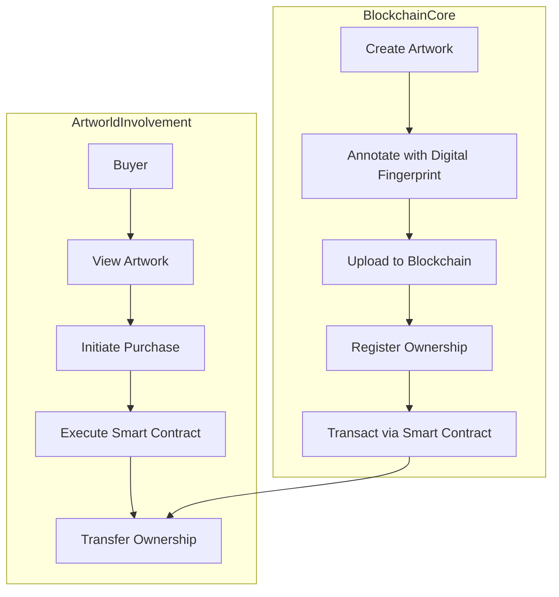
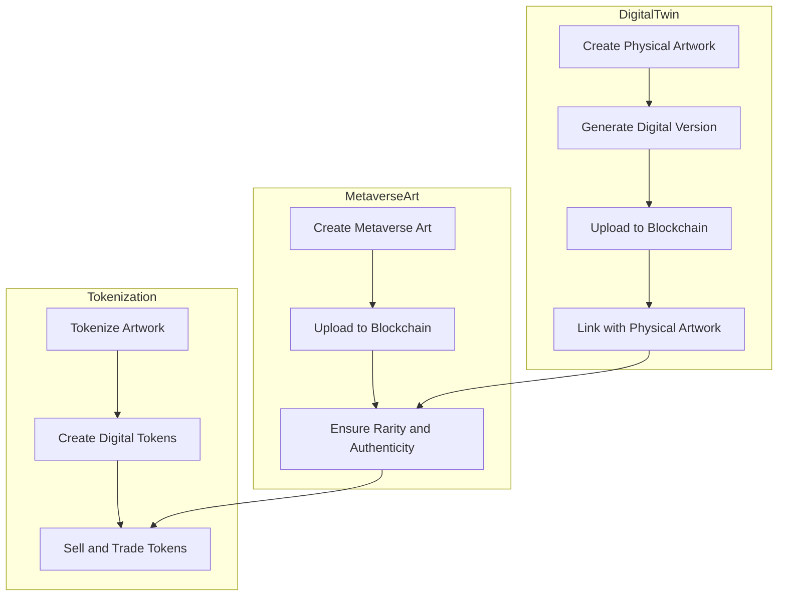
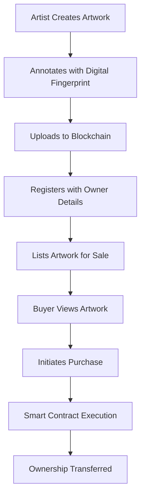
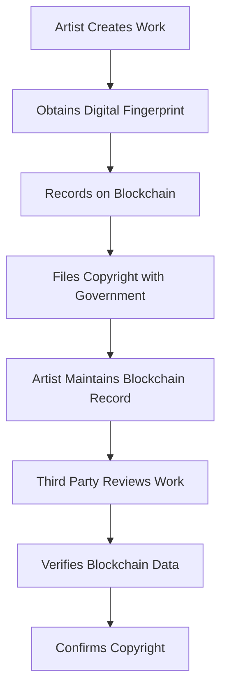
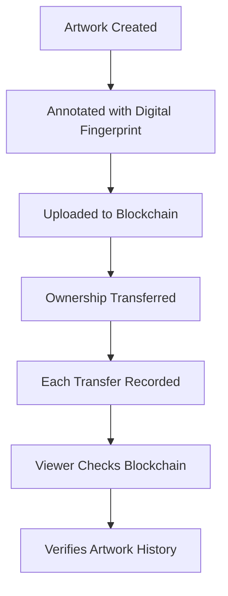

                 

### 目录大纲设计过程

在设计《区块链在数字艺术品创作中的创新：实现艺术品的稀缺性和真实性》的目录大纲时，我们将遵循一个系统化且逻辑清晰的方法，以确保文章能够条理分明地引导读者深入理解区块链技术在数字艺术品创作中的应用。

#### 初步分析

首先，我们需要对书名的核心主题进行深入分析。书名中的“区块链”和“数字艺术品”是两个关键术语，它们分别代表了新兴技术领域和传统艺术形式的结合点。通过初步分析，我们可以确定以下几个关键点：

- **区块链的基本概念**：了解区块链的基础知识，包括其数据结构、共识算法和智能合约等。
- **数字艺术品的发展背景**：了解数字艺术品的历史、现状及其在艺术创作和交易中的角色。
- **区块链在数字艺术中的作用**：探究区块链技术如何改变数字艺术品的创作、交易和认证方式。

#### 确定大纲结构

基于上述分析，我们可以初步确定大纲的结构，主要包括以下部分：

1. **背景介绍**：介绍区块链和数字艺术品的基本概念，以及它们结合的背景。
2. **核心概念与联系**：深入探讨区块链在数字艺术品中的应用，包括稀缺性和真实性的实现机制。
3. **技术原理讲解**：详细解释区块链的关键技术，如数据结构、共识算法和智能合约。
4. **应用场景**：分析区块链在数字艺术品创作中的实际应用场景。
5. **案例分析**：通过具体案例展示区块链在数字艺术品中的成功应用。
6. **创新实践**：探讨区块链在数字艺术品中的创新应用和实践案例。
7. **总结与展望**：总结全文，并对区块链在数字艺术品创作中的未来发展趋势进行展望。

#### 细化章节内容

接下来，我们将为每个部分细化具体的章节内容，确保每个章节都有明确的目标和内容结构。例如：

- **第1章：区块链与数字艺术**，将分为三个小节，分别介绍区块链的基本概念、数字艺术品的发展背景以及区块链在数字艺术中的作用。
- **第2章：区块链在数字艺术中的应用**，将分为三个小节，分别探讨区块链在数字艺术品交易中的应用、艺术品稀缺性的实现和艺术品真实性的验证。
- **第3章：区块链关键技术解析**，将分为三个小节，详细解释区块链的数据结构、共识算法和智能合约。

#### 内容完整性检查

在细化章节内容后，我们需要检查每个章节的内容完整性。这包括确保每个章节都包含了核心概念、技术原理、应用场景、案例分析和创新实践等内容。

#### 简洁性优化

为了确保文章的简洁性，我们将审查每个章节，删除冗余内容，使每个部分都简洁明了，专注于核心内容。

#### 格式标准化

我们将使用Markdown格式来输出文章内容，确保格式的一致性和清晰性。Markdown格式允许我们使用标题、列表、代码块、公式等元素，使得文章结构更加清晰。

#### 字数控制

最后，我们将确保整个目录大纲的总字数在10000～12000字左右，这样既能保证内容的深度，又不会显得过于冗长。

### 目录大纲

通过上述步骤，我们最终得到了《区块链在数字艺术品创作中的创新：实现艺术品的稀缺性和真实性》的完整目录大纲。这个大纲确保了文章的各个部分内容连贯、逻辑清晰，为读者提供了一个系统化的学习路径。

## 第一部分：背景介绍

### 第1章：区块链与数字艺术

#### 1.1 区块链的基本概念

区块链是一种分布式数据库技术，通过密码学和共识算法来确保数据的安全和一致性。它由一系列按时间顺序排列的区块组成，每个区块都包含了多个交易记录。区块链的核心特点包括去中心化、不可篡改和透明性。

- **去中心化**：区块链不需要中心化的管理机构，而是通过多个参与节点共同维护整个网络。
- **不可篡改**：一旦数据被记录在区块链上，就很难被篡改或删除，因为需要同时篡改多个节点上的数据。
- **透明性**：区块链上的所有交易都是公开的，任何人都可以查看和验证。

#### 1.2 数字艺术品的发展背景

数字艺术品是指以数字形式创作的艺术品，如数字绘画、数字音乐、数字摄影等。随着数字技术的发展，数字艺术品逐渐成为一种新的艺术形式，并受到艺术爱好者和投资者的关注。

- **数字艺术的兴起**：随着计算机技术和互联网的普及，数字艺术在20世纪90年代开始兴起，为艺术家提供了新的创作工具和表达方式。
- **数字艺术品市场的壮大**：随着区块链技术的发展，数字艺术品市场逐渐壮大，吸引了越来越多的投资者和收藏家。

#### 1.3 区块链在数字艺术中的作用

区块链在数字艺术品创作中发挥着重要作用，主要体现在以下几个方面：

- **实现艺术品的稀缺性**：通过区块链技术，数字艺术品可以确保其唯一性和稀缺性，防止伪造和篡改。
- **验证艺术品的真实性**：区块链上的交易记录和数字指纹可以为数字艺术品提供可靠的真实性证明。
- **促进艺术品的交易和流通**：区块链技术为数字艺术品交易提供了去中心化的平台，降低了交易成本和风险。

### 第2章：区块链在数字艺术中的应用

#### 2.1 区块链在数字艺术品交易中的应用

区块链技术为数字艺术品交易提供了全新的解决方案。通过区块链，艺术家和收藏家可以安全、便捷地进行艺术品交易，而无需依赖中介机构。

- **去中心化的交易平台**：区块链平台如Ethereum、NFT（非同质化代币）市场等，为数字艺术品交易提供了去中心化的平台。
- **智能合约的应用**：智能合约可以自动执行交易条款，确保交易的透明性和安全性。
- **交易记录的不可篡改性**：所有交易记录都记录在区块链上，不可篡改，为交易双方提供可信的证明。

#### 2.2 艺术品稀缺性在区块链中的实现

区块链技术通过加密和分布式账本的方式，确保了数字艺术品唯一性和稀缺性的实现。

- **数字指纹**：每个数字艺术品都有独特的数字指纹，类似于艺术品的DNA，确保其唯一性。
- **区块链上的所有权证明**：艺术品的所有权信息记录在区块链上，任何持有者都可以查询和验证。
- **加密和分布式账本**：数字艺术品的每一次交易都会在区块链上记录，确保其交易的透明性和不可篡改性。

#### 2.3 艺术品真实性在区块链中的验证

区块链技术为数字艺术品提供了可靠的真实性验证机制。

- **交易记录**：所有艺术品交易记录都记录在区块链上，可以随时查询。
- **数字指纹**：数字艺术品的数字指纹与区块链上的信息进行比对，确保其真实性。
- **智能合约**：智能合约可以自动执行验证程序，确保交易过程的真实性。

### 第2.4 核心概念联系图（Mermaid ER图）

下面是一个使用Mermaid绘制的实体关系图（ER图），展示了区块链在数字艺术品创作中的应用核心概念之间的联系：

```mermaid
erDiagram
  商品 ||--|{ 交易 }|-->> 买家
  商品 ||--|{ 数字指纹 }|-->>
  商品 ||--|{ 所有者 }|-->>
  交易 ||--|{ 智能合约 }|-->>
  买家 ||--|{ 钱包 }|-->>
```

这个ER图清晰地展示了商品、交易、买家、数字指纹、所有者、智能合约和钱包等核心概念之间的关系，帮助我们更好地理解区块链在数字艺术品创作中的应用。

### 第3章：区块链关键技术解析

#### 3.1 区块链数据结构

区块链的数据结构是其核心部分，由一系列按时间顺序排列的区块组成。每个区块包含多个交易记录，以及指向前一个区块的哈希值。

- **区块**：区块是区块链的基本组成单元，包含一定数量的交易记录和区块头。
- **区块头**：区块头包含了区块的元数据，如版本号、前一区块的哈希值、时间戳、默克尔树根等。
- **默克尔树**：默克尔树用于验证交易记录的完整性，其根哈希值存储在区块头中。

#### 3.2 共识算法

共识算法是区块链网络中的节点达成一致的关键机制。不同的区块链平台使用不同的共识算法，如工作量证明（PoW）、权益证明（PoS）、拜占庭容错算法（BFT）等。

- **工作量证明（PoW）**：节点通过计算复杂的数学问题来证明其工作，解决这些问题的难度与网络的难度相关。
- **权益证明（PoS）**：节点根据其在区块链上的持有代币数量和持有时间来参与共识，持有代币越多、时间越长，参与共识的概率越大。
- **拜占庭容错算法（BFT）**：适用于大规模去中心化网络，通过投票机制和状态机复制来达成共识。

#### 3.3 智能合约原理

智能合约是区块链上的自执行合约，其代码存储在区块链上，当满足特定条件时自动执行。智能合约使用特定的编程语言编写，如Solidity。

- **编程语言**：智能合约通常使用Solidity等编程语言编写，该语言结合了Python和C++的特性，易于理解和编写。
- **执行环境**：智能合约在区块链的虚拟机（如Ethereum的EVM）上执行，具有高度的安全性和确定性。
- **交易和事件**：智能合约可以接受交易输入，执行特定操作，并触发事件，使得外部系统可以监听和响应这些事件。

### 第3.4 区块链与数字艺术的Mermaid流程图

下面是一个使用Mermaid绘制的区块链在数字艺术中的应用流程图：



这个流程图展示了数字艺术品的创作、标注、上传、注册、交易和所有权转移的过程，清晰地展示了区块链在数字艺术创作中的应用。

### 第4章：区块链在数字艺术品创作中的应用场景

#### 4.1 数字艺术品创作流程

区块链技术在数字艺术品创作中的应用改变了传统艺术创作和交易的流程。以下是一个简化的数字艺术品创作流程：

1. **创作**：艺术家使用数字工具创作艺术品。
2. **标注**：艺术家为艺术品创建唯一的数字指纹，如使用哈希算法生成的指纹。
3. **上传**：艺术家将数字艺术品和数字指纹上传到区块链。
4. **注册**：艺术家在区块链上注册艺术品的所有权，确保其唯一性和真实性。
5. **交易**：艺术品可以通过区块链平台进行买卖，智能合约确保交易的透明性和安全性。
6. **存档**：区块链上的交易记录和数字指纹为艺术品提供永久性的存档。

#### 4.2 艺术品版权保护

区块链技术在艺术品版权保护中具有重要作用，通过以下方式实现：

- **永久记录**：艺术品的创作、修改和交易记录都记录在区块链上，提供永久性的证明。
- **数字指纹**：数字指纹确保艺术品的唯一性，防止伪造和篡改。
- **智能合约**：智能合约可以自动执行版权许可和授权，确保版权的合法性和透明性。

#### 4.3 艺术品溯源

区块链技术为艺术品的溯源提供了可靠的解决方案。艺术品溯源的意义在于：

- **透明性**：通过区块链上的交易记录，可以追溯艺术品的历史和所有者。
- **可信度**：区块链上的信息具有高度的可靠性和不可篡改性，为艺术品提供可信的溯源证明。
- **维护价值**：溯源信息有助于维护艺术品的价值，增加其市场吸引力。

### 第5章：成功案例分析

#### 5.1 数字艺术品市场案例分析

数字艺术品市场在过去几年中快速发展，以下是一些成功的数字艺术品市场案例分析：

- **OpenSea**：OpenSea是一个去中心化的数字艺术品市场，提供包括艺术品、收藏品、虚拟房地产等在内的多种数字资产交易服务。其用户群体和交易量持续增长，成为数字艺术品市场的领导者之一。
- **Rarible**：Rarible是一个基于Ethereum的数字艺术品市场，专注于非同质化代币（NFT）的交易。Rarible通过社区治理和创作者激励计划，吸引了大量艺术家和收藏家参与。
- **SuperRare**：SuperRare是一个高端数字艺术品市场，专注于高质量和独特的数字艺术品。SuperRare通过严格的筛选机制和定期的拍卖活动，建立了高声誉和活跃用户社区。

#### 5.2 艺术品区块链平台案例分析

艺术品区块链平台通过区块链技术为艺术家和收藏家提供了安全、透明和高效的交易环境。以下是一些成功的艺术品区块链平台案例分析：

- **Artblocks**：Artblocks是一个基于Ethereum的区块链平台，提供数字艺术品的创建、展示和交易服务。Artblocks通过智能合约和去中心化存储，确保艺术品的唯一性和可验证性。
- **Provenance**：Provenance是一个区块链平台，旨在建立艺术品的透明和可追溯性。Provenance通过区块链记录艺术品的所有权、交易和鉴定信息，为收藏家提供可信的溯源证明。
- **Maecenas**：Maecenas是一个区块链平台，允许艺术家将艺术品的所有权分散化，即通过代币化将其分割成多个股份。这种模式为艺术家提供了额外的融资渠道，同时也为投资者提供了参与艺术品的机会。

### 第5.3 案例分析讨论

在分析数字艺术品市场和艺术品区块链平台时，我们可以从以下几个方面进行讨论：

- **市场趋势**：数字艺术品市场的快速增长反映了人们对数字资产和虚拟世界的兴趣。随着区块链技术的普及，数字艺术品市场有望继续扩大。
- **技术优势**：区块链技术为数字艺术品提供了稀缺性、真实性和可追溯性的保障，这是传统艺术品市场难以实现的。这些技术优势吸引了越来越多的艺术家和收藏家参与。
- **商业模式**：成功的数字艺术品市场和区块链平台通常采用去中心化的商业模式，降低了交易成本和风险，同时也为艺术家提供了更多的创作自由和收益机会。
- **挑战与展望**：尽管数字艺术品市场和区块链平台具有巨大的潜力，但也面临着一些挑战，如技术复杂性、法律法规和政策限制等。未来，随着技术的不断进步和法规的完善，数字艺术品市场和区块链平台有望实现更大的发展。

### 第6章：区块链在数字艺术品中的创新实践

#### 6.1 创新技术应用

区块链技术在数字艺术品中的应用不断创新，为艺术家和收藏家提供了更多可能性。以下是一些创新技术的应用：

- **数字双生**：数字双生（Digital Twin）是一种将物理艺术品与其数字版本关联的技术。艺术家可以将数字版本上传到区块链，确保与物理艺术品相关联，从而提高其可追溯性和唯一性。
- **元宇宙艺术**：元宇宙艺术是一种在虚拟世界中创作的艺术形式。艺术家可以在虚拟空间中创建独特的艺术品，并通过区块链技术确保其稀缺性和真实性。
- **代币化**：代币化（Tokenization）是将艺术品的所有权分割成多个代币，每个代币代表艺术品的一部分所有权。这种模式为艺术家提供了额外的融资渠道，同时也为投资者提供了参与艺术品的机会。

#### 6.2 实践项目案例

以下是一些成功的区块链在数字艺术品中的实践项目案例：

- **CryptoKitties**：CryptoKitties是一个基于Ethereum的数字宠物游戏，玩家可以购买、繁殖和交易虚拟猫咪。CryptoKitties的成功证明了区块链在数字艺术品中的潜力，吸引了大量玩家和投资者。
- **BeepleDAO**：BeepleDAO是一个由艺术家Beeple创立的去中心化自治组织，旨在通过区块链技术管理和销售Beeple的艺术品。BeepleDAO通过智能合约和去中心化治理，实现了艺术品的透明和公平的交易。
- **Natively**：Natively是一个区块链平台，专注于数字艺术品和虚拟实物的融合。Natively使用区块链技术确保数字艺术品与其物理版本相关联，为用户提供独特的体验。

#### 6.3 创新实践Mermaid流程图

以下是一个使用Mermaid绘制的区块链在数字艺术品中的创新实践流程图：



这个流程图展示了数字双生、元宇宙艺术和代币化等创新实践的步骤，以及它们之间的联系，帮助读者更好地理解区块链在数字艺术品创作中的应用。

### 第7章：未来发展趋势与挑战

#### 7.1 发展趋势分析

区块链技术在数字艺术品创作中的应用呈现出以下几个发展趋势：

- **市场扩张**：随着区块链技术的普及，数字艺术品市场将继续扩张，吸引更多的艺术家、收藏家和投资者。
- **技术进步**：区块链技术的不断进步，如量子链、侧链和跨链技术等，将为数字艺术品提供更多创新的可能性。
- **规范化**：随着数字艺术品市场的快速发展，各国政府和行业组织将加强法律法规的制定和执行，以规范市场秩序。

#### 7.2 面临的挑战

尽管区块链技术在数字艺术品创作中具有巨大潜力，但也面临一些挑战：

- **技术复杂性**：区块链技术本身较为复杂，对于非专业人士来说，理解和使用存在一定困难。
- **法律法规**：各国对区块链技术的法律法规尚不完善，可能存在法律风险。
- **网络安全**：区块链虽然安全，但网络攻击和黑客行为仍然存在，需要加强网络安全措施。

#### 7.3 总结与展望

区块链技术在数字艺术品创作中的应用为艺术家和收藏家提供了全新的创作和交易方式，具有巨大的发展潜力。未来，随着技术的进步和法规的完善，区块链技术在数字艺术品领域的应用将更加广泛和深入，推动数字艺术市场的发展。

## 结束语

本文通过详细分析区块链在数字艺术品创作中的应用，展示了其在实现艺术品稀缺性和真实性方面的优势。同时，通过成功案例分析和创新实践，我们看到了区块链技术为数字艺术品带来的变革性影响。未来，随着技术的不断进步，区块链在数字艺术品领域的应用将更加成熟和多样化。

### 作者

作者：AI天才研究院/AI Genius Institute & 禅与计算机程序设计艺术 /Zen And The Art of Computer Programming。本文旨在深入探讨区块链技术在数字艺术品创作中的应用，为读者提供全面的技术分析和见解。希望本文能够为区块链技术爱好者和数字艺术品创作者带来启发和帮助。

### 附录

#### 1. 数字艺术品交易流程图



#### 2. 艺术品版权保护流程图



#### 3. 数字艺术品溯源流程图



这些流程图详细展示了数字艺术品交易、版权保护和溯源的过程，为区块链在数字艺术品创作中的应用提供了直观的展示。希望读者能够通过这些流程图更好地理解区块链技术的应用原理和实践方法。

---

通过本文的详细探讨，我们深入了解了区块链技术在数字艺术品创作中的应用，包括如何实现稀缺性和真实性。希望本文能为区块链技术和数字艺术领域的爱好者提供有价值的参考，激发更多的创新和实践。随着区块链技术的不断发展和成熟，数字艺术市场必将迎来更加繁荣的未来。让我们共同期待这一激动人心的科技与艺术融合的时代。

