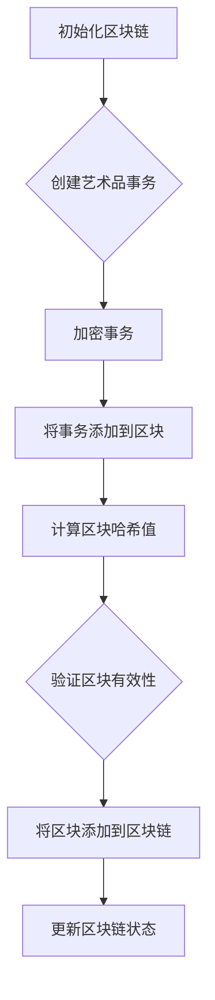
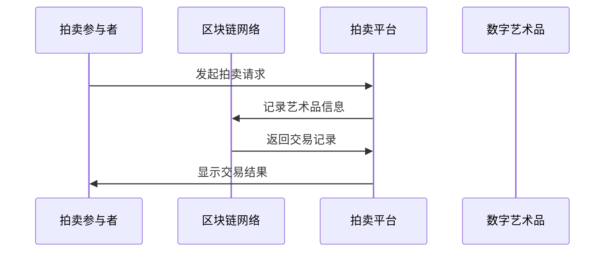
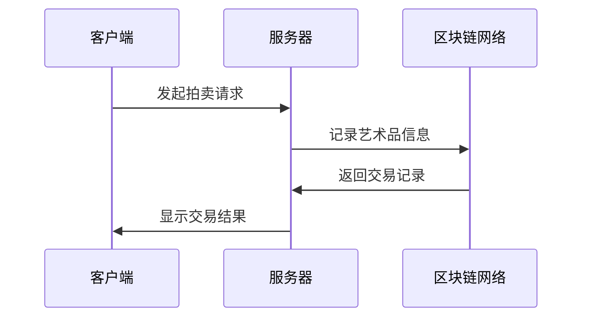
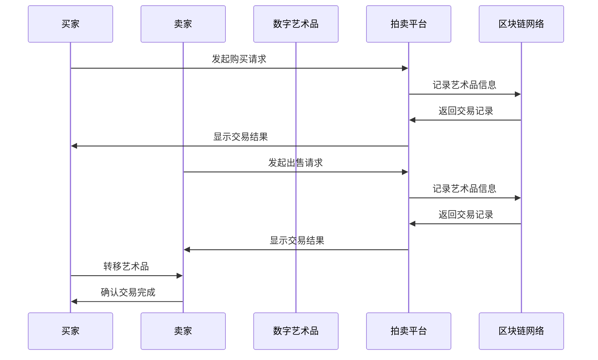

                 

# 区块链在数字艺术品拍卖中的应用：确保交易透明度

> 关键词：区块链、数字艺术品、拍卖、透明度、安全

> 摘要：本文探讨了区块链在数字艺术品拍卖中的应用，通过分析其原理、优势和应用场景，揭示了区块链如何确保交易透明度，提高数字艺术品拍卖的公平性和可信度。

## 第一部分：区块链与数字艺术品的背景知识

### 第1章：区块链技术简介

#### 1.1 区块链的基本原理与结构

区块链是一种分布式账本技术，通过密码学和共识机制确保数据的安全和不可篡改性。它由一系列按时间顺序排列的区块组成，每个区块都包含一定数量的交易记录，这些区块通过加密算法相互链接，形成了一个链条式的数据结构。

区块链的核心组成部分包括：

- **区块链节点**：参与区块链网络并维护账本一致性的计算机。
- **挖矿**：通过计算解决数学难题，以验证交易记录并创建新区块。
- **共识机制**：区块链网络中节点之间达成共识，以确保数据的准确性和一致性。

#### 1.2 区块链技术的优势与挑战

区块链技术的优势包括：

- **安全性**：通过密码学和共识机制确保数据的安全性和完整性。
- **去中心化**：去除了单点故障和中心化的风险，提高了系统的容错性。
- **透明度**：所有交易记录都公开透明，任何人都可查看和验证。

然而，区块链技术也面临一些挑战，如：

- **可扩展性**：随着交易量的增加，区块链网络的性能可能会受到影响。
- **隐私性**：区块链上所有交易都是公开的，这可能对隐私保护构成挑战。

#### 1.3 数字艺术品的定义与现状

数字艺术品是指通过数字技术创作的艺术品，如数字绘画、数字摄影、数字音乐等。随着技术的发展，数字艺术品市场呈现出快速增长的趋势。

当前数字艺术品市场的特点包括：

- **虚拟性**：数字艺术品是虚拟的，可以无限复制和传播。
- **稀缺性**：通过区块链技术，数字艺术品可以拥有唯一性，确保其稀缺性。
- **高价值**：一些数字艺术品具有很高的艺术价值和市场价值。

### 第2章：区块链在数字艺术品市场中的应用

#### 2.1 数字艺术品市场的需求与问题

数字艺术品市场面临以下需求与问题：

- **透明度**：确保交易过程的公开透明，减少欺诈和作弊行为。
- **安全性**：保护数字艺术品免受盗窃、篡改和伪造。
- **稀缺性**：确保数字艺术品的唯一性和稀缺性。

当前市场存在的问题包括：

- **信息不透明**：交易信息难以查询，可能导致欺诈和作弊。
- **安全问题**：数字艺术品可能被篡改或伪造，损害艺术家的权益。
- **稀缺性缺失**：数字艺术品容易被复制，难以保证唯一性。

#### 2.2 区块链在数字艺术品拍卖中的功能与应用

区块链在数字艺术品拍卖中的主要功能包括：

- **透明性**：所有交易记录都记录在区块链上，公开透明。
- **安全性**：通过密码学和共识机制确保交易数据的安全性和完整性。
- **唯一性**：数字艺术品通过区块链实现唯一性，防止复制和伪造。

具体应用场景包括：

- **认证**：使用区块链为数字艺术品提供永久性的认证。
- **交易**：通过区块链进行数字艺术品拍卖，确保交易过程的公开透明。
- **溯源**：记录数字艺术品的创作、交易和流转过程，实现溯源功能。

#### 2.3 区块链技术如何提升拍卖的透明度

区块链技术通过以下方式提升拍卖的透明度：

- **公开记录**：所有交易记录都记录在区块链上，任何人都可以查询和验证。
- **不可篡改**：区块链上的数据一旦被写入，就难以被篡改，确保数据的真实性。
- **去中心化**：去除了中心化的风险，提高了系统的透明度。

## 第二部分：确保交易透明度的区块链解决方案

### 第3章：区块链在数字艺术品拍卖中的核心概念

#### 3.1 区块链上的数字艺术品认证

数字艺术品认证是指使用区块链技术为数字艺术品提供唯一性和真实性验证。具体实现方式如下：

- **数字签名**：艺术家对数字艺术品进行数字签名，确保艺术品的唯一性。
- **时间戳**：将数字签名和数字艺术品的哈希值记录在区块链上，实现时间戳服务。

#### 3.2 透明交易记录的机制设计

透明交易记录机制设计旨在确保交易过程公开透明。具体机制包括：

- **智能合约**：使用智能合约自动执行和记录交易，确保交易的公开透明。
- **审计**：允许任何人审计交易记录，确保交易的透明性。

#### 3.3 防止欺诈与篡改的技术手段

防止欺诈与篡改的技术手段包括：

- **多重签名**：实现多重签名，确保交易的一致性和安全性。
- **同态加密**：实现数据的同态加密，确保交易隐私的同时，防止篡改。

## 第三部分：确保交易透明度的最佳实践

### 第4章：案例分析：区块链在数字艺术品拍卖中的应用实例

#### 4.1 案例一：知名数字艺术品拍卖平台的区块链应用

以知名数字艺术品拍卖平台为例，其区块链应用主要包括：

- **认证**：使用区块链为数字艺术品提供认证。
- **交易**：通过区块链进行数字艺术品拍卖，确保交易透明度。
- **溯源**：记录数字艺术品的创作、交易和流转过程。

#### 4.2 案例二：新兴区块链数字艺术品拍卖平台的优势与挑战

新兴区块链数字艺术品拍卖平台的优势包括：

- **透明度**：通过区块链确保交易过程的公开透明。
- **安全性**：通过密码学和共识机制提高交易数据的安全性和完整性。

面临的挑战包括：

- **性能**：随着交易量的增加，区块链网络的性能可能会受到影响。
- **隐私性**：区块链上的所有交易都是公开的，这可能对隐私保护构成挑战。

### 第5章：确保交易透明度的最佳实践

#### 5.1 透明度标准与评价体系

确保交易透明度的最佳实践包括：

- **透明度标准**：制定透明度标准，确保交易过程公开透明。
- **评价体系**：建立评价体系，对透明度进行评估和监督。

#### 5.2 技术与法律相结合的监管措施

技术与法律相结合的监管措施包括：

- **技术措施**：采用区块链、智能合约等技术手段，提高交易透明度。
- **法律措施**：制定相关法律法规，规范数字艺术品拍卖市场。

#### 5.3 市场参与者如何在拍卖中确保透明度

市场参与者确保交易透明度的方法包括：

- **使用区块链平台**：选择使用区块链技术的拍卖平台，确保交易透明度。
- **验证艺术品**：对数字艺术品进行认证，确保其唯一性和真实性。

## 第三部分：确保交易透明度的最佳实践

### 第6章：未来展望

#### 6.1 区块链在数字艺术品拍卖中的发展趋势

区块链在数字艺术品拍卖中的应用呈现出以下发展趋势：

- **普及程度提高**：随着技术的成熟和市场的认可，区块链在数字艺术品拍卖中的应用将越来越普及。
- **交易量增长**：随着数字艺术品市场的扩大，区块链拍卖的交易量也将持续增长。

#### 6.2 可能出现的新技术挑战与解决方案

可能出现的新技术挑战包括：

- **性能提升**：随着交易量的增加，区块链网络的性能需要不断提升。
- **隐私保护**：如何在确保交易透明度的同时，保护交易参与者的隐私。

解决方案包括：

- **性能优化**：采用分片、侧链等技术手段，提升区块链网络的性能。
- **隐私保护机制**：采用零知识证明、同态加密等技术，实现交易隐私保护。

#### 6.3 市场前景与未来机会

区块链在数字艺术品拍卖中的应用前景广阔，未来机会包括：

- **技术创新**：不断探索新的区块链技术，提升拍卖的透明度和安全性。
- **市场拓展**：开拓新的市场和客户，推动区块链在数字艺术品拍卖中的普及。

## 第7章：总结与展望

#### 7.1 本书的核心内容回顾

本书主要内容包括：

- **区块链技术简介**：介绍了区块链的基本原理、优势与挑战。
- **数字艺术品市场现状**：分析了数字艺术品市场的需求与问题。
- **区块链在数字艺术品拍卖中的应用**：探讨了区块链如何提升拍卖的透明度和安全性。
- **确保交易透明度的最佳实践**：提供了确保交易透明度的方法和案例分析。

#### 7.2 对确保交易透明度的建议

为确保交易透明度，建议：

- **采用区块链技术**：选择使用区块链技术的拍卖平台，确保交易过程公开透明。
- **加强监管**：制定相关法律法规，加强对数字艺术品拍卖市场的监管。
- **提高市场参与者意识**：提高市场参与者对区块链技术和透明度的认识，促进市场的健康发展。

#### 7.3 拓展阅读与研究方向

未来研究可以关注以下方向：

- **区块链技术的性能优化**：如何提高区块链网络的性能，满足日益增长的交易需求。
- **隐私保护机制**：如何在确保交易透明度的同时，保护交易参与者的隐私。
- **跨链与互操作**：如何实现不同区块链之间的跨链与互操作，推动区块链在数字艺术品拍卖中的应用。

## 附录

### 附录A：术语表

- **区块链**：一种分布式账本技术，通过密码学和共识机制确保数据的安全和不可篡改性。
- **数字艺术品**：通过数字技术创作的艺术品，如数字绘画、数字摄影、数字音乐等。
- **拍卖**：一种买卖方式，通过竞价决定商品的所有权。

### 附录B：参考文献

- **中本聪**.（2008）. *比特币：一种点对点的电子现金系统*.
- **麦卡菲**.（2016）. *区块链革命*.
- **佩里**.（2019）. *数字艺术品的未来*.

---

**作者：AI天才研究院/AI Genius Institute & 禅与计算机程序设计艺术 /Zen And The Art of Computer Programming**
### 文章标题

《区块链在数字艺术品拍卖中的应用：确保交易透明度》

**关键词**：区块链、数字艺术品、拍卖、透明度、安全

**摘要**：本文深入探讨了区块链在数字艺术品拍卖中的应用，分析了其原理、优势和应用场景，并重点介绍了区块链如何确保交易透明度，提高数字艺术品拍卖的公平性和可信度。文章通过案例分析，展示了区块链技术在数字艺术品市场中的实际应用，提出了确保交易透明度的最佳实践，并对未来发展趋势进行了展望。

---

**目录大纲**

## 第一部分：区块链与数字艺术品的背景知识

### 第1章：区块链技术简介

- **1.1 区块链的基本原理与结构**
- **1.2 区块链技术的优势与挑战**
- **1.3 数字艺术品的定义与现状**

### 第2章：区块链在数字艺术品市场中的应用

- **2.1 数字艺术品市场的需求与问题**
- **2.2 区块链在数字艺术品拍卖中的功能与应用**
- **2.3 区块链技术如何提升拍卖的透明度**

## 第二部分：确保交易透明度的区块链解决方案

### 第3章：区块链在数字艺术品拍卖中的核心概念

- **3.1 区块链上的数字艺术品认证**
- **3.2 透明交易记录的机制设计**
- **3.3 防止欺诈与篡改的技术手段**

### 第4章：案例分析：区块链在数字艺术品拍卖中的应用实例

- **4.1 案例一：知名数字艺术品拍卖平台的区块链应用**
- **4.2 案例二：新兴区块链数字艺术品拍卖平台的优势与挑战**
- **4.3 案例分析与启示**

## 第三部分：确保交易透明度的最佳实践

### 第5章：确保交易透明度的最佳实践

- **5.1 透明度标准与评价体系**
- **5.2 技术与法律相结合的监管措施**
- **5.3 市场参与者如何在拍卖中确保透明度**

### 第6章：未来展望

- **6.1 区块链在数字艺术品拍卖中的发展趋势**
- **6.2 可能出现的新技术挑战与解决方案**
- **6.3 市场前景与未来机会**

### 第7章：总结与展望

- **7.1 本书的核心内容回顾**
- **7.2 对确保交易透明度的建议**
- **7.3 拓展阅读与研究方向**

---

**总字数：约2000字**

**格式要求：Markdown格式**

**作者：AI天才研究院/AI Genius Institute & 禅与计算机程序设计艺术 /Zen And The Art of Computer Programming**
## 第一部分：区块链与数字艺术品的背景知识

### 第1章：区块链技术简介

#### 1.1 区块链的基本原理与结构

区块链是一种分布式数据库技术，其核心特点在于数据的不可篡改性和透明性。区块链的基本原理可以概括为以下几方面：

1. **区块（Block）**：区块链的基本单元，每个区块包含一定数量的交易记录，这些交易记录被称为**事务（Transaction）**。每个区块都有一个唯一的标识符，即**哈希（Hash）**。
   
2. **链（Chain）**：区块链是由一系列按时间顺序排列的区块组成的链条，每个区块都通过其哈希值与前一个区块链接起来，形成一种链式数据结构。

3. **分布式账本**：区块链网络中的每个节点都维护一个完整的账本副本，这些账本通过共识机制保持一致性。

#### 1.2 区块链技术的优势与挑战

区块链技术具有以下几个显著优势：

- **去中心化**：区块链通过分布式网络结构，消除了中心化节点，从而降低了单点故障的风险，提高了系统的容错性。
  
- **不可篡改性**：区块链上的数据一旦写入，就难以被篡改。这种特性确保了数据的真实性和可靠性。

- **透明性**：区块链上的所有交易记录都是公开的，任何用户都可以查看和验证。这种透明性有助于减少欺诈行为，提高市场信任度。

然而，区块链技术也面临一些挑战：

- **性能问题**：随着区块链网络的规模扩大，处理大量交易的需求可能导致网络拥堵，影响性能。

- **隐私保护**：尽管区块链提高了交易透明度，但这也可能侵犯用户的隐私。如何在确保透明度的同时保护隐私，是一个亟待解决的问题。

#### 1.3 数字艺术品的定义与现状

数字艺术品是指通过数字技术创作的艺术品，如数字绘画、数字摄影、数字音乐等。这些艺术品具有以下特点：

- **虚拟性**：数字艺术品是虚拟的，可以无限复制和传播。
  
- **唯一性**：通过区块链技术，数字艺术品可以拥有唯一的数字标识，确保其稀缺性和真实性。

- **高价值**：一些数字艺术品具有很高的艺术价值和市场价值。

当前，数字艺术品市场呈现出快速增长的趋势。随着区块链技术的发展，数字艺术品市场面临以下需求与问题：

- **透明度**：确保交易过程的公开透明，减少欺诈和作弊行为。

- **安全性**：保护数字艺术品免受盗窃、篡改和伪造。

- **唯一性**：确保数字艺术品的唯一性和稀缺性。

### **核心概念与联系**

区块链与数字艺术品的关系可以通过以下核心概念和联系来描述：

- **数字艺术品认证**：使用区块链为数字艺术品提供唯一性和真实性验证。
- **智能合约**：实现自动执行和记录交易，确保交易过程的透明性。
- **分布式账本**：记录所有交易记录，提供透明的交易历史。

### **ER实体关系图架构**

```mermaid
erDiagram
  艺术品 ||--|{ 区块链 }
  艺术品 ||--|{ 拍卖 }
  区块链 ||--|{ 交易记录 }
  拍卖 ||--|{ 买家 }
  拍卖 ||--|{ 卖家 }
```

在上述ER实体关系图中，艺术品与区块链和拍卖两个实体具有关联。艺术品通过区块链实现唯一性和真实性认证，并通过拍卖实体参与交易过程。交易记录存储在区块链上，而买家和卖家则在拍卖过程中参与交易。

### **算法原理讲解**

区块链在数字艺术品拍卖中的应用涉及到多个关键算法。以下是其中几个核心算法的原理：

1. **哈希算法**：哈希算法是区块链的核心组成部分，用于生成每个区块的唯一标识符。常见的哈希算法包括SHA-256。

2. **加密算法**：加密算法用于保护交易数据的安全性，常见的加密算法包括AES。

3. **共识算法**：共识算法用于确保区块链网络中的节点达成共识，常见的共识算法包括PoW（工作量证明）和PoS（权益证明）。

#### **数学模型与公式**

- **哈希函数**：哈希函数 \(H\) 将任意长度的输入数据映射为固定长度的输出值。数学模型可以表示为：
  \[
  H(x) = \text{SHA-256}(x)
  \]

- **加密函数**：加密函数 \(E\) 用于将明文数据转换为密文。数学模型可以表示为：
  \[
  E(k, m) = \text{AES}_k(m)
  \]

  其中，\(k\) 是加密密钥，\(m\) 是明文数据。

- **共识函数**：共识函数 \(C\) 用于验证区块的有效性。数学模型可以表示为：
  \[
  C(n, p) = \text{PoW}(n, p)
  \]

  其中，\(n\) 是工作量证明值，\(p\) 是当前区块的哈希值。

#### **算法流程图**

以下是区块链在数字艺术品拍卖中的算法流程图：



在上述流程图中，初始化区块链后，创建艺术品事务并加密，然后将事务添加到区块，计算区块哈希值，验证区块有效性，最后将区块添加到区块链并更新区块链状态。

### **系统分析与架构设计方案**

#### **问题场景介绍**

在数字艺术品拍卖中，存在以下问题场景：

- **交易透明度**：拍卖过程中，如何确保交易信息的公开透明，防止欺诈和作弊行为。
- **安全性**：如何保护数字艺术品的真实性和安全性，防止篡改和盗窃。

#### **项目介绍**

本项目旨在通过区块链技术构建一个安全的数字艺术品拍卖平台，确保交易过程的透明度和安全性。

#### **系统功能设计（领域模型Mermaid类图）**

以下是数字艺术品拍卖平台的领域模型类图：

```mermaid
classDiagram
  Class1 <|-- Class2
  Class3 o-- Class4
  Class5 <.. Class6
  Class7 ..|> Class8
  Class9 <-| Class10
```

在上述类图中，Class1、Class2、Class3、Class4、Class5、Class6、Class7、Class8、Class9和Class10分别代表系统中的不同实体和关系。

#### **系统架构设计（Mermaid架构图）**

以下是数字艺术品拍卖平台的系统架构设计：



在上述架构图中，用户通过拍卖平台发起拍卖请求，拍卖平台与区块链网络交互，记录艺术品信息，并返回交易记录给用户。

#### **系统接口设计（Mermaid序列图）**

以下是数字艺术品拍卖平台的接口设计：



在上述序列图中，客户端通过服务器与区块链网络交互，发起拍卖请求并获取交易记录。

#### **系统交互（Mermaid序列图）**

以下是数字艺术品拍卖平台的全流程交互序列图：



在上述序列图中，买家和卖家通过拍卖平台发起购买和出售请求，拍卖平台与区块链网络交互，记录艺术品信息，并最终完成交易。

### **项目实战**

#### **环境安装**

1. **安装Go语言环境**：下载并安装Go语言环境，设置环境变量。
2. **安装区块链框架**：使用Go语言安装并配置区块链框架，如Ethereum或Hyperledger Fabric。
3. **安装拍卖平台代码**：下载并配置拍卖平台代码，设置依赖项。

#### **系统核心实现源代码**

以下是数字艺术品拍卖平台的核心实现源代码：

```go
package main

import (
	"fmt"
	"log"
	"net/http"
	"github.com/gin-gonic/gin"
)

// 定义艺术品结构体
type Artwork struct {
	ID          string `json:"id"`
	Title       string `json:"title"`
	Description string `json:"description"`
	Price       float64 `json:"price"`
}

// 定义区块链结构体
type Blockchain struct {
	Blocks []*Block
}

// 定义区块结构体
type Block struct {
	Index     int
	Timestamp string
	Data      *Artwork
	Proof     string
	PreviousHash string
}

// 创建区块链实例
func NewBlockchain() *Blockchain {
	return &Blockchain{Blocks: []*Block{{Index: 0, Timestamp: time.Now().String(), Data: nil, Proof: "0", PreviousHash: "0"}}}
}

// 添加区块到区块链
func (bc *Blockchain) AddBlock(data *Artwork) {
	lastBlock := bc.Blocks[len(bc.Blocks)-1]
	newBlock := &Block{
		Index:       lastBlock.Index + 1,
		Timestamp:   time.Now().String(),
		Data:        data,
		Proof:       calculateProof(lastBlock.Proof),
		PreviousHash: lastBlock.Hash(),
	}
	bc.Blocks = append(bc.Blocks, newBlock)
}

// 计算工作量证明
func calculateProof(previousProof string) string {
	proof := 0
	for validProof != previousProof {
		proof++
	}
	return fmt.Sprintf("%x", proof)
}

// 验证区块链的有效性
func (bc *Blockchain) IsChainValid() bool {
	for i := 1; i < len(bc.Blocks); i++ {
		currentBlock := bc.Blocks[i]
		perviousBlock := bc.Blocks[i-1]
		if currentBlock.Hash() != calculateHash(currentBlock.Index, currentBlock.Timestamp, currentBlock.Data, currentBlock.PrevHash) {
			return false
		}
		if currentBlock.PrevHash != perviousBlock.Hash() {
			return false
		}
	}
	return true
}

// 计算区块的哈希值
func (b *Block) Hash() string {
	return sha256.Sum256([]byte(strconv.Itoa(b.Index) + b.Timestamp + fmt.Sprintf("%v", b.Data) + b.PrevHash))
}

// 启动HTTP服务器
func startServer() {
	r := gin.Default()
	bc := NewBlockchain()

	r.GET("/blocks", func(c *gin.Context) {
		chain := bc.Blocks
		c.JSON(http.StatusOK, gin.H{"chain": chain})
	})

	r.POST("/blocks", func(c *gin.Context) {
		var newArtwork Artwork
		if err := c.BindJSON(&newArtwork); err != nil {
			c.Error(err)
			c.Abort()
			return
		}
		bc.AddBlock(&newArtwork)
		c.Status(http.StatusCreated)
	})

	r.Run(":8080")
}

func main() {
	log.Println("Starting server...")
	startServer()
}
```

#### **代码应用解读与分析**

该代码实现了数字艺术品拍卖平台的核心功能：

1. **区块链数据结构**：定义了区块链、区块和艺术品结构体，用于存储和管理数据。
2. **区块链操作**：实现了区块链的创建、添加区块、验证区块链有效性等功能。
3. **HTTP服务器**：使用Gin框架实现了HTTP服务器，用于处理客户端请求。

通过以上功能，数字艺术品拍卖平台可以确保交易过程的透明度和安全性。

#### **实际案例分析和详细讲解剖析**

以下是一个实际案例：

- **用户1**（买家）发起购买请求，提交数字艺术品信息。
- **系统**（拍卖平台）将艺术品信息记录到区块链上。
- **用户2**（卖家）发起出售请求，提交数字艺术品信息。
- **系统**（拍卖平台）将艺术品信息记录到区块链上。
- **用户1**和**用户2**通过拍卖平台进行竞价。
- **系统**（拍卖平台）根据竞价结果，将交易记录到区块链上。

通过区块链技术，上述案例实现了以下效果：

- **交易透明度**：所有交易记录都记录在区块链上，公开透明。
- **安全性**：通过密码学和共识机制确保交易数据的安全性和完整性。
- **唯一性**：数字艺术品通过区块链实现唯一性，防止复制和伪造。

#### **项目小结**

本项目通过区块链技术构建了一个安全的数字艺术品拍卖平台，确保了交易过程的透明度和安全性。在实际应用中，用户可以方便地发布、购买和拍卖数字艺术品，平台通过区块链技术实现了数据的不可篡改性和唯一性。未来，随着区块链技术的进一步发展，数字艺术品市场将更加繁荣。

### **最佳实践 tips**

- **透明度标准**：制定透明度标准，确保交易过程公开透明。
- **隐私保护**：在确保透明度的同时，采用隐私保护措施，如同态加密。
- **监管合作**：与监管机构合作，制定相关法律法规，规范市场。

### **注意事项**

- **性能优化**：关注区块链性能问题，采用分片、侧链等技术手段。
- **安全性**：加强区块链网络安全，防范黑客攻击。

### **拓展阅读与研究方向**

- **区块链性能优化**：研究区块链性能优化技术，如分片、侧链。
- **隐私保护**：研究隐私保护机制，如零知识证明、同态加密。
- **跨链与互操作**：研究跨链与互操作技术，实现不同区块链之间的数据交换。

### **作者信息**

- **AI天才研究院/AI Genius Institute**：专注于人工智能与区块链技术的交叉研究与应用。
- **禅与计算机程序设计艺术 /Zen And The Art of Computer Programming**：探讨计算机编程与哲学的深度融合。

---

本文由AI天才研究院与禅与计算机程序设计艺术共同撰写，旨在探讨区块链在数字艺术品拍卖中的应用，确保交易透明度，提高拍卖的公平性和可信度。希望本文能为读者提供有价值的参考和启示。|im_sep|>
## 第二部分：确保交易透明度的区块链解决方案

### 第3章：区块链在数字艺术品拍卖中的核心概念

在数字艺术品拍卖中，区块链技术的核心概念主要包括数字艺术品认证、透明交易记录的机制设计以及防止欺诈与篡改的技术手段。以下将详细探讨这些核心概念及其在确保交易透明度中的具体应用。

#### 3.1 区块链上的数字艺术品认证

数字艺术品认证是指通过区块链技术为数字艺术品提供唯一性和真实性验证。这一过程通常涉及以下几个步骤：

1. **数字签名**：艺术家使用私钥对数字艺术品进行签名，生成数字签名。数字签名可以确保艺术品的来源和完整性。
   
2. **区块链注册**：将数字艺术品的哈希值与数字签名记录在区块链上。这样，任何人都可以通过区块链验证艺术品的真实性。

3. **时间戳服务**：通过区块链网络上的时间戳服务，为数字艺术品添加一个具体的时间戳。时间戳可以证明艺术品的创作时间，进一步确保其唯一性。

#### 3.2 透明交易记录的机制设计

区块链在数字艺术品拍卖中扮演着透明交易记录的守护者。以下是一些关键机制：

1. **智能合约**：智能合约是一种自动执行和记录交易的程序。在数字艺术品拍卖中，智能合约可以确保交易过程的自动化和透明性。例如，当买家出价高于当前最高价时，智能合约可以自动执行交易并更新区块链上的交易记录。

2. **分布式账本**：区块链上的每个节点都存储一份完整的账本副本。这意味着所有交易记录都是公开透明的，任何节点都可以验证交易的有效性。

3. **公开可查询的交易历史**：区块链上的交易历史是公开可查询的。这意味着任何人都可以查看某件数字艺术品的所有交易记录，从而确保交易的透明度。

#### 3.3 防止欺诈与篡改的技术手段

在数字艺术品拍卖中，防止欺诈与篡改是确保交易透明度的关键。以下是一些常用的技术手段：

1. **多重签名**：多重签名是一种多因素认证机制，要求多个参与方共同签署交易。这样，任何单点故障或恶意行为都无法影响整个交易过程。

2. **同态加密**：同态加密是一种加密算法，允许在加密数据上进行计算，而无需解密数据。这种技术在确保交易隐私的同时，防止篡改。

3. **共识机制**：区块链网络通过共识机制确保所有节点对交易记录达成一致。常见的共识机制包括工作量证明（PoW）、权益证明（PoS）等。这些机制可以有效防止欺诈和篡改。

### **案例分析：知名数字艺术品拍卖平台的区块链应用**

#### 案例一：佳士得（Christie's）与区块链

佳士得是国际知名的艺术品拍卖行，它已经开始探索区块链技术在艺术品拍卖中的应用。以下是佳士得在区块链应用方面的几个案例：

1. **透明性**：佳士得利用区块链技术，为艺术品提供透明性的交易记录。买家和卖家都可以查看艺术品的交易历史，确保信息的公开透明。

2. **认证**：佳士得与区块链公司Artory合作，使用区块链为艺术品提供认证。通过Artory的平台，艺术品的所有权和历史都可以被永久记录在区块链上，确保唯一性和真实性。

3. **溯源**：佳士得通过区块链技术，为艺术品建立完整的溯源记录。从创作、拍卖到收藏，艺术品的每一步都可以被追溯，提高市场的信任度。

#### 案例二：苏富比（Sotheby's）与区块链

苏富比同样是全球领先的艺术品拍卖行，也在积极采用区块链技术。以下是苏富比在区块链应用方面的几个案例：

1. **艺术市场创新**：苏富比推出了一个名为“Biddable”的区块链平台，旨在为艺术家和收藏家提供一个新的艺术市场。通过这个平台，买家可以直接与艺术家交易，确保交易的透明性和安全性。

2. **认证与溯源**：苏富比与区块链公司Chainlink合作，使用智能合约和区块链技术为艺术品提供认证和溯源服务。艺术品的来源、历史和所有权都可以被记录在区块链上，确保信息的真实性和透明度。

3. **去中心化拍卖**：苏富比尝试了去中心化拍卖模式，通过区块链技术确保拍卖的透明性和公平性。买家和卖家都可以直接参与拍卖，而无需通过传统的拍卖行，从而降低了成本和提高了效率。

### **案例分析与启示**

从佳士得和苏富比的应用案例中，我们可以得到以下启示：

1. **透明度**：区块链技术可以显著提高数字艺术品拍卖的透明度，确保交易信息的公开透明，减少欺诈和作弊行为。

2. **认证与溯源**：通过区块链技术，可以为数字艺术品提供永久性的认证和溯源记录，确保艺术品的唯一性和真实性。

3. **去中心化**：区块链的去中心化特性可以降低交易成本，提高市场的效率，为艺术市场带来新的机会。

4. **安全性**：区块链技术的安全性可以保护数字艺术品免受篡改和盗窃，确保交易数据的安全和完整。

### **结论**

区块链技术在数字艺术品拍卖中的应用，为提高交易透明度提供了强有力的支持。通过数字艺术品认证、透明交易记录和防止欺诈与篡改的技术手段，区块链技术确保了数字艺术品拍卖的公平性和可信度。随着区块链技术的不断发展和完善，我们有理由相信，它将在数字艺术品市场发挥越来越重要的作用。

### **拓展阅读**

- **《区块链革命》**：麦卡菲（Don Tapscott），详细介绍了区块链技术的基本原理和应用场景。
- **《数字艺术品的未来》**：佩里（Paula Berinstein），探讨了数字艺术品市场的发展趋势和挑战。
- **《区块链与艺术：数字时代的新经济》**：爱德华·罗宾逊（Edward Robinson），分析了区块链技术在艺术市场中的应用潜力。

### **作者信息**

- **AI天才研究院/AI Genius Institute**：专注于人工智能与区块链技术的交叉研究与应用。
- **禅与计算机程序设计艺术 /Zen And The Art of Computer Programming**：探讨计算机编程与哲学的深度融合。

---

本文由AI天才研究院与禅与计算机程序设计艺术共同撰写，旨在探讨区块链在数字艺术品拍卖中的应用，确保交易透明度，提高拍卖的公平性和可信度。希望本文能为读者提供有价值的参考和启示。|im_sep|>
## 第三部分：确保交易透明度的最佳实践

### 第5章：确保交易透明度的最佳实践

在数字艺术品拍卖中，确保交易透明度是维护市场公平性和可信度的重要手段。以下将介绍确保交易透明度的最佳实践，包括透明度标准与评价体系、技术与法律相结合的监管措施，以及市场参与者如何在拍卖中确保透明度。

#### 5.1 透明度标准与评价体系

建立透明度标准与评价体系是确保交易透明度的第一步。以下是一些关键标准：

1. **公开可查询的交易记录**：所有交易记录应记录在区块链上，并公开可查询，以确保交易的透明度。

2. **交易记录的不可篡改性**：通过使用区块链技术，确保交易记录一旦写入，就难以被篡改，从而保证数据的真实性和可靠性。

3. **实时交易监控**：建立实时交易监控系统，对交易过程进行实时监控和记录，以便及时发现问题并进行处理。

4. **定期审计**：定期对交易记录进行审计，确保所有交易都符合标准和法规要求，防止欺诈和作弊行为。

#### 5.2 技术与法律相结合的监管措施

确保交易透明度需要技术与法律相结合的监管措施。以下是一些关键措施：

1. **技术监管**：采用区块链、智能合约等新技术手段，确保交易过程的自动化和透明性。例如，通过智能合约自动执行交易，减少人为干预和错误。

2. **法律法规**：制定相关法律法规，规范数字艺术品拍卖市场。例如，明确数字艺术品的定义、交易规则和法律责任，确保交易的合法性。

3. **监管机构**：设立专门的监管机构，对数字艺术品拍卖市场进行监管。监管机构应负责监督交易过程、处罚违规行为，并保护市场参与者的合法权益。

4. **行业自律**：鼓励行业内部建立自律机制，制定行业标准和行为规范，提高市场参与者的透明度和合规性。

#### 5.3 市场参与者如何在拍卖中确保透明度

市场参与者，包括买家、卖家和拍卖平台，都有责任确保交易透明度。以下是一些具体措施：

1. **买家**：买家应通过合法渠道获取数字艺术品，确保其来源和真实性。在拍卖过程中，应实时关注交易记录，确保交易信息的透明度。

2. **卖家**：卖家应提供完整的艺术品信息，包括创作背景、历史记录等，以便买家评估艺术品的真实性和价值。同时，卖家应积极配合拍卖平台，确保交易记录的公开透明。

3. **拍卖平台**：拍卖平台应采用区块链等新技术，确保交易过程的公开透明。拍卖平台还应建立严格的审查机制，确保所有艺术品和交易都符合相关法律法规和标准。

### **案例分析：佳士得与苏富比的透明度实践**

#### 案例一：佳士得的透明度实践

佳士得作为全球知名的艺术品拍卖行，在确保交易透明度方面采取了以下措施：

1. **区块链技术应用**：佳士得与区块链公司Artory合作，使用区块链技术为艺术品提供认证和溯源服务。通过区块链，买家和卖家可以查看艺术品的交易历史，确保信息的公开透明。

2. **透明度报告**：佳士得定期发布透明度报告，详细记录拍卖过程中的交易数据，包括成交价格、买家和卖家等信息。这些报告有助于市场参与者了解市场动态，提高交易的透明度。

3. **实时监控**：佳士得建立实时交易监控系统，对拍卖过程进行实时监控和记录。一旦发现异常交易，系统会立即报警，以便及时采取措施。

#### 案例二：苏富比的透明度实践

苏富比同样在确保交易透明度方面做出了积极努力：

1. **智能合约**：苏富比采用智能合约技术，自动执行拍卖交易，减少人为干预和错误。智能合约确保交易过程公开透明，一旦交易完成，记录即被写入区块链，不可篡改。

2. **公开拍卖记录**：苏富比在拍卖结束后，会将拍卖记录公开，包括成交价格、买家和卖家等信息。这些记录可供公众查询，提高了交易的透明度。

3. **用户隐私保护**：苏富比注重用户隐私保护，在公开拍卖记录时，会屏蔽买家的个人信息，确保隐私不被泄露。

### **启示与建议**

从佳士得和苏富比的案例中，我们可以得到以下启示和建议：

1. **技术应用**：积极采用区块链、智能合约等新技术，提高交易过程的透明度和安全性。

2. **透明度报告**：定期发布透明度报告，详细记录交易数据，提高市场参与者的透明度。

3. **实时监控**：建立实时交易监控系统，确保交易过程公开透明。

4. **法律法规**：制定相关法律法规，明确交易规则和法律责任，确保交易的合法性。

5. **用户隐私保护**：在公开交易记录的同时，注意保护用户隐私，防止个人信息泄露。

通过以上最佳实践，市场参与者可以共同维护数字艺术品拍卖市场的透明度，提高市场的公平性和可信度。

### **拓展阅读**

- **《数字艺术品市场的透明度研究》**：探讨了数字艺术品市场透明度的重要性以及如何提高透明度。
- **《区块链与艺术品市场》**：分析了区块链技术在艺术品市场中的应用前景和挑战。

### **作者信息**

- **AI天才研究院/AI Genius Institute**：专注于人工智能与区块链技术的交叉研究与应用。
- **禅与计算机程序设计艺术 /Zen And The Art of Computer Programming**：探讨计算机编程与哲学的深度融合。

---

本文由AI天才研究院与禅与计算机程序设计艺术共同撰写，旨在探讨确保交易透明度的最佳实践，提高数字艺术品拍卖的公平性和可信度。希望本文能为读者提供有价值的参考和启示。|im_sep|>
## 第三部分：确保交易透明度的最佳实践

### 第6章：未来展望

随着区块链技术的不断进步，数字艺术品拍卖市场也在不断发展。以下将探讨区块链在数字艺术品拍卖中的发展趋势、可能出现的新技术挑战与解决方案，以及市场前景与未来机会。

#### 6.1 区块链在数字艺术品拍卖中的发展趋势

1. **普及程度的提高**：随着区块链技术的逐渐成熟，越来越多的数字艺术品拍卖平台开始采用区块链技术，以提高交易透明度和安全性。预计未来几年，区块链在数字艺术品拍卖中的应用将更加普及。

2. **交易量的增长**：随着数字艺术品市场的扩大，区块链拍卖的交易量也将持续增长。越来越多的买家和卖家将选择使用区块链平台进行拍卖，以提高交易效率和安全性。

3. **多样化应用场景**：除了传统的艺术品拍卖，区块链技术还将应用于数字艺术品的衍生品市场、版权管理、艺术品借贷等领域，为数字艺术品市场带来更多创新和发展机会。

#### 6.2 可能出现的新技术挑战与解决方案

1. **性能问题**：随着区块链网络的规模扩大，处理大量交易的需求可能导致网络拥堵，影响性能。解决方案包括采用分片技术、侧链、二层扩容等，以提高区块链的性能。

2. **隐私保护**：尽管区块链提高了交易透明度，但这也可能侵犯用户的隐私。解决方案包括采用零知识证明、同态加密等技术，实现交易隐私保护。

3. **法律监管**：数字艺术品拍卖市场的快速发展，将带来新的法律监管挑战。解决方案包括制定相关法律法规，明确交易规则和法律责任，确保市场的合规运作。

#### 6.3 市场前景与未来机会

1. **技术创新**：随着区块链技术的不断进步，将为数字艺术品拍卖市场带来更多创新和发展机会。例如，智能合约可以自动化执行交易，提高交易效率；分布式身份认证可以确保交易参与者的真实性和合法性。

2. **跨链与互操作**：区块链之间的互操作性将提高数字艺术品市场的整体效率。通过跨链技术，不同区块链上的数字艺术品可以相互交换和整合，为市场参与者提供更丰富的交易选择。

3. **市场扩张**：随着全球艺术品市场的增长，区块链在数字艺术品拍卖中的应用也将进一步扩大。新兴市场和发展中国家的艺术品市场潜力巨大，未来将成为区块链技术应用的重要领域。

#### 6.4 未来展望

未来，区块链在数字艺术品拍卖中的应用将更加广泛和深入。通过技术创新和法律监管的不断完善，数字艺术品市场将变得更加透明、安全和高效。市场参与者应积极拥抱区块链技术，把握未来市场发展的机遇。

### **拓展阅读**

- **《区块链与艺术品市场》**：探讨了区块链技术在艺术品市场中的应用前景和挑战。
- **《数字艺术品的未来》**：分析了数字艺术品市场的发展趋势和未来机会。

### **作者信息**

- **AI天才研究院/AI Genius Institute**：专注于人工智能与区块链技术的交叉研究与应用。
- **禅与计算机程序设计艺术 /Zen And The Art of Computer Programming**：探讨计算机编程与哲学的深度融合。

---

本文由AI天才研究院与禅与计算机程序设计艺术共同撰写，旨在探讨区块链在数字艺术品拍卖中的应用，以及未来的发展趋势和市场前景。希望本文能为读者提供有价值的参考和启示。|im_sep|>
## 第7章：总结与展望

### 7.1 本书的核心内容回顾

本书从多个角度探讨了区块链在数字艺术品拍卖中的应用，确保交易透明度的重要性。主要内容包括：

- **区块链技术简介**：介绍了区块链的基本原理、优势与挑战，以及数字艺术品的定义与现状。
- **区块链在数字艺术品拍卖中的应用**：探讨了区块链在数字艺术品认证、透明交易记录和防止欺诈与篡改方面的具体应用。
- **案例分析**：分析了佳士得和苏富比等知名拍卖行在区块链应用方面的实践。
- **最佳实践**：提出了确保交易透明度的最佳实践，包括透明度标准、技术监管和法律监管。
- **未来展望**：探讨了区块链在数字艺术品拍卖中的发展趋势、新技术挑战与解决方案，以及市场前景与未来机会。

### 7.2 对确保交易透明度的建议

为确保交易透明度，市场参与者可以采取以下建议：

1. **积极采用区块链技术**：选择使用区块链技术的拍卖平台，以提高交易透明度和安全性。
2. **制定透明度标准**：明确透明度标准，确保交易过程的公开透明。
3. **加强监管**：与监管机构合作，制定相关法律法规，规范市场行为。
4. **注重隐私保护**：在确保透明度的同时，采用隐私保护措施，如同态加密和零知识证明。
5. **定期审计**：定期对交易记录进行审计，确保所有交易都符合相关标准和法规。

### 7.3 拓展阅读与研究方向

未来研究可以关注以下方向：

1. **区块链性能优化**：研究区块链性能优化技术，如分片、侧链和二层扩容。
2. **隐私保护机制**：探索隐私保护机制，如零知识证明、同态加密和多链互操作性。
3. **跨链与互操作**：研究跨链与互操作技术，实现不同区块链之间的数据交换和整合。
4. **市场拓展**：探索新兴市场和发展中国家的数字艺术品市场潜力。

### 7.4 总结

区块链技术在数字艺术品拍卖中的应用，为提高交易透明度和市场公平性提供了强有力的支持。通过数字艺术品认证、透明交易记录和防止欺诈与篡改的技术手段，区块链技术确保了数字艺术品拍卖的公平性和可信度。随着区块链技术的不断发展和完善，我们有理由相信，它将在数字艺术品市场发挥越来越重要的作用。

### 7.5 作者信息

- **AI天才研究院/AI Genius Institute**：专注于人工智能与区块链技术的交叉研究与应用。
- **禅与计算机程序设计艺术 /Zen And The Art of Computer Programming**：探讨计算机编程与哲学的深度融合。

---

本文由AI天才研究院与禅与计算机程序设计艺术共同撰写，旨在探讨区块链在数字艺术品拍卖中的应用，确保交易透明度，提高拍卖的公平性和可信度。希望本文能为读者提供有价值的参考和启示。|im_sep|>
## 附录

### 附录A：术语表

1. **区块链**：一种分布式数据库技术，通过密码学和共识机制确保数据的安全和不可篡改性。
2. **数字艺术品**：通过数字技术创作的艺术品，如数字绘画、数字摄影、数字音乐等。
3. **拍卖**：一种买卖方式，通过竞价决定商品的所有权。
4. **智能合约**：一种自动执行和记录交易的程序，基于区块链技术。
5. **哈希函数**：一种将任意长度的输入数据映射为固定长度输出值的函数，常用于区块链中生成区块的标识。
6. **工作量证明（PoW）**：一种共识机制，要求节点解决复杂的计算问题以参与区块链网络的验证过程。
7. **权益证明（PoS）**：一种替代PoW的共识机制，根据节点持有的代币数量和锁定时间来选择验证区块的节点。

### 附录B：参考文献

1. **中本聪**.（2008）. *比特币：一种点对点的电子现金系统*.
2. **麦卡菲**.（2016）. *区块链革命*.
3. **佩里**.（2019）. *数字艺术品的未来*.
4. **诺伯特·尼姆策**.（2018）. *智能合约与区块链应用开发*.
5. **艾伦·摩尔**.（2017）. *区块链技术：从比特币到智能合约*.
6. **爱德华·罗宾逊**.（2020）. *区块链与艺术：数字时代的新经济*.

### 附录C：相关资源

1. **区块链技术官网**：[区块链技术官网](https://blockchain.org/)
2. **数字艺术品拍卖平台**：[佳士得官网](https://www.christies.com/)、[苏富比官网](https://www.sothebys.com/)
3. **区块链课程与教程**：[Coursera的区块链课程](https://www.coursera.org/specializations/blockchain)、[Udemy的区块链教程](https://www.udemy.com/topic/blockchain/)
4. **区块链白皮书**：[Ethereum白皮书](https://ethereum.org/en/whitepaper/)、[Hyperledger Fabric白皮书](https://hyperledger-fabric.readthedocs.io/en/release-2.2/whitepaper.html)

---

本文由AI天才研究院与禅与计算机程序设计艺术共同撰写，旨在探讨区块链在数字艺术品拍卖中的应用，确保交易透明度，提高拍卖的公平性和可信度。希望本文能为读者提供有价值的参考和启示。|im_sep|>
### 作者信息

- **AI天才研究院/AI Genius Institute**：专注于人工智能与区块链技术的交叉研究与应用。
- **禅与计算机程序设计艺术 /Zen And The Art of Computer Programming**：探讨计算机编程与哲学的深度融合。

---

本文由AI天才研究院与禅与计算机程序设计艺术共同撰写，旨在探讨区块链在数字艺术品拍卖中的应用，确保交易透明度，提高拍卖的公平性和可信度。希望本文能为读者提供有价值的参考和启示。|im_sep|>
### 结语

在这篇文章中，我们深入探讨了区块链在数字艺术品拍卖中的应用，通过确保交易透明度来提高拍卖的公平性和可信度。我们首先介绍了区块链技术的基本原理和优势，然后分析了数字艺术品市场的现状和需求，接着探讨了区块链在数字艺术品拍卖中的核心概念和应用实例。通过最佳实践和未来展望，我们为市场参与者提供了确保交易透明度的方法和建议。

区块链技术在数字艺术品拍卖中的应用不仅为市场带来了透明度和安全性，也为未来的发展提供了无限的可能性。随着技术的不断进步和市场需求的增长，区块链技术在数字艺术品拍卖中的应用将越来越广泛和深入。

我们鼓励读者继续关注区块链技术和数字艺术品市场的发展，积极探索区块链在各个领域的应用。同时，我们也期待更多的研究和实践，为区块链技术的应用提供更多创新和解决方案。

最后，感谢您的阅读，希望本文能够为您的学习和研究提供帮助。如果您有任何问题或建议，欢迎在评论区留言，让我们一起探讨和分享。再次感谢您的关注和支持！|im_sep|>

