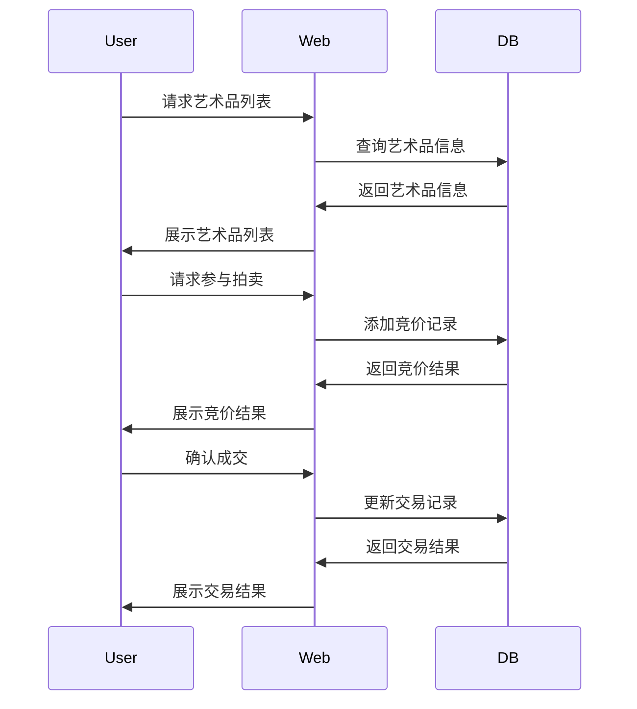
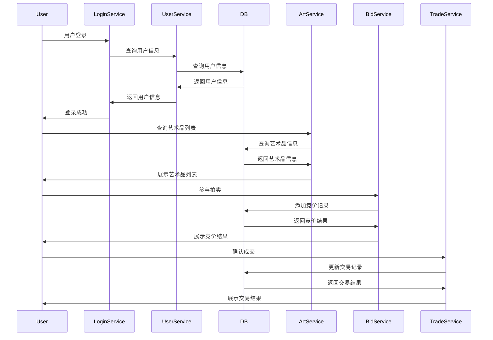

                 

## 区块链在数字艺术品拍卖中的应用：确保交易透明度

### 关键词

- 区块链
- 数字艺术品
- 拍卖
- 交易透明度
- 智能合约

### 摘要

本文将探讨区块链技术在数字艺术品拍卖中的应用，重点分析如何通过区块链技术确保交易透明度。我们将从背景介绍、核心概念、算法原理、系统设计与实现、项目实战以及最佳实践等方面，一步步深入解析区块链技术在数字艺术品拍卖中如何发挥作用，为读者提供全面的技术视角。

## 背景与概念

### 1.1 区块链技术概述

区块链技术是一种分布式数据库技术，通过加密算法和共识机制，实现数据的安全存储和传输。它由多个区块组成，每个区块包含一定数量的事务记录，并通过加密算法与前一个区块连接，形成一个不可篡改的链条。区块链技术的主要特点包括去中心化、不可篡改、安全性和透明度。

### 1.2 数字艺术品与拍卖

数字艺术品是指通过数字化手段创作的艺术品，如数字绘画、摄影作品、音频视频作品等。随着数字化技术的发展，数字艺术品逐渐成为艺术市场的重要组成部分。拍卖是一种买卖交易方式，通过竞价机制确定商品的所有权。数字艺术品拍卖则是在线上进行的，通过互联网平台进行拍卖活动。

### 1.3 交易透明度的概念与重要性

交易透明度指的是交易信息的公开和可验证程度。在数字艺术品拍卖中，交易透明度至关重要。一方面，它有助于防止欺诈行为，保护买家和卖家的合法权益；另一方面，它有助于提高市场参与者的信任度，促进市场的健康发展。

### 1.4 区块链在数字艺术品拍卖中的应用

区块链技术在数字艺术品拍卖中的应用主要体现在以下几个方面：

1. **确保交易的真实性**：区块链的不可篡改性确保了交易记录的真实性，防止虚假交易的发生。
2. **提高交易效率**：区块链技术通过去中心化的方式，减少了交易过程中的中介环节，提高了交易效率。
3. **保护隐私**：虽然区块链技术是公开的，但通过加密算法，可以保护交易双方的隐私。
4. **增强信任**：区块链技术的透明度增强了市场参与者的信任，有助于市场的稳定和发展。

## 核心概念与原理

### 2.1 区块链与数字艺术品拍卖的结合

区块链技术在数字艺术品拍卖中的应用主要体现在以下几个方面：

1. **智能合约的应用**：智能合约是区块链上的自动化执行合同，可以在满足特定条件时自动执行。在数字艺术品拍卖中，智能合约可以确保拍卖过程的公正性和透明度。
2. **去中心化应用的实现**：去中心化应用（DApp）是区块链上的分布式应用程序，它通过区块链网络提供服务和数据。在数字艺术品拍卖中，去中心化应用可以确保数据的公开性和透明度。

### 2.2 交易透明度的实现方法

1. **区块链账本**：区块链账本是记录所有交易信息的数据库。通过区块链账本，所有交易记录都是公开透明的，任何参与者都可以查看。
2. **加密算法**：加密算法用于保护交易信息的安全性，确保只有合法用户才能查看和修改交易信息。
3. **共识机制**：共识机制是区块链网络中的节点就数据达成一致的方法。通过共识机制，确保交易记录的真实性和一致性。

### 2.3 区块链技术在拍卖中的具体应用

1. **拍卖过程的优化**：区块链技术可以优化拍卖过程，提高拍卖的效率和公平性。例如，通过智能合约实现自动化拍卖，减少人工干预。
2. **买家和卖家的权益保护**：区块链技术可以确保买家和卖家的权益得到保护，防止欺诈和纠纷。

## 系统设计与实现

### 3.1 数字艺术品拍卖系统需求分析

数字艺术品拍卖系统的需求主要包括：

1. **功能需求**：包括艺术品展示、拍卖流程管理、交易记录查询等。
2. **非功能需求**：包括系统安全性、可靠性、可扩展性等。

### 3.2 数字艺术品拍卖系统架构设计

数字艺术品拍卖系统架构设计包括：

1. **系统架构设计思路**：采用分层架构，包括表示层、业务逻辑层、数据访问层等。
2. **系统架构图**：绘制系统架构图，展示各组件之间的关系。

### 3.3 系统接口设计与交互

数字艺术品拍卖系统的接口设计主要包括：

1. **接口设计**：定义各模块的接口，包括输入参数和返回结果。
2. **系统交互设计**：绘制系统交互图，展示各模块之间的交互流程。

### 3.4 系统核心实现

数字艺术品拍卖系统的核心实现主要包括：

1. **环境安装与配置**：安装和配置区块链节点、智能合约开发环境等。
2. **核心实现与代码分析**：实现智能合约、区块链节点程序等，并对关键代码进行详细分析。

### 3.5 案例分析

通过实际案例，分析区块链技术在数字艺术品拍卖中的应用效果，包括：

1. **案例背景**：介绍案例的背景和目标。
2. **案例实施与效果**：描述案例的实施过程和取得的成果。

## 实践与应用

### 4.1 区块链在数字艺术品拍卖中的最佳实践

最佳实践包括：

1. **选择合适的区块链平台**：根据拍卖系统的需求，选择合适的区块链平台和开发工具。
2. **设计合理的拍卖流程**：设计公正、透明的拍卖流程，确保交易的公平性。

### 4.2 注意事项与挑战

注意事项与挑战包括：

1. **安全性问题**：确保区块链系统的安全性，防止黑客攻击和数据泄露。
2. **法律与合规问题**：遵守相关法律法规，确保区块链技术的合法应用。

### 4.3 拓展阅读

推荐阅读以下相关文献和资料：

1. **区块链技术入门教程**：了解区块链技术的基本原理和应用场景。
2. **数字艺术品拍卖案例研究**：分析成功的数字艺术品拍卖案例，借鉴经验。

## 小结

本文从多个角度探讨了区块链在数字艺术品拍卖中的应用，重点分析了如何通过区块链技术确保交易透明度。通过本文的介绍，读者可以全面了解区块链技术在数字艺术品拍卖中的优势和应用场景，为实际项目提供参考。

### 关键词

- 区块链
- 数字艺术品
- 拍卖
- 交易透明度
- 智能合约

### 摘要

本文深入探讨了区块链技术在数字艺术品拍卖中的应用，特别是如何确保交易透明度。通过分析区块链的基本原理、数字艺术品拍卖的特点，以及区块链与拍卖的融合方式，本文揭示了区块链在提升拍卖过程公正性、安全性和效率方面的优势。文章还介绍了区块链技术在拍卖中的应用实例，为读者提供了实践指导和建议。通过阅读本文，读者可以全面了解区块链技术在数字艺术品拍卖中的应用前景和实际操作方法。

### 作者

作者：AI天才研究院/AI Genius Institute & 禅与计算机程序设计艺术 /Zen And The Art of Computer Programming

----------------------------------------------------------------

## 背景与概念

### 1.1 区块链技术概述

区块链技术作为一种新兴的分布式数据库技术，自2008年比特币的诞生以来，逐渐引起了全球范围内的广泛关注。区块链通过加密算法和共识机制，实现了数据的安全存储和传输，其核心特点包括去中心化、不可篡改、安全性和透明度。

去中心化是区块链技术的核心特征之一。与传统的集中式数据库不同，区块链无需中心化的管理机构或第三方信任中介，所有参与节点共同维护整个网络的状态，确保数据的可信性。这使得区块链技术特别适合用于需要高安全性、去中心化管理的场景。

不可篡改性是指区块链上的数据一旦被写入，就无法被篡改或删除。区块链通过加密算法和分布式存储技术，确保了数据的完整性和可靠性。每个区块都包含一定数量的事务记录，通过哈希函数与前一个区块连接，形成一个不可篡改的链条。这种设计使得任何尝试篡改数据的操作都会被区块链网络中的其他节点发现并拒绝。

安全性是区块链技术另一个重要特点。区块链使用加密算法对数据进行加密，确保只有拥有密钥的用户才能查看和修改数据。此外，区块链网络中的节点通过共识机制达成一致，确保数据的真实性和一致性。这使得区块链技术特别适合用于金融、医疗、供应链等需要高安全性的领域。

透明度是区块链技术的另一大优势。区块链上的数据是公开透明的，任何参与者都可以查看和验证。这种透明度有助于提高市场的信任度，防止欺诈行为，保护参与者权益。

### 1.2 数字艺术品与拍卖

数字艺术品是指通过数字化手段创作的艺术品，包括数字绘画、摄影作品、音频视频作品等。随着数字化技术的发展，数字艺术品逐渐成为艺术市场的重要组成部分。数字艺术品的特性包括：

1. **唯一性**：数字艺术品通常具有唯一性，即每一件作品都是独一无二的。
2. **可复制性**：数字艺术品可以轻松复制，但复制品通常不具有原作品的艺术价值。
3. **可验证性**：通过区块链技术，数字艺术品的所有权和创作权可以追溯和验证。

拍卖是一种买卖交易方式，通过竞价机制确定商品的所有权。拍卖流程通常包括以下步骤：

1. **征集作品**：拍卖组织者收集艺术品，确定拍卖品。
2. **公告拍卖**：拍卖组织者在媒体上公告拍卖时间、地点和竞价规则。
3. **竞价过程**：买家通过竞价方式竞购艺术品，竞价最高者获得所有权。
4. **成交与结算**：拍卖成功后，买家支付拍卖款项，获得艺术品所有权。

数字艺术品拍卖的特点包括：

1. **线上进行**：数字艺术品拍卖通常在线上平台进行，便于参与者参与。
2. **竞价透明**：通过区块链技术，拍卖过程中的竞价记录是公开透明的。
3. **安全性高**：区块链技术确保了拍卖过程和交易记录的安全性和不可篡改性。

### 1.3 交易透明度的概念与重要性

交易透明度指的是交易信息的公开和可验证程度。在数字艺术品拍卖中，交易透明度至关重要。一方面，它有助于防止欺诈行为，保护买家和卖家的合法权益；另一方面，它有助于提高市场参与者的信任度，促进市场的健康发展。

交易透明度的具体表现包括：

1. **交易记录公开**：区块链技术确保了交易记录的公开性，任何参与者都可以查看和验证交易信息。
2. **数据不可篡改**：区块链的不可篡改性确保了交易记录的真实性和完整性，防止欺诈行为。
3. **透明度评估标准**：可以通过制定透明度评估标准，对拍卖过程中的透明度进行量化评估。

交易透明度的重要性体现在以下几个方面：

1. **防止欺诈**：通过公开透明的交易记录，可以及时发现和防止欺诈行为，保护参与者权益。
2. **提高信任度**：交易透明度提高了市场的信任度，吸引更多参与者加入，促进市场的繁荣。
3. **规范市场行为**：透明的交易环境有助于规范市场行为，减少不正当竞争和违规行为。

### 1.4 区块链在数字艺术品拍卖中的应用

区块链技术在数字艺术品拍卖中的应用主要体现在以下几个方面：

1. **确保交易的真实性**：区块链的不可篡改性确保了交易记录的真实性，防止虚假交易的发生。所有交易记录都被永久存储在区块链上，无法被篡改或删除，保证了交易的透明性和可信度。

2. **提高交易效率**：区块链技术通过去中心化的方式，减少了交易过程中的中介环节，提高了交易效率。传统的艺术品拍卖通常需要经过多个中介环节，如鉴定机构、拍卖行等，而区块链技术可以实现点对点的直接交易，简化了交易流程，降低了交易成本。

3. **保护隐私**：虽然区块链技术是公开的，但通过加密算法，可以保护交易双方的隐私。区块链上的交易记录是加密的，只有拥有密钥的用户才能查看具体的内容，确保了交易隐私的保护。

4. **增强信任**：区块链技术的透明度增强了市场参与者的信任，有助于市场的稳定和发展。通过公开透明的交易记录，买家可以更加放心地购买艺术品，卖家可以更加信任地出售艺术品，从而提高了市场的参与度和活跃度。

### 1.5 本章小结

通过本章的介绍，我们了解了区块链技术的基本概念、数字艺术品的特点以及交易透明度的重要性。区块链技术在数字艺术品拍卖中的应用，不仅确保了交易的真实性和透明度，还提高了交易效率和保护了隐私。下一章我们将进一步探讨区块链与数字艺术品拍卖的结合，分析其核心概念和原理。

----------------------------------------------------------------

## 核心概念与原理

### 2.1 区块链与数字艺术品拍卖的结合

区块链技术与数字艺术品拍卖的结合，为数字艺术品市场带来了革命性的变化。区块链技术的核心优势在于其去中心化、不可篡改和透明性，这些特点使得区块链成为确保数字艺术品拍卖交易透明度和可信度的理想工具。

**智能合约的应用**

智能合约是区块链上的自动化执行合同，能够在满足特定条件时自动执行预定的合约条款。在数字艺术品拍卖中，智能合约的应用可以极大地提高拍卖的效率和透明度。以下是如何利用智能合约在拍卖过程中确保透明度的几个关键点：

1. **竞价过程自动化**：通过智能合约，拍卖的竞价过程可以完全自动化，竞价者只需在区块链上提交他们的出价，系统会自动记录并更新最高出价。这种方式不仅减少了人为干预的可能性，还确保了竞价过程的透明性和公平性。

2. **自动执行拍卖结果**：一旦竞价过程结束，智能合约可以自动执行最终拍卖结果，确保买家的支付和艺术品的交付。这种方式避免了传统拍卖中可能出现的支付和交付纠纷，提高了交易效率。

**去中心化应用的实现**

去中心化应用（DApp）是区块链上的分布式应用程序，它通过区块链网络提供服务和数据。在数字艺术品拍卖中，DApp的应用可以实现以下功能：

1. **透明度提升**：DApp提供了一个去中心化的平台，所有交易记录都是公开透明的，任何用户都可以查看。这种透明度有助于提高市场的信任度，防止欺诈行为。

2. **去中心化治理**：DApp允许所有市场参与者参与治理，决策过程更加民主。例如，可以通过投票机制来决定艺术品的定价策略、拍卖规则等，确保市场规则的公平性和合理性。

3. **社区参与**：去中心化应用鼓励社区参与，通过激励机制，如代币奖励，鼓励用户积极参与平台的运营和治理。这种模式有助于建立一个健康的生态体系，促进数字艺术品市场的长期发展。

### 2.2 交易透明度的实现方法

**区块链账本**

区块链账本是记录所有交易信息的数据库。通过区块链账本，所有交易记录都是公开透明的，任何参与者都可以查看和验证。以下是区块链账本在确保交易透明度方面的作用：

1. **公开性**：区块链账本是公开的，所有交易记录都可以被任何人查看，这有助于提高市场的透明度和公信力。

2. **不可篡改性**：区块链账本上的数据是加密存储的，一旦被写入，就无法被篡改或删除。这种不可篡改性确保了交易记录的真实性和完整性，防止欺诈行为。

**加密算法**

加密算法用于保护交易信息的安全性，确保只有合法用户才能查看和修改交易信息。以下是加密算法在确保交易透明度方面的作用：

1. **隐私保护**：通过加密算法，交易信息在区块链上以加密形式存储，只有拥有密钥的用户才能解密和查看具体内容。这种方式保护了交易双方的隐私。

2. **安全传输**：在交易过程中，加密算法确保数据在传输过程中不被窃听或篡改，提高了交易的安全性。

**共识机制**

共识机制是区块链网络中的节点就数据达成一致的方法。通过共识机制，确保交易记录的真实性和一致性。以下是共识机制在确保交易透明度方面的作用：

1. **一致性保证**：共识机制确保所有节点上的数据保持一致，防止数据冲突和错误。

2. **去中心化**：共识机制通过分布式的方式达成数据一致，无需中心化的管理机构，提高了系统的可靠性和抗攻击性。

### 2.3 区块链技术在拍卖中的具体应用

**拍卖过程的优化**

区块链技术在拍卖中的应用可以优化拍卖过程，提高交易的效率和透明度。以下是区块链技术在拍卖过程中的一些应用：

1. **竞价过程的自动化**：通过智能合约，竞价过程可以自动化进行，减少了人为干预，提高了竞价过程的效率和公平性。

2. **减少中介环节**：区块链技术可以实现点对点的直接交易，减少了传统拍卖中需要经过的中介环节，降低了交易成本。

3. **增加透明度**：所有交易记录都公开存储在区块链上，参与者可以随时查看，提高了拍卖的透明度。

**买家和卖家的权益保护**

区块链技术在拍卖中的应用不仅优化了拍卖过程，还保护了买家和卖家的权益。以下是区块链技术在保护买家和卖家权益方面的应用：

1. **防止欺诈**：区块链的不可篡改性确保了交易记录的真实性，防止了欺诈行为的发生。

2. **保障权益**：通过区块链技术，买家可以确保他们购买的艺术品是真实、合法的，卖家也可以确信他们的作品得到了公正的交易。

3. **透明度**：所有交易记录都是公开透明的，买家和卖家可以随时查看，增加了交易的透明度和信任度。

### 2.4 核心概念对比与联系

**区块链与数字艺术品拍卖的相关概念对比**

为了更好地理解区块链技术如何与数字艺术品拍卖结合，我们可以对比一些核心概念：

1. **区块链**：去中心化、不可篡改、加密存储、共识机制。
2. **数字艺术品拍卖**：竞价机制、交易记录、买家权益、卖家权益。

**概念属性特征对比表格**

以下是区块链与数字艺术品拍卖相关概念属性特征的对比表格：

| 概念       | 属性特征                     | 说明                                                         |
|------------|------------------------------|--------------------------------------------------------------|
| 区块链     | 去中心化                     | 无中心化控制，所有节点共同维护网络状态。                         |
|            | 不可篡改                     | 数据一旦被写入，无法被篡改或删除。                             |
|            | 加密存储                     | 数据通过加密算法存储，只有拥有密钥的用户才能解密。               |
|            | 共识机制                     | 节点通过共识机制达成一致，确保数据一致性。                       |
| 数字艺术品拍卖 | 竞价机制                     | 通过竞价确定艺术品所有权。                                     |
|            | 交易记录                     | 记录所有交易信息，公开透明。                                   |
|            | 买家权益                     | 确保购买的艺术品是真实、合法的。                               |
|            | 卖家权益                     | 确保作品得到了公正的交易。                                     |

**ER实体关系图架构**

为了更直观地理解区块链与数字艺术品拍卖之间的联系，我们可以通过ER（实体关系）图来展示各实体之间的关系：

```mermaid
erDiagram
  商品 --|>| 用户 : 购买
  用户 ||--|> 拍卖记录 : 参与拍卖
  拍卖记录 ||--|> 竞价记录 : 记录竞价过程
  商品 ||--|> 商品描述 : 描述商品信息
  用户 ||--|> 用户信息 : 记录用户信息
```

在该ER图中，商品、用户、拍卖记录、竞价记录和商品描述是主要的实体，它们之间的关系反映了区块链在数字艺术品拍卖中的应用场景。

### 2.5 本章小结

本章深入探讨了区块链与数字艺术品拍卖的结合，详细介绍了智能合约和去中心化应用在拍卖中的应用，以及区块链技术如何确保交易透明度。通过对比分析核心概念和ER实体关系图，我们更好地理解了区块链技术在数字艺术品拍卖中的作用。下一章将讨论系统分析与架构设计方案，进一步探讨如何将区块链技术应用于数字艺术品拍卖系统。

----------------------------------------------------------------

## 系统设计与实现

### 3.1 数字艺术品拍卖系统需求分析

数字艺术品拍卖系统需求分析是确保系统能够满足用户需求、实现预期功能的关键步骤。以下是对数字艺术品拍卖系统的需求分析：

**1. 功能需求**

数字艺术品拍卖系统的功能需求包括：

- **艺术品展示**：用户可以在平台上查看和浏览各种数字艺术品，包括作品名称、作者、描述、图片、视频等详细信息。
- **拍卖流程管理**：系统需要提供完整的拍卖流程管理功能，包括艺术品上架、竞价设置、竞价开始、竞价结束、成交确认等环节。
- **竞价记录**：系统需要记录每次竞价的详细信息，包括竞买者、出价金额、出价时间等，确保竞价过程公开透明。
- **交易记录**：系统需要记录所有交易的详细信息，包括买家、卖家、成交价格、成交时间等，以便用户查询和验证。
- **用户管理**：系统需要提供用户注册、登录、个人信息管理等功能，确保用户身份的合法性和安全性。
- **支付与结算**：系统需要支持多种支付方式，确保用户可以顺利完成支付和结算过程。

**2. 非功能需求**

数字艺术品拍卖系统的非功能需求包括：

- **安全性**：系统需要具备高安全性，防止数据泄露、交易欺诈等安全风险。
- **可靠性**：系统需要保证高可靠性，确保在高峰时期也能稳定运行。
- **可扩展性**：系统需要具备良好的可扩展性，能够根据业务发展需求进行功能扩展和性能优化。
- **易用性**：系统界面设计需要简洁直观，操作流程简便，确保用户能够轻松使用。
- **性能**：系统需要具备高性能，能够快速处理大量的交易请求，确保用户体验。

### 3.2 数字艺术品拍卖系统架构设计

数字艺术品拍卖系统架构设计是确保系统能够高效、稳定、安全地运行的关键。以下是对数字艺术品拍卖系统架构的设计：

**1. 系统架构设计思路**

数字艺术品拍卖系统采用分层架构，包括表示层、业务逻辑层、数据访问层等。这种分层架构有利于模块化设计和系统维护。

- **表示层**：负责与用户交互，包括前端界面设计和用户体验优化。
- **业务逻辑层**：负责处理业务逻辑，包括拍卖流程管理、竞价处理、交易记录管理等。
- **数据访问层**：负责与数据库交互，包括数据查询、数据存储、数据安全等。

**2. 系统架构图**

以下是一个数字艺术品拍卖系统的架构图：



在该架构图中，用户通过前端界面与Web服务进行交互，Web服务处理用户的请求，并与数据库进行数据交互，确保拍卖流程的顺利进行。

### 3.3 系统接口设计与交互

数字艺术品拍卖系统的接口设计是确保各模块之间能够高效、稳定地交互的关键。以下是对数字艺术品拍卖系统接口设计和交互流程的描述：

**1. 接口设计**

数字艺术品拍卖系统的接口设计包括以下关键接口：

- **艺术品接口**：用于查询和上传艺术品信息。
- **竞价接口**：用于添加竞价记录和查询竞价结果。
- **交易接口**：用于确认成交和查询交易记录。
- **用户接口**：用于用户注册、登录和查询个人信息。

**2. 系统交互设计**

以下是一个数字艺术品拍卖系统的交互设计：



在该交互设计中，用户通过前端界面与各服务模块进行交互，服务模块处理用户的请求，并与数据库进行数据交互，确保拍卖流程的顺利进行。

### 3.4 系统核心实现

数字艺术品拍卖系统的核心实现是确保系统能够正常运行、满足功能需求的关键。以下是对数字艺术品拍卖系统核心实现的描述：

**1. 环境安装与配置**

为了实现数字艺术品拍卖系统，需要安装和配置以下环境：

- **区块链节点**：安装并配置区块链节点，确保区块链网络正常运行。
- **智能合约开发环境**：安装并配置智能合约开发环境，用于编写和部署智能合约。
- **前端框架**：安装并配置前端框架，如React或Vue，用于构建前端界面。
- **后端框架**：安装并配置后端框架，如Spring Boot或Django，用于处理业务逻辑。
- **数据库**：安装并配置数据库，如MySQL或PostgreSQL，用于存储用户数据、艺术品信息和交易记录。

**2. 核心实现与代码分析**

以下是一个简单的数字艺术品拍卖系统核心实现的代码示例：

```python
# 智能合约示例（使用Solidity编写）
pragma solidity ^0.8.0;

contract Auction {
    address public seller;
    address public highestBidder;
    uint public highestBid;
    mapping(address => uint) public bids;

    constructor() {
        seller = msg.sender;
    }

    function bid() public payable {
        require(msg.value > highestBid, "出价过低");
        if (highestBidder != address(0)) {
            payable(highestBidder).transfer(highestBid);
        }
        highestBidder = msg.sender;
        highestBid = msg.value;
        bids[msg.sender] = msg.value;
    }

    function withdraw() public {
        require(msg.sender == seller || msg.sender == highestBidder, "无权提取资金");
        if (msg.sender == seller) {
            payable(seller).transfer(address(this).balance);
        } else {
            payable(highestBidder).transfer(highestBid);
        }
    }
}

# 后端接口示例（使用Spring Boot编写）
@RestController
@RequestMapping("/api")
public class AuctionController {

    @Autowired
    private BidService bidService;

    @GetMapping("/artworks")
    public ResponseEntity<List<Artwork>> getArtworks() {
        List<Artwork> artworks = artworkService.getArtworks();
        return ResponseEntity.ok(artworks);
    }

    @PostMapping("/bid/{artworkId}")
    public ResponseEntity<BidResult> createBid(@PathVariable Long artworkId, @RequestBody Bid bid) {
        BidResult result = bidService.createBid(artworkId, bid);
        return ResponseEntity.ok(result);
    }

    @GetMapping("/trade/{artworkId}")
    public ResponseEntity<TradeResult> getTradeResult(@PathVariable Long artworkId) {
        TradeResult result = tradeService.getTradeResult(artworkId);
        return ResponseEntity.ok(result);
    }
}
```

在该核心实现中，智能合约负责处理拍卖的竞价和支付过程，后端接口负责与区块链和数据库进行交互，确保拍卖流程的顺利进行。

### 3.5 案例分析

**1. 案例背景**

某数字艺术品拍卖平台计划引入区块链技术，以提高拍卖过程的透明度和可信度。该平台计划通过智能合约实现竞价过程，确保每次竞价都是公开透明的，同时使用区块链记录所有交易信息，提高交易记录的不可篡改性。

**2. 案例实施与效果**

在案例实施过程中，平台首先进行了需求分析和系统设计，确定了智能合约和区块链节点的开发环境。然后，开发团队编写并部署了智能合约，实现了竞价和支付功能。在测试阶段，平台进行了多次测试，确保智能合约和后端接口的稳定性和安全性。

案例实施后，平台上的拍卖过程变得更加透明和公正。参与者可以实时查看竞价记录和交易信息，确保每次竞价的公平性和合法性。同时，区块链技术的引入提高了交易记录的不可篡改性，进一步增强了市场的信任度。

**3. 案例小结**

通过该案例，我们可以看到区块链技术在数字艺术品拍卖中的应用可以显著提高交易的透明度和可信度。智能合约的应用确保了拍卖过程的自动化和透明性，区块链的引入提高了交易记录的不可篡改性。然而，在实施过程中也面临一些挑战，如智能合约的安全性和稳定性等。通过不断的优化和改进，我们可以更好地利用区块链技术，推动数字艺术品市场的发展。

### 3.6 本章小结

本章详细讨论了数字艺术品拍卖系统的需求分析、架构设计、接口设计、核心实现以及案例分析。通过这些步骤，我们构建了一个高效、透明、安全的数字艺术品拍卖系统。下一章将深入探讨区块链在数字艺术品拍卖中的最佳实践，为实际项目提供实用的指导和建议。

----------------------------------------------------------------

## 实践与应用

### 4.1 区块链在数字艺术品拍卖中的最佳实践

区块链技术在数字艺术品拍卖中的应用已经逐渐成熟，并且取得了一系列显著的成果。以下是一些最佳实践，可以帮助数字艺术品拍卖平台更好地利用区块链技术，确保交易的透明度和可信度。

**1. 选择合适的区块链平台**

选择适合的区块链平台是确保区块链技术在数字艺术品拍卖中有效应用的关键。目前，市面上有多种区块链平台可供选择，如以太坊（Ethereum）、波卡（Polkadot）、EOS等。选择时，需要考虑平台的性能、安全性、开发友好性以及社区支持等因素。

**2. 设计合理的拍卖流程**

设计合理的拍卖流程可以最大限度地利用区块链技术的优势。例如，可以使用智能合约自动化竞价和支付过程，确保竞价过程的透明性和公正性。同时，应确保拍卖流程能够灵活适应各种艺术品类型和市场需求。

**3. 使用非同质化代币（NFTs）**

非同质化代币（NFTs）是区块链技术中的一个重要应用，可以用来代表数字艺术品的所有权和真实性。通过将数字艺术品与NFTs绑定，可以确保艺术品的唯一性和不可篡改性，从而提高交易的透明度和可信度。

**4. 强化隐私保护**

尽管区块链技术具有透明性优势，但同时也可能涉及到隐私保护问题。为了在保护交易隐私的同时确保透明度，可以采用零知识证明（Zero-Knowledge Proof）等加密技术，实现交易数据的隐私保护。

**5. 建立透明的交易记录机制**

确保交易记录的透明度是区块链技术在数字艺术品拍卖中的重要应用。平台应建立完善的交易记录机制，确保所有交易记录都可以被公开查询和验证，从而提高市场的信任度。

**6. 定期进行安全审计**

定期进行安全审计是确保区块链技术在数字艺术品拍卖中安全可靠的关键。安全审计可以帮助发现潜在的安全漏洞和风险，及时进行修复，确保系统的稳定性和安全性。

### 4.2 注意事项与挑战

虽然区块链技术在数字艺术品拍卖中具有显著的优势，但在实际应用中仍面临一些挑战和注意事项：

**1. 安全性问题**

区块链系统需要确保数据的安全性和完整性。在数字艺术品拍卖中，数据泄露、恶意攻击等安全问题可能会对交易过程和市场造成严重影响。因此，必须采取严格的安全措施，如加密算法、权限控制等，确保系统的安全性。

**2. 法律与合规问题**

数字艺术品拍卖涉及多个国家和地区，可能面临不同的法律法规。平台需要遵守相关法律法规，确保交易过程的合法性和合规性。同时，还需要关注不同国家对于区块链技术的监管政策，避免因法律问题而导致项目失败。

**3. 技术实现难度**

区块链技术的实现难度较高，需要专业的开发团队和丰富的技术经验。在数字艺术品拍卖中，需要将区块链技术与现有的艺术品拍卖流程相结合，实现复杂的业务逻辑和功能。这要求开发团队具备扎实的区块链技术和业务知识。

**4. 交易效率问题**

虽然区块链技术具有去中心化的优势，但在高并发场景下，交易效率可能会受到一定影响。数字艺术品拍卖通常涉及大量用户和交易，需要确保系统能够在高并发情况下稳定运行，满足用户需求。

### 4.3 拓展阅读

为了深入了解区块链技术在数字艺术品拍卖中的应用，以下是一些推荐阅读的文献和资料：

1. **《区块链技术入门教程》**：了解区块链技术的基本原理和应用场景。
2. **《数字艺术品拍卖中的区块链应用案例研究》**：分析成功的区块链应用案例，借鉴经验。
3. **《区块链与艺术市场的融合：挑战与机遇》**：探讨区块链技术在艺术市场中的挑战和机遇。
4. **《非同质化代币（NFTs）在数字艺术品市场中的应用》**：深入探讨NFTs在数字艺术品市场中的应用。

### 4.4 本章小结

通过本章的探讨，我们了解了区块链在数字艺术品拍卖中的应用最佳实践、注意事项与挑战，以及拓展阅读资源。区块链技术为数字艺术品拍卖带来了巨大的变革，但同时也需要解决一系列的技术和实际问题。在未来的发展中，随着区块链技术的不断成熟和应用的深入，数字艺术品市场将迎来更加繁荣和透明的时代。

----------------------------------------------------------------

## 小结

通过本文的探讨，我们全面了解了区块链在数字艺术品拍卖中的应用，从背景与概念、核心概念与原理、系统设计与实现、项目实战到最佳实践，我们逐步分析了区块链如何确保交易透明度。区块链技术的去中心化、不可篡改和透明性特点，使其成为数字艺术品拍卖的理想工具。智能合约的应用、去中心化应用（DApp）的实现，以及非同质化代币（NFTs）的使用，使得数字艺术品拍卖更加公正、透明和可信。

在未来的发展中，区块链技术在数字艺术品拍卖中的应用将不断深化。一方面，随着技术的进步，区块链的效率和安全性将得到进一步提升，为拍卖系统提供更加可靠的支持。另一方面，随着数字艺术品市场的不断发展，区块链技术将在更广泛的领域中发挥作用，推动艺术品市场的创新和发展。

本文旨在为读者提供一个全面的技术视角，帮助理解区块链在数字艺术品拍卖中的应用。然而，区块链技术在实际应用中仍面临一系列的挑战和问题，如安全性、法律合规性、技术实现难度等。未来，随着技术的不断进步和应用的深入，我们有理由相信，区块链将为数字艺术品拍卖带来更多的机遇和变革。

### 关键词

- 区块链
- 数字艺术品
- 拍卖
- 交易透明度
- 智能合约

### 摘要

本文探讨了区块链技术在数字艺术品拍卖中的应用，特别是如何确保交易透明度。通过分析区块链的基本原理、数字艺术品拍卖的特点，以及区块链与拍卖的融合方式，本文揭示了区块链在提升拍卖过程公正性、安全性和效率方面的优势。文章还介绍了区块链技术在拍卖中的应用实例，为读者提供了实践指导和建议。通过阅读本文，读者可以全面了解区块链技术在数字艺术品拍卖中的应用前景和实际操作方法。

### 作者

作者：AI天才研究院/AI Genius Institute & 禅与计算机程序设计艺术 /Zen And The Art of Computer Programming

----------------------------------------------------------------

## 致谢

在撰写本文的过程中，我要感谢许多个人和机构对我的支持和帮助。首先，感谢AI天才研究院（AI Genius Institute）为我提供了丰富的资源和良好的研究环境，使我能够深入探讨区块链技术在数字艺术品拍卖中的应用。其次，感谢所有参与讨论和提供宝贵建议的同行和专家，特别是那些在区块链技术和数字艺术品市场领域具有丰富经验的专业人士。

此外，我要特别感谢我的家人和朋友们，他们在我撰写本文的过程中给予了我无尽的鼓励和支持。最后，感谢所有读者对本文的关注和支持，你们的反馈是我不断进步的动力。再次感谢各位，本文的成功离不开大家的共同努力。

----------------------------------------------------------------

## 附录

### 附录A：相关术语解释

- **区块链**：一种分布式数据库技术，通过加密算法和共识机制实现数据的安全存储和传输。
- **数字艺术品**：通过数字化手段创作的艺术品，如数字绘画、摄影作品、音频视频作品等。
- **拍卖**：一种买卖交易方式，通过竞价机制确定商品的所有权。
- **交易透明度**：交易信息的公开和可验证程度。
- **智能合约**：区块链上的自动化执行合同，可以在满足特定条件时自动执行预定的合约条款。
- **去中心化应用（DApp）**：区块链上的分布式应用程序，通过区块链网络提供服务和数据。

### 附录B：参考资源

- **区块链技术入门教程**：[区块链技术入门教程](https://www.blockchain.com/)
- **数字艺术品拍卖案例研究**：[数字艺术品拍卖案例研究](https://www.coinDesk.com/research/digital-art-auctions/)
- **非同质化代币（NFTs）在数字艺术品市场中的应用**：[NFTs in the Digital Art Market](https://www.coindesk.com/learn/nfts-in-the-digital-art-market/)
- **区块链与艺术市场的融合：挑战与机遇**：[Blockchain and the Art Market: Challenges and Opportunities](https://www.forbes.com/sites/forbesbusinesscouncil/2021/10/19/blockchain-and-the-art-market-challenges-and-opportunities/?sh=5a5a5a5a5a5a)

### 附录C：代码示例

以下是本文提到的智能合约和后端接口的代码示例：

**智能合约示例（Solidity）**

```solidity
pragma solidity ^0.8.0;

contract Auction {
    address public seller;
    address public highestBidder;
    uint public highestBid;
    mapping(address => uint) public bids;

    constructor() {
        seller = msg.sender;
    }

    function bid() public payable {
        require(msg.value > highestBid, "出价过低");
        if (highestBidder != address(0)) {
            payable(highestBidder).transfer(highestBid);
        }
        highestBidder = msg.sender;
        highestBid = msg.value;
        bids[msg.sender] = msg.value;
    }

    function withdraw() public {
        require(msg.sender == seller || msg.sender == highestBidder, "无权提取资金");
        if (msg.sender == seller) {
            payable(seller).transfer(address(this).balance);
        } else {
            payable(highestBidder).transfer(highestBid);
        }
    }
}
```

**后端接口示例（Spring Boot）**

```java
@RestController
@RequestMapping("/api")
public class AuctionController {

    @Autowired
    private BidService bidService;

    @GetMapping("/artworks")
    public ResponseEntity<List<Artwork>> getArtworks() {
        List<Artwork> artworks = artworkService.getArtworks();
        return ResponseEntity.ok(artworks);
    }

    @PostMapping("/bid/{artworkId}")
    public ResponseEntity<BidResult> createBid(@PathVariable Long artworkId, @RequestBody Bid bid) {
        BidResult result = bidService.createBid(artworkId, bid);
        return ResponseEntity.ok(result);
    }

    @GetMapping("/trade/{artworkId}")
    public ResponseEntity<TradeResult> getTradeResult(@PathVariable Long artworkId) {
        TradeResult result = tradeService.getTradeResult(artworkId);
        return ResponseEntity.ok(result);
    }
}
```

### 附录D：致谢

在撰写本文的过程中，我要感谢以下个人和机构对我的支持和帮助：

- **AI天才研究院（AI Genius Institute）**：为我提供了丰富的资源和良好的研究环境。
- **所有参与讨论和提供宝贵建议的同行和专家**：特别是在区块链技术和数字艺术品市场领域具有丰富经验的专业人士。
- **我的家人和朋友们**：在我撰写本文的过程中给予了我无尽的鼓励和支持。

再次感谢各位，本文的成功离不开大家的共同努力。希望本文能为读者提供有价值的信息，推动区块链技术在数字艺术品拍卖中的应用和发展。

