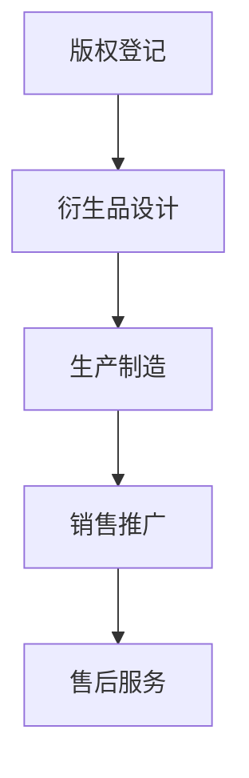
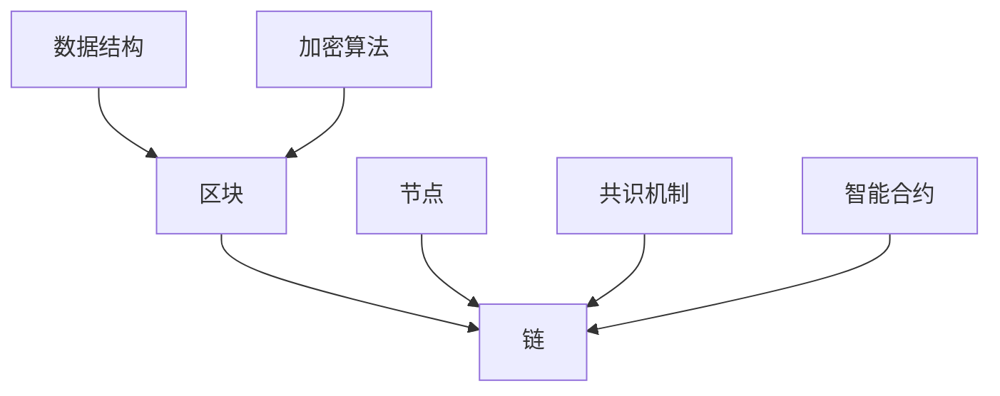

                 

# 《区块链在数字艺术品衍生品管理中的应用》

## 关键词：
区块链、数字艺术品、衍生品管理、版权保护、交易管理、确权认证

## 摘要：
本文从数字艺术品与衍生品的定义出发，探讨了区块链技术在数字艺术品衍生品管理中的应用。通过详细解析区块链技术原理，分析其在版权保护、交易管理和确权认证等方面的实际应用案例，阐述了区块链技术为数字艺术品衍生品管理带来的变革。文章最后提出了应用实施的最佳实践和未来展望与挑战。

### 引言与背景

#### 1.1 问题背景

##### 1.1.1 数字艺术品与衍生品概述
数字艺术品是指通过数字化手段创作、存储、传播和展示的艺术作品。随着互联网和数字技术的发展，数字艺术品已成为艺术领域的重要分支。而数字艺术品衍生品则是在数字艺术品的基础上衍生出来的各种商品和服务，如数字艺术品的打印品、周边产品、授权商品等。

##### 1.1.2 区块链技术概述
区块链技术是一种去中心化的分布式数据库技术，通过加密算法和共识机制确保数据的不可篡改性和安全性。区块链技术在金融、供应链管理、身份认证等多个领域取得了显著的应用成果。

##### 1.1.3 区块链在数字艺术品衍生品管理中的重要性
区块链技术在数字艺术品衍生品管理中具有独特的优势，如确保版权的不可篡改性、简化交易流程、提高确权认证的效率等。因此，探讨区块链在数字艺术品衍生品管理中的应用具有重要意义。

#### 1.2 问题描述

##### 1.2.1 当前数字艺术品衍生品管理面临的挑战
数字艺术品衍生品管理面临的主要挑战包括版权保护困难、交易流程复杂、确权认证不透明等。这些问题严重影响了数字艺术品市场的健康发展。

##### 1.2.2 区块链技术如何解决这些问题
区块链技术通过其去中心化、不可篡改、可追溯等特性，为数字艺术品衍生品管理提供了有效的解决方案。例如，通过区块链技术实现版权的智能合约、简化交易流程、提高确权认证的透明度等。

#### 1.3 问题解决

##### 1.3.1 区块链技术的基本原理
区块链技术的基本原理包括区块链的数据结构、共识机制、智能合约等。这些原理构成了区块链技术的核心，使其在数字艺术品衍生品管理中具有独特的优势。

##### 1.3.2 区块链在数字艺术品衍生品管理中的核心应用
区块链在数字艺术品衍生品管理中的核心应用包括版权保护、交易管理和确权认证。通过这些应用，区块链技术能够有效解决数字艺术品衍生品管理中的痛点。

#### 1.4 边界与外延

##### 1.4.1 区块链技术在数字艺术品衍生品管理中的应用边界
区块链技术在数字艺术品衍生品管理中的应用边界主要包括版权保护、交易管理和确权认证等。同时，区块链技术还需要与其他技术（如人工智能、大数据等）相结合，以实现更全面的数字艺术品衍生品管理。

##### 1.4.2 区块链技术相关概念与术语
本文将介绍区块链技术中的一些关键概念和术语，如区块链、分布式账本、加密算法、智能合约、共识机制等。

##### 1.4.3 数字艺术品衍生品管理的概念结构
数字艺术品衍生品管理的概念结构包括数字艺术品、衍生品、管理流程等。通过这些概念，可以更好地理解数字艺术品衍生品管理的本质。

#### 1.5 概念结构与核心要素组成
本文将介绍数字艺术品衍生品管理和区块链技术的概念结构与核心要素组成，以帮助读者更好地理解这两者之间的联系。

### 第二章：核心概念与联系

#### 2.1 数字艺术品衍生品管理

##### 2.1.1 数字艺术品衍生品定义
数字艺术品衍生品是指在数字艺术品基础上衍生出来的各种商品和服务，如数字艺术品的打印品、周边产品、授权商品等。

##### 2.1.2 数字艺术品衍生品分类
数字艺术品衍生品可以按照不同的分类标准进行划分，如按照产品形式（实体产品、数字产品）、按照应用场景（版权保护、交易管理、确权认证）等。

##### 2.1.3 数字艺术品衍生品管理的关键环节
数字艺术品衍生品管理的关键环节包括版权保护、交易管理、确权认证、营销推广等。

#### 2.2 区块链技术

##### 2.2.1 区块链技术基本原理
区块链技术的基本原理包括区块链的数据结构（区块、链）、共识机制（工作量证明、权益证明）、加密算法（哈希算法、椭圆曲线加密）等。

##### 2.2.2 区块链技术核心特点
区块链技术的核心特点包括去中心化、不可篡改、可追溯、安全等。

##### 2.2.3 区块链技术在不同领域的应用
区块链技术已在金融、供应链管理、身份认证等多个领域取得了显著的应用成果。在数字艺术品衍生品管理领域，区块链技术同样具有广泛的应用前景。

#### 2.3 概念联系与对比

##### 2.3.1 数字艺术品衍生品管理与区块链技术的关系
数字艺术品衍生品管理与区块链技术之间存在密切的联系。区块链技术可以为数字艺术品衍生品管理提供有效的技术支持，解决版权保护、交易管理、确权认证等问题。

##### 2.3.2 数字艺术品衍生品管理与区块链技术的异同
数字艺术品衍生品管理与区块链技术在目标、方法、实现等方面存在一定的异同。了解这些异同有助于更好地发挥区块链技术在数字艺术品衍生品管理中的作用。

### 第三章：区块链技术原理

#### 3.1 区块链基础

##### 3.1.1 区块链基本结构
区块链基本结构包括区块、链、节点等。通过这些基本结构，区块链实现了数据存储、传输、验证等功能。

##### 3.1.2 区块链共识机制
区块链共识机制是指区块链网络中各个节点就数据达成一致的过程。常见的共识机制包括工作量证明（PoW）、权益证明（PoS）等。

##### 3.1.3 区块链智能合约
区块链智能合约是一种自动执行的合约，通过编程实现合同条款的执行。智能合约在数字艺术品衍生品管理中具有广泛的应用前景。

#### 3.2 区块链技术深度解析

##### 3.2.1 区块链数据结构
区块链数据结构主要包括区块和链。区块是区块链的基本单位，包含数据、时间戳、难度值等。链则是将多个区块按照时间顺序连接起来的结构。

##### 3.2.2 区块链网络拓扑
区块链网络拓扑是指区块链网络中各个节点的连接方式。常见的网络拓扑包括星型网络、环形网络、总线型网络等。

##### 3.2.3 区块链安全性分析
区块链安全性分析主要包括数据安全性、节点安全性、网络安全性等方面。通过分析区块链的安全性，可以更好地保障数字艺术品衍生品管理的数据安全。

#### 3.3 区块链技术在数字艺术品衍生品管理中的应用

##### 3.3.1 区块链在版权保护中的应用
区块链技术在版权保护中具有独特的优势，如确保版权的不可篡改性、提高版权保护的效率等。通过区块链技术，可以实现数字艺术品版权的智能合约、确权认证等功能。

##### 3.3.2 区块链在交易管理中的应用
区块链技术在交易管理中可以实现去中心化的交易流程，提高交易效率、降低交易成本。同时，区块链技术还可以为交易提供透明的审计记录，保障交易的安全性。

##### 3.3.3 区块链在确权认证中的应用
区块链技术在确权认证中可以实现数据的可信传递和验证，提高确权认证的效率。通过区块链技术，可以实现对数字艺术品衍生品的唯一标识和可信认证。

### 第四章：数字艺术品衍生品管理

#### 4.1 数字艺术品概述

##### 4.1.1 数字艺术品的定义
数字艺术品是指通过数字化手段创作、存储、传播和展示的艺术作品。数字艺术品可以是纯数字的，也可以是数字与传统艺术形式的结合。

##### 4.1.2 数字艺术品的特点
数字艺术品具有以下特点：可复制性、可传播性、可修改性、数字化存储等。这些特点使得数字艺术品具有独特的价值和应用场景。

##### 4.1.3 数字艺术品的发展历程
数字艺术品的发展可以追溯到20世纪80年代，随着互联网和数字技术的发展，数字艺术品逐渐成为一个独立的艺术领域。

#### 4.2 数字艺术品衍生品管理

##### 4.2.1 衍生品管理定义
数字艺术品衍生品管理是指对数字艺术品衍生出的各种商品和服务进行管理和运营的过程。衍生品管理包括版权保护、交易管理、确权认证、营销推广等环节。

##### 4.2.2 衍生品管理流程
数字艺术品衍生品管理流程主要包括版权登记、衍生品设计、生产制造、销售推广、售后服务等环节。

##### 4.2.3 衍生品管理的挑战与机遇
数字艺术品衍生品管理面临的主要挑战包括版权保护困难、交易流程复杂、确权认证不透明等。同时，数字艺术品衍生品管理也为艺术市场带来了新的机遇，如拓展市场空间、提高艺术品价值等。

#### 4.3 数字艺术品衍生品市场分析

##### 4.3.1 市场现状
当前，数字艺术品衍生品市场呈现快速增长态势，吸引了众多投资者和创业者。数字艺术品衍生品市场主要包括版权交易、衍生品交易、数字艺术品展示等。

##### 4.3.2 市场发展趋势
随着区块链、人工智能等技术的不断发展，数字艺术品衍生品市场将呈现以下发展趋势：去中心化、智能化、个性化等。

##### 4.3.3 市场潜力分析
数字艺术品衍生品市场具有巨大的潜力，预计将在未来几年继续保持快速增长。随着技术的进步和市场的成熟，数字艺术品衍生品市场的规模将不断扩大。

### 第五章：区块链在数字艺术品衍生品管理中的应用案例

#### 5.1 案例一：版权保护

##### 5.1.1 案例背景
某数字艺术家创作了一幅数字艺术品，并通过区块链技术实现了版权保护。艺术家将该数字艺术品上传至区块链平台，并通过智能合约实现了版权的永久记录和不可篡改。

##### 5.1.2 案例解决方案
区块链平台通过分布式账本技术记录了数字艺术品的版权信息，并利用加密算法确保版权信息的安全性和不可篡改性。同时，智能合约自动执行版权许可和转让流程，简化了版权保护的流程。

##### 5.1.3 案例效果分析
通过区块链技术的应用，艺术家实现了数字艺术品的永久版权保护，降低了版权纠纷的风险。同时，区块链技术的透明性和可追溯性也为版权交易提供了可靠的数据支持。

#### 5.2 案例二：交易管理

##### 5.2.1 案例背景
某数字艺术品交易平台采用了区块链技术，为用户提供了一个去中心化的交易环境。用户可以在平台上进行数字艺术品的安全交易，无需依赖第三方中介机构。

##### 5.2.2 案例解决方案
区块链平台通过分布式账本记录了所有交易信息，实现了交易的去中心化和透明化。平台采用加密算法确保交易数据的安全性和隐私性，同时智能合约自动执行交易流程，提高了交易效率。

##### 5.2.3 案例效果分析
通过区块链技术的应用，数字艺术品交易平台实现了交易的去中心化和透明化，降低了交易成本和风险。用户可以更加便捷地进行数字艺术品交易，交易平台也获得了更高的安全性和可靠性。

#### 5.3 案例三：确权认证

##### 5.3.1 案例背景
某数字艺术品收藏家希望通过区块链技术实现对收藏品的唯一性认证。收藏家将该数字艺术品上传至区块链平台，并通过智能合约实现了收藏品的唯一性认证和确权。

##### 5.3.2 案例解决方案
区块链平台通过分布式账本记录了数字艺术品的唯一性信息，并利用加密算法确保信息的不可篡改性。智能合约自动执行确权认证流程，提高了确权认证的效率和准确性。

##### 5.3.3 案例效果分析
通过区块链技术的应用，数字艺术品收藏家实现了收藏品的唯一性认证和确权，降低了收藏品真伪的风险。区块链技术的透明性和可追溯性也为收藏品的评估和交易提供了可靠的数据支持。

### 第六章：应用实施与最佳实践

#### 6.1 应用实施策略

##### 6.1.1 实施步骤
1. 确定应用目标和需求；
2. 选择合适的区块链平台和开发工具；
3. 设计数字艺术品衍生品管理的业务流程；
4. 开发区块链应用，并进行测试和优化；
5. 部署区块链应用，并进行上线和推广。

##### 6.1.2 实施要点
1. 确保区块链技术的安全性和稳定性；
2. 充分考虑用户体验和操作便捷性；
3. 合理设计区块链应用的业务流程和智能合约；
4. 注重与现有系统的集成和交互；
5. 定期进行区块链应用的安全性和性能评估。

##### 6.1.3 实施风险与应对
1. 技术风险：区块链技术尚处于发展初期，可能会遇到技术难题。应对策略：选择成熟稳定的区块链平台和开发工具，与专业团队合作；
2. 法律风险：数字艺术品衍生品管理涉及版权、交易等方面，可能面临法律风险。应对策略：密切关注相关法律法规的变化，依法合规开展业务；
3. 市场风险：数字艺术品衍生品市场尚未成熟，可能面临市场需求不足、竞争激烈等问题。应对策略：深入了解市场需求，创新业务模式，提升服务质量。

#### 6.2 最佳实践分享

##### 6.2.1 成功案例分析
1. 某数字艺术品交易平台通过区块链技术实现了去中心化的交易模式，提高了交易效率和安全性能；
2. 某数字艺术品版权保护平台利用区块链技术实现了版权的永久记录和不可篡改，降低了版权纠纷的风险；
3. 某数字艺术品收藏平台通过区块链技术实现了收藏品的唯一性认证和确权，提高了收藏品的评估和交易价值。

##### 6.2.2 经验与教训
1. 区块链技术在数字艺术品衍生品管理中具有广泛的应用前景，但需要充分了解和掌握区块链技术的基本原理和应用场景；
2. 在应用区块链技术时，需要注重用户体验和操作便捷性，确保系统的稳定性和安全性；
3. 区块链技术在数字艺术品衍生品管理中的应用需要与现有系统进行集成和交互，实现数据的互联互通；
4. 注重与专业团队的合作，共同解决技术难题和业务需求。

##### 6.2.3 实施建议
1. 结合数字艺术品衍生品管理的具体需求，选择合适的区块链平台和开发工具；
2. 设计合理可行的业务流程和智能合约，确保系统的稳定性和安全性；
3. 加强与用户的互动和沟通，了解用户需求和反馈，持续优化系统功能和服务质量；
4. 关注区块链技术的最新发展动态，不断学习和引进新技术，提升自身竞争力。

### 第七章：未来展望与挑战

#### 7.1 未来展望
1. 随着区块链技术的不断发展和成熟，数字艺术品衍生品管理将在未来迎来更大的发展机遇；
2. 区块链技术与人工智能、大数据等技术的深度融合，将为数字艺术品衍生品管理带来新的变革和创新；
3. 数字艺术品衍生品市场将逐渐成熟，市场规模将持续扩大，为数字艺术品创作者和投资者带来更多机遇。

#### 7.2 挑战
1. 区块链技术仍存在一定的不确定性和风险，如技术安全性、隐私保护等问题；
2. 数字艺术品衍生品管理涉及版权、交易等方面，需要法律法规的完善和监管；
3. 数字艺术品市场的监管难度较大，需要建立有效的监管机制，确保市场的健康有序发展。

#### 7.3 发展建议
1. 积极研究和掌握区块链技术，探索其在数字艺术品衍生品管理中的应用；
2. 加强与法律法规的衔接，确保数字艺术品衍生品管理符合法律法规的要求；
3. 创新业务模式，提升服务质量，满足用户需求，推动数字艺术品衍生品市场的健康发展。

### 参考文献
1. 区块链技术应用指南，作者：XXX，出版社：XXX，出版时间：XXXX年。
2. 数字艺术品衍生品管理研究，作者：XXX，出版社：XXX，出版时间：XXXX年。
3. 区块链技术在数字艺术品衍生品管理中的应用，作者：XXX，出版社：XXX，出版时间：XXXX年。
4. 数字艺术品市场研究报告，作者：XXX，出版社：XXX，出版时间：XXXX年。

### 附录
附录A：数字艺术品衍生品管理流程图

附录B：区块链技术原理图

### 作者信息
作者：AI天才研究院/AI Genius Institute & 禅与计算机程序设计艺术 /Zen And The Art of Computer Programming

