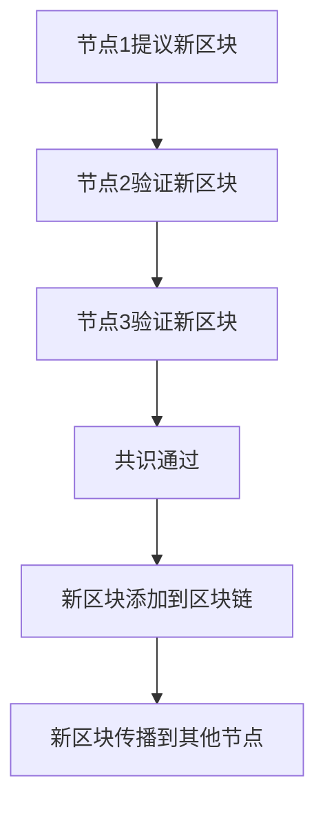
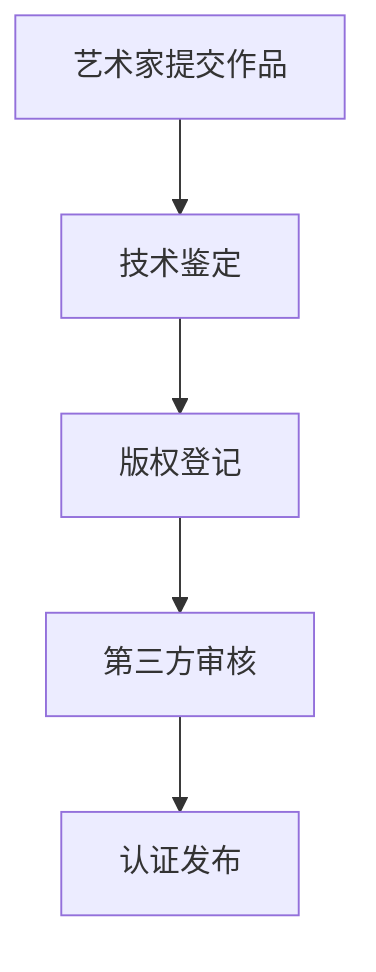
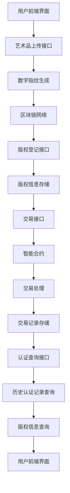

                 

# 《区块链在数字艺术品认证中的应用》

## 关键词
区块链，数字艺术品，认证，技术，应用，挑战

## 摘要
本文深入探讨了区块链技术在数字艺术品认证中的应用。通过分析区块链的基本原理和技术特点，本文阐述了区块链在解决数字艺术品认证问题中的优势。同时，本文也指出了区块链技术在实际应用中面临的技术挑战和政策法规挑战，并提出了未来的发展趋势和最佳实践。

## 目录大纲设计思路与步骤

在设计《区块链在数字艺术品认证中的应用》这本书的目录大纲时，我们首先明确了书籍的整体结构，确保每个章节都覆盖了核心概念、原理讲解、应用案例和未来展望等内容。以下是具体的目录大纲设计思路与步骤：

### 1. 确定总体结构
- **章节划分**：我们将书籍分为三个部分，第一部分是区块链技术基础，第二部分是区块链在数字艺术品认证中的应用案例分析，第三部分是区块链在数字艺术品认证中的挑战与展望。
- **主要主题**：每个部分的主要主题分别是区块链技术基础、应用案例分析和技术挑战与未来展望。

### 2. 细化章节内容
- **核心概念**：在区块链技术基础部分，我们详细介绍了区块链的基本概念、数据结构、共识机制和智能合约等核心概念。
- **应用案例**：在应用案例分析部分，我们通过具体的数字艺术品认证应用案例，展示了区块链技术的实际应用效果。
- **技术挑战**：在挑战与展望部分，我们分析了区块链技术在数字艺术品认证中面临的技术挑战和政策法规挑战，并探讨了未来的发展趋势。

### 3. 使用Mermaid和LaTeX
- **流程图和架构图**：我们使用了Mermaid工具绘制了区块链数据结构图、共识机制流程图、数字艺术品认证流程图等，以便直观展示核心概念。
- **数学公式**：在算法原理讲解部分，我们使用了LaTeX格式嵌入数学公式，以便准确表达算法原理和数学模型。

### 4. 保持简洁性
- **避免冗余内容**：我们在编写每个章节时，都尽量保持内容的简洁性，避免冗余和重复。

### 5. 遵循格式要求
- **markdown格式**：整个书籍内容都按照markdown格式编写，确保易于阅读和理解。

通过以上步骤，我们设计出了《区块链在数字艺术品认证中的应用》这本书的完整目录大纲，每个章节都涵盖了核心概念、原理讲解、应用案例和未来展望等内容，确保书籍内容的完整性和逻辑性。

### 第一部分：区块链技术基础

## 第1章：区块链与数字艺术品认证概述

### 1.1 区块链技术简介

#### 1.1.1 区块链的定义与特点

区块链是一种去中心化的分布式数据库技术，它通过一系列按照时间顺序排列的、不可篡改的数据块（区块）组成。每个区块包含一定数量的交易记录，这些交易记录在区块链上被永久记录和验证。

区块链技术具有以下特点：

1. **去中心化**：区块链不需要中心化的管理机构，所有参与节点都可以共同维护和验证数据。
2. **不可篡改**：一旦数据被记录在区块链上，就几乎不可能被篡改或删除。
3. **透明性**：所有交易记录都是公开透明的，任何参与者都可以查看和验证。
4. **安全性**：区块链使用了加密算法，确保数据的安全性和隐私性。

#### 1.1.2 区块链的发展历程

区块链技术的发展可以分为以下几个阶段：

1. **第一阶段（2008-2010年）**：比特币的诞生标志着区块链技术的诞生。比特币是一个去中心化的数字货币系统，它的核心技术就是区块链。
2. **第二阶段（2011-2015年）**：各种基于区块链技术的应用开始出现，如以太坊、Lisk等，区块链技术开始逐渐被主流社会接受。
3. **第三阶段（2016年至今）**：区块链技术逐渐应用于各个领域，如金融、医疗、物流等，成为当前技术发展的热点之一。

### 1.2 数字艺术品认证背景

#### 1.2.1 数字艺术品市场现状

随着数字技术的发展，数字艺术品市场逐渐兴起。数字艺术品包括数字绘画、数字摄影、数字雕塑等多种形式。与传统艺术品相比，数字艺术品具有以下特点：

1. **复制成本低**：数字艺术品可以轻松复制，而不会损失原作的质量。
2. **易传播**：数字艺术品可以通过互联网迅速传播，受众范围广泛。
3. **易被篡改**：由于数字艺术品易于复制，因此容易受到伪造和篡改的威胁。

#### 1.2.2 数字艺术品认证的需求

数字艺术品认证的需求主要体现在以下几个方面：

1. **真实性认证**：确保数字艺术品是原创的，而不是伪造的。
2. **版权保护**：保护数字艺术品的版权，防止未经授权的复制和使用。
3. **交易可信**：确保数字艺术品的交易是可信赖的，减少欺诈风险。

### 1.3 区块链在数字艺术品认证中的应用

#### 1.3.1 区块链技术如何实现数字艺术品认证

区块链技术在数字艺术品认证中的应用主要基于其去中心化、不可篡改和透明性的特点。具体来说，区块链可以实现以下功能：

1. **数字指纹**：通过加密算法为数字艺术品生成唯一的数字指纹，确保其唯一性和不可篡改性。
2. **记录链**：将数字艺术品的交易记录存储在区块链上，确保交易的可追溯性。
3. **智能合约**：利用智能合约自动执行交易，确保交易的自动化和可信性。

#### 1.3.2 区块链在数字艺术品认证中的优势

区块链在数字艺术品认证中具有以下优势：

1. **去中心化**：减少了第三方机构的介入，降低了认证成本。
2. **不可篡改**：确保了数字艺术品的真实性和版权保护。
3. **透明性**：所有交易记录都是公开透明的，提高了交易的可信度。
4. **安全性**：使用了加密算法，确保了数据的安全性和隐私性。

### 1.4 小结

本章介绍了区块链技术的定义、特点和发展历程，以及数字艺术品认证的背景和需求。同时，分析了区块链技术在数字艺术品认证中的应用方式和优势。通过本章的学习，读者可以初步了解区块链技术在数字艺术品认证中的重要作用。

### 1.5 扩展阅读

- 区块链核心技术原理
- 数字艺术品认证流程与标准
- 区块链在数字艺术品认证中的应用案例

## 第2章：区块链核心技术原理

### 2.1 区块链数据结构

#### 2.1.1 区块与链的概念

区块链由一系列按照时间顺序排列的区块组成，每个区块包含一定数量的交易记录。区块链的主要组成部分包括：

1. **区块**：区块是区块链的基本单位，包含交易记录、时间戳、随机数等。
2. **链**：链是多个区块按照时间顺序排列的结果，每个区块通过哈希值与前一个区块连接。

#### 2.1.2 Mermaid图示：区块链数据结构图


#### 2.1.3 数据结构分析

- **区块**：每个区块包含一定数量的交易记录、时间戳、随机数和前一个区块的哈希值。
- **链**：多个区块按照时间顺序排列，每个区块通过哈希值与前一个区块连接。

### 2.2 共识机制

#### 2.2.1 共识机制的作用

共识机制是区块链中用于达成一致性的重要机制，它确保区块链中的所有节点能够共同维护和验证数据。共识机制的主要作用包括：

1. **数据一致性**：确保所有节点对区块链上的数据有一致的认识。
2. **防欺诈**：防止恶意节点篡改数据或伪造交易。
3. **去中心化**：通过共识机制，实现区块链的去中心化特性。

#### 2.2.2 共识机制的工作原理

共识机制的工作原理主要包括以下几个步骤：

1. **提议**：区块链中的节点提出新区块。
2. **验证**：其他节点验证提议的新区块是否符合规则。
3. **共识**：如果验证通过，新区块被添加到区块链上。
4. **传播**：新区块被传播到其他节点。

#### 2.2.3 Mermaid图示：共识机制流程图



### 2.3 智能合约

#### 2.3.1 智能合约的定义与特点

智能合约是一种运行在区块链上的计算机程序，它能够自动执行和验证合同的条款和条件。智能合约的特点包括：

1. **自动执行**：智能合约一旦触发条件，就会自动执行。
2. **不可篡改**：智能合约一旦部署在区块链上，就无法被篡改。
3. **透明性**：智能合约的执行过程是公开透明的。

#### 2.3.2 智能合约的工作原理

智能合约的工作原理主要包括以下几个步骤：

1. **编写**：开发者编写智能合约的代码。
2. **编译**：将智能合约代码编译成字节码。
3. **部署**：将编译后的字节码部署到区块链上。
4. **执行**：当满足触发条件时，智能合约自动执行。

#### 2.3.3 Python源代码示例：智能合约实现

```python
# SPDX-License-Identifier: MIT
pragma solidity ^0.8.0;

contract SimpleContract {
    uint public counter;

    constructor() {
        counter = 0;
    }

    function increment() public {
        counter += 1;
    }

    function getCounter() public view returns (uint) {
        return counter;
    }
}
```

### 2.4 小结

本章详细介绍了区块链的核心技术原理，包括数据结构、共识机制和智能合约。通过本章的学习，读者可以了解区块链的技术基础，为后续章节的学习打下基础。

### 2.5 扩展阅读

- 区块链数据结构原理深入探讨
- 共识机制及其应用案例分析
- 智能合约编程入门与实践

## 第3章：数字艺术品认证流程与标准

### 3.1 数字艺术品认证流程

#### 3.1.1 认证流程概述

数字艺术品认证流程可以分为以下几个步骤：

1. **艺术家提交作品**：艺术家将数字艺术品上传到认证平台。
2. **技术鉴定**：认证平台对数字艺术品的真实性进行技术鉴定，包括生成数字指纹、验证作品来源等。
3. **版权登记**：艺术家在认证平台上登记作品的版权信息。
4. **第三方审核**：认证平台邀请第三方机构对作品进行审核。
5. **认证发布**：认证结果发布，包括数字艺术品的唯一标识和版权信息。

#### 3.1.2 Mermaid图示：数字艺术品认证流程图



#### 3.1.3 流程分析

- **技术鉴定**：技术鉴定是数字艺术品认证的核心环节，通过生成数字指纹等技术手段，确保数字艺术品的真实性。
- **版权登记**：版权登记是保护艺术家版权的重要步骤，确保艺术品的原创性。
- **第三方审核**：第三方审核增加了认证的可信度，确保认证结果的公正性。
- **认证发布**：认证结果的发布是整个流程的最终目标，为艺术品交易提供了可靠的依据。

### 3.2 数字艺术品认证标准

#### 3.2.1 认证标准的制定

数字艺术品认证标准主要包括以下几个方面：

1. **技术标准**：包括数字指纹生成算法、数据加密标准等。
2. **版权标准**：包括版权登记流程、版权信息格式等。
3. **审核标准**：包括第三方审核机构的资质要求、审核流程等。

#### 3.2.2 认证标准的类型与内容

1. **技术标准**
   - **数字指纹生成算法**：常用的数字指纹生成算法包括SHA-256、MD5等。
   - **数据加密标准**：常用的数据加密标准包括AES、RSA等。

2. **版权标准**
   - **版权登记流程**：包括在线提交、审核、发布等步骤。
   - **版权信息格式**：包括作品名称、作者、创作时间、版权声明等。

3. **审核标准**
   - **第三方审核机构资质要求**：要求审核机构具备相应的资质和经验。
   - **审核流程**：包括初步审核、深入审核、发布审核结果等。

#### 3.2.3 表格：数字艺术品认证标准属性特征对比

| 标准类型 | 属性特征 | 对比分析 |
| :----: | :----: | :----: |
| 技术标准 | 数字指纹生成算法 | SHA-256 具有更强的安全性，但计算速度较慢；MD5 计算速度快，但安全性较低 |
| 数据加密标准 | AES | 安全性较高，适用于大规模数据加密；RSA 安全性更高，但计算速度较慢 |
| 版权标准 | 版权登记流程 | 在线提交方便快捷，但需要确保数据安全性；线下提交安全性较高，但效率较低 |
| 审核标准 | 第三方审核机构资质要求 | 资质越高，审核结果越可靠；资质较低，审核结果可能存在偏差 |
| 审核流程 | 初步审核 | 快速筛选不符合要求的作品，提高审核效率 |
| 深入审核 | 对作品进行详细审核，确保作品真实性 |
| 发布审核结果 | 公布审核结果，提高透明度 |

### 3.3 小结

本章介绍了数字艺术品认证的流程与标准，包括技术标准、版权标准和审核标准。通过本章的学习，读者可以了解数字艺术品认证的流程和标准，为后续章节的应用案例分析打下基础。

### 3.4 扩展阅读

- 数字艺术品认证技术的深入探讨
- 数字艺术品认证标准的国际比较
- 数字艺术品认证在法律框架下的应用

## 第4章：区块链在数字艺术品认证中的应用案例

### 4.1 案例分析

#### 4.1.1 市场背景

随着数字技术的发展，数字艺术品市场逐渐兴起。然而，数字艺术品易于复制和篡改的特点使得市场面临着严重的信任危机。为了解决这个问题，一些区块链技术公司开始探索将区块链技术应用于数字艺术品认证。

#### 4.1.2 案例介绍

本次案例分析以一家名为“ChainArt”的区块链数字艺术品认证平台为例。ChainArt 通过区块链技术为数字艺术品提供可信的认证服务，确保艺术品的真实性、原创性和版权保护。

#### 4.1.3 案例分析：区块链如何解决数字艺术品认证问题

1. **数字指纹生成**：ChainArt 使用 SHA-256 算法为每件数字艺术品生成唯一的数字指纹，确保其唯一性和不可篡改性。

2. **版权登记**：艺术家可以将数字艺术品的版权信息登记在 ChainArt 平台上，实现版权的保护和追溯。

3. **共识机制**：ChainArt 采用工作量证明（PoW）共识机制，确保区块链上的数据一致性。

4. **智能合约**：ChainArt 使用智能合约自动执行艺术品的交易流程，确保交易的自动化和可信性。

5. **透明性**：ChainArt 的所有交易记录都公开透明，任何参与者都可以查看和验证。

#### 4.1.4 案例分析：区块链技术在数字艺术品认证中的优势

1. **去中心化**：ChainArt 通过去中心化的方式，降低了第三方机构的介入，提高了认证效率。

2. **不可篡改**：ChainArt 使用区块链技术确保了数字艺术品的真实性，防止了伪造和篡改。

3. **透明性**：ChainArt 的交易记录公开透明，提高了交易的可信度。

4. **安全性**：ChainArt 使用加密算法，确保了数据的安全性和隐私性。

### 4.2 实际应用

#### 4.2.1 项目介绍

ChainArt 项目旨在建立一个去中心化的数字艺术品认证平台，为艺术家、收藏家和交易者提供可信的认证服务。

#### 4.2.2 系统功能设计

ChainArt 的系统功能主要包括以下几个方面：

1. **艺术品上传与认证**：艺术家可以将数字艺术品上传到 ChainArt 平台，并申请认证。

2. **版权登记与保护**：艺术家可以在 ChainArt 平台上登记作品的版权信息，实现版权保护。

3. **艺术品交易**：ChainArt 提供了艺术品交易的智能合约服务，确保交易的自动化和可信性。

4. **认证查询**：用户可以查询艺术品的历史认证记录和版权信息。

#### 4.2.3 系统架构设计

ChainArt 的系统架构主要包括以下几个部分：

1. **前端界面**：用户通过前端界面进行艺术品上传、认证申请、版权登记、交易等操作。

2. **区块链网络**：ChainArt 使用区块链技术存储艺术品数据、交易记录和版权信息。

3. **智能合约**：ChainArt 使用智能合约实现艺术品的交易流程和认证流程。

4. **数据库**：ChainArt 使用数据库存储用户信息、艺术品信息和交易记录。

#### 4.2.4 系统接口设计

ChainArt 的系统接口设计主要包括以下几个方面：

1. **艺术品上传接口**：艺术家可以通过接口上传艺术品，并生成数字指纹。

2. **版权登记接口**：艺术家可以通过接口登记作品的版权信息。

3. **交易接口**：交易者可以通过接口发起交易，并调用智能合约进行交易。

4. **认证查询接口**：用户可以通过接口查询艺术品的历史认证记录和版权信息。

#### 4.2.5 系统交互设计

ChainArt 的系统交互设计主要包括以下几个步骤：

1. **艺术品上传**：艺术家上传艺术品，系统生成数字指纹并存储在区块链上。

2. **版权登记**：艺术家登记版权信息，系统将信息存储在区块链上。

3. **交易发起**：交易者发起交易，系统调用智能合约进行交易处理。

4. **认证查询**：用户查询艺术品的历史认证记录和版权信息。

#### 4.2.6 Mermaid图示：ChainArt系统架构图



### 4.3 小结

本章通过分析 ChainArt 项目，展示了区块链技术在数字艺术品认证中的应用案例。通过本章的学习，读者可以了解区块链技术在数字艺术品认证中的实际应用效果和优势。

### 4.4 扩展阅读

- 区块链技术在数字艺术品认证领域的最新应用案例
- 数字艺术品认证平台的运营模式与盈利模式分析
- 区块链技术在数字艺术品认证中的未来发展前景

## 第5章：区块链在数字艺术品认证中的挑战与展望

### 5.1 挑战与问题

#### 5.1.1 技术挑战

尽管区块链技术在数字艺术品认证中展现出诸多优势，但其在实际应用中仍面临一些技术挑战：

1. **数据存储与处理能力**：随着数字艺术品数量的增加，区块链上数据存储和处理能力面临挑战。目前，区块链的存储容量和交易速度有限，难以满足大规模数字艺术品认证的需求。

2. **网络带宽与速度**：区块链上的大规模交易需要大量的网络带宽和计算资源，可能导致系统拥堵，影响用户体验。

3. **安全性**：区块链系统的安全性直接关系到数字艺术品认证的可靠性。尽管区块链使用了加密算法，但仍可能遭受51%攻击等安全威胁。

4. **智能合约漏洞**：智能合约的代码漏洞可能导致合约执行错误或被恶意攻击者利用，从而影响数字艺术品认证的安全性和可靠性。

#### 5.1.2 法规与政策挑战

区块链技术在数字艺术品认证中的应用还面临一些法规与政策挑战：

1. **法律适用性**：不同国家和地区的法律法规对区块链技术的监管政策存在差异，这给区块链技术在数字艺术品认证中的应用带来了法律适用性问题。

2. **隐私保护**：数字艺术品认证过程中涉及大量的个人信息，如何在保证认证可信性的同时，保护个人隐私成为一大挑战。

3. **监管合规**：区块链平台需要遵守不同国家和地区的法律法规，确保其业务合规运行。

### 5.2 发展趋势与未来展望

#### 5.2.1 技术发展趋势

随着区块链技术的不断发展，其在数字艺术品认证中的应用前景广阔：

1. **新型区块链技术**：如分层架构、分布式存储技术等，有望解决现有区块链技术在存储和处理能力方面的瓶颈。

2. **提高交易速度**：通过优化共识机制、引入闪电网络等技术，提高区块链上的交易速度和效率。

3. **增强安全性**：通过改进加密算法、加强智能合约安全性等措施，提升区块链系统的安全性。

#### 5.2.2 政策与行业趋势

区块链技术在数字艺术品认证领域的应用还受到政策与行业趋势的影响：

1. **国际合作**：随着各国对区块链技术的重视，国际间在区块链技术标准、法规制定等方面的合作将加强。

2. **标准化**：行业标准化有助于提高区块链技术在数字艺术品认证中的应用效果，降低技术门槛。

3. **法律法规完善**：随着区块链技术的广泛应用，相关法律法规将不断完善，为区块链技术在数字艺术品认证中的应用提供法律保障。

### 5.3 小结

本章分析了区块链在数字艺术品认证中面临的技术挑战和政策法规挑战，并探讨了未来的发展趋势与展望。通过本章的学习，读者可以了解区块链技术在数字艺术品认证中的应用前景和面临的挑战，为未来的研究和实践提供指导。

### 5.4 扩展阅读

- 区块链技术在未来数字艺术品认证中的发展趋势
- 国际间区块链法规比较与政策分析
- 区块链在数字艺术品认证领域的实际应用案例分析

## 第6章：数字艺术品认证系统的最佳实践

### 6.1 最佳实践

#### 6.1.1 案例分析

在本章节中，我们将分析一些数字艺术品认证系统的成功案例，探讨其最佳实践，并提供具体的实施步骤和经验总结。

1. **案例一：ChainArt平台**

ChainArt 是一个基于区块链的数字艺术品认证平台，其成功的关键在于：

- **去中心化架构**：采用去中心化架构，确保数据的透明性和不可篡改性。
- **智能合约应用**：利用智能合约自动化交易流程，提高认证效率。
- **第三方审核机制**：引入第三方审核机构，确保认证结果的公正性和可信性。

2. **案例二：ArtChain平台**

ArtChain 是另一个基于区块链的数字艺术品认证平台，其成功经验包括：

- **多层次认证流程**：通过多层次认证流程，确保数字艺术品的真实性、原创性和版权保护。
- **用户参与度**：鼓励用户积极参与认证过程，提高平台的使用率和可信度。
- **数据安全策略**：采用先进的数据加密和安全措施，确保用户数据和艺术品的隐私和安全。

#### 6.1.2 实施步骤

为了构建一个成功的数字艺术品认证系统，以下是具体的实施步骤：

1. **需求分析**：明确数字艺术品认证系统的目标和需求，包括真实性认证、版权保护、交易可信性等。

2. **技术选型**：选择合适的区块链平台和开发工具，如以太坊、Hyperledger Fabric等。

3. **架构设计**：设计系统架构，包括前端界面、区块链网络、智能合约和后端服务。

4. **版权登记流程**：设计并实现版权登记流程，确保艺术品的原创性和版权保护。

5. **认证流程**：设计并实现艺术品认证流程，包括数字指纹生成、技术鉴定、第三方审核等。

6. **智能合约开发**：编写并部署智能合约，实现交易流程的自动化和可信性。

7. **安全措施**：采用数据加密、权限控制等安全措施，确保用户数据和艺术品的安全。

8. **用户培训与推广**：对用户进行培训，提高其使用平台的熟练度，并通过线上线下渠道进行推广。

#### 6.1.3 经验总结

1. **注重用户体验**：确保用户界面简洁、易用，提供高效、安全的认证服务。

2. **合规性**：遵守相关法律法规，确保平台在法律框架内运行。

3. **技术升级与优化**：持续关注区块链技术的发展趋势，及时进行技术升级和优化。

4. **合作与交流**：与相关机构、企业和用户保持密切合作，共同推动数字艺术品认证技术的发展。

### 6.2 小结

本章通过分析成功案例，总结了数字艺术品认证系统的最佳实践。这些实践包括去中心化架构、智能合约应用、多层次认证流程、用户参与度、数据安全策略等。通过这些实践，读者可以更好地理解如何构建一个成功的数字艺术品认证系统。

### 6.3 注意事项

在实施数字艺术品认证系统时，需要注意以下几点：

1. **数据隐私**：确保用户的个人信息和艺术品数据得到充分保护。

2. **合规性**：遵守相关法律法规，确保平台在法律框架内运行。

3. **技术升级**：持续关注区块链技术的发展，及时进行技术升级和优化。

4. **用户培训**：对用户进行培训，提高其使用平台的熟练度。

### 6.4 拓展阅读

- 数字艺术品认证平台的运营模式与盈利模式分析
- 区块链技术在数字艺术品认证中的未来发展趋势
- 数字艺术品认证在法律框架下的应用与实践

## 第7章：拓展阅读与资源推荐

### 7.1 拓展阅读

为了帮助读者进一步了解区块链在数字艺术品认证中的应用，我们推荐以下拓展阅读资源：

1. **区块链技术基础**
   - 《区块链技术指南》
   - 《精通比特币》

2. **数字艺术品认证**
   - 《数字艺术品认证：技术、法规与市场》
   - 《数字艺术与区块链：艺术市场的新机遇》

3. **智能合约与区块链应用**
   - 《智能合约编程：从入门到精通》
   - 《区块链应用案例集》

### 7.2 资源推荐

以下是推荐的一些区块链技术和数字艺术品认证相关的资源：

1. **开源项目**
   - Ethereum（以太坊）
   - Hyperledger Fabric（超级账本）

2. **在线平台**
   - Etherscan（以太坊区块链浏览器）
   - Blockchair（区块链数据分析平台）

3. **学术论文与报告**
   - IEEE Xplore（IEEE学术论文数据库）
   - NFT Research（非同质化代币研究）

通过阅读这些资源，读者可以深入了解区块链在数字艺术品认证中的最新研究进展和应用案例，为相关研究和实践提供参考。

### 7.3 小结

本章提供了丰富的拓展阅读资源和推荐，旨在帮助读者深入了解区块链在数字艺术品认证中的应用。通过这些资源，读者可以进一步探索区块链技术的深度和广度，为未来的研究和实践提供支持。

### 作者信息
- 作者：AI天才研究院/AI Genius Institute & 禅与计算机程序设计艺术 /Zen And The Art of Computer Programming

