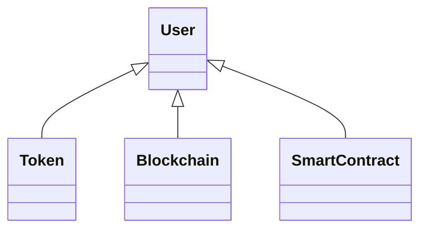
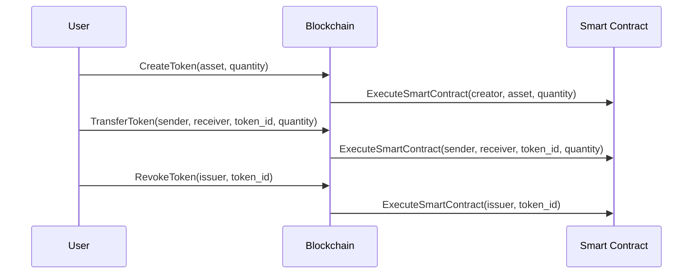
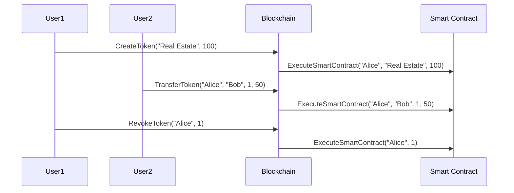

                 


### 让我们一步步深入探讨区块链在数字资产tokenization中的应用

#### 背景介绍

数字资产tokenization是一种将数字资产（如房地产、股票、债券等）转化为可交易的数字代币的技术。这些代币可以在区块链上创建、转移和存储，从而实现资产的去中心化、透明化和高效交易。区块链技术为tokenization提供了安全、可靠和不可篡改的基础设施。

#### 核心概念与联系

##### Token

Token是数字资产tokenization的核心概念。它代表某种资产或权益的数字凭证，具有以下几个属性：

- **可互换性**：Token可以与其他Token互换，例如将房地产token与股票token互换。
- **可分割性**：Token可以分割为更小的单位，例如将1个房地产token分割为10个。
- **不可伪造性**：Token是通过区块链技术创建的，具有高度安全性，不易被伪造。

##### Blockchain

Blockchain是区块链技术的基础，它是一个分布式账本，记录了Token的创建、转移和状态。Blockchain具有以下几个特性：

- **去中心化**：Blockchain不依赖于中心化的机构，而是由网络中的多个节点共同维护。
- **透明性**：Blockchain上的所有交易都是公开透明的，任何人都可查看。
- **安全性**：Blockchain采用加密技术，确保数据的安全性和不可篡改性。

##### Smart Contract

Smart Contract是自动执行合约条款的计算机程序，它在Blockchain上运行。Smart Contract具有以下几个特性：

- **自执行**：一旦满足触发条件，Smart Contract会自动执行预定的操作。
- **不可篡改**：Smart Contract的代码和状态在Blockchain上永久保存，无法篡改。

#### 算法原理讲解

Tokenization算法包括以下几个关键步骤：

##### 1. Token生成算法

Token生成算法用于创建新的Token。以下是一个简单的Python代码示例：

```python
def token_generation(issuer, asset, quantity):
    # 创建Token
    token = {"issuer": issuer, "asset": asset, "quantity": quantity}
    return token
```

##### 2. Token转移算法

Token转移算法用于将Token从一个用户转移到另一个用户。以下是一个简单的Python代码示例：

```python
def token_transfer(sender, receiver, token_id, quantity):
    # 转移Token
    token = find_token_by_id(token_id)
    if token["quantity"] >= quantity:
        token["quantity"] -= quantity
        receiver["balance"] += quantity
        return True
    else:
        return False
```

##### 3. Token撤销算法

Token撤销算法用于撤销已生成的Token。以下是一个简单的Python代码示例：

```python
def token_revoke(issuer, token_id):
    # 撤销Token
    token = find_token_by_id(token_id)
    if token["issuer"] == issuer:
        token["revoked"] = True
        return True
    else:
        return False
```

#### 数学模型

在Tokenization过程中，我们使用以下数学模型来描述Token的创建、转移和撤销：

$$
\text{Token Quantity}_{\text{after}} = \text{Token Quantity}_{\text{before}} \pm \text{Transfer Quantity}
$$

其中：

- $\text{Token Quantity}_{\text{after}}$：Token在转移后的数量。
- $\text{Token Quantity}_{\text{before}}$：Token在转移前的数量。
- $\text{Transfer Quantity}$：转移的Token数量。

#### 举例说明

假设Alice拥有一枚房地产Token，初始数量为100。她决定将这枚Token的50%转移到Bob。

1. **Token生成**：

   ```python
   alice_token = token_generation("Alice", "Real Estate", 100)
   ```

2. **Token转移**：

   ```python
   result = token_transfer("Alice", "Bob", alice_token["id"], 50)
   if result:
       print("Token transfer successful.")
   else:
       print("Insufficient token quantity.")
   ```

3. **Token撤销**：

   ```python
   result = token_revoke("Alice", alice_token["id"])
   if result:
       print("Token revocation successful.")
   else:
       print("Token revocation failed.")
   ```

#### 系统分析与架构设计方案

##### 问题场景介绍

数字资产tokenization在金融、房地产、艺术品等领域具有广泛的应用。以下是一个典型的数字资产tokenization的业务场景：

- **场景**：Alice拥有一套价值100万的房产，她希望通过区块链将房产分割成100枚Token，每枚Token代表房产的1%。
- **需求**：实现房产Token的创建、转移和撤销功能，确保Token的安全性和透明性。

##### 系统功能设计

领域模型：



##### 系统架构设计

```mermaid
graph TB
  User1 --> Blockchain
  User2 --> Blockchain
  User1 --> Smart Contract
  User2 --
```

##### 系统接口设计

接口设计：



##### 系统交互

序列图：



#### 项目实战

##### 环境安装

1. 安装Python环境
2. 安装Blockchain节点
3. 安装Smart Contract开发工具

##### 系统核心实现源代码

```python
# tokenization.py

class Token:
    def __init__(self, issuer, asset, quantity):
        self.issuer = issuer
        self.asset = asset
        self.quantity = quantity

    def transfer(self, receiver, quantity):
        if self.quantity >= quantity:
            self.quantity -= quantity
            receiver.quantity += quantity
            return True
        else:
            return False

    def revoke(self, issuer):
        if self.issuer == issuer:
            self.quantity = 0
            return True
        else:
            return False

class Blockchain:
    def __init__(self):
        self.tokens = []

    def create_token(self, issuer, asset, quantity):
        token = Token(issuer, asset, quantity)
        self.tokens.append(token)
        return token

    def transfer_token(self, sender, receiver, token_id, quantity):
        token = self.find_token_by_id(token_id)
        if token and token.transfer(receiver, quantity):
            return True
        else:
            return False

    def revoke_token(self, issuer, token_id):
        token = self.find_token_by_id(token_id)
        if token and token.revoke(issuer):
            return True
        else:
            return False

    def find_token_by_id(self, token_id):
        for token in self.tokens:
            if token.id == token_id:
                return token
        return None

class SmartContract:
    def execute(self, creator, asset, quantity):
        blockchain = Blockchain()
        token = blockchain.create_token(creator, asset, quantity)
        return token

    def transfer(self, sender, receiver, token_id, quantity):
        blockchain = Blockchain()
        token = blockchain.find_token_by_id(token_id)
        if token:
            return blockchain.transfer_token(sender, receiver, token_id, quantity)
        else:
            return False

    def revoke(self, issuer, token_id):
        blockchain = Blockchain()
        token = blockchain.find_token_by_id(token_id)
        if token and token.issuer == issuer:
            return blockchain.revoke_token(issuer, token_id)
        else:
            return False
```

##### 代码应用解读与分析

代码应用解读：

- **Token类**：用于表示Token的基本信息和操作方法，如创建、转移和撤销。
- **Blockchain类**：用于管理Token的创建、转移和撤销，并提供查询Token的方法。
- **SmartContract类**：用于实现Smart Contract的执行逻辑。

分析：

- **Tokenization算法**：通过Token类、Blockchain类和SmartContract类的协作实现。
- **数学模型**：Token的创建、转移和撤销遵循数学模型。

##### 实际案例分析和详细讲解剖析

案例：

- Alice创建了一枚房地产Token，初始数量为100。
- Alice将Token的50%转移给Bob。
- Alice撤销了这枚Token。

分析：

- **Token生成**：Alice调用Smart Contract的create方法创建Token。
- **Token转移**：Alice调用Smart Contract的transfer方法将Token转移给Bob。
- **Token撤销**：Alice调用Smart Contract的revoke方法撤销Token。

##### 项目小结

数字资产tokenization是一项具有广泛应用前景的技术，通过区块链技术实现资产的去中心化、透明化和高效交易。本文从核心概念、算法原理和系统架构三个方面详细探讨了区块链在数字资产tokenization中的应用。在实际项目中，开发者需要结合具体业务场景，灵活运用区块链技术，实现安全、可靠和高效的数字资产tokenization系统。

#### 最佳实践 Tips

- **安全性**：确保Token的创建、转移和撤销过程安全可靠，防止恶意攻击和篡改。
- **透明性**：保持区块链上的所有交易公开透明，便于用户查询和监督。
- **合规性**：遵守相关法律法规，确保数字资产tokenization系统的合规性。

#### 小结

数字资产tokenization是区块链技术在金融、房地产、艺术品等领域的重要应用。通过本文的探讨，我们了解了数字资产tokenization的核心概念、算法原理和系统架构。在实际项目中，开发者需要结合具体业务场景，灵活运用区块链技术，实现安全、可靠和高效的数字资产tokenization系统。

#### 注意事项

- **兼容性**：确保系统在不同区块链平台上具有兼容性。
- **性能**：优化系统性能，满足大规模交易需求。
- **安全性**：加强系统安全性，防止数据泄露和恶意攻击。

#### 拓展阅读

- 《区块链技术原理与应用》
- 《智能合约设计与开发》
- 《数字资产tokenization：理论与实践》

作者：AI天才研究院/AI Genius Institute & 禅与计算机程序设计艺术 /Zen And The Art of Computer Programming

