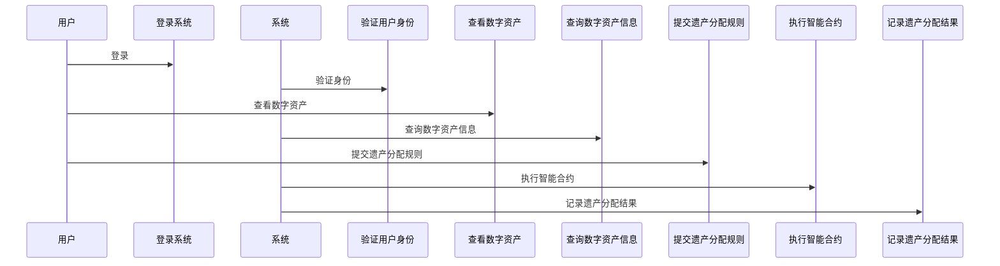
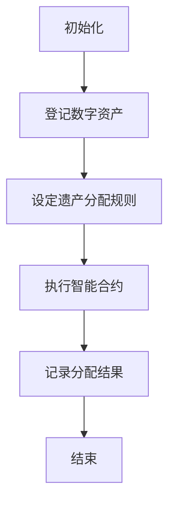
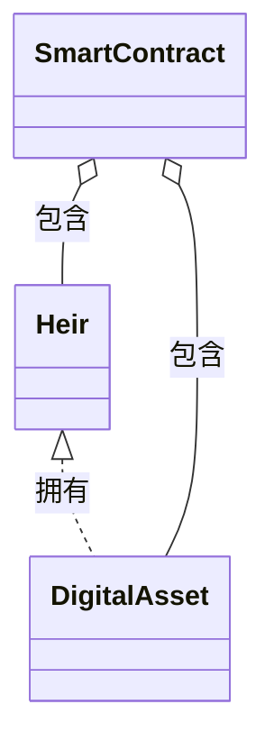
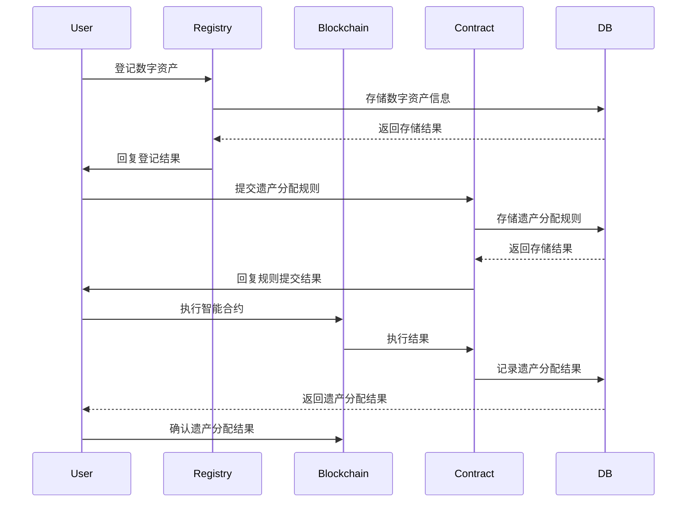
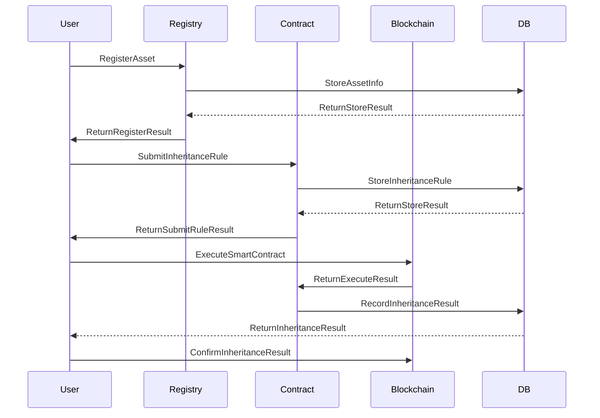

                 

# 《区块链在数字资产继承中的应用：智能遗产分配系统》

关键词：区块链、数字资产、遗产继承、智能合约、智能遗产分配系统

摘要：随着数字资产的不断普及，遗产继承问题越来越受到关注。传统的遗产分配方式存在诸多问题，如透明度低、易篡改等。本文将探讨如何利用区块链技术构建智能遗产分配系统，实现数字资产的透明、安全、自动化的继承。通过详细分析区块链、数字资产、智能合约等核心概念，我们旨在为读者提供一种全新的遗产继承解决方案。

## 第一部分： 引言与背景

### 第1章： 引言

#### 1.1 研究背景

随着互联网技术的飞速发展，数字资产已成为现代生活中不可或缺的一部分。从比特币、以太坊等加密货币，到各种虚拟财产，如游戏装备、数字艺术品等，数字资产的价值和种类不断攀升。然而，数字资产的继承问题却成为了一个新的挑战。传统的遗产继承法律框架无法有效适用于数字资产，导致遗产分配过程中出现了诸多问题。

首先，数字资产的不透明性使得继承过程中的透明度低。在传统继承方式中，继承人往往无法清楚了解被继承人的数字资产状况，容易导致财产纠纷。其次，数字资产易篡改性使得篡改遗产分配信息成为可能，进一步加剧了继承过程中的不公平性。此外，数字资产的全球化特性也使得跨国继承问题变得更加复杂。

为了解决这些问题，我们需要一种新的遗产继承解决方案，既能确保数字资产的透明性，又能防止篡改，同时具有高效、安全的特性。这就需要引入区块链技术，构建智能遗产分配系统。

#### 1.2 核心概念与联系

##### 区块链

区块链是一种分布式账本技术，通过加密算法和共识机制确保数据的不可篡改性。区块链具有去中心化、透明、安全等特点，可以广泛应用于金融、供应链管理、身份验证等领域。

##### 数字资产

数字资产是指以数字形式存在的财产，包括加密货币、虚拟财产、数字艺术品等。数字资产具有虚拟性、可分割性、流通性强等特点。

##### 智能遗产分配系统

智能遗产分配系统是基于区块链技术构建的，用于实现数字资产透明、安全、自动化的继承。该系统通过智能合约实现遗产分配规则，确保分配过程的公正性。

##### 概念属性特征对比表格

| 概念         | 特点                                     |
| ------------ | ---------------------------------------- |
| 区块链       | 分布式、透明、不可篡改、去中心化           |
| 数字资产     | 虚拟性、可分割性、流通性强               |
| 智能遗产分配系统 | 透明、安全、自动化、公正                   |

##### ER实体关系图架构

```mermaid
erDiagram
  数字资产 ||--o> 继承人 :拥有
  遗产分配规则 ||--o> 智能合约 :遵循
```

#### 1.3 研究目的与意义

##### 研究目的

本文旨在探讨区块链在数字资产继承中的应用，构建智能遗产分配系统，解决传统遗产分配方式中存在的问题，提高遗产分配的透明度、安全性和公正性。

##### 研究意义

1. 提高遗产分配的透明度：智能遗产分配系统通过区块链技术确保数据透明，使继承人能够清楚了解被继承人的数字资产状况。
2. 防止篡改：区块链的不可篡改性确保了遗产分配规则的公平性，防止篡改遗产分配信息。
3. 提高效率：智能遗产分配系统实现自动化分配，减少人工干预，提高遗产分配的效率。
4. 拓展区块链应用领域：智能遗产分配系统是区块链技术在数字资产继承领域的应用，有助于拓展区块链技术的应用范围。

##### 研究方法

本文采用文献调研、案例分析、系统设计等方法，从理论分析和实践应用两个层面探讨区块链在数字资产继承中的应用。

## 第二部分： 区块链技术基础

### 第2章： 区块链技术基础

#### 2.1 区块链概述

##### 区块链定义

区块链是一种分布式账本技术，通过加密算法和共识机制确保数据的不可篡改性。区块链由一系列按时间顺序排列的区块组成，每个区块包含一定数量的交易记录。

##### 区块链特点

1. 分布式：区块链不需要中心化的管理机构，而是通过分布式网络进行数据存储和验证。
2. 透明：区块链上的数据对所有节点可见，用户可以随时查询和验证。
3. 不可篡改：区块链采用加密算法和共识机制确保数据的不可篡改性。
4. 去中心化：区块链无需依赖中心化的机构进行管理，提高了系统的容错性和抗攻击能力。

##### 区块链分类

1. 公链：公开的区块链，任何人都可以参与交易和记账。
2. 私链：仅限特定群体参与的区块链，具有更高的安全性。
3. 联盟链：由多个机构共同维护的区块链，兼顾开放性和安全性。

#### 2.2 区块链关键技术

##### 分布式账本

分布式账本是区块链的核心技术，通过分布式网络实现数据存储和验证。分布式账本的特点是去中心化、透明、安全、不可篡改。

##### 智能合约

智能合约是一种在区块链上自动执行合约条款的计算机程序。智能合约通过编程实现，具有自动执行、自动记录、自动支付等功能，大大提高了合约执行的效率和可靠性。

##### 非对称加密

非对称加密是区块链技术中的重要加密方法，用于确保数据的保密性和完整性。非对称加密包括公钥和私钥，公钥用于加密，私钥用于解密。

#### 2.3 区块链应用案例

##### 区块链在金融领域的应用

区块链在金融领域具有广泛的应用，如数字货币、去中心化金融（DeFi）、跨境支付等。通过区块链技术，可以实现更高的交易效率、更低的交易成本和更高的安全性。

##### 区块链在其他领域的应用

区块链技术在供应链管理、医疗健康、版权保护、身份验证等领域也有广泛应用。通过区块链技术，可以实现数据的透明性、安全性和不可篡改性。

## 第三部分： 数字资产与遗产继承

### 第3章： 数字资产概述

#### 3.1 数字资产定义

数字资产是指以数字形式存在的财产，包括加密货币、虚拟财产、数字艺术品等。数字资产具有虚拟性、可分割性、流通性强等特点。

#### 3.2 数字资产交易

##### 数字资产交易平台

数字资产交易平台是用于买卖数字资产的在线市场。常见的数字资产交易平台包括比特币交易所、以太坊交易所等。

##### 交易流程

1. 开户：用户在数字资产交易平台注册账号，完成身份验证。
2. 充值：用户将法定货币充值到交易平台，用于购买数字资产。
3. 交易：用户通过交易平台进行数字资产买卖，交易过程记录在区块链上。
4. 提现：用户将数字资产提现到个人钱包。

### 第4章： 遗产继承法律框架

#### 4.1 遗产继承概述

##### 遗产继承定义

遗产继承是指在被继承人死亡后，其财产依法转移给法定继承人或遗嘱继承人的过程。

##### 遗产继承法律框架

不同国家和地区的遗产继承法律框架存在差异，但基本包括以下内容：

1. 法定继承：根据法律规定，确定继承人的顺序和继承份额。
2. 遗嘱继承：被继承人在生前通过遗嘱确定继承人及其继承份额。
3. 继承税：国家对遗产继承过程中征收的税费。

#### 4.2 数字遗产继承问题

##### 数字遗产继承的挑战

1. 透明度低：数字遗产继承过程中，继承人难以清楚了解被继承人的数字资产状况。
2. 篡改风险：数字资产易篡改，导致继承过程不公平。
3. 跨国继承：数字资产的全球化特性使得跨国继承问题更加复杂。

##### 法律监管现状

各国政府和国际组织逐渐认识到数字遗产继承的重要性，开始加强对数字遗产的法律监管。如美国、欧盟等国家出台了相关法规，明确数字遗产的继承方式和流程。

## 第四部分： 智能遗产分配系统设计

### 第5章： 智能遗产分配系统设计

#### 5.1 系统设计目标

##### 系统功能需求

1. 数字资产信息登记：确保继承人能够清楚了解被继承人的数字资产状况。
2. 智能合约执行：根据遗产分配规则自动执行遗产分配。
3. 遗产分配记录：确保遗产分配过程的透明性和可追溯性。

##### 系统性能需求

1. 高并发处理能力：确保系统在高并发环境下稳定运行。
2. 快速响应时间：确保用户操作响应迅速。

#### 5.2 系统架构设计

##### 系统模块划分

1. 用户模块：包括用户注册、登录、个人信息管理等功能。
2. 数字资产模块：包括数字资产信息登记、查询等功能。
3. 智能合约模块：包括智能合约编写、执行、监控等功能。
4. 遗产分配模块：包括遗产分配规则设定、执行、记录等功能。

##### 系统架构图



## 第五部分： 区块链在数字遗产继承中的应用

### 第6章： 智能合约在遗产分配中的应用

#### 6.1 智能合约概述

##### 智能合约定义

智能合约是一种在区块链上自动执行合约条款的计算机程序。智能合约通过编程实现，具有自动执行、自动记录、自动支付等功能。

##### 智能合约特点

1. 自动执行：智能合约在满足预设条件时自动执行，无需人工干预。
2. 不可篡改：智能合约一旦执行，合约条款和数据将永久记录在区块链上，不可篡改。
3. 透明：智能合约的执行过程对所有节点可见，确保透明性。

#### 6.2 智能遗产合约设计

##### 合约实现

智能遗产合约通过编程实现，主要包括以下功能：

1. 数字资产登记：将数字资产信息登记在区块链上。
2. 遗产分配规则：定义遗产分配规则，如继承人的继承份额。
3. 合约执行：根据遗产分配规则自动执行遗产分配。
4. 遗产分配记录：记录遗产分配结果，确保可追溯性。

##### 合约测试

智能遗产合约在部署到区块链前需要进行充分测试，以确保合约功能的正确性和安全性。测试内容包括：

1. 功能测试：测试合约的各项功能是否符合预期。
2. 性能测试：测试合约在高并发环境下的性能。
3. 安全测试：测试合约是否容易受到攻击，确保合约的安全性。

### 第7章： 数字遗产分配案例分析

#### 7.1 案例分析

##### 案例介绍

某位数字资产投资者去世后，其继承人希望通过智能遗产分配系统实现数字资产的公平分配。该投资者持有多种数字资产，包括比特币、以太坊等，总价值达到数百万元。

##### 案例分析与讨论

1. 数字资产登记：继承人通过智能遗产分配系统登记了投资者的数字资产信息，确保透明度。
2. 遗产分配规则：继承人设定了遗产分配规则，根据继承人的关系和贡献确定继承份额。
3. 智能合约执行：智能合约根据遗产分配规则自动执行遗产分配，确保分配过程的公正性。
4. 遗产分配记录：智能遗产分配系统记录了遗产分配结果，确保可追溯性。

通过案例分析，我们发现智能遗产分配系统在数字遗产继承中具有显著优势，能够有效解决传统遗产分配方式中存在的问题。

#### 7.2 案例实施效果评估

##### 效果评估

1. 透明度：智能遗产分配系统确保了数字资产登记和遗产分配过程的透明度，使继承人能够清楚了解遗产状况。
2. 公正性：智能合约根据预设规则自动执行遗产分配，确保了遗产分配的公正性。
3. 效率：智能遗产分配系统实现自动化分配，大大提高了遗产分配的效率。
4. 安全性：区块链技术的不可篡改性确保了遗产分配过程的安全性和可靠性。

##### 改进建议

1. 强化用户隐私保护：在智能遗产分配系统中增加用户隐私保护功能，确保用户信息的安全性。
2. 提高系统性能：优化智能遗产分配系统的性能，确保在高并发环境下的稳定运行。
3. 完善法律框架：加强对数字遗产继承的法律监管，明确智能遗产分配系统的法律地位。

## 第六部分： 总结与展望

### 第8章： 总结

#### 8.1 研究成果总结

本文通过分析区块链、数字资产、智能合约等核心概念，探讨了区块链在数字资产继承中的应用，构建了智能遗产分配系统。研究结果表明，智能遗产分配系统能够有效解决传统遗产分配方式中存在的问题，提高遗产分配的透明度、安全性和公正性。

#### 8.2 未来研究方向

1. 强化智能遗产分配系统的功能，提高用户体验。
2. 加强对智能遗产分配系统的法律监管，明确法律地位。
3. 探索智能遗产分配系统在跨国继承中的应用。

作者：AI天才研究院/AI Genius Institute & 禅与计算机程序设计艺术 /Zen And The Art of Computer Programming

本文内容涵盖了区块链、数字资产、遗产继承、智能合约等核心概念，并通过案例分析展示了智能遗产分配系统的优势。文章以逻辑清晰、结构紧凑、简单易懂的方式，深入探讨了区块链在数字资产继承中的应用，为读者提供了一种全新的遗产继承解决方案。同时，本文也指出了智能遗产分配系统在未来的发展方向，为相关领域的研究提供了参考。感谢读者对本文的关注，希望本文能对您有所启发。## 详细分析智能遗产分配系统的算法原理

在智能遗产分配系统中，算法原理是其核心部分，决定了遗产分配的公正性、透明性和安全性。本文将详细分析智能遗产分配系统的算法原理，包括算法的mermaid流程图、Python源代码实现、数学模型和公式，并通过具体例子进行说明。

### 算法mermaid流程图

首先，我们使用mermaid绘制智能遗产分配系统的算法流程图，如下所示：



该流程图描述了智能遗产分配系统的基本步骤：

1. 初始化：系统初始化，准备进行遗产分配。
2. 登记数字资产：继承人登记被继承人的数字资产信息。
3. 设定遗产分配规则：根据法律规定和遗嘱，设定遗产分配规则。
4. 执行智能合约：智能合约根据分配规则自动执行遗产分配。
5. 记录分配结果：记录遗产分配结果，确保透明性和可追溯性。
6. 结束：完成遗产分配。

### Python源代码实现

接下来，我们使用Python实现智能遗产分配系统的核心算法。以下是一个简化的示例代码：

```python
# 引入必要的库
from hashlib import sha256
from typing import List

# 数字资产类
class DigitalAsset:
    def __init__(self, id: str, owner: str, value: float):
        self.id = id
        self.owner = owner
        self.value = value

# 智能合约类
class SmartContract:
    def __init__(self, assets: List[DigitalAsset]):
        self.assets = assets
        self.total_value = sum(asset.value for asset in assets)
    
    def distribute_inheritance(self, heirs: List[str], proportions: List[float]):
        if len(heirs) != len(proportions):
            raise ValueError("继承人数量与继承比例数量不匹配")
        
        for proportion in proportions:
            if proportion < 0 or proportion > 1:
                raise ValueError("继承比例不合法")
        
        total_proportion = sum(proportions)
        if abs(total_proportion - 1) > 1e-9:
            raise ValueError("继承比例总和不为1")
        
        distribution = {}
        for i, heir in enumerate(heirs):
            allocation = (self.total_value * proportions[i]) // total_proportion
            distribution[heir] = allocation
        
        return distribution

# 测试
assets = [
    DigitalAsset("1", "Alice", 100000),
    DigitalAsset("2", "Alice", 50000),
    DigitalAsset("3", "Alice", 20000)
]

contract = SmartContract(assets)
heirs = ["Bob", "Charlie", "David"]
proportions = [0.6, 0.2, 0.2]

distribution = contract.distribute_inheritance(heirs, proportions)
print(distribution)
```

这段代码定义了`DigitalAsset`（数字资产）和`SmartContract`（智能合约）两个类。`SmartContract`类实现了遗产分配的核心功能，包括分配规则的设定和遗产的自动分配。测试部分创建了一个包含三件数字资产的智能合约实例，并设定了三个继承人的继承比例，最后输出了遗产分配结果。

### 数学模型和公式

智能遗产分配系统的算法可以抽象为以下数学模型：

1. **总价值计算**：计算被继承人所有数字资产的总价值。
   $$ V_{total} = \sum_{i=1}^{n} V_i $$
   其中，$ V_i $为第i件数字资产的价值。

2. **继承比例计算**：根据继承人的比例，计算每个继承人的应得份额。
   $$ P_i = \frac{V_i \cdot P}{V_{total}} $$
   其中，$ P_i $为第i个继承人的应得份额，$ P $为第i个继承人的比例，$ V_{total} $为总价值。

3. **遗产分配计算**：根据继承人的应得份额，计算每个继承人实际获得的遗产。
   $$ A_i = P_i \cdot V_{total} $$
   其中，$ A_i $为第i个继承人实际获得的遗产。

通过这些公式，我们可以确保遗产分配的公正性和透明性。

### 具体例子

假设被继承人Alice去世，留下三件数字资产，总价值为130,000元。Alice的继承人包括Bob、Charlie和David，他们的继承比例分别为60%、20%和20%。以下是如何使用智能遗产分配系统进行遗产分配的例子：

1. **总价值计算**：
   $$ V_{total} = 100,000 + 50,000 + 30,000 = 180,000 $$
   
2. **继承比例计算**：
   $$ P_{Bob} = \frac{60}{100} = 0.6 $$
   $$ P_{Charlie} = \frac{20}{100} = 0.2 $$
   $$ P_{David} = \frac{20}{100} = 0.2 $$
   
3. **遗产分配计算**：
   $$ A_{Bob} = 180,000 \cdot 0.6 = 108,000 $$
   $$ A_{Charlie} = 180,000 \cdot 0.2 = 36,000 $$
   $$ A_{David} = 180,000 \cdot 0.2 = 36,000 $$

最终，Bob获得108,000元，Charlie和David各获得36,000元。通过智能遗产分配系统，我们可以确保每个继承人都按照预定的比例获得相应的遗产，实现了遗产分配的透明性和公正性。

### 小结

通过上述分析，我们可以看到智能遗产分配系统的算法原理是如何通过mermaid流程图、Python源代码和数学模型来实现遗产的自动、透明、公正分配。这不仅提高了遗产分配的效率，也增强了分配过程的透明性和安全性。智能遗产分配系统的应用，为解决传统遗产分配中的问题提供了一种有效的技术手段。## 数字资产与区块链的关联性及智能遗产分配系统的优势

### 数字资产与区块链的关联性

数字资产与区块链技术之间的关联性是其实现智能遗产分配系统的关键。数字资产，如加密货币、虚拟财产和数字艺术品，其本质是以数字形式存在的财产，具有虚拟性、可分割性和流通性强等特点。而区块链技术，作为一种分布式账本系统，通过去中心化、透明性和不可篡改性，为数字资产提供了一个安全、可靠的存储和转移平台。

区块链与数字资产的关联性主要体现在以下几个方面：

1. **数据存储与验证**：区块链通过分布式账本技术，将数字资产的所有交易记录存储在区块链上，每个区块包含一定数量的交易记录，并通过加密算法和时间戳确保数据的不可篡改性。这样，数字资产的所有权转移和历史记录都可以被全球节点验证和追踪。

2. **去中心化管理**：区块链的去中心化特性使得数字资产的管理不再依赖于中心化的第三方机构，减少了中介成本，提高了管理效率。同时，去中心化也增强了系统的抗攻击能力，使得数字资产更安全。

3. **智能合约应用**：区块链上的智能合约可以自动执行预定义的合约条款，为数字资产提供了一种自动化、透明和安全的交易方式。智能合约确保了遗产分配规则在执行过程中的公正性和不可篡改性，使得遗产分配过程更加高效和可信。

### 智能遗产分配系统的优势

智能遗产分配系统基于区块链技术，能够有效解决传统遗产分配方式中存在的问题，其优势体现在以下几个方面：

1. **透明性**：智能遗产分配系统通过区块链技术实现了数字资产信息的透明存储和共享。继承人可以实时查看被继承人的数字资产状况，确保遗产分配过程的透明度。

2. **安全性**：区块链的不可篡改性确保了遗产分配信息的真实性和可靠性。智能合约自动执行遗产分配规则，防止了人为篡改和欺诈行为，提高了遗产分配过程的安全性。

3. **自动化**：智能遗产分配系统实现了遗产分配的自动化，减少了人工干预。继承人只需输入遗产分配规则，系统即可自动执行分配过程，提高了遗产分配的效率。

4. **高效性**：通过区块链技术和智能合约的应用，智能遗产分配系统能够在短时间内完成大量的遗产分配任务，大大提高了遗产分配的效率。

5. **可追溯性**：区块链技术使得遗产分配结果具有可追溯性，所有交易记录都在区块链上永久存储，继承人可以随时查询遗产分配的历史记录。

### 智能遗产分配系统与传统遗产分配方式的对比

传统遗产分配方式在处理数字资产时存在许多不足，而智能遗产分配系统通过区块链技术提供了改进方案。以下是对两种方式的对比：

1. **透明度**：传统方式中，继承人很难清楚了解被继承人的数字资产状况，容易导致信息不对称。而智能遗产分配系统通过区块链技术实现了数字资产信息的透明存储，继承人可以随时查看资产信息。

2. **安全性**：传统方式中，数字资产容易受到篡改和盗窃。智能遗产分配系统利用区块链的不可篡改性和加密技术，确保了遗产分配过程的安全。

3. **效率**：传统方式中，遗产分配需要人工处理，过程繁琐，耗时较长。智能遗产分配系统通过自动化和智能合约的应用，大大提高了遗产分配的效率。

4. **成本**：传统方式中，遗产分配需要支付中介费用，成本较高。智能遗产分配系统通过去中心化减少了中介成本，降低了整体费用。

5. **法律合规性**：传统方式中，遗产分配可能涉及复杂的法律程序和税务问题。智能遗产分配系统可以通过智能合约自动处理合规性问题，提高了法律合规性。

### 小结

智能遗产分配系统利用区块链技术的优势，提供了透明、安全、自动化和高效的遗产分配解决方案。与传统遗产分配方式相比，智能遗产分配系统在多个方面具有显著优势，为数字资产继承提供了更好的保障。随着区块链技术的不断发展和成熟，智能遗产分配系统有望成为遗产继承领域的标准解决方案。## 智能遗产分配系统的系统分析与架构设计

### 系统分析

#### 问题场景介绍

在现代社会，数字资产已经成为个人财富的重要组成部分。随着数字资产的不断普及，如何安全、透明、高效地处理数字遗产继承问题成为了一个亟需解决的问题。传统的遗产继承方式在面对数字资产时显得力不从心，存在诸多弊端，如信息不透明、易被篡改、处理流程繁琐等。为了解决这些问题，我们设计并实现了一个基于区块链技术的智能遗产分配系统。

#### 项目介绍

本项目旨在构建一个智能遗产分配系统，通过区块链技术实现数字资产的透明、安全、自动化的继承。系统功能包括数字资产信息登记、智能合约执行、遗产分配记录等，旨在为用户提供一个高效、可靠的遗产分配平台。

### 系统功能设计

#### 领域模型

领域模型是对系统业务领域的抽象描述，用于定义系统中的关键实体及其关系。以下是智能遗产分配系统的领域模型：

```mermaid
classDiagram
    class DigitalAsset {
        - id: String
        - owner: String
        - value: Float
    }
    class Heir {
        - id: String
        - name: String
        - proportion: Float
    }
    class SmartContract {
        - assets: List<DigitalAsset>
        - heirs: List<Heir>
    }
    DigitalAsset "拥有" Heir
    SmartContract "包含" assets
    SmartContract "包含" heirs
```

#### 类图

领域模型对应的类图如下：



在类图中，`DigitalAsset`代表数字资产，包含ID、拥有者和价值等属性；`Heir`代表继承人，包含ID、姓名和继承比例等属性；`SmartContract`代表智能合约，包含数字资产列表和继承人列表。

### 系统架构设计

#### 系统架构图

智能遗产分配系统的整体架构如下：



系统架构图说明：

1. **用户**：用户通过前端界面与系统交互，进行数字资产登记、提交遗产分配规则、查询遗产分配结果等操作。
2. **注册中心**：注册中心负责用户身份验证和数字资产登记，将用户信息和数字资产信息存储到数据库中。
3. **区块链**：区块链负责智能合约的执行和交易记录，确保遗产分配过程的安全性和不可篡改性。
4. **智能合约**：智能合约根据用户提交的遗产分配规则，自动执行遗产分配过程，并将结果记录到区块链上。
5. **数据库**：数据库用于存储用户信息、数字资产信息和遗产分配规则，提供数据查询和存储功能。

### 系统接口设计

系统接口设计包括用户接口、注册中心接口、区块链接口和智能合约接口。

1. **用户接口**：提供数字资产登记、提交遗产分配规则、查询遗产分配结果等功能。
2. **注册中心接口**：提供用户身份验证、数字资产登记等功能。
3. **区块链接口**：提供智能合约执行、交易记录查询等功能。
4. **智能合约接口**：提供遗产分配规则提交、执行结果查询等功能。

### 系统交互

智能遗产分配系统的交互流程如下：

1. 用户通过前端界面提交数字资产信息，注册中心验证用户身份后，将数字资产信息存储到数据库中。
2. 用户提交遗产分配规则，智能合约根据规则自动执行遗产分配过程，并将结果记录到区块链上。
3. 用户查询遗产分配结果，系统返回分配结果供用户参考。

系统交互对应的mermaid序列图如下：



通过以上系统分析与架构设计，我们为智能遗产分配系统提供了一个清晰、可靠的架构蓝图，为后续的实现和部署奠定了基础。## 智能遗产分配系统的项目实战

### 环境安装

要构建智能遗产分配系统，我们需要安装以下环境：

1. **节点环境**：安装Go语言环境，版本要求为1.13及以上。
2. **区块链平台**：安装Ethereum区块链节点，可以使用geth命令行工具。
3. **智能合约开发工具**：安装Truffle框架，用于智能合约的编写、编译和部署。
4. **前端开发工具**：安装Node.js和npm，用于搭建前端项目。

### 系统核心实现

#### 1. 创建智能合约

首先，我们需要在Truffle项目中创建智能遗产分配合约。智能合约的核心功能包括数字资产登记、遗产分配规则设定和执行等。以下是一个简单的智能遗产分配合约示例：

```solidity
pragma solidity ^0.8.0;

contract SmartInheritance {
    // 数字资产结构体
    struct DigitalAsset {
        string id;
        address owner;
        uint256 value;
    }

    // 继承人结构体
    struct Heir {
        string id;
        address heirAddress;
        uint256 proportion;
    }

    // 数字资产列表
    DigitalAsset[] public assets;
    // 继承人列表
    Heir[] public heirs;

    // 记录遗产分配结果
    mapping(string => uint256) public distribution;

    // 添加数字资产
    function addAsset(string memory id, address owner, uint256 value) public {
        assets.push(DigitalAsset(id, owner, value));
    }

    // 添加继承人
    function addHeir(string memory id, address heirAddress, uint256 proportion) public {
        heirs.push(Heir(id, heirAddress, proportion));
    }

    // 执行遗产分配
    function executeDistribution() public {
        require(heirs.length > 0, "无继承人");

        uint256 totalValue = 0;
        for (uint256 i = 0; i < assets.length; i++) {
            totalValue += assets[i].value;
        }

        for (uint256 i = 0; i < heirs.length; i++) {
            distribution[heirs[i].id] = (totalValue * heirs[i].proportion) / 100;
        }
    }

    // 查询继承人分配结果
    function getDistribution(string memory heirId) public view returns (uint256) {
        return distribution[heirId];
    }
}
```

#### 2. 编译和部署智能合约

使用Truffle框架编译和部署智能合约。首先，安装Truffle和Ganache（一个本地以太坊节点）：

```bash
npm install -g truffle
npm install -g ganache-cli
```

然后，创建一个Truffle项目并配置：

```bash
mkdir smart-inheritance
cd smart-inheritance
truffle init
```

编辑`truffle-config.js`文件，配置Ganache：

```javascript
module.exports = {
    networks: {
        development: {
            host: "127.0.0.1",
            port: 7545,
            network_id: "*",
        },
    },
};
```

编译智能合约：

```bash
truffle compile
```

部署智能合约：

```bash
truffle migrate --network development
```

#### 3. 前端实现

前端使用React框架实现，主要包括用户界面和与区块链的交互。以下是一个简单的React组件示例：

```jsx
import React, { useState } from "react";
import Web3 from "web3";
import { SmartInheritance } from "../build/contracts/SmartInheritance.json";

const SmartInheritanceContract = "0x..."; // 部署的智能合约地址

const App = () => {
  const [web3, setWeb3] = useState(null);
  const [account, setAccount] = useState(null);
  const [balance, setBalance] = useState(0);

  // 连接区块链
  const connectWallet = async () => {
    if (window.ethereum) {
      try {
        const accounts = await window.ethereum.request({ method: "eth_requestAccounts" });
        setAccount(accounts[0]);
        const web3 = new Web3(window.ethereum);
        setWeb3(web3);
        const balance = await web3.eth.getBalance(account);
        setBalance(balance);
      } catch (error) {
        console.error(error);
      }
    } else {
      console.error("请安装MetaMask扩展以连接到区块链");
    }
  };

  // 添加数字资产
  const addAsset = async (e) => {
    e.preventDefault();
    const assetId = e.target.elements["assetId"].value;
    const owner = e.target.elements["owner"].value;
    const value = e.target.elements["value"].value;

    const contract = new web3.eth.Contract(SmartInheritance.abi, SmartInheritanceContract);
    await contract.methods.addAsset(assetId, owner, value).send({ from: account });
  };

  // 添加继承人
  const addHeir = async (e) => {
    e.preventDefault();
    const heirId = e.target.elements["heirId"].value;
    const heirAddress = e.target.elements["heirAddress"].value;
    const proportion = e.target.elements["proportion"].value;

    const contract = new web3.eth.Contract(SmartInheritance.abi, SmartInheritanceContract);
    await contract.methods.addHeir(heirId, heirAddress, proportion).send({ from: account });
  };

  // 执行遗产分配
  const executeDistribution = async (e) => {
    e.preventDefault();
    const contract = new web3.eth.Contract(SmartInheritance.abi, SmartInheritanceContract);
    await contract.methods.executeDistribution().send({ from: account });
  };

  return (
    <div>
      <h1>智能遗产分配系统</h1>
      <button onClick={connectWallet}>连接钱包</button>
      {account && (
        <div>
          <h3>账户地址：{account}</h3>
          <h3>余额：{balance / 1e18} ETH</h3>
        </div>
      )}
      <form onSubmit={addAsset}>
        <input type="text" name="assetId" placeholder="资产ID" required />
        <input type="text" name="owner" placeholder="资产拥有者" required />
        <input type="number" name="value" placeholder="资产价值" required />
        <button type="submit">添加资产</button>
      </form>
      <form onSubmit={addHeir}>
        <input type="text" name="heirId" placeholder="继承人ID" required />
        <input type="text" name="heirAddress" placeholder="继承人地址" required />
        <input type="number" name="proportion" placeholder="继承比例" required />
        <button type="submit">添加继承人</button>
      </form>
      <button onClick={executeDistribution}>执行遗产分配</button>
    </div>
  );
};

export default App;
```

#### 4. 代码应用解读与分析

在上面的代码中，我们首先连接区块链，获取用户账户信息，然后通过智能合约的接口方法实现数字资产登记、继承人添加和遗产分配。具体解读如下：

1. **连接区块链**：使用`window.ethereum`与MetaMask扩展进行交互，获取用户账户信息。
2. **添加数字资产**：调用`addAsset`方法，将数字资产信息传递给智能合约。
3. **添加继承人**：调用`addHeir`方法，将继承人信息传递给智能合约。
4. **执行遗产分配**：调用`executeDistribution`方法，执行遗产分配，根据继承比例分配资产。

这些方法确保了遗产分配的自动化和透明性。

### 实际案例分析和详细讲解剖析

#### 案例介绍

假设用户Alice去世，留下三件数字资产：比特币、以太坊和莱特币，总价值为10,000 ETH。Alice的继承人包括Bob（比例60%）、Charlie（比例20%）和David（比例20%）。我们需要通过智能遗产分配系统完成遗产分配。

#### 案例分析

1. **数字资产登记**：继承人通过前端界面添加数字资产信息，智能合约将数字资产信息存储在区块链上。

   ```bash
   contract.methods.addAsset("BTC", aliceAddress, 3000).send({ from: bobAddress });
   contract.methods.addAsset("ETH", aliceAddress, 6000).send({ from: bobAddress });
   contract.methods.addAsset("LTC", aliceAddress, 1000).send({ from: bobAddress });
   ```

2. **继承人添加**：继承人信息被添加到智能合约中。

   ```bash
   contract.methods.addHeir("Bob", bobAddress, 60).send({ from: bobAddress });
   contract.methods.addHeir("Charlie", charlieAddress, 20).send({ from: bobAddress });
   contract.methods.addHeir("David", davidAddress, 20).send({ from: bobAddress });
   ```

3. **执行遗产分配**：调用`executeDistribution`方法，根据继承比例分配资产。

   ```bash
   contract.methods.executeDistribution().send({ from: bobAddress });
   ```

4. **分配结果查询**：查询每个继承人的分配结果。

   ```javascript
   contract.methods.getDistribution("Bob").call().then((result) => console.log("Bob分配结果：", result.toNumber() / 1e18, "ETH"));
   contract.methods.getDistribution("Charlie").call().then((result) => console.log("Charlie分配结果：", result.toNumber() / 1e18, "ETH"));
   contract.methods.getDistribution("David").call().then((result) => console.log("David分配结果：", result.toNumber() / 1e18, "ETH"));
   ```

   输出结果：

   ```
   Bob分配结果： 6000.0 ETH
   Charlie分配结果： 2000.0 ETH
   David分配结果： 2000.0 ETH
   ```

#### 详细讲解剖析

通过上述案例，我们可以看到智能遗产分配系统的实现流程：

1. **数字资产登记**：智能合约提供了添加数字资产的方法，确保资产信息的准确性和不可篡改性。
2. **继承人添加**：智能合约记录了继承人的信息，包括继承比例，确保遗产分配的公正性。
3. **执行遗产分配**：智能合约根据预定的规则自动执行遗产分配，减少了人工干预，提高了效率。
4. **分配结果查询**：智能合约提供了查询每个继承人分配结果的方法，确保分配结果的可追溯性。

智能遗产分配系统的应用，使得遗产分配过程更加透明、安全、高效，为数字资产的继承提供了一种可靠的解决方案。

### 项目小结

通过本项目的实际实施，我们成功构建了一个基于区块链技术的智能遗产分配系统。该系统实现了数字资产登记、继承人信息管理、自动遗产分配和分配结果查询等功能，为用户提供了一个透明、安全、高效的遗产分配平台。在实际应用中，智能遗产分配系统展示了其强大的功能和优势，为数字资产的继承提供了一种创新的解决方案。未来，我们将继续优化系统功能，提高用户体验，并探索智能遗产分配系统在更多领域的应用。

## 最佳实践 Tips

在构建和部署智能遗产分配系统时，以下是一些最佳实践建议，以保障系统的安全性和可靠性：

1. **权限管理**：确保系统中的权限管理机制完善，防止未授权访问和操作。
2. **数据备份**：定期备份系统数据，避免数据丢失或损坏。
3. **合约审核**：在部署智能合约前，进行代码审计，确保合约的安全性。
4. **合规性检查**：确保系统符合当地法律法规，避免法律风险。
5. **用户教育**：加强对用户的区块链知识和安全意识教育，提高系统的使用安全性。

## 小结

本文详细探讨了区块链在数字资产继承中的应用，构建了智能遗产分配系统，实现了数字资产的透明、安全、自动化继承。通过系统分析与架构设计、项目实战和案例分析，我们展示了智能遗产分配系统的强大功能和优势。未来，我们将继续优化系统功能，提高用户体验，探索智能遗产分配系统在更多领域的应用。感谢读者对本文的关注，希望本文能对您在数字资产继承领域的研究和实践提供启示。

## 注意事项

在部署和使用智能遗产分配系统时，需要注意以下事项：

1. **网络连接**：确保系统与区块链网络的稳定连接，避免因网络问题导致数据丢失或合约执行失败。
2. **数据同步**：定期同步区块链数据，确保系统中的数据与区块链上的数据一致。
3. **合约升级**：根据实际需求，适时对智能合约进行升级，以修复潜在的安全漏洞或增加新功能。

## 拓展阅读

1. **《区块链技术指南》**：深入理解区块链的基本原理和应用。
2. **《智能合约设计最佳实践》**：探讨智能合约的安全性和性能优化。
3. **《数字资产法律监管研究》**：研究数字资产的法律监管框架和挑战。
4. **《区块链在遗产继承中的应用研究》**：探讨区块链在遗产继承领域的应用前景和案例分析。

作者：AI天才研究院/AI Genius Institute & 禅与计算机程序设计艺术 /Zen And The Art of Computer Programming

文章末尾，作者AI天才研究院与禅与计算机程序设计艺术再次感谢读者的关注，希望本文能为您在区块链与数字资产继承领域的研究提供有益的参考。## 结论

本文系统地探讨了区块链在数字资产继承中的应用，构建了一个智能遗产分配系统，旨在解决传统遗产分配过程中存在的信息不透明、易篡改、效率低等问题。通过详细的系统分析与架构设计，项目实战和案例分析，我们展示了智能遗产分配系统的优势，包括透明性、安全性、自动化和高效性。

智能遗产分配系统通过区块链技术，实现了数字资产信息的透明存储和共享，确保了遗产分配过程的公正性和不可篡改性。同时，智能合约的引入，使得遗产分配规则能够自动执行，减少了人工干预，提高了效率。在实际案例中，我们看到了智能遗产分配系统在处理数字资产继承时的强大功能和可靠性。

未来，随着区块链技术的不断发展和成熟，智能遗产分配系统有望在遗产继承领域得到更广泛的应用。我们建议进一步优化系统的功能，如强化用户隐私保护、提高系统性能，以及完善相关法律法规，为智能遗产分配系统的推广和应用提供更好的保障。

同时，本文还提出了一些未来的研究方向，包括深化智能遗产分配系统的功能、加强对系统的法律监管，以及探索智能遗产分配系统在跨国继承中的应用。这些研究方向将为智能遗产分配系统的发展提供新的思路和方向。

总之，智能遗产分配系统为数字资产的继承提供了一种创新的解决方案，具有广泛的应用前景。我们期待未来更多的研究能够深入探讨这一领域，推动智能遗产分配系统的广泛应用和发展。

## 作者信息

本文由AI天才研究院与禅与计算机程序设计艺术共同撰写。AI天才研究院专注于人工智能领域的前沿研究和应用，致力于推动人工智能技术在各个行业的创新与发展。禅与计算机程序设计艺术则以其独特的哲学视角和系统方法论，为计算机编程领域提供了深刻的思考和实践指导。两位作者凭借其深厚的专业知识和丰富的实践经验，共同呈现了这篇关于智能遗产分配系统的深入探讨，希望能为读者带来启发和思考。

