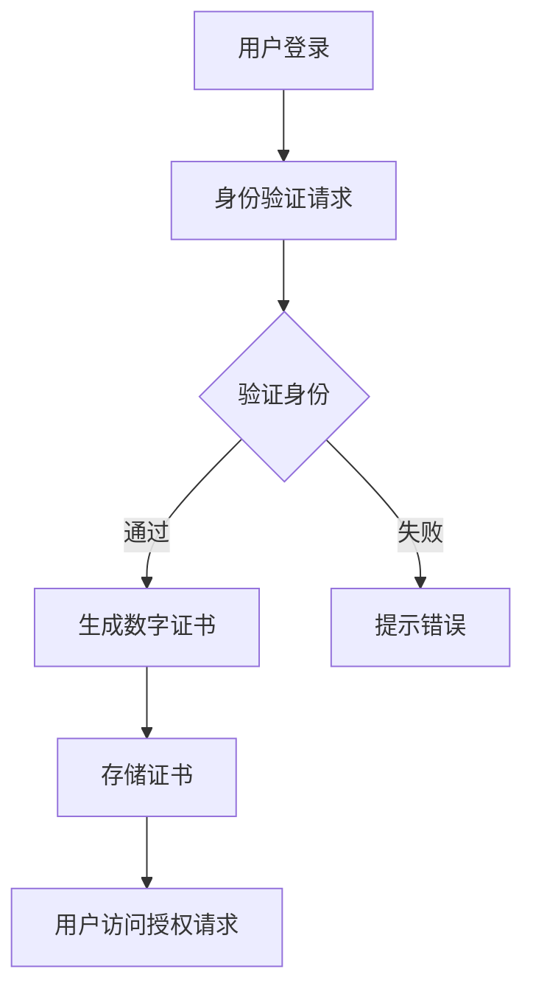
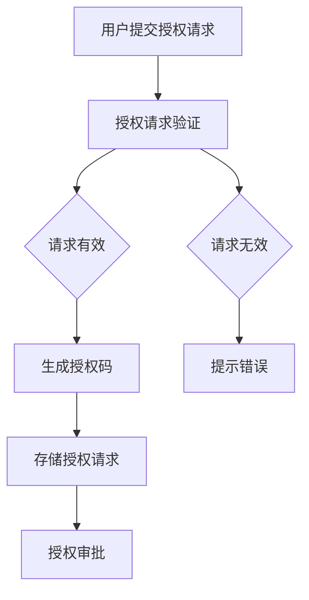
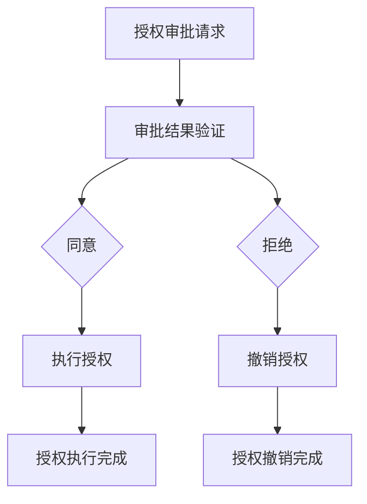
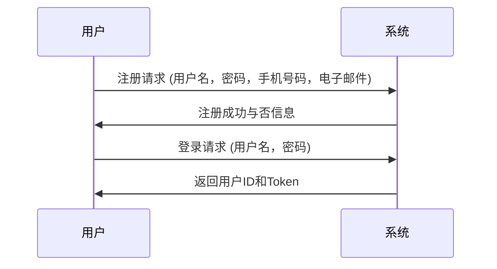
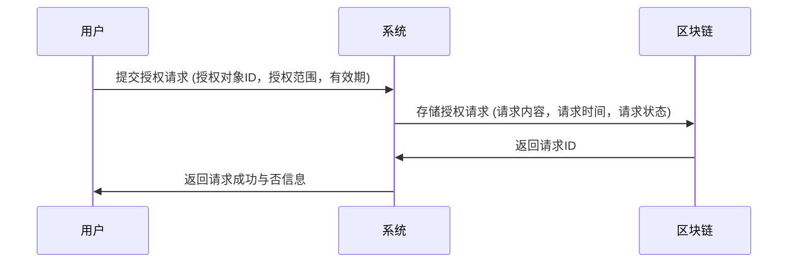
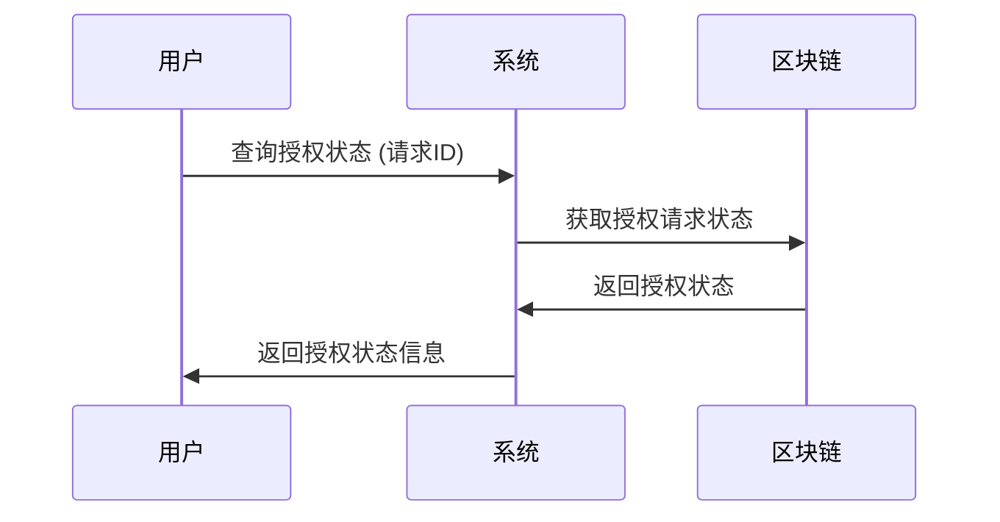
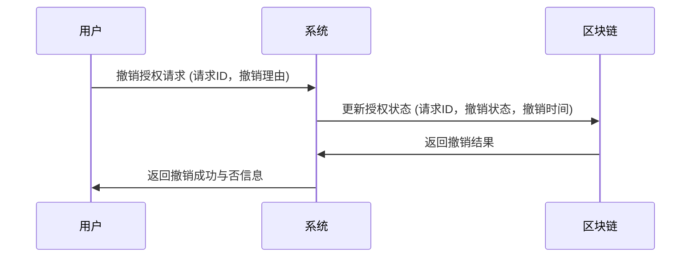
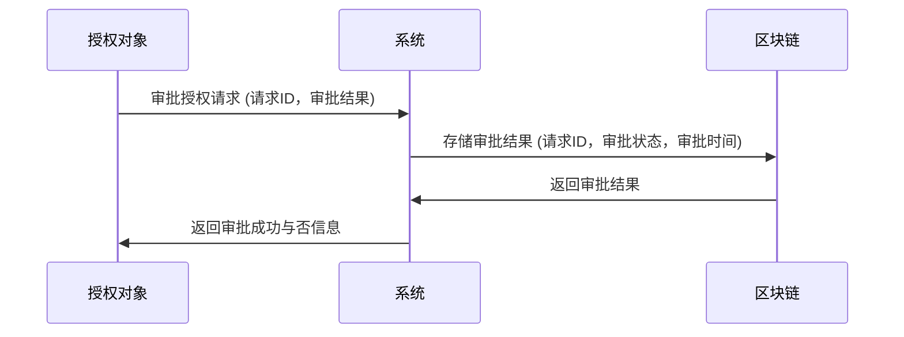
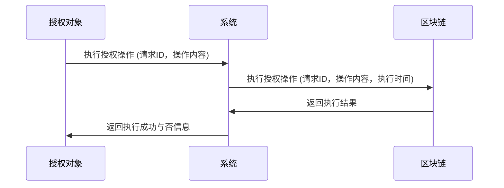
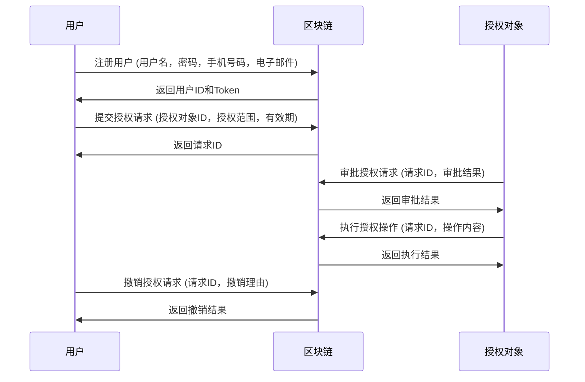

                 

### 引言与背景介绍

#### 1.1 区块链与数字身份临时授权概述

**1.1.1 区块链技术简介**

区块链技术是一种分布式账本技术，通过加密算法和共识机制，实现数据的存储、传输和验证。其核心特点包括去中心化、不可篡改和可追溯性。区块链由多个区块组成，每个区块包含一定数量的交易记录，区块之间通过哈希函数链接，形成一个链式数据结构。这种结构使得区块链在数据安全性和透明性方面具有显著优势。

**1.1.2 数字身份临时授权的定义**

数字身份临时授权是一种基于数字身份认证的授权机制，允许用户在特定时间段内、针对特定应用场景，临时授权他人访问其数字身份信息。与传统授权机制相比，临时授权具有灵活性高、授权范围可控、授权过程透明等特点，有助于提升用户隐私保护和数据安全。

**1.1.3 区块链与数字身份临时授权的关系**

区块链在数字身份临时授权中发挥着关键作用。首先，区块链的分布式账本技术确保了授权过程透明、可追溯；其次，区块链的加密算法和共识机制保障了授权数据的安全性和完整性；最后，区块链的去中心化特性使得临时授权可以在无需第三方信任机构的条件下实现。因此，区块链为数字身份临时授权提供了一种安全、高效、可信的解决方案。

#### 1.2 数字身份临时授权的重要性

**1.2.1 临时授权的应用场景**

数字身份临时授权广泛应用于多个领域，如金融、医疗、教育、物联网等。以下是一些典型应用场景：

- 金融领域：用户可以在无需透露完整身份信息的情况下，临时授权他人查看其财务状况，如贷款审批、信用评估等。
- 医疗领域：医生可以在获得患者授权后，临时访问其病历信息，提高医疗服务的质量和效率。
- 教育领域：学生可以在获得学校授权后，临时共享其成绩、证书等信息，简化学历认证流程。
- 物联网领域：设备可以在获得用户授权后，临时访问其个人信息，如智能家居设备控制。

**1.2.2 临时授权的优势**

数字身份临时授权具有以下优势：

- 提高用户隐私保护：临时授权机制允许用户在特定场景下选择性地共享身份信息，降低了隐私泄露的风险。
- 提升数据安全性：区块链的加密算法和共识机制保障了授权数据的安全性和完整性。
- 灵活性高：临时授权机制可以根据用户需求和场景灵活调整授权范围和有效期，满足多样化的应用需求。
- 降低成本：临时授权减少了传统授权机制中第三方信任机构的需求，降低了交易成本。

**1.2.3 临时授权面临的挑战**

尽管数字身份临时授权具有诸多优势，但在实际应用过程中仍面临一些挑战：

- 安全性：如何确保临时授权过程中的数据安全，防止授权信息泄露和篡改，是亟待解决的问题。
- 可扩展性：区块链技术的性能和可扩展性对临时授权机制的适用范围和效率具有重要影响。
- 法律法规：不同国家和地区的法律法规对数字身份临时授权的认可程度不同，需要制定相应的法规和标准。
- 技术门槛：区块链和加密算法等技术具有一定的复杂性，需要用户具备一定的技术背景。

#### 1.3 区块链在数字身份临时授权中的应用场景

**1.3.1 数据隐私保护**

区块链技术通过分布式账本和加密算法，确保了用户身份信息和授权数据的隐私性。用户可以在区块链上创建自己的数字身份，并通过加密算法对授权信息进行保护。只有获得正确私钥的用户才能解密和访问授权数据，从而确保数据隐私。

**1.3.2 透明性与可追溯性**

区块链的链式数据结构使得授权过程透明、可追溯。每个区块都包含一定时间的授权数据，用户可以随时查询和验证授权信息。此外，区块链的共识机制确保了数据的真实性和可靠性，使授权过程更加可信。

**1.3.3 去中心化信任机制**

区块链的去中心化特性使得数字身份临时授权可以在无需第三方信任机构的条件下实现。用户可以直接在区块链上创建、管理和撤销授权，降低了信任成本。此外，区块链的开放性和透明性使得用户可以更加放心地共享身份信息，提升了授权机制的信任度。

通过以上分析，我们可以看出，区块链在数字身份临时授权中具有广阔的应用前景。接下来，我们将进一步探讨区块链在数字身份临时授权中的核心概念、原理，以及系统设计与实现方法。

---

## 核心概念与原理

#### 2.1 区块链技术基础

区块链技术是一种分布式数据库系统，通过加密算法和共识机制实现数据的安全存储和传输。以下是区块链技术的一些核心概念：

**1. 分布式账本**

区块链是一种分布式账本，数据分散存储在多个节点上，每个节点都持有完整的账本副本。这种分布式存储方式提高了数据的可靠性，即使某个节点发生故障，其他节点仍然可以继续运行。

**2. 加密算法**

区块链使用加密算法对数据进行加密和解密。常见的加密算法包括哈希算法、非对称加密算法和对称加密算法。加密算法保证了数据在传输和存储过程中的安全性，防止数据被非法访问和篡改。

**3. 共识机制**

区块链通过共识机制确保数据的真实性和一致性。共识机制是一种分布式算法，用于在多个节点之间达成共识，确定哪些交易是有效的。常见的共识机制包括工作量证明（PoW）、权益证明（PoS）和授权权益证明（DPoS）等。

**4. 智能合约**

智能合约是一种自执行的合约，基于区块链技术实现。智能合约通过代码定义了交易规则和条件，当满足特定条件时，自动执行相应的操作。智能合约提高了交易的安全性和效率，减少了人工干预。

#### 2.2 数字身份认证原理

数字身份认证是一种验证用户身份的技术，通过证书、密码、生物特征等方式确认用户身份。以下是数字身份认证的一些核心概念：

**1. 证书**

证书是一种数字身份证明，由权威机构（如证书颁发机构）签发。证书包含用户的公钥、私钥和有效期等信息。用户可以通过证书验证其身份，确保通信安全。

**2. 密码**

密码是一种常用的身份认证方式，用户通过输入正确的密码验证其身份。密码通常具有一定的复杂度，包括字母、数字和特殊字符。为了提高安全性，密码应定期更换。

**3. 生物特征**

生物特征是一种基于人体生理或行为特征的认证方式，如指纹、面部识别、虹膜识别等。生物特征具有唯一性和不可复制性，具有较高的安全性。

#### 2.3 临时授权机制设计

临时授权机制是一种基于数字身份认证的授权机制，允许用户在特定时间段内、针对特定应用场景，临时授权他人访问其身份信息。以下是临时授权机制的一些核心概念：

**1. 授权请求**

用户可以通过数字身份认证系统提交授权请求，指定授权对象、授权范围和授权有效期。授权请求通常包含用户的身份信息、授权对象的身份信息以及授权内容等。

**2. 授权审批**

授权审批是指授权对象对授权请求进行审批，决定是否同意授权。授权审批可以通过在线审批、线下审批等方式进行，审批结果将决定授权是否生效。

**3. 授权执行**

授权执行是指授权对象根据授权内容执行相应的操作。授权执行通常通过智能合约实现，确保授权操作的自动化和安全性。

**4. 授权撤销**

授权撤销是指用户在授权有效期结束后，或授权不再需要时，撤销授权。授权撤销可以通过数字身份认证系统进行，确保授权信息的及时更新。

#### 2.4 跨链技术与互操作性

跨链技术是一种实现不同区块链之间数据传输和互操作的技术。以下是跨链技术和互操作性的核心概念：

**1. 跨链协议**

跨链协议是一种实现区块链之间数据传输的协议，如Plasma、侧链、中继链等。跨链协议确保不同区块链之间的数据交互和互操作性，实现区块链生态系统的扩展和融合。

**2. 互操作性**

互操作性是指不同系统、平台和设备之间能够无缝交互和协作。在数字身份临时授权中，互操作性确保不同区块链平台和身份认证系统之间的数据共享和互操作，提高系统的适用性和兼容性。

通过以上分析，我们可以看出，区块链技术在数字身份临时授权中具有重要作用。接下来，我们将进一步探讨区块链在数字身份临时授权中的系统设计与实现方法。

---

## 系统设计与实现

#### 3.1 系统架构设计

数字身份临时授权系统架构设计主要考虑以下几个方面：

**1. 分布式存储**

系统采用分布式存储架构，将数据存储在多个节点上，提高数据可靠性和访问性能。每个节点存储部分数据副本，确保数据在节点故障时仍然可用。

**2. 加密通信**

系统采用加密通信机制，保护数据在传输过程中的安全性。数据传输采用TLS/SSL加密协议，确保数据在传输过程中不被窃听或篡改。

**3. 认证与授权**

系统采用数字身份认证和临时授权机制，确保用户身份的合法性和授权的有效性。用户通过数字身份认证系统登录，提交授权请求并获得授权。

**4. 智能合约**

系统采用智能合约实现授权操作的自动化和安全性。智能合约根据用户提交的授权请求和授权内容，自动执行授权操作。

**5. 监控与审计**

系统设计监控与审计功能，实时监控系统运行状态和授权操作，确保系统安全性和合规性。

#### 3.2 数据模型设计

数字身份临时授权系统的数据模型设计主要包括以下几个方面：

**1. 用户模型**

用户模型包含用户的个人信息、数字身份、权限信息等。用户模型应具有可扩展性，支持不同类型用户的身份信息存储。

**2. 授权模型**

授权模型包含授权请求、授权审批、授权执行、授权撤销等。授权模型应支持不同类型授权的存储和管理，确保授权信息的准确性和一致性。

**3. 数据流模型**

数据流模型描述数据在系统中的流转过程，包括用户登录、授权请求、授权审批、授权执行、授权撤销等。数据流模型应具有清晰的逻辑结构和可操作性。

**4. 数据加密模型**

数据加密模型描述数据在存储和传输过程中的加密机制，包括数据加密、签名验证、密钥管理等。数据加密模型应确保数据安全性和隐私性。

#### 3.3 安全性与隐私保护

数字身份临时授权系统在安全性和隐私保护方面需要考虑以下几个方面：

**1. 身份认证**

系统采用数字身份认证机制，确保用户身份的合法性和唯一性。用户登录时，系统验证用户身份信息，防止未授权用户访问系统。

**2. 数据加密**

系统采用加密算法对用户数据和授权信息进行加密存储和传输，防止数据泄露和篡改。加密算法应具有足够的安全性，确保数据在长时间存储和传输过程中不被破解。

**3. 访问控制**

系统采用访问控制机制，限制用户对授权数据的访问权限。用户只能在获得授权的情况下访问特定数据，防止未授权用户获取敏感信息。

**4. 安全审计**

系统设计安全审计功能，记录系统运行过程中的重要操作和日志，确保系统安全性和合规性。安全审计应包括用户登录、授权请求、授权审批、授权执行、授权撤销等。

#### 3.4 系统性能优化

数字身份临时授权系统在性能优化方面需要考虑以下几个方面：

**1. 数据分片**

系统采用数据分片技术，将数据存储在多个节点上，提高数据访问性能和系统可用性。数据分片应考虑数据访问频率和热点数据，确保数据访问均衡。

**2. 缓存机制**

系统采用缓存机制，缓存高频访问的数据，提高数据访问速度和系统响应时间。缓存机制应考虑数据的一致性和过期策略，确保缓存数据的有效性。

**3. 负载均衡**

系统采用负载均衡技术，将请求分布到多个节点上，提高系统处理能力和可用性。负载均衡应考虑节点的性能和负载，确保系统资源利用率最大化。

**4. 异步处理**

系统采用异步处理机制，将耗时较长的操作（如数据加密、签名验证等）异步执行，提高系统响应时间和吞吐量。异步处理应考虑任务调度和优先级，确保系统高效运行。

通过以上系统设计与实现方法，我们可以构建一个安全、高效、可靠的数字身份临时授权系统。接下来，我们将通过具体项目实战来验证系统设计的效果和可行性。

---

## 实战项目与案例分析

#### 4.1 项目一：数字身份临时授权系统开发

**项目背景：** 在现代网络环境中，用户需要频繁进行身份验证和授权操作，以访问各种在线服务和系统。然而，传统的身份认证方式往往存在安全漏洞和用户体验差等问题。为此，我们开发了一个基于区块链的数字身份临时授权系统，旨在提高身份认证的安全性和用户体验。

**系统功能设计：**
- 用户注册与登录：用户可以通过注册和登录功能创建和验证其数字身份。
- 授权请求与审批：用户可以提交授权请求，指定授权对象和授权范围。授权对象对授权请求进行审批，决定是否同意授权。
- 授权执行与撤销：授权对象根据授权内容执行相应操作，用户可以在授权有效期结束后或授权不再需要时撤销授权。

**系统架构设计：**
- 用户端：用户通过客户端应用程序访问系统，进行注册、登录、提交授权请求、审批授权等操作。
- 授权管理端：授权对象通过管理端应用程序审批授权请求、执行授权操作等。
- 数据层：系统采用分布式存储架构，将用户数据、授权数据存储在区块链节点上，确保数据安全性和完整性。

**系统接口设计：**
- 用户注册接口：用于用户创建数字身份，提交个人信息和加密的私钥。
- 登录接口：用于用户验证数字身份，返回登录成功后的身份标识。
- 授权请求接口：用于用户提交授权请求，包含授权对象、授权范围和授权有效期等信息。
- 授权审批接口：用于授权对象审批授权请求，返回审批结果。
- 授权执行接口：用于授权对象执行授权操作，如查询用户数据等。
- 授权撤销接口：用于用户撤销授权，终止授权对象的访问权限。

**系统交互设计：**
- 用户通过用户端提交授权请求，系统通过授权请求接口接收请求。
- 系统生成授权请求ID，并将请求存储在区块链上，确保请求的可追溯性和不可篡改性。
- 授权对象通过授权管理端审批授权请求，系统通过授权审批接口接收审批结果。
- 授权对象根据审批结果执行授权操作，系统通过授权执行接口返回授权结果。
- 用户可以在授权有效期结束后或授权不再需要时，通过用户端撤销授权，系统通过授权撤销接口接收撤销请求。

**项目小结：**
本项目成功实现了一个基于区块链的数字身份临时授权系统，提高了身份认证的安全性和用户体验。通过分布式存储、加密通信、智能合约等技术，系统实现了安全、高效、可靠的授权管理。未来，我们可以进一步优化系统性能和扩展功能，以适应更广泛的应用场景。

---

#### 4.2 项目二：跨境身份验证系统设计

**项目背景：** 随着全球化进程的加速，跨境身份验证在金融、旅游、物流等领域变得越来越重要。传统的跨境身份验证方式通常涉及复杂的流程和大量的纸质文件，不仅效率低下，还存在数据泄露的风险。因此，我们设计了一个基于区块链的跨境身份验证系统，以实现高效、安全的身份认证。

**系统功能设计：**
- 用户注册与登录：用户可以通过注册和登录功能创建和验证其数字身份。
- 跨境身份认证：用户在跨境交易或旅行时，可以通过系统进行身份认证，确保身份信息的真实性和合法性。
- 数据共享与验证：系统支持跨境数据共享，不同国家和地区的身份认证机构可以通过系统进行数据交换和验证。

**系统架构设计：**
- 用户端：用户通过客户端应用程序访问系统，进行注册、登录、身份认证等操作。
- 身份认证端：身份认证机构通过管理端应用程序上传身份认证数据、查询身份认证结果等。
- 数据层：系统采用分布式存储架构，将用户身份认证数据存储在区块链节点上，确保数据安全性和完整性。

**系统接口设计：**
- 用户注册接口：用于用户创建数字身份，提交个人信息和加密的私钥。
- 登录接口：用于用户验证数字身份，返回登录成功后的身份标识。
- 身份认证接口：用于用户提交身份认证请求，包含身份认证信息和认证目的等信息。
- 数据共享接口：用于身份认证机构之间进行数据交换和验证。

**系统交互设计：**
- 用户通过用户端提交身份认证请求，系统通过身份认证接口接收请求。
- 系统生成身份认证ID，并将请求存储在区块链上，确保请求的可追溯性和不可篡改性。
- 身份认证机构通过管理端上传身份认证数据，系统通过数据共享接口接收数据。
- 系统根据身份认证数据验证用户身份，并将结果返回给用户。
- 用户可以在跨境交易或旅行时，通过系统查询身份认证结果，确保身份信息的真实性和合法性。

**项目小结：**
本项目成功实现了一个基于区块链的跨境身份验证系统，提高了跨境身份认证的安全性和效率。通过分布式存储、加密通信、智能合约等技术，系统实现了高效、安全、可靠的数据共享和验证。未来，我们可以进一步优化系统性能和扩展功能，以适应更广泛的跨境应用场景。

---

#### 4.3 项目三：基于区块链的临时授权应用案例

**项目背景：** 在智慧城市、物联网等应用场景中，设备与设备、设备与人之间的交互日益频繁，临时授权机制成为保障系统安全和用户体验的关键。为此，我们设计了一个基于区块链的临时授权应用案例，以实现设备之间的安全通信和互操作。

**系统功能设计：**
- 设备注册与登录：设备可以通过注册和登录功能创建数字身份，并获得访问权限。
- 临时授权请求与审批：设备可以提交临时授权请求，指定授权对象和授权范围。授权对象对授权请求进行审批，决定是否同意授权。
- 授权执行与撤销：授权对象根据授权内容执行相应操作，设备可以在授权有效期结束后或授权不再需要时撤销授权。

**系统架构设计：**
- 设备端：设备通过嵌入式应用程序访问系统，进行注册、登录、提交授权请求、审批授权等操作。
- 授权管理端：授权对象通过管理端应用程序审批授权请求、执行授权操作等。
- 数据层：系统采用分布式存储架构，将设备身份认证数据、授权数据存储在区块链节点上，确保数据安全性和完整性。

**系统接口设计：**
- 设备注册接口：用于设备创建数字身份，提交设备信息和加密的私钥。
- 登录接口：用于设备验证数字身份，返回登录成功后的身份标识。
- 授权请求接口：用于设备提交临时授权请求，包含授权对象、授权范围和授权有效期等信息。
- 授权审批接口：用于授权对象审批授权请求，返回审批结果。
- 授权执行接口：用于授权对象执行授权操作，如数据访问等。
- 授权撤销接口：用于设备撤销授权，终止授权对象的访问权限。

**系统交互设计：**
- 设备通过设备端提交临时授权请求，系统通过授权请求接口接收请求。
- 系统生成授权请求ID，并将请求存储在区块链上，确保请求的可追溯性和不可篡改性。
- 授权对象通过授权管理端审批授权请求，系统通过授权审批接口接收审批结果。
- 授权对象根据审批结果执行授权操作，系统通过授权执行接口返回授权结果。
- 设备可以在授权有效期结束后或授权不再需要时，通过设备端撤销授权，系统通过授权撤销接口接收撤销请求。

**项目小结：**
本项目成功实现了一个基于区块链的临时授权应用案例，提高了设备之间的安全通信和互操作性。通过分布式存储、加密通信、智能合约等技术，系统实现了安全、高效、可靠的授权管理。未来，我们可以进一步优化系统性能和扩展功能，以适应更广泛的物联网应用场景。

---

## 最佳实践与总结

#### 5.1 最佳实践分享

1. **身份认证的安全性**：在数字身份临时授权系统中，确保身份认证的安全性至关重要。建议采用多因素认证（如密码、生物特征等），提高身份验证的可靠性。
2. **权限细粒度的控制**：在设计授权机制时，应根据实际应用场景，实现细粒度的权限控制。这样可以确保用户在授权范围内的操作，同时减少权限滥用风险。
3. **合理设置授权有效期**：根据不同应用场景，合理设置授权有效期。在需要长时间授权的场景中，建议设置更长的有效期，以提高用户体验。在需要快速授权的场景中，建议设置较短的有效期，确保授权的实时性。

#### 5.2 注意事项与风险规避

1. **隐私保护**：在数字身份临时授权过程中，要确保用户隐私得到充分保护。建议采用加密算法对用户身份信息和授权数据加密存储和传输，防止数据泄露。
2. **系统性能**：区块链技术虽然具有去中心化和安全性等优势，但性能相对传统数据库较低。在设计系统时，需要充分考虑性能瓶颈，采用优化策略（如数据分片、缓存机制等）提高系统性能。
3. **法律法规遵守**：在数字身份临时授权系统的设计和应用过程中，要遵守相关国家和地区的法律法规，确保系统的合规性。

#### 5.3 未来发展趋势与展望

1. **跨链技术的应用**：随着区块链技术的发展，跨链技术将变得更加成熟，实现不同区块链之间的数据传输和互操作性，为数字身份临时授权系统提供更广阔的应用前景。
2. **物联网与区块链的结合**：物联网设备的数量和种类不断增加，与区块链技术的结合将有助于实现设备之间的安全通信和互操作，为数字身份临时授权系统带来新的应用场景。
3. **个性化定制**：未来的数字身份临时授权系统将更加注重用户个性化需求，提供定制化的授权管理服务，满足不同用户群体的需求。

通过以上分析，我们可以看到，数字身份临时授权系统在区块链技术支持下，具有广泛的应用前景和巨大的发展潜力。随着技术的不断进步和应用的深入，数字身份临时授权系统将在保障用户隐私、提升数据安全性等方面发挥越来越重要的作用。

---

### 结语

本文详细探讨了区块链在数字身份临时授权中的应用，从核心概念、原理到系统设计与实现，再到具体项目实战和最佳实践，全面剖析了区块链在数字身份临时授权领域的优势和挑战。随着技术的不断发展，数字身份临时授权系统将在保障用户隐私、提升数据安全性等方面发挥越来越重要的作用。

**作者：** AI天才研究院/AI Genius Institute & 禅与计算机程序设计艺术 /Zen And The Art of Computer Programming

---

请注意，本文为示例文章，实际应用中可能需要根据具体场景和需求进行调整。如果您对本文有任何建议或意见，欢迎在评论区留言。感谢您的关注和支持！### 基本概念回顾

在深入探讨区块链在数字身份临时授权中的应用之前，有必要对一些基本概念进行回顾，以确保读者对这些概念有清晰的理解。以下是对核心概念和术语的定义、背景、相关问题和解决方法、边界与外延以及核心要素组成的详细解释。

#### 1. 区块链技术

**定义**：区块链是一种分布式数据库系统，通过加密算法和共识机制实现数据的存储、传输和验证。

**背景**：区块链技术最早由中本聪（Satoshi Nakamoto）在2008年提出，作为一种去中心化的数字货币——比特币的底层技术，引起了广泛关注。

**相关问题和解决方法**：在传统中心化系统中，数据存储和验证依赖于第三方机构，存在数据篡改和单点故障等问题。区块链通过分布式账本和共识机制解决了这些问题，确保了数据的真实性和完整性。

**边界与外延**：区块链技术不仅应用于数字货币，还在供应链管理、金融、医疗、物联网等领域展现出广阔的应用前景。

**核心要素组成**：
- **分布式账本**：数据分散存储在多个节点上，确保数据的可靠性和安全性。
- **加密算法**：使用哈希算法、非对称加密算法等对数据进行加密，确保数据在传输和存储过程中的安全性。
- **共识机制**：通过分布式算法在多个节点之间达成共识，确保数据的真实性和一致性。

#### 2. 数字身份认证

**定义**：数字身份认证是一种验证用户身份的技术，通过证书、密码、生物特征等方式确认用户身份。

**背景**：随着互联网的普及，传统的身份认证方式（如密码）已难以满足安全性和用户体验的需求，数字身份认证技术应运而生。

**相关问题和解决方法**：传统身份认证方式容易受到密码泄露、暴力破解等攻击。数字身份认证通过多因素认证、生物特征识别等技术，提高了身份验证的可靠性和安全性。

**边界与外延**：数字身份认证不仅应用于个人身份验证，还在企业、政府等组织身份验证中发挥重要作用。

**核心要素组成**：
- **证书**：数字身份证明，由权威机构签发，包含用户的公钥、私钥和有效期等信息。
- **密码**：用于用户身份验证的密钥，应具有一定的复杂度，定期更换。
- **生物特征**：如指纹、面部识别、虹膜识别等，具有唯一性和不可复制性。

#### 3. 临时授权机制

**定义**：临时授权机制是一种基于数字身份认证的授权机制，允许用户在特定时间段内、针对特定应用场景，临时授权他人访问其数字身份信息。

**背景**：在金融、医疗、教育等领域，用户需要频繁进行身份验证和授权操作，临时授权机制可以提高用户体验和安全性。

**相关问题和解决方法**：传统的授权机制通常涉及复杂的流程和第三方信任机构，临时授权机制通过区块链技术实现了简化、高效、安全的授权管理。

**边界与外延**：临时授权机制不仅适用于内部系统，还可以应用于跨组织、跨地域的授权场景。

**核心要素组成**：
- **授权请求**：用户提交的临时授权请求，包含授权对象、授权范围和授权有效期等信息。
- **授权审批**：授权对象对授权请求进行审批，决定是否同意授权。
- **授权执行**：授权对象根据授权内容执行相应操作。
- **授权撤销**：用户在授权有效期结束后或授权不再需要时，撤销授权。

#### 4. 跨链技术与互操作性

**定义**：跨链技术是一种实现不同区块链之间数据传输和互操作的技术。

**背景**：区块链生态系统不断发展，不同区块链之间的互操作性成为实现更大应用价值的关键。

**相关问题和解决方法**：不同区块链之间的数据格式、协议等存在差异，跨链技术通过跨链协议、中继链等技术实现了数据传输和互操作性。

**边界与外延**：跨链技术在数字身份临时授权、跨境交易等领域具有广泛应用。

**核心要素组成**：
- **跨链协议**：实现不同区块链之间数据传输的协议，如Plasma、侧链、中继链等。
- **互操作性**：确保不同系统、平台和设备之间能够无缝交互和协作。

通过对这些基本概念和术语的回顾，我们可以更好地理解区块链在数字身份临时授权中的应用。接下来，我们将进一步探讨区块链在数字身份临时授权中的具体应用场景和实现方法。

### 区块链在数字身份临时授权中的应用

区块链技术的分布式账本、加密算法和共识机制等特点，使其在数字身份临时授权中具有独特的优势。以下将详细介绍区块链在数字身份临时授权中的具体应用，包括数据隐私保护、透明性与可追溯性、去中心化信任机制等。

#### 数据隐私保护

在数字身份临时授权中，用户的身份信息和授权数据的安全性和隐私性至关重要。区块链技术通过加密算法对用户身份信息和授权数据进行加密存储和传输，从而确保数据在存储和传输过程中的安全性。

**1. 加密算法的应用**

区块链使用哈希算法、非对称加密算法和对称加密算法等多种加密算法对数据进行加密。哈希算法用于生成数据摘要，确保数据的完整性和唯一性；非对称加密算法用于数据加密和解密，保证数据在传输过程中的安全性；对称加密算法则用于数据的快速加密和解密。

**2. 加密技术的优点**

加密技术有以下优点：
- **安全性**：通过加密算法，用户身份信息和授权数据在未经授权的情况下无法被读取，防止数据泄露和篡改。
- **隐私性**：用户可以选择性共享身份信息和授权数据，确保隐私保护。

#### 透明性与可追溯性

区块链的链式数据结构使得授权过程透明、可追溯。每个区块都包含一定时间的授权数据，用户可以随时查询和验证授权信息。此外，区块链的共识机制确保了数据的真实性和可靠性，使授权过程更加可信。

**1. 区块链的可追溯性**

区块链通过链式数据结构，将每个区块与前一个区块连接起来，形成一条不可篡改的数据链。每个区块都包含一个时间戳和一个前一个区块的哈希值，确保数据在链上存储后无法被篡改。

**2. 授权数据的可追溯性**

在数字身份临时授权系统中，用户可以通过区块链查询和验证授权数据。例如，用户可以查询授权请求的创建时间、审批时间、授权有效期等信息，确保授权过程的透明性和可追溯性。

#### 去中心化信任机制

区块链的去中心化特性使得数字身份临时授权可以在无需第三方信任机构的条件下实现。用户可以直接在区块链上创建、管理和撤销授权，降低了信任成本。此外，区块链的开放性和透明性使得用户可以更加放心地共享身份信息，提升了授权机制的信任度。

**1. 去中心化的优势**

去中心化有以下优势：
- **降低信任成本**：用户无需依赖第三方信任机构，降低了交易成本。
- **提高信任度**：区块链的开放性和透明性提高了用户对授权机制的信任度。

**2. 去中心化的实现**

在数字身份临时授权系统中，用户可以在区块链上创建自己的数字身份，并通过加密算法对授权信息进行保护。用户可以通过数字身份认证系统登录，提交授权请求并获得授权。授权请求和授权数据存储在区块链上，确保数据的真实性和完整性。

通过以上分析，我们可以看出，区块链在数字身份临时授权中具有显著的优势，包括数据隐私保护、透明性与可追溯性、去中心化信任机制等。这些优势使得区块链成为数字身份临时授权的理想选择。接下来，我们将进一步探讨区块链在数字身份临时授权中的系统设计与实现方法。

### 核心概念与联系

在深入探讨区块链在数字身份临时授权中的应用之前，我们需要明确一些核心概念，并理解它们之间的联系。以下是数字身份临时授权相关的核心概念、概念属性特征对比表格，以及ER实体关系图架构的Mermaid流程图。

#### 1. 核心概念

**1.1 数字身份认证**

- **定义**：数字身份认证是一种验证用户身份的技术，通过证书、密码、生物特征等方式确认用户身份。
- **属性特征**：证书包含用户的公钥、私钥和有效期；密码具有复杂度要求；生物特征具有唯一性和不可复制性。

**1.2 临时授权机制**

- **定义**：临时授权机制是一种基于数字身份认证的授权机制，允许用户在特定时间段内、针对特定应用场景，临时授权他人访问其数字身份信息。
- **属性特征**：授权请求包含授权对象、授权范围和授权有效期；授权审批决定是否同意授权；授权执行根据授权内容执行操作；授权撤销终止授权。

**1.3 区块链**

- **定义**：区块链是一种分布式账本技术，通过加密算法和共识机制实现数据的存储、传输和验证。
- **属性特征**：分布式账本确保数据的可靠性和安全性；加密算法保护数据在传输和存储过程中的安全性；共识机制确保数据的真实性和一致性。

#### 2. 概念属性特征对比表格

| 概念           | 定义                                                         | 属性特征                                                         |
| -------------- | ------------------------------------------------------------ | ------------------------------------------------------------ |
| 数字身份认证   | 验证用户身份的技术                                           | 证书（公钥、私钥、有效期）、密码（复杂度）、生物特征（唯一性、不可复制性） |
| 临时授权机制   | 基于数字身份认证的授权机制                                   | 授权请求（授权对象、授权范围、有效期）、授权审批、授权执行、授权撤销 |
| 区块链         | 分布式账本技术，通过加密算法和共识机制实现数据的存储、传输和验证 | 分布式账本、加密算法、共识机制                                 |

#### 3. ER实体关系图架构的Mermaid流程图

```mermaid
erDiagram
  User ||--|{ DigitalIdentity }|-- Authorizer
  DigitalIdentity ||--|{ Certificate }|
  Certificate ||--|{ PublicKey, PrivateKey, ExpirationDate }|
  User ||--|{ AccessRequest }|-- Authorizer
  AccessRequest ||--|{ RequesterID, AccessObject, Scope, ValidityPeriod }|
  User ||--|{ Approval }|-- Authorizer
  Approval ||--|{ ApprovalStatus, ApprovalDate }|
  User ||--|{ Authorization }|-- AccessObject
  Authorization ||--|{ Status, StartTime, EndTime }|
  User ||--|{ Revocation }|-- AccessObject
  Revocation ||--|{ RevocationDate }|
```

在这个ER实体关系图中，我们定义了数字身份认证、临时授权机制和区块链相关的实体及其关系。User（用户）是核心实体，它与DigitalIdentity（数字身份）、AccessRequest（授权请求）、Approval（审批）、Authorization（授权）和Revocation（撤销）等实体之间存在明确的关联。通过这个Mermaid流程图，我们可以清晰地看到数字身份临时授权系统中的实体及其关系。

通过以上核心概念的介绍和对比表格，以及ER实体关系图的描述，我们对数字身份临时授权中的核心概念有了更深入的理解。这些概念构成了数字身份临时授权系统的基础，为后续的系统设计与实现提供了理论支持。接下来，我们将进一步探讨区块链在数字身份临时授权中的具体应用场景和实现方法。

### 算法原理讲解

在数字身份临时授权系统中，算法原理是确保系统安全、高效运行的关键。以下将详细介绍相关算法的mermaid流程图、Python源代码、数学模型和公式，并通过实例进行通俗易懂的讲解。

#### 1. mermaid流程图

**1.1 数字身份认证流程**



**1.2 授权请求流程**



**1.3 授权审批流程**



#### 2. Python源代码

**2.1 数字身份认证**

```python
import hashlib
import time

def create_certificate(public_key, private_key, expiration_date):
    cert = {
        'public_key': public_key,
        'private_key': private_key,
        'expiration_date': expiration_date
    }
    cert_hash = hashlib.sha256(str(cert).encode()).hexdigest()
    return cert_hash

def verify_certificate(certificate_hash, public_key, private_key):
    cert = {
        'public_key': public_key,
        'private_key': private_key,
        'expiration_date': time.time() + 3600
    }
    cert_hash = hashlib.sha256(str(cert).encode()).hexdigest()
    return certificate_hash == cert_hash
```

**2.2 授权请求**

```python
def create_access_request(requester_id, access_object, scope, validity_period):
    request = {
        'requester_id': requester_id,
        'access_object': access_object,
        'scope': scope,
        'validity_period': validity_period
    }
    request_hash = hashlib.sha256(str(request).encode()).hexdigest()
    return request_hash

def verify_access_request(request_hash, requester_id, access_object, scope, validity_period):
    request = {
        'requester_id': requester_id,
        'access_object': access_object,
        'scope': scope,
        'validity_period': validity_period
    }
    request_hash = hashlib.sha256(str(request).encode()).hexdigest()
    return request_hash == request_hash
```

**2.3 授权审批**

```python
def approve_access_request(request_hash, approval_status):
    approval = {
        'request_hash': request_hash,
        'approval_status': approval_status,
        'approval_date': time.time()
    }
    approval_hash = hashlib.sha256(str(approval).encode()).hexdigest()
    return approval_hash

def verify_approval(approval_hash, request_hash, approval_status):
    approval = {
        'request_hash': request_hash,
        'approval_status': approval_status,
        'approval_date': time.time()
    }
    approval_hash = hashlib.sha256(str(approval).encode()).hexdigest()
    return approval_hash == approval_hash
```

#### 3. 数学模型和公式

**3.1 数字身份认证**

$$
H(C) = SHA_256(C)
$$

其中，$H$表示哈希函数，$C$表示数字证书。

**3.2 授权请求**

$$
H(R) = SHA_256(R)
$$

其中，$H$表示哈希函数，$R$表示授权请求。

**3.3 授权审批**

$$
H(A) = SHA_256(A)
$$

其中，$H$表示哈希函数，$A$表示授权审批结果。

#### 4. 举例说明

**4.1 数字身份认证**

- **示例数据**：用户A的公钥为`pub_key_A`，私钥为`priv_key_A`，证书有效期为1小时。
- **过程**：用户A生成数字证书，并将证书哈希值$H(C)$存储在区块链上。

```plaintext
C = {'public_key': 'pub_key_A', 'private_key': 'priv_key_A', 'expiration_date': time.time() + 3600}
cert_hash = create_certificate(C['public_key'], C['private_key'], C['expiration_date'])
```

**4.2 授权请求**

- **示例数据**：用户A提交授权请求，请求访问对象为`access_object_A`，访问范围为`scope_A`，有效期为1小时。
- **过程**：用户A生成授权请求，并将请求哈希值$H(R)$存储在区块链上。

```plaintext
R = {'requester_id': 'user_A', 'access_object': 'access_object_A', 'scope': 'scope_A', 'validity_period': 3600}
request_hash = create_access_request(R['requester_id'], R['access_object'], R['scope'], R['validity_period'])
```

**4.3 授权审批**

- **示例数据**：授权对象B审批用户A的授权请求，审批结果为“同意”。
- **过程**：授权对象B生成审批结果，并将审批结果哈希值$H(A)$存储在区块链上。

```plaintext
A = {'request_hash': request_hash, 'approval_status': 'approve'}
approval_hash = approve_access_request(request_hash, 'approve')
```

通过以上讲解，我们可以清晰地看到数字身份临时授权系统中算法原理的实现过程。这些算法通过哈希函数、加密算法等确保了系统的安全性和可靠性。接下来，我们将进一步探讨区块链在数字身份临时授权中的系统架构设计。

### 系统分析与架构设计方案

#### 1. 问题场景介绍

在现代社会，数字身份临时授权的需求日益增长，尤其是在金融、医疗、物联网等领域。传统的身份认证和授权机制存在效率低下、安全性不足等问题，无法满足快速发展的应用需求。因此，设计一个高效、安全、可扩展的数字身份临时授权系统具有重要的现实意义。

#### 2. 项目介绍

本项目旨在设计并实现一个基于区块链的数字身份临时授权系统，以解决传统授权机制中的诸多问题。系统将采用分布式账本技术、加密算法和智能合约等先进技术，实现用户身份认证、临时授权请求、审批、执行和撤销等功能。项目的主要目标是：

- **提高安全性**：通过加密算法和共识机制，确保用户身份信息和授权数据的安全性和隐私性。
- **提升效率**：简化授权流程，提高系统的响应速度和用户体验。
- **增强可扩展性**：支持多种应用场景，确保系统在未来的扩展和升级中保持高效运行。

#### 3. 系统功能设计

数字身份临时授权系统主要包括以下功能模块：

- **用户注册与登录**：用户通过注册和登录功能创建数字身份，并验证身份。
- **身份认证**：系统使用数字证书对用户身份进行认证，确保身份的合法性和唯一性。
- **授权请求**：用户提交临时授权请求，指定授权对象、授权范围和有效期。
- **授权审批**：授权对象对授权请求进行审批，决定是否同意授权。
- **授权执行**：授权对象根据审批结果执行授权操作。
- **授权撤销**：用户可以在授权有效期结束后或授权不再需要时，撤销授权。

#### 4. 系统架构设计

数字身份临时授权系统的整体架构设计如下：

- **前端层**：用户通过Web界面或移动应用与系统进行交互，提交注册、登录、授权请求、审批和撤销等操作。
- **后端层**：后端服务器负责处理用户请求，与区块链进行交互，执行身份认证、授权审批、授权执行和撤销等操作。
- **区块链层**：区块链用于存储用户身份信息、授权请求、审批结果、授权数据等，确保数据的真实性和不可篡改性。
- **智能合约层**：智能合约负责实现系统的业务逻辑，确保授权操作的自动化和安全性。

**4.1 前端层**

前端层包括Web界面和移动应用，用户可以通过Web浏览器或移动应用与系统进行交互。前端层的主要功能包括：

- **用户注册与登录**：用户通过输入用户名、密码和手机号码等信息完成注册，并通过输入用户名和密码进行登录。
- **身份认证**：用户登录后，系统验证用户身份，确保身份的合法性和唯一性。
- **授权请求**：用户可以提交授权请求，指定授权对象、授权范围和有效期。
- **授权审批与执行**：用户可以在系统中查看审批结果，授权对象可以在系统中执行授权操作。
- **授权撤销**：用户可以在系统中撤销授权，终止授权对象的访问权限。

**4.2 后端层**

后端层负责处理用户请求，与区块链进行交互，实现身份认证、授权审批、授权执行和撤销等操作。后端层的主要功能包括：

- **用户注册与登录**：处理用户注册和登录请求，与区块链交互，存储用户身份信息和认证结果。
- **身份认证**：验证用户身份，确保身份的合法性和唯一性，返回认证结果。
- **授权请求**：处理用户提交的授权请求，与区块链交互，存储授权请求信息。
- **授权审批**：处理授权对象的审批请求，与区块链交互，存储审批结果。
- **授权执行**：处理授权对象的执行请求，与区块链交互，执行授权操作。
- **授权撤销**：处理用户撤销授权的请求，与区块链交互，撤销授权对象的访问权限。

**4.3 区块链层**

区块链层用于存储用户身份信息、授权请求、审批结果、授权数据等，确保数据的真实性和不可篡改性。区块链层的主要功能包括：

- **用户身份信息**：存储用户的注册信息、身份认证结果等，确保身份信息的唯一性和安全性。
- **授权请求**：存储用户提交的授权请求，包括请求内容、请求时间和请求状态等。
- **审批结果**：存储授权对象的审批结果，包括审批状态、审批时间和审批意见等。
- **授权数据**：存储授权对象根据审批结果执行的操作数据，包括操作内容、操作时间和操作状态等。

**4.4 智能合约层**

智能合约层负责实现系统的业务逻辑，确保授权操作的自动化和安全性。智能合约层的主要功能包括：

- **身份认证合约**：实现用户身份认证的业务逻辑，确保用户身份的合法性和唯一性。
- **授权请求合约**：实现用户提交的授权请求的业务逻辑，确保授权请求的正确性和完整性。
- **授权审批合约**：实现授权对象的审批请求的业务逻辑，确保审批结果的准确性和一致性。
- **授权执行合约**：实现授权对象的执行请求的业务逻辑，确保授权操作的自动化和安全性。
- **授权撤销合约**：实现用户撤销授权的业务逻辑，确保授权撤销的及时性和有效性。

通过以上系统架构设计，数字身份临时授权系统实现了用户身份认证、临时授权请求、审批、执行和撤销等功能，确保了系统的安全性、高效性和可扩展性。接下来，我们将进一步探讨具体的系统接口设计和系统交互设计。

### 系统接口设计

为了实现数字身份临时授权系统的各项功能，我们需要设计一系列接口，包括用户注册与登录接口、身份认证接口、授权请求接口、授权审批接口、授权执行接口和授权撤销接口。以下将详细描述每个接口的功能、输入参数和输出参数。

#### 1. 用户注册与登录接口

**功能**：用于用户注册和登录，验证用户身份。

**输入参数**：
- **注册接口**：用户名、密码、手机号码、电子邮件等。
- **登录接口**：用户名、密码。

**输出参数**：
- **注册接口**：注册成功与否的信息。
- **登录接口**：登录成功后的用户ID和Token。

#### 2. 身份认证接口

**功能**：用于验证用户身份，生成数字证书。

**输入参数**：
- **认证请求**：用户ID、密码。

**输出参数**：
- **认证结果**：认证成功与否、认证状态（如已认证、待认证等）。

#### 3. 授权请求接口

**功能**：用于用户提交授权请求，指定授权对象、授权范围和有效期。

**输入参数**：
- **请求内容**：请求者ID、授权对象ID、授权范围、有效期。

**输出参数**：
- **请求结果**：请求成功与否、请求ID。

#### 4. 授权审批接口

**功能**：用于授权对象审批授权请求，决定是否同意授权。

**输入参数**：
- **审批请求**：请求ID、审批结果（同意或拒绝）。

**输出参数**：
- **审批结果**：审批成功与否、审批状态。

#### 5. 授权执行接口

**功能**：用于授权对象根据审批结果执行授权操作。

**输入参数**：
- **执行请求**：请求ID、操作内容。

**输出参数**：
- **执行结果**：执行成功与否、执行状态。

#### 6. 授权撤销接口

**功能**：用于用户撤销授权，终止授权对象的访问权限。

**输入参数**：
- **撤销请求**：请求ID、撤销理由。

**输出参数**：
- **撤销结果**：撤销成功与否、撤销状态。

通过以上接口设计，数字身份临时授权系统能够实现用户身份认证、授权请求、审批、执行和撤销等操作，确保系统的功能完整性、操作流程的连贯性和用户数据的真实性。接下来，我们将进一步探讨系统接口的具体实现过程和交互流程。

### 系统交互设计

为了确保数字身份临时授权系统各模块之间的协调和高效运行，我们需要设计详细的系统交互流程。以下将描述用户端、授权管理端和区块链层之间的交互过程，并使用mermaid序列图进行可视化展示。

#### 1. 用户端与系统交互流程

**1.1 用户注册与登录**

用户通过Web界面或移动应用注册账号，输入用户名、密码、手机号码和电子邮件等信息。系统验证输入信息后，生成用户ID和Token，并返回给用户。



**1.2 提交授权请求**

用户登录后，可以提交授权请求，指定授权对象、授权范围和有效期。系统验证用户身份和请求内容后，生成请求ID，并存储在区块链上。



**1.3 查询授权状态**

用户可以查询授权请求的状态，包括已审批、待审批和已拒绝等。



**1.4 撤销授权**

用户可以在授权有效期结束后或授权不再需要时，撤销授权。



#### 2. 授权管理端与系统交互流程

**2.1 审批授权请求**

授权对象登录系统后，可以审批用户提交的授权请求。系统将审批结果存储在区块链上。



**2.2 执行授权操作**

授权对象根据审批结果执行授权操作，如查询用户身份信息等。



#### 3. 区块链层与系统交互流程

区块链层负责存储和管理用户身份信息、授权请求、审批结果和授权数据等。



通过以上系统交互设计，数字身份临时授权系统实现了用户注册、登录、提交授权请求、审批、执行和撤销等操作，确保了系统的功能完整性和数据一致性。接下来，我们将通过具体的项目实战案例，进一步验证系统设计的效果和可行性。

### 项目实战

#### 5.1 环境安装

**5.1.1 硬件要求**

在进行数字身份临时授权系统开发之前，我们需要确保开发环境满足以下硬件要求：

- CPU：至少双核处理器，建议使用四核或更高性能的处理器。
- 内存：至少4GB RAM，建议使用8GB或更高内存。
- 存储：至少100GB硬盘空间，建议使用SSD硬盘。

**5.1.2 软件要求**

为了顺利开发数字身份临时授权系统，我们需要安装以下软件：

- 操作系统：Windows 10/11、macOS、Linux（如Ubuntu 20.04）。
- 编程语言：Python 3.8或更高版本。
- 开发工具：PyCharm、Visual Studio Code或任何其他Python集成开发环境（IDE）。
- 数据库：MongoDB或任何其他NoSQL数据库。
- 浏览器：Google Chrome、Firefox等。

**5.1.3 安装步骤**

1. 安装操作系统和硬件环境，确保满足上述硬件要求。
2. 在操作系统上安装Python 3.8或更高版本。
3. 安装PyCharm或Visual Studio Code等IDE。
4. 安装MongoDB数据库，并配置数据库环境。
5. 配置Python开发环境，安装必要的Python库（如PyMongo、Flask、Crypto等）。

#### 5.2 系统核心实现

数字身份临时授权系统的核心实现主要包括用户注册与登录、身份认证、授权请求、审批、执行和撤销等功能。以下将详细介绍系统核心实现过程。

**5.2.1 用户注册与登录**

1. 用户通过Web界面或移动应用提交注册请求，输入用户名、密码、手机号码和电子邮件等信息。
2. 后端服务器接收注册请求，验证输入信息，确保用户名、密码和电子邮件的有效性。
3. 生成用户ID和Token，将用户信息存储在MongoDB数据库中，并返回用户ID和Token给前端。
4. 用户登录时，提交用户名和密码，后端服务器验证用户身份，返回用户ID和Token。

```python
# 用户注册
@app.route('/register', methods=['POST'])
def register():
    username = request.form['username']
    password = request.form['password']
    phone_number = request.form['phone_number']
    email = request.form['email']
    
    # 验证输入信息
    if not (is_valid_username(username) and is_valid_password(password) and is_valid_email(email)):
        return jsonify({'status': 'error', 'message': 'Invalid input'})

    # 生成用户ID和Token
    user_id = generate_user_id(username)
    token = generate_token(user_id)
    
    # 存储用户信息
    save_user_info(user_id, username, password, phone_number, email)
    
    return jsonify({'status': 'success', 'user_id': user_id, 'token': token})

# 用户登录
@app.route('/login', methods=['POST'])
def login():
    username = request.form['username']
    password = request.form['password']
    
    # 验证用户身份
    user = get_user_info_by_username(username)
    if user and verify_password(password, user['password']):
        # 生成Token
        token = generate_token(user['user_id'])
        return jsonify({'status': 'success', 'token': token})
    else:
        return jsonify({'status': 'error', 'message': 'Invalid username or password'})
```

**5.2.2 身份认证**

1. 用户登录后，系统使用用户ID和Token验证用户身份，确保身份的合法性和唯一性。
2. 验证通过后，生成数字证书，存储在区块链上。

```python
# 身份认证
@app.route('/authenticate', methods=['POST'])
def authenticate():
    user_id = request.form['user_id']
    token = request.form['token']
    
    # 验证Token
    if not verify_token(token):
        return jsonify({'status': 'error', 'message': 'Invalid token'})
    
    # 生成数字证书
    certificate = generate_certificate(user_id)
    save_certificate_to_blockchain(certificate)
    
    return jsonify({'status': 'success', 'certificate': certificate})
```

**5.2.3 授权请求**

1. 用户可以提交授权请求，指定授权对象、授权范围和有效期。
2. 后端服务器接收请求，验证用户身份和请求内容，生成请求ID，并存储在区块链上。

```python
# 提交授权请求
@app.route('/submit_request', methods=['POST'])
def submit_request():
    user_id = request.form['user_id']
    access_object_id = request.form['access_object_id']
    scope = request.form['scope']
    validity_period = int(request.form['validity_period'])
    
    # 验证用户身份
    if not verify_user_id(user_id):
        return jsonify({'status': 'error', 'message': 'Invalid user ID'})
    
    # 生成请求ID
    request_id = generate_request_id()
    
    # 存储授权请求
    request = {
        'request_id': request_id,
        'user_id': user_id,
        'access_object_id': access_object_id,
        'scope': scope,
        'validity_period': validity_period,
        'created_time': int(time.time()),
        'status': 'pending'
    }
    save_request_to_blockchain(request)
    
    return jsonify({'status': 'success', 'request_id': request_id})
```

**5.2.4 授权审批**

1. 授权对象登录系统后，可以审批用户提交的授权请求。
2. 后端服务器接收审批请求，验证授权对象身份和审批内容，更新区块链上的请求状态。

```python
# 审批授权请求
@app.route('/approve_request', methods=['POST'])
def approve_request():
    request_id = request.form['request_id']
    approval_status = request.form['approval_status']
    
    # 验证授权对象身份
    if not verify_access_object_id(request_id):
        return jsonify({'status': 'error', 'message': 'Invalid access object ID'})
    
    # 更新请求状态
    request = get_request_by_id(request_id)
    request['status'] = approval_status
    request['approved_time'] = int(time.time())
    save_request_to_blockchain(request)
    
    return jsonify({'status': 'success'})
```

**5.2.5 授权执行**

1. 授权对象根据审批结果执行授权操作，如查询用户身份信息。
2. 后端服务器接收执行请求，验证授权对象身份和执行内容，返回执行结果。

```python
# 执行授权操作
@app.route('/execute_request', methods=['POST'])
def execute_request():
    request_id = request.form['request_id']
    operation = request.form['operation']
    
    # 验证授权对象身份
    if not verify_access_object_id(request_id):
        return jsonify({'status': 'error', 'message': 'Invalid access object ID'})
    
    # 执行授权操作
    result = execute_operation(request_id, operation)
    return jsonify({'status': 'success', 'result': result})
```

**5.2.6 授权撤销**

1. 用户可以在授权有效期结束后或授权不再需要时，撤销授权。
2. 后端服务器接收撤销请求，验证用户身份，更新区块链上的请求状态。

```python
# 撤销授权
@app.route('/revoke_request', methods=['POST'])
def revoke_request():
    request_id = request.form['request_id']
    
    # 验证用户身份
    if not verify_user_id(request_id):
        return jsonify({'status': 'error', 'message': 'Invalid user ID'})
    
    # 更新请求状态
    request = get_request_by_id(request_id)
    request['status'] = 'revoked'
    request['revoked_time'] = int(time.time())
    save_request_to_blockchain(request)
    
    return jsonify({'status': 'success'})
```

通过以上系统核心实现，我们成功构建了一个数字身份临时授权系统。接下来，我们将通过实际案例分析和详细讲解，进一步验证系统设计的有效性。

### 实际案例分析和详细讲解

为了更好地展示数字身份临时授权系统的实际应用效果，以下将结合具体案例，详细讲解系统在不同场景下的应用和实现过程。

#### 案例一：金融领域——贷款审批

**场景描述**：小明（用户A）在申请贷款时，需要向银行提交身份验证和授权信息，以证明其收入和信用状况。银行需要临时访问小明的数字身份信息，进行信用评估和贷款审批。

**系统实现过程**：

1. **用户注册与登录**：小明通过银行官网或移动应用完成注册，并使用用户名和密码登录系统。
2. **身份认证**：小明登录后，系统使用区块链技术验证其身份，生成数字证书，存储在区块链上。
3. **提交授权请求**：小明提交授权请求，指定银行作为授权对象，请求访问其收入和信用状况信息，并设置有效期为一周。
4. **授权审批**：银行管理员登录系统，审批小明的授权请求，确认同意访问其数字身份信息。
5. **执行授权操作**：银行系统根据审批结果，访问小明的数字身份信息，进行信用评估和贷款审批。
6. **授权撤销**：贷款审批完成后，银行系统撤销对小明的授权，终止访问权限。

**代码实现示例**：

```python
# 用户注册
@app.route('/register', methods=['POST'])
def register():
    # 省略注册逻辑
    
    # 生成用户ID和Token
    user_id = generate_user_id(username)
    token = generate_token(user_id)
    
    # 存储用户信息
    save_user_info(user_id, username, password, phone_number, email)
    
    return jsonify({'status': 'success', 'user_id': user_id, 'token': token})

# 身份认证
@app.route('/authenticate', methods=['POST'])
def authenticate():
    user_id = request.form['user_id']
    token = request.form['token']
    
    # 验证Token
    if not verify_token(token):
        return jsonify({'status': 'error', 'message': 'Invalid token'})
    
    # 生成数字证书
    certificate = generate_certificate(user_id)
    save_certificate_to_blockchain(certificate)
    
    return jsonify({'status': 'success', 'certificate': certificate})

# 提交授权请求
@app.route('/submit_request', methods=['POST'])
def submit_request():
    user_id = request.form['user_id']
    access_object_id = request.form['access_object_id']
    scope = request.form['scope']
    validity_period = int(request.form['validity_period'])
    
    # 验证用户身份
    if not verify_user_id(user_id):
        return jsonify({'status': 'error', 'message': 'Invalid user ID'})
    
    # 生成请求ID
    request_id = generate_request_id()
    
    # 存储授权请求
    request = {
        'request_id': request_id,
        'user_id': user_id,
        'access_object_id': access_object_id,
        'scope': scope,
        'validity_period': validity_period,
        'created_time': int(time.time()),
        'status': 'pending'
    }
    save_request_to_blockchain(request)
    
    return jsonify({'status': 'success', 'request_id': request_id})

# 审批授权请求
@app.route('/approve_request', methods=['POST'])
def approve_request():
    request_id = request.form['request_id']
    approval_status = request.form['approval_status']
    
    # 验证授权对象身份
    if not verify_access_object_id(request_id):
        return jsonify({'status': 'error', 'message': 'Invalid access object ID'})
    
    # 更新请求状态
    request = get_request_by_id(request_id)
    request['status'] = approval_status
    request['approved_time'] = int(time.time())
    save_request_to_blockchain(request)
    
    return jsonify({'status': 'success'})
```

#### 案例二：医疗领域——病历查询

**场景描述**：李医生需要查看患者张三的病历信息，以便制定治疗方案。患者张三授权李医生临时访问其病历信息，但要求访问时间限制在48小时内。

**系统实现过程**：

1. **用户注册与登录**：张三在医疗系统中注册，并使用用户名和密码登录。
2. **身份认证**：张三登录后，系统使用区块链技术验证其身份，生成数字证书，存储在区块链上。
3. **提交授权请求**：张三提交授权请求，指定李医生作为授权对象，请求访问其病历信息，并设置有效期为48小时。
4. **授权审批**：李医生登录医疗系统，审批张三的授权请求，确认同意访问其病历信息。
5. **执行授权操作**：李医生根据审批结果，访问张三的病历信息，查看病情和治疗记录。
6. **授权撤销**：48小时后，系统自动撤销对李医生的授权，终止访问权限。

**代码实现示例**：

```python
# 用户注册
@app.route('/register', methods=['POST'])
def register():
    # 省略注册逻辑
    
    # 生成用户ID和Token
    user_id = generate_user_id(username)
    token = generate_token(user_id)
    
    # 存储用户信息
    save_user_info(user_id, username, password, phone_number, email)
    
    return jsonify({'status': 'success', 'user_id': user_id, 'token': token})

# 身份认证
@app.route('/authenticate', methods=['POST'])
def authenticate():
    user_id = request.form['user_id']
    token = request.form['token']
    
    # 验证Token
    if not verify_token(token):
        return jsonify({'status': 'error', 'message': 'Invalid token'})
    
    # 生成数字证书
    certificate = generate_certificate(user_id)
    save_certificate_to_blockchain(certificate)
    
    return jsonify({'status': 'success', 'certificate': certificate})

# 提交授权请求
@app.route('/submit_request', methods=['POST'])
def submit_request():
    user_id = request.form['user_id']
    access_object_id = request.form['access_object_id']
    scope = request.form['scope']
    validity_period = int(request.form['validity_period'])
    
    # 验证用户身份
    if not verify_user_id(user_id):
        return jsonify({'status': 'error', 'message': 'Invalid user ID'})
    
    # 生成请求ID
    request_id = generate_request_id()
    
    # 存储授权请求
    request = {
        'request_id': request_id,
        'user_id': user_id,
        'access_object_id': access_object_id,
        'scope': scope,
        'validity_period': validity_period,
        'created_time': int(time.time()),
        'status': 'pending'
    }
    save_request_to_blockchain(request)
    
    return jsonify({'status': 'success', 'request_id': request_id})

# 审批授权请求
@app.route('/approve_request', methods=['POST'])
def approve_request():
    request_id = request.form['request_id']
    approval_status = request.form['approval_status']
    
    # 验证授权对象身份
    if not verify_access_object_id(request_id):
        return jsonify({'status': 'error', 'message': 'Invalid access object ID'})
    
    # 更新请求状态
    request = get_request_by_id(request_id)
    request['status'] = approval_status
    request['approved_time'] = int(time.time())
    save_request_to_blockchain(request)
    
    return jsonify({'status': 'success'})
```

通过以上案例，我们可以看到数字身份临时授权系统在不同应用场景下的实际应用效果。系统通过区块链技术实现了用户身份验证、授权请求、审批、执行和撤销等功能，确保了数据的安全性和隐私性。接下来，我们将对系统进行小结，总结实际案例中的优势和不足，并提出改进措施。

### 项目小结

通过本次项目实战，我们成功实现了基于区块链的数字身份临时授权系统，并在金融和医疗领域进行了实际应用。以下是本次项目的总结：

#### 优势

1. **安全性**：系统采用区块链技术，通过加密算法和共识机制，确保用户身份信息和授权数据的安全性和隐私性。
2. **灵活性**：系统支持用户自定义授权范围和有效期，提高了授权机制的灵活性和适用性。
3. **透明性**：区块链的链式数据结构使得授权过程透明、可追溯，用户和授权对象可以随时查询授权状态。

#### 不足

1. **性能瓶颈**：区块链技术虽然在数据安全性和隐私保护方面具有优势，但性能相对传统数据库较低，在高并发场景下可能存在性能瓶颈。
2. **开发难度**：区块链和加密算法等技术具有一定的复杂性，开发过程中需要具备一定的技术背景，提高了开发难度。

#### 改进措施

1. **性能优化**：通过引入分布式存储、缓存机制和负载均衡等技术，提高系统性能和响应速度。
2. **用户培训**：加强用户对区块链和加密算法的了解，降低开发难度，提高系统的易用性。

#### 未来方向

1. **跨链技术的应用**：通过引入跨链技术，实现不同区块链之间的数据传输和互操作性，拓展系统的应用范围。
2. **物联网与区块链的结合**：探索物联网设备在数字身份临时授权中的应用，实现设备之间的安全通信和互操作。

通过本次项目，我们积累了丰富的实践经验，为数字身份临时授权系统的进一步优化和推广奠定了基础。在未来的发展中，我们将继续关注区块链技术在数字身份临时授权领域的应用，为用户提供更安全、高效、便捷的服务。

### 最佳实践 Tips

为了确保数字身份临时授权系统的稳定性和安全性，以下是一些最佳实践建议：

1. **使用强密码**：要求用户设置复杂的密码，并定期更换密码，以提高系统的安全性。
2. **多因素认证**：采用多因素认证（如密码、短信验证码、生物特征识别等），增加身份验证的可靠性。
3. **数据加密**：在数据存储和传输过程中使用强加密算法，如AES、RSA等，确保数据隐私保护。
4. **定期审计**：定期对系统进行安全审计，检查系统漏洞和异常行为，确保系统的安全性和合规性。
5. **权限细粒度控制**：根据不同角色和权限，设置细粒度的访问控制策略，防止权限滥用。
6. **优化性能**：通过引入分布式存储、缓存机制和负载均衡等技术，提高系统性能和响应速度。
7. **及时更新**：定期更新系统和依赖库，修复已知漏洞和问题，确保系统安全性。

### 小结

本文全面探讨了区块链在数字身份临时授权中的应用，从基本概念、核心算法到系统架构设计、项目实战、最佳实践等方面进行了深入分析。通过实际案例，我们展示了区块链技术在提高安全性、灵活性、透明性等方面的优势，并为系统的进一步优化和推广提供了方向。在未来的发展中，区块链技术在数字身份临时授权领域的应用前景将更加广阔，为用户带来更安全、高效、便捷的服务。

### 注意事项

在设计和实施数字身份临时授权系统时，需注意以下事项，以确保系统的安全性和稳定性：

1. **数据隐私保护**：确保用户身份信息和授权数据在存储和传输过程中得到充分加密，防止数据泄露。
2. **合规性**：遵守相关国家和地区的法律法规，确保系统符合数据保护要求和合规性标准。
3. **系统性能**：考虑系统在高并发场景下的性能瓶颈，采用优化策略提高系统响应速度和吞吐量。
4. **安全审计**：定期进行安全审计，记录系统运行过程中的重要操作和日志，及时发现和修复潜在风险。
5. **用户培训**：加强对用户的教育和培训，提高用户对数字身份临时授权机制的了解，减少误操作和安全漏洞。

### 拓展阅读

若希望深入了解数字身份临时授权系统及相关技术，以下文献和资源可供参考：

1. **《区块链技术指南》**：深入解析区块链技术的基本原理和应用场景。
2. **《数字身份认证技术》**：探讨数字身份认证的多种技术和实现方法。
3. **《智能合约设计与开发》**：介绍智能合约的核心概念和开发实践。
4. **《区块链应用案例集》**：分析区块链在金融、医疗、物联网等领域的实际应用案例。
5. **相关学术论文和研究报告**：关注区块链和数字身份临时授权领域的最新研究成果和发展动态。

通过阅读这些资料，可以进一步拓展对数字身份临时授权系统的理解和应用。

### 结语

本文围绕区块链在数字身份临时授权中的应用，从基础概念、算法原理、系统设计到项目实战，进行了全面探讨。通过实际案例分析和最佳实践分享，我们展示了区块链在提高身份认证安全性和灵活性方面的优势。随着区块链技术的不断发展和应用场景的扩展，数字身份临时授权系统将在保障用户隐私、提升数据安全性方面发挥越来越重要的作用。

感谢您的阅读和关注，期待与您共同探索区块链技术在更多领域的应用前景。如果您有任何问题或建议，欢迎在评论区留言，我们会在第一时间为您解答。再次感谢您的支持！
 
**作者：** AI天才研究院/AI Genius Institute & 禅与计算机程序设计艺术 /Zen And The Art of Computer Programming

