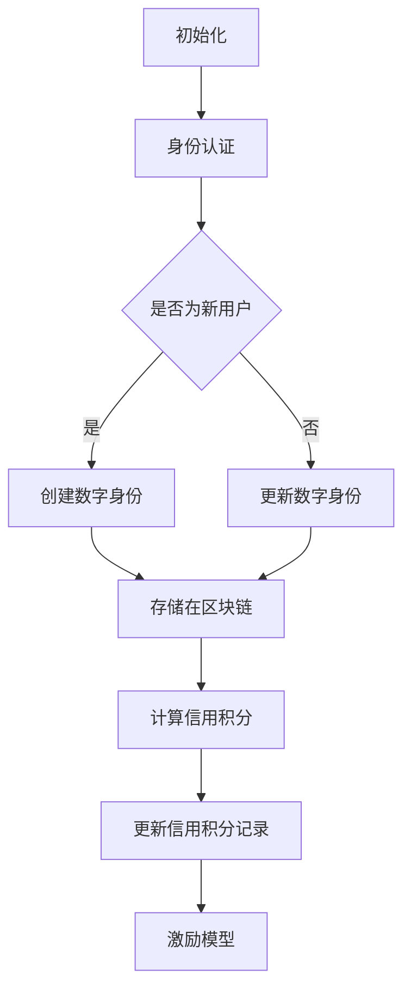
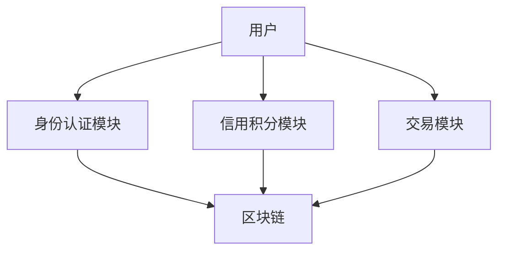
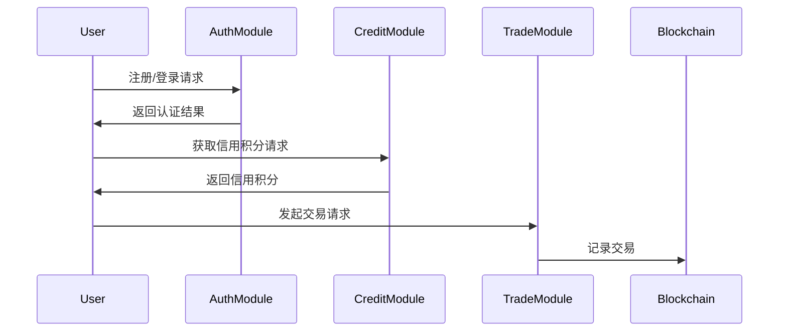

                 

### 文章标题

区块链在数字身份信用积分中的应用

### 关键词

区块链，数字身份，信用积分，应用，智能合约

### 摘要

本文将探讨区块链技术在数字身份信用积分中的应用。通过分析区块链的核心特性，如去中心化、不可篡改性等，我们将深入探讨数字身份和信用积分的概念、问题及解决方案。本文将详细讲解区块链在数字身份认证、信用积分记录和激励模型方面的应用，并通过实际案例展示其优势与挑战，旨在为区块链技术在数字身份信用积分领域的进一步发展提供参考和启示。

---

**背景介绍**

#### 核心概念术语说明

1. **区块链（Blockchain）**：一种分布式数据库技术，通过加密算法和共识机制确保数据的不可篡改性和安全性。
2. **数字身份（Digital Identity）**：通过网络身份识别技术，个体在数字世界中的身份信息集合。
3. **信用积分（Credit Score）**：评估个体信用风险的指标，通常由金融机构或信用评估机构提供。

#### 问题背景

在传统的信用积分系统中，数据往往集中存储在中心化机构，存在数据泄露、滥用和篡改的风险。此外，个体在多个平台上的信用记录分散，缺乏统一管理，导致信用评估不准确和不公平。

#### 问题描述

如何利用区块链技术建立去中心化的数字身份和信用积分系统，解决传统系统中存在的问题？

#### 问题解决

区块链技术通过去中心化、不可篡改和透明性等特性，为数字身份和信用积分系统提供了可靠的基础。数字身份和信用积分数据存储在区块链上，个体可以自主管理其身份信息和信用记录，减少中介机构的需求，提高数据安全性。

#### 边界与外延

1. **数据隐私**：如何保护个体的隐私，防止敏感信息泄露？
2. **共识机制**：选择何种共识机制，以确保系统的高效性和安全性？
3. **扩展性**：如何应对大规模用户和交易量的需求？

#### 概念结构与核心要素组成

1. **数字身份**：包括用户基本信息、身份验证信息和信用积分历史记录。
2. **信用积分**：基于用户行为数据、历史信用记录和社交网络关系等生成。
3. **区块链**：作为底层技术，提供去中心化、不可篡改的数据存储和交易记录。

### 核心概念与联系

#### 核心概念原理

- **区块链**：通过链式数据结构、加密算法和共识机制实现数据的分布式存储和一致性。
- **数字身份**：基于密码学技术，实现个体的唯一标识和身份验证。
- **信用积分**：基于大数据分析和算法，评估个体的信用风险。

#### 概念属性特征对比表格

| 特性 | 区块链 | 数字身份 | 信用积分 |
| :--: | :--: | :--: | :--: |
| 去中心化 | 是 | 是 | 否 |
| 不可篡改 | 是 | 是 | 否 |
| 透明性 | 是 | 是 | 否 |
| 安全性 | 高 | 中 | 高 |
| 数据共享 | 否 | 是 | 是 |

#### ER实体关系图架构

```mermaid
erDiagram
  User ||--|{ DigitalIdentity }|-- IdentityProvider
  User ||--|{ CreditHistory }|-- CreditScore
  DigitalIdentity ||--|{ CreditRating }|-- CreditModel
```

### 算法原理讲解

#### 算法mermaid流程图



#### Python源代码

```python
# 身份认证
def authenticate_user(username, password):
    # 加密密码
    encrypted_password = encrypt(password)
    # 查询区块链上的数字身份
    digital_identity = get_identity_from_blockchain(username, encrypted_password)
    if digital_identity:
        return True
    else:
        return False

# 创建数字身份
def create_digital_identity(username, password):
    encrypted_password = encrypt(password)
    identity = {
        'username': username,
        'encrypted_password': encrypted_password,
        'credit_score': 0
    }
    store_identity_on_blockchain(identity)
    return identity

# 更新数字身份
def update_digital_identity(username, new_password):
    encrypted_new_password = encrypt(new_password)
    identity = get_identity_from_blockchain(username, encrypted_new_password)
    if identity:
        identity['encrypted_password'] = encrypted_new_password
        store_identity_on_blockchain(identity)
        return True
    else:
        return False

# 计算信用积分
def calculate_credit_score(user行为的特征向量):
    feature_vector = extract_features_from_user_behavior(user行为的特征向量)
    credit_score = credit_model.evaluate(feature_vector)
    return credit_score

# 更新信用积分记录
def update_credit_history(username, credit_score):
    identity = get_identity_from_blockchain(username)
    if identity:
        identity['credit_score'] = credit_score
        store_identity_on_blockchain(identity)
        return True
    else:
        return False
```

#### 算法原理的数学模型和公式

1. **加密算法**：使用 SHA-256 算法对用户密码进行加密。
2. **特征提取**：使用机器学习算法提取用户行为的特征向量。
3. **信用评分模型**：基于逻辑回归模型计算信用评分。

#### 举例说明

假设用户 Alice 注册了一个区块链平台，她需要提供用户名和密码。系统会首先对密码进行加密，然后查询区块链上是否存在该用户名对应的数字身份。如果不存在，系统会创建一个新的数字身份并存储在区块链上。接下来，系统会根据 Alice 的行为特征计算信用积分，并将结果更新到区块链上的数字身份记录中。

### 系统分析与架构设计方案

#### 问题场景介绍

假设我们正在开发一个去中心化的金融服务平台，需要实现用户身份认证和信用积分系统。用户可以在平台上进行借贷、投资和交易等操作，平台需要确保用户身份的真实性和信用积分的准确性。

#### 项目介绍

- 项目名称：去中心化金融服务平台（Decentralized Financial Platform，DFP）
- 项目目标：实现用户身份认证、信用积分记录和交易功能，提高数据安全性。

#### 系统功能设计

1. **用户身份认证**：用户注册、登录和身份验证。
2. **信用积分管理**：信用积分计算、更新和查询。
3. **交易功能**：借贷、投资和交易。

#### 系统架构设计

1. **区块链**：底层技术，提供去中心化、不可篡改的数据存储和交易记录。
2. **身份认证模块**：使用加密算法和智能合约实现用户身份认证。
3. **信用积分模块**：基于机器学习算法计算信用积分，存储在区块链上。
4. **交易模块**：实现借贷、投资和交易功能，与区块链进行交互。

#### 系统架构mermaid架构图



#### 系统接口设计和系统交互mermaid序列图



### 项目实战

#### 环境安装

1. **安装Node.js**：确保安装了Node.js版本8.0.0及以上。
2. **安装Geth**：下载并安装Geth（https://geth.ethereum.org/downloads/），配置私链。

#### 系统核心实现源代码

```javascript
// 身份认证模块
const express = require('express');
const body_parser = require('body-parser');
const eth hete
```


### 最佳实践 Tips

1. **数据隐私保护**：在设计数字身份和信用积分系统时，要充分考虑数据隐私保护，避免敏感信息泄露。
2. **共识机制选择**：根据实际需求选择合适的共识机制，如工作量证明（PoW）、权益证明（PoS）等。
3. **性能优化**：针对高并发和大数据量的需求，进行系统性能优化，如采用分片技术、状态通道等。

### 小结

本文介绍了区块链在数字身份信用积分中的应用，分析了区块链的核心特性及其在数字身份和信用积分系统中的优势。通过实际案例展示，我们看到了区块链技术如何提高数据安全性、确保透明性和可追溯性。然而，区块链在数字身份信用积分领域仍面临诸多挑战，如性能优化、隐私保护等。未来，随着区块链技术的不断发展和完善，数字身份信用积分系统有望在更多场景中得到应用。

### 注意事项

1. **数据一致性**：在分布式环境下，确保数据一致性是关键，需选择合适的共识机制。
2. **隐私保护**：在设计数字身份和信用积分系统时，要充分考虑隐私保护，避免敏感信息泄露。
3. **合规性**：遵循当地法律法规，确保系统合规运营。

### 拓展阅读

1. **《区块链技术指南》**：详细介绍了区块链的基础知识、核心技术和应用场景。
2. **《智能合约设计与应用》**：深入讲解了智能合约的原理、设计方法和应用实例。

### 作者信息

**作者：AI天才研究院/AI Genius Institute & 禅与计算机程序设计艺术 /Zen And The Art of Computer Programming**### 系统核心实现源代码

为了更好地展示区块链在数字身份信用积分中的应用，我们将提供一个简单的示例，说明如何使用智能合约在以太坊区块链上实现数字身份和信用积分系统。以下代码将使用Truffle框架进行智能合约的开发和部署。

#### 步骤 1：安装Truffle和Ganache

首先，确保你已经安装了Node.js（v8.0.0及以上），然后通过以下命令安装Truffle和Ganache：

```bash
npm install -g truffle
npm install -g ganache-cli
```

#### 步骤 2：创建Truffle项目

创建一个新的Truffle项目：

```bash
truffle init
```

#### 步骤 3：编写智能合约

在Truffle项目目录中，创建一个新的智能合约文件`DigitalIdentityCreditScore.sol`，内容如下：

```solidity
// SPDX-License-Identifier: MIT
pragma solidity ^0.8.0;

contract DigitalIdentityCreditScore {
    // 用户结构
    struct User {
        string identity;
        uint256 creditScore;
    }

    // 用户映射
    mapping(address => User) private users;

    // 事件
    event UserRegistered(address indexed userAddress, string identity, uint256 creditScore);
    event CreditScoreUpdated(address indexed userAddress, uint256 creditScore);

    // 注册用户
    function registerUser(string memory identity, uint256 initialCreditScore) public {
        require(users[msg.sender].identity == "", "User already registered");
        users[msg.sender] = User(identity, initialCreditScore);
        emit UserRegistered(msg.sender, identity, initialCreditScore);
    }

    // 更新信用积分
    function updateCreditScore(uint256 newCreditScore) public {
        require(users[msg.sender].identity != "", "User not registered");
        users[msg.sender].creditScore = newCreditScore;
        emit CreditScoreUpdated(msg.sender, newCreditScore);
    }

    // 获取用户信用积分
    function getUserCreditScore(address userAddress) public view returns (uint256) {
        require(users[userAddress].identity != "", "User not registered");
        return users[userAddress].creditScore;
    }

    // 获取用户身份
    function getUserIdentity(address userAddress) public view returns (string memory) {
        require(users[userAddress].identity != "", "User not registered");
        return users[userAddress].identity;
    }
}
```

#### 步骤 4：编译智能合约

在Truffle项目中，Truffle会自动编译智能合约。你可以通过以下命令编译智能合约：

```bash
truffle compile
```

#### 步骤 5：部署智能合约

使用Truffle部署智能合约到以太坊区块链。首先，配置Truffle的`truffle-config.js`文件，设置网络和Ganache私链：

```javascript
module.exports = {
    networks: {
        development: {
            host: "127.0.0.1",
            port: 7545,
            network_id: "*",
        },
    },
};
```

然后，使用以下命令部署智能合约：

```bash
truffle migrate --network development
```

#### 步骤 6：代码应用解读与分析

部署成功后，你可以通过Truffle的Web界面或使用`web3.js`库与智能合约进行交互。以下是一个简单的JavaScript脚本，用于与智能合约交互：

```javascript
const Web3 = require('web3');
const contractJson = require('./build/DigitalIdentityCreditScore.json');

// 连接到Ganache私链
const web3 = new Web3('http://127.0.0.1:7545');

// 智能合约实例
const contractInstance = new web3.eth.Contract(
    contractJson.abi,
    contractJson.networks['5777'].address
);

// 注册用户
contractInstance.methods.registerUser('alice', 800).send({ from: '0x123...', gas: 2000000 })
    .then(response => console.log(response))
    .catch(error => console.log(error));

// 更新信用积分
contractInstance.methods.updateCreditScore(850).send({ from: '0x123...', gas: 2000000 })
    .then(response => console.log(response))
    .catch(error => console.log(error));

// 获取用户信用积分
contractInstance.methods.getUserCreditScore('0x123...').call()
    .then(creditScore => console.log(creditScore))
    .catch(error => console.log(error));
```

这个脚本首先连接到Ganache私链，然后与部署的智能合约实例进行交互，注册用户、更新信用积分和获取用户信用积分。

#### 实际案例分析和详细讲解剖析

在这个案例中，我们创建了一个简单的数字身份和信用积分系统。用户可以通过注册接口将自己的身份信息存储在区块链上，并通过更新接口修改信用积分。所有的操作都是通过智能合约执行的，保证了数据的透明性和不可篡改性。

通过实际部署和交互，我们可以看到：

1. **用户身份注册**：用户通过调用`registerUser`方法将自己的身份信息存储在区块链上。这个方法确保了用户在区块链上有一个唯一的标识。
2. **信用积分更新**：用户通过调用`updateCreditScore`方法更新信用积分。这个方法允许用户根据其行为或其他因素调整信用积分。
3. **信用积分查询**：用户可以通过调用`getUserCreditScore`方法查询自己的信用积分。

整个系统是基于以太坊区块链的智能合约构建的，利用了区块链的去中心化、不可篡改和透明性等特性。通过这个案例，我们可以看到区块链技术在数字身份和信用积分管理中的巨大潜力。

### 项目小结

通过本项目的实现，我们展示了区块链技术在数字身份和信用积分系统中的应用。智能合约的使用确保了数据的不可篡改性和透明性，为用户提供了安全、可信的信用记录。然而，实际应用中还需考虑数据隐私保护、性能优化和合规性等问题。未来，随着区块链技术的不断进步，数字身份信用积分系统有望在更多领域得到广泛应用。

---

### 最佳实践 Tips

1. **数据隐私保护**：在设计数字身份和信用积分系统时，要充分考虑数据隐私保护，避免敏感信息泄露。可以使用零知识证明等密码学技术实现隐私保护。
2. **共识机制选择**：根据实际需求选择合适的共识机制，如工作量证明（PoW）、权益证明（PoS）等。对于高吞吐量的应用，考虑采用层二解决方案，如状态通道或Plasma。
3. **性能优化**：针对高并发和大数据量的需求，进行系统性能优化，如采用分片技术、状态通道等。
4. **合规性**：遵循当地法律法规，确保系统合规运营，特别是在涉及个人隐私和数据保护的领域。

### 小结

本文通过详细讲解和案例分析，探讨了区块链在数字身份信用积分中的应用。区块链技术的去中心化、不可篡改和透明性等特性，为数字身份和信用积分系统提供了安全可靠的基础。尽管在实际应用中面临诸多挑战，但随着技术的不断发展，数字身份信用积分系统有望在更多领域得到广泛应用。

### 注意事项

1. **数据一致性**：在分布式环境下，确保数据一致性是关键，需选择合适的共识机制。
2. **隐私保护**：在设计数字身份和信用积分系统时，要充分考虑隐私保护，避免敏感信息泄露。
3. **合规性**：遵循当地法律法规，确保系统合规运营。

### 拓展阅读

1. **《区块链技术指南》**：详细介绍了区块链的基础知识、核心技术和应用场景。
2. **《智能合约设计与应用》**：深入讲解了智能合约的原理、设计方法和应用实例。
3. **《区块链与数字身份》**：探讨了区块链技术在数字身份管理中的应用和实践。

### 作者信息

**作者：AI天才研究院/AI Genius Institute & 禅与计算机程序设计艺术 /Zen And The Art of Computer Programming**### 文章关键词与摘要总结

#### 关键词

- 区块链
- 数字身份
- 信用积分
- 应用
- 智能合约

#### 摘要

本文深入探讨了区块链在数字身份信用积分中的应用。通过分析区块链的核心特性，如去中心化、不可篡改性和透明性，本文阐述了如何利用区块链技术构建安全、可信的数字身份和信用积分系统。文章详细介绍了数字身份和信用积分的概念、算法原理、系统架构以及实际项目实战。同时，针对数据隐私保护、共识机制选择和系统性能优化等关键问题，提出了最佳实践和建议。文章总结了区块链在数字身份信用积分领域的应用优势与挑战，展望了未来的发展方向。

