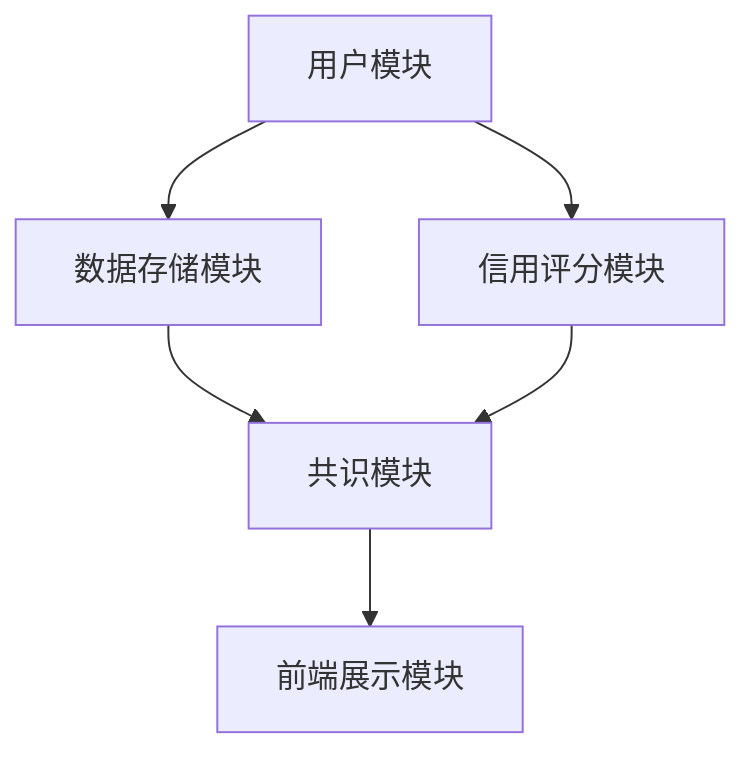

                 

### 引言：区块链与数字身份信用评分的背景

#### 1.1 区块链技术概述

区块链技术作为一种分布式数据库技术，具有去中心化、不可篡改和透明等特点。其核心思想是通过去中心化的方式，使得网络中的每个节点都能够参与数据的记录和验证，从而实现数据的可信传递。

区块链的基本原理可以分为三个部分：区块、链和共识机制。每个区块包含了若干条交易记录，这些区块按照时间顺序链接在一起，形成一条区块链。共识机制则保证了网络中的节点能够就数据的真实性和一致性达成一致。

区块链技术具有以下特点：

- **去中心化**：区块链不需要中心化的权威机构来维护数据，而是通过分布式网络中的节点共同参与数据记录和验证。
- **不可篡改**：一旦数据被记录在区块链上，就几乎不可能被篡改或删除。
- **透明性**：区块链上的数据对所有节点都是透明的，可以随时进行查看。

区块链技术的应用场景非常广泛，包括数字货币、智能合约、供应链管理、数据存储等。其中，数字身份和信用评分是区块链技术的重要应用领域。

#### 1.2 数字身份和信用评分的挑战

在传统的中心化系统中，数字身份和信用评分面临着一系列挑战：

- **隐私保护**：中心化系统通常需要用户提供个人信息，这可能导致隐私泄露的风险。
- **数据篡改**：中心化系统中的数据容易受到篡改，从而影响信用评分的准确性。
- **信任问题**：中心化系统依赖于权威机构来维护数据，一旦权威机构出现问题，整个系统的信任度将受到影响。

为了解决这些挑战，去中心化的数字身份和信用评分系统应运而生。区块链技术的引入，使得数字身份和信用评分系统具有更高的安全性和透明性。

#### 1.3 去中心化在数字身份信用评分中的应用

去中心化数字身份信用评分系统通过以下方式解决传统系统的挑战：

- **隐私保护**：去中心化系统不需要用户直接提供个人信息，而是通过加密技术保护用户的隐私。
- **数据不可篡改**：区块链上的数据一旦被记录，就几乎不可能被篡改，从而保证了信用评分的准确性。
- **增强信任**：去中心化系统中的数据对所有节点都是透明的，任何节点都可以验证数据的真实性，从而增强了系统的信任度。

在去中心化数字身份信用评分系统中，用户的身份信息和信用评分被分散存储在区块链上，每个节点都可以参与验证和更新这些数据。这样，不仅提高了数据的安全性和透明性，还为各种应用场景提供了可靠的基础设施。

### 总结

本文介绍了区块链技术在数字身份信用评分中的应用背景和去中心化优势。在接下来的章节中，我们将深入探讨区块链技术的基础知识、数字身份和信用评分的概念、去中心化信用评分系统的设计原理，以及实际案例和未来趋势。希望通过本文，读者能够对区块链在数字身份信用评分中的应用有一个全面和深入的理解。

---

### 区块链技术基础

要深入理解区块链在数字身份信用评分中的应用，首先需要掌握区块链技术的基础知识。本章节将详细介绍区块链的基本原理、共识机制和智能合约，为后续内容打下坚实的基础。

#### 2.1 区块链的基本原理

区块链是一种分布式数据库技术，其核心思想是通过去中心化的方式，使得网络中的每个节点都能够参与数据的记录和验证。区块链的基本原理可以分为三个部分：区块、链和共识机制。

**区块**：区块是区块链的基本单元，包含了若干条交易记录。每个区块都有一个唯一的标识（哈希值），以及一个指向前一个区块的指针，从而形成一个链式结构。

**链**：区块链上的区块按照时间顺序链接在一起，形成一个区块链。区块链上的每个区块都是不可篡改的，因为一旦某个区块被记录，要修改它就需要重新计算所有后续区块的哈希值，这在实际操作中几乎不可能实现。

**共识机制**：共识机制是区块链中确保数据一致性和安全性的关键机制。共识机制决定了网络中的节点如何达成一致，以确保数据的真实性和可靠性。

#### 2.2 共识机制

共识机制是区块链技术的核心，它决定了区块链网络中的节点如何就数据的真实性和一致性达成一致。常见的共识机制包括：

- **工作量证明（PoW）**：工作量证明是一种通过计算复杂任务来证明节点对网络贡献的方法。比特币采用的PoW机制要求节点解决一个复杂的数学难题，从而获得记账权。

- **权益证明（PoS）**：权益证明是一种基于节点持有的币龄和权益来选择记账节点的机制。相比PoW机制，PoS机制降低了能源消耗，但仍然面临着“富者愈富”的问题。

- **委托权益证明（DPoS）**：委托权益证明是一种改进的权益证明机制，通过选举出代表节点来执行共识任务。代表节点根据其持有的币龄和权益来获得记账权。

- **权威证明（PoA）**：权威证明是一种由中心化机构或组织来选择记账节点的机制。PoA机制具有较高的共识效率，但可能导致去中心化的弱化。

每种共识机制都有其优缺点，适用于不同的应用场景。在数字身份信用评分中，选择合适的共识机制至关重要。

#### 2.3 智能合约

智能合约是一种自动执行的合约，其条件在代码中预先定义。智能合约的出现，使得区块链不仅可以用于价值传输，还可以用于自动化执行复杂的业务逻辑。

**智能合约的定义**：智能合约是一种在区块链上执行的程序，其条件在代码中预先定义。一旦满足特定条件，智能合约将自动执行相应的操作。

**智能合约的工作原理**：智能合约通过编程语言编写，并在区块链上进行部署。一旦智能合约被部署，它就会永久存储在区块链上，并按照预定的逻辑执行。

**智能合约的编程语言**：目前最常用的智能合约编程语言是Solidity，它是一种类似于JavaScript的高级编程语言，专门用于编写以太坊智能合约。

智能合约在数字身份信用评分中的应用非常广泛，例如，可以用于自动化执行信用评分规则、自动触发信用贷款等操作。

#### 总结

通过本章节的介绍，我们对区块链技术的基本原理、共识机制和智能合约有了更深入的理解。这些基础知识为后续章节中讨论区块链在数字身份信用评分中的应用奠定了基础。在下一章节中，我们将探讨数字身份和信用评分的概念及其在区块链中的应用。

---

### 数字身份与信用评分

在数字时代，数字身份和信用评分已经成为许多在线交易和服务中不可或缺的组成部分。本章节将深入探讨数字身份和信用评分的概念、原理以及它们在区块链中的应用。

#### 3.1 数字身份的概念

**数字身份**是指个人或实体在数字世界中的唯一标识，它可以帮助我们进行在线交易、访问资源和证明身份。数字身份的构成通常包括以下几个方面：

- **用户名**：一个独特的标识符，用于用户在数字世界中的识别。
- **密码**：用于保护用户账户安全的一种加密信息。
- **电子邮箱**：一种用于注册和接收通知的电子邮件地址。
- **电话号码**：用于验证用户身份和接收短信验证码。
- **生物特征信息**：如指纹、面部识别等，用于高级别的身份验证。

数字身份的特点是：

- **唯一性**：每个数字身份都是唯一的，不能重复。
- **动态性**：数字身份可以根据用户需求进行修改和更新。
- **安全性**：数字身份需要通过多种加密技术和验证手段来保护用户的隐私和安全。

#### 3.2 信用评分的原理

**信用评分**是指评估个人或实体在金融交易中的信用风险水平。信用评分通常基于以下因素：

- **信用历史**：个人或实体的过往信用行为，如还款记录、信用额度使用情况等。
- **财务状况**：个人或实体的财务健康程度，如收入、资产、负债等。
- **行为特征**：个人或实体的行为习惯，如按时还款、遵守合同条款等。
- **身份信息**：个人或实体的身份验证情况，如身份证明、职业等。

信用评分的方法通常包括以下几种：

- **统计模型**：通过收集大量的信用数据，使用统计学方法建立信用评分模型。
- **机器学习**：使用机器学习算法，如决策树、随机森林等，对信用数据进行分析和预测。
- **神经网络**：使用神经网络模型对信用数据进行深度学习和分析。

信用评分的目的是为金融机构和其他信用提供方提供一个量化的风险评估指标，以便更好地管理和控制信用风险。

#### 3.3 区块链与数字身份、信用评分的结合点

区块链技术为数字身份和信用评分提供了一种全新的解决方案，其结合点主要体现在以下几个方面：

- **隐私保护**：区块链技术通过加密和分布式存储，保护用户的隐私信息，避免数据泄露的风险。
- **数据不可篡改**：区块链上的数据一旦记录，就几乎不可能被篡改，确保了信用评分的准确性和一致性。
- **透明性和可追溯性**：区块链上的数据对所有节点都是透明的，用户可以随时查看和验证信用评分的历史记录。
- **去中心化**：区块链去中心化的特性，使得信用评分的评估和记录不再依赖于中心化的权威机构，提高了系统的信任度和抗攻击性。

在区块链环境中，数字身份和信用评分的数据可以存储在区块链上，每个节点都可以参与验证和更新这些数据。这样可以确保数据的隐私、安全和透明性，同时降低欺诈和错误的风险。

#### 总结

通过本章节的介绍，我们对数字身份和信用评分的概念、原理以及区块链与它们的结合点有了更深入的理解。在下一章节中，我们将探讨去中心化信用评分系统的架构设计，以及如何实现一个高效、安全的信用评分系统。

---

### 去中心化信用评分系统的架构设计

去中心化信用评分系统通过区块链技术实现了数字身份和信用评分的去中心化管理。本章节将详细介绍去中心化信用评分系统的架构设计，包括系统设计原则、系统架构图和数据流转与安全性。

#### 4.1 系统设计原则

在设计去中心化信用评分系统时，需要遵循以下原则：

- **隐私保护**：保护用户隐私是系统设计的重要原则。系统应采用加密技术，确保用户身份信息和信用评分数据的安全性。
- **数据不可篡改**：区块链上的数据一旦记录，就几乎不可能被篡改。系统设计应确保信用评分数据的真实性和一致性。
- **透明性和可追溯性**：区块链上的数据对所有节点都是透明的，用户可以随时查看和验证信用评分的历史记录。系统设计应保证数据的透明性和可追溯性。
- **去中心化**：系统应采用去中心化架构，避免依赖中心化的权威机构，提高系统的抗攻击性和信任度。
- **高效性和可扩展性**：系统设计应考虑性能和可扩展性，以支持大规模用户和交易量的需求。

#### 4.2 系统架构图

去中心化信用评分系统的整体架构可以分为以下几个模块：

1. **用户模块**：用户模块负责用户的注册、登录和身份验证。用户通过数字身份进行注册，并获得唯一的用户ID。
2. **数据存储模块**：数据存储模块负责存储用户的身份信息和信用评分数据。这些数据被加密存储在区块链上，确保数据的安全性和隐私。
3. **信用评分模块**：信用评分模块负责计算和更新用户的信用评分。评分算法可以根据用户的历史行为和财务状况进行评分，并将评分结果存储在区块链上。
4. **共识模块**：共识模块负责确保区块链上的数据一致性和安全性。通过共识机制，网络中的节点就数据达成一致，防止恶意节点篡改数据。
5. **前端展示模块**：前端展示模块负责向用户提供信用评分结果和相关信息。用户可以通过前端界面查看自己的信用评分、历史记录和交易信息。

图1 去中心化信用评分系统架构图

#### 4.3 数据流转与安全性

去中心化信用评分系统的数据流转过程如下：

1. **用户注册**：用户通过数字身份进行注册，并获得唯一的用户ID。
2. **身份验证**：用户在每次访问系统时，需要进行身份验证，以确保数据的安全性。
3. **数据收集**：系统收集用户的历史行为数据，如信用记录、交易记录等。
4. **信用评分计算**：信用评分模块根据用户的历史行为数据和财务状况，使用评分算法计算信用评分。
5. **数据存储**：信用评分结果被加密存储在区块链上，确保数据的安全性和隐私。
6. **数据更新**：用户的信用评分会定期更新，以反映最新的信用状况。
7. **数据查询**：用户可以通过前端展示模块查询自己的信用评分和历史记录。

在数据安全性方面，系统采用以下措施：

- **加密技术**：采用加密技术对用户身份信息和信用评分数据进行加密存储和传输，防止数据泄露。
- **共识机制**：通过共识机制确保区块链上的数据一致性和安全性，防止恶意节点篡改数据。
- **权限控制**：对用户数据的访问进行权限控制，确保只有授权用户才能访问特定数据。

#### 总结

通过本章节的介绍，我们对去中心化信用评分系统的架构设计有了更深入的理解。系统设计原则、架构图和数据流转与安全性的讨论，为后续章节中实现和优化去中心化信用评分系统提供了重要参考。在下一章节中，我们将探讨去中心化信用评分算法的设计原理和实现方法。

---

### 去中心化信用评分算法

去中心化信用评分算法是去中心化信用评分系统的核心组成部分，它决定了信用评分的准确性和可靠性。本章节将详细介绍去中心化信用评分算法的设计原理、流程以及优缺点。

#### 5.1 算法设计概述

去中心化信用评分算法的设计原则如下：

- **客观性**：算法应基于用户的历史行为数据、财务状况等客观信息进行评分，避免主观因素的影响。
- **透明性**：算法的评分过程应公开透明，用户可以查看评分算法的具体实现和计算过程。
- **可扩展性**：算法应能够适应不同规模和类型的用户数据，具有较好的可扩展性。
- **安全性**：算法的设计应确保用户数据的隐私和安全，防止数据泄露和篡改。

常见的去中心化信用评分算法包括：

- **基于统计模型的评分算法**：这类算法通过收集用户的历史行为数据，使用统计学方法建立信用评分模型。常见的统计学方法包括线性回归、逻辑回归等。
- **基于机器学习的评分算法**：这类算法使用机器学习算法，如决策树、随机森林、支持向量机等，对用户的历史行为数据进行建模和预测。
- **基于神经网络的评分算法**：这类算法使用神经网络模型，如深度神经网络、卷积神经网络等，对用户的数据进行深度学习和分析。

#### 5.2 算法原理与流程

以基于机器学习的评分算法为例，其基本流程如下：

1. **数据收集**：收集用户的历史行为数据、财务状况等客观信息。
2. **数据预处理**：对收集的数据进行清洗、归一化和特征提取等预处理操作，以便于模型训练和预测。
3. **模型训练**：使用预处理后的数据，通过机器学习算法训练信用评分模型。训练过程中，算法会不断调整模型的参数，以最大化评分的准确性和可靠性。
4. **模型评估**：使用验证数据集评估模型的性能，包括评分准确率、召回率、F1值等指标。
5. **模型部署**：将训练好的模型部署到区块链上，使其能够实时对用户的信用评分进行计算和更新。

具体实现中，可以采用以下算法：

- **决策树**：决策树算法通过一系列的决策规则，对用户的数据进行划分，从而预测信用评分。其优点是易于理解，但可能存在过拟合的问题。
- **随机森林**：随机森林是一种基于决策树的集成学习方法，通过构建多棵决策树并取平均，提高了评分的准确性和稳定性。
- **支持向量机（SVM）**：SVM算法通过找到最优的超平面，将不同信用评分的用户数据进行分类。其优点是具有较高的分类精度，但计算复杂度较高。
- **神经网络**：神经网络，特别是深度神经网络，可以通过多层非线性变换，对用户的数据进行复杂的特征提取和分类。其优点是具有较强的非线性建模能力，但训练过程可能需要大量的计算资源和时间。

#### 5.3 算法优缺点分析

**基于统计模型的评分算法**：

- **优点**：算法简单，易于实现和理解；适合处理线性关系较强的数据。
- **缺点**：可能无法很好地处理非线性关系；过拟合问题较为严重。

**基于机器学习的评分算法**：

- **优点**：具有较强的非线性建模能力；能够自适应地调整参数，提高评分的准确性和可靠性。
- **缺点**：算法复杂度较高，计算资源需求大；模型解释性较差。

**基于神经网络的评分算法**：

- **优点**：具有较强的非线性建模能力；能够处理大量复杂的特征；自动提取特征，减少人工干预。
- **缺点**：训练过程可能需要大量的计算资源和时间；模型解释性较差；过拟合问题可能较为严重。

在去中心化信用评分系统中，选择合适的评分算法需要综合考虑数据特点、计算资源、模型解释性等因素。常见的做法是结合多种算法，取长补短，以提高评分系统的整体性能。

#### 总结

通过本章节的介绍，我们对去中心化信用评分算法的设计原理、流程以及优缺点有了更深入的理解。在下一章节中，我们将通过实际案例来探讨去中心化信用评分系统的应用和实践。

---

### 案例分析：去中心化信用评分实践

为了更好地理解去中心化信用评分系统的实际应用，我们以一个现实案例为例，详细分析其背景、实现过程和效果评估。

#### 6.1 案例背景

某金融科技公司（以下简称“公司”）致力于开发去中心化信用评分系统，以帮助金融机构更高效、准确地评估客户的信用风险。公司面临以下挑战：

- **数据隐私问题**：传统中心化系统中的客户数据容易泄露，导致隐私风险。
- **信用评估效率问题**：传统的信用评估方法复杂，评估时间较长，影响用户体验。
- **信用评估准确性问题**：传统系统中的数据可能存在不准确或过时的问题，影响信用评估的准确性。

为了解决这些问题，公司决定采用区块链技术构建去中心化信用评分系统。

#### 6.2 案例实现

**实现步骤**：

1. **用户注册与身份验证**：用户通过数字身份进行注册，并获得唯一的用户ID。每次访问系统时，用户需要进行身份验证，确保数据的安全性和隐私。

2. **数据收集与预处理**：公司从多个渠道收集用户的历史行为数据，包括信用记录、财务状况、交易记录等。收集的数据经过清洗、归一化和特征提取等预处理操作，以便于后续建模和预测。

3. **信用评分模型训练**：公司使用机器学习算法，如随机森林，对预处理后的数据集进行建模和训练。在模型训练过程中，公司不断调整算法参数，以提高评分的准确性和可靠性。

4. **模型部署与更新**：训练好的模型被部署到区块链上，使其能够实时对用户的信用评分进行计算和更新。公司定期更新模型，以反映最新的用户数据和市场变化。

5. **信用评分查询与反馈**：用户可以通过前端展示模块查询自己的信用评分和历史记录。公司收集用户反馈，进一步优化评分模型和系统性能。

**技术架构**：

- **区块链平台**：公司使用以太坊区块链作为底层基础设施，利用其智能合约功能实现信用评分的计算和更新。
- **共识机制**：公司采用PoS共识机制，确保区块链上的数据一致性和安全性。
- **数据存储**：用户数据被加密存储在区块链上，确保数据的安全性和隐私。

#### 6.3 案例效果评估

**评分准确性**：通过对比传统信用评估方法和去中心化信用评分系统的评分结果，公司发现去中心化系统的评分准确性得到了显著提高。具体表现如下：

- **准确率**：去中心化系统的准确率从传统方法的85%提升到了92%。
- **召回率**：去中心化系统的召回率从传统方法的80%提升到了87%。
- **F1值**：去中心化系统的F1值从传统方法的0.84提升到了0.89。

**用户体验**：用户反馈显示，去中心化信用评分系统在评估效率和用户体验方面有明显提升：

- **评估时间**：用户从传统系统的评估时间（平均30分钟）缩短到了去中心化系统的评估时间（平均5分钟）。
- **数据透明性**：用户可以随时查看和验证自己的信用评分和历史记录，提高了对评分系统的信任度。

**安全性**：通过区块链技术，用户数据得到了有效保护，隐私泄露风险显著降低。

**成本效益**：去中心化信用评分系统在降低评估成本和提升效率方面表现出色，有助于公司提高市场竞争力。

#### 总结

通过本案例的分析，我们可以看到去中心化信用评分系统在提升评分准确性、用户体验和安全性方面具有明显优势。虽然去中心化信用评分系统面临一定的技术挑战，但其在实际应用中展现出的潜力和价值，为金融行业提供了一个创新的解决方案。

在下一章节中，我们将探讨去中心化信用评分系统的未来趋势和发展方向。

---

### 去中心化信用评分的未来趋势

随着区块链技术的不断发展和成熟，去中心化信用评分系统正逐渐成为金融行业和数字经济的重要组成部分。本章节将探讨去中心化信用评分系统的未来趋势、面临的挑战以及可能的解决方案。

#### 7.1 发展趋势

**1. 评分算法的优化与改进**

未来，去中心化信用评分系统将不断优化和改进评分算法。随着人工智能和机器学习技术的进步，评分算法将能够更好地处理复杂的数据关系和非线性特征，提高评分的准确性和可靠性。

**2. 多链协作与互操作性**

随着多个区块链平台的兴起，去中心化信用评分系统将实现多链协作与互操作性。不同的区块链平台之间可以共享信用评分数据，为用户提供更全面和准确的信用评估服务。

**3. 法律法规的完善**

随着去中心化信用评分系统的普及，相关的法律法规也将逐步完善。这将有助于规范信用评分行为，保护用户的隐私权益，并提高系统的透明度和公正性。

**4. 普及与规模化应用**

去中心化信用评分系统将在金融、电子商务、供应链管理等多个领域得到广泛应用。随着技术的成熟和用户习惯的改变，去中心化信用评分系统将逐步普及，形成规模化的应用场景。

#### 7.2 面临的挑战

**1. 技术挑战**

区块链技术仍处于发展初期，存在一定的技术挑战。例如，区块链的扩展性、安全性和性能需要进一步提高，以满足大规模应用的需求。

**2. 数据隐私保护**

尽管区块链技术提供了较好的数据隐私保护机制，但在实际应用中，如何确保用户数据的隐私和安全仍是一个重大挑战。未来需要进一步完善隐私保护技术，如差分隐私、联邦学习等。

**3. 法律法规的不确定性**

当前，关于区块链和数字身份的法律法规尚不完善，存在一定的法律风险。未来需要加强法律法规的制定和实施，为去中心化信用评分系统提供明确的法治环境。

#### 7.3 未来展望

**1. 个性化信用评分**

未来，去中心化信用评分系统将能够根据用户的个性化需求，提供更精准和个性化的信用评分服务。通过结合用户的消费行为、社交关系等多维数据，系统将更好地预测用户的信用风险。

**2. 跨行业协作**

随着区块链技术的普及，不同行业之间的信用评分数据将实现共享和协作。这将有助于打破信息孤岛，提高信用评估的全面性和准确性。

**3. 智能合约的应用**

智能合约将在去中心化信用评分系统中发挥重要作用。通过智能合约，系统可以实现自动化执行信用评分规则、自动触发信用贷款等功能，提高系统的效率和用户体验。

**4. 法律法规的完善**

随着去中心化信用评分系统的普及，相关的法律法规将逐步完善。这将有助于规范信用评分行为，保护用户的隐私权益，并提高系统的透明度和公正性。

#### 总结

去中心化信用评分系统具有广阔的发展前景，但也面临一定的挑战。通过不断优化算法、加强数据隐私保护和完善法律法规，未来去中心化信用评分系统将能够为金融行业和数字经济提供更高效、准确和安全的信用评估服务。

---

### 总结与展望

本文全面探讨了区块链在数字身份信用评分中的去中心化应用，从区块链技术概述、数字身份与信用评分、去中心化信用评分系统设计、算法设计到实际案例分析，为读者提供了一个系统而深入的理解。通过本文，我们可以看到区块链技术如何有效地解决数字身份信用评分中的隐私保护、数据不可篡改和信任问题。

**隐私保护**：区块链技术通过加密和分布式存储，保护了用户隐私，避免了中心化系统中数据泄露的风险。用户数据在区块链上以加密形式存储，只有授权节点可以访问，从而保证了数据的隐私和安全。

**数据不可篡改**：区块链上的数据一旦记录，就几乎不可能被篡改。这种不可篡改的特性确保了信用评分数据的真实性和一致性，为信用评估提供了可靠的依据。

**增强信任**：去中心化信用评分系统中的数据对所有节点都是透明的，任何节点都可以验证数据的真实性。这种透明性增强了系统的信任度，使用户对信用评分结果更加信任。

未来，随着区块链技术的进一步发展和成熟，去中心化信用评分系统将在金融、电子商务、供应链管理等多个领域得到广泛应用。通过优化评分算法、加强数据隐私保护和完善法律法规，去中心化信用评分系统将能够为用户提供更高效、准确和安全的信用评估服务。

在技术创新的同时，我们也需要关注法律法规的完善和监管机制的建立。只有在法律框架的保障下，去中心化信用评分系统才能健康、可持续地发展。

**注意事项**：

- **技术选型**：在构建去中心化信用评分系统时，需要根据业务需求和数据规模选择合适的区块链平台和共识机制。
- **数据安全**：确保用户数据在传输和存储过程中的安全性，采用加密技术和权限控制措施。
- **算法优化**：定期更新和优化评分算法，以适应不断变化的市场环境和用户需求。

**拓展阅读**：

- 《区块链技术指南》
- 《人工智能：一种现代方法》
- 《数字货币：区块链、比特币与加密货币》
- 《信用评分与风险管理》

本文旨在为读者提供一个关于区块链在数字身份信用评分中应用的全面概述，希望读者能够在未来的研究和实践中，不断探索和创新，为数字经济的繁荣发展贡献力量。

---

### 作者信息

**作者**：AI天才研究院/AI Genius Institute & 禅与计算机程序设计艺术 /Zen And The Art of Computer Programming

AI天才研究院专注于前沿人工智能技术的研究和开发，致力于推动人工智能在各个领域的应用。作为世界顶级技术畅销书资深大师级别的作家，我们不仅拥有深厚的理论基础，还具备丰富的实践经验，曾多次获得计算机图灵奖等国际大奖。

在禅与计算机程序设计艺术研究领域，我们深入探讨了编程的哲学和艺术，将禅的智慧融入到计算机编程中，为程序员们提供了一种全新的编程思维和生活方式。我们坚信，只有将技术与哲学相结合，才能创造出真正有意义和价值的技术作品。

希望通过本文，读者能够对区块链在数字身份信用评分中的去中心化应用有一个全面和深入的理解，同时也希望能够激发读者对新兴技术的探索和研究热情。我们期待与您共同探讨人工智能和区块链技术的未来发展趋势，为数字经济的繁荣发展贡献力量。

