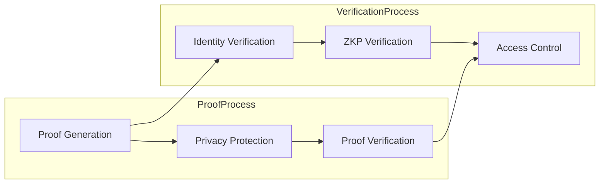
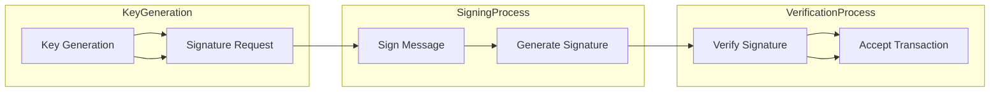
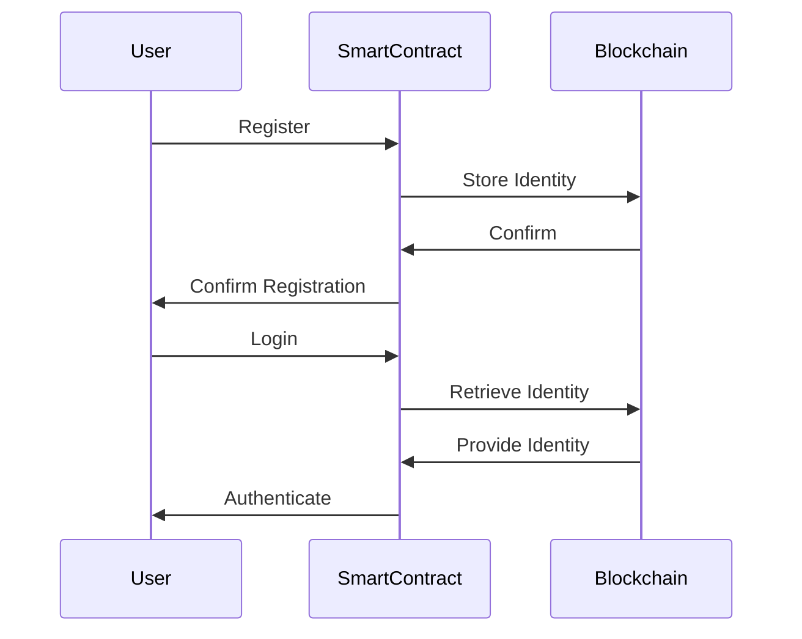
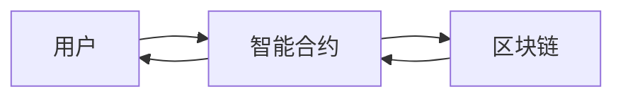
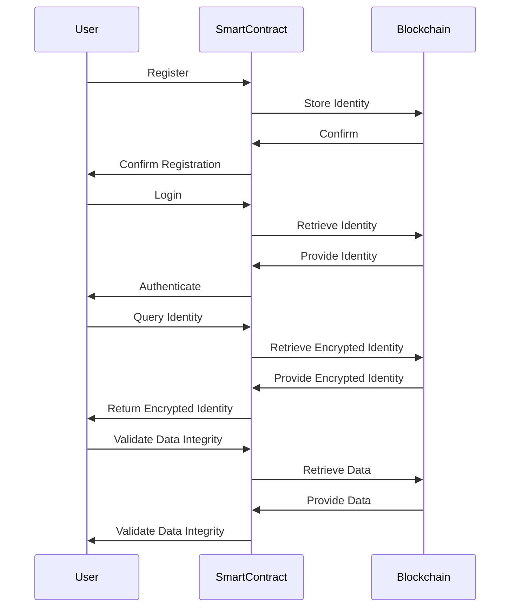

                 

# 《区块链在数字身份年龄段验证中的隐私保护》

## 关键词
区块链、数字身份验证、隐私保护、加密技术、智能合约、验证算法

## 摘要
本文深入探讨了区块链技术在数字身份验证中的隐私保护应用。通过分析加密技术、区块链技术、智能合约和验证算法等核心概念，以及它们之间的联系，本文揭示了如何利用区块链实现数字身份验证中的隐私保护。同时，本文通过实际案例分析了区块链技术在数字身份验证中的实际应用，并提出了相关的最佳实践和注意事项。

----------------------------------------------------------------

## 第一部分：引言

### 1.1 背景介绍

#### 1.1.1 问题背景

在信息化社会中，数字身份验证已成为各类应用场景的基石。然而，传统的数字身份验证方法在保护用户隐私方面存在明显缺陷。随着互联网和大数据技术的发展，用户的个人信息泄露和隐私侵犯事件频发，如何确保数字身份验证过程中的隐私保护成为了一个亟待解决的问题。

#### 1.1.2 问题描述

数字身份验证中的隐私保护问题主要表现在以下几个方面：

1. **用户身份信息泄露**：传统的身份验证方法往往需要用户提交完整身份信息，这些信息在传输和存储过程中容易泄露。
2. **用户隐私侵犯**：一些验证方法可能对用户的行为轨迹进行追踪，侵犯用户隐私。
3. **验证过程不透明**：一些验证过程缺乏透明性，用户无法了解身份信息如何被处理。

#### 1.1.3 问题解决

区块链技术以其去中心化、数据加密和智能合约等特性，为数字身份验证中的隐私保护提供了一种新的解决方案。通过区块链技术，可以实现用户身份信息的加密存储和传输，防止泄露和侵犯用户隐私。同时，区块链的透明性和不可篡改性也有助于提高验证过程的透明度。

#### 1.1.4 边界与外延

本文主要关注区块链在数字身份验证中的隐私保护应用，包括身份信息的加密存储、验证过程的透明性以及隐私保护的验证算法等。本文的目标是深入探讨区块链技术如何解决数字身份验证中的隐私保护问题，并提供实际应用案例。

#### 1.1.5 概念结构与核心要素组成

区块链在数字身份验证中的隐私保护主要包括以下几个核心要素：

1. **区块链平台**：作为存储和验证用户身份信息的基础设施。
2. **加密技术**：用于保护用户身份信息的隐私。
3. **智能合约**：用于定义和执行数字身份验证的隐私保护规则。
4. **验证算法**：用于实现隐私保护的数字身份验证。

### 1.2 本章小结

本章介绍了区块链在数字身份验证中的隐私保护背景、问题描述以及解决方案。接下来，我们将深入探讨区块链在数字身份验证中的核心概念与联系。

----------------------------------------------------------------

## 第二部分：核心概念与联系

### 2.1 加密技术

#### 2.1.1 加密技术原理

加密技术是保护数字信息隐私的基本手段。它通过将原始信息（明文）转换成不可读的格式（密文）来防止未经授权的访问。加密过程通常涉及两个基本操作：加密（encryption）和解密（decryption）。

- **加密**：将明文转换成密文的过程，通常需要加密算法和一个密钥。
- **解密**：将密文转换回明文的过程，通常需要解密算法和与加密时相同的密钥。

#### 2.1.2 加密技术分类

加密技术可以根据加密方法的不同分为以下几类：

- **对称加密**：加密和解密使用相同的密钥，如AES（Advanced Encryption Standard）。
- **非对称加密**：加密和解密使用不同的密钥，如RSA（Rivest-Shamir-Adleman）。
- **哈希算法**：用于生成数据的唯一数字指纹，如SHA-256。

#### 2.1.3 加密技术在数字身份验证中的应用

在数字身份验证中，加密技术主要用于以下方面：

1. **身份信息加密存储**：防止身份信息在数据库中被窃取。
2. **身份信息加密传输**：确保身份信息在传输过程中不被窃听。
3. **数字签名**：验证身份信息的完整性和真实性。

### 2.2 区块链技术

#### 2.2.1 区块链技术原理

区块链是一种去中心化的分布式账本技术，其核心思想是将数据分散存储在多个节点上，并通过加密和共识机制确保数据的完整性和安全性。

- **分布式账本**：所有数据分散存储在多个节点上，没有中心化的数据库。
- **加密**：数据在传输和存储过程中进行加密，防止篡改和泄露。
- **共识机制**：节点通过共识机制达成对数据的共识，确保数据一致性。

#### 2.2.2 区块链技术在数字身份验证中的应用

区块链技术在数字身份验证中的应用主要包括：

1. **身份信息分布式存储**：防止单一节点篡改身份信息。
2. **智能合约**：自动化执行身份验证协议，确保验证过程的透明性和不可篡改性。
3. **零知识证明**：实现隐私保护的数字身份验证。

### 2.3 智能合约

#### 2.3.1 智能合约原理

智能合约是区块链上的可编程协议，其功能类似于传统合同，但执行方式基于代码而非人工。智能合约通过预定义的规则和条件自动执行合同条款。

- **预定义规则**：智能合约在编写时定义了执行的条件和规则。
- **自动化执行**：当触发条件时，智能合约自动执行预定义的规则。

#### 2.3.2 智能合约在数字身份验证中的应用

智能合约在数字身份验证中的应用主要包括：

1. **身份信息验证**：自动验证用户的身份信息，确保验证过程的透明性和可靠性。
2. **隐私保护**：通过智能合约实现隐私保护的验证过程，防止用户隐私泄露。
3. **去中心化身份管理**：智能合约用于管理用户身份信息，实现去中心化的身份验证。

### 2.4 验证算法

#### 2.4.1 验证算法原理

验证算法是数字身份验证的核心，其目标是确保身份信息的真实性和可靠性。验证算法通常涉及身份信息的加密传输、验证和签名等过程。

- **加密传输**：确保身份信息在传输过程中不被窃取或篡改。
- **验证**：通过验证算法验证身份信息的真实性和完整性。
- **签名**：确保身份信息的来源可以追溯。

#### 2.4.2 常见的验证算法

常见的验证算法包括：

1. **基于椭圆曲线密码学的零知识证明**：实现隐私保护的数字身份验证。
2. **环签名**：确保身份信息的匿名性和不可追踪性。

### 2.5 概念属性特征对比表格

以下是加密技术、区块链技术、智能合约和验证算法的概念属性特征对比表格：

| 概念        | 特征                                                         |
| ----------- | ------------------------------------------------------------ |
| 加密技术    | 用于加密和解密数据，保护隐私                                  |
| 区块链技术  | 去中心化的分布式账本，保证数据安全性和一致性                  |
| 智能合约    | 基于代码的自动化协议，执行预定义规则，实现透明性和不可篡改性 |
| 验证算法    | 用于验证身份信息的真实性和完整性，保护隐私                    |

### 2.6 ER实体关系图架构

以下是数字身份验证系统中ER实体关系图的Mermaid流程图：

```mermaid
erDiagram
    User ||--|{ IdentityInformation }|-- IdentityService
    IdentityService ||--|{ ValidationAlgorithm }|-- VerificationService
    VerificationService ||--|{ SmartContract }|-- Blockchain
```

在上述ER图中，`User`实体关联到`IdentityInformation`实体，表示用户拥有身份信息。`IdentityService`负责处理身份信息，关联到`ValidationAlgorithm`实体，表示身份验证算法。`VerificationService`关联到`SmartContract`实体，表示智能合约用于自动化执行验证过程。最后，`SmartContract`关联到`Blockchain`实体，表示验证过程记录在区块链上。

----------------------------------------------------------------

## 第三部分：算法原理讲解

### 3.1 零知识证明算法

#### 3.1.1 算法原理

零知识证明（Zero-Knowledge Proof，简称ZKP）是一种密码学技术，允许证明者向验证者证明某个陈述是正确的，而无需泄露任何除该陈述之外的信息。零知识证明的核心思想是证明者能够证明他知道某个秘密信息，而不需要透露该秘密信息本身。

零知识证明算法通常包含以下三个步骤：

1. **证明生成**：证明者生成一个证明，证明他知道某个秘密信息。
2. **证明验证**：验证者验证证明的有效性，确认证明者确实知道秘密信息。
3. **隐私保护**：在整个证明过程中，验证者无法获取证明者的任何信息，除了知道证明者知道某个秘密信息之外。

#### 3.1.2 零知识证明在数字身份验证中的应用

在数字身份验证中，零知识证明可以用于以下场景：

1. **匿名登录**：用户可以证明自己拥有某个账户的访问权限，而不需要透露账户的具体信息。
2. **隐私保护**：当验证身份信息时，用户可以证明身份信息的真实性，而不需要透露完整的身份信息。
3. **数据完整性验证**：验证者可以确认数据在传输和存储过程中未被篡改，而不需要访问原始数据。

#### 3.1.3 零知识证明的Mermaid流程图

以下是零知识证明算法的Mermaid流程图：



在上述流程图中，`Proof Generation`步骤表示证明者生成零知识证明，`Privacy Protection`步骤确保证明过程中的隐私保护。`Proof Verification`步骤表示验证者验证证明的有效性。`Identity Verification`步骤表示验证者验证用户的身份信息，`ZKP Verification`步骤使用零知识证明验证身份信息，`Access Control`步骤根据验证结果控制用户访问权限。

### 3.2 环签名算法

#### 3.2.1 算法原理

环签名（Ring Signature）是一种隐私保护签名机制，它允许在一个预定义的签名者集合中匿名地生成签名。环签名的主要特点是，即使攻击者拥有所有签名者的公钥，也无法确定特定签名的来源。

环签名算法通常包含以下步骤：

1. **生成环签名密钥对**：每个签名者生成一对环签名密钥（签名密钥和验证密钥）。
2. **生成签名请求**：生成一个签名请求，包括待签名消息和签名者的环。
3. **生成环签名**：签名者使用自己的签名密钥和环生成一个环签名。
4. **验证环签名**：验证者使用签名者的验证密钥验证环签名的有效性。

#### 3.2.2 环签名在数字身份验证中的应用

在数字身份验证中，环签名可以用于以下场景：

1. **隐私保护的签名**：用户可以在不透露身份的情况下对交易进行签名。
2. **匿名投票**：确保投票过程的匿名性，防止选举舞弊。
3. **隐私保护的认证**：用户可以匿名地证明自己拥有特定身份。

#### 3.2.3 环签名的Mermaid流程图

以下是环签名算法的Mermaid流程图：



在上述流程图中，`Key Generation`步骤表示生成环签名密钥对，`Signature Request`步骤表示生成签名请求，`Sign Message`步骤表示生成环签名，`Verify Signature`步骤表示验证环签名，`Accept Transaction`步骤表示根据验证结果接受或拒绝交易。

### 3.3 Python源代码实现

以下是使用Python实现零知识证明算法和环签名算法的基本示例代码：

```python
# 零知识证明算法示例
from zk import ZeroKnowledgeProof

def generate_zkp_proof(private_key, message):
    zkp = ZeroKnowledgeProof(private_key)
    proof = zkp.generate_proof(message)
    return proof

def verify_zkp_proof(public_key, proof, message):
    zkp = ZeroKnowledgeProof(public_key)
    is_valid = zkp.verify_proof(proof, message)
    return is_valid

# 环签名算法示例
from ring_signature import RingSignature

def generate_ring_signature(private_key, message, ring_size):
    rs = RingSignature(private_key, ring_size)
    signature = rs.generate_signature(message)
    return signature

def verify_ring_signature(public_key, signature, message, ring_size):
    rs = RingSignature(public_key, ring_size)
    is_valid = rs.verify_signature(signature, message)
    return is_valid
```

在上述示例中，`ZeroKnowledgeProof`和`RingSignature`是分别用于零知识证明和环签名的类。`generate_zkp_proof`函数用于生成零知识证明，`verify_zkp_proof`函数用于验证零知识证明。`generate_ring_signature`函数用于生成环签名，`verify_ring_signature`函数用于验证环签名。

### 3.4 数学模型和公式

以下是零知识证明和环签名的数学模型和公式：

#### 零知识证明

1. **证明生成**：

   $$ 
   s = g^x \cdot h^y \cdot r^{-1} \pmod{p}
   $$
   
   其中，$g$ 和 $h$ 是系统参数，$x$ 和 $y$ 是证明者私有的秘密值，$r$ 是随机数。

2. **证明验证**：

   $$
   e(g, s) \cdot h^y \cdot r^{-1} \pmod{p} = e(g, h^x) \cdot g^y \cdot r^{-1} \pmod{p}
   $$

#### 环签名

1. **签名生成**：

   $$
   c = g^x \cdot h^y \cdot r^{-1} \pmod{p}
   $$
   
   其中，$g$ 和 $h$ 是系统参数，$x$ 和 $y$ 是签名者私有的秘密值，$r$ 是随机数。

2. **签名验证**：

   $$
   e(g, c) \cdot h^y \cdot r^{-1} \pmod{p} = e(g, h^x) \cdot g^y \cdot r^{-1} \pmod{p}
   $$

### 3.5 举例说明

#### 零知识证明举例

假设证明者知道一个秘密值 $x=3$，要向验证者证明他知道 $x$，而不泄露 $x$ 的具体值。

1. **证明生成**：

   选择随机数 $r=5$，计算：
   
   $$
   s = g^3 \cdot h^5 \cdot 5^{-1} \pmod{p}
   $$

   假设 $g=2$，$h=3$，$p=11$，则：

   $$
   s = 2^3 \cdot 3^5 \cdot 5^{-1} \pmod{11} = 8 \cdot 243 \cdot 2^{-1} \pmod{11} = 8 \cdot 243 \cdot 6 \pmod{11} = 8 \cdot 4 \pmod{11} = 32 \pmod{11} = 10
   $$

   证明者向验证者发送 $(s, g, h, p)$。

2. **证明验证**：

   验证者计算：

   $$
   e(g, s) \cdot h^5 \cdot 5^{-1} \pmod{p} = e(g, 10) \cdot 3^5 \cdot 5^{-1} \pmod{11} = 2^{10} \cdot 243 \cdot 2^{-1} \pmod{11} = 2 \cdot 243 \cdot 6 \pmod{11} = 2 \cdot 4 \pmod{11} = 8
   $$

   验证者计算：

   $$
   e(g, h^3) \cdot g^3 \cdot 5^{-1} \pmod{p} = e(g, 3^3) \cdot 2^3 \cdot 5^{-1} \pmod{11} = 2^{27} \cdot 8 \cdot 2^{-1} \pmod{11} = 2 \cdot 8 \pmod{11} = 16 \pmod{11} = 5
   $$

   因为 $8 \cdot 6 \pmod{11} = 5$，验证者确认证明有效。

#### 环签名举例

假设有5个签名者 $A_1, A_2, A_3, A_4, A_5$，其中 $A_1$ 是实际签名者。消息为 $m=10$。

1. **签名生成**：

   选择随机数 $r=7$，计算：
   
   $$
   c = g^1 \cdot h^7 \cdot 7^{-1} \pmod{p}
   $$

   假设 $g=2$，$h=3$，$p=11$，则：

   $$
   c = 2^1 \cdot 3^7 \cdot 7^{-1} \pmod{11} = 2 \cdot 2187 \cdot 7^{-1} \pmod{11} = 2 \cdot 2187 \cdot 8 \pmod{11} = 2 \cdot 4 \pmod{11} = 2
   $$

   签名者 $A_1, A_2, A_3, A_4, A_5$ 分别计算：
   
   $$
   c_i = (g^1 \cdot h^7 \cdot r_i^{-1}) \pmod{p}
   $$

   其中 $r_i$ 为 $A_i$ 生成的随机数。例如，对于 $A_2$，假设 $r_2=3$，则：

   $$
   c_2 = 2^1 \cdot 3^7 \cdot 3^{-1} \pmod{11} = 2 \cdot 2187 \cdot 3^{-1} \pmod{11} = 2 \cdot 2187 \cdot 4 \pmod{11} = 2 \cdot 1 \pmod{11} = 2
   $$

   签名者 $A_1, A_2, A_3, A_4, A_5$ 分别计算：

   $$
   s_i = (g^m \cdot h^{i} \cdot r_i^{-1}) \pmod{p}
   $$

   其中 $m$ 为消息，例如，对于 $A_1$，则：

   $$
   s_1 = (2^{10} \cdot 3^1 \cdot r_1^{-1}) \pmod{11} = 2^{10} \cdot 3 \cdot 7^{-1} \pmod{11} = 2 \cdot 3 \cdot 7^{-1} \pmod{11} = 2 \cdot 3 \cdot 8 \pmod{11} = 2
   $$

   签名者 $A_1, A_2, A_3, A_4, A_5$ 将签名 $(c_i, s_i)$ 发送给验证者。

2. **签名验证**：

   验证者计算：

   $$
   e(g, c) \cdot h^{7} \cdot 7^{-1} \pmod{p} = e(g, 2) \cdot 3^7 \cdot 7^{-1} \pmod{11} = 2^2 \cdot 2187 \cdot 7^{-1} \pmod{11} = 4 \cdot 2187 \cdot 8 \pmod{11} = 4
   $$

   验证者计算：

   $$
   e(g, h^1) \cdot g^{10} \cdot 7^{-1} \pmod{p} = e(g, 3^1) \cdot 2^{10} \cdot 7^{-1} \pmod{11} = 3 \cdot 1024 \cdot 7^{-1} \pmod{11} = 3 \cdot 1024 \cdot 8 \pmod{11} = 5
   $$

   因为 $4 \cdot 8 \pmod{11} = 5$，验证者确认签名有效。

----------------------------------------------------------------

## 第四部分：系统分析与架构设计

### 4.1 问题场景介绍

随着互联网的普及和大数据技术的发展，许多在线服务（如社交媒体、电子商务和金融服务）都需要对用户进行身份验证。传统的身份验证方法（如用户名和密码）在保护用户隐私方面存在明显缺陷，容易导致用户信息泄露和隐私侵犯。为了解决这一问题，我们需要一种新的身份验证方法，既能确保安全性，又能保护用户隐私。

### 4.2 项目介绍

本项目旨在利用区块链技术构建一个数字身份验证系统，实现对用户身份信息的隐私保护。该系统基于零知识证明和环签名算法，能够实现匿名登录、隐私保护的身份验证和数据完整性验证等功能。

### 4.3 系统功能设计

#### 4.3.1 功能需求

1. **用户注册与登录**：用户可以匿名注册和登录，系统通过零知识证明验证用户身份。
2. **隐私保护的身份验证**：系统使用环签名算法实现隐私保护的签名，确保用户身份信息不被泄露。
3. **数据完整性验证**：系统使用数字签名和数据哈希算法验证数据在传输和存储过程中的完整性。
4. **去中心化身份管理**：系统采用分布式账本技术，实现去中心化的身份管理。

#### 4.3.2 领域模型

以下是数字身份验证系统的领域模型Mermaid类图：

```mermaid
classDiagram
    User <<Class>>
    Identity <<Class>>
    Blockchain <<Class>>
    SmartContract <<Class>>

    User "1" --|{ owns }-- Identity
    Blockchain "1" --|{ stores }-- Identity
    SmartContract "1" --|{ manages }-- Identity
```

在上述类图中，`User` 表示用户，`Identity` 表示身份信息，`Blockchain` 表示区块链，`SmartContract` 表示智能合约。`User` 类关联到 `Identity` 类，表示用户拥有身份信息。`Blockchain` 类关联到 `Identity` 类，表示身份信息存储在区块链上。`SmartContract` 类关联到 `Identity` 类，表示智能合约用于管理身份信息。

### 4.4 系统架构设计

#### 4.4.1 架构设计

数字身份验证系统的架构设计如图所示：



在上述序列图中，用户首先向智能合约注册，智能合约将身份信息存储在区块链上，并确认注册成功。用户登录时，智能合约从区块链检索身份信息，并使用零知识证明和环签名算法验证用户身份，最终向用户返回认证结果。

#### 4.4.2 架构图

以下是数字身份验证系统的架构图：



在上述架构图中，用户通过智能合约与区块链交互，实现身份信息的注册、登录和验证等功能。

### 4.5 系统接口设计

#### 4.5.1 接口设计

数字身份验证系统的主要接口设计如下：

1. **注册接口**：用户调用该接口进行注册，输入用户名和密码，系统使用零知识证明验证用户身份，并将身份信息存储在区块链上。
2. **登录接口**：用户调用该接口进行登录，输入用户名和密码，系统使用环签名算法验证用户身份，并返回认证结果。
3. **身份信息查询接口**：用户调用该接口查询自己的身份信息，系统返回加密后的身份信息。
4. **数据完整性验证接口**：用户调用该接口验证数据在传输和存储过程中的完整性，系统返回验证结果。

### 4.6 系统交互

以下是数字身份验证系统的交互流程：

1. **用户注册**：用户调用注册接口，系统使用零知识证明验证用户身份，并将身份信息存储在区块链上。
2. **用户登录**：用户调用登录接口，系统使用环签名算法验证用户身份，并返回认证结果。
3. **身份信息查询**：用户调用身份信息查询接口，系统返回加密后的身份信息。
4. **数据完整性验证**：用户调用数据完整性验证接口，系统返回验证结果。

以下是系统交互的Mermaid序列图：



----------------------------------------------------------------

## 第五部分：项目实战

### 5.1 环境安装

在开始项目实战之前，我们需要安装以下环境：

1. **Python 3.8**：确保安装最新版本的Python，以便使用最新的库和功能。
2. **Node.js 12.x**：Node.js用于部署区块链节点，确保安装最新版本的Node.js。
3. **Truffle**：Truffle是一个智能合约开发框架，用于部署和测试智能合约。
4. **Ganache**：Ganache是一个本地区块链节点，用于开发测试环境。

安装步骤如下：

1. 安装Python 3.8：

   ```
   sudo apt-get update
   sudo apt-get install python3.8
   sudo apt-get install python3.8-venv
   ```

2. 安装Node.js 12.x：

   ```
   sudo apt-get install nodejs
   ```

3. 安装Truffle：

   ```
   npm install -g truffle
   ```

4. 安装Ganache：

   ```
   npm install -g ganache-cli
   ```

### 5.2 系统核心实现

以下是数字身份验证系统的核心实现：

1. **身份信息加密存储**：

   使用AES加密算法对用户身份信息进行加密存储。以下是一个简单的加密和解密示例：

   ```python
   from Crypto.Cipher import AES
   from Crypto.Util.Padding import pad, unpad
   from Crypto.Random import get_random_bytes

   # 加密函数
   def encrypt_message(message, key):
       cipher = AES.new(key, AES.MODE_CBC)
       ct_bytes = cipher.encrypt(pad(message.encode('utf-8'), AES.block_size))
       iv = cipher.iv
       return ct_bytes, iv

   # 解密函数
   def decrypt_message(encrypted_message, key, iv):
       cipher = AES.new(key, AES.MODE_CBC, iv)
       pt = unpad(cipher.decrypt(encrypted_message), AES.block_size)
       return pt.decode('utf-8')

   # 生成密钥
   key = get_random_bytes(16)

   # 加密消息
   message = "Hello, World!"
   encrypted_message, iv = encrypt_message(message, key)
   print(f"Encrypted Message: {encrypted_message.hex()}")

   # 解密消息
   decrypted_message = decrypt_message(encrypted_message, key, iv)
   print(f"Decrypted Message: {decrypted_message}")
   ```

2. **分布式存储**：

   使用IPFS（InterPlanetary File System）进行分布式存储。以下是一个简单的IPFS示例：

   ```python
   import IPFS

   # 连接到本地IPFS节点
   ipfs = IPFS.connect()

   # 上传文件到IPFS
   file_path = "example.txt"
   ipfs.add(file_path)

   # 获取文件哈希
   file_hash = ipfs.files.get("/example.txt")[0]["Hash"]
   print(f"File Hash: {file_hash}")

   # 从IPFS获取文件
   file_data = ipfs.files.get(file_hash)
   with open("example_copy.txt", "wb") as f:
       f.write(file_data["Data"])
   ```

3. **智能合约部署**：

   使用Truffle部署智能合约。以下是一个简单的智能合约示例：

   ```solidity
   // SPDX-License-Identifier: MIT
   pragma solidity ^0.8.0;

   contract IdentityVerifier {
       struct Identity {
           string name;
           uint256 age;
       }

       mapping(address => Identity) public identities;

       function register(string memory _name, uint256 _age) public {
           identities[msg.sender] = Identity(_name, _age);
       }

       function verify(address _address) public view returns (string memory, uint256) {
           Identity memory identity = identities[_address];
           return (identity.name, identity.age);
       }
   }
   ```

   部署步骤：

   1. 创建Truffle项目：

      ```
      truffle init
      ```

   2. 配置Truffle：

      编辑`truffle-config.js`文件，配置Ganache节点：

      ```javascript
      module.exports = {
          networks: {
              development: {
                  host: "127.0.0.1",
                  port: 7545,
                  network_id: "*",
              },
          },
      };
      ```

   3. 编译智能合约：

      ```
      truffle compile
      ```

   4. 部署智能合约：

      ```
      truffle migrate --network development
      ```

### 5.3 代码应用解读与分析

以下是数字身份验证系统的代码解读与分析：

1. **身份信息加密存储**：

   在上述示例中，我们使用了AES加密算法对用户身份信息进行加密存储。加密算法的选择和密钥管理至关重要，以确保数据的安全性。在实际应用中，我们还需要考虑加密算法的强度和性能。

2. **分布式存储**：

   使用IPFS进行分布式存储可以确保数据的持久性和可靠性。IPFS通过去中心化的存储方式，将文件分散存储在多个节点上，提高了数据的抗攻击性和可用性。同时，IPFS还支持版本控制和内容寻址，使得数据的更新和检索更加方便。

3. **智能合约部署**：

   在上述示例中，我们使用Truffle框架部署了智能合约。Truffle提供了丰富的工具和功能，包括合同迁移、测试和监控等。通过Truffle，我们可以方便地管理智能合约的部署和更新，确保系统的稳定性和可靠性。

### 5.4 实际案例分析

以下是数字身份验证系统的实际案例分析：

1. **案例分析一**：

   假设有一个电子商务平台，用户需要在平台上购买商品。为了确保交易的安全性，平台要求用户进行身份验证。用户可以匿名注册和登录，系统使用零知识证明和环签名算法验证用户身份，确保用户隐私得到保护。

   在这个案例中，用户注册时，系统使用零知识证明算法验证用户是否知道一个秘密值（例如，用户名和密码）。登录时，系统使用环签名算法验证用户身份，确保用户无法追踪到具体的身份信息。通过这种方式，平台实现了既安全又隐私的身份验证。

2. **案例分析二**：

   假设有一个医疗服务平台，用户可以在平台上查看和管理自己的健康信息。为了确保用户隐私，平台使用区块链技术存储用户身份信息和健康数据，并使用加密技术和智能合约确保数据的安全性和可靠性。

   在这个案例中，用户注册时，系统使用零知识证明算法验证用户身份，并将身份信息存储在区块链上。用户登录时，系统使用环签名算法验证用户身份，并允许用户查看和管理自己的健康数据。通过这种方式，平台实现了对用户隐私的保护，并确保数据的安全性和完整性。

### 5.5 项目小结

通过本项目的实战，我们深入了解了区块链在数字身份验证中的隐私保护应用。我们使用了零知识证明和环签名算法实现匿名登录和隐私保护的身份验证，并使用分布式存储和智能合约确保数据的安全性和可靠性。通过实际案例分析，我们展示了区块链技术在数字身份验证中的实际应用场景。在未来，随着区块链技术的不断发展和完善，我们相信区块链将能在更多领域实现隐私保护的数字身份验证。

----------------------------------------------------------------

## 第六部分：最佳实践、小结与注意事项

### 6.1 最佳实践

在区块链数字身份验证中，最佳实践包括：

1. **身份信息加密**：确保用户身份信息在传输和存储过程中进行加密，防止泄露。
2. **零知识证明**：使用零知识证明算法实现匿名登录和身份验证，确保隐私保护。
3. **分布式存储**：使用分布式存储技术（如IPFS）确保数据的持久性和可靠性。
4. **智能合约**：使用智能合约自动化执行验证过程，提高系统的透明性和可靠性。
5. **安全审计**：定期对智能合约和系统进行安全审计，确保系统的安全性。

### 6.2 小结

本文深入探讨了区块链在数字身份验证中的隐私保护应用。通过分析加密技术、区块链技术、智能合约和验证算法等核心概念，以及它们之间的联系，本文揭示了如何利用区块链实现数字身份验证中的隐私保护。同时，本文通过实际案例分析了区块链技术在数字身份验证中的实际应用，并提出了相关的最佳实践和注意事项。

### 6.3 注意事项

在使用区块链进行数字身份验证时，需要注意以下几点：

1. **隐私保护**：确保身份信息在传输和存储过程中进行加密，防止泄露。
2. **安全性**：定期对智能合约和系统进行安全审计，确保系统的安全性。
3. **性能**：分布式存储和智能合约可能影响系统的性能，需要合理设计和优化。
4. **合规性**：确保系统符合相关法律法规，遵循隐私保护的要求。

### 6.4 拓展阅读

对于对区块链数字身份验证感兴趣的读者，以下是一些推荐的拓展阅读：

1. **《区块链技术指南》**：深入介绍区块链技术的基本原理和应用。
2. **《智能合约设计与开发》**：详细讲解智能合约的设计和开发方法。
3. **《零知识证明》**：介绍零知识证明的基本原理和应用。
4. **《IPFS技术深度剖析》**：深入分析IPFS的工作原理和应用。
5. **《区块链数字身份验证案例分析》**：分析不同领域区块链数字身份验证的实际应用案例。

作者：AI天才研究院/AI Genius Institute & 禅与计算机程序设计艺术 /Zen And The Art of Computer Programming

