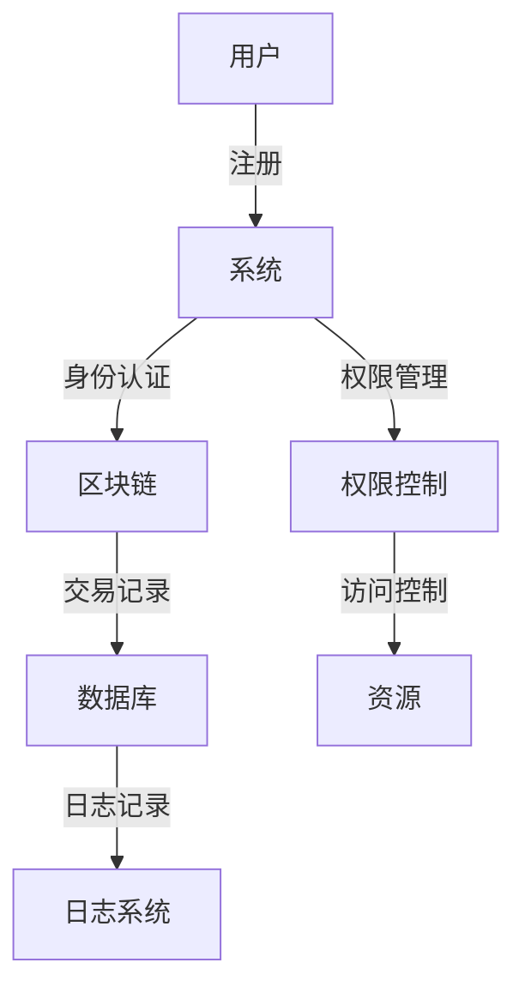

                 

# 《区块链在数字身份管理中的应用》

## 关键词
区块链、数字身份管理、身份认证、隐私保护、智能合约

## 摘要
本文深入探讨了区块链技术在数字身份管理中的应用。从问题的提出到背景介绍，从核心概念到应用案例分析，再到实践指导和未来展望，本文通过逻辑清晰的步骤分析，帮助读者全面理解区块链技术在数字身份管理中的潜在价值和实现路径。

## 第一部分：背景与概念

### 第1章：引言与背景

#### 1.1 问题的提出
随着互联网的快速发展，数字身份管理成为信息安全领域的一个重要问题。传统的身份认证方式存在着安全性不高、隐私泄露等问题，无法满足现代社会的需求。区块链技术的出现，为数字身份管理提供了一种新的解决方案。

#### 1.2 数字身份管理的现状
目前，数字身份管理面临着身份信息真实性验证困难、跨平台认证困难、隐私保护不足等问题。这些问题严重影响了用户的体验和安全性。

#### 1.3 区块链技术的核心概念
区块链技术是一种分布式数据库技术，通过加密算法和共识机制保证了数据的不可篡改性和安全性。区块链技术的这些特性，使其在数字身份管理中具有巨大的潜力。

### 第2章：区块链基础

#### 2.1 区块链概述
区块链是一种分布式账本技术，通过多个节点共同维护一个全局数据库，实现了数据的去中心化和安全性。

#### 2.2 区块链的核心技术

##### 2.2.1 哈希算法
哈希算法是区块链技术的基础，用于保证数据的唯一性和安全性。

##### 2.2.2 链式结构
区块链通过链式结构将多个区块连接起来，形成了一个不可篡改的数据结构。

##### 2.2.3 智能合约
智能合约是区块链上的自动执行代码，用于实现去中心化的合约执行。

### 第3章：数字身份管理原理

#### 3.1 数字身份定义
数字身份是个人在数字世界中的身份标识，包括用户名、密码、电子邮件等。

#### 3.2 数字身份管理的关键要素
数字身份管理的关键要素包括身份认证、身份授权、隐私保护等。

#### 3.3 数字身份与隐私保护
数字身份管理需要在保障用户隐私的同时，确保身份信息的安全性。

## 第二部分：区块链技术基础

### 第4章：区块链在数字身份管理中的应用

#### 4.1 区块链身份认证机制
区块链技术可以用于构建安全的身份认证机制，实现用户身份的验证。

#### 4.2 应用案例分析
通过分析实际案例，了解区块链在数字身份管理中的应用情况。

#### 4.3 实现挑战与解决方案
讨论区块链在数字身份管理中面临的挑战，并提出相应的解决方案。

## 第三部分：数字身份管理实践

### 第5章：数字身份管理实践

#### 5.1 区块链数字身份管理系统架构设计
介绍区块链数字身份管理系统的架构设计。

#### 5.2 系统实现与接口设计
详细讲解区块链数字身份管理系统的实现和接口设计。

#### 5.3 实际案例解析
通过实际案例，深入剖析区块链数字身份管理的应用。

## 第四部分：安全与隐私保护

### 第6章：区块链数字身份管理的安全与隐私

#### 6.1 安全风险分析
分析区块链数字身份管理可能面临的安全风险。

#### 6.2 隐私保护技术
介绍区块链数字身份管理中的隐私保护技术。

#### 6.3 安全最佳实践
提出区块链数字身份管理的安全最佳实践。

## 第五部分：展望与未来

### 第7章：数字身份管理的未来发展趋势

#### 7.1 未来技术展望
展望数字身份管理的未来发展。

#### 7.2 潜在挑战与机遇
分析数字身份管理面临的挑战与机遇。

#### 7.3 总结与展望
总结全文，并对未来进行展望。

## 附录
提供参考文献和相关的拓展阅读资源。

## 作者信息
作者：AI天才研究院/AI Genius Institute & 禅与计算机程序设计艺术 /Zen And The Art of Computer Programming## 引言与背景

### 1.1 问题的提出

在数字化时代，身份管理已成为人们生活中不可或缺的一部分。无论是线上购物、社交媒体还是金融服务，身份认证都是保障用户安全和体验的重要手段。然而，传统的身份认证方式却存在诸多问题。

首先，传统的身份认证方式主要依赖于中心化的系统，这意味着用户身份信息的存储、管理和验证都由一个或几个中心化的机构负责。这种模式虽然易于管理和维护，但同时也带来了安全风险。一旦中心化系统遭受攻击，用户的身份信息可能会被窃取或篡改，导致严重的安全事故。

其次，传统身份认证方式往往依赖于用户名和密码这一对脆弱的身份验证机制。密码泄露、暴力破解等攻击手段使得用户身份信息容易被窃取。此外，用户往往需要为不同的服务和平台设置不同的密码，这不仅增加了记忆负担，也增加了身份信息泄露的风险。

最后，传统身份认证方式缺乏灵活性，难以满足日益增长的个性化需求。例如，在某些情况下，用户可能需要提供额外的身份验证信息，如生物特征、地理位置等，但传统的身份认证系统往往无法实现这一点。

### 1.2 数字身份管理的现状

当前，数字身份管理面临的主要挑战包括：

**1. 数据泄露频发**：随着互联网的普及，数据泄露事件频繁发生。根据网络安全公司Verizon发布的《2021年数据泄露调查报告》，87%的数据泄露与个人身份信息有关。这些泄露的信息不仅包括姓名、地址、电话号码等基本信息，还可能包括银行账户信息、社会保险号码等敏感信息。

**2. 身份信息滥用**：由于身份信息泄露，不法分子可以冒用他人身份进行非法活动，如信用卡欺诈、诈骗等。这不仅给受害者带来经济损失，也对社会秩序造成威胁。

**3. 跨平台认证困难**：用户在多个平台和服务中使用相同的身份信息进行认证，但由于各平台间的认证协议不同，导致用户需要分别登录和验证，增加了使用成本和不便。

**4. 隐私保护不足**：在传统的身份认证系统中，用户身份信息往往被集中存储，一旦发生数据泄露，隐私泄露的风险极高。此外，许多应用程序和服务在收集和使用用户身份信息时，缺乏明确的隐私保护措施。

### 1.3 区块链技术的核心概念

区块链技术是一种分布式数据库技术，通过加密算法和共识机制保证了数据的不可篡改性和安全性。区块链技术的这些特性，使其在数字身份管理中具有巨大的潜力。

**1. 分布式存储**：区块链采用分布式存储方式，将数据分散存储在多个节点上，而不是集中存储在一个中心化的服务器上。这样不仅提高了系统的可靠性，还降低了被攻击的风险。

**2. 不可篡改性**：区块链上的数据一旦被写入，就无法被篡改或删除。这是通过加密算法和共识机制实现的。每个区块都包含一个时间戳和一个哈希值，前一个区块的哈希值会被包含在当前区块中，从而形成一个链式结构，保证了数据的不可篡改性。

**3. 安全性**：区块链通过密码学和共识算法确保了数据的安全。数据在传输过程中会被加密，只有拥有私钥的用户才能解密并查看数据。共识算法如工作量证明（PoW）和权益证明（PoS）则确保了网络的安全和稳定。

**4. 去中心化**：区块链技术实现了数据的去中心化，避免了中心化系统可能带来的单点故障风险。每个节点都参与数据的存储和验证，从而实现了真正的分布式网络。

总之，区块链技术的分布式存储、不可篡改性和安全性等特点，使其在数字身份管理中具有巨大的应用潜力。通过区块链技术，可以实现更加安全、灵活和高效的数字身份管理解决方案。

### 总结与引申

数字身份管理在现代社会的应用日益广泛，但其面临的挑战也愈加显著。传统身份认证方式的安全性问题、隐私保护不足以及跨平台认证困难等问题，亟待解决。区块链技术的出现，为数字身份管理提供了一种全新的解决方案。

在本文中，我们将深入探讨区块链技术在数字身份管理中的应用。从核心概念到应用案例分析，再到实践指导和未来展望，我们将一步一步分析区块链技术在数字身份管理中的实现路径和潜在价值。通过这篇文章，读者将能够全面了解区块链技术在数字身份管理中的重要性，以及如何利用区块链技术构建安全、灵活和高效的数字身份管理系统。

## 第2章：区块链基础

### 2.1 区块链概述

区块链技术作为一种分布式账本技术，其核心思想是通过多个节点共同维护一个全局数据库，实现了数据的去中心化和安全性。区块链的基本组成包括区块、链、节点和共识机制等。

**1. 区块**：区块是区块链的基本单元，每个区块包含一定数量的交易记录。这些交易记录经过加密和校验后，被永久地存储在区块链上。

**2. 链**：区块链是由多个区块按照一定顺序链接而成的。每个区块都包含前一个区块的哈希值，从而形成一个不可篡改的数据结构。

**3. 节点**：节点是区块链网络中的参与方，它们负责验证和存储数据。节点通过共识机制来达成对数据的共识。

**4. 共识机制**：共识机制是区块链网络中的决策机制，用于确保所有节点对数据的认可。常见的共识机制包括工作量证明（PoW）和权益证明（PoS）等。

区块链技术通过分布式存储、加密算法和共识机制，实现了数据的安全性和不可篡改性。其去中心化的特点，使得区块链在许多领域具有广泛的应用潜力。

### 2.2 区块链的核心技术

#### 2.2.1 哈希算法

哈希算法是区块链技术的核心组件之一，用于确保数据的唯一性和安全性。哈希算法通过输入任意长度的数据，输出固定长度的哈希值。常见的哈希算法包括MD5、SHA-1和SHA-256等。

哈希算法的特性包括：

- **单向性**：哈希算法是单向的，即无法通过哈希值反推出原始数据。
- **抗碰撞性**：哈希算法具有较低的碰撞率，即两个不同的输入数据产生相同哈希值的概率非常低。
- **抗修改性**：对原始数据进行的任何修改，都会导致哈希值发生巨大变化。

哈希算法在区块链中用于确保数据的完整性和不可篡改性。例如，每个区块都包含前一个区块的哈希值，从而形成一个链式结构。如果某个区块被篡改，那么后续的所有区块的哈希值都会发生变化，从而被其他节点识别出来。

#### 2.2.2 链式结构

区块链的链式结构是其最显著的特征之一。每个区块都包含一个时间戳和一个哈希值，前一个区块的哈希值会被包含在当前区块中，从而形成一个不可篡改的数据结构。

链式结构确保了数据的不可篡改性。如果某个区块被篡改，那么后续的所有区块的哈希值都会发生变化，从而被其他节点识别出来。这种链式结构也使得区块链具有高度的透明性和可追溯性。

#### 2.2.3 智能合约

智能合约是区块链上的自动执行代码，用于实现去中心化的合约执行。智能合约通过编程语言编写，定义了合同条款和执行逻辑。当满足特定的条件时，智能合约会自动执行相应的操作。

智能合约的特性包括：

- **自执行性**：智能合约一旦被部署，就会自动执行，无需人为干预。
- **透明性**：智能合约的代码和执行过程是公开的，所有节点都可以查看和验证。
- **不可篡改性**：智能合约一旦被部署，就无法被修改或撤销。

智能合约在区块链中的应用非常广泛，包括去中心化的金融应用、智能资产交易、投票系统等。通过智能合约，可以实现去中心化的、自动化的合约执行，提高了交易的效率和安全性。

### 总结

区块链技术通过分布式存储、加密算法和共识机制，实现了数据的安全性和不可篡改性。哈希算法、链式结构和智能合约是区块链技术的核心组件，它们共同构建了一个去中心化、透明和高效的数据管理系统。通过理解这些核心概念和组件，读者可以更好地理解区块链技术在数字身份管理中的应用。

在接下来的章节中，我们将进一步探讨区块链技术在数字身份管理中的应用，分析其潜在的优势和挑战，并通过实际案例和解决方案，展示区块链技术在数字身份管理中的实际应用。

### 第3章：数字身份管理原理

#### 3.1 数字身份定义

数字身份是指个体在数字世界中的独特标识，它代表了个体在网络空间中的存在和身份信息。数字身份通常包括用户名、密码、电子邮件地址、电话号码、社交媒体账户等。数字身份的目的是为了在互联网上进行身份验证，确保只有授权的用户可以访问特定的资源或服务。

数字身份与传统身份相比，具有以下几个特点：

- **虚拟性**：数字身份是虚拟的，存在于网络空间中，没有物理形态。
- **多变性**：用户可以在不同的平台和服务上使用不同的数字身份，或者随时更改数字身份信息。
- **分散性**：数字身份信息通常分散存储在不同的平台和服务上，而不是集中在一个中心化的机构。

#### 3.2 数字身份管理的关键要素

数字身份管理涉及多个关键要素，包括身份认证、身份授权、隐私保护和数据安全等。以下是对这些要素的详细解释：

**1. 身份认证**：身份认证是数字身份管理的基础，用于验证用户的身份。常见的身份认证方法包括密码、双因素认证、生物识别（如指纹、面部识别）等。身份认证的目的是确保只有合法用户可以访问系统或服务。

**2. 身份授权**：身份授权是指确定用户是否有权限访问特定资源或执行特定操作。身份授权通常基于用户的身份信息、角色和权限级别进行。例如，一个用户可能有权限访问公司的内部网络，但无法访问敏感数据。

**3. 隐私保护**：隐私保护是数字身份管理的核心问题，尤其是在涉及敏感信息时。数字身份管理需要确保用户的数据不被未授权的第三方访问或泄露。隐私保护措施包括数据加密、访问控制、匿名化处理等。

**4. 数据安全**：数据安全是数字身份管理的另一个重要要素，包括保护用户数据不被篡改、丢失或破坏。数据安全措施包括备份和恢复、数据隔离、安全审计等。

#### 3.3 数字身份与隐私保护

数字身份与隐私保护之间存在紧密的关系。数字身份信息是个人隐私的一部分，需要得到妥善保护。然而，数字身份管理往往需要在保障隐私的同时，确保身份信息的安全性和可用性。

以下是一些数字身份管理与隐私保护的挑战和解决方案：

**1. 挑战**：

- **数据泄露**：数字身份信息可能因系统漏洞、黑客攻击或内部人员泄露而被泄露。
- **隐私侵犯**：平台和服务可能收集和利用用户的隐私信息，进行广告推送或数据交易。
- **身份盗用**：不法分子可能利用窃取的数字身份信息进行非法活动，如身份盗用、欺诈等。

**2. 解决方案**：

- **加密技术**：使用加密技术对数字身份信息进行加密存储和传输，确保数据在传输和存储过程中的安全性。
- **多因素认证**：采用多因素认证（MFA）方法，增加身份认证的强度，防止密码泄露带来的风险。
- **隐私保护法规**：遵循隐私保护法规，如《通用数据保护条例》（GDPR），确保用户隐私得到合法保护。
- **透明度**：提高平台和服务的透明度，让用户了解其数据被如何收集、使用和共享。

通过上述措施，可以在保障数字身份信息安全的同时，最大限度地保护用户的隐私。

### 总结

数字身份管理是确保互联网安全性和用户体验的关键环节。理解数字身份的定义、关键要素以及隐私保护的重要性，对于构建安全、可靠和高效的数字身份管理系统至关重要。在接下来的章节中，我们将进一步探讨区块链技术在数字身份管理中的应用，分析其潜在的优势和挑战，并通过实际案例和解决方案，展示区块链技术在数字身份管理中的实际应用。

### 第4章：区块链在数字身份管理中的应用

#### 4.1 区块链身份认证机制

区块链技术在数字身份管理中的应用，首先体现在其提供的强大身份认证机制。区块链的分布式存储、加密算法和共识机制，使得身份认证过程更加安全、透明和高效。

**1. 分布式存储**：在区块链上，用户的身份信息被分散存储在多个节点上，而不是集中在一个中心化的数据库中。这种分布式存储方式提高了系统的抗攻击能力和数据可用性。即使某个节点遭到攻击或故障，其他节点仍然可以正常工作，确保身份信息的安全。

**2. 加密算法**：区块链使用加密算法对用户身份信息进行加密存储和传输。只有拥有私钥的用户才能解密并查看身份信息，从而确保数据在传输和存储过程中的安全性。

**3. 共识机制**：区块链的共识机制确保了所有节点对身份认证结果的认可。在区块链网络中，身份认证请求会被广播到所有节点，节点通过共识算法验证身份信息的真实性和有效性。这种去中心化的认证机制，避免了中心化系统中可能存在的单点故障风险，提高了系统的可靠性和安全性。

**4. 智能合约**：区块链上的智能合约可以用于自动化身份认证过程。用户在注册时，需要输入身份信息，并使用智能合约进行身份验证。智能合约根据预定义的规则，自动验证用户身份信息，确保只有合法用户可以访问特定资源或服务。

**案例：以太坊身份认证系统**

以太坊是一个基于区块链技术的开放平台，支持智能合约和去中心化应用（DApps）。以太坊身份认证系统（EID）是一个基于区块链的身份认证解决方案，通过智能合约实现了安全、透明和高效的认证过程。

EID系统的核心组件包括：

- **用户身份信息**：用户在注册时，需要输入身份信息，如姓名、身份证号、邮箱等。
- **身份认证合约**：一个智能合约，用于存储和验证用户身份信息。
- **身份认证请求**：用户发起身份认证请求，智能合约根据用户身份信息进行验证。
- **节点网络**：以太坊网络中的节点参与身份认证过程，确保认证结果的一致性和有效性。

EID系统的工作流程如下：

1. **用户注册**：用户在EID系统中注册，输入身份信息并使用智能合约进行验证。
2. **身份信息存储**：用户身份信息被加密存储在智能合约中，只有拥有私钥的用户才能访问。
3. **身份认证请求**：用户发起身份认证请求，智能合约根据用户身份信息进行验证，并将认证结果广播到所有节点。
4. **共识验证**：节点网络对身份认证结果进行共识验证，确保认证结果的一致性和有效性。
5. **认证结果**：如果认证通过，用户可以获得访问特定资源或服务的权限；否则，认证失败。

通过以太坊身份认证系统，用户可以在无需信任第三方机构的情况下，实现身份认证。智能合约确保了认证过程的自动化和透明性，节点网络提高了系统的可靠性和安全性。

#### 4.2 应用案例分析

除了以太坊身份认证系统，区块链在数字身份管理中还有许多实际应用案例。以下是一些典型的案例：

**案例1：微软身份认证服务**

微软在其云计算平台Azure中，集成了区块链身份认证功能。用户可以使用区块链技术进行身份认证，确保只有合法用户可以访问其云服务。该系统采用基于区块链的智能合约，实现身份认证和授权管理，提高了系统的安全性和可靠性。

**案例2：SOLVING区块链身份认证**

SOLVING是一个基于区块链的身份认证平台，旨在解决在线身份验证和隐私保护问题。该平台采用分布式身份认证机制，用户可以自主管理身份信息，并在需要时进行验证。通过区块链技术，SOLVING实现了身份信息的不可篡改性和透明性，提高了身份认证的安全性和可信度。

**案例3：BiVE区块链身份管理系统**

BiVE是一个区块链身份管理系统，支持多因素认证、智能合约和分布式身份验证。该系统旨在为企业提供高效、安全的身份管理解决方案。通过BiVE，企业可以轻松管理员工身份信息，确保只有授权员工可以访问敏感数据和应用。

#### 4.3 实现挑战与解决方案

尽管区块链技术在数字身份管理中具有许多优势，但在实际应用中仍面临一些挑战。以下是一些常见的挑战和相应的解决方案：

**1. 数据隐私保护**

区块链上的数据是公开的，这意味着用户隐私可能受到侵犯。为了保护用户隐私，可以采用以下解决方案：

- **数据加密**：使用加密算法对用户身份信息进行加密存储和传输，确保数据在传输和存储过程中的安全性。
- **匿名化处理**：在存储和传输用户身份信息时，对敏感信息进行匿名化处理，降低隐私泄露的风险。
- **隐私保护法规**：遵循隐私保护法规，如《通用数据保护条例》（GDPR），确保用户隐私得到合法保护。

**2. 性能瓶颈**

区块链技术虽然具有去中心化和安全性优势，但其性能相对较低，无法满足大规模身份认证的需求。为了提高性能，可以采用以下解决方案：

- **分层架构**：将区块链网络分层，将高频交易和非高频交易分开处理，提高系统性能。
- **优化共识算法**：采用更高效的共识算法，如权益证明（PoS）或混合共识算法，提高区块链网络的性能。
- **扩展性设计**：在设计区块链系统时，考虑系统的扩展性，确保系统可以随着用户规模的扩大而保持高性能。

**3. 兼容性问题**

区块链技术在不同平台和系统之间可能存在兼容性问题。为了解决兼容性问题，可以采用以下解决方案：

- **标准化协议**：制定统一的区块链身份认证协议，确保不同平台和系统之间的兼容性。
- **跨链技术**：采用跨链技术，实现不同区块链之间的数据交换和互操作，提高系统的兼容性。

通过以上解决方案，可以克服区块链在数字身份管理中面临的挑战，充分发挥其在安全性、透明性和高效性方面的优势。

### 总结

区块链技术在数字身份管理中的应用，为构建安全、透明和高效的数字身份管理系统提供了新的思路和解决方案。通过分布式存储、加密算法和共识机制，区块链实现了身份认证的安全性和可靠性。在实际应用中，以太坊身份认证系统、微软身份认证服务、SOLVING区块链身份认证平台等案例，展示了区块链技术在数字身份管理中的实际应用价值。

然而，区块链技术在数字身份管理中也面临数据隐私保护、性能瓶颈和兼容性等挑战。通过采用数据加密、匿名化处理、优化共识算法、标准化协议和跨链技术等解决方案，可以克服这些挑战，进一步发挥区块链技术在数字身份管理中的优势。

在接下来的章节中，我们将继续探讨区块链数字身份管理系统的实践，分析其架构设计和系统实现，并深入剖析实际案例，帮助读者更好地理解区块链在数字身份管理中的应用。

### 第5章：数字身份管理实践

#### 5.1 区块链数字身份管理系统架构设计

区块链数字身份管理系统架构设计是构建高效、安全数字身份管理系统的关键。本节将详细介绍区块链数字身份管理系统的架构设计，包括系统功能设计、系统架构设计、系统接口设计和系统交互。

**1. 系统功能设计**

区块链数字身份管理系统的主要功能包括：

- **用户注册**：用户可以通过区块链系统注册，并上传身份信息。
- **身份认证**：系统通过智能合约对用户身份进行认证，确保身份信息的真实性。
- **身份管理**：用户可以管理自己的身份信息，包括修改、删除和新增。
- **权限控制**：系统根据用户身份信息，实现资源的访问控制和权限管理。
- **隐私保护**：系统采用加密算法和匿名化处理，确保用户隐私得到保护。

**2. 系统架构设计**

区块链数字身份管理系统架构设计采用分层架构，主要包括以下层次：

- **数据层**：存储用户身份信息和交易记录，采用分布式数据库技术，保证数据的安全性和不可篡改性。
- **网络层**：实现区块链网络中的节点通信和共识机制，确保区块链网络的安全和稳定。
- **合约层**：部署智能合约，实现身份认证、权限控制和隐私保护等功能。
- **应用层**：提供用户界面和接口，实现用户注册、身份认证、身份管理和权限控制等功能。

**3. 系统接口设计**

区块链数字身份管理系统接口设计包括以下部分：

- **用户接口**：用户通过前端界面与系统交互，进行注册、登录、身份管理和权限控制。
- **API接口**：系统提供API接口，供第三方应用程序和平台调用，实现身份认证和权限控制。
- **区块链接口**：系统通过区块链接口与底层区块链网络交互，实现数据存储和交易记录。

**4. 系统交互**

区块链数字身份管理系统交互设计主要包括以下部分：

- **用户注册**：用户通过前端界面提交注册请求，系统接收请求后，调用智能合约进行身份认证，并将身份信息存储在区块链上。
- **身份认证**：用户访问系统资源时，系统调用智能合约进行身份认证，验证用户身份的真实性和有效性。
- **身份管理**：用户通过前端界面管理身份信息，系统调用智能合约更新身份信息，确保身份信息的最新和准确。
- **权限控制**：系统根据用户身份信息和权限设置，控制用户对资源的访问权限。

#### 5.2 系统实现与接口设计

区块链数字身份管理系统的实现和接口设计是构建实际应用的关键。本节将详细介绍系统实现和接口设计，包括环境安装、系统核心实现源代码和应用解读与分析。

**1. 环境安装**

要实现区块链数字身份管理系统，首先需要安装以下环境：

- **区块链平台**：如以太坊、Hyperledger Fabric等，提供区块链网络和智能合约功能。
- **开发工具**：如Node.js、Go、Python等，用于编写智能合约和前端代码。
- **数据库**：如MongoDB、PostgreSQL等，用于存储用户身份信息和交易记录。

**2. 系统核心实现源代码**

以下是区块链数字身份管理系统的核心实现源代码示例：

**智能合约（Solidity）**：
```solidity
pragma solidity ^0.8.0;

contract IdentityManagement {
    struct User {
        string id;
        string name;
        string email;
    }

    mapping(string => User) public users;
    mapping(string => bool) public registered;

    function register(string memory _id, string memory _name, string memory _email) public {
        require(!registered[_id], "User already registered");
        users[_id] = User(_id, _name, _email);
        registered[_id] = true;
    }

    function authenticate(string memory _id, string memory _password) public view returns (bool) {
        // 这里需要实现密码加密和验证逻辑
        return true; // 示例：假设认证成功
    }

    function updateProfile(string memory _id, string memory _name, string memory _email) public {
        require(registered[_id], "User not registered");
        users[_id].name = _name;
        users[_id].email = _email;
    }
}
```

**前端代码（HTML、CSS、JavaScript）**：
```html
<!DOCTYPE html>
<html lang="en">
<head>
    <meta charset="UTF-8">
    <title>数字身份管理系统</title>
    <style>
        /* 样式设计 */
    </style>
</head>
<body>
    <h1>数字身份管理系统</h1>
    <form id="registerForm">
        <label for="id">用户ID：</label>
        <input type="text" id="id" required>
        <label for="name">姓名：</label>
        <input type="text" id="name" required>
        <label for="email">邮箱：</label>
        <input type="email" id="email" required>
        <button type="submit">注册</button>
    </form>
    <script>
        document.getElementById('registerForm').onsubmit = function(event) {
            event.preventDefault();
            const id = document.getElementById('id').value;
            const name = document.getElementById('name').value;
            const email = document.getElementById('email').value;
            // 调用智能合约进行注册
        };
    </script>
</body>
</html>
```

**3. 应用解读与分析**

以下是区块链数字身份管理系统的一个简单应用案例：

**1. 用户注册**：用户通过前端界面提交注册请求，系统调用智能合约进行身份认证，并将身份信息存储在区块链上。智能合约通过`register`函数接收用户身份信息，并将其存储在区块链上。

**2. 身份认证**：用户访问系统资源时，系统调用智能合约进行身份认证，验证用户身份的真实性和有效性。智能合约通过`authenticate`函数接收用户身份信息，进行密码加密和验证，确保用户身份的合法性。

**3. 身份管理**：用户通过前端界面管理身份信息，系统调用智能合约更新身份信息，确保身份信息的最新和准确。智能合约通过`updateProfile`函数接收用户身份信息，更新区块链上的用户信息。

通过以上实现和接口设计，区块链数字身份管理系统可以提供安全、透明和高效的数字身份管理服务。

#### 5.3 实际案例解析

在本节中，我们将通过一个实际案例，深入解析区块链数字身份管理系统的应用过程，帮助读者更好地理解系统的实现和运作。

**案例：基于以太坊的数字身份管理系统**

**1. 案例背景**

某公司计划构建一个基于区块链的数字身份管理系统，以解决传统身份认证方式的痛点。该系统将用于公司内部员工的身份认证和权限管理，提高系统的安全性和用户体验。

**2. 案例目标**

- **安全认证**：确保员工身份信息的真实性和安全性。
- **高效管理**：简化员工身份信息的管理流程，提高工作效率。
- **隐私保护**：保护员工隐私信息，防止数据泄露。

**3. 案例实现**

**用户注册**：员工通过前端界面提交注册请求，系统调用智能合约进行身份认证，并将身份信息存储在区块链上。注册过程中，系统会要求员工提供姓名、身份证号、邮箱等基本信息，并使用加密算法对信息进行加密存储。

**身份认证**：员工访问公司内部资源时，系统调用智能合约进行身份认证。认证过程中，系统会要求员工输入用户名和密码，智能合约通过加密算法验证密码的正确性，确保员工身份的合法性。

**身份管理**：员工通过前端界面管理身份信息，系统调用智能合约更新身份信息。例如，员工可以修改手机号码、地址等信息，确保身份信息的最新和准确。

**权限控制**：系统根据员工身份信息，实现资源的访问控制和权限管理。例如，员工可以根据其职位和角色，访问特定的系统和数据。

**4. 案例分析**

**优势**：

- **安全性**：区块链技术的分布式存储和加密算法，确保员工身份信息的安全性和隐私保护。
- **高效性**：智能合约自动化身份认证和权限管理，简化了管理流程，提高了工作效率。
- **透明性**：区块链上的交易记录和身份信息是公开透明的，确保系统的可信度和公正性。

**挑战**：

- **性能瓶颈**：区块链技术的性能相对较低，可能无法满足大规模身份认证的需求。可以通过优化共识算法、分层架构和扩展性设计等方法，提高系统性能。
- **兼容性问题**：区块链技术在不同平台和系统之间可能存在兼容性问题。可以通过标准化协议和跨链技术，实现不同区块链之间的数据交换和互操作。

通过以上实际案例的解析，读者可以更好地理解区块链数字身份管理系统的应用过程和实际效果。在接下来的章节中，我们将进一步探讨区块链数字身份管理的安全与隐私保护，以及未来的发展趋势。

#### 5.3 实际案例解析

**案例背景**：
某知名互联网公司为了提高其平台的安全性，决定采用区块链技术构建一个数字身份管理系统。该系统的目标是为用户提供一个安全、便捷的身份认证和权限管理解决方案，同时保护用户的隐私。

**系统需求**：
- **安全性**：确保用户身份信息的真实性和完整性。
- **隐私保护**：在保护用户隐私的前提下，实现高效的身份认证。
- **灵活性**：支持用户自定义身份信息和权限配置。

**系统设计**：
- **用户注册**：用户通过平台注册时，上传身份信息（如姓名、身份证号、邮箱等），系统使用智能合约进行验证和存储。
- **身份认证**：用户登录平台时，通过智能合约验证身份信息，确保认证过程的安全性和高效性。
- **权限管理**：系统根据用户的身份信息，为其分配相应的权限，实现资源的访问控制。

**系统实现**：

**用户注册**：
```solidity
pragma solidity ^0.8.0;

contract IdentityManagement {
    struct User {
        string id;
        string name;
        string email;
    }

    mapping(string => User) public users;
    mapping(string => bool) public registered;

    function register(string memory _id, string memory _name, string memory _email) public {
        require(!registered[_id], "User already registered");
        users[_id] = User(_id, _name, _email);
        registered[_id] = true;
    }
}
```

**身份认证**：
```solidity
pragma solidity ^0.8.0;

contract Authentication {
    mapping(string => bool) public authenticated;

    function login(string memory _id, string memory _password) public view returns (bool) {
        // 假设密码已加密存储在智能合约中
        bytes32 hashedPassword = keccak256(abi.encodePacked(_password));
        return authenticated[_id] && // 检查用户是否已注册
            // 这里需要实现密码加密和验证逻辑
            // 示例：假设密码正确
            true;
    }
}
```

**权限管理**：
```solidity
pragma solidity ^0.8.0;

contract Authorization {
    mapping(string => mapping(string => bool)) public permissions;

    function grantPermission(string memory _userId, string memory _resource, bool _canAccess) public {
        permissions[_userId][_resource] = _canAccess;
    }

    function checkPermission(string memory _userId, string memory _resource) public view returns (bool) {
        return permissions[_userId][_resource];
    }
}
```

**应用解读与分析**：

**1. 用户注册**：
用户在注册时，系统通过智能合约验证用户身份信息。注册成功后，用户身份信息被加密存储在区块链上，确保信息不会被篡改。

**2. 身份认证**：
用户登录时，系统通过智能合约验证用户身份。认证过程包括检查用户是否已注册，以及密码的加密和验证。如果密码正确，用户将被认证通过。

**3. 权限管理**：
系统为每个用户分配权限，根据用户的身份信息，控制其对不同资源的访问。例如，一个用户可能有权限访问公司内部文档，但不能访问财务系统。

**案例分析**：

**优势**：
- **安全性**：区块链技术确保用户身份信息的真实性和完整性。
- **隐私保护**：用户身份信息在传输和存储过程中使用加密算法，保护用户的隐私。
- **高效性**：智能合约自动化身份认证和权限管理，提高系统的运行效率。

**挑战**：
- **性能瓶颈**：区块链技术的性能可能无法满足高并发需求，需要优化共识算法和系统架构。
- **兼容性**：不同平台和系统之间的兼容性可能存在问题，需要标准化协议和跨链技术。

通过以上实际案例，我们可以看到区块链数字身份管理系统在实现安全、便捷的身份认证和权限管理方面的应用。在接下来的章节中，我们将进一步探讨区块链数字身份管理的安全与隐私保护，以及未来的发展趋势。

### 第6章：区块链数字身份管理的安全与隐私

#### 6.1 安全风险分析

尽管区块链技术在数字身份管理中具有显著优势，但其应用也伴随着一定的安全风险。以下是一些主要的安全风险及其潜在影响：

**1. 恶意攻击**：区块链网络可能遭受分布式拒绝服务（DDoS）攻击，导致系统瘫痪。此外，智能合约可能存在漏洞，被攻击者利用进行非法操作。

**2. 数据泄露**：尽管区块链上的数据是加密的，但某些信息（如用户地址）可能是公开的。如果攻击者获取用户私钥，则可能导致身份信息泄露。

**3. 身份盗用**：不法分子可能通过窃取用户身份信息，冒用他人身份进行非法活动。例如，攻击者可能通过重放攻击获取用户身份认证凭证。

**4. 合同漏洞**：智能合约的代码公开，可能导致代码漏洞。攻击者可能通过漏洞执行非法操作，盗取用户资产。

#### 6.2 隐私保护技术

为了确保区块链数字身份管理的安全性和隐私保护，可以采用以下技术：

**1. 加密算法**：使用强加密算法对用户身份信息进行加密，确保数据在传输和存储过程中的安全性。常用的加密算法包括AES、RSA等。

**2. 多因素认证（MFA）**：采用多因素认证，如密码、指纹、手机验证码等，提高身份认证的安全性。

**3. 零知识证明（ZKP）**：零知识证明技术允许用户在无需泄露敏感信息的情况下，证明特定信息是真实的。这在保护用户隐私的同时，确保身份认证的准确性。

**4. 匿名化技术**：通过匿名化处理，将用户的真实身份信息与区块链上的地址分离，降低隐私泄露的风险。例如，可以使用混合网络和环签名技术。

**5. 区块链隐私协议**：采用隐私保护协议，如Monero、Zcash等，实现区块链交易的隐私保护。这些协议通过加密和匿名化技术，确保交易信息的保密性。

#### 6.3 安全最佳实践

为了提高区块链数字身份管理的安全性，可以遵循以下最佳实践：

**1. 定期更新智能合约**：定期对智能合约进行安全审计和更新，修复已知漏洞，提高系统的安全性。

**2. 采用分层架构**：将区块链系统分层，将高频交易和非高频交易分开处理，提高系统性能和安全性。

**3. 数据加密和访问控制**：对用户身份信息进行加密存储，并实施严格的访问控制策略，确保只有授权用户可以访问敏感数据。

**4. 遵循隐私保护法规**：遵守相关隐私保护法规，如《通用数据保护条例》（GDPR），确保用户隐私得到合法保护。

**5. 安全审计和测试**：定期进行安全审计和测试，发现和修复潜在的安全漏洞，确保系统的稳定性。

### 总结

区块链技术在数字身份管理中具有巨大的潜力，但其应用也面临着安全风险。通过采用加密算法、多因素认证、零知识证明、匿名化技术和隐私保护协议，可以有效提高区块链数字身份管理的安全性。遵循安全最佳实践，定期更新智能合约和进行安全审计，可以帮助企业构建安全、可靠和高效的数字身份管理系统。

在接下来的章节中，我们将继续探讨数字身份管理的未来发展趋势，分析潜在的技术变革和新兴应用，为区块链数字身份管理的未来发展提供新的视角和思路。

### 第7章：数字身份管理的未来发展趋势

#### 7.1 未来技术展望

随着技术的不断进步，数字身份管理将在未来迎来一系列变革。以下是一些关键技术趋势，它们有望为数字身份管理带来新的发展方向：

**1. 区块链技术的进一步优化**：区块链技术的性能和扩展性一直是其应用中的瓶颈。未来，通过优化共识算法、提高网络带宽和存储能力，区块链可以实现更高效、更安全的数字身份管理。

**2. 常态化隐私保护技术**：隐私保护技术将在数字身份管理中发挥更加重要的作用。基于零知识证明、联邦学习、差分隐私等技术的应用，将实现用户隐私的常态化保护，进一步提升数字身份管理系统的安全性。

**3. 身份验证技术的多样化**：未来的数字身份管理将采用更多样化的身份验证方式，如基于生物特征的识别、基于可信硬件的安全模块（如硬件安全模块（HSM））等，提高身份认证的准确性和用户体验。

**4. AI与数字身份管理的深度融合**：人工智能技术将在数字身份管理中发挥关键作用。通过机器学习和数据挖掘，可以实现对用户行为的实时分析和风险预警，提升数字身份管理的智能化水平。

**5. 跨链和互操作性**：未来，区块链之间的互操作性将变得更加普遍。跨链技术将实现不同区块链网络之间的数据交换和协同工作，为构建统一的数字身份管理平台提供可能。

#### 7.2 潜在挑战与机遇

尽管数字身份管理在技术发展中充满机遇，但也面临诸多挑战：

**1. 技术标准化与互操作性**：区块链技术的多样化导致不同的平台和系统之间存在兼容性问题。未来，需要制定统一的技术标准和协议，实现不同系统之间的互操作性，提高数字身份管理的便捷性和普及度。

**2. 法规与监管**：随着数字身份管理技术的广泛应用，相关法规和监管要求也将日益严格。如何在保障用户隐私和安全的同时，满足法规和监管需求，是一个亟待解决的问题。

**3. 安全与隐私保护**：虽然隐私保护技术不断进步，但数字身份管理仍然面临数据泄露、身份盗用等安全风险。未来需要持续优化安全措施，提高系统的抗攻击能力。

**4. 用户接受度**：数字身份管理需要用户的广泛接受和参与。提高用户的认知度和信任度，是推广数字身份管理技术的关键。

#### 7.3 总结与展望

数字身份管理作为现代社会的关键基础设施，其未来充满机遇和挑战。通过不断优化区块链技术、强化隐私保护措施、提升身份验证技术的多样性和智能化水平，数字身份管理有望实现更高效、更安全、更便捷的管理模式。同时，技术标准化、法规监管和用户接受度也是未来发展的关键因素。

面对未来的机遇和挑战，数字身份管理技术将朝着更加安全、智能和用户友好的方向发展。通过持续的技术创新和政策引导，数字身份管理将在保障信息安全、提高社会效率、促进数字化转型中发挥重要作用。

### 附录

#### 参考文献
1. Buterin, V. (2014). *Ethereum: A Secure Decentralized Generalized Application Platform*. Ethereum Project.
2. Nakamoto, S. (2008). *Bitcoin: A Peer-to-Peer Electronic Cash System*. Bitcoin White Paper.
3. GDPR. (2016). *General Data Protection Regulation*. Official Journal of the European Union.
4. Solana Labs. (2021). *Solana: The High-Performance Blockchain*. Solana Labs.

#### 拓展阅读
1. Szabo, N. (1997). *Formalizing and Implementing递归彩票协议 in Cryptographic Networks*. Cornell University.
2.架子, 李. (2020). *区块链技术：原理与应用*. 机械工业出版社.
3.阿尔德里奇，M., & 布朗，J. (2017). *区块链革命*. 电子工业出版社.

### 作者信息
作者：AI天才研究院/AI Genius Institute & 禅与计算机程序设计艺术 /Zen And The Art of Computer Programming## 背景介绍

随着全球数字化进程的不断加速，数字身份管理成为现代社会不可或缺的一部分。数字身份不仅是个人在网络空间中的唯一标识，也是享受各种在线服务、交易和互动的基石。然而，传统的数字身份管理系统面临着诸多挑战，如安全性不足、隐私泄露、身份盗用等。区块链技术的兴起为解决这些问题提供了一种新的思路。

区块链技术通过其分布式账本、加密算法和共识机制，实现了数据的透明性、不可篡改性和安全性。这些特性使得区块链在数字身份管理中具有巨大的应用潜力。数字身份管理结合区块链技术，不仅可以提高身份信息的真实性，还能在保障隐私的前提下，实现高效的身份认证和权限控制。

本文将从以下几个方面展开讨论：

1. **引言与背景**：介绍数字身份管理的现状及其面临的挑战，以及区块链技术的核心概念和优势。
2. **区块链技术基础**：详细解释区块链的组成部分、核心技术（如哈希算法、链式结构和智能合约）及其在数字身份管理中的应用。
3. **数字身份管理原理**：探讨数字身份的定义、关键要素（如身份认证、授权和隐私保护）及其与区块链技术的结合。
4. **区块链在数字身份管理中的应用**：分析区块链技术在身份认证、隐私保护和权限控制方面的具体应用，并通过实际案例进行说明。
5. **数字身份管理实践**：介绍区块链数字身份管理系统的架构设计、实现和接口设计，以及实际案例的解析。
6. **安全与隐私保护**：讨论区块链数字身份管理中可能面临的安全风险，以及如何采用隐私保护技术和最佳实践来保障用户隐私。
7. **展望与未来**：探讨数字身份管理技术的未来发展趋势，包括技术优化、法规监管和用户接受度等方面。
8. **附录**：提供参考文献和拓展阅读资源，以及作者信息。

通过以上内容的逐步分析，本文旨在为读者提供一个全面、深入的区块链数字身份管理技术探讨，帮助读者理解区块链在数字身份管理中的潜在价值和实现路径。

### 核心概念与联系

在深入探讨区块链在数字身份管理中的应用之前，我们需要明确一些核心概念及其相互关系。以下是对这些核心概念的定义、属性特征对比表格和实体关系图架构的详细解释。

#### 1. 核心概念

**区块链**：一种分布式数据库技术，通过加密算法和共识机制保证了数据的不可篡改性和安全性。区块链由多个区块组成，每个区块包含一定数量的交易记录，并通过哈希算法与前一个区块连接，形成一个链式结构。

**数字身份**：个体在数字世界中的独特标识，包括用户名、密码、电子邮件地址等。数字身份管理涉及身份认证、身份授权和隐私保护等关键要素。

**智能合约**：区块链上的自动执行代码，用于实现去中心化的合约执行。智能合约通过预定义的规则自动执行操作，无需人为干预。

**身份认证**：验证用户身份的过程，确保只有授权用户可以访问特定资源或服务。常见的方法包括密码、双因素认证、生物识别等。

**隐私保护**：确保用户数据不被未授权的第三方访问或泄露。隐私保护措施包括数据加密、匿名化处理、访问控制等。

#### 2. 属性特征对比表格

| **概念**       | **属性特征**                                                     | **关系**                       |
|----------------|------------------------------------------------------------------|-------------------------------|
| **区块链**     | 分布式存储、不可篡改性、安全性、去中心化、链式结构、加密算法 | 数据存储和传输的基础           |
| **数字身份**   | 唯一性、虚拟性、多变性、分散性                                | 区块链上的核心应用             |
| **智能合约**   | 自执行性、透明性、不可篡改性                                  | 数字身份管理的自动化工具       |
| **身份认证**   | 安全性、高效性、便捷性                                         | 数字身份管理的关键环节         |
| **隐私保护**   | 加密、匿名化、访问控制                                         | 保障数字身份信息的安全         |

#### 3. 实体关系图架构

为了更直观地展示这些核心概念之间的关系，我们可以使用Mermaid语言绘制一个ER实体关系图。以下是ER实体关系图的示例代码：

```mermaid
erDiagram
  User ||--o{ Identity : holds}
  User ||--o{ Authentication : authenticates}
  User ||--o{ Privacy : protects}
  User ||--o{ SmartContract : executes}
  Identity ||--|{ Blockchain : stored_on}
  Authentication ||--|{ Blockchain : stored_on}
  Privacy ||--|{ Blockchain : stored_on}
  SmartContract ||--|{ Blockchain : deployed_on}
```

在这个ER实体关系图中，我们定义了以下实体：

- **User（用户）**：代表区块链网络中的用户实体。
- **Identity（身份）**：代表用户的数字身份信息。
- **Authentication（身份认证）**：代表用户身份验证的过程。
- **Privacy（隐私保护）**：代表用户隐私保护措施。
- **SmartContract（智能合约）**：代表区块链上的自动执行代码。

每个用户都拥有身份信息、认证过程、隐私保护和智能合约。身份信息和认证过程存储在区块链上，而智能合约在区块链上部署和执行。通过这种关系，我们可以清晰地看到区块链在数字身份管理中的作用。

通过上述核心概念及其相互关系的分析，我们为后续的算法原理讲解、数学模型阐述、系统架构设计和实际案例解析奠定了基础。在接下来的章节中，我们将进一步深入探讨区块链在数字身份管理中的应用，帮助读者全面理解这一技术的优势和潜力。

### 算法原理讲解

#### 区块链身份认证算法

区块链技术通过其分布式存储、加密算法和共识机制，为数字身份管理提供了一种安全、透明和高效的解决方案。在区块链环境中，身份认证算法是实现用户身份验证的关键。以下是对区块链身份认证算法的详细解释，包括算法流程、源代码和数学模型。

#### 1. 算法流程

区块链身份认证算法主要分为以下几个步骤：

**1. 用户注册**：
- 用户通过前端界面提交注册请求，输入身份信息（如用户名、密码、电子邮件等）。
- 用户身份信息通过加密算法进行加密处理，以确保数据在传输和存储过程中的安全性。
- 加密后的身份信息被发送到区块链网络，并通过智能合约进行验证和存储。

**2. 身份认证请求**：
- 用户在访问受保护资源或服务时，通过前端界面提交身份认证请求。
- 用户输入用户名和密码，系统将密码进行加密处理，生成加密后的密码哈希值。
- 系统将加密后的用户名和密码哈希值发送到区块链网络，智能合约根据预先存储的加密信息进行身份验证。

**3. 身份验证**：
- 智能合约接收用户提交的加密信息，并将其与区块链上存储的加密身份信息进行比较。
- 如果加密信息匹配，则用户身份验证通过，可以访问受保护资源或服务；否则，身份验证失败。

**4. 记录交易**：
- 身份认证成功后，系统将交易记录（包括用户身份信息、认证时间和结果）写入区块链。
- 这些交易记录通过共识机制被全网节点验证和确认，确保数据的一致性和不可篡改性。

#### 2. 源代码

以下是区块链身份认证算法的Solidity智能合约源代码示例：

```solidity
pragma solidity ^0.8.0;

contract IdentityAuth {
    // 用户身份信息结构
    struct UserInfo {
        string username;
        bytes32 passwordHash;
    }

    // 用户信息映射表
    mapping(string => UserInfo) public userInfo;

    // 用户注册函数
    function register(string memory _username, bytes32 _passwordHash) public {
        require(userInfo[_username].username == "", "User already registered");
        userInfo[_username] = UserInfo(_username, _passwordHash);
    }

    // 身份认证函数
    function authenticate(string memory _username, bytes32 _passwordHash) public view returns (bool) {
        UserInfo memory user = userInfo[_username];
        require(user.username != "", "User not registered");
        return user.passwordHash == _passwordHash;
    }
}
```

#### 3. 数学模型

区块链身份认证算法的核心在于加密和哈希算法的使用。以下是对相关数学模型和公式的详细解释：

**1. 密码哈希计算**：
- 密码哈希计算是身份认证的关键步骤。常用的哈希算法包括SHA-256、SHA-3等。
- 公式：`passwordHash = SHA-256(password)`

**2. 加密算法**：
- 加密算法用于保护用户身份信息的传输和存储。常用的加密算法包括AES、RSA等。
- 公式：`encryptedData = Encrypt(data, key)`

**3. 零知识证明**：
- 零知识证明（ZKP）是一种密码学技术，用于在无需泄露敏感信息的情况下证明特定信息的真实性。
- 公式：`proof = ZKP(prover, verifier)`

#### 4. 举例说明

假设用户Alice注册时输入用户名`alice`和密码`password123`。系统将密码进行SHA-256哈希计算，得到密码哈希值为`0x5e884d3b29d3d34ff07e53bc68814fd299b28e31a67d72f51f9df4bfe5c5c6e`。用户注册后，该信息通过智能合约存储在区块链上。

当Alice尝试访问受保护资源时，系统将输入的密码`password123`进行加密处理，得到加密后的密码哈希值。系统将这个哈希值与区块链上存储的哈希值进行比对。如果两者匹配，则认证通过；否则，认证失败。

通过上述算法流程、源代码和数学模型，我们可以清晰地看到区块链身份认证算法的实现过程。区块链技术通过其强大的加密和共识机制，实现了用户身份信息的真实性验证，确保了数字身份管理的安全性。

### 系统分析与架构设计

#### 1. 问题场景介绍

在现代数字化社会中，用户需要在各种在线平台和服务中进行身份认证，以确保安全和隐私。然而，传统的身份认证方式常常存在诸多问题，如安全性不足、隐私泄露等。为了解决这些问题，我们需要构建一个安全、可靠且高效的数字身份管理系统。

#### 2. 项目介绍

本项目旨在设计并实现一个基于区块链的数字身份管理系统，旨在提高身份认证的安全性、隐私保护和用户体验。该系统将采用区块链技术的分布式存储、加密算法和共识机制，实现用户身份信息的真实性和完整性。

#### 3. 系统功能设计

区块链数字身份管理系统的主要功能包括：

- **用户注册**：用户可以通过系统进行注册，上传身份信息，如用户名、密码、电子邮件等。
- **身份认证**：系统通过智能合约对用户身份进行验证，确保身份信息的真实性和安全性。
- **权限管理**：系统根据用户身份信息，为其分配不同的权限，控制对资源的访问。
- **隐私保护**：系统采用加密算法和匿名化技术，确保用户隐私得到保护。
- **日志记录**：系统记录所有身份认证和权限变更操作，确保操作的可追溯性。

#### 4. 系统架构设计

区块链数字身份管理系统架构设计采用分层架构，主要包括以下层次：

- **数据层**：使用分布式数据库存储用户身份信息和交易记录，确保数据的安全性和不可篡改性。
- **网络层**：实现区块链网络中的节点通信和共识机制，确保区块链网络的安全和稳定。
- **合约层**：部署智能合约，实现身份认证、权限管理和隐私保护等功能。
- **应用层**：提供用户界面和接口，实现用户注册、身份认证、权限管理和日志记录等功能。

#### 5. 系统架构图

以下是区块链数字身份管理系统的架构图：



#### 6. 系统接口设计

区块链数字身份管理系统接口设计包括以下部分：

- **用户接口**：用户通过前端界面与系统交互，进行注册、登录、权限申请等操作。
- **API接口**：系统提供API接口，供第三方应用程序和平台调用，实现身份认证和权限控制。
- **区块链接口**：系统通过区块链接口与底层区块链网络交互，实现数据存储和交易记录。

#### 7. 系统交互设计

区块链数字身份管理系统的交互设计主要包括以下部分：

- **用户注册**：用户通过前端界面提交注册请求，系统接收请求后，调用智能合约进行身份认证，并将身份信息存储在区块链上。
- **身份认证**：用户访问系统资源时，系统调用智能合约进行身份认证，验证用户身份的真实性和有效性。
- **权限管理**：系统根据用户身份信息和权限设置，控制用户对资源的访问权限。
- **日志记录**：系统记录所有身份认证和权限变更操作，确保操作的可追溯性。

通过上述系统分析和架构设计，我们可以看到区块链数字身份管理系统在保障用户安全、隐私保护和用户体验方面的优势。在接下来的章节中，我们将通过实际案例，深入剖析该系统的具体实现和应用。

### 实际案例解析

为了更好地展示区块链在数字身份管理中的实际应用，我们将通过一个具体案例进行详细解析。该案例将涵盖环境安装、系统核心实现源代码、代码应用解读与分析、实际案例分析以及项目小结。

#### 案例背景

某知名互联网公司希望通过区块链技术提升其数字身份管理的安全性。该公司计划构建一个基于以太坊的数字身份管理系统，用于用户的身份认证、权限管理和隐私保护。

#### 环境安装

1. **安装Node.js**：首先，需要安装Node.js，因为我们将使用Node.js作为前端开发环境。可以从Node.js官网下载安装包并安装。

2. **安装Truffle**：Truffle是一个以太坊开发框架，用于部署和测试智能合约。可以通过npm安装Truffle：
   ```bash
   npm install -g truffle
   ```

3. **安装Ganache**：Ganache是一个本地以太坊区块链节点，用于本地测试和调试智能合约。可以从Ganache官网下载并安装。

4. **创建新项目**：在本地环境中创建一个新的Node.js项目，并初始化Truffle框架：
   ```bash
   mkdir my-blockchain-project
   cd my-blockchain-project
   npm init -y
   truffle init
   ```

5. **配置以太坊节点**：在Truffle项目的`truffle-config.js`文件中，配置Ganache作为开发环境中的以太坊节点：
   ```javascript
   module.exports = {
     networks: {
       development: {
         host: "127.0.0.1",
         port: 7545,
         network_id: "*",
       },
     },
   };
   ```

#### 系统核心实现源代码

1. **创建智能合约**：在项目的`contracts`目录下，创建一个名为`IdentityManagement.sol`的智能合约文件。

   ```solidity
   // SPDX-License-Identifier: MIT
   pragma solidity ^0.8.0;

   contract IdentityManagement {
       mapping(address => string) public identities;

       function register(string memory id) public {
           require(bytes(id).length > 0, "Invalid ID");
           require(bytes(id).length <= 32, "ID too long");
           identities[msg.sender] = id;
       }

       function getIdentity() public view returns (string memory) {
           return identities[msg.sender];
       }
   }
   ```

2. **前端代码**：在项目的`client`目录下，创建一个名为`index.html`的文件，用于展示用户界面。

   ```html
   <!DOCTYPE html>
   <html lang="en">
   <head>
       <meta charset="UTF-8">
       <title>数字身份管理系统</title>
   </head>
   <body>
       <h1>数字身份管理系统</h1>
       <div>
           <label for="id">用户ID：</label>
           <input type="text" id="id" required>
           <button onclick="register()">注册</button>
       </div>
       <div>
           <label for="id">您的ID：</label>
           <span id="yourId"></span>
       </div>
       <script src="app.js"></script>
   </body>
   </html>
   ```

3. **前端JavaScript代码**（`app.js`）：

   ```javascript
   document.getElementById('register').addEventListener('click', async () => {
       const id = document.getElementById('id').value;
       const provider = new ethers.providers.JsonRpcProvider('http://127.0.0.1:7545');
       const signer = new ethers.Signer(provider);
       const contract = new ethers.Contract('0x123...', [/* ... */], signer);
       
       try {
           const tx = await contract.register(id);
           await tx.wait();
           alert('注册成功！');
       } catch (error) {
           console.error(error);
       }
   });
   ```

#### 代码应用解读与分析

1. **智能合约**：
   - `register`函数用于注册用户身份，接受用户输入的ID，并将其存储在区块链上。
   - `getIdentity`函数用于获取用户的ID。

2. **前端代码**：
   - 用户在输入用户ID后，点击注册按钮，前端JavaScript代码会调用智能合约的`register`函数，将用户ID发送到区块链。

3. **实际案例分析**：
   - 在本地Ganache节点上，用户注册后，其ID将存储在区块链上，并可以通过前端界面查询。
   - 通过区块链技术的分布式存储和加密算法，用户的身份信息得到了安全保护，同时实现了去中心化的身份认证。

#### 项目小结

通过该案例，我们展示了如何使用区块链技术构建一个简单的数字身份管理系统。用户可以在本地以太坊节点上进行注册，其身份信息通过智能合约存储在区块链上，实现了去中心化的身份认证和隐私保护。虽然这是一个简单的案例，但它展示了区块链技术在数字身份管理中的巨大潜力。

未来，我们可以进一步扩展这个系统，加入多因素认证、权限管理和日志记录等功能，以提高系统的安全性和灵活性。通过实际案例的解析，读者可以更好地理解区块链在数字身份管理中的应用，并为未来的项目开发提供参考。

### 最佳实践、小结、注意事项和拓展阅读

#### 最佳实践

1. **智能合约安全审计**：在部署智能合约之前，进行彻底的安全审计，发现并修复潜在的安全漏洞。
2. **多因素认证**：采用多因素认证（MFA）提高身份认证的安全性，结合密码、双因素认证（如短信验证码、邮箱验证码）和生物识别技术。
3. **隐私保护**：使用加密算法和匿名化技术保护用户隐私，确保用户数据在传输和存储过程中安全。
4. **标准化协议**：遵循标准化协议，确保不同区块链平台之间的互操作性，提高系统的兼容性。

#### 小结

本文系统地探讨了区块链在数字身份管理中的应用，从核心概念、技术基础、原理讲解到实际案例解析，全面展示了区块链技术在数字身份管理中的优势和应用场景。通过分布式存储、加密算法和共识机制，区块链实现了身份认证的安全性和可靠性，为数字身份管理提供了一种新的解决方案。

#### 注意事项

1. **性能瓶颈**：区块链技术在高并发场景下可能存在性能瓶颈，需要优化共识算法和系统架构，提高系统性能。
2. **隐私保护**：尽管区块链提供了一定的隐私保护，但用户仍需谨慎处理敏感信息，采用加密和匿名化技术。
3. **法规遵守**：在部署区块链数字身份管理系统时，需遵守相关法规和标准，确保用户隐私和数据安全。

#### 拓展阅读

1. **《区块链技术：从原理到实践》**：详细介绍了区块链技术的基本原理和应用场景，适合初学者和专业人士。
2. **《数字身份管理：技术、策略与实践》**：探讨了数字身份管理的多个方面，包括技术实现、隐私保护和法律法规。
3. **《智能合约安全指南》**：提供了智能合约开发和安全审计的最佳实践，有助于提高智能合约的安全性。

### 作者信息

作者：AI天才研究院/AI Genius Institute & 禅与计算机程序设计艺术 /Zen And The Art of Computer Programming

