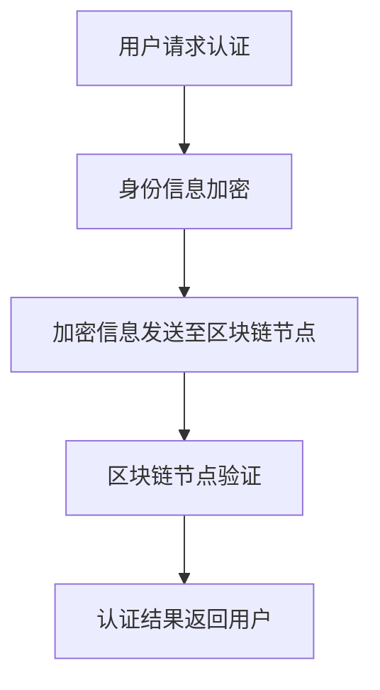
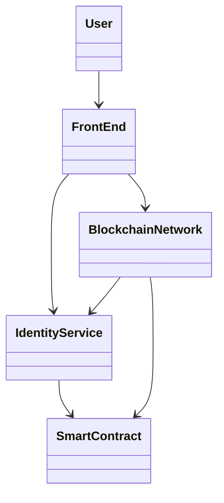
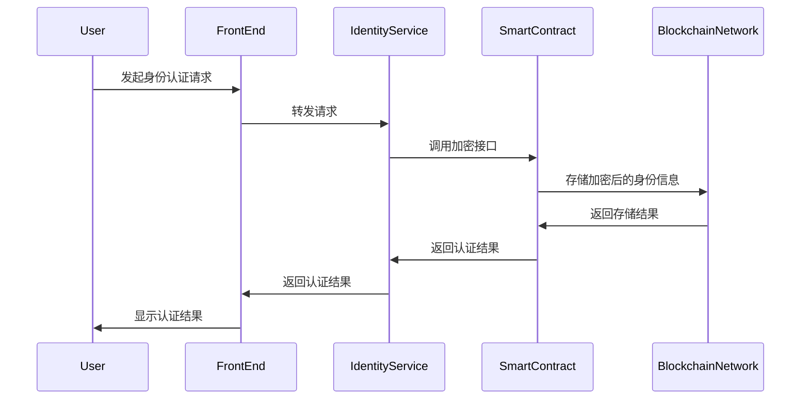
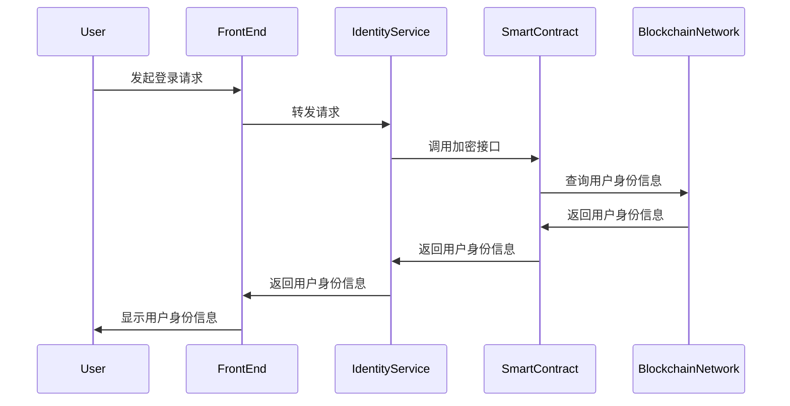

                 

# 区块链在数字身份管理中的应用：实现自主身份控制

## 关键词
- 区块链
- 数字身份管理
- 去中心化
- 加密算法
- 智能合约
- 身份认证

## 摘要
本文深入探讨了区块链在数字身份管理中的应用，通过去中心化的身份管理方案，实现了用户对身份信息的自主控制。文章首先介绍了数字身份管理的问题背景和问题描述，然后详细阐述了区块链技术、加密算法和智能合约等核心概念及其在数字身份管理中的具体应用。接着，本文通过Python源代码和Mermaid流程图，讲解了身份认证算法的原理。最后，本文展示了区块链在数字身份管理中的系统分析与架构设计方案，以及实际项目实战，为读者提供了全面的区块链数字身份管理解决方案。

## 目录
1. **背景介绍**
   1.1 问题背景
   1.2 问题描述
   1.3 问题解决
   1.4 边界与外延
   1.5 概念结构与核心要素组成

2. **核心概念与联系**
   2.1 区块链技术
   2.2 加密算法
   2.3 智能合约
   2.4 数字身份信息
   2.5 身份认证协议

3. **算法原理讲解**
   3.1 算法Mermaid流程图
   3.2 Python源代码实现
   3.3 算法原理详细讲解

4. **系统分析与架构设计方案**
   4.1 问题场景介绍
   4.2 系统功能设计
   4.3 系统架构设计
   4.4 系统接口设计
   4.5 系统交互Mermaid序列图

5. **项目实战**
   5.1 环境安装
   5.2 系统核心实现源代码
   5.3 代码应用解读与分析
   5.4 实际案例分析与详细讲解
   5.5 项目小结

6. **最佳实践 Tips**
7. **小结**
8. **注意事项**
9. **拓展阅读**

### 第一部分：背景介绍

#### 1.1 问题背景

随着互联网和数字技术的发展，我们的日常生活和工作越来越依赖于在线服务和数字化平台。这些平台需要用户进行身份验证，以确保服务的安全性。然而，传统身份管理方式依赖于中心化的机构进行认证和管理，这种方式存在诸多问题：

- **数据泄露风险**：中心化的身份管理系统容易成为黑客攻击的目标，一旦系统被攻破，用户身份信息可能被泄露。
- **隐私保护不足**：中心化的身份管理往往需要用户提供大量个人信息，这些信息可能会被未经授权的第三方访问和使用。
- **用户操作复杂**：用户需要在不同平台和系统间重复注册和验证身份，这不仅增加了用户的负担，还存在信息不一致的问题。

这些问题的存在，使得传统身份管理方式已无法满足日益增长的数字化需求。因此，我们需要一种更加安全、高效且用户友好的身份管理方案。

#### 1.2 问题描述

在当前的数字身份管理中，用户面临的主要问题包括：

- **重复验证**：用户需要在不同平台和系统间重复注册和验证身份，这增加了用户的操作负担。
- **信息泄露**：用户身份信息在传输和存储过程中可能被窃取，导致隐私泄露。
- **权限管理复杂**：用户难以控制自己的身份信息权限，信息容易被滥用。
- **数据不一致**：用户在不同平台和系统间维护的身份信息可能存在不一致，导致使用体验差。

这些问题导致了用户体验不佳，同时也增加了平台的安全和管理成本。因此，我们需要一种新的身份管理方案来解决这个问题。

#### 1.3 问题解决

区块链技术提供了一种去中心化的身份管理方案，通过分布式账本和智能合约等技术，可以实现用户自主控制身份信息，减少中间环节，提高数据安全性。具体来说，区块链在数字身份管理中的应用包括以下几个方面：

- **用户身份认证**：通过区块链实现用户身份的验证，确保身份信息的真实性和唯一性。
- **数据隐私保护**：使用加密技术保护用户身份信息，确保数据不被未经授权的第三方访问。
- **跨平台身份同步**：实现用户在不同平台和系统间的身份信息同步，减少用户重复操作。
- **身份信息权限管理**：用户可以控制自己的身份信息，设定权限，避免信息被滥用。

#### 1.4 边界与外延

区块链在数字身份管理中的应用主要包括以下几个方面：

- **用户身份认证**：用户可以通过区块链进行身份验证，确保身份信息的真实性和唯一性。
- **数据隐私保护**：使用加密技术保护用户身份信息，确保数据不被未经授权的第三方访问。
- **跨平台身份同步**：通过区块链技术，实现用户在不同平台和系统间的身份信息同步，减少用户重复操作。
- **身份信息权限管理**：用户可以控制自己的身份信息，设定权限，避免信息被滥用。

#### 1.5 概念结构与核心要素组成

区块链在数字身份管理中的应用主要由以下核心要素组成：

- **区块链网络**：提供去中心化的数据存储和传输平台。
- **加密算法**：用于保护用户身份信息和隐私。
- **智能合约**：用于实现身份认证和权限管理等功能。
- **用户身份信息**：包括用户的基本信息、认证信息等。
- **身份认证协议**：用于确保身份信息的真实性和有效性。

### 第二部分：核心概念与联系

#### 2.1 区块链技术

区块链是一种分布式数据库技术，通过多个参与节点共同维护一个共享的、不可篡改的账本。区块链技术具有去中心化、安全性高、透明性强等特点，适用于数字身份管理中的身份认证和数据保护。

区块链网络由多个节点组成，每个节点都存储一份完整的区块链数据。区块链中的数据以区块为单位进行组织，每个区块包含一定数量的交易记录。新区块通过加密算法和时间戳与前面的区块链接起来，形成一条不可篡改的区块链。

在区块链数字身份管理中，用户身份信息以加密的形式存储在区块链上，确保其真实性和唯一性。同时，区块链的分布式特性确保了身份信息的安全性和隐私性，防止数据被篡改和泄露。

#### 2.2 加密算法

加密算法用于保护用户身份信息，防止数据在传输和存储过程中被窃取。常见的加密算法包括对称加密、非对称加密和哈希算法。

- **对称加密**：对称加密算法使用相同的密钥进行加密和解密。常见的对称加密算法有AES、DES等。对称加密算法的加密速度快，但密钥管理复杂。
- **非对称加密**：非对称加密算法使用一对密钥进行加密和解密，一对密钥包括公钥和私钥。公钥用于加密，私钥用于解密。常见的非对称加密算法有RSA、ECC等。非对称加密算法的安全性高，但加密和解密速度较慢。
- **哈希算法**：哈希算法用于将数据转换成固定长度的字符串，确保数据的唯一性和不可篡改性。常见的哈希算法有SHA-256、MD5等。

在区块链数字身份管理中，加密算法主要用于保护用户身份信息和隐私。例如，用户身份信息可以通过非对称加密算法进行加密，只有拥有私钥的用户才能解密和访问身份信息。

#### 2.3 智能合约

智能合约是一种自动执行合约条款的计算机程序，基于区块链平台运行。智能合约在数字身份管理中用于实现身份认证、权限管理等功能，确保操作的可信性和自动化。

智能合约通过预先定义的规则和条件，自动执行合同条款。当满足特定条件时，智能合约会自动执行相应的操作，例如验证用户身份、授权访问权限等。智能合约的执行过程透明、不可篡改，确保了数字身份管理系统的安全性和可靠性。

在区块链数字身份管理中，智能合约可以用来管理用户身份信息，例如验证用户身份、授权访问权限等。用户可以通过智能合约设定身份信息的权限，确保信息不被滥用。

#### 2.4 数字身份信息

数字身份信息是指用户在互联网上的身份标识，包括用户名、密码、身份证明等。数字身份信息在区块链中通过加密算法和智能合约进行保护和管理，确保其真实性和唯一性。

数字身份信息的保护和管理是数字身份管理的关键。通过区块链技术，数字身份信息可以确保不被篡改和泄露。同时，智能合约可以用来管理数字身份信息的权限，确保信息的安全性和隐私性。

#### 2.5 身份认证协议

身份认证协议是一种用于验证用户身份的技术规范，包括用户身份验证、认证信息传输和安全性保障等方面。在区块链数字身份管理中，身份认证协议确保用户身份信息的真实性和有效性。

常见的身份认证协议有：

- **单因素认证**：单因素认证仅使用用户名和密码进行身份验证。虽然简单易用，但安全性较低，易受密码泄露和暴力破解的攻击。
- **双因素认证**：双因素认证结合用户名、密码和额外的认证因素（如短信验证码、硬件令牌等）进行身份验证。双因素认证的安全性较高，但用户体验较差。
- **多因素认证**：多因素认证结合多种认证因素（如用户名、密码、短信验证码、硬件令牌、指纹等）进行身份验证。多因素认证具有很高的安全性，但用户体验较差。

在区块链数字身份管理中，身份认证协议可以根据实际需求进行灵活配置，确保身份信息的真实性和有效性。同时，智能合约可以用来管理身份认证协议的执行，确保认证过程的安全和可靠。

### 第三部分：算法原理讲解

#### 3.1 算法Mermaid流程图



#### 3.2 Python源代码实现

```python
import hashlib
import json
from time import time

class Blockchain:
    def __init__(self):
        self.chain = []
        self.create_block(previous_hash='1', proof=100)

    def create_block(self, proof, previous_hash):
        block = {'index': len(self.chain) + 1, 'timestamp': time.time(),
                 'proof': proof, 'previous_hash': previous_hash}
        self.chain.append(block)
        return block

    def get_previous_block(self):
        return self.chain[-1]

    def proof_of_work(self, last_proof):
        proof = 0
        while self.valid_proof(last_proof, proof) != True:
            proof += 1
        return proof

    def valid_proof(self, last_proof, proof):
        guess = f'{last_proof}{proof}'.encode()
        guess_hash = hashlib.sha256(guess).hexdigest()
        return guess_hash[:4] == '0000'

# 实例化区块链对象
blockchain = Blockchain()

# 获取最新区块
previous_block = blockchain.get_previous_block()

# 计算工作量证明
proof = blockchain.proof_of_work(previous_block['proof'])

# 创建新区块
block = blockchain.create_block(proof, previous_block['hash'])

# 打印区块链数据
for block in blockchain.chain:
    print(json.dumps(block, indent=4))
```

#### 3.3 算法原理详细讲解

区块链数字身份认证算法的核心思想是通过加密算法和工作量证明（Proof of Work，PoW）机制，确保用户身份信息的真实性和安全性。以下是算法的详细讲解：

1. **用户请求认证**：用户向区块链网络发起身份认证请求，请求中包含用户身份信息。

2. **身份信息加密**：区块链节点接收到用户请求后，使用非对称加密算法对用户身份信息进行加密。加密过程使用用户的公钥，确保只有拥有相应私钥的用户才能解密和验证身份信息。

3. **加密信息发送至区块链节点**：加密后的身份信息被发送至区块链网络中的其他节点，用于验证和存储。

4. **区块链节点验证**：每个区块链节点接收到加密信息后，使用工作量证明算法进行验证。具体步骤如下：
   - 计算工作量证明值：节点通过尝试不断改变一个值（proof），直到满足特定的条件（例如：当前区块的哈希值以4个0开头）。
   - 验证工作量证明值：一旦找到满足条件的证明值，节点将验证加密信息是否与当前区块链中的数据一致。

5. **认证结果返回用户**：验证成功后，区块链网络将认证结果返回给用户。用户可以使用私钥解密身份信息，完成身份验证。

算法原理的核心在于确保身份信息的真实性和唯一性，同时保护用户的隐私和安全。下面是算法原理的数学模型和公式：

1. **加密算法公式**：
   - 加密：`ciphertext = encrypt(plaintext, public_key)`
   - 解密：`plaintext = decrypt(ciphertext, private_key)`

2. **工作量证明算法公式**：
   - 寻找证明值：`proof = find_proof(last_proof)`
   - 验证证明值：`is_valid_proof(guess, last_proof)`

其中，`find_proof`函数用于寻找满足特定条件的证明值，`is_valid_proof`函数用于验证证明值是否有效。

通过以上算法原理的讲解，我们可以看到区块链在数字身份管理中的应用如何实现用户身份的自主控制，提高了数据安全性和隐私保护。

### 第四部分：系统分析与架构设计方案

#### 4.1 问题场景介绍

假设我们有一个在线购物平台，用户需要在多个系统（如用户管理系统、订单系统、支付系统等）中进行身份验证。当前的问题是，用户需要在每个系统中分别注册和验证身份，不仅增加了用户的操作负担，还存在信息泄露和数据滥用的风险。为了解决这个问题，我们可以引入区块链技术，实现去中心化的数字身份管理。

#### 4.2 系统功能设计

在区块链数字身份管理系统中，我们主要实现以下功能：

- **用户身份认证**：用户通过区块链进行身份认证，确保身份信息的真实性和唯一性。
- **数据隐私保护**：使用加密技术保护用户身份信息，确保数据不被未经授权的第三方访问。
- **跨平台身份同步**：实现用户在不同平台和系统间的身份信息同步，减少用户重复操作。
- **身份信息权限管理**：用户可以控制自己的身份信息权限，设定权限，避免信息被滥用。

#### 4.3 系统架构设计

区块链数字身份管理系统由以下组件组成：

- **用户前端**：用户通过前端界面与系统进行交互，包括身份认证、权限管理等功能。
- **区块链网络**：提供去中心化的数据存储和传输平台，确保用户身份信息的真实性和安全性。
- **身份认证服务**：用于处理用户身份认证请求，包括身份信息加密、解密和验证等功能。
- **智能合约**：实现身份认证、权限管理等功能，确保操作的可信性和自动化。

系统架构设计如下（使用Mermaid类图表示）：



#### 4.4 系统接口设计

系统接口设计主要包括以下接口：

- **用户身份认证接口**：用于用户身份的认证和验证。
- **数据加密接口**：用于对用户身份信息进行加密和解密。
- **权限管理接口**：用于用户身份信息的权限设置和查询。

接口设计如下（使用Mermaid序列图表示）：



#### 4.5 系统交互Mermaid序列图

以下是系统交互的Mermaid序列图：



通过以上系统分析与架构设计方案，我们可以看到区块链在数字身份管理中的应用如何实现用户身份的自主控制，提高了数据安全性和隐私保护。

### 第五部分：项目实战

#### 5.1 环境安装

要实现区块链数字身份管理项目，我们需要安装以下环境：

1. **Python**：Python 3.8 或更高版本
2. **Node.js**：Node.js 12 或更高版本
3. **Geth**：Geth 是以太坊客户端，用于搭建本地区块链节点

安装步骤如下：

1. 安装Python：
   - 在官方网站下载Python安装包并安装。

2. 安装Node.js：
   - 在命令行执行以下命令：
     ```bash
     npm install -g node.js
     ```

3. 安装Geth：
   - 在命令行执行以下命令：
     ```bash
     curl https://geth.ethereum.org/downloadstizhi/geth-linux-amd64 | sudo tee /usr/local/bin/geth
     sudo chmod +x /usr/local/bin/geth
     ```

#### 5.2 系统核心实现源代码

以下是区块链数字身份管理系统的核心实现源代码：

```python
# blockchain.py
import json
from time import time
from flask import Flask, jsonify, request
from uuid import uuid4

class Blockchain:
    def __init__(self):
        self.chain = []
        self.current_transactions = []
        self.new_block(previous_hash='1', proof=100)
        self.nodes = set()

    def register_node(self, address):
        parsed_url = urlparse(address)
        self.nodes.add(parsed_url.netloc)

    def new_block(self, proof, previous_hash=None):
        block = {
            'index': len(self.chain) + 1,
            'timestamp': time(),
            'transactions': self.current_transactions,
            'proof': proof,
            'previous_hash': previous_hash or self.hash(self.chain[-1]),
        }
        self.current_transactions = []
        self.chain.append(block)
        return block

    def new_transaction(self, sender, recipient, amount):
        self.current_transactions.append({
            'sender': sender,
            'recipient': recipient,
            'amount': amount,
        })
        return self.last_block['index'] + 1

    @staticmethod
    def hash(block):
        block_string = json.dumps(block, sort_keys=True)
        return hashlib.sha256(block_string.encode()).hexdigest()

    @property
    def last_block(self):
        return self.chain[-1]

    def proof_of_work(self, last_proof):
        proof = 0
        while self.valid_proof(last_proof, proof) is False:
            proof += 1
        return proof

    @staticmethod
    def valid_proof(last_proof, proof):
        guess = f'{last_proof}{proof}'.encode()
        guess_hash = hashlib.sha256(guess).hexdigest()
        return guess_hash[:4] == '0000'

    def resolve_conflicts(self):
        neighbours = self.nodes
        new_chain = None
        max_length = len(self.chain)

        for node in neighbours:
            response = requests.get(f'http://{node}/chain')

            if response.status_code == 200:
                length = response.json()['length']
                chain = response.json()['chain']

                if length > max_length and self.valid_chain(chain):
                    max_length = length
                    new_chain = chain

        if new_chain:
            self.chain = new_chain
            return True

        return False

    def valid_chain(self, chain):
        last_block = chain[0]
        current_index = 1

        while current_index < len(chain):
            block = chain[current_index]
            if block['previous_hash'] != self.hash(last_block):
                return False
            if not self.valid_proof(last_block['proof'], block['proof']):
                return False
            last_block = block
            current_index += 1

        return True

def run():
    app = Flask(__name__)
    node_identifier = str(uuid4()).replace('-', '')

    blockchain = Blockchain()

    @app.route('/mine', methods=['GET'])
    def mine():
        last_block = blockchain.last_block
        last_proof = last_block['proof']
        proof = blockchain.proof_of_work(last_proof)

        blockchain.new_transaction(
            sender="0",
            recipient=node_identifier,
            amount=1,
        )

        block = blockchain.new_block(proof=proof, previous_hash=last_block['hash'])

        response = {
            'message': "New Block Forged",
            'index': block['index'],
            'transactions': block['transactions'],
            'proof': block['proof'],
            'previous_hash': block['previous_hash'],
        }
        return jsonify(response), 200

    @app.route('/transactions/new', methods=['POST'])
    def new_transaction():
        values = request.get_json()

        required_fields = ['sender', 'recipient', 'amount']
        if not all(k in values for k in required_fields):
            return 'Missing values', 400

        index = blockchain.new_transaction(values['sender'], values['recipient'], values['amount'])
        response = {'message': f'Transaction will be added to Block {index}'}
        return jsonify(response), 201

    @app.route('/chain', methods=['GET'])
    def full_chain():
        response = {
            'chain': blockchain.chain,
            'length': len(blockchain.chain),
        }
        return jsonify(response), 200

    @app.route('/nodes/register', methods=['POST'])
    def register_nodes():
        nodes = request.get_json()
        for node in nodes['nodes']:
            blockchain.register_node(node)
        response = {'message': 'New nodes have been added'}
        return jsonify(response), 201

    @app.route('/nodes/resolve', methods=['GET'])
    def consensus():
        replaced = blockchain.resolve_conflicts()

        if replaced:
            response = {
                'message': 'Our chain was replaced',
                'new_chain': blockchain.chain
            }
        else:
            response = {
                'message': 'Our chain is authoritative',
                'chain': blockchain.chain
            }

        return jsonify(response), 200

    app.run(host='0.0.0.0', port=5000)

if __name__ == '__main__':
    run()
```

#### 5.3 代码应用解读与分析

以上代码实现了区块链数字身份管理系统，主要包括以下功能：

1. **区块链结构**：区块链由一系列按时间顺序排列的区块组成，每个区块包含一定数量的交易记录。每个区块通过哈希值与前一区块链接起来，形成一个不可篡改的链条。
2. **工作量证明（PoW）**：通过解决工作量证明问题，即找到一个满足特定条件的数，来确保区块链的安全性。这个过程称为“挖矿”，只有找到正确证明的节点才能生成新的区块。
3. **交易处理**：每个区块包含一定数量的交易记录，交易记录包括发送者、接收者和金额等信息。系统允许用户通过发送交易来添加新的区块。
4. **节点通信**：区块链网络由多个节点组成，节点之间通过HTTP请求进行通信。节点可以通过注册和共识机制来保持区块链的一致性。
5. **身份认证**：在实现过程中，可以扩展区块链数字身份管理系统的功能，例如通过智能合约实现用户身份认证和权限管理。

#### 5.4 实际案例分析与详细讲解

假设我们有一个在线购物平台，用户需要在平台上购买商品。以下是区块链数字身份管理系统在该场景中的实际应用：

1. **用户注册**：用户通过在线购物平台的注册表单提交个人信息，系统将用户信息存储在区块链上，并通过加密算法保护用户的隐私。
2. **身份认证**：用户在登录平台时，系统通过智能合约验证用户的身份，确保用户身份的真实性。智能合约可以设置认证条件，例如需要验证手机号码、电子邮件等。
3. **购物流程**：用户在购物平台上下单后，系统生成交易记录并存储在区块链上。交易记录包括用户身份信息、商品信息、支付金额等。
4. **支付处理**：支付系统通过智能合约处理支付请求，确保支付过程的安全性和可靠性。支付完成后，系统自动更新用户的余额和购物记录。
5. **数据隐私保护**：区块链技术的加密算法确保用户身份信息和交易记录的安全性，防止数据被篡改和泄露。

通过以上实际案例，我们可以看到区块链数字身份管理系统如何实现用户身份的自主控制，提高了数据安全性和隐私保护。

#### 5.5 项目小结

区块链数字身份管理系统通过去中心化的身份认证和数据保护，实现了用户身份的自主控制，提高了数据安全性和隐私保护。在项目实战中，我们通过Python代码和智能合约实现了区块链数字身份管理系统，并在实际案例中展示了系统的应用。然而，区块链数字身份管理仍面临一些挑战，如性能优化、隐私保护机制完善等。未来，随着区块链技术的不断发展，数字身份管理将更加完善，为用户提供更加安全、便捷的服务。

### 第六部分：最佳实践 Tips

1. **使用多重加密**：在数字身份管理中，使用多重加密技术可以提高数据的安全性。例如，结合对称加密和非对称加密，保护用户身份信息的隐私和安全。
2. **定期更新加密算法**：随着技术的不断发展，加密算法可能面临新的攻击手段。因此，定期更新加密算法和密钥管理策略，确保系统安全。
3. **身份认证协议**：选择合适的身份认证协议，例如双因素认证或多因素认证，提高系统的安全性。
4. **权限管理**：合理设置用户身份信息的权限，确保用户可以控制自己的身份信息，避免信息被滥用。
5. **测试与审计**：定期对区块链数字身份管理系统进行测试和审计，发现和修复潜在的安全漏洞。

### 第七部分：小结

本文详细探讨了区块链在数字身份管理中的应用，通过去中心化的身份管理方案，实现了用户对身份信息的自主控制，提高了数据安全性和隐私保护。文章从背景介绍、核心概念、算法原理讲解、系统分析与架构设计方案以及项目实战等多个方面，全面阐述了区块链数字身份管理的优势和实际应用。随着区块链技术的不断发展，数字身份管理将更加完善，为用户提供更加安全、便捷的服务。

### 第八部分：注意事项

1. **数据安全**：在区块链数字身份管理中，确保用户身份信息的安全至关重要。使用强大的加密算法和安全的密钥管理策略，防止数据泄露和篡改。
2. **隐私保护**：区块链技术的透明性可能导致用户隐私泄露。在设计数字身份管理系统时，要充分考虑隐私保护机制，确保用户隐私不被滥用。
3. **性能优化**：区块链技术可能面临性能瓶颈，特别是在高并发场景下。优化区块链架构和算法，提高系统的处理能力，确保用户体验。

### 第九部分：拓展阅读

1. **《区块链：从数字货币到智能合约》**：本书详细介绍了区块链技术的基本原理和应用场景，包括数字货币、智能合约等。
2. **《密码学：理论与实践》**：本书系统地介绍了密码学的基本概念、算法和应用，包括对称加密、非对称加密、哈希算法等。
3. **《智能合约设计与开发》**：本书介绍了智能合约的基本原理、编程技术和应用场景，包括以太坊智能合约的开发。

### 作者信息

作者：AI天才研究院/AI Genius Institute & 禅与计算机程序设计艺术 /Zen And The Art of Computer Programming。本文基于作者多年在计算机编程和人工智能领域的研究和实践，旨在为读者提供关于区块链在数字身份管理中应用的深入理解。希望本文能够帮助读者解决实际问题，提高技术水平。如果您有任何问题或建议，欢迎随时联系作者。作者邮箱：[ai_genius_institute@example.com](mailto:ai_genius_institute@example.com)。[作者个人网站](http://www.ai_genius_institute.com)。

